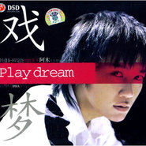

戏梦Play Dream
============================

|  |  |
| :--: | :-- |
| [ 戏梦Play Dream](https://emumo.xiami.com/album/31) | **艺人**: [阿木](../index.md) **语种**: 国语 **唱片公司**: 俏佳人 **发行时间**: 2007年03月19日 **专辑类别**: 录音室专辑 **专辑风格**: 国语流行 Mandarin Pop **播放数**: 911810 **收藏数**: 66 **评论数**: 4  |

## 简介

&nbsp;

## 曲目

- [隐形的翅膀原唱: 张韶涵](./31/Cnb1f09.md)
- [香水有毒原唱: 胡杨林](./31/wg94b6f.md)
- [爱情复兴原唱: 杨蔓](./31/bEL51865.md)
- [爸爸妈妈原唱: 王蓉](./31/wi51026.md)
- [戏梦原唱: 林志颖](./31/wj8877d.md)
- [曾经最美原唱: 朱铭捷](./31/wk5985c.md)
- [一直很安静原唱: 阿桑](./31/S1e8d71.md)
- [上海滩原唱: 叶丽仪](./31/bUY3bcc2.md)
- [紫藤花原唱: S.H.E](./31/wn6bd6b.md)
- [一剪梅原唱: 费玉清](./31/S41a255.md)
- [如果没有你原唱: 莫文蔚](./31/clj3f7e3.md)
- [不要用我的爱来伤害我原唱: 韩晶](./31/biE22d49.md)

## 评论

|  |  |  |  |
| :-- | :-- | :-- | :-- |
|  [虾米用户](https://emumo.xiami.com/u/197632272)  2016-11-15 15:57 赞(0) 踩(0) | 
1115
 |
|  [虾米用户](https://emumo.xiami.com/u/1871583) 听最新粤语歌，欢迎加入8... 2015-08-23 18:30 赞(1) 踩(0) | 
林志颖的戏梦只有他翻唱，希望以后还有女生翻唱。
 |
|  [虾米用户](https://emumo.xiami.com/u/5170614)  2011-09-29 20:11 赞(0) 踩(0) | 
你是我的偶像
 |
|  [虾米用户](https://emumo.xiami.com/u/1342581)  2011-01-16 15:35 赞(0) 踩(0) | 
阿木的女声歌曲翻唱...
 |
