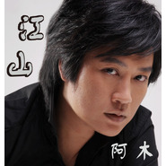

江山
============================

|  |  |
| :--: | :-- |
| [ 江山](https://emumo.xiami.com/album/380519) | **艺人**: [阿木](../index.md) **语种**: 国语 **唱片公司**: 美乐文化 **发行时间**: 2010年03月22日 **专辑类别**: EP, 单曲 **专辑风格**:  **播放数**: 28629 **收藏数**: 4 **评论数**: 0  |

## 简介

国内新生代领军歌手阿木，推出了为2010年国内最华丽PK网游《大明龙权》全新制作的主题曲《江山》。阿木此番演唱的网游歌曲与以往木式情歌的悲情风格截然不同，论乾坤、叹江湖、颂英雄，尽显铁血豪情。  
阿木勇于突破自我，不断挑战尝新的精神一直深深打动着每一位喜爱他的歌迷，不论是外形还是歌曲风格上总带给大家不一样的体验，而这与《大明龙权》颠覆传统网游题材、诠释PK真谛的概念之不谋而合。  
对于大部分年轻游戏玩家来说，“阿木”这个名字并不陌生。他以一曲《有一种爱叫做放手》都市男女话题性情歌俘获了众多歌迷，创造了无线销量奇迹。随即又推出了木式情歌《爱在现实面前》《不该爱的人》，在完成自己的“悲情三部曲”后，阿木以为热门网游献唱主题曲的方式再度成为舆论的焦点。  
据素有“中国游戏音乐第一人”之称的该歌作者罗晓音先生介绍，他们当时考虑了林俊杰、张杰、胡彦斌很多男歌手，最后认为阿木高亢壮丽的音色最适合演绎这种带有武侠浪漫色彩的歌曲。  
  
 

## 曲目

- [江山](./380519/8GbD5Fec957.md)

## 评论

