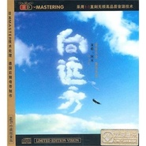

向远方
============================

|  |  |
| :--: | :-- |
| [ 向远方](https://emumo.xiami.com/album/412042) | **艺人**: [阿木](../index.md) **语种**: 国语 **唱片公司**: 龙源音乐 **发行时间**: 2010年01月01日 **专辑类别**: 录音室专辑 **专辑风格**:  **播放数**: 150415 **收藏数**: 29 **评论数**: 3  |

## 简介

HD-MASTERING 采用1:1直刻无损高品质音源技术  
日本MASTERING技术处理，德国后期母带制作。

## 曲目

- [向远方](./412042/bf0uhlC2eef9.md)
- [雄鹰](./412042/JAOj831e4af.md)
- [神香](./412042/xLslVu15f39.md)
- [空船](./412042/mQ7ngL9d087.md)
- [鸿雁](./412042/mQ7ngM7c060.md)
- [梦回西藏](./412042/xLslVxde338.md)
- [母亲的草原](./412042/mQ7ngO66328.md)
- [通往天路的哈达](./412042/U59ixj26dfa.md)
- [锡林河](./412042/mQ7ngQ8c45f.md)
- [草原在哪里](./412042/xLslV114e99.md)
- [弦子的传说](./412042/8GdkKcea298.md)
- [龙图腾](./412042/b1pQeOX42958.md)

## 评论

|  |  |  |  |
| :-- | :-- | :-- | :-- |
|  [虾米用户](https://emumo.xiami.com/u/243279869)  2019-06-01 16:27 赞(0) 踩(0) | 
我在声乐课上学来的，越听越好听。听到这歌就又回到草原。
 |
|  [虾米用户](https://emumo.xiami.com/u/8337431) 以乐会友 2019-04-09 02:37 赞(0) 踩(0) | 
2
 |
|  [虾米用户](https://emumo.xiami.com/u/296069) 暂无签名~ 2015-01-16 22:34 赞(0) 踩(0) | 
这张砖不是男歌手阿木的，是女歌手阿木古楞的，能不能给分开啊
 |
