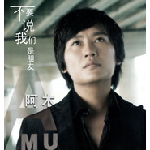

不要说我们是朋友
============================

|  |  |
| :--: | :-- |
| [ 不要说我们是朋友](https://emumo.xiami.com/album/412783) | **艺人**: [阿木](../index.md) **语种**: 国语 **唱片公司**: 美乐文化 **发行时间**: 2010年11月23日 **专辑类别**: EP, 单曲 **专辑风格**:  **播放数**: 12902 **收藏数**: 8 **评论数**: 2  |

## 简介

有人说，如果分手的时候可以轻易说出“我们还是朋友”，证明他没有深爱过。  
阿木在《不要说我们是朋友》这首新歌里，就向大家展示出一个深爱过的男人，在面对一段刚结束的感情时最真实的心声。

## 曲目

- [不要说我们是朋友](./412783/mQ7pjw965cc.md)

## 评论

|  |  |  |
| :-- | :-- | :-- |
|  [虾米用户](https://emumo.xiami.com/u/5170614)  2011-10-10 18:44 赞(0) 踩(0) | 
我爱你我的偶像
 |
|  [虾米用户](https://emumo.xiami.com/u/1342581)  2011-01-28 20:16 赞(0) 踩(0) | 
阿木单曲
 |
