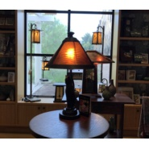

刘瀚聪
============================

|  |  |
| :--: | :-- |
| [ 刘瀚聪](https://i.xiami.com/wxmusic0819) | **播放数**: 17767558 **粉丝数**: 752 **评论数**: 46 **地区**: China 中国大陆 **风格**: 原声 Soundtrack, 电视原声 Television Music  |

## 档案

刘瀚聪 ，内地音乐制作人，音乐创作以影视音乐为主。    合作的著名导演： 赵宝刚，刘心刚，侣浩吉吉，王迎，汪俊，郑桦，王小帅，杨文军，谢律等著名导演。  代表作︰（影视作曲，配乐，编曲）       电视剧《老有所依》《男人帮》 《夫妻那些事》 《青年医生》 《青瓷》              《舞者》 《孙子大传》 《云上的诱惑》 《金牌律师》 《忠者无敌》             《定制幸福》 《深海利剑》 电影《玉米人》 《在一起》等。  代表作：（原创歌曲）  雷佳《丰碑》，张碧晨《一吻之间》，张赫宣《抱你入怀》《我说兄弟啊》，    周晓鸥《让爱从头》   孙楠 / 景甜《一世英雄》，孙悦《遥望》，张瑶《独舞》宣萱《如果有爱就要对我说》等…

## 专辑

| 名称 | 语种 | 唱片公司 | 发行时间 | 专辑类别 | 专辑风格 |
| :--: | :-- | :-- | :-- | :-- | :-- |
| [ 《Who Knows》](./albums/2105814155.md) | 国语 | 独立发行 | 2020年02月04日 | 录音室专辑 | 流行 Pop |
| [ 这样爱你的我](./albums/2105269893.md) | 国语 | 淳music | 2019年09月26日 | EP, 单曲 |  |
| [ 青瓷 电视原声带](./albums/1716644476.md) | 国语 | 闪闪空间文化 | 2018年07月18日 | 原声带, 影视音乐 | 流行 Pop |
| [ 《开封府传奇》音乐原声带](./albums/2103823442.md) | 国语 | 独立发行 | 2018年07月17日 | 录音室专辑 | 流行 Pop |
| [ 《小米加步枪》刘瀚聪](./albums/2103810495.md) | 国语 | 独立发行 | 2018年07月16日 | 录音室专辑 | 流行 Pop |
| [ 深海利剑  音乐原声带作曲：刘瀚聪](./albums/2102805522.md) | 国语 | 独立发行 | 2017年07月27日 | 原声带, 影视音乐 | 流行 Pop |
| [ 青年医生 电视原声带](./albums/1815839535.md) | 国语 | 鑫宝源影视 | 2014年11月28日 | 原声带, 影视音乐 | 原声 Soundtrack, 电视原声 Television Music |
| [ 金牌律师 电视原声带](./albums/1203870555.md) | 国语 | 闪闪空间文化 | 2014年06月27日 | 原声带, 影视音乐 | 原声 Soundtrack, 电视原声 Television Music |
| [ 云上的诱惑 电视原声带](./albums/702975597.md) | 国语 | 闪闪空间文化 | 2013年04月13日 | 原声带, 影视音乐 | 流行 Pop |
| [ 男人帮 电视剧原声带](./albums/477544.md) | 其他 | 鑫宝源影视 | 2011年11月07日 | 原声带, 影视音乐 | 原声 Soundtrack, 电视原声 Television Music |

## 评论

|  |  |  |  |
| :-- | :-- | :-- | :-- |
|  [虾米用户](https://emumo.xiami.com/u/29184637) 这家伙很聪明什么也没留下... 2020-05-20 19:44 赞(0) 踩(0) | 
好的艺术家坚持好的风格已经很少了，感谢
 |
|  [虾米用户](https://emumo.xiami.com/u/441626827)  2020-04-11 20:09 赞(0) 踩(0) | 
找了好久这个，喜欢
 |
|  [虾米用户](https://emumo.xiami.com/u/49262349)   2020-02-24 16:48 赞(0) 踩(0) | 
刘瀚聪的作品非常的棒！他的旋律节奏无人替代！听他的作品就是一种享受！   
 |
|  [虾米用户](https://emumo.xiami.com/u/32231879) Eine kosmisc... 2019-06-12 23:55 赞(0) 踩(0) | 
略
 |
|  [虾米用户](https://emumo.xiami.com/u/419745496)  2019-03-01 11:59 赞(0) 踩(0) | 
喜欢
 |
|  [虾米用户](https://emumo.xiami.com/u/377059072)  2019-01-28 23:25 赞(0) 踩(0) | 
刘瀚聪的音乐与众不同，特别喜欢我心依旧
 |
|  [虾米用户](https://emumo.xiami.com/u/360618963)  2019-01-15 02:34 赞(3) 踩(0) | 
手風琴是我在小学很懷念的樂器，陳老師會鼓励同學們自由創作歌曲，很棒的音乐老師，想他，留兩撇小胡子的陳老師
 |
|  [虾米用户](https://emumo.xiami.com/u/277957297) 有你就好…… 2018-08-17 06:53 赞(0) 踩(0) | 
云端上的一颗星，刘瀚聪加油&amp;hellip;&amp;hellip;
 |
| ⇒ |  [虾米用户](https://emumo.xiami.com/u/250598629) 华语歌坛著名影视音乐与歌... 2018-08-17 15:07 赞(0) 踩(0) | 
谢谢 
 |
|  [虾米用户](https://emumo.xiami.com/u/401131638)  2018-08-10 23:21 赞(0) 踩(0) | 
您好，想问一下在《开封府》电视剧里面，有一首插曲是什么曲，在哪里可以听得到？每次听到的时候都能听到一个沧桑而浩然的声音在哼，不唱，很有感染力
 |
|  [虾米用户](https://emumo.xiami.com/u/32799570)  2018-08-01 16:52 赞(1) 踩(0) | 
求《开封府》背景哼唱片段，包拯宣读铡陈世美圣旨时
 |
|  [虾米用户](https://emumo.xiami.com/u/5895874)  2017-12-04 22:58 赞(4) 踩(0) | 
国内原创音乐需要这样的人来支撑
 |
|  [虾米用户](https://emumo.xiami.com/u/25754467)  2017-10-28 00:45 赞(4) 踩(0) | 
从云上的诱惑、到青瓷、到男人帮，不同音乐风格都有让人心动的作品，没有矫揉造作，只有心灵的共鸣，这样的音乐在大陆是少见的。
 |
| ⇒ |  [虾米用户](https://emumo.xiami.com/u/250598629) 华语歌坛著名影视音乐与歌... 2018-06-10 23:55 赞(0) 踩(0) | 
谢谢 
 |
|  [虾米用户](https://emumo.xiami.com/u/290194030)  2017-09-09 18:05 赞(1) 踩(0) | 
开头的音乐就蛮吸引人了
 |
|  [虾米用户](https://emumo.xiami.com/u/190681633) 我还没想好要写什么... 2017-09-07 16:50 赞(0) 踩(0) | 
求爱情3，钢琴原声带
 |
|  [虾米用户](https://emumo.xiami.com/u/322051914)  2017-09-03 03:11 赞(0) 踩(0) | 
你好，我想知道深海利剑里面有一首歌，我们好多人都不知道叫什么名字？能告知一下我们吗？就是第二十八集里面的插曲
 |
|  [虾米用户](https://emumo.xiami.com/u/355865) Let it go, l... 2017-08-31 12:57 赞(0) 踩(0) | 
别名：刘伟 <a href="http://emumo.xiami.com/u/41190273" target="_blank" rel="nofollow" name_card="41190273">@爆棚的傲娇气</a>
 |
|  [虾米用户](https://emumo.xiami.com/u/318669818)  2017-08-26 19:58 赞(0) 踩(0) | 
音乐超赞
 |
|  [虾米用户](https://emumo.xiami.com/u/190681633) 我还没想好要写什么... 2017-08-18 21:59 赞(0) 踩(0) | 
爱情3的没有钢琴和吉他的原声带版本吗？
 |
|  [虾米用户](https://emumo.xiami.com/u/31932011) 音乐是生活的组成部分 2017-08-15 22:57 赞(0) 踩(0) | 
音乐超赞噢 
 |
|  [虾米用户](https://emumo.xiami.com/u/318956119)  2017-08-12 20:02 赞(0) 踩(0) | 
音乐做的不错 
 |
|  [虾米用户](https://emumo.xiami.com/u/634749)  2017-08-02 10:42 赞(0) 踩(0) | 
谁知道哪里还能買男人帮 电视原声带这张实体专辑。。。麻烦 告知 感谢  如果有黑胶更好！！！
 |
|  [虾米用户](https://emumo.xiami.com/u/250598629) 华语歌坛著名影视音乐与歌... 2017-07-31 17:01 赞(4) 踩(0) | 
我刚入驻了虾米音乐人，欢迎大家来我的个人主页，收听我的最新音乐
 |
| ⇒ |  [虾米用户](https://emumo.xiami.com/u/318956119)  2017-08-12 20:06 赞(0) 踩(0) | 
您是哪里毕业的啊
 |
|  [虾米用户](https://emumo.xiami.com/u/8128176) 好好活着 2017-07-18 15:08 赞(0) 踩(0) | 
！
 |
|  [虾米用户](https://emumo.xiami.com/u/5027691) 暂无签名~ 2017-06-25 20:12 赞(0) 踩(0) | 
  
 |
|  [虾米用户](https://emumo.xiami.com/u/290069871)  2017-04-20 14:05 赞(0) 踩(0) | 
喜欢你的音乐 
 |
|  [虾米用户](https://emumo.xiami.com/u/273996700)  2017-03-09 06:42 赞(0) 踩(0) | 

 |
|  [虾米用户](https://emumo.xiami.com/u/16135450)  2016-10-17 22:35 赞(0) 踩(0) | 
4815
 |
|  [虾米用户](https://emumo.xiami.com/u/221032227)  2016-09-04 12:27 赞(0) 踩(0) | 
          
 |
|  [虾米用户](https://emumo.xiami.com/u/24707361) 暂无签名~ 2015-11-04 00:45 赞(1) 踩(0) | 
推荐这张配乐专辑！很棒！
 |
|  [虾米用户](https://emumo.xiami.com/u/8673779) 环境的压力下，音乐是浮木 2015-05-24 11:24 赞(1) 踩(0) | 
喜欢你的音乐！！
 |
|  [虾米用户](https://emumo.xiami.com/u/8673779) 环境的压力下，音乐是浮木 2014-09-30 10:40 赞(0) 踩(0) | 
刘伟先生你倍儿棒
 |
|  [虾米用户](https://emumo.xiami.com/u/30279580)  2013-12-22 14:39 赞(0) 踩(0) | 
音乐真美，心灵共鸣
 |
|  [虾米用户](https://emumo.xiami.com/u/13369698)  2013-12-16 20:02 赞(0) 踩(0) | 
喜欢，刘伟的音乐相当有感觉。
 |
|  [虾米用户](https://emumo.xiami.com/u/7037062)  2013-07-23 10:29 赞(3) 踩(0) | 
大赞《男人帮》原声，尤爵士乐印象深刻~
 |
|  [虾米用户](https://emumo.xiami.com/u/11711075)  2013-06-22 16:33 赞(0) 踩(0) | 
ok
 |
|  [虾米用户](https://emumo.xiami.com/u/11772050)  2012-12-03 16:40 赞(0) 踩(0) | 
谢谢分享
 |
|  [虾米用户](https://emumo.xiami.com/u/5686061)  2012-10-20 20:19 赞(0) 踩(0) | 
好喜欢 这首 回忆 ~  就像相同频率的人们可以共享的一种淡淡的甜蜜与悲伤
 |
|  [虾米用户](https://emumo.xiami.com/u/4775123)  2012-06-23 21:52 赞(0) 踩(0) | 
大湿~超喜欢青瓷原声！鼓掌~
 |
|  [虾米用户](https://emumo.xiami.com/u/8592121)  2012-03-25 16:40 赞(1) 踩(0) | 
哎。。。
 |
|  [虾米用户](https://emumo.xiami.com/u/4255426)  2012-03-15 13:17 赞(0) 踩(0) | 
哈哈
 |
|  [虾米用户](https://emumo.xiami.com/u/8428721)  2012-03-14 21:17 赞(0) 踩(0) | 
有感觉
 |
|  [虾米用户](https://emumo.xiami.com/u/7123423) 一七六五四三二五一 2012-02-17 02:40 赞(4) 踩(0) | 
年轻有为   大师·······有机会交个朋友 多向您学习·········我QQ343402035
 |
|  [虾米用户](https://emumo.xiami.com/u/3378834) 我还没想好要写什么... 2012-02-16 17:51 赞(0) 踩(0) | 
这家伙长的真是
 |
