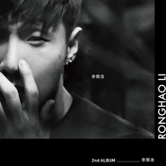

李荣浩Ronghao Li
============================

|  |  |
| :--: | :-- |
| [ 李荣浩Ronghao Li](https://emumo.xiami.com/album/1815156136) | **艺人**: [李荣浩](../index.md) **语种**: 国语 **唱片公司**: 华纳音乐 **发行时间**: 2014年11月28日 **专辑类别**: 录音室专辑 **专辑风格**: 国语流行 Mandarin Pop, 华语唱作人 Chinese Singer-Songwriter, 节奏布鲁斯 R&B **播放数**: 8313551 **收藏数**: 2295 **评论数**: 432  |

## 简介

从默默无名到一夕爆红  
2014年以黑马之姿入围第二十五届金曲奖五项大奖  
《最佳新人》《最佳作词人》《最佳国语男歌手》  
《最佳专辑制作人》《最佳国语专辑》  
新时代最受注目的全创作金曲新人王  
李荣浩  
  
谁都和他不搭  
他是自己的喜剧之王  
  
李荣浩加盟华纳音乐全新创作大碟【李荣浩】  
2014.11.28华纳音乐 正式发行  
  
不落俗套 为苦闷日子解套  
不唱高调 好听得无法低调  
一整年只等一张李荣浩  
全亚洲音乐人／媒体／乐迷 屏息期盼  
新时代的独特 新音乐的模特 李荣浩  
加盟华纳音乐全新创作大碟【李荣浩】  
  
「音乐够好，再低调都能发火发热」，用这句话形容李荣浩的际遇再适合不过。去年，李荣浩以独立发行模式推出首张创作专辑【模特】，在没有任何商业操作曝光下，音乐的口碑已在网络上渐渐传开，更在今年金曲奖一举入围「最佳国语专辑奖」、「最佳国语男歌手奖」、「最佳新人奖」、「最佳专辑制作人」、「最佳作词人」最重要五项大奖后，以黑马之姿，一夕之间受到爆量的关注。最后众望所归获得「最佳新人奖」，无疑让他立刻成为新时代的创作新人王。  
  
挟着超高期待度，李荣浩终于将在11月28号推出个人第二张创作专辑【李荣浩】。相较上一张【模特】，这次新专辑直接取名【李荣浩】，因为之中的十首作品，加入更多李荣浩自己对生活各面向与感情的观点，强调「天生的最好」。如编曲的配制，尽量使用不插电乐器；歌词以极写实的叙述，传达真实的心情感受和人生状态。  
  
歌王歌后指定摄影师 黄中平／摄影  
天王天后御用造型师 韩忠伟／打造  
瑞士国际平面设计联盟会员 金奖最佳专辑包装 聂永真／设计  
全新黑白极简时尚李荣浩  
  
李荣浩加盟华纳音乐全新创作大碟，不仅音乐够份量，视觉团队也十分重量级。专辑平面摄影由华语歌坛天王天后都指定的黄中平操刀，场景选在台北极具代表性的景点阳明山，第一个森林场景，在两小时内，就巧遇三对即将结婚的新人同时在此地拍摄婚纱照，让李荣浩啧啧称奇。而不时在树林和草丛里拍摄，工作人员也不时提醒要小心有蛇出没，也让李荣浩既期待又怕受伤害。  
  
李荣浩造型也找来林俊杰、张惠妹等天王天后御用造型师韩忠伟打造，穿出一种极度简约利落的风格，加上拍摄专辑封面当天，阳明山的一种山雨欲来的阴天氛围，索性最后将选出来的照片都调成黑白，再结合两届金曲奖最佳专辑包装得得主聂永真极具巧思的设计，让这张专辑的视觉呈现一种李荣浩独特式黑白基调的极简时尚感，值得歌迷实体的收藏。  
  
电影／广告／MV 鬼才导演陈宏一执导「喜剧之王」MV  
早上演受伤下午真摔伤 真成现实生活中的喜剧之王  
急诊后负伤坚持拍完MV 导演赞李荣浩：「超MAN」  
  
李荣浩专辑首波主打「喜剧之王」MV，请到曾为张惠妹、五月天等天王天后操刀的鬼才导演陈宏一执导，剧情以主角不断坠入一层层梦境为主轴，描述了既写实又戏剧的如梦人生，MV中更以彩色及黑白的交错，呈现出一段若有似无的多角关系！早上拍摄MV时，李荣浩必须演出了一幕因打架而负伤的剧情，但工作人员却一时忽略了拍戏时的『禁忌』，忘了包红包给李荣浩压惊，没想到李荣浩下午竟然就真的受伤!  
原来李荣浩在一幕要在狂奔同时，跳下导演所设计的两公尺深坑洞时，一不小心被洞旁的沙子一滑，整个人无法好好两脚落地，变成摔落坑底，听到不寻常「砰」的一声，所有人瞬间背脊全凉。李荣浩在坑里蹲坐了将近十分钟完全无法站起来!而正当现场犹豫是否要喊停拍时，被搀扶在旁的李荣浩却彷彿一脸没事敬业的说：「没事，我还可以，先继续把MV拍完吧！」，负伤的他被壮硕的工作人员背到另一处，坚持要把最后一段对嘴画面拍完才到附近的林口长庚医院急诊就医，让现场所有工作人员及导演都称赞「超Man」!  
一到医院的李荣浩也才发现扭伤的脚踝原来已经发肿，照了X光后，确定骨头并没断裂，就是脚筋严重扭伤发炎，马上就打了一剂消炎针，此外，在医院中，也遇到一位护士突然递一张纸请他签名，李荣浩才发现原来在身边帮他打针的护士竟然是他的歌迷！同时也笑说：「我刚才还以为是甚么医院的单子要我签，原来对方是要我帮他签名！很开心在这里遇到自己的粉丝！」。受伤的李荣浩也因此取消之后的其他MV拍摄，足足休息了十天，意外多了一趟「long stay」台湾之行。  
  
黄中平「不搭」、徐筠庭「落俗」  
两大金曲奖最佳音乐录像带导演 倾心执导  
李荣浩问鼎情歌冠军宝座 视／听觉质感全面升级  
  
李荣浩新专辑第二、三波主打「不搭」、「落俗」分别请来曾获得金曲奖最佳音乐录像带导演的黄中平和徐筠庭执导。黄中平导演执导的「不搭」MV，忠实呈现歌词里，一对男女间，生活方式和价值观的差异性，男生为了女生而不断改变自己，试图融入对方的世界，但在对方的世界里，怎么看都如此格格不入与不搭。  
  
徐筠庭导演则在「落俗」MV中，大玩现实情境以非写实的形式手法拍摄，李荣浩融入在其他扮演生活挫败者、无意念狂欢者、落魄者、吵架的夫妻等角色演员中，看起来象是一旁的观察者，同时也可以是参与其中的人。因为关于那些希望、绝望、悲哀、与美好，是他们，也是我们，所有人们都可能经历的事。MV里，汇集了多组人的情感撞击的瞬间，李荣浩则处于其中，将歌词的深意娓娓道来，超越时间与空间的藩篱，既冷静又有浓烈的情感。  
  
由两位金奖导演操刀李荣浩这张专辑中，最受期待的两首情歌，让李荣浩不仅在听觉上，也同时在视觉上，质感全面升级，备受期待。  
  
【李荣浩】10首全主打推荐  
1、喜剧之王（词：黄伟文／曲：李荣浩）  
专辑首波主打「喜剧之王」，李荣浩自己谱曲，歌词则是找来香港大师级作词人黄伟文合作，成就了这首戏剧张力极强的第一主打歌，也想传达「每个人心中都有一个小人物」概念。歌名决定取周星驰经典港片名称，是李荣浩和黄伟文讨论出的结果。正如电影般，剧名是喜剧之王，内容却是极悲剧化，李荣浩的「喜剧之王」也正是如此。无论在旋律、歌词，和唱腔上，这首歌都呈现出他过去少见的强烈甚至歇斯底里声腔。  
  
李荣浩爱看港片，古惑仔系列里角色的义气感更是深深吸引他。黄伟文原本将歌名取作喜剧之王里主角的名字「尹天仇」，但经过来回讨论，觉得这名字，很难立刻让人联想与共鸣，于是就拍板定案为「喜剧之王」，更能传达出许多人在生活中，人生如戏，戏如人生的贴切感。  
  
很多时候，现实生活中的人活得比戏剧里的主角更像在演戏。「喜剧之王」歌曲中，夸张了现实生活中的所有情绪，去传达真实世界中的状态。歌词最后一句，「我伤得断肠，我哭得夸张，只为了红几年」，不仅是表达出许多人不自觉在别人面前放大自己的感受，只是为了吸引别人更多的注意，也顺道对身为艺人的自己幽了一默。而这最后一句回马枪，也更增添了这首歌在真实人生与戏剧世界模糊地带的独特魅力。  
  
2、落俗（词／曲：李荣浩）  
谈感情的事，写爱情的歌，总很难避开那些爱得死去活来，痛得撕心裂肺落俗的话语。李荣浩用不夸张、不刻意的忠实陈述手法，写了这首「想让大家可以跟着唱」的情歌，也在这首歌里呈现他面对感情的态度。  
  
3、作曲家（词／曲：李荣浩）  
今年金曲奖后，这首新歌抢先在网络曝光，就立刻被天后王菲在微博转发，还幽默称它为「帅歌」。天后金口一开，也让还算是新人的李荣浩瞬间吸引极大关注，当天一早，朋友通知还在睡梦中的李荣浩这个天大的消息，他恍神中还来不及会意，直到醒来到客厅泡了一壶茶，冷静的想了一下，才陷入被天后称赞的如梦似幻中。  
  
「作曲家」在表达，身为创作者的人，在想法越来越复杂后，最终才知道最简单的东西最好，也最难。于是身为一个作曲家，写一首一生最平凡的歌、告诉爱的人你的情感多真多深刻都是听起来最简单，实际上却最困难的事。  
  
4、不搭（词／曲：李荣浩）  
「不搭」是整张专辑中，最接近标准情歌的一首。描述一对情侣在日常生活中，各方面习惯、相处的格格不入，但总是因为「爱」，能让两人在不搭的互动中继续走下去。  
  
这样的情节，几乎可以套用在所有人的生活经验中，每个人生来的环境不同，自然个性也有差异，要能长期相处，总要在不搭中不断磨合，中间一些吵吵闹闹，到最后还是分不开，当然也是因为爱。歌词最后一句「跟我相爱谁都不搭」，点出整首歌传达重点，没有谁和谁能完全合拍，或许因为不搭，彼此才深深的相互吸引吧！  
  
5、自拍（词／曲：李荣浩）  
爱自拍的人难免让人联想到自恋。李荣浩却把它转换成一种「自己发现自己」的正面态度，有时候自拍拍到发呆，觉得很傻，也不失为一种生活调剂。这首歌编曲里的吉他弹法，是一种墨西哥沙漠公路电影式的弹法，听着它，就像开着一台车，在有几片云的晴空，微风的沙漠中，停停走走，想自拍就自拍，享受恣意的感动和辽阔。  
  
6、哎呀（词／曲：李荣浩）  
以轻描淡写的文字叙述表达两个人舒服在一起的状态。暖和的阳光、两人细微小动作的互动，然后平淡却幸福的想要再过十年，还是和今天一样的过，一起失眠，一起流泪，再依依不舍一起入睡，简单却深刻的幸福。  
  
7、快让我在雪地上撒点儿野（词／曲：崔健）  
崔健对于生在北方的李荣浩来说，别具意义。崔健的摇滚从李荣浩的父母辈就开始深植人心，听崔健，对他来说，就是一件很自然，像与生俱来在血液里的事。崔健的经典可贵在于，无论时间过了多久，听来还是不过时。  
  
李荣浩选择以贝斯、鼓、吉他纯粹三种乐器，改编这首歌曲，也展现他难得在歌里的狂放不羁感，专辑一路顺听下来，中间穿插了这首完全和李荣浩创作型态不同的歌，不仅没有不搭，更意外成为很好的调和剂。  
  
8、男女（词／曲：李荣浩）  
一天坐在家里，李荣浩不自觉就唸出这首歌词的轮廓。「多少灯亮到现在，欢笑眼泪也都在，几次分开说出来，却离不开，或多或少也都是爱」，李荣浩仍以他一贯不卖弄文字风格，真实的陈述大部分男女之间常发生的情况，那种几度已要分开，却仍对对方有爱而藕断丝连离不开的状态。  
  
歌曲在电钢琴主轴下，呈现出美国7、80年代复古情怀，好像又带我们回到那个R&amp;B大师Babyface的美好年代。  
  
9、天生（词：周耀辉、李荣浩／曲：李荣浩）  
整张新专辑的概念就从这首「天生」出发，顺着自己天生的姿态发挥，就能活得漂亮，活得有希望，一切顺其自然，不多加修饰的感觉，就是李荣浩这张全新专辑想传达的态度和感觉。歌词找来上一张合作「模特」并入围金曲奖最佳作词的周耀辉共同填词，为这首歌增添更多画面感，来表达「天生」的美好。  
  
10、二三十（词／曲：李荣浩）  
在城市的街头，一个如李荣浩二、三十岁年纪的人，在如邮递工人、儿科医生、旅馆老板、理发师、修鞋匠等生活中不同身份的人们，各自努力生活的眼神和身影中，回顾自己过去。

## 曲目

## 评论

|  |  |  |
| :-- | :-- | :-- |
|  [虾米用户](https://emumo.xiami.com/u/31924437)  2019-03-09 23:35 赞(0) 踩(0) | 
就是喜欢
 |
|  [虾米用户](https://emumo.xiami.com/u/264941753) 我还没想好要写什么... 2018-09-15 11:17 赞(0) 踩(0) | 
为什么好多歌下架了，好难过啊
 |
|  [虾米用户](https://emumo.xiami.com/u/92236) 我还没想好要写什么... 2018-06-30 19:12 赞(1) 踩(0) | 
怎么都是三年前的评论
 |
|  [虾米用户](https://emumo.xiami.com/u/347071752) 面朝大海 春暖花开 2018-06-18 15:29 赞(0) 踩(0) | 
评论太少不科学
 |
|  [虾米用户](https://emumo.xiami.com/u/9297283)   2018-04-20 11:56 赞(1) 踩(0) | 
心动第一万遍   了解一下   完美理想型就是这张李荣浩里唱的这个男孩纸   嗯   心动第一万零一次&amp;hellip;   
 |
|  [虾米用户](https://emumo.xiami.com/u/350955190)  2018-03-23 18:11 赞(2) 踩(0) | 
他所有专辑里我最喜欢这张
 |
|  [虾米用户](https://emumo.xiami.com/u/337061751)  2017-11-30 19:54 赞(1) 踩(0) | 
你唱的歌，有的太好听了
 |
|  [虾米用户](https://emumo.xiami.com/u/277957297) 有你就好…… 2017-11-06 16:41 赞(2) 踩(0) | 
歌手很棒棒！ 【诱人的小眼睛 】
 |
|  [虾米用户](https://emumo.xiami.com/u/104856222) 潮湿朋克 2017-11-05 11:16 赞(0) 踩(0) | 
整張專輯都真的很用心 主打是「喜劇之王」和「不搭」 其實其他的曲和詞感覺才是真正的李榮浩 平淡、細膩、用情、呢喃 還是繼續期待吧www
 |
|  [虾米用户](https://emumo.xiami.com/u/11576254) 最喜欢听虾米音乐了，哈哈 2017-06-17 16:43 赞(1) 踩(0) | 
封面潘玮柏
 |
| ⇒ |  [虾米用户](https://emumo.xiami.com/u/10857967) 我～就是我！不喜勿進！ 2017-09-11 23:33 赞(0) 踩(0) | 
然而潘玮柏眼睛大多了
 |
|  [虾米用户](https://emumo.xiami.com/u/11135197)  2017-02-23 22:29 赞(3) 踩(0) | 
不知道别人怎样听李荣浩❤我只知道我心里的李荣浩就是一位背着吉他谱作词曲的文艺青年
 |
|  [虾米用户](https://emumo.xiami.com/u/524904) 猪都飞上天了 2017-02-14 06:46 赞(0) 踩(0) | 
好听的没几首
 |
|  [虾米用户](https://emumo.xiami.com/u/40678870) 命弱有财是無财，命硬無财... 2016-11-03 17:06 赞(0) 踩(0) | 
华语男声
 |
|  [虾米用户](https://emumo.xiami.com/u/209554272)  2016-10-15 19:49 赞(0) 踩(0) | 
好听
 |
|  [虾米用户](https://emumo.xiami.com/u/30831717)  2016-07-26 11:41 赞(0) 踩(0) | 
基本上喜欢每一首歌
 |
|  [虾米用户](https://emumo.xiami.com/u/2523233) 太热 2016-06-01 14:07 赞(0) 踩(0) | 
明明是华纳……怎么变华谊唱片是什么鬼啊……<a href="http://emumo.xiami.com/u/2871" target="_blank" rel="nofollow" name_card="2871">@虾小编</a>
 |
| ⇒ |  [虾米用户](https://emumo.xiami.com/u/2871) 虾米编辑部唯一官方账号 ... 2016-06-01 14:23 赞(0) 踩(0) | 
已修改
 |
|  [虾米用户](https://emumo.xiami.com/u/138536746)  2016-05-26 19:19 赞(0) 踩(0) | 
洒脱的声音，
 |
|  [虾米用户](https://emumo.xiami.com/u/100536244)  2016-05-19 22:36 赞(0) 踩(0) | 
好听
 |
|  [虾米用户](https://emumo.xiami.com/u/3840283)  2016-04-07 17:40 赞(5) 踩(0) | 
这盘专辑六七首都是如下这样  所属专辑：李荣浩 演唱者：李荣浩 作词：李荣浩 作曲：李荣浩 编曲：李荣浩  这种五个条目全都一样的状况真是少见啊。。
 |
| ⇒ |  [虾米用户](https://emumo.xiami.com/u/10857967) 我～就是我！不喜勿進！ 2016-05-09 18:31 赞(0) 踩(0) | 
哈哈！连周杰伦都没有五个条目都一样，最多四个条目一样（周杰伦第一张专辑名就是《Jay》，因此专辑名可以忽略不计）。周杰伦的《晴天》《懦夫》作词作曲编曲都是周杰伦
 |
| ⇒ |  [虾米用户](https://emumo.xiami.com/u/355865) Let it go, l... 2016-05-22 17:12 赞(0) 踩(0) | 
吉他 / 贝司：李荣浩 弦乐编写：李荣浩 和声：李荣浩
 |
| ⇒ |  [虾米用户](https://emumo.xiami.com/u/18282119) 我就是我，独一无二 2016-05-23 12:45 赞(0) 踩(0) | 
<q><b>王心凌的房客说：</b></q>
 |
| ⇒ |  [虾米用户](https://emumo.xiami.com/u/10857967) 我～就是我！不喜勿進！ 2017-11-22 10:24 赞(0) 踩(0) | 
除了一首翻唱，一首是黄伟文填词，一首是李荣浩、周耀辉合作填词之外，其他7首的确都是如此
 |
| ⇒ |  [虾米用户](https://emumo.xiami.com/u/10857967) 我～就是我！不喜勿進！ 2018-06-18 17:14 赞(0) 踩(0) | 
<q><b>______说：</b></q>
 |
| ⇒ |  [虾米用户](https://emumo.xiami.com/u/18282119) 我就是我，独一无二 2018-06-18 17:20 赞(0) 踩(0) | 
<q><b>王心凌的房客说：</b></q>
 |
| ⇒ |  [虾米用户](https://emumo.xiami.com/u/10857967) 我～就是我！不喜勿進！ 2018-06-18 17:34 赞(0) 踩(0) | 
<q><b>______说：</b></q>
 |
| ⇒ |  [虾米用户](https://emumo.xiami.com/u/10857967) 我～就是我！不喜勿進！ 2018-06-18 17:34 赞(0) 踩(0) | 
<q><b>Desperado说：</b></q>
 |
| ⇒ |  [虾米用户](https://emumo.xiami.com/u/18282119) 我就是我，独一无二 2018-06-18 17:34 赞(0) 踩(0) | 
<q><b>王心凌的房客说：</b></q>
 |
| ⇒ |  [虾米用户](https://emumo.xiami.com/u/10857967) 我～就是我！不喜勿進！ 2018-06-18 17:37 赞(0) 踩(0) | 
<q><b>______说：</b></q>
 |
| ⇒ |  [虾米用户](https://emumo.xiami.com/u/18282119) 我就是我，独一无二 2018-06-19 10:31 赞(0) 踩(0) | 
<q><b>王心凌的房客说：</b></q>
 |
| ⇒ |  [虾米用户](https://emumo.xiami.com/u/10857967) 我～就是我！不喜勿進！ 2018-06-19 17:46 赞(0) 踩(0) | 
<q><b>______说：</b></q>
 |
|  [虾米用户](https://emumo.xiami.com/u/109226846) 大爱薛之谦！ 2016-02-28 13:57 赞(0) 踩(0) | 
尼玛的，虾米太假了
 |
|  [虾米用户](https://emumo.xiami.com/u/109226846) 大爱薛之谦！ 2016-02-28 13:56 赞(0) 踩(0) | 
怎么会这样呢，为什么下不起？
 |
|  [虾米用户](https://emumo.xiami.com/u/97123774) 总有人比你自己更爱你。 2016-02-25 21:35 赞(1) 踩(0) | 
下架了？当初这张专辑也是一直循环 忘记哪首一直给我港乐的感觉 总之 支持老乡 还是觉得这张很酷啊
 |
|  [虾米用户](https://emumo.xiami.com/u/15958732)  2016-02-02 18:32 赞(1) 踩(0) | 
搞VIP也不给下 
 |
|  [虾米用户](https://emumo.xiami.com/u/8573800) 签名如昵称 2016-01-13 00:27 赞(0) 踩(0) | 
喜剧之王的歌词没看之前我一直听的是 全世界的脸我都试一遍 我笑得夸张。。 为何菩提下的泪我先流一遍 还觉得意外不错哦
 |
|  [虾米用户](https://emumo.xiami.com/u/3715322) 1979 2015-12-11 09:33 赞(1) 踩(0) | 
华纳签李荣浩是好事吗，我很值得怀疑。
 |
|  [虾米用户](https://emumo.xiami.com/u/17837073)  2015-11-28 11:41 赞(0) 踩(0) | 
喜欢每一个句读
 |
|  [虾米用户](https://emumo.xiami.com/u/25797185) 果子 2015-11-27 17:18 赞(0) 踩(0) | 
喜欢这种节奏
 |
|  [虾米用户](https://emumo.xiami.com/u/75018512) 成长 心情 2015-11-19 17:27 赞(0) 踩(0) | 
棒棒棒
 |
|  [虾米用户](https://emumo.xiami.com/u/24816509) 电灯熄灭，物换星移，泥牛... 2015-09-28 19:43 赞(5) 踩(0) | 
虾米抽风了还是版权都搞定了   
 |
|  [虾米用户](https://emumo.xiami.com/u/40705641)  2015-09-16 13:40 赞(0) 踩(0) | 
想听这张
 |
|  [虾米用户](https://emumo.xiami.com/u/62020396) 这家伙很聪明不加微信 2015-09-10 18:43 赞(0) 踩(0) | 
长得很像韩国人，尤其像金秀贤对吗！？大家说对吗=w=
 |
|  [虾米用户](https://emumo.xiami.com/u/36845031) 这个家伙很高冷什么都没留... 2015-08-10 13:17 赞(0) 踩(0) | 
操蛋了= =
 |
|  [虾米用户](https://emumo.xiami.com/u/40209009)  2015-07-30 02:13 赞(8) 踩(0) | 
就不能多花点钱吗 虾米君
 |
|  [虾米用户](https://emumo.xiami.com/u/217909)  2015-07-25 21:26 赞(2) 踩(0) | 
马云爸爸快出来啊
 |
|  [虾米用户](https://emumo.xiami.com/u/50089717) David 2015-07-18 18:04 赞(0) 踩(0) | 
喜欢。。
 |
|  [虾米用户](https://emumo.xiami.com/u/48851189) 生而为人 请善良 也自在... 2015-07-04 13:47 赞(0) 踩(0) | 
为什么下架了！！
 |
|  [虾米用户](https://emumo.xiami.com/u/10565482) 口令：新春快乐呀 2015-06-16 07:04 赞(0) 踩(0) | 
真心不敢换手机了，妹的，现在不仅李代沫没了，李荣浩也下架。虾米，你让我怎么喜欢你。
 |
| ⇒ |  [虾米用户](https://emumo.xiami.com/u/10857967) 我～就是我！不喜勿進！ 2016-05-13 09:48 赞(0) 踩(0) | 
五月天的倒是虾米独家
 |
|  [虾米用户](https://emumo.xiami.com/u/34487745)  2015-06-08 16:58 赞(6) 踩(0) | 
最爱李荣浩的一张专辑，虾米还下架  
 |
| ⇒ |  [虾米用户](https://emumo.xiami.com/u/92236) 我还没想好要写什么... 2018-06-30 19:10 赞(0) 踩(0) | 
可以听了
 |
|  [虾米用户](https://emumo.xiami.com/u/50487504)  2015-06-01 16:43 赞(1) 踩(0) | 
快点给我喜剧之王
 |
|  [虾米用户](https://emumo.xiami.com/u/50487504)  2015-06-01 16:42 赞(0) 踩(0) | 
想听喜剧之王
 |
|  [虾米用户](https://emumo.xiami.com/u/2231127) Bleh 个性古怪 2015-05-31 00:08 赞(0) 踩(0) | 
从没上架过的专辑怎么下架了呢？
 |
|  [虾米用户](https://emumo.xiami.com/u/32656077)   2015-05-10 11:53 赞(1) 踩(0) | 
想听喜剧之王
 |
|  [虾米用户](https://emumo.xiami.com/u/2789878) 좋아해여 ❤️  2015-04-29 12:22 赞(3) 踩(0) | 
快买快买版权     
 |
| ⇒ |  [虾米用户](https://emumo.xiami.com/u/6155464)  2015-05-07 11:19 赞(0) 踩(0) | 
买买买！！！
 |
|  [虾米用户](https://emumo.xiami.com/u/11594981) 快不快乐有天总过去 2015-04-28 11:26 赞(0) 踩(0) | 
我不要某Q音乐！！！
 |
|  [虾米用户](https://emumo.xiami.com/u/2523233) 太热 2015-04-27 16:47 赞(1) 踩(0) | 
#虫洞穿越#
 |
|  [虾米用户](https://emumo.xiami.com/u/20182568) 我还没想好要写什么... 2015-04-16 16:13 赞(0) 踩(0) | 
怎么下架了！快回来吧
 |
|  [虾米用户](https://emumo.xiami.com/u/39816876) 全世界不缺你一个 2015-04-14 17:58 赞(8) 踩(0) | 
虾米你还好意思说李荣浩是虾米音乐人吗
 |
| ⇒ |  [虾米用户](https://emumo.xiami.com/u/1072946)  2015-04-29 00:03 赞(0) 踩(0) | 
虾米音乐人是属于艺人主动入驻型，艺人可以在虾米第一时间发布demo，或独立制作的音乐或唱片公司同意后的专辑。下架是因为版权，如果专辑版权在某唱片公司手上，这张唱片的实际怎么利用是唱片公司决定，艺人没有话语权（要知道有些艺人是某首歌的原唱，唱红了一首歌，全国人都知道是他唱的，但如果歌曲版权在唱片公司手上，他也有可能会因为和唱片公司的纠纷导致一辈子都无法再演唱这首歌曲。这就是版权的利害关系。）。这张唱片是华纳版权，由于QQ音乐独家代理1年期华纳，所以下架。李荣浩并不是所有歌的都下架。请有一点基本的音乐版权常识。
 |
| ⇒ |  [虾米用户](https://emumo.xiami.com/u/45258701)  2015-04-29 00:58 赞(0) 踩(0) | 
<q><b>不可乐斯基说：</b></q>
 |
| ⇒ |  [虾米用户](https://emumo.xiami.com/u/1072946)  2015-04-29 10:43 赞(0) 踩(0) | 
<q><b>Jo说：</b></q>
 |
| ⇒ |  [虾米用户](https://emumo.xiami.com/u/18282119) 我就是我，独一无二 2015-05-01 15:39 赞(0) 踩(0) | 
<q><b>不可乐斯基说：</b></q>
 |
| ⇒ |  [虾米用户](https://emumo.xiami.com/u/18282119) 我就是我，独一无二 2015-05-01 15:39 赞(0) 踩(0) | 
<q><b>Jo说：</b></q>
 |
|  [虾米用户](https://emumo.xiami.com/u/43318744)  2015-04-13 22:15 赞(0) 踩(0) | 
不想用QQ音乐的话网易云音乐有这张专辑，去网易听吧 
 |
|  [虾米用户](https://emumo.xiami.com/u/3123251)  2015-04-13 19:14 赞(0) 踩(0) | 
特地来找的，结果下架了，罕有内地能洗脑的歌。
 |
|  [虾米用户](https://emumo.xiami.com/u/24082441) Mad for Mads 2015-04-12 05:02 赞(0) 踩(0) | 
喜剧之王果然听哭人
 |
|  [虾米用户](https://emumo.xiami.com/u/44434769) 我还没想好要写什么... 2015-04-08 09:38 赞(0) 踩(0) | 
下架？能不能让我对虾米有些信心
 |
|  [虾米用户](https://emumo.xiami.com/u/48893979)  2015-04-05 20:00 赞(0) 踩(0) | 
帅歌一堆
 |
|  [虾米用户](https://emumo.xiami.com/u/3734489)  2015-03-31 01:50 赞(0) 踩(0) | 
下架是什么鬼？ 
 |
| ⇒ |  [虾米用户](https://emumo.xiami.com/u/18282119) 我就是我，独一无二 2015-04-06 12:40 赞(0) 踩(0) | 
华纳嫁给了腾讯。
 |
| ⇒ |  [虾米用户](https://emumo.xiami.com/u/47457126)  2015-04-22 18:39 赞(0) 踩(0) | 
<q><b>______说：</b></q>
 |
| ⇒ |  [虾米用户](https://emumo.xiami.com/u/18282119) 我就是我，独一无二 2015-04-22 18:41 赞(0) 踩(0) | 
<q><b>ChocoBaylor说：</b></q>
 |
| ⇒ |  [虾米用户](https://emumo.xiami.com/u/47457126)  2015-04-22 18:42 赞(0) 踩(0) | 
<q><b>______说：</b></q>
 |
| ⇒ |  [虾米用户](https://emumo.xiami.com/u/18282119) 我就是我，独一无二 2015-04-22 18:44 赞(0) 踩(0) | 
<q><b>ChocoBaylor说：</b></q>
 |
| ⇒ |  [虾米用户](https://emumo.xiami.com/u/47457126)  2015-04-22 18:45 赞(0) 踩(0) | 
<q><b>______说：</b></q>
 |
| ⇒ |  [虾米用户](https://emumo.xiami.com/u/18282119) 我就是我，独一无二 2015-04-22 18:48 赞(0) 踩(0) | 
<q><b>ChocoBaylor说：</b></q>
 |
| ⇒ |  [虾米用户](https://emumo.xiami.com/u/47457126)  2015-04-22 18:50 赞(0) 踩(0) | 
<q><b>______说：</b></q>
 |
| ⇒ |  [虾米用户](https://emumo.xiami.com/u/1072946)  2015-04-29 00:12 赞(0) 踩(0) | 
<q><b>ChocoBaylor说：</b></q>
 |
| ⇒ |  [虾米用户](https://emumo.xiami.com/u/36311359) 丹麦君= = 2015-09-30 09:57 赞(0) 踩(0) | 
<q><b>ChocoBaylor说：</b></q>
 |
|  [虾米用户](https://emumo.xiami.com/u/33938563) 这个世界有太多的挚爱蒙尘... 2015-03-18 10:28 赞(4) 踩(0) | 
实在郁闷，我听他的歌都是因为虾米，结果还要下架，不该啊~不该好不好。
 |
| ⇒ |  [虾米用户](https://emumo.xiami.com/u/46747505) 暂无签名~ 2015-03-30 14:13 赞(0) 踩(0) | 
为啥会有下架的说法很郁闷阿。虾米不能酱紫 为啥呢。为啥。
 |
| ⇒ |  [虾米用户](https://emumo.xiami.com/u/18282119) 我就是我，独一无二 2015-04-06 12:40 赞(0) 踩(0) | 
华纳嫁给了腾讯。
 |
| ⇒ |  [虾米用户](https://emumo.xiami.com/u/18282119) 我就是我，独一无二 2015-04-06 12:40 赞(0) 踩(0) | 
<q><b>絳珠仙草╯▽╰说：</b></q>
 |
|  [虾米用户](https://emumo.xiami.com/u/12319515)  2015-03-13 01:37 赞(0) 踩(0) | 
敢不敢上架吖!!
 |
| ⇒ |  [虾米用户](https://emumo.xiami.com/u/18282119) 我就是我，独一无二 2015-03-14 11:00 赞(0) 踩(0) | 
已经有法律效应了，没办法了。
 |
|  [虾米用户](https://emumo.xiami.com/u/40898278) 快乐时你听的是音乐，难过... 2015-03-04 00:43 赞(0) 踩(0) | 
买买买！！！怎么下架了！！！
 |
| ⇒ |  [虾米用户](https://emumo.xiami.com/u/786414)  2015-03-09 10:14 赞(0) 踩(0) | 
因为虾米太坑舍不得花钱呗QQ抢走了TAT
 |
| ⇒ |  [虾米用户](https://emumo.xiami.com/u/18282119) 我就是我，独一无二 2015-03-14 11:00 赞(0) 踩(0) | 
<q><b>seulje说：</b></q>
 |
|  [虾米用户](https://emumo.xiami.com/u/2035519) 为了你，即使身陷于永远的 2015-02-23 21:54 赞(0) 踩(0) | 
为什么会是下架，难道虾米抢不过QQ音乐吗？？
 |
| ⇒ |  [虾米用户](https://emumo.xiami.com/u/18282119) 我就是我，独一无二 2015-03-14 11:00 赞(0) 踩(0) | 
已经有法律效应了，没办法了。
 |
|  [虾米用户](https://emumo.xiami.com/u/44000357) 暂无签名~ 2015-02-23 20:26 赞(1) 踩(0) | 
#虾米你虫洞穿越观光团到此一游#～
 |
|  [虾米用户](https://emumo.xiami.com/u/47478429)  2015-02-21 10:53 赞(0) 踩(0) | 
好听
 |
|  [虾米用户](https://emumo.xiami.com/u/2251590) 気分転換チョウ苦手 2015-02-14 13:45 赞(0) 踩(0) | 
爆红后遗症
 |
|  [虾米用户](https://emumo.xiami.com/u/2103090) 不要介意我以前做的傻逼歌... 2015-02-09 14:05 赞(0) 踩(0) | 
不能听- -
 |
|  [虾米用户](https://emumo.xiami.com/u/399637)  2015-02-07 15:51 赞(0) 踩(0) | 
虾米什么都不能听，这也太痛苦了。。。
 |
| ⇒ |  [虾米用户](https://emumo.xiami.com/u/18282119) 我就是我，独一无二 2015-03-14 11:01 赞(0) 踩(0) | 
已经有法律效应了，没办法了。
 |
|  [虾米用户](https://emumo.xiami.com/u/36646226) 粉丝多也许是我有魅力吧 2015-02-03 19:31 赞(1) 踩(0) | 
李荣浩现任女友是杨丞琳  ❤
 |
| ⇒ |  [虾米用户](https://emumo.xiami.com/u/44434769) 我还没想好要写什么... 2015-04-08 09:39 赞(0) 踩(0) | 
really？
 |
|  [虾米用户](https://emumo.xiami.com/u/7067714) 一个脱离了高级趣味的人。 2015-02-02 19:25 赞(0) 踩(0) | 
感觉封面照很像金钟国啊
 |
|  [虾米用户](https://emumo.xiami.com/u/357273) 不是博士的Doctor 2015-02-01 05:13 赞(2) 踩(0) | 
感觉虾米要被QQ音乐排挤死了………………怎么找到个专辑他喵的就被QQ音乐拿走了啊！！
 |
|  [虾米用户](https://emumo.xiami.com/u/550021)  2015-01-31 13:54 赞(0) 踩(0) | 
华纳是哪根葱?
 |
| ⇒ |  [虾米用户](https://emumo.xiami.com/u/18282119) 我就是我，独一无二 2015-03-14 11:02 赞(0) 踩(0) | 
世界三大唱片，环球唱片、索尼音乐娱乐和华纳音乐。
 |
|  [虾米用户](https://emumo.xiami.com/u/13318558)  2015-01-31 00:06 赞(0) 踩(0) | 
我他喵的还能在虾米听到点什么吗……
 |
|  [虾米用户](https://emumo.xiami.com/u/2306579)  2015-01-28 10:14 赞(0) 踩(0) | 
哈哈哈抄John Mayer那两首太明显了。不过整体挺好的。
 |
|  [虾米用户](https://emumo.xiami.com/u/8433176) Enjoy 2015-01-27 12:49 赞(0) 踩(0) | 
明知道虾米穷买不起版权.你为什么还要签华纳!!!!
 |
|  [虾米用户](https://emumo.xiami.com/u/1730251)  2015-01-24 13:03 赞(2) 踩(0) | 
可怜的虾米，为何签了华纳就下架了
 |
|  [虾米用户](https://emumo.xiami.com/u/552580)   2015-01-24 09:31 赞(2) 踩(0) | 
花钱啊虾米要学会怎么花钱呀！！！！！
 |
|  [虾米用户](https://emumo.xiami.com/u/13847510) lilkrn 2015-01-24 03:38 赞(0) 踩(0) | 
妈呀简直太喜欢落俗了
 |
|  [虾米用户](https://emumo.xiami.com/u/4163880)  2015-01-23 00:48 赞(2) 踩(0) | 
让你买好声音！让你买好声音！浩浩被人抢走辣！更不要说刚发专辑的金曲天王JJ啦！有点眼光好不啦！钱要打算着花呀笨蛋！
 |
| ⇒ |  [虾米用户](https://emumo.xiami.com/u/355865) Let it go, l... 2015-01-24 18:38 赞(0) 踩(0) | 
好声音跟浩浩有啥关系。。。版权签了独家了就不是钱的问题了好么。。
 |
| ⇒ |  [虾米用户](https://emumo.xiami.com/u/4163880)  2015-01-25 14:22 赞(0) 踩(0) | 
<q><b>Desperado说：</b></q>
 |
| ⇒ |  [虾米用户](https://emumo.xiami.com/u/991341) 微信：jeans_rob... 2015-01-25 21:10 赞(0) 踩(0) | 
<q><b>倔酱说：</b></q>
 |
| ⇒ |  [虾米用户](https://emumo.xiami.com/u/4163880)  2015-01-26 13:16 赞(0) 踩(0) | 
<q><b>◉悟空◉说：</b></q>
 |
| ⇒ |  [虾米用户](https://emumo.xiami.com/u/36311359) 丹麦君= = 2015-01-27 20:46 赞(0) 踩(0) | 
<q><b>倔酱说：</b></q>
 |
| ⇒ |  [虾米用户](https://emumo.xiami.com/u/13937699) 耶和华啊！我要向祢歌颂 2015-01-30 11:28 赞(0) 踩(0) | 
<q><b>丹麦说：</b></q>
 |
|  [虾米用户](https://emumo.xiami.com/u/4163880)  2015-01-23 00:46 赞(1) 踩(0) | 
马云买买买！
 |
|  [虾米用户](https://emumo.xiami.com/u/18024895) Valar Morghu... 2015-01-22 20:46 赞(2) 踩(0) | 
不用企鹅！！阿里要争口气啊！！买买买！！！
 |
|  [虾米用户](https://emumo.xiami.com/u/5633817) 聽聽歌，談談情 2015-01-22 20:30 赞(0) 踩(0) | 
给你爱上李荣浩理由的一张专辑
 |
|  [虾米用户](https://emumo.xiami.com/u/17036200)  2015-01-19 21:20 赞(0) 踩(0) | 
感觉没上张好
 |
|  [虾米用户](https://emumo.xiami.com/u/6264109)  2015-01-19 12:18 赞(0) 踩(0) | 
超爱喜剧之王~
 |
|  [虾米用户](https://emumo.xiami.com/u/10111261)  2015-01-19 11:02 赞(1) 踩(0) | 
又没版权了....&amp;gt;&amp;lt; 虾米你让我拿什么来爱你
 |
|  [虾米用户](https://emumo.xiami.com/u/6147641) @Smartisan 2015-01-18 16:35 赞(0) 踩(0) | 
banquanbanquanbanquan....
 |
|  [虾米用户](https://emumo.xiami.com/u/3722040) 一期一会，会者定离 2015-01-18 02:44 赞(0) 踩(0) | 
华纳跟虾米不是合作关系吗 怎么就下架了，马云如果没心思搞这块的收购虾米干啥子，企鹅分分秒秒都想作对我都醉了
 |
| ⇒ |  [虾米用户](https://emumo.xiami.com/u/9943562) 多数盗版碟在02年发行 2015-01-18 15:29 赞(0) 踩(0) | 
华纳跟腾讯战略合作了，上个月的新闻啊
 |
| ⇒ |  [虾米用户](https://emumo.xiami.com/u/3722040) 一期一会，会者定离 2015-01-18 15:30 赞(0) 踩(0) | 
<q><b>唱片架#1说：</b></q>
 |
| ⇒ |  [虾米用户](https://emumo.xiami.com/u/9943562) 多数盗版碟在02年发行 2015-01-18 15:33 赞(0) 踩(0) | 
<q><b>yu_兔安说：</b></q>
 |
| ⇒ |  [虾米用户](https://emumo.xiami.com/u/3722040) 一期一会，会者定离 2015-01-18 15:40 赞(0) 踩(0) | 
<q><b>唱片架#1说：</b></q>
 |
|  [虾米用户](https://emumo.xiami.com/u/42462876) 诗酒趁年华 2015-01-17 16:44 赞(0) 踩(0) | 
耳目一新啊，等预售CD
 |
|  [虾米用户](https://emumo.xiami.com/u/4477127)  2015-01-16 14:05 赞(0) 踩(0) | 
简单明快、入耳舒服！
 |
|  [虾米用户](https://emumo.xiami.com/u/965806)  2015-01-15 17:49 赞(0) 踩(0) | 
这都逼着去听企鹅了我擦！
 |
|  [虾米用户](https://emumo.xiami.com/u/54727)   2015-01-15 14:17 赞(3) 踩(0) | 
好烦啊……搞了一年VIP，正好碰上杰伦发新专，JJ发新专，统统听不了！连李荣浩也听不了了，，
 |
| ⇒ |  [虾米用户](https://emumo.xiami.com/u/9943562) 多数盗版碟在02年发行 2015-01-18 15:29 赞(0) 踩(0) | 
某竞争网站的心机呗
 |
|  [虾米用户](https://emumo.xiami.com/u/7907629)  2015-01-14 10:34 赞(0) 踩(0) | 
有点意思
 |
|  [虾米用户](https://emumo.xiami.com/u/11601717)  2015-01-04 11:44 赞(0) 踩(0) | 
炒鸡喜欢。。。为什么下架呢？
 |
|  [虾米用户](https://emumo.xiami.com/u/9380927) 太认真就输了 2015-01-02 17:55 赞(0) 踩(0) | 
唉～
 |
|  [虾米用户](https://emumo.xiami.com/u/22718466)  2014-12-29 12:38 赞(0) 踩(0) | 
内地终于有高质量歌曲了~
 |
|  [虾米用户](https://emumo.xiami.com/u/22718466)  2014-12-29 12:37 赞(0) 踩(0) | 
好评~
 |
|  [虾米用户](https://emumo.xiami.com/u/9697597) 他人即地獄 2014-12-28 16:31 赞(0) 踩(0) | 
华语方面虾米真是不给力啊。。
 |
| ⇒ |  [虾米用户](https://emumo.xiami.com/u/18282119) 我就是我，独一无二 2015-03-14 11:05 赞(0) 踩(0) | 
日语更糟糕。
 |
|  [虾米用户](https://emumo.xiami.com/u/679921)  2014-12-28 00:05 赞(0) 踩(0) | 
最近几个华语流行的大牌专都不在虾米上架了。。。。哎 可悲
 |
|  [虾米用户](https://emumo.xiami.com/u/62017)  2014-12-25 20:34 赞(4) 踩(0) | 
阿里巴爸爸淘宝妈妈赶紧买版权给虾米儿子啊！
 |
|  [虾米用户](https://emumo.xiami.com/u/3074562) 我听我的 2014-12-25 12:46 赞(1) 踩(0) | 
最近虾米在搞什么啊 VIP可不可以退掉
 |
|  [虾米用户](https://emumo.xiami.com/u/5939564)  2014-12-24 15:21 赞(3) 踩(0) | 
干嘛下架。。不想用企鹅的。。
 |
|  [虾米用户](https://emumo.xiami.com/u/24433551) 承认吧，想来也是夜里崩溃... 2014-12-23 14:34 赞(0) 踩(0) | 
不搭好听。 有点像周杰伦酷酷的，唱法很陈奕迅。
 |
|  [虾米用户](https://emumo.xiami.com/u/676760) 聪明的家伙  是不会被心... 2014-12-23 11:44 赞(0) 踩(0) | 
为什么刚出就下架……
 |
|  [虾米用户](https://emumo.xiami.com/u/12540283) 是小哥不是小狗。 2014-12-18 10:48 赞(0) 踩(0) | 
下架了QAQ非要下载企鹅音乐了么。。
 |
|  [虾米用户](https://emumo.xiami.com/u/22511666)   2014-12-16 20:43 赞(0) 踩(0) | 
请尽快上架
 |
|  [虾米用户](https://emumo.xiami.com/u/7718598) 尚好的青春都是你。 2014-12-16 20:26 赞(2) 踩(0) | 
和同期的孙盛希简直难兄难妹 一个是小蔡健雅 一个小陈奕迅 其实某一些部分还和方大同撞了 写歌确实不赖 可惜他的唱法念词拖沓懒散特别容易听觉疲劳 唱腔上需要再下点功夫 翻唱崔健的《快让我在雪地上撒点儿野》还不够味 推荐：《落俗》，《不搭》，《哎呀》
 |
|  [虾米用户](https://emumo.xiami.com/u/566532)  2014-12-16 11:24 赞(0) 踩(0) | 
下架了.....
 |
|  [虾米用户](https://emumo.xiami.com/u/6280973) 我还没想好要写什么... 2014-12-14 17:01 赞(0) 踩(0) | 
what?!
 |
|  [虾米用户](https://emumo.xiami.com/u/7367047)  2014-12-13 00:12 赞(2) 踩(0) | 
为什么网易正常放虾米就下架了。。版权问题不应该都一样嘛。。
 |
| ⇒ |  [虾米用户](https://emumo.xiami.com/u/9943562) 多数盗版碟在02年发行 2015-01-18 15:30 赞(0) 踩(0) | 
你以为所有网站都那么自觉么
 |
| ⇒ |  [虾米用户](https://emumo.xiami.com/u/7367047)  2015-01-18 16:53 赞(0) 踩(0) | 
<q><b>唱片架#1说：</b></q>
 |
|  [虾米用户](https://emumo.xiami.com/u/3956212)  2014-12-12 15:04 赞(0) 踩(0) | 
******
 |
|  [虾米用户](https://emumo.xiami.com/u/278702) 我爱音乐 2014-12-10 23:27 赞(0) 踩(0) | 
为什么没有了？
 |
|  [虾米用户](https://emumo.xiami.com/u/7315769) 我还没想好要写什么... 2014-12-10 22:58 赞(0) 踩(0) | 
喂喂，这样还怎么玩耍
 |
|  [虾米用户](https://emumo.xiami.com/u/10063489) 暂无签名~ 2014-12-09 16:39 赞(2) 踩(0) | 
不说是虾米音乐人么，怎么连版权都木有
 |
| ⇒ |  [虾米用户](https://emumo.xiami.com/u/18282119) 我就是我，独一无二 2015-03-14 11:08 赞(0) 踩(0) | 
音乐人是音乐人，专辑的版权另说。
 |
|  [虾米用户](https://emumo.xiami.com/u/644457)  2014-12-09 14:15 赞(0) 踩(0) | 
内地唱作人华纳get =。 =
 |
|  [虾米用户](https://emumo.xiami.com/u/2458107) 很奇怪吗？一个从来没写过... 2014-12-09 12:19 赞(2) 踩(0) | 
快搞起啊！！！！这样还怎么和虾米愉快的玩耍？
 |
|  [虾米用户](https://emumo.xiami.com/u/36433890)   2014-12-08 22:48 赞(0) 踩(0) | 
额 怎么都没了
 |
|  [虾米用户](https://emumo.xiami.com/u/776429)  2014-12-06 13:38 赞(0) 踩(0) | 
哎，办了Vip，好专辑都听不到啊~~
 |
|  [虾米用户](https://emumo.xiami.com/u/774333)   2014-12-05 10:30 赞(0) 踩(0) | 
网易听了过来，除了那首雪地撒野什么的，其他的都不错......
 |
| ⇒ |  [虾米用户](https://emumo.xiami.com/u/2458107) 很奇怪吗？一个从来没写过... 2014-12-12 12:16 赞(0) 踩(0) | 
中式摇滚，范儿还挺正的，可能你不喜欢这中风格吧。
 |
| ⇒ |  [虾米用户](https://emumo.xiami.com/u/774333)   2014-12-15 13:39 赞(0) 踩(0) | 
<q><b>黒貓说：</b></q>
 |
|  [虾米用户](https://emumo.xiami.com/u/10527500) 有朋自远方来，不亦乐乎。 2014-12-05 02:07 赞(0) 踩(0) | 
华纳签了吧= = 唉
 |
|  [虾米用户](https://emumo.xiami.com/u/4380298) emmmmmmmm 2014-12-03 22:57 赞(0) 踩(0) | 
还上虾米？虾米没落了
 |
|  [虾米用户](https://emumo.xiami.com/u/4333960) 暂无签名~ 2014-12-03 19:40 赞(2) 踩(0) | 
快点让马云买啊..........这样怎么可以......
 |
|  [虾米用户](https://emumo.xiami.com/u/11896662) 专心做颜饭 2014-12-03 10:12 赞(3) 踩(0) | 
所以虾米放这张上来就只是让我们来写评论吗。。。
 |
|  [虾米用户](https://emumo.xiami.com/u/1270619)  2014-12-01 20:51 赞(0) 踩(0) | 
这张也下了
 |
|  [虾米用户](https://emumo.xiami.com/u/44087894) 暂无签名~ 2014-12-01 19:34 赞(0) 踩(0) | 
Up
 |
|  [虾米用户](https://emumo.xiami.com/u/601044)  2014-12-01 14:47 赞(0) 踩(0) | 
哪里能听啊
 |
| ⇒ |  [虾米用户](https://emumo.xiami.com/u/11737392) 音乐是一种生活方式 2014-12-02 20:41 赞(0) 踩(0) | 
网易
 |
|  [虾米用户](https://emumo.xiami.com/u/2472827)   2014-12-01 14:17 赞(0) 踩(0) | 
虾米还能不能听歌了？各种下架 还办什么vip。。
 |
|  [虾米用户](https://emumo.xiami.com/u/469218)   2014-11-30 20:37 赞(0) 踩(0) | 
为啥刚上就下架了
 |
|  [虾米用户](https://emumo.xiami.com/u/9549466) Chopped them... 2014-11-30 17:21 赞(0) 踩(0) | 
毫无辜负
 |
|  [虾米用户](https://emumo.xiami.com/u/2447067)  2014-11-30 16:32 赞(0) 踩(0) | 
真的很不错！！！
 |
|  [虾米用户](https://emumo.xiami.com/u/44254297)  2014-11-30 15:57 赞(0) 踩(0) | 
李荣浩 听完你就会爱上他
 |
|  [虾米用户](https://emumo.xiami.com/u/5106725) 我还没想好要写什么... 2014-11-30 14:30 赞(6) 踩(0) | 
QQ听，虾米评论，我也是蛮拼的
 |
|  [虾米用户](https://emumo.xiami.com/u/5106725) 我还没想好要写什么... 2014-11-30 14:30 赞(0) 踩(0) | 
单曲两天快让我在雪地上撒点儿野，简直太好听
 |
|  [虾米用户](https://emumo.xiami.com/u/1591900)  2014-11-30 07:36 赞(0) 踩(0) | 
这节奏就是这张专辑在虾米上听不到了？
 |
|  [虾米用户](https://emumo.xiami.com/u/3355782)  2014-11-30 03:44 赞(0) 踩(0) | 
好吧 真的要去别的地方听完再回来评论了 ~~o(&amp;gt;_&amp;lt;)o
 |
|  [虾米用户](https://emumo.xiami.com/u/6005127)  2014-11-29 23:15 赞(17) 踩(0) | 
在企鹅上听着新专，来虾米评论，这才是世界上最远的距离
 |
| ⇒ |  [虾米用户](https://emumo.xiami.com/u/355865) Let it go, l... 2017-09-13 18:10 赞(0) 踩(0) | 
Distance no more
 |
|  [虾米用户](https://emumo.xiami.com/u/5173046)  2014-11-29 11:56 赞(0) 踩(0) | 
这一年就等这一张！！！
 |
|  [虾米用户](https://emumo.xiami.com/u/355865) Let it go, l... 2014-11-29 10:43 赞(1) 踩(0) | 
#虾米你虫洞穿越观光团#到此一游～
 |
|  [虾米用户](https://emumo.xiami.com/u/1674456)  2014-11-29 01:55 赞(0) 踩(0) | 
网易和酷我都有，就虾米不能听啊。打死不用企鹅家的，太烂了。
 |
|  [虾米用户](https://emumo.xiami.com/u/17036200)  2014-11-28 21:30 赞(0) 踩(0) | 
没竞争过QQ音乐么
 |
|  [虾米用户](https://emumo.xiami.com/u/32652056) 从前有个人，然后他死了。 2014-11-28 20:51 赞(1) 踩(0) | 
为什么企鹅独家网易也有？虾米是后台不够大还是盗版不够多？
 |
|  [虾米用户](https://emumo.xiami.com/u/2112590)  2014-11-28 14:23 赞(1) 踩(0) | 
听了前两波主打期待甚高，结果听完全专发现我只是喜欢陈奕迅而已……
 |
| ⇒ |  [虾米用户](https://emumo.xiami.com/u/12727481)  2014-11-28 23:19 赞(0) 踩(0) | 
同意
 |
|  [虾米用户](https://emumo.xiami.com/u/40039077) 喜欢就是放肆，爱是克制 2014-11-28 14:00 赞(0) 踩(0) | 
快让我在雪地里撒点儿野。。。。。。。。。。。真好听  推荐一下
 |
|  [虾米用户](https://emumo.xiami.com/u/28922532) 我们到最后终于变成朋友。 2014-11-28 13:40 赞(0) 踩(0) | 
终究是搞不过腾讯。全部下架！ QQ音乐什么都有！ 醉了
 |
| ⇒ |  [虾米用户](https://emumo.xiami.com/u/40039077) 喜欢就是放肆，爱是克制 2014-11-28 14:45 赞(0) 踩(0) | 
有钱人就是任性
 |
|  [虾米用户](https://emumo.xiami.com/u/1421667)  2014-11-28 13:28 赞(0) 踩(0) | 
企鹅去死吧！！！！！！！！！！！
 |
|  [虾米用户](https://emumo.xiami.com/u/1674456)  2014-11-28 10:46 赞(0) 踩(0) | 
臭企鹅 去死 马云大佬快来干死马化腾啊
 |
|  [虾米用户](https://emumo.xiami.com/u/295735) 现实与梦境，我不怀疑 2014-11-27 22:18 赞(1) 踩(0) | 
快让我在雪地上撒点野  是亮点 把 作曲家和哎呀  放进来 略不厚道 新砖 总体感觉一般
 |
| ⇒ |  [虾米用户](https://emumo.xiami.com/u/40039077) 喜欢就是放肆，爱是克制 2014-11-28 14:45 赞(0) 踩(0) | 
同感
 |
|  [虾米用户](https://emumo.xiami.com/u/22106413)   2014-11-26 22:35 赞(1) 踩(0) | 
拿别人的资源让大家掏钱，应该整治一下
 |
|  [虾米用户](https://emumo.xiami.com/u/1882463) 我还没想好要写什么... 2014-11-26 19:45 赞(0) 踩(0) | 
妈的，凡是华纳的都下架是吗？
 |
|  [虾米用户](https://emumo.xiami.com/u/9488454)   2014-11-25 19:39 赞(2) 踩(0) | 
难道马云还没麻花腾有钱嘛！！
 |
|  [虾米用户](https://emumo.xiami.com/u/2157240)   2014-11-22 21:35 赞(1) 踩(0) | 
还好机智的下载了。。。
 |
|  [虾米用户](https://emumo.xiami.com/u/355865) Let it go, l... 2014-11-21 22:30 赞(1) 踩(0) | 
#虾米你虫洞穿越观光团到此一游#～
 |
|  [虾米用户](https://emumo.xiami.com/u/985576)  2014-11-19 20:00 赞(0) 踩(0) | 
听了之后，莫名感觉就是陈胖子全盛时期的声音和唱法。。。。
 |
|  [虾米用户](https://emumo.xiami.com/u/985576)  2014-11-19 19:58 赞(0) 踩(0) | 
啊y。。。你写的什么鬼词。。。。
 |
| ⇒ |  [虾米用户](https://emumo.xiami.com/u/5106725) 我还没想好要写什么... 2014-11-25 23:01 赞(0) 踩(0) | 
你说的话和头像配起来好喜感2333
 |
|  [虾米用户](https://emumo.xiami.com/u/2311149)  2014-11-18 20:49 赞(1) 踩(0) | 
阿里巴巴不是收购了虾米么。。。快把版权买回来 T T
 |
|  [虾米用户](https://emumo.xiami.com/u/1287077)  2014-11-18 12:58 赞(0) 踩(0) | 
腾讯太恶心！不搭呢！！
 |
|  [虾米用户](https://emumo.xiami.com/u/1680086) 文艺而穷酸的小布尔乔亚 2014-11-18 11:29 赞(0) 踩(0) | 
腾讯也是够恶心的了
 |
|  [虾米用户](https://emumo.xiami.com/u/10441856)  2014-11-17 14:40 赞(0) 踩(0) | 
不信你问李清照。。是为了押韵么
 |
|  [虾米用户](https://emumo.xiami.com/u/961289) 给无聊的生活来点背景音乐 2014-11-17 13:20 赞(0) 踩(0) | 
好听，但歌词让人摸不着头脑
 |
|  [虾米用户](https://emumo.xiami.com/u/5106725) 我还没想好要写什么... 2014-11-16 13:45 赞(3) 踩(0) | 
又下架…幸好手快下载了 QQ音乐太恶心了，页面那么丑，买了版权我也不去听
 |
|  [虾米用户](https://emumo.xiami.com/u/43424239)  2014-11-16 10:27 赞(0) 踩(0) | 
喜剧之王,演唱者：李荣浩 <a href="http://www.xiami.com/album/1815156136?ref=icopy" target="_blank" rel="nofollow noreferrer noopener">http://www.xiami.com/album/1815156136?ref=icopy</a>
 |
|  [虾米用户](https://emumo.xiami.com/u/40493269)  2014-11-15 17:56 赞(0) 踩(0) | 
为什么这么快就下架了，我觉得很好听啊！还好我下了！
 |
| ⇒ |  [虾米用户](https://emumo.xiami.com/u/37973897)  2014-11-16 16:22 赞(0) 踩(0) | 
分享一下啊
 |
| ⇒ |  [虾米用户](https://emumo.xiami.com/u/40493269)  2014-11-19 12:43 赞(0) 踩(0) | 
<q><b>GUY说：</b></q>
 |
| ⇒ |  [虾米用户](https://emumo.xiami.com/u/40340490) Seize The Da... 2015-01-19 14:05 赞(0) 踩(0) | 
分享一下，打死不用企鹅。
 |
|  [虾米用户](https://emumo.xiami.com/u/1402692)   2014-11-15 00:44 赞(0) 踩(0) | 
怎么这么快就下架了，有下载过的童鞋能不能发来共享下。谢谢了！<a href="mailto:linhuidong@126.com">linhuidong@126.com</a>
 |
|  [虾米用户](https://emumo.xiami.com/u/21165041)  2014-11-14 16:42 赞(0) 踩(0) | 
喜欢
 |
|  [虾米用户](https://emumo.xiami.com/u/13352606)  2014-11-13 20:25 赞(1) 踩(0) | 
为什么又下架！？在国外用不了虾米还特意充了会员 结果这么多歌手都下架 请给我们一个合理解释！！！太失望了
 |
| ⇒ |  [虾米用户](https://emumo.xiami.com/u/355865) Let it go, l... 2014-11-14 00:14 赞(0) 踩(0) | 
合理解释：<a href="http://weibo.com/2121092905/Bw8IFzmy7" target="_blank" rel="nofollow noreferrer noopener">http://weibo.com/2121092905/Bw8IFzmy7</a>
 |
| ⇒ |  [虾米用户](https://emumo.xiami.com/u/13352606)  2014-11-14 01:06 赞(0) 踩(0) | 
<q><b>Desperado说：</b></q>
 |
|  [虾米用户](https://emumo.xiami.com/u/41206083)  2014-11-13 10:19 赞(0) 踩(0) | 
为何下架？？？
 |
|  [虾米用户](https://emumo.xiami.com/u/355865) Let it go, l... 2014-11-12 19:59 赞(0) 踩(0) | 
靠！华纳的也下架！！！！！！！！！！！！！！<a href="http://emumo.xiami.com/u/30705" target="_blank" rel="nofollow" name_card="30705">@beson</a> 为什么！！！！<a href="http://emumo.xiami.com/u/6630660" target="_blank" rel="nofollow" name_card="6630660">@乱七∞糟</a>
 |
|  [虾米用户](https://emumo.xiami.com/u/17036200)  2014-11-12 16:15 赞(0) 踩(0) | 
怎么下架了
 |
|  [虾米用户](https://emumo.xiami.com/u/4275176)  2014-11-12 13:32 赞(0) 踩(0) | 
我就没见过这么烂的词
 |
|  [虾米用户](https://emumo.xiami.com/u/42227187) 希望能给他幸福 2014-11-12 03:19 赞(0) 踩(0) | 
真不错
 |
|  [虾米用户](https://emumo.xiami.com/u/40978613) 暂无签名~ 2014-11-11 23:12 赞(0) 踩(0) | 
超爱这首歌~
 |
|  [虾米用户](https://emumo.xiami.com/u/726463)   2014-11-11 19:35 赞(0) 踩(0) | 
慢慢来喽~像陈奕迅么？╮(╯▽╰)╭
 |
|  [虾米用户](https://emumo.xiami.com/u/3408530)  2014-11-11 09:30 赞(1) 踩(0) | 
為什麼都要說像陳奕迅啊，要是像的話我就不會一直聽他。
 |
|  [虾米用户](https://emumo.xiami.com/u/2473213)  2014-11-10 16:36 赞(0) 踩(0) | 
陈奕迅的感觉太浓了,果然是黄伟文的词
 |
|  [虾米用户](https://emumo.xiami.com/u/2852525)  2014-11-10 11:26 赞(0) 踩(0) | 
男神出新歌啦，棒！歌词都这么吊炸天，别为纸巾代言了，找我吧〜
 |
|  [虾米用户](https://emumo.xiami.com/u/13716131) 平凡+ Passion 2014-11-10 03:16 赞(0) 踩(0) | 
期待11月底的新专
 |
|  [虾米用户](https://emumo.xiami.com/u/11750103)   2014-11-10 02:01 赞(0) 踩(0) | 
好期待新专辑！！！
 |
|  [虾米用户](https://emumo.xiami.com/u/1091041) 慢慢来，才会快 2014-11-09 20:06 赞(0) 踩(0) | 
听李荣浩歌两年，金子果然闪闪发光
 |
|  [虾米用户](https://emumo.xiami.com/u/10274708) 暂无签名~ 2014-11-09 19:03 赞(0) 踩(0) | 
音乐够好
 |
|  [虾米用户](https://emumo.xiami.com/u/36420518) ☀ 2014-11-09 18:28 赞(0) 踩(0) | 
好听！
 |
|  [虾米用户](https://emumo.xiami.com/u/650012)  2014-11-09 18:09 赞(0) 踩(0) | 
应该是模特2.0吧
 |
|  [虾米用户](https://emumo.xiami.com/u/9941485) 我还没想好要写什么... 2014-11-09 15:23 赞(1) 踩(0) | 
曲比词好
 |
|  [虾米用户](https://emumo.xiami.com/u/4081454)  2014-11-09 13:16 赞(0) 踩(0) | 
最爱李荣浩。
 |
|  [虾米用户](https://emumo.xiami.com/u/28922532) 我们到最后终于变成朋友。 2014-11-09 03:23 赞(0) 踩(0) | 
nice~最近最爱男歌手。自从无意间听到李白，然后就听了你所有歌！ 太坦白、老伴、蓝绿、老街、模特、演员和歌手、都一样、作曲家、小黄。是我较为喜欢的。当然现在也有了喜剧之王！ 加油吧~
 |
|  [虾米用户](https://emumo.xiami.com/u/3355782)  2014-11-09 03:18 赞(0) 踩(0) | 
好听 期待新砖
 |
|  [虾米用户](https://emumo.xiami.com/u/4804819)  2014-11-09 00:21 赞(1) 踩(0) | 
跟陈奕迅有毛关系？难道香港人写词只能给陈奕迅吗？我反而觉得WYMAN这词好市井味跟编曲好配，真是如果不是看下面人评论八辈子想不到陈奕迅那里去。
 |
|  [虾米用户](https://emumo.xiami.com/u/4804819)  2014-11-09 00:19 赞(1) 踩(0) | 
哪里陈奕迅了？编曲那么李荣浩！
 |
|  [虾米用户](https://emumo.xiami.com/u/4804819)  2014-11-08 23:49 赞(0) 踩(0) | 
好听
 |
|  [虾米用户](https://emumo.xiami.com/u/33181013) 慢 2014-11-08 22:36 赞(0) 踩(0) | 
棒！
 |
|  [虾米用户](https://emumo.xiami.com/u/15410035) Love is all ... 2014-11-08 20:14 赞(0) 踩(0) | 
这首歌还是一如既往很棒。支持～
 |
|  [虾米用户](https://emumo.xiami.com/u/13673795) 暂无签名~ 2014-11-08 18:10 赞(0) 踩(0) | 
不错
 |
|  [虾米用户](https://emumo.xiami.com/u/8504098)  2014-11-08 04:57 赞(0) 踩(0) | 
感觉还是差那么一点 和一首让人印象深刻的歌比较的话.. 词写的差点 需要调整
 |
|  [虾米用户](https://emumo.xiami.com/u/33835440) Jayce Tam 2014-11-08 04:46 赞(0) 踩(0) | 
的確不錯
 |
|  [虾米用户](https://emumo.xiami.com/u/41720005) 哥哥我要给你种一把葱养一... 2014-11-07 22:48 赞(0) 踩(0) | 
封面还不错，不信你问李清照
 |
|  [虾米用户](https://emumo.xiami.com/u/2421624) 最近都没怎么在听歌 2014-11-07 22:34 赞(0) 踩(0) | 
编曲一听就是李荣浩的风格  你就是你何来相似
 |
|  [虾米用户](https://emumo.xiami.com/u/8696477)  2014-11-07 21:56 赞(0) 踩(0) | 
好听！
 |
|  [虾米用户](https://emumo.xiami.com/u/189645) 我还没想好要写什么... 2014-11-07 21:42 赞(0) 踩(0) | 
说不好的都是吹毛求疵
 |
|  [虾米用户](https://emumo.xiami.com/u/11839437) 暂无签名~ 2014-11-07 20:58 赞(0) 踩(0) | 
评论都有完没完 怎么老是陈奕迅陈奕迅的 神烦
 |
|  [虾米用户](https://emumo.xiami.com/u/2059767)  2014-11-07 20:54 赞(0) 踩(0) | 
这个造型还挺显年轻的
 |
|  [虾米用户](https://emumo.xiami.com/u/493504)  2014-11-07 20:41 赞(1) 踩(0) | 
副歌和弦一起就知道是李荣浩风格
 |
|  [虾米用户](https://emumo.xiami.com/u/42389583)  2014-11-07 20:08 赞(1) 踩(0) | 
喜欢，声音唱腔都抓人
 |
|  [虾米用户](https://emumo.xiami.com/u/18957975)  2014-11-07 15:14 赞(0) 踩(0) | 
好听～
 |
|  [虾米用户](https://emumo.xiami.com/u/32101592)   2014-11-07 13:32 赞(0) 踩(0) | 
为什么要扯上陈奕迅?
 |
|  [虾米用户](https://emumo.xiami.com/u/2460296) 行到水窮處 坐看云起時 2014-11-07 12:36 赞(0) 踩(0) | 
好听得无法低调
 |
|  [虾米用户](https://emumo.xiami.com/u/29866413)  2014-11-07 12:20 赞(0) 踩(0) | 
喜欢他。难得的！
 |
|  [虾米用户](https://emumo.xiami.com/u/4780463) 要啥自行车啊！ 2014-11-07 12:05 赞(0) 踩(0) | 
还。。还以为是与周星驰有关。。没关也没关系啦，可是，歌词是什么鬼啦！！！
 |
|  [虾米用户](https://emumo.xiami.com/u/2941573)   2014-11-07 11:38 赞(0) 踩(0) | 
声音很抓人。。。。
 |
|  [虾米用户](https://emumo.xiami.com/u/17449055) 风和音乐哪个更自由？ 2014-11-07 11:05 赞(0) 踩(0) | 
不错的，歌词没有内涵深意，旋律不错
 |
|  [虾米用户](https://emumo.xiami.com/u/6381488)  2014-11-07 10:21 赞(0) 踩(0) | 
又是“嘣~啪~嘣嘣啪~”
 |
|  [虾米用户](https://emumo.xiami.com/u/13276172)  2014-11-07 10:00 赞(0) 踩(0) | 
还是喜欢立白
 |
|  [虾米用户](https://emumo.xiami.com/u/6393573) 我还没想好要写什么... 2014-11-07 09:50 赞(0) 踩(0) | 
近期很火喔
 |
|  [虾米用户](https://emumo.xiami.com/u/26956951)  2014-11-07 09:31 赞(0) 踩(0) | 
李荣浩歌声就是这样有点慵懒
 |
|  [虾米用户](https://emumo.xiami.com/u/3784528) Juliet is on... 2014-11-07 09:25 赞(1) 踩(0) | 
我觉得很好听啊，歌词很戳。可能写的情感不太大众化吧，所以吐槽的多。
 |
|  [虾米用户](https://emumo.xiami.com/u/224893) 你这是想红你造吗 2014-11-07 08:57 赞(0) 踩(0) | 
看了一眼歌词 你们还是去听下赖伟锋的《喜剧之王》吧 陈少琪的词 比这强多了
 |
|  [虾米用户](https://emumo.xiami.com/u/24747823)  2014-11-07 08:54 赞(1) 踩(0) | 
只有我一个人觉得他像王大雷么
 |
|  [虾米用户](https://emumo.xiami.com/u/18268178) joker 2014-11-07 08:38 赞(0) 踩(0) | 
楼上你们不觉得很像陈奕迅吗！
 |
| ⇒ |  [虾米用户](https://emumo.xiami.com/u/15676950)  2014-11-07 14:49 赞(0) 踩(0) | 
我觉得，这首歌一听第一感觉就觉得有点像陈奕迅的风格
 |
|  [虾米用户](https://emumo.xiami.com/u/10484379) 一花一世界 2014-11-07 08:07 赞(0) 踩(0) | 
是有点像哈
 |
|  [虾米用户](https://emumo.xiami.com/u/41762755)   2014-11-07 07:33 赞(0) 踩(0) | 
好听
 |
|  [虾米用户](https://emumo.xiami.com/u/2929115) Miss Honesty 2014-11-07 07:24 赞(0) 踩(0) | 
不错啊，不知道为什么那么多人说像陈奕迅。我觉得一点都不像。歌词有特点，挺好听的
 |
|  [虾米用户](https://emumo.xiami.com/u/30623184) 事发的十九分钟 2014-11-07 05:37 赞(0) 踩(0) | 
这首歌的意义叫 渐入俗套 ╯▂╰
 |
|  [虾米用户](https://emumo.xiami.com/u/3706336)  2014-11-07 04:28 赞(0) 踩(0) | 
还是期待下整张专辑吧
 |
|  [虾米用户](https://emumo.xiami.com/u/2007710) 不骄，不矜，勤工，好学才... 2014-11-07 02:55 赞(0) 踩(0) | 
好听。李荣浩是他自己。
 |
|  [虾米用户](https://emumo.xiami.com/u/3749751) 白天是夜晚的仆从 2014-11-07 01:50 赞(0) 踩(0) | 
好听~·
 |
|  [虾米用户](https://emumo.xiami.com/u/34235417) 爱的世界天气晴 2014-11-07 00:37 赞(0) 踩(0) | 
大兄弟你最近闯鬼了？这个医生影子太重辣！
 |
|  [虾米用户](https://emumo.xiami.com/u/34235417) 爱的世界天气晴 2014-11-07 00:34 赞(0) 踩(0) | 
大兄弟你这个医生味太重辣！怎~~~么回事辣！
 |
|  [虾米用户](https://emumo.xiami.com/u/316970)  2014-11-07 00:31 赞(0) 踩(0) | 
为什么感觉歌词把歌毁了
 |
|  [虾米用户](https://emumo.xiami.com/u/316970)  2014-11-07 00:30 赞(0) 踩(0) | 
没有上张专辑的歌惊艳
 |
|  [虾米用户](https://emumo.xiami.com/u/429785)   2014-11-07 00:06 赞(0) 踩(0) | 
应该更大突破
 |
|  [虾米用户](https://emumo.xiami.com/u/11093744)  2014-11-06 23:49 赞(0) 踩(0) | 
词曲都很棒，虽然是有点陈奕迅味道，但是不影响这是首高质量歌啊，李荣浩声音真好听
 |
| ⇒ |  [虾米用户](https://emumo.xiami.com/u/10857967) 我～就是我！不喜勿進！ 2016-05-16 16:01 赞(0) 踩(0) | 
之前的《老街》更是周杰伦的影子
 |
|  [虾米用户](https://emumo.xiami.com/u/39199083) 看不懂新歌的歌词 2014-11-06 22:56 赞(0) 踩(0) | 
陈奕迅的影子好浓 不仅词 不仅曲 还有声音 假声 转音 歌不难听(我可不是陈奕迅的粉)
 |
|  [虾米用户](https://emumo.xiami.com/u/43277181)  2014-11-06 22:54 赞(0) 踩(0) | 
不好听
 |
|  [虾米用户](https://emumo.xiami.com/u/4042128) go away 2014-11-06 22:46 赞(0) 踩(0) | 
不好听 失望
 |
|  [虾米用户](https://emumo.xiami.com/u/1326102) 不如跳舞 2014-11-06 22:28 赞(0) 踩(0) | 
封面还真是喜剧
 |
|  [虾米用户](https://emumo.xiami.com/u/17036200)  2014-11-06 22:23 赞(0) 踩(0) | 
李荣浩的歌质量都蛮高
 |
|  [虾米用户](https://emumo.xiami.com/u/1634060) 。 2014-11-06 22:07 赞(0) 踩(0) | 
哦？李荣浩同歪闷( ⊙ o ⊙ )
 |
|  [虾米用户](https://emumo.xiami.com/u/5701373) 还是虾米的算法对味儿 2014-11-06 22:06 赞(0) 踩(0) | 
还是喜欢你自己作词作曲的歌。。。调子喜欢可这歌词。。。。。。
 |
|  [虾米用户](https://emumo.xiami.com/u/4926807) 你会变成这样都是我害的 2014-11-06 22:00 赞(0) 踩(0) | 
编曲有点意思
 |
|  [虾米用户](https://emumo.xiami.com/u/8854264) Hypocrite. 2014-11-06 21:45 赞(0) 踩(0) | 
声音尤其高音 有点陈奕迅 曾经也像歌词里说的那样感性 后来慢慢学会伪装 所以看到  会觉得  有点可笑吧 真可悲
 |
|  [虾米用户](https://emumo.xiami.com/u/3714836)   2014-11-06 21:00 赞(0) 踩(0) | 
本来声音就有点像陈奕迅，再看到是黄伟文填词。。。楼下K歌之王2.0的即视感已脑补
 |
|  [虾米用户](https://emumo.xiami.com/u/1068350) 懶。懶。。懶。。。 2014-11-06 20:48 赞(0) 踩(0) | 
没有惊喜。
 |
|  [虾米用户](https://emumo.xiami.com/u/25295680) emodio77 2014-11-06 20:48 赞(0) 踩(0) | 
虾米会把新歌放在首页八错八错真巧被我撞见了新歌新歌新歌好听呢封面赞风格没变哦whatever就是大赞
 |
|  [虾米用户](https://emumo.xiami.com/u/3671480)  2014-11-06 20:47 赞(0) 踩(0) | 
不太喜欢这词，但是声音依然很爱，么么&amp;lt;333333
 |
|  [虾米用户](https://emumo.xiami.com/u/1521265) 硬摇，流金，蓝摇，前卫金... 2014-11-06 20:13 赞(0) 踩(0) | 
就如专辑介绍词所描述一样，不落俗套~很不错
 |
|  [虾米用户](https://emumo.xiami.com/u/11765103) 天生放荡不羁爱傻笑 2014-11-06 19:46 赞(2) 踩(0) | 
《模特》太惊艳，接下来要考虑怎么突破了。 主打歌还好，听第一遍总觉得下一个音就会跳到之前的歌...
 |
|  [虾米用户](https://emumo.xiami.com/u/9301514) 独立唱作人 2014-11-06 19:36 赞(0) 踩(0) | 
高产音乐人，真赞。
 |
|  [虾米用户](https://emumo.xiami.com/u/3469115) 听听听 2014-11-06 19:33 赞(0) 踩(0) | 
越听越有味道
 |
|  [虾米用户](https://emumo.xiami.com/u/3469115) 听听听 2014-11-06 19:25 赞(0) 踩(0) | 
好伤心的歌词。好听。
 |
|  [虾米用户](https://emumo.xiami.com/u/5101122) 像我们一样 此消彼长 2014-11-06 18:22 赞(0) 踩(0) | 
不知道怎么形容这声音但就是好好听啊好喜欢啊
 |
|  [虾米用户](https://emumo.xiami.com/u/1541023) 美是相通的 2014-11-06 18:07 赞(0) 踩(0) | 
红几年 确实击中
 |
|  [虾米用户](https://emumo.xiami.com/u/18282119) 我就是我，独一无二 2014-11-06 18:06 赞(1) 踩(0) | 
有Eason Chan的感觉！！！
 |
|  [虾米用户](https://emumo.xiami.com/u/1149973)  2014-11-06 17:58 赞(0) 踩(0) | 
专辑完整版赶快来吧，等不及了
 |
|  [虾米用户](https://emumo.xiami.com/u/13954469) 微博_或白 私房摄影师 2014-11-06 17:46 赞(0) 踩(0) | 
没有理由
 |
|  [虾米用户](https://emumo.xiami.com/u/13954469) 微博_或白 私房摄影师 2014-11-06 17:46 赞(0) 踩(0) | 
击中
 |
|  [虾米用户](https://emumo.xiami.com/u/11025828)   2014-11-06 17:38 赞(0) 踩(0) | 
曲子很棒，但感觉词不太好。。
 |
|  [虾米用户](https://emumo.xiami.com/u/36227755) 暂无签名~ 2014-11-06 17:33 赞(0) 踩(0) | 
这首歌风格很陈奕迅吧 略失望 但还是很好听 无条件挺李荣浩
 |
|  [虾米用户](https://emumo.xiami.com/u/10902056) 音乐可以疗伤 2014-11-06 16:38 赞(0) 踩(0) | 
喜剧之王一听前奏就知道是刘惜君那时候的我的调子 虽然知道是他写的 不过还是略微降低了惊喜感 希望李大大脑洞再大些多进行些突破
 |
|  [虾米用户](https://emumo.xiami.com/u/2933659)  2014-11-06 16:37 赞(0) 踩(0) | 
等好久辣
 |
|  [虾米用户](https://emumo.xiami.com/u/43368926)  2014-11-06 16:28 赞(0) 踩(0) | 
很棒，转了风格还是赞
 |
|  [虾米用户](https://emumo.xiami.com/u/7542166)  2014-11-06 16:23 赞(0) 踩(0) | 
11月6真是好日子 这么多人出专辑 我也是听不过来了
 |
| ⇒ |  [虾米用户](https://emumo.xiami.com/u/6994473) 我还没想好要写什么... 2014-11-06 16:27 赞(0) 踩(0) | 
哈哈哈哈~
 |
|  [虾米用户](https://emumo.xiami.com/u/37368428) 读古龙长大的人，都活得比 2014-11-06 16:08 赞(0) 踩(0) | 
喜欢的歌手，越听越爱。
 |
|  [虾米用户](https://emumo.xiami.com/u/10519066) 我是喜剧之王 2014-11-06 16:05 赞(0) 踩(0) | 
甩那些谁谁好几百条大马路啊喂。
 |
|  [虾米用户](https://emumo.xiami.com/u/33798780) 爱生活 爱音乐 2014-11-06 15:55 赞(0) 踩(0) | 
赞赞赞
 |
|  [虾米用户](https://emumo.xiami.com/u/295735) 现实与梦境，我不怀疑 2014-11-06 15:39 赞(0) 踩(0) | 
期待新砖  顶一下
 |
|  [虾米用户](https://emumo.xiami.com/u/13966947) lutoulutou 2014-11-06 15:19 赞(1) 踩(0) | 
不是橱窗里扮演模特的李荣浩，是愈发流行化的李荣浩
 |
|  [虾米用户](https://emumo.xiami.com/u/2168554)  2014-11-06 15:14 赞(0) 踩(0) | 
副歌真是让人激动
 |
|  [虾米用户](https://emumo.xiami.com/u/2168554)  2014-11-06 15:13 赞(0) 踩(0) | 
他的声音就是保证啊
 |
|  [虾米用户](https://emumo.xiami.com/u/6616655) 对声音要求越来越高 2014-11-06 15:04 赞(0) 踩(0) | 
还好吧，没有金曲奖护身，会更觉一般。不会缓存到手机。
 |
|  [虾米用户](https://emumo.xiami.com/u/42826994) gun 2014-11-06 15:03 赞(0) 踩(0) | 
不能再赞
 |
|  [虾米用户](https://emumo.xiami.com/u/4477715) Close to me. 2014-11-06 14:49 赞(0) 踩(0) | 
呦呦呦~   出新歌了！！
 |
|  [虾米用户](https://emumo.xiami.com/u/6933747)  2014-11-06 14:27 赞(0) 踩(0) | 
唱或者词都没问题，也能看出很像陈奕迅，声音和情感表现上，可惜最差的地方应该是制作。制作团队不如陈奕迅，没有那种宏大的器乐排场，制作上让人听起来就很low了。
 |
| ⇒ |  [虾米用户](https://emumo.xiami.com/u/33119848) mlyb 2015-02-20 17:28 赞(0) 踩(0) | 
我个人倒认为没有那种宏大的器乐排场恰恰是不俗的制作,声音与器乐的水乳交融才让人心醉,给人极简的奢华享受.要做到简而不单是需要功力的.我歌听得少,所以我从不认为李荣浩像谁.李荣浩就是李荣浩!
 |
|  [虾米用户](https://emumo.xiami.com/u/13163270) 幽暗的最高频道还在 2014-11-06 14:27 赞(0) 踩(0) | 
喜欢
 |
|  [虾米用户](https://emumo.xiami.com/u/418868)  2014-11-06 14:22 赞(0) 踩(0) | 
一直很棒
 |
|  [虾米用户](https://emumo.xiami.com/u/3592527)  2014-11-06 14:13 赞(1) 踩(0) | 
还是问周星驰比较好。
 |
|  [虾米用户](https://emumo.xiami.com/u/6875500)   2014-11-06 14:13 赞(0) 踩(0) | 
等的好苦，终于出新单曲了！很喜欢
 |
|  [虾米用户](https://emumo.xiami.com/u/3775333)  2014-11-06 14:12 赞(0) 踩(0) | 
有人说李荣浩和陈奕迅很像，但是我觉得吐气呼气和咬字还是有些差别的，还有歌曲高潮的部分处理方式也不同。
 |
|  [虾米用户](https://emumo.xiami.com/u/36646226) 粉丝多也许是我有魅力吧 2014-11-06 13:43 赞(2) 踩(0) | 
喜欢李荣浩， 但不喜欢这首歌，旋律一般，黄伟文的词，还是粤语的来的经典  ❤
 |
|  [虾米用户](https://emumo.xiami.com/u/4207256)  2014-11-06 13:42 赞(0) 踩(0) | 
太陈奕迅 是故意调成这样的吗 李荣浩不应该是这样
 |
|  [虾米用户](https://emumo.xiami.com/u/307844)  2014-11-06 13:39 赞(0) 踩(0) | 
我怎么觉得 这个歌词如果是粤语版 肯定好听。。
 |
|  [虾米用户](https://emumo.xiami.com/u/33358906)  2014-11-06 13:32 赞(0) 踩(0) | 
内地歌手加油啊，虽然不可避免的会有似曾相似的感觉。
 |
|  [虾米用户](https://emumo.xiami.com/u/1983116)  2014-11-06 13:24 赞(0) 踩(0) | 
黄伟文的歌词 听一两遍是没感觉的
 |
|  [虾米用户](https://emumo.xiami.com/u/15422043)   2014-11-06 13:18 赞(0) 踩(0) | 
问题来了：和陈奕迅撞车太严重了 不过这也没办法啊
 |
|  [虾米用户](https://emumo.xiami.com/u/9833030) さゆり 2014-11-06 13:18 赞(0) 踩(0) | 
唱的每一句都是我的心声。同为音乐人，为你感到骄傲。
 |
|  [虾米用户](https://emumo.xiami.com/u/35330507)  2014-11-06 13:12 赞(0) 踩(0) | 
李荣浩  牛逼
 |
|  [虾米用户](https://emumo.xiami.com/u/40858621)  2014-11-06 13:10 赞(0) 踩(0) | 
赞！
 |
|  [虾米用户](https://emumo.xiami.com/u/15511136) 理性的思维构筑感性的内心 2014-11-06 13:07 赞(0) 踩(0) | 
有些失望
 |
|  [虾米用户](https://emumo.xiami.com/u/3952364) hakuna matat... 2014-11-06 13:02 赞(0) 踩(0) | 
好好听
 |
|  [虾米用户](https://emumo.xiami.com/u/5158287)  2014-11-06 13:01 赞(0) 踩(0) | 
声线很吸引人
 |
|  [虾米用户](https://emumo.xiami.com/u/8244559)  2014-11-06 12:56 赞(0) 踩(0) | 
******
 |
|  [虾米用户](https://emumo.xiami.com/u/5158287)  2014-11-06 12:52 赞(0) 踩(0) | 
声线好像陈奕迅。。。
 |
|  [虾米用户](https://emumo.xiami.com/u/9039938) Ordinary. 2014-11-06 12:47 赞(0) 踩(0) | 
额，不是
 |
|  [虾米用户](https://emumo.xiami.com/u/9039938) Ordinary. 2014-11-06 12:47 赞(0) 踩(0) | 
沙发？
 |
|  [虾米用户](https://emumo.xiami.com/u/13936170)   2014-11-06 12:42 赞(0) 踩(0) | 
黄伟文这是怎么了？？？
 |
|  [虾米用户](https://emumo.xiami.com/u/6990172) ？ 2014-11-06 12:42 赞(0) 踩(0) | 
求黄伟文不要再写国语词……
 |
|  [虾米用户](https://emumo.xiami.com/u/1270619)  2014-11-06 12:38 赞(0) 踩(0) | 
男神新歌啊
 |
|  [虾米用户](https://emumo.xiami.com/u/37750481)  2014-11-06 12:33 赞(0) 踩(0) | 
华丽的无法低调～
 |
|  [虾米用户](https://emumo.xiami.com/u/8943891) 你咋那么可爱？ 2014-11-06 12:33 赞(0) 踩(0) | 
QQ
 |
|  [虾米用户](https://emumo.xiami.com/u/3475541)  2014-11-06 12:22 赞(0) 踩(0) | 
有几个词太突兀，好作··特别是“华丽的低调”··被用烂的梗······
 |
|  [虾米用户](https://emumo.xiami.com/u/1401579)  2014-11-06 12:20 赞(0) 踩(0) | 
黄伟文最近一定是角色扮演中毒了~
 |
|  [虾米用户](https://emumo.xiami.com/u/9577309) 音乐公众号：脑内以太 2014-11-06 12:12 赞(0) 踩(0) | 
啊啊啊啊太好听了！男神！！
 |
|  [虾米用户](https://emumo.xiami.com/u/15337234)  2014-11-06 12:12 赞(0) 踩(0) | 
aaaaaaa
 |
|  [虾米用户](https://emumo.xiami.com/u/11737392) 音乐是一种生活方式 2014-11-06 12:10 赞(0) 踩(0) | 
男神来新歌了！
 |
|  [虾米用户](https://emumo.xiami.com/u/191609)  2014-11-06 12:08 赞(0) 踩(0) | 
新歌来啦~封面好喜欢好喜欢！！！
 |
|  [虾米用户](https://emumo.xiami.com/u/324112)  2014-11-06 12:06 赞(0) 踩(0) | 
黄伟文你说说，“不信你去问李清照”到底要说啥
 |
| ⇒ |  [虾米用户](https://emumo.xiami.com/u/233364)  2017-10-27 23:28 赞(0) 踩(0) | 
给你脑补李清照的《声声慢·寻寻觅觅》 寻寻觅觅，冷冷清清，凄凄惨惨戚戚。 乍暖还寒时候，最难将息。 三杯两盏残淡酒，怎敌他、晚来风急。 雁过也，正伤心，却是旧时相识。 满地黄花堆积。憔悴损，如今有谁堪摘。 守著窗儿，独自怎生得黑。 梧桐更兼细雨，到黄昏 点点滴滴。 这次第，怎一个 愁字了得！
 |
| ⇒ |  [虾米用户](https://emumo.xiami.com/u/324112)  2017-10-27 23:28 赞(0) 踩(0) | 
<q><b>再见二狗叔说：</b></q>
 |
|  [虾米用户](https://emumo.xiami.com/u/278702) 我爱音乐 2014-11-06 11:58 赞(0) 踩(0) | 
浩哥的坚决支持！
 |
|  [虾米用户](https://emumo.xiami.com/u/3094771) 暂无签名~ 2014-11-06 11:46 赞(1) 踩(0) | 
自己作曲自己作词的那些，感觉更好啊！
 |
|  [虾米用户](https://emumo.xiami.com/u/1603133)  2014-11-06 11:46 赞(5) 踩(0) | 
内地的新生代男歌手来的好晚
 |
|  [虾米用户](https://emumo.xiami.com/u/42254267)  2014-11-06 11:45 赞(0) 踩(0) | 
支持你
 |
|  [虾米用户](https://emumo.xiami.com/u/6827221)   2014-11-06 11:45 赞(0) 踩(0) | 
黃偉文最近真高產
 |
|  [虾米用户](https://emumo.xiami.com/u/1421667)  2014-11-06 11:44 赞(0) 踩(0) | 
喜剧之王 VS K歌之王，李荣浩 VS 陈奕迅
 |
|  [虾米用户](https://emumo.xiami.com/u/5429478) 唯有音乐和亲情不可遗落！ 2014-11-06 11:42 赞(0) 踩(0) | 
姗姗来迟啊，男神
 |
|  [虾米用户](https://emumo.xiami.com/u/278702) 我爱音乐 2014-11-06 11:32 赞(0) 踩(0) | 
浩哥出新东西了呵呵
 |
|  [虾米用户](https://emumo.xiami.com/u/3783632)  2014-11-06 11:30 赞(0) 踩(0) | 
表情好像杰伦
 |
|  [虾米用户](https://emumo.xiami.com/u/6733300) 誩 2014-11-06 11:29 赞(0) 踩(0) | 
荣浩你咋才来捏
 |
|  [虾米用户](https://emumo.xiami.com/u/43128409)  2014-11-06 11:15 赞(0) 踩(0) | 
用余生去爱,
 |
|  [虾米用户](https://emumo.xiami.com/u/43128409)  2014-11-06 11:15 赞(0) 踩(0) | 
用余生去爱,
 |
|  [虾米用户](https://emumo.xiami.com/u/36433890)   2014-11-06 11:14 赞(0) 踩(0) | 
好
 |
|  [虾米用户](https://emumo.xiami.com/u/37079088) 人在胖 天在看 2014-11-06 10:55 赞(0) 踩(0) | 
好像E神啊 不过好听啊 感觉比作曲家还好听
 |
|  [虾米用户](https://emumo.xiami.com/u/1373720)  2014-11-06 10:52 赞(1) 踩(0) | 
封面的脸怎么有点青涩时期周杰伦的感觉
 |
|  [虾米用户](https://emumo.xiami.com/u/35410419) 我不知会遇见你，却偏偏遇... 2014-11-06 10:50 赞(0) 踩(0) | 
声音好舒服，松弛度非常好，喜欢这种唱歌的状态。
 |
|  [虾米用户](https://emumo.xiami.com/u/36043137) 你比从前宽广 2014-11-06 10:49 赞(0) 踩(0) | 
喜欢啊 歌词好赞
 |
|  [虾米用户](https://emumo.xiami.com/u/9761740)  2014-11-06 10:45 赞(46) 踩(0) | 
“不信你问李清照”。。。。 这是什么诡异的词阿喂！！！ &amp;lt;电话皇后&amp;gt;&amp;lt;喜剧之王&amp;gt;的词都不喜欢 匠气太重
 |
| ⇒ |  [虾米用户](https://emumo.xiami.com/u/18282119) 我就是我，独一无二 2014-11-06 11:03 赞(0) 踩(0) | 
黄伟文是那种很特别的想象力的那种人。
 |
| ⇒ |  [虾米用户](https://emumo.xiami.com/u/604774)   2014-11-07 16:26 赞(0) 踩(0) | 
我也觉得，其实李荣浩自己的词倒反比较自然。黄伟文比较浮夸的，给陈奕迅写刚好，和这位朴实的爷们不太搭……
 |
| ⇒ |  [虾米用户](https://emumo.xiami.com/u/1019822) Weibo:传琦SAMA... 2014-11-22 22:57 赞(0) 踩(0) | 
没错.
 |
| ⇒ |  [虾米用户](https://emumo.xiami.com/u/286201)  2015-05-27 20:24 赞(0) 踩(0) | 
都是黄伟文写的····怪不得人····
 |
| ⇒ |  [虾米用户](https://emumo.xiami.com/u/64696) 新浪微博@破产美剧迷 2015-05-28 09:53 赞(0) 踩(0) | 
黄伟文的词
 |
| ⇒ |  [虾米用户](https://emumo.xiami.com/u/10857967) 我～就是我！不喜勿進！ 2017-10-06 17:53 赞(0) 踩(0) | 
<q><b>晴烟sunnysmoke说：</b></q>
 |
| ⇒ |  [虾米用户](https://emumo.xiami.com/u/44212858) 不惮以最坏的恶意揣测他人 2018-02-26 22:45 赞(0) 踩(0) | 
感觉歪闷写粤语比国语好太多啦
 |
|  [虾米用户](https://emumo.xiami.com/u/5660107) 请你不要吃我，我给你唱一... 2014-11-06 10:45 赞(125) 踩(0) | 
内地男歌手终于有点干正事了
 |
| ⇒ |  [虾米用户](https://emumo.xiami.com/u/84141498)  2015-11-18 11:18 赞(0) 踩(0) | 
是的
 |
|  [虾米用户](https://emumo.xiami.com/u/30646530) 烟雨任平生 2014-11-06 10:44 赞(0) 踩(0) | 
抢占前排
 |
|  [虾米用户](https://emumo.xiami.com/u/2440449) 大概是因为你姓陆~ 2014-11-06 10:43 赞(0) 踩(0) | 
哎呦，来了来了。。
 |
|  [虾米用户](https://emumo.xiami.com/u/1259601) 猪头不卖猪鞭要不要 2014-11-06 10:43 赞(0) 踩(0) | 
句句戳我啊哈哈哈 内心戏极丰富的人 全世界的恋我都失一遍
 |
|  [虾米用户](https://emumo.xiami.com/u/4229432)  2014-11-06 10:41 赞(0) 踩(0) | 
反复听，还是陈奕迅的感觉。喜欢的声音。
 |
|  [虾米用户](https://emumo.xiami.com/u/2695253)   2014-11-06 10:40 赞(16) 踩(0) | 
K歌之王2.0的感觉，自动脑补《一个演员的自我修养》
 |
|  [虾米用户](https://emumo.xiami.com/u/27926880) Muse 2014-11-06 10:36 赞(0) 踩(0) | 
菲姐快
 |
|  [虾米用户](https://emumo.xiami.com/u/20537708) 凉 2014-11-06 10:26 赞(0) 踩(0) | 
死光头的词还真是够利。
 |
|  [虾米用户](https://emumo.xiami.com/u/1963119) 全然的倾听。 2014-11-06 10:23 赞(0) 踩(0) | 
牛牛牛！！ ！   李荣浩是真会写歌会唱歌的天才。
 |
|  [虾米用户](https://emumo.xiami.com/u/258222) Hello, It's ... 2014-11-06 10:13 赞(0) 踩(0) | 
Video Rip 么？
 |
|  [虾米用户](https://emumo.xiami.com/u/1938175) Loading... 2014-11-06 10:13 赞(0) 踩(0) | 
终于！ 透着对生活的看穿和无奈，却又不似多数“叛逆”的歌曲“离经叛道”， 这大概就是李荣浩要的，只是说出你的心里话。
 |
|  [虾米用户](https://emumo.xiami.com/u/4838658) 我还没想好要写什么... 2014-11-06 10:13 赞(0) 踩(0) | 
太TM过瘾
 |
|  [虾米用户](https://emumo.xiami.com/u/5929297)  2014-11-06 10:11 赞(0) 踩(0) | 
黄伟文的词×李荣浩的曲  不禁感叹  戏如人生
 |
|  [虾米用户](https://emumo.xiami.com/u/32652056) 从前有个人，然后他死了。 2014-11-06 10:09 赞(1) 踩(0) | 
歪一下楼，表白一下歪门，总算有首不错的国语词了
 |
|  [虾米用户](https://emumo.xiami.com/u/9018242)  2014-11-06 10:09 赞(0) 踩(0) | 
越听越好听的一首歌，赞
 |
|  [虾米用户](https://emumo.xiami.com/u/5421831) 春雨里洗过的太阳 2014-11-06 10:07 赞(0) 踩(0) | 
還沒聽，表示很期待，會有怎樣的火花呢。
 |
|  [虾米用户](https://emumo.xiami.com/u/1421667)  2014-11-06 10:06 赞(0) 踩(0) | 
果然歌名来源于星爷的《喜剧之王》，「我伤得断肠，我哭得夸张，只为了红几年」黄伟文的词一如既往地深刻犀利洞察百态，赞！
 |
|  [虾米用户](https://emumo.xiami.com/u/34016165) 。 2014-11-06 10:06 赞(0) 踩(0) | 
:)
 |
|  [虾米用户](https://emumo.xiami.com/u/17746748) life filled ... 2014-11-06 10:02 赞(0) 踩(0) | 
终于……
 |
|  [虾米用户](https://emumo.xiami.com/u/792) 两个星座 遥望夜空 2014-11-06 10:01 赞(0) 踩(0) | 
不俗，真好听！
 |
|  [虾米用户](https://emumo.xiami.com/u/35003500) 我还没想好要写什么... 2014-11-06 09:59 赞(0) 踩(0) | 
期待已久！
 |
|  [虾米用户](https://emumo.xiami.com/u/35003500) 我还没想好要写什么... 2014-11-06 09:59 赞(0) 踩(0) | 
期待已久！
 |
|  [虾米用户](https://emumo.xiami.com/u/18652620) 脚踏实地 求真务实 2014-11-06 09:58 赞(0) 踩(0) | 
前排、、
 |
|  [虾米用户](https://emumo.xiami.com/u/6832850) 陽光/音樂/你 2014-11-06 09:58 赞(0) 踩(0) | 
一直很期待的新專，快出吧
 |
|  [虾米用户](https://emumo.xiami.com/u/24816509) 电灯熄灭，物换星移，泥牛... 2014-11-06 09:58 赞(0) 踩(0) | 
好听~
 |
|  [虾米用户](https://emumo.xiami.com/u/6832850) 陽光/音樂/你 2014-11-06 09:58 赞(0) 踩(0) | 
秒赞秒收藏❤️
 |
|  [虾米用户](https://emumo.xiami.com/u/2003179) 我不难过，我没有说谎。 2014-11-06 09:58 赞(0) 踩(0) | 
第二张同名专辑，保持期待。
 |
|  [虾米用户](https://emumo.xiami.com/u/3851702) 爱我就给我看你的播放列表 2014-11-06 09:57 赞(0) 踩(0) | 
前排
 |
|  [虾米用户](https://emumo.xiami.com/u/3304289) 卖麻豆的小火柴 2014-11-05 12:07 赞(0) 踩(0) | 
我笑的断肠 我哭的夸张 为了红几年 一专（模特）老歌迷快来失望，EP（作曲家）新歌迷快来惊喜。 菲菲歌迷快来说 表脸抄袭 开到荼蘼
 |
| ⇒ |  [虾米用户](https://emumo.xiami.com/u/11896662) 专心做颜饭 2014-11-06 09:43 赞(0) 踩(0) | 
老歌迷表示还是很好听啊！只是对去了华纳有点担心
 |
| ⇒ |  [虾米用户](https://emumo.xiami.com/u/32652056) 从前有个人，然后他死了。 2014-11-06 10:10 赞(0) 踩(0) | 
哪里抄袭了
 |
| ⇒ |  [虾米用户](https://emumo.xiami.com/u/3304289) 卖麻豆的小火柴 2014-11-08 00:28 赞(0) 踩(0) | 
<q><b>sam说：</b></q>
 |
| ⇒ |  [虾米用户](https://emumo.xiami.com/u/3304289) 卖麻豆的小火柴 2014-11-08 00:30 赞(0) 踩(0) | 
<q><b>大排骨说：</b></q>
 |
| ⇒ |  [虾米用户](https://emumo.xiami.com/u/32652056) 从前有个人，然后他死了。 2014-11-08 07:51 赞(0) 踩(0) | 
<q><b>惹人嫌说：</b></q>
 |
