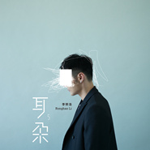
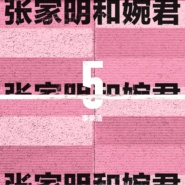
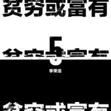
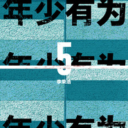
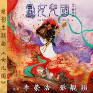
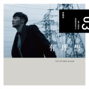

李荣浩
============================

|  |  |
| :--: | :-- |
| [ 李荣浩](https://i.xiami.com/lironghao) | **地区**: China 中国大陆 **风格**: 国语流行 Mandarin Pop, 华语唱作人 Chinese Singer-Songwriter **播放数**: 382272882 **粉丝数**: 283667 **评论数**: 3904  |

## 档案

小档案 
中 文 名：李荣浩 
国   籍：中国 
民   族：回族 
星   座：巨蟹座 
出 生 地：安徽省蚌埠市 
出生日期：1985年7月11日 
职   业：歌手、音乐制作人 
经纪公司：北京一样音乐文化发展有限公司 
代表作品：模特、李白、作曲家、喜剧之王、自拍、不搭、野生动物、有理想、不将就 
唱片公司：华纳唱片 
粉丝名称：鲸鱼 
艺人简介 
李荣浩（  1985  年  7  月  11  日－），中国大陆男歌手、词曲创作者，安徽蚌埠市人，现居北京朝阳区。  2005  年曾以创作艺人身份签约艾回唱片，为公司旗下多位歌手打造歌曲。  2013  年  9  月发行个人首张专辑《模特》正式以歌手身份出道。  2014  年李荣浩凭借《模特》专辑提名第  25  届金曲奖流行音乐类最佳国语专辑奖、最佳作词人奖、最佳专辑制作人奖、最佳国语男歌手奖、最佳新人奖  5  项大奖，新闻评论其为“最强黑马”，最终将最佳新人奖收于囊中。 
演艺经历 
2005  年签约日本艾回唱片，成为其台湾地区独家创作艺人。  2007  年，李荣浩赴台湾参与制作信专辑《我就是我》，并担任其“  2008  我就是我·北京演唱会”的表演嘉宾。 
2008  年参与制作赵薇专辑《我们都是大导演》，并担任发布会表演嘉宾；同年担任陈坤专辑《谜  &Me  》的专辑制作人。 
2010  年  2  月  4  日，担任陈坤首场演唱会《谜》音乐总监  &  吉他手。  2011  年开始担任东申童画《行走的力量》音乐总监。 
2013  年  8  月，首度携手好友陈坤演绎全新单曲《演员和歌手》；同年  9  月  17  日，发行首张个人专辑《模特》，举办“  Hao  ·  Live  ——《模特》专辑音享会”演绎专辑中的  6  首歌曲。 
2014  年  3  月  24  日，发行概念  EP  《作曲家》，获王菲力荐，称其为“帅歌”，同月入围  MusicRadio  中国  TOP  排行榜年度最受欢迎新人；同年  4  月，获得音悦台第二届“音悦  v  榜”年度最佳音悦人；  5  月参加《全球中文音乐榜上榜》，现场打榜演唱《作曲家》，同月凭借专辑《模特》入围第  25  届金曲奖最佳国语男歌手奖、最佳新人奖、最佳专辑制作人、最佳国语专辑、最佳作词奖等五项大奖提名；同年  6  月一举夺得第二十五届台湾金曲奖最佳新人奖，是内地歌手首次获得台湾金曲奖最佳新人奖的第一人，实现了从制作人到歌手的转型；同年  9  月  4  日签约华纳唱片，  11  月  28  日正式发行第二张同名专辑《李荣浩》。 
2015  年  1  月  16  日作为首位踢馆歌手参加《我是歌手第三季》第四期踢馆赛，踢馆失败；  2  月  19  日，推出首张  Live  翻唱  EP  《  iTunes Session  》，是内地乐坛首位与  iTunes  合作推出自己的  iTunes session EP  并获得全球范围推广的音乐人，也让其成为美国  iTunes  流行音乐热门专辑榜  TOP120  榜上唯一的华语歌手；  4  月  4  日，在香港举办新歌演唱会，与古巨基共同演绎《爱的太晚》；  4  月  12  日，担任林俊杰新地球世界巡回演唱会上海站嘉宾，两人重新编曲演绎《修炼爱情》  +  《模特》；  4  月  28  日，发布为电影《何以笙箫默》演唱的片尾曲《不将就》，该曲拿下  iTunes  台湾流行乐热门单曲榜  No.1  ，台湾及香港  KKBOX  综合新歌榜、整体涵盖率冠军，  KKBOX  华语单曲日榜、周榜、月榜  No.1  等；  5  月  27  日，发行为  CLINIQUE  倩碧限量版宛若新生系列创作的同名单曲《宛若新生》，并亲身拍摄同名微电影；  5  月  30-31  日，天生李荣浩巡回演唱会首站在北京万事达体育馆举办  2  场；  5  月  18  日，凭借歌曲《喜剧之王》入围第  26  届金曲奖最佳作曲人奖；  10  月  24  日，担任莫文蔚“看看”世界巡回演唱会嘉宾，合作演绎《坚强的理由》；  11  月  11  日，在双  11  晚会上与陈奕迅合作表演《你的背包》  +  《太坦白》  +  《娱乐天空》；  12  月  31  日，参加江苏卫视跨年晚会。 
2016  年  1  月  22  日，发行第三张专辑《有理想》，该专辑收货亚洲近百张榜单冠军；  5  月  20-21  日，“有理想”世界巡回演唱会首站在北京乐视体育生态中心举办  2  场；  6  月  15  日，在上海迪士尼开园盛典演唱《心世界》；  7  月  17  日，担任陈奕迅“  Another Eason  ’  s LIFE  ”演唱会深圳站嘉宾，合唱《演员和歌手》；  8  月  1  日，担任  Levi's  大中华区品牌代言人。 
主要成就 
2015      第五届全球流行音乐金榜   年度  20  大金曲  -  喜剧之王 
2015    2015qq  音乐盛典暨“巅峰榜”颁奖典礼   年度乐坛新势力 
2015      第  3  届音悦  V  榜年度盛典   音悦  Tai  传媒推荐推荐歌手 
2015      酷狗音乐亚洲盛典   年度最具潜力唱作人 
2015      第  3  届音悦  V  榜年度盛典   最佳制作人  -  内地 
2015      酷狗音乐亚洲盛典   年度最佳推介艺人 
2015      第五届全球流行音乐金榜   MusicRadio  音乐之声推崇大奖 
2015      第五届全球流行音乐金榜   年度最佳创作歌手 
2015    2015qq  音乐盛典暨“巅峰榜”颁奖典礼   内地最佳国语专辑 
2014      第二届音悦  V  榜        年度最佳音悦人

## 专辑

| 名称 | 语种 | 唱片公司 | 发行时间 | 专辑类别 | 专辑风格 |
| :--: | :-- | :-- | :-- | :-- | :-- |
| [ 麻雀Sparrow](./albums/5021144997.md) | 国语 | 一样音乐 | 2020年07月30日 | 录音室专辑 | 节奏布鲁斯 R&B, 国语流行 Mandarin Pop, 华语唱作人 Chinese Singer-Songwriter |
| [ 耳朵Ear](./albums/2104109372.md) | 国语 | 华纳音乐 | 2018年10月17日 | 录音室专辑 | 国语流行 Mandarin Pop |
| [ 张家明和婉君Zhang Jia Ming and Wan Jun](./albums/2104035722.md) | 国语 | 华纳音乐 | 2018年09月17日 | EP, 单曲 | 华语唱作人 Chinese Singer-Songwriter, 国语流行 Mandarin Pop, 节奏布鲁斯 R&B |
| [ 贫穷或富有](./albums/2103950631.md) | 国语 | 华纳音乐 | 2018年08月30日 | EP, 单曲 | 国语流行 Mandarin Pop |
| [ 年少有为If I Were Young](./albums/2103810399.md) | 国语 | 华纳音乐 | 2018年07月19日 | EP, 单曲 | 国语流行 Mandarin Pop, 华语唱作人 Chinese Singer-Songwriter, 节奏布鲁斯 R&B |
| [ 王牌冤家](./albums/2103753777.md) | 国语 | 华纳音乐 | 2018年06月22日 | EP, 单曲 | 国语流行 Mandarin Pop, 华语唱作人 Chinese Singer-Songwriter, 节奏布鲁斯 R&B |
| [ 成长之重量电影“动物世界”成长版片尾曲](./albums/2103728272.md) | 国语 | 华纳音乐 | 2018年06月03日 | EP, 单曲 | 国语流行 Mandarin Pop, 华语唱作人 Chinese Singer-Songwriter, 电影原声 Film Score |
| [ 光耀自在](./albums/2103679916.md) | 国语 | Dr.Ci:Labo | 2018年04月12日 | 播客 | 国语流行 Mandarin Pop |
| [ 任我去跑](./albums/2103591701.md) | 国语 | 耐克体育 | 2018年03月07日 | 播客 |  |
| [ 女儿国](./albums/2102966194.md) | 国语 | 燃音乐 | 2017年12月04日 | EP, 单曲 | 国语流行 Mandarin Pop |
| [ 嗯En...](./albums/2102925150.md) | 国语 | 华纳音乐 | 2017年11月17日 | 录音室专辑 | 国语流行 Mandarin Pop, 华语唱作人 Chinese Singer-Songwriter, 节奏布鲁斯 R&B |
| [ 戒烟Quit Smoking](./albums/2102919899.md) | 国语 | 华纳音乐 | 2017年11月14日 | EP, 单曲 | 国语流行 Mandarin Pop |
| [ 有理想An Ideal](./albums/430151683.md) | 国语 | 华纳音乐 | 2016年01月22日 | 录音室专辑 | 国语流行 Mandarin Pop, 华语唱作人 Chinese Singer-Songwriter, 节奏布鲁斯 R&B |
| [ 行走的力量](./albums/1232715255.md) | 国语 | 东申童画 | 2015年05月28日 | EP, 单曲 | 国语流行 Mandarin Pop, 流行摇滚 Pop Rock, 华语唱作人 Chinese Singer-Songwriter |
| [ Live Session](./albums/322932602.md) | 国语 | 华纳音乐 | 2015年02月17日 | EP, 单曲 | 国语流行 Mandarin Pop |
| [ 李荣浩Ronghao Li](./albums/1815156136.md) | 国语 | 华纳音乐 | 2014年11月28日 | 录音室专辑 | 国语流行 Mandarin Pop, 华语唱作人 Chinese Singer-Songwriter, 节奏布鲁斯 R&B |
| [ 作曲家Composer](./albums/295371379.md) | 国语 | 简单快乐 | 2014年03月24日 | EP, 单曲 | 国语流行 Mandarin Pop, 华语唱作人 Chinese Singer-Songwriter, 节奏布鲁斯 R&B |
| [ 模特Model](./albums/676981779.md) | 国语 | 简单快乐 | 2013年09月17日 | 录音室专辑 | 国语流行 Mandarin Pop, 华语唱作人 Chinese Singer-Songwriter, 节奏布鲁斯 R&B |
| [ 小黄](./albums/477558.md) | 国语 | 李荣浩音乐工作室 | 2010年09月09日 | EP, 单曲 | 国语流行 Mandarin Pop, 华语唱作人 Chinese Singer-Songwriter, 节奏布鲁斯 R&B |

## 评论

|  |  |  |
| :-- | :-- | :-- |
|  [虾米用户](https://emumo.xiami.com/u/12306228) Sing My Soul... 2020-12-08 16:48 赞(0) 踩(0) | 
评论太少不科学
 |
|  [虾米用户](https://emumo.xiami.com/u/444956858)  2020-10-26 17:28 赞(0) 踩(0) | 
呕
 |
|  [虾米用户](https://emumo.xiami.com/u/3674071)  2020-09-30 01:08 赞(0) 踩(0) | 
眼睛跟周杰伦有一拼
 |
|  [虾米用户](https://emumo.xiami.com/u/10857967) 我～就是我！不喜勿進！ 2020-07-30 18:45 赞(0) 踩(0) | 
别问，问就是新专辑《麻雀》还在&amp;ldquo;华语群星&amp;rdquo;那边
 |
|  [虾米用户](https://emumo.xiami.com/u/287173053) 我还没想好要写什么... 2020-07-11 15:23 赞(0) 踩(0) | 
关我屁事
 |
|  [虾米用户](https://emumo.xiami.com/u/24944779) 输入签名… 2020-07-11 10:32 赞(0) 踩(0) | 
关我什么事，为什么给我推送&amp;hellip;&amp;hellip;
 |
|  [虾米用户](https://emumo.xiami.com/u/403569030) 让我在活着的当下尽情享受... 2020-07-11 10:24 赞(0) 踩(0) | 
我是喜鹊变麻雀
 |
|  [虾米用户](https://emumo.xiami.com/u/245280261) 要能做到:不以物喜不以己... 2020-07-11 10:23 赞(1) 踩(0) | 
啊李荣浩原来和我同一天生日啊 ，那就㊗️你生日快乐哇哈哈哈
 |
|  [虾米用户](https://emumo.xiami.com/u/46934071) 本命年生日倒计时三天 2020-07-11 10:22 赞(0) 踩(0) | 
生日快乐
 |
|  [虾米用户](https://emumo.xiami.com/u/426272961) (:3_\)_ 2020-07-11 10:21 赞(0) 踩(0) | 
去广西[带墨镜笑]一集嘛 
 |
|  [虾米用户](https://emumo.xiami.com/u/338076280) 祝每一个能看到这的人天天... 2020-07-11 10:16 赞(0) 踩(0) | 
♡生日快乐♡
 |
|  [虾米用户](https://emumo.xiami.com/u/193295399) 我还没想好要写什么... 2020-05-27 22:46 赞(1) 踩(0) | 
啥时候再来广东！
 |
|  [虾米用户](https://emumo.xiami.com/u/193295399) 我还没想好要写什么... 2020-05-27 22:46 赞(0) 踩(0) | 
浩哥！我可以！
 |
|  [虾米用户](https://emumo.xiami.com/u/409303402)  2020-04-21 11:27 赞(0) 踩(0) | 
帅哥
 |
|  [虾米用户](https://emumo.xiami.com/u/372305927) 我还没想好要写什么... 2020-04-10 08:39 赞(0) 踩(0) | 
歌手李荣浩，你值得更多
 |
|  [虾米用户](https://emumo.xiami.com/u/20263368)  2020-03-25 21:36 赞(0) 踩(0) | 
王菲的闷可以翻唱吗？ 
 |
|  [虾米用户](https://emumo.xiami.com/u/440120079) 我还没想好要写什么 2020-03-06 11:36 赞(0) 踩(0) | 
❤️
 |
|  [虾米用户](https://emumo.xiami.com/u/11586439) 陪你拉屎!£&@! 2020-02-24 18:10 赞(0) 踩(0) | 
中途因为被毛不易的嗓子惊到，弃过李荣浩一段时间。直到有一天突然发现毛不易还是在重复自己，决定还是回来吧，原配更合拍吧。
 |
|  [虾米用户](https://emumo.xiami.com/u/440671609) 我不知道我还要等待哪个瞬... 2020-02-20 13:12 赞(2) 踩(0) | 
李白老师
 |
|  [虾米用户](https://emumo.xiami.com/u/439968792) Good 2020-01-30 12:56 赞(0) 踩(0) | 
听着歌都快睡着了。
 |
|  [虾米用户](https://emumo.xiami.com/u/409347764) 我还没想好要写什么... 2020-01-01 16:44 赞(1) 踩(0) | 
老哥，全能啊 
 |
|  [虾米用户](https://emumo.xiami.com/u/23879291)  2019-12-24 01:59 赞(0) 踩(0) | 
你的《麻雀》抄袭过份，严重警告。
 |
|  [虾米用户](https://emumo.xiami.com/u/429870622)  2019-12-16 10:22 赞(0) 踩(0) | 
唱的还行不如我唱的好
 |
|  [虾米用户](https://emumo.xiami.com/u/407165822)  2019-12-13 19:58 赞(1) 踩(0) | 
⚽️⚽️⚽️⚽️⚽️⛳️
 |
|  [虾米用户](https://emumo.xiami.com/u/82595874)  2019-11-28 18:05 赞(0) 踩(0) | 
啥时候出新专辑啊  我都等了一年了
 |
|  [虾米用户](https://emumo.xiami.com/u/266045453)  2019-11-04 18:41 赞(0) 踩(0) | 
又没有版权啊辣鸡虾米，我要这会员有何用
 |
|  [虾米用户](https://emumo.xiami.com/u/351512545) 我不要活着，我只要爱，顺... 2019-10-19 18:37 赞(0) 踩(0) | 
唱的不错
 |
|  [虾米用户](https://emumo.xiami.com/u/222481912)  2019-09-22 20:52 赞(1) 踩(0) | 
新婚快乐
 |
|  [虾米用户](https://emumo.xiami.com/u/168127948)  2019-09-20 06:32 赞(0) 踩(0) | 
杨丞琳你抢了我欧巴
 |
|  [虾米用户](https://emumo.xiami.com/u/168127948)  2019-09-20 06:30 赞(1) 踩(0) | 
喜欢你
 |
|  [虾米用户](https://emumo.xiami.com/u/353302140)  2019-09-16 04:00 赞(0) 踩(0) | 
不好意思，我是看了这届中国好声音，才知道李荣浩这个名字    不过很喜欢你的风格    
 |
| ⇒ |  [虾米用户](https://emumo.xiami.com/u/283818952) 我只是来听歌的 2020-02-14 11:12 赞(0) 踩(0) | 
啊
 |
|  [虾米用户](https://emumo.xiami.com/u/410241562)  2019-09-15 22:06 赞(0) 踩(0) | 
喜欢听他的歌
 |
|  [虾米用户](https://emumo.xiami.com/u/746612)  2019-09-15 14:58 赞(1) 踩(0) | 
只有我觉得李荣浩跟eason的嗓音以及风格都有点像吗？不过还真不错，应该是如今大陆实力唱作派的扛把子了，圈粉了。
 |
|  [虾米用户](https://emumo.xiami.com/u/85568296) 只有阳光而无阴影 只有欢... 2019-09-13 15:59 赞(0) 踩(0) | 
杨丞琳虾米唯一关注的歌手，有点甜啊
 |
|  [虾米用户](https://emumo.xiami.com/u/299192396) ᴅᴇᴀʀ  ʟᴇsʟɪᴇ 2019-09-13 09:27 赞(2) 踩(0) | 
眼睛再大那么一点点就是变成周杰伦了 
 |
|  [虾米用户](https://emumo.xiami.com/u/354864557)  2019-09-02 20:48 赞(0) 踩(0) | 
你那战队没有 
 |
|  [虾米用户](https://emumo.xiami.com/u/246379185) 雨季不再來。 2019-08-31 10:45 赞(2) 踩(0) | 
感觉李荣浩真的很有能力。 为自己的学员量身定制的歌曲。 毫无违和感。 人的气质和歌曲合二为一。 真是不得了～
 |
|  [虾米用户](https://emumo.xiami.com/u/342204245)  2019-08-25 10:16 赞(4) 踩(0) | 
李荣浩我也和你一样是巨蟹座，我妈妈比你大五个月
 |
|  [虾米用户](https://emumo.xiami.com/u/342204245)  2019-08-25 10:14 赞(2) 踩(0) | 
这首歌是他本人唱的吗
 |
|  [虾米用户](https://emumo.xiami.com/u/351134673) 音乐美化生活 2019-08-18 11:51 赞(1) 踩(0) | 
  
 |
|  [虾米用户](https://emumo.xiami.com/u/28086184)  2019-07-19 20:48 赞(1) 踩(0) | 
李荣浩，我会唱的第一首歌就是你的李白！
 |
|  [虾米用户](https://emumo.xiami.com/u/287395862)  2019-07-11 22:54 赞(1) 踩(0) | 
恭喜结婚，祝幸福
 |
|  [虾米用户](https://emumo.xiami.com/u/327687685) 李荣浩 2019-07-11 18:21 赞(1) 踩(0) | 
最好的李荣浩今天也跟他爱的女孩求婚了 要幸福！
 |
|  [虾米用户](https://emumo.xiami.com/u/404736895) ●ω● 2019-07-11 18:00 赞(1) 踩(0) | 
生日快乐呀 祝您作品越来越好 以后都能开开心心的o(≧v≦)o
 |
|  [虾米用户](https://emumo.xiami.com/u/43248313) 略 2019-07-11 14:49 赞(2) 踩(0) | 
呜呜呜呜您真的超棒的!喜欢您5年啦!今日双喜鸭!越来越好!!!
 |
|  [虾米用户](https://emumo.xiami.com/u/408744230) miii chiamoo... 2019-07-11 13:25 赞(0) 踩(0) | 
生快！
 |
|  [虾米用户](https://emumo.xiami.com/u/406543374) 我还没想好要写什么... 2019-07-11 12:38 赞(1) 踩(0) | 
生日快樂
 |
|  [虾米用户](https://emumo.xiami.com/u/286448797)   这世上唯有音乐能平复... 2019-07-11 12:26 赞(1) 踩(0) | 
生日快乐!(^O^)y
 |
|  [虾米用户](https://emumo.xiami.com/u/336329794) 我还没想好要写什么... 2019-07-11 12:20 赞(1) 踩(0) | 
李哥，表白成功，看好你哦，生日快乐。默默支持你。
 |
|  [虾米用户](https://emumo.xiami.com/u/230803304) 三观正又爱国的成都宝藏男... 2019-07-11 11:08 赞(1) 踩(0) | 
祝李荣浩生日快乐
 |
|  [虾米用户](https://emumo.xiami.com/u/20528230)   2019-07-11 10:37 赞(1) 踩(0) | 
生日快乐
 |
|  [虾米用户](https://emumo.xiami.com/u/49568487) 终 2019-07-11 10:21 赞(1) 踩(0) | 
小眼镜哥哥，生日快乐
 |
|  [虾米用户](https://emumo.xiami.com/u/330759178)  2019-07-11 10:04 赞(0) 踩(0) | 
老大生日快乐期待周末重庆相遇……
 |
|  [虾米用户](https://emumo.xiami.com/u/293696991) 生命中不能没有音乐的陪伴... 2019-07-11 10:04 赞(0) 踩(0) | 
李荣浩先生，祝你生日快乐
 |
|  [虾米用户](https://emumo.xiami.com/u/282974486) 一切毫无意义包括听你妈比... 2019-07-08 01:31 赞(0) 踩(0) | 
加油
 |
|  [虾米用户](https://emumo.xiami.com/u/355360106)  2019-06-02 13:34 赞(1) 踩(0) | 
Beautiful song  
 |
|  [虾米用户](https://emumo.xiami.com/u/261281334)  随心所欲地听歌  喜欢... 2019-05-17 19:14 赞(0) 踩(0) | 
这张图好看！
 |
|  [虾米用户](https://emumo.xiami.com/u/1186576) 无所住 2019-05-05 00:08 赞(1) 踩(0) | 
能不能让大家舒心听个歌，下架下架你妹啊
 |
|  [虾米用户](https://emumo.xiami.com/u/246379185) 雨季不再來。 2019-05-04 19:41 赞(2) 踩(0) | 
能感觉到是一个很努力的人。 这份难能可贵的坚持值得我们去学习。
 |
|  [虾米用户](https://emumo.xiami.com/u/246379185) 雨季不再來。 2019-05-04 12:52 赞(1) 踩(0) | 
好像很励志 厉害的样子哦 。
 |
|  [虾米用户](https://emumo.xiami.com/u/9374733) 诚心祝福你 捱得到新天地 2019-04-20 23:07 赞(1) 踩(0) | 
没几首可以听
 |
|  [虾米用户](https://emumo.xiami.com/u/422204900)  2019-04-20 00:21 赞(0) 踩(0) | 
谢谢你的好歇呀！
 |
|  [虾米用户](https://emumo.xiami.com/u/14835159) Jazz Voicing 2019-04-16 20:10 赞(1) 踩(0) | 
给内地音乐人长脸！！
 |
|  [虾米用户](https://emumo.xiami.com/u/421249006)  2019-04-10 19:10 赞(0) 踩(0) | 
时尚
 |
|  [虾米用户](https://emumo.xiami.com/u/421249006)  2019-04-10 19:10 赞(0) 踩(0) | 
时尚
 |
|  [虾米用户](https://emumo.xiami.com/u/411988075) 赵宇潇 2019-04-07 20:34 赞(3) 踩(0) | 
王牌对王牌中邓超把李荣浩笑死了，说他闭眼和睁眼一样的   
 |
|  [虾米用户](https://emumo.xiami.com/u/296963942)  2019-03-26 21:01 赞(1) 踩(0) | 
你好有魅力哟
 |
|  [虾米用户](https://emumo.xiami.com/u/23526312)  2019-03-23 13:00 赞(1) 踩(0) | 
喜欢你喜欢你的歌
 |
|  [虾米用户](https://emumo.xiami.com/u/378057547)  2019-03-19 05:50 赞(1) 踩(0) | 
另一个周杰伦
 |
|  [虾米用户](https://emumo.xiami.com/u/346365917) 听歌给我动力！！！ 2019-03-16 17:37 赞(0) 踩(0) | 
高兴
 |
|  [虾米用户](https://emumo.xiami.com/u/293692544) 你敢给我说话吗？我咬你 2019-03-14 17:04 赞(1) 踩(0) | 
好听
 |
|  [虾米用户](https://emumo.xiami.com/u/16310307)   2019-03-09 14:20 赞(3) 踩(0) | 
看见他在舞台上对杨丞琳那强势又甜蜜的一吻 赶紧他很爷们儿
 |
|  [虾米用户](https://emumo.xiami.com/u/420171425)  2019-03-04 19:06 赞(2) 踩(0) | 
因为有李荣浩，华语音乐乐坛便诞生了一个HERO!
 |
|  [虾米用户](https://emumo.xiami.com/u/330856075) 既然个性何须签名 2019-02-22 16:53 赞(2) 踩(0) | 
真是好听
 |
|  [虾米用户](https://emumo.xiami.com/u/346071128)  2019-02-18 12:37 赞(2) 踩(0) | 
全是尼玛广告～虾米也low了
 |
|  [虾米用户](https://emumo.xiami.com/u/6441498) 中庸、认定，坚定不移。 2019-02-14 11:22 赞(2) 踩(0) | 
《老街》   只有我一人 听得出  魔方周杰伦的《1943》
 |
| ⇒ |  [虾米用户](https://emumo.xiami.com/u/37107036)  2019-03-10 18:16 赞(0) 踩(0) | 
好像大部分听过1943的人第一次就能听出来。。
 |
|  [虾米用户](https://emumo.xiami.com/u/418564203) 用音乐来，释放自己不羁的... 2019-02-11 15:31 赞(3) 踩(0) | 
喜欢李荣浩的歌
 |
|  [虾米用户](https://emumo.xiami.com/u/341471449) 我还没想好要写什么... 2019-02-07 18:28 赞(10) 踩(0) | 
内容已删除
 |
| ⇒ |  [虾米用户](https://emumo.xiami.com/u/4344903)  2019-03-01 11:13 赞(0) 踩(0) | 
这是杨丞琳吗
 |
| ⇒ |  [虾米用户](https://emumo.xiami.com/u/269482026)  2019-03-13 18:48 赞(0) 踩(0) | 
他真把你给睡了
 |
| ⇒ |  [虾米用户](https://emumo.xiami.com/u/4344903)  2019-03-14 23:48 赞(0) 踩(0) | 
<q><b>sannyasi88说：</b></q>
 |
|  [虾米用户](https://emumo.xiami.com/u/295894205)  2019-01-28 23:30 赞(2) 踩(0) | 
我想跟你学唱歌。作词作曲。
 |
|  [虾米用户](https://emumo.xiami.com/u/412531111) 单身其实挺好 2019-01-23 16:27 赞(1) 踩(0) | 
眼睛太小
 |
| ⇒ |  [虾米用户](https://emumo.xiami.com/u/412531111) 单身其实挺好 2019-03-16 07:32 赞(0) 踩(0) | 
谢谢
 |
|  [虾米用户](https://emumo.xiami.com/u/1125942) 给您拜早年了。₍₍ (ง... 2019-01-21 22:08 赞(6) 踩(0) | 
周杰伦消失……李荣浩消失是个什么操作……
 |
|  [虾米用户](https://emumo.xiami.com/u/11227384) 这个仙儿很懒，啥也没留下... 2019-01-20 11:00 赞(2) 踩(0) | 
阿里爸爸赶快收购李荣浩、落日飞车的独家版权吧！
 |
|  [虾米用户](https://emumo.xiami.com/u/220023141) 恨不相逢未嫁时…… 2019-01-15 12:12 赞(3) 踩(0) | 
求版权啊
 |
|  [虾米用户](https://emumo.xiami.com/u/409541491)  2019-01-10 23:28 赞(2) 踩(0) | 
12345
 |
|  [虾米用户](https://emumo.xiami.com/u/114154712) 我还没想好要写什么... 2019-01-08 20:04 赞(2) 踩(0) | 
虾米怎么没版权了
 |
|  [虾米用户](https://emumo.xiami.com/u/285075445)  2019-01-04 15:59 赞(5) 踩(0) | 
年少有为啊，这么久
 |
|  [虾米用户](https://emumo.xiami.com/u/411094167)  2018-12-23 23:08 赞(2) 踩(0) | 
ILVE
 |
|  [虾米用户](https://emumo.xiami.com/u/360340608)  2018-12-22 21:02 赞(3) 踩(0) | 
版权太少了，凉凉！
 |
|  [虾米用户](https://emumo.xiami.com/u/344203983)  2018-12-16 02:53 赞(2) 踩(0) | 
好多歌都不能听   心累   在国外也就这个能用
 |
| ⇒ |  [虾米用户](https://emumo.xiami.com/u/103738454) FXXK away 2018-12-24 02:31 赞(0) 踩(0) | 
YouTube和音乐转换了解下 
 |
|  [虾米用户](https://emumo.xiami.com/u/47969282)   2018-12-14 15:20 赞(2) 踩(0) | 
比黄磊的原唱更有味道，好听
 |
|  [虾米用户](https://emumo.xiami.com/u/9062060) 此生没拿一个亿来爱虾米是... 2018-12-12 19:44 赞(1) 踩(0) | 
刚出来的时候多喜欢
 |
|  [虾米用户](https://emumo.xiami.com/u/74693278)  2018-11-30 19:10 赞(1) 踩(0) | 
没版权也敢放首页？
 |
|  [虾米用户](https://emumo.xiami.com/u/328657369) 风格随心而变、 2018-11-15 14:48 赞(2) 踩(0) | 
版权！！！
 |
|  [虾米用户](https://emumo.xiami.com/u/10857967) 我～就是我！不喜勿進！ 2018-11-10 12:50 赞(1) 踩(0) | 
李荣浩眉头一皱，发现事情并不简单
 |
|  [虾米用户](https://emumo.xiami.com/u/341471449) 我还没想好要写什么... 2018-11-10 09:01 赞(69) 踩(0) | 
我们快结婚了   
 |
| ⇒ |  [虾米用户](https://emumo.xiami.com/u/406431516) 用耳机听我的专辑会好些，... 2018-11-16 19:40 赞(0) 踩(0) | 
祝福满满，幸福满满   
 |
| ⇒ |  [虾米用户](https://emumo.xiami.com/u/1623797) 暂无签名~ 2019-04-04 00:01 赞(0) 踩(0) | 
活捉
 |
| ⇒ |  [虾米用户](https://emumo.xiami.com/u/247610643) 漫天星网不及你眼中月 2019-04-15 07:44 赞(0) 踩(0) | 
祝福 
 |
| ⇒ |  [虾米用户](https://emumo.xiami.com/u/405961857)  2019-06-13 17:25 赞(0) 踩(0) | 
全心全意的祝你们幸福美满永恒！    
 |
| ⇒ |  [虾米用户](https://emumo.xiami.com/u/415730663)  2019-07-01 21:51 赞(0) 踩(0) | 
祝福
 |
| ⇒ |  [虾米用户](https://emumo.xiami.com/u/258257310)  2019-08-05 13:19 赞(0) 踩(0) | 
你和李荣浩结婚，不会吧，还是我说错了
 |
| ⇒ |  [虾米用户](https://emumo.xiami.com/u/349287815) 无论我遇见谁我想都是命中... 2019-09-10 23:05 赞(0) 踩(0) | 
祝福
 |
| ⇒ |  [虾米用户](https://emumo.xiami.com/u/444379112) 扩圈dd我。美图ID17... 2020-08-10 15:03 赞(0) 踩(0) | 
giao突然吃了一嘴狗粮。
 |
|  [虾米用户](https://emumo.xiami.com/u/403566042) 再敢搞事情，我就让你哭得... 2018-11-06 21:24 赞(1) 踩(0) | 
魔性的贝贝，谁记得 
 |
|  [虾米用户](https://emumo.xiami.com/u/9103905) 五月天 周杰伦 Nell... 2018-11-03 01:28 赞(0) 踩(0) | 
版权又没了？？？
 |
|  [虾米用户](https://emumo.xiami.com/u/353318809)  2018-10-29 22:19 赞(4) 踩(0) | 
虾米音乐真是太垃圾了，李荣浩新专辑的歌居然听不了、说没版权，要这个VIP有啥用，垃圾！还是用回我的酷狗吧！
 |
| ⇒ |  [虾米用户](https://emumo.xiami.com/u/10857967) 我～就是我！不喜勿進！ 2018-11-02 20:02 赞(0) 踩(0) | 
周杰伦也没有5555
 |
|  [虾米用户](https://emumo.xiami.com/u/298120097) 小略up! 2018-10-29 21:48 赞(0) 踩(0) | 
都不能听惹 
 |
|  [虾米用户](https://emumo.xiami.com/u/379919536)  2018-10-28 12:05 赞(1) 踩(0) | 
贝贝的歌在哪呢
 |
| ⇒ |  [虾米用户](https://emumo.xiami.com/u/353318809)  2018-10-29 22:20 赞(0) 踩(0) | 
虾米音乐说还没有买版权，酷狗音乐用，我用酷狗听了……
 |
|  [虾米用户](https://emumo.xiami.com/u/256335260)  2018-10-27 21:28 赞(2) 踩(0) | 
贝贝～
 |
|  [虾米用户](https://emumo.xiami.com/u/339191478)   2018-10-27 16:56 赞(0) 踩(0) | 
❤
 |
|  [虾米用户](https://emumo.xiami.com/u/17931643)  2018-10-26 11:45 赞(0) 踩(0) | 
恩哦才才才才才知道，李荣浩居然是回族   
 |
| ⇒ |  [虾米用户](https://emumo.xiami.com/u/285075445)  2019-01-04 15:58 赞(0) 踩(0) | 
我还以为是朝鲜族 
 |
|  [虾米用户](https://emumo.xiami.com/u/7781572) 独立女屌！ 2018-10-22 07:11 赞(1) 踩(0) | 
什么时候可以不用去网易听李荣浩？
 |
|  [虾米用户](https://emumo.xiami.com/u/406295851) 我还没想好要写什么... 2018-10-20 15:24 赞(0) 踩(0) | 
好多歌都没版权啊，虾米请给力点好不
 |
|  [虾米用户](https://emumo.xiami.com/u/13345327) 抑郁而死 2018-10-19 17:04 赞(0) 踩(0) | 
过来吐槽贝贝 结果没找到
 |
|  [虾米用户](https://emumo.xiami.com/u/349255414) 日边清梦断，镜里朱颜改 2018-10-19 13:22 赞(1) 踩(0) | 
不是虾米音乐人吗？为什么好多版权都没有
 |
|  [虾米用户](https://emumo.xiami.com/u/190902161) 吓死你哥王八蛋 2018-10-19 06:40 赞(1) 踩(0) | 
为啥认识的好多巨蟹都是单眼皮小眼睛 
 |
|  [虾米用户](https://emumo.xiami.com/u/139106968) 重金属，摇滚，爵士 2018-10-18 21:29 赞(0) 踩(0) | 
好多歌为什么听不了啊   马云爸爸买下来啊
 |
| ⇒ |  [虾米用户](https://emumo.xiami.com/u/327457857) 我还没想好要写什么... 2018-10-24 19:13 赞(0) 踩(0) | 
马云已经退了，兄弟你还活在过去吧？
 |
|  [虾米用户](https://emumo.xiami.com/u/20015013)  2018-10-17 21:48 赞(1) 踩(0) | 
贝贝是不在虾米放吗？
 |
|  [虾米用户](https://emumo.xiami.com/u/278913907) 我只想当个好女孩 2018-10-17 16:04 赞(2) 踩(0) | 
爱死这个男人了！杨丞琳是我的情敌 
 |
|  [虾米用户](https://emumo.xiami.com/u/16396825) do you ? 2018-10-17 13:36 赞(1) 踩(0) | 
好吧，我等
 |
|  [虾米用户](https://emumo.xiami.com/u/51957819)  2018-10-17 11:43 赞(1) 踩(0) | 
8012年了！新歌都不首发的
 |
| ⇒ |  [虾米用户](https://emumo.xiami.com/u/211321956)  2018-10-17 18:46 赞(0) 踩(0) | 
虾米没版权
 |
|  [虾米用户](https://emumo.xiami.com/u/32820468) 暂无签名~ 2018-10-17 01:12 赞(1) 踩(0) | 
扣扣音乐，网易云都首页推荐新专了！我的天啊。虾米你这儿咋还这样的？？？
 |
|  [虾米用户](https://emumo.xiami.com/u/10857967) 我～就是我！不喜勿進！ 2018-10-16 01:38 赞(3) 踩(0) | 
还没等到李荣浩新专辑出来，虾米就因为没版权下架了，可悲，腾讯这是想一家独大
 |
|  [虾米用户](https://emumo.xiami.com/u/202160717) 泛舟当歌 2018-10-14 19:36 赞(1) 踩(0) | 
把李荣浩的歌都收录一下，我保证虾米你用户翻倍！
 |
|  [虾米用户](https://emumo.xiami.com/u/21926385)  2018-10-08 23:42 赞(1) 踩(0) | 
可以把版权买下来吗？网易云虾米来回听真的很累
 |
|  [虾米用户](https://emumo.xiami.com/u/285348850)  2018-10-08 23:19 赞(0) 踩(0) | 
为什么那么多人歌突然没有了！没有版权了！？？  
 |
| ⇒ |  [虾米用户](https://emumo.xiami.com/u/10857967) 我～就是我！不喜勿進！ 2018-10-14 12:35 赞(0) 踩(0) | 
周杰伦也没了
 |
| ⇒ |  [虾米用户](https://emumo.xiami.com/u/211321956)  2018-10-17 18:47 赞(0) 踩(0) | 
<q><b>王心凌的房客说：</b></q>
 |
| ⇒ |  [虾米用户](https://emumo.xiami.com/u/10857967) 我～就是我！不喜勿進！ 2018-10-17 19:24 赞(0) 踩(0) | 
<q><b>Taespkout说：</b></q>
 |
|  [虾米用户](https://emumo.xiami.com/u/277579000) bubble pop 2018-10-07 22:08 赞(0) 踩(0) | 
灰了&amp;hellip;
 |
|  [虾米用户](https://emumo.xiami.com/u/300915324)  2018-09-30 16:15 赞(1) 踩(0) | 
就喜欢你   
 |
|  [虾米用户](https://emumo.xiami.com/u/300915324)  2018-09-30 16:05 赞(1) 踩(0) | 
爱你 
 |
|  [虾米用户](https://emumo.xiami.com/u/48533038) 止于唇齿，掩于岁月 2018-09-24 01:12 赞(2) 踩(0) | 
版权、版权啊～什么时候
 |
|  [虾米用户](https://emumo.xiami.com/u/43248313) 略 2018-09-18 03:44 赞(2) 踩(0) | 
天喔想要新歌呜呜
 |
|  [虾米用户](https://emumo.xiami.com/u/49507092) 我还没想好要写什么... 2018-09-15 22:28 赞(1) 踩(0) | 
怎么没有新专辑啊啊啊
 |
|  [虾米用户](https://emumo.xiami.com/u/185848040) 伪善的人来了又走 只顾吃... 2018-09-12 19:29 赞(4) 踩(0) | 
什么时候才能在虾米听完你的歌 版权还是太少了  没有你我怎么办~
 |
|  [虾米用户](https://emumo.xiami.com/u/10857967) 我～就是我！不喜勿進！ 2018-09-10 09:13 赞(5) 踩(0) | 
一旦李荣浩的歌虾米下架了，大部分粉丝都得转移阵地了
 |
|  [虾米用户](https://emumo.xiami.com/u/337720114) It's a real ... 2018-09-09 20:41 赞(1) 踩(0) | 
版权没了 
 |
|  [虾米用户](https://emumo.xiami.com/u/378626085)  2018-09-07 21:23 赞(0) 踩(0) | 
你可以换个风格调调 歌曲很好听 到时感觉都一个感觉 以至于我只存了老街 
 |
|  [虾米用户](https://emumo.xiami.com/u/271699524) 心有林夕一点通 2018-09-04 13:03 赞(2) 踩(0) | 
内地少有的有感觉的歌手
 |
|  [虾米用户](https://emumo.xiami.com/u/402437033) 我还没想好要写什么... 2018-09-01 02:11 赞(0) 踩(0) | 
[带墨镜笑]
 |
|  [虾米用户](https://emumo.xiami.com/u/231795)  2018-08-30 23:48 赞(2) 踩(0) | 
靠，李荣浩竟然是回族，赛俩目，老铁！
 |
|  [虾米用户](https://emumo.xiami.com/u/1766200) 不要一叶障目 2018-08-30 22:17 赞(0) 踩(0) | 
这老几这么老比，我虾米买了VIP第一个关注的歌手，怪可以吧
 |
|  [虾米用户](https://emumo.xiami.com/u/9159766) 我还没想好要写什么... 2018-08-30 10:19 赞(0) 踩(0) | 
提醒我们可以听新歌，有小巧思喔
 |
|  [虾米用户](https://emumo.xiami.com/u/192793893) 咘噜 咘噜 2018-08-29 22:54 赞(1) 踩(0) | 
恶心 抄袭！
 |
|  [虾米用户](https://emumo.xiami.com/u/402812324)  2018-08-28 08:04 赞(2) 踩(0) | 
你的歌特别好听。
 |
|  [虾米用户](https://emumo.xiami.com/u/401905179)  2018-08-22 21:44 赞(0) 踩(0) | 
呵呵，666
 |
|  [虾米用户](https://emumo.xiami.com/u/361450343)  2018-08-19 18:41 赞(0) 踩(0) | 
林雪拍的真好
 |
|  [虾米用户](https://emumo.xiami.com/u/361450343)  2018-08-19 18:41 赞(0) 踩(0) | 
mv里林雪好
 |
|  [虾米用户](https://emumo.xiami.com/u/379463025) 666…… 2018-08-17 16:34 赞(1) 踩(0) | 
眼睛小的快看不见了
 |
|  [虾米用户](https://emumo.xiami.com/u/83964128) 誓死捍卫铲屎官的荣耀！ 2018-08-17 08:04 赞(0) 踩(0) | 
什么时候出新歌啊 
 |
|  [虾米用户](https://emumo.xiami.com/u/311555161)  2018-08-17 07:26 赞(0) 踩(0) | 
加油
 |
|  [虾米用户](https://emumo.xiami.com/u/18039659) 我还没想好要写什么... 2018-08-15 23:40 赞(3) 踩(0) | 
初中听觉得你为啥不火，结果过了不到五年火了，金子真的会发光的
 |
| ⇒ |  [虾米用户](https://emumo.xiami.com/u/18399683)  2018-10-06 13:39 赞(0) 踩(0) | 
五年前已经开始火了
 |
| ⇒ |  [虾米用户](https://emumo.xiami.com/u/18039659) 我还没想好要写什么... 2018-10-14 23:23 赞(0) 踩(0) | 
<q><b>浴袍说：</b></q>
 |
|  [虾米用户](https://emumo.xiami.com/u/56976844)   2018-08-15 20:33 赞(4) 踩(0) | 
你倒是把版权给虾米啊。
 |
|  [虾米用户](https://emumo.xiami.com/u/319813992) 328王嘉尔. taey... 2018-08-15 00:12 赞(3) 踩(0) | 
李荣浩的歌曲迷人之处 在于无论哪一首歌曲当中总有几句台词戳中你内心深处的灵魂是伤感、耀眼、怀念 温暖、自信、还是轻松、逗趣在他的歌曲当中会有你喜欢的
 |
|  [虾米用户](https://emumo.xiami.com/u/1674964) Solitude Lif... 2018-08-13 08:23 赞(2) 踩(0) | 
真的李荣浩太腻害了！！！
 |
|  [虾米用户](https://emumo.xiami.com/u/377881115)  2018-08-12 14:59 赞(1) 踩(0) | 
不将就
 |
|  [虾米用户](https://emumo.xiami.com/u/365436819) 年轻就要醒着拼 2018-08-10 13:38 赞(2) 踩(0) | 
我的青春是李荣浩和薛之谦 
 |
| ⇒ |  [虾米用户](https://emumo.xiami.com/u/341091392) freedom and ... 2018-08-14 23:12 赞(0) 踩(0) | 
me  too
 |
|  [虾米用户](https://emumo.xiami.com/u/200032436) 每天笋盘在我微信里chu... 2018-08-05 17:51 赞(1) 踩(0) | 
这首歌写的很好  有画面感  旋律好听  又有点午后慵懒的感觉
 |
|  [虾米用户](https://emumo.xiami.com/u/231268726)  2018-08-05 13:09 赞(0) 踩(0) | 
龙虾刑警   
 |
|  [虾米用户](https://emumo.xiami.com/u/78318652) 我们天生就是派对动物 2018-08-01 09:06 赞(0) 踩(0) | 
感觉这些首歌的曲调都好有意思阿
 |
|  [虾米用户](https://emumo.xiami.com/u/353073434)  2018-07-31 23:10 赞(0) 踩(0) | 
有时候，听你的翻唱，都会边骑车边唱出来，甚至会有人回过头，那也不管啊。你的歌声，很钟爱，听别的，好似索然无味，一种能让我安静的声音，独处的时候听，感觉悲伤也成享受。
 |
|  [虾米用户](https://emumo.xiami.com/u/52056952) 人生即是到來、相遇、陪伴... 2018-07-31 17:45 赞(0) 踩(0) | 

 |
|  [虾米用户](https://emumo.xiami.com/u/380212952) 我还没想好要写什么... 2018-07-31 11:14 赞(0) 踩(0) | 
加油！
 |
|  [虾米用户](https://emumo.xiami.com/u/364079240)  2018-07-28 19:14 赞(0) 踩(0) | 
。。。。。
 |
|  [虾米用户](https://emumo.xiami.com/u/326154311) 只有在音乐中才能找到自我... 2018-07-28 14:53 赞(0) 踩(0) | 
李荣浩长得像哪个演员来着？
 |
|  [虾米用户](https://emumo.xiami.com/u/315008910) 个性签名 2018-07-26 00:59 赞(1) 踩(0) | 
啥时候买李白版权啊～
 |
|  [虾米用户](https://emumo.xiami.com/u/339818839)  2018-07-24 23:32 赞(2) 踩(0) | 
在我这个年纪能喜欢的真是少！极少！极少至乎没有了！喜欢李荣浩的歌和声音，多么让我感动！
 |
|  [虾米用户](https://emumo.xiami.com/u/82595874)  2018-07-23 21:12 赞(1) 踩(0) | 
等了那么久，听到久违的好声音。还是那份感动。感谢荣浩。今年最大的愿望是能听一场你的演唱会。
 |
|  [虾米用户](https://emumo.xiami.com/u/374332764)  2018-07-19 23:10 赞(1) 踩(0) | 
喜欢你哦
 |
|  [虾米用户](https://emumo.xiami.com/u/4443671)  2018-07-19 17:01 赞(4) 踩(0) | 
三年前吧，国贸沃尔玛买完日用回家，BTV门口有辆车停在路边，车门开着，我和朋友感觉有人在看我们，回个头，是个眼睛好小的男人，被我们多看两眼，他突然收了腿躲进车里。走了一二百米，我在脑子搜索这人是谁...哦，是李荣浩，女伴一惊一跳的说要回去要签名，得了得了，我这个老少女害羞就算了吧，人家一定在等着进去参加节目。回想一下，眼睛这么小，没认出来，这不科学。
 |
|  [虾米用户](https://emumo.xiami.com/u/282387825) 我爱的是你爱我 2018-07-18 12:00 赞(0) 踩(0) | 
眼睛很迷人啊，干嘛说小嗯哼
 |
|  [虾米用户](https://emumo.xiami.com/u/187589144) 你只管自己去活罢 规矩捏... 2018-07-18 09:13 赞(1) 踩(0) | 
李荣浩真的写了很多好听的歌啊&amp;hellip;&amp;hellip;
 |
|  [虾米用户](https://emumo.xiami.com/u/378726314) 后悔了？不好意思，心，己... 2018-07-16 03:26 赞(1) 踩(0) | 
我只听李荣浩的歌  
 |
|  [虾米用户](https://emumo.xiami.com/u/260637577)  2018-07-14 21:04 赞(1) 踩(0) | 
                                                                
 |
|  [虾米用户](https://emumo.xiami.com/u/50575725) 锋利的人 2018-07-12 23:44 赞(0) 踩(0) | 
嘿嘿，跟李荣浩一个地方的
 |
|  [虾米用户](https://emumo.xiami.com/u/356293249)  2018-07-12 08:45 赞(0) 踩(0) | 
老师，咱去把眼镜放大点，拉个双眼皮也行   
 |
|  [虾米用户](https://emumo.xiami.com/u/242283493)  2018-07-12 07:50 赞(0) 踩(0) | 
生日快乐 
 |
|  [虾米用户](https://emumo.xiami.com/u/319448661)   2018-07-11 21:04 赞(0) 踩(0) | 
希望你一直坚持心里所想的，一直走自己最初就希望走的路 
 |
|  [虾米用户](https://emumo.xiami.com/u/325906375) 我来自这里 2018-07-11 18:40 赞(0) 踩(0) | 
挺好的
 |
|  [虾米用户](https://emumo.xiami.com/u/226418081) 我很好 2018-07-11 18:14 赞(1) 踩(0) | 
生日快乐  
 |
|  [虾米用户](https://emumo.xiami.com/u/187461344)  2018-07-11 17:18 赞(0) 踩(0) | 
小眼睛李荣浩，生日快乐哦 
 |
|  [虾米用户](https://emumo.xiami.com/u/368489432)  2018-07-11 15:16 赞(0) 踩(0) | 
生日快乐！
 |
|  [虾米用户](https://emumo.xiami.com/u/351795078)  2018-07-11 13:02 赞(0) 踩(0) | 
生日快乐
 |
|  [虾米用户](https://emumo.xiami.com/u/322332089)  2018-07-11 12:25 赞(0) 踩(0) | 
生日快樂 靦腆好男人
 |
|  [虾米用户](https://emumo.xiami.com/u/44557337)  Hi 2018-07-11 12:12 赞(0) 踩(0) | 
第一个生日快樂 
 |
|  [虾米用户](https://emumo.xiami.com/u/346987899)  2018-07-11 11:17 赞(3) 踩(0) | 
男友
 |
|  [虾米用户](https://emumo.xiami.com/u/144737316) 衬衫褶皱 2018-07-11 11:04 赞(0) 踩(0) | 
【喜欢你的音乐】 去年有幸去到你的出生地安徽蚌埠
 |
|  [虾米用户](https://emumo.xiami.com/u/352712256) 单枪匹马，没有故事。 2018-07-11 10:32 赞(0) 踩(0) | 
浩哥，生日快乐 
 |
|  [虾米用户](https://emumo.xiami.com/u/287776330)  2018-07-11 10:26 赞(0) 踩(0) | 
浩哥生日快乐，祝你越来越好。同时也期待您的新作品！
 |
|  [虾米用户](https://emumo.xiami.com/u/24479359)   2018-07-11 10:22 赞(0) 踩(0) | 
浩哥，生快
 |
|  [虾米用户](https://emumo.xiami.com/u/317541395)  2018-07-11 10:22 赞(0) 踩(0) | 
生日快乐 
 |
|  [虾米用户](https://emumo.xiami.com/u/324899743) # 精神鸦片 2018-07-11 10:20 赞(1) 踩(0) | 
生日快乐!喜欢你的音乐!会一直支持你的!
 |
|  [虾米用户](https://emumo.xiami.com/u/69663436)  2018-07-11 10:19 赞(0) 踩(0) | 

 |
|  [虾米用户](https://emumo.xiami.com/u/232476938)  2018-07-11 10:15 赞(0) 踩(0) | 
谢谢李荣浩
 |
|  [虾米用户](https://emumo.xiami.com/u/49847336) 是金子总会发光的 2018-07-11 10:12 赞(0) 踩(0) | 

 |
|  [虾米用户](https://emumo.xiami.com/u/85201548)   2018-07-11 10:12 赞(0) 踩(0) | 
生日快乐
 |
|  [虾米用户](https://emumo.xiami.com/u/376963533)  2018-07-11 10:11 赞(1) 踩(0) | 
我俩是同一天的生日，你也要祝福我才对啊，嘿嘿嘿
 |
|  [虾米用户](https://emumo.xiami.com/u/365243047) 你最近还好吗 2018-07-11 10:08 赞(0) 踩(0) | 
喜欢老街，喜欢不将就，喜欢你，生日快乐！
 |
|  [虾米用户](https://emumo.xiami.com/u/325846785) 渺小如尘 伟岸如山 2018-07-11 10:08 赞(0) 踩(0) | 
生日快乐
 |
|  [虾米用户](https://emumo.xiami.com/u/8834664) 音乐能陪伴你一生！ 2018-07-11 10:06 赞(0) 踩(0) | 
听他的不将就才开始关注他！
 |
|  [虾米用户](https://emumo.xiami.com/u/282798352)   2018-07-11 10:05 赞(0) 踩(0) | 
生日快乐，希望一直写多些好歌，我们这些老粉会一直棒场
 |
|  [虾米用户](https://emumo.xiami.com/u/375240758) See if I car... 2018-07-11 10:05 赞(1) 踩(0) | 
戒了烟我不习惯 没有你我怎么办
 |
|  [虾米用户](https://emumo.xiami.com/u/345235153) Love is mise... 2018-07-11 10:04 赞(0) 踩(0) | 
生日快乐
 |
|  [虾米用户](https://emumo.xiami.com/u/329831977)  2018-07-11 10:04 赞(0) 踩(0) | 
生日快乐 最会讲故事的小眼睛男人
 |
|  [虾米用户](https://emumo.xiami.com/u/332575159) 众生皆苦，你是草莓味。 2018-07-11 10:04 赞(0) 踩(0) | 
话不多说，就喜欢你
 |
|  [虾米用户](https://emumo.xiami.com/u/377879612)  2018-07-07 16:11 赞(0) 踩(0) | 

 |
|  [虾米用户](https://emumo.xiami.com/u/282387825) 我爱的是你爱我 2018-07-06 23:32 赞(3) 踩(0) | 
喜欢杨丞琳的有没
 |
|  [虾米用户](https://emumo.xiami.com/u/260680365) BAEKHYUN 2018-07-05 14:14 赞(0) 踩(0) | 
图片集假的吧
 |
|  [虾米用户](https://emumo.xiami.com/u/300120393) 理想今年你几岁 2018-07-04 14:51 赞(0) 踩(0) | 
感觉李荣浩声音很man
 |
|  [虾米用户](https://emumo.xiami.com/u/338502402)  2018-06-30 19:00 赞(0) 踩(0) | 
巨蟹来听巨蟹的歌
 |
|  [虾米用户](https://emumo.xiami.com/u/336534649)  2018-06-21 20:54 赞(1) 踩(0) | 
安徽老乡来打卡
 |
|  [虾米用户](https://emumo.xiami.com/u/351040602) 嗯 2018-06-20 10:13 赞(1) 踩(0) | 
老乡
 |
| ⇒ |  [虾米用户](https://emumo.xiami.com/u/336534649)  2018-06-21 20:54 赞(0) 踩(0) | 
安徽人打卡
 |
|  [虾米用户](https://emumo.xiami.com/u/373535698)  2018-06-19 21:41 赞(0) 踩(0) | 
特喜欢老街这首歌，
 |
|  [虾米用户](https://emumo.xiami.com/u/48791475) 一个不知好歹的朋友 2018-06-19 10:44 赞(0) 踩(0) | 
才发现 原来我和李荣浩是同月同日
 |
| ⇒ |  [虾米用户](https://emumo.xiami.com/u/309934563)  2018-06-19 13:54 赞(0) 踩(0) | 
同日吗？
 |
| ⇒ |  [虾米用户](https://emumo.xiami.com/u/48791475) 一个不知好歹的朋友 2018-06-20 18:57 赞(0) 踩(0) | 
<q><b>未知生物说：</b></q>
 |
| ⇒ |  [虾米用户](https://emumo.xiami.com/u/309934563)  2018-06-20 22:51 赞(0) 踩(0) | 
<q><b>Emma_说：</b></q>
 |
|  [虾米用户](https://emumo.xiami.com/u/375921357)  2018-06-17 09:24 赞(0) 踩(0) | 
超喜欢听浩浩的歌
 |
|  [虾米用户](https://emumo.xiami.com/u/266239614) 年轻人不那么愤世嫉俗，也... 2018-06-17 05:29 赞(0) 踩(0) | 
唯一一个值得关注的音乐人
 |
|  [虾米用户](https://emumo.xiami.com/u/314408181) 我还没想好要写什么... 2018-06-14 09:34 赞(0) 踩(0) | 
期待你来开演唱会
 |
|  [虾米用户](https://emumo.xiami.com/u/346987899)  2018-06-12 22:03 赞(5) 踩(0) | 
我来了
 |
|  [虾米用户](https://emumo.xiami.com/u/367679326)  2018-06-10 07:57 赞(0) 踩(0) | 
我喜欢你5年
 |
|  [虾米用户](https://emumo.xiami.com/u/324482482)  2018-06-08 13:08 赞(0) 踩(0) | 
66666
 |
|  [虾米用户](https://emumo.xiami.com/u/355323609)  2018-06-08 12:57 赞(0) 踩(0) | 
歌很好听。希望希望你能再次写一首歌。               
 |
|  [虾米用户](https://emumo.xiami.com/u/374876575)  2018-06-08 12:01 赞(0) 踩(0) | 
歌很好听，期待你的下一首
 |
|  [虾米用户](https://emumo.xiami.com/u/1102881)  2018-06-07 22:10 赞(0) 踩(0) | 
天空  大地  平视   
 |
|  [虾米用户](https://emumo.xiami.com/u/1102881)  2018-06-07 22:08 赞(0) 踩(0) | 
花生儿  慢慢煲   
 |
|  [虾米用户](https://emumo.xiami.com/u/361925010) 先定个小目标，进年级前一... 2018-06-07 22:03 赞(0) 踩(0) | 
才华横溢 
 |
|  [虾米用户](https://emumo.xiami.com/u/324834829)  2018-06-06 21:05 赞(0) 踩(0) | 
666666666 
 |
| ⇒ |  [虾米用户](https://emumo.xiami.com/u/1102881)  2018-06-07 22:09 赞(0) 踩(0) | 
88  88  88
 |
|  [虾米用户](https://emumo.xiami.com/u/324834829)  2018-06-06 21:05 赞(0) 踩(0) | 
666666
 |
|  [虾米用户](https://emumo.xiami.com/u/374738575)  2018-06-05 20:17 赞(0) 踩(0) | 
                                           
 |
|  [虾米用户](https://emumo.xiami.com/u/374738575)  2018-06-05 20:16 赞(0) 踩(0) | 
李荣浩真帅气
 |
|  [虾米用户](https://emumo.xiami.com/u/351888789) 灿烈 2018-06-05 17:42 赞(2) 踩(0) | 
好喜欢在偶像练习生里的样子   好可爱
 |
|  [虾米用户](https://emumo.xiami.com/u/374688622) 即使沮丧，也要面朝阳光 2018-06-05 09:56 赞(0) 踩(0) | 
好听    
 |
|  [虾米用户](https://emumo.xiami.com/u/332706207) 我与你的关系？ 2018-06-04 20:02 赞(0) 踩(0) | 
李荣浩帅呆了，唱歌好听极了
 |
| ⇒ |  [虾米用户](https://emumo.xiami.com/u/374738575)  2018-06-05 20:18 赞(0) 踩(0) | 
q
 |
|  [虾米用户](https://emumo.xiami.com/u/332706207) 我与你的关系？ 2018-06-04 20:01 赞(0) 踩(0) | 
好听
 |
|  [虾米用户](https://emumo.xiami.com/u/277957297) 有你就好…… 2018-06-04 12:18 赞(0) 踩(0) | 
好听
 |
|  [虾米用户](https://emumo.xiami.com/u/610625) 暮雪朝霜，毋改英雄意气 2018-06-04 00:08 赞(1) 踩(0) | 
哈哈哈哈哈，刚看完他和陈奕迅调侃说：我不会唱歌，你唱得好，你来！ 
 |
| ⇒ |  [虾米用户](https://emumo.xiami.com/u/17245303)  2018-06-05 17:47 赞(0) 踩(0) | 
哈哈哈
 |
|  [虾米用户](https://emumo.xiami.com/u/340156893) 哈哈哈O(∩_∩)O哈哈... 2018-06-02 13:42 赞(0) 踩(0) | 
哈哈哈哈哈哈哈哈哈哈哈哈哈哈哈哈哈哈哈哈哈哈哈哈哈哈哈滚滚滚古古怪怪古古怪怪嘎嘎嘎嘎嘎哈哈哈哈哈哈哈哈哈哈哈哈
 |
|  [虾米用户](https://emumo.xiami.com/u/10893687)  2018-05-28 10:31 赞(0) 踩(0) | 
再见，大家继续
 |
|  [虾米用户](https://emumo.xiami.com/u/324037825) 服了你..... 2018-05-22 11:32 赞(0) 踩(0) | 
超好听
 |
|  [虾米用户](https://emumo.xiami.com/u/355323609)  2018-05-21 12:50 赞(0) 踩(0) | 

 |
|  [虾米用户](https://emumo.xiami.com/u/355323609)  2018-05-21 12:50 赞(0) 踩(0) | 
        
 |
|  [虾米用户](https://emumo.xiami.com/u/366963404)  2018-05-14 07:15 赞(0) 踩(0) | 
好听，过来人过来人。李荣浩，你是我的偶偶
 |
|  [虾米用户](https://emumo.xiami.com/u/365436819) 年轻就要醒着拼 2018-05-12 19:20 赞(1) 踩(0) | 
蟹蟹你
 |
|  [虾米用户](https://emumo.xiami.com/u/99625594) 分裂 2018-05-12 17:24 赞(2) 踩(0) | 
我发现不仅仅因为我们是一个地方我才喜欢你的 作词作曲制作人编曲吉他贝斯：李荣浩！[微笑]
 |
|  [虾米用户](https://emumo.xiami.com/u/348475173)  2018-05-12 11:14 赞(0) 踩(0) | 
老街 
 |
|  [虾米用户](https://emumo.xiami.com/u/339340944)  2018-05-12 05:46 赞(2) 踩(0) | 
其实，我觉得&amp;ldquo;喜剧之王&amp;quot;好听，好听到想哭!有兴趣的朋友可以听一下，我给满分。
 |
|  [虾米用户](https://emumo.xiami.com/u/257903237) 姚倩 2018-05-11 19:20 赞(0) 踩(0) | 
歌词写的好，调有高底，我不懂音乐，只是觉得旋律太慢了
 |
|  [虾米用户](https://emumo.xiami.com/u/250400459)  2018-05-08 22:04 赞(2) 踩(0) | 
感觉李荣浩每一首歌都是精品，希望还能火下去
 |
|  [虾米用户](https://emumo.xiami.com/u/214419491) 我不习惯 2018-05-06 14:05 赞(2) 踩(0) | 
小小的眼睛里充满了大大的疑惑
 |
|  [虾米用户](https://emumo.xiami.com/u/3223407) good vibe 2018-05-05 15:27 赞(0) 踩(0) | 
回族？
 |
|  [虾米用户](https://emumo.xiami.com/u/362854929)  2018-05-05 10:30 赞(1) 踩(0) | 
太重口味了 人就是这么死的
 |
|  [虾米用户](https://emumo.xiami.com/u/318458442) 此情可待成追忆，只是当时... 2018-05-04 12:17 赞(2) 踩(0) | 
眼睛小怎么了，长的不好看怎么了，颜值成为了这个世界的全部了吗。。。。人家唱歌那么好听，又自己创作，才华横溢啊
 |
|  [虾米用户](https://emumo.xiami.com/u/356892017)  2018-04-30 21:28 赞(0) 踩(0) | 
最喜欢你的《老街》
 |
|  [虾米用户](https://emumo.xiami.com/u/359570137)  2018-04-27 12:10 赞(0) 踩(0) | 
22
 |
|  [虾米用户](https://emumo.xiami.com/u/359597766)  2018-04-21 23:08 赞(1) 踩(0) | 
好听
 |
|  [虾米用户](https://emumo.xiami.com/u/356881513) 我真的还没想好要写什么.... 2018-04-21 17:54 赞(0) 踩(0) | 
嗯
 |
|  [虾米用户](https://emumo.xiami.com/u/359441356)  2018-04-21 08:53 赞(0) 踩(0) | 
？
 |
|  [虾米用户](https://emumo.xiami.com/u/334935388)  2018-04-16 18:24 赞(0) 踩(0) | 
好听
 |
|  [虾米用户](https://emumo.xiami.com/u/347311504)  2018-04-15 10:49 赞(0) 踩(0) | 
剿匪記ㄥ丨ㄥㄥㄥ一
 |
| ⇒ |  [虾米用户](https://emumo.xiami.com/u/359066124) 真心换真情 2018-04-19 14:18 赞(0) 踩(0) | 
&lt;[url=/u/291137902]@少女时代中文首站[/url] &gt;&lt;291137902&gt;
 |
|  [虾米用户](https://emumo.xiami.com/u/357979713) 我们一直在等有趣的你/2... 2018-04-13 17:37 赞(0) 踩(0) | 
才华男李荣浩5-18空降MTA天漠音乐节 大家了解一下
 |
|  [虾米用户](https://emumo.xiami.com/u/10857967) 我～就是我！不喜勿進！ 2018-04-08 23:05 赞(4) 踩(0) | 
周杰伦：终于有人眼睛比我小了
 |
|  [虾米用户](https://emumo.xiami.com/u/188902054) born in 2002 2018-04-06 23:19 赞(0) 踩(0) | 
李荣浩太有才了
 |
|  [虾米用户](https://emumo.xiami.com/u/356347986)  2018-04-05 18:55 赞(0) 踩(0) | 
好
 |
|  [虾米用户](https://emumo.xiami.com/u/327802658) 爱笑的人才是心事最多的人 2018-04-05 09:50 赞(2) 踩(0) | 
有才华啊，励志成为像李荣浩一样的人。   
 |
| ⇒ |  [虾米用户](https://emumo.xiami.com/u/49385271) 何言ってー 2018-04-12 20:41 赞(0) 踩(0) | 
那你也需要有他的声音啊
 |
| ⇒ |  [虾米用户](https://emumo.xiami.com/u/327802658) 爱笑的人才是心事最多的人 2018-04-13 17:08 赞(0) 踩(0) | 
<q><b>女又力力说：</b></q>
 |
|  [虾米用户](https://emumo.xiami.com/u/351434305)  2018-04-04 12:39 赞(0) 踩(0) | 
很好哦
 |
|  [虾米用户](https://emumo.xiami.com/u/346462124)  2018-04-03 13:49 赞(0) 踩(0) | 
这是写给杨丞琳的吗？倦怠后懒懒的幸福？这狗狼味道不错。
 |
|  [虾米用户](https://emumo.xiami.com/u/272470767) 啦啦啦～ 2018-04-01 22:37 赞(1) 踩(0) | 
冷火 - 信 作词：信 作曲：李荣浩 用刺青感慨 褪色的等待 淌出血水的纠缠 用烛光将爱 过往 燃 让电视表演 对白 回音在房间 徘徊 在独白 恋人之间的答案 用谎言归还 你给的不堪 让心的皱纹平淡 用冷漠代替火种 烧你的承诺 用烟当作针线缝 魂魄 迟来的幽默 存活 在我心中 用来解冻 用时间认养伤口 废墟般瞳孔 拼凑的灵魂吶喊 就够 我的温柔 我的宽容 相反的梦 原来 只是借口 夜已在沸腾 心却已无声 熟悉街道找余温 微醺的拥抱 假装 能栖身 痛就要越陷越深
 |
| ⇒ |  [虾米用户](https://emumo.xiami.com/u/344583090)  2018-04-29 17:52 赞(0) 踩(0) | 
哎呀，信迷
 |
|  [虾米用户](https://emumo.xiami.com/u/272470767) 啦啦啦～ 2018-04-01 22:33 赞(1) 踩(0) | 
为什么苏见信的风格和李荣浩的曲很配
 |
|  [虾米用户](https://emumo.xiami.com/u/356412831)  2018-04-01 17:14 赞(3) 踩(0) | 
薛之谦的无奈，你的平淡，都是我们生活的态度 
 |
|  [虾米用户](https://emumo.xiami.com/u/287676985)  2018-04-01 16:50 赞(0) 踩(0) | 
好听的歌曲和歌词值得收藏 也恳请你加油让我们能够听更多好音乐
 |
|  [虾米用户](https://emumo.xiami.com/u/320444579) 快乐大本营初见金茶蛋，惊... 2018-03-30 22:53 赞(0) 踩(0) | 
李荣浩真的很温柔～
 |
|  [虾米用户](https://emumo.xiami.com/u/342962410) 别视奸，在评论都说了 2018-03-30 21:51 赞(2) 踩(0) | 
李荣浩老师真是太不荣易了
 |
|  [虾米用户](https://emumo.xiami.com/u/134186492)  2018-03-30 16:55 赞(1) 踩(0) | 
和你是老乡，爱你的歌
 |
|  [虾米用户](https://emumo.xiami.com/u/354825527)  2018-03-25 15:39 赞(1) 踩(0) | 
好听 
 |
|  [虾米用户](https://emumo.xiami.com/u/1008344) 静下心来，才听得见美好。 2018-03-21 16:51 赞(1) 踩(0) | 
哇！您在这里呀哈哈！您的歌好好听啊 
 |
|  [虾米用户](https://emumo.xiami.com/u/83363464) 想把你写成一首歌想养一群... 2018-03-20 03:03 赞(3) 踩(0) | 
好
 |
|  [虾米用户](https://emumo.xiami.com/u/346029791) 缺 2018-03-18 09:39 赞(2) 踩(0) | 
o
 |
|  [虾米用户](https://emumo.xiami.com/u/303506160) 因为我对你爱的深沉 2018-03-16 00:54 赞(3) 踩(0) | 
嘿呦
 |
|  [虾米用户](https://emumo.xiami.com/u/69452640) 想陪你默默地吃半个西瓜 ... 2018-03-11 01:23 赞(2) 踩(0) | 
我的故事全在你的歌里
 |
|  [虾米用户](https://emumo.xiami.com/u/347347758) 666 2018-03-10 10:55 赞(2) 踩(0) | 
666
 |
|  [虾米用户](https://emumo.xiami.com/u/335704405)  2018-03-07 11:19 赞(3) 踩(0) | 
声甜人还帅，无敌了
 |
| ⇒ |  [虾米用户](https://emumo.xiami.com/u/354511164)  2018-03-15 22:13 赞(0) 踩(0) | 
对
 |
| ⇒ |  [虾米用户](https://emumo.xiami.com/u/335704405)  2018-03-15 23:45 赞(0) 踩(0) | 
<q><b>身在福中不知福说：</b></q>
 |
|  [虾米用户](https://emumo.xiami.com/u/314949778)  2018-03-03 17:15 赞(2) 踩(0) | 
  
 |
|  [虾米用户](https://emumo.xiami.com/u/314949778)  2018-03-03 17:15 赞(1) 踩(0) | 
好听
 |
|  [虾米用户](https://emumo.xiami.com/u/311479018)   2018-03-03 11:22 赞(1) 踩(0) | 
虾米
 |
|  [虾米用户](https://emumo.xiami.com/u/311479018)   2018-03-03 10:27 赞(0) 踩(0) | 
嗯嗯
 |
|  [虾米用户](https://emumo.xiami.com/u/339247634) 最爱老李，喜欢刀郎黄安 2018-03-02 04:52 赞(0) 踩(0) | 
老李 慢慢喜欢你好听哭了。最近谈恋爱写歌都甜了。三专四专词品大爆发大爱。最近情歌有点多呢。 老李新专辑很期待 那首跑步时写的。对了请把你每年写的100首歌全发出来吧。一天一首歌   O(&amp;cap;_&amp;cap;)O哈哈~。。多多参加综艺。把很久以前写的也发出来吧。满座真的是最最最喜欢的一首歌。一直支持你。不要被别人影响了你。老李加油↖(^&amp;omega;^)↗ 
 |
|  [虾米用户](https://emumo.xiami.com/u/309744468) 鹿，怒，路，帅。浩哥也帅... 2018-02-27 09:16 赞(0) 踩(0) | 
《老街》这首歌，浩哥写的好。(╥╯^╰╥)
 |
|  [虾米用户](https://emumo.xiami.com/u/309744468) 鹿，怒，路，帅。浩哥也帅... 2018-02-27 09:15 赞(0) 踩(0) | 
《老街》让我想起了，爸妈。(╥╯^╰╥)
 |
|  [虾米用户](https://emumo.xiami.com/u/309744468) 鹿，怒，路，帅。浩哥也帅... 2018-02-27 09:02 赞(0) 踩(0) | 
浩哥，就是好听。
 |
|  [虾米用户](https://emumo.xiami.com/u/343327134)  2018-02-26 15:06 赞(0) 踩(0) | 
支持荣浩三年了
 |
| ⇒ |  [虾米用户](https://emumo.xiami.com/u/309744468) 鹿，怒，路，帅。浩哥也帅... 2018-02-27 09:02 赞(0) 踩(0) | 
我也是，
 |
|  [虾米用户](https://emumo.xiami.com/u/352188391)  2018-02-25 00:30 赞(0) 踩(0) | 
  
 |
|  [虾米用户](https://emumo.xiami.com/u/279891565)  2018-02-24 22:20 赞(0) 踩(0) | 
嘿嘿  
 |
|  [虾米用户](https://emumo.xiami.com/u/352075625)  2018-02-24 11:49 赞(0) 踩(0) | 
浩哥和薛之谦的声音都是很独特 的我一听就知道
 |
|  [虾米用户](https://emumo.xiami.com/u/352075625)  2018-02-24 11:48 赞(0) 踩(0) | 
好听
 |
|  [虾米用户](https://emumo.xiami.com/u/307093834)  2018-02-22 17:28 赞(1) 踩(0) | 
实话，眼镜大一点就周杰伦了
 |
|  [虾米用户](https://emumo.xiami.com/u/187386388) 愿你被世界温柔相待。 2018-02-21 10:40 赞(0) 踩(0) | 
女儿国真的很好，电影是，歌也是。
 |
|  [虾米用户](https://emumo.xiami.com/u/263454717)  2018-02-20 16:22 赞(0) 踩(0) | 
浩哥唱的好。
 |
|  [虾米用户](https://emumo.xiami.com/u/243527245) 爱华一万年 2018-02-17 10:25 赞(3) 踩(0) | 
2016的下半年，在我最困难的半年里，孤单，想回家，你的歌陪伴着我，2017的上半年，是我最开心的时候，我仿佛有了整个世界，李荣浩，你自己不知道你对我来说有多重要，谢谢你，陪我走过那最困难的路。
 |
|  [虾米用户](https://emumo.xiami.com/u/312105221)  2018-02-16 20:13 赞(1) 踩(0) | 
老大啊我对你以前的歌很有感觉李白啊模特啊爸爸妈妈老街什么的我都很喜欢，但是近来新出的后翼啊戒烟啊甚至裙娣我都不是很喜欢，没有感觉啊这些歌。我希望你18年越来越好，新年快乐。（其实我有点觉得你是谈恋爱啊写不出伤感歌了哈哈哈999999）
 |
| ⇒ |  [虾米用户](https://emumo.xiami.com/u/339247634) 最爱老李，喜欢刀郎黄安 2018-03-02 04:57 赞(0) 踩(0) | 
谈恋爱当然要写甜歌啊 多听几遍。
 |
|  [虾米用户](https://emumo.xiami.com/u/310359363)  2018-02-16 00:55 赞(0) 踩(0) | 
加油
 |
|  [虾米用户](https://emumo.xiami.com/u/348307773)  2018-02-15 00:35 赞(1) 踩(0) | 
你唱的歌很好听
 |
|  [虾米用户](https://emumo.xiami.com/u/346292244) 我还没想好要写什么... 2018-02-13 10:40 赞(0) 踩(0) | 
     
 |
|  [虾米用户](https://emumo.xiami.com/u/271169707) 找个爱人的啊 2018-02-13 07:25 赞(1) 踩(0) | 
好听你好棒哒
 |
|  [虾米用户](https://emumo.xiami.com/u/296202376) 爱丽丝一枚 2018-02-12 23:16 赞(3) 踩(0) | 
荣浩老师，还记得我不？爱奇艺上的，那个说您演电视剧的
 |
| ⇒ |  [虾米用户](https://emumo.xiami.com/u/350054984)  2018-02-13 08:08 赞(0) 踩(0) | 
哈哈哈，我记得
 |
| ⇒ |  [虾米用户](https://emumo.xiami.com/u/339247634) 最爱老李，喜欢刀郎黄安 2018-03-02 04:54 赞(0) 踩(0) | 
O(&amp;cap;_&amp;cap;)O哈哈~要不要仔细了解一下搞笑博主李荣浩
 |
|  [虾米用户](https://emumo.xiami.com/u/60825706)  2018-02-12 17:29 赞(0) 踩(0) | 
你好，期待合作，我微信1182976762
 |
|  [虾米用户](https://emumo.xiami.com/u/349776513)  2018-02-11 23:58 赞(0) 踩(0) | 
1792636498
 |
|  [虾米用户](https://emumo.xiami.com/u/349541801)  2018-02-11 17:18 赞(0) 踩(0) | 
老大
 |
|  [虾米用户](https://emumo.xiami.com/u/325143321) 就这 2018-02-10 11:22 赞(2) 踩(0) | 
我是一个粤语迷，爱听周耀辉林夕的粤语。但我很喜欢李荣浩，这要问问耀辉，李荣浩就像一个内地的麦浚龙。
 |
|  [虾米用户](https://emumo.xiami.com/u/284080393)  2018-02-10 00:58 赞(1) 踩(0) | 
呦呦呦
 |
|  [虾米用户](https://emumo.xiami.com/u/311560560) 将来吧。 2018-02-06 14:00 赞(0) 踩(0) | 
我是你铁粉
 |
| ⇒ |  [虾米用户](https://emumo.xiami.com/u/339247634) 最爱老李，喜欢刀郎黄安 2018-02-07 17:17 赞(0) 踩(0) | 
一样一样
 |
|  [虾米用户](https://emumo.xiami.com/u/86141784) 在音乐的世界里寻找快乐和... 2018-02-04 17:22 赞(2) 踩(0) | 
第一次觉得小眼睛的男人也好迷人 
 |
|  [虾米用户](https://emumo.xiami.com/u/212848613)  2018-02-04 09:52 赞(4) 踩(0) | 
看了偶像练习生特别喜欢他。
 |
| ⇒ |  [虾米用户](https://emumo.xiami.com/u/349776513)  2018-02-11 23:58 赞(0) 踩(0) | 
112
 |
|  [虾米用户](https://emumo.xiami.com/u/213538662)  2018-02-03 15:31 赞(0) 踩(0) | 
我爱你李荣浩
 |
|  [虾米用户](https://emumo.xiami.com/u/303506160) 因为我对你爱的深沉 2018-02-02 00:36 赞(0) 踩(0) | 
嘿呦
 |
|  [虾米用户](https://emumo.xiami.com/u/339247634) 最爱老李，喜欢刀郎黄安 2018-01-30 22:43 赞(0) 踩(0) | 
内容已删除
 |
| ⇒ |  [虾米用户](https://emumo.xiami.com/u/78035476)   2018-02-02 10:30 赞(0) 踩(0) | 
这&amp;middot;&amp;middot;&amp;middot;&amp;middot;&amp;middot;&amp;middot;
 |
|  [虾米用户](https://emumo.xiami.com/u/339247634) 最爱老李，喜欢刀郎黄安 2018-01-30 22:32 赞(1) 踩(0) | 
老李头，加油↖(^&amp;omega;^)↗，鲸鱼一直都在
 |
|  [虾米用户](https://emumo.xiami.com/u/242006474) 老胖子才不会管你多狂，干... 2018-01-30 20:10 赞(2) 踩(0) | 
我不能影响他们
 |
|  [虾米用户](https://emumo.xiami.com/u/346807076)  2018-01-29 08:20 赞(0) 踩(0) | 
李白6皮
 |
|  [虾米用户](https://emumo.xiami.com/u/331917715)  2018-01-28 17:48 赞(1) 踩(0) | 
《就这样》
 |
|  [虾米用户](https://emumo.xiami.com/u/331917715)  2018-01-28 17:47 赞(2) 踩(0) | 
我觉得就这样最好听，MV也很好，鲸鱼们可以试一下&amp;hellip;&amp;hellip; 
 |
| ⇒ |  [虾米用户](https://emumo.xiami.com/u/339247634) 最爱老李，喜欢刀郎黄安 2018-01-30 22:31 赞(0) 踩(0) | 
嗯嗯，很好听，刚开始不是很喜欢，但听了几遍太好听了 就这样，你不用不自然 
 |
|  [虾米用户](https://emumo.xiami.com/u/331917715)  2018-01-28 17:46 赞(3) 踩(0) | 
54鲸鱼
 |
|  [虾米用户](https://emumo.xiami.com/u/126188490) 我就好了 2018-01-27 20:09 赞(4) 踩(0) | 
李荣浩不将就，在这种万物商业化的背景下他依然坚持着自己的风格，不妥协于所谓流行，我称之为有能力平凡，即为艺术。 依然最喜欢这位歌手。
 |
|  [虾米用户](https://emumo.xiami.com/u/206755669) 希望我能遇到血统最纯正的... 2018-01-26 10:55 赞(0) 踩(0) | 
我不能影响他们
 |
|  [虾米用户](https://emumo.xiami.com/u/37897972)  2018-01-24 22:10 赞(0) 踩(0) | 
公告上的啊是哪啊两首歌？可以听了？
 |
| ⇒ |  [虾米用户](https://emumo.xiami.com/u/10857967) 我～就是我！不喜勿進！ 2018-02-06 15:00 赞(0) 踩(0) | 
那个是很久以前的公告吧，一直没更新
 |
| ⇒ |  [虾米用户](https://emumo.xiami.com/u/10857967) 我～就是我！不喜勿進！ 2018-02-06 15:58 赞(0) 踩(0) | 
应该是2014年写的公告，还没签约华纳之前的两首歌《作曲家》《哎呀》
 |
|  [虾米用户](https://emumo.xiami.com/u/346141407)  2018-01-24 14:27 赞(0) 踩(0) | 
怎么关注你？
 |
|  [虾米用户](https://emumo.xiami.com/u/261332301) 我还没想好要写什么... 2018-01-21 02:40 赞(1) 踩(0) | 
挺不错的
 |
|  [虾米用户](https://emumo.xiami.com/u/38512657) 我还没想好要写什么... 2018-01-17 11:59 赞(0) 踩(0) | 
声音好听
 |
|  [虾米用户](https://emumo.xiami.com/u/202019543) 轩轩只为我。 2018-01-17 00:39 赞(1) 踩(0) | 
帅帅的浩浩
 |
|  [虾米用户](https://emumo.xiami.com/u/340883975)  2018-01-16 21:20 赞(0) 踩(0) | 
感谢你
 |
|  [虾米用户](https://emumo.xiami.com/u/32063004)  2018-01-16 09:00 赞(1) 踩(0) | 
突然发现，乘风破浪里的老大是不是就是李荣浩？
 |
| ⇒ |  [虾米用户](https://emumo.xiami.com/u/85008772)  2018-01-18 23:08 赞(0) 踩(0) | 
你才知道。。。  
 |
| ⇒ |  [虾米用户](https://emumo.xiami.com/u/32063004)  2018-03-20 20:00 赞(0) 踩(0) | 
<q><b>浮生千山路说：</b></q>
 |
|  [虾米用户](https://emumo.xiami.com/u/341140918)  2018-01-14 08:05 赞(0) 踩(0) | 
垃圾
 |
| ⇒ |  [虾米用户](https://emumo.xiami.com/u/311560560) 将来吧。 2018-02-07 19:38 赞(0) 踩(0) | 
不可眙
 |
| ⇒ |  [虾米用户](https://emumo.xiami.com/u/346029791) 缺 2018-03-18 09:40 赞(0) 踩(0) | 
你垃圾
 |
|  [虾米用户](https://emumo.xiami.com/u/343418482)  2018-01-13 19:02 赞(1) 踩(0) | 
社会我浩哥，人狠话不多
 |
|  [虾米用户](https://emumo.xiami.com/u/343870067)  2018-01-12 19:54 赞(4) 踩(0) | 
李荣浩最赞
 |
|  [虾米用户](https://emumo.xiami.com/u/343071983)  2018-01-11 19:44 赞(1) 踩(0) | 
歌真好听
 |
|  [虾米用户](https://emumo.xiami.com/u/2124474)   2018-01-11 14:58 赞(2) 踩(0) | 
今天突然发现居然跟我同年同月同日
 |
|  [虾米用户](https://emumo.xiami.com/u/326010428) 我从未长大，但我从未停止... 2018-01-10 13:39 赞(1) 踩(0) | 
人有才，歌好听
 |
|  [虾米用户](https://emumo.xiami.com/u/341552263)  2018-01-09 17:07 赞(1) 踩(0) | 
在吗
 |
|  [虾米用户](https://emumo.xiami.com/u/169686876)  2018-01-06 21:22 赞(1) 踩(0) | 
我觉得拍写真还是应该睁开眼的
 |
|  [虾米用户](https://emumo.xiami.com/u/3505285) 天官赐福，百无禁忌 2018-01-06 01:26 赞(0) 踩(0) | 
小哥，希望你履行承诺，互相折磨到白头。
 |
|  [虾米用户](https://emumo.xiami.com/u/301776853)   2018-01-05 19:19 赞(1) 踩(0) | 
决定开始粉荣浩哥了
 |
|  [虾米用户](https://emumo.xiami.com/u/337549118)  2018-01-04 19:47 赞(1) 踩(0) | 
后羿、李白我 喜欢
 |
|  [虾米用户](https://emumo.xiami.com/u/339247634) 最爱老李，喜欢刀郎黄安 2018-01-04 14:33 赞(1) 踩(0) | 
不管有多少人不看好你，鲸鱼一直都在。谢谢你
 |
|  [虾米用户](https://emumo.xiami.com/u/339247634) 最爱老李，喜欢刀郎黄安 2018-01-03 23:36 赞(1) 踩(0) | 
就这样就好，加油老大 
 |
|  [虾米用户](https://emumo.xiami.com/u/101138512) 同病人理应结伴共寻医 2017-12-30 12:29 赞(2) 踩(0) | 
我说听完李荣浩的歌看李荣浩的照片越看越有味道你们信不
 |
|  [虾米用户](https://emumo.xiami.com/u/340883975)  2017-12-26 20:49 赞(1) 踩(0) | 
我好好好喜欢李荣杰
 |
|  [虾米用户](https://emumo.xiami.com/u/316156034) 美妙的音乐可以让我拥有全... 2017-12-25 15:54 赞(3) 踩(0) | 
正在逛街，突然出现的歌声吸引了我，详细的打听到以后，立刻收藏，单曲循环了两天，真的好听&amp;hellip;&amp;hellip;感谢好作品 
 |
| ⇒ |  [虾米用户](https://emumo.xiami.com/u/333553208)  2017-12-29 12:22 赞(0) 踩(0) | 
我也是
 |
|  [虾米用户](https://emumo.xiami.com/u/335120709) 就算很平凡但至少 很善良 2017-12-24 23:46 赞(3) 踩(0) | 
永远爱你哈哈哈
 |
|  [虾米用户](https://emumo.xiami.com/u/341253731)  2017-12-24 13:17 赞(0) 踩(0) | 
好好听
 |
|  [虾米用户](https://emumo.xiami.com/u/307648292) 我这人不懂音乐，所以时而... 2017-12-24 10:52 赞(1) 踩(0) | 
小眼睛，我喜欢，因为我也是小眼睛  
 |
|  [虾米用户](https://emumo.xiami.com/u/280765651)  2017-12-23 12:26 赞(0) 踩(0) | 
我的浩哥呀。
 |
|  [虾米用户](https://emumo.xiami.com/u/337380383)  2017-12-22 20:11 赞(2) 踩(0) | 
今天跟男朋友分手，他一直没听过我喜欢的歌手浩哥唱的歌，也不会去看我最喜欢的野生作家大冰写的书，从不会想过要怎么了解我，慢慢以为他不在乎我后来发现是真的，因为到底当时对我也只是一时的好感，毕竟他还是有了别人，哭了一中午红了也肿了眼，可是还是要好好上课好好吃饭啊，就像我还是很喜欢浩哥一样！
 |
|  [虾米用户](https://emumo.xiami.com/u/340883975)  2017-12-21 22:08 赞(0) 踩(0) | 
王者荣耀后羿
 |
|  [虾米用户](https://emumo.xiami.com/u/340883975)  2017-12-21 22:07 赞(0) 踩(0) | 
我喜欢后羿
 |
|  [虾米用户](https://emumo.xiami.com/u/340753653)  2017-12-20 20:06 赞(0) 踩(0) | 
喜欢！
 |
|  [虾米用户](https://emumo.xiami.com/u/286713795) 社会 2017-12-20 19:14 赞(2) 踩(0) | 
@我浩哥！当然厉害了我的哥！ 
 |
|  [虾米用户](https://emumo.xiami.com/u/306933611)  2017-12-12 00:17 赞(0) 踩(0) | 
很好听
 |
|  [虾米用户](https://emumo.xiami.com/u/336041128)  2017-12-11 13:17 赞(1) 踩(0) | 
上学那会最喜欢李荣浩的歌，贼好听
 |
|  [虾米用户](https://emumo.xiami.com/u/336041128)  2017-12-11 13:16 赞(2) 踩(0) | 
希望能在虾米音乐听到原唱的李白，模特，支持李荣浩
 |
|  [虾米用户](https://emumo.xiami.com/u/336041128)  2017-12-11 13:14 赞(0) 踩(0) | 
加油↖(^&amp;omega;^)↗
 |
|  [虾米用户](https://emumo.xiami.com/u/336041128)  2017-12-11 13:13 赞(0) 踩(0) | 
支持李荣浩
 |
|  [虾米用户](https://emumo.xiami.com/u/339201120)  2017-12-10 15:45 赞(0) 踩(0) | 
超喜欢嗓音
 |
|  [虾米用户](https://emumo.xiami.com/u/339199935)  2017-12-09 12:48 赞(0) 踩(0) | 

 |
|  [虾米用户](https://emumo.xiami.com/u/321847091) 一个人喜欢听歌 2017-12-04 18:48 赞(0) 踩(0) | 
很好听
 |
|  [虾米用户](https://emumo.xiami.com/u/336740736)  2017-12-03 11:00 赞(0) 踩(0) | 
你爱
 |
|  [虾米用户](https://emumo.xiami.com/u/336740736)  2017-12-03 11:00 赞(1) 踩(0) | 
爱你
 |
|  [虾米用户](https://emumo.xiami.com/u/660379) 深水步惊云 2017-12-02 11:46 赞(0) 踩(0) | 
<a href="https://i.kfs.io/artist/global/1034484,0v10/original.png" target="_blank" rel="nofollow noreferrer noopener">https://i.kfs.io/artist/global/1034484,0v10/original.png</a>
 |
|  [虾米用户](https://emumo.xiami.com/u/337969138)  2017-11-30 17:33 赞(0) 踩(0) | 
干嘛去天猫天天空海阔凭鱼跃
 |
|  [虾米用户](https://emumo.xiami.com/u/337969138)  2017-11-30 17:32 赞(0) 踩(0) | 
  
 |
|  [虾米用户](https://emumo.xiami.com/u/327817773)  2017-11-29 17:50 赞(0) 踩(0) | 
太好听了
 |
|  [虾米用户](https://emumo.xiami.com/u/253765814) 资深菲迷 2017-11-27 11:49 赞(1) 踩(0) | 
还是很喜欢李荣浩的 好多歌都挺喜欢。但是看他发的专辑，在走下坡路啊。加油 
 |
|  [虾米用户](https://emumo.xiami.com/u/332630682) 该玩的年纪，却动了心 2017-11-27 00:18 赞(1) 踩(0) | 
雙擊666
 |
|  [虾米用户](https://emumo.xiami.com/u/210287533)   2017-11-26 20:38 赞(2) 踩(0) | 
要是能重来，我要选李白。一刀一个小朋友，带你超神带你飞。- -
 |
|  [虾米用户](https://emumo.xiami.com/u/52544174) 此生不换 2017-11-26 00:39 赞(1) 踩(0) | 
公告是什么鬼
 |
|  [虾米用户](https://emumo.xiami.com/u/317904003)  2017-11-25 17:18 赞(1) 踩(0) | 
很好听
 |
|  [虾米用户](https://emumo.xiami.com/u/293692544) 你敢给我说话吗？我咬你 2017-11-24 21:48 赞(2) 踩(0) | 
好听
 |
|  [虾米用户](https://emumo.xiami.com/u/336988922)  2017-11-24 12:13 赞(3) 踩(0) | 
专辑名字这么酷&amp;middot;&amp;middot;&amp;middot;&amp;middot; 另外现在想找个人一起打卡早起，打卡去运动，打卡去吃早餐，有人跟我一起吗？ 想改变自己！不再颓废！（别怕&amp;middot;&amp;middot;&amp;middot;&amp;middot;我不是什么机器人&amp;middot;&amp;middot;&amp;middot;）weixin：Dx201632
 |
|  [虾米用户](https://emumo.xiami.com/u/336265905) 世界美好    自在音乐 2017-11-23 19:02 赞(2) 踩(0) | 
送
 |
|  [虾米用户](https://emumo.xiami.com/u/3140019) 天马行空 2017-11-22 01:54 赞(2) 踩(0) | 
我来黑他啊，为甚么这么没文化写个词都能跑题还总是装逼
 |
|  [虾米用户](https://emumo.xiami.com/u/248431867)   2017-11-22 00:33 赞(4) 踩(0) | 
特么李荣浩的歌大部分一开始听感觉很冷门 但是后来越听越好听的感觉啊
 |
|  [虾米用户](https://emumo.xiami.com/u/5708413) 音乐是个好东西 2017-11-21 12:50 赞(2) 踩(0) | 
浩哥有没有175？
 |
| ⇒ |  [虾米用户](https://emumo.xiami.com/u/248431867)   2017-11-22 00:34 赞(0) 踩(0) | 
180哦 真人挺高的
 |
| ⇒ |  [虾米用户](https://emumo.xiami.com/u/5708413) 音乐是个好东西 2017-11-26 20:18 赞(0) 踩(0) | 
<q><b>未知生物说：</b></q>
 |
|  [虾米用户](https://emumo.xiami.com/u/48791475) 一个不知好歹的朋友 2017-11-20 22:16 赞(2) 踩(0) | 
第二张照片陆瑶 前女友呀 
 |
|  [虾米用户](https://emumo.xiami.com/u/301922747)   2017-11-20 21:43 赞(2) 踩(0) | 
今天才知道李荣浩是回族！以前只有粗略听过他的歌。知道不错。但今天起，因为一个民族，必须成为你的粉。加油吧！同胞！
 |
|  [虾米用户](https://emumo.xiami.com/u/3140019) 天马行空 2017-11-20 15:51 赞(3) 踩(0) | 
能不能不要这么娘，比吴青峰还娘！戒烟？李白？自拍？你以为你很man？
 |
|  [虾米用户](https://emumo.xiami.com/u/277957297) 有你就好…… 2017-11-20 14:37 赞(2) 踩(0) | 
小眼-_- 模特-_-
 |
|  [虾米用户](https://emumo.xiami.com/u/331199412)  2017-11-20 14:37 赞(4) 踩(0) | 
我相信有一天李荣浩取得的成功足以让华人音乐骄傲于世界上，每一首歌都能见证他的进步和创新，又不忘初心始终前行，李荣浩？李荣浩！
 |
|  [虾米用户](https://emumo.xiami.com/u/336265905) 世界美好    自在音乐 2017-11-19 17:25 赞(2) 踩(0) | 
我觉的李荣浩帅[带墨镜笑]   
 |
|  [虾米用户](https://emumo.xiami.com/u/330965007)  2017-11-19 11:12 赞(1) 踩(0) | 
666666
 |
|  [虾米用户](https://emumo.xiami.com/u/211267575)  2017-11-18 23:44 赞(2) 踩(0) | 
挺喜欢的 
 |
|  [虾米用户](https://emumo.xiami.com/u/328387526)  2017-11-18 17:07 赞(3) 踩(0) | 
很喜欢你的《笑忘书》
 |
|  [虾米用户](https://emumo.xiami.com/u/335923845)  2017-11-17 22:49 赞(1) 踩(0) | 
后翼神曲
 |
|  [虾米用户](https://emumo.xiami.com/u/335879837)  2017-11-17 19:25 赞(1) 踩(0) | 
66
 |
|  [虾米用户](https://emumo.xiami.com/u/335035441) 南倪风 2017-11-14 21:54 赞(1) 踩(0) | 
哈哈，东尼
 |
|  [虾米用户](https://emumo.xiami.com/u/335073332)  2017-11-13 15:23 赞(1) 踩(0) | 
6666
 |
|  [虾米用户](https://emumo.xiami.com/u/332232551)  2017-11-12 23:54 赞(3) 踩(0) | 
你为什么这么有才？？快告诉我！！好喜欢你的歌   
 |
|  [虾米用户](https://emumo.xiami.com/u/93397322) 当我和世界不一样   那... 2017-11-12 19:02 赞(3) 踩(0) | 
喜欢小眯眼睛的荣浩
 |
|  [虾米用户](https://emumo.xiami.com/u/19068502) 哈哈哈哈 2017-11-12 14:44 赞(3) 踩(0) | 
过去在虾米老是说，马爸爸快把他买下来。现在马爸爸把他买下来了&amp;hellip;&amp;hellip;我却很少听他歌了&amp;hellip;&amp;hellip;怀念那个高中自习偷偷溜到天台上听他歌独自感伤的自己
 |
|  [虾米用户](https://emumo.xiami.com/u/333108529) 喜欢pht99 2017-11-11 15:03 赞(1) 踩(0) | 
真心祝你们单身贵族双十一快乐
 |
|  [虾米用户](https://emumo.xiami.com/u/246344832)  2017-11-10 21:43 赞(2) 踩(0) | 
哇，你的歌贼好听，新出的后羿，舒服了。
 |
|  [虾米用户](https://emumo.xiami.com/u/182879576)  2017-11-08 03:21 赞(1) 踩(0) | 
我写的两首新歌，可以在虾米听了。好的朕知道了。很好听！
 |
|  [虾米用户](https://emumo.xiami.com/u/322711546)   2017-11-05 22:10 赞(4) 踩(0) | 
马思纯的双眼皮比李荣浩的眼睛还大 
 |
|  [虾米用户](https://emumo.xiami.com/u/197890059)  2017-11-05 10:28 赞(1) 踩(0) | 
同为蚌埠人
 |
|  [虾米用户](https://emumo.xiami.com/u/331809192)  2017-11-05 04:43 赞(1) 踩(0) | 
******
 |
| ⇒ |  [虾米用户](https://emumo.xiami.com/u/330965007)  2017-11-19 11:13 赞(0) 踩(0) | 
图我
 |
|  [虾米用户](https://emumo.xiami.com/u/312093801) 没有回报的付出，没有尽头... 2017-11-04 21:52 赞(0) 踩(0) | 
趴趴趴
 |
|  [虾米用户](https://emumo.xiami.com/u/233069239) (๑´•ω•)有点意思 2017-11-04 21:03 赞(0) 踩(0) | 
(ฅ&amp;acute;&amp;omega;`ฅ)已阅留爪 会一直喜欢你的歌和你的人(&amp;sup;д&amp;sub;)
 |
|  [虾米用户](https://emumo.xiami.com/u/257687130)  2017-11-04 18:19 赞(0) 踩(0) | 
好听
 |
|  [虾米用户](https://emumo.xiami.com/u/333147617)  2017-11-04 12:08 赞(0) 踩(0) | 
后
 |
|  [虾米用户](https://emumo.xiami.com/u/332907986)  2017-11-03 12:32 赞(0) 踩(0) | 
喜欢你的歌
 |
|  [虾米用户](https://emumo.xiami.com/u/332927923)  2017-11-03 10:29 赞(0) 踩(0) | 
55
 |
|  [虾米用户](https://emumo.xiami.com/u/295751918)  2017-11-01 23:45 赞(0) 踩(0) | 
好听
 |
|  [虾米用户](https://emumo.xiami.com/u/331148357)  2017-11-01 23:08 赞(0) 踩(0) | 
我也巨蟹
 |
|  [虾米用户](https://emumo.xiami.com/u/10857967) 我～就是我！不喜勿進！ 2017-11-01 01:00 赞(0) 踩(0) | 
李荣浩：除了李白，我就不能选点儿别的吗
 |
| ⇒ |  [虾米用户](https://emumo.xiami.com/u/331148357)  2017-11-01 22:59 赞(0) 踩(0) | 
现在不有后羿了吗 
 |
| ⇒ |  [虾米用户](https://emumo.xiami.com/u/10857967) 我～就是我！不喜勿進！ 2017-11-01 23:45 赞(0) 踩(0) | 
<q><b>〃默水～梦银づ说：</b></q>
 |
| ⇒ |  [虾米用户](https://emumo.xiami.com/u/331148357)  2017-11-02 18:38 赞(0) 踩(0) | 
<q><b>王心凌的房客说：</b></q>
 |
| ⇒ |  [虾米用户](https://emumo.xiami.com/u/327791139)  2017-11-19 20:02 赞(0) 踩(0) | 
<q><b>王心凌的房客说：</b></q>
 |
|  [虾米用户](https://emumo.xiami.com/u/331997499) 邱泽⛰️⬇️蒹 2017-10-30 22:20 赞(0) 踩(0) | 
我⋯⋯
 |
|  [虾米用户](https://emumo.xiami.com/u/273005245)  2017-10-30 18:33 赞(1) 踩(0) | 
帅呆了，这首歌是我听到最好听的一首
 |
|  [虾米用户](https://emumo.xiami.com/u/293603973)  2017-10-30 17:36 赞(0) 踩(0) | 
mmp，后羿别走，我大小姐一枪一个，要把你当小兵收了
 |
|  [虾米用户](https://emumo.xiami.com/u/261518545)  2017-10-30 16:39 赞(0) 踩(0) | 
小眼睛的李荣浩，希望你不要整容。实在太有识别度了。这年头特点就是热点啊。  
 |
| ⇒ |  [虾米用户](https://emumo.xiami.com/u/182879576)  2017-11-08 03:22 赞(0) 踩(0) | 
李荣 浩把自己头像放专辑封面，就知道他很自信，根本不会整容啦。我觉得不细看挺帅的哈哈。
 |
|  [虾米用户](https://emumo.xiami.com/u/324538525)  2017-10-30 10:46 赞(0) 踩(0) | 
喜欢
 |
|  [虾米用户](https://emumo.xiami.com/u/40228404) 我还没想好要写什么... 2017-10-30 10:11 赞(0) 踩(0) | 
为毛没有新专
 |
|  [虾米用户](https://emumo.xiami.com/u/46328155)  2017-10-30 10:07 赞(0) 踩(0) | 
好喜欢这种波澜不惊缓缓的歌曲，不太喜欢高潮很明显的歌。
 |
|  [虾米用户](https://emumo.xiami.com/u/15410035) Love is all ... 2017-10-30 10:07 赞(0) 踩(0) | 
不喜欢你可以不听。楼下说话这么难听平时是屎吃多了吧？
 |
|  [虾米用户](https://emumo.xiami.com/u/43153617) 我还没想好要写什么... 2017-10-30 10:03 赞(0) 踩(0) | 
qq音乐一些小众音乐,评论,都没有 没封面找歌都不好找,跟不就不喜欢.还要抢版权!!
 |
|  [虾米用户](https://emumo.xiami.com/u/42361373) 感恩虾米，让我们相遇！请... 2017-10-30 10:03 赞(1) 踩(0) | 
词确实是硬伤，周董有好作词，希望李荣浩找个牛逼的作词，这样必然打响一片天！ （虽然现在已经打响了）
 |
| ⇒ |  [虾米用户](https://emumo.xiami.com/u/322140794)  2017-11-08 22:38 赞(0) 踩(0) | 
黄伟文的词还不好！
 |
|  [虾米用户](https://emumo.xiami.com/u/327958885)  2017-10-29 15:39 赞(0) 踩(0) | 
666666
 |
|  [虾米用户](https://emumo.xiami.com/u/3715322) 1979 2017-10-28 00:41 赞(4) 踩(0) | 
这个真的和素质有关。因为虾米的关系，这些天开始用网易。网易云音乐什么都好，就是用户太过杂，一个李荣浩评论底下全是说像周杰伦，陈奕迅。有的时候还会拿周杰伦来贬低李荣浩，最恶心的是还有1000多个赞。脑残太多。吓得我来虾米躲躲
 |
|  [虾米用户](https://emumo.xiami.com/u/3379529) 略略略 2017-10-28 00:21 赞(1) 踩(0) | 
我靠我靠最近一直听他的歌了解很多才发现 我以前一直很喜欢的 你看不到的天空 是他写的歌啊赞哭了
 |
|  [虾米用户](https://emumo.xiami.com/u/3733753) 暂无签名~ 2017-10-28 00:19 赞(0) 踩(0) | 
《老街》和《李白》，听到这两首歌是在半年前的时候吧？那时候还名不经传，今天看娱乐新闻突然知道李先森有好多项金曲奖提名，好像自己珍藏的宝贝突然被发现了哈哈~有点儿酸酸的~~~不过恭喜啦，祝好运~相信会有很好的发展的，加油！看好你~~~
 |
|  [虾米用户](https://emumo.xiami.com/u/34916918) 河流 2017-10-28 00:14 赞(0) 踩(0) | 
麻痹管他像不像周杰伦就是喜欢他这个慵懒屌丝的风格！
 |
|  [虾米用户](https://emumo.xiami.com/u/1345263)  2017-10-28 00:13 赞(0) 踩(0) | 
路过台北松烟诚品正在循环【模特】有一个姑娘，立马停下跑去问这是谁唱的…真的好久没这么喜欢一个歌手的声音了…好适合晚上一个人开着车边听边感受…
 |
|  [虾米用户](https://emumo.xiami.com/u/46102576) 音乐就是我的全部！ 2017-10-28 00:02 赞(0) 踩(0) | 
在音乐台无意听到的，好久没有听国内的音乐了，总觉得国内的音乐太平淡没有太多属于自己的特色，但听到他的音乐，是国内少有让我有继续听下去的冲动！还不错，但愿能一直坚持下去，不要被市场浸蚀！
 |
|  [虾米用户](https://emumo.xiami.com/u/46469057) 新欢李荣浩 2017-10-27 23:59 赞(0) 踩(0) | 
新欢李荣浩，能把方大同 陈奕迅 周杰伦合为一体也是能人 关键是词曲唱兼得 人才不可多得
 |
|  [虾米用户](https://emumo.xiami.com/u/46617468)  2017-10-27 23:59 赞(0) 踩(0) | 
到位～～我去，说什么呢，一直在寻找这种声音！我来个擦……顶！！！社会我浩哥！！
 |
|  [虾米用户](https://emumo.xiami.com/u/32506636)  2017-10-27 23:59 赞(0) 踩(0) | 
微有感：作为方大同的粉丝听李荣浩的有些歌总是不经意把人声想象成大同的声线而且毫无违和感。肯定有李的歌迷来喷我，我只想说听过方的歌后，没这种感觉才是来鬼了。只是单纯想说像，没有对李本人有什么成见，我觉得非常好，不然也不会把自己最喜欢的歌手和他做类比同等级，但李的很多粉丝总是被害强迫症。因为是先听方的歌，说一个新出道不久的人的歌像他的前辈有什么奇怪。抱怨别人不应该说李像谁那也请他到了多几张几张专辑有鲜明的个人特点时再说吧。一两张专辑再加上他不够特殊的风格确实容易和别人相提并论。
 |
|  [虾米用户](https://emumo.xiami.com/u/774208) 我还没想好要写什么... 2017-10-27 23:54 赞(0) 踩(0) | 
李荣浩将于10月5日于上海简单生活节演出！  10月4-6日 上海世博公园 简单生活节  刘若英、陈绮贞、郑秀文、张震岳、徐佳莹、朴树、李荣浩、许巍、李志、老狼、窦靖童、陈粒、王若琳、赵雷、苏慧伦、陶晶莹、关淑怡、梁博、韦礼安、Faye飞、邱比、陈珊妮 feat 蔡健雅、MATZKA feat A-Lin、魏如萱 feat 马頔、杨乃文 feat 高旗、HUSH feat 阿肆、草东没有派对、万能青年旅店、逃跑计划、好妹妹、旅行团、果味VC、Hello Nico、声音玩具……众星云集！  微博：@简单生活节上海 <a href="http://weibo.com/simplelifeshanghai" target="_blank" rel="nofollow noreferrer noopener">http://weibo.com/simplelifeshanghai</a>
 |
|  [虾米用户](https://emumo.xiami.com/u/12186244) 快乐凝望不快乐 2017-10-27 23:51 赞(1) 踩(0) | 
哎老大 看完深圳演唱会 我第一次背叛虾米下载了其他的音乐爱屁屁～～原来的欣赏喜欢变成了爱
 |
|  [虾米用户](https://emumo.xiami.com/u/2628427)  2017-10-27 23:38 赞(0) 踩(0) | 
他的新专辑不错。可是只有qq音乐有。影响了很大范围的传播，很可惜。
 |
|  [虾米用户](https://emumo.xiami.com/u/34487745)  2017-10-27 23:33 赞(0) 踩(0) | 
喜剧之王入围最近作词作曲居然都没选上年歌 
 |
|  [虾米用户](https://emumo.xiami.com/u/15412193) 嗯，那就一起听歌吧！ 2017-10-27 23:29 赞(0) 踩(0) | 
我落后了，最近偶尔在酒吧里听到才知道他，好喜欢！
 |
|  [虾米用户](https://emumo.xiami.com/u/3664254) 看我的唐诗剑法 2017-10-27 23:00 赞(0) 踩(0) | 
还得加把劲啊，好像没有烂大街的作品，就火烧的寂寞，醉青楼比较红，但也不算很红啊
 |
|  [虾米用户](https://emumo.xiami.com/u/326412877) 特别的人 2017-10-26 21:34 赞(1) 踩(0) | 
一直在，希望你越来越火有我们你尽管搞事情❤
 |
|  [虾米用户](https://emumo.xiami.com/u/245275341) 認歌不認人(大部分時間是... 2017-10-26 02:54 赞(0) 踩(0) | 
浣腸~XD
 |
|  [虾米用户](https://emumo.xiami.com/u/277452891) 音乐人 2017-10-19 18:11 赞(0) 踩(0) | 
眼睛一直是个笑点
 |
|  [虾米用户](https://emumo.xiami.com/u/293397712)  2017-10-16 18:56 赞(0) 踩(0) | 
我每天都在听李白的歌我最喜欢李白了。我听李白的歌能给我写作业，带给移动带给我动力。
 |
|  [虾米用户](https://emumo.xiami.com/u/42342175)  2017-10-15 11:21 赞(0) 踩(0) | 
就是喜欢
 |
|  [虾米用户](https://emumo.xiami.com/u/206758094) 滚回去听歌 2017-10-15 01:32 赞(0) 踩(0) | 
有点像满舒克，，，
 |
|  [虾米用户](https://emumo.xiami.com/u/15477519) 爱  是生命的和弦，而不... 2017-10-14 10:31 赞(0) 踩(0) | 
喜欢很久了…
 |
|  [虾米用户](https://emumo.xiami.com/u/3600320)  2017-10-12 13:10 赞(0) 踩(0) | 
我怎么觉得有张照片有周杰伦的神韵~嗯哼！ 咦~是我喜欢的声音哟
 |
|  [虾米用户](https://emumo.xiami.com/u/329069485)  2017-10-10 12:57 赞(0) 踩(0) | 
最爱
 |
|  [虾米用户](https://emumo.xiami.com/u/10857967) 我～就是我！不喜勿進！ 2017-10-08 16:40 赞(2) 踩(0) | 
邓超：敢不敢睁开眼睛？ 李荣浩：我TM已经睁到最大了
 |
|  [虾米用户](https://emumo.xiami.com/u/327791139)  2017-10-08 14:28 赞(0) 踩(0) | 
李白这首歌好听到暴！！！！！！！
 |
|  [虾米用户](https://emumo.xiami.com/u/327791139)  2017-10-08 14:26 赞(0) 踩(0) | 
一个字帅，太好听了
 |
|  [虾米用户](https://emumo.xiami.com/u/328902984) 要怎么拥有你 2017-10-07 13:28 赞(0) 踩(0) | 
赞赞
 |
|  [虾米用户](https://emumo.xiami.com/u/328909608)  2017-10-07 13:10 赞(0) 踩(0) | 
我爱你(ฅ&amp;gt;&amp;omega;&amp;lt;*ฅ)
 |
|  [虾米用户](https://emumo.xiami.com/u/323694587)  2017-10-07 12:55 赞(0) 踩(0) | 
不接红包吧
 |
|  [虾米用户](https://emumo.xiami.com/u/323694587)  2017-10-07 12:55 赞(0) 踩(0) | 
爸爸和v不能
 |
|  [虾米用户](https://emumo.xiami.com/u/208541997)  2017-10-04 04:43 赞(0) 踩(0) | 
应该去割双眼皮。
 |
|  [虾米用户](https://emumo.xiami.com/u/319925758)  2017-10-02 22:12 赞(1) 踩(0) | 
眼睛小，不好看，丑，这是实话
 |
|  [虾米用户](https://emumo.xiami.com/u/325567910) 细思极恐 2017-10-02 17:11 赞(2) 踩(0) | 
期待新歌 你的每一首歌都很好听 
 |
|  [虾米用户](https://emumo.xiami.com/u/237132998)  2017-10-02 12:23 赞(0) 踩(0) | 
表白李荣浩 
 |
|  [虾米用户](https://emumo.xiami.com/u/280851552) 社会你召哥 2017-10-02 09:08 赞(0) 踩(0) | 
社会我浩哥[带墨镜笑][带墨镜笑][带墨镜笑]   
 |
|  [虾米用户](https://emumo.xiami.com/u/327767793) 诛剑仙维护，世界和平。保... 2017-10-01 20:20 赞(2) 踩(0) | 
教你一个好办法。李荣浩在网易云上开了户。你如果想听李荣浩的歌的话，可以先在，虾米音乐上把他的歌下载起来。然后在文件管理里把歌曲转移到网易云中，然后在网易云就自动给你配歌词了。这样就做到了在网易云当中当中下载歌曲不花钱。
 |
|  [虾米用户](https://emumo.xiami.com/u/281380595)  2017-10-01 12:27 赞(3) 踩(0) | 
怎么办呢，就是特别爱李荣浩
 |
|  [虾米用户](https://emumo.xiami.com/u/327612376)  2017-09-30 22:20 赞(0) 踩(0) | 
喜欢浩浩
 |
|  [虾米用户](https://emumo.xiami.com/u/307335814)  2017-09-29 14:06 赞(1) 踩(0) | 
保持风格，磨砺唱功！
 |
|  [虾米用户](https://emumo.xiami.com/u/318916465) 要加油！！！ 2017-09-28 23:27 赞(0) 踩(0) | 
眼睛与才华不成正比。 
 |
|  [虾米用户](https://emumo.xiami.com/u/324888676)   2017-09-27 21:25 赞(0) 踩(0) | 
喜欢～
 |
|  [虾米用户](https://emumo.xiami.com/u/41727603) 温饱思淫欲 2017-09-27 08:29 赞(0) 踩(0) | 
东尼大木   既视感
 |
|  [虾米用户](https://emumo.xiami.com/u/204256998)   2017-09-26 20:54 赞(0) 踩(0) | 
他们说听李荣浩的歌一首就够了，因为你会发现其他歌曲基本都是差不多的曲风和旋律
 |
| ⇒ |  [虾米用户](https://emumo.xiami.com/u/190772984)  2017-10-07 12:12 赞(0) 踩(0) | 
是你音痴吧，这叫个人风格，给你一段旋律，听不出来是哪首歌吗？矫情比
 |
|  [虾米用户](https://emumo.xiami.com/u/610625) 暮雪朝霜，毋改英雄意气 2017-09-24 10:13 赞(1) 踩(0) | 
演唱会一下子抱住女朋友亲，男友力十足啊！
 |
|  [虾米用户](https://emumo.xiami.com/u/27981410)  2017-09-22 17:37 赞(0) 踩(0) | 
大哥就是大哥
 |
|  [虾米用户](https://emumo.xiami.com/u/34621838) 暂无签名~ 2017-09-18 23:52 赞(3) 踩(0) | 
你这个样子让我真的好喜欢
 |
|  [虾米用户](https://emumo.xiami.com/u/34621838) 暂无签名~ 2017-09-18 23:51 赞(2) 踩(0) | 
我看着你的时候
 |
|  [虾米用户](https://emumo.xiami.com/u/325726078)  2017-09-18 23:25 赞(0) 踩(0) | 
支持你
 |
|  [虾米用户](https://emumo.xiami.com/u/13061807) 啥咪啦 2017-09-18 16:38 赞(1) 踩(0) | 
有大师级的风范,
 |
|  [虾米用户](https://emumo.xiami.com/u/324299338) 我不迷人，但是我真心待人... 2017-09-17 16:32 赞(0) 踩(0) | 
好
 |
|  [虾米用户](https://emumo.xiami.com/u/8924999) doremifaso… 2017-09-17 00:29 赞(0) 踩(0) | 
有才
 |
|  [虾米用户](https://emumo.xiami.com/u/1499751)  2017-09-16 00:52 赞(0) 踩(0) | 
小眼睛一眨，我的世界都亮了。
 |
|  [虾米用户](https://emumo.xiami.com/u/4316481)  2017-09-15 14:56 赞(0) 踩(0) | 
乍一听觉得这首歌很李荣浩，但是再听一遍又真的觉得旋律很抓心！于是开始单曲循环了
 |
|  [虾米用户](https://emumo.xiami.com/u/323260249) 我还没想好要写什么... 2017-09-15 00:04 赞(0) 踩(0) | 
.
 |
|  [虾米用户](https://emumo.xiami.com/u/176061044)  2017-09-14 08:23 赞(1) 踩(0) | 
李荣浩也可以听了，真好
 |
|  [虾米用户](https://emumo.xiami.com/u/323260249) 我还没想好要写什么... 2017-09-14 00:09 赞(0) 踩(0) | 
1
 |
|  [虾米用户](https://emumo.xiami.com/u/758252) 就是暂无签名~咋地 2017-09-13 07:18 赞(1) 踩(0) | 
欢迎回来虾米
 |
|  [虾米用户](https://emumo.xiami.com/u/245035451) 空山新雨后 天气晚来秋 2017-09-12 20:31 赞(0) 踩(0) | 
回归  
 |
|  [虾米用户](https://emumo.xiami.com/u/54546226)   2017-09-12 20:21 赞(1) 踩(0) | 
20170912
 |
|  [虾米用户](https://emumo.xiami.com/u/726921) 已改用Spotify。 2017-09-12 19:46 赞(0) 踩(0) | 
欢迎回来虾米！
 |
| ⇒ |  [虾米用户](https://emumo.xiami.com/u/5693589)  2017-09-12 23:18 赞(0) 踩(0) | 
「模特」专辑还是没版权&amp;hellip;&amp;hellip;
 |
|  [虾米用户](https://emumo.xiami.com/u/110248488) 有问题私信  看到就回复... 2017-09-11 23:41 赞(4) 踩(0) | 
等一个上架
 |
| ⇒ |  [虾米用户](https://emumo.xiami.com/u/110248488) 有问题私信  看到就回复... 2017-09-12 18:40 赞(0) 踩(0) | 
上架啦
 |
|  [虾米用户](https://emumo.xiami.com/u/290410551) 我就是我,不一样的烟火. 2017-09-07 16:35 赞(0) 踩(0) | 
   
 |
|  [虾米用户](https://emumo.xiami.com/u/322716005)  2017-09-07 13:21 赞(1) 踩(0) | 
听老街感觉回到了以前的生活，简单太喜欢了。
 |
|  [虾米用户](https://emumo.xiami.com/u/322684035) 欣 2017-09-02 13:33 赞(1) 踩(0) | 
李白好
 |
|  [虾米用户](https://emumo.xiami.com/u/313357824) 横看迷人侧潇洒，远近高低... 2017-08-26 13:20 赞(2) 踩(0) | 
-陌生人，我也为你祝福， 愿你有一个灿烂的前程， 愿你有情人终成眷属， 愿你在尘世获得幸福， 我只愿面朝大海，春暖花开。    
 |
|  [虾米用户](https://emumo.xiami.com/u/310720577)   2017-08-24 07:40 赞(1) 踩(0) | 
李荣浩好帅哦   
 |
|  [虾米用户](https://emumo.xiami.com/u/316317290)  2017-08-23 11:16 赞(0) 踩(0) | 
..........
 |
|  [虾米用户](https://emumo.xiami.com/u/316317290)  2017-08-23 11:15 赞(0) 踩(0) | 
哈哈哈
 |
|  [虾米用户](https://emumo.xiami.com/u/320144032)  2017-08-18 21:02 赞(0) 踩(0) | 
大家好     
 |
|  [虾米用户](https://emumo.xiami.com/u/320144032)  2017-08-18 21:01 赞(0) 踩(0) | 
虾米这种辣鸡还不如爱音乐。           
 |
|  [虾米用户](https://emumo.xiami.com/u/273610898)  2017-08-17 12:20 赞(3) 踩(0) | 
都不能听 
 |
|  [虾米用户](https://emumo.xiami.com/u/319094821)  2017-08-14 16:30 赞(0) 踩(0) | 
我也绝的
 |
|  [虾米用户](https://emumo.xiami.com/u/50709533)  2017-08-13 19:17 赞(0) 踩(0) | 
热门歌曲什么鬼，怎么乱入
 |
|  [虾米用户](https://emumo.xiami.com/u/160353262) 你有什么了不起的！ 2017-08-11 19:43 赞(2) 踩(0) | 
以前选秀是比惨，现在是上热评比惨   
 |
|  [虾米用户](https://emumo.xiami.com/u/103584552)  2017-08-10 13:10 赞(0) 踩(0) | 
音乐风格
 |
|  [虾米用户](https://emumo.xiami.com/u/316417552)  2017-08-07 11:13 赞(0) 踩(0) | 
哎
 |
|  [虾米用户](https://emumo.xiami.com/u/233867052)  2017-08-03 11:24 赞(0) 踩(0) | 
        
 |
|  [虾米用户](https://emumo.xiami.com/u/291314936) 若你喜欢怪人 其实我很美 2017-08-02 23:41 赞(1) 踩(0) | 
为什么那么多歌都不能听。
 |
|  [虾米用户](https://emumo.xiami.com/u/268653128)  2017-08-02 21:16 赞(1) 踩(0) | 
李白好听  加油
 |
|  [虾米用户](https://emumo.xiami.com/u/298311532)  2017-07-30 07:37 赞(0) 踩(0) | 
好听
 |
|  [虾米用户](https://emumo.xiami.com/u/298311532)  2017-07-30 07:37 赞(0) 踩(0) | 
好好听
 |
|  [虾米用户](https://emumo.xiami.com/u/306764201)  2017-07-28 20:39 赞(0) 踩(0) | 
挺好的
 |
|  [虾米用户](https://emumo.xiami.com/u/295855481) you know not... 2017-07-23 19:07 赞(3) 踩(0) | 
唱到灵魂里了
 |
|  [虾米用户](https://emumo.xiami.com/u/311835877)  2017-07-23 01:36 赞(2) 踩(0) | 
为了听老大的歌我都不管内存了，连续下载各种音乐播放器 
 |
| ⇒ |  [虾米用户](https://emumo.xiami.com/u/265339224)  2017-08-01 18:18 赞(0) 踩(0) | 
我也是啊哈哈哈
 |
| ⇒ |  [虾米用户](https://emumo.xiami.com/u/10857967) 我～就是我！不喜勿進！ 2017-09-12 14:46 赞(0) 踩(0) | 
李荣浩回来了
 |
|  [虾米用户](https://emumo.xiami.com/u/181373714)  2017-07-22 19:15 赞(0) 踩(0) | 
       
 |
|  [虾米用户](https://emumo.xiami.com/u/304489781)  2017-07-21 11:26 赞(1) 踩(0) | 
李哥你真帅 
 |
| ⇒ |  [虾米用户](https://emumo.xiami.com/u/181373714)  2017-07-22 19:16 赞(0) 踩(0) | 
好
 |
| ⇒ |  [虾米用户](https://emumo.xiami.com/u/320659165)  2017-08-21 15:36 赞(0) 踩(0) | 
帅到爆
 |
|  [虾米用户](https://emumo.xiami.com/u/310729450)  2017-07-11 18:35 赞(0) 踩(0) | 

 |
|  [虾米用户](https://emumo.xiami.com/u/97851348) 赏花落，笑谈浮生流年。 2017-07-09 17:22 赞(0) 踩(0) | 
搞不懂为什么李荣浩的&amp;ldquo;热门歌曲&amp;rdquo;里有那么多别人的歌~(⊙﹏⊙)b
 |
| ⇒ |  [虾米用户](https://emumo.xiami.com/u/312105221)  2017-07-14 14:05 赞(0) 踩(0) | 
因为李先生以前是作曲家。
 |
| ⇒ |  [虾米用户](https://emumo.xiami.com/u/97851348) 赏花落，笑谈浮生流年。 2017-07-15 20:58 赞(0) 踩(0) | 
<q><b>泪汪汪的海棠花说：</b></q>
 |
| ⇒ |  [虾米用户](https://emumo.xiami.com/u/97851348) 赏花落，笑谈浮生流年。 2017-07-15 20:58 赞(0) 踩(0) | 
<q><b>泪汪汪的海棠花说：</b></q>
 |
| ⇒ |  [虾米用户](https://emumo.xiami.com/u/319094821)  2017-08-14 16:30 赞(0) 踩(0) | 
<q><b>泪汪汪的海棠花说：</b></q>
 |
|  [虾米用户](https://emumo.xiami.com/u/290658119)  2017-07-07 17:48 赞(0) 踩(0) | 
师
 |
|  [虾米用户](https://emumo.xiami.com/u/185305527) 因为刚好遇见你 2017-07-06 18:33 赞(1) 踩(0) | 
帅
 |
|  [虾米用户](https://emumo.xiami.com/u/307194278)  2017-07-06 14:29 赞(0) 踩(0) | 
李荣浩比海青的歌好多了
 |
|  [虾米用户](https://emumo.xiami.com/u/307194278)  2017-07-04 15:20 赞(0) 踩(0) | 
这呢妈妈啊，老铁没手病啊，真草，我这年头没服一个，他是第一个
 |
|  [虾米用户](https://emumo.xiami.com/u/48775705)  2017-07-01 23:58 赞(0) 踩(0) | 
把眼睛睁开
 |
|  [虾米用户](https://emumo.xiami.com/u/308105116) 哈哈O(∩_∩)O哈哈~ 2017-06-30 16:50 赞(0) 踩(0) | 
李白 
 |
|  [虾米用户](https://emumo.xiami.com/u/47131977) 让自己忙碌 2017-06-30 15:37 赞(0) 踩(0) | 
李代沫喜欢你
 |
|  [虾米用户](https://emumo.xiami.com/u/53554008)  2017-06-29 23:03 赞(0) 踩(0) | 
李荣格的歌怎么都不能听
 |
|  [虾米用户](https://emumo.xiami.com/u/10857967) 我～就是我！不喜勿進！ 2017-06-27 12:30 赞(0) 踩(0) | 
李荣浩的新歌&amp;hellip;&amp;hellip;嗯，就这样
 |
|  [虾米用户](https://emumo.xiami.com/u/3619853)   2017-06-25 09:53 赞(1) 踩(0) | 
28届金曲奖,李荣浩唱了崔健的《一无所有》Beyond的《岁月无声》 伍佰的《树枝孤鸟》，吉他solo也很带感。
 |
|  [虾米用户](https://emumo.xiami.com/u/307194278)  2017-06-25 07:22 赞(0) 踩(0) | 
好想要他的签名
 |
|  [虾米用户](https://emumo.xiami.com/u/255170659)  2017-06-24 23:52 赞(3) 踩(0) | 
老街好听，要能有张李荣浩的签名就好了
 |
|  [虾米用户](https://emumo.xiami.com/u/634749)  2017-06-24 06:11 赞(0) 踩(0) | 
大木sensei！
 |
|  [虾米用户](https://emumo.xiami.com/u/274564138)  2017-06-23 10:52 赞(1) 踩(0) | 
李白好听
 |
|  [虾米用户](https://emumo.xiami.com/u/305440683)  2017-06-18 10:05 赞(0) 踩(0) | 
百
 |
|  [虾米用户](https://emumo.xiami.com/u/304849996) 这家伙很聪明什么也没留下... 2017-06-17 19:58 赞(0) 踩(0) | 
李荣浩
 |
|  [虾米用户](https://emumo.xiami.com/u/290118073)  2017-06-17 18:24 赞(2) 踩(0) | 
       
 |
|  [虾米用户](https://emumo.xiami.com/u/295957871)  2017-06-16 17:34 赞(1) 踩(0) | 
我是一个13岁的初中学生，我非常爱听你的歌曲！！！㊗㊗㊗㊗㊗
 |
|  [虾米用户](https://emumo.xiami.com/u/295957871)  2017-06-16 17:31 赞(1) 踩(0) | 
我太爱听你的歌了   
 |
|  [虾米用户](https://emumo.xiami.com/u/295957871)  2017-06-16 17:29 赞(1) 踩(0) | 
好好好
 |
|  [虾米用户](https://emumo.xiami.com/u/295957871)  2017-06-16 17:29 赞(2) 踩(0) | 
李荣浩你的歌唱的非常完美，一定要唱的更好！！！
 |
|  [虾米用户](https://emumo.xiami.com/u/304936245)  2017-06-16 14:30 赞(0) 踩(0) | 
额(⊙o⊙)&amp;hellip;(⊙o⊙)&amp;hellip;额
 |
|  [虾米用户](https://emumo.xiami.com/u/164266018)   2017-06-15 17:41 赞(1) 踩(0) | 
浩浩加油！！！ 
 |
|  [虾米用户](https://emumo.xiami.com/u/303558079)  2017-06-11 08:27 赞(1) 踩(0) | 
最最亲爱的荣浩
 |
|  [虾米用户](https://emumo.xiami.com/u/298538536)  2017-06-10 13:46 赞(1) 踩(0) | 

 |
|  [虾米用户](https://emumo.xiami.com/u/6115847) TBA 2017-06-09 23:08 赞(1) 踩(0) | 
所以李荣浩的版权到底被谁买走了
 |
| ⇒ |  [虾米用户](https://emumo.xiami.com/u/10857967) 我～就是我！不喜勿進！ 2017-06-27 12:28 赞(0) 踩(0) | 
腾讯
 |
|  [虾米用户](https://emumo.xiami.com/u/260698248) 不接受批评谢谢 2017-06-06 20:48 赞(0) 踩(0) | 
眼睛。。。
 |
|  [虾米用户](https://emumo.xiami.com/u/45017716) 我心融化 2017-06-06 15:10 赞(0) 踩(0) | 
17岁的感觉被写成歌[带墨镜笑]
 |
|  [虾米用户](https://emumo.xiami.com/u/290480097)  2017-06-05 22:02 赞(0) 踩(0) | 

 |
|  [虾米用户](https://emumo.xiami.com/u/74970924)  2017-06-05 09:39 赞(0) 踩(0) | 
老街~~
 |
|  [虾米用户](https://emumo.xiami.com/u/301820931)  2017-06-04 16:19 赞(0) 踩(0) | 
             
 |
|  [虾米用户](https://emumo.xiami.com/u/301578635)  2017-06-03 19:17 赞(0) 踩(0) | 
哦吼。。他的歌无话可说。爱。。
 |
|  [虾米用户](https://emumo.xiami.com/u/301522623)  2017-06-03 16:08 赞(1) 踩(0) | 
李荣浩现场唱功不错啊
 |
|  [虾米用户](https://emumo.xiami.com/u/300835923)  2017-05-31 21:14 赞(2) 踩(0) | 
1.从旋律上来讲，李荣浩融合了灵魂乐和blues蓝调让人觉得很深刻。 2，从词曲的角度来看，歌词很贴近残酷的现实。
 |
|  [虾米用户](https://emumo.xiami.com/u/267221244) 心随我动 2017-05-29 12:02 赞(0) 踩(0) | 
  
 |
|  [虾米用户](https://emumo.xiami.com/u/33464070) 我可以爱你妈 2017-05-28 12:26 赞(0) 踩(0) | 
 
 |
|  [虾米用户](https://emumo.xiami.com/u/297502924)  2017-05-26 07:57 赞(0) 踩(0) | 
虾米还有啥版权?怎么用?
 |
|  [虾米用户](https://emumo.xiami.com/u/298039230)  2017-05-21 14:26 赞(0) 踩(0) | 
好听！！！！
 |
|  [虾米用户](https://emumo.xiami.com/u/49548114) 加油 2017-05-21 14:05 赞(1) 踩(0) | 
最喜欢的两位华语音乐人:李荣浩,薛之谦
 |
|  [虾米用户](https://emumo.xiami.com/u/285371532)  2017-05-20 15:04 赞(0) 踩(0) | 
加油加油哦！
 |
|  [虾米用户](https://emumo.xiami.com/u/297454693)  2017-05-20 07:30 赞(0) 踩(0) | 
浩哥加油，我们永远支持你   
 |
|  [虾米用户](https://emumo.xiami.com/u/93338854) 明明想保护你却把心埋藏在... 2017-05-18 17:52 赞(1) 踩(0) | 
有钱把客户端弄高大上，为啥买不来版权 
 |
|  [虾米用户](https://emumo.xiami.com/u/267672004)  2017-05-15 22:59 赞(1) 踩(0) | 
好喜欢
 |
|  [虾米用户](https://emumo.xiami.com/u/264227911) 偶尔也疯狂 2017-05-15 21:27 赞(1) 踩(0) | 
低音炮
 |
|  [虾米用户](https://emumo.xiami.com/u/294932813)  2017-05-15 19:45 赞(2) 踩(0) | 
喜欢他，长得坏坏的样子，唱歌又好听
 |
|  [虾米用户](https://emumo.xiami.com/u/296005794)  2017-05-14 13:32 赞(0) 踩(0) | 
  
 |
|  [虾米用户](https://emumo.xiami.com/u/296005794)  2017-05-14 13:32 赞(0) 踩(0) | 
哈
 |
|  [虾米用户](https://emumo.xiami.com/u/251917225)  2017-05-12 02:11 赞(0) 踩(0) | 
   
 |
|  [虾米用户](https://emumo.xiami.com/u/251917225)  2017-05-12 02:11 赞(0) 踩(0) | 
喜欢
 |
|  [虾米用户](https://emumo.xiami.com/u/240183621)  2017-05-09 08:30 赞(2) 踩(0) | 
我特么已经睁到最大了！
 |
|  [虾米用户](https://emumo.xiami.com/u/86790672)   2017-05-07 11:45 赞(0) 踩(0) | 
大爱李荣浩 
 |
|  [虾米用户](https://emumo.xiami.com/u/288919983)  2017-05-06 21:36 赞(1) 踩(0) | 
锐利的双眼-你相信吗？这&amp;ldquo;大&amp;rdquo;眼睛；声音好有磁性-这是事实；下面好大-骗你的，虽然我没有看，但是那是根本不可能的！嘻嘻嘻嘻嘻～～～～～支持容浩！！！
 |
|  [虾米用户](https://emumo.xiami.com/u/285958760)  2017-05-06 11:12 赞(0) 踩(0) | 
好听，李白
 |
|  [虾米用户](https://emumo.xiami.com/u/23792048)  2017-05-05 12:45 赞(0) 踩(0) | 
超级喜欢
 |
|  [虾米用户](https://emumo.xiami.com/u/188810158)  2017-05-04 07:47 赞(0) 踩(0) | 
   
 |
|  [虾米用户](https://emumo.xiami.com/u/290745731)  2017-05-04 02:20 赞(0) 踩(0) | 
很好听，支持
 |
|  [虾米用户](https://emumo.xiami.com/u/291967325)  2017-05-02 13:18 赞(0) 踩(0) | 
小眼睛
 |
|  [虾米用户](https://emumo.xiami.com/u/291934484)  2017-05-02 12:38 赞(0) 踩(0) | 
喜欢
 |
|  [虾米用户](https://emumo.xiami.com/u/280096177) 如果不是你，我拼尽所有又... 2017-05-02 11:14 赞(0) 踩(0) | 
求新歌
 |
|  [虾米用户](https://emumo.xiami.com/u/293178718)  2017-05-02 09:17 赞(0) 踩(0) | 
都好听               
 |
|  [虾米用户](https://emumo.xiami.com/u/290849263)  2017-05-01 07:59 赞(1) 踩(0) | 
老街也好听
 |
|  [虾米用户](https://emumo.xiami.com/u/292181066)  2017-04-30 23:44 赞(0) 踩(0) | 
李白好听
 |
| ⇒ |  [虾米用户](https://emumo.xiami.com/u/290849263)  2017-05-01 07:59 赞(0) 踩(0) | 
恩恩
 |
| ⇒ |  [虾米用户](https://emumo.xiami.com/u/286685124)  2017-05-12 20:48 赞(0) 踩(0) | 
对对对
 |
|  [虾米用户](https://emumo.xiami.com/u/239589036)   2017-04-30 14:13 赞(0) 踩(0) | 
好评
 |
|  [虾米用户](https://emumo.xiami.com/u/292305558)  2017-04-29 14:42 赞(1) 踩(0) | 
李白不错
 |
|  [虾米用户](https://emumo.xiami.com/u/292255456)  2017-04-29 11:14 赞(0) 踩(0) | 
好棒
 |
|  [虾米用户](https://emumo.xiami.com/u/292186404)  2017-04-29 02:41 赞(0) 踩(0) | 
好听
 |
|  [虾米用户](https://emumo.xiami.com/u/261965999) 享受音乐，热爱生活。 2017-04-27 14:47 赞(1) 踩(0) | 
大松狮，我来看你了。
 |
|  [虾米用户](https://emumo.xiami.com/u/281443835) 来自海洋深处的狮子座的可... 2017-04-26 20:29 赞(1) 踩(0) | 
！！
 |
|  [虾米用户](https://emumo.xiami.com/u/271467347) ❤️ 2017-04-25 21:58 赞(0) 踩(0) | 
嗯
 |
|  [虾米用户](https://emumo.xiami.com/u/291399275)  2017-04-25 19:41 赞(1) 踩(0) | 
太好听了李白
 |
|  [虾米用户](https://emumo.xiami.com/u/291146911)  2017-04-25 06:05 赞(0) 踩(0) | 
好听   
 |
|  [虾米用户](https://emumo.xiami.com/u/289064975)  2017-04-23 15:54 赞(0) 踩(0) | 
  
 |
|  [虾米用户](https://emumo.xiami.com/u/290750536)  2017-04-23 06:45 赞(0) 踩(0) | 
顶   
 |
|  [虾米用户](https://emumo.xiami.com/u/278014464)  2017-04-22 23:52 赞(0) 踩(0) | 
老大
 |
|  [虾米用户](https://emumo.xiami.com/u/254813684)  2017-04-22 22:53 赞(1) 踩(0) | 
顶
 |
|  [虾米用户](https://emumo.xiami.com/u/252840958)  2017-04-22 18:05 赞(1) 踩(0) | 
喜欢李荣浩！第一次听他的歌记得是高三那时候！班上那段时间特别流行听李荣浩的《李白》，这名字看上去感觉很特别，于是听了以后根本停不下来啦！还喜欢荣浩的老街
 |
|  [虾米用户](https://emumo.xiami.com/u/75872630)   2017-04-21 23:41 赞(0) 踩(0) | 
玩LOL时听演员！真的应景！
 |
|  [虾米用户](https://emumo.xiami.com/u/289959731)  2017-04-21 23:18 赞(1) 踩(0) | 
&amp;ldquo;喜剧之王&amp;rdquo;第一次知道你。
 |
|  [虾米用户](https://emumo.xiami.com/u/286637450)  2017-04-21 20:20 赞(1) 踩(0) | 
好
 |
|  [虾米用户](https://emumo.xiami.com/u/290240225)  2017-04-21 07:27 赞(0) 踩(0) | 
很好
 |
|  [虾米用户](https://emumo.xiami.com/u/290222521)  2017-04-21 02:24 赞(1) 踩(0) | 
继续努力  我看好你
 |
|  [虾米用户](https://emumo.xiami.com/u/281367974)  2017-04-20 22:56 赞(0) 踩(0) | 
很喜欢他的歌，好听
 |
|  [虾米用户](https://emumo.xiami.com/u/275896238)  2017-04-20 12:57 赞(0) 踩(0) | 
。
 |
|  [虾米用户](https://emumo.xiami.com/u/33124328) 人類因為不斷犯錯，最終走... 2017-04-20 00:53 赞(0) 踩(0) | 
所以，歌呢？ 
 |
|  [虾米用户](https://emumo.xiami.com/u/289707967)  2017-04-18 20:49 赞(0) 踩(0) | 
哈喽
 |
|  [虾米用户](https://emumo.xiami.com/u/288955958)  2017-04-18 20:13 赞(0) 踩(0) | 
帅帅帅帅帅帅帅帅帅
 |
|  [虾米用户](https://emumo.xiami.com/u/289664470)  2017-04-18 17:38 赞(0) 踩(0) | 

 |
|  [虾米用户](https://emumo.xiami.com/u/280948858)  2017-04-17 08:59 赞(1) 踩(0) | 
以前没关注过李荣浩，偶然的机会听到李白，大爱这首歌
 |
|  [虾米用户](https://emumo.xiami.com/u/277771568)  2017-04-16 12:17 赞(0) 踩(0) | 
。
 |
|  [虾米用户](https://emumo.xiami.com/u/281303247)  2017-04-16 10:43 赞(0) 踩(0) | 
666
 |
|  [虾米用户](https://emumo.xiami.com/u/288943548)  2017-04-15 19:45 赞(0) 踩(0) | 
这首歌我喜欢
 |
|  [虾米用户](https://emumo.xiami.com/u/288826503)  2017-04-15 11:29 赞(0) 踩(0) | 
太好听了
 |
|  [虾米用户](https://emumo.xiami.com/u/285851373)  2017-04-15 09:45 赞(0) 踩(0) | 
好棒
 |
|  [虾米用户](https://emumo.xiami.com/u/288325505)  2017-04-14 09:49 赞(0) 踩(0) | 
好听！
 |
|  [虾米用户](https://emumo.xiami.com/u/190834553)  2017-04-13 20:08 赞(0) 踩(0) | 
很好
 |
|  [虾米用户](https://emumo.xiami.com/u/270595472)  2017-04-11 18:43 赞(3) 踩(0) | 
太棒了
 |
|  [虾米用户](https://emumo.xiami.com/u/287782112)  2017-04-11 18:15 赞(1) 踩(0) | 
这照片，我去
 |
|  [虾米用户](https://emumo.xiami.com/u/287632468)  2017-04-10 20:28 赞(0) 踩(0) | 
唱的好
 |
|  [虾米用户](https://emumo.xiami.com/u/285725724) 天生我材必有用。 2017-04-10 19:33 赞(0) 踩(0) | 
模特真好听。
 |
|  [虾米用户](https://emumo.xiami.com/u/286775996) 神 2017-04-10 18:26 赞(0) 踩(0) | 
开春儿了，如果在路边遇见戴口罩拿把刀的人，别害怕！那是挖婆婆丁的......[捂脸][捂脸][捂脸] 哎呀
 |
|  [虾米用户](https://emumo.xiami.com/u/287567140)  2017-04-09 23:43 赞(0) 踩(0) | 
好听  
 |
|  [虾米用户](https://emumo.xiami.com/u/287544280) 我笑，忘了你，三个字而已... 2017-04-09 21:31 赞(1) 踩(0) | 
好听好听好听好听好听好听好听好听好听。
 |
| ⇒ |  [虾米用户](https://emumo.xiami.com/u/287567140)  2017-04-09 23:48 赞(0) 踩(0) | 
嗯嗯，没错
 |
|  [虾米用户](https://emumo.xiami.com/u/263382905) 像森林一样，静静的，静静... 2017-04-08 23:27 赞(0) 踩(0) | 
爱老大！
 |
|  [虾米用户](https://emumo.xiami.com/u/286232390)  2017-04-05 20:39 赞(0) 踩(0) | 
李荣浩新歌是哪首呀？
 |
|  [虾米用户](https://emumo.xiami.com/u/276061574)  2017-04-04 12:29 赞(0) 踩(0) | 
还好
 |
|  [虾米用户](https://emumo.xiami.com/u/276862230)  2017-04-04 11:49 赞(0) 踩(0) | 

 |
|  [虾米用户](https://emumo.xiami.com/u/276862230)  2017-04-04 11:48 赞(1) 踩(0) | 
  
 |
|  [虾米用户](https://emumo.xiami.com/u/276862230)  2017-04-04 11:47 赞(0) 踩(0) | 
西瓜
 |
|  [虾米用户](https://emumo.xiami.com/u/262664264) お会いできてとても嬉しい 2017-04-03 21:56 赞(0) 踩(0) | 
I like it.
 |
|  [虾米用户](https://emumo.xiami.com/u/88813310)  2017-04-03 21:40 赞(1) 踩(0) | 
特别喜欢特的歌，很有才华
 |
|  [虾米用户](https://emumo.xiami.com/u/285573572)  2017-04-03 08:55 赞(0) 踩(0) | 
厉害啊！
 |
|  [虾米用户](https://emumo.xiami.com/u/285573572)  2017-04-03 08:53 赞(0) 踩(0) | 
           厉害
 |
|  [虾米用户](https://emumo.xiami.com/u/285079088)  2017-04-02 10:56 赞(1) 踩(0) | 
李白，李白
 |
|  [虾米用户](https://emumo.xiami.com/u/279965830)  2017-04-02 10:30 赞(2) 踩(0) | 
好听
 |
|  [虾米用户](https://emumo.xiami.com/u/156981474) 金俊稀 2017-04-02 09:04 赞(2) 踩(0) | 
                                            
 |
|  [虾米用户](https://emumo.xiami.com/u/285246669)  2017-04-02 07:43 赞(1) 踩(0) | 
好听
 |
|  [虾米用户](https://emumo.xiami.com/u/285235358)  2017-04-02 07:09 赞(1) 踩(0) | 
jfhcvhc
 |
|  [虾米用户](https://emumo.xiami.com/u/285130566)  2017-04-01 20:57 赞(2) 踩(0) | 
帅
 |
|  [虾米用户](https://emumo.xiami.com/u/284014226)  2017-03-31 20:21 赞(2) 踩(0) | 
6666666666
 |
|  [虾米用户](https://emumo.xiami.com/u/284014226)  2017-03-31 20:20 赞(1) 踩(0) | 
太好听   
 |
|  [虾米用户](https://emumo.xiami.com/u/267261454)  2017-03-31 08:01 赞(1) 踩(0) | 
好听
 |
| ⇒ |  [虾米用户](https://emumo.xiami.com/u/284014226)  2017-03-31 20:21 赞(0) 踩(0) | 
，
 |
|  [虾米用户](https://emumo.xiami.com/u/284243828)  2017-03-29 14:24 赞(0) 踩(0) | 
666666666！
 |
|  [虾米用户](https://emumo.xiami.com/u/284108534) 有寂寞的找我 2017-03-28 20:30 赞(0) 踩(0) | 
眼睛呢  看不见啊
 |
|  [虾米用户](https://emumo.xiami.com/u/250033012)  2017-03-28 20:06 赞(2) 踩(0) | 
还可以，不错
 |
|  [虾米用户](https://emumo.xiami.com/u/250033012)  2017-03-28 20:06 赞(1) 踩(0) | 
还可以
 |
|  [虾米用户](https://emumo.xiami.com/u/90310972) 一条咸鱼 2017-03-28 16:59 赞(2) 踩(0) | 
&amp;#39;睁开眼跟我说话！！&amp;#39;
 |
|  [虾米用户](https://emumo.xiami.com/u/101849806)  2017-03-27 00:21 赞(1) 踩(0) | 

 |
|  [虾米用户](https://emumo.xiami.com/u/250443584) ～！！！ 2017-03-26 20:09 赞(1) 踩(0) | 
木有版权！！呵呵
 |
|  [虾米用户](https://emumo.xiami.com/u/283140671)  2017-03-25 09:29 赞(0) 踩(0) | 
   
 |
|  [虾米用户](https://emumo.xiami.com/u/283140671)  2017-03-25 09:29 赞(0) 踩(0) | 
在干什么？
 |
|  [虾米用户](https://emumo.xiami.com/u/282893871)  2017-03-24 20:12 赞(1) 踩(0) | 
棒棒哒 
 |
|  [虾米用户](https://emumo.xiami.com/u/283002548)  2017-03-24 19:49 赞(0) 踩(0) | 
good
 |
|  [虾米用户](https://emumo.xiami.com/u/282994577)  2017-03-24 19:28 赞(0) 踩(0) | 
真的好听
 |
|  [虾米用户](https://emumo.xiami.com/u/282963133)  2017-03-24 17:13 赞(0) 踩(0) | 
6666
 |
|  [虾米用户](https://emumo.xiami.com/u/278996533)  2017-03-24 17:03 赞(0) 踩(0) | 
hhyy666
 |
|  [虾米用户](https://emumo.xiami.com/u/282535394)  2017-03-24 13:23 赞(0) 踩(0) | 
李白很好听
 |
|  [虾米用户](https://emumo.xiami.com/u/282686863)  2017-03-23 15:52 赞(0) 踩(0) | 
为什么连他的歌都这么少了啊。。
 |
|  [虾米用户](https://emumo.xiami.com/u/94101378) 但愿人长久 2017-03-22 21:03 赞(0) 踩(0) | 
没看见新歌
 |
|  [虾米用户](https://emumo.xiami.com/u/282480389)  2017-03-22 18:50 赞(2) 踩(0) | 
李白很好听
 |
|  [虾米用户](https://emumo.xiami.com/u/275492141)  2017-03-22 18:22 赞(0) 踩(0) | 
哈哈
 |
|  [虾米用户](https://emumo.xiami.com/u/282342331)  2017-03-22 10:23 赞(0) 踩(0) | 

 |
|  [虾米用户](https://emumo.xiami.com/u/282330899)  2017-03-22 01:37 赞(0) 踩(0) | 
我男神 
 |
|  [虾米用户](https://emumo.xiami.com/u/14052537) 我很在意~！ 2017-03-21 16:37 赞(0) 踩(0) | 
确实好听~
 |
|  [虾米用户](https://emumo.xiami.com/u/157648706)  2017-03-20 14:25 赞(0) 踩(0) | 
  
 |
|  [虾米用户](https://emumo.xiami.com/u/18307665) 暂无签名~ 2017-03-19 21:44 赞(0) 踩(0) | 
模特，作曲家
 |
|  [虾米用户](https://emumo.xiami.com/u/280565842)  2017-03-19 20:52 赞(0) 踩(0) | 
等待模特纯正版本，不喜欢live
 |
|  [虾米用户](https://emumo.xiami.com/u/281503933)  2017-03-19 01:02 赞(0) 踩(0) | 
厉害
 |
|  [虾米用户](https://emumo.xiami.com/u/281369390)  2017-03-18 17:31 赞(0) 踩(0) | 
支持李哥
 |
|  [虾米用户](https://emumo.xiami.com/u/279509784)  2017-03-18 17:21 赞(0) 踩(0) | 
支持李哥 
 |
|  [虾米用户](https://emumo.xiami.com/u/281084375) 管好自己，少评价他（她）... 2017-03-18 15:08 赞(0) 踩(0) | 
撩人伤感的音色
 |
|  [虾米用户](https://emumo.xiami.com/u/281280937)  2017-03-18 11:45 赞(0) 踩(0) | 
厉害
 |
|  [虾米用户](https://emumo.xiami.com/u/280733731) 不忘初心，方的始终 2017-03-17 23:45 赞(0) 踩(0) | 
  
 |
|  [虾米用户](https://emumo.xiami.com/u/281058100)  2017-03-17 21:10 赞(0) 踩(0) | 
好听！
 |
|  [虾米用户](https://emumo.xiami.com/u/280931296)  2017-03-17 01:09 赞(0) 踩(0) | 
支持
 |
|  [虾米用户](https://emumo.xiami.com/u/274904460) 迪丽热巴赵丽颖 2017-03-16 20:57 赞(0) 踩(0) | 
酷！ 
 |
|  [虾米用户](https://emumo.xiami.com/u/80107708)   2017-03-16 14:26 赞(0) 踩(0) | 
很喜欢唱，希望以后还有新作品
 |
|  [虾米用户](https://emumo.xiami.com/u/279955297)  2017-03-16 06:33 赞(0) 踩(0) | 
 
 |
|  [虾米用户](https://emumo.xiami.com/u/272699624)  2017-03-10 21:29 赞(1) 踩(0) | 
你是真的李荣浩
 |
|  [虾米用户](https://emumo.xiami.com/u/275597926)  2017-03-09 19:20 赞(0) 踩(0) | 
 
 |
|  [虾米用户](https://emumo.xiami.com/u/277774213)  2017-03-05 08:11 赞(1) 踩(0) | 
支持荣浩
 |
|  [虾米用户](https://emumo.xiami.com/u/277927317)  2017-03-05 07:51 赞(3) 踩(0) | 
好听，希望有更多的新歌
 |
|  [虾米用户](https://emumo.xiami.com/u/208221276) 讲真虾米在我喜欢的方面比... 2017-03-04 14:00 赞(2) 踩(0) | 
没看出来像东尼大木。         引用： 李荣浩给古巨基做了《怪物》；给薛之谦做了《丑八怪》；给自己写了《模特》。             话说歌名不关李荣浩事吧。
 |
|  [虾米用户](https://emumo.xiami.com/u/257333204)  2017-02-28 20:41 赞(0) 踩(0) | 
方便面吃完了吗 
 |
|  [虾米用户](https://emumo.xiami.com/u/156056836) 我还没想好要写什么... 2017-02-28 09:27 赞(0) 踩(0) | 
好
 |
|  [虾米用户](https://emumo.xiami.com/u/270604894)  2017-02-26 22:17 赞(0) 踩(0) | 
真好听
 |
|  [虾米用户](https://emumo.xiami.com/u/270604894)  2017-02-26 22:16 赞(0) 踩(0) | 
大家好
 |
|  [虾米用户](https://emumo.xiami.com/u/276281336)  2017-02-26 14:14 赞(0) 踩(0) | 
大爱
 |
|  [虾米用户](https://emumo.xiami.com/u/270509749)  2017-02-25 10:39 赞(1) 踩(0) | 
好
 |
|  [虾米用户](https://emumo.xiami.com/u/270509749)  2017-02-25 10:39 赞(0) 踩(0) | 
         
 |
|  [虾米用户](https://emumo.xiami.com/u/274871063) 你是我心里填不满的圆 2017-02-22 16:03 赞(2) 踩(0) | 
支持
 |
|  [虾米用户](https://emumo.xiami.com/u/272387231)  2017-02-20 13:01 赞(1) 踩(0) | 
李荣浩哥哥我很崇拜你。
 |
|  [虾米用户](https://emumo.xiami.com/u/274188429)  2017-02-18 08:11 赞(0) 踩(0) | 
李荣浩最    
 |
|  [虾米用户](https://emumo.xiami.com/u/274133553)  2017-02-17 18:48 赞(0) 踩(0) | 
好听       
 |
|  [虾米用户](https://emumo.xiami.com/u/274103807)  2017-02-17 17:37 赞(0) 踩(0) | 
酷
 |
|  [虾米用户](https://emumo.xiami.com/u/272149739)  2017-02-16 22:42 赞(0) 踩(0) | 
李荣浩1人
 |
|  [虾米用户](https://emumo.xiami.com/u/272149739)  2017-02-16 22:41 赞(0) 踩(0) | 
空军建军节
 |
|  [虾米用户](https://emumo.xiami.com/u/10410204) ? 2017-02-13 16:33 赞(1) 踩(0) | 
乘风破浪里还挺帅的
 |
|  [虾米用户](https://emumo.xiami.com/u/61594618)  2017-02-12 19:17 赞(1) 踩(0) | 
李荣浩
 |
|  [虾米用户](https://emumo.xiami.com/u/61594618)  2017-02-12 19:17 赞(0) 踩(0) | 
荣浩最帅
 |
|  [虾米用户](https://emumo.xiami.com/u/118773678) 要污不要优雅。 2017-02-11 07:40 赞(0) 踩(0) | 
给人一种稳重温柔成熟的感觉，就想太阳，好喜欢，听不厌  
 |
|  [虾米用户](https://emumo.xiami.com/u/3496718) idle space 2017-02-08 21:36 赞(0) 踩(0) | 
听着李荣浩的歌整个人是感觉很轻松舒服的~~~~~
 |
|  [虾米用户](https://emumo.xiami.com/u/271615979)  2017-02-07 19:15 赞(0) 踩(0) | 
一直爱你  李荣浩
 |
|  [虾米用户](https://emumo.xiami.com/u/271274574)  2017-02-06 15:51 赞(1) 踩(0) | 
在
 |
|  [虾米用户](https://emumo.xiami.com/u/248279094)  2017-02-03 16:32 赞(0) 踩(0) | 
模特  好喜欢❤️
 |
|  [虾米用户](https://emumo.xiami.com/u/248279094)  2017-02-03 16:28 赞(1) 踩(0) | 
他唱的所有歌我都听得，太好听了  我永远支持你哦！  加油吧！  
 |
|  [虾米用户](https://emumo.xiami.com/u/248279094)  2017-02-03 16:25 赞(0) 踩(0) | 
模特也很好听呀
 |
|  [虾米用户](https://emumo.xiami.com/u/168808488) Dream & Endl... 2017-02-02 14:35 赞(2) 踩(0) | 
一直爱你❤
 |
|  [虾米用户](https://emumo.xiami.com/u/269148104)  2017-01-31 00:03 赞(2) 踩(0) | 
爸爸妈妈 也很好听 
 |
|  [虾米用户](https://emumo.xiami.com/u/269395376)  2017-01-30 21:58 赞(2) 踩(0) | 
荣哥，你是不是打王者的，人物还是李白
 |
|  [虾米用户](https://emumo.xiami.com/u/49294028) 为金属而狂 2017-01-29 21:54 赞(4) 踩(0) | 
荣哥你爱玩王者荣耀吗？你的《李白》快要成为王者荣耀的主题曲了。
 |
|  [虾米用户](https://emumo.xiami.com/u/258942382)  2017-01-28 21:40 赞(3) 踩(0) | 
李荣浩，加油吧，我会永远支持你的  
 |
|  [虾米用户](https://emumo.xiami.com/u/265804691)  2017-01-23 13:45 赞(3) 踩(0) | 
笑忘书，好听好听好听！
 |
|  [虾米用户](https://emumo.xiami.com/u/263550253)  2017-01-23 11:55 赞(1) 踩(0) | 
不将就最最最最最好听
 |
|  [虾米用户](https://emumo.xiami.com/u/265594935)  2017-01-21 13:25 赞(1) 踩(0) | 
表示已经睁到最大了
 |
|  [虾米用户](https://emumo.xiami.com/u/264048806) 李荣浩！李荣浩！ 2017-01-19 12:29 赞(0) 踩(0) | 
荣哥荣哥 
 |
|  [虾米用户](https://emumo.xiami.com/u/234103465)  2017-01-18 20:54 赞(1) 踩(0) | 
支持你呦
 |
|  [虾米用户](https://emumo.xiami.com/u/256324700)  2017-01-16 20:20 赞(0) 踩(0) | 
李荣浩
 |
|  [虾米用户](https://emumo.xiami.com/u/262199603)  2017-01-15 21:12 赞(0) 踩(0) | 
                                                             
 |
|  [虾米用户](https://emumo.xiami.com/u/262199603)  2017-01-15 21:11 赞(0) 踩(0) | 
好听
 |
|  [虾米用户](https://emumo.xiami.com/u/261584185)  2017-01-13 16:44 赞(1) 踩(0) | 
我爱听李荣浩的《李白》、《模特》等等。李荣浩我爱你   
 |
|  [虾米用户](https://emumo.xiami.com/u/239062872)  2017-01-13 13:06 赞(0) 踩(0) | 
好听
 |
|  [虾米用户](https://emumo.xiami.com/u/260162286)  2017-01-07 17:26 赞(0) 踩(0) | 
你能给我火线号吗
 |
|  [虾米用户](https://emumo.xiami.com/u/233405224)  2017-01-01 21:22 赞(0) 踩(0) | 
可以
 |
|  [虾米用户](https://emumo.xiami.com/u/258700937)  2017-01-01 19:44 赞(0) 踩(0) | 
牛
 |
|  [虾米用户](https://emumo.xiami.com/u/237165497)  2017-01-01 13:59 赞(2) 踩(0) | 
好喜欢李荣浩，发现他好可爱  
 |
|  [虾米用户](https://emumo.xiami.com/u/258561276)  2017-01-01 12:00 赞(0) 踩(0) | 
杨洋我爱你 
 |
|  [虾米用户](https://emumo.xiami.com/u/51688532)  2016-12-31 11:52 赞(0) 踩(0) | 
喜欢你
 |
|  [虾米用户](https://emumo.xiami.com/u/257045719)  2016-12-26 20:00 赞(1) 踩(0) | 
大爱李荣浩，他的歌都好听。
 |
|  [虾米用户](https://emumo.xiami.com/u/249937070) 人生若无悔放下过去归零 2016-12-26 00:02 赞(3) 踩(0) | 
如果必须离开你曾经住过、爱过、深埋着所有过往的地方，无论以何种方式，都不要慢慢离开，要决绝地离开，永远不回头。不要相信过去的时光才更好，它们已消亡了。过去的岁月看来安全无害，被轻易跨越，而未来藏在迷雾中，叫人看来胆怯。但当你踏足其中，就会云开雾散。
 |
|  [虾米用户](https://emumo.xiami.com/u/256933916)  2016-12-25 20:43 赞(1) 踩(0) | 
好听
 |
|  [虾米用户](https://emumo.xiami.com/u/15986466) 你长大了，学会不说话了。 2016-12-20 18:16 赞(2) 踩(0) | 
耐看，有才。
 |
|  [虾米用户](https://emumo.xiami.com/u/224402162)  2016-12-17 14:40 赞(2) 踩(0) | 
老街怎么听不了了
 |
|  [虾米用户](https://emumo.xiami.com/u/249943812)  2016-12-17 01:40 赞(2) 踩(0) | 
爱你呦
 |
|  [虾米用户](https://emumo.xiami.com/u/19928334) 正视不完美，是对过去的一... 2016-12-14 15:06 赞(2) 踩(0) | 
支持！敬请关注！
 |
|  [虾米用户](https://emumo.xiami.com/u/252636023)  2016-12-09 06:19 赞(2) 踩(0) | 

 |
|  [虾米用户](https://emumo.xiami.com/u/203781182) 生平未遇见几个对的人 2016-12-08 23:44 赞(2) 踩(0) | 
期待我哥多在虾米上发歌啊
 |
|  [虾米用户](https://emumo.xiami.com/u/231795957)  2016-12-04 14:19 赞(1) 踩(0) | 

 |
|  [虾米用户](https://emumo.xiami.com/u/188748841)  2016-12-03 15:02 赞(2) 踩(0) | 
不错
 |
|  [虾米用户](https://emumo.xiami.com/u/224402162)  2016-12-03 08:55 赞(0) 踩(0) | 
以前不认识你之前还以为是选秀歌手什么出道的。直到有一次听你的歌才知道你，慢慢认识你，你的歌太好听
 |
|  [虾米用户](https://emumo.xiami.com/u/199623187) 保持距离 2016-12-01 20:46 赞(1) 踩(0) | 
才子
 |
| ⇒ |  [虾米用户](https://emumo.xiami.com/u/209525451)  2017-01-30 14:52 赞(0) 踩(0) | 
赞同
 |
|  [虾米用户](https://emumo.xiami.com/u/242331730) 游戏人生。。。 2016-11-29 15:22 赞(1) 踩(0) | 
真心好听。。。
 |
|  [虾米用户](https://emumo.xiami.com/u/248891456) Cdc 2016-11-25 09:07 赞(3) 踩(0) | 
长的像周杰伦 唱的像陈奕迅 曲风像罗大佑
 |
| ⇒ |  [虾米用户](https://emumo.xiami.com/u/1252175) 你怎么认为你自己 2016-12-06 09:24 赞(0) 踩(0) | 
开讲啦？
 |
| ⇒ |  [虾米用户](https://emumo.xiami.com/u/1252175) 你怎么认为你自己 2016-12-06 09:24 赞(0) 踩(0) | 
开讲啦？
 |
| ⇒ |  [虾米用户](https://emumo.xiami.com/u/270988029)  2017-02-05 16:26 赞(0) 踩(0) | 
不不不，他就是他自己，独一无二的李荣浩
 |
| ⇒ |  [虾米用户](https://emumo.xiami.com/u/270988029)  2017-02-05 16:28 赞(0) 踩(0) | 
不不不，他就是他自己，独一无二的李荣浩 
 |
|  [虾米用户](https://emumo.xiami.com/u/89261502)  总会不经意间就感觉到离... 2016-11-25 00:47 赞(1) 踩(0) | 
告诉你什么叫小眼睛也帅
 |
| ⇒ |  [虾米用户](https://emumo.xiami.com/u/261140962) 所谓成熟，不过学会隐藏，... 2017-01-18 19:22 赞(0) 踩(0) | 
。。
 |
|  [虾米用户](https://emumo.xiami.com/u/247647593)   2016-11-20 01:44 赞(0) 踩(0) | 
要是能出一些激情的，亢奋，励志的作品就好了！
 |
|  [虾米用户](https://emumo.xiami.com/u/247647593)   2016-11-20 01:43 赞(1) 踩(0) | 
才子，多点感受写出来！奇葩的，客观对立面的感受
 |
|  [虾米用户](https://emumo.xiami.com/u/247647593)   2016-11-20 01:40 赞(2) 踩(0) | 
李荣浩，幕后才子..这照片就太猛了
 |
|  [虾米用户](https://emumo.xiami.com/u/247647593)   2016-11-20 01:40 赞(0) 踩(0) | 
哈哈，大木啊！都是高手！
 |
|  [虾米用户](https://emumo.xiami.com/u/139064668)  2016-11-18 12:43 赞(0) 踩(0) | 
小眼睛的他，据说是长的像周杰伦，声音像陈奕迅。可人家有才啊，默默努力。
 |
| ⇒ |  [虾米用户](https://emumo.xiami.com/u/122261902) 呵呵 2017-02-10 10:42 赞(0) 踩(0) | 
呵呵
 |
|  [虾米用户](https://emumo.xiami.com/u/243823327)   2016-11-12 22:07 赞(0) 踩(0) | 
其实我觉得音色有些像陈奕迅 也许就我一个人这样得吧
 |
| ⇒ |  [虾米用户](https://emumo.xiami.com/u/118773678) 要污不要优雅。 2017-02-11 07:41 赞(0) 踩(0) | 
我也觉得，好好听，而且比陈奕迅好看
 |
| ⇒ |  [虾米用户](https://emumo.xiami.com/u/197007729)   2017-02-11 14:00 赞(0) 踩(0) | 
<q><b>善良的樱桃说：</b></q>
 |
| ⇒ |  [虾米用户](https://emumo.xiami.com/u/118773678) 要污不要优雅。 2017-02-11 20:48 赞(0) 踩(0) | 
<q><b>Do not come 说：</b></q>
 |
| ⇒ |  [虾米用户](https://emumo.xiami.com/u/197007729)   2017-02-11 22:23 赞(0) 踩(0) | 
<q><b>善良的樱桃说：</b></q>
 |
| ⇒ |  [虾米用户](https://emumo.xiami.com/u/118773678) 要污不要优雅。 2017-02-12 19:26 赞(0) 踩(0) | 
<q><b>Do not come 说：</b></q>
 |
|  [虾米用户](https://emumo.xiami.com/u/25248983)  2016-11-12 14:21 赞(0) 踩(0) | 
创作才子
 |
|  [虾米用户](https://emumo.xiami.com/u/214806229) 李荣浩 2016-11-11 08:56 赞(0) 踩(0) | 

 |
|  [虾米用户](https://emumo.xiami.com/u/243172644)  2016-11-05 15:55 赞(0) 踩(0) | 
呃呃
 |
|  [虾米用户](https://emumo.xiami.com/u/243172644)  2016-11-05 15:55 赞(0) 踩(0) | 
支持李荣浩
 |
|  [虾米用户](https://emumo.xiami.com/u/40678870) 命弱有财是無财，命硬無财... 2016-11-03 17:07 赞(0) 踩(0) | 
华语男声
 |
|  [虾米用户](https://emumo.xiami.com/u/42095881) 网易云音乐@睡终梦醒 2016-11-01 09:54 赞(1) 踩(0) | 
版权战争
 |
|  [虾米用户](https://emumo.xiami.com/u/33718940)  2016-10-30 13:35 赞(0) 踩(0) | 
三行情诗，是李荣浩的专属
 |
|  [虾米用户](https://emumo.xiami.com/u/220370578)   EXO少女时代SM公... 2016-10-29 16:09 赞(1) 踩(0) | 
唱歌难听到爆，不知道怎么会有人喜欢他 
 |
| ⇒ |  [虾米用户](https://emumo.xiami.com/u/232765434) 我还没想好要写什么... 2016-10-30 09:52 赞(0) 踩(0) | 
你有什么资格
 |
| ⇒ |  [虾米用户](https://emumo.xiami.com/u/237711818)  2016-11-02 12:12 赞(0) 踩(0) | 
真不知道怎么会有你这样的人，真下流
 |
| ⇒ |  [虾米用户](https://emumo.xiami.com/u/247647593)   2016-11-20 01:41 赞(0) 踩(0) | 
你懂个卵
 |
| ⇒ |  [虾米用户](https://emumo.xiami.com/u/247647593)   2016-11-20 01:42 赞(0) 踩(0) | 
你说他长相不行，可以理解，你说他唱歌难听到爆，或者音乐天赋不给力，你就是个欠扁的
 |
| ⇒ |  [虾米用户](https://emumo.xiami.com/u/255531447)  2016-12-19 19:08 赞(0) 踩(0) | 
你没品味不怪你但是你没有资格这样说别人
 |
| ⇒ |  [虾米用户](https://emumo.xiami.com/u/270988029)  2017-02-05 16:29 赞(0) 踩(0) | 
额额额，自己没本事，又有什么资格否定别人呢
 |
| ⇒ |  [虾米用户](https://emumo.xiami.com/u/122261902) 呵呵 2017-02-10 10:43 赞(0) 踩(0) | 
我家丞琳就喜欢他，咋地 人家唱歌比你好听
 |
|  [虾米用户](https://emumo.xiami.com/u/43412672)  2016-10-29 00:24 赞(0) 踩(0) | 
喜欢你
 |
|  [虾米用户](https://emumo.xiami.com/u/240476002)   2016-10-26 18:08 赞(0) 踩(0) | 
小眼睛
 |
|  [虾米用户](https://emumo.xiami.com/u/240140367)  2016-10-25 12:25 赞(0) 踩(0) | 
很喜欢
 |
|  [虾米用户](https://emumo.xiami.com/u/11288463) 早已无觉 2016-10-21 20:00 赞(0) 踩(0) | 
各位大神，请问是哪两首歌，公告说的
 |
| ⇒ |  [虾米用户](https://emumo.xiami.com/u/10857967) 我～就是我！不喜勿進！ 2016-11-08 15:59 赞(0) 踩(0) | 
是他当年写的公告说的《作曲家》《哎呀》这两首歌
 |
|  [虾米用户](https://emumo.xiami.com/u/34977611) 偶尔偏执狂 2016-10-18 20:12 赞(1) 踩(0) | 
这眼睛长得 真TM没谁了。。。。。。。。。。
 |
|  [虾米用户](https://emumo.xiami.com/u/208939114)  2016-10-17 10:21 赞(1) 踩(0) | 
模特  模特  模特   模特   模特
 |
|  [虾米用户](https://emumo.xiami.com/u/236814027) 原谅我一生放荡不羁，爱自... 2016-10-15 12:03 赞(0) 踩(0) | 
男神，男神
 |
|  [虾米用户](https://emumo.xiami.com/u/222766859) 我毁了艘小船   逼我们... 2016-10-13 22:35 赞(0) 踩(0) | 
最为一个蚌埠人，必须支持李荣浩！
 |
|  [虾米用户](https://emumo.xiami.com/u/187887774) 多一份努力  少一点后悔 2016-10-10 00:03 赞(1) 踩(0) | 
歌真的深入人心.而歌词也是一句句唱入心坎.
 |
|  [虾米用户](https://emumo.xiami.com/u/229690904)  2016-10-03 09:11 赞(0) 踩(0) | 
风格化
 |
|  [虾米用户](https://emumo.xiami.com/u/191870744)  2016-09-30 18:17 赞(0) 踩(0) | 
爸爸妈妈不能听  
 |
|  [虾米用户](https://emumo.xiami.com/u/93655962)   2016-09-28 19:05 赞(3) 踩(0) | 
杨丞琳新歌《观众》，李荣浩包办创作和制作，9.30上线，敬请期待 
 |
|  [虾米用户](https://emumo.xiami.com/u/12086721)  2016-09-27 02:55 赞(0) 踩(0) | 

 |
|  [虾米用户](https://emumo.xiami.com/u/208786930) 我喜欢你 2016-09-20 20:04 赞(0) 踩(0) | 
      
 |
|  [虾米用户](https://emumo.xiami.com/u/50680392) 我还没想好要写什么... 2016-09-20 14:36 赞(0) 踩(0) | 
一直都很喜欢
 |
|  [虾米用户](https://emumo.xiami.com/u/16135450)  2016-09-19 18:42 赞(0) 踩(0) | 
3750
 |
|  [虾米用户](https://emumo.xiami.com/u/224227729)  2016-09-12 18:11 赞(0) 踩(0) | 

 |
|  [虾米用户](https://emumo.xiami.com/u/213892429)  2016-09-10 09:49 赞(1) 踩(0) | 
有好多不能听
 |
|  [虾米用户](https://emumo.xiami.com/u/199623187) 保持距离 2016-09-07 13:00 赞(2) 踩(0) | 
也请支持一下杨丞琳的年轮说 
 |
|  [虾米用户](https://emumo.xiami.com/u/199623187) 保持距离 2016-09-07 12:59 赞(11) 踩(0) | 
内容已删除
 |
| ⇒ |  [虾米用户](https://emumo.xiami.com/u/47121390) let  me  see... 2017-06-25 15:27 赞(0) 踩(0) | 
这恰恰说明虾米尊重版权
 |
| ⇒ |  [虾米用户](https://emumo.xiami.com/u/291881753)  2017-07-21 23:16 赞(0) 踩(0) | 
<q><b>cedu说：</b></q>
 |
| ⇒ |  [虾米用户](https://emumo.xiami.com/u/314415964) 要长大，可是不要变成那些... 2017-09-10 17:55 赞(0) 踩(0) | 
<q><b>cedu说：</b></q>
 |
|  [虾米用户](https://emumo.xiami.com/u/199623187) 保持距离 2016-09-07 12:59 赞(0) 踩(0) | 
red
 |
|  [虾米用户](https://emumo.xiami.com/u/38918617) 你相信我，我相信你 2016-09-05 10:36 赞(0) 踩(0) | 
<a href="http://emumo.xiami.com/u/17330125" target="_blank" rel="nofollow" name_card="17330125">@虾米音乐人</a> <a href="http://emumo.xiami.com/u/2871" target="_blank" rel="nofollow" name_card="2871">@虾小编</a> 请收录一下新歌 《不说》资料
 |
|  [虾米用户](https://emumo.xiami.com/u/68432232)  2016-09-03 22:50 赞(1) 踩(0) | 
虾米没拿到《不说》的版权？  搞的我只有又下扣扣音乐
 |
| ⇒ |  [虾米用户](https://emumo.xiami.com/u/38918617) 你相信我，我相信你 2016-09-05 10:37 赞(0) 踩(0) | 
华纳在谈了 静候佳音吧 相信华纳会做出最正确的决定！！毕竟虾米曲库管理系统强大是有目共睹的~~
 |
| ⇒ |  [虾米用户](https://emumo.xiami.com/u/68432232)  2016-09-05 10:42 赞(0) 踩(0) | 
<q><b>方小猪Kellen说：</b></q>
 |
| ⇒ |  [虾米用户](https://emumo.xiami.com/u/38918617) 你相信我，我相信你 2016-09-05 10:43 赞(0) 踩(0) | 
<q><b>未知生物说：</b></q>
 |
|  [虾米用户](https://emumo.xiami.com/u/10857967) 我～就是我！不喜勿進！ 2016-09-03 13:48 赞(0) 踩(0) | 
新歌《不说》没版权
 |
| ⇒ |  [虾米用户](https://emumo.xiami.com/u/38918617) 你相信我，我相信你 2016-09-05 10:37 赞(0) 踩(0) | 
华纳在谈了
 |
|  [虾米用户](https://emumo.xiami.com/u/211052634)  2016-08-28 15:37 赞(0) 踩(0) | 
给我的印象很忧郁.
 |
|  [虾米用户](https://emumo.xiami.com/u/211052634)  2016-08-28 15:09 赞(2) 踩(0) | 
创作才子.
 |
|  [虾米用户](https://emumo.xiami.com/u/218581921) 嗨屁 2016-08-26 19:41 赞(0) 踩(0) | 
要是能从来
 |
|  [虾米用户](https://emumo.xiami.com/u/217032769)  2016-08-23 17:30 赞(0) 踩(0) | 
哥 
 |
|  [虾米用户](https://emumo.xiami.com/u/216885789)  2016-08-23 12:21 赞(0) 踩(0) | 
 
 |
|  [虾米用户](https://emumo.xiami.com/u/216885789)  2016-08-23 12:20 赞(0) 踩(0) | 
&amp;gt;_
 |
|  [虾米用户](https://emumo.xiami.com/u/204881670)  2016-08-21 11:38 赞(0) 踩(0) | 
521
 |
|  [虾米用户](https://emumo.xiami.com/u/215594005)  2016-08-20 19:35 赞(2) 踩(0) | 
一生一个李荣浩 
 |
|  [虾米用户](https://emumo.xiami.com/u/69124504) 即使终有一散，也别辜负相... 2016-08-13 13:32 赞(2) 踩(0) | 
永远支持老大！鲸鱼一直在你身后挺你的！！  
 |
|  [虾米用户](https://emumo.xiami.com/u/12128984) 我讨厌一切不押韵的歌，感... 2016-08-11 18:55 赞(4) 踩(0) | 
上架的太少，这么赞的歌手，应该多上些歌
 |
|  [虾米用户](https://emumo.xiami.com/u/211652580) 一生一个李荣浩 2016-08-11 16:10 赞(1) 踩(0) | 
一生一个李荣浩
 |
|  [虾米用户](https://emumo.xiami.com/u/34392387) 暂无签名~ 2016-08-08 02:29 赞(0) 踩(0) | 
都没的听了
 |
|  [虾米用户](https://emumo.xiami.com/u/11053773)  2016-08-07 17:15 赞(3) 踩(0) | 
获奖到现在都在跑场子吗？我需要你的音乐多于你得演唱会！我蚌埠的！回到音乐来！
 |
|  [虾米用户](https://emumo.xiami.com/u/209476900) 异常现象 2016-08-07 02:19 赞(1) 踩(0) | 
我永远的老大！
 |
|  [虾米用户](https://emumo.xiami.com/u/202000170)  2016-08-05 22:33 赞(0) 踩(0) | 
长的像我家的一个哥哥
 |
|  [虾米用户](https://emumo.xiami.com/u/182404884) 李荣浩 2016-08-05 16:56 赞(0) 踩(0) | 
太爱你❤
 |
|  [虾米用户](https://emumo.xiami.com/u/75872962) what did not... 2016-07-25 00:17 赞(1) 踩(0) | 
抄袭的人都还能红？
 |
|  [虾米用户](https://emumo.xiami.com/u/75872962) what did not... 2016-07-25 00:13 赞(0) 踩(0) | 
抄袭
 |
|  [虾米用户](https://emumo.xiami.com/u/204118046)  2016-07-24 21:42 赞(1) 踩(0) | 
太爱你了  我一辈子爱你  不会变心的
 |
| ⇒ |  [虾米用户](https://emumo.xiami.com/u/15625610) 不劳而获 2016-07-31 12:51 赞(0) 踩(0) | 
呵呵 真猛
 |
|  [虾米用户](https://emumo.xiami.com/u/204526887)  2016-07-24 11:15 赞(1) 踩(0) | 
哎，老大我怎么办啊，天天听你的歌耳朵都怀孕了
 |
|  [虾米用户](https://emumo.xiami.com/u/203488023)  2016-07-21 17:17 赞(1) 踩(0) | 
浩哥我永远为你癫狂！ WYM
 |
|  [虾米用户](https://emumo.xiami.com/u/203138418)  2016-07-20 18:50 赞(0) 踩(0) | 
356987
 |
|  [虾米用户](https://emumo.xiami.com/u/202945556) 签名能吃么。 2016-07-20 08:36 赞(1) 踩(0) | 
好喜欢“浩”  ，歌曲的调好听
 |
|  [虾米用户](https://emumo.xiami.com/u/201770843)  2016-07-17 00:15 赞(0) 踩(0) | 
安静
 |
|  [虾米用户](https://emumo.xiami.com/u/89271574) 一只肥肥的豆丁 2016-07-16 20:51 赞(1) 踩(0) | 
雾草虾米，今天李荣浩演唱会，偶然得了几张票，发现都很好听，而你却都下架了，呵呵呵。
 |
|  [虾米用户](https://emumo.xiami.com/u/13911932) 暂冇签名~ 2016-07-15 10:58 赞(0) 踩(0) | 
能把日文歌唱出完全韩文的感觉是一般人做不到的
 |
|  [虾米用户](https://emumo.xiami.com/u/192324351)  2016-07-12 00:48 赞(0) 踩(0) | 
我喜欢听李白
 |
|  [虾米用户](https://emumo.xiami.com/u/48909614) 隐约白云外 2016-07-11 21:18 赞(0) 踩(0) | 
喜剧之王，不能听
 |
|  [虾米用户](https://emumo.xiami.com/u/198617419)  2016-07-08 11:15 赞(0) 踩(0) | 
        李白
 |
|  [虾米用户](https://emumo.xiami.com/u/12534182)  2016-07-05 18:11 赞(1) 踩(0) | 
不错，小周杰伦
 |
|  [虾米用户](https://emumo.xiami.com/u/181664912)  2016-07-01 10:49 赞(0) 踩(0) | 
太好听了
 |
|  [虾米用户](https://emumo.xiami.com/u/181664912)  2016-07-01 10:48 赞(0) 踩(0) | 
 
 |
|  [虾米用户](https://emumo.xiami.com/u/181664912)  2016-07-01 10:48 赞(0) 踩(0) | 
  
 |
|  [虾米用户](https://emumo.xiami.com/u/1631890) 风闻。 2016-06-30 07:04 赞(3) 踩(0) | 
面对抄袭，只能感叹内地音乐的枯竭
 |
|  [虾米用户](https://emumo.xiami.com/u/194673989)  2016-06-27 16:05 赞(0) 踩(0) | 
aqui te amo ♡
 |
|  [虾米用户](https://emumo.xiami.com/u/138907740)   2016-06-21 23:10 赞(0) 踩(0) | 
照片欠揍
 |
|  [虾米用户](https://emumo.xiami.com/u/189245241)  2016-06-20 13:46 赞(0) 踩(0) | 
                      
 |
|  [虾米用户](https://emumo.xiami.com/u/191097947)   2016-06-19 00:28 赞(1) 踩(0) | 
                                              
 |
|  [虾米用户](https://emumo.xiami.com/u/189843038) 云南昭通彝良一中文科普班... 2016-06-14 12:34 赞(2) 踩(0) | 
  老大老大，你就是天下
 |
|  [虾米用户](https://emumo.xiami.com/u/4163880)  2016-06-13 00:06 赞(6) 踩(0) | 
爆出抄袭了……转黑。当初抄mayer我还给他洗地。尴尬。
 |
| ⇒ |  [虾米用户](https://emumo.xiami.com/u/75872962) what did not... 2016-07-25 00:17 赞(0) 踩(0) | 
他除了抄袭什么都不会！
 |
| ⇒ |  [虾米用户](https://emumo.xiami.com/u/270988029)  2017-02-05 16:32 赞(0) 踩(0) | 
<q><b>叫我第一名。说：</b></q>
 |
|  [虾米用户](https://emumo.xiami.com/u/10893687)  2016-06-12 11:45 赞(0) 踩(0) | 
内容已删除
 |
| ⇒ |  [虾米用户](https://emumo.xiami.com/u/9642737) 网瘾少女 2017-09-21 08:36 赞(0) 踩(0) | 
so what， 不愿意再听就别bb
 |
| ⇒ |  [虾米用户](https://emumo.xiami.com/u/10893687)  2017-09-21 09:38 赞(0) 踩(0) | 
<q><b>Karen祝说：</b></q>
 |
| ⇒ |  [虾米用户](https://emumo.xiami.com/u/9642737) 网瘾少女 2017-09-21 13:15 赞(0) 踩(0) | 
<q><b>suxiaoyude说：</b></q>
 |
| ⇒ |  [虾米用户](https://emumo.xiami.com/u/9642737) 网瘾少女 2017-09-21 13:18 赞(0) 踩(0) | 
<q><b>suxiaoyude说：</b></q>
 |
| ⇒ |  [虾米用户](https://emumo.xiami.com/u/10893687)  2017-09-21 13:53 赞(0) 踩(0) | 
<q><b>Karen祝说：</b></q>
 |
| ⇒ |  [虾米用户](https://emumo.xiami.com/u/292332941) 活死人 2017-09-29 22:28 赞(0) 踩(0) | 
<q><b>suxiaoyude说：</b></q>
 |
| ⇒ |  [虾米用户](https://emumo.xiami.com/u/10893687)  2017-09-29 23:02 赞(0) 踩(0) | 
<q><b>BJM CHN说：</b></q>
 |
| ⇒ |  [虾米用户](https://emumo.xiami.com/u/292332941) 活死人 2017-10-01 10:40 赞(0) 踩(0) | 
<q><b>suxiaoyude说：</b></q>
 |
| ⇒ |  [虾米用户](https://emumo.xiami.com/u/51670244)  2017-10-15 13:12 赞(0) 踩(0) | 
<q><b>suxiaoyude说：</b></q>
 |
| ⇒ |  [虾米用户](https://emumo.xiami.com/u/19033537)  2017-11-20 14:00 赞(0) 踩(0) | 
粉黑啊  我只要怒视 不是大段大段的抄袭我都剋金  会原谅 不要抄袭过30秒一次
 |
| ⇒ |  [虾米用户](https://emumo.xiami.com/u/287395862)  2017-12-09 13:26 赞(0) 踩(0) | 
本来就有问题还不让说了?支持你
 |
| ⇒ |  [虾米用户](https://emumo.xiami.com/u/153396840)  2017-12-30 17:02 赞(0) 踩(0) | 
我觉得吧，歌词写得好听就行，咱老百姓吧要的就是听歌时的心情。
 |
| ⇒ |  [虾米用户](https://emumo.xiami.com/u/47441196) 我还没想好要写什么... 2018-01-05 12:42 赞(0) 踩(0) | 
谁还没抄过歌，老男孩的歌全都是抄的除了小苹果
 |
| ⇒ |  [虾米用户](https://emumo.xiami.com/u/325159631)  2018-01-09 20:00 赞(0) 踩(0) | 
(so what， 不愿意再听就别bb
 |
| ⇒ |  [虾米用户](https://emumo.xiami.com/u/343418482)  2018-01-13 19:01 赞(0) 踩(0) | 
说实话，我们听得就是李荣浩的味道，你能你来写
 |
| ⇒ |  [虾米用户](https://emumo.xiami.com/u/13994981)  2018-01-14 14:34 赞(0) 踩(0) | 
什么玩意歌？？？？这叫歌？
 |
| ⇒ |  [虾米用户](https://emumo.xiami.com/u/32063004)  2018-01-16 09:03 赞(0) 踩(0) | 
老实说，你不说，这几首歌我还真没听过。
 |
| ⇒ |  [虾米用户](https://emumo.xiami.com/u/32063004)  2018-01-16 09:04 赞(0) 踩(0) | 
起码能写吧，除了罗大佑，李宗盛那些个才子，还有几个是只唱自己写的歌的啊
 |
| ⇒ |  [虾米用户](https://emumo.xiami.com/u/309582680)  2018-01-20 16:45 赞(0) 踩(0) | 
<q><b>suxiaoyude说：</b></q>
 |
| ⇒ |  [虾米用户](https://emumo.xiami.com/u/331183203) 若是分离，便是相遇 若是... 2018-01-31 22:35 赞(0) 踩(0) | 
如果不喜欢，没人强求你
 |
| ⇒ |  [虾米用户](https://emumo.xiami.com/u/45567586)  2018-02-08 09:42 赞(0) 踩(0) | 
我觉得只有两个人算，其他八竿子打不着
 |
| ⇒ |  [虾米用户](https://emumo.xiami.com/u/358740045) 我还没想好要写什么... 2018-05-19 19:20 赞(0) 踩(0) | 
老实说，太坦白和囧妹的vultures并没有多少相似之处吧，不要人云亦云，得自己判断。即使存在相似之处，也远远没达到抄袭的程度吧
 |
| ⇒ |  [虾米用户](https://emumo.xiami.com/u/207243387)  2018-05-27 09:46 赞(0) 踩(0) | 
我艹腻麻了
 |
|  [虾米用户](https://emumo.xiami.com/u/13911596) 大爱治愈系~ 2016-06-11 09:39 赞(2) 踩(0) | 
李荣浩还是挺佩服的，为什么歌那么少呢 明明很好听：）
 |
| ⇒ |  [虾米用户](https://emumo.xiami.com/u/189009218)   2016-06-12 01:48 赞(0) 踩(0) | 
被某扣包了
 |
|  [虾米用户](https://emumo.xiami.com/u/185211038)  2016-06-04 14:42 赞(0) 踩(0) | 
很有个人特色的音乐人！
 |
|  [虾米用户](https://emumo.xiami.com/u/48097849) 我还没想好要写什么... 2016-05-31 07:46 赞(0) 踩(0) | 
周杰伦 李荣浩 东尼大木
 |
| ⇒ |  [虾米用户](https://emumo.xiami.com/u/10857967) 我～就是我！不喜勿進！ 2016-06-09 07:12 赞(0) 踩(0) | 
估计东尼大木听到他像李荣浩，他肯定会说想见见李荣浩
 |
| ⇒ |  [虾米用户](https://emumo.xiami.com/u/48097849) 我还没想好要写什么... 2016-06-09 09:46 赞(0) 踩(0) | 
<q><b>说：</b></q>
 |
|  [虾米用户](https://emumo.xiami.com/u/183213096) 橘子是我偷的。 2016-05-30 15:26 赞(0) 踩(0) | 
歌很好听
 |
|  [虾米用户](https://emumo.xiami.com/u/182404884) 李荣浩 2016-05-29 14:25 赞(0) 踩(0) | 
李荣浩  宝宝爱你 么么
 |
|  [虾米用户](https://emumo.xiami.com/u/11850175)  2016-05-26 16:29 赞(1) 踩(0) | 
又不能听了？对虾米粉转路
 |
|  [虾米用户](https://emumo.xiami.com/u/10857967) 我～就是我！不喜勿進！ 2016-05-24 00:22 赞(0) 踩(0) | 
又下架了，还好先下载了，哈哈哈哈
 |
|  [虾米用户](https://emumo.xiami.com/u/8372062)  2016-05-23 22:26 赞(0) 踩(0) | 
又没了    
 |
|  [虾米用户](https://emumo.xiami.com/u/177099510)  2016-05-22 23:25 赞(1) 踩(0) | 
独特的声音  淡淡忧伤的词  还有那让人忘不了的旋律   音乐才子
 |
|  [虾米用户](https://emumo.xiami.com/u/10857967) 我～就是我！不喜勿進！ 2016-05-21 19:47 赞(0) 踩(0) | 
以后都可以在虾米听李荣浩？？
 |
|  [虾米用户](https://emumo.xiami.com/u/10857967) 我～就是我！不喜勿進！ 2016-05-20 09:47 赞(0) 踩(0) | 
实际上李荣浩总共唱了39首（不包括现场演唱的歌曲，《有一个姑娘》李荣浩唱了两次，一个版本是《模特》里面的版本，另一个版本是《iTunes Session》里面的版本，只算一首歌）
 |
|  [虾米用户](https://emumo.xiami.com/u/28878477) 我还没想好要写什么... 2016-05-18 17:08 赞(0) 踩(0) | 
3000 
 |
|  [虾米用户](https://emumo.xiami.com/u/172673456)  2016-05-18 14:21 赞(0) 踩(0) | 
帅哥给
 |
| ⇒ |  [虾米用户](https://emumo.xiami.com/u/138796052)  2016-05-25 14:23 赞(0) 踩(0) | 
美女
 |
|  [虾米用户](https://emumo.xiami.com/u/172673456)  2016-05-18 14:21 赞(0) 踩(0) | 
声音那么性感的小眼睛
 |
|  [虾米用户](https://emumo.xiami.com/u/171436692)  2016-05-18 11:42 赞(0) 踩(0) | 
好听的声音
 |
|  [虾米用户](https://emumo.xiami.com/u/14294351) 无名 2016-05-17 17:55 赞(0) 踩(0) | 
我想说，什么破播放器，我想听李荣浩的歌，你们有吗，还改善个屁
 |
| ⇒ |  [虾米用户](https://emumo.xiami.com/u/203227) 在隔壁云村活动，这里只剩... 2016-05-22 12:10 赞(0) 踩(0) | 
有了
 |
| ⇒ |  [虾米用户](https://emumo.xiami.com/u/73857918) 在黎明之前 2016-06-01 01:54 赞(0) 踩(0) | 
<q><b>菜籽酱说：</b></q>
 |
|  [虾米用户](https://emumo.xiami.com/u/10584399) I don’t  2016-05-16 22:01 赞(0) 踩(0) | 
回来听听
 |
|  [虾米用户](https://emumo.xiami.com/u/30997128) 我不想谋生，我想生活。 2016-05-14 21:02 赞(0) 踩(0) | 
创作鬼才
 |
|  [虾米用户](https://emumo.xiami.com/u/8636888)  2016-05-13 23:01 赞(0) 踩(0) | 
内地周杰伦般的新生大叔 =]
 |
|  [虾米用户](https://emumo.xiami.com/u/166752448) 与世无争，心若止水… 2016-05-11 13:18 赞(0) 踩(0) | 
喜欢
 |
| ⇒ |  [虾米用户](https://emumo.xiami.com/u/208939114)  2016-10-17 10:22 赞(0) 踩(0) | 
                                              
 |
|  [虾米用户](https://emumo.xiami.com/u/40644165) 四处漂流，只为能被自己左... 2016-05-09 00:03 赞(0) 踩(0) | 
很喜欢他的声音
 |
|  [虾米用户](https://emumo.xiami.com/u/163634900)  2016-05-07 15:40 赞(0) 踩(0) | 
好
 |
|  [虾米用户](https://emumo.xiami.com/u/9711809) She will be ... 2016-05-07 01:02 赞(1) 踩(0) | 
歌呢？？？？
 |
|  [虾米用户](https://emumo.xiami.com/u/83591380) 哼一首淡淡的歌。 2016-05-05 15:43 赞(0) 踩(0) | 
最开始喜欢的是《模特》，然后是《李白》、《自拍》 随性的歌词里面有好多哲理
 |
|  [虾米用户](https://emumo.xiami.com/u/35768501) 众里寻他千百度 2016-05-02 23:07 赞(0) 踩(0) | 
他是我第二个喜欢的男歌手
 |
|  [虾米用户](https://emumo.xiami.com/u/146720904) 听不过的悲伤 2016-05-01 13:45 赞(0) 踩(0) | 
好想听老大的新歌 可惜听不了 
 |
|  [虾米用户](https://emumo.xiami.com/u/37671178)  2016-04-28 11:18 赞(0) 踩(0) | 
我觉得他的眼睛真的小得可怜啊！
 |
|  [虾米用户](https://emumo.xiami.com/u/2152213)  2016-04-28 09:51 赞(1) 踩(0) | 
感谢李荣浩改编的小芳，中国需要这样的改编，小芳的词是非常具有情怀的，而且有很明显的历史性、回忆性，还有，李荣浩的胸肌好大~~~
 |
|  [虾米用户](https://emumo.xiami.com/u/154041786) 保卫萝卜 2016-04-28 07:30 赞(0) 踩(0) | 
奇妙的通行证
 |
|  [虾米用户](https://emumo.xiami.com/u/153155814)  2016-04-28 06:52 赞(0) 踩(0) | 
一生一个李荣浩
 |
|  [虾米用户](https://emumo.xiami.com/u/152502828) 无回忆，何谈将来？ 2016-04-26 18:33 赞(1) 踩(0) | 
男神
 |
|  [虾米用户](https://emumo.xiami.com/u/140227534)  2016-04-26 10:29 赞(3) 踩(0) | 
歌都听不了，你把他摆在这是嘲笑我们嘛
 |
|  [虾米用户](https://emumo.xiami.com/u/36035231) 暂无签名~ 2016-04-18 22:00 赞(0) 踩(0) | 
晚安
 |
|  [虾米用户](https://emumo.xiami.com/u/10124093) 远处是风景，近处才是人生 2016-04-12 15:04 赞(3) 踩(0) | 
李荣浩的电台为啥就这么几首？少的可怜！
 |
|  [虾米用户](https://emumo.xiami.com/u/47331851) 我还没想好要写什么... 2016-04-12 00:27 赞(5) 踩(0) | 
内容已删除
 |
| ⇒ |  [虾米用户](https://emumo.xiami.com/u/7741500) 。 2016-05-03 16:41 赞(0) 踩(0) | 
  那滚 别用
 |
| ⇒ |  [虾米用户](https://emumo.xiami.com/u/10857967) 我～就是我！不喜勿進！ 2016-05-13 09:39 赞(0) 踩(0) | 
<q><b>Guimauve说：</b></q>
 |
| ⇒ |  [虾米用户](https://emumo.xiami.com/u/74755418) I FOUND YOU！... 2016-05-14 18:51 赞(0) 踩(0) | 
<q><b>Guimauve说：</b></q>
 |
|  [虾米用户](https://emumo.xiami.com/u/45966761) 我还没想好要写什么... 2016-04-11 23:22 赞(0) 踩(0) | 
好想听 
 |
|  [虾米用户](https://emumo.xiami.com/u/139478690)  2016-04-11 18:02 赞(0) 踩(0) | 
现代
 |
|  [虾米用户](https://emumo.xiami.com/u/131250370)  2016-04-11 08:28 赞(0) 踩(0) | 
0.0.0.0.0
 |
|  [虾米用户](https://emumo.xiami.com/u/90959268) 我与你的相遇，既充满爱，... 2016-04-09 21:58 赞(0) 踩(0) | 
哈哈，还真的只是两首歌呢
 |
|  [虾米用户](https://emumo.xiami.com/u/118077748) 海岛姑娘 2016-04-08 15:33 赞(0) 踩(0) | 
喜欢
 |
|  [虾米用户](https://emumo.xiami.com/u/122001606)  2016-04-05 21:14 赞(0) 踩(0) | 
牛比
 |
|  [虾米用户](https://emumo.xiami.com/u/122001606)  2016-04-05 21:14 赞(0) 踩(0) | 
牛
 |
|  [虾米用户](https://emumo.xiami.com/u/122001606)  2016-04-05 21:14 赞(0) 踩(0) | 
牛
 |
|  [虾米用户](https://emumo.xiami.com/u/98132996) 给岁月以文明，而不是给文... 2016-04-05 13:45 赞(0) 踩(0) | 
听着很舒服啊
 |
|  [虾米用户](https://emumo.xiami.com/u/55279330)  2016-04-04 10:45 赞(2) 踩(0) | 
喜欢你唱歌的姿态和态度，一副置身事外，好像和全世界都没有关系，只为自己而活
 |
|  [虾米用户](https://emumo.xiami.com/u/132765000)  2016-04-03 09:38 赞(0) 踩(0) | 
声音像陈奕迅有木有
 |
| ⇒ |  [虾米用户](https://emumo.xiami.com/u/153155814)  2016-04-28 06:53 赞(0) 踩(0) | 
李荣浩就是李荣浩。没有像谁
 |
|  [虾米用户](https://emumo.xiami.com/u/132320590)  2016-04-02 21:06 赞(1) 踩(0) | 
荣我听李唱 
 |
|  [虾米用户](https://emumo.xiami.com/u/132046820) 啦啦啦～ 2016-04-02 17:35 赞(1) 踩(0) | 
老大
 |
|  [虾米用户](https://emumo.xiami.com/u/130752722)  2016-04-01 14:10 赞(1) 踩(0) | 
激情
 |
|  [虾米用户](https://emumo.xiami.com/u/86920560) 五月和五月天。 2016-03-31 23:46 赞(7) 踩(0) | 
听不了模特和李白，我不依
 |
|  [虾米用户](https://emumo.xiami.com/u/9589379)  2016-03-29 10:06 赞(1) 踩(0) | 
小眼睛周杰伦
 |
|  [虾米用户](https://emumo.xiami.com/u/45299924)  2016-03-19 22:31 赞(1) 踩(0) | 
不歪。
 |
|  [虾米用户](https://emumo.xiami.com/u/124546612) 或许笑着的人是在用最美丽... 2016-03-19 22:01 赞(3) 踩(0) | 
支持你 别管别人怎么说，
 |
|  [虾米用户](https://emumo.xiami.com/u/112809858)  2016-03-19 15:54 赞(121) 踩(0) | 
你的好多歌都不能在虾米听，我的心情不美丽了 
 |
| ⇒ |  [虾米用户](https://emumo.xiami.com/u/9159766) 我还没想好要写什么... 2018-08-30 10:18 赞(0) 踩(0) | 
你快看他的新资料页，写了新歌能在虾米听，他提醒大家了❤️
 |
|  [虾米用户](https://emumo.xiami.com/u/54615233)  2016-03-19 01:56 赞(1) 踩(0) | 
荣浩老大
 |
|  [虾米用户](https://emumo.xiami.com/u/63815184) I can't live... 2016-03-16 21:56 赞(6) 踩(0) | 
好多歌听不了，我就不开心了
 |
|  [虾米用户](https://emumo.xiami.com/u/49004544) 自由自在 2016-03-15 10:58 赞(2) 踩(0) | 
很有自己的风格，喜欢！
 |
|  [虾米用户](https://emumo.xiami.com/u/122228530)   2016-03-14 14:54 赞(2) 踩(0) | 
。 好听好听
 |
|  [虾米用户](https://emumo.xiami.com/u/122772420) 和着青春，却不曾走远 2016-03-13 12:37 赞(1) 踩(0) | 
突然爱上你
 |
|  [虾米用户](https://emumo.xiami.com/u/47328300) 写点什么好呢 2016-03-10 21:09 赞(1) 踩(0) | 
为什么下架了 
 |
|  [虾米用户](https://emumo.xiami.com/u/121340788)  2016-03-08 22:43 赞(0) 踩(0) | 
李荣浩 走起
 |
|  [虾米用户](https://emumo.xiami.com/u/118496874)   2016-03-08 17:39 赞(0) 踩(0) | 
内容已删除
 |
| ⇒ |  [虾米用户](https://emumo.xiami.com/u/123845318)  2016-03-16 12:32 赞(0) 踩(0) | 
唱得好 唱得好 唱得好 唱得好 唱得好 唱得好 唱得好 唱得好       
 |
|  [虾米用户](https://emumo.xiami.com/u/109773660) @_@⊙﹏⊙ 2016-03-07 17:56 赞(1) 踩(0) | 
很好听
 |
|  [虾米用户](https://emumo.xiami.com/u/120899412)  2016-03-07 13:05 赞(0) 踩(0) | 
中Q
 |
|  [虾米用户](https://emumo.xiami.com/u/8171747)   2016-03-07 12:32 赞(1) 踩(0) | 
你的李白，单曲循环了不知多少个日夜
 |
|  [虾米用户](https://emumo.xiami.com/u/2933657)  2016-03-07 04:48 赞(1) 踩(0) | 
怎么又好多歌没发听了
 |
|  [虾米用户](https://emumo.xiami.com/u/115166254)  2016-03-04 21:33 赞(1) 踩(0) | 
他真的很厲害
 |
|  [虾米用户](https://emumo.xiami.com/u/112527880)  2016-03-02 00:21 赞(0) 踩(0) | 
怎么都没了 没的下了 
 |
|  [虾米用户](https://emumo.xiami.com/u/117997918)  2016-03-01 22:59 赞(0) 踩(0) | 
酷狗不能独大了
 |
|  [虾米用户](https://emumo.xiami.com/u/37098730)  2016-03-01 21:45 赞(0) 踩(0) | 
成熟
 |
|  [虾米用户](https://emumo.xiami.com/u/118981226)  2016-03-01 14:17 赞(1) 踩(0) | 
好听
 |
|  [虾米用户](https://emumo.xiami.com/u/118843550) 无聊…… 2016-02-29 21:42 赞(0) 踩(0) | 
额 
 |
|  [虾米用户](https://emumo.xiami.com/u/118395906) 你是我的伤、、、 2016-02-28 16:35 赞(2) 踩(0) | 
没有为什么 就是很喜欢
 |
|  [虾米用户](https://emumo.xiami.com/u/118239674)  2016-02-28 11:21 赞(0) 踩(0) | 
有歌唱
 |
|  [虾米用户](https://emumo.xiami.com/u/117362792)  2016-02-25 13:24 赞(2) 踩(0) | 
李荣浩，你就是信仰
 |
|  [虾米用户](https://emumo.xiami.com/u/117362792)  2016-02-25 13:23 赞(1) 踩(0) | 
爱生活，爱老大，爱荣浩
 |
|  [虾米用户](https://emumo.xiami.com/u/11222780) ▏ 夜黑流光 ▏ 夜依舊... 2016-02-24 16:16 赞(0) 踩(0) | 
喜欢小眼睛 {我睁着眼你来打我啊！}
 |
|  [虾米用户](https://emumo.xiami.com/u/9961722)  2016-02-22 16:44 赞(0) 踩(0) | 
歌词优异，上口传唱
 |
|  [虾米用户](https://emumo.xiami.com/u/52068698) 虾米，多搞点电音版权©吧... 2016-02-19 15:45 赞(0) 踩(0) | 
收我版权，复我虾米！！
 |
|  [虾米用户](https://emumo.xiami.com/u/2152213)  2016-02-17 21:15 赞(1) 踩(0) | 
试听量惊人，过亿啊！！！为什么这么火？
 |
|  [虾米用户](https://emumo.xiami.com/u/46449680)  2016-02-16 09:23 赞(6) 踩(0) | 
虾米好多歌都没版权 听别人手机放的歌觉得好听，结果用虾米，搜八成都是没版权的
 |
|  [虾米用户](https://emumo.xiami.com/u/74679122)  2016-02-13 15:16 赞(0) 踩(0) | 
好听
 |
|  [虾米用户](https://emumo.xiami.com/u/41109681)  2016-02-13 00:37 赞(0) 踩(0) | 
唉
 |
|  [虾米用户](https://emumo.xiami.com/u/110151542) 我还没想好要写什么... 2016-02-12 21:27 赞(0) 踩(0) | 
好听，很喜欢
 |
|  [虾米用户](https://emumo.xiami.com/u/40981585) 人如鸿毛，命若野草 2016-02-10 19:14 赞(2) 踩(0) | 
内容已删除
 |
| ⇒ |  [虾米用户](https://emumo.xiami.com/u/98765138)  2016-02-12 21:11 赞(0) 踩(0) | 
真的吗？
 |
| ⇒ |  [虾米用户](https://emumo.xiami.com/u/40981585) 人如鸿毛，命若野草 2016-02-12 21:14 赞(0) 踩(0) | 
<q><b>山南水北说：</b></q>
 |
|  [虾米用户](https://emumo.xiami.com/u/70274014) 我还没想好要写什么... 2016-02-10 11:11 赞(0) 踩(0) | 
支持
 |
|  [虾米用户](https://emumo.xiami.com/u/112085604)  2016-02-10 09:05 赞(0) 踩(0) | 
师呆了
 |
|  [虾米用户](https://emumo.xiami.com/u/289614)  2016-02-09 15:19 赞(2) 踩(0) | 
卧槽，过了两个月回来一看尼玛剩4首歌了……
 |
|  [虾米用户](https://emumo.xiami.com/u/26504845)  2016-02-08 18:23 赞(1) 踩(0) | 
下架了…… 
 |
|  [虾米用户](https://emumo.xiami.com/u/111009334) 周围是海，自己是旗 2016-02-06 19:58 赞(0) 踩(0) | 
迷乱的都市，迷惘的你，迷茫的我。哎呀！
 |
|  [虾米用户](https://emumo.xiami.com/u/50736660)  2016-02-06 00:27 赞(0) 踩(0) | 
大爱这种男人！
 |
|  [虾米用户](https://emumo.xiami.com/u/12495473)   2016-02-05 21:37 赞(0) 踩(0) | 
陳奕迅的聲音 東尼大木的樣子   
 |
|  [虾米用户](https://emumo.xiami.com/u/70251008)  2016-02-03 23:39 赞(0) 踩(0) | 
喜欢李白，好听
 |
|  [虾米用户](https://emumo.xiami.com/u/52844027)   2016-02-01 17:02 赞(0) 踩(0) | 
好多虾米都没版权 
 |
|  [虾米用户](https://emumo.xiami.com/u/12381580)  2016-02-01 08:57 赞(3) 踩(0) | 
其实一点也不像陈奕迅，一种不能因为有人喜欢就不能喜欢了，或许风格类似，但是人与人还是不一样，陈奕迅是华丽高贵的，李荣浩是愤世嫉俗的。
 |
|  [虾米用户](https://emumo.xiami.com/u/16027408)  2016-01-31 02:29 赞(0) 踩(0) | 
恍如隔世
 |
|  [虾米用户](https://emumo.xiami.com/u/105101072)   2016-01-30 17:11 赞(0) 踩(0) | 
突然就红了@_@
 |
|  [虾米用户](https://emumo.xiami.com/u/103536554) 忧伤的微风 2016-01-29 15:59 赞(0) 踩(0) | 
安利
 |
|  [虾米用户](https://emumo.xiami.com/u/104042224)  2016-01-29 00:26 赞(0) 踩(0) | 
老大老大，俺心悦你    
 |
| ⇒ |  [虾米用户](https://emumo.xiami.com/u/104506966)  2016-01-30 06:40 赞(0) 踩(0) | 
恩恩
 |
|  [虾米用户](https://emumo.xiami.com/u/8406394)  2016-01-28 07:02 赞(0) 踩(0) | 
喜欢
 |
|  [虾米用户](https://emumo.xiami.com/u/103655202)  2016-01-27 20:45 赞(0) 踩(0) | 
嗯有点孤寂
 |
|  [虾米用户](https://emumo.xiami.com/u/103299264)  2016-01-26 13:35 赞(0) 踩(0) | 
。。。。。
 |
|  [虾米用户](https://emumo.xiami.com/u/1015974) レイ 2016-01-23 15:39 赞(4) 踩(0) | 
自家虾米音乐人的歌都没有，搞siao了
 |
|  [虾米用户](https://emumo.xiami.com/u/3740627)  2016-01-22 23:56 赞(81) 踩(0) | 
听个歌，尼玛还要虾米QQ网易换着用，醉了
 |
| ⇒ |  [虾米用户](https://emumo.xiami.com/u/32521523)  2016-02-02 01:27 赞(0) 踩(0) | 
我也是
 |
| ⇒ |  [虾米用户](https://emumo.xiami.com/u/331183203) 若是分离，便是相遇 若是... 2018-01-31 22:36 赞(0) 踩(0) | 
同胞啊
 |
| ⇒ |  [虾米用户](https://emumo.xiami.com/u/362991651)  2018-05-12 21:45 赞(0) 踩(0) | 
到位了
 |
| ⇒ |  [虾米用户](https://emumo.xiami.com/u/314526137)  2019-04-03 12:09 赞(0) 踩(0) | 
同上
 |
|  [虾米用户](https://emumo.xiami.com/u/6767116) Living on th... 2016-01-22 19:33 赞(4) 踩(0) | 
还我小眼睛 以前只用虾米，现在网易QQ杂着用   
 |
|  [虾米用户](https://emumo.xiami.com/u/7780550) 不一样的烟火 2016-01-22 13:38 赞(0) 踩(0) | 
浩哥好，在微信上给你听的那首独奏曲我已经发行专辑了，收集那个开门红黑金唱片里，应该比那个好很多
 |
|  [虾米用户](https://emumo.xiami.com/u/84571136) 唯有音乐不离不弃 2016-01-22 05:43 赞(3) 踩(0) | 
Li Ronghao – An Ideal 有理想 AAC下载：<a href="https://yunpan.cn/crLzIVrYrdcET" target="_blank" rel="nofollow noreferrer noopener">https://yunpan.cn/crLzIVrYrdcET</a> （提取码：a2f3） 不谢！
 |
|  [虾米用户](https://emumo.xiami.com/u/81186186) 苦练含笑百步颠，让我去为... 2016-01-21 23:12 赞(0) 踩(0) | 
新歌听不到啊好心塞
 |
|  [虾米用户](https://emumo.xiami.com/u/3355782)  2016-01-21 23:00 赞(4) 踩(0) | 
关键时刻 总可以看到虾米不争气的地方
 |
|  [虾米用户](https://emumo.xiami.com/u/34847493) 漫步鱼 2016-01-20 20:10 赞(0) 踩(0) | 
我要听小芳，我要听小芳 
 |
|  [虾米用户](https://emumo.xiami.com/u/99261742)  2016-01-18 17:35 赞(0) 踩(0) | 
怎么都没有版权？
 |
|  [虾米用户](https://emumo.xiami.com/u/100652710)  2016-01-16 19:28 赞(0) 踩(0) | 
我徒弟
 |
|  [虾米用户](https://emumo.xiami.com/u/84571136) 唯有音乐不离不弃 2016-01-14 03:00 赞(0) 踩(0) | 
有理想 有什么毛用
 |
|  [虾米用户](https://emumo.xiami.com/u/84571136) 唯有音乐不离不弃 2016-01-14 02:59 赞(0) 踩(0) | 
<a href="https://itunes.apple.com/mo/album/you-li-xiang/id1072339647" target="_blank" rel="nofollow noreferrer noopener">https://itunes.apple.com/mo/album/you-li-xiang/id1072339647</a>
 |
|  [虾米用户](https://emumo.xiami.com/u/84571136) 唯有音乐不离不弃 2016-01-14 02:58 赞(0) 踩(0) | 
Li Ronghao – An Ideal - 20160122
 |
|  [虾米用户](https://emumo.xiami.com/u/47614452) you are mind 2016-01-13 18:59 赞(0) 踩(0) | 
都他妈下架啦，听个毛线呀 
 |
|  [虾米用户](https://emumo.xiami.com/u/99705862)  2016-01-13 14:46 赞(0) 踩(0) | 
好听
 |
|  [虾米用户](https://emumo.xiami.com/u/97517168) 让我们重新认识一下吧，然... 2016-01-11 23:52 赞(0) 踩(0) | 
新单曲呢？
 |
| ⇒ |  [虾米用户](https://emumo.xiami.com/u/84571136) 唯有音乐不离不弃 2016-01-14 02:59 赞(0) 踩(0) | 
<a href="https://itunes.apple.com/mo/album/you-li-xiang/id1072339647" target="_blank" rel="nofollow noreferrer noopener">https://itunes.apple.com/mo/album/you-li-xiang/id1072339647</a>
 |
|  [虾米用户](https://emumo.xiami.com/u/99341862)  2016-01-11 22:00 赞(0) 踩(0) | 
为什么那么多歌下架了
 |
|  [虾米用户](https://emumo.xiami.com/u/15863623)   2016-01-11 17:36 赞(0) 踩(0) | 
他写歌绝对是听着John Mayer的歌在写，有好几首几乎一样啊，我不怕喷，你们自己去听John Mayer的歌就知道了
 |
|  [虾米用户](https://emumo.xiami.com/u/97907400)  2016-01-10 17:35 赞(0) 踩(0) | 
超喜欢
 |
|  [虾米用户](https://emumo.xiami.com/u/3355782)  2016-01-08 05:23 赞(1) 踩(0) | 
野生动物呢？怎么看都没看到，，啥时发行
 |
| ⇒ |  [虾米用户](https://emumo.xiami.com/u/9658228) 波比猴第14支全新单曲“... 2016-01-08 17:35 赞(0) 踩(0) | 
虾米没有版权，不会上线的，别等了
 |
|  [虾米用户](https://emumo.xiami.com/u/94841578)  2016-01-07 19:51 赞(0) 踩(0) | 
老大
 |
|  [虾米用户](https://emumo.xiami.com/u/94841578)  2016-01-07 19:50 赞(0) 踩(0) | 
是信仰欸
 |
|  [虾米用户](https://emumo.xiami.com/u/94841578)  2016-01-07 19:50 赞(0) 踩(0) | 
奇怪。老大
 |
|  [虾米用户](https://emumo.xiami.com/u/94841578)  2016-01-07 19:50 赞(0) 踩(0) | 
【野生动物】
 |
|  [虾米用户](https://emumo.xiami.com/u/3581084)   2016-01-06 22:01 赞(0) 踩(0) | 
虾米音乐人也会下架的？
 |
|  [虾米用户](https://emumo.xiami.com/u/51731065)   2016-01-06 12:02 赞(0) 踩(0) | 
很有特色的一位歌手
 |
|  [虾米用户](https://emumo.xiami.com/u/57565798)  2016-01-05 18:07 赞(0) 踩(0) | 
好棒
 |
|  [虾米用户](https://emumo.xiami.com/u/97596988) 呼呼啦啦！ 2016-01-05 10:32 赞(0) 踩(0) | 
温柔细腻的歌让人觉得很舒心。
 |
|  [虾米用户](https://emumo.xiami.com/u/38666776) 即使如此 2016-01-05 05:07 赞(0) 踩(0) | 
老伴为什么又不能听了？？？？？？？？？？？？？？？？？？？？ ？？
 |
|  [虾米用户](https://emumo.xiami.com/u/97475666) 很爱很爱李荣浩先生的鲸鱼... 2016-01-04 20:24 赞(0) 踩(0) | 
想听李先生的喜剧之王，想听李先生的出卖了
 |
|  [虾米用户](https://emumo.xiami.com/u/6886821)  2016-01-04 00:52 赞(0) 踩(0) | 
总觉得声音像陈奕迅，但多了点性感(*^__^*)
 |
|  [虾米用户](https://emumo.xiami.com/u/45149476) ‭ 2016-01-04 00:32 赞(0) 踩(0) | 
好棒
 |
|  [虾米用户](https://emumo.xiami.com/u/36792908) 这家伙很聪明什么也没留下... 2016-01-03 09:20 赞(0) 踩(0) | 
这人咋驼背
 |
|  [虾米用户](https://emumo.xiami.com/u/43603457)  2016-01-02 06:22 赞(2) 踩(0) | 
野生动物新歌
 |
|  [虾米用户](https://emumo.xiami.com/u/45006389)  2016-01-01 23:43 赞(3) 踩(0) | 
这个小眼睛男生好帅。
 |
|  [虾米用户](https://emumo.xiami.com/u/91001720)  2016-01-01 21:23 赞(0) 踩(0) | 
歌好听  人帅
 |
|  [虾米用户](https://emumo.xiami.com/u/84571136) 唯有音乐不离不弃 2015-12-31 12:32 赞(1) 踩(0) | 
李荣浩 – 野生动物
 |
|  [虾米用户](https://emumo.xiami.com/u/4881173)  2015-12-29 22:49 赞(1) 踩(0) | 
二三十
 |
|  [虾米用户](https://emumo.xiami.com/u/91553440)  2015-12-29 11:05 赞(1) 踩(0) | 
野生动物
 |
|  [虾米用户](https://emumo.xiami.com/u/1877627) a 2015-12-29 03:30 赞(3) 踩(0) | 
新单曲呢！！ 虾米你还玩不玩了！
 |
|  [虾米用户](https://emumo.xiami.com/u/10066224) 明明是汪派 偏偏喜欢上一... 2015-12-28 19:38 赞(2) 踩(0) | 
喜欢的歌手里没有杨丞琳哦？
 |
|  [虾米用户](https://emumo.xiami.com/u/57484634)  2015-12-27 18:37 赞(0) 踩(0) | 
好
 |
|  [虾米用户](https://emumo.xiami.com/u/33643947)  2015-12-27 17:26 赞(1) 踩(0) | 
喜欢李白和模特那两首歌。
 |
|  [虾米用户](https://emumo.xiami.com/u/49943724)  2015-12-27 09:58 赞(0) 踩(0) | 
 
 |
|  [虾米用户](https://emumo.xiami.com/u/49943724)  2015-12-27 09:57 赞(0) 踩(0) | 
爱你的所有
 |
|  [虾米用户](https://emumo.xiami.com/u/94841578)  2015-12-26 22:06 赞(0) 踩(0) | 
下辈子
 |
|  [虾米用户](https://emumo.xiami.com/u/94841578)  2015-12-26 22:06 赞(0) 踩(0) | 
好像都喜欢
 |
|  [虾米用户](https://emumo.xiami.com/u/94841578)  2015-12-26 22:05 赞(0) 踩(0) | 
喜欢老大的歌阿
 |
|  [虾米用户](https://emumo.xiami.com/u/94841578)  2015-12-26 22:05 赞(0) 踩(0) | 
喜欢老大的声音
 |
|  [虾米用户](https://emumo.xiami.com/u/94841578)  2015-12-26 22:05 赞(0) 踩(0) | 
喜欢老大的眼睛
 |
|  [虾米用户](https://emumo.xiami.com/u/94841578)  2015-12-26 22:04 赞(0) 踩(0) | 
我只是。喜欢老大的歌
 |
|  [虾米用户](https://emumo.xiami.com/u/94841578)  2015-12-26 22:04 赞(0) 踩(0) | 
可我不是脑残
 |
|  [虾米用户](https://emumo.xiami.com/u/94841578)  2015-12-26 22:04 赞(0) 踩(0) | 
我像不像脑残粉
 |
|  [虾米用户](https://emumo.xiami.com/u/94841578)  2015-12-26 22:04 赞(0) 踩(0) | 
男神阿
 |
|  [虾米用户](https://emumo.xiami.com/u/94841578)  2015-12-26 22:04 赞(0) 踩(0) | 
吉他。老大。抱吉他很帅
 |
|  [虾米用户](https://emumo.xiami.com/u/94841578)  2015-12-26 22:03 赞(0) 踩(0) | 
老大。我想学吉他
 |
|  [虾米用户](https://emumo.xiami.com/u/94841578)  2015-12-26 22:03 赞(0) 踩(0) | 
老大。恭喜你
 |
|  [虾米用户](https://emumo.xiami.com/u/94841578)  2015-12-26 22:03 赞(0) 踩(0) | 
没事。不要激动。
 |
|  [虾米用户](https://emumo.xiami.com/u/94841578)  2015-12-26 22:02 赞(0) 踩(0) | 
我是不是太鸭动狠了
 |
|  [虾米用户](https://emumo.xiami.com/u/94841578)  2015-12-26 22:02 赞(0) 踩(0) | 
老大。下辈子 我还要宣你
 |
|  [虾米用户](https://emumo.xiami.com/u/94841578)  2015-12-26 22:02 赞(0) 踩(0) | 
飘不动
 |
|  [虾米用户](https://emumo.xiami.com/u/94841578)  2015-12-26 22:02 赞(0) 踩(0) | 
在学校 也只有你拌了
 |
|  [虾米用户](https://emumo.xiami.com/u/94841578)  2015-12-26 22:00 赞(0) 踩(0) | 
长腿
 |
|  [虾米用户](https://emumo.xiami.com/u/94841578)  2015-12-26 22:00 赞(0) 踩(0) | 
欧巴
 |
|  [虾米用户](https://emumo.xiami.com/u/94841578)  2015-12-26 22:00 赞(0) 踩(0) | 
很喜欢 很喜欢
 |
|  [虾米用户](https://emumo.xiami.com/u/94841578)  2015-12-26 22:00 赞(0) 踩(0) | 
野生动物快出来洛
 |
|  [虾米用户](https://emumo.xiami.com/u/94841578)  2015-12-26 21:59 赞(0) 踩(0) | 
老大。
 |
|  [虾米用户](https://emumo.xiami.com/u/22301636)  2015-12-26 20:24 赞(0) 踩(0) | 
喜欢
 |
|  [虾米用户](https://emumo.xiami.com/u/43711086)  2015-12-24 00:11 赞(1) 踩(0) | 
喜欢，老街这首歌，想起了以前
 |
|  [虾米用户](https://emumo.xiami.com/u/91507838) 生命只是一连串孤立的片刻... 2015-12-22 14:53 赞(1) 踩(0) | 
喜欢这个不羁的调调 
 |
|  [虾米用户](https://emumo.xiami.com/u/550021)  2015-12-22 12:32 赞(1) 踩(0) | 
为什么没下架哈哈好开心
 |
|  [虾米用户](https://emumo.xiami.com/u/92909404)  2015-12-19 19:48 赞(2) 踩(0) | 
大爱李荣浩
 |
|  [虾米用户](https://emumo.xiami.com/u/11221844)   2015-12-19 16:40 赞(2) 踩(0) | 
谢谢你的歌陪我这些天
 |
|  [虾米用户](https://emumo.xiami.com/u/59649430)  2015-12-19 13:19 赞(2) 踩(0) | 
喜欢李荣浩
 |
|  [虾米用户](https://emumo.xiami.com/u/48179432) 都是虚空  都是捕风 2015-12-17 23:37 赞(1) 踩(0) | 
小眼睛，大才華。
 |
|  [虾米用户](https://emumo.xiami.com/u/3871088)  2015-12-15 23:02 赞(1) 踩(0) | 
很棒 终于又有歌听了 这几年听选秀改老歌 听到想吐
 |
|  [虾米用户](https://emumo.xiami.com/u/25155621)  2015-12-15 14:57 赞(1) 踩(0) | 
嘎嘎嘎嘎嘎嘎嘎嘎嘎嘎嘎嘎嘎嘎
 |
|  [虾米用户](https://emumo.xiami.com/u/91733698)  2015-12-15 11:16 赞(1) 踩(0) | 
荣浩 
 |
|  [虾米用户](https://emumo.xiami.com/u/91518750)   2015-12-14 17:20 赞(1) 踩(0) | 

 |
|  [虾米用户](https://emumo.xiami.com/u/91230492) 抽支烟，思考一下 2015-12-13 17:43 赞(2) 踩(0) | 
音乐界中的李白，歌曲有特立独行的思想和动感的旋律，很好听，很喜欢
 |
|  [虾米用户](https://emumo.xiami.com/u/91230492) 抽支烟，思考一下 2015-12-13 17:41 赞(1) 踩(0) | 
音乐界中的李白，歌曲有特立独行的思想，和同感的旋律，很好听，很喜欢
 |
|  [虾米用户](https://emumo.xiami.com/u/90677214) 音乐的天堂 2015-12-12 17:30 赞(2) 踩(0) | 
哈哈，最近比较喜欢他的歌
 |
|  [虾米用户](https://emumo.xiami.com/u/89772222)   2015-12-12 06:00 赞(2) 踩(0) | 
猛看以为周杰伦，周粉别打我啊。
 |
|  [虾米用户](https://emumo.xiami.com/u/1283893)  2015-12-11 13:49 赞(1) 踩(0) | 
民谣 有调调
 |
|  [虾米用户](https://emumo.xiami.com/u/1283893)  2015-12-11 13:49 赞(1) 踩(0) | 
民谣 有调调
 |
|  [虾米用户](https://emumo.xiami.com/u/3715322) 1979 2015-12-11 09:26 赞(3) 踩(0) | 
这个真的和素质有关。因为虾米的关系，这些天开始用网易。网易云音乐什么都好，就是用户太过杂，一个李荣浩评论底下全是说像周杰伦，陈奕迅。有的时候还会拿周杰伦来贬低李荣浩，最恶心的是还有1000多个赞。脑残太多。吓得我来虾米躲躲
 |
|  [虾米用户](https://emumo.xiami.com/u/90238890)  2015-12-10 12:38 赞(1) 踩(0) | 
渐渐的喜欢上他的歌，你呢
 |
|  [虾米用户](https://emumo.xiami.com/u/8833102) 伟❤️375882267 2015-12-10 07:04 赞(1) 踩(0) | 
；         2015.12.10
 |
|  [虾米用户](https://emumo.xiami.com/u/69824458)  2015-12-08 20:47 赞(1) 踩(0) | 
666
 |
|  [虾米用户](https://emumo.xiami.com/u/88602268)  2015-12-08 14:47 赞(1) 踩(0) | 
声音好听
 |
|  [虾米用户](https://emumo.xiami.com/u/49637572) 看到我写的评论@下我 我... 2015-12-07 22:24 赞(1) 踩(0) | 
好多下架了
 |
|  [虾米用户](https://emumo.xiami.com/u/82306810) 非常说服力 2015-12-06 07:45 赞(1) 踩(0) | 
仿佛刚刚刚刚发   
 |
|  [虾米用户](https://emumo.xiami.com/u/82306810) 非常说服力 2015-12-06 07:45 赞(1) 踩(0) | 
哥哥台服沙发套
 |
|  [虾米用户](https://emumo.xiami.com/u/74496638) Nope 2015-12-05 02:55 赞(1) 踩(0) | 
东尼大木…
 |
|  [虾米用户](https://emumo.xiami.com/u/11411046)  2015-12-01 16:55 赞(1) 踩(0) | 
怎么所有的词都错了
 |
|  [虾米用户](https://emumo.xiami.com/u/87807858)  2015-12-01 05:58 赞(1) 踩(0) | 
老街这首歌出来的时候就看好他，第二个金志文。
 |
|  [虾米用户](https://emumo.xiami.com/u/87674148)  2015-11-30 17:56 赞(1) 踩(0) | 
喜欢不将就 喜欢丑八怪
 |
|  [虾米用户](https://emumo.xiami.com/u/10173945)   2015-11-29 12:22 赞(1) 踩(0) | 
没下架
 |
|  [虾米用户](https://emumo.xiami.com/u/87225314)  2015-11-28 23:09 赞(1) 踩(0) | 
男神哈哈 
 |
|  [虾米用户](https://emumo.xiami.com/u/2601901) 我还没想好要写什么... 2015-11-28 21:59 赞(2) 踩(0) | 
要和杨丞琳结婚了 哈哈
 |
|  [虾米用户](https://emumo.xiami.com/u/84038570)  2015-11-27 23:25 赞(2) 踩(0) | 
着迷了。。。穿白衬衣的李荣浩最帅了 
 |
|  [虾米用户](https://emumo.xiami.com/u/86286898)  2015-11-26 19:52 赞(1) 踩(0) | 
轻松
 |
|  [虾米用户](https://emumo.xiami.com/u/86367760)  2015-11-25 19:55 赞(1) 踩(0) | 
说实话每天都听他的歌入眠，声线很暖，而且百听不厌  
 |
|  [虾米用户](https://emumo.xiami.com/u/82883804)  2015-11-24 19:06 赞(1) 踩(0) | 
             
 |
|  [虾米用户](https://emumo.xiami.com/u/8405211)  2015-11-23 00:14 赞(1) 踩(0) | 
喜欢的格调，旋律！
 |
|  [虾米用户](https://emumo.xiami.com/u/42159191)  2015-11-22 14:30 赞(1) 踩(0) | 
李荣浩,华语,好听
 |
|  [虾米用户](https://emumo.xiami.com/u/81443442) 杨     爱我吗？ 2015-11-22 08:48 赞(1) 踩(0) | 
真的。好好听
 |
|  [虾米用户](https://emumo.xiami.com/u/9711809) She will be ... 2015-11-21 13:37 赞(1) 踩(0) | 
好好听～
 |
|  [虾米用户](https://emumo.xiami.com/u/48183995) 音乐人 2015-11-20 12:28 赞(1) 踩(0) | 
-.-
 |
|  [虾米用户](https://emumo.xiami.com/u/8475225)  2015-11-20 11:46 赞(1) 踩(0) | 
[[[[[[[[[[[[oooooOooooo]]]]]]]]]]]]
 |
|  [虾米用户](https://emumo.xiami.com/u/26966492)  2015-11-19 18:41 赞(1) 踩(0) | 
好好
 |
|  [虾米用户](https://emumo.xiami.com/u/51436827)  2015-11-17 19:44 赞(1) 踩(0) | 
haoting
 |
|  [虾米用户](https://emumo.xiami.com/u/51436827)  2015-11-17 19:44 赞(1) 踩(0) | 
haoting
 |
|  [虾米用户](https://emumo.xiami.com/u/51436827)  2015-11-17 19:42 赞(1) 踩(0) | 
haotig
 |
|  [虾米用户](https://emumo.xiami.com/u/22007980)  2015-11-17 14:57 赞(1) 踩(0) | 
洗脑的嗓音 最早听的是模特
 |
|  [虾米用户](https://emumo.xiami.com/u/3593713)  2015-11-16 00:21 赞(1) 踩(0) | 
很耐听
 |
|  [虾米用户](https://emumo.xiami.com/u/10914849)  2015-11-15 21:39 赞(1) 踩(0) | 
嘎嘎嘎嘎嘎
 |
|  [虾米用户](https://emumo.xiami.com/u/83327192)  2015-11-15 17:28 赞(1) 踩(0) | 
你的声音吸引了我，520，    
 |
|  [虾米用户](https://emumo.xiami.com/u/83327192)  2015-11-15 17:26 赞(1) 踩(0) | 
我喜欢听你的音乐李白
 |
|  [虾米用户](https://emumo.xiami.com/u/82847124)  2015-11-14 21:56 赞(1) 踩(0) | 
挺喜欢
 |
|  [虾米用户](https://emumo.xiami.com/u/82903266)  2015-11-14 19:45 赞(1) 踩(0) | 
就是能洗脑的魅力
 |
|  [虾米用户](https://emumo.xiami.com/u/52219653)  2015-11-14 16:40 赞(1) 踩(0) | 
 大爱
 |
| ⇒ |  [虾米用户](https://emumo.xiami.com/u/83327192)  2015-11-15 17:27 赞(0) 踩(0) | 
呵呵
 |
|  [虾米用户](https://emumo.xiami.com/u/82795996) 不造作的处女座教师 2015-11-14 13:25 赞(1) 踩(0) | 
幕后到台前。
 |
|  [虾米用户](https://emumo.xiami.com/u/82683576)  2015-11-13 22:55 赞(1) 踩(0) | 
很耐听啦，他的歌
 |
|  [虾米用户](https://emumo.xiami.com/u/44064704)  2015-11-13 16:17 赞(1) 踩(0) | 

 |
|  [虾米用户](https://emumo.xiami.com/u/48026124) 每个人都是善意的杀人犯 ... 2015-11-13 00:45 赞(1) 踩(0) | 
为什么这么多人黑
 |
|  [虾米用户](https://emumo.xiami.com/u/46924066) 我还没想好要写什么... 2015-11-12 20:09 赞(2) 踩(0) | 
好听，歌词写得也好。确实有周杰伦和陈奕迅的影子，不过过个几年自己的风格应该就出来了。给华语音乐加把劲吧
 |
|  [虾米用户](https://emumo.xiami.com/u/52681771)  2015-11-12 17:49 赞(1) 踩(0) | 
每个人能足够诠释好一个风格就好！不错
 |
|  [虾米用户](https://emumo.xiami.com/u/81965706)  2015-11-11 12:30 赞(1) 踩(0) | 
每首歌都一个调调，烂歌。
 |
|  [虾米用户](https://emumo.xiami.com/u/12487445)  2015-11-11 08:53 赞(1) 踩(0) | 
品出灵魂乐的感觉
 |
|  [虾米用户](https://emumo.xiami.com/u/47248509) 喜欢安静，喜欢情感。 2015-11-09 15:19 赞(1) 踩(0) | 
怪才
 |
|  [虾米用户](https://emumo.xiami.com/u/7004094)  2015-11-09 12:17 赞(1) 踩(0) | 
声音深深的吸引了我
 |
|  [虾米用户](https://emumo.xiami.com/u/2819266)   2015-11-08 17:11 赞(2) 踩(0) | 
魅力，简直就是魅力
 |
|  [虾米用户](https://emumo.xiami.com/u/550969) 雞翅如我 2015-11-06 11:36 赞(3) 踩(0) | 
烂大街了，真烦人
 |
|  [虾米用户](https://emumo.xiami.com/u/817162)  2015-11-05 23:00 赞(1) 踩(0) | 
之前听同事放过，但是听不懂歌词。这次无意听到。歌词写的很棒
 |
|  [虾米用户](https://emumo.xiami.com/u/79603856)  2015-11-03 22:46 赞(1) 踩(0) | 
低沉
 |
|  [虾米用户](https://emumo.xiami.com/u/17961100)  2015-11-03 17:40 赞(2) 踩(0) | 
不错，好听
 |
|  [虾米用户](https://emumo.xiami.com/u/43038433)  2015-11-02 13:14 赞(1) 踩(0) | 
暖音
 |
|  [虾米用户](https://emumo.xiami.com/u/78286726)  2015-11-01 18:06 赞(1) 踩(0) | 
喜欢听
 |
|  [虾米用户](https://emumo.xiami.com/u/71077486) OK 2015-11-01 11:27 赞(1) 踩(0) | 
还阔以
 |
| ⇒ |  [虾米用户](https://emumo.xiami.com/u/82883804)  2015-11-24 19:08 赞(0) 踩(0) | 
l              太棒啦给个赞
 |
|  [虾米用户](https://emumo.xiami.com/u/10162321)  2015-10-31 05:04 赞(1) 踩(0) | 
想當初入圍金曲獎還莫名的被當笑話
 |
|  [虾米用户](https://emumo.xiami.com/u/62937972)  2015-10-29 18:43 赞(1) 踩(0) | 
 
 |
|  [虾米用户](https://emumo.xiami.com/u/75074216)  2015-10-28 16:34 赞(1) 踩(0) | 
不过还是挺好听的。
 |
|  [虾米用户](https://emumo.xiami.com/u/75074216)  2015-10-28 16:33 赞(1) 踩(0) | 
你这样说李白，李白可能半夜会给你托梦的！
 |
|  [虾米用户](https://emumo.xiami.com/u/75074216)  2015-10-28 16:30 赞(1) 踩(0) | 
太有节奏了！
 |
|  [虾米用户](https://emumo.xiami.com/u/534911)  2015-10-28 13:11 赞(1) 踩(0) | 
好听，有节奏
 |
|  [虾米用户](https://emumo.xiami.com/u/76115696) 张宝剑 2015-10-26 15:06 赞(0) 踩(0) | 
这唱法是要断气吗？？？
 |
|  [虾米用户](https://emumo.xiami.com/u/60535886)  2015-10-25 18:12 赞(1) 踩(0) | 
老街这首歌 。。这不周杰伦的歌吗
 |
|  [虾米用户](https://emumo.xiami.com/u/1730251)  2015-10-25 01:04 赞(1) 踩(0) | 
下架 下架 下架
 |
|  [虾米用户](https://emumo.xiami.com/u/71650088) 牛是吹出来的，话是说出来... 2015-10-24 14:24 赞(1) 踩(0) | 
这唱法是独一无二的吗？呵呵
 |
|  [虾米用户](https://emumo.xiami.com/u/71650088) 牛是吹出来的，话是说出来... 2015-10-24 14:24 赞(1) 踩(0) | 
这唱法是独一无二的吗？呵呵
 |
|  [虾米用户](https://emumo.xiami.com/u/61042068) 最重要的人。然 2015-10-24 11:03 赞(1) 踩(0) | 
啊
 |
|  [虾米用户](https://emumo.xiami.com/u/342439) 这个家伙很牛逼，什么都没... 2015-10-23 00:53 赞(4) 踩(0) | 
周杰伦的外表。。。 陈奕迅的嗓音。。。 韩国明星的艺名。。。 最厉害的就是来自中国安徽农村的唱作人。。。 厉害。。。
 |
| ⇒ |  [虾米用户](https://emumo.xiami.com/u/68713014) 热爱生活，热爱阅读 2015-10-24 21:31 赞(0) 踩(0) | 
真的，和陈奕迅风格很像
 |
| ⇒ |  [虾米用户](https://emumo.xiami.com/u/4881922) born to die 2015-11-01 20:06 赞(0) 踩(0) | 
你天津农村来的倒是写一首给我们听听？
 |
|  [虾米用户](https://emumo.xiami.com/u/47714400)  2015-10-23 00:31 赞(1) 踩(0) | 
......不知道怎么了就是喜欢
 |
|  [虾米用户](https://emumo.xiami.com/u/74914244) 我还没想好要写什么... 2015-10-22 13:16 赞(1) 踩(0) | 
新锐歌手
 |
|  [虾米用户](https://emumo.xiami.com/u/54526905)   2015-10-22 11:33 赞(1) 踩(0) | 
李荣浩唱功太差
 |
| ⇒ |  [虾米用户](https://emumo.xiami.com/u/39396335)   2015-10-30 00:53 赞(0) 踩(0) | 
去网上找他在腾讯独家那个个唱，唱功还是挺棒的。
 |
| ⇒ |  [虾米用户](https://emumo.xiami.com/u/54526905)   2015-11-01 10:05 赞(0) 踩(0) | 
<q><b>凌晨一点说：</b></q>
 |
|  [虾米用户](https://emumo.xiami.com/u/43364405) 过去的就让它过去吧。 2015-10-20 05:09 赞(1) 踩(0) | 
挺有魅力的哈
 |
|  [虾米用户](https://emumo.xiami.com/u/2328748)  2015-10-19 22:58 赞(1) 踩(0) | 
杜甫狠忙！
 |
|  [虾米用户](https://emumo.xiami.com/u/36341401)   2015-10-19 09:46 赞(1) 踩(0) | 
多大了？
 |
|  [虾米用户](https://emumo.xiami.com/u/36341401)   2015-10-19 09:46 赞(1) 踩(0) | 
长得好骚啊
 |
|  [虾米用户](https://emumo.xiami.com/u/55832112)   2015-10-18 22:28 赞(1) 踩(0) | 
好棒，好爱。
 |
|  [虾米用户](https://emumo.xiami.com/u/55789174)  2015-10-18 14:01 赞(1) 踩(0) | 
长相不是关键，关键是声音很好听
 |
|  [虾米用户](https://emumo.xiami.com/u/49428085)         2015-10-18 10:15 赞(1) 踩(0) | 
自拍
 |
|  [虾米用户](https://emumo.xiami.com/u/73654106)  2015-10-13 23:17 赞(1) 踩(0) | 
黑粉，加老大的干嘛！
 |
|  [虾米用户](https://emumo.xiami.com/u/552593)  2015-10-13 16:00 赞(2) 踩(0) | 
绿豆眼？！
 |
|  [虾米用户](https://emumo.xiami.com/u/66977974)  2015-10-12 10:35 赞(2) 踩(0) | 
真是太丑了
 |
|  [虾米用户](https://emumo.xiami.com/u/72985454)  2015-10-10 17:53 赞(3) 踩(0) | 
模糊不清的车票， 成了回忆的讯号！
 |
|  [虾米用户](https://emumo.xiami.com/u/71212828) 没有什么不同 2015-10-09 00:20 赞(1) 踩(0) | 
我喜欢听村里有个姑凉叫小芳这首
 |
|  [虾米用户](https://emumo.xiami.com/u/5588502) 交个朋友吧 2015-10-08 11:07 赞(1) 踩(0) | 
温暖
 |
|  [虾米用户](https://emumo.xiami.com/u/70325634) 此项付费可看 2015-10-07 16:22 赞(1) 踩(0) | 
666
 |
|  [虾米用户](https://emumo.xiami.com/u/3326320) 我要幸福。 2015-10-06 16:24 赞(1) 踩(0) | 
听了作品，真是大陆少有的实力派人才~~
 |
|  [虾米用户](https://emumo.xiami.com/u/42991983)  2015-10-04 15:09 赞(4) 踩(0) | 
李荣浩最大的特点就是唱的歌曲的味道差不多是一样的，可是这也成了他独一的风格，就是喜欢这种风格他的歌超级耐听，不会厌倦
 |
|  [虾米用户](https://emumo.xiami.com/u/52057381)             ... 2015-10-02 18:03 赞(6) 踩(0) | 
如果能重来，我会选杜甫  ——杜甫
 |
|  [虾米用户](https://emumo.xiami.com/u/52057381)             ... 2015-10-02 18:02 赞(2) 踩(0) | 
喜欢
 |
|  [虾米用户](https://emumo.xiami.com/u/48011454)  2015-10-02 17:11 赞(1) 踩(0) | 
bu
 |
|  [虾米用户](https://emumo.xiami.com/u/54899109)  2015-10-02 14:13 赞(2) 踩(0) | 
老大棒棒哒
 |
|  [虾米用户](https://emumo.xiami.com/u/54899109)  2015-10-02 14:13 赞(1) 踩(0) | 
长退欧巴
 |
|  [虾米用户](https://emumo.xiami.com/u/9026935) 路，还是那条路，只是每天... 2015-10-02 11:13 赞(4) 踩(0) | 
这个歌手怎么出来的？冷不丁的冒出个人来！
 |
|  [虾米用户](https://emumo.xiami.com/u/2249005) 没有买卖就没有杀戮 呼吁... 2015-10-01 18:08 赞(3) 踩(0) | 
喜欢不将就……却下载不到……郁闷了      
 |
|  [虾米用户](https://emumo.xiami.com/u/12202641) 我们义无反顾的试着后悔，... 2015-09-30 06:23 赞(1) 踩(0) | 
版权买回来了啊
 |
|  [虾米用户](https://emumo.xiami.com/u/53705750) 暂无签名~ 2015-09-28 18:25 赞(1) 踩(0) | 

 |
|  [虾米用户](https://emumo.xiami.com/u/33620668)  2015-09-28 02:44 赞(1) 踩(0) | 
恭喜结婚
 |
|  [虾米用户](https://emumo.xiami.com/u/47488977)  2015-09-27 19:22 赞(2) 踩(0) | 
虾米的歌怎么总下架的呕死了
 |
|  [虾米用户](https://emumo.xiami.com/u/55365164)  2015-09-27 17:19 赞(1) 踩(0) | 
支持浩哥 
 |
|  [虾米用户](https://emumo.xiami.com/u/67858736)  2015-09-27 02:32 赞(1) 踩(0) | 
还能对你说 爱 吗  心里还有爱吗  说不清对你什么感觉  只是觉得好失望   再听李荣浩的歌  我们以前都喜欢的歌手   同一首歌  却听不出那个味道了  是你变了还是我一直的执迷不悟   飞蛾扑火  我累了也不想继续了   快六年  能有个了结吗   结局是什么..
 |
|  [虾米用户](https://emumo.xiami.com/u/30504348)  2015-09-26 18:01 赞(1) 踩(0) | 
好听！
 |
|  [虾米用户](https://emumo.xiami.com/u/30504348)  2015-09-26 18:01 赞(1) 踩(0) | 
好听！
 |
|  [虾米用户](https://emumo.xiami.com/u/57992874) 宅腐 2015-09-26 15:52 赞(0) 踩(0) | 
为什么好多歌听不了……
 |
|  [虾米用户](https://emumo.xiami.com/u/47953489)  2015-09-26 14:31 赞(2) 踩(0) | 
好听
 |
|  [虾米用户](https://emumo.xiami.com/u/69367204)  2015-09-25 21:03 赞(1) 踩(0) | 
要是能重来，要是能重来，你能重来么你
 |
|  [虾米用户](https://emumo.xiami.com/u/3411831) 烟火熏染，岁月静好 2015-09-25 15:11 赞(3) 踩(0) | 
这个垃圾
 |
|  [虾米用户](https://emumo.xiami.com/u/69053968)  2015-09-24 18:59 赞(1) 踩(0) | 
支持荣浩哥    
 |
|  [虾米用户](https://emumo.xiami.com/u/35378899) 暂无签名~ 2015-09-24 14:26 赞(1) 踩(0) | 
声音无敌好听啊
 |
|  [虾米用户](https://emumo.xiami.com/u/68945384) 小锅米线 2015-09-24 07:30 赞(1) 踩(0) | 
李荣浩
 |
|  [虾米用户](https://emumo.xiami.com/u/67869538)  2015-09-20 09:31 赞(1) 踩(0) | 

 |
|  [虾米用户](https://emumo.xiami.com/u/57675980) 冉珊珊 2015-09-19 15:17 赞(1) 踩(0) | 

 |
|  [虾米用户](https://emumo.xiami.com/u/58324506) ₯㎕♛ 2015-09-18 10:46 赞(1) 踩(0) | 
大爱
 |
|  [虾米用户](https://emumo.xiami.com/u/58324506) ₯㎕♛ 2015-09-18 10:46 赞(1) 踩(0) | 
大爱
 |
|  [虾米用户](https://emumo.xiami.com/u/2753337) 想念虾米，可惜“再回首 ... 2015-09-14 08:32 赞(2) 踩(0) | 
好听！俺超低空轻轻掠过～
 |
|  [虾米用户](https://emumo.xiami.com/u/37045091) 你底眼睛看见这一场火灾，... 2015-09-13 21:28 赞(2) 踩(0) | 
我爱他
 |
|  [虾米用户](https://emumo.xiami.com/u/63909926) 多少次在梦里梦见你  却... 2015-09-13 02:08 赞(2) 踩(0) | 
喜欢李荣浩~
 |
|  [虾米用户](https://emumo.xiami.com/u/63126538) 我还没想好要写什么... 2015-09-11 14:34 赞(1) 踩(0) | 
慵懒的声音，拽拽的感觉，好cool
 |
|  [虾米用户](https://emumo.xiami.com/u/62020396) 这家伙很聪明不加微信 2015-09-10 18:39 赞(1) 踩(0) | 
要是能重来，要是能重来，你能重来么你
 |
|  [虾米用户](https://emumo.xiami.com/u/5875326)  2015-09-09 19:07 赞(1) 踩(0) | 
怎么灰了那么多 虾米雄起啊！！！
 |
|  [虾米用户](https://emumo.xiami.com/u/10291411) WAV 2015-09-09 11:50 赞(2) 踩(0) | 
挺有才的 干嘛抄歌啊 欺负中国听众不熟悉John Mayer?
 |
|  [虾米用户](https://emumo.xiami.com/u/341091) 偶爱我们呢~ 2015-09-09 09:50 赞(2) 踩(0) | 
我听了他一年居然忘记收藏……
 |
|  [虾米用户](https://emumo.xiami.com/u/1168221) 我还没想好要写什么... 2015-09-08 14:33 赞(3) 踩(0) | 
他唱陈奕迅应该挺像的
 |
|  [虾米用户](https://emumo.xiami.com/u/193077)  2015-09-07 12:15 赞(0) 踩(0) | 
唱中文歌，就是要像周杰轮那样，含糊不清，就好听了。
 |
|  [虾米用户](https://emumo.xiami.com/u/193077)  2015-09-07 12:13 赞(2) 踩(0) | 
突然听到：薛之谦 的丑八怪 也太像了吧。。。
 |
| ⇒ |  [虾米用户](https://emumo.xiami.com/u/10842345) 暂无签名~ 2015-09-13 10:10 赞(0) 踩(0) | 
这首歌是李荣浩作曲的呀
 |
|  [虾米用户](https://emumo.xiami.com/u/14713407)  2015-09-05 11:28 赞(1) 踩(0) | 
好听，特别的声线~~
 |
|  [虾米用户](https://emumo.xiami.com/u/41060274) 死灵的召唤，那个永远有你... 2015-09-05 11:10 赞(1) 踩(0) | 
好讨厌，喜剧之王竟然听不了 
 |
|  [虾米用户](https://emumo.xiami.com/u/1626495)  2015-09-03 14:19 赞(1) 踩(0) | 
好神奇，听他的歌声，真的有种这个男人好帅好帅的感觉。。。为啥这么碉
 |
|  [虾米用户](https://emumo.xiami.com/u/59862082)   2015-09-02 12:22 赞(1) 踩(0) | 
喜欢
 |
|  [虾米用户](https://emumo.xiami.com/u/537844) 爷爱怀旧 2015-09-02 12:11 赞(1) 踩(0) | 
杨丞琳???
 |
|  [虾米用户](https://emumo.xiami.com/u/2640323)   2015-09-02 11:10 赞(1) 踩(0) | 
无感
 |
|  [虾米用户](https://emumo.xiami.com/u/34209468) 提不起劲 2015-09-02 09:47 赞(1) 踩(0) | 
想要笑忘书
 |
|  [虾米用户](https://emumo.xiami.com/u/53208525) 走心的歌從不諂媚討好 2015-09-02 03:16 赞(1) 踩(0) | 
阿里怒买一波版权啊
 |
|  [虾米用户](https://emumo.xiami.com/u/36862074) 虾米正在夺走我喜欢的音乐 2015-09-01 18:04 赞(1) 踩(0) | 
为何越听越不想听了，想切掉，删掉了发现收藏还有
 |
|  [虾米用户](https://emumo.xiami.com/u/4397141)  2015-08-31 21:20 赞(1) 踩(0) | 
荣浩哥 能不能再来点歌？
 |
|  [虾米用户](https://emumo.xiami.com/u/52989045)   2015-08-31 07:38 赞(1) 踩(0) | 
x
 |
|  [虾米用户](https://emumo.xiami.com/u/39570453)   2015-08-27 21:00 赞(3) 踩(0) | 
不将就！！！
 |
|  [虾米用户](https://emumo.xiami.com/u/7369506) 在听虾米啊~ 2015-08-27 15:52 赞(1) 踩(0) | 
我想听不将就
 |
|  [虾米用户](https://emumo.xiami.com/u/30965265) 有完没完！我觉得很反感！... 2015-08-27 15:12 赞(4) 踩(0) | 
睁开眼睛以为你是周杰伦，闭上眼睛以为你是陈奕迅
 |
|  [虾米用户](https://emumo.xiami.com/u/34634596) 本质逼裂波(1108，啪... 2015-08-27 00:52 赞(3) 踩(0) | 
我在虾米听不全虾米音乐人的歌
 |
|  [虾米用户](https://emumo.xiami.com/u/53447483) 我就是我 灵动的爱自由音 2015-08-26 08:19 赞(2) 踩(0) | 
虽然他的总是一种调调 但是歌词意境都不错
 |
|  [虾米用户](https://emumo.xiami.com/u/46402377) Adelaide 2015-08-23 15:09 赞(1) 踩(0) | 
什么玩意？长得那么丑还一副很屌的样子
 |
|  [虾米用户](https://emumo.xiami.com/u/56459890)   2015-08-22 15:31 赞(2) 踩(0) | 
眼睛小啊
 |
|  [虾米用户](https://emumo.xiami.com/u/38879961) 我就是我，不一样的烟火！ 2015-08-21 17:36 赞(2) 踩(0) | 
喜欢这样的节奏
 |
|  [虾米用户](https://emumo.xiami.com/u/17197272) 那个人 已经不再喜欢我了... 2015-08-21 08:12 赞(1) 踩(0) | 
我要听 喜剧之王!! 
 |
| ⇒ |  [虾米用户](https://emumo.xiami.com/u/58129396)  2015-08-26 21:54 赞(0) 踩(0) | 
对啊
 |
|  [虾米用户](https://emumo.xiami.com/u/36315753) 变化 2015-08-20 23:57 赞(4) 踩(0) | 
真他妈丑
 |
| ⇒ |  [虾米用户](https://emumo.xiami.com/u/51688657)  2015-08-22 22:05 赞(0) 踩(0) | 
你漂亮你上去唱一首，有意见非给这骂纯属找事
 |
| ⇒ |  [虾米用户](https://emumo.xiami.com/u/46402377) Adelaide 2015-08-23 15:09 赞(0) 踩(0) | 
<q><b>方宅。说：</b></q>
 |
|  [虾米用户](https://emumo.xiami.com/u/26150922) @ 2015-08-19 15:04 赞(1) 踩(0) | 
好听着呢～
 |
|  [虾米用户](https://emumo.xiami.com/u/45883594) 暂无签名~ 2015-08-19 10:21 赞(1) 踩(0) | 
周，杰，伦？！
 |
|  [虾米用户](https://emumo.xiami.com/u/50288688) 万花世界，多了我这一抹淡... 2015-08-18 23:45 赞(6) 踩(0) | 
快想办法啊虾米！ 李荣浩可是超抢手的！ 但是歌没版权！快去要啊！
 |
|  [虾米用户](https://emumo.xiami.com/u/7834751) peacock blue 2015-08-18 17:43 赞(2) 踩(0) | 
新流行乐坛最喜欢的存在，其他的花美男啊什么的…呵呵…
 |
|  [虾米用户](https://emumo.xiami.com/u/55428166)  2015-08-18 11:41 赞(1) 踩(0) | 
歌声不错
 |
|  [虾米用户](https://emumo.xiami.com/u/55428166)  2015-08-18 11:41 赞(1) 踩(0) | 
我很祟拜他
 |
|  [虾米用户](https://emumo.xiami.com/u/55428166)  2015-08-18 11:41 赞(1) 踩(0) | 
我很祟拜他
 |
|  [虾米用户](https://emumo.xiami.com/u/12744634) 小屋 2015-08-17 19:51 赞(1) 踩(0) | 
就是喜欢
 |
|  [虾米用户](https://emumo.xiami.com/u/55033866)  2015-08-17 14:06 赞(1) 踩(0) | 
老乡
 |
|  [虾米用户](https://emumo.xiami.com/u/55033866)  2015-08-17 14:06 赞(1) 踩(0) | 
老乡
 |
|  [虾米用户](https://emumo.xiami.com/u/55380079) 侦探911 2015-08-16 20:40 赞(1) 踩(0) | 
&amp;lt;script&amp;gt;alert(&amp;#039;XSS&amp;#039;)&amp;lt;/script&amp;gt;
 |
|  [虾米用户](https://emumo.xiami.com/u/54191625)  2015-08-16 17:05 赞(1) 踩(0) | 
有一个人跟李荣浩好像。
 |
|  [虾米用户](https://emumo.xiami.com/u/54191625)  2015-08-16 17:05 赞(1) 踩(0) | 
有一个人跟李荣浩好像。
 |
|  [虾米用户](https://emumo.xiami.com/u/54191625)  2015-08-16 17:03 赞(1) 踩(0) | 
呵呵呵呵好好好
 |
|  [虾米用户](https://emumo.xiami.com/u/10324003)   2015-08-15 14:44 赞(1) 踩(0) | 
feel
 |
|  [虾米用户](https://emumo.xiami.com/u/55182812)  2015-08-14 23:02 赞(1) 踩(0) | 
哎呀!好听
 |
|  [虾米用户](https://emumo.xiami.com/u/55182812)  2015-08-14 23:02 赞(0) 踩(0) | 
哎呀!好听
 |
|  [虾米用户](https://emumo.xiami.com/u/46273773) 我还爱你吗？ 2015-08-14 12:56 赞(0) 踩(0) | 
有一种美妙的声音叫李荣浩！
 |
|  [虾米用户](https://emumo.xiami.com/u/55206860)  2015-08-14 12:53 赞(0) 踩(0) | 
嗓音很舒服
 |
|  [虾米用户](https://emumo.xiami.com/u/54625297) Without you,... 2015-08-14 11:27 赞(0) 踩(0) | 
听他的声音好难过的感觉，厉害
 |
|  [虾米用户](https://emumo.xiami.com/u/3216908) 热爱热爱的。 2015-08-14 10:40 赞(0) 踩(0) | 
声音很温暖。
 |
|  [虾米用户](https://emumo.xiami.com/u/2798071) 轮回，羯磨 2015-08-13 21:01 赞(1) 踩(0) | 
他长得像韩国人！！！
 |
|  [虾米用户](https://emumo.xiami.com/u/54622390)  2015-08-13 09:16 赞(0) 踩(0) | 
哈哈
 |
|  [虾米用户](https://emumo.xiami.com/u/54995839)  2015-08-11 21:30 赞(0) 踩(0) | 
兄弟三人都在娱乐圈发展啊，一个在影视界，两个在曲艺界
 |
|  [虾米用户](https://emumo.xiami.com/u/7131757) 我也曾有一只月亮做的指环... 2015-08-10 22:49 赞(1) 踩(0) | 
看他如何实现突破
 |
|  [虾米用户](https://emumo.xiami.com/u/7131757) 我也曾有一只月亮做的指环... 2015-08-10 22:49 赞(0) 踩(0) | 
看他如何实现突破
 |
|  [虾米用户](https://emumo.xiami.com/u/54616138)  2015-08-07 17:22 赞(3) 踩(0) | 
哈哈哈哈哈哈哈   好听
 |
|  [虾米用户](https://emumo.xiami.com/u/54616138)  2015-08-07 17:22 赞(4) 踩(0) | 
哈哈哈哈哈哈哈   好听
 |
|  [虾米用户](https://emumo.xiami.com/u/53719765) 想你 2015-08-07 16:00 赞(8) 踩(0) | 
Get 新技能能用胳膊肘点赞的都是标准的瘦子不信你试试
 |
|  [虾米用户](https://emumo.xiami.com/u/47919153)   2015-08-07 15:46 赞(0) 踩(0) | 
只能在itunes上买勒…
 |
|  [虾米用户](https://emumo.xiami.com/u/54704429)  2015-08-07 15:38 赞(0) 踩(0) | 
独爱李荣浩的嗓音  低沉性感  魔性吸引    
 |
|  [虾米用户](https://emumo.xiami.com/u/54697825)  2015-08-07 14:00 赞(1) 踩(0) | 
真好。
 |
|  [虾米用户](https://emumo.xiami.com/u/49627987)  2015-08-07 08:20 赞(0) 踩(0) | 
喜欢就是喜欢
 |
|  [虾米用户](https://emumo.xiami.com/u/49627987)  2015-08-07 08:20 赞(0) 踩(0) | 
喜欢就是喜欢
 |
|  [虾米用户](https://emumo.xiami.com/u/54669833)  2015-08-07 02:41 赞(0) 踩(0) | 
浩哥加油！ 看好你哦。
 |
|  [虾米用户](https://emumo.xiami.com/u/54576507) 伊卡洛斯 2015-08-05 21:56 赞(0) 踩(0) | 
一个字牛
 |
|  [虾米用户](https://emumo.xiami.com/u/54576507) 伊卡洛斯 2015-08-05 21:56 赞(0) 踩(0) | 
一个字牛
 |
|  [虾米用户](https://emumo.xiami.com/u/54363744)  2015-08-05 17:07 赞(0) 踩(0) | 
创作才子 
 |
|  [虾米用户](https://emumo.xiami.com/u/13054472)   2015-08-05 11:49 赞(0) 踩(0) | 
这就是我要的粗厚嗓音
 |
|  [虾米用户](https://emumo.xiami.com/u/54502735)  2015-08-04 23:11 赞(1) 踩(0) | 
差不多每首歌都可以单曲循环！！！
 |
|  [虾米用户](https://emumo.xiami.com/u/54502735)  2015-08-04 23:11 赞(0) 踩(0) | 
差不多每首歌都可以单曲循环！！！
 |
|  [虾米用户](https://emumo.xiami.com/u/13614283) 做最好的自己 2015-08-04 15:37 赞(0) 踩(0) | 
李白挺好听
 |
|  [虾米用户](https://emumo.xiami.com/u/7277720) Live X Enjoy 2015-08-04 15:20 赞(0) 踩(0) | 
没什么
 |
|  [虾米用户](https://emumo.xiami.com/u/42984057) Viva la Revo... 2015-08-04 14:51 赞(0) 踩(0) | 
在这个看脸的世界 小眼男终于也有春天
 |
|  [虾米用户](https://emumo.xiami.com/u/51369330)  2015-08-04 11:43 赞(1) 踩(0) | 
不过我还是很喜欢
 |
|  [虾米用户](https://emumo.xiami.com/u/51369330)  2015-08-04 11:42 赞(16) 踩(0) | 
感觉李荣浩的每首歌都有点相似 
 |
| ⇒ |  [虾米用户](https://emumo.xiami.com/u/331183203) 若是分离，便是相遇 若是... 2018-01-31 22:36 赞(0) 踩(0) | 
如果不了解，如果不清楚就不要妄加评论
 |
|  [虾米用户](https://emumo.xiami.com/u/53718481)  2015-08-04 11:42 赞(1) 踩(0) | 
******
 |
|  [虾米用户](https://emumo.xiami.com/u/1705935)   2015-08-03 20:56 赞(0) 踩(0) | 
在在在
 |
|  [虾米用户](https://emumo.xiami.com/u/48409077) 一个又一个孤单的千年。 2015-08-03 09:02 赞(0) 踩(0) | 
他明明不是特别帅 但是一看他的脸好像有种特别的魅力- -
 |
|  [虾米用户](https://emumo.xiami.com/u/44156623) 万人姓李，却无一人像你李 2015-08-02 19:41 赞(0) 踩(0) | 
喜欢不需要理由~
 |
|  [虾米用户](https://emumo.xiami.com/u/54301161)  2015-08-02 18:21 赞(0) 踩(0) | 
ddd
 |
|  [虾米用户](https://emumo.xiami.com/u/54294309)  2015-08-02 17:07 赞(1) 踩(0) | 
挺浩哥
 |
|  [虾米用户](https://emumo.xiami.com/u/54273681) 00后网络歌手 2015-08-02 13:22 赞(0) 踩(0) | 
李白好听
 |
|  [虾米用户](https://emumo.xiami.com/u/50897165) 我在减肥 2015-08-01 17:01 赞(0) 踩(0) | 
还不错 喜欢痞痞 可以循环播放
 |
|  [虾米用户](https://emumo.xiami.com/u/324855)  2015-08-01 08:52 赞(0) 踩(0) | 
大爱
 |
|  [虾米用户](https://emumo.xiami.com/u/16049636) 暂无签名~ 2015-07-31 20:16 赞(0) 踩(0) | 
唱得好玩
 |
|  [虾米用户](https://emumo.xiami.com/u/44516983) 我还没想好要写什么... 2015-07-31 12:08 赞(0) 踩(0) | 
哈哈
 |
|  [虾米用户](https://emumo.xiami.com/u/47332952)  2015-07-30 19:25 赞(0) 踩(0) | 
为什么不搭听不了了？
 |
|  [虾米用户](https://emumo.xiami.com/u/31962265)  2015-07-29 20:38 赞(1) 踩(0) | 
李荣浩，你是醉帮的，唱得很好听，很醉人哈！！！！！！！！！
 |
|  [虾米用户](https://emumo.xiami.com/u/52838732) 苦练七十二变，笑看八十一... 2015-07-29 12:59 赞(2) 踩(0) | 
李荣浩，要加油哦 
 |
| ⇒ |  [虾米用户](https://emumo.xiami.com/u/54294309)  2015-08-02 17:08 赞(0) 踩(0) | 
一起为他加油，力挺
 |
| ⇒ |  [虾米用户](https://emumo.xiami.com/u/52838732) 苦练七十二变，笑看八十一... 2015-08-02 17:52 赞(0) 踩(0) | 
<q><b>无法诉说的结局๑说：</b></q>
 |
|  [虾米用户](https://emumo.xiami.com/u/28225758)  2015-07-28 12:56 赞(0) 踩(0) | 
我选立白
 |
|  [虾米用户](https://emumo.xiami.com/u/52987603)  2015-07-28 09:29 赞(0) 踩(0) | 
艹
 |
|  [虾米用户](https://emumo.xiami.com/u/3170705) (✿◡‿◡)人(◕‿◕❀... 2015-07-28 00:15 赞(2) 踩(0) | 
噫就我一个觉得有点长得像周董......
 |
|  [虾米用户](https://emumo.xiami.com/u/53635033) 有志青年 2015-07-27 22:17 赞(0) 踩(0) | 
为啥老大名字前有个唱片符号
 |
|  [虾米用户](https://emumo.xiami.com/u/41017493)   2015-07-27 20:54 赞(4) 踩(0) | 
做人不能忘本，容浩火了虾米也有一份功劳，当年第一张专辑刚出的时候虾米也是全力推荐的，无奈国内操蛋的版权机制，简直是耍流氓，也怪国内的所谓印象工会根本毫无作为，现在国内版权市场你争我斗，又是国人一次伟大创举。
 |
|  [虾米用户](https://emumo.xiami.com/u/53616717)             2015-07-27 19:14 赞(0) 踩(0) | 
我愿意陪你作执迷的鲸鱼
 |
|  [虾米用户](https://emumo.xiami.com/u/53616717)             2015-07-27 19:14 赞(0) 踩(0) | 
我愿意陪你作执迷的鲸鱼
 |
|  [虾米用户](https://emumo.xiami.com/u/50717013)  2015-07-25 16:37 赞(0) 踩(0) | 
我爱你:-$
 |
|  [虾米用户](https://emumo.xiami.com/u/53018604)  2015-07-24 22:44 赞(0) 踩(0) | 

 |
|  [虾米用户](https://emumo.xiami.com/u/50153792) 多S一下  会更萌 2015-07-24 18:10 赞(0) 踩(0) | 
虾米可以听李荣浩辣～～虽然歌还不全～ 
 |
|  [虾米用户](https://emumo.xiami.com/u/40583740)  2015-07-24 14:32 赞(2) 踩(0) | 
李荣浩
 |
|  [虾米用户](https://emumo.xiami.com/u/46521422) 相逢无意偏纵似无情。 2015-07-23 22:56 赞(0) 踩(0) | 
又到了炫耳机的时候辣～～
 |
|  [虾米用户](https://emumo.xiami.com/u/7084334)  2015-07-23 22:35 赞(0) 踩(0) | 
舒服
 |
|  [虾米用户](https://emumo.xiami.com/u/39607191)  2015-07-23 13:15 赞(1) 踩(0) | 
有些像韩剧男主
 |
|  [虾米用户](https://emumo.xiami.com/u/44172235)  2015-07-23 10:03 赞(4) 踩(0) | 
李荣浩的歌总给人惊艳感···可惜太难唱了
 |
|  [虾米用户](https://emumo.xiami.com/u/205735) 芒果的体型能变成黄瓜的么 2015-07-23 00:10 赞(0) 踩(0) | 
他会更火。
 |
|  [虾米用户](https://emumo.xiami.com/u/205735) 芒果的体型能变成黄瓜的么 2015-07-23 00:10 赞(0) 踩(0) | 
他会更火。
 |
|  [虾米用户](https://emumo.xiami.com/u/48388443) 唯有音乐和妹子不能辜负。 2015-07-22 18:21 赞(0) 踩(0) | 
人就算丑也有点才华 你这样的臭吊丝也就在这里瞎bb
 |
|  [虾米用户](https://emumo.xiami.com/u/29053) 大白若辱，大方无隅，大器... 2015-07-22 11:03 赞(0) 踩(0) | 
小眼睛的作曲家~ 喜欢
 |
|  [虾米用户](https://emumo.xiami.com/u/3997808) beethoven is... 2015-07-21 16:29 赞(1) 踩(0) | 
我觉得他会红过周杰伦，因为他眼睛比周杰伦还要小。他的走红说明国人的欣赏水平已经迈入次世代了，真正的次  时代。
 |
|  [虾米用户](https://emumo.xiami.com/u/52789987)  2015-07-21 10:51 赞(0) 踩(0) | 
279944922更多好音乐尽在虾米音乐大群～～～～～～～～～～～～～～～～～～～～～～～～～～～～～～～～～～～～～～～～～～～～～～～～～～～～～～～～～～～～～～～～～～～～～～～～～～～～～～～～～～～～～～～～～～～～～～～～～～～～～～～～～～～～
 |
|  [虾米用户](https://emumo.xiami.com/u/46389475) 王楠 2015-07-20 23:29 赞(1) 踩(0) | 
好听
 |
|  [虾米用户](https://emumo.xiami.com/u/52771722)  2015-07-20 20:47 赞(0) 踩(0) | 
李荣浩唱歌很想陈奕迅我喜欢
 |
|  [虾米用户](https://emumo.xiami.com/u/19311753) 你离开了，却散落四周。 2015-07-20 17:43 赞(0) 踩(0) | 
你的眼睛还好吗
 |
|  [虾米用户](https://emumo.xiami.com/u/50785583) 我还没想好要写什么... 2015-07-19 16:23 赞(0) 踩(0) | 
老大没有模仿任何人
 |
|  [虾米用户](https://emumo.xiami.com/u/52390649) 音乐，永无止境！ 2015-07-19 02:47 赞(1) 踩(0) | 
全能唱作人
 |
|  [虾米用户](https://emumo.xiami.com/u/11640152) 暂无签名~ 2015-07-18 18:18 赞(1) 踩(0) | 
歌曲似有雷同，略单一，但偏偏喜欢这样的。
 |
|  [虾米用户](https://emumo.xiami.com/u/49496640)  2015-07-18 16:55 赞(0) 踩(0) | 
歌都好听
 |
|  [虾米用户](https://emumo.xiami.com/u/51599513) 信娜扎雨生王杰谁撕他们我... 2015-07-17 16:46 赞(0) 踩(0) | 
我约老苏和雨生。其他人，仅供欣赏
 |
|  [虾米用户](https://emumo.xiami.com/u/51740442) 绿玉党 2015-07-17 14:19 赞(0) 踩(0) | 
喜欢
 |
|  [虾米用户](https://emumo.xiami.com/u/6731644)  2015-07-17 08:43 赞(1) 踩(0) | 
李白
 |
|  [虾米用户](https://emumo.xiami.com/u/43317320) 暂无签名~ 2015-07-16 22:41 赞(0) 踩(0) | 
请问你很帅？ 
 |
|  [虾米用户](https://emumo.xiami.com/u/3882720) 人生如逆旅 我亦是行人 2015-07-16 18:25 赞(2) 踩(0) | 
歌确实不错，长得真的太尼玛丑了。。
 |
|  [虾米用户](https://emumo.xiami.com/u/807877)  2015-07-16 15:25 赞(0) 踩(0) | 
刚开始喜欢 咋越听越难听了
 |
|  [虾米用户](https://emumo.xiami.com/u/6530967) 老男人而已。 2015-07-15 12:56 赞(0) 踩(0) | 
听了几首，对他无感哎。《老街》简直模仿《上海1943》，还有几首旋律也都还可以，就是觉得介绍写得太过了，过高的评价没有从音乐中体现出来。
 |
|  [虾米用户](https://emumo.xiami.com/u/7048107) 虾米发歌不能删也是头疼.... 2015-07-14 16:18 赞(0) 踩(0) | 
喜欢电子音乐的快关注我~~~~~每日更新好听的电子音乐~
 |
|  [虾米用户](https://emumo.xiami.com/u/52471053)  2015-07-14 15:55 赞(0) 踩(0) | 
不错嘛
 |
|  [虾米用户](https://emumo.xiami.com/u/212889) 芒果不带渣 2015-07-14 02:07 赞(1) 踩(0) | 
口水大王
 |
|  [虾米用户](https://emumo.xiami.com/u/47745487)  2015-07-13 02:22 赞(2) 踩(0) | 
怎么红的都不知道，莫名其妙。难听的要死了
 |
|  [虾米用户](https://emumo.xiami.com/u/47745487)  2015-07-13 02:21 赞(0) 踩(0) | 
唱的什么狗屁玩意啊？？欣赏不了，李白还行
 |
| ⇒ |  [虾米用户](https://emumo.xiami.com/u/40060405)  2015-07-13 13:09 赞(0) 踩(0) | 
可以听听《都一样》《老伴》《老街》《喜剧之王》
 |
| ⇒ |  [虾米用户](https://emumo.xiami.com/u/52771722)  2015-07-20 20:48 赞(0) 踩(0) | 
你他妈会不会听歌艹
 |
| ⇒ |  [虾米用户](https://emumo.xiami.com/u/47745487)  2015-07-21 00:07 赞(0) 踩(0) | 
<q><b>笨蛋~別離開了说：</b></q>
 |
| ⇒ |  [虾米用户](https://emumo.xiami.com/u/48388443) 唯有音乐和妹子不能辜负。 2015-07-22 18:20 赞(0) 踩(0) | 
你说的你好像很厉害一样 不喜欢别攻击
 |
| ⇒ |  [虾米用户](https://emumo.xiami.com/u/47745487)  2015-07-22 19:01 赞(0) 踩(0) | 
<q><b>你看太阳好美说：</b></q>
 |
| ⇒ |  [虾米用户](https://emumo.xiami.com/u/48388443) 唯有音乐和妹子不能辜负。 2015-07-22 19:37 赞(0) 踩(0) | 
<q><b>说：</b></q>
 |
| ⇒ |  [虾米用户](https://emumo.xiami.com/u/51471152) 逢考必过 2015-08-05 17:13 赞(0) 踩(0) | 
<q><b>未知生物说：</b></q>
 |
|  [虾米用户](https://emumo.xiami.com/u/10930466) 再见了虾米，还有虾米上上... 2015-07-12 21:41 赞(0) 踩(0) | 
真心觉得很丑很丑！而且唱歌就很一般很一般！不晓得咋就红的
 |
|  [虾米用户](https://emumo.xiami.com/u/44129243)   2015-07-12 00:30 赞(0) 踩(0) | 
我不跟风，略首歌不错希望不要一把火烧起又快速熄灭
 |
|  [虾米用户](https://emumo.xiami.com/u/43465811)  2015-07-11 13:21 赞(0) 踩(0) | 
网易云音乐欢迎你们 
 |
|  [虾米用户](https://emumo.xiami.com/u/36420518) ☀ 2015-07-10 23:12 赞(1) 踩(0) | 
版权啊版权，虾米加油啊亲
 |
|  [虾米用户](https://emumo.xiami.com/u/52386224)  2015-07-10 17:23 赞(0) 踩(0) | 
对我来说是新声带，但是一首李白已让我心醉
 |
|  [虾米用户](https://emumo.xiami.com/u/18056127) 我当然相信你就是其中最正... 2015-07-10 10:56 赞(0) 踩(0) | 
自拍
 |
|  [虾米用户](https://emumo.xiami.com/u/42494009) 看不见你的笑我怎么睡得着 2015-07-10 09:15 赞(0) 踩(0) | 
老街确实听到我伦的感觉，前奏，节奏都像，我不是说模仿，只是单纯听到了杰伦的上海 1943
 |
|  [虾米用户](https://emumo.xiami.com/u/16136117)  2015-07-10 09:00 赞(1) 踩(0) | 
我
 |
|  [虾米用户](https://emumo.xiami.com/u/1315060)  2015-07-09 10:03 赞(2) 踩(0) | 
就是喜欢他的声音
 |
|  [虾米用户](https://emumo.xiami.com/u/425627)  2015-07-08 23:12 赞(0) 踩(0) | 
安徽陈奕迅
 |
|  [虾米用户](https://emumo.xiami.com/u/50299959)  2015-07-08 11:29 赞(4) 踩(0) | 
建议李哥以后还是要避免上《我是歌手》这类节目，本来没上之前大家还认为他逼格满满，结果这一上台就暴露了他唱功上的弊端。最明显的就是音域的问题，你完全可以从李荣浩的作品里听出那种微小的波浪线，但始终没有大气磅礴的气势感。这是他自己的风格，他写的歌适合自己来演唱，而且更适合自己去拿捏。当然啦，这节目这么火，即便走上来露个脸也能给自己带来巨大的关注。 支持李哥！
 |
|  [虾米用户](https://emumo.xiami.com/u/35459394)   2015-07-08 01:53 赞(0) 踩(0) | 
为毛不将就不能听！
 |
| ⇒ |  [虾米用户](https://emumo.xiami.com/u/11397451) B格高 2015-07-08 23:31 赞(0) 踩(0) | 
将就一下咯哈哈
 |
|  [虾米用户](https://emumo.xiami.com/u/52062686)  2015-07-07 14:16 赞(0) 踩(0) | 
好听  有才
 |
|  [虾米用户](https://emumo.xiami.com/u/40454064)   2015-07-06 23:17 赞(0) 踩(0) | 
  
 |
|  [虾米用户](https://emumo.xiami.com/u/52217553)  2015-07-06 21:54 赞(0) 踩(0) | 
笑忘书咋没了
 |
|  [虾米用户](https://emumo.xiami.com/u/39431618)  2015-07-04 21:22 赞(1) 踩(0) | 
一火就下架了
 |
|  [虾米用户](https://emumo.xiami.com/u/16046157) 打破常规就会被崇拜。 2015-07-04 13:12 赞(0) 踩(0) | 

 |
|  [虾米用户](https://emumo.xiami.com/u/51881675)  2015-07-04 11:43 赞(0) 踩(0) | 

 |
|  [虾米用户](https://emumo.xiami.com/u/44296343) 无° 2015-07-03 23:49 赞(2) 踩(0) | 
好烦虾米里好多他的歌没有版权 
 |
|  [虾米用户](https://emumo.xiami.com/u/47650766)  2015-07-03 20:48 赞(0) 踩(0) | 
好喜欢
 |
|  [虾米用户](https://emumo.xiami.com/u/47650766)  2015-07-03 20:48 赞(0) 踩(0) | 
老街好棒哦
 |
|  [虾米用户](https://emumo.xiami.com/u/50888229)  2015-07-02 11:47 赞(0) 踩(0) | 
好好呀！
 |
|  [虾米用户](https://emumo.xiami.com/u/50574138)  2015-07-02 08:22 赞(0) 踩(0) | 
有个性
 |
|  [虾米用户](https://emumo.xiami.com/u/36536789) 深锁广寒宫殿 2015-07-02 00:23 赞(0) 踩(0) | 
红红火火
 |
|  [虾米用户](https://emumo.xiami.com/u/3754814) 我还没想好要写什么... 2015-07-01 22:04 赞(0) 踩(0) | 
声音不错！没第一次关掉。
 |
|  [虾米用户](https://emumo.xiami.com/u/50211461)  2015-07-01 19:39 赞(0) 踩(0) | 

 |
|  [虾米用户](https://emumo.xiami.com/u/50211461)  2015-07-01 19:39 赞(0) 踩(0) | 
为毛那么多下架的？虾米音乐我们还能做朋友吗
 |
|  [虾米用户](https://emumo.xiami.com/u/532488)  2015-07-01 16:23 赞(0) 踩(0) | 
才子
 |
|  [虾米用户](https://emumo.xiami.com/u/14398610) love Mayday  2015-07-01 02:51 赞(0) 踩(0) | 
老街 太有味道
 |
|  [虾米用户](https://emumo.xiami.com/u/51821015)  2015-06-30 20:23 赞(0) 踩(0) | 
艾玛，，我喜欢     
 |
|  [虾米用户](https://emumo.xiami.com/u/30866690)  2015-06-30 14:18 赞(0) 踩(0) | 
s
 |
|  [虾米用户](https://emumo.xiami.com/u/47970252)   2015-06-30 02:06 赞(0) 踩(0) | 
好几首的曲都抄啊。。。
 |
| ⇒ |  [虾米用户](https://emumo.xiami.com/u/52062686)  2015-07-07 14:15 赞(0) 踩(0) | 
什么？
 |
|  [虾米用户](https://emumo.xiami.com/u/47463790) 紙片劃傷皮膚 2015-06-29 21:24 赞(0) 踩(0) | 
怎么马上就火了  恭喜 恭喜 祝贺 祝贺 但我还是希望你只唱歌给我们少一点的人听  最爱作曲家 
 |
|  [虾米用户](https://emumo.xiami.com/u/29351369) OvO 2015-06-29 18:31 赞(1) 踩(0) | 
嗯
 |
|  [虾米用户](https://emumo.xiami.com/u/51879264)  2015-06-29 17:43 赞(1) 踩(0) | 
好
 |
|  [虾米用户](https://emumo.xiami.com/u/566529) do we win? 2015-06-29 14:31 赞(0) 踩(0) | 
眼睛太小了
 |
|  [虾米用户](https://emumo.xiami.com/u/18134787)  2015-06-28 22:12 赞(0) 踩(0) | 
赞赞赞
 |
|  [虾米用户](https://emumo.xiami.com/u/51610696) 我看着一场烟火，等你 2015-06-28 06:04 赞(0) 踩(0) | 
黑马
 |
|  [虾米用户](https://emumo.xiami.com/u/47737854) 听 2015-06-27 23:31 赞(0) 踩(0) | 
就是好听
 |
|  [虾米用户](https://emumo.xiami.com/u/36924967) 自私 无聊 变态 冒险 2015-06-27 01:16 赞(3) 踩(0) | 
我大蚌埠帝国人，中学学长  
 |
| ⇒ |  [虾米用户](https://emumo.xiami.com/u/51654528)  2015-07-01 22:41 赞(0) 踩(0) | 
[带墨镜笑][带墨镜笑]
 |
|  [虾米用户](https://emumo.xiami.com/u/51695465) 欢快。 2015-06-26 23:55 赞(0) 踩(0) | 
欢快
 |
|  [虾米用户](https://emumo.xiami.com/u/34487745)  2015-06-26 14:52 赞(0) 踩(0) | 
期待三专
 |
|  [虾米用户](https://emumo.xiami.com/u/49105679) 给时间时间，让过去过去 2015-06-25 20:01 赞(0) 踩(0) | 
老大，老大 
 |
|  [虾米用户](https://emumo.xiami.com/u/51647382) 生活要惬意，人生演花絮。 2015-06-25 18:58 赞(1) 踩(0) | 
歌好听，就是眼睛小了点   
 |
| ⇒ |  [虾米用户](https://emumo.xiami.com/u/51654528)  2015-07-01 22:42 赞(0) 踩(0) | 
这样更迷人哇
 |
|  [虾米用户](https://emumo.xiami.com/u/14006906) 我很柔软 2015-06-25 06:17 赞(0) 踩(0) | 
我只想知道他跟杨丞琳的事
 |
|  [虾米用户](https://emumo.xiami.com/u/18314357) 肆叁贰 2015-06-25 02:55 赞(0) 踩(0) | 
模特
 |
|  [虾米用户](https://emumo.xiami.com/u/878798)  2015-06-24 10:17 赞(0) 踩(0) | 
有些歌就是某一瞬间戳中你 突然就觉得很好听
 |
|  [虾米用户](https://emumo.xiami.com/u/10480848) 轉山 2015-06-24 07:42 赞(1) 踩(0) | 
你抄個洋氣的來看看
 |
|  [虾米用户](https://emumo.xiami.com/u/51646135)  2015-06-22 20:11 赞(1) 踩(0) | 
真是日了狗了，没版权
 |
|  [虾米用户](https://emumo.xiami.com/u/50639555)  2015-06-21 21:15 赞(0) 踩(0) | 
李白
 |
|  [虾米用户](https://emumo.xiami.com/u/37460672)  2015-06-21 02:55 赞(0) 踩(0) | 
大陆音乐也在进步。
 |
|  [虾米用户](https://emumo.xiami.com/u/7318309)   2015-06-21 01:27 赞(0) 踩(0) | 
这孩子蹿的太快了，来不及反应！我去，歌还不错。
 |
|  [虾米用户](https://emumo.xiami.com/u/34979426) 再见了，希望可以再相见 2015-06-20 10:47 赞(0) 踩(0) | 
男朋友喜欢的歌手
 |
|  [虾米用户](https://emumo.xiami.com/u/48666518) 最近喜欢听松田彬人的音乐 2015-06-20 03:27 赞(0) 踩(0) | 
李荣浩十年默默无名，终于火了，单靠自己的实力和才华
 |
|  [虾米用户](https://emumo.xiami.com/u/6190607) 我还没想好要写什么... 2015-06-19 17:43 赞(3) 踩(0) | 
火了就来舔跪了，没火之前去哪了？
 |
| ⇒ |  [虾米用户](https://emumo.xiami.com/u/826184) 当你温柔，却有力量 2015-06-21 20:01 赞(0) 踩(0) | 
没火之前谁有知道，说话不经大脑
 |
| ⇒ |  [虾米用户](https://emumo.xiami.com/u/51821015)  2015-06-30 20:23 赞(0) 踩(0) | 
<q><b>zale说：</b></q>
 |
|  [虾米用户](https://emumo.xiami.com/u/50904948)  2015-06-18 16:40 赞(0) 踩(0) | 
挺好
 |
|  [虾米用户](https://emumo.xiami.com/u/41564060) 相信自己，真的可以深深去... 2015-06-17 21:14 赞(0) 踩(0) | 
为什么没有不将就
 |
|  [虾米用户](https://emumo.xiami.com/u/42540396) 我还没想好要写什么... 2015-06-17 20:56 赞(1) 踩(0) | 
我想听喜剧之王
 |
|  [虾米用户](https://emumo.xiami.com/u/42733446) 可是 我爱你呀... 2015-06-17 00:58 赞(0) 踩(0) | 
就是李荣浩
 |
|  [虾米用户](https://emumo.xiami.com/u/44072546)  2015-06-17 00:37 赞(0) 踩(0) | 
好听
 |
|  [虾米用户](https://emumo.xiami.com/u/375276) 暂无签名~ 2015-06-15 23:25 赞(0) 踩(0) | 
现在的华语乐坛太浮躁 而他的音乐却很容易让人静下心来
 |
|  [虾米用户](https://emumo.xiami.com/u/48622640)  2015-06-15 23:02 赞(0) 踩(0) | 
为什么会下架
 |
|  [虾米用户](https://emumo.xiami.com/u/48622640)  2015-06-15 23:02 赞(1) 踩(0) | 
为什么会下架
 |
|  [虾米用户](https://emumo.xiami.com/u/43706385) 音乐 2015-06-15 02:29 赞(0) 踩(0) | 
曾小贤
 |
|  [虾米用户](https://emumo.xiami.com/u/50797494)  2015-06-14 08:31 赞(0) 踩(0) | 
666
 |
|  [虾米用户](https://emumo.xiami.com/u/16628211)   2015-06-13 12:00 赞(9) 踩(0) | 
抄袭还抄的那么土......
 |
| ⇒ |  [虾米用户](https://emumo.xiami.com/u/440923339)  2020-02-26 21:49 赞(0) 踩(0) | 
不要乱说
 |
|  [虾米用户](https://emumo.xiami.com/u/50135625)  2015-06-12 16:47 赞(0) 踩(0) | 
好听    我喜欢听李荣浩的歌  
 |
|  [虾米用户](https://emumo.xiami.com/u/50135625)  2015-06-12 16:47 赞(0) 踩(0) | 
好听    我喜欢听李荣浩的歌  
 |
|  [虾米用户](https://emumo.xiami.com/u/5429478) 唯有音乐和亲情不可遗落！ 2015-06-12 13:47 赞(0) 踩(0) | 
还有6个小时我就可以见到你了。
 |
|  [虾米用户](https://emumo.xiami.com/u/9743981)  2015-06-11 20:59 赞(1) 踩(0) | 
好听
 |
|  [虾米用户](https://emumo.xiami.com/u/2307526) 连接比特与像素的造梦师！ 2015-06-10 14:59 赞(0) 踩(0) | 
模特！
 |
|  [虾米用户](https://emumo.xiami.com/u/2307526) 连接比特与像素的造梦师！ 2015-06-10 14:59 赞(2) 踩(0) | 
模特！
 |
|  [虾米用户](https://emumo.xiami.com/u/50681811) 时间  最终总会成全孤独 2015-06-09 21:44 赞(0) 踩(0) | 
酷
 |
|  [虾米用户](https://emumo.xiami.com/u/7859162) 就算是我最开心的时候，也... 2015-06-09 00:42 赞(0) 踩(0) | 
这货小眼儿听迷人的哈~
 |
|  [虾米用户](https://emumo.xiami.com/u/49647935)   2015-06-08 20:34 赞(0) 踩(0) | 
怎么都下架了？
 |
|  [虾米用户](https://emumo.xiami.com/u/50659188)  2015-06-08 16:13 赞(0) 踩(0) | 
男神
 |
|  [虾米用户](https://emumo.xiami.com/u/9696134)   2015-06-08 13:11 赞(0) 踩(0) | 
李荣浩
 |
|  [虾米用户](https://emumo.xiami.com/u/25286692) 爱音乐，爱生活。 2015-06-08 01:25 赞(2) 踩(0) | 
--很-喜欢“李白”，“作曲家”，“太坦白”，“模特”专辑里几乎所有歌曲。工作中,晚休息听都很棒，很入心，很舒服！很赞！！希后能听到他更多的优秀作品！！
 |
|  [虾米用户](https://emumo.xiami.com/u/44471870)   2015-06-07 22:07 赞(3) 踩(0) | 
曲风单一 
 |
|  [虾米用户](https://emumo.xiami.com/u/1620063)  2015-06-07 21:24 赞(2) 踩(0) | 
周杰伦的孪生弟弟吧
 |
|  [虾米用户](https://emumo.xiami.com/u/7311599) 音乐才是灵魂 2015-06-07 11:12 赞(2) 踩(0) | 
真能跟周杰伦比？
 |
|  [虾米用户](https://emumo.xiami.com/u/9914693) 日韩美英全爱 2015-06-07 08:57 赞(3) 踩(0) | 
昨晚深圳场听得太嗨，现在还在脑子里循环播放
 |
|  [虾米用户](https://emumo.xiami.com/u/2852577)  2015-06-06 12:15 赞(1) 踩(0) | 
会是下一个杰伦吗
 |
|  [虾米用户](https://emumo.xiami.com/u/34436914) 以白桦之名 2015-06-04 21:13 赞(1) 踩(0) | 
好听
 |
|  [虾米用户](https://emumo.xiami.com/u/13520119) 哈库纳玛塔塔 2015-06-04 18:45 赞(1) 踩(0) | 
有才
 |
|  [虾米用户](https://emumo.xiami.com/u/5785198)  2015-06-04 10:06 赞(3) 踩(0) | 
都说他像周杰伦  我怎么感觉更像陈奕迅！！！！！！！！！！！！！  风格太像了
 |
|  [虾米用户](https://emumo.xiami.com/u/50319245)  2015-06-04 05:14 赞(0) 踩(0) | 
声音真好听。
 |
|  [虾米用户](https://emumo.xiami.com/u/46987571) 暂无签名~ 2015-06-04 01:33 赞(2) 踩(0) | 
哈哈哈  为什么我觉得像陈赫
 |
|  [虾米用户](https://emumo.xiami.com/u/7592895)   2015-06-03 23:23 赞(1) 踩(0) | 
果然东尼大木
 |
|  [虾米用户](https://emumo.xiami.com/u/9127105)   2015-06-03 00:22 赞(3) 踩(0) | 
歌。。。我倒是真没听出个啥来，可怎么突然就火了，，，呵呵
 |
|  [虾米用户](https://emumo.xiami.com/u/48269548)   2015-06-02 18:11 赞(0) 踩(0) | 
快让我在雪地上撒点儿野  怎么没有？啊！？
 |
|  [虾米用户](https://emumo.xiami.com/u/26299409) 音乐中的七情六欲…… 2015-06-02 12:18 赞(0) 踩(0) | 
大蚌埠帝国的音乐人
 |
| ⇒ |  [虾米用户](https://emumo.xiami.com/u/50305599)   2015-06-10 15:02 赞(0) 踩(0) | 
额→_→管小件么
 |
|  [虾米用户](https://emumo.xiami.com/u/50507888)  2015-06-02 10:48 赞(0) 踩(0) | 
额
 |
|  [虾米用户](https://emumo.xiami.com/u/13652770) 万物皆应允 2015-06-02 00:23 赞(2) 踩(0) | 
2013年第一次听《李白》，极少听内地音乐的我立马赞了，因为我认为这是按正确的路子发展的音乐，然后听了《模特》，当时我就发了条微博说这张应该是那年最好的内地专辑。随后的一年他还是很小众，直到台湾人发现了他……渐渐地火了，也出了第二张等等，小众变成了大众，我的很多同学现在才开始沉迷于这首《模特》……但我还是更喜欢那时小众的他的音乐。
 |
| ⇒ |  [虾米用户](https://emumo.xiami.com/u/50462102) 我只爱简单的生活.... 2015-06-02 22:14 赞(0) 踩(0) | 
我一直以为他是台湾的，，悲剧。
 |
| ⇒ |  [虾米用户](https://emumo.xiami.com/u/27979894)  2015-06-02 22:33 赞(0) 踩(0) | 
<q><b>辣椒集说：</b></q>
 |
| ⇒ |  [虾米用户](https://emumo.xiami.com/u/50462102) 我只爱简单的生活.... 2015-06-03 13:52 赞(0) 踩(0) | 
<q><b>喂喂魏魏魏说：</b></q>
 |
|  [虾米用户](https://emumo.xiami.com/u/33624102)  2015-06-01 21:45 赞(0) 踩(0) | 
趁着，我会喜怒你会哀乐
 |
|  [虾米用户](https://emumo.xiami.com/u/33624102)  2015-06-01 21:40 赞(0) 踩(0) | 
你不要说话太坦白
 |
|  [虾米用户](https://emumo.xiami.com/u/49052588)  2015-06-01 20:35 赞(0) 踩(0) | 
其实天生真的很好听的，可为什么那么最后，难道大家只听李荣浩的新歌吗
 |
|  [虾米用户](https://emumo.xiami.com/u/50487504)  2015-06-01 16:44 赞(0) 踩(0) | 
没有喜剧之王，二三十，不搭，落俗
 |
|  [虾米用户](https://emumo.xiami.com/u/50487504)  2015-06-01 16:44 赞(3) 踩(0) | 
想听的都没有
 |
|  [虾米用户](https://emumo.xiami.com/u/20515036) 无音乐，不生活。 2015-06-01 14:37 赞(0) 踩(0) | 
大木大大！
 |
|  [虾米用户](https://emumo.xiami.com/u/8096482)   2015-05-31 19:12 赞(0) 踩(0) | 
跟方大同同出一撇。
 |
|  [虾米用户](https://emumo.xiami.com/u/8096482)   2015-05-31 19:10 赞(0) 踩(0) | 
李荣浩的歌这么高端，可惜每张封面的设计包装都不怎样，档次上不去。
 |
|  [虾米用户](https://emumo.xiami.com/u/8096482)   2015-05-31 18:57 赞(0) 踩(0) | 
听了几首，李荣浩真的很有技术，编曲拿捏得很准。
 |
|  [虾米用户](https://emumo.xiami.com/u/49249833)  2015-05-31 14:22 赞(0) 踩(0) | 
周杰伦即视感
 |
|  [虾米用户](https://emumo.xiami.com/u/12327397) 二笔骚年，喜欢画画 2015-05-31 14:22 赞(0) 踩(0) | 
全都下架了！还能不能玩耍了！
 |
|  [虾米用户](https://emumo.xiami.com/u/1051711) 何厚铧红红火火 2015-05-30 04:43 赞(4) 踩(0) | 
真是讽刺，邀请人家来做自己网站的音乐人，最后连个版权都没有
 |
|  [虾米用户](https://emumo.xiami.com/u/2393790) 一只少女 2015-05-30 03:20 赞(9) 踩(0) | 
腾讯的恶性竞争实在让人作呕。。
 |
|  [虾米用户](https://emumo.xiami.com/u/5555714) 酆都竹海 2015-05-29 21:32 赞(0) 踩(0) | 
他的歌词，和声音，在听了这么多年歌，第一次，感觉到，那么贴近心。
 |
|  [虾米用户](https://emumo.xiami.com/u/39046806)  2015-05-29 13:06 赞(2) 踩(0) | 
蛮有穿透力的声音
 |
|  [虾米用户](https://emumo.xiami.com/u/6474422) 拥有小芦柑的幸福巫婆 2015-05-29 10:40 赞(0) 踩(0) | 
第一感观，眼睛是真心的小啊！
 |
|  [虾米用户](https://emumo.xiami.com/u/7757085) 不如试试 2015-05-28 16:39 赞(0) 踩(0) | 
说完我就后悔了。
 |
|  [虾米用户](https://emumo.xiami.com/u/2451585)  2015-05-28 16:00 赞(0) 踩(0) | 
~~
 |
|  [虾米用户](https://emumo.xiami.com/u/49920812)   2015-05-28 12:14 赞(2) 踩(0) | 
宛若新生怎么才上架一天就下架了，说好的可以听呢   
 |
|  [虾米用户](https://emumo.xiami.com/u/6280928)  2015-05-28 11:37 赞(7) 踩(0) | 
以后歌手要出道，先在虾米尼当一段时间的音乐人，慢慢有名气了红起来了，就走吧，就去签约大公司吧，就下架吧，就去腾讯音乐吧。
 |
|  [虾米用户](https://emumo.xiami.com/u/15410035) Love is all ... 2015-05-27 20:20 赞(2) 踩(0) | 
基本都下架了真是醉了
 |
|  [虾米用户](https://emumo.xiami.com/u/35183007) 我还没想好要写什么... 2015-05-27 02:38 赞(1) 踩(0) | 
那个广告………
 |
|  [虾米用户](https://emumo.xiami.com/u/36471239)  2015-05-27 00:13 赞(2) 踩(0) | 
我想听不将就啊！！
 |
|  [虾米用户](https://emumo.xiami.com/u/44653239)  2015-05-26 20:51 赞(1) 踩(0) | 
像周杰伦以前的风格
 |
|  [虾米用户](https://emumo.xiami.com/u/8037734) I 懂特 give a ... 2015-05-26 10:41 赞(0) 踩(0) | 
很有艺术气息的新歌手
 |
|  [虾米用户](https://emumo.xiami.com/u/50257304) 你要往哪走，把我灵魂也带 2015-05-26 00:36 赞(0) 踩(0) | 
你认识他吗
 |
|  [虾米用户](https://emumo.xiami.com/u/40405076)   2015-05-25 20:03 赞(0) 踩(0) | 
虽然参加我是歌手引来一群跟风狗 但我还是爱你的男 
 |
|  [虾米用户](https://emumo.xiami.com/u/3512394)  2015-05-25 15:29 赞(0) 踩(0) | 
节奏好，声音有点像eason，第一次听着就不自觉摇起来。
 |
|  [虾米用户](https://emumo.xiami.com/u/33970901)  2015-05-25 07:32 赞(0) 踩(0) | 
.
 |
|  [虾米用户](https://emumo.xiami.com/u/11232764) 好想快乐的玩耍╯_╰ 2015-05-24 15:43 赞(0) 踩(0) | 
第一次听到以为是陈奕迅
 |
|  [虾米用户](https://emumo.xiami.com/u/12428626)  2015-05-23 11:15 赞(0) 踩(0) | 
会作曲得作曲家
 |
|  [虾米用户](https://emumo.xiami.com/u/2393790) 一只少女 2015-05-22 01:20 赞(6) 踩(0) | 
看到很多童鞋说不喜欢歌词。。。好吧，比起腻腻歪歪的文艺腔的歌词，我倒更喜欢这种简单直接有力的表达。。而且歌词这玩意和曲风有关系，像《李白》的曲风，如果来个宋冬野的《安河桥北》那样的文艺腔很重的歌词不觉得很奇怪吗？
 |
|  [虾米用户](https://emumo.xiami.com/u/397187) 多种类型性格色彩文化 2015-05-20 20:41 赞(2) 踩(0) | 
曲风有点周董刚出道时候的味道(上海一九四三），蛮喜欢的，希望持续下去...
 |
|  [虾米用户](https://emumo.xiami.com/u/49905617) 过好每一个今天 2015-05-20 19:52 赞(0) 踩(0) | 
风格
 |
|  [虾米用户](https://emumo.xiami.com/u/50209951)  2015-05-20 19:26 赞(0) 踩(0) | 
很好   尤其是李白！    
 |
|  [虾米用户](https://emumo.xiami.com/u/50209951)  2015-05-20 19:23 赞(0) 踩(0) | 
以前的歌比较好听，现在李白比较听了。 
 |
|  [虾米用户](https://emumo.xiami.com/u/14586555) 123456789 2015-05-20 14:45 赞(0) 踩(0) | 
小眼睛男人
 |
|  [虾米用户](https://emumo.xiami.com/u/786414)  2015-05-19 11:11 赞(0) 踩(0) | 
3张全下架 你不能给点力吗！虾米
 |
|  [虾米用户](https://emumo.xiami.com/u/6472259)   2015-05-19 08:26 赞(1) 踩(0) | 
曲子都很好听，但词实在不忍直视。
 |
|  [虾米用户](https://emumo.xiami.com/u/10001655)  2015-05-18 21:41 赞(3) 踩(0) | 
丑 可是爱死了    
 |
|  [虾米用户](https://emumo.xiami.com/u/50159440)  2015-05-18 15:13 赞(1) 踩(0) | 
18岁的年龄40的经历，声音透露着沧桑！爱你！加油
 |
|  [虾米用户](https://emumo.xiami.com/u/50152467)  2015-05-18 12:40 赞(0) 踩(0) | 
和陈奕迅声音好像
 |
|  [虾米用户](https://emumo.xiami.com/u/2122237)  2015-05-17 21:58 赞(0) 踩(0) | 
好好听！很有
 |
|  [虾米用户](https://emumo.xiami.com/u/50135625)  2015-05-17 21:50 赞(0) 踩(0) | 
李白   这首不错哦
 |
|  [虾米用户](https://emumo.xiami.com/u/44277780)   2015-05-17 12:37 赞(0) 踩(0) | 
刚买了他出的2张专辑 加油出更多的好音乐
 |
|  [虾米用户](https://emumo.xiami.com/u/47293187)  2015-05-17 02:48 赞(1) 踩(0) | 
怎么他什么照片都这表情吗
 |
|  [虾米用户](https://emumo.xiami.com/u/50118787)  2015-05-16 22:34 赞(0) 踩(0) | 
男神永远支持你   
 |
|  [虾米用户](https://emumo.xiami.com/u/50113626)  2015-05-16 19:40 赞(0) 踩(0) | 

 |
|  [虾米用户](https://emumo.xiami.com/u/10820526) Stay gold 2015-05-16 09:02 赞(0) 踩(0) | 
没听出什么味道。。。不是我的菜╮(╯▽╰)╭
 |
|  [虾米用户](https://emumo.xiami.com/u/37563046)   2015-05-16 05:32 赞(0) 踩(0) | 
这不叫丑，叫实力派！！！
 |
|  [虾米用户](https://emumo.xiami.com/u/42157172) hiteagle 2015-05-15 12:34 赞(0) 踩(0) | 
挺有感觉的
 |
|  [虾米用户](https://emumo.xiami.com/u/11046503)   2015-05-14 06:25 赞(0) 踩(0) | 
你为什么那么丑
 |
|  [虾米用户](https://emumo.xiami.com/u/36225111)  2015-05-14 02:44 赞(0) 踩(0) | 
丑帅丑帅的。
 |
|  [虾米用户](https://emumo.xiami.com/u/36002298) 遥远的远，不存在的存在。 2015-05-14 01:22 赞(0) 踩(0) | 
诶我怎么这两天老觉得他勒们帅勒们耐看。
 |
|  [虾米用户](https://emumo.xiami.com/u/50032515)  2015-05-13 13:34 赞(0) 踩(0) | 
就是喜欢
 |
|  [虾米用户](https://emumo.xiami.com/u/32141312) 暂无签名~ 2015-05-13 05:39 赞(0) 踩(0) | 
好多歌都没版权
 |
|  [虾米用户](https://emumo.xiami.com/u/39256161)  2015-05-12 12:55 赞(0) 踩(0) | 
有味道的男人一李荣浩
 |
|  [虾米用户](https://emumo.xiami.com/u/49993823)  2015-05-11 19:56 赞(0) 踩(0) | 
2345
 |
|  [虾米用户](https://emumo.xiami.com/u/26275099)  2015-05-10 21:12 赞(0) 踩(0) | 

 |
|  [虾米用户](https://emumo.xiami.com/u/49930443)  2015-05-10 11:30 赞(1) 踩(0) | 
他声音好好听
 |
|  [虾米用户](https://emumo.xiami.com/u/6863020)  2015-05-09 16:13 赞(3) 踩(0) | 
居然是蚌埠人 我的孩来 必须支持啊
 |
|  [虾米用户](https://emumo.xiami.com/u/26187014)   2015-05-09 00:23 赞(1) 踩(0) | 
每首顺着听都喜欢 真难得
 |
|  [虾米用户](https://emumo.xiami.com/u/8316160)   2015-05-08 23:59 赞(1) 踩(0) | 
感觉今年我是歌手唯一的意义就是他了
 |
|  [虾米用户](https://emumo.xiami.com/u/550021)  2015-05-08 22:10 赞(0) 踩(0) | 

 |
|  [虾米用户](https://emumo.xiami.com/u/49722081)  2015-05-08 20:30 赞(0) 踩(0) | 
    
 |
|  [虾米用户](https://emumo.xiami.com/u/49722081)  2015-05-08 20:29 赞(0) 踩(0) | 
好好看
 |
|  [虾米用户](https://emumo.xiami.com/u/48712949) jf 2015-05-08 07:39 赞(0) 踩(0) | 
刚刚发
 |
|  [虾米用户](https://emumo.xiami.com/u/36420518) ☀ 2015-05-06 23:30 赞(0) 踩(0) | 
版权啊版权
 |
|  [虾米用户](https://emumo.xiami.com/u/49752090) 智者千虑必有一失，愚者千... 2015-05-06 20:39 赞(0) 踩(0) | 
大爱浩浩
 |
|  [虾米用户](https://emumo.xiami.com/u/49860630)  2015-05-06 16:00 赞(0) 踩(0) | 
吸引力，声音风格！
 |
|  [虾米用户](https://emumo.xiami.com/u/49860630)  2015-05-06 15:02 赞(1) 踩(0) | 
声音和风格，强力俘获人心！
 |
|  [虾米用户](https://emumo.xiami.com/u/49084461)  2015-05-06 13:42 赞(0) 踩(0) | 
很带感
 |
|  [虾米用户](https://emumo.xiami.com/u/8666179)  2015-05-06 11:14 赞(0) 踩(0) | 
周杰伦 李荣浩 东尼大木 傻傻分不清楚
 |
|  [虾米用户](https://emumo.xiami.com/u/49852152)  2015-05-06 06:18 赞(0) 踩(0) | 
老大，棒
 |
|  [虾米用户](https://emumo.xiami.com/u/45999588) 我还没想好要写什么... 2015-05-05 23:47 赞(0) 踩(0) | 
虾米是有穷？。。。。。
 |
|  [虾米用户](https://emumo.xiami.com/u/1068441) 这不科学！ 2015-05-05 17:02 赞(0) 踩(0) | 
东尼大木
 |
|  [虾米用户](https://emumo.xiami.com/u/15510454) 日常生活让人挺胸抬头不盯... 2015-05-05 15:28 赞(0) 踩(0) | 
二三十没有
 |
|  [虾米用户](https://emumo.xiami.com/u/49774244)   2015-05-05 06:40 赞(0) 踩(0) | 
版权快买买买 
 |
|  [虾米用户](https://emumo.xiami.com/u/46277360)   2015-05-03 18:26 赞(0) 踩(0) | 
版权
 |
|  [虾米用户](https://emumo.xiami.com/u/47421150)  2015-05-03 16:23 赞(2) 踩(0) | 
声音好像陈奕迅啊啊啊啊啊啊
 |
|  [虾米用户](https://emumo.xiami.com/u/41033160) rock hip hop 2015-05-03 10:46 赞(0) 踩(0) | 
版权...
 |
|  [虾米用户](https://emumo.xiami.com/u/49553604) 珍惜现在的每一分每一秒 2015-05-02 19:25 赞(0) 踩(0) | 
特别喜欢听你唱的（李白）
 |
|  [虾米用户](https://emumo.xiami.com/u/49766976)  2015-05-02 18:32 赞(0) 踩(0) | 
小眼眯眯
 |
|  [虾米用户](https://emumo.xiami.com/u/36420518) ☀ 2015-05-02 01:57 赞(0) 踩(0) | 
版权啊！！！
 |
|  [虾米用户](https://emumo.xiami.com/u/49744674) 这个人一点都不懒。 2015-05-01 21:35 赞(0) 踩(0) | 
让我一直爱你
 |
|  [虾米用户](https://emumo.xiami.com/u/46172005)  2015-04-30 01:26 赞(0) 踩(0) | 
好听呗
 |
|  [虾米用户](https://emumo.xiami.com/u/7131826)  2015-04-29 23:04 赞(1) 踩(0) | 
蛮喜欢的歌手咯~觉得挺有格调
 |
|  [虾米用户](https://emumo.xiami.com/u/21607895) 忠于自己，保持独立。 2015-04-29 05:43 赞(0) 踩(0) | 
m
 |
|  [虾米用户](https://emumo.xiami.com/u/7439332)  2015-04-29 02:07 赞(0) 踩(0) | 
123
 |
|  [虾米用户](https://emumo.xiami.com/u/45206560)  2015-04-28 18:06 赞(0) 踩(0) | 
抄袭怎么了
 |
|  [虾米用户](https://emumo.xiami.com/u/16912) 暖~ 2015-04-28 13:58 赞(0) 踩(0) | 
相貌和名字都让我误以为他是个韩国人 声音乍听和陈奕迅十分相似
 |
|  [虾米用户](https://emumo.xiami.com/u/22053106) 物质的短暂情人. 2015-04-28 12:30 赞(0) 踩(0) | 
版权版权！！！
 |
|  [虾米用户](https://emumo.xiami.com/u/48891295) 向下扎根 向上生长 2015-04-28 10:42 赞(0) 踩(0) | 
喜欢他
 |
|  [虾米用户](https://emumo.xiami.com/u/6752430) 井盖被偷了 2015-04-27 22:04 赞(1) 踩(0) | 
哎，没办法，腾讯网络霸主的N种钻 太恶心人了，这样算不算垄断啊？真心不想上QQ 音乐，刚刚找林俊杰新专居然也下架了，草……
 |
|  [虾米用户](https://emumo.xiami.com/u/5196624)  2015-04-27 12:38 赞(1) 踩(0) | 
陈杰伦还是周奕迅
 |
|  [虾米用户](https://emumo.xiami.com/u/4973410) 我还没想好要写什么... 2015-04-27 00:51 赞(0) 踩(0) | 
为什么这么多歌下架了…
 |
| ⇒ |  [虾米用户](https://emumo.xiami.com/u/1132252)  2015-04-28 08:27 赞(0) 踩(0) | 
华纳跟QQ音乐独家战略合作，虾米没版权
 |
| ⇒ |  [虾米用户](https://emumo.xiami.com/u/4973410) 我还没想好要写什么... 2015-04-28 09:23 赞(0) 踩(0) | 
<q><b>圈说：</b></q>
 |
| ⇒ |  [虾米用户](https://emumo.xiami.com/u/1132252)  2015-04-28 10:56 赞(0) 踩(0) | 
<q><b>Paul说：</b></q>
 |
|  [虾米用户](https://emumo.xiami.com/u/15746456) 我还没想好要写什么... 2015-04-26 12:55 赞(2) 踩(0) | 
歌都差不多 刚开始听惊艳 多听几首就会腻
 |
|  [虾米用户](https://emumo.xiami.com/u/10983386) 瘦子 朝夕奔梦 2015-04-26 09:59 赞(2) 踩(0) | 
宿舍人说他红不过两年，风格单一又不帅，我倒要拭目以待，我不信！！！！！！
 |
|  [虾米用户](https://emumo.xiami.com/u/11922493) 简单最浪漫 2015-04-26 09:26 赞(1) 踩(0) | 
我以为他是个棒子……
 |
|  [虾米用户](https://emumo.xiami.com/u/49544688)  2015-04-25 01:37 赞(0) 踩(0) | 
歌曲挺有味道的！很耐烦。
 |
|  [虾米用户](https://emumo.xiami.com/u/1480728) lets begin 2015-04-24 19:32 赞(2) 踩(0) | 
《两个人》从和声 旋律 编曲安排 甚至到歌词的气口完全就是在抄袭John Mayer的《St. Patrick&amp;#039;s Day》，音色活脱脱陈奕迅范儿，自己也是干幕后编曲弄个东拼西凑不火也确实说不过去
 |
|  [虾米用户](https://emumo.xiami.com/u/11952828) BaLaBaLa.. 2015-04-24 02:45 赞(3) 踩(0) | 
从《我是歌手》知道的李荣浩，因第一印象还不错，所以特意去搜了下，发现李荣浩过去还是挺厉害的，给很多其他歌手创作了经典的歌曲，但同时也发现他是个非议很大的人，争议点无非是----抄袭  一是声音像周杰伦陈奕迅。我特意认真听了下，的确是挺像的，特别是陈奕迅。但我觉得这算不上什么缺点啦，毕竟歌手最自然的音色是天生的，只要好听就行了，不应该因为像某个人而去否定他  二是歌曲（部分）抄袭。老实说这一点是我最讨厌的，把别人的创作拿过来说是自己，就真的很无耻。有人说李荣浩的《两个人》前奏神似John Mayer的《St. Patrick&amp;#039;s Day》抱着不人云亦云的态度去听了下，却感觉真的很像.....
 |
| ⇒ |  [虾米用户](https://emumo.xiami.com/u/27071286)  2015-05-24 19:03 赞(0) 踩(0) | 
那范玮琪的也是抄的，刘若英也是抄的，李克勤抄的。。。。
 |
| ⇒ |  [虾米用户](https://emumo.xiami.com/u/11952828) BaLaBaLa.. 2015-05-25 21:11 赞(0) 踩(0) | 
<q><b>骑在银龙的背上说：</b></q>
 |
| ⇒ |  [虾米用户](https://emumo.xiami.com/u/27071286)  2015-06-06 12:18 赞(0) 踩(0) | 
<q><b>Jung说：</b></q>
 |
|  [虾米用户](https://emumo.xiami.com/u/49483836)  2015-04-22 23:05 赞(0) 踩(0) | 
我喜欢李荣浩！就那么简单！ 
 |
|  [虾米用户](https://emumo.xiami.com/u/49482043)  2015-04-22 21:58 赞(0) 踩(0) | 
我长得好像李荣浩
 |
| ⇒ |  [虾米用户](https://emumo.xiami.com/u/1132252)  2015-04-28 08:27 赞(0) 踩(0) | 
这么帅。。。
 |
|  [虾米用户](https://emumo.xiami.com/u/43356691)  2015-04-22 21:38 赞(0) 踩(0) | 
起于模特
 |
|  [虾米用户](https://emumo.xiami.com/u/40076255) 匆匆那年 2015-04-22 16:31 赞(0) 踩(0) | 
没有理由的吸引
 |
|  [虾米用户](https://emumo.xiami.com/u/34825388)  2015-04-21 14:43 赞(0) 踩(0) | 
听老街恍惚间感觉是十年前的杰伦。真好。
 |
|  [虾米用户](https://emumo.xiami.com/u/48932593)  2015-04-20 23:48 赞(0) 踩(0) | 
好屌。亲们也可以来听听我的声音
 |
|  [虾米用户](https://emumo.xiami.com/u/43075540)  2015-04-20 23:00 赞(1) 踩(0) | 
为什么没有 笑忘书 好喜欢他唱的
 |
|  [虾米用户](https://emumo.xiami.com/u/5005358) 得不到的永远在骚动233 2015-04-20 20:09 赞(1) 踩(0) | 
为什么没有喜剧之王
 |
|  [虾米用户](https://emumo.xiami.com/u/1819187) Guitarist Si... 2015-04-19 17:42 赞(4) 踩(0) | 
国内终于出现了专业抄袭改编John mayer的歌手。不单单是旋律和节奏，连乐器音色都一样。 
 |
|  [虾米用户](https://emumo.xiami.com/u/28665632) 爱音乐，爱生活～ 2015-04-18 21:24 赞(0) 踩(0) | 
因为好奇而喜欢！
 |
|  [虾米用户](https://emumo.xiami.com/u/28665632) 爱音乐，爱生活～ 2015-04-18 21:24 赞(0) 踩(0) | 
因为好奇而喜欢！
 |
|  [虾米用户](https://emumo.xiami.com/u/48984423)  2015-04-18 21:18 赞(1) 踩(0) | 
第一次听是在我是歌手舞台，醉了，再也不愿醒来！
 |
|  [虾米用户](https://emumo.xiami.com/u/49341402) 只是喜欢你i 2015-04-18 18:34 赞(0) 踩(0) | 
小眼睛，好声音
 |
|  [虾米用户](https://emumo.xiami.com/u/34126192)   2015-04-18 12:27 赞(2) 踩(0) | 
风格略像大同
 |
|  [虾米用户](https://emumo.xiami.com/u/49295043) 我还没想好要写什么... 2015-04-17 20:13 赞(0) 踩(0) | 
浩浩
 |
|  [虾米用户](https://emumo.xiami.com/u/49280432)  2015-04-16 22:23 赞(0) 踩(0) | 
李荣浩，吴兴晨爱你
 |
|  [虾米用户](https://emumo.xiami.com/u/49251200)  2015-04-16 13:36 赞(0) 踩(0) | 
李荣浩，顾小雨爱你 
 |
|  [虾米用户](https://emumo.xiami.com/u/31153849) 暂无签名~ 2015-04-16 13:05 赞(0) 踩(0) | 
是周董还是东尼大木[叹号问好]
 |
|  [虾米用户](https://emumo.xiami.com/u/5117627) purer 2015-04-16 09:10 赞(0) 踩(0) | 
声音好听 但怎么看他和Jay周长得那么像
 |
|  [虾米用户](https://emumo.xiami.com/u/36536789) 深锁广寒宫殿 2015-04-16 00:28 赞(1) 踩(0) | 
晋江经济报
 |
|  [虾米用户](https://emumo.xiami.com/u/49136202)   2015-04-15 17:49 赞(0) 踩(0) | 
好多歌听不到
 |
|  [虾米用户](https://emumo.xiami.com/u/40470869) Faked 2015-04-15 00:33 赞(0) 踩(0) | 
我爱你 
 |
| ⇒ |  [虾米用户](https://emumo.xiami.com/u/49406295)   2015-04-20 14:12 赞(0) 踩(0) | 
傻子
 |
| ⇒ |  [虾米用户](https://emumo.xiami.com/u/40470869) Faked 2015-04-20 14:13 赞(0) 踩(0) | 
<q><b>TisoImm. ☀说：</b></q>
 |
| ⇒ |  [虾米用户](https://emumo.xiami.com/u/49406295)   2015-04-20 14:26 赞(0) 踩(0) | 
<q><b>♡说：</b></q>
 |
|  [虾米用户](https://emumo.xiami.com/u/47003718)  2015-04-14 11:09 赞(0) 踩(0) | 
test
 |
| ⇒ |  [虾米用户](https://emumo.xiami.com/u/44152381) 我们都会有些不是我 便是... 2015-04-14 11:10 赞(0) 踩(0) | 
test
 |
|  [虾米用户](https://emumo.xiami.com/u/8946950) 灌不饱的耳朵 2015-04-13 20:26 赞(1) 踩(0) | 
不是作曲家，就是模特，还有李白，全是人物嘛 
 |
|  [虾米用户](https://emumo.xiami.com/u/16813711) 我还没想好要写什么... 2015-04-12 21:41 赞(1) 踩(0) | 
Eason在南京演唱会唱了你的歌…
 |
|  [虾米用户](https://emumo.xiami.com/u/16813711) 我还没想好要写什么... 2015-04-12 21:40 赞(0) 踩(0) | 
有才
 |
|  [虾米用户](https://emumo.xiami.com/u/369322) 原来我非不快乐。 2015-04-11 21:44 赞(0) 踩(0) | 
嗯 mylove
 |
|  [虾米用户](https://emumo.xiami.com/u/49090517) 活在当下，相信自己！ 2015-04-11 09:21 赞(0) 踩(0) | 
大爱
 |
|  [虾米用户](https://emumo.xiami.com/u/49092155)  2015-04-11 07:25 赞(0) 踩(0) | 
好听就是  管那么多干鸟   荣浩要是踢馆的时候唱李白就成功了
 |
|  [虾米用户](https://emumo.xiami.com/u/45025051) 暂无签名~ 2015-04-10 16:48 赞(0) 踩(0) | 
不好意思啊(⊙o⊙)
 |
|  [虾米用户](https://emumo.xiami.com/u/49052588)  2015-04-10 12:59 赞(0) 踩(0) | 
他的歌是可以听的。哈哈还好我发现了虾米的bug就是你在听他的一首歌时往封面的左翻就可以看到他的音乐了。不要问我是谁。我是雷锋姐姐
 |
|  [虾米用户](https://emumo.xiami.com/u/46394443)  2015-04-10 01:29 赞(0) 踩(0) | 
听歌注意要表明啊！要不我找不着。
 |
|  [虾米用户](https://emumo.xiami.com/u/46394443)  2015-04-10 01:28 赞(0) 踩(0) | 
荣浩哥你的歌我喜欢，希望你快点写新歌吧！我爱看你好你的歌，你是个天才。 第一次听你的歌在我是歌手的节目上，好听。
 |
|  [虾米用户](https://emumo.xiami.com/u/18903516)  2015-04-09 23:44 赞(0) 踩(0) | 
好听
 |
|  [虾米用户](https://emumo.xiami.com/u/874927)  2015-04-09 09:07 赞(2) 踩(0) | 
小芳改编的不错
 |
|  [虾米用户](https://emumo.xiami.com/u/49002839) ② 2015-04-08 14:58 赞(0) 踩(0) | 
  
 |
|  [虾米用户](https://emumo.xiami.com/u/9378944)  2015-04-08 14:02 赞(0) 踩(0) | 
很喜欢他的声音，。。。
 |
|  [虾米用户](https://emumo.xiami.com/u/9724732) 不懂放手，皆为困兽。 2015-04-08 07:59 赞(1) 踩(0) | 
喜剧之王呢！
 |
|  [虾米用户](https://emumo.xiami.com/u/48845085) 生死唯爱凯 2015-04-07 20:18 赞(0) 踩(0) | 
李白就是好听 
 |
|  [虾米用户](https://emumo.xiami.com/u/44639630) 暂无签名~ 2015-04-07 18:47 赞(0) 踩(0) | 
声音真好像eason, 模特第一次听到后单曲循环了一个礼拜  
 |
|  [虾米用户](https://emumo.xiami.com/u/3833909) 做一個能夠欣賞的人 2015-04-06 19:25 赞(0) 踩(0) | 
為什麼好多不能聽啊
 |
|  [虾米用户](https://emumo.xiami.com/u/11149964) 糙汉一生推，么么大 2015-04-06 18:02 赞(0) 踩(0) | 
就是喜欢(´･ω･`)
 |
|  [虾米用户](https://emumo.xiami.com/u/48926348)  2015-04-06 15:37 赞(0) 踩(0) | 
一步一步走红的歌手
 |
|  [虾米用户](https://emumo.xiami.com/u/48270709) 如梦如幻月 若即若离花 2015-04-06 10:46 赞(1) 踩(0) | 
加班晚点回家坐在公交车上听老街听哭
 |
|  [虾米用户](https://emumo.xiami.com/u/8724959) 啊你妈炸啦 2015-04-06 07:57 赞(0) 踩(0) | 
长得太丑了！！！忘了长眼睛了还是怎么的了？看照片觉得太恐怖了！居然能丑成这样！！
 |
| ⇒ |  [虾米用户](https://emumo.xiami.com/u/48926348)  2015-04-06 15:40 赞(0) 踩(0) | 
等你比他厉害之后在说这些
 |
|  [虾米用户](https://emumo.xiami.com/u/5429478) 唯有音乐和亲情不可遗落！ 2015-04-05 19:18 赞(0) 踩(0) | 
请叫我浩嫂！
 |
|  [虾米用户](https://emumo.xiami.com/u/48893979)  2015-04-05 12:34 赞(0) 踩(0) | 
他是我为数不多听他一首歌就收藏他一张专辑的作曲家
 |
|  [虾米用户](https://emumo.xiami.com/u/32325698)  2015-04-04 23:14 赞(1) 踩(0) | 
他的小眼睛啊 其实是现在很少唱的好听的男歌手了
 |
|  [虾米用户](https://emumo.xiami.com/u/12017425) 万物留心皆有情 2015-04-04 21:21 赞(0) 踩(0) | 
突然间就爱上
 |
|  [虾米用户](https://emumo.xiami.com/u/2426974)   2015-04-04 21:07 赞(0) 踩(0) | 
自由的感觉,随心所欲的歌声.
 |
|  [虾米用户](https://emumo.xiami.com/u/43137148)   2015-04-03 23:27 赞(0) 踩(0) | 

 |
|  [虾米用户](https://emumo.xiami.com/u/25104704) ⁎⚈᷀᷁ᴗ⚈᷀᷁⁎ 2015-04-03 22:01 赞(0) 踩(0) | 
没有喜剧之王？
 |
|  [虾米用户](https://emumo.xiami.com/u/41369216) 是为了遇见珍珠吧 2015-04-03 08:39 赞(1) 踩(0) | 

 |
|  [虾米用户](https://emumo.xiami.com/u/47995097) 与才华相比，你的相貌不值... 2015-04-03 02:54 赞(0) 踩(0) | 
不管怎样，非常感谢
 |
|  [虾米用户](https://emumo.xiami.com/u/10532351) *･゜ﾟ･*:.｡..｡... 2015-04-02 20:05 赞(0) 踩(0) | 
我突然发现他一共才10几个歌么 φ(￣ー￣ )㉨
 |
|  [虾米用户](https://emumo.xiami.com/u/37735513) 面朝大海 清风自来 2015-04-02 05:11 赞(2) 踩(0) | 
虽然不错 但很多歌抄袭痕迹太多 也可以说没有自己的东西  感觉是经验堆出来的 没有灵魂的歌手
 |
| ⇒ |  [虾米用户](https://emumo.xiami.com/u/45766289)  2015-04-02 14:26 赞(0) 踩(0) | 
我也感觉  总感觉小段子很熟悉  然后一首歌像%各种小段子拼接起来的  不过有几首还不错...
 |
|  [虾米用户](https://emumo.xiami.com/u/8526608)  2015-04-01 16:41 赞(3) 踩(0) | 
说像陈奕迅的到底听没听过陈奕迅啊。。。哪里像
 |
| ⇒ |  [虾米用户](https://emumo.xiami.com/u/46811652)  2015-04-02 13:31 赞(0) 踩(0) | 
声音有时有点像吧→_→
 |
| ⇒ |  [虾米用户](https://emumo.xiami.com/u/8526608)  2015-04-13 16:21 赞(0) 踩(0) | 
<q><b> 壁櫥裏的怪獸说：</b></q>
 |
| ⇒ |  [虾米用户](https://emumo.xiami.com/u/1388196) 为何在雨伞外独行 2015-04-17 15:36 赞(0) 踩(0) | 
表示认同啊，说声音像的都是没怎么认真听过医生的人。。。唉
 |
| ⇒ |  [虾米用户](https://emumo.xiami.com/u/42619137)  2015-04-24 13:11 赞(0) 踩(0) | 
唱太坦白的时候超像
 |
|  [虾米用户](https://emumo.xiami.com/u/48749964)  2015-04-01 14:18 赞(0) 踩(0) | 
空闲时间争点零花，多做多的，日算，有网就行
 |
|  [虾米用户](https://emumo.xiami.com/u/48749964)  2015-04-01 14:17 赞(0) 踩(0) | 
空闲时间争点零花，多劳多得，只要能上网就行
 |
|  [虾米用户](https://emumo.xiami.com/u/7159560)  2015-04-01 13:45 赞(2) 踩(0) | 
走心
 |
|  [虾米用户](https://emumo.xiami.com/u/687297)  2015-04-01 02:53 赞(0) 踩(0) | 
新歌风格变了… 说好的funk呢？说好的节奏呢？…
 |
|  [虾米用户](https://emumo.xiami.com/u/47640687)  2015-03-31 21:47 赞(1) 踩(0) | 
除了你以为还能依赖哪一个
 |
|  [虾米用户](https://emumo.xiami.com/u/46323233)  2015-03-31 21:22 赞(3) 踩(0) | 
我说曲风好熟悉的感觉。薛之谦《丑八怪》。
 |
| ⇒ |  [虾米用户](https://emumo.xiami.com/u/10625761) 愿以所有，易其所无 2015-04-27 14:56 赞(0) 踩(0) | 
我第一次注意到他还是因为丑八怪
 |
|  [虾米用户](https://emumo.xiami.com/u/6927670) 僵尸只吃脑子,所以亲爱的... 2015-03-31 19:16 赞(0) 踩(0) | 
我的菜
 |
|  [虾米用户](https://emumo.xiami.com/u/48667152)  2015-03-30 20:55 赞(2) 踩(0) | 
太有男人味儿了
 |
|  [虾米用户](https://emumo.xiami.com/u/48665121)  2015-03-30 20:06 赞(0) 踩(0) | 
想听，小芳，怎么没有?
 |
|  [虾米用户](https://emumo.xiami.com/u/48657482) blue3rd 2015-03-30 17:29 赞(0) 踩(0) | 
有个性
 |
|  [虾米用户](https://emumo.xiami.com/u/3194493) 心随乐动 2015-03-30 12:16 赞(0) 踩(0) | 
喜欢这调调
 |
|  [虾米用户](https://emumo.xiami.com/u/9349726)  2015-03-30 00:51 赞(0) 踩(0) | 
喜剧之王！
 |
|  [虾米用户](https://emumo.xiami.com/u/9599832) MUSIC ON ,WO... 2015-03-29 20:13 赞(1) 踩(0) | 
喜剧之王喜剧之王喜剧之王喜剧之王
 |
|  [虾米用户](https://emumo.xiami.com/u/2047063)  2015-03-29 16:03 赞(1) 踩(0) | 
陈奕迅周杰伦的合体，都很喜欢
 |
| ⇒ |  [虾米用户](https://emumo.xiami.com/u/754722) 我还没想好要写什么... 2015-04-09 15:15 赞(0) 踩(0) | 
同感
 |
|  [虾米用户](https://emumo.xiami.com/u/40494131) Te Amo L。 2015-03-29 13:15 赞(0) 踩(0) | 
笑忘书没了？
 |
|  [虾米用户](https://emumo.xiami.com/u/47714429)  2015-03-28 23:06 赞(0) 踩(0) | 
就是喜欢
 |
|  [虾米用户](https://emumo.xiami.com/u/48351072)  2015-03-28 22:46 赞(0) 踩(0) | 
为什么没有喜剧之王
 |
| ⇒ |  [虾米用户](https://emumo.xiami.com/u/786414)  2015-03-29 06:07 赞(0) 踩(0) | 
因为虾米SB 搞了虾米音乐人的 歌手都被别人抢版权
 |
|  [虾米用户](https://emumo.xiami.com/u/2625037) 伪电气白兰，嗝叽 2015-03-28 20:42 赞(0) 踩(0) | 
好作曲
 |
|  [虾米用户](https://emumo.xiami.com/u/46449928) 暂无签名~ 2015-03-28 19:50 赞(0) 踩(0) | 
太好听
 |
|  [虾米用户](https://emumo.xiami.com/u/12677674)   2015-03-28 11:32 赞(3) 踩(0) | 
看名字和脸以为是韩国人，听歌以为是陈奕迅
 |
|  [虾米用户](https://emumo.xiami.com/u/47496271)  2015-03-28 08:19 赞(0) 踩(0) | 
喜欢这样的随意
 |
|  [虾米用户](https://emumo.xiami.com/u/48569977) 角色不重要，认真对待每件... 2015-03-28 01:17 赞(1) 踩(0) | 
声音独特，很有艺术，很有才华，期待下一张专辑
 |
|  [虾米用户](https://emumo.xiami.com/u/3694425) 哈哈哈3 2015-03-27 23:12 赞(0) 踩(0) | 
good
 |
| ⇒ |  [虾米用户](https://emumo.xiami.com/u/5429478) 唯有音乐和亲情不可遗落！ 2015-03-28 08:55 赞(0) 踩(0) | 
嗨
 |
|  [虾米用户](https://emumo.xiami.com/u/48551705) 你不要说话太坦白搞的我心... 2015-03-27 21:35 赞(0) 踩(0) | 
谢谢你让我喜欢上你从此以后懂得什么是爱
 |
|  [虾米用户](https://emumo.xiami.com/u/48551705) 你不要说话太坦白搞的我心... 2015-03-27 21:34 赞(0) 踩(0) | 
你不要说话太坦白搞得我心里好悲哀
 |
|  [虾米用户](https://emumo.xiami.com/u/381985) 唯有音乐直击灵魂。 2015-03-27 15:57 赞(0) 踩(0) | 
创作歌手
 |
|  [虾米用户](https://emumo.xiami.com/u/23886413) 悠然  闲置 2015-03-27 15:31 赞(1) 踩(0) | 
一开始听以为是陈奕迅，结果不是，至今觉得都很像陈奕迅，尤其是低音，怎么会有人觉得像周杰伦，一点不觉得啊，一点都不像，都不是一个风格的
 |
| ⇒ |  [虾米用户](https://emumo.xiami.com/u/45766289)  2015-04-02 14:28 赞(0) 踩(0) | 
你听老街  立马让我想起了周杰伦的1943 还有几首声音也是很像的
 |
|  [虾米用户](https://emumo.xiami.com/u/47501616)   2015-03-27 00:27 赞(0) 踩(0) | 
杰伦大腿的节奏吗 哈哈哈前途无量
 |
|  [虾米用户](https://emumo.xiami.com/u/47501616)   2015-03-27 00:25 赞(1) 踩(0) | 
这么说吧 偶像歌手 也就这样了 唱成这样子我也不想多说了 在我歌能一轮游都是给你脸了 相信你的live版肯定也是溜 一张脸好好享受吧 。
 |
| ⇒ |  [虾米用户](https://emumo.xiami.com/u/5429478) 唯有音乐和亲情不可遗落！ 2015-03-28 09:05 赞(0) 踩(0) | 
你不要说话太坦白 搞得我心里好悲哀
 |
| ⇒ |  [虾米用户](https://emumo.xiami.com/u/12890056) 不过是人 2015-03-29 19:10 赞(0) 踩(0) | 
<q><b>念安娜说：</b></q>
 |
|  [虾米用户](https://emumo.xiami.com/u/48504630) 2021.1.25 2015-03-26 22:54 赞(0) 踩(0) | 
你就是你，不是他
 |
|  [虾米用户](https://emumo.xiami.com/u/259651)   2015-03-26 18:32 赞(0) 踩(0) | 
小芳改得太惊艳
 |
| ⇒ |  [虾米用户](https://emumo.xiami.com/u/1198225) Mi amore 2015-03-26 21:02 赞(0) 踩(0) | 
同意，但是没有啊……
 |
|  [虾米用户](https://emumo.xiami.com/u/48507627) 我还没想好要写什么... 2015-03-26 16:55 赞(0) 踩(0) | 
爱你
 |
|  [虾米用户](https://emumo.xiami.com/u/48509043) 慢慢 2015-03-26 16:28 赞(0) 踩(0) | 
加油
 |
|  [虾米用户](https://emumo.xiami.com/u/2007489) n_n 2015-03-26 16:10 赞(0) 踩(0) | 
很随性的歌手，nice！
 |
|  [虾米用户](https://emumo.xiami.com/u/874535)  2015-03-26 15:25 赞(0) 踩(0) | 
喜欢“喜剧之王”，怎么那张专辑下架了？
 |
|  [虾米用户](https://emumo.xiami.com/u/568481) 哦呵呵 2015-03-26 15:12 赞(0) 踩(0) | 
声音和长相都让我想起周杰伦啊。
 |
|  [虾米用户](https://emumo.xiami.com/u/48029961) Sonf F 2015-03-26 14:03 赞(0) 踩(0) | 
小伙子有潜力的。
 |
|  [虾米用户](https://emumo.xiami.com/u/44670554)  2015-03-26 13:52 赞(0) 踩(0) | 
每首每首循环听
 |
|  [虾米用户](https://emumo.xiami.com/u/658953) 世界核平 2015-03-26 13:13 赞(0) 踩(0) | 
最爱 太坦白
 |
|  [虾米用户](https://emumo.xiami.com/u/3963574) ☆✧♥✧☆♥✩✭♥ 2015-03-26 09:18 赞(0) 踩(0) | 
不錯聽~~~
 |
|  [虾米用户](https://emumo.xiami.com/u/8794210)  2015-03-25 21:02 赞(0) 踩(0) | 
有一种那时第一次听周杰伦歌的感觉
 |
|  [虾米用户](https://emumo.xiami.com/u/42900203) 爱生活爱音乐 2015-03-25 19:48 赞(0) 踩(0) | 
不错
 |
|  [虾米用户](https://emumo.xiami.com/u/47067431)  2015-03-25 19:07 赞(0) 踩(0) | 
声音小性感，很有感觉，一听就停不下来的感觉，挺你挺你~~
 |
|  [虾米用户](https://emumo.xiami.com/u/33818497)  2015-03-25 18:01 赞(0) 踩(0) | 
你终于红了 但我竟有些不开心
 |
| ⇒ |  [虾米用户](https://emumo.xiami.com/u/47386210)  2015-03-25 23:13 赞(0) 踩(0) | 
哈哈
 |
| ⇒ |  [虾米用户](https://emumo.xiami.com/u/42810811)  2015-03-28 17:41 赞(0) 踩(0) | 
同感
 |
|  [虾米用户](https://emumo.xiami.com/u/46217528) 爱着爱着就淡了，想着想着... 2015-03-25 12:54 赞(0) 踩(0) | 
喜欢你性感的声音
 |
|  [虾米用户](https://emumo.xiami.com/u/28255457) 下起雨也要勇敢前进 2015-03-25 11:12 赞(0) 踩(0) | 
虾米音乐的朋友们&amp;gt;&amp;lt;，我们是一群热爱独立音乐的学生。如果你从事音乐相关工作、或是音乐相关专业(含毕业)的学生，请帮我们填写一份在线调查问卷(十几个选择题)：<a href="http://www.sojump.com/jq/4569892.aspx" target="_blank" rel="nofollow noreferrer noopener">http://www.sojump.com/jq/4569892.aspx</a> 。调查结果将用来帮助你们和更多的音乐人，我们正在为此努力。感谢。
 |
|  [虾米用户](https://emumo.xiami.com/u/7132802) 嘴巴被塗上劇毒的啄木鳥今... 2015-03-25 00:40 赞(1) 踩(0) | 
陳赫的樣子操著陳弈迅的聲音唱著周傑倫的歌。
 |
|  [虾米用户](https://emumo.xiami.com/u/1536647)  2015-03-24 18:19 赞(0) 踩(0) | 
眼神太小受了。。。
 |
|  [虾米用户](https://emumo.xiami.com/u/719425) ； 2015-03-24 17:46 赞(0) 踩(0) | 
声音有些小性感
 |
|  [虾米用户](https://emumo.xiami.com/u/46521400)  2015-03-24 10:00 赞(0) 踩(0) | 
前途光明
 |
|  [虾米用户](https://emumo.xiami.com/u/48432253)  2015-03-24 08:18 赞(0) 踩(0) | 
前途无量噢…太喜欢他唱歌的味道和范儿
 |
|  [虾米用户](https://emumo.xiami.com/u/37762955)  2015-03-24 08:03 赞(1) 踩(0) | 
周杰伦和陈奕迅的结合体
 |
|  [虾米用户](https://emumo.xiami.com/u/2129008)   2015-03-24 07:40 赞(0) 踩(0) | 
就我一个人觉得他像周杰伦吗……
 |
| ⇒ |  [虾米用户](https://emumo.xiami.com/u/43077042) 偏不简介 2015-03-25 14:29 赞(0) 踩(0) | 
告诉你 你不是一个人。但是我还是不喜欢周杰伦
 |
|  [虾米用户](https://emumo.xiami.com/u/48437978)  2015-03-23 22:48 赞(0) 踩(0) | 
喜歡你的歌！加油！
 |
|  [虾米用户](https://emumo.xiami.com/u/32379446) 我想好要写什么了 2015-03-22 21:44 赞(0) 踩(0) | 
尤其是第二张
 |
|  [虾米用户](https://emumo.xiami.com/u/32379446) 我想好要写什么了 2015-03-22 21:43 赞(0) 踩(0) | 
为什么看他照片总觉得他没睡醒的样子
 |
|  [虾米用户](https://emumo.xiami.com/u/43370409) 暂无签名~ 2015-03-22 16:10 赞(0) 踩(0) | 
太喜欢你的歌了   那种莫名的 吸引  那种  没有没有语言来评论的感觉
 |
|  [虾米用户](https://emumo.xiami.com/u/6215754)  2015-03-22 12:09 赞(0) 踩(0) | 
有自己的风格。。
 |
|  [虾米用户](https://emumo.xiami.com/u/9001262)  2015-03-22 09:55 赞(0) 踩(0) | 
前途无量喔～加油～
 |
|  [虾米用户](https://emumo.xiami.com/u/47341517)  2015-03-22 02:30 赞(0) 踩(0) | 
最喜欢老街，循环播放！
 |
| ⇒ |  [虾米用户](https://emumo.xiami.com/u/48019639)  2015-03-22 07:51 赞(0) 踩(0) | 
me too.
 |
|  [虾米用户](https://emumo.xiami.com/u/6770643) 谨言慎行，戒急用忍 2015-03-22 00:45 赞(0) 踩(0) | 
周杰伦终于好好唱歌了么。。。
 |
|  [虾米用户](https://emumo.xiami.com/u/18529900) 废柴盘狗 2015-03-21 17:55 赞(0) 踩(0) | 
长得像杰伦 但其实声线和唱法比较像陈奕迅的
 |
| ⇒ |  [虾米用户](https://emumo.xiami.com/u/47557206)  2015-03-21 23:24 赞(0) 踩(0) | 
同感
 |
|  [虾米用户](https://emumo.xiami.com/u/1034283)  2015-03-21 16:29 赞(0) 踩(0) | 
哈哈原来好多人都感觉到了，真的好像杰伦，无论长相还是风格
 |
|  [虾米用户](https://emumo.xiami.com/u/48292479)  2015-03-21 13:06 赞(0) 踩(0) | 
感觉
 |
|  [虾米用户](https://emumo.xiami.com/u/6665572)  2015-03-21 09:37 赞(0) 踩(0) | 
长得也像周杰伦～
 |
|  [虾米用户](https://emumo.xiami.com/u/46933708)   2015-03-21 00:31 赞(0) 踩(0) | 
好喜欢小黄这首 李荣浩很有才华 这一点足以让很多女生崇拜了 继续加油哦～
 |
|  [虾米用户](https://emumo.xiami.com/u/47101491)  2015-03-20 23:02 赞(0) 踩(0) | 
他的歌好好听哦！尤其是李白。。
 |
|  [虾米用户](https://emumo.xiami.com/u/47823311)  2015-03-20 20:28 赞(0) 踩(0) | 
第一个调出来我还以为是陈奕迅...
 |
|  [虾米用户](https://emumo.xiami.com/u/14727558)   2015-03-20 10:15 赞(0) 踩(0) | 
虾米力推的吧 也许真是又一个周杰伦或者张楚 谁知道呢？
 |
|  [虾米用户](https://emumo.xiami.com/u/48105936)  2015-03-20 00:53 赞(0) 踩(0) | 
大家快来支持橙LIVE榜的路子乐队吧！
 |
|  [虾米用户](https://emumo.xiami.com/u/48091822)  2015-03-19 12:13 赞(2) 踩(0) | 
唱的歌都一个调不说 长得还那么丑
 |
| ⇒ |  [虾米用户](https://emumo.xiami.com/u/48266723)  2015-03-19 20:04 赞(0) 踩(0) | 
哪有啊？
 |
| ⇒ |  [虾米用户](https://emumo.xiami.com/u/48091822)  2015-03-23 20:35 赞(0) 踩(0) | 
<q><b>tb262212991说：</b></q>
 |
|  [虾米用户](https://emumo.xiami.com/u/48278098)  2015-03-19 07:17 赞(0) 踩(0) | 
所有的歌词写的都好，歌听着特别舒服，人也有独特魅力
 |
|  [虾米用户](https://emumo.xiami.com/u/47863107) 你是从诗三百篇中褰裳涉水... 2015-03-19 01:12 赞(1) 踩(0) | 
第一感觉和周杰伦前期的那种感觉有点像！
 |
|  [虾米用户](https://emumo.xiami.com/u/44796671)  2015-03-19 00:46 赞(1) 踩(0) | 
怎么说呢…感觉像是听到小时候的周杰伦一样…但又不一样
 |
|  [虾米用户](https://emumo.xiami.com/u/20497185) 音乐是生活的解药 2015-03-18 22:18 赞(0) 踩(0) | 
iTunes那三首没有了？！！
 |
|  [虾米用户](https://emumo.xiami.com/u/3505105)  2015-03-18 19:49 赞(0) 踩(0) | 
歌长得和脸一样性感
 |
|  [虾米用户](https://emumo.xiami.com/u/42339507) 暂无签名~ 2015-03-18 11:05 赞(0) 踩(0) | 
新人
 |
| ⇒ |  [虾米用户](https://emumo.xiami.com/u/473661) 遨游音乐的海洋 2015-03-18 11:05 赞(0) 踩(0) | 
嗯，是的
 |
| ⇒ |  [虾米用户](https://emumo.xiami.com/u/473661) 遨游音乐的海洋 2015-03-18 11:08 赞(0) 踩(0) | 
没错
 |
| ⇒ |  [虾米用户](https://emumo.xiami.com/u/473661) 遨游音乐的海洋 2015-03-18 16:33 赞(0) 踩(0) | 
尴尬
 |
|  [虾米用户](https://emumo.xiami.com/u/13784855)  2015-03-17 17:52 赞(0) 踩(0) | 

 |
|  [虾米用户](https://emumo.xiami.com/u/7602103)  2015-03-17 16:20 赞(0) 踩(0) | 
《老街》太像《上海1943》了，声线也像杰伦哥- -
 |
|  [虾米用户](https://emumo.xiami.com/u/44126271) I'll come ba... 2015-03-17 13:51 赞(0) 踩(0) | 
这里歌不全。
 |
|  [虾米用户](https://emumo.xiami.com/u/45994400) 暂无签名~ 2015-03-17 10:13 赞(0) 踩(0) | 
他的歌听起来很舒心，在欣赏的同时也能给你思考与共鸣
 |
|  [虾米用户](https://emumo.xiami.com/u/39865143) 我还没想好要写什么... 2015-03-17 09:15 赞(0) 踩(0) | 
谁有iTunes 的那张翻唱专辑，求求求
 |
| ⇒ |  [虾米用户](https://emumo.xiami.com/u/40414835) 吟唱的诗人吟唱着他的故事 2015-03-21 23:19 赞(0) 踩(0) | 
有了给我分享下啊！
 |
|  [虾米用户](https://emumo.xiami.com/u/47745487)  2015-03-16 04:03 赞(1) 踩(0) | 
都是一个keykey，难听的要死,,,不过李白还行，要是能重来，，，一首不听
 |
|  [虾米用户](https://emumo.xiami.com/u/47745487)  2015-03-16 04:03 赞(1) 踩(0) | 
都是一个keykey，难听的要死,,,不过李白还行，要是能重来
 |
|  [虾米用户](https://emumo.xiami.com/u/1411262)   2015-03-15 14:04 赞(1) 踩(0) | 
没人觉得封面照片像“曾小贤”吗。。。
 |
| ⇒ |  [虾米用户](https://emumo.xiami.com/u/155947) 一期一会 2015-03-16 14:33 赞(0) 踩(0) | 
周杰伦即视感哈哈哈
 |
|  [虾米用户](https://emumo.xiami.com/u/9642566) 最悲惨的人生是没有理想 2015-03-14 16:37 赞(0) 踩(0) | 
贫道看来 李荣浩的脸部轮廓非常明显 眼神深不见底  定是个智慧超凡善于思考的人 不是一般的歌手 虽然长的我又点不得劲
 |
|  [虾米用户](https://emumo.xiami.com/u/48105695)  2015-03-14 11:00 赞(0) 踩(0) | 
荣浩欧巴帅帅哒，眼睛真的好帅
 |
|  [虾米用户](https://emumo.xiami.com/u/36531581) 这家伙很傻逼什么也没留下... 2015-03-14 09:17 赞(1) 踩(0) | 
长得像王大雷
 |
|  [虾米用户](https://emumo.xiami.com/u/13159063)  2015-03-13 14:33 赞(4) 踩(0) | 
除了李白&amp;#039;有点&amp;#039;意思外，再没有首好听的。这是给了虾米多少钱。
 |
| ⇒ |  [虾米用户](https://emumo.xiami.com/u/47745487)  2015-03-16 04:02 赞(0) 踩(0) | 
对的，，，说得好
 |
| ⇒ |  [虾米用户](https://emumo.xiami.com/u/47745487)  2015-03-16 04:19 赞(0) 踩(0) | 
本来就是
 |
|  [虾米用户](https://emumo.xiami.com/u/5085828)  2015-03-12 16:38 赞(0) 踩(0) | 
深沉的嗓音，听一遍就爱上
 |
|  [虾米用户](https://emumo.xiami.com/u/6515092) 经常胡说，偶尔放歌。公众... 2015-03-12 12:03 赞(0) 踩(0) | 
微信公众号yeguiren_music，每天分享你喜欢的歌曲与电影，欢迎喜欢音乐的小伙伴。
 |
| ⇒ |  [虾米用户](https://emumo.xiami.com/u/48270709) 如梦如幻月 若即若离花 2015-04-06 10:45 赞(0) 踩(0) | 

 |
| ⇒ |  [虾米用户](https://emumo.xiami.com/u/6515092) 经常胡说，偶尔放歌。公众... 2015-04-06 13:49 赞(0) 踩(0) | 
<q><b>糙人红妆说：</b></q>
 |
|  [虾米用户](https://emumo.xiami.com/u/15024156)  2015-03-11 21:10 赞(0) 踩(0) | 
听着听着
 |
|  [虾米用户](https://emumo.xiami.com/u/34605736) 声音载动生命的美 2015-03-11 20:51 赞(0) 踩(0) | 
不知道该怎么是用形容词的一个男歌手
 |
|  [虾米用户](https://emumo.xiami.com/u/41967807)  2015-03-11 20:19 赞(0) 踩(0) | 
喜欢你的曲风，你一定再回到我是歌手舞台加油
 |
|  [虾米用户](https://emumo.xiami.com/u/9753300) 想睡 2015-03-11 00:44 赞(1) 踩(0) | 
老街和上海1943的感觉太像了！
 |
|  [虾米用户](https://emumo.xiami.com/u/6627585) 让我住进你心里 2015-03-10 22:45 赞(0) 踩(0) | 
一关上门 一躺下来 不再离去
 |
|  [虾米用户](https://emumo.xiami.com/u/16856696)   2015-03-10 18:23 赞(0) 踩(0) | 
爱踏的地
 |
|  [虾米用户](https://emumo.xiami.com/u/11498277) 耳蜗饥荒求治愈= = 2015-03-10 17:10 赞(0) 踩(0) | 
眼睛小，声音好。
 |
|  [虾米用户](https://emumo.xiami.com/u/37108938) 佛于心，道于骨，儒于表，... 2015-03-10 12:52 赞(0) 踩(0) | 
为什么没有 自拍 这歌。
 |
|  [虾米用户](https://emumo.xiami.com/u/47379751) 暂无签名~ 2015-03-10 12:26 赞(0) 踩(0) | 
加油希望能超越脚轮
 |
|  [虾米用户](https://emumo.xiami.com/u/10455352) 暂无签名~ 2015-03-10 08:37 赞(0) 踩(0) | 
李荣浩没白参加“我是歌手”，这人气一下涨停了！
 |
|  [虾米用户](https://emumo.xiami.com/u/5155918)  2015-03-10 00:29 赞(0) 踩(0) | 
嗓音好磁性
 |
|  [虾米用户](https://emumo.xiami.com/u/47020045) 暂无签名~ 2015-03-09 22:34 赞(0) 踩(0) | 
好听
 |
|  [虾米用户](https://emumo.xiami.com/u/8833102) 伟❤️375882267 2015-03-09 09:11 赞(0) 踩(0) | 
哎呀
 |
|  [虾米用户](https://emumo.xiami.com/u/47314370)  2015-03-08 18:44 赞(0) 踩(0) | 
赞赞
 |
|  [虾米用户](https://emumo.xiami.com/u/47314370)  2015-03-08 18:43 赞(0) 踩(0) | 
好好听！他唱的歌都好好听
 |
|  [虾米用户](https://emumo.xiami.com/u/13550579) 一个有追求的人 2015-03-08 15:51 赞(0) 踩(0) | 
口水歌口水歌口水歌口水歌口水歌口水歌口水歌口水歌口水歌口水歌口水歌
 |
|  [虾米用户](https://emumo.xiami.com/u/3407045) 小虾米，请你不要走，再陪... 2015-03-08 15:28 赞(0) 踩(0) | 
在虾米听不了周杰伦的，到这个歌手这里来听听差不多的感觉
 |
|  [虾米用户](https://emumo.xiami.com/u/7835826) ＿＿＿＿ 2015-03-08 15:14 赞(0) 踩(0) | 
喜剧之王 没有了
 |
|  [虾米用户](https://emumo.xiami.com/u/3231300)  2015-03-08 08:33 赞(0) 踩(0) | 
歌不全啊不全啊不全啊啊啊啊
 |
|  [虾米用户](https://emumo.xiami.com/u/18793000)  2015-03-07 21:04 赞(0) 踩(0) | 
虾米音乐人 版权被人给抢了 大声告诉我5+1等于几?
 |
|  [虾米用户](https://emumo.xiami.com/u/34487745)  2015-03-07 06:49 赞(0) 踩(0) | 
怎么新专辑都没了。。。。赶紧买版权呀~
 |
|  [虾米用户](https://emumo.xiami.com/u/47900635)  2015-03-06 23:59 赞(0) 踩(0) | 
他的歌好听，实在
 |
|  [虾米用户](https://emumo.xiami.com/u/12190677) 手上有活 心里有爱 何惧... 2015-03-06 23:23 赞(0) 踩(0) | 
为什么还不引入他的最新专辑。。。
 |
|  [虾米用户](https://emumo.xiami.com/u/47899506)  2015-03-06 23:16 赞(0) 踩(0) | 
赞赞赞，要发更多的新歌，祝事业红火
 |
|  [虾米用户](https://emumo.xiami.com/u/29197411) 我还没想好要写什么... 2015-03-06 20:12 赞(0) 踩(0) | 
you&amp;#039;re too hot
 |
|  [虾米用户](https://emumo.xiami.com/u/8583325)  2015-03-06 16:32 赞(0) 踩(0) | 
开车时候最岩听
 |
|  [虾米用户](https://emumo.xiami.com/u/47770149)  2015-03-06 11:07 赞(0) 踩(0) | 
听李先生的歌，会不自觉摇摆噢~~~~
 |
|  [虾米用户](https://emumo.xiami.com/u/47770149)  2015-03-06 11:05 赞(0) 踩(0) | 
第一次听他名字，第一次听他的歌，蛮有个性的歌耶
 |
|  [虾米用户](https://emumo.xiami.com/u/47874061)  2015-03-06 09:58 赞(0) 踩(0) | 
长得帅，唱歌有个性
 |
|  [虾米用户](https://emumo.xiami.com/u/47857153)  2015-03-05 18:10 赞(0) 踩(0) | 
爱你
 |
|  [虾米用户](https://emumo.xiami.com/u/14581841)  2015-03-05 13:35 赞(0) 踩(0) | 
醉了 一手5毛呵呵呵！
 |
|  [虾米用户](https://emumo.xiami.com/u/34128384) 暂无签名~ 2015-03-05 11:24 赞(0) 踩(0) | 
我要新歌
 |
|  [虾米用户](https://emumo.xiami.com/u/34128384) 暂无签名~ 2015-03-05 11:23 赞(0) 踩(0) | 
怎么上次听的新专辑现在不见了？？？
 |
|  [虾米用户](https://emumo.xiami.com/u/3564226) 我想想.. 2015-03-05 03:55 赞(0) 踩(0) | 
为什么他在搜索榜上一直不下...哈哈哈
 |
|  [虾米用户](https://emumo.xiami.com/u/35687332) 爱情走地太快就像龙卷风 2015-03-05 00:36 赞(0) 踩(0) | 
是金子总会发光的
 |
|  [虾米用户](https://emumo.xiami.com/u/27979894)  2015-03-04 22:06 赞(0) 踩(0) | 
幸好第一时间下载了itunes session！
 |
| ⇒ |  [虾米用户](https://emumo.xiami.com/u/40414835) 吟唱的诗人吟唱着他的故事 2015-03-21 23:20 赞(0) 踩(0) | 
给我分享下啊
 |
|  [虾米用户](https://emumo.xiami.com/u/47782861)  2015-03-04 19:23 赞(0) 踩(0) | 
喜欢小眼睛-.-
 |
|  [虾米用户](https://emumo.xiami.com/u/7196452) 除了吐槽，我还会吐烟圈呢 2015-03-04 13:15 赞(0) 踩(0) | 
浩哥和Ne-Yo真的很像，都是开始做其他歌手的作曲，幕后英雄，圈内早已出名了，后来发个人专辑也是一鸣惊人，作为歌手，嗓音独特，既致敬经典，又坚持原创，诚意十足。
 |
|  [虾米用户](https://emumo.xiami.com/u/2759746) S.H.E版权回归！ 2015-03-04 12:12 赞(1) 踩(0) | 
所以李荣浩的版权在哪个音乐平台上？
 |
| ⇒ |  [虾米用户](https://emumo.xiami.com/u/39632732) 让所有的理想成灰，让所有... 2015-03-04 23:58 赞(0) 踩(0) | 
新公司华纳在腾讯
 |
|  [虾米用户](https://emumo.xiami.com/u/35261505) distortion l... 2015-03-04 01:59 赞(0) 踩(0) | 
眼睛不符合比例嘛
 |
| ⇒ |  [虾米用户](https://emumo.xiami.com/u/10766074) 音乐让生命更快乐 2015-03-04 21:44 赞(0) 踩(0) | 
统一
 |
|  [虾米用户](https://emumo.xiami.com/u/33517972) 我还没想好要写什么... 2015-03-03 16:35 赞(0) 踩(0) | 
赞
 |
|  [虾米用户](https://emumo.xiami.com/u/47617177)   2015-03-03 12:14 赞(0) 踩(0) | 
额哼
 |
|  [虾米用户](https://emumo.xiami.com/u/3879281) 睡觉+犯困=一天 2015-03-02 21:16 赞(0) 踩(0) | 
个性的声音
 |
|  [虾米用户](https://emumo.xiami.com/u/1612404) 我有时看不了你们的回复 2015-03-02 18:07 赞(0) 踩(0) | 
下架了为毛为毛为毛！
 |
| ⇒ |  [虾米用户](https://emumo.xiami.com/u/39632732) 让所有的理想成灰，让所有... 2015-03-04 23:59 赞(0) 踩(0) | 
翻唱的那张是因为只要苹果有版权，新专辑是因为去了华纳，版权归腾讯
 |
| ⇒ |  [虾米用户](https://emumo.xiami.com/u/1612404) 我有时看不了你们的回复 2015-03-05 00:00 赞(0) 踩(0) | 
<q><b>龙叔偏头痛说：</b></q>
 |
| ⇒ |  [虾米用户](https://emumo.xiami.com/u/1612404) 我有时看不了你们的回复 2015-03-05 00:41 赞(0) 踩(0) | 
<q><b>说：</b></q>
 |
|  [虾米用户](https://emumo.xiami.com/u/33431278) 暂无签名~ 2015-03-02 17:03 赞(0) 踩(0) | 
没有喜剧之王不开森
 |
|  [虾米用户](https://emumo.xiami.com/u/47617177)   2015-03-02 12:28 赞(0) 踩(0) | 
音乐好快感
 |
|  [虾米用户](https://emumo.xiami.com/u/1695886)  2015-03-02 00:18 赞(0) 踩(0) | 
所以说「李白」和「模特」的曲子是一样的吗？原谅音痴。
 |
| ⇒ |  [虾米用户](https://emumo.xiami.com/u/37408161)  2015-03-02 07:24 赞(0) 踩(0) | 
不是 节拍就不一样了
 |
|  [虾米用户](https://emumo.xiami.com/u/43041013) 暂无签名~ 2015-03-01 20:19 赞(0) 踩(0) | 
唯一喜欢中国的歌手
 |
|  [虾米用户](https://emumo.xiami.com/u/47501181)  2015-03-01 19:35 赞(0) 踩(0) | 
理念时代性
 |
|  [虾米用户](https://emumo.xiami.com/u/23883449) 24 2015-03-01 16:46 赞(0) 踩(0) | 
太爱你了
 |
|  [虾米用户](https://emumo.xiami.com/u/23883449) 24 2015-03-01 16:46 赞(0) 踩(0) | 
李荣浩
 |
|  [虾米用户](https://emumo.xiami.com/u/43227659) 爱荣浩 2015-03-01 16:01 赞(0) 踩(0) | 
新歌下架了o(&amp;gt;﹏&amp;lt;)o
 |
|  [虾米用户](https://emumo.xiami.com/u/42540396) 我还没想好要写什么... 2015-03-01 15:52 赞(0) 踩(0) | 
坐等喜剧之王
 |
|  [虾米用户](https://emumo.xiami.com/u/9613869) 我本善良 2015-03-01 13:08 赞(0) 踩(0) | 
风格很好
 |
|  [虾米用户](https://emumo.xiami.com/u/4488599)  2015-03-01 11:45 赞(0) 踩(0) | 
虾米不行了周杰伦好多人的都没有是该卸载换其他了虽然不舍得，不过谢谢你的陪伴(*_*)
 |
| ⇒ |  [虾米用户](https://emumo.xiami.com/u/39632732) 让所有的理想成灰，让所有... 2015-03-01 16:46 赞(0) 踩(0) | 
我建议你再等等...虾米也在积极回购和谈判,而且林宥嘉田馥甄已经慢慢都回归了.我也是杰迷十几年了,周董的版权QQ也快到期了
 |
| ⇒ |  [虾米用户](https://emumo.xiami.com/u/46242046) 暂无签名~ 2015-03-02 23:43 赞(0) 踩(0) | 
不懂什么是版权么，你以为是其它某些软件
 |
|  [虾米用户](https://emumo.xiami.com/u/9697597) 他人即地獄 2015-03-01 10:59 赞(0) 踩(0) | 
因为买了hebe版权而来看李荣浩版权买了没的人路过
 |
|  [虾米用户](https://emumo.xiami.com/u/44798616)  2015-03-01 08:23 赞(0) 踩(0) | 
李白，歌词不错！唱的也不错啊～^_^
 |
|  [虾米用户](https://emumo.xiami.com/u/32443371)  2015-03-01 02:01 赞(0) 踩(0) | 
hebe这种长期缺货的都有得听了李荣浩的新砖什么时候才能在虾米上啊…
 |
|  [虾米用户](https://emumo.xiami.com/u/1877627) a 2015-02-28 23:07 赞(0) 踩(0) | 

 |
|  [虾米用户](https://emumo.xiami.com/u/47595309) Carpe diem 2015-02-28 22:00 赞(0) 踩(0) | 
音乐很棒！
 |
|  [虾米用户](https://emumo.xiami.com/u/47042917) 额，找死 2015-02-28 18:50 赞(0) 踩(0) | 
好听
 |
|  [虾米用户](https://emumo.xiami.com/u/4144323)  2015-02-28 10:59 赞(0) 踩(0) | 
独特，耐听，
 |
|  [虾米用户](https://emumo.xiami.com/u/46315954)  2015-02-28 08:15 赞(0) 踩(0) | 
求喜剧之王QAQ啊啊啊啊啊啊啊啊
 |
|  [虾米用户](https://emumo.xiami.com/u/47677963)  2015-02-27 23:24 赞(0) 踩(0) | 
挺走心
 |
|  [虾米用户](https://emumo.xiami.com/u/47505853)  2015-02-27 21:48 赞(0) 踩(0) | 
太迷他的声音了
 |
|  [虾米用户](https://emumo.xiami.com/u/3953331) 偶尔平静 偶尔会荡漾 偶... 2015-02-27 13:00 赞(0) 踩(0) | 
内容已删除
 |
| ⇒ |  [虾米用户](https://emumo.xiami.com/u/1004974) 及⃣時⃣止⃣損⃣ 過⃣猶... 2015-02-28 04:30 赞(0) 踩(0) | 
去网易云音乐
 |
|  [虾米用户](https://emumo.xiami.com/u/27979894)  2015-02-27 02:08 赞(0) 踩(0) | 
itunes session没了。。
 |
|  [虾米用户](https://emumo.xiami.com/u/46242358)  2015-02-27 00:32 赞(0) 踩(0) | 
长得好有个性
 |
|  [虾米用户](https://emumo.xiami.com/u/39632732) 让所有的理想成灰，让所有... 2015-02-26 16:43 赞(1) 踩(0) | 
虾米音乐人，却因为版权问题不能上架虾米。可惜。Gouri的腾讯。
 |
| ⇒ |  [虾米用户](https://emumo.xiami.com/u/1004974) 及⃣時⃣止⃣損⃣ 過⃣猶... 2015-02-28 04:30 赞(0) 踩(0) | 
去网易云音乐
 |
|  [虾米用户](https://emumo.xiami.com/u/45081749) 鲸鱼 2015-02-26 14:10 赞(0) 踩(0) | 
就是喜欢李大萌
 |
|  [虾米用户](https://emumo.xiami.com/u/46993466) 这个小学生很机智，什么也... 2015-02-26 10:19 赞(0) 踩(0) | 
北京二小前来点赞
 |
|  [虾米用户](https://emumo.xiami.com/u/47364612)  2015-02-25 19:25 赞(0) 踩(0) | 
真挺好听的哈！
 |
|  [虾米用户](https://emumo.xiami.com/u/3787137)  2015-02-25 12:45 赞(0) 踩(0) | 
男低音
 |
|  [虾米用户](https://emumo.xiami.com/u/47300445) 昨天，今天，未来。 2015-02-25 12:28 赞(0) 踩(0) | 
不愧是老大，新专辑真心好。老大加油。
 |
|  [虾米用户](https://emumo.xiami.com/u/39660445)   2015-02-25 00:43 赞(0) 踩(0) | 
不搭呢
 |
|  [虾米用户](https://emumo.xiami.com/u/47570141)  2015-02-24 22:55 赞(0) 踩(0) | 
哈哈
 |
|  [虾米用户](https://emumo.xiami.com/u/47569893)  2015-02-24 22:38 赞(0) 踩(0) | 
老大 有空记得更新微博
 |
|  [虾米用户](https://emumo.xiami.com/u/47565759)  2015-02-24 20:42 赞(0) 踩(0) | 
新歌都很好听，继续加油
 |
|  [虾米用户](https://emumo.xiami.com/u/39277724) 该走的就走 2015-02-24 20:34 赞(0) 踩(0) | 
第一次听喜剧之王的时候 以为是陈医生什么时候出的新歌 但是李荣浩唱歌真心好棒好喜欢
 |
|  [虾米用户](https://emumo.xiami.com/u/47355138) 暂无签名~ 2015-02-24 18:13 赞(0) 踩(0) | 
加油呀！
 |
|  [虾米用户](https://emumo.xiami.com/u/47355138) 暂无签名~ 2015-02-24 18:13 赞(0) 踩(0) | 
荣浩李呀！
 |
|  [虾米用户](https://emumo.xiami.com/u/43034382) 虾米最懂我 2015-02-23 21:49 赞(0) 踩(0) | 
好性感的声音
 |
|  [虾米用户](https://emumo.xiami.com/u/44947883) 暂无签名~ 2015-02-23 21:46 赞(0) 踩(0) | 
男神
 |
|  [虾米用户](https://emumo.xiami.com/u/39410608) 暂无签名~ 2015-02-23 20:07 赞(0) 踩(0) | 
还是没有喜剧之王
 |
| ⇒ |  [虾米用户](https://emumo.xiami.com/u/1004974) 及⃣時⃣止⃣損⃣ 過⃣猶... 2015-02-28 04:30 赞(0) 踩(0) | 
去网易云音乐
 |
|  [虾米用户](https://emumo.xiami.com/u/2423525)  2015-02-23 16:47 赞(0) 踩(0) | 
不搭
 |
|  [虾米用户](https://emumo.xiami.com/u/47530036)  2015-02-23 14:26 赞(0) 踩(0) | 
大男神  爱你爱疯了
 |
|  [虾米用户](https://emumo.xiami.com/u/12803358) 我还没想好要写什么... 2015-02-23 01:37 赞(0) 踩(0) | 
喜剧之王好好听！！为啥没有！！
 |
| ⇒ |  [虾米用户](https://emumo.xiami.com/u/1004974) 及⃣時⃣止⃣損⃣ 過⃣猶... 2015-02-28 04:31 赞(0) 踩(0) | 
去网易云音乐
 |
|  [虾米用户](https://emumo.xiami.com/u/47470052) 我很好 2015-02-22 23:31 赞(0) 踩(0) | 
感觉他唱的王菲歌我最喜欢，考验技巧，看好他。
 |
|  [虾米用户](https://emumo.xiami.com/u/44803031) 暂无签名~ 2015-02-22 21:27 赞(0) 踩(0) | 
风格
 |
|  [虾米用户](https://emumo.xiami.com/u/43808324) 暂无签名~ 2015-02-22 20:57 赞(0) 踩(0) | 
好听～赞
 |
|  [虾米用户](https://emumo.xiami.com/u/47468965)  2015-02-22 18:43 赞(0) 踩(0) | 
恩，是的
 |
|  [虾米用户](https://emumo.xiami.com/u/29103340)  2015-02-22 18:33 赞(0) 踩(0) | 
第2000吗？
 |
|  [虾米用户](https://emumo.xiami.com/u/47509198)  2015-02-22 16:58 赞(0) 踩(0) | 
好听
 |
|  [虾米用户](https://emumo.xiami.com/u/43227659) 爱荣浩 2015-02-22 15:44 赞(0) 踩(0) | 
好听
 |
|  [虾米用户](https://emumo.xiami.com/u/12532792) 人无远虑,必有近忧。听音... 2015-02-22 14:54 赞(0) 踩(0) | 
这种歌声能唱进人的心里
 |
|  [虾米用户](https://emumo.xiami.com/u/31364621)  2015-02-22 09:13 赞(0) 踩(0) | 
为什么没有自拍，差评！
 |
|  [虾米用户](https://emumo.xiami.com/u/47456052) Ça va aller.... 2015-02-22 01:44 赞(0) 踩(0) | 
忍不住再多说几句。李荣浩的确编曲制作的才华更瞩目一点，每个合声我都觉得真是棒极了！！而且鼓点都很带感！不过演唱方面我也觉得很赞啊，至少很多歌的音域宽度让女声想唱都驾驭不了（sad）…当然上面不是赞点，我只是觉得他真假音转换的时候很好听（不知道为什么iTunes Session里面的《笑忘书》没有我是歌手的现场版这方面好听），静静地唱低音和声带稍紧的高音也很有感觉，至少我很喜欢～就是觉得现场演唱还需要慢慢练练，期待早日内地来开大型演唱会！！［鲸鱼］
 |
|  [虾米用户](https://emumo.xiami.com/u/47456052) Ça va aller.... 2015-02-22 01:03 赞(0) 踩(0) | 
哦 其实还是要好好练练现场唱功的。永远支持你～
 |
|  [虾米用户](https://emumo.xiami.com/u/47456052) Ça va aller.... 2015-02-22 00:56 赞(0) 踩(0) | 
老大的歌刷新了我对国语歌的好感，真的已经很久沉浸在粤语圈内了。李荣浩的音乐才华真的正在大放异彩，渐渐一定会得到越来越多人的关注，就像当初的周董也没准哦～哥 你准备什么时候开演唱会？
 |
|  [虾米用户](https://emumo.xiami.com/u/34487745)  2015-02-21 17:44 赞(0) 踩(0) | 
好听
 |
|  [虾米用户](https://emumo.xiami.com/u/47464417)  2015-02-21 14:54 赞(0) 踩(0) | 
好听！
 |
|  [虾米用户](https://emumo.xiami.com/u/9522788)  2015-02-21 12:20 赞(0) 踩(0) | 
为什么没有同名专辑啊？
 |
| ⇒ |  [虾米用户](https://emumo.xiami.com/u/43227659) 爱荣浩 2015-02-22 15:43 赞(0) 踩(0) | 
有啊→_→
 |
|  [虾米用户](https://emumo.xiami.com/u/47478429)  2015-02-21 10:53 赞(0) 踩(0) | 
爱老大
 |
|  [虾米用户](https://emumo.xiami.com/u/42343152)  2015-02-21 10:32 赞(0) 踩(0) | 
丫丫丫
 |
|  [虾米用户](https://emumo.xiami.com/u/47461276) 阳光的蛐蛐，执迷的小鲸鱼 2015-02-21 10:10 赞(0) 踩(0) | 
好听好听都好听！！！！
 |
|  [虾米用户](https://emumo.xiami.com/u/47215164) 暂无签名~ 2015-02-21 09:37 赞(0) 踩(0) | 
为什么没有不搭
 |
|  [虾米用户](https://emumo.xiami.com/u/47476869)  2015-02-21 09:31 赞(0) 踩(0) | 
前排
 |
|  [虾米用户](https://emumo.xiami.com/u/47474260)  2015-02-21 01:58 赞(0) 踩(0) | 
声音很有穿透力
 |
|  [虾米用户](https://emumo.xiami.com/u/17099847) 暂无签名~ 2015-02-21 00:59 赞(0) 踩(0) | 
可能会成为口水歌之王吧，呵呵。真不知道怎么火的
 |
| ⇒ |  [虾米用户](https://emumo.xiami.com/u/17099847) 暂无签名~ 2015-02-26 11:07 赞(0) 踩(0) | 
<q><b>说：</b></q>
 |
| ⇒ |  [虾米用户](https://emumo.xiami.com/u/46315954)  2015-02-26 11:07 赞(0) 踩(0) | 
<q><b>Iceiceice说：</b></q>
 |
|  [虾米用户](https://emumo.xiami.com/u/47471544)  2015-02-20 23:07 赞(0) 踩(0) | 
老大加油，你唱，我们听
 |
|  [虾米用户](https://emumo.xiami.com/u/47468965)  2015-02-20 21:47 赞(0) 踩(0) | 
呵呵，你TM真牛B，不当作家都可惜了！！
 |
|  [虾米用户](https://emumo.xiami.com/u/47468269)  2015-02-20 21:03 赞(0) 踩(0) | 
很棒的作曲家听着很棒，老大，我们永远支持你，you are my sunshine
 |
|  [虾米用户](https://emumo.xiami.com/u/43227659) 爱荣浩 2015-02-20 20:05 赞(0) 踩(0) | 
好听
 |
|  [虾米用户](https://emumo.xiami.com/u/47466865)  2015-02-20 20:00 赞(0) 踩(0) | 
老大最棒
 |
|  [虾米用户](https://emumo.xiami.com/u/46094341) 一只喜欢李荣浩的鲸鱼…… 2015-02-20 18:25 赞(0) 踩(0) | 
李荣浩，一个写词也不错的作曲家！
 |
|  [虾米用户](https://emumo.xiami.com/u/46512880)  2015-02-20 17:41 赞(0) 踩(0) | 
李荣浩加油，喜欢你！
 |
|  [虾米用户](https://emumo.xiami.com/u/47457220)  2015-02-20 12:53 赞(0) 踩(0) | 
老大EP里的笑忘书不是live吧
 |
|  [虾米用户](https://emumo.xiami.com/u/36423716)  2015-02-20 12:10 赞(0) 踩(0) | 
两个人算是对John Mayer的致敬么
 |
| ⇒ |  [虾米用户](https://emumo.xiami.com/u/10376678) Blues, Jazz,... 2015-02-26 10:39 赞(0) 踩(0) | 
有点像daughters哈
 |
|  [虾米用户](https://emumo.xiami.com/u/47457287)  2015-02-20 12:06 赞(0) 踩(0) | 
好喜欢！
 |
|  [虾米用户](https://emumo.xiami.com/u/34487745)  2015-02-20 10:49 赞(0) 踩(0) | 
翻唱出卖好好听！！！
 |
|  [虾米用户](https://emumo.xiami.com/u/46782104) 皈依秀姑娘 2015-02-20 09:09 赞(0) 踩(0) | 
落俗也超级好听
 |
|  [虾米用户](https://emumo.xiami.com/u/16833891) 暂无签名~ 2015-02-20 02:54 赞(0) 踩(0) | 
好像陈奕迅的感觉
 |
|  [虾米用户](https://emumo.xiami.com/u/1091163) Until then. 2015-02-20 01:57 赞(0) 踩(0) | 
落俗和二三十也特别爱，可惜现在只有mv。
 |
|  [虾米用户](https://emumo.xiami.com/u/3708232) live half at... 2015-02-18 19:12 赞(0) 踩(0) | 
很喜欢
 |
|  [虾米用户](https://emumo.xiami.com/u/12979043)   2015-02-18 16:42 赞(0) 踩(0) | 
之前朋友推荐我简单听了一下，突然在商场听到了，回来在听他的歌，突然觉得不错！
 |
|  [虾米用户](https://emumo.xiami.com/u/47309767) 可惜爱不是几滴眼泪几封情... 2015-02-18 11:41 赞(0) 踩(0) | 
不认识
 |
|  [虾米用户](https://emumo.xiami.com/u/44614832)   2015-02-18 11:10 赞(0) 踩(0) | 
我很喜欢李荣浩
 |
|  [虾米用户](https://emumo.xiami.com/u/7980685) Beats! 2015-02-18 09:10 赞(0) 踩(0) | 
不知道为什么突然就火了，以前刚听他的歌的时候，虾米收藏了李荣浩的也就10几个人。
 |
|  [虾米用户](https://emumo.xiami.com/u/45595812) 我想拥抱你 伸手在风里 2015-02-18 03:01 赞(0) 踩(0) | 
就这么突然爆红
 |
|  [虾米用户](https://emumo.xiami.com/u/13134248) 萌琪琪 琪琪格 瑜琪琪 ... 2015-02-18 02:06 赞(0) 踩(0) | 
為什麼沒有喜劇之王呢？
 |
|  [虾米用户](https://emumo.xiami.com/u/2803524)   2015-02-17 22:06 赞(0) 踩(0) | 
才发现李白 模特和作曲家三首歌差不多
 |
|  [虾米用户](https://emumo.xiami.com/u/6967893) 乍见之欢。 2015-02-17 16:18 赞(0) 踩(0) | 
男朋友候选人。
 |
|  [虾米用户](https://emumo.xiami.com/u/46910867) 暂无签名~ 2015-02-17 14:54 赞(0) 踩(0) | 
棒棒哒哒！！！！
 |
|  [虾米用户](https://emumo.xiami.com/u/2042280)  2015-02-17 11:10 赞(0) 踩(0) | 
《喜剧之王》什么时候有得听？！
 |
|  [虾米用户](https://emumo.xiami.com/u/2231127) Bleh 个性古怪 2015-02-17 01:41 赞(0) 踩(0) | 
好烦 网易早出新专了 虾米怎么回事？！
 |
|  [虾米用户](https://emumo.xiami.com/u/38664559)  2015-02-17 00:00 赞(0) 踩(0) | 
挺好听的呀！很舒服的嗓音！怎么说的那么难堪呀！
 |
|  [虾米用户](https://emumo.xiami.com/u/36744833)   2015-02-16 20:05 赞(0) 踩(0) | 
为什么这么多人黑他(°ー°〃)
 |
|  [虾米用户](https://emumo.xiami.com/u/30191337)   2015-02-16 17:59 赞(0) 踩(0) | 
蚌埠的，牛逼了
 |
|  [虾米用户](https://emumo.xiami.com/u/42725883)   2015-02-16 11:07 赞(0) 踩(0) | 
他长的真丑啊
 |
|  [虾米用户](https://emumo.xiami.com/u/37160517) 我不是女神啦 2015-02-16 10:47 赞(0) 踩(0) | 
奇怪怎么没有喜剧之王呢
 |
| ⇒ |  [虾米用户](https://emumo.xiami.com/u/12947529) 人生无悔/白走一回 2015-02-17 18:33 赞(0) 踩(0) | 
版权问题  QQ音乐一家大
 |
| ⇒ |  [虾米用户](https://emumo.xiami.com/u/32709976) 祝福你半天一生都得一句那... 2015-02-22 07:45 赞(0) 踩(0) | 
版权问题。之前有的
 |
|  [虾米用户](https://emumo.xiami.com/u/19563109) 花臂☆栤姐 2015-02-16 00:34 赞(0) 踩(0) | 
非常喜欢模特这首歌！
 |
|  [虾米用户](https://emumo.xiami.com/u/47148163)  2015-02-15 21:54 赞(0) 踩(0) | 
大爱
 |
|  [虾米用户](https://emumo.xiami.com/u/33818497)  2015-02-15 21:00 赞(0) 踩(0) | 
wow
 |
|  [虾米用户](https://emumo.xiami.com/u/33818497)  2015-02-15 21:00 赞(0) 踩(0) | 
wow
 |
|  [虾米用户](https://emumo.xiami.com/u/33818497)  2015-02-15 21:00 赞(0) 踩(0) | 
wow
 |
|  [虾米用户](https://emumo.xiami.com/u/33818497)  2015-02-15 21:00 赞(0) 踩(0) | 
wow
 |
|  [虾米用户](https://emumo.xiami.com/u/33818497)  2015-02-15 21:00 赞(0) 踩(0) | 
wow
 |
|  [虾米用户](https://emumo.xiami.com/u/33818497)  2015-02-15 21:00 赞(0) 踩(0) | 
wow
 |
|  [虾米用户](https://emumo.xiami.com/u/33818497)  2015-02-15 21:00 赞(0) 踩(0) | 
wow
 |
|  [虾米用户](https://emumo.xiami.com/u/33818497)  2015-02-15 21:00 赞(0) 踩(0) | 
wow
 |
|  [虾米用户](https://emumo.xiami.com/u/33818497)  2015-02-15 21:00 赞(0) 踩(0) | 
wow
 |
|  [虾米用户](https://emumo.xiami.com/u/33818497)  2015-02-15 20:59 赞(0) 踩(0) | 
wow
 |
|  [虾米用户](https://emumo.xiami.com/u/33818497)  2015-02-15 20:59 赞(0) 踩(0) | 
wow
 |
|  [虾米用户](https://emumo.xiami.com/u/33818497)  2015-02-15 20:59 赞(0) 踩(0) | 
wow
 |
|  [虾米用户](https://emumo.xiami.com/u/33818497)  2015-02-15 20:59 赞(0) 踩(0) | 
wow
 |
|  [虾米用户](https://emumo.xiami.com/u/33818497)  2015-02-15 20:59 赞(0) 踩(0) | 
wo w
 |
|  [虾米用户](https://emumo.xiami.com/u/33818497)  2015-02-15 20:59 赞(0) 踩(0) | 
wow
 |
|  [虾米用户](https://emumo.xiami.com/u/33818497)  2015-02-15 20:59 赞(0) 踩(0) | 
喜歡
 |
|  [虾米用户](https://emumo.xiami.com/u/47329966)  2015-02-15 19:51 赞(0) 踩(0) | 
歌曲编的优雅，包含小提琴的因素。
 |
|  [虾米用户](https://emumo.xiami.com/u/47328300) 写点什么好呢 2015-02-15 18:51 赞(0) 踩(0) | 
怎么都是一个表情啊，切，有什么好的
 |
|  [虾米用户](https://emumo.xiami.com/u/32238784)   2015-02-15 16:47 赞(0) 踩(0) | 
长相简直烂大街
 |
| ⇒ |  [虾米用户](https://emumo.xiami.com/u/47468965)  2015-02-20 21:25 赞(0) 踩(0) | 
你长得好看吗？
 |
| ⇒ |  [虾米用户](https://emumo.xiami.com/u/32238784)   2015-02-20 21:31 赞(0) 踩(0) | 
<q><b>梧桐那么伤6688说：</b></q>
 |
| ⇒ |  [虾米用户](https://emumo.xiami.com/u/47468965)  2015-02-20 21:33 赞(0) 踩(0) | 
<q><b>-说：</b></q>
 |
| ⇒ |  [虾米用户](https://emumo.xiami.com/u/32238784)   2015-02-20 21:43 赞(0) 踩(0) | 
<q><b>梧桐那么伤6688说：</b></q>
 |
|  [虾米用户](https://emumo.xiami.com/u/2735855) 鱼。 2015-02-15 15:34 赞(0) 踩(0) | 
第一遍听就很抓耳朵啊！
 |
|  [虾米用户](https://emumo.xiami.com/u/5675477) 挥别方能永驻 2015-02-15 13:31 赞(0) 踩(0) | 
带你装逼带你飞，华语音乐基本上没救了
 |
| ⇒ |  [虾米用户](https://emumo.xiami.com/u/47468965)  2015-02-20 21:26 赞(0) 踩(0) | 
呵呵！！
 |
|  [虾米用户](https://emumo.xiami.com/u/42871209)  2015-02-15 02:58 赞(0) 踩(0) | 
真的很喜欢，不用华丽渲染修饰，自自然然地触动心弦。
 |
|  [虾米用户](https://emumo.xiami.com/u/47305874)  2015-02-15 00:32 赞(0) 踩(0) | 
昨天公司年会前音响放了这首歌，感觉特别好听，下午回来一直在找，一开始不知道是他唱的。现在被我找到了，好开心！
 |
|  [虾米用户](https://emumo.xiami.com/u/42671943) 暂无签名~ 2015-02-14 19:22 赞(0) 踩(0) | 
就是就是，说好的新歌呢~
 |
|  [虾米用户](https://emumo.xiami.com/u/47222408) 。。。 2015-02-14 19:07 赞(0) 踩(0) | 
他的歌基本上都不错，赞
 |
|  [虾米用户](https://emumo.xiami.com/u/46158216) 暂无签名~ 2015-02-14 17:11 赞(0) 踩(0) | 
新专呢新专呢
 |
|  [虾米用户](https://emumo.xiami.com/u/23215669) 暂无签名~ 2015-02-14 14:30 赞(0) 踩(0) | 
唱的风格像陈奕迅，编的风格像方大同。
 |
| ⇒ |  [虾米用户](https://emumo.xiami.com/u/24158094)   2015-02-28 23:37 赞(0) 踩(0) | 
说得好！
 |
|  [虾米用户](https://emumo.xiami.com/u/8498165) 一个人久了就期待两个人 2015-02-13 12:23 赞(0) 踩(0) | 
蚌埠的老几，歌不孬
 |
|  [虾米用户](https://emumo.xiami.com/u/2231127) Bleh 个性古怪 2015-02-13 09:03 赞(0) 踩(0) | 
新专辑呢？网易早出了 虾米怎么回事啊
 |
|  [虾米用户](https://emumo.xiami.com/u/32433786) 没有什么能够阻挡我对未来... 2015-02-12 22:07 赞(0) 踩(0) | 
喜欢他，喜欢他的歌。好听！关注！彩铃也要有他！！
 |
| ⇒ |  [虾米用户](https://emumo.xiami.com/u/8029490) lazyafternoo... 2015-02-14 03:12 赞(0) 踩(0) | 
a f v
 |
|  [虾米用户](https://emumo.xiami.com/u/13429052) 古 2015-02-12 17:04 赞(0) 踩(0) | 
眼睛。眼睛。。。哈哈哈哈~~~~~~
 |
|  [虾米用户](https://emumo.xiami.com/u/35070173) 这家伙很困什么也没留下.... 2015-02-12 16:45 赞(0) 踩(0) | 
与众不同
 |
|  [虾米用户](https://emumo.xiami.com/u/47216255) 暂无签名~ 2015-02-12 13:39 赞(0) 踩(0) | 
他要是能开个眼角就是帅欧巴了……
 |
|  [虾米用户](https://emumo.xiami.com/u/46808628)   2015-02-12 10:22 赞(0) 踩(0) | 
声音略像陈奕迅 编曲感觉像我同。有一个姑娘开头好棒。
 |
|  [虾米用户](https://emumo.xiami.com/u/47208388) Just stop he... 2015-02-12 09:44 赞(0) 踩(0) | 
忘不了的是什么 想不起当年模样 去也去不了的地方。  听歌或许和歌手真的没有多大的关系，毕竟最重要的是某一首歌给你带来的感觉。音乐，本就应该是雅俗共赏的存在。
 |
| ⇒ |  [虾米用户](https://emumo.xiami.com/u/47208388) Just stop he... 2015-03-14 10:04 赞(0) 踩(0) | 
么么哒
 |
|  [虾米用户](https://emumo.xiami.com/u/47208303)  2015-02-12 09:36 赞(0) 踩(0) | 
！！！
 |
|  [虾米用户](https://emumo.xiami.com/u/46128772) 飄洋過海來看你 2015-02-12 00:41 赞(1) 踩(0) | 
歌词烂到一个境界，我也是醉了
 |
|  [虾米用户](https://emumo.xiami.com/u/45905118)  2015-02-11 23:33 赞(0) 踩(0) | 
很特别 你就是李荣浩，我是歌手让我们知道了你
 |
|  [虾米用户](https://emumo.xiami.com/u/13740776)   2015-02-11 21:04 赞(0) 踩(0) | 
周杰伦 陈奕迅 方大同。总觉得伟大的创作型歌手第一感觉就要给人天马行空和与众不同的感觉
 |
|  [虾米用户](https://emumo.xiami.com/u/43379487) 暂无签名~ 2015-02-11 16:09 赞(2) 踩(0) | 
好好的作曲人现在当歌手。不觉得李荣浩做歌手会比作曲人成功
 |
|  [虾米用户](https://emumo.xiami.com/u/671311)  2015-02-11 15:34 赞(1) 踩(0) | 
跟黄立行一个类型 属于丑帅又寡言少语 于是平添了几分好感啊
 |
|  [虾米用户](https://emumo.xiami.com/u/13589906)  2015-02-11 09:23 赞(0) 踩(0) | 
好听，很好听
 |
|  [虾米用户](https://emumo.xiami.com/u/10328711) 当断不断 不过是害人害己 2015-02-10 22:24 赞(2) 踩(0) | 
给我一种丑帅丑帅的感觉还有一股地痞流氓的感觉
 |
| ⇒ |  [虾米用户](https://emumo.xiami.com/u/1563303) 微风，微笑，微雨，微爱 2015-02-18 01:02 赞(0) 踩(0) | 
不能同意更多
 |
|  [虾米用户](https://emumo.xiami.com/u/43968543) 暂无签名~ 2015-02-10 22:11 赞(1) 踩(0) | 
老街完全中毒
 |
|  [虾米用户](https://emumo.xiami.com/u/9001791) 口味不限 什么都听 素喜... 2015-02-10 16:27 赞(0) 踩(0) | 
不搭呢？
 |
|  [虾米用户](https://emumo.xiami.com/u/10607081)  2015-02-10 16:08 赞(1) 踩(0) | 
听出萧敬腾,周杰伦,还有一点方大同的感觉
 |
|  [虾米用户](https://emumo.xiami.com/u/12900556) 有關音樂的一切 2015-02-10 15:28 赞(0) 踩(0) | 
半年前評論二百多
 |
|  [虾米用户](https://emumo.xiami.com/u/47133695)  2015-02-10 08:56 赞(0) 踩(0) | 
才这么点歌。。虾米君你怎么了
 |
|  [虾米用户](https://emumo.xiami.com/u/17385763)  2015-02-10 00:47 赞(0) 踩(0) | 
！！！好多歌都没了啊。。版权又去qq了么T^T疼讯滚粗啊尼玛！！
 |
|  [虾米用户](https://emumo.xiami.com/u/11364765) 永恒的纠结与浪漫 2015-02-09 22:51 赞(0) 踩(0) | 
我唯一讨厌他的一点就是眼睛太小了
 |
| ⇒ |  [虾米用户](https://emumo.xiami.com/u/47136366)  2015-02-10 10:39 赞(0) 踩(0) | 
眼睛小也有好处
 |
|  [虾米用户](https://emumo.xiami.com/u/44818691) 一春梦雨常飘瓦，尽日灵风... 2015-02-09 21:03 赞(0) 踩(0) | 
大木老师
 |
|  [虾米用户](https://emumo.xiami.com/u/15818075) O_o 2015-02-09 19:23 赞(0) 踩(0) | 
法克，回族啊。
 |
|  [虾米用户](https://emumo.xiami.com/u/10241179) Shit 2015-02-09 17:32 赞(1) 踩(0) | 
有着韩国人的名字柬埔寨人长相的回回
 |
|  [虾米用户](https://emumo.xiami.com/u/4401955) 从来，没歪过..... 2015-02-09 17:16 赞(0) 踩(0) | 
最喜欢《老街》，听了他那么久的歌，今天才发现最喜欢这首~~ 浓浓的怀念~
 |
|  [虾米用户](https://emumo.xiami.com/u/47109350)  2015-02-09 14:22 赞(0) 踩(0) | 
风格和陈奕迅好像啊
 |
|  [虾米用户](https://emumo.xiami.com/u/1824747) 我们太让鬼神为难了！ 2015-02-09 12:21 赞(0) 踩(0) | 
就是舒服   自然而然
 |
|  [虾米用户](https://emumo.xiami.com/u/8531805) 怀念那不勒斯的暴雨 2015-02-09 11:49 赞(0) 踩(0) | 
歌词烂出境界
 |
|  [虾米用户](https://emumo.xiami.com/u/47091495) 就要活的漂亮！ 2015-02-08 22:35 赞(0) 踩(0) | 
喜欢
 |
|  [虾米用户](https://emumo.xiami.com/u/45148153) Bgm Collecto 2015-02-08 15:05 赞(0) 踩(0) | 
这样的唱腔和风格听起来很舒服，个人非常喜欢，让人眼前一亮，但看了歌词就实在不敢恭维了。。
 |
|  [虾米用户](https://emumo.xiami.com/u/38988121) 四维的你好吗 2015-02-08 13:55 赞(0) 踩(0) | 
歌词太棒
 |
|  [虾米用户](https://emumo.xiami.com/u/38567299)  2015-02-08 13:51 赞(0) 踩(0) | 
声音好听
 |
|  [虾米用户](https://emumo.xiami.com/u/40909971) 我还没想好要写什么... 2015-02-08 12:46 赞(0) 踩(0) | 
好听
 |
|  [虾米用户](https://emumo.xiami.com/u/12425287)  2015-02-08 10:45 赞(0) 踩(0) | 
。
 |
|  [虾米用户](https://emumo.xiami.com/u/1279403) 内涵 2015-02-08 09:07 赞(0) 踩(0) | 
李荣浩是虾米音乐人啊，新专辑还没有版权？
 |
|  [虾米用户](https://emumo.xiami.com/u/13740776)   2015-02-08 00:57 赞(1) 踩(0) | 
很想知道他听过杰伦的上海一九四三没
 |
|  [虾米用户](https://emumo.xiami.com/u/16002804)  2015-02-08 00:52 赞(0) 踩(0) | 
说不清的感觉，从未听过这么有态度的音乐，喜欢他的风格
 |
| ⇒ |  [虾米用户](https://emumo.xiami.com/u/47142972)  2015-02-10 13:54 赞(0) 踩(0) | 
你觉着他的风格特点是什么？
 |
|  [虾米用户](https://emumo.xiami.com/u/47058117)  2015-02-07 22:43 赞(0) 踩(0) | 
呃呃3
 |
|  [虾米用户](https://emumo.xiami.com/u/46784483)  2015-02-07 20:43 赞(0) 踩(0) | 
好喜欢你～～～
 |
|  [虾米用户](https://emumo.xiami.com/u/47041864) 暂无签名~ 2015-02-07 16:17 赞(0) 踩(0) | 
超棒！男神！
 |
|  [虾米用户](https://emumo.xiami.com/u/47041094)  2015-02-07 15:56 赞(0) 踩(0) | 
好
 |
|  [虾米用户](https://emumo.xiami.com/u/1539167)  2015-02-07 09:21 赞(0) 踩(0) | 
气质上好象韩国人啊。
 |
| ⇒ |  [虾米用户](https://emumo.xiami.com/u/47055063)  2015-02-09 20:57 赞(0) 踩(0) | 
因为眼睛嘛
 |
| ⇒ |  [虾米用户](https://emumo.xiami.com/u/47055063)  2015-02-09 20:58 赞(0) 踩(0) | 
因为眼睛嘛
 |
|  [虾米用户](https://emumo.xiami.com/u/47014638)  2015-02-07 08:03 赞(0) 踩(0) | 
喜欢李白… 老街确实有点杰伦的味道
 |
|  [虾米用户](https://emumo.xiami.com/u/8057958)  2015-02-06 21:48 赞(0) 踩(0) | 
老街完全就是周杰伦的唱法和曲风啊 有什么差别？
 |
| ⇒ |  [虾米用户](https://emumo.xiami.com/u/44142494)  2015-02-11 13:55 赞(0) 踩(0) | 
完全就是周董的 上海1943~~~~汗颜
 |
|  [虾米用户](https://emumo.xiami.com/u/40376336) 原来你只是个young.... 2015-02-06 19:19 赞(0) 踩(0) | 
好好听喔，无聊就听这首
 |
|  [虾米用户](https://emumo.xiami.com/u/11336567) ✞耶稣爱你 2015-02-06 00:38 赞(0) 踩(0) | 
没有 自拍
 |
|  [虾米用户](https://emumo.xiami.com/u/46550685) 奸诈的一逼 2015-02-05 22:40 赞(0) 踩(0) | 
不搭  好像也没有呢
 |
|  [虾米用户](https://emumo.xiami.com/u/41745738) 暂无签名~ 2015-02-05 17:56 赞(0) 踩(0) | 
饿了
 |
| ⇒ |  [虾米用户](https://emumo.xiami.com/u/42339507) 暂无签名~ 2015-02-05 17:58 赞(0) 踩(0) | 
吃货
 |
| ⇒ |  [虾米用户](https://emumo.xiami.com/u/41745738) 暂无签名~ 2015-02-05 18:00 赞(0) 踩(0) | 
<q><b>许洋!@#$%^dsds说：</b></q>
 |
| ⇒ |  [虾米用户](https://emumo.xiami.com/u/10308626) 暂无签名~ 2015-02-05 18:02 赞(0) 踩(0) | 
你才是吃货
 |
|  [虾米用户](https://emumo.xiami.com/u/10308626) 暂无签名~ 2015-02-05 17:39 赞(0) 踩(0) | 
挺帅
 |
| ⇒ |  [虾米用户](https://emumo.xiami.com/u/45312231) 签名是很重要的东西 2015-02-05 17:41 赞(0) 踩(0) | 
我是什么
 |
| ⇒ |  [虾米用户](https://emumo.xiami.com/u/10308626) 暂无签名~ 2015-02-05 17:42 赞(0) 踩(0) | 
<q><b>xiamiqa说：</b></q>
 |
| ⇒ |  [虾米用户](https://emumo.xiami.com/u/45312231) 签名是很重要的东西 2015-02-05 17:48 赞(0) 踩(0) | 
<q><b>一休说：</b></q>
 |
| ⇒ |  [虾米用户](https://emumo.xiami.com/u/473661) 遨游音乐的海洋 2015-02-05 17:51 赞(0) 踩(0) | 
<q><b>xiamiqa说：</b></q>
 |
| ⇒ |  [虾米用户](https://emumo.xiami.com/u/45312231) 签名是很重要的东西 2015-02-05 17:52 赞(0) 踩(0) | 
<q><b>xypacific说：</b></q>
 |
| ⇒ |  [虾米用户](https://emumo.xiami.com/u/10308626) 暂无签名~ 2015-02-05 18:08 赞(0) 踩(0) | 
<q><b>xypacific说：</b></q>
 |
|  [虾米用户](https://emumo.xiami.com/u/1300800)  2015-02-05 17:36 赞(0) 踩(0) | 
最近北京能有李荣浩的live看呢？
 |
|  [虾米用户](https://emumo.xiami.com/u/1324405)  2015-02-05 17:08 赞(0) 踩(0) | 
音色感觉像是陈奕迅&amp;amp;周杰伦的结合，尤其是那首老街
 |
|  [虾米用户](https://emumo.xiami.com/u/45407545)  2015-02-05 12:24 赞(0) 踩(0) | 
小眼男神！
 |
|  [虾米用户](https://emumo.xiami.com/u/965806)  2015-02-05 10:36 赞(0) 踩(0) | 
强烈要求把笑忘书收到下一张专辑！！！！！
 |
|  [虾米用户](https://emumo.xiami.com/u/45937990) 水门君 2015-02-05 09:34 赞(0) 踩(0) | 
不错，很舒服
 |
|  [虾米用户](https://emumo.xiami.com/u/46948954)  2015-02-05 03:30 赞(0) 踩(0) | 
居然没有新专辑。。。虾米音乐买不起版权么
 |
|  [虾米用户](https://emumo.xiami.com/u/38560353)   2015-02-04 23:40 赞(0) 踩(0) | 
新专辑的歌都没有
 |
|  [虾米用户](https://emumo.xiami.com/u/32320260) kiss me 2015-02-04 21:43 赞(0) 踩(0) | 
为什么没有喜剧之王。。。。
 |
|  [虾米用户](https://emumo.xiami.com/u/7891399) 春風十里不如你。 2015-02-04 21:00 赞(0) 踩(0) | 
第一听就很喜欢。
 |
|  [虾米用户](https://emumo.xiami.com/u/19654374) 喜怒无常 2015-02-04 19:25 赞(0) 踩(0) | 
！
 |
|  [虾米用户](https://emumo.xiami.com/u/35509231) 提灯天后  策马小僧 2015-02-04 17:02 赞(0) 踩(0) | 
我一直以为他是个会唱歌的踢馆的模特。那俩小眼睛，长得也太有模特范儿了
 |
|  [虾米用户](https://emumo.xiami.com/u/17464679)  2015-02-04 14:19 赞(0) 踩(0) | 
不错喔
 |
|  [虾米用户](https://emumo.xiami.com/u/46919713) 虾米虾米 2015-02-04 13:32 赞(0) 踩(0) | 
略像Eason的音质，音乐风格比较突出，辨识度高
 |
|  [虾米用户](https://emumo.xiami.com/u/43393433)  2015-02-04 11:43 赞(0) 踩(0) | 
It&amp;#039;s my style
 |
|  [虾米用户](https://emumo.xiami.com/u/37066830) But this is ... 2015-02-04 11:28 赞(0) 踩(0) | 
人一火，脑残粉就多
 |
|  [虾米用户](https://emumo.xiami.com/u/46033687)  2015-02-04 07:53 赞(0) 踩(0) | 
二三十怎么没有？
 |
|  [虾米用户](https://emumo.xiami.com/u/46893390)  2015-02-03 23:58 赞(0) 踩(0) | 
偶像的力量T^T
 |
|  [虾米用户](https://emumo.xiami.com/u/46861672) 开心就好 2015-02-03 22:52 赞(0) 踩(0) | 
一下子就火起来了呀！不错的歌声！支持
 |
|  [虾米用户](https://emumo.xiami.com/u/5866324)   2015-02-03 21:44 赞(1) 踩(0) | 
怎么突然就火起来了？ 不过歌确实好听，不骄不躁，入耳
 |
|  [虾米用户](https://emumo.xiami.com/u/11451712) 我还没想好要写什么... 2015-02-03 20:57 赞(0) 踩(0) | 
等多久就是没有不搭呵呵哒：）
 |
|  [虾米用户](https://emumo.xiami.com/u/36646226) 粉丝多也许是我有魅力吧 2015-02-03 19:31 赞(1) 踩(0) | 
李荣浩现任女友是杨丞琳  ❤
 |
| ⇒ |  [虾米用户](https://emumo.xiami.com/u/34634596) 本质逼裂波(1108，啪... 2015-02-05 10:52 赞(0) 踩(0) | 
卧去   不要啊
 |
| ⇒ |  [虾米用户](https://emumo.xiami.com/u/36646226) 粉丝多也许是我有魅力吧 2015-02-05 23:49 赞(0) 踩(0) | 
<q><b>Koekichon说：</b></q>
 |
|  [虾米用户](https://emumo.xiami.com/u/23790173)  2015-02-03 18:51 赞(0) 踩(0) | 
good
 |
|  [虾米用户](https://emumo.xiami.com/u/46887451) 暂无签名~ 2015-02-03 17:45 赞(0) 踩(0) | 
请别在虾米发广告，谢谢。
 |
|  [虾米用户](https://emumo.xiami.com/u/34604040)  2015-02-03 17:25 赞(0) 踩(0) | 
像顽皮的小猫，为明天的烤鸡而活着～
 |
|  [虾米用户](https://emumo.xiami.com/u/11721986)  2015-02-03 17:07 赞(0) 踩(0) | 
难道老了吗  全听了  还只是觉得很一般
 |
|  [虾米用户](https://emumo.xiami.com/u/38535382) 所谓的彩虹不过是光 2015-02-03 15:45 赞(0) 踩(0) | 
眼睛超级小啊哈哈哈哈
 |
|  [虾米用户](https://emumo.xiami.com/u/9001791) 口味不限 什么都听 素喜... 2015-02-03 14:20 赞(0) 踩(0) | 
自拍呢？
 |
|  [虾米用户](https://emumo.xiami.com/u/6082125) Standing and... 2015-02-03 11:51 赞(0) 踩(0) | 
陈奕迅 是不是学他
 |
|  [虾米用户](https://emumo.xiami.com/u/8717973) 美不美看小腿 2015-02-03 10:55 赞(0) 踩(0) | 
相信大部分人都是跟风而来.....
 |
|  [虾米用户](https://emumo.xiami.com/u/40380082) 唱吧ID:非洲饥民 2015-02-03 03:24 赞(0) 踩(0) | 
后发起人
 |
|  [虾米用户](https://emumo.xiami.com/u/46840981) 爱一个人就要说出口 你丑... 2015-02-02 22:24 赞(0) 踩(0) | 
喜欢你呢
 |
|  [虾米用户](https://emumo.xiami.com/u/5522703)  2015-02-02 20:33 赞(0) 踩(0) | 
模特 这首真是百听不厌 应该比李白还更多人数才对^^
 |
|  [虾米用户](https://emumo.xiami.com/u/36149460)  2015-02-02 19:10 赞(0) 踩(0) | 
怎么没自拍 虾米别啊 工作做到位
 |
| ⇒ |  [虾米用户](https://emumo.xiami.com/u/32741644)  2015-02-03 16:53 赞(0) 踩(0) | 
版权被买走了
 |
|  [虾米用户](https://emumo.xiami.com/u/4306566) 旋律住进我心里 2015-02-02 15:37 赞(0) 踩(0) | 
有意思
 |
|  [虾米用户](https://emumo.xiami.com/u/28208778) 虾米的歌听完要多久啊 2015-02-02 15:04 赞(0) 踩(0) | 
歌不全不觉得吗
 |
| ⇒ |  [虾米用户](https://emumo.xiami.com/u/5522703)  2015-02-02 20:35 赞(0) 踩(0) | 
大概是被别的音乐纲站买走版权 这里很多歌都是这样不见的~
 |
|  [虾米用户](https://emumo.xiami.com/u/45602103)  2015-02-02 15:01 赞(0) 踩(0) | 
好听，最近一直在听
 |
|  [虾米用户](https://emumo.xiami.com/u/46840689)  2015-02-02 14:01 赞(0) 踩(0) | 
好听
 |
|  [虾米用户](https://emumo.xiami.com/u/46839080)  2015-02-02 13:18 赞(0) 踩(0) | 
声音很好听
 |
|  [虾米用户](https://emumo.xiami.com/u/46830333)  2015-02-02 08:12 赞(0) 踩(0) | 
大爱李荣浩喜欢性格沉稳很特别的你，一夜红了，，快出新歌吧，期待！！！
 |
|  [虾米用户](https://emumo.xiami.com/u/1213866)  2015-02-02 05:23 赞(0) 踩(0) | 
有一种无所谓的感觉！
 |
|  [虾米用户](https://emumo.xiami.com/u/44309)  2015-02-02 01:46 赞(0) 踩(0) | 
喜欢你，加油
 |
|  [虾米用户](https://emumo.xiami.com/u/41795556)  2015-02-02 00:26 赞(0) 踩(0) | 
李荣浩这次终于红了！
 |
|  [虾米用户](https://emumo.xiami.com/u/44703113) Never fail t... 2015-02-01 23:57 赞(0) 踩(0) | 
李荣浩终于红了啊～～恭喜，快出新歌啊～！！都听烂了。
 |
|  [虾米用户](https://emumo.xiami.com/u/46704135) ？ 2015-02-01 20:29 赞(0) 踩(0) | 
没有喜剧之王
 |
|  [虾米用户](https://emumo.xiami.com/u/45353381)   2015-02-01 20:12 赞(0) 踩(0) | 
自创，自唱，坚持下去，就是不一样的李荣浩！
 |
|  [虾米用户](https://emumo.xiami.com/u/5905347)  2015-02-01 18:51 赞(0) 踩(0) | 
听了整整一天不想停
 |
|  [虾米用户](https://emumo.xiami.com/u/1931919)   2015-02-01 17:17 赞(0) 踩(0) | 
咩
 |
|  [虾米用户](https://emumo.xiami.com/u/46808766)  2015-02-01 16:37 赞(0) 踩(0) | 
加油 luv u
 |
|  [虾米用户](https://emumo.xiami.com/u/39489548) 我还没想好要写什么... 2015-02-01 14:29 赞(1) 踩(0) | 
也像方大同。歌不错。也能创作。但是总觉得少了点什么他独有的可以让人抓住的点。辨识度不高。也许幕后更适合他
 |
|  [虾米用户](https://emumo.xiami.com/u/27496363)  2015-02-01 11:20 赞(0) 踩(0) | 
不搭也没有   自拍也没有
 |
| ⇒ |  [虾米用户](https://emumo.xiami.com/u/39489548) 我还没想好要写什么... 2015-02-01 14:16 赞(0) 踩(0) | 
+1
 |
|  [虾米用户](https://emumo.xiami.com/u/46794046)  2015-02-01 10:01 赞(0) 踩(0) | 
哇
 |
|  [虾米用户](https://emumo.xiami.com/u/36295887)  2015-02-01 01:08 赞(0) 踩(0) | 
虾小米什么时候买新砖啊 等到花儿都谢了
 |
|  [虾米用户](https://emumo.xiami.com/u/45201488)   2015-02-01 00:59 赞(0) 踩(0) | 
不搭，怎么没有？
 |
|  [虾米用户](https://emumo.xiami.com/u/28531839) 长了耳机的耳朵 2015-02-01 00:49 赞(0) 踩(0) | 
怎么没有自拍？
 |
|  [虾米用户](https://emumo.xiami.com/u/3259646) 老透明 2015-01-31 20:02 赞(0) 踩(0) | 
老街 听起来好像周杰伦的某首。。。
 |
| ⇒ |  [虾米用户](https://emumo.xiami.com/u/11741177)  2015-01-31 20:41 赞(0) 踩(0) | 
同感！好Jay！
 |
| ⇒ |  [虾米用户](https://emumo.xiami.com/u/39489548) 我还没想好要写什么... 2015-02-01 14:24 赞(0) 踩(0) | 
歌词让我想到上海1943。歌词很方文山。就那几个意象。声音这首很像周。
 |
|  [虾米用户](https://emumo.xiami.com/u/43365080) 如果我是DJ你还爱我吗 2015-01-31 18:49 赞(0) 踩(0) | 
虾米还行不行了？
 |
|  [虾米用户](https://emumo.xiami.com/u/39787004) 方法永远比问题多 2015-01-31 17:57 赞(0) 踩(0) | 

 |
|  [虾米用户](https://emumo.xiami.com/u/38909961)   2015-01-31 16:15 赞(0) 踩(0) | 
脱俗
 |
|  [虾米用户](https://emumo.xiami.com/u/46485470)  2015-01-31 11:43 赞(0) 踩(0) | 
少了一张专辑  李荣浩
 |
|  [虾米用户](https://emumo.xiami.com/u/33831457)  2015-01-31 11:30 赞(0) 踩(0) | 
很棒，
 |
|  [虾米用户](https://emumo.xiami.com/u/7843645) 我凝望远方，却看见白雾茫... 2015-01-31 11:22 赞(0) 踩(0) | 
不觉得李白有几段和模特，作曲家的开头几句调子特别像吗。。。难道没人这么觉得。。。
 |
| ⇒ |  [虾米用户](https://emumo.xiami.com/u/43071776) 无法做到让已经听烦的歌曲... 2015-01-31 15:06 赞(0) 踩(0) | 
同感
 |
|  [虾米用户](https://emumo.xiami.com/u/36417328)   2015-01-31 09:51 赞(0) 踩(0) | 
版权都被买走了吗！！
 |
|  [虾米用户](https://emumo.xiami.com/u/36417328)   2015-01-31 09:50 赞(0) 踩(0) | 
我草！！！喜剧之王去哪啦！！
 |
|  [虾米用户](https://emumo.xiami.com/u/46749281) 我要找的一种感觉叫属于~ 2015-01-31 09:27 赞(0) 踩(0) | 
歌曲很好听 每天单曲循环呢
 |
|  [虾米用户](https://emumo.xiami.com/u/550021)  2015-01-31 00:55 赞(0) 踩(0) | 
我很喜欢你的幽默气质。
 |
|  [虾米用户](https://emumo.xiami.com/u/7909558)  2015-01-30 22:37 赞(0) 踩(0) | 
good
 |
|  [虾米用户](https://emumo.xiami.com/u/1083232) 暂无签名~ 2015-01-30 14:33 赞(0) 踩(0) | 
新专辑网易都有了，虾米呢？
 |
| ⇒ |  [虾米用户](https://emumo.xiami.com/u/45551052) 暂无签名~ 2015-01-30 19:29 赞(0) 踩(0) | 
名字叫啥
 |
| ⇒ |  [虾米用户](https://emumo.xiami.com/u/1083232) 暂无签名~ 2015-01-30 21:35 赞(0) 踩(0) | 
<q><b>Impressionis说：</b></q>
 |
| ⇒ |  [虾米用户](https://emumo.xiami.com/u/33735877) Disappointed... 2015-01-30 23:49 赞(0) 踩(0) | 
上傳中。。。
 |
|  [虾米用户](https://emumo.xiami.com/u/46724147)  2015-01-30 13:54 赞(0) 踩(0) | 
很喜欢！
 |
|  [虾米用户](https://emumo.xiami.com/u/46501843) 喉咙痒、 2015-01-30 12:22 赞(0) 踩(0) | 
方大同+陈奕迅
 |
|  [虾米用户](https://emumo.xiami.com/u/41194419) 恩 2015-01-30 11:55 赞(0) 踩(0) | 
没办法啊
 |
|  [虾米用户](https://emumo.xiami.com/u/3569205) 我还没想好要写什么... 2015-01-30 11:35 赞(0) 踩(0) | 
大爱，记下他
 |
|  [虾米用户](https://emumo.xiami.com/u/18456605)   2015-01-30 11:17 赞(0) 踩(0) | 
love
 |
|  [虾米用户](https://emumo.xiami.com/u/31790061) 上善若水 2015-01-30 01:22 赞(0) 踩(0) | 
还行，挺好~
 |
|  [虾米用户](https://emumo.xiami.com/u/3469388)  2015-01-29 23:09 赞(0) 踩(0) | 
很踏实的声音，支持！！！
 |
|  [虾米用户](https://emumo.xiami.com/u/46681906)  2015-01-29 21:11 赞(0) 踩(0) | 
特立独行 唱歌好听的小眼睛
 |
|  [虾米用户](https://emumo.xiami.com/u/46680566)  2015-01-29 20:55 赞(0) 踩(0) | 
喜欢李荣浩，喜欢他的歌！
 |
|  [虾米用户](https://emumo.xiami.com/u/43265836) I Can Hear t... 2015-01-29 20:31 赞(0) 踩(0) | 
声音好听，歌好听！
 |
|  [虾米用户](https://emumo.xiami.com/u/46671614)   2015-01-29 19:14 赞(0) 踩(0) | 
大爱
 |
|  [虾米用户](https://emumo.xiami.com/u/45409190)  2015-01-29 09:30 赞(0) 踩(0) | 
喜剧之王去哪了？
 |
|  [虾米用户](https://emumo.xiami.com/u/46606407)  2015-01-29 01:48 赞(0) 踩(0) | 
其实跟陈奕迅声音有点像，我喜欢，还有，喜剧之王好听
 |
|  [虾米用户](https://emumo.xiami.com/u/6858059)  2015-01-29 00:44 赞(0) 踩(0) | 
很有自己的风格
 |
|  [虾米用户](https://emumo.xiami.com/u/2172598) 有些人永远不必等。 2015-01-29 00:32 赞(0) 踩(0) | 
嘘，别说话，专心听歌。
 |
|  [虾米用户](https://emumo.xiami.com/u/6727875)  2015-01-28 22:28 赞(0) 踩(0) | 
喜欢那沙哑的歌喉
 |
|  [虾米用户](https://emumo.xiami.com/u/10900113) 2b青年 2015-01-28 20:25 赞(0) 踩(0) | 
希望自己喜欢的歌手能得到认可 又不想让跟风狗把他变的大众化
 |
| ⇒ |  [虾米用户](https://emumo.xiami.com/u/1256715)   2015-01-28 22:01 赞(0) 踩(0) | 
你的想法还挺矛盾啊。想让别人羡慕你的偶像，又想独享。
 |
| ⇒ |  [虾米用户](https://emumo.xiami.com/u/8305765) 人体ETC 2015-01-29 09:46 赞(0) 踩(0) | 
<q><b>Cate说：</b></q>
 |
| ⇒ |  [虾米用户](https://emumo.xiami.com/u/46448173)  2015-02-01 09:42 赞(0) 踩(0) | 
我也是这种感觉
 |
|  [虾米用户](https://emumo.xiami.com/u/40032366) 好久没来虾米，回来看看 2015-01-28 20:22 赞(0) 踩(0) | 
小眼睛有一丝性感~
 |
|  [虾米用户](https://emumo.xiami.com/u/40032366) 好久没来虾米，回来看看 2015-01-28 20:20 赞(0) 踩(0) | 
喜剧之王哪-.-！
 |
|  [虾米用户](https://emumo.xiami.com/u/42473265)  2015-01-28 19:01 赞(0) 踩(0) | 
第一次 听 没什么 感觉。但越听越舒服 越爱。
 |
|  [虾米用户](https://emumo.xiami.com/u/5134327)  2015-01-28 15:51 赞(0) 踩(0) | 
第一次听就被抓住了，喜欢小眼睛男生，更喜欢谱曲和唱腔！
 |
| ⇒ |  [虾米用户](https://emumo.xiami.com/u/46417078)  2015-01-29 12:38 赞(0) 踩(0) | 
我是小眼睛哈哈哈
 |
|  [虾米用户](https://emumo.xiami.com/u/36400644)  2015-01-28 10:54 赞(0) 踩(0) | 
突然听到老街感觉一点点周董的味道
 |
| ⇒ |  [虾米用户](https://emumo.xiami.com/u/42462876) 诗酒趁年华 2015-01-28 12:27 赞(0) 踩(0) | 
跟上海一九四三很像
 |
| ⇒ |  [虾米用户](https://emumo.xiami.com/u/36400644)  2015-04-13 18:39 赞(0) 踩(0) | 
<q><b>Mr. TSE说：</b></q>
 |
|  [虾米用户](https://emumo.xiami.com/u/34118847) 自我实现 2015-01-28 00:06 赞(0) 踩(0) | 
谱曲很舒服。 唱的再来点力度，更有冲击力。  听完，没啥感觉
 |
|  [虾米用户](https://emumo.xiami.com/u/841133)   2015-01-27 22:42 赞(0) 踩(0) | 
卧槽，所有歌都听了一遍，几乎每一首都好听，怎么办！专科出生的懂配器做出来的东西就是好啊。几乎每一首曲子的伴奏配器都考虑的很周到，从头到尾都给人很放松的感觉。《作曲家》里你说音符不会写 写歌是感觉 理论书上的观点有缺陷 我很喜欢。你把理论书的优点和感觉合体了，导致我今天一直循环了三个小时听到现在唱到现在。这感觉是初中听杰伦的状态啊！鞋子特大号我一首没听完………
 |
|  [虾米用户](https://emumo.xiami.com/u/8305765) 人体ETC 2015-01-27 22:05 赞(3) 踩(0) | 
就这么火了，有种男朋友被人上了的感觉。
 |
| ⇒ |  [虾米用户](https://emumo.xiami.com/u/7396075) 。。 2015-02-03 16:48 赞(0) 踩(0) | 
哈哈哈←_←
 |
| ⇒ |  [虾米用户](https://emumo.xiami.com/u/4102572) 独学而无友，则孤陋而寡闻 2015-02-04 12:44 赞(0) 踩(0) | 
说得太对 每次发现一个好歌手还没火之前就有一种既希望他发展更好又担心太多人知道就不是自己的了的矛盾情绪
 |
| ⇒ |  [虾米用户](https://emumo.xiami.com/u/43728654)  2015-02-06 12:03 赞(0) 踩(0) | 
<q><b>说：</b></q>
 |
| ⇒ |  [虾米用户](https://emumo.xiami.com/u/4102572) 独学而无友，则孤陋而寡闻 2015-03-14 15:59 赞(0) 踩(0) | 
<q><b>说：</b></q>
 |
|  [虾米用户](https://emumo.xiami.com/u/46556925) 竹林沙沙。。。。 2015-01-27 22:05 赞(0) 踩(0) | 
好喜欢！
 |
|  [虾米用户](https://emumo.xiami.com/u/841133)   2015-01-27 21:00 赞(0) 踩(0) | 
刚刚发现他的歌，很真实，很喜欢啊。
 |
|  [虾米用户](https://emumo.xiami.com/u/42972235) 让我笑得更甜 2015-01-27 20:50 赞(0) 踩(0) | 
喜欢你
 |
|  [虾米用户](https://emumo.xiami.com/u/43934852)   2015-01-27 20:23 赞(0) 踩(0) | 
就喜欢他的懒散的声线。
 |
|  [虾米用户](https://emumo.xiami.com/u/46550685) 奸诈的一逼 2015-01-27 19:48 赞(0) 踩(0) | 
不要狗血的炒作。大爱你这种低调的制作人。
 |
|  [虾米用户](https://emumo.xiami.com/u/39095679)   2015-01-27 19:38 赞(0) 踩(0) | 
人红是非多
 |
|  [虾米用户](https://emumo.xiami.com/u/550021)  2015-01-27 19:21 赞(0) 踩(0) | 
看鼻子，听说性欲很强大
 |
|  [虾米用户](https://emumo.xiami.com/u/3123066)  2015-01-27 17:35 赞(0) 踩(0) | 
太喜欢李荣浩的感觉了
 |
|  [虾米用户](https://emumo.xiami.com/u/9843284)  2015-01-27 17:29 赞(0) 踩(0) | 
简单暖心
 |
|  [虾米用户](https://emumo.xiami.com/u/23407775) 生活本不易 且行且珍惜 2015-01-27 16:26 赞(0) 踩(0) | 
还是老老实实当个著名制作人吧，从歌手的角度来看太温吞水了，火不了！
 |
|  [虾米用户](https://emumo.xiami.com/u/46117620)  2015-01-27 13:19 赞(0) 踩(0) | 
好喜欢你的那首模特、你的声音那么特别、超级喜欢你、加油、永远支持你。李荣浩
 |
|  [虾米用户](https://emumo.xiami.com/u/46531932)  2015-01-27 12:01 赞(1) 踩(0) | 
冒昧的问下，这个歌手怎么火了的？之前从未听说过……
 |
| ⇒ |  [虾米用户](https://emumo.xiami.com/u/43288578) 暂无签名~ 2015-01-27 15:06 赞(0) 踩(0) | 
参加了我是歌手第三季，首位踢馆选手
 |
|  [虾米用户](https://emumo.xiami.com/u/30544011) 听自己喜欢听的音乐，是一... 2015-01-27 10:54 赞(0) 踩(0) | 
继周董之后第一次那么喜欢一个歌手！听他的歌听了一个多月啦，不停地循环！仿佛他的音乐有种安抚人心的魔力！好喜欢他的音乐！支持，未来的天王！
 |
|  [虾米用户](https://emumo.xiami.com/u/7197617)  2015-01-27 09:51 赞(0) 踩(0) | 
广播里面听到李白，听声音以为是陈医生，听名字以为是韩国人
 |
| ⇒ |  [虾米用户](https://emumo.xiami.com/u/8433176) Enjoy 2015-01-27 12:51 赞(0) 踩(0) | 
一看样子.哦.原来是东尼大木 .
 |
| ⇒ |  [虾米用户](https://emumo.xiami.com/u/7197617)  2015-01-27 15:25 赞(0) 踩(0) | 
<q><b>NR说：</b></q>
 |
| ⇒ |  [虾米用户](https://emumo.xiami.com/u/36544827) 那么美 2015-01-30 18:34 赞(0) 踩(0) | 
同
 |
|  [虾米用户](https://emumo.xiami.com/u/46526199)  2015-01-27 08:52 赞(0) 踩(0) | 
喜剧之王
 |
|  [虾米用户](https://emumo.xiami.com/u/10281547) 我还没想好要写什么... 2015-01-27 06:18 赞(0) 踩(0) | 
没有和蹿红指数成正比的感觉
 |
|  [虾米用户](https://emumo.xiami.com/u/46160334)  2015-01-27 00:51 赞(0) 踩(0) | 
特别的歌手，声音很干练，第一个喜欢的男歌手。
 |
|  [虾米用户](https://emumo.xiami.com/u/43820121)  2015-01-27 00:45 赞(0) 踩(0) | 
个人认为，词很不错，嗓子一般，调子还需要更完善，给适合的歌手唱不错的，不过歌词是灵魂，感谢写词人。
 |
|  [虾米用户](https://emumo.xiami.com/u/44988794)   2015-01-27 00:12 赞(0) 踩(0) | 
以为是韩国人
 |
|  [虾米用户](https://emumo.xiami.com/u/1591505) 抑人 2015-01-27 00:03 赞(0) 踩(0) | 
人才！
 |
|  [虾米用户](https://emumo.xiami.com/u/3403129) 喜欢音乐，就像喜欢自然的 2015-01-26 23:46 赞(0) 踩(0) | 
干练爽朗
 |
|  [虾米用户](https://emumo.xiami.com/u/28311071) 生活。 2015-01-26 22:19 赞(0) 踩(0) | 
离开虾米了吗。。。
 |
|  [虾米用户](https://emumo.xiami.com/u/6962437)  2015-01-26 20:47 赞(0) 踩(0) | 
不可限量
 |
|  [虾米用户](https://emumo.xiami.com/u/991843)   2015-01-26 20:41 赞(0) 踩(0) | 
可以的
 |
|  [虾米用户](https://emumo.xiami.com/u/24942189)  2015-01-26 20:13 赞(0) 踩(0) | 
去年就关注他了 未来的天王
 |
|  [虾米用户](https://emumo.xiami.com/u/46487453)  2015-01-26 18:00 赞(0) 踩(0) | 
178@@
 |
|  [虾米用户](https://emumo.xiami.com/u/45344721) 还我一生梦一场，凉生不诉... 2015-01-26 16:04 赞(0) 踩(0) | 
不渲染
 |
|  [虾米用户](https://emumo.xiami.com/u/40171195)   2015-01-26 05:49 赞(1) 踩(0) | 
李白这歌真是难听得飞起
 |
|  [虾米用户](https://emumo.xiami.com/u/658507) 是怀疑者，也是那谜团。 2015-01-26 01:06 赞(0) 踩(0) | 
好听
 |
|  [虾米用户](https://emumo.xiami.com/u/1030526) 我还没想好要写什么... 2015-01-26 00:43 赞(0) 踩(0) | 
可惜没有早些听到这个歌手…很特别很有味道，而且全是自己写歌
 |
| ⇒ |  [虾米用户](https://emumo.xiami.com/u/43288578) 暂无签名~ 2015-01-27 15:11 赞(0) 踩(0) | 
早些听也未必喜欢，一切都是刚刚好^_^
 |
|  [虾米用户](https://emumo.xiami.com/u/21516580)  2015-01-25 23:25 赞(0) 踩(0) | 
不一样的歌手。
 |
|  [虾米用户](https://emumo.xiami.com/u/8531805) 怀念那不勒斯的暴雨 2015-01-25 22:52 赞(0) 踩(0) | 
李荣耗的粉战力好高啊，果然狗找到了新的shit 热度还没过
 |
| ⇒ |  [虾米用户](https://emumo.xiami.com/u/44058758)  2015-01-26 00:00 赞(0) 踩(0) | 
你是我儿知道吗？
 |
| ⇒ |  [虾米用户](https://emumo.xiami.com/u/1943076)  2015-01-26 15:55 赞(0) 踩(0) | 
真是一个啥笔狗，吃翔吃的真不少
 |
|  [虾米用户](https://emumo.xiami.com/u/3906745) …之前虾米用的好好突然歌... 2015-01-25 22:23 赞(0) 踩(0) | 
喜劇之王呢
 |
|  [虾米用户](https://emumo.xiami.com/u/34324497) 暂无签名~ 2015-01-25 21:57 赞(0) 踩(0) | 
写的真的很不错
 |
|  [虾米用户](https://emumo.xiami.com/u/12466578)  2015-01-25 21:03 赞(0) 踩(0) | 
看看下面都是些什么评论。。。粉丝这素质，别给人家招黑了行不，都积点口德吧，都是过来听歌的，人家祖宗十八代都操了至于么
 |
| ⇒ |  [虾米用户](https://emumo.xiami.com/u/44797113) 全凭自己编写这段探险记 2015-01-25 22:27 赞(0) 踩(0) | 
是下面有个黑子骂李荣浩全部粉丝啦 个别粉丝偏激了 不要一棒子打死噢(๑•॒̀ ູ॒•́๑)
 |
| ⇒ |  [虾米用户](https://emumo.xiami.com/u/12466578)  2015-01-25 22:54 赞(0) 踩(0) | 
<q><b>相见恨早说：</b></q>
 |
|  [虾米用户](https://emumo.xiami.com/u/5911275)  2015-01-25 20:28 赞(0) 踩(0) | 
看好李荣浩，词曲都不错
 |
|  [虾米用户](https://emumo.xiami.com/u/22937161) 暂无签名~ 2015-01-25 19:35 赞(0) 踩(0) | 
听歌不小心戳了进来……
 |
|  [虾米用户](https://emumo.xiami.com/u/23266055)  不知为何再没遇到令我为... 2015-01-25 18:53 赞(0) 踩(0) | 
好多喷子，我都怕怕了.. 如此的不和谐. 呵呵呵呵呵
 |
|  [虾米用户](https://emumo.xiami.com/u/43844428) 暂无签名~ 2015-01-25 18:52 赞(0) 踩(0) | 
加油！
 |
|  [虾米用户](https://emumo.xiami.com/u/8673779) 环境的压力下，音乐是浮木 2015-01-25 16:41 赞(0) 踩(0) | 
大神，请受在下一拜，好喜欢你的作品
 |
|  [虾米用户](https://emumo.xiami.com/u/8673779) 环境的压力下，音乐是浮木 2015-01-25 16:40 赞(0) 踩(0) | 
前来膜拜
 |
|  [虾米用户](https://emumo.xiami.com/u/8673779) 环境的压力下，音乐是浮木 2015-01-25 16:39 赞(0) 踩(0) | 
ROCK FUSION FUNK
 |
|  [虾米用户](https://emumo.xiami.com/u/46285611) 不孤而孤，孤而不孤，孤与... 2015-01-25 16:04 赞(0) 踩(0) | 
为什么没有自拍这首歌？唉～可是还是可以听老大别的歌对吧！
 |
|  [虾米用户](https://emumo.xiami.com/u/43789052) 你是谁的谁？ 2015-01-25 16:01 赞(0) 踩(0) | 
老大！！老大！！！！虾米的音乐不全好讨厌。不过不影响我喜欢你。鲸鱼永远陪着小眼荣浩。。。
 |
|  [虾米用户](https://emumo.xiami.com/u/409009) 奇奇怪怪 2015-01-25 15:51 赞(0) 踩(0) | 
不是眼睛小就能被封为音乐才子。
 |
|  [虾米用户](https://emumo.xiami.com/u/11292461) ♪～(´ε｀　) 2015-01-25 14:45 赞(0) 踩(0) | 
好听~~关注了︿(￣︶￣)︿
 |
|  [虾米用户](https://emumo.xiami.com/u/32094380) 我不饿但是我喜欢听  2015-01-25 14:20 赞(0) 踩(0) | 
小李的眼睛睁开了当没睁 哈哈 歌还不错
 |
|  [虾米用户](https://emumo.xiami.com/u/9715875) 加币 2015-01-25 14:09 赞(0) 踩(0) | 
同一天生日好开心!
 |
|  [虾米用户](https://emumo.xiami.com/u/46439761) 暂无签名~ 2015-01-25 13:27 赞(0) 踩(0) | 
老街最好听了~很喜欢
 |
|  [虾米用户](https://emumo.xiami.com/u/9715875) 加币 2015-01-25 13:19 赞(0) 踩(0) | 
果然原唱会好听！
 |
|  [虾米用户](https://emumo.xiami.com/u/9705957) Hi，Mr.Music! 2015-01-25 12:18 赞(0) 踩(0) | 
第一次知道他是听到了他的《李白》然后就被深深吸引了！
 |
|  [虾米用户](https://emumo.xiami.com/u/46414630) 暂无签名~ 2015-01-25 08:17 赞(0) 踩(0) | 
加油加油
 |
|  [虾米用户](https://emumo.xiami.com/u/46315550) 暂无签名~ 2015-01-25 02:19 赞(0) 踩(0) | 
送你们四个字，见仁见智
 |
| ⇒ |  [虾米用户](https://emumo.xiami.com/u/17982440) 怎么到头来又随着大队走？ 2015-01-25 02:53 赞(0) 踩(0) | 
同意～
 |
|  [虾米用户](https://emumo.xiami.com/u/17982440) 怎么到头来又随着大队走？ 2015-01-25 01:58 赞(0) 踩(0) | 
虽然听着还可以，其实也就这样，太多人喜欢听是因为真没听过多少音乐，感觉听了就很牛，这风格国外太多了，什么迷幻摇滚，车库电子比比皆是，国人太多井底之蛙和跟风之气！我的看法而已勿喷！萝卜青菜……………………………如果实在听不惯我说的…………………………………………………… …………………………………………………… …………………………………………………… …………………………………………………… ……………你TM来打我啊！！！！！！！
 |
| ⇒ |  [虾米用户](https://emumo.xiami.com/u/14241991)  2015-01-25 02:48 赞(0) 踩(0) | 
<q><b>说：</b></q>
 |
| ⇒ |  [虾米用户](https://emumo.xiami.com/u/17982440) 怎么到头来又随着大队走？ 2015-01-25 02:53 赞(0) 踩(0) | 
<q><b>汰子说：</b></q>
 |
| ⇒ |  [虾米用户](https://emumo.xiami.com/u/17982440) 怎么到头来又随着大队走？ 2015-01-25 11:39 赞(0) 踩(0) | 
<q><b>说：</b></q>
 |
| ⇒ |  [虾米用户](https://emumo.xiami.com/u/27979894)  2015-01-25 13:36 赞(0) 踩(0) | 
呵呵。。遇到自己喜欢的就叫跟风？那你别喜欢钱啊。
 |
| ⇒ |  [虾米用户](https://emumo.xiami.com/u/17982440) 怎么到头来又随着大队走？ 2015-01-25 15:11 赞(0) 踩(0) | 
<q><b>喂喂魏魏魏说：</b></q>
 |
| ⇒ |  [虾米用户](https://emumo.xiami.com/u/6832436) 我看你的第一眼很重要 2015-01-26 21:45 赞(0) 踩(0) | 
<q><b>一个很哇噻的人说：</b></q>
 |
| ⇒ |  [虾米用户](https://emumo.xiami.com/u/6832436) 我看你的第一眼很重要 2017-10-27 23:56 赞(0) 踩(0) | 
像你这种人，一副装B的样好像挺懂音乐的，其实你特么的屁都不是，不要总是拿国人来说事。就凭你说的最后一句话，一看就是个没素质，没教养的人。哥真不想回复你这脑残写的文字………可是我手贱啊
 |
|  [虾米用户](https://emumo.xiami.com/u/45388963) 你非阳光，却暖我心央 2015-01-25 00:08 赞(0) 踩(0) | 
喜欢听你唱的歌，喜欢看你专注的表情
 |
|  [虾米用户](https://emumo.xiami.com/u/45388963) 你非阳光，却暖我心央 2015-01-25 00:08 赞(0) 踩(0) | 
喜欢你，没道理
 |
|  [虾米用户](https://emumo.xiami.com/u/10176162) 呛辣小辣椒 2015-01-24 23:55 赞(0) 踩(0) | 
关弹幕保智商
 |
|  [虾米用户](https://emumo.xiami.com/u/30927384)   2015-01-24 23:52 赞(0) 踩(0) | 
好棒！今天在电台听到你的歌，就一下子喜欢了
 |
|  [虾米用户](https://emumo.xiami.com/u/697622)   2015-01-24 23:15 赞(0) 踩(0) | 
觉得他的声音很像陈奕迅呀，不错呀
 |
|  [虾米用户](https://emumo.xiami.com/u/45027448) 燕雀焉知鴻鵠夢。 2015-01-24 21:40 赞(0) 踩(0) | 
為何沒有《喜劇之王》？
 |
| ⇒ |  [虾米用户](https://emumo.xiami.com/u/13847510) lilkrn 2015-01-25 02:16 赞(0) 踩(0) | 
因为华纳把版权给了企鹅
 |
|  [虾米用户](https://emumo.xiami.com/u/43532528)  2015-01-24 21:25 赞(0) 踩(0) | 
加油，你是最棒的，啦啦啦~
 |
|  [虾米用户](https://emumo.xiami.com/u/3422490)  2015-01-24 20:13 赞(0) 踩(0) | 
没什么感觉，换种方式唱口水歌罢了。
 |
|  [虾米用户](https://emumo.xiami.com/u/46211394)  2015-01-24 19:49 赞(0) 踩(0) | 
申
 |
|  [虾米用户](https://emumo.xiami.com/u/46429743)   2015-01-24 18:50 赞(0) 踩(0) | 
曲风赞
 |
|  [虾米用户](https://emumo.xiami.com/u/46265302)  2015-01-24 18:47 赞(0) 踩(0) | 
模特真的很好听。
 |
|  [虾米用户](https://emumo.xiami.com/u/5925235)  2015-01-24 13:51 赞(0) 踩(0) | 
风格不错
 |
|  [虾米用户](https://emumo.xiami.com/u/508128)  2015-01-24 13:18 赞(0) 踩(0) | 
有才华，歌是其他人唱会更好。
 |
|  [虾米用户](https://emumo.xiami.com/u/508128)  2015-01-24 13:06 赞(0) 踩(0) | 
#人的眼睛到底能有多小#系列
 |
|  [虾米用户](https://emumo.xiami.com/u/13056440) 信•真•定 2015-01-24 12:40 赞(0) 踩(0) | 
他是他自己。
 |
|  [虾米用户](https://emumo.xiami.com/u/46412595)  2015-01-24 11:17 赞(0) 踩(0) | 
你一直唱 我一直听
 |
|  [虾米用户](https://emumo.xiami.com/u/5130164) 我站在废墟上，开口说话。 2015-01-24 10:49 赞(0) 踩(0) | 
从作曲家，到我是歌手，你还是你，会一直听你唱歌。加油。
 |
|  [虾米用户](https://emumo.xiami.com/u/43605023) 网易云ID：Prozac... 2015-01-24 10:41 赞(0) 踩(0) | 
喜欢
 |
|  [虾米用户](https://emumo.xiami.com/u/2824879) 我还没想好要写什么... 2015-01-24 10:14 赞(0) 踩(0) | 
我想说我以前听过他的《李白》，我有印象的，可我那时候没有留意他人。这次通过我是歌手，《模特》是真的让我从新认识了李荣浩他本人。我觉得我蛮认同林志炫之前参加节目说的，歌手来这个节目找知音。如果李荣浩也是为找知音而来，那么他找到了我。《模特》很棒！
 |
|  [虾米用户](https://emumo.xiami.com/u/2880357)  2015-01-24 09:33 赞(0) 踩(0) | 
李荣浩：如果你喜欢听华语歌，我的歌，总有一首你会喜欢。
 |
|  [虾米用户](https://emumo.xiami.com/u/2880357)  2015-01-24 09:21 赞(0) 踩(0) | 
李荣浩，小眼吧唧的，活脱脱一个内地版方大同(周杰伦和我都是小眼睛)，才华横溢，内地最全面的音乐人，和汪峰并称中国音乐工业扛把子。唱功我觉得够用了，虽然跟韩红没法比，但毕竟编曲能力直逼张亚东，还是跟张亚东比演唱吧！小眼睛男人加油哦。
 |
|  [虾米用户](https://emumo.xiami.com/u/1964440) 。 2015-01-24 01:46 赞(0) 踩(0) | 
目测喜欢他歌的都二十岁偏上较成熟的或经历较多的人。
 |
| ⇒ |  [虾米用户](https://emumo.xiami.com/u/2540230)  2015-01-24 03:16 赞(0) 踩(0) | 
觉得你智商很低。
 |
| ⇒ |  [虾米用户](https://emumo.xiami.com/u/46412595)  2015-01-24 11:19 赞(0) 踩(0) | 
<q><b>razorl说：</b></q>
 |
| ⇒ |  [虾米用户](https://emumo.xiami.com/u/13550579) 一个有追求的人 2015-01-24 13:03 赞(0) 踩(0) | 
喜欢装逼的人喜欢听
 |
| ⇒ |  [虾米用户](https://emumo.xiami.com/u/223474) 我还没想好要写什么... 2015-01-24 13:23 赞(0) 踩(0) | 
<q><b>这么畜的名字真的不太好记说：</b></q>
 |
| ⇒ |  [虾米用户](https://emumo.xiami.com/u/45388963) 你非阳光，却暖我心央 2015-01-25 00:10 赞(0) 踩(0) | 
<q><b>razorl说：</b></q>
 |
|  [虾米用户](https://emumo.xiami.com/u/45411446)  2015-01-23 23:47 赞(0) 踩(0) | 
好期待他的创作，词曲都喜欢～还有声音～
 |
|  [虾米用户](https://emumo.xiami.com/u/6751302) 仍然未够去应付如果 2015-01-23 22:38 赞(0) 踩(0) | 
更新碟吧虾米
 |
|  [虾米用户](https://emumo.xiami.com/u/324600) 心怀理想，踏实践行！ 2015-01-23 22:17 赞(0) 踩(0) | 
声音很喜欢！
 |
|  [虾米用户](https://emumo.xiami.com/u/9033811) new me , bet... 2015-01-23 20:56 赞(1) 踩(0) | 
以前揣兜里自己听，现在却所有人都在听，都快被刷屏了，，，，虽然知道这样对一个歌手才是好的，但是还是觉得有种心爱的物品被别人窥视的感觉，，算了，李荣浩，加油创作吧
 |
| ⇒ |  [虾米用户](https://emumo.xiami.com/u/13551062)   2015-01-24 13:53 赞(0) 踩(0) | 
我也是。。以前推荐到朋友圈根本没人听 现在一下子都在朋友圈分享他了
 |
|  [虾米用户](https://emumo.xiami.com/u/46385554)  2015-01-23 20:43 赞(0) 踩(0) | 
模特真好听！
 |
|  [虾米用户](https://emumo.xiami.com/u/46249887) 金宇彬。 2015-01-23 20:04 赞(0) 踩(0) | 
棒！
 |
|  [虾米用户](https://emumo.xiami.com/u/46388904)  2015-01-23 18:31 赞(0) 踩(0) | 
喜欢你的声音和风格
 |
|  [虾米用户](https://emumo.xiami.com/u/2239283) hectic 2015-01-23 17:01 赞(0) 踩(0) | 
为啥他的声音让我想起陈奕迅？? 挺好哈哈哈
 |
|  [虾米用户](https://emumo.xiami.com/u/45445943) 记忆给他的礼物..... 2015-01-23 16:08 赞(0) 踩(0) | 
喜剧之王都没，唉
 |
|  [虾米用户](https://emumo.xiami.com/u/45718956) 我想去一个地方 2015-01-23 14:02 赞(1) 踩(0) | 
把他所有的歌都听了一遍…非常棒…难得真难得
 |
|  [虾米用户](https://emumo.xiami.com/u/45718956) 我想去一个地方 2015-01-23 14:02 赞(0) 踩(0) | 
颠覆了我的想象…好特别的声音…
 |
|  [虾米用户](https://emumo.xiami.com/u/44671562)   2015-01-23 12:22 赞(0) 踩(0) | 
了不起的原创歌手，棒。好听
 |
|  [虾米用户](https://emumo.xiami.com/u/44617280) 企鹅。。。。151071... 2015-01-23 12:15 赞(0) 踩(0) | 
上了我是歌手怎么能不火？说实话，芒果TV确实是吊
 |
|  [虾米用户](https://emumo.xiami.com/u/40873808) april 2015-01-23 11:19 赞(0) 踩(0) | 
越听越好听
 |
|  [虾米用户](https://emumo.xiami.com/u/6893402)  2015-01-23 11:17 赞(0) 踩(0) | 
第一次听《作曲家》以为听到了木头姐的《two black cadillacs》
 |
|  [虾米用户](https://emumo.xiami.com/u/41017493)   2015-01-23 10:55 赞(0) 踩(0) | 
歌不全啊 少了太多怎么回事
 |
|  [虾米用户](https://emumo.xiami.com/u/8771237) 2018，我回来了 2015-01-23 01:16 赞(0) 踩(0) | 
是金子总会发光，老话真心不假。原来以前很多耳熟能详的歌都是他写的，李荣浩的创作能力毋庸置疑。这回他为自己写歌了，听上去也不错。能写能唱，长的也还行，这不红等什么？
 |
|  [虾米用户](https://emumo.xiami.com/u/5533015)  2015-01-23 00:43 赞(0) 踩(0) | 
感觉是个蛮真诚的在做音乐的人。虽然他的创作的音乐目前还无法走入我的心里，但是至少可以让我产生愉悦感，这就已经非常不错了。非常希望乐坛可以多些像他这样做音乐的人，创作出更多好的音乐，陪着我这样孤独的灵魂。
 |
|  [虾米用户](https://emumo.xiami.com/u/4163880)  2015-01-23 00:21 赞(0) 踩(0) | 
果然人红是非多…有些评论素质好低。男神爱你么么哒！
 |
|  [虾米用户](https://emumo.xiami.com/u/1485166)  2015-01-22 23:53 赞(0) 踩(0) | 
明显要捧他
 |
|  [虾米用户](https://emumo.xiami.com/u/46330402)  2015-01-22 22:56 赞(0) 踩(0) | 
有点周杰伦的感觉
 |
|  [虾米用户](https://emumo.xiami.com/u/43056804) 对不起，我爱你… 2015-01-22 22:36 赞(0) 踩(0) | 
不錯
 |
|  [虾米用户](https://emumo.xiami.com/u/46236305) 节奏控 2015-01-22 21:37 赞(0) 踩(0) | 
李白
 |
|  [虾米用户](https://emumo.xiami.com/u/37238138)  2015-01-22 20:34 赞(0) 踩(0) | 
个性的表达
 |
|  [虾米用户](https://emumo.xiami.com/u/45294100)  2015-01-22 20:34 赞(0) 踩(0) | 
怎么会上热搜的
 |
|  [虾米用户](https://emumo.xiami.com/u/23542205)   2015-01-22 19:42 赞(0) 踩(0) | 
好萌呀！
 |
|  [虾米用户](https://emumo.xiami.com/u/2653393) 。 2015-01-22 19:34 赞(1) 踩(0) | 
看来中国真的是没人才了，朋友推荐过来听，还以为是有多牛。
 |
|  [虾米用户](https://emumo.xiami.com/u/36614643) 我还没想好要写什么... 2015-01-22 19:19 赞(0) 踩(0) | 
太好听，有才，声音好，相信有望下一任歌王！
 |
|  [虾米用户](https://emumo.xiami.com/u/6132570) 可以没饭吃,不可以没歌听 2015-01-22 19:07 赞(0) 踩(0) | 
现在来听会不会太晚
 |
|  [虾米用户](https://emumo.xiami.com/u/45094372)   2015-01-22 18:25 赞(0) 踩(0) | 
支持
 |
|  [虾米用户](https://emumo.xiami.com/u/17011228)  2015-01-22 18:07 赞(0) 踩(0) | 
突然喜欢上了这个调调
 |
|  [虾米用户](https://emumo.xiami.com/u/7558451) 幸福，由心不由境 2015-01-22 17:40 赞(0) 踩(0) | 
小周杰伦么，又是新一代鬼才！
 |
|  [虾米用户](https://emumo.xiami.com/u/11703422) 我还没想好要写什么... 2015-01-22 16:50 赞(0) 踩(0) | 
听老街听出了方大同的《每天每天》
 |
|  [虾米用户](https://emumo.xiami.com/u/5755)  2015-01-22 14:26 赞(0) 踩(0) | 
为什么我觉得他很帅，很有味道。。
 |
| ⇒ |  [虾米用户](https://emumo.xiami.com/u/36614643) 我还没想好要写什么... 2015-01-22 19:20 赞(0) 踩(0) | 
同感，就是帅，小眼男神！
 |
| ⇒ |  [虾米用户](https://emumo.xiami.com/u/11144998) La. la 2015-01-23 09:50 赞(0) 踩(0) | 
爱屋及乌
 |
