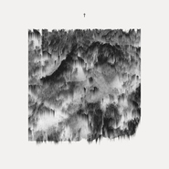

Pllajë
============================

|  |  |
| :--: | :-- |
| [ Pllajë](https://emumo.xiami.com/album/1883027124) | **艺人**: [JMSN](../index.md) **语种**: 英语 **唱片公司**: White Room Records **发行时间**: 2013年11月05日 **专辑类别**: 录音室专辑 **专辑风格**: 弛放 Chillout **播放数**: 3143120 **收藏数**: 774 **评论数**: 79  |

## 简介

## 曲目

## 评论

|  |  |  |  |
| :-- | :-- | :-- | :-- |
|  [虾米用户](https://emumo.xiami.com/u/376604539) 音乐是思维的声音    ... 2021-01-07 14:28 赞(0) 踩(0) | 

 |
|  [虾米用户](https://emumo.xiami.com/u/128303) 今夜月光皎洁，而我肝肠寸... 2020-07-06 09:02 赞(0) 踩(0) | 
bigbeats太酷了 神专！
 |
|  [虾米用户](https://emumo.xiami.com/u/421578063) fox god 2020-03-13 07:51 赞(0) 踩(0) | 
moa
 |
|  [虾米用户](https://emumo.xiami.com/u/71832492) 1 2020-02-13 06:28 赞(0) 踩(0) | 
我得到自己第一次的date前听的神专现在依旧神专。
 |
|  [虾米用户](https://emumo.xiami.com/u/49365982) 当断则断 2020-02-12 20:27 赞(0) 踩(0) | 
~
 |
|  [虾米用户](https://emumo.xiami.com/u/75943336) 放空~只想跟着音乐摇摆 2020-02-09 23:20 赞(1) 踩(0) | 
发现宝贝儿 
 |
|  [虾米用户](https://emumo.xiami.com/u/7381606) . 2020-01-26 08:48 赞(0) 踩(0) | 
神砖
 |
|  [虾米用户](https://emumo.xiami.com/u/23862178) ฅ۶•ﻌ•♡ 2019-09-07 11:29 赞(0) 踩(0) | 
❤️
 |
|  [虾米用户](https://emumo.xiami.com/u/119801208) Dying easy l... 2019-06-23 12:20 赞(0) 踩(0) | 
我有一个大胆的想法，把所有歌连在一起。
 |
|  [虾米用户](https://emumo.xiami.com/u/31377901) ♪ ∞  ☾   ོ  2019-04-07 22:33 赞(1) 踩(0) | 
恨晚 哭辽qwq.
 |
|  [虾米用户](https://emumo.xiami.com/u/30896518) 做体面性感的好人 2019-03-28 16:29 赞(2) 踩(0) | 
JMSN对打击乐的运用有很鲜明的特点，个人感觉不同于很多R&amp;N歌曲。他喜欢用鼓点来传递情绪
 |
|  [虾米用户](https://emumo.xiami.com/u/41118962) 我还没想好要写什么... 2019-02-25 23:37 赞(0) 踩(0) | 
华丽
 |
|  [虾米用户](https://emumo.xiami.com/u/11472475) 我还没想好要写什么... 2019-01-25 03:53 赞(10) 踩(0) | 
终于买到了这张绝版黑胶
 |
| ⇒ |  [虾米用户](https://emumo.xiami.com/u/28684694) 我还没想好要写什么... 2019-07-07 08:09 赞(0) 踩(0) | 
哪里可以买
 |
|  [虾米用户](https://emumo.xiami.com/u/120918630) 在百转柔肠间，一天天地冷... 2018-11-11 23:17 赞(1) 踩(0) | 
赞到爆 ♡
 |
|  [虾米用户](https://emumo.xiami.com/u/324879742)   2018-08-28 13:33 赞(4) 踩(0) | 
.
 |
|  [虾米用户](https://emumo.xiami.com/u/305005114) AWAY FROM TH... 2018-06-29 00:30 赞(5) 踩(0) | 
这专真神了  非连着不可听  一听就止不住了
 |
|  [虾米用户](https://emumo.xiami.com/u/121910914) 我想好好睡个觉 2018-06-28 22:05 赞(0) 踩(0) | 
i
 |
|  [虾米用户](https://emumo.xiami.com/u/221712148) 我还没想好要写什么... 2018-06-07 23:45 赞(0) 踩(0) | 
能循环几年的专辑
 |
|  [虾米用户](https://emumo.xiami.com/u/4131849) 网易云：非人類兔子Agy... 2018-02-25 20:49 赞(1) 踩(0) | 
他的砖都要一首接着一首
 |
|  [虾米用户](https://emumo.xiami.com/u/16011970)   2018-01-12 09:57 赞(1) 踩(0) | 
重温~神专~巨好听。。。
 |
|  [虾米用户](https://emumo.xiami.com/u/17993972)  @有人抱怨我名字太长 2017-09-15 00:37 赞(0) 踩(0) | 
太震撼了 
 |
|  [虾米用户](https://emumo.xiami.com/u/17993972)  @有人抱怨我名字太长 2017-09-15 00:34 赞(0) 踩(0) | 
OMG
 |
|  [虾米用户](https://emumo.xiami.com/u/49691100) 是个糟人 2017-04-20 23:46 赞(3) 踩(0) | 
从封面歌曲到MV 真是我见过歌曲里最艺术品的
 |
|  [虾米用户](https://emumo.xiami.com/u/45107779) Half asleep 2017-03-29 14:46 赞(1) 踩(0) | 
神了
 |
|  [虾米用户](https://emumo.xiami.com/u/5118264) Stop Talking... 2017-02-05 21:45 赞(0) 踩(0) | 
太喜歡
 |
|  [虾米用户](https://emumo.xiami.com/u/199809053) may be  ... ... 2016-12-22 20:35 赞(0) 踩(0) | 
♡♡♡
 |
|  [虾米用户](https://emumo.xiami.com/u/10121087) 天涼好個秋 2016-12-08 11:19 赞(0) 踩(0) | 
.
 |
|  [虾米用户](https://emumo.xiami.com/u/16551745) byebye｛wb/in... 2016-08-11 16:12 赞(0) 踩(0) | 
cover
 |
|  [虾米用户](https://emumo.xiami.com/u/5187790) 九年 再见 虾米，再见 ... 2016-07-10 13:09 赞(0) 踩(0) | 
~
 |
|  [虾米用户](https://emumo.xiami.com/u/8209145) 爱看你们头像 2016-05-30 10:53 赞(0) 踩(0) | 
我去 真要连着听 太棒了
 |
|  [虾米用户](https://emumo.xiami.com/u/39548287) Spotify&QQ同名... 2016-04-24 21:21 赞(0) 踩(0) | 
⌬
 |
|  [虾米用户](https://emumo.xiami.com/u/50812128) 网易finefrance... 2016-04-05 17:55 赞(0) 踩(0) | 
太美了
 |
|  [虾米用户](https://emumo.xiami.com/u/4131849) 网易云：非人類兔子Agy... 2016-02-28 14:27 赞(0) 踩(0) | 
棒
 |
|  [虾米用户](https://emumo.xiami.com/u/4372646) 可爱又迷人的正派角色IG... 2016-02-17 23:41 赞(0) 踩(0) | 
＃
 |
|  [虾米用户](https://emumo.xiami.com/u/9674129) 缘 妙不可言 2016-02-02 15:17 赞(0) 踩(0) | 
Beautiful thing
 |
|  [虾米用户](https://emumo.xiami.com/u/16396509)  2016-01-18 12:22 赞(0) 踩(0) | 
疼啊
 |
|  [虾米用户](https://emumo.xiami.com/u/44771731) ophelia_gu 2015-12-29 20:42 赞(0) 踩(0) | 
水墨画
 |
|  [虾米用户](https://emumo.xiami.com/u/3583995) 一個人的戰爭 2015-12-14 21:04 赞(0) 踩(0) | 

 |
|  [虾米用户](https://emumo.xiami.com/u/23122474) 膏肓 2015-12-13 11:17 赞(0) 踩(0) | 
封面逆天
 |
|  [虾米用户](https://emumo.xiami.com/u/15477519) 爱  是生命的和弦，而不... 2015-12-04 11:10 赞(6) 踩(0) | 
JMSN
 |
|  [虾米用户](https://emumo.xiami.com/u/362656) 我还没想好要写什么... 2015-11-14 14:37 赞(0) 踩(0) | 
戏剧感
 |
|  [虾米用户](https://emumo.xiami.com/u/31048404)   2015-11-12 08:20 赞(1) 踩(0) | 
专辑封面有点厉害
 |
|  [虾米用户](https://emumo.xiami.com/u/8158804) 我还没想好要写什么... 2015-09-23 12:13 赞(0) 踩(0) | 
耳朵totally pregnant
 |
|  [虾米用户](https://emumo.xiami.com/u/44784434) 变得和我一样库 2015-08-18 16:09 赞(0) 踩(0) | 
这专好听
 |
|  [虾米用户](https://emumo.xiami.com/u/16011970)   2015-08-03 22:25 赞(0) 踩(0) | 
好久没听到这么喜欢的专了
 |
|  [虾米用户](https://emumo.xiami.com/u/3089567) instagram、網易... 2015-08-03 01:14 赞(1) 踩(0) | 
∇
 |
|  [虾米用户](https://emumo.xiami.com/u/32217919)  2015-07-19 10:01 赞(0) 踩(0) | 
广州30号的有人吗ฅ՞•ﻌ•՞ฅ
 |
| ⇒ |  [虾米用户](https://emumo.xiami.com/u/2710484)  2015-07-30 18:30 赞(0) 踩(0) | 
Meฅ՞•ﻌ•՞ฅ
 |
| ⇒ |  [虾米用户](https://emumo.xiami.com/u/32217919)  2015-07-30 18:31 赞(0) 踩(0) | 
<q><b>无脸人说：</b></q>
 |
| ⇒ |  [虾米用户](https://emumo.xiami.com/u/2710484)  2015-07-30 19:02 赞(0) 踩(0) | 
<q><b>阿泰说：</b></q>
 |
| ⇒ |  [虾米用户](https://emumo.xiami.com/u/32217919)  2015-07-30 19:03 赞(0) 踩(0) | 
<q><b>无脸人说：</b></q>
 |
| ⇒ |  [虾米用户](https://emumo.xiami.com/u/1450698) 若学不会游戏人生便逃不脱... 2015-08-25 21:57 赞(0) 踩(0) | 
为何他来完广州我才爱上他
 |
| ⇒ |  [虾米用户](https://emumo.xiami.com/u/32217919)  2015-08-25 22:09 赞(0) 踩(0) | 
<q><b>莫粞毛说：</b></q>
 |
|  [虾米用户](https://emumo.xiami.com/u/46128112) 一个假泰国人  2015-07-16 23:09 赞(0) 踩(0) | 
嗯
 |
|  [虾米用户](https://emumo.xiami.com/u/28305547) Freedøm 2015-06-19 04:28 赞(21) 踩(0) | 
这张专一定要连在一起听，是一首接一首的。
 |
|  [虾米用户](https://emumo.xiami.com/u/28305547) Freedøm 2015-06-17 08:09 赞(0) 踩(0) | 
封面真美
 |
|  [虾米用户](https://emumo.xiami.com/u/17114760) 嘻嘻嘻嘻 2015-05-19 11:04 赞(0) 踩(0) | 
Well
 |
|  [虾米用户](https://emumo.xiami.com/u/4152275)  2015-05-02 15:53 赞(0) 踩(0) | 
这么高品质的精品！！
 |
|  [虾米用户](https://emumo.xiami.com/u/43515415)  2015-02-12 15:25 赞(0) 踩(0) | 
已疯
 |
|  [虾米用户](https://emumo.xiami.com/u/8226204) ≡ 2014-11-29 22:30 赞(0) 踩(0) | 
。
 |
|  [虾米用户](https://emumo.xiami.com/u/1987681) An elephant ... 2014-10-02 00:47 赞(0) 踩(0) | 
.
 |
|  [虾米用户](https://emumo.xiami.com/u/19394025) Nothing 2014-09-18 13:53 赞(0) 踩(0) | 
超喜欢walk away
 |
| ⇒ |  [虾米用户](https://emumo.xiami.com/u/1541473) 忘记了才快乐 2015-08-16 08:50 赞(0) 踩(0) | 
我也是！
 |
|  [虾米用户](https://emumo.xiami.com/u/27224237) 永远在寻找能唤醒我耳朵的... 2014-07-01 22:57 赞(0) 踩(0) | 
好听哭了怎么办~
 |
|  [虾米用户](https://emumo.xiami.com/u/2332621) SELF. 2014-05-22 09:55 赞(0) 踩(0) | 
我男神
 |
| ⇒ |  [虾米用户](https://emumo.xiami.com/u/27224237) 永远在寻找能唤醒我耳朵的... 2014-07-01 22:57 赞(0) 踩(0) | 
快变我男神了~
 |
| ⇒ |  [虾米用户](https://emumo.xiami.com/u/2332621) SELF. 2014-07-02 06:39 赞(0) 踩(0) | 
<q><b>minmin小妮子说：</b></q>
 |
| ⇒ |  [虾米用户](https://emumo.xiami.com/u/27224237) 永远在寻找能唤醒我耳朵的... 2014-07-02 08:58 赞(0) 踩(0) | 
<q><b>amoii说：</b></q>
 |
| ⇒ |  [虾米用户](https://emumo.xiami.com/u/2332621) SELF. 2014-07-02 11:08 赞(0) 踩(0) | 
<q><b>minmin小妮子说：</b></q>
 |
| ⇒ |  [虾米用户](https://emumo.xiami.com/u/27224237) 永远在寻找能唤醒我耳朵的... 2014-07-02 15:23 赞(0) 踩(0) | 
<q><b>amoii说：</b></q>
 |
| ⇒ |  [虾米用户](https://emumo.xiami.com/u/2332621) SELF. 2014-07-02 15:30 赞(0) 踩(0) | 
<q><b>minmin小妮子说：</b></q>
 |
|  [虾米用户](https://emumo.xiami.com/u/3256886)  2014-04-05 21:09 赞(0) 踩(0) | 
韵味十足 够我听一周呢~
 |
| ⇒ |  [虾米用户](https://emumo.xiami.com/u/1357896) Me gusta nad 2014-05-06 20:47 赞(0) 踩(0) | 
哪都能看到你
 |
| ⇒ |  [虾米用户](https://emumo.xiami.com/u/3256886)  2014-05-06 22:29 赞(0) 踩(0) | 
<q><b>vladdxd说：</b></q>
 |
|  [虾米用户](https://emumo.xiami.com/u/1171396) 以前办不到的事情，未来也... 2014-04-05 20:49 赞(0) 踩(0) | 
-。-
 |
|  [虾米用户](https://emumo.xiami.com/u/5963991)  2013-11-12 14:03 赞(0) 踩(0) | 
喜欢ep后半段，从Love Myself开始都是满满的感动
 |
|  [虾米用户](https://emumo.xiami.com/u/6572020) 音乐中毒 2013-11-05 21:15 赞(0) 踩(0) | 
意犹未尽~~难道还有“第二季”~~
 |
|  [虾米用户](https://emumo.xiami.com/u/5963991)  2013-11-05 16:29 赞(0) 踩(0) | 
有点儿Active Child x Justin Timberlake的范儿, 喜欢Love Myself
 |
