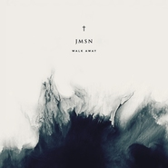

Walk Away
============================

|  |  |
| :--: | :-- |
| [ Walk Away](https://emumo.xiami.com/album/881381359) | **艺人**: [JMSN](../index.md) **语种**: 英语 **唱片公司**: White Room Records **发行时间**: 2013年09月17日 **专辑类别**: EP, 单曲 **专辑风格**:  **播放数**: 9211 **收藏数**: 24 **评论数**: 4  |

## 简介

## 曲目

## 评论

|  |  |  |
| :-- | :-- | :-- |
|  [虾米用户](https://emumo.xiami.com/u/4372646) 可爱又迷人的正派角色IG... 2015-10-18 16:20 赞(0) 踩(0) | 
＃
 |
|  [虾米用户](https://emumo.xiami.com/u/32217919)  2015-07-19 11:52 赞(0) 踩(0) | 
(ㅎ‸ㅎ)
 |
|  [虾米用户](https://emumo.xiami.com/u/41147788)  2015-06-15 21:48 赞(0) 踩(0) | 
超美的歌，画面感好强
 |
|  [虾米用户](https://emumo.xiami.com/u/19394025) Nothing 2014-04-23 00:21 赞(1) 踩(0) | 
走的是另类独立风格的类型。悲情中带着无奈与不甘。
 |
