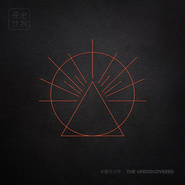

寻找未曝光少年寻光计划第二季视觉专辑
============================

|  |  |
| :--: | :-- |
| [ 寻找未曝光少年寻光计划第二季视觉专辑](https://emumo.xiami.com/album/2102861547) | **艺人**: [虾米音乐人](../index.md) **语种**: 国语 **唱片公司**: 虾米音乐人 **发行时间**: 2017年09月22日 **专辑类别**: 合集, 杂锦 **专辑风格**: 华语唱作人 Chinese Singer-Songwriter, 国语流行 Mandarin Pop, 独立电子乐 Indietronica **播放数**: 5215391 **收藏数**: 2703 **评论数**: 259  |

## 简介

寻光计划是虾米音乐人对平台内独立音乐人的全面扶持计划，旨通过互联网用户的喜好选择、专家媒体敏锐的嗅觉，挖掘出所有尚未崛起的年轻新锐之声，以各种方式帮助他们发出耀眼光芒。从寻光计划脱颖而出的音乐人将获得包含唱片、演出、MV、推广等在内的全案资助。  
  
他们在跟风 你在亲手制造未来  
  
第二季寻光计划主题为“寻找未曝光少年”，意想让真正代表独立音乐之未来的音乐人被更多对的人听到，让未现之光得以有释放无畏的能量。无论他们现在身在何方，在过着怎样的人生。或许他们现在并不完美，但Leonard Cohen说过：万物皆有缝隙，那是光照进来的地方。  
  
经过2017年这个夏天所有听众和海内外评委的共同选拔，最终沼泽、SHAWEE、邹施如、方拾贰、KWORLD、GALI、Doris何小河、WAV乐队、SARAH、未来星、阿图什冲浪男孩等11位音乐人脱颖而出。虾米音乐人将这11组音乐人的优秀参赛作品集结成辑，邀请中国最富盛名的母带工程师韩冬重新Remastered，作为选拔阶段的收官之作正式推出。  
  
并特别收录奇才制作人SUSUSU受邀为寻光计划第二季打造的Title Theme主题曲《寻找未曝光少年》完整版。  
  
  
据说这是华语第一张视觉专辑  
  
互联网加速了音乐的传播，让有才华的音乐人被更多人听到，也促使这3、4分钟的精神世界变为一条音频，太多细节和内涵无法为人所知。如果你听过欧美大牌的现象级大碟，也许会知道有一个类别叫做Visual Album视觉专辑。虾米音乐人愿做华语乐坛的先锋者，打造这可能是华语音乐领域的第一张Visual Album视觉专辑集结寻光计划第二季11组音乐人的优秀参赛作品，邀请为寻光计划第二季打造高口碑宣传片的拍摄团队腔调accent，给每位音乐人打造专属视觉短片。  
  
在这张名为《寻找未曝光少年》的合辑里，如果你愿意，不妨点一下歌曲列表里对应的MV按钮，也许你会被这11个不同的内心世界所震撼。  
  
  
  
SHAWEE - Change My Life  
  
陈奂仁：Vocal很甜蜜，melody很鲜甜很清楚，混音和音色方面都比较专业，是特别特别的完整的作品 Spinnin’Records：Nice vocals, good song 孔令奇：Smooth.I like the verses 葛大为：欢快的电子风格与一听难忘的旋律，加上完美演唱，力度十足且饱满  
  
SHAWEE，本名杨近川，来自广东现居四川，是一位通过寻光计划横空出世的新鲜面孔。沾染音乐来自家人对音乐的热爱，也曾学过小提琴。在微博结识了mAjorHon，趣味相投从而成为固定的合作伙伴，共同创作出系列以电音流行为主路线的音乐作品，具前沿与可听于一身，是本届寻光计划最多专家评审打高分的音乐人。  
  
  
  
邹施如 - 线形关系  
  
黄玠：温柔的声线唱都市的东西，好听，编曲也刚好不过头 ROMderful@Soulection：This is so beautiful ZHU ：Passion filled, smooth instrumentation with smooth voice  
  
邹施如来自湖南长沙，是民族、戏曲科班出身，因自觉不适合而选择自己创作流行音乐。然而半路转折却依然唱作俱佳，没有让流行乐坛损失这一把入耳舒爽的好嗓音。曾因参加歌唱比赛被多家老牌娱乐公司相中，后来因为学业放弃发片机会。因在寻光计划中以专家组第三的成绩入选最终11强。  
  
  
  
  
方拾贰 – 归，不归  
  
爱地人：现代与古风的结合点恰到好处 邹小樱：非常有独立气质的作品 大地：民谣借诗词的不少，能唱好编好的太少，何况在其中融入的粤语听起来那么舒服  
  
方拾贰在参加寻光之前，刚硕士毕业，学过传播学和艺术设计。生活中，是一个爱看电影养蜥蜴的天秤座女生。音乐上，却罕见的将古风、民谣、电子融为一体，编制出属于她自己的音乐美学。如果你问她为什么叫方拾贰，她会说：一年有十二个月，一天有十二个时辰，西方有十二星座，东方有十二生肖，十二平均律，耶稣有十二门徒，佛教有十二因缘论，奥林匹斯有十二主神，人有十二对肋骨，八度由十二个半音。  
  
  
  
KWORLD Feat.Gali - Obey  
  
ZHU：Catchy, good tempo and meaning 胡海泉：编曲创意及音色的拿捏很好 Spinnin’Records：Nice storyline, cool vocals.  
  
KWORLD通过寻光计划才第一次让大家听到这个名字。本名孟宽，K就是宽，KWORLD是他自造的词，意是属于他自己的世界。从小喜欢音乐，大学读的是美术学院油画专业，期间开始接触制作和编曲，如今已是专业音乐制作人。刚刚参与了鹿晗的专辑REMIX，YG的A&amp;R听到他的作品都为之赞扬。  
  
  
  
Gali - Sober Life  
  
Far East Movement：Feelin that west coast bounce and flow 火星电台：编曲很成熟，作品整体性也很好 Rabbi：Flow有点意思又能轻松听清楚歌词的中文说唱如今太可贵了 豆瓣音乐：终于不是那种一直在吹牛逼的说唱歌曲了  
  
GALI接触说唱已有10年多的时间，在今年5月“中国有嘻哈”选秀中被“非正常淘汰”，在海选结束后的DISS战中以一首《Illusion Freestyle》掀起上海Rapper的Diss back。GALI性格内敛，为人低调，却才华横溢，最终在寻光计划第二季寻找未曝光少年中获得千万乐迷的肯定。  
  
  
  
  
  
Doris何小河 - 夜里  
  
MONO：Sweet pop music 邓柯：悠扬流畅，三弦的使用很点睛 五摆五折：开头就抓耳，声音有辨识度，编曲不俗 胡海泉：独特的女声  
  
Doris何小河在虾米音乐人页面的自我介绍，只有“森林深处有一间小木屋，周围种着彩色的毒蘑菇”这一句话，然而她是古典音乐出身、目前还在美国攻读作曲专业的科班派。也许和她从小喜欢跳舞编舞有关，她音乐上的色彩却一反科班的古板，灵动轻巧，有时歌曲质感的厚度超乎想象。她对自己风格的评价是不定义“看心情”，令人期待她的下一个作品会有一个什么样的面貌。  
  
  
  
WAV - Confession of A Dreamer  
  
葛大为：空间感瞬间将听者带入，并赋予力量 孔令奇：让我想起Bon Iver Far East Movement：Great lyric depth. Really feeling the melody 火星电台：画面感。  
  
乐队成立于2014年秋的多伦多，是一个由华裔、中国人成员组成在加拿大发展音乐事业的摇滚乐队，曾获得虾米音乐“橙LIVE”榜第九期冠军而收获中国乐迷。乐队由吉他手兼主唱Done Young、主音吉他手Jacky Chen、节奏吉他手Ray Su、贝斯手兼制作人Gabriel Cheung、鼓手Paul Zhong组成。乐队名字WAV来源于声波，也是We Are Various的缩写，意在音乐风格多变，敢于尝试。  
  
  
  
Sarah - My Story  
  
葛大为：旋律优雅入耳，声线听似潇洒无谓，细读歌词惊见内心底处另一片苍凉 三石一声：在些许法式情调的陪衬中，不失大学生的轻盈，甚至是青涩的珍贵度 爱地人：它先有没被曲风框住的人味，然后才是爵士的味道  
  
Sarah2009年才开始写歌，曾在泰国留学，目前在上海外国语大学念大二。播放这首《My Story》的时候，如葛大为老师所说会觉得“旋律优雅入耳，声线听似潇洒无谓”，然而翻阅资料，你会惊叹这居然来自这位年仅20岁女生的爵士创作，而且并没有专业训练，也没有惊人奖项。如果一定要说，大概就是高中歌唱比赛，以自弹自唱的方式拿到过不错的名次。未曝光少年寻的就是这样的神奇物种。  
  
  
未来星B3Rich Feat.3Bangz – 二人世界  
  
88rising：Solid with good production Far East Movement：These dudes are dope 陈奂仁 ：Rapper的性格很明显清楚，特别喜欢他用phaser来唱他的副歌，歌曲都很成立，artist的画面也很清楚  
  
“音乐是我的自传，记录自我和快乐”，正如未来星B3Rich自己所说，所到处之处必伴随着他的那句经典slogan”未来星B3Rich，说唱圈的奢侈品”，而他的解释也并没有听上去那么肤浅 “了解我们需要的是有对艺术的基本欣赏水平，不要拿我们（未来星B3Rich+3Bangz）和的大路货比较。”  
  
  
  
  
阿图什冲浪男孩 - Midnight  
  
ZHU：Really smooth song. Good vocals and a slow, jazzy vibe Far East Movement：The singer is dope. Another favorite 陈奂仁：特别完整的音乐人，我真希望我们华语乐坛有这样的音乐人这样的歌曲，真的是一个true artist true vocalist的事  
  
阿克江LilAkin，医学背景，甚至还想考公务员，然而留着来自爷爷的诗人之血的他现在是中国最引人瞩目的RNB音乐人。VISUDY，低调的渔夫帽男孩，新晋制作人，热衷于制造着下一个流行的音乐。他们在一起是Atux surfin’boi 阿图什冲浪男孩。  
  
  
  
沼泽 - 如果我失去了青春  
  
MONO：Beautiful song with some interesting instrumentation, I like the fact that they put traditional elements into their music  
  
在独立音乐领域，沼泽是不仅限于后摇，蹊径独行自成一派，将中国传统古乐器融入西方后摇音乐的标志性乐队，获得无数乐坛大奖并多次受邀在海外巡演。而在流行音乐领域，在作品被娄烨用在电影《浮城谜事》主题曲之前，却鲜少被人认知。“寻找未曝光少年”意指所有年轻躁动的灵魂，无关性别与年龄。沼泽则是此次寻光计划第二季中，对“少年”概念最为恰当的代表。此次获得寻光特别奖，也将开启他们音乐路途的新旅程。  
  
  
生活中总有暗处，生活中也总有光，而你就是光，是最亮的光  
少年已就位，而这只是开始。  
Ready to Shine？  
  
  
发行时间：2017.9.22  
唱片编号：XA-018  
  
出品：虾米音乐人 i.xiami.com  
监制：王皓 总统筹：赵宗 总企划：Lingo 活动统筹：小朴 制作协力及宣传：闫超 艺人统筹：萧遥 Lingo  
视频：腔调accent 平面：赵宏韬 歪酱 文案：Lingo 赵宗 母带：韩冬  
总出品：虾米音乐 总出品人：语嫣

## 曲目

## 评论

|  |  |  |  |
| :-- | :-- | :-- | :-- |
|  [虾米用户](https://emumo.xiami.com/u/9062060) 此生没拿一个亿来爱虾米是... 2021-01-13 22:29 赞(1) 踩(0) | 
  
 |
|  [虾米用户](https://emumo.xiami.com/u/9062060) 此生没拿一个亿来爱虾米是... 2021-01-13 22:29 赞(1) 踩(0) | 
永爱
 |
|  [虾米用户](https://emumo.xiami.com/u/435072669)  2020-02-05 19:11 赞(0) 踩(0) | 
zxvnk
 |
|  [虾米用户](https://emumo.xiami.com/u/30875411)  2020-01-30 16:47 赞(0) 踩(0) | 
期待新音乐时代的到来
 |
|  [虾米用户](https://emumo.xiami.com/u/5992315) 不爱肉馅 2019-11-29 11:12 赞(1) 踩(0) | 
现在听来还是很棒
 |
|  [虾米用户](https://emumo.xiami.com/u/411396565)  2019-09-16 10:32 赞(0) 踩(0) | 
不错，值得一听。
 |
|  [虾米用户](https://emumo.xiami.com/u/339191478)   2019-05-31 23:08 赞(0) 踩(0) | 

 |
|  [虾米用户](https://emumo.xiami.com/u/168656086) 不说再见。 2019-02-14 10:12 赞(1) 踩(0) | 
嗯～我觉得不错。期待第三张寻光专辑
 |
|  [虾米用户](https://emumo.xiami.com/u/350726920) 我爱老鳖，再无他人。 2019-01-13 14:56 赞(1) 踩(0) | 
哈哈O(∩_∩)O哈哈~
 |
|  [虾米用户](https://emumo.xiami.com/u/91948028)  2018-11-24 15:52 赞(3) 踩(0) | 
我一个不专业乐迷，感觉挺好的，每一首歌都很有特点，本人木耳，什么电子什么民谣只能听歌大概，但真的觉得挺不错的，这段时间在朋友那里，天天什么卡路里，要么就是周杰伦这些经典；不得不说卡路里这种洗脑歌确实容易被更多人接受，但听多了就感觉没有深度，说难听点就是俗；周杰伦这些前辈确实是经典，但听的太多了，编曲什么的在那个年代确实是创新，但放到现在，个人觉得还是比不过这些新鲜血液。卡路里这种太通俗的音乐过两年就会被忘记，周杰伦他们会被人牢牢记住，但如果华语乐坛如果真的还要出现经典，能被人铭记的经典，还是需要这些后继只人。最后说一句，不管好坏，至少认真。
 |
|  [虾米用户](https://emumo.xiami.com/u/20962358) LOVE BUZZ 2018-07-17 16:55 赞(4) 踩(0) | 
虾米的寻光计划是乐迷的福音！不断挖掘新鲜和新生的音乐人，希望在虾米和阿里的推动下，能带动国内音乐圈，尤其音乐产业的良性发展吧。
 |
| ⇒ |  [虾米用户](https://emumo.xiami.com/u/91948028)  2018-11-24 15:59 赞(0) 踩(0) | 
感觉虾米在发掘音乐人和推动音乐产业的发展上已经走在了前列
 |
|  [虾米用户](https://emumo.xiami.com/u/8337700)  2018-05-17 18:26 赞(0) 踩(0) | 
cattzim迷妹报道
 |
|  [虾米用户](https://emumo.xiami.com/u/48748810) ‌一眼望去，精致的面容很... 2018-05-07 20:48 赞(0) 踩(0) | 
这张专真尼玛狠~
 |
|  [虾米用户](https://emumo.xiami.com/u/354853508)  2018-04-25 12:59 赞(0) 踩(0) | 
如果我失去了青春 沼泽 - Track 12 is the best by a long long way.. great melody, simple song, lovely guitar accompaniment.. listenable voice.. wins by a country mile.. 如果我失去了青春 沼泽 - quality song - memorable - which all good songs are.. the others.. won't be remembered in 6 months time
 |
| ⇒ |  [虾米用户](https://emumo.xiami.com/u/52032228) 难以步入正轨 往往事与愿... 2018-12-16 21:14 赞(0) 踩(0) | 
i agree with u
 |
|  [虾米用户](https://emumo.xiami.com/u/354853508)  2018-04-25 12:55 赞(0) 踩(0) | 
Track 12 is the best by a long long way.. great melody, simple song, lovely guitar accompaniment.. listenable voice.. wins by a country mile.. 如果我失去了青春 沼泽
 |
|  [虾米用户](https://emumo.xiami.com/u/356399954)  2018-04-21 01:11 赞(0) 踩(0) | 
惊艳
 |
|  [虾米用户](https://emumo.xiami.com/u/21948443) 失无所失 2018-04-18 22:36 赞(0) 踩(0) | 
这专辑简直nice
 |
|  [虾米用户](https://emumo.xiami.com/u/344590208) 试卷是一张微凉的遗书 2018-03-19 19:49 赞(2) 踩(0) | 
每个音乐软件都有不同的特点和独特性。不要讽刺它们，你在使用它！你就是说明它好。你没使用它们。就说它们不好。所以他们也在使用其他音乐软件。你就讽刺他们使用其他音乐软件，说自己使用的软件好。但是不管人家想用什么音乐软件，我们不讽刺他们。个人喜欢使用什么音乐软件，就是使用什么音乐软件。老子就是听不惯别人说其他音乐软件不好，最重要能用的就行，每个人都有点说自己使用的软件都好用。每个人都在使用不同的软件。而他们也在说自己使用软件特别好用。最重要的是自己先用着。再看看好不好用？不好用就反馈给它一些意见，要他改进好。这如游戏一样：好多人说王者荣耀好耍。也有的人说球大作战好耍。懂不懂？
 |
| ⇒ |  [虾米用户](https://emumo.xiami.com/u/344590208) 试卷是一张微凉的遗书 2018-03-19 19:51 赞(0) 踩(0) | 
刚刚发现少打一个字，就是球球大作战，小打一个球
 |
|  [虾米用户](https://emumo.xiami.com/u/344590208) 试卷是一张微凉的遗书 2018-03-19 19:34 赞(1) 踩(0) | 
虾米这个原件还是一般般的。只是还是可以。
 |
|  [虾米用户](https://emumo.xiami.com/u/327910057) Eason & Mayd... 2018-03-17 21:29 赞(0) 踩(0) | 
我我我我我...打破了收藏2333的美丽数字 
 |
|  [虾米用户](https://emumo.xiami.com/u/13901273)  2018-03-06 16:11 赞(0) 踩(0) | 
love obey ！！xoxo
 |
|  [虾米用户](https://emumo.xiami.com/u/162612) 美丽的怪胎头脑比身体性感 2018-02-07 00:13 赞(0) 踩(0) | 
不过不错~确实NICE！我差点还不屑了~还好点进来听了
 |
|  [虾米用户](https://emumo.xiami.com/u/343053428)  2018-01-23 20:45 赞(0) 踩(0) | 
见过呵呵哥发发发功夫好几话费交呵呵加个半
 |
|  [虾米用户](https://emumo.xiami.com/u/44004225) vx:blueeeeol... 2017-12-13 22:58 赞(0) 踩(0) | 
喜欢极了，继续支持你们
 |
|  [虾米用户](https://emumo.xiami.com/u/3210589)  2017-11-30 16:08 赞(0) 踩(0) | 
天呐  这么久没关注才知道合集已经出了。。。。想买实体1
 |
|  [虾米用户](https://emumo.xiami.com/u/321416206)  2017-11-16 17:32 赞(0) 踩(0) | 
  
 |
|  [虾米用户](https://emumo.xiami.com/u/326100437) How old are ... 2017-11-16 17:32 赞(0) 踩(0) | 
  
 |
|  [虾米用户](https://emumo.xiami.com/u/4839926) 朝生善意，夕可成林 2017-11-06 20:10 赞(0) 踩(0) | 
不错
 |
|  [虾米用户](https://emumo.xiami.com/u/44533528)  2017-11-05 11:58 赞(1) 踩(0) | 
一个月过后再来听这张专辑，很平淡。度过了电音的浪潮。这张被丢在角落。
 |
|  [虾米用户](https://emumo.xiami.com/u/983156)  2017-10-24 10:47 赞(1) 踩(0) | 
酷！
 |
|  [虾米用户](https://emumo.xiami.com/u/304683939)  2017-10-24 09:34 赞(1) 踩(0) | 
居然如此多英文歌。
 |
|  [虾米用户](https://emumo.xiami.com/u/99206290) 不畏将来，不念过去 2017-10-23 22:39 赞(1) 踩(0) | 
爱虾米，没道理
 |
|  [虾米用户](https://emumo.xiami.com/u/313331036) 一位阿米～ 2017-10-21 15:27 赞(3) 踩(0) | 
感谢虾米！      我      爱      虾        米
 |
|  [虾米用户](https://emumo.xiami.com/u/55463741) 我想在你眼里撒野奔跑 2017-10-11 15:03 赞(2) 踩(0) | 
才反应过来刚发行那天我就听了这张专辑不过没仔细听，现在又被二人世界打回来再听一遍  
 |
|  [虾米用户](https://emumo.xiami.com/u/37228471) 暂无签名~ 2017-10-11 10:27 赞(2) 踩(0) | 
Great works.
 |
|  [虾米用户](https://emumo.xiami.com/u/3338788) 世界就是我们的实验品 2017-10-09 22:05 赞(1) 踩(0) | 
真特码的优秀！！！没别的评论了！！
 |
|  [虾米用户](https://emumo.xiami.com/u/187370628)   2017-10-08 01:32 赞(1) 踩(0) | 
不能好好唱歌吗？ 
 |
|  [虾米用户](https://emumo.xiami.com/u/9009423) Retro-Thrash 2017-10-03 11:05 赞(2) 踩(0) | 
有点意思。。。
 |
|  [虾米用户](https://emumo.xiami.com/u/40511986) 酉时7点寂寞,卯时强求变... 2017-10-03 01:44 赞(1) 踩(0) | 
不懂跟风只爱思索笨的很
 |
|  [虾米用户](https://emumo.xiami.com/u/40511986) 酉时7点寂寞,卯时强求变... 2017-10-03 01:43 赞(2) 踩(0) | 
真相藏于光源背面，抱抱晨光感受一下就好了，光年之外也许只有抱怨
 |
|  [虾米用户](https://emumo.xiami.com/u/27143315)   2017-09-30 00:55 赞(1) 踩(0) | 
邓紫棋那张也是视觉专啊
 |
|  [虾米用户](https://emumo.xiami.com/u/309141381)  2017-09-29 13:09 赞(4) 踩(0) | 
其实大家都挺好的～只是太多人还停在过去的音乐审美和听歌习惯中罢了，应该要抱着开放的态度去接受华语音乐的成长啊！为所有寻光二的音乐人打电话！！   
 |
|  [虾米用户](https://emumo.xiami.com/u/8171097) 不抽烟不喝酒，我爱音乐。 2017-09-29 10:12 赞(1) 踩(0) | 
寻光计划的招牌已毁。。。哎。。。
 |
| ⇒ |  [虾米用户](https://emumo.xiami.com/u/47204985)  2017-09-30 10:21 赞(0) 踩(0) | 
为啥
 |
| ⇒ |  [虾米用户](https://emumo.xiami.com/u/8171097) 不抽烟不喝酒，我爱音乐。 2017-09-30 10:57 赞(0) 踩(0) | 
听听上一张
 |
|  [虾米用户](https://emumo.xiami.com/u/298425267) □ 2017-09-27 21:08 赞(3) 踩(0) | 
589
 |
| ⇒ |  [虾米用户](https://emumo.xiami.com/u/298425267) □ 2017-10-15 20:52 赞(0) 踩(0) | 
3699
 |
|  [虾米用户](https://emumo.xiami.com/u/17493812) 苍穹一尘 2017-09-27 18:43 赞(2) 踩(0) | 
因《Confession of a Dreamer》这首歌，发现了这张音乐合辑 
 |
|  [虾米用户](https://emumo.xiami.com/u/36463909)  2017-09-27 14:08 赞(2) 踩(0) | 
不无聊
 |
|  [虾米用户](https://emumo.xiami.com/u/92686490)  2017-09-27 09:24 赞(2) 踩(0) | 
真的是視覺專輯！太棒了！
 |
|  [虾米用户](https://emumo.xiami.com/u/13003945) 输入签名... 2017-09-27 07:59 赞(2) 踩(0) | 
所以是不出实体专辑的意思吗 
 |
|  [虾米用户](https://emumo.xiami.com/u/4032390) 向上看 2017-09-27 02:04 赞(5) 踩(0) | 
音乐的工业标准毋庸置疑了，深度、艺术性、真实性、本真性，对我自己也好 ，对你们，对真实的东西还有很远的路要走。
 |
|  [虾米用户](https://emumo.xiami.com/u/300160830)  2017-09-26 23:12 赞(0) 踩(0) | 
先刘明
 |
|  [虾米用户](https://emumo.xiami.com/u/294869165) 我还没想好要写什么... 2017-09-26 22:55 赞(0) 踩(0) | 

 |
|  [虾米用户](https://emumo.xiami.com/u/75493414)  2017-09-26 22:28 赞(1) 踩(0) | 
听了整张专辑，感觉最好当属方拾贰和沼泽，只是沼泽这种乐队可能不太讨喜。shawee，kworld，sarah属于有点意思，只是需要更好的作品。其他的感觉稍差一点。
 |
|  [虾米用户](https://emumo.xiami.com/u/50422078) 哈力努尔 2017-09-26 22:24 赞(1) 踩(0) | 
感谢虾米对我的支持和推荐，今天发现自己的歌被推荐到主页了   
 |
|  [虾米用户](https://emumo.xiami.com/u/293873337) 爱音乐，就是虾米 2017-09-26 22:19 赞(1) 踩(0) | 
支持。我就是愛虾米音乐
 |
|  [虾米用户](https://emumo.xiami.com/u/297058804)  2017-09-26 20:36 赞(0) 踩(0) | 
支持！
 |
|  [虾米用户](https://emumo.xiami.com/u/313764203) 你是不懂音乐还是不懂音乐 2017-09-26 20:31 赞(6) 踩(0) | 
我很喜欢这次的一个宣传语：别人在跟风，你在亲手制造未来。我不是虾米请来的，只是相信虾米音乐这次的计划
 |
|  [虾米用户](https://emumo.xiami.com/u/313764203) 你是不懂音乐还是不懂音乐 2017-09-26 20:23 赞(2) 踩(0) | 
说无病呻吟的那位，我觉得现在的乐坛才叫真正的无病呻吟，包括寻光集也有很多，对比之下这张未曝光少年简单明了很多
 |
| ⇒ |  [虾米用户](https://emumo.xiami.com/u/9003931) 千淘万漉虽辛苦 2017-09-27 18:22 赞(0) 踩(0) | 
真正简单明了的音乐都是绕梁三日的，这些音乐作品根本不出众。
 |
| ⇒ |  [虾米用户](https://emumo.xiami.com/u/313764203) 你是不懂音乐还是不懂音乐 2017-09-27 20:39 赞(0) 踩(0) | 
<q><b>彧玥说：</b></q>
 |
| ⇒ |  [虾米用户](https://emumo.xiami.com/u/9003931) 千淘万漉虽辛苦 2017-09-27 20:58 赞(0) 踩(0) | 
<q><b>白眉天公说：</b></q>
 |
| ⇒ |  [虾米用户](https://emumo.xiami.com/u/313764203) 你是不懂音乐还是不懂音乐 2017-09-28 02:27 赞(0) 踩(0) | 
<q><b>彧玥说：</b></q>
 |
| ⇒ |  [虾米用户](https://emumo.xiami.com/u/313764203) 你是不懂音乐还是不懂音乐 2017-09-28 03:04 赞(0) 踩(0) | 
<q><b>彧玥说：</b></q>
 |
|  [虾米用户](https://emumo.xiami.com/u/313764203) 你是不懂音乐还是不懂音乐 2017-09-26 20:19 赞(9) 踩(0) | 
明明多种风格却被说都是电子，真是冤枉虾米了。。电子也有很多分类你们听不出来就不要乱说啊。首先Shawee电音流行，方十二电子民谣，gali和未来星是用了电子编曲的不同风格说唱，kworld做的是很典型的future bass，阿克江是有电子编曲的R&amp;amp;B。以上全是现在乐坛缺少的类型，你们还想着听陈粒还有好妹妹李荣浩他们吗，不，时代是会变换的，他们只有一个，寻光2的音乐人们也是独一无二的，我支持虾米的选择
 |
| ⇒ |  [虾米用户](https://emumo.xiami.com/u/313764203) 你是不懂音乐还是不懂音乐 2017-09-26 20:39 赞(0) 踩(0) | 
强调一下除了他们，另一半都不是电子，所以不用说什么都是电子
 |
| ⇒ |  [虾米用户](https://emumo.xiami.com/u/313764203) 你是不懂音乐还是不懂音乐 2017-09-26 20:40 赞(0) 踩(0) | 
而且电子也分很多种，别暴露自己的无知
 |
| ⇒ |  [虾米用户](https://emumo.xiami.com/u/939717) 何でも作れるSYNAPS 2017-09-27 08:56 赞(0) 踩(0) | 
<q><b>白眉天公说：</b></q>
 |
|  [虾米用户](https://emumo.xiami.com/u/325767267) 我是35岁的大叔，来学习... 2017-09-26 20:11 赞(0) 踩(0) | 
 
 |
|  [虾米用户](https://emumo.xiami.com/u/313764203) 你是不懂音乐还是不懂音乐 2017-09-26 19:51 赞(6) 踩(0) | 
底下评论成这样，难怪中国音乐走不出去，都是大众审美低的原因。这届寻光明显比第一届更具国际化，第一届都是典型的接地气中文歌，没有突破。这张绝对能让中国音乐更上一层楼，你们就继续骂吧。
 |
| ⇒ |  [虾米用户](https://emumo.xiami.com/u/47934109)  2017-09-27 11:12 赞(0) 踩(0) | 
别傻 国际化 就是什么都不是 乱七八糟都往里里面抽 好东西做减法 不是加法 中国音乐的原创性就是国际流行！扯你自己的蛋去吧  里面过半的歌听不到年轻人的感觉 除了无病呻吟的装逼就是莫名其奇妙的深沉 也好意思那无知当个性 好东西跟国际不国际化没关系 挂羊头卖狗肉 不尊重自己的文化特色才可拍 英文西化教育教育出一堆文化怪物出来才可怕 西方挨不上不认可 东方化又不是 不伦不类 小众就小众 扯毛中国音乐哟 扯毛国际化 有本事玩小众就真的鹤立独行到底 可以么
 |
| ⇒ |  [虾米用户](https://emumo.xiami.com/u/313764203) 你是不懂音乐还是不懂音乐 2017-09-27 13:25 赞(0) 踩(0) | 
<q><b>茶膏说：</b></q>
 |
| ⇒ |  [虾米用户](https://emumo.xiami.com/u/9003931) 千淘万漉虽辛苦 2017-09-27 18:20 赞(0) 踩(0) | 
<q><b>白眉天公说：</b></q>
 |
| ⇒ |  [虾米用户](https://emumo.xiami.com/u/313764203) 你是不懂音乐还是不懂音乐 2017-09-27 20:37 赞(0) 踩(0) | 
<q><b>彧玥说：</b></q>
 |
| ⇒ |  [虾米用户](https://emumo.xiami.com/u/313764203) 你是不懂音乐还是不懂音乐 2017-09-27 20:38 赞(0) 踩(0) | 
<q><b>彧玥说：</b></q>
 |
| ⇒ |  [虾米用户](https://emumo.xiami.com/u/9003931) 千淘万漉虽辛苦 2017-09-27 20:52 赞(0) 踩(0) | 
<q><b>白眉天公说：</b></q>
 |
| ⇒ |  [虾米用户](https://emumo.xiami.com/u/9003931) 千淘万漉虽辛苦 2017-09-27 20:58 赞(0) 踩(0) | 
<q><b>白眉天公说：</b></q>
 |
| ⇒ |  [虾米用户](https://emumo.xiami.com/u/313764203) 你是不懂音乐还是不懂音乐 2017-09-28 02:01 赞(0) 踩(0) | 
<q><b>彧玥说：</b></q>
 |
| ⇒ |  [虾米用户](https://emumo.xiami.com/u/313764203) 你是不懂音乐还是不懂音乐 2017-09-28 02:19 赞(0) 踩(0) | 
<q><b>彧玥说：</b></q>
 |
| ⇒ |  [虾米用户](https://emumo.xiami.com/u/313764203) 你是不懂音乐还是不懂音乐 2017-09-28 03:04 赞(0) 踩(0) | 
<q><b>彧玥说：</b></q>
 |
| ⇒ |  [虾米用户](https://emumo.xiami.com/u/9003931) 千淘万漉虽辛苦 2017-09-28 09:06 赞(0) 踩(0) | 
<q><b>白眉天公说：</b></q>
 |
| ⇒ |  [虾米用户](https://emumo.xiami.com/u/313764203) 你是不懂音乐还是不懂音乐 2017-09-28 13:10 赞(0) 踩(0) | 
<q><b>彧玥说：</b></q>
 |
| ⇒ |  [虾米用户](https://emumo.xiami.com/u/9003931) 千淘万漉虽辛苦 2017-09-28 14:21 赞(0) 踩(0) | 
<q><b>白眉天公说：</b></q>
 |
| ⇒ |  [虾米用户](https://emumo.xiami.com/u/313764203) 你是不懂音乐还是不懂音乐 2017-09-29 12:16 赞(0) 踩(0) | 
<q><b>彧玥说：</b></q>
 |
|  [虾米用户](https://emumo.xiami.com/u/298795367) 我爱EXO，别问我为什么... 2017-09-26 19:44 赞(8) 踩(0) | 
感谢虾米能让我听EXO的歌
 |
| ⇒ |  [虾米用户](https://emumo.xiami.com/u/356399954)  2018-04-21 01:13 赞(0) 踩(0) | 
走错了吧，出门右转
 |
|  [虾米用户](https://emumo.xiami.com/u/719995) 事出有音 2017-09-26 19:32 赞(0) 踩(0) | 
内容已删除
 |
| ⇒ |  [虾米用户](https://emumo.xiami.com/u/6630660) 猜赢涂口红… 2017-09-26 20:59 赞(0) 踩(0) | 
又一个没听就瞎BB的
 |
| ⇒ |  [虾米用户](https://emumo.xiami.com/u/719995) 事出有音 2017-09-26 21:01 赞(0) 踩(0) | 
<q><b>哈哈哈哈哈哈哈哈哈哈哈皮说：</b></q>
 |
| ⇒ |  [虾米用户](https://emumo.xiami.com/u/6630660) 猜赢涂口红… 2017-09-27 02:46 赞(0) 踩(0) | 
<q><b>1806说：</b></q>
 |
| ⇒ |  [虾米用户](https://emumo.xiami.com/u/719995) 事出有音 2017-09-27 06:46 赞(0) 踩(0) | 
<q><b>哈哈哈哈哈哈哈哈哈哈哈皮说：</b></q>
 |
| ⇒ |  [虾米用户](https://emumo.xiami.com/u/6630660) 猜赢涂口红… 2017-09-27 08:14 赞(0) 踩(0) | 
<q><b>1806说：</b></q>
 |
| ⇒ |  [虾米用户](https://emumo.xiami.com/u/719995) 事出有音 2017-09-27 08:18 赞(0) 踩(0) | 
<q><b>哈哈哈哈哈哈哈哈哈哈哈皮说：</b></q>
 |
| ⇒ |  [虾米用户](https://emumo.xiami.com/u/6630660) 猜赢涂口红… 2017-09-27 09:14 赞(0) 踩(0) | 
<q><b>1806说：</b></q>
 |
|  [虾米用户](https://emumo.xiami.com/u/318484326)  2017-09-26 19:28 赞(1) 踩(0) | 
这寻光太差了，都是电子产品，拉稀
 |
| ⇒ |  [虾米用户](https://emumo.xiami.com/u/313764203) 你是不懂音乐还是不懂音乐 2017-09-26 20:01 赞(0) 踩(0) | 
你想听什么啊
 |
|  [虾米用户](https://emumo.xiami.com/u/326021201) 生活的理想，就是理想的生... 2017-09-26 19:21 赞(0) 踩(0) | 

 |
|  [虾米用户](https://emumo.xiami.com/u/83483244) 河的最北边 2017-09-26 19:10 赞(0) 踩(0) | 
来过
 |
|  [虾米用户](https://emumo.xiami.com/u/47934109)  2017-09-26 19:05 赞(2) 踩(0) | 
华语乐坛 寻光 过半英文 也是他么的醉了 是英文多好 还是 汉语不会写了 第一首就特么的听见了崇洋女的假装高潮的电音  这种寻光不要也罢
 |
| ⇒ |  [虾米用户](https://emumo.xiami.com/u/8163516)  2017-09-26 19:46 赞(0) 踩(0) | 
真是醉了，别人一整首歌32句词只有五个英文单词就被你黑崇洋了。。 
 |
| ⇒ |  [虾米用户](https://emumo.xiami.com/u/313764203) 你是不懂音乐还是不懂音乐 2017-09-26 20:01 赞(0) 踩(0) | 
人家一句英文都能被你黑成这样，好像很厉害的样子，赶紧写一首惊骇世俗的中文歌出来听听
 |
| ⇒ |  [虾米用户](https://emumo.xiami.com/u/47934109)  2017-09-27 11:15 赞(0) 踩(0) | 
<q><b>拍德说：</b></q>
 |
| ⇒ |  [虾米用户](https://emumo.xiami.com/u/8163516)  2017-09-27 13:03 赞(0) 踩(0) | 
<q><b>茶膏说：</b></q>
 |
| ⇒ |  [虾米用户](https://emumo.xiami.com/u/313764203) 你是不懂音乐还是不懂音乐 2017-09-27 13:27 赞(0) 踩(0) | 
<q><b>茶膏说：</b></q>
 |
|  [虾米用户](https://emumo.xiami.com/u/8163516)  2017-09-26 15:38 赞(13) 踩(0) | 
那个说缺乏中华元素的，方拾贰的粤语歌谣融合电子，何小河的三弦融合弦乐四重奏和钢琴（自己编曲），沼泽更不用说了，寻光盛典现场把古琴都炫酷上天了。这些都是有想法有实验性的尝试，寻光就是要找这样既不固步自封也不随波逐流的新东西，我觉得很棒。
 |
| ⇒ |  [虾米用户](https://emumo.xiami.com/u/9003931) 千淘万漉虽辛苦 2017-09-26 18:38 赞(0) 踩(0) | 
欣赏不了这样的中华元素。
 |
| ⇒ |  [虾米用户](https://emumo.xiami.com/u/8163516)  2017-09-26 19:40 赞(0) 踩(0) | 
<q><b>彧玥说：</b></q>
 |
| ⇒ |  [虾米用户](https://emumo.xiami.com/u/9003931) 千淘万漉虽辛苦 2017-09-26 21:28 赞(0) 踩(0) | 
<q><b>拍德说：</b></q>
 |
| ⇒ |  [虾米用户](https://emumo.xiami.com/u/8163516)  2017-09-26 21:50 赞(0) 踩(0) | 
<q><b>彧玥说：</b></q>
 |
| ⇒ |  [虾米用户](https://emumo.xiami.com/u/47934109)  2017-09-27 11:20 赞(0) 踩(0) | 
古琴的排他性很高 不用特么的什么都往里加！
 |
|  [虾米用户](https://emumo.xiami.com/u/8722651)  2017-09-26 15:17 赞(0) 踩(0) | 
有没有实体碟买
 |
|  [虾米用户](https://emumo.xiami.com/u/3905277) music is my ... 2017-09-26 13:08 赞(3) 踩(0) | 
虾米永远是首推音乐APP
 |
|  [虾米用户](https://emumo.xiami.com/u/13327916)   2017-09-26 08:23 赞(0) 踩(0) | 
挺好的
 |
|  [虾米用户](https://emumo.xiami.com/u/9003931) 千淘万漉虽辛苦 2017-09-25 14:11 赞(1) 踩(0) | 
风格元素：缺少中华古典元素（如果插入两句诗词也算的话）西化过于猛烈音乐内容：有气无力的声音太多、不知所以的无病呻吟太多，我也不知道他们到底在唱些什么？？？总结：只有流行没有音乐。
 |
| ⇒ |  [虾米用户](https://emumo.xiami.com/u/1154943) 嬲 2017-09-25 18:59 赞(0) 踩(0) | 
从你的结论出发，两个字，可笑可笑  像你这种觉得中国人做音乐就一定要加入所谓的中国元素的人就是中国音乐审美停滞不前的代表你不知道他们在唱什么，那说明你没认真听，或者书读少了。请你不要用自身的缺陷去绑架别人，然后再得出一个所谓的狗屁总结。
 |
| ⇒ |  [虾米用户](https://emumo.xiami.com/u/9003931) 千淘万漉虽辛苦 2017-09-26 08:49 赞(0) 踩(0) | 
<q><b>Rude呜说：</b></q>
 |
| ⇒ |  [虾米用户](https://emumo.xiami.com/u/2523233) 太热 2017-09-26 09:15 赞(0) 踩(0) | 
&amp;ldquo;无病呻吟&amp;rdquo;这个词用的不对、现在的华语乐坛才是真的无病呻吟、一潭死水。
 |
| ⇒ |  [虾米用户](https://emumo.xiami.com/u/36435121)  2017-09-26 11:38 赞(0) 踩(0) | 
整个现代流行音乐都是西方的 不知道何来的西化过于猛烈 现在还是
 |
| ⇒ |  [虾米用户](https://emumo.xiami.com/u/36435121)  2017-09-26 11:39 赞(0) 踩(0) | 
大清？
 |
| ⇒ |  [虾米用户](https://emumo.xiami.com/u/1154943) 嬲 2017-09-26 13:32 赞(0) 踩(0) | 
<q><b>彧玥说：</b></q>
 |
| ⇒ |  [虾米用户](https://emumo.xiami.com/u/9003931) 千淘万漉虽辛苦 2017-09-26 18:15 赞(0) 踩(0) | 
<q><b>Rude呜说：</b></q>
 |
| ⇒ |  [虾米用户](https://emumo.xiami.com/u/9003931) 千淘万漉虽辛苦 2017-09-26 18:16 赞(0) 踩(0) | 
<q><b>不然new说：</b></q>
 |
| ⇒ |  [虾米用户](https://emumo.xiami.com/u/36435121)  2017-09-26 18:26 赞(0) 踩(0) | 
<q><b>彧玥说：</b></q>
 |
| ⇒ |  [虾米用户](https://emumo.xiami.com/u/36435121)  2017-09-26 18:33 赞(0) 踩(0) | 
楼下罗阳说的很好 去看一眼咯
 |
| ⇒ |  [虾米用户](https://emumo.xiami.com/u/6630660) 猜赢涂口红… 2017-09-26 20:56 赞(0) 踩(0) | 
<q><b>彧玥说：</b></q>
 |
| ⇒ |  [虾米用户](https://emumo.xiami.com/u/9003931) 千淘万漉虽辛苦 2017-09-26 21:26 赞(0) 踩(0) | 
<q><b>哈哈哈哈哈哈哈哈哈哈哈皮说：</b></q>
 |
|  [虾米用户](https://emumo.xiami.com/u/16206377) rabbit_❀moon 2017-09-24 22:42 赞(1) 踩(0) | 
我以为是MV是有歌的，原来是拍这种MV，像楼下说的，就像看淘宝买衣服的，咳咳，还是表白Change My Life，其他的不说了 ...
 |
|  [虾米用户](https://emumo.xiami.com/u/10081975) weibo@winnin... 2017-09-24 12:08 赞(0) 踩(0) | 
方拾贰，KWORLD，开嗓即圈粉
 |
|  [虾米用户](https://emumo.xiami.com/u/3444046) X 2017-09-24 00:00 赞(7) 踩(0) | 
额，看MV感觉跟淘宝买衣服的一样
 |
|  [虾米用户](https://emumo.xiami.com/u/19694431)  2017-09-23 23:54 赞(0) 踩(0) | 
支持咯！
 |
|  [虾米用户](https://emumo.xiami.com/u/181775712) 拜拜 2017-09-23 23:41 赞(0) 踩(0) | 
喜欢第二首到第九首
 |
|  [虾米用户](https://emumo.xiami.com/u/2702367)  2017-09-23 22:35 赞(0) 踩(0) | 
寻光
 |
|  [虾米用户](https://emumo.xiami.com/u/41390586) 我还没想好要说什么 2017-09-23 21:08 赞(80) 踩(0) | 
不管你网易音乐，qq音乐多少用户，老子就是爱！虾！米！
 |
|  [虾米用户](https://emumo.xiami.com/u/260949461) soul 2017-09-23 21:04 赞(0) 踩(0) | 
好像是我创作的耶
 |
|  [虾米用户](https://emumo.xiami.com/u/794813)  2017-09-23 20:18 赞(0) 踩(0) | 
good
 |
|  [虾米用户](https://emumo.xiami.com/u/1851054) 爱音乐，爱生活。 2017-09-23 16:54 赞(0) 踩(0) | 
新锐，新。支持做下去
 |
|  [虾米用户](https://emumo.xiami.com/u/9707244)  怎么说 毕竟是百年难得 2017-09-23 16:37 赞(0) 踩(0) | 
MV在哪？
 |
|  [虾米用户](https://emumo.xiami.com/u/12522950) 彪说六道 2017-09-23 15:37 赞(0) 踩(0) | 
选的都是啥:-(
 |
|  [虾米用户](https://emumo.xiami.com/u/321825442)  2017-09-23 14:12 赞(0) 踩(0) | 
好听
 |
|  [虾米用户](https://emumo.xiami.com/u/1018) 口哨魔法師 2017-09-23 12:28 赞(2) 踩(0) | 
内容已删除
 |
| ⇒ |  [虾米用户](https://emumo.xiami.com/u/2459) Nia? 2017-09-23 13:02 赞(0) 踩(0) | 
这不是寻光集。...
 |
| ⇒ |  [虾米用户](https://emumo.xiami.com/u/1018) 口哨魔法師 2017-09-23 16:03 赞(0) 踩(0) | 
<q><b>LinGo说：</b></q>
 |
|  [虾米用户](https://emumo.xiami.com/u/316099275) 你是我心里挥之不去的彩虹 2017-09-23 12:22 赞(2) 踩(0) | 
加油 虾米 我看好你
 |
|  [虾米用户](https://emumo.xiami.com/u/316099275) 你是我心里挥之不去的彩虹 2017-09-23 12:21 赞(2) 踩(0) | 
哪里都有键盘侠...
 |
| ⇒ |  [虾米用户](https://emumo.xiami.com/u/47934109)  2017-09-27 11:21 赞(0) 踩(0) | 
你也是！不然别上网呀！有不同意见的就是键盘侠！人人都是！
 |
| ⇒ |  [虾米用户](https://emumo.xiami.com/u/316099275) 你是我心里挥之不去的彩虹 2017-09-27 15:36 赞(0) 踩(0) | 
<q><b>茶膏说：</b></q>
 |
|  [虾米用户](https://emumo.xiami.com/u/295897784)  2017-09-23 12:17 赞(0) 踩(0) | 
努力的路途上永远不会孤独，加油↖(^&amp;omega;^)↗！
 |
|  [虾米用户](https://emumo.xiami.com/u/310221022)  2017-09-23 11:36 赞(0) 踩(0) | 
好气啊，这个推荐在顶部挡着搜索栏一天
 |
|  [虾米用户](https://emumo.xiami.com/u/2933707) Live my pace 2017-09-23 10:46 赞(1) 踩(0) | 
Doris那首不错
 |
|  [虾米用户](https://emumo.xiami.com/u/16255463) @Revolution9... 2017-09-23 10:18 赞(0) 踩(0) | 
好
 |
|  [虾米用户](https://emumo.xiami.com/u/261196125) 你快关注我吧 2017-09-23 09:40 赞(0) 踩(0) | 
又2.2万
 |
|  [虾米用户](https://emumo.xiami.com/u/261196125) 你快关注我吧 2017-09-23 09:40 赞(0) 踩(0) | 
一小时涨3000，这试听量 
 |
|  [虾米用户](https://emumo.xiami.com/u/261196125) 你快关注我吧 2017-09-23 09:39 赞(0) 踩(0) | 
转眼又2.1万 
 |
|  [虾米用户](https://emumo.xiami.com/u/201144715) 藏在墨水里，空白的永久填... 2017-09-23 08:50 赞(0) 踩(0) | 
MV一个个看了
 |
|  [虾米用户](https://emumo.xiami.com/u/6515158) weibo：杯砸_aer... 2017-09-23 08:49 赞(0) 踩(0) | 
很喜欢w
 |
|  [虾米用户](https://emumo.xiami.com/u/150644716) 我和我的赘肉，一刻也不能... 2017-09-23 05:01 赞(0) 踩(0) | 
亲爱的虾小米：顶着被你封号的风险说句真心实话，任何用户中心化的行为都是不利于平台发展的，早就过了一呼百应的时代，这是百花齐放的风口。当下，更多地鼓励原创作品是虾米很独特也很聪明的决策。但是，这里是华语乐坛！做文化产业相关的事，创新变革也别忘记了弘扬传承！
 |
| ⇒ |  [虾米用户](https://emumo.xiami.com/u/53006422) 不是个好人 2017-09-23 06:55 赞(0) 踩(0) | 
不是他们就轮到你了？自己几斤几两心里没点b数么
 |
| ⇒ |  [虾米用户](https://emumo.xiami.com/u/6515158) weibo：杯砸_aer... 2017-09-23 08:46 赞(0) 踩(0) | 
真是酸气扑鼻 
 |
| ⇒ |  [虾米用户](https://emumo.xiami.com/u/53006422) 不是个好人 2017-09-23 09:06 赞(0) 踩(0) | 
<q><b>aeris.W说：</b></q>
 |
| ⇒ |  [虾米用户](https://emumo.xiami.com/u/326388473)  2017-09-23 13:12 赞(0) 踩(0) | 
<q><b>卖报说：</b></q>
 |
| ⇒ |  [虾米用户](https://emumo.xiami.com/u/313764203) 你是不懂音乐还是不懂音乐 2017-09-26 20:04 赞(0) 踩(0) | 
说得好像这张专辑里没有华语似的
 |
| ⇒ |  [虾米用户](https://emumo.xiami.com/u/15) 吃嘛嘛香 2017-12-25 15:49 赞(0) 踩(0) | 
节日快乐，该吃药了 
 |
| ⇒ |  [虾米用户](https://emumo.xiami.com/u/278622560)  2017-12-31 14:21 赞(0) 踩(0) | 
滚吧垃圾狗
 |
| ⇒ |  [虾米用户](https://emumo.xiami.com/u/150644716) 我和我的赘肉，一刻也不能... 2019-07-27 02:50 赞(0) 踩(0) | 
<q><b>卖报说：</b></q>
 |
| ⇒ |  [虾米用户](https://emumo.xiami.com/u/150644716) 我和我的赘肉，一刻也不能... 2019-07-27 02:51 赞(0) 踩(0) | 
<q><b>Av说：</b></q>
 |
| ⇒ |  [虾米用户](https://emumo.xiami.com/u/150644716) 我和我的赘肉，一刻也不能... 2019-07-27 02:52 赞(0) 踩(0) | 
<q><b>白眉天公说：</b></q>
 |
| ⇒ |  [虾米用户](https://emumo.xiami.com/u/150644716) 我和我的赘肉，一刻也不能... 2019-07-27 02:53 赞(0) 踩(0) | 
<q><b>BigGirlSlick说：</b></q>
 |
|  [虾米用户](https://emumo.xiami.com/u/150644716) 我和我的赘肉，一刻也不能... 2017-09-23 04:34 赞(0) 踩(0) | 
整张最辛苦的就是摄制团队，不待见这些音乐的去找葛大为洗耳朵或者手机静音看画面嘛！
 |
|  [虾米用户](https://emumo.xiami.com/u/36254285)  2017-09-23 02:08 赞(3) 踩(0) | 
我可以说整张专辑听下来毫无亮点可言嘛。三流的水平不能再多了，2.5都不行。
 |
| ⇒ |  [虾米用户](https://emumo.xiami.com/u/150644716) 我和我的赘肉，一刻也不能... 2017-09-23 04:31 赞(0) 踩(0) | 
多听几遍就好了嘛！
 |
| ⇒ |  [虾米用户](https://emumo.xiami.com/u/313764203) 你是不懂音乐还是不懂音乐 2017-09-26 20:05 赞(0) 踩(0) | 
我可以说你的审美水平毫无亮点可言吗，三流的水平不能再多了，2.5都不行
 |
| ⇒ |  [虾米用户](https://emumo.xiami.com/u/36254285)  2017-09-28 19:36 赞(0) 踩(0) | 
<q><b>白眉天公说：</b></q>
 |
| ⇒ |  [虾米用户](https://emumo.xiami.com/u/36254285)  2017-09-28 19:42 赞(0) 踩(0) | 
<q><b>白眉天公说：</b></q>
 |
| ⇒ |  [虾米用户](https://emumo.xiami.com/u/313764203) 你是不懂音乐还是不懂音乐 2017-09-29 12:14 赞(0) 踩(0) | 
<q><b>经典的偶遇已不在说：</b></q>
 |
|  [虾米用户](https://emumo.xiami.com/u/1115247) @Nebula_7293 2017-09-23 01:50 赞(1) 踩(0) | 
发现两个新的 喜欢～
 |
|  [虾米用户](https://emumo.xiami.com/u/1115247) @Nebula_7293 2017-09-23 01:50 赞(0) 踩(0) | 
爱爱爱
 |
|  [虾米用户](https://emumo.xiami.com/u/50422078) 哈力努尔 2017-09-23 01:03 赞(1) 踩(0) | 
音乐求推荐
 |
| ⇒ |  [虾米用户](https://emumo.xiami.com/u/150644716) 我和我的赘肉，一刻也不能... 2017-09-23 04:42 赞(0) 踩(0) | 
突然觉得你的翻唱好听极了
 |
|  [虾米用户](https://emumo.xiami.com/u/5398540) 民歌警察出警中 2017-09-23 00:10 赞(1) 踩(0) | 
评论意外的少。。
 |
|  [虾米用户](https://emumo.xiami.com/u/9971304) 究极杂食 2017-09-22 23:42 赞(1) 踩(0) | 
为班主任疯狂打call！
 |
| ⇒ |  [虾米用户](https://emumo.xiami.com/u/285379003)  2017-09-23 13:16 赞(0) 踩(0) | 
啊？？？谁 
 |
|  [虾米用户](https://emumo.xiami.com/u/104063482) 她們甚至很怪很怪 2017-09-22 22:01 赞(0) 踩(0) | 
不错(*๓&amp;acute;╰╯`๓)♡
 |
|  [虾米用户](https://emumo.xiami.com/u/32558701) bo ku wa～虛菩提... 2017-09-22 21:49 赞(0) 踩(0) | 
前排点赞
 |
|  [虾米用户](https://emumo.xiami.com/u/144620702)  2017-09-22 21:30 赞(0) 踩(0) | 
喜欢（ ）
 |
|  [虾米用户](https://emumo.xiami.com/u/68421586)   2017-09-22 21:17 赞(0) 踩(0) | 
完美
 |
|  [虾米用户](https://emumo.xiami.com/u/190986213) 浮生恍恍，月落满枝头 2017-09-22 21:13 赞(0) 踩(0) | 
不错哟，很好听
 |
|  [虾米用户](https://emumo.xiami.com/u/274350612) 無恥而熱鬧。 2017-09-22 21:04 赞(0) 踩(0) | 
这么厉害？
 |
|  [虾米用户](https://emumo.xiami.com/u/103335322)  Emit energy... 2017-09-22 20:46 赞(0) 踩(0) | 
支持
 |
|  [虾米用户](https://emumo.xiami.com/u/45621221) 卸载状态。 2017-09-22 20:23 赞(24) 踩(0) | 
感谢虾米能让更多人认识这些更有潜质的歌手们。
 |
|  [虾米用户](https://emumo.xiami.com/u/355865) Let it go, l... 2017-09-22 20:12 赞(0) 踩(0) | 
简单看了一下 那些音乐视频并不是mv 只是类似宣传片那种 所以其实这个第一张视觉专辑更多只是一种噱头吧 寻光集当年出的时候还声称是第一张互联网+唱片呢（其实就是类似iTunes LP那种数字专辑的格式）。不过anyway，虽然不太相信这张专辑的受众会比寻光集大，还是表示支持。
 |
| ⇒ |  [虾米用户](https://emumo.xiami.com/u/213501)   2017-09-22 20:22 赞(0) 踩(0) | 
也不是寻光集2啦
 |
| ⇒ |  [虾米用户](https://emumo.xiami.com/u/355865) Let it go, l... 2017-09-22 20:23 赞(0) 踩(0) | 
<q><b>朴朴朴朴桑说：</b></q>
 |
| ⇒ |  [虾米用户](https://emumo.xiami.com/u/2933707) Live my pace 2017-09-23 10:48 赞(0) 踩(0) | 
评分居然炒到9.1 那寻光集岂不是要爆表
 |
| ⇒ |  [虾米用户](https://emumo.xiami.com/u/10857967) 我～就是我！不喜勿進！ 2017-09-23 18:30 赞(0) 踩(0) | 
要说视觉专辑的话，其实周杰伦早就玩过了，只是专辑里面大部分歌曲都是专辑发行之后才发MV的
 |
|  [虾米用户](https://emumo.xiami.com/u/17449055) 风和音乐哪个更自由？ 2017-09-22 20:11 赞(2) 踩(0) | 
你们虾米专门找过有音乐品位的人来遴选吗，整张基本上都是电子的东西，不是说电子的东西不好听，既然选好的原创音乐应该各种风格都得有吧
 |
| ⇒ |  [虾米用户](https://emumo.xiami.com/u/150644716) 我和我的赘肉，一刻也不能... 2017-09-23 04:33 赞(0) 踩(0) | 
其他风格都是陪跑，就好像所有寻光2的新人都是葛大为炮灰一样
 |
| ⇒ |  [虾米用户](https://emumo.xiami.com/u/17449055) 风和音乐哪个更自由？ 2017-09-23 09:01 赞(0) 踩(0) | 
<q><b>曹伊笛说：</b></q>
 |
| ⇒ |  [虾米用户](https://emumo.xiami.com/u/32558701) bo ku wa～虛菩提... 2017-09-23 19:21 赞(0) 踩(0) | 
没办法，我在伯乐评选里打过高分的只有三首进了
 |
|  [虾米用户](https://emumo.xiami.com/u/44533528)  2017-09-22 19:52 赞(0) 踩(0) | 
先听再说
 |
|  [虾米用户](https://emumo.xiami.com/u/35577979) 跑spotify去惹，虾... 2017-09-22 19:06 赞(0) 踩(0) | 
为阿图什冲浪男孩打call惹
 |
|  [虾米用户](https://emumo.xiami.com/u/2418238) weibo: @尤米口 2017-09-22 18:44 赞(1) 踩(0) | 
手动点赞
 |
|  [虾米用户](https://emumo.xiami.com/u/1709266) 建筑狗 2017-09-22 18:38 赞(0) 踩(0) | 
会出实体吗？出了一定买 
 |
|  [虾米用户](https://emumo.xiami.com/u/10857967) 我～就是我！不喜勿進！ 2017-09-22 18:30 赞(2) 踩(0) | 
以前也就周杰伦每一张专辑每一首歌都会拍MV（《周杰伦的床边故事》不计，目前还有《英雄》还没出MV）
 |
|  [虾米用户](https://emumo.xiami.com/u/49556106) 最珍贵的是陪伴 2017-09-22 18:20 赞(1) 踩(0) | 
支持
 |
|  [虾米用户](https://emumo.xiami.com/u/18626881) 没有是非 只有不同 2017-09-22 18:17 赞(1) 踩(0) | 
可以
 |
|  [虾米用户](https://emumo.xiami.com/u/13111079) 有缘再见 2017-09-22 18:15 赞(0) 踩(0) | 
嘻嘻
 |
|  [虾米用户](https://emumo.xiami.com/u/318461445) 我不知道我要怎么和你解释... 2017-09-22 18:14 赞(0) 踩(0) | 
看到有3bangz和未来星的二人世界 就没错了
 |
|  [虾米用户](https://emumo.xiami.com/u/50642130) 很软 2017-09-22 17:57 赞(1) 踩(0) | 
牛逼了
 |
|  [虾米用户](https://emumo.xiami.com/u/7292098) 我們不斷相遇 在未來里 2017-09-22 17:37 赞(0) 踩(0) | 
M.
 |
|  [虾米用户](https://emumo.xiami.com/u/19297981)             ... 2017-09-22 17:10 赞(0) 踩(0) | 
看了眼音乐人，决定先收藏再说
 |
|  [虾米用户](https://emumo.xiami.com/u/124515996)  2017-09-22 15:42 赞(0) 踩(0) | 
哈哈
 |
|  [虾米用户](https://emumo.xiami.com/u/296517923) 音乐人辑《春塔》《夏集》 2017-09-22 15:18 赞(0) 踩(0) | 
寻光计划是虾米音乐人对平台内独立音乐人的全面扶持计划，旨通过互联网用户的喜好选择、专家媒体敏锐的嗅觉，挖掘出所有尚未崛起的年轻新锐之声，以各种方式帮助他们发出耀眼光芒。从寻光计划脱颖而出的音乐人将获得包含唱片、演出、MV、推广等在内的全案资助。
 |
|  [虾米用户](https://emumo.xiami.com/u/13978900) MUSIC 4 LIFE 2017-09-22 15:04 赞(0) 踩(0) | 
哇哦 来了
 |
|  [虾米用户](https://emumo.xiami.com/u/41190273) 你！到底，怎么肥四啊？！ 2017-09-22 14:45 赞(2) 踩(0) | 
为音乐人打Call！！
 |
| ⇒ |  [虾米用户](https://emumo.xiami.com/u/124265) 我可能听了假歌。 2017-09-22 19:59 赞(0) 踩(0) | 
oh.yeah
 |
|  [虾米用户](https://emumo.xiami.com/u/295860507)  2017-09-22 14:26 赞(1) 踩(0) | 
6xt7 (SixtySeven)&amp;nbsp;用靈魂相愛 用愛搖滾 希望分享給各位 聆聽愉快！<a href="http://www.xiami.com/song/mSsuVn57c27?spm=a1z1s.6659513.0.0.OhiBFO" target="_blank" rel="nofollow noreferrer noopener">http://www.xiami.com/song/mSsuVn57c27?spm=a1z1s.6659513.0.0.OhiBFO</a>6xt7 (SixtySeven) 暗黑潮流夫妻組合 新銳電子哥特重搖滾與美國最佳搖滾單曲製作人Kato Khandwala (The Pretty Reckless, One OK Rock, Blondie,)聯手製作
 |
|  [虾米用户](https://emumo.xiami.com/u/9972139) -Welcome to ... 2017-09-22 14:03 赞(1) 踩(0) | 
空降
 |
|  [虾米用户](https://emumo.xiami.com/u/12832061) 行善沒有條件 2017-09-22 14:02 赞(0) 踩(0) | 
讚讚讚
 |
|  [虾米用户](https://emumo.xiami.com/u/1355706)   2017-09-22 13:57 赞(3) 踩(0) | 
呕心沥血 年度巨制
 |
|  [虾米用户](https://emumo.xiami.com/u/41409904) 没有遗憾的诗句，诗句里充... 2017-09-22 13:50 赞(83) 踩(0) | 
别人在跟风，你却在寻找未来。 而我们，在寻找未曝光的你。
 |
|  [虾米用户](https://emumo.xiami.com/u/12456097) 我还没想好要写什么... 2017-09-22 13:46 赞(0) 踩(0) | 
  
 |
|  [虾米用户](https://emumo.xiami.com/u/2238660) 做自己喜欢的事 2017-09-22 13:21 赞(1) 踩(0) | 
《线性关系》不错
 |
|  [虾米用户](https://emumo.xiami.com/u/39530099) 而我们应该长大 2017-09-22 13:07 赞(1) 踩(0) | 
艾玛好多英文名啊 我估计&amp;hellip;&amp;hellip;只能记住那些中文名字的人 
 |
|  [虾米用户](https://emumo.xiami.com/u/11690617)  2017-09-22 13:05 赞(2) 踩(0) | 
每首歌都值得单循一整晚
 |
|  [虾米用户](https://emumo.xiami.com/u/12878826) 谢谢陪伴 再见哦！ 2017-09-22 13:04 赞(1) 踩(0) | 
喜欢
 |
|  [虾米用户](https://emumo.xiami.com/u/39530099) 而我们应该长大 2017-09-22 13:03 赞(1) 踩(0) | 
这应该是跟那年的《寻光集》一样吧  我先占座再听 
 |
|  [虾米用户](https://emumo.xiami.com/u/3905277) music is my ... 2017-09-22 12:57 赞(2) 踩(0) | 
这专要火 call~
 |
|  [虾米用户](https://emumo.xiami.com/u/8163516)  2017-09-22 12:57 赞(4) 踩(0) | 
这一季都是心水，给虾米打call
 |
|  [虾米用户](https://emumo.xiami.com/u/33783803) SY 2017-09-22 12:43 赞(2) 踩(0) | 
为各位寻光音乐人打电话
 |
|  [虾米用户](https://emumo.xiami.com/u/46704933) H E L L O  T... 2017-09-22 12:39 赞(26) 踩(0) | 
几组音乐风格各异的虾米音乐人，通过自己擅长的方式表达自己的音乐与情感，带给我们不一样的新鲜体验，也更加期待几组虾米音乐人之后的发展。虾米音乐人66666
 |
|  [虾米用户](https://emumo.xiami.com/u/17330125) 想象音乐的另一种可能 2017-09-22 12:24 赞(149) 踩(0) | 
这可能是华语音乐领域的第一张Visual Album视觉专辑，集结寻光计划第二季11组音乐人的优秀参赛作品，并给每位音乐人打造了专属视觉短片。在这张名为《寻找未曝光少年》的合辑里，如果你愿意，不妨点一下歌曲列表里对应的MV按钮，也许你会被这11个不同的内心世界所震撼。
 |
| ⇒ |  [虾米用户](https://emumo.xiami.com/u/259984201)  2017-09-22 18:12 赞(0) 踩(0) | 
什么时候出实体?
 |
| ⇒ |  [虾米用户](https://emumo.xiami.com/u/10857967) 我～就是我！不喜勿進！ 2017-09-22 18:31 赞(0) 踩(0) | 
周杰伦的专辑就每一首都有MV啦，不过大部分都是专辑发行之后发表的MV
 |
| ⇒ |  [虾米用户](https://emumo.xiami.com/u/52747686) trash made 2017-09-23 00:41 赞(0) 踩(0) | 
<q><b>王心凌的房客说：</b></q>
 |
| ⇒ |  [虾米用户](https://emumo.xiami.com/u/300181680)  2017-09-23 02:58 赞(0) 踩(0) | 
&amp;#39;
 |
| ⇒ |  [虾米用户](https://emumo.xiami.com/u/150644716) 我和我的赘肉，一刻也不能... 2017-09-23 04:44 赞(0) 踩(0) | 
然后我开心地把手机调成了静音，发鸡腿比心给你！删宝宝评论的虾小米
 |
| ⇒ |  [虾米用户](https://emumo.xiami.com/u/10857967) 我～就是我！不喜勿進！ 2017-09-23 08:02 赞(0) 踩(0) | 
<q><b>NafuW说：</b></q>
 |
| ⇒ |  [虾米用户](https://emumo.xiami.com/u/10857967) 我～就是我！不喜勿進！ 2017-09-23 08:08 赞(0) 踩(0) | 
<q><b>NafuW说：</b></q>
 |
| ⇒ |  [虾米用户](https://emumo.xiami.com/u/32558701) bo ku wa～虛菩提... 2017-09-23 09:02 赞(0) 踩(0) | 
<q><b>曹伊笛说：</b></q>
 |
| ⇒ |  [虾米用户](https://emumo.xiami.com/u/278498711)  2017-09-23 23:43 赞(0) 踩(0) | 
<q><b>王心凌的房客说：</b></q>
 |
| ⇒ |  [虾米用户](https://emumo.xiami.com/u/10857967) 我～就是我！不喜勿進！ 2017-09-24 10:13 赞(0) 踩(0) | 
<q><b>未知生物说：</b></q>
 |
| ⇒ |  [虾米用户](https://emumo.xiami.com/u/250860346) 音你乐我 2017-09-24 10:17 赞(0) 踩(0) | 
app很多入口都打不开，bug多到没法用了，搞这些有啥用，反馈也没用，是不是虾米要死了&amp;hellip;&amp;hellip;
 |
| ⇒ |  [虾米用户](https://emumo.xiami.com/u/69307508) 雀跃的人在河边骑脚踏车，... 2017-09-26 09:20 赞(0) 踩(0) | 
挺好
 |
| ⇒ |  [虾米用户](https://emumo.xiami.com/u/313764203) 你是不懂音乐还是不懂音乐 2017-09-26 20:37 赞(0) 踩(0) | 
<q><b>曹伊笛说：</b></q>
 |
| ⇒ |  [虾米用户](https://emumo.xiami.com/u/313764203) 你是不懂音乐还是不懂音乐 2017-09-26 20:38 赞(0) 踩(0) | 
cool
 |
| ⇒ |  [虾米用户](https://emumo.xiami.com/u/421746696) 我还没想好要写什么... 2021-01-06 13:17 赞(0) 踩(0) | 
所以，网易云为啥没有这个专辑？
 |
|  [虾米用户](https://emumo.xiami.com/u/53006422) 不是个好人 2017-09-22 12:15 赞(0) 踩(0) | 
支持支持
 |
|  [虾米用户](https://emumo.xiami.com/u/43714694) WeChat：96529... 2017-09-22 11:29 赞(0) 踩(0) | 
吱/音
 |
|  [虾米用户](https://emumo.xiami.com/u/13507325) 虾米猜 | 我的心头爱 2017-09-22 11:25 赞(3) 踩(0) | 
《寻找未曝光少年》 超级爱啊！
 |
|  [虾米用户](https://emumo.xiami.com/u/31311002) 公众号：昼夜厨房＞＞原谅... 2017-09-22 11:22 赞(1) 踩(0) | 
前排！上一届的寻光计划听到现在了&amp;hellip;&amp;hellip;
 |
|  [虾米用户](https://emumo.xiami.com/u/8862875) 不忘初心 2017-09-22 11:18 赞(0) 踩(0) | 
前排～刚好今天我生日诶～
 |
|  [虾米用户](https://emumo.xiami.com/u/31531934) 恋の道に近道はない 2017-09-22 11:09 赞(0) 踩(0) | 
二人世界咋無法聽 
 |
| ⇒ |  [虾米用户](https://emumo.xiami.com/u/39732543) 我还没想好要写什么... 2017-09-22 11:10 赞(0) 踩(0) | 
可以了的
 |
| ⇒ |  [虾米用户](https://emumo.xiami.com/u/31531934) 恋の道に近道はない 2017-09-22 11:10 赞(0) 踩(0) | 
<q><b>就问你怕不怕说：</b></q>
 |
|  [虾米用户](https://emumo.xiami.com/u/13978900) MUSIC 4 LIFE 2017-09-22 11:03 赞(0) 踩(0) | 
厚厚
 |
|  [虾米用户](https://emumo.xiami.com/u/2523233) 太热 2017-09-22 11:02 赞(4) 踩(0) | 
主题曲出来的节奏
 |
|  [虾米用户](https://emumo.xiami.com/u/34879621) 我还没想好要写什么... 2017-09-22 11:01 赞(1) 踩(0) | 
沙发
 |
