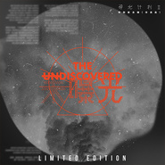

虾米音乐人
============================

|  |  |
| :--: | :-- |
| [ 虾米音乐人](https://i.xiami.com/xiamimusician) | **地区**: China 中国大陆 **风格**: 华语唱作人 Chinese Singer-Songwriter **播放数**: 129377502 **粉丝数**: 59242 **评论数**: 629  |

## 档案

想象音乐的另一种可能          虾米音乐人诚意出品的推荐内容——          虾米音乐人月刊系列——        虾米音乐人月刊1 怪咖当道>> http://www.xiami.com/events/xiamimusicianmonthly1        虾米音乐人月刊2 电气场>> http://www.xiami.com/events/xiamimusicianmonthly2        虾米音乐人月刊3 风从西北吹过来>> http://www.xiami.com/events/xiamimusicianmonthly3        虾米音乐人月刊4 Miss Sunshine>> http://www.xiami.com/events/xiamimusicianmonthly4        虾米音乐人2013年度精选>> http://www.xiami.com/events/xiamimusician2013        虾米音乐人月刊5 上课啦>> http://www.xiami.com/events/xiamimusicianmonthly5        虾米音乐人月刊6 年轻人的摇滚乐>> http://www.xiami.com/events/xiamimusicianmonthly6        虾米音乐人月刊7 小草地吉他音乐会>> http://www.xiami.com/events/xiamimusicianmonthly7        虾米音乐人月刊8 他夏了夏天>> http://www.xiami.com/market/music/act/xiamimusicianmonthly8.php        虾米音乐人月刊9 蓝调不眠夜>> http://www.xiami.com/market/music/act/xiamimusicianmonthly9.php          虾米音乐人周刊系列——        请点击我的精选集列表哦>> http://www.xiami.com/space/collect/u/17330125        乐评人特刊1 http://www.xiami.com/song/showcollect/id/25822529          我是音乐人系列——        01浪乐队>> http://www.xiami.com/events/i.xiami.lang        02甜梅号>> http://www.xiami.com/events/sugarplumferry        03FiFi Rong>> http://www.xiami.com/events/fifirong        04王胜男>> http://www.xiami.com/events/wangshengnan        05张尕怂>> http://www.xiami.com/events/zhanggasong        06邱比>> http://www.xiami.com/events/chiu-pi        07约瑟翰 庞麦郎>> http://www.xiami.com/market/music/act/yyrpj.php

## 专辑

| 名称 | 语种 | 唱片公司 | 发行时间 | 专辑类别 | 专辑风格 |
| :--: | :-- | :-- | :-- | :-- | :-- |
| [ Battle一夏 [LIVE EP]](./albums/2103807134.md) | 国语 | 虾米音乐人 | 2018年07月13日 | 现场专辑 | 流行说唱 Pop Rap |
| [ 寻光少年 - 雾霾黑胶限量版合辑](./albums/2103687520.md) | 国语 | 虾米音乐人 | 2018年04月17日 | 合集, 杂锦 | 国语流行 Mandarin Pop, 电子 Electronic, 嘻哈 Hip-Hop, 华语唱作人 Chinese Singer-Songwriter |
| [ 淘游记](./albums/2102968615.md) | 国语 | 虾米音乐人 | 2017年12月07日 | 合集, 杂锦 | 流行说唱 Pop Rap |
| [ 对谈：虾米寻光音乐人X行业前辈](./albums/2102909192.md) | 国语 | 阿里音乐 | 2017年11月07日 | 播客 |  |
| [ Next Level](./albums/2102880158.md) | 国语 | 虾米音乐人 | 2017年10月26日 | 合集, 杂锦 | 独立电子乐 Indietronica |
| [ 寻找未曝光少年寻光计划第二季视觉专辑](./albums/2102861547.md) | 国语 | 虾米音乐人 | 2017年09月22日 | 合集, 杂锦 | 华语唱作人 Chinese Singer-Songwriter, 国语流行 Mandarin Pop, 独立电子乐 Indietronica |
| [ 寻光集虾米音乐人合辑一号](./albums/104997677.md) | 国语 | 虾米音乐人 | 2014年07月21日 | 合集, 杂锦 | 华语唱作人 Chinese Singer-Songwriter |

## 评论

|  |  |  |
| :-- | :-- | :-- |
|  [虾米用户](https://emumo.xiami.com/u/338117333) This beautif... 2021-01-14 13:28 赞(2) 踩(0) | 
啊 舍不得虾米！！！！！！陪伴了我那么久，我用其他的app不习惯啊！！
 |
|  [虾米用户](https://emumo.xiami.com/u/61022680) 是个黑历史多到尬的能用脚... 2021-01-06 17:42 赞(3) 踩(0) | 
用了虾米五年啦，纵然有千万不舍，可还是到了要和小虾米说再见的时候了。听到消息的时候就开始点开收藏一首一首连着往下听了(按照平常听歌习惯我都是随机播放的XD)，连续很多首，还退出去看了收藏目录，从一开始到现在所有喜欢的歌都在这里。此时才察觉虾米早已是我手机中不可被替代的软件，也可以说是生活中的一部分啦。短时间内真的很难找到替代品。只能说希望未来也能在像虾米一样独特又温暖的地方重逢吧，但虾米会永远是我回忆里不可少的一部分。感谢你们一直都在，也希望我们一直都在。
 |
|  [虾米用户](https://emumo.xiami.com/u/12128984) 我讨厌一切不押韵的歌，感... 2021-01-06 15:16 赞(2) 踩(0) | 
暂时找不到可以替代虾米的平台，毕竟用了这么多年，收集了这么多年喜欢的歌曲，都在这里，其它平台都找不到喜欢的风格，还需要一点点找起来，也许没有，唉
 |
|  [虾米用户](https://emumo.xiami.com/u/31308088) ₯㎕音乐路上的孤单玩伴 2021-01-06 14:35 赞(2) 踩(0) | 
舍不得虾米，曾经在这里获得关于音乐的第一个奖励，做虾米音乐人未曾后悔，爱虾米，爱这里的小伙伴们！纵有千言，唯有不舍！
 |
|  [虾米用户](https://emumo.xiami.com/u/433759833) 每天都要乐观向上啊！ 2021-01-05 23:20 赞(0) 踩(0) | 
虾米，再见
 |
|  [虾米用户](https://emumo.xiami.com/u/356996672) Morpho Helen... 2020-12-14 15:33 赞(2) 踩(0) | 
永远喜欢虾米音乐。
 |
|  [虾米用户](https://emumo.xiami.com/u/279080712) 玲珑骰子安红豆，入骨相思... 2020-12-12 16:50 赞(2) 踩(0) | 
用了虾米5年，舍不得  希望不要是真的 喜欢虾米安静的氛围，评论区也很和谐 
 |
|  [虾米用户](https://emumo.xiami.com/u/434482834) 虾米音乐要挺过去呀！ 2020-12-09 13:56 赞(0) 踩(0) | 
留个爪
 |
|  [虾米用户](https://emumo.xiami.com/u/429819326)  2020-12-02 16:10 赞(2) 踩(0) | 
我绝不允许你离开我
 |
|  [虾米用户](https://emumo.xiami.com/u/403135869) 我爱虾米，博爱世界！！ 2020-10-05 06:58 赞(1) 踩(0) | 
茶韵环溢绕友亲， 真意浓情香满房， 论道辩禅显才华， 敬盏清醇暖家人， 齐杯聚饮展风度， 礼仪天执尊德恩！！ 为而择为，为择而为！点位职责实力作为家人们辛苦了！！ 音乐体系家人们辛苦了！！ 虾米音乐家人们辛苦了！！ ☯
 |
|  [虾米用户](https://emumo.xiami.com/u/429153626) 这次真要和虾米靠别了。音... 2020-08-01 12:25 赞(1) 踩(0) | 
喜欢用虾米音乐～听深浩室
 |
|  [虾米用户](https://emumo.xiami.com/u/442096600)  2020-06-02 14:04 赞(0) 踩(0) | 
I let my guard down so that you have the chance to hurt me.  But I am still brave enough to embrace love even like that. Keep loving, keep losing, keep fighting~I'm not stupid, I just believe in love~
 |
|  [虾米用户](https://emumo.xiami.com/u/429732797) *面对懒惰的你充满了决心 2020-05-16 22:24 赞(1) 踩(0) | 
内容已删除
 |
| ⇒ |  [虾米用户](https://emumo.xiami.com/u/268178465) hello world 2020-05-24 09:51 赞(0) 踩(0) | 
OvO？
 |
| ⇒ |  [虾米用户](https://emumo.xiami.com/u/39732543) 我还没想好要写什么... 2020-06-29 11:22 赞(0) 踩(0) | 
盗取？？？
 |
| ⇒ |  [虾米用户](https://emumo.xiami.com/u/414214831) 万类共生 2020-07-04 17:49 赞(0) 踩(0) | 
www
 |
|  [虾米用户](https://emumo.xiami.com/u/440777072)  2020-05-08 10:15 赞(0) 踩(0) | 
给你是
 |
|  [虾米用户](https://emumo.xiami.com/u/408905554)  2020-04-03 15:36 赞(1) 踩(0) | 
好听！
 |
|  [虾米用户](https://emumo.xiami.com/u/8388548)  2020-02-11 16:21 赞(2) 踩(0) | 
预防病毒感染少出门，在家多听听音乐
 |
|  [虾米用户](https://emumo.xiami.com/u/49286118) 节制的人生 2020-02-10 18:48 赞(1) 踩(0) | 
今天你有测试哦
 |
| ⇒ |  [虾米用户](https://emumo.xiami.com/u/430956170)  2020-02-10 23:56 赞(0) 踩(0) | 
同样来求
 |
|  [虾米用户](https://emumo.xiami.com/u/429518204)  2020-01-01 11:44 赞(0) 踩(0) | 
******
 |
|  [虾米用户](https://emumo.xiami.com/u/429518204)  2020-01-01 11:44 赞(0) 踩(0) | 
******
 |
|  [虾米用户](https://emumo.xiami.com/u/335763490) 心存善根 愿我梦想成真~... 2019-12-01 13:55 赞(3) 踩(0) | 
只用虾米音乐～     
 |
|  [虾米用户](https://emumo.xiami.com/u/358969107)  2019-11-09 22:22 赞(0) 踩(0) | 
666
 |
|  [虾米用户](https://emumo.xiami.com/u/409284643) v我而生 2019-06-01 09:39 赞(0) 踩(0) | 
啊啊啊呃呃呃呼呼呼啦啦啦噢噢噢啊啊啊呃呃呃呼呼呼啦啦啦噢噢噢啊啊啊呃呃呃呼呼呼啦啦啦噢噢噢啊啊啊呃呃呃呼呼呼啦啦啦噢噢噢啊啊啊呃呃呃呼呼呼啦啦啦噢噢噢啊啊啊呃呃呃呼呼呼啦啦啦噢噢噢
 |
|  [虾米用户](https://emumo.xiami.com/u/409284643) v我而生 2019-06-01 09:38 赞(0) 踩(0) | 
啊啊啊呃呃呃呼呼呼啦啦啦噢噢噢啊啊啊呃呃呃呼呼呼啦啦啦噢噢噢啊啊啊呃呃呃呼呼呼啦啦啦噢噢噢啊啊啊呃呃呃呼呼呼啦啦啦噢噢噢啊啊啊呃呃呃呼呼呼啦啦啦噢噢噢啊啊啊呃呃呃呼呼呼啦啦啦噢噢噢啊啊啊呃呃呃呼呼呼啦啦啦噢噢噢啊啊啊呃呃呃呼呼呼啦啦啦噢噢噢啊啊啊呃呃呃呼呼呼啦啦啦噢噢噢啊啊啊呃呃呃呼呼呼啦啦啦噢噢噢啊啊啊呃呃呃呼呼呼啦啦啦噢噢噢啊啊啊呃呃呃呼呼呼啦啦啦噢噢噢啊啊啊呃呃呃呼呼呼啦啦啦噢噢噢啊啊啊呃呃呃呼呼呼啦啦啦噢噢噢啊啊啊呃呃呃呼呼呼啦啦啦噢噢噢啊啊啊呃呃呃呼呼呼啦啦啦噢噢噢啊啊啊呃呃呃呼呼呼啦啦啦噢噢噢啊啊啊呃呃呃呼呼呼啦啦啦噢噢噢啊啊啊呃呃呃呼呼呼啦啦啦噢噢噢啊啊啊呃呃呃呼呼呼啦啦啦噢噢噢
 |
|  [虾米用户](https://emumo.xiami.com/u/339191478)   2019-05-31 23:08 赞(0) 踩(0) | 

 |
|  [虾米用户](https://emumo.xiami.com/u/425085116) 本小姐到此一游 2019-05-26 22:55 赞(0) 踩(0) | 
你好
 |
|  [虾米用户](https://emumo.xiami.com/u/424489662)  2019-05-13 10:39 赞(0) 踩(0) | 

 |
|  [虾米用户](https://emumo.xiami.com/u/305303531) 音乐是语言的花朵，语言是... 2019-04-14 00:54 赞(1) 踩(0) | 
第一张翻唱专辑发表在虾米。往后会再接再厉，带来更多原创歌曲。多多指教。
 |
|  [虾米用户](https://emumo.xiami.com/u/37627963) 大家好，感谢大家一直以来... 2019-04-08 13:58 赞(5) 踩(0) | 
您好，我是广东汕头的电音制作人，我最新做了一张专辑，一共17首歌，是我花费很大精力做出来的，包括两首中文说唱（说唱歌手是朋友一起玩），我想请你帮我听一下，如果你觉得好听，我想入你的歌单，帮我推广一下，没想要大红大紫，只是希望更多人的听到，哪怕投钱都好，谢谢您 [拜][拜][拜][拜][拜][拜] 专辑名称：Whiners are wieners 最新那个就是
 |
| ⇒ |  [虾米用户](https://emumo.xiami.com/u/305303531) 音乐是语言的花朵，语言是... 2019-04-14 00:55 赞(0) 踩(0) | 
期待合作
 |
| ⇒ |  [虾米用户](https://emumo.xiami.com/u/424673096)  2019-05-19 13:42 赞(0) 踩(0) | 
一'i
 |
|  [虾米用户](https://emumo.xiami.com/u/71805108) 就这样 2019-03-27 15:27 赞(0) 踩(0) | 
有音乐真好
 |
|  [虾米用户](https://emumo.xiami.com/u/299429986) ＢＬＡＣＫ    ＭＡＭ... 2019-03-07 16:49 赞(2) 踩(0) | 
这家伙又不唱歌，而且还偷取别人的作品放到自己的主页里，为什么那么多粉丝？！
 |
|  [虾米用户](https://emumo.xiami.com/u/324560600) 1  2019-02-17 19:38 赞(0) 踩(0) | 
昨天刚听的，感觉很棒，一直以来没怎么关注过，有点窦唯，许巍的感觉
 |
|  [虾米用户](https://emumo.xiami.com/u/371325093) 我还没想好要写什么... 2018-10-10 11:37 赞(15) 踩(0) | 
内容已删除
 |
| ⇒ |  [虾米用户](https://emumo.xiami.com/u/403572950)  2018-10-15 22:36 赞(0) 踩(0) | 
加油！
 |
| ⇒ |  [虾米用户](https://emumo.xiami.com/u/403572950)  2018-10-15 22:37 赞(0) 踩(0) | 
加油！我相信你
 |
| ⇒ |  [虾米用户](https://emumo.xiami.com/u/403572950)  2018-11-19 10:39 赞(0) 踩(0) | 
嗯
 |
| ⇒ |  [虾米用户](https://emumo.xiami.com/u/403572950)  2018-11-19 20:42 赞(0) 踩(0) | 
<q><b>沫兮说：</b></q>
 |
|  [虾米用户](https://emumo.xiami.com/u/357732292)  2018-09-22 08:53 赞(2) 踩(0) | 
潜力股   
 |
|  [虾米用户](https://emumo.xiami.com/u/275454676)  2018-09-16 15:50 赞(1) 踩(0) | 
最近很多很多很多歌都下架
 |
| ⇒ |  [虾米用户](https://emumo.xiami.com/u/374298507)  2018-11-18 19:32 赞(0) 踩(0) | 
对
 |
|  [虾米用户](https://emumo.xiami.com/u/110603554) 听吧!听吧!都是有故事的... 2018-09-06 14:22 赞(1) 踩(0) | 
虾米你们还收不收破烂?旧手机烂手机还换盆不?大声说一声，我这儿风大! 
 |
|  [虾米用户](https://emumo.xiami.com/u/253500258) 大吉他 2018-08-23 19:59 赞(1) 踩(0) | 
南無阿弥陀佛.南無阿弥陀佛.南無阿弥陀佛.南無阿弥陀佛.南無阿弥陀佛.南無阿弥陀佛.南無阿弥陀佛.南無阿弥陀佛.南無阿弥陀佛.南無阿弥陀佛.南無阿弥陀佛.南無阿弥陀佛.南無阿弥陀佛.南無阿弥陀佛.南無阿弥陀佛.南無阿弥陀佛.南無阿弥陀佛.南無阿弥陀佛.南無阿弥陀佛.南無阿弥陀佛.南無阿弥陀佛.南無阿弥陀佛.南無阿弥陀佛.南無阿弥陀佛.南無阿弥陀佛.南無阿弥陀佛.南無阿弥陀佛.南無阿弥陀佛.南無阿弥陀佛.南無阿弥陀佛.南無阿弥陀佛.南無阿弥陀佛南無阿弥陀佛南無阿弥陀佛.南無阿弥陀佛.南無阿弥陀佛.南無阿弥陀佛.南無阿弥陀佛.南無阿弥陀佛.南無阿弥陀佛.南無阿弥陀佛.南無阿弥陀佛.南無阿弥陀佛.
 |
|  [虾米用户](https://emumo.xiami.com/u/253500258) 大吉他 2018-08-23 19:53 赞(1) 踩(0) | 
南無阿弥陀佛.南無阿弥陀佛.南無阿弥陀佛.南無阿弥陀佛.南無阿弥陀佛.南無阿弥陀佛.南無阿弥陀佛.南無阿弥陀佛.南無阿弥陀佛.南無阿弥陀佛.南無阿弥陀佛.南無阿弥陀佛.南無阿弥陀佛.南無阿弥陀佛.南無阿弥陀佛.南無阿弥陀佛.南無阿弥陀佛.南無阿弥陀佛.南無阿弥陀佛.南無阿弥陀佛.南無阿弥陀佛.南無阿弥陀佛.南無阿弥陀佛.南無阿弥陀佛.南無阿弥陀佛.南無阿弥陀佛.南無阿弥陀佛.南無阿弥陀佛.南無阿弥陀佛.南無阿弥陀佛.南無阿弥陀佛.南無阿弥陀佛.南無阿弥陀佛.南無阿弥陀佛.南無阿弥陀佛.南無阿弥陀佛.南無阿弥陀佛.南無阿弥陀佛.南無阿弥陀佛.南無阿弥陀佛.南無阿弥陀佛.南無阿弥陀佛.南無阿弥陀佛
 |
|  [虾米用户](https://emumo.xiami.com/u/378358234) 转去网易了id  spo... 2018-07-21 10:49 赞(1) 踩(0) | 
有空来听听我的rap
 |
|  [虾米用户](https://emumo.xiami.com/u/13165169)  2018-07-19 20:25 赞(1) 踩(0) | 
虾米以前一搜全是自己歌曲，现在手机一搜自己名字全是别人盗版歌曲。
 |
| ⇒ |  [虾米用户](https://emumo.xiami.com/u/194880781) 这家伙很聪明什么也没留下... 2018-08-12 12:46 赞(0) 踩(0) | 
版权版权体谅下~~各大音乐App都是这样熬过来的❤️
 |
|  [虾米用户](https://emumo.xiami.com/u/13165169)  2018-07-19 20:23 赞(1) 踩(0) | 
为什么盗版音乐还能被搜到。搜我的名字确是全是别人盗版歌曲。
 |
|  [虾米用户](https://emumo.xiami.com/u/345635652) 玩音乐 2018-07-14 04:03 赞(1) 踩(0) | 
麻烦听下我为battle一夏写的新歌（醉啦）
 |
|  [虾米用户](https://emumo.xiami.com/u/28995619) 再拼搏一次 2018-06-10 20:43 赞(2) 踩(0) | 
这首歌<a href="https://www.xiami.com/song/1798183266" target="_blank" rel="nofollow noreferrer noopener">https://www.xiami.com/song/1798183266</a> 的动态歌词已经更新了，感谢！^_^@虾米音乐人
 |
|  [虾米用户](https://emumo.xiami.com/u/28995619) 再拼搏一次 2018-06-07 00:28 赞(1) 踩(0) | 
您好！我的这首歌<a href="https://www.xiami.com/song/1798183266" target="_blank" rel="nofollow noreferrer noopener">https://www.xiami.com/song/1798183266</a> 已经编辑了动态歌词，请问为什么不能更新啊？ @虾米音乐人
 |
|  [虾米用户](https://emumo.xiami.com/u/28995619) 再拼搏一次 2018-06-07 00:24 赞(1) 踩(0) | 
您好！我的这首歌<a href="https://www.xiami.com/song/1798183266" target="_blank" rel="nofollow noreferrer noopener">https://www.xiami.com/song/1798183266</a> 已经编辑了动态歌词，请问为什么不能更新啊？
 |
|  [虾米用户](https://emumo.xiami.com/u/47937529) 原创音乐人，虾米音乐艺人... 2018-06-04 22:38 赞(1) 踩(0) | 
<a href="https://www.xiami.com/album/2103717255?spm=a1z1s.6632057.350708709.7.iTNf3f" target="_blank" rel="nofollow noreferrer noopener">https://www.xiami.com/album/2103717255?spm=a1z1s.6632057.350708709.7.iTNf3f</a>
 |
|  [虾米用户](https://emumo.xiami.com/u/329486376)  2018-06-01 20:29 赞(3) 踩(0) | 
请问虾米音乐人怎么改艺名？
 |
|  [虾米用户](https://emumo.xiami.com/u/355031959)  2018-05-22 13:34 赞(3) 踩(0) | 
谢谢一直有好歌。。。
 |
|  [虾米用户](https://emumo.xiami.com/u/959597) 黑暗里舞动的少年会是谁 2018-05-17 13:01 赞(1) 踩(0) | 
丁可的声音
 |
|  [虾米用户](https://emumo.xiami.com/u/339890636)  2018-05-08 08:40 赞(1) 踩(0) | 
请问我昨天上传的原创歌曲，咋在新歌新碟栏里没有显示呢
 |
|  [虾米用户](https://emumo.xiami.com/u/224402162)  2018-03-30 11:41 赞(1) 踩(0) | 
我就冷笑一声路过
 |
|  [虾米用户](https://emumo.xiami.com/u/41575996) 走 2018-03-18 15:00 赞(2) 踩(0) | 
&lt;推荐音乐人[url=/u/3651534]@MHP[/url] 虾米快推荐吧 只能在虾米听歌了 云音乐都没有资源&gt;&lt;3651534&gt;
 |
|  [虾米用户](https://emumo.xiami.com/u/352630967) 乖，睡觉 2018-03-17 09:23 赞(1) 踩(0) | 

 |
|  [虾米用户](https://emumo.xiami.com/u/340046395) 喜欢唱歌可以给个关注 2018-02-26 10:48 赞(2) 踩(0) | 
改音乐人名字  提交2个月都没反应
 |
|  [虾米用户](https://emumo.xiami.com/u/298022288)  2018-01-23 18:48 赞(3) 踩(0) | 
嗯&amp;hellip;我有点怀疑官方根本看不到这里的消息
 |
|  [虾米用户](https://emumo.xiami.com/u/343933062) 爱上山下河 也爱城市穿梭 2018-01-09 17:14 赞(2) 踩(0) | 
哈喽~请问下demo没有上传封面图的选项吗？
 |
|  [虾米用户](https://emumo.xiami.com/u/12499109) 绝望しろ! これは 宇智... 2018-01-07 20:56 赞(1) 踩(0) | 
emm
 |
|  [虾米用户](https://emumo.xiami.com/u/322451356)  2017-12-24 21:07 赞(2) 踩(0) | 
曲库管理里面&amp;ldquo;这不是纯音乐&amp;rdquo;的按钮根本就没反应。连歌词都加不进去
 |
|  [虾米用户](https://emumo.xiami.com/u/43156603) 请叫我何小河 2017-12-21 11:14 赞(1) 踩(0) | 
666
 |
|  [虾米用户](https://emumo.xiami.com/u/43156603) 请叫我何小河 2017-12-21 11:14 赞(1) 踩(0) | 

 |
|  [虾米用户](https://emumo.xiami.com/u/334109468) 我爱你～孤独伴我安然无恙... 2017-12-20 19:54 赞(1) 踩(0) | 
为什么小太阳的伴奏是歌，歌是伴奏啊  
 |
|  [虾米用户](https://emumo.xiami.com/u/334109468) 我爱你～孤独伴我安然无恙... 2017-12-20 19:53 赞(1) 踩(0) | 
有暴漏
 |
|  [虾米用户](https://emumo.xiami.com/u/340647054)  2017-12-19 21:30 赞(0) 踩(0) | 
  
 |
|  [虾米用户](https://emumo.xiami.com/u/312607905)  2017-12-12 12:22 赞(16) 踩(0) | 
您好！我有请客服向官方咨询关于专辑所属的唱片公司问题，官方请我来联系虾小编！ 是这样的： One Way Street音乐人帐户原先是我私人管理， 由于唱片公司或其他问题将我的音乐人帐户更动了，所以现在我无法私人登入编辑。  但现在因为已经与唱片公司解除合约，虾米音乐上的专辑资讯中， 发行公司栏位仍未更动，所以想请虾小编是否能帮我把One Way Street音乐人帐户删除， <a href="http://i.xiami.com/onewaystreettw?spm=a1z1s.3521917.226669510.8.E6BeJB&amp;amp;from=search" target="_blank" rel="nofollow noreferrer noopener">http://i.xiami.com/onewaystreettw?spm=a1z1s.3521917.226669510.8.E6BeJB&amp;amp;from=search</a> 因为现在无法自行编辑，所以想要重新创立一个，谢谢！
 |
|  [虾米用户](https://emumo.xiami.com/u/333203028) ※爱追星※❤爱鹿晗❤ 2017-12-09 09:17 赞(0) 踩(0) | 
在下感激不尽 
 |
|  [虾米用户](https://emumo.xiami.com/u/333203028) ※爱追星※❤爱鹿晗❤ 2017-12-09 09:17 赞(0) 踩(0) | 
谁跟我个机会
 |
|  [虾米用户](https://emumo.xiami.com/u/333203028) ※爱追星※❤爱鹿晗❤ 2017-12-09 09:16 赞(0) 踩(0) | 
我也想要虾米音乐人
 |
| ⇒ |  [虾米用户](https://emumo.xiami.com/u/268178465) hello world 2018-03-16 16:57 赞(0) 踩(0) | 
要电脑
 |
|  [虾米用户](https://emumo.xiami.com/u/19152275) 你只是个听众 而不是创造... 2017-11-28 17:12 赞(0) 踩(0) | 
get 
 |
|  [虾米用户](https://emumo.xiami.com/u/311196561) 【你的世界我来过】 2017-11-09 17:08 赞(0) 踩(0) | 
俺也来学习
 |
|  [虾米用户](https://emumo.xiami.com/u/171615782) 代表作《为你着魔》《等你... 2017-11-06 05:10 赞(0) 踩(0) | 
新歌上线啦欢迎收听
 |
|  [虾米用户](https://emumo.xiami.com/u/287381497) 全能音乐唱作人 护暮人 2017-11-03 09:46 赞(0) 踩(0) | 
管理员
 |
|  [虾米用户](https://emumo.xiami.com/u/119384594) 呼褐，唱作人，策划人，“... 2017-10-30 10:02 赞(0) 踩(0) | 
我原来用淘宝账户申请的虾米音乐人，结果现在阿里升级，我的虾米音乐人登不上了，崩溃。
 |
|  [虾米用户](https://emumo.xiami.com/u/13691836) 以梦为马 2017-10-30 09:55 赞(2) 踩(0) | 
一直有虾米音乐人推荐，今天是第一次认认真真的阅读这份订阅
 |
|  [虾米用户](https://emumo.xiami.com/u/40726147)  2017-10-30 09:52 赞(1) 踩(0) | 
每个独立音乐人都有孤独的一群小孩 希望有一天他们长大了能做一些有意义的事 虾米就像是他们的幼儿园 在这里玩耍 pk 长大 谢谢有你...
 |
|  [虾米用户](https://emumo.xiami.com/u/55098090)  2017-10-28 00:43 赞(3) 踩(0) | 
你好，为什么我的虾米音乐人申请了几天都没有消息？能不能帮我查看一下进度，谢谢，我的艺名叫Hiphop 龍
 |
|  [虾米用户](https://emumo.xiami.com/u/97466514) 有你有故事有音乐 2017-10-28 00:40 赞(30) 踩(0) | 
虾米大侠，音乐人求通过啊。酷狗QQ都通过了为什么你们一直不给信息啊。
 |
|  [虾米用户](https://emumo.xiami.com/u/74079792)  2017-10-28 00:26 赞(1) 踩(0) | 
我于2月10号申请的虾米音乐人，但今天都没有动静，我的艺名Max Dick，希望能加快审核，谢谢
 |
|  [虾米用户](https://emumo.xiami.com/u/21340976) 张昕晟，通俗歌手原创音乐... 2017-10-28 00:05 赞(1) 踩(0) | 
正是草根寻找平台 寻找光芒  我们没有资金来包装华丽的作品给你们 ，所以你们不要觉得我们的作品是简单垃圾的作品 我们也是对音乐的执着 对梦想的追求 不要每次都觉得我们都是你们的酱油！
 |
|  [虾米用户](https://emumo.xiami.com/u/100729100)  2017-10-27 23:49 赞(2) 踩(0) | 
您好，监测显示，您在我们的平台上存在违规发布他人歌曲和发布违规歌曲等行为。 这一行为已经严重违反了音乐人平台的诚信和原创原则，对此，我们决定撤销您的音乐人资格并清除相关作品，请您知悉。   这个账号是我购买的，资料和密码我都不能改，现在就这样被封号了
 |
|  [虾米用户](https://emumo.xiami.com/u/192380668) 多听古典乐 2017-10-27 23:33 赞(2) 踩(0) | 
虾米改版有点猝不及防啊。字体变的很大，好丑→_→。系统不稳定。很“滑”。
 |
|  [虾米用户](https://emumo.xiami.com/u/245304136) 永远爱您 2017-10-26 00:05 赞(0) 踩(0) | 
感谢寻光   感谢
 |
| ⇒ |  [虾米用户](https://emumo.xiami.com/u/245304136) 永远爱您 2018-03-14 23:12 赞(0) 踩(0) | 
<q><b>说：</b></q>
 |
|  [虾米用户](https://emumo.xiami.com/u/4925005) nothing 2017-10-24 12:48 赞(0) 踩(0) | 
您好，之前首推的华研词曲创作大赛，报名入口在哪呢？
 |
|  [虾米用户](https://emumo.xiami.com/u/32010480)  2017-10-19 10:19 赞(0) 踩(0) | 
希望能有一天邱比能好好出一张专辑，每首歌感觉能把人听晕
 |
|  [虾米用户](https://emumo.xiami.com/u/180283996) 。 2017-10-17 15:44 赞(2) 踩(0) | 
我的独立音乐人申请持续了近一个月，终于在8月15号收到已经申请成功。结果8月17日突然又收到一条信息，说我demo有问题？独立音乐人申请失败。卧槽，什么意思啊。我音乐人后台又给我封了？什么意思。我的信息demo都为真实且原创。根本没有任何问题，而且15号已经给我发通过消息了。17号突然又发一条申请失败。你们是什么意思，就是这种工作态度？ 我希望你们马上恢复我的音乐人后台。并且给我一个解释。虽然我不是明星，但是音乐人也需要尊重。我已经把相关的东西截图取证。 48小时申请审核，持续了三周，第四周通过后2天内突然又发消息说申请失败。CAT.pop
 |
|  [虾米用户](https://emumo.xiami.com/u/8508182)  2017-10-16 17:53 赞(1) 踩(0) | 
你好，我是音乐人，音乐人申请过了，也上传了歌曲，但是现在进不后台了，怎么解决呢？
 |
|  [虾米用户](https://emumo.xiami.com/u/330075866)  2017-10-14 11:53 赞(0) 踩(0) | 
汪苏泷好帅
 |
|  [虾米用户](https://emumo.xiami.com/u/193159637) 好时光都该被宝贝，因为有... 2017-10-07 12:48 赞(0) 踩(0) | 
虾米什么时候可以设置铃声呢  
 |
|  [虾米用户](https://emumo.xiami.com/u/326614552)  2017-09-24 17:27 赞(0) 踩(0) | 
666
 |
|  [虾米用户](https://emumo.xiami.com/u/262326500) 过往云霄，不如你回暇相濡... 2017-09-24 08:33 赞(1) 踩(0) | 
666
 |
|  [虾米用户](https://emumo.xiami.com/u/262326500) 过往云霄，不如你回暇相濡... 2017-09-23 14:37 赞(1) 踩(0) | 
666
 |
|  [虾米用户](https://emumo.xiami.com/u/262326500) 过往云霄，不如你回暇相濡... 2017-09-22 19:45 赞(1) 踩(0) | 
666
 |
|  [虾米用户](https://emumo.xiami.com/u/262326500) 过往云霄，不如你回暇相濡... 2017-09-22 19:45 赞(1) 踩(0) | 
666
 |
|  [虾米用户](https://emumo.xiami.com/u/292031544) 阎勇古诗歌曲KTV 2017-09-21 06:13 赞(1) 踩(0) | 
给我邮箱，送给你每个华人都需要的《阎勇古诗歌曲KTV160首》
 |
|  [虾米用户](https://emumo.xiami.com/u/316099275) 你是我心里挥之不去的彩虹 2017-09-19 18:11 赞(2) 踩(0) | 
我是来寻找月代彩的，理由就这么简单 
 |
|  [虾米用户](https://emumo.xiami.com/u/5279398) r 2017-08-26 17:10 赞(2) 踩(0) | 
我没有你的联系方式了
 |
|  [虾米用户](https://emumo.xiami.com/u/32104365) 顾问 全能音乐人 主播 2017-08-23 20:39 赞(2) 踩(0) | 
您好！我17日提现到支付宝可是今天还不到账，麻烦您去看看，谢谢！
 |
|  [虾米用户](https://emumo.xiami.com/u/35875439) 我还没想好要写什么... 2017-08-15 11:42 赞(2) 踩(0) | 
刚刚鲁豫在&amp;ldquo;有约&amp;rdquo;节目里和罗大佑谈到了一首英文歌，是二个男生一起伤害了一个女生题材的，好像还是他俩一起唱的，分享&amp;ldquo;罪过&amp;rdquo;，您知道是什么名字嘛？
 |
|  [虾米用户](https://emumo.xiami.com/u/316630585) 不管你去那我都愿陪你去 2017-08-02 17:01 赞(2) 踩(0) | 
你好棒哟！
 |
|  [虾米用户](https://emumo.xiami.com/u/314354657) 有阳光，有清新在阳光下听... 2017-07-24 22:28 赞(2) 踩(0) | 
太棒了
 |
|  [虾米用户](https://emumo.xiami.com/u/314354657) 有阳光，有清新在阳光下听... 2017-07-24 22:24 赞(2) 踩(0) | 
怎么才能成为音乐达人
 |
|  [虾米用户](https://emumo.xiami.com/u/314354657) 有阳光，有清新在阳光下听... 2017-07-24 22:23 赞(1) 踩(0) | 
  
 |
|  [虾米用户](https://emumo.xiami.com/u/314354657) 有阳光，有清新在阳光下听... 2017-07-24 22:23 赞(1) 踩(0) | 
好棒啊   
 |
|  [虾米用户](https://emumo.xiami.com/u/192380668) 多听古典乐 2017-07-21 22:33 赞(2) 踩(0) | 
虾米今天改版   好   方   呐
 |
|  [虾米用户](https://emumo.xiami.com/u/296221013) 始于初见，不负年华。。。 2017-07-13 12:32 赞(1) 踩(0) | 
66666666你好火。。
 |
|  [虾米用户](https://emumo.xiami.com/u/310103729) 我的爱分想给大家 2017-07-10 10:55 赞(2) 踩(0) | 
你叫什么名字？
 |
|  [虾米用户](https://emumo.xiami.com/u/296517923) 音乐人辑《春塔》《夏集》 2017-06-29 13:41 赞(2) 踩(0) | 
可以！
 |
|  [虾米用户](https://emumo.xiami.com/u/15721850) 希望可以过的更好 2017-06-27 05:16 赞(4) 踩(0) | 
虾米，有人说你虾币币
 |
|  [虾米用户](https://emumo.xiami.com/u/40167719)  2017-06-19 17:33 赞(2) 踩(0) | 
这现在不能私信了吗？我的问题都没解决，就再无人理会了？
 |
|  [虾米用户](https://emumo.xiami.com/u/268398222) 生活在吴川，爱上脚爆爆 2017-06-16 06:44 赞(1) 踩(0) | 
...............
 |
|  [虾米用户](https://emumo.xiami.com/u/2733582) SHUHKEANMOON... 2017-06-16 00:09 赞(1) 踩(0) | 
你好
 |
|  [虾米用户](https://emumo.xiami.com/u/303951131)  2017-06-13 18:31 赞(1) 踩(0) | 
有些歌太&amp;hellip;难听
 |
|  [虾米用户](https://emumo.xiami.com/u/23404692) 哈哈 2017-06-11 21:27 赞(1) 踩(0) | 
虾米音乐人
 |
|  [虾米用户](https://emumo.xiami.com/u/282878287) 我还没想好要写什么... 2017-06-08 17:10 赞(0) 踩(0) | 
你好！！我想问一下我的主页没有了上传歌曲的提示。我现在要上传新的歌曲。但不知道再哪里找到入口？
 |
|  [虾米用户](https://emumo.xiami.com/u/300008847) 盲奇 2017-06-07 19:54 赞(0) 踩(0) | 
报名成功了 我是不是有点着急？嘻嘻
 |
|  [虾米用户](https://emumo.xiami.com/u/300008847) 盲奇 2017-06-07 19:49 赞(0) 踩(0) | 
我的专辑已经发布了 。为什么在报名的网页中 只有一个我的DEMO的专辑。 还是报不了名？
 |
|  [虾米用户](https://emumo.xiami.com/u/300008847) 盲奇 2017-06-07 19:37 赞(0) 踩(0) | 
音频压缩失败 是说比特率不够吗 ？ 我重新发了@虾米音乐人
 |
|  [虾米用户](https://emumo.xiami.com/u/300008847) 盲奇 2017-06-07 19:28 赞(0) 踩(0) | 
我是朱旷野 我想报名寻光计划2 专辑已经提交 能帮我加速一下审核吗 我好报名@虾米音乐人
 |
|  [虾米用户](https://emumo.xiami.com/u/293593249) 我还没想好要写什么... 2017-06-07 14:02 赞(0) 踩(0) | 
名字 阮梓航 我想参加寻光计划的 可是貌似还没有成为虾米音乐人 求加速啊 我投了一段作品没通过 现在我把完整的demo跟分轨都发过去了 希望能够赶得上
 |
|  [虾米用户](https://emumo.xiami.com/u/43789501) 摇滚无界，女生制噪！ 2017-06-01 16:50 赞(1) 踩(0) | 
支持支持！感谢虾米提供一个供音乐人自由交流的平台~欢迎各位同道中人来听听我们的歌曲~哈哈~
 |
|  [虾米用户](https://emumo.xiami.com/u/116075092)  2017-05-27 15:57 赞(1) 踩(0) | 
支持虾米！！
 |
|  [虾米用户](https://emumo.xiami.com/u/116075092)  2017-05-27 15:57 赞(1) 踩(0) | 
支持虾米！！
 |
|  [虾米用户](https://emumo.xiami.com/u/36648872) 希望有一天能走到阳光下. 2017-05-24 13:53 赞(3) 踩(0) | 
虾米音乐人申请了几次都不通过。上传了自己的demo换了几首 还是不通过  系统来来去去就是：&amp;ldquo;十分抱歉，你提交的音乐人暂申请未通过 原因请登录虾米音乐，查看通知..  &amp;rdquo; 登录了虾米。什么通知都没收到。未通过的原因也不说。这不是在浪费大家时间吗。践踏我们的情感。
 |
| ⇒ |  [虾米用户](https://emumo.xiami.com/u/311777541) 喜欢音乐，所以出发！ 2017-07-13 15:04 赞(0) 踩(0) | 
哈哈，作品时间过短，或者资料不全，反正我第一次申请作品才一分钟，没通过，后来换成4分钟，半小时就过了！   
 |
|  [虾米用户](https://emumo.xiami.com/u/2517870) 用乐符铭记永恒 2017-05-21 01:36 赞(1) 踩(0) | 
你好，对参加寻光计划有好的建议吗？
 |
|  [虾米用户](https://emumo.xiami.com/u/8128365) 耳听原创/眼看音乐 2017-05-03 21:12 赞(1) 踩(0) | 
你好，第二季寻光计划未能点击报名，請協助，謝謝。
 |
|  [虾米用户](https://emumo.xiami.com/u/279127769)  2017-04-29 23:29 赞(1) 踩(0) | 
怎么申请音乐人哦
 |
|  [虾米用户](https://emumo.xiami.com/u/291590431) 独立音乐人 2017-04-26 18:50 赞(2) 踩(0) | 
您好，我的音乐人申请几次了，就是不给于通过，歌曲demo以及工程文件都上传了。麻烦您查看给我通过下好吗。要比赛，需要有吓米音乐人。谢谢
 |
|  [虾米用户](https://emumo.xiami.com/u/291565264) 好音乐尽在天蜂娱乐唱片 2017-04-26 17:22 赞(1) 踩(0) | 
您好 能告诉我 唱片公司入库歌曲流程吗
 |
|  [虾米用户](https://emumo.xiami.com/u/291565264) 好音乐尽在天蜂娱乐唱片 2017-04-26 17:21 赞(1) 踩(0) | 
唱片公司怎么入库歌曲啊  流程告诉我  谢谢
 |
|  [虾米用户](https://emumo.xiami.com/u/290884938)  2017-04-24 18:37 赞(1) 踩(0) | 
额
 |
|  [虾米用户](https://emumo.xiami.com/u/288202433) 为我们美好的未来加油↖(... 2017-04-19 17:15 赞(1) 踩(0) | 
虾米音乐人提供的歌曲真好听
 |
|  [虾米用户](https://emumo.xiami.com/u/17885651) 即将推出跟以前完全不一样... 2017-04-15 11:24 赞(1) 踩(0) | 
你们的客服真垃圾，半年了还不够你们处理其他问题？半年前的反馈到现在还没有回复
 |
| ⇒ |  [虾米用户](https://emumo.xiami.com/u/39403875) 想和你去别人不知道但很浪... 2017-04-20 04:11 赞(0) 踩(0) | 
他不是客服！
 |
|  [虾米用户](https://emumo.xiami.com/u/98683924)  2017-04-12 17:49 赞(1) 踩(0) | 
nice
 |
|  [虾米用户](https://emumo.xiami.com/u/49169963) 生命只有电音和她 2017-04-08 23:59 赞(1) 踩(0) | 
希望虾米可以多多关注独立电子音乐制作人
 |
|  [虾米用户](https://emumo.xiami.com/u/58830586)  2017-04-07 22:39 赞(1) 踩(0) | 
 
 |
|  [虾米用户](https://emumo.xiami.com/u/2272534)  2017-03-29 17:37 赞(2) 踩(0) | 
你好，想报名参加&amp;ldquo;试音间&amp;rdquo;，可点击&amp;ldquo;立即报名&amp;rdquo;没有任何反应，换浏览器也不行，请问是什么原因。 盼复！
 |
|  [虾米用户](https://emumo.xiami.com/u/50422078) 哈力努尔 2017-03-25 13:04 赞(1) 踩(0) | 
宣传我的两首歌  小幸运    别想他
 |
|  [虾米用户](https://emumo.xiami.com/u/50422078) 哈力努尔 2017-03-25 13:03 赞(1) 踩(0) | 
新入驻歌手求支持
 |
|  [虾米用户](https://emumo.xiami.com/u/78235592) HUIE 2017-03-19 23:34 赞(2) 踩(0) | 
喜欢虾米
 |
|  [虾米用户](https://emumo.xiami.com/u/280842293)  2017-03-17 10:58 赞(2) 踩(0) | 
推荐几首有深入感情的歌曲，低重音的旋律吗？
 |
|  [虾米用户](https://emumo.xiami.com/u/280609639)  2017-03-16 02:56 赞(1) 踩(0) | 
无语&amp;hellip;&amp;hellip;&amp;hellip;&amp;hellip;
 |
|  [虾米用户](https://emumo.xiami.com/u/16206377) rabbit_❀moon 2017-03-13 20:17 赞(1) 踩(0) | 
第一首吓到了，曹方声音怎么变了
 |
|  [虾米用户](https://emumo.xiami.com/u/127871578)  2017-03-13 12:22 赞(1) 踩(0) | 
却说我提交的歌不是原创，而且是秒退，系统自动不通过，审核非常不合理 希望解决
 |
|  [虾米用户](https://emumo.xiami.com/u/30812316)  2017-03-04 22:20 赞(2) 踩(0) | 
电脑重新上传歌曲后 网页版虾米能听到新传的版本了。可手机听还是没改过来 这是为啥
 |
|  [虾米用户](https://emumo.xiami.com/u/73216180) 微信QQ 同步15292... 2017-02-28 00:31 赞(1) 踩(0) | 
音乐人怎么修改封格
 |
|  [虾米用户](https://emumo.xiami.com/u/49402915)  还没想好要写什么... 2017-02-17 00:58 赞(1) 踩(0) | 
哈
 |
|  [虾米用户](https://emumo.xiami.com/u/257029297) 嗨！没啥，我的灵魂交给了... 2017-02-12 16:24 赞(1) 踩(0) | 
推荐我的两首歌：《跌跌撞撞的人间》《在城市里思想》
 |
|  [虾米用户](https://emumo.xiami.com/u/187209002)  2017-02-05 13:31 赞(0) 踩(0) | 
啊啊啊啊
 |
|  [虾米用户](https://emumo.xiami.com/u/268811856)  2017-01-28 22:03 赞(1) 踩(0) | 
怎么申请成为音乐人
 |
|  [虾米用户](https://emumo.xiami.com/u/167871400)  2017-01-27 09:54 赞(1) 踩(0) | 
辛苦了有时间了审核下我的音乐人。谢谢
 |
|  [虾米用户](https://emumo.xiami.com/u/167871400)  2017-01-27 09:53 赞(1) 踩(0) | 
辛苦了有时间了审核下我的音乐人。谢谢
 |
|  [虾米用户](https://emumo.xiami.com/u/213734741) 诗人网红重庆第二届新锐精... 2017-01-20 13:29 赞(1) 踩(0) | 
精彩
 |
|  [虾米用户](https://emumo.xiami.com/u/256416558) 开心果果，开心你我， 2017-01-16 18:26 赞(1) 踩(0) | 
欢迎收听《别了秋天》原创歌曲。
 |
|  [虾米用户](https://emumo.xiami.com/u/73216180) 微信QQ 同步15292... 2017-01-15 22:32 赞(1) 踩(0) | 
你好，艺人怎么修改风格
 |
|  [虾米用户](https://emumo.xiami.com/u/139477678)   2017-01-14 01:19 赞(1) 踩(0) | 
你好，我想修改音乐人风格！
 |
|  [虾米用户](https://emumo.xiami.com/u/259043995) MC阿毅 2017-01-10 12:34 赞(1) 踩(0) | 
欢迎搜索：李俊毅虾米音乐人
 |
|  [虾米用户](https://emumo.xiami.com/u/28995619) 再拼搏一次 2016-12-30 21:03 赞(1) 踩(0) | 
我要找老婆，我要找老婆^_^
 |
|  [虾米用户](https://emumo.xiami.com/u/28995619) 再拼搏一次 2016-12-30 21:01 赞(1) 踩(0) | 
我要找老婆，我要找老婆^_^
 |
|  [虾米用户](https://emumo.xiami.com/u/117835076) 大家听我的歌 2016-12-29 16:41 赞(1) 踩(0) | 
为什么我的音乐人不通过，给个理由行不行
 |
|  [虾米用户](https://emumo.xiami.com/u/117835076) 大家听我的歌 2016-12-29 09:42 赞(1) 踩(0) | 
我有原创歌曲的版权证明为什么音乐人审核不给我通过,谢谢。
 |
|  [虾米用户](https://emumo.xiami.com/u/51629176)  2016-12-21 11:22 赞(1) 踩(0) | 
你好，为什么虾米音乐人过了这么久没有审核通过呢？ 名称为MC浩天
 |
|  [虾米用户](https://emumo.xiami.com/u/117835076) 大家听我的歌 2016-12-16 09:13 赞(1) 踩(0) | 
祝虾米音乐成为全球第一音乐网站。
 |
|  [虾米用户](https://emumo.xiami.com/u/26106642) 我有的 是你的 2016-12-13 14:04 赞(1) 踩(0) | 
有虾有米，吃喝不愁。 有音有乐，寻光汇集。 无损品质，双耳飘然。 大爱无垠，小觑不可。
 |
|  [虾米用户](https://emumo.xiami.com/u/254010204)  2016-12-13 01:52 赞(1) 踩(0) | 
你在干嘛
 |
|  [虾米用户](https://emumo.xiami.com/u/254010204)  2016-12-13 01:51 赞(1) 踩(0) | 

 |
|  [虾米用户](https://emumo.xiami.com/u/254010204)  2016-12-13 01:51 赞(1) 踩(0) | 

 |
|  [虾米用户](https://emumo.xiami.com/u/81146958) 我开心 就好 2016-12-10 21:29 赞(1) 踩(0) | 

 |
|  [虾米用户](https://emumo.xiami.com/u/39425633)  2016-12-09 22:01 赞(1) 踩(0) | 
来  点我听歌   挺歌 
 |
|  [虾米用户](https://emumo.xiami.com/u/230898689) 本人性格  简单 随性 2016-12-07 10:50 赞(1) 踩(0) | 
你好  如何让歌词 滚动
 |
|  [虾米用户](https://emumo.xiami.com/u/2947037)  2016-12-06 12:00 赞(1) 踩(0) | 
&amp;lt;我就是要大声唱歌&amp;gt; 不是我写的，也不知道为什么会在我的主页，也不知道怎么删除....虾米大哥能不能帮忙解决一下？
 |
|  [虾米用户](https://emumo.xiami.com/u/247579827) And you alwa... 2016-12-03 16:24 赞(1) 踩(0) | 
你好，为什么虾米音乐人过了这么久没有审核通过呢？ 名称为Azer Edorb
 |
|  [虾米用户](https://emumo.xiami.com/u/157207998) 爱说唱 2016-11-26 17:20 赞(1) 踩(0) | 
审核已经快两月了，我就是自己写写说唱的人，希望工作人员可以快点帮审核一下，音乐人名歌手陶小金
 |
|  [虾米用户](https://emumo.xiami.com/u/122217026) 我该以什么身份去难过 2016-11-21 20:52 赞(1) 踩(0) | 
能快点审核么？看到请审核一下好么？
 |
|  [虾米用户](https://emumo.xiami.com/u/122217026) 我该以什么身份去难过 2016-11-21 20:40 赞(1) 踩(0) | 
什么时候能给我审核一下 我已经审核快半年了
 |
|  [虾米用户](https://emumo.xiami.com/u/21376786) 八三夭 8  3  1 2016-11-21 18:52 赞(2) 踩(0) | 
五月天自传的好好MV 出来了。新浪音乐第一时间都有发布，你们的呢，好难过
 |
|  [虾米用户](https://emumo.xiami.com/u/201917610) 音乐人 2016-11-17 14:22 赞(1) 踩(0) | 
000
 |
|  [虾米用户](https://emumo.xiami.com/u/201917610) 音乐人 2016-11-17 14:22 赞(1) 踩(0) | 
修改音乐人名字，郑金奇，修改成，Mc铭仔，谢谢修改音乐人名字，郑金奇，修改成，Mc铭仔，谢谢修改音乐人名字，郑金奇，修改成，Mc铭仔，谢谢修改音乐人名字，郑金奇，修改成，Mc铭仔，谢谢修改音乐人名字，郑金奇，修改成，Mc铭仔，谢谢修改音乐人名字，郑金奇，修改成，Mc铭仔，谢谢修改音乐人名字，郑金奇，修改成，Mc铭仔，谢谢
 |
|  [虾米用户](https://emumo.xiami.com/u/201917610) 音乐人 2016-11-17 14:22 赞(1) 踩(0) | 
修改音乐人名字，郑金奇，修改成，Mc铭仔，谢谢
 |
|  [虾米用户](https://emumo.xiami.com/u/232529272) 曾经孤身遨游无尽深空 如... 2016-11-16 14:13 赞(1) 踩(0) | 
可以看一下吗 .-. 我九月份申请的，音乐人：李安杰  麻烦了
 |
|  [虾米用户](https://emumo.xiami.com/u/53672982) 怀抱梦想奔跑 2016-11-14 11:40 赞(1) 踩(0) | 
请你帮我看看申请的音乐人到底需要多久时间审核，我已经申请了一个月了
 |
|  [虾米用户](https://emumo.xiami.com/u/195420915)  2016-11-14 00:24 赞(1) 踩(0) | 
虾总啊   这音乐人申请两个多月了   不给处理了啊？  抓紧啊虾总
 |
|  [虾米用户](https://emumo.xiami.com/u/140869910)  2016-11-13 10:45 赞(1) 踩(0) | 
我音乐人申请也等了2个月多了怎么也还没处理也不知道过没过麻烦看下 音乐人申请名称：迷人瑾
 |
|  [虾米用户](https://emumo.xiami.com/u/49500126) 我还没想好要写什么... 2016-11-07 13:52 赞(1) 踩(0) | 
我申请的音乐人 也没消息了 有2个月了。。。
 |
|  [虾米用户](https://emumo.xiami.com/u/235511904)  2016-11-03 20:26 赞(1) 踩(0) | 
希望加快核审音乐人    莫洛木依
 |
|  [虾米用户](https://emumo.xiami.com/u/212913488)  2016-11-03 20:21 赞(1) 踩(0) | 
777777777777777777777777777777777777777777777777777777777777 777777777777777777777777777777777777777777777777777777777777 777777777777777777777777777777777777777777777777777777777777 777777777777777777777777777777777777777777777777777777777777 777777777777
 |
|  [虾米用户](https://emumo.xiami.com/u/237968246)  2016-11-01 17:26 赞(2) 踩(0) | 
我的音乐人怎么还没审核完 ！
 |
|  [虾米用户](https://emumo.xiami.com/u/237968246)  2016-11-01 17:26 赞(2) 踩(0) | 
我的音乐人怎么还没审核完 ！！！
 |
|  [虾米用户](https://emumo.xiami.com/u/237968246)  2016-11-01 17:25 赞(2) 踩(0) | 
我的音乐人怎么还没审核完
 |
|  [虾米用户](https://emumo.xiami.com/u/237069141)  2016-10-29 14:59 赞(2) 踩(0) | 
您好  我的申请为什么过了一个月还没有回复
 |
|  [虾米用户](https://emumo.xiami.com/u/44612196)   2016-10-20 19:58 赞(3) 踩(0) | 
我用LANDR做母带处理付了钱却没有收到作品
 |
|  [虾米用户](https://emumo.xiami.com/u/235111891)  2016-10-17 14:24 赞(1) 踩(0) | 
你好 我的音乐申请入驻 已经 好久了 还是没回复  就是我头像这个号
 |
|  [虾米用户](https://emumo.xiami.com/u/157207998) 爱说唱 2016-10-16 23:02 赞(1) 踩(0) | 
你好我是个自创的RAP歌手，为什么我每次都会被拒绝，而原因是不收取喊麦的，我就想说下，我是个玩说唱的
 |
|  [虾米用户](https://emumo.xiami.com/u/50571037)  2016-10-13 00:32 赞(1) 踩(0) | 
<a href="http://www.xiami.com/song/1792615525?spm=a1z1s.3521865.23309997.41.7w0ISm" target="_blank" rel="nofollow noreferrer noopener">http://www.xiami.com/song/1792615525?spm=a1z1s.3521865.23309997.41.7w0ISm</a> 我的音乐为什么在淘宝虾米模块中搜索不到呢，我特别是为了淘宝店铺而做的，希望技术经理帮忙处理一下好吗？已经好几天反复都没有用哦
 |
|  [虾米用户](https://emumo.xiami.com/u/45288322)  2016-10-09 21:23 赞(1) 踩(0) | 
音乐人审核是什么情况？快一个多月了，反应不起用，不会复不审核，我搞蒙了
 |
| ⇒ |  [虾米用户](https://emumo.xiami.com/u/24891387) 中国内地男歌手 2016-10-25 07:44 赞(0) 踩(0) | 
别等了、MC不支持
 |
|  [虾米用户](https://emumo.xiami.com/u/52080077)  2016-10-04 23:05 赞(1) 踩(0) | 
虾米是真的不行了，都在用网易云
 |
|  [虾米用户](https://emumo.xiami.com/u/50857768) 正如你所见 CLEAN ... 2016-10-03 13:35 赞(1) 踩(0) | 
我的歌什么时候可以审核好
 |
|  [虾米用户](https://emumo.xiami.com/u/174337628) QQ：285907845 2016-09-27 23:31 赞(1) 踩(0) | 
小米，你好，音乐人能帮我审核下吗，谢谢了！
 |
|  [虾米用户](https://emumo.xiami.com/u/210920102)  2016-09-25 15:35 赞(1) 踩(0) | 
我申请音乐人都2个月了，怎么还不弄啊？搞什么鬼.
 |
|  [虾米用户](https://emumo.xiami.com/u/41045485) 填词写句，用心哼唱 2016-09-23 13:18 赞(1) 踩(0) | 
请问音频状态显示审核未通过是什么原因啊？是还没进入审核环节？还是音频不合格？
 |
|  [虾米用户](https://emumo.xiami.com/u/110414196) Weibo.cn/Ryn... 2016-09-21 05:14 赞(1) 踩(0) | 
哦
 |
|  [虾米用户](https://emumo.xiami.com/u/110414196) Weibo.cn/Ryn... 2016-09-21 05:14 赞(0) 踩(0) | 
<a href="http://www.xiami.com/u/110414196?spm=0.0.0.0.gUCHbV" target="_blank" rel="nofollow noreferrer noopener">http://www.xiami.com/u/110414196?spm=0.0.0.0.gUCHbV</a>
 |
|  [虾米用户](https://emumo.xiami.com/u/50505568) 微博：孟攀 2016-09-20 10:05 赞(0) 踩(0) | 
出
 |
|  [虾米用户](https://emumo.xiami.com/u/49861693)  2016-09-19 15:40 赞(0) 踩(0) | 
我刚刚上传了歌，等申请，为什么我以前的歌不见了？
 |
|  [虾米用户](https://emumo.xiami.com/u/38782915) 善恶到头终有报 2016-09-19 02:25 赞(0) 踩(0) | 
为什么一首歌的demo审核三天都审核不完？名字 Lil Cee 陳鏡舟
 |
|  [虾米用户](https://emumo.xiami.com/u/38782915) 善恶到头终有报 2016-09-19 02:25 赞(0) 踩(0) | 
为什么一首歌的demo审核三天都审核不完？名字 Lil Cee 陳鏡舟
 |
|  [虾米用户](https://emumo.xiami.com/u/10065592) 零 2016-09-17 10:14 赞(0) 踩(0) | 
为什么现在审核发布歌曲那么慢！请快点处理！
 |
|  [虾米用户](https://emumo.xiami.com/u/189166331) 一个陈友道 2016-09-11 19:09 赞(0) 踩(0) | 
请尽快审核  谢谢了
 |
|  [虾米用户](https://emumo.xiami.com/u/22342458) @徐小法_ 2016-09-08 09:46 赞(0) 踩(0) | 
滴 观光卡
 |
|  [虾米用户](https://emumo.xiami.com/u/195014154) 我还没想好要写什么... 2016-09-07 17:51 赞(0) 踩(0) | 
麻烦你们帮我把名称设为 侯志翔zy
 |
|  [虾米用户](https://emumo.xiami.com/u/12808600) mew 2016-09-06 16:14 赞(0) 踩(0) | 
你好~我已经申请超过一个月了~能不能帮忙看看怎么回事
 |
|  [虾米用户](https://emumo.xiami.com/u/221302848) 刘俊杰 2016-09-01 22:21 赞(0) 踩(0) | 
如何入驻成为虾米音乐人啊
 |
|  [虾米用户](https://emumo.xiami.com/u/3590520)  2016-08-31 12:08 赞(0) 踩(0) | 
什么时候我的音乐也能出现在寻光集里？路还长着呢小子！
 |
|  [虾米用户](https://emumo.xiami.com/u/105487256)  2016-08-28 10:55 赞(1) 踩(0) | 
您好，虾小米，我申请音乐人已经审核了一个多月了 能麻烦给我看看嘛。感激不尽！
 |
|  [虾米用户](https://emumo.xiami.com/u/557387) 对美好的向往就是信仰 2016-08-26 23:54 赞(0) 踩(0) | 
虾米，不知不觉在这里逛了一天
 |
|  [虾米用户](https://emumo.xiami.com/u/198985929) 做音乐是为了灵魂的对话与... 2016-08-25 18:17 赞(0) 踩(0) | 
您好，虾小米，我的音乐人已经审核了一个多月了 能麻烦给我看看嘛，
 |
|  [虾米用户](https://emumo.xiami.com/u/212091994) 只写自己的故事 2016-08-25 15:13 赞(0) 踩(0) | 
音乐人审核48小时？
 |
|  [虾米用户](https://emumo.xiami.com/u/118653372)  2016-08-21 17:46 赞(0) 踩(0) | 
你是虾米的客服吗？对你们表示很认可，能不能帮我审核下 — _ —
 |
|  [虾米用户](https://emumo.xiami.com/u/2669998) New Porsche ... 2016-08-21 01:06 赞(0) 踩(0) | 
虾米音乐人
 |
|  [虾米用户](https://emumo.xiami.com/u/55483320) 411788227 2016-08-20 05:34 赞(0) 踩(0) | 
可以再次通过么？
 |
|  [虾米用户](https://emumo.xiami.com/u/56159379) 没人绑着你走才快乐 2016-08-19 14:30 赞(0) 踩(0) | 
音乐人申请都半个多月了，一点消息都没有，就算没通过也得说一声吧，就这样干耗着？
 |
|  [虾米用户](https://emumo.xiami.com/u/5554517) 保持尖锐！ 2016-08-19 13:29 赞(0) 踩(0) | 
音乐人审核48小时？都一个礼拜了，什么情况？
 |
|  [虾米用户](https://emumo.xiami.com/u/42118917)  2016-08-18 21:18 赞(0) 踩(0) | 
小编，我的音乐人审核请看一下，谢谢，很久了哦
 |
|  [虾米用户](https://emumo.xiami.com/u/136361180)   2016-08-18 20:45 赞(0) 踩(0) | 
【表情】
 |
|  [虾米用户](https://emumo.xiami.com/u/168298470) 音乐成就梦想 2016-08-16 12:38 赞(0) 踩(0) | 
你是虾米的客服吗？对你们表示很认可，能不能帮我审核下 — _ —
 |
|  [虾米用户](https://emumo.xiami.com/u/208999381)  2016-08-15 22:37 赞(1) 踩(0) | 
好，我在一个星期以前就申请了虾米艺人，但是到现在都还没审核，希望你们能处理一下，我也想快点加入你们的虾米艺人。感谢，申请人：mc鬼战
 |
|  [虾米用户](https://emumo.xiami.com/u/139807590) 樱花飞舞时 2016-08-11 17:25 赞(1) 踩(0) | 
s_url is invalid
 |
|  [虾米用户](https://emumo.xiami.com/u/139807590) 樱花飞舞时 2016-08-11 17:25 赞(1) 踩(0) | 
s_url is invalid
 |
|  [虾米用户](https://emumo.xiami.com/u/121218798)  2016-08-08 13:01 赞(0) 踩(0) | 
我的音乐人怎么还没审核啊
 |
|  [虾米用户](https://emumo.xiami.com/u/54994414) 葬爱鬼舞中国大陆网络麦手 2016-08-04 20:30 赞(0) 踩(0) | 
怎么我的音乐人都审核半个多月了
 |
|  [虾米用户](https://emumo.xiami.com/u/208220514)  2016-08-03 14:12 赞(0) 踩(0) | 
嘿嘿
 |
|  [虾米用户](https://emumo.xiami.com/u/24038685)  2016-07-26 09:04 赞(0) 踩(0) | 
这么多人都没申请上..     帮忙通过一下吧，谢谢
 |
|  [虾米用户](https://emumo.xiami.com/u/61474038) 音乐无处不在 2016-07-25 19:03 赞(0) 踩(0) | 
呜呜　给个机会吗
 |
|  [虾米用户](https://emumo.xiami.com/u/140121146) 唯有奋斗，才能成功！ 2016-07-19 19:21 赞(1) 踩(0) | 
我音乐人申请提交半个月了 麻烦处理下
 |
|  [虾米用户](https://emumo.xiami.com/u/55483320) 411788227 2016-07-19 10:13 赞(1) 踩(0) | 
虾米音乐人申请，已经快半个月，原创作品，也不通过，真不知道怎么审核的。
 |
| ⇒ |  [虾米用户](https://emumo.xiami.com/u/17330125) 想象音乐的另一种可能 2016-07-19 11:26 赞(0) 踩(0) | 
8天前就已经拒绝你了好吧。
 |
| ⇒ |  [虾米用户](https://emumo.xiami.com/u/55483320) 411788227 2016-07-20 10:21 赞(0) 踩(0) | 
<q><b>虾米音乐人说：</b></q>
 |
| ⇒ |  [虾米用户](https://emumo.xiami.com/u/17330125) 想象音乐的另一种可能 2016-07-20 11:11 赞(0) 踩(0) | 
<q><b>Mc张小乐说：</b></q>
 |
| ⇒ |  [虾米用户](https://emumo.xiami.com/u/55483320) 411788227 2016-07-22 18:16 赞(0) 踩(0) | 
<q><b>虾米音乐人说：</b></q>
 |
| ⇒ |  [虾米用户](https://emumo.xiami.com/u/55483320) 411788227 2016-07-22 18:17 赞(0) 踩(0) | 
<q><b>虾米音乐人说：</b></q>
 |
| ⇒ |  [虾米用户](https://emumo.xiami.com/u/55483320) 411788227 2016-08-05 21:48 赞(0) 踩(0) | 
<q><b>虾米音乐人说：</b></q>
 |
| ⇒ |  [虾米用户](https://emumo.xiami.com/u/198985929) 做音乐是为了灵魂的对话与... 2016-08-26 12:15 赞(0) 踩(0) | 
<q><b>虾米音乐人说：</b></q>
 |
|  [虾米用户](https://emumo.xiami.com/u/99496272)  2016-07-17 20:18 赞(0) 踩(0) | 
******
 |
|  [虾米用户](https://emumo.xiami.com/u/72094404) 龙炫工作室 2016-07-13 18:51 赞(0) 踩(0) | 
代双
 |
|  [虾米用户](https://emumo.xiami.com/u/72094404) 龙炫工作室 2016-07-13 18:51 赞(0) 踩(0) | 
代双
 |
| ⇒ |  [虾米用户](https://emumo.xiami.com/u/188383835)  2016-09-20 17:35 赞(0) 踩(0) | 
，'\
 |
|  [虾米用户](https://emumo.xiami.com/u/171615782) 代表作《为你着魔》《等你... 2016-07-11 01:38 赞(0) 踩(0) | 
顶起
 |
|  [虾米用户](https://emumo.xiami.com/u/52753869) 关注虾米音乐关注我！ 2016-07-07 13:07 赞(0) 踩(0) | 
虾米音乐人到底还审核不，虾米音乐人前段在升级但是为什么现在不审核呢，求解，快点审核一下吧。
 |
|  [虾米用户](https://emumo.xiami.com/u/155443888)  2016-07-07 12:07 赞(1) 踩(0) | 
虾米音乐，大哥。说好的48小时呢。现在生活都快过了。以前都一个月，人家辛辛苦苦作词作曲的原创音乐非说不是原创的，然后就不给通过，现在又不审核了，现在又不说你到底审核还是不审核。
 |
| ⇒ |  [虾米用户](https://emumo.xiami.com/u/52753869) 关注虾米音乐关注我！ 2016-07-07 13:06 赞(0) 踩(0) | 
。
 |
| ⇒ |  [虾米用户](https://emumo.xiami.com/u/155443888)  2016-07-08 10:44 赞(0) 踩(0) | 
<q><b>易水寒&amp;amp说：</b></q>
 |
| ⇒ |  [虾米用户](https://emumo.xiami.com/u/188383835)  2016-09-20 17:34 赞(0) 踩(0) | 
<q><b>易慎喜爱购说：</b></q>
 |
|  [虾米用户](https://emumo.xiami.com/u/155443888)  2016-07-07 12:07 赞(1) 踩(0) | 
虾米音乐，大哥。说好的48小时呢。现在生活都快过了。以前都一个月，人家辛辛苦苦作词作曲的原创音乐非说不是原创的，然后就不给通过，现在又不审核了，现在又不说你到底审核还是不审核。
 |
|  [虾米用户](https://emumo.xiami.com/u/155443888)  2016-07-07 12:06 赞(1) 踩(0) | 
虾米音乐，大哥。说好的48小时呢。现在生活都快过了。以前都一个月，人家辛辛苦苦作词作曲的原创音乐非说不是原创的，然后就不给通过，现在又不审核了，现在又不说你到底审核还是不审核。
 |
|  [虾米用户](https://emumo.xiami.com/u/155443888)  2016-07-07 12:05 赞(1) 踩(0) | 
虾米音乐，大哥。说好的48小时呢。现在生活都快过了。以前都一个月，人家辛辛苦苦作词作曲的原创音乐非说不是原创的，然后就不给通过，现在又不审核了，现在又不说你到底审核还是不审核。
 |
|  [虾米用户](https://emumo.xiami.com/u/150537772)  2016-07-04 23:21 赞(1) 踩(0) | 
虾米音乐人怎么不审核了？？都一个月le !
 |
| ⇒ |  [虾米用户](https://emumo.xiami.com/u/191324446) 学音乐为了装逼 2016-07-05 23:44 赞(0) 踩(0) | 
是呀  我也是一直不给个回复
 |
|  [虾米用户](https://emumo.xiami.com/u/52827758)   2016-07-03 16:17 赞(0) 踩(0) | 
虾米大哥，我朋友的音乐人申请都过了48小时了怎么还没回复啊，我申请的时候也这样！现在我推荐朋友来还是这样！这算什么啊！
 |
| ⇒ |  [虾米用户](https://emumo.xiami.com/u/155443888)  2016-07-08 10:44 赞(0) 踩(0) | 
。，
 |
| ⇒ |  [虾米用户](https://emumo.xiami.com/u/188383835)  2016-09-20 17:34 赞(0) 踩(0) | 
<q><b>易慎喜爱购说：</b></q>
 |
|  [虾米用户](https://emumo.xiami.com/u/52827758)   2016-07-03 16:17 赞(0) 踩(0) | 
虾米大哥，我朋友的音乐人申请都过了48小时了怎么还没回复啊，我申请的时候也这样！现在我推荐朋友来还是这样！这算什么啊！
 |
|  [虾米用户](https://emumo.xiami.com/u/195665594)  2016-07-03 16:10 赞(1) 踩(0) | 
虾小编你好，我是通过朋友介绍申请的音乐人，申请提交上去了 到现在都还没审核回复~艺名是AKA PZ  希望尽快帮我处理一下  ~希望尽快帮我处理一下  ~
 |
|  [虾米用户](https://emumo.xiami.com/u/195665594)  2016-07-03 16:10 赞(1) 踩(0) | 
虾小编你好，我是通过朋友介绍申请的音乐人，申请提交上去了 到现在都还没审核回复~艺名是AKA PZ  希望尽快帮我处理一下  ~希望尽快帮我处理一下  ~
 |
|  [虾米用户](https://emumo.xiami.com/u/195665594)  2016-07-03 16:10 赞(0) 踩(0) | 
虾小编你好，我是通过朋友介绍申请的音乐人，申请提交上去了 到现在都还没审核回复~艺名是AKA PZ  希望尽快帮我处理一下  ~希望尽快帮我处理一下  ~
 |
|  [虾米用户](https://emumo.xiami.com/u/195665594)  2016-07-03 16:10 赞(1) 踩(0) | 
你好，我是通过朋友介绍申请的音乐人，申请提交上去了 到现在都还没审核回复~艺名是AKA PZ  希望尽快帮我处理一下  ~希望尽快帮我处理一下  ~
 |
|  [虾米用户](https://emumo.xiami.com/u/52753869) 关注虾米音乐关注我！ 2016-07-03 12:49 赞(1) 踩(0) | 
尊敬的虾米音乐人您好，我是一名歌手本来是想入驻你们虾米音乐的，可是自从一个月前我就向你们提出了了申请，到现在结果还没有下来，我并不是有什么不满我只是觉得您们这样做不对，如果您们真的有什么事情现在没法审核的话呢，那就请您们在虾米音乐给我们一个解释，这样长时间不审核，你们这种态度也是对你们的损失，我知道阿里星球你们阿里音乐可能忙不过来，但也不至于这个样子吧，好了，我说完了，希望您们以后能够做到您们说的48小时，也希望我们的音乐人申请能够快点审核，还有您们一定要给个说法，更希望您们能给我个答复，谢谢？。。。！
 |
|  [虾米用户](https://emumo.xiami.com/u/52753869) 关注虾米音乐关注我！ 2016-07-03 12:49 赞(1) 踩(0) | 
尊敬的虾米音乐人您好，我是一名歌手本来是想入驻你们虾米音乐的，可是自从一个月前我就向你们提出了了申请，到现在结果还没有下来，我并不是有什么不满我只是觉得您们这样做不对，如果您们真的有什么事情现在没法审核的话呢，那就请您们在虾米音乐给我们一个解释，这样长时间不审核，你们这种态度也是对你们的损失，我知道阿里星球你们阿里音乐可能忙不过来，但也不至于这个样子吧，好了，我说完了，希望您们以后能够做到您们说的48小时，也希望我们的音乐人申请能够快点审核，还有您们一定要给个说法，更希望您们能给我个答复，谢谢！ ！？
 |
|  [虾米用户](https://emumo.xiami.com/u/52753869) 关注虾米音乐关注我！ 2016-07-03 12:47 赞(1) 踩(0) | 
尊敬的虾米音乐人您好，我是一名歌手本来是想入驻你们虾米音乐的，可是自从一个月前我就向你们提出了了申请，到现在结果还没有下来，我并不是有什么不满我只是觉得您们这样做不对，如果您们真的有什么事情现在没法审核的话呢，那就请您们在虾米音乐给我们一个解释，这样长时间不审核，你们这种态度也是对你们的损失，我知道阿里星球你们阿里音乐可能忙不过来，但也不至于这个样子吧，好了，我说完了，希望您们以后能够做到您们说的48小时，也希望我们的音乐人申请能够快点审核，还有您们一定要给个说法，更希望您们能给我个答复，谢谢！！
 |
| ⇒ |  [虾米用户](https://emumo.xiami.com/u/155443888)  2016-07-08 10:45 赞(0) 踩(0) | 
。。
 |
| ⇒ |  [虾米用户](https://emumo.xiami.com/u/155443888)  2016-07-08 10:45 赞(0) 踩(0) | 
。。，，
 |
|  [虾米用户](https://emumo.xiami.com/u/52753869) 关注虾米音乐关注我！ 2016-07-03 12:47 赞(0) 踩(0) | 
尊敬的虾米音乐人您好，我是一名歌手本来是想入驻你们虾米音乐的，可是自从一个月前我就向你们提出了了申请，到现在结果还没有下来，我并不是有什么不满我只是觉得您们这样做不对，如果您们真的有什么事情现在没法审核的话呢，那就请您们在虾米音乐给我们一个解释，这样长时间不审核，你们这种态度也是对你们的损失，我知道阿里星球你们阿里音乐可能忙不过来，但也不至于这个样子吧，好了，我说完了，希望您们以后能够做到您们说的48小时，也希望我们的音乐人申请能够快点审核，还有您们一定要给个说法，更希望您们能给我个答复，谢谢！
 |
|  [虾米用户](https://emumo.xiami.com/u/118972558) 辉煌落魄始终如一 2016-07-03 12:15 赞(0) 踩(0) | 
一个月了没人审核？还做么？
 |
|  [虾米用户](https://emumo.xiami.com/u/164390866)  2016-07-01 22:57 赞(0) 踩(0) | 
我申请的音乐人帮忙审核一下 谢谢您
 |
|  [虾米用户](https://emumo.xiami.com/u/44773879)   2016-06-30 13:23 赞(0) 踩(0) | 
您好，我的虾米音乐人申请怎么还没有消息啊，我因为要参加乐队大赛才申请虾米音乐人，申请的DEMO不是参赛的demo.今天是比赛报名的最后一天了，所以比较急，麻烦您帮我看下啊
 |
|  [虾米用户](https://emumo.xiami.com/u/172015756) 唯一Qq48644962 2016-06-29 23:08 赞(0) 踩(0) | 
我的音乐人怎么还没过 帮我查询一下谢谢麻烦了
 |
|  [虾米用户](https://emumo.xiami.com/u/137763968) Mc九染，扣扣48644... 2016-06-29 23:07 赞(0) 踩(0) | 
我的音乐人帮我看看怎么还没过
 |
|  [虾米用户](https://emumo.xiami.com/u/188743591) 爱随意 2016-06-29 22:41 赞(0) 踩(0) | 
音乐人审核已经快一个星期了  求效率啊
 |
|  [虾米用户](https://emumo.xiami.com/u/72724788)   2016-06-24 19:23 赞(0) 踩(0) | 
我的虾米音乐人申请已经超过48小时了，怎么还不给我审核？
 |
|  [虾米用户](https://emumo.xiami.com/u/118894638)  2016-06-22 13:57 赞(0) 踩(0) | 
好音乐
 |
|  [虾米用户](https://emumo.xiami.com/u/167764144) 兰建宇，华语男歌手 2016-06-19 17:29 赞(0) 踩(0) | 
我的音乐人   何时能给通过？ 这都将近一个月了   作品都没发布
 |
|  [虾米用户](https://emumo.xiami.com/u/3276722)  2016-06-19 14:33 赞(0) 踩(0) | 
请问，我出国很多年了。用护照不能申请音乐人？或者绿卡号码不行？非要中国身份证吗》？
 |
|  [虾米用户](https://emumo.xiami.com/u/189236690)  2016-06-17 12:04 赞(0) 踩(0) | 
我申请音乐人一个星期了 请帮我看看
 |
|  [虾米用户](https://emumo.xiami.com/u/172170912)   2016-06-16 21:31 赞(0) 踩(0) | 
我申请音乐人一个星期了 请帮我看看
 |
|  [虾米用户](https://emumo.xiami.com/u/187686072) 贵州六盘水 2016-06-13 19:24 赞(0) 踩(0) | 
您好  小编    我的名字跟艺名都叫  尹明刚   希望你给我看一下
 |
|  [虾米用户](https://emumo.xiami.com/u/50455353) 天—地—人 2016-06-12 18:17 赞(0) 踩(0) | 
虾米
 |
|  [虾米用户](https://emumo.xiami.com/u/50455353) 天—地—人 2016-06-12 18:17 赞(0) 踩(0) | 
虾米
 |
|  [虾米用户](https://emumo.xiami.com/u/3276722)  2016-06-09 13:21 赞(0) 踩(0) | 
虾米真是没谁了。我都5年没回国了。身份证也早就过期了，提交护照不给通过，那意思就是在国外的华人都不要来申请虾米音乐人是不是这意思？
 |
|  [虾米用户](https://emumo.xiami.com/u/2063893) 向死而生，向生而歌 2016-06-02 20:36 赞(2) 踩(0) | 
虾米真的不想玩了吗？自己的Demo上传了无数次都是404 not found，逼着大家都离开虾米去其他媒介发布自己作品是吗？？？？？？
 |
|  [虾米用户](https://emumo.xiami.com/u/1270011) 我还没想好要写什么... 2016-06-01 18:43 赞(0) 踩(0) | 
艺人名字：张轶泽  希望虾米工作人员能尽快审核一下，谢谢，感激不尽!
 |
|  [虾米用户](https://emumo.xiami.com/u/116362006) 我日勒妈 2016-05-27 01:21 赞(0) 踩(0) | 
快点帮我看一下我的虾米小站申请 3个星期了 申请名字叫super killer
 |
|  [虾米用户](https://emumo.xiami.com/u/69707390) 坚持总会成功! 2016-05-26 21:56 赞(0) 踩(0) | 
虾米大大 麻烦看一下我那个音乐人申请怎么还没过呢 都好几天啦 麻烦啦
 |
|  [虾米用户](https://emumo.xiami.com/u/167526204)  2016-05-26 13:21 赞(0) 踩(0) | 
麻烦大哥审核一下章浩文的音乐人啊
 |
|  [虾米用户](https://emumo.xiami.com/u/167526204)  2016-05-26 13:21 赞(0) 踩(0) | 
您好，我的音乐人审核了两个星期怎么还没有审核啊
 |
|  [虾米用户](https://emumo.xiami.com/u/49571804) Keep real 2016-05-25 22:46 赞(0) 踩(0) | 
请问不是说48小时内审核会发去邮件箱吗？为什么我申请了一个月没有人理会？
 |
|  [虾米用户](https://emumo.xiami.com/u/100609688)  2016-05-24 20:07 赞(0) 踩(0) | 
你好最近虾米音乐人审核怎么回事，没人审核吗？
 |
|  [虾米用户](https://emumo.xiami.com/u/150526612)   2016-05-24 14:40 赞(0) 踩(0) | 
亲，音乐人都提交半个月了，麻烦审核一下，谢谢
 |
|  [虾米用户](https://emumo.xiami.com/u/69707390) 坚持总会成功! 2016-05-23 21:20 赞(0) 踩(0) | 
您好 请问一下我的申请音乐人怎么还没通过 麻烦给审核一下谢谢。
 |
|  [虾米用户](https://emumo.xiami.com/u/49571804) Keep real 2016-05-23 15:41 赞(0) 踩(0) | 
麻煩你回覆一下，我不知道還要等多久，到底通過沒，已經20幾天了
 |
|  [虾米用户](https://emumo.xiami.com/u/49571804) Keep real 2016-05-23 15:38 赞(0) 踩(0) | 
請問一下，我的申請已經20幾天了，怎麼審核還沒有通過，不是說48小時嗎
 |
|  [虾米用户](https://emumo.xiami.com/u/39595676) ⬜️ 2016-05-20 20:43 赞(0) 踩(0) | 
换个封面吧
 |
|  [虾米用户](https://emumo.xiami.com/u/160037188)  2016-05-20 15:20 赞(0) 踩(0) | 
麻烦审核下，哥，哥麻烦快点审核下，谢谢
 |
|  [虾米用户](https://emumo.xiami.com/u/172046068) 小爷［武艺超群•至爱雅荣... 2016-05-20 09:00 赞(0) 踩(0) | 
什么时候审核通过啊，这什么效率啊
 |
|  [虾米用户](https://emumo.xiami.com/u/153037612) 酷狗搜索逆天行 2016-05-18 18:43 赞(0) 踩(0) | 
我的音乐人申请啥时候能过
 |
|  [虾米用户](https://emumo.xiami.com/u/160037188)  2016-05-18 12:24 赞(0) 踩(0) | 
麻烦虾米音乐人哥哥审核下我的音乐人，都好久了   谢谢！
 |
|  [虾米用户](https://emumo.xiami.com/u/49689813) DJ/Live/时装秀/... 2016-05-17 20:08 赞(0) 踩(0) | 
来我这看看呀 宝贝
 |
|  [虾米用户](https://emumo.xiami.com/u/52127742) 呼。啦啦啦，啦啦啦， 2016-05-16 22:49 赞(0) 踩(0) | 
一个二个真以为自己的作品拿的出来？   别人虾米也是会听的， 瞎几把的歌曲， 又难听，  你认为呢？
 |
|  [虾米用户](https://emumo.xiami.com/u/127738902) 把音乐传递给每一个人 2016-05-15 04:49 赞(0) 踩(0) | 
分享艺人 母广浩 艺人主页：<a href="http://www.xiami.com/artist/2100019566" target="_blank" rel="nofollow noreferrer noopener">http://www.xiami.com/artist/2100019566</a>（分享自@虾米音乐）
 |
|  [虾米用户](https://emumo.xiami.com/u/120001884)  2016-05-13 19:53 赞(0) 踩(0) | 
好想和你去看场电影   好歌
 |
|  [虾米用户](https://emumo.xiami.com/u/151546788) 爱音乐爱自已 2016-05-11 21:49 赞(0) 踩(0) | 
审核好几天了
 |
|  [虾米用户](https://emumo.xiami.com/u/90141836) 用心做好每一首歌 2016-05-11 02:22 赞(0) 踩(0) | 
哎 求早点通过吧 一个农村音乐人是真的不容易呀 在通不过 以后不玩音乐了 混的真失败 虾米把我处理下吧 谢谢。
 |
|  [虾米用户](https://emumo.xiami.com/u/157207998) 爱说唱 2016-05-10 22:13 赞(0) 踩(0) | 
希望能早日通过审核
 |
|  [虾米用户](https://emumo.xiami.com/u/153037612) 酷狗搜索逆天行 2016-04-30 14:26 赞(0) 踩(0) | 
小编求快审核。我想早日成为虾米音乐人哈
 |
|  [虾米用户](https://emumo.xiami.com/u/153037612) 酷狗搜索逆天行 2016-04-30 14:25 赞(0) 踩(0) | 
请问我的审核音乐人咋还没有动静。
 |
|  [虾米用户](https://emumo.xiami.com/u/10983386) 瘦子 朝夕奔梦 2016-04-27 22:45 赞(0) 踩(0) | 
什么鬼
 |
|  [虾米用户](https://emumo.xiami.com/u/32793937) 微博：KATANA99 2016-04-24 17:34 赞(0) 踩(0) | 
如果有机会带给大家这些美好 <a href="http://i.xiami.com/dreieck?spm=a1z1s.6639561.471965889.2.IYTt2f" target="_blank" rel="nofollow noreferrer noopener">http://i.xiami.com/dreieck?spm=a1z1s.6639561.471965889.2.IYTt2f</a>
 |
|  [虾米用户](https://emumo.xiami.com/u/136361180)   2016-04-17 18:41 赞(0) 踩(0) | 
<a href="http://i.xiami.com/jhddfg/demo/1775925382" target="_blank" rel="nofollow noreferrer noopener">http://i.xiami.com/jhddfg/demo/1775925382</a>
 |
|  [虾米用户](https://emumo.xiami.com/u/77972376) 用我的音乐带给大家快乐 2016-04-16 22:40 赞(1) 踩(0) | 
<a href="http://www.xiami.com/song/1775920726?spm=a1z1s.6639577.471966477.74.EYJxci" target="_blank" rel="nofollow noreferrer noopener">http://www.xiami.com/song/1775920726?spm=a1z1s.6639577.471966477.74.EYJxci</a>     原创作品求转发关注谢谢
 |
|  [虾米用户](https://emumo.xiami.com/u/77972376) 用我的音乐带给大家快乐 2016-04-16 22:39 赞(0) 踩(0) | 
<a href="http://www.xiami.com/song/1775920726?spm=a1z1s.6639577.471966477.74.EYJxci" target="_blank" rel="nofollow noreferrer noopener">http://www.xiami.com/song/1775920726?spm=a1z1s.6639577.471966477.74.EYJxci</a>
 |
|  [虾米用户](https://emumo.xiami.com/u/99496272)  2016-04-16 10:43 赞(0) 踩(0) | 
******
 |
|  [虾米用户](https://emumo.xiami.com/u/119384594) 呼褐，唱作人，策划人，“... 2016-04-15 13:04 赞(0) 踩(0) | 
现在只能在手机，如果我下线就再也登不上去了 
 |
|  [虾米用户](https://emumo.xiami.com/u/59559118) wei……xin……號:... 2016-03-22 17:01 赞(1) 踩(0) | 
777777777777777777777777777777777777777777777777777777777777 777777777777777777777777777777777777777777777777777777777777 777777777777777777777777777777777777777777777777777777777777 777777777777777777777777777777777777777777777777777777777777 777777777777777777777777777777777777777777777777777777777777
 |
|  [虾米用户](https://emumo.xiami.com/u/60117580)   2016-03-19 12:07 赞(0) 踩(0) | 
6666666666666666666666666
 |
|  [虾米用户](https://emumo.xiami.com/u/121218798)  2016-03-18 12:00 赞(0) 踩(0) | 
光明大神棍到此一游
 |
|  [虾米用户](https://emumo.xiami.com/u/109896356) 微信号：WIN_779 2016-03-18 09:30 赞(2) 踩(0) | 
//////////////////////////////////////////////////////////// //////////////////////////////////////////////////////////// //////////////////////////////////////////////////////////// //////////////////////////////////////////////////////////// ////////////////////////////////////////////////////////////
 |
|  [虾米用户](https://emumo.xiami.com/u/121218798)  2016-03-10 13:00 赞(3) 踩(0) | 
年轻人的音乐点击666 年轻人的音乐点击666 年轻人的音乐点击666 年轻人的音乐点击666 年轻人的音乐点击666 年轻人的音乐点击666
 |
|  [虾米用户](https://emumo.xiami.com/u/121218798)  2016-03-10 12:59 赞(1) 踩(0) | 
年轻人的音乐点击666 年轻人的音乐点击666 年轻人的音乐点击666 年轻人的音乐点击666 年轻人的音乐点击666年轻人的音乐点击666
 |
|  [虾米用户](https://emumo.xiami.com/u/121218798)  2016-03-10 12:59 赞(1) 踩(0) | 
年轻人的音乐点击666 年轻人的音乐点击666 年轻人的音乐点击666 年轻人的音乐点击666 年轻人的音乐点击666
 |
|  [虾米用户](https://emumo.xiami.com/u/1402431)  2016-03-03 23:07 赞(0) 踩(0) | 
<a href="http://www.xiami.com/album/2100176148" target="_blank" rel="nofollow noreferrer noopener">http://www.xiami.com/album/2100176148</a> 《音乐盒》截取了 サザンオールスターズ - TSUNAMI - 八音盒版纯音乐 前40秒，完全没改动，算是剽窃吧？请处理下。
 |
|  [虾米用户](https://emumo.xiami.com/u/847311)  2016-03-01 23:17 赞(0) 踩(0) | 
这个美女，玩着地下音乐，也要去参加主流的歌星比赛!真的想要红就那么重要吗?安静的玩着自己的音乐把!
 |
|  [虾米用户](https://emumo.xiami.com/u/8833102) 伟❤️375882267 2016-02-29 13:40 赞(1) 踩(0) | 
今晴 22~8℃  空气质量 轻度污染  2016.2.29
 |
|  [虾米用户](https://emumo.xiami.com/u/74970564) 用十年写好情歌 2016-02-26 18:40 赞(0) 踩(0) | 
<a href="http://t.cn/RGNHdRp" target="_blank" rel="nofollow noreferrer noopener">http://t.cn/RGNHdRp</a>
 |
|  [虾米用户](https://emumo.xiami.com/u/49976639) 青春又使我忧伤，通往坟墓... 2016-02-24 10:05 赞(0) 踩(0) | 
我惹到谁了吗？碰上这样的音乐人。再说，将他加入不喜欢的艺人后，为什么还不能屏蔽他？请尽快处理，为虾米营造一个好环境。
 |
|  [虾米用户](https://emumo.xiami.com/u/49976639) 青春又使我忧伤，通往坟墓... 2016-02-24 10:03 赞(0) 踩(0) | 
你好， <a href="http://i.xiami.com/otherjoint?spm=a1z1s.3521925.226669510.22.bYrJnt&amp;amp;cid=43847310#ul_commentlists" target="_blank" rel="nofollow noreferrer noopener">http://i.xiami.com/otherjoint?spm=a1z1s.3521925.226669510.22.bYrJnt&amp;amp;cid=43847310#ul_commentlists</a>  这个该怎么处理？过于低俗，还在留言中用英语骂人，打擦边球。请尽快下架
 |
|  [虾米用户](https://emumo.xiami.com/u/49976639) 青春又使我忧伤，通往坟墓... 2016-02-24 10:03 赞(0) 踩(0) | 
你好， <a href="http://i.xiami.com/otherjoint?spm=a1z1s.3521925.226669510.22.bYrJnt&amp;amp;cid=43847310#ul_commentlists" target="_blank" rel="nofollow noreferrer noopener">http://i.xiami.com/otherjoint?spm=a1z1s.3521925.226669510.22.bYrJnt&amp;amp;cid=43847310#ul_commentlists</a>  这个该怎么处理？过于低俗，还在留言中用英语骂人，打擦边球。请尽快下架
 |
|  [虾米用户](https://emumo.xiami.com/u/48544420) #WAVEVRO$ 2016-02-13 15:51 赞(0) 踩(0) | 
你好 我申请了 虾米音乐人 名字是$pace_Boii 希望快点申请成功 请您帮我查一下 谢谢 ！！！！！！！！！！！！！！！！
 |
|  [虾米用户](https://emumo.xiami.com/u/40981585) 人如鸿毛，命若野草 2016-02-10 19:15 赞(0) 踩(0) | 
专注编曲十余年，至今没挣一分钱，本人愿意免费为原创词作者编曲制作并发专辑，只求你有好词（拒绝口水歌词），我们一起做出更多年轻的独立Rock，请虾米私信@我
 |
| ⇒ |  [虾米用户](https://emumo.xiami.com/u/42720119) 用心制作每一首音乐 2016-03-02 09:50 赞(0) 踩(0) | 
Qq872401513
 |
|  [虾米用户](https://emumo.xiami.com/u/50402406) 杨子 2016-02-09 11:37 赞(0) 踩(0) | 
1
 |
|  [虾米用户](https://emumo.xiami.com/u/101726872) 我只做自己，虽然我不完美 2016-01-21 17:25 赞(0) 踩(0) | 
支持虾米音乐！
 |
|  [虾米用户](https://emumo.xiami.com/u/33009066) 豬小小 2016-01-19 22:16 赞(0) 踩(0) | 
love
 |
|  [虾米用户](https://emumo.xiami.com/u/47937529) 原创音乐人，虾米音乐艺人... 2016-01-16 22:17 赞(0) 踩(0) | 
<a href="http://www.xiami.com/song/1775514906?spm=a1z1s.6632057.350708705.58.VpvMBB" target="_blank" rel="nofollow noreferrer noopener">http://www.xiami.com/song/1775514906?spm=a1z1s.6632057.350708705.58.VpvMBB</a>  求推荐
 |
|  [虾米用户](https://emumo.xiami.com/u/87850342) 新浪微博：音Se薄荷糖 2016-01-10 14:03 赞(1) 踩(0) | 
怎么申请音乐人啊
 |
| ⇒ |  [虾米用户](https://emumo.xiami.com/u/7539949) 隨心而活 2016-01-12 18:46 赞(0) 踩(0) | 
..不是已经是音乐人了么
 |
| ⇒ |  [虾米用户](https://emumo.xiami.com/u/87850342) 新浪微博：音Se薄荷糖 2016-01-13 10:22 赞(0) 踩(0) | 
<q><b>B.Egg说：</b></q>
 |
| ⇒ |  [虾米用户](https://emumo.xiami.com/u/7539949) 隨心而活 2016-01-15 21:32 赞(0) 踩(0) | 
<q><b>音Se薄荷糖说：</b></q>
 |
|  [虾米用户](https://emumo.xiami.com/u/53547390)  2016-01-01 23:17 赞(0) 踩(0) | 
夜深人靓听听好进入梦乡…
 |
|  [虾米用户](https://emumo.xiami.com/u/48183995) 音乐人 2016-01-01 05:39 赞(0) 踩(0) | 
露脸
 |
|  [虾米用户](https://emumo.xiami.com/u/42773569) 进恩，封开男歌手，中国华... 2015-12-24 19:41 赞(0) 踩(0) | 
麻烦客服下线我的所有虾米的歌曲，艺名：进恩，谢谢。
 |
| ⇒ |  [虾米用户](https://emumo.xiami.com/u/42720119) 用心制作每一首音乐 2016-03-02 09:51 赞(0) 踩(0) | 
兄弟，你在这里。。
 |
| ⇒ |  [虾米用户](https://emumo.xiami.com/u/42773569) 进恩，封开男歌手，中国华... 2016-03-02 11:16 赞(0) 踩(0) | 
<q><b>荆州雲天说：</b></q>
 |
|  [虾米用户](https://emumo.xiami.com/u/8833102) 伟❤️375882267 2015-12-10 07:07 赞(1) 踩(0) | 
；         2015.12.10
 |
|  [虾米用户](https://emumo.xiami.com/u/599452) 我还没想好要写什么... 2015-12-05 05:10 赞(0) 踩(0) | 
上蝦米音樂網，造你一個音樂夢！
 |
|  [虾米用户](https://emumo.xiami.com/u/44176171) 命运是我们阅读的因果 2015-11-25 23:31 赞(1) 踩(0) | 
静心聆听一首又一首的写意，穿梭流淌的似水流年，带起心底尘封的记忆
 |
|  [虾米用户](https://emumo.xiami.com/u/21340976) 张昕晟，通俗歌手原创音乐... 2015-11-24 13:12 赞(1) 踩(0) | 
我只想说钱才是王道  有钱可以做一切。没有钱一切都不能做，你们想要被人的华丽包转的作品那人家早就还需要你们作品什么。
 |
|  [虾米用户](https://emumo.xiami.com/u/9612662) 说话好听 很照顾别人感受 2015-11-18 13:36 赞(2) 踩(0) | 
自荐我的新歌&amp;lt;&amp;lt;想象力&amp;gt;&amp;gt;. 试听地址<a href="http://i.xiami.com/duantongyuan/demo/1775253674" target="_blank" rel="nofollow noreferrer noopener">http://i.xiami.com/duantongyuan/demo/1775253674</a>
 |
|  [虾米用户](https://emumo.xiami.com/u/42344548) 酷狗每晚现场打碟直播，房... 2015-11-15 03:07 赞(1) 踩(0) | 
虾小米，这个瘪三不知从那里冒出来的，发的作品跟封面几乎都是偷我的，连名字都原封不动的，希望你看到后立马制止下。<a href="http://i.xiami.com/superqing?spm=a1z1s.6659513.0.0.mOP2Rr" target="_blank" rel="nofollow noreferrer noopener">http://i.xiami.com/superqing?spm=a1z1s.6659513.0.0.mOP2Rr</a> 虾米这么大，我不会认为这是你们管理上的一个漏洞，但是发现后就得立马采取措施，不是吗？谢谢你！！！
 |
|  [虾米用户](https://emumo.xiami.com/u/4291744) 我还没想好要写什么... 2015-11-04 00:06 赞(0) 踩(0) | 
国内的原创音乐就是因为缺少足够的被尊重所以一直游离于世界以外！
 |
|  [虾米用户](https://emumo.xiami.com/u/4291744) 我还没想好要写什么... 2015-11-04 00:01 赞(4) 踩(0) | 
虾米网从来不帮国内的独立音乐人推荐和推广，东西么要人家无偿奉献的。推广从来不肯推广的，人家spotify和Apple还懂得帮独立艺人打广告，并且很容易就可以转化为收益，甚至网易云音乐也会帮好多无名的独立艺人打打广告，而虾米只会捧明星。话说回来，已经很有名的人还有必要在虾米上面拉粉丝？
 |
|  [虾米用户](https://emumo.xiami.com/u/32065708) 凡夫俗子 2015-10-30 15:37 赞(1) 踩(0) | 
比赛报名明天截止 入驻申请还没有审核通过 -----{米小草}  辛苦虾小米了 谢谢~
 |
|  [虾米用户](https://emumo.xiami.com/u/39475448) 暂无签名~ 2015-10-30 14:39 赞(1) 踩(0) | 
虾米下载好多歌都听不了怎么回事阿
 |
|  [虾米用户](https://emumo.xiami.com/u/53621759) 我还没想好要写什么... 2015-10-27 11:54 赞(1) 踩(0) | 
大家来听听我的Hello
 |
|  [虾米用户](https://emumo.xiami.com/u/74663480)  2015-10-25 00:01 赞(0) 踩(0) | 
好棒 支持  通过了 谢谢
 |
|  [虾米用户](https://emumo.xiami.com/u/75159302) 音乐是我的空气，没有它我... 2015-10-24 22:14 赞(0) 踩(0) | 
不错
 |
|  [虾米用户](https://emumo.xiami.com/u/40606329) 满级心理障碍放荡博导 2015-10-21 02:22 赞(0) 踩(0) | 
虾米官方你好，我们乐队的申请提交已经有五天了，名字叫‘ironwill 钢铁意志’，系统显示48小时内会审批，可以帮忙看看么
 |
|  [虾米用户](https://emumo.xiami.com/u/71666176)  2015-10-20 19:59 赞(0) 踩(0) | 
你好  我的申请大概一周了  名字叫林淮源 是备注的华研做词组参赛者 可以帮忙看看么
 |
|  [虾米用户](https://emumo.xiami.com/u/71666176)  2015-10-20 19:53 赞(0) 踩(0) | 
麻烦申请音乐人可以审核快点么
 |
|  [虾米用户](https://emumo.xiami.com/u/70939804)  2015-10-18 16:21 赞(0) 踩(0) | 
求音乐人审核快点过
 |
|  [虾米用户](https://emumo.xiami.com/u/32817659)   2015-10-14 22:12 赞(0) 踩(0) | 
传的demo音质下降100000倍啊...传在微博音乐人上就好多了 但是我就想传这里啊!!!...麻烦快改进
 |
|  [虾米用户](https://emumo.xiami.com/u/7168811) 一颗 安静的小草。 2015-10-13 12:54 赞(0) 踩(0) | 
这个嘛。。。。。。
 |
|  [虾米用户](https://emumo.xiami.com/u/72023560) 我还没想好要写什么... 2015-10-12 12:33 赞(0) 踩(0) | 
求审核快通过
 |
| ⇒ |  [虾米用户](https://emumo.xiami.com/u/70939804)  2015-10-12 19:17 赞(0) 踩(0) | 
你什么时候申请的，我的已经十来天了
 |
| ⇒ |  [虾米用户](https://emumo.xiami.com/u/72023560) 我还没想好要写什么... 2015-10-13 08:00 赞(0) 踩(0) | 
<q><b>马海波说：</b></q>
 |
| ⇒ |  [虾米用户](https://emumo.xiami.com/u/70939804)  2015-10-15 09:28 赞(0) 踩(0) | 
<q><b>零余先生说：</b></q>
 |
|  [虾米用户](https://emumo.xiami.com/u/17963236) 河北省张家口市宣化区 2015-10-12 02:48 赞(0) 踩(0) | 
<a href="http://i.xiami.com/anranyinhuan" target="_blank" rel="nofollow noreferrer noopener">http://i.xiami.com/anranyinhuan</a>  大家支持下我的音乐，我的主页噢
 |
|  [虾米用户](https://emumo.xiami.com/u/17963236) 河北省张家口市宣化区 2015-10-12 02:48 赞(0) 踩(0) | 
<a href="http://i.xiami.com/anranyinhuan" target="_blank" rel="nofollow noreferrer noopener">http://i.xiami.com/anranyinhuan</a>  大家支持下我的音乐，我的主页噢
 |
|  [虾米用户](https://emumo.xiami.com/u/70939804)  2015-10-10 08:41 赞(0) 踩(0) | 
为什么音乐人申请一直通不过大概有一周多了，申请艺名叫马海波，副艺名叫鹿滨孙。急。
 |
|  [虾米用户](https://emumo.xiami.com/u/47518773) 音乐是灵动的… 2015-10-04 06:08 赞(0) 踩(0) | 
支持哦，希望越来越好，音乐人已经通过 加油，民呐桑！
 |
|  [虾米用户](https://emumo.xiami.com/u/10423836) Yesterday 2015-09-24 20:41 赞(3) 踩(0) | 
我想说，虾米做的已经蛮成功了，不过作为支持独立音乐人这里，其实进步空间很大，当然这不是虾米一个网站的问题。比如我们混乱的唱片公司，无人管理的版权市场（虽然今年几个大佬版权公司已经开会），我们的不专业体现在方方面面，因为不专业，导致整个消费群体没概念，中国老百姓从来不认为听歌时需要花钱的，一旦这种思维形成，就很难转变了。但试想一下，如果你卖菜卖不出去，大家都去拿，卖衣服卖不出去，大家也都免费拿，你会不会发怒呢？音乐人是一个职业，音乐也是一种产品，只是它的价值不好衡量，但音乐是人们日常生活中不可缺少的一种精神食粮，为什么听音乐要不花钱？如果这个不花钱，那么音乐人靠什么为生？看虾米了！
 |
|  [虾米用户](https://emumo.xiami.com/u/61681372)  2015-09-20 13:57 赞(0) 踩(0) | 
申请通过了音乐人认证，谢谢
 |
|  [虾米用户](https://emumo.xiami.com/u/47530381) k  2015-09-19 12:52 赞(0) 踩(0) | 
搜索abkai，虾米最鬼畜艺人，厄运金属之王
 |
| ⇒ |  [虾米用户](https://emumo.xiami.com/u/48211350) 已弃虾米，勿扰 2015-12-29 19:29 赞(0) 踩(0) | 
头像不错
 |
|  [虾米用户](https://emumo.xiami.com/u/45889686) Canton合益 2015-09-11 20:01 赞(0) 踩(0) | 
well
 |
|  [虾米用户](https://emumo.xiami.com/u/60722876)  2015-09-10 16:45 赞(1) 踩(0) | 
你好，为什么我的虾米音乐人申请了有两周了都没有消息？能不能帮我查看一下进度，谢谢，我的艺名叫米蒂君
 |
|  [虾米用户](https://emumo.xiami.com/u/1957476) 暂无签名~ 2015-09-10 09:47 赞(0) 踩(0) | 
很棒！
 |
|  [虾米用户](https://emumo.xiami.com/u/12474020) 向往原创道路的英翻rap... 2015-09-09 14:21 赞(0) 踩(0) | 
申请虾米音乐人一直不通过
 |
|  [虾米用户](https://emumo.xiami.com/u/10038971) 以浪费天赋为耻 2015-09-08 15:09 赞(0) 踩(0) | 
我是个喜欢实验不同风格并生出各种优异进化杂交种的怪物博士，曲风涉猎如电子、Hiphop、R&amp;amp;B、流行、中国风、民谣、摇滚，森罗万象，不断地创造矛盾并不断地平衡矛盾。 目前上传了6首demo，欢迎大家来交流(=￣ω￣=)
 |
|  [虾米用户](https://emumo.xiami.com/u/42361373) 感恩虾米，让我们相遇！请... 2015-08-27 18:40 赞(0) 踩(0) | 
轻音钢琴首专《L.A.N.E》虾米无损发布啦~喜欢纯音乐轻音乐的可以戳进来噢
 |
|  [虾米用户](https://emumo.xiami.com/u/35512296)  2015-08-21 17:41 赞(1) 踩(0) | 
好听
 |
|  [虾米用户](https://emumo.xiami.com/u/50333873) 有音乐就没有世界末日～ 2015-08-21 12:26 赞(0) 踩(0) | 
不错～
 |
|  [虾米用户](https://emumo.xiami.com/u/41202331) 裸哥 2015-08-21 11:37 赞(1) 踩(0) | 
虾米支持音乐人很好，我的音乐朋友圈及更爱音乐品质的人，都热爱虾米的！！
 |
|  [虾米用户](https://emumo.xiami.com/u/10314759)  2015-08-16 20:10 赞(0) 踩(0) | 
好像可以听到很多新鲜的声音
 |
|  [虾米用户](https://emumo.xiami.com/u/42465279)  2015-08-16 19:59 赞(0) 踩(0) | 
好听
 |
|  [虾米用户](https://emumo.xiami.com/u/47927997) 我还没想好要写什么... 2015-08-04 09:35 赞(0) 踩(0) | 
如果时间让我老去，我会一直循环现在自己的歌声，回味着童年，大家好，我是郭鑫，大家可以多多交流 
 |
|  [虾米用户](https://emumo.xiami.com/u/54341102)  2015-08-03 04:26 赞(0) 踩(0) | 
如何找回以前的聊天记录
 |
|  [虾米用户](https://emumo.xiami.com/u/23611951) 最美的旋律最优雅的琴声 2015-07-30 17:14 赞(0) 踩(0) | 
你好 我想咨询一下 在虾米首发专辑的情况
 |
|  [虾米用户](https://emumo.xiami.com/u/53734013)  2015-07-29 16:48 赞(0) 踩(0) | 
客服赚钱加2200525065
 |
|  [虾米用户](https://emumo.xiami.com/u/42811597)   2015-07-21 17:23 赞(0) 踩(0) | 
️
 |
|  [虾米用户](https://emumo.xiami.com/u/52295450) 数发国数码创始人 2015-07-09 10:44 赞(0) 踩(0) | 
Nhksoft Ware微软数发国
 |
|  [虾米用户](https://emumo.xiami.com/u/52295450) 数发国数码创始人 2015-07-09 10:42 赞(0) 踩(0) | 
amr软件！成功快！OK!
 |
|  [虾米用户](https://emumo.xiami.com/u/42192754) 无乐不欢 2015-07-04 22:13 赞(2) 踩(0) | 
感谢支持！！！ <a href="http://www.xiami.com/widget/42192754_1774464746/singlePlayer.swf" target="_blank" rel="nofollow noreferrer noopener">http://www.xiami.com/widget/42192754_1774464746/singlePlayer.swf</a>
 |
|  [虾米用户](https://emumo.xiami.com/u/304415) She never wo... 2015-06-27 15:34 赞(2) 踩(0) | 
希望以后有机会加入寻光！
 |
|  [虾米用户](https://emumo.xiami.com/u/48823394) 大家好，我是纪帆，感谢大... 2015-06-22 11:56 赞(0) 踩(0) | 
几个专辑入库了，但是不审核，唉
 |
|  [虾米用户](https://emumo.xiami.com/u/14845416) 鹿角轻轻一撇就斷了… 2015-06-19 22:29 赞(0) 踩(0) | 
歐耶~  麼麼噠~~~
 |
|  [虾米用户](https://emumo.xiami.com/u/42361373) 感恩虾米，让我们相遇！请... 2015-06-08 16:13 赞(0) 踩(0) | 
喜欢轻音乐或者钢琴的盆友可以来听我的作品噢！  
 |
|  [虾米用户](https://emumo.xiami.com/u/9794040)  哈哈哈哈哈哈哈哈哈哈 2015-06-08 13:28 赞(0) 踩(0) | 
为什么虾米越来越像QQ音乐了 以前多好
 |
|  [虾米用户](https://emumo.xiami.com/u/7048107) 虾米发歌不能删也是头疼.... 2015-06-04 17:31 赞(0) 踩(0) | 
大家来听听我的歌 有英雄联盟乱入哟～
 |
|  [虾米用户](https://emumo.xiami.com/u/1000373)  2015-06-03 11:01 赞(0) 踩(0) | 
很轻松，不为什么而什么
 |
|  [虾米用户](https://emumo.xiami.com/u/332591)  2015-06-01 10:39 赞(0) 踩(0) | 
求音乐人app
 |
|  [虾米用户](https://emumo.xiami.com/u/8046345)  2015-05-26 20:36 赞(0) 踩(0) | 
作品是传上来了，可是没有人来听，很伤心
 |
| ⇒ |  [虾米用户](https://emumo.xiami.com/u/48819682) 努力奔跑在路上的孩子~~ 2015-10-18 04:10 赞(0) 踩(0) | 
我听了的~
 |
| ⇒ |  [虾米用户](https://emumo.xiami.com/u/8046345)  2015-11-02 22:39 赞(0) 踩(0) | 
<q><b>海葉君说：</b></q>
 |
|  [虾米用户](https://emumo.xiami.com/u/8046345)  2015-05-26 20:34 赞(0) 踩(0) | 
大家来听听我的吧！好吗
 |
|  [虾米用户](https://emumo.xiami.com/u/36167291)  2015-05-24 08:25 赞(0) 踩(0) | 
我不懂怎么玩这些个音乐网 我也不懂怎么参加之类的活动, 我只想说感谢虾米可以让我传歌,让我把自己的故事怎么的内心唱给大家听！
 |
|  [虾米用户](https://emumo.xiami.com/u/2669998) New Porsche ... 2015-05-23 11:03 赞(0) 踩(0) | 
根源唱作人 Singer/Songwriter , 华语唱作人 Chinese Singer-Songwriter
 |
|  [虾米用户](https://emumo.xiami.com/u/48989106) 病入高峰 2015-05-19 22:06 赞(0) 踩(0) | 
可以推荐歌曲么
 |
|  [虾米用户](https://emumo.xiami.com/u/49073806) 有音乐就够了 2015-05-19 08:59 赞(0) 踩(0) | 
听
 |
|  [虾米用户](https://emumo.xiami.com/u/49073806) 有音乐就够了 2015-05-19 08:59 赞(0) 踩(0) | 
作曲家
 |
|  [虾米用户](https://emumo.xiami.com/u/29982798) 自由创作，自由生活！ 2015-05-18 19:16 赞(0) 踩(0) | 
好听，真心好听！！
 |
|  [虾米用户](https://emumo.xiami.com/u/21865042) 中国内地男歌手 2015-05-11 16:19 赞(0) 踩(0) | 
谢谢虾米音乐人，我们共同加油！！！
 |
|  [虾米用户](https://emumo.xiami.com/u/1801880) 别爱的太满，别睡的太晚。 2015-05-07 16:25 赞(0) 踩(0) | 
虾米的寻光集很赞，让我们发现了许多很有才又不为人知的歌手，梦想将来也能加入寻光计划之中，当下的就只有努力修炼啦
 |
|  [虾米用户](https://emumo.xiami.com/u/12562992) 我还没想好要写什么... 2015-05-03 13:20 赞(0) 踩(0) | 
月半弯 好浪漫
 |
|  [虾米用户](https://emumo.xiami.com/u/9612662) 说话好听 很照顾别人感受 2015-04-29 12:13 赞(3) 踩(0) | 
自我推荐<a href="http://i.xiami.com/duantongyuan" target="_blank" rel="nofollow noreferrer noopener">http://i.xiami.com/duantongyuan</a> 鼓楼 作词 作曲 演唱 编曲 ：段同愿 雁过后暮光掠垂檐，琉璃瓦映着什刹海 孩提声烟雾绕庭院，城台下古树与小狗  他可知后世的变迁，明与清民国多少年 他可知后世的昨天，淳朴的气息没改变  百千年矗立风雨间，繁华落寞尽在眼前 看世间沧海与桑田，爱与恨逝去多少事 红墙与青砖从未变，改朝与换代再重演 鼓声紧十八慢十八，敲醒芸芸木偶万家
 |
| ⇒ |  [虾米用户](https://emumo.xiami.com/u/60697752)  2015-09-06 05:05 赞(0) 踩(0) | 
好！
 |
| ⇒ |  [虾米用户](https://emumo.xiami.com/u/9612662) 说话好听 很照顾别人感受 2015-09-06 12:41 赞(0) 踩(0) | 
<q><b>jingwang9990说：</b></q>
 |
|  [虾米用户](https://emumo.xiami.com/u/48074982)  2015-04-28 10:53 赞(0) 踩(0) | 
任性
 |
|  [虾米用户](https://emumo.xiami.com/u/48932593)  2015-04-24 17:18 赞(0) 踩(0) | 
只发言  不评论
 |
|  [虾米用户](https://emumo.xiami.com/u/32015175) 一杯茶，一首歌，一轮月 2015-04-23 23:36 赞(0) 踩(0) | 
虾米音乐人，加油！
 |
|  [虾米用户](https://emumo.xiami.com/u/42922853) 找找灵感再找找灵感 2015-04-23 21:38 赞(0) 踩(0) | 
原理啊评论可以打广告的 哈哈
 |
|  [虾米用户](https://emumo.xiami.com/u/33299045)  2015-04-22 17:32 赞(0) 踩(0) | 
10年1专？
 |
|  [虾米用户](https://emumo.xiami.com/u/33416360) John 2015-04-17 00:10 赞(0) 踩(0) | 
大家听听我的音乐，欢迎各位提意见呀！<a href="http://i.xiami.com/johnnyson/demo/1774183559?spm=a1z1s.6632057.350708697.2.iMeKXF" target="_blank" rel="nofollow noreferrer noopener">http://i.xiami.com/johnnyson/demo/1774183559?spm=a1z1s.6632057.350708697.2.iMeKXF</a>
 |
|  [虾米用户](https://emumo.xiami.com/u/5429478) 唯有音乐和亲情不可遗落！ 2015-04-14 16:16 赞(1) 踩(0) | 
抓住一个声影
 |
|  [虾米用户](https://emumo.xiami.com/u/865866) 人不努力，与狗无异 2015-04-11 15:36 赞(1) 踩(0) | 
好棒^^ 虾米加油！
 |
|  [虾米用户](https://emumo.xiami.com/u/48847249)  2015-04-03 22:07 赞(0) 踩(0) | 
hght
 |
|  [虾米用户](https://emumo.xiami.com/u/48847249)  2015-04-03 22:07 赞(0) 踩(0) | 
hght
 |
|  [虾米用户](https://emumo.xiami.com/u/1110500) 闭关 2015-03-31 11:25 赞(0) 踩(0) | 
很喜欢你的精选集，如果我能有这个荣幸，请关注“角落师”，如果你喜欢的话~
 |
|  [虾米用户](https://emumo.xiami.com/u/40461985)  2015-03-24 23:01 赞(0) 踩(0) | 
789
 |
|  [虾米用户](https://emumo.xiami.com/u/10475106) 北京90后音乐制作人18... 2015-03-20 20:43 赞(1) 踩(0) | 
最新原创单曲《只因为你》爵士风味，试听地址；<a href="http://5sing.kugou.com/8283556/default.html" target="_blank" rel="nofollow noreferrer noopener">http://5sing.kugou.com/8283556/default.html</a>
 |
|  [虾米用户](https://emumo.xiami.com/u/48226814) 突然懂了 2015-03-20 14:22 赞(0) 踩(0) | 
哪位知道怎样给虾小编留言，谢谢
 |
|  [虾米用户](https://emumo.xiami.com/u/48226814) 突然懂了 2015-03-20 13:42 赞(0) 踩(0) | 
大家好！请问一下我申请音乐人都好几天了，还没消息，怎么可以查到呢？谢谢
 |
|  [虾米用户](https://emumo.xiami.com/u/9267289)   2015-03-14 17:56 赞(0) 踩(0) | 
挺好的
 |
|  [虾米用户](https://emumo.xiami.com/u/17930609) *上传反动、色情等照片将... 2015-03-14 16:38 赞(0) 踩(0) | 
求关注
 |
|  [虾米用户](https://emumo.xiami.com/u/37391619) 木火通明 2015-03-05 11:50 赞(0) 踩(0) | 
龙华的原创歌曲：爱的鼓励-献给所有曾经跌倒的朋友！
 |
|  [虾米用户](https://emumo.xiami.com/u/6237111) 独立音乐人 2015-02-28 20:10 赞(0) 踩(0) | 
~~~~
 |
|  [虾米用户](https://emumo.xiami.com/u/47289256) 1313113说英文 2015-02-14 22:18 赞(0) 踩(0) | 
哈哈
 |
|  [虾米用户](https://emumo.xiami.com/u/8367351) 「你的青春给我争气点 2015-02-14 19:57 赞(0) 踩(0) | 
#唱，便足矣
 |
|  [虾米用户](https://emumo.xiami.com/u/44087773)  2015-02-09 23:01 赞(0) 踩(0) | 
封面照片都是些什么，那女的。。
 |
|  [虾米用户](https://emumo.xiami.com/u/1789976)  2015-02-06 15:43 赞(0) 踩(0) | 
超爱
 |
|  [虾米用户](https://emumo.xiami.com/u/9644649) 记起我曾身藏利刃 2015-02-05 21:48 赞(0) 踩(0) | 
火钳刘明
 |
|  [虾米用户](https://emumo.xiami.com/u/32623827) 独立音乐人刘昰 2015-02-03 23:40 赞(0) 踩(0) | 
求关注 互相关注 涨粉儿
 |
|  [虾米用户](https://emumo.xiami.com/u/46209782) 抖音：y861028 2015-01-30 10:03 赞(0) 踩(0) | 
希望我能有机会加入你们的推荐
 |
|  [虾米用户](https://emumo.xiami.com/u/35524509) 我还没想好要写什么... 2015-01-26 00:40 赞(1) 踩(0) | 

 |
|  [虾米用户](https://emumo.xiami.com/u/46432755)  2015-01-24 19:51 赞(0) 踩(0) | 
我的可以怎么样才可以让你们 转
 |
|  [虾米用户](https://emumo.xiami.com/u/6645440) 黑与白的相遇不一定成灰，... 2015-01-20 18:03 赞(0) 踩(0) | 
原创榜如果发现非原创作品，有没有地方举报啊？感觉自由音乐人的作品很难有效地规范啊。。
 |
| ⇒ |  [虾米用户](https://emumo.xiami.com/u/17330125) 想象音乐的另一种可能 2015-01-20 18:43 赞(0) 踩(0) | 
发现有问题的，可以直接@虾米音乐人 举报。逃过我们法眼的，需要大家雪亮的耳朵了(ง •̀_•́)ง
 |
| ⇒ |  [虾米用户](https://emumo.xiami.com/u/6645440) 黑与白的相遇不一定成灰，... 2015-01-20 21:01 赞(0) 踩(0) | 
<q><b>虾米音乐人说：</b></q>
 |
| ⇒ |  [虾米用户](https://emumo.xiami.com/u/17330125) 想象音乐的另一种可能 2015-01-21 11:38 赞(0) 踩(0) | 
<q><b>Hellisk说：</b></q>
 |
| ⇒ |  [虾米用户](https://emumo.xiami.com/u/6645440) 黑与白的相遇不一定成灰，... 2015-01-21 12:23 赞(0) 踩(0) | 
<q><b>虾米音乐人说：</b></q>
 |
| ⇒ |  [虾米用户](https://emumo.xiami.com/u/6645440) 黑与白的相遇不一定成灰，... 2017-10-30 10:07 赞(0) 踩(0) | 
<q><b>虾米音乐人说：</b></q>
 |
|  [虾米用户](https://emumo.xiami.com/u/2063893) 向死而生，向生而歌 2015-01-19 14:08 赞(0) 踩(0) | 
参加那个什么LIVE打榜，所以厚颜无耻的借贵地求各位大虾帮忙试听，如果喜欢欢迎分享和留言，一首关于生命关于青春关于诗的挽歌【EP向死而生】：<a href="http://i.xiami.com/yenichiovski/demo/1772075307###" target="_blank" rel="nofollow noreferrer noopener">http://i.xiami.com/yenichiovski/demo/1772075307###</a>
 |
|  [虾米用户](https://emumo.xiami.com/u/45941312) 若你喜欢怪人其实我很美 2015-01-12 17:49 赞(0) 踩(0) | 

 |
|  [虾米用户](https://emumo.xiami.com/u/8833102) 伟❤️375882267 2015-01-09 20:52 赞(0) 踩(0) | 
飘过
 |
|  [虾米用户](https://emumo.xiami.com/u/2909222) 别瞎说！ 2015-01-09 11:31 赞(0) 踩(0) | 

 |
|  [虾米用户](https://emumo.xiami.com/u/45406906)  2015-01-06 14:28 赞(0) 踩(0) | 
虾米强大。
 |
|  [虾米用户](https://emumo.xiami.com/u/40400041) 谢谢你们的支持 2015-01-05 16:22 赞(0) 踩(0) | 
谢谢，希望我的作品可以得到你们的大力推荐
 |
|  [虾米用户](https://emumo.xiami.com/u/31914219)  2015-01-05 00:41 赞(0) 踩(0) | 
一直都很喜欢
 |
|  [虾米用户](https://emumo.xiami.com/u/11120287)  2015-01-04 23:09 赞(0) 踩(0) | 
呀 好听
 |
|  [虾米用户](https://emumo.xiami.com/u/43795160) 多渴望找到一条时光隧道 2014-12-29 22:00 赞(0) 踩(0) | 
不错
 |
|  [虾米用户](https://emumo.xiami.com/u/45177275) 希望大家天天开心 2014-12-28 07:04 赞(0) 踩(0) | 
支持虾米
 |
|  [虾米用户](https://emumo.xiami.com/u/40145414) 写我生活 唱我理想 2014-12-26 21:05 赞(0) 踩(0) | 
你好我想参加中国好歌曲  很想报名
 |
|  [虾米用户](https://emumo.xiami.com/u/271781) 你说什么我没听到。请闭嘴 2014-12-24 14:21 赞(0) 踩(0) | 
寻光版。。。
 |
|  [虾米用户](https://emumo.xiami.com/u/39556280) o 2014-12-23 02:18 赞(1) 踩(0) | 
留言的都是想混眼熟的音乐人（我除外）
 |
|  [虾米用户](https://emumo.xiami.com/u/8833102) 伟❤️375882267 2014-12-21 05:55 赞(1) 踩(0) | 
爱生活 爱虾米
 |
|  [虾米用户](https://emumo.xiami.com/u/22219308) 笑一个吧！~ 2014-12-08 00:23 赞(1) 踩(0) | 
发现一个神秘歌手
 |
| ⇒ |  [虾米用户](https://emumo.xiami.com/u/3863543) 用挑剔耳朵寻找沁人心脾的... 2015-01-05 23:49 赞(0) 踩(0) | 
Who?
 |
| ⇒ |  [虾米用户](https://emumo.xiami.com/u/22219308) 笑一个吧！~ 2015-01-06 22:25 赞(0) 踩(0) | 
<q><b>hyjx~music说：</b></q>
 |
|  [虾米用户](https://emumo.xiami.com/u/33319953)  2014-12-05 08:40 赞(1) 踩(0) | 
和大家一起分享：<a href="http://www.xiami.com/album/994163730?spm=a1z1s.6632057.350708709.7.hg4kTr" target="_blank" rel="nofollow noreferrer noopener">http://www.xiami.com/album/994163730?spm=a1z1s.6632057.350708709.7.hg4kTr</a>
 |
|  [虾米用户](https://emumo.xiami.com/u/3799726)  2014-12-03 23:37 赞(2) 踩(0) | 
好歌新歌推荐
 |
|  [虾米用户](https://emumo.xiami.com/u/4032390) 向上看 2014-12-03 22:02 赞(2) 踩(0) | 
希望能够关注我
 |
|  [虾米用户](https://emumo.xiami.com/u/24030470)  2014-11-25 22:15 赞(2) 踩(0) | 
支持虾米
 |
|  [虾米用户](https://emumo.xiami.com/u/5833149) 本该是豹子，无奈变成猪 2014-11-25 14:04 赞(2) 踩(0) | 
<a href="http://i.xiami.com/gouya?spm=a1z1s.6659513.6856585.1.NwUUu6" target="_blank" rel="nofollow noreferrer noopener">http://i.xiami.com/gouya?spm=a1z1s.6659513.6856585.1.NwUUu6</a>女声另类，希望关注
 |
|  [虾米用户](https://emumo.xiami.com/u/965283) 我的音乐我做主 2014-11-24 13:21 赞(2) 踩(0) | 
好歌曲第二季开始报名了吗
 |
|  [虾米用户](https://emumo.xiami.com/u/965283) 我的音乐我做主 2014-11-22 11:34 赞(2) 踩(0) | 
虾米要更强大
 |
|  [虾米用户](https://emumo.xiami.com/u/1700002) V5_ORZZZZZ 2014-11-20 15:46 赞(2) 踩(0) | 
- -看到马云了
 |
|  [虾米用户](https://emumo.xiami.com/u/42164962) 暂无签名~ 2014-11-13 10:23 赞(1) 踩(0) | 
很好听
 |
|  [虾米用户](https://emumo.xiami.com/u/30975345) hey 欢迎来到我的音乐... 2014-11-12 22:09 赞(1) 踩(0) | 
支持。。
 |
|  [虾米用户](https://emumo.xiami.com/u/7235462)  2014-11-12 18:51 赞(0) 踩(0) | 
谢谢虾米
 |
|  [虾米用户](https://emumo.xiami.com/u/3555315) 暂无签名~ 2014-11-11 17:18 赞(0) 踩(0) | 
有劲的
 |
|  [虾米用户](https://emumo.xiami.com/u/2764643)  2014-11-05 19:54 赞(0) 踩(0) | 
你们是我的耳目，我的地图，我的书。。。
 |
|  [虾米用户](https://emumo.xiami.com/u/11970559) 音乐有生命。 2014-10-30 13:38 赞(2) 踩(0) | 
寻光，听光，感受光，乐在其中：）~~~  伙伴们，加油~~~
 |
|  [虾米用户](https://emumo.xiami.com/u/1206707) Easy Mind 新曲... 2014-10-30 12:57 赞(1) 踩(0) | 
么么哒！
 |
|  [虾米用户](https://emumo.xiami.com/u/43125055)  2014-10-29 08:23 赞(0) 踩(0) | 
昆，随着你们的召唤，我等几天也发招了哈！向前向前向前
 |
|  [虾米用户](https://emumo.xiami.com/u/22266845) 我们识破了生活 2014-10-28 14:59 赞(0) 踩(0) | 
梦想与现实交错，颓废和纯真相依。。虾米我来了<a href="http://i.xiami.com/qiangzi?spm=a1z1s.6632057.350708669.1.wCChIe" target="_blank" rel="nofollow noreferrer noopener">http://i.xiami.com/qiangzi?spm=a1z1s.6632057.350708669.1.wCChIe</a>
 |
|  [虾米用户](https://emumo.xiami.com/u/278067)  2014-10-28 13:36 赞(0) 踩(0) | 
我是音乐人 三福 参加《寻光集》征选活动，请在网页搜索并投上您宝贵的一票，当然分享更好，当然觉得里面音乐好听最好~ <a href="http://www.xiami.com/market/music/act/xunguangjihua201401.php?name=" target="_blank" rel="nofollow noreferrer noopener">http://www.xiami.com/market/music/act/xunguangjihua201401.php?name=</a> 欢迎关注 无论喜欢与否 期待您的回音~
 |
|  [虾米用户](https://emumo.xiami.com/u/4400366) 再也不见 2014-10-24 12:28 赞(0) 踩(0) | 
。
 |
|  [虾米用户](https://emumo.xiami.com/u/35062303) 一个喜欢唱歌的小女孩 2014-10-23 11:24 赞(1) 踩(0) | 
支持寻光集音乐人！
 |
|  [虾米用户](https://emumo.xiami.com/u/562905) 我还没想好要写什么... 2014-10-22 19:46 赞(0) 踩(0) | 
我想问&amp;lt;寻光计划&amp;gt;什么时候网友投票,说好的10.22
 |
| ⇒ |  [虾米用户](https://emumo.xiami.com/u/17330125) 想象音乐的另一种可能 2014-10-22 19:56 赞(0) 踩(0) | 
哈 延到明天开始哦~到时记得来支持你喜欢的音乐人：）
 |
|  [虾米用户](https://emumo.xiami.com/u/38708768)  2014-10-22 18:00 赞(0) 踩(0) | 
让我在音乐中游离
 |
|  [虾米用户](https://emumo.xiami.com/u/2877066)  2014-10-16 17:11 赞(1) 踩(0) | 
555
 |
|  [虾米用户](https://emumo.xiami.com/u/610315)  2014-10-16 14:20 赞(1) 踩(0) | 
管不了那么多了，只知道寻光集我很喜欢！
 |
|  [虾米用户](https://emumo.xiami.com/u/12339145) FOLLOWME 2014-10-08 20:01 赞(0) 踩(0) | 
加油~！
 |
|  [虾米用户](https://emumo.xiami.com/u/410975)  2014-10-08 16:49 赞(1) 踩(0) | 
音乐就是照进心里的一束光……
 |
|  [虾米用户](https://emumo.xiami.com/u/410975)  2014-10-08 16:49 赞(0) 踩(0) | 
音乐就是照进心里的一束光……
 |
|  [虾米用户](https://emumo.xiami.com/u/40975005)  2014-10-04 16:02 赞(0) 踩(0) | 
我昨天上传的demo怎么到现在还是 正在转换音频 中啊？
 |
|  [虾米用户](https://emumo.xiami.com/u/41964690) BNN 2014-10-02 15:58 赞(0) 踩(0) | 
11
 |
|  [虾米用户](https://emumo.xiami.com/u/17258684) 要么做，要么闭嘴！ 2014-09-29 09:16 赞(1) 踩(0) | 
你好，我是英伦海归原创音乐人。我刚刚报名寻光集，还在等候审核。有件事情我想打听一下，最近我写了一首新歌，作曲，编曲，词我几乎都已经完成，但是为了做的更完美，所以我暂时还没发布。其实，我想用这首新歌来参加这次寻光集活动。不知能否以邮件方式发给贵网，随后接受你们的筛选，而不是通过先发布？
 |
| ⇒ |  [虾米用户](https://emumo.xiami.com/u/17330125) 想象音乐的另一种可能 2014-09-29 10:16 赞(0) 踩(0) | 
您好，寻光计划征选的新专辑计划需要至少包括4首作品哦~您在征选过程中只要上传两首新专辑作品的demo就可以了，后续的评审会以此为准：）
 |
| ⇒ |  [虾米用户](https://emumo.xiami.com/u/17258684) 要么做，要么闭嘴！ 2014-09-29 17:05 赞(0) 踩(0) | 
<q><b>虾米音乐人说：</b></q>
 |
|  [虾米用户](https://emumo.xiami.com/u/41788649) 暂无签名~ 2014-09-28 14:33 赞(2) 踩(0) | 
喜欢
 |
|  [虾米用户](https://emumo.xiami.com/u/18325142)  2014-09-23 16:39 赞(0) 踩(0) | 
sb
 |
|  [虾米用户](https://emumo.xiami.com/u/8226204) ≡ 2014-09-21 15:27 赞(2) 踩(0) | 
刚进来看见有8887个Fans  一刷新就变成8900个了= = 都是为了争做第8888个吗233..
 |
|  [虾米用户](https://emumo.xiami.com/u/40792872) 唱给你听呀~ 2014-09-10 00:37 赞(1) 踩(0) | 
虾米你好！我是90后的唱作歌手，刚入住这里觉得很新鲜～ 我上传了一张原创专辑到了我的主页上面，并且正在通过专辑创作笔记这个平台进行下一张专辑的筹备。我可以问一下虾米要怎样加入寻光计划么？可以请虾米来听一下我的原创歌曲吗？这是我的专辑地址：<a href="http://www.xiami.com/album/1009729633?spm=a1z1s.6639561.471966069.4.j418S7" target="_blank" rel="nofollow noreferrer noopener">http://www.xiami.com/album/1009729633?spm=a1z1s.6639561.471966069.4.j418S7</a> <a href="http://www.xiami.com/musician-note/show/id/155?spm=0.0.0.0.fo16iG" target="_blank" rel="nofollow noreferrer noopener">http://www.xiami.com/musician-note/show/id/155?spm=0.0.0.0.fo16iG</a> 谢谢虾米的关注！我会努力在虾米音乐平台上作出更多更好的原创歌曲 :D
 |
| ⇒ |  [虾米用户](https://emumo.xiami.com/u/17330125) 想象音乐的另一种可能 2014-09-14 16:28 赞(0) 踩(0) | 
寻光计划即将正式开始报名，请保持关注虾米音乐人哦~~
 |
|  [虾米用户](https://emumo.xiami.com/u/4505255) Sean - Music... 2014-09-07 05:43 赞(0) 踩(0) | 
哦哦哦
 |
|  [虾米用户](https://emumo.xiami.com/u/35823190) 暂无签名~ 2014-09-04 13:35 赞(2) 踩(0) | 
虾米音乐很好听
 |
|  [虾米用户](https://emumo.xiami.com/u/35823190) 暂无签名~ 2014-09-04 13:35 赞(1) 踩(0) | 
喜欢虾米
 |
|  [虾米用户](https://emumo.xiami.com/u/39085975) 义和原创钢琴曲 2014-09-04 11:10 赞(0) 踩(0) | 
我来看寻光集了，聆听喜欢的音乐。
 |
| ⇒ |  [虾米用户](https://emumo.xiami.com/u/35823190) 暂无签名~ 2014-09-04 13:36 赞(0) 踩(0) | 
喜欢！
 |
|  [虾米用户](https://emumo.xiami.com/u/32141337) 暂无签名~ 2014-09-03 23:07 赞(0) 踩(0) | 
一瞬间
 |
| ⇒ |  [虾米用户](https://emumo.xiami.com/u/35823190) 暂无签名~ 2014-09-04 13:36 赞(0) 踩(0) | 
一霎那
 |
|  [虾米用户](https://emumo.xiami.com/u/11676371) 激情与理性的和谐 2014-08-30 22:16 赞(0) 踩(0) | 
支持原创！
 |
| ⇒ |  [虾米用户](https://emumo.xiami.com/u/35823190) 暂无签名~ 2014-09-04 13:36 赞(0) 踩(0) | 
支持！
 |
|  [虾米用户](https://emumo.xiami.com/u/10064615) 签名中…… 2014-08-27 13:40 赞(1) 踩(0) | 
最喜欢虾米这个动作了。32个赞。
 |
|  [虾米用户](https://emumo.xiami.com/u/19653424) 人生三原则 无相无念无住 2014-08-26 20:22 赞(0) 踩(0) | 
^(^
 |
|  [虾米用户](https://emumo.xiami.com/u/33908446) 简单，随性。 2014-08-24 10:29 赞(0) 踩(0) | 
等火车的人在黎明昏睡 站牌没有写清会去向哪里
 |
|  [虾米用户](https://emumo.xiami.com/u/39574545) 因为喜欢，所以热爱。 2014-08-21 20:39 赞(0) 踩(0) | 
怎么让他发现我们的音乐呢
 |
|  [虾米用户](https://emumo.xiami.com/u/87272)  2014-08-20 20:55 赞(0) 踩(0) | 
去到香港後發現用不了蝦米，後來知道蝦米首頁有詹盼特寫，專門上來看這張專輯，很多驚喜，讓我決定買了會員。加油！
 |
| ⇒ |  [虾米用户](https://emumo.xiami.com/u/4505255) Sean - Music... 2014-09-07 05:45 赞(0) 踩(0) | 
香港用不了虾米，使用Google Chrome安装这个<a href="https://chrome.google.com/webstore/detail/unblock-youku/pdnfnkhpgegpcingjbfihlkjeighnddk" target="_blank" rel="nofollow noreferrer noopener">https://chrome.google.com/webstore/detail/unblock-youku/pdnfnkhpgegpcingjbfihlkjeighnddk</a> 就可以用啦~~
 |
|  [虾米用户](https://emumo.xiami.com/u/8492393) IDoBelieveIn 2014-08-18 13:24 赞(0) 踩(0) | 
意外的好听~~
 |
| ⇒ |  [虾米用户](https://emumo.xiami.com/u/39085975) 义和原创钢琴曲 2014-09-04 11:10 赞(0) 踩(0) | 
用词简洁准确，鉴定完毕！
 |
|  [虾米用户](https://emumo.xiami.com/u/11664866) 无组织无纪律 2014-08-17 00:53 赞(0) 踩(0) | 
《寻光集》微光已现，
 |
|  [虾米用户](https://emumo.xiami.com/u/29013557) 生长迟滞  2014-08-14 00:49 赞(2) 踩(0) | 
无意间打开寻光集，真的看到了光芒，由微弱逐渐变得强烈，直照内心深处。
 |
|  [虾米用户](https://emumo.xiami.com/u/29013557) 生长迟滞  2014-08-14 00:45 赞(0) 踩(0) | 
《一瞬间》让我看到一位逍遥的游吟诗人，出世入世已变的没有那么重要，从一瞬间看到了一辈子。
 |
|  [虾米用户](https://emumo.xiami.com/u/11509669)  2014-08-11 16:07 赞(1) 踩(0) | 
听了这个，就算回忆是苦也能包容下这份苦，放下那份愁!
 |
|  [虾米用户](https://emumo.xiami.com/u/16061632) 董先生 2014-08-06 21:44 赞(0) 踩(0) | 
因为期待，所以更好地等待；下次的你，将带给我们怎样的你？
 |
|  [虾米用户](https://emumo.xiami.com/u/33556921) T.I.E 2014-08-05 20:08 赞(0) 踩(0) | 
我們的歡樂作品，歡迎點評 <a href="http://i.xiami.com/misspretty?spm=a1z1s.6659513.0.0.puFYrA" target="_blank" rel="nofollow noreferrer noopener">http://i.xiami.com/misspretty?spm=a1z1s.6659513.0.0.puFYrA</a>
 |
|  [虾米用户](https://emumo.xiami.com/u/30479194)  2014-08-05 17:54 赞(0) 踩(0) | 

 |
|  [虾米用户](https://emumo.xiami.com/u/573243)  2014-08-05 07:18 赞(0) 踩(0) | 
虾米音乐人养成日志, 新砖要等到2024了
 |
|  [虾米用户](https://emumo.xiami.com/u/7529110)  2014-08-01 13:28 赞(0) 踩(0) | 
话说中国需要这样的音乐
 |
|  [虾米用户](https://emumo.xiami.com/u/4308674) (๑و•̀ㅂ•́๑)و✧... 2014-08-01 02:18 赞(0) 踩(0) | 
好听~~~~
 |
|  [虾米用户](https://emumo.xiami.com/u/5121048) 宁静的森林水池 2014-07-30 01:51 赞(1) 踩(0) | 
最喜欢《相爱》《作曲家》《月亮与海》《潦草的地》  这张专辑太棒啦。
 |
|  [虾米用户](https://emumo.xiami.com/u/39142940) 挪步网易云哦 2014-07-28 12:44 赞(0) 踩(0) | 
果然没有喜欢芯片音乐的小伙伴咩  大哭
 |
|  [虾米用户](https://emumo.xiami.com/u/39085975) 义和原创钢琴曲 2014-07-28 11:31 赞(0) 踩(0) | 
加油加油，欣赏好作品！
 |
|  [虾米用户](https://emumo.xiami.com/u/1612404) 我有时看不了你们的回复 2014-07-28 10:46 赞(0) 踩(0) | 
养成……๑乛◡乛๑
 |
|  [虾米用户](https://emumo.xiami.com/u/718257) 喵～ 2014-07-27 21:58 赞(0) 踩(0) | 
原来是信单飞后首张专辑的制作人。。。
 |
| ⇒ |  [虾米用户](https://emumo.xiami.com/u/718257) 喵～ 2014-07-31 19:21 赞(0) 踩(0) | 
<q><b>说：</b></q>
 |
|  [虾米用户](https://emumo.xiami.com/u/21480106) 無限飛颺 2014-07-26 20:17 赞(0) 踩(0) | 
加油!繼續做好音樂
 |
|  [虾米用户](https://emumo.xiami.com/u/5398540) 民歌警察出警中 2014-07-26 12:22 赞(0) 踩(0) | 
我去。。这底下的评论和其他歌手的评论区不一样的是底下评论的不少都是虾米音乐人。。
 |
|  [虾米用户](https://emumo.xiami.com/u/10637) 音乐唱作人 2014-07-25 19:06 赞(1) 踩(0) | 
希望以后也能参与寻光集
 |
|  [虾米用户](https://emumo.xiami.com/u/36140817) 我还没想好要写什么... 2014-07-25 15:51 赞(0) 踩(0) | 
这才叫音乐。
 |
|  [虾米用户](https://emumo.xiami.com/u/36166)  2014-07-25 11:13 赞(0) 踩(0) | 
gaga
 |
| ⇒ |  [虾米用户](https://emumo.xiami.com/u/5184976) 我恨你 2014-07-25 14:21 赞(0) 踩(0) | 
为什么是GAGA？
 |
|  [虾米用户](https://emumo.xiami.com/u/131466) 音乐不散场，为了不迷路，... 2014-07-25 07:11 赞(56) 踩(0) | 
寻光集很有意义，希望以后也能参与进来
 |
| ⇒ |  [虾米用户](https://emumo.xiami.com/u/341471449) 我还没想好要写什么... 2019-12-31 11:50 赞(0) 踩(0) | 
我也是
 |
|  [虾米用户](https://emumo.xiami.com/u/33588188)  2014-07-24 22:33 赞(0) 踩(0) | 
好爱虾米 生命之中不能没有你 我爱你 虾米 永远
 |
|  [虾米用户](https://emumo.xiami.com/u/25161983) 骨灰级影迷，也是一名享乐... 2014-07-24 21:30 赞(0) 踩(0) | 
赞！以后肯定会越来越好，
 |
|  [虾米用户](https://emumo.xiami.com/u/39085975) 义和原创钢琴曲 2014-07-24 11:00 赞(0) 踩(0) | 
原创钢琴曲，欢迎大家欣赏！<a href="http://www.xiami.com/album/1805914615" target="_blank" rel="nofollow noreferrer noopener">http://www.xiami.com/album/1805914615</a>
 |
|  [虾米用户](https://emumo.xiami.com/u/6712055) 非典型。 2014-07-23 23:06 赞(0) 踩(0) | 
真正属于虾米音乐人的第一张精选集。
 |
|  [虾米用户](https://emumo.xiami.com/u/36886326) 做最新鲜的原创音乐 2014-07-23 21:56 赞(114) 踩(0) | 
寻光，六根线儿正在做这样一件有意义的事。对于一个独立音乐人集合来说，光是隐藏在创作背后的情感升华。在灯红酒绿、瞬息万变的浮躁年代，在金碧辉煌、冰冷无情的荒芜都市，我们采撷一闪而过的灵感，融入鲜活而炽热的情感，用最温情的表达和细致的创作，建造我们理想中的精神国度。六根线儿，努力做的是虾米音乐人独立的音乐态度，和动人闪亮的创作精神。我们和虾米音乐人在一起。爱虾米。
 |
|  [虾米用户](https://emumo.xiami.com/u/23466372) 我是我的铁杆粉丝 2014-07-23 20:26 赞(0) 踩(0) | 
自荐~O(∩_∩)O
 |
|  [虾米用户](https://emumo.xiami.com/u/6941258)  2014-07-23 19:34 赞(0) 踩(0) | 
怎么样才是音乐人？和其他艺人有什么区别？ 是不是有点类似外围和正规的区别？
 |
|  [虾米用户](https://emumo.xiami.com/u/39142940) 挪步网易云哦 2014-07-23 17:32 赞(0) 踩(0) | 
有没有喜欢chiptune的小伙伴呀( ⊙ o ⊙ )
 |
|  [虾米用户](https://emumo.xiami.com/u/5777255) fvxk alibaba... 2014-07-22 17:25 赞(1) 踩(0) | 
............................................................ ............................................
 |
|  [虾米用户](https://emumo.xiami.com/u/2760237) 但永远有人在奋斗着 2014-07-22 14:32 赞(0) 踩(0) | 
支持一下
 |
|  [虾米用户](https://emumo.xiami.com/u/1272099)  2014-07-22 13:48 赞(0) 踩(0) | 
一直用虾米音乐，因为喜欢欧美音乐，感觉此张专辑不错，支持原唱
 |
|  [虾米用户](https://emumo.xiami.com/u/13194141) 看到的给我来个联络方式。... 2014-07-22 13:32 赞(0) 踩(0) | 
要说第一首的话个人更喜欢第三首公路之歌
 |
|  [虾米用户](https://emumo.xiami.com/u/12130282) 当年那首歌 2014-07-22 13:13 赞(0) 踩(0) | 
作曲家真心太好听了
 |
|  [虾米用户](https://emumo.xiami.com/u/10220475) 。 2014-07-22 11:48 赞(0) 踩(0) | 
棒棒哒
 |
|  [虾米用户](https://emumo.xiami.com/u/4909754)  2014-07-22 08:32 赞(0) 踩(0) | 
好妹妹我要给你生孩子
 |
| ⇒ |  [虾米用户](https://emumo.xiami.com/u/37325396) 生命不息 音乐不死 2014-07-22 08:52 赞(0) 踩(0) | 
好样的，多生些，将来老去的时候听你该子的歌，哈哈哈
 |
|  [虾米用户](https://emumo.xiami.com/u/5047798) 故事平淡但当中有你  已... 2014-07-22 06:25 赞(0) 踩(0) | 
强力插入前50
 |
|  [虾米用户](https://emumo.xiami.com/u/1424818) 我还没想好要写什么... 2014-07-21 21:37 赞(0) 踩(0) | 
大作曲家啊！唱作歌手赞！
 |
|  [虾米用户](https://emumo.xiami.com/u/13159213) 罐子罐子 2014-07-21 20:56 赞(0) 踩(0) | 
很好听
 |
|  [虾米用户](https://emumo.xiami.com/u/2374293)  2014-07-21 20:07 赞(0) 踩(0) | 
棒棒的！！加油
 |
|  [虾米用户](https://emumo.xiami.com/u/1303286) 暂无签名~ 2014-07-21 19:59 赞(0) 踩(0) | 
第一曲 着实不错呢
 |
|  [虾米用户](https://emumo.xiami.com/u/12536102) 她用那烂漫得笑容掩满伤痛 2014-07-21 16:04 赞(0) 踩(0) | 
H
 |
|  [虾米用户](https://emumo.xiami.com/u/8802004) eeeeeeeee 2014-07-21 14:12 赞(0) 踩(0) | 
good
 |
|  [虾米用户](https://emumo.xiami.com/u/412810)  2014-07-21 14:10 赞(1) 踩(0) | 
支持！赞一个！希望以后能多听到这类型的合辑~~~
 |
|  [虾米用户](https://emumo.xiami.com/u/4491164) 多远 .... 2014-07-21 13:37 赞(0) 踩(0) | 
虾米加油 希望能发展出自己的风格
 |
|  [虾米用户](https://emumo.xiami.com/u/347473) 闭站前好友打捞计划正式启... 2014-07-21 13:20 赞(0) 踩(0) | 
支持！
 |
|  [虾米用户](https://emumo.xiami.com/u/266117) What footpri... 2014-07-21 13:07 赞(0) 踩(0) | 
第一曲很赞！
 |
|  [虾米用户](https://emumo.xiami.com/u/12706878) 当森林陷入寂静，森林便开... 2014-07-21 12:56 赞(0) 踩(0) | 
支持一个
 |
|  [虾米用户](https://emumo.xiami.com/u/1259601) 猪头不卖猪鞭要不要 2014-07-21 12:10 赞(0) 踩(0) | 
前排还有位置嘛~
 |
|  [虾米用户](https://emumo.xiami.com/u/10637) 音乐唱作人 2014-07-19 17:11 赞(0) 踩(0) | 
周末好！
 |
|  [虾米用户](https://emumo.xiami.com/u/2517870) 用乐符铭记永恒 2014-07-19 03:06 赞(1) 踩(0) | 
下次把我也放进寻光集吧~ 呵呵
 |
|  [虾米用户](https://emumo.xiami.com/u/6638261) 已下架。。。。20200... 2014-07-18 22:53 赞(0) 踩(0) | 
hello~
 |
|  [虾米用户](https://emumo.xiami.com/u/155947) 一期一会 2014-07-17 20:22 赞(1) 踩(0) | 
想像互联网音乐的另一种可能性
 |
|  [虾米用户](https://emumo.xiami.com/u/666000) 我会永远爱你，虾米的朋友... 2014-07-17 16:36 赞(1) 踩(0) | 
越来越期待啦
 |
| ⇒ |  [虾米用户](https://emumo.xiami.com/u/1220045) 眉中有只要说脏话的眼！ 2014-07-20 16:59 赞(0) 踩(0) | 
给Y女神点赞留名~
 |
|  [虾米用户](https://emumo.xiami.com/u/6253895)  2014-07-17 13:20 赞(0) 踩(0) | 
前排前排
 |
|  [虾米用户](https://emumo.xiami.com/u/1019822) Weibo:传琦SAMA... 2014-07-16 12:40 赞(0) 踩(0) | 
0.0
 |
|  [虾米用户](https://emumo.xiami.com/u/2523233) 太热 2014-07-16 08:56 赞(0) 踩(0) | 
额。。二环。。。
 |
|  [虾米用户](https://emumo.xiami.com/u/3746453) 谢谢虾米温暖的你们：） 2014-07-15 16:09 赞(76) 踩(0) | 
虾米要捧红李荣浩么~(不，浩哥不用捧也火了）
 |
| ⇒ |  [虾米用户](https://emumo.xiami.com/u/355865) Let it go, l... 2014-07-17 16:04 赞(0) 踩(0) | 
李荣浩不用捧，已经红了XD
 |
| ⇒ |  [虾米用户](https://emumo.xiami.com/u/7360065) 点击左侧昵称访问他的主页 2014-07-22 05:03 赞(0) 踩(0) | 
还有其他的人哦
 |
| ⇒ |  [虾米用户](https://emumo.xiami.com/u/1882360) 无念 2014-07-22 21:47 赞(0) 踩(0) | 
主歌编曲非常好，感觉调调很不一般，但是一去副歌就有点儿口水歌味道了~
 |
| ⇒ |  [虾米用户](https://emumo.xiami.com/u/18518809)  2014-07-25 12:32 赞(0) 踩(0) | 
李荣浩不错啊
 |
| ⇒ |  [虾米用户](https://emumo.xiami.com/u/3067860) 我喜欢你是寂静的 2014-08-13 21:12 赞(0) 踩(0) | 
这是虾米要的嘛！！
 |
| ⇒ |  [虾米用户](https://emumo.xiami.com/u/46044458)   2018-04-07 15:44 赞(0) 踩(0) | 
&lt;回复[url=/u/26193540]@虾米虾米[/url] &gt;&lt;26193540&gt;
 |
| ⇒ |  [虾米用户](https://emumo.xiami.com/u/341471449) 我还没想好要写什么... 2020-08-16 13:13 赞(0) 踩(0) | 
<q><b>ご慕学ご说：</b></q>
 |
|  [虾米用户](https://emumo.xiami.com/u/32134058) -闇虚 2014-07-15 16:04 赞(0) 踩(0) | 
前排
 |
|  [虾米用户](https://emumo.xiami.com/u/2003179) 我不难过，我没有说谎。 2014-07-13 10:14 赞(0) 踩(0) | 
可以占座吗。
 |
|  [虾米用户](https://emumo.xiami.com/u/32387391)  2014-07-12 13:03 赞(0) 踩(0) | 
几个情况
 |
|  [虾米用户](https://emumo.xiami.com/u/29244004)  2014-07-11 23:12 赞(0) 踩(0) | 
还是不是前排了？
 |
|  [虾米用户](https://emumo.xiami.com/u/308507) にゃ～にゃ～にゃ～ 2014-07-11 20:36 赞(0) 踩(0) | 
前排！！！
 |
|  [虾米用户](https://emumo.xiami.com/u/563562) How we roll 2014-07-11 14:17 赞(0) 踩(0) | 
这？
 |
|  [虾米用户](https://emumo.xiami.com/u/8226204) ≡ 2014-07-11 13:26 赞(0) 踩(0) | 
哈？
 |
|  [虾米用户](https://emumo.xiami.com/u/6373063) 为爱而  2014-07-11 03:55 赞(0) 踩(0) | 
(⊙v⊙)?
 |
| ⇒ |  [虾米用户](https://emumo.xiami.com/u/7925738) 你不会再写信。 2014-07-11 17:36 赞(0) 踩(0) | 
活捉
 |
| ⇒ |  [虾米用户](https://emumo.xiami.com/u/6373063) 为爱而  2014-07-13 01:13 赞(0) 踩(0) | 
<q><b>誤入歧途的貓说：</b></q>
 |
|  [虾米用户](https://emumo.xiami.com/u/1618810) 毙 2014-07-11 01:23 赞(0) 踩(0) | 
哈？
 |
|  [虾米用户](https://emumo.xiami.com/u/1963119) 全然的倾听。 2014-07-10 23:30 赞(1) 踩(0) | 
刚好准备发DEMO
 |
|  [虾米用户](https://emumo.xiami.com/u/3967926) 因果造化 众生皆苦 2014-07-10 22:06 赞(0) 踩(0) | 
哈？
 |
|  [虾米用户](https://emumo.xiami.com/u/2860963) 690313618/No... 2014-07-10 21:11 赞(1) 踩(0) | 
哈？
 |
|  [虾米用户](https://emumo.xiami.com/u/355865) Let it go, l... 2014-07-10 21:05 赞(0) 踩(0) | 
你不爱小花花了～～～～哼
 |
