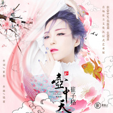

新壶中天
============================

|  |  |
| :--: | :-- |
| [ 新壶中天](https://emumo.xiami.com/album/2103925390) | **艺人**: [崔子格](../index.md) **语种**: 国语 **唱片公司**: 大格娱乐 **发行时间**: 2018年08月16日 **专辑类别**: EP, 单曲 **专辑风格**: 国语流行 Mandarin Pop, 中国风 China-Wave **播放数**: 265442 **收藏数**: 32 **评论数**: 1  |

## 简介

一壶一世界  
一曲唱千年  
  
《新壶中天》是主题曲女王崔子格首场东方文化沉浸式艺术展——“新壶中天”所演唱的主题曲。   
  
“新壶中天”的立意起源自《后汉书》中悬壶济世的费长房的故事，以古韵国风结合了现代人所熟知的意象，勾画了一个亦真亦幻的世外桃源。  
此次主题追寻千年以来流传于坊间的中国古代乐土传说，带你踏上始于现实、终于梦境的巡游之旅。  
  
这首歌曲由曾经打造《大鱼》《默》的著名作曲人钱雷作曲，由创作《红颜劫》《可念不可说》的著名音乐人崔恕作词，词曲浑然天成，给人以行云流水般的轻快和明净之感，既切合了“新壶中天·桃源篇”艺术展的主题，也是文雅国风的一次极致体现。 

## 曲目

## 评论

|  |  |  |
| :-- | :-- | :-- |
|  [虾米用户](https://emumo.xiami.com/u/48935681) 樓閣新晨花欲語，夢中誰是... 2018-08-16 00:31 赞(1) 踩(0) | 
耐聽。不錯(*๓&amp;acute;╰╯`๓)♡
 |
