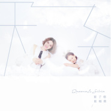

崔子格
============================

|  |  |
| :--: | :-- |
| [ 崔子格](https://i.xiami.com/cuizige) | **播放数**: 46938558 **粉丝数**: 15582 **评论数**: 217 **地区**: China 中国大陆 **风格**: 国语流行 Mandarin Pop  |

## 档案

崔子格，内地女歌手，1988年6月25日出生于内蒙古，从小在北京长大。因在猫扑上发表歌曲《卜卦》被疯狂转载后，渐渐走红网络，而后与北京斗室唱片公司签约，其歌曲歌词幽默，带有北京口语腔调。 
2012年，崔子格签约后首发EP单曲《皇上吉祥》，继而推出EP单曲《奋不顾身》《我被爱情下了药》《老婆最大》及《老公让我为你捶捶背》《小美人》等再次在网络上引发追捧热潮。 
2013年1月12日，崔子格在壹空间举办“独具一格·崔子格和她的小伙伴们”演唱会。2015年1月7日，崔子格在北京新专辑《爱情大师》发布会，并宣布正式签约美妙音乐。

## 专辑

| 名称 | 语种 | 唱片公司 | 发行时间 | 专辑类别 | 专辑风格 |
| :--: | :-- | :-- | :-- | :-- | :-- |
| [ 天之大](./albums/5020592505.md) | 国语 | 大格娱乐 | 2020年05月13日 | EP, 单曲 | 国语流行 Mandarin Pop |
| [ 感受你](./albums/5020573182.md) | 国语 |  | 2020年05月09日 | 录音室专辑 |  |
| [ 凡尘](./albums/2108271406.md) | 国语 | 新律文化 | 2020年03月29日 | EP, 单曲 | 另类摇滚 Alternative Rock |
| [ 总有一个秘密属于你](./albums/2105830305.md) | 国语 | 大格娱乐 | 2020年02月13日 | EP, 单曲 | 国语流行 Mandarin Pop |
| [ 浅言的秘密](./albums/2105724150.md) | 国语 | 大格娱乐 | 2020年01月20日 | EP, 单曲 | 国语流行 Mandarin Pop |
| [ 傀心](./albums/2105002131.md) | 国语 | 乐享天承 | 2019年07月19日 | EP, 单曲 |  |
| [ 为悦己者容 (弦乐版)](./albums/2104737371.md) | 国语 | 大格娱乐 | 2019年04月04日 | EP, 单曲 | 国语流行 Mandarin Pop |
| [ 路灯下的大女孩](./albums/2104362524.md) | 国语 | 大格娱乐 | 2018年12月08日 | EP, 单曲 | 国语流行 Mandarin Pop |
| [ What You Want](./albums/2104362509.md) | 国语 | 大格娱乐 | 2018年12月08日 | EP, 单曲 | 国语流行 Mandarin Pop |
| [ 过山车](./albums/2104304115.md) | 国语 | 大格娱乐 | 2018年12月03日 | EP, 单曲 | 国语流行 Mandarin Pop |
| [ 电视剧《将军在上》原声带](./albums/5021118321.md) | 纯音乐 | 北京大格娱乐文化有限公司 | 2018年10月25日 | EP, 单曲 | 流行 Pop |
| [ 为爱活下去](./albums/2104131209.md) | 国语 | 大格娱乐 | 2018年10月22日 | EP, 单曲 | 国语流行 Mandarin Pop |
| [ 新壶中天](./albums/2103925390.md) | 国语 | 大格娱乐 | 2018年08月16日 | EP, 单曲 | 国语流行 Mandarin Pop, 中国风 China-Wave |
| [ 半心](./albums/2103879048.md) | 国语 | 索氧音乐 | 2018年08月02日 | EP, 单曲 |  |
| [ 安之若素](./albums/2103830040.md) | 国语 | 索氧音乐 | 2018年07月23日 | EP, 单曲 | 国语流行 Mandarin Pop |
| [ 虞美人](./albums/2103813933.md) | 粤语 | 上海子格音乐工作室 | 2018年07月17日 | EP, 单曲 |  |
| [ [情]字 第伍号卷宗](./albums/2103795704.md) | 国语 | 索氧音乐 | 2018年07月12日 | EP, 单曲 |  |
| [ 有生之年再也不见](./albums/2103769970.md) | 国语 | 索氧音乐 | 2018年07月02日 | EP, 单曲 | 国语流行 Mandarin Pop |
| [ 任我逍遥](./albums/2103769736.md) | 国语 | 小旭音乐 | 2018年07月02日 | EP, 单曲 | 国语流行 Mandarin Pop, 古风 GuFeng Music |
| [ 崔子格致敬经典演唱会](./albums/2103772853.md) | 国语 | 大格娱乐 | 2018年06月29日 | EP, 单曲 | 国语流行 Mandarin Pop |
| [ 有一个你](./albums/2103752191.md) | 国语 | 大格娱乐 | 2018年06月19日 | EP, 单曲 | 国语流行 Mandarin Pop |
| [ 崔子格单曲集](./albums/2103723725.md) | 国语 | 大格娱乐 | 2018年05月30日 | 录音室专辑 |  |
| [ 上学歌2018](./albums/2103591185.md) | 国语 | 大格娱乐 | 2018年03月07日 | EP, 单曲 | 国语流行 Mandarin Pop |
| [ 无情天](./albums/2103588724.md) | 国语 | 智慧大狗 | 2018年03月06日 | EP, 单曲 | 国语流行 Mandarin Pop |
| [ 韧享快乐年](./albums/2103489765.md) | 国语 | 大格娱乐 | 2018年01月15日 | EP, 单曲 |  |
| [ 砒霜](./albums/2103466396.md) | 国语 | 子格工作室 | 2017年12月30日 | EP, 单曲 |  |
| [ 烤肉进行曲](./albums/2102979925.md) | 国语 | 大格娱乐 | 2017年12月23日 | EP, 单曲 |  |
| [ 花的嫁纱](./albums/2102976402.md) | 国语 | 子格音乐工作室 | 2017年12月18日 | EP, 单曲 |  |
| [ 红颜碎](./albums/2102970364.md) | 国语 | 子格音乐工作室 | 2017年12月08日 | EP, 单曲 |  |
| [ 性格](./albums/2102964001.md) | 国语 | 子格音乐工作室 | 2017年11月30日 | EP, 单曲 |  |
| [ 再一次拥抱](./albums/2102938573.md) | 国语 | 上海子格音乐工作室 | 2017年11月17日 | EP, 单曲 |  |
| [ 初心Original Intentions](./albums/2102865173.md) | 国语 | 子格音乐工作室 | 2017年09月28日 | EP, 单曲 | 国语流行 Mandarin Pop |
| [ 红颜旧](./albums/2102853151.md) | 国语 | 大格娱乐 | 2017年09月08日 | EP, 单曲 | 国语流行 Mandarin Pop |
| [ 百花残](./albums/2102851360.md) | 国语 | 索雅音乐 | 2017年09月05日 | EP, 单曲 | 国语流行 Mandarin Pop |
| [ 情未央](./albums/2102815828.md) | 国语 | 索雅音乐 | 2017年08月18日 | EP, 单曲 |  |
| [ 还好在这里（网剧《最佳女配》片尾曲）](./albums/5020979826.md) | 纯音乐 | 北京大格娱乐文化有限公司 | 2017年06月26日 | EP, 单曲 | 流行 Pop |
| [ 来不及对不起](./albums/2102761050.md) | 国语 | 大格娱乐 | 2017年06月07日 | EP, 单曲 | 国语流行 Mandarin Pop |
| [ 小情人 电视原声碟Little Valentine](./albums/2102755783.md) | 国语 | 大格娱乐 | 2017年05月29日 | 原声带, 影视音乐 | 电视原声 Television Music, 国语流行 Mandarin Pop |
| [ 思美人](./albums/2102696775.md) | 国语 | 大格娱乐 | 2017年02月24日 | EP, 单曲 | 中国风 China-Wave, 国语流行 Mandarin Pop |
| [ 新年鸡汤](./albums/2102685112.md) | 国语 | 崔式音乐 | 2017年01月25日 | EP, 单曲 |  |
| [ 天竺少女](./albums/2102664314.md) | 国语 | 大格娱乐 | 2016年12月15日 | EP, 单曲 |  |
| [ 你在就好](./albums/2102653620.md) | 国语 | 崔式音乐 | 2016年11月17日 | EP, 单曲 |  |
| [ 电视剧《我是你的眼》主题曲](./albums/5020951379.md) | 国语 | 北京大格娱乐文化有限公司 | 2016年11月17日 | EP, 单曲 | 流行 Pop |
| [ 小喇叭](./albums/2102401613.md) | 国语 | 看见音乐 (上海) | 2016年09月19日 | EP, 单曲 |  |
| [ 最好的自己Best Myself](./albums/2100387705.md) | 国语 | 美妙音乐 | 2016年09月08日 | 录音室专辑 | 国语流行 Mandarin Pop |
| [ 不失不忘](./albums/2100378223.md) | 国语 | 美妙悦听 | 2016年08月18日 | EP, 单曲 | 国语流行 Mandarin Pop |
| [ 你的意义](./albums/2100379396.md) | 国语 | 宸铭影视 | 2016年08月15日 | EP, 单曲 |  |
| [ 梦想明月曲](./albums/2100347760.md) | 国语 | 风华乐美 | 2016年05月30日 | EP, 单曲 | 中国风 China-Wave |
| [ 没有错的人](./albums/2100333132.md) | 国语 | 崔式音乐 | 2016年05月10日 | EP, 单曲 |  |
| [ 《太子妃升职记》原声大碟](./albums/5020898361.md) | 纯音乐 | 北京大格娱乐文化有限公司 | 2016年01月06日 | 录音室专辑 | 流行 Pop |
| [ 胭脂香](./albums/2100232388.md) | 国语 | 大龙文化 | 2015年10月28日 | EP, 单曲 |  |
| [ 玩点新鲜的](./albums/2100225486.md) | 国语 | 百纳娱乐 | 2015年10月21日 | EP, 单曲 |  |
| [ 布尔津情歌](./albums/1036925158.md) | 国语 | 美妙音乐 | 2015年07月13日 | EP, 单曲 |  |
| [ 三月三](./albums/430309834.md) | 国语 | 美妙音乐 | 2015年04月29日 | EP, 单曲 |  |
| [ 福星高照](./albums/1023188767.md) | 国语 | 美妙音乐 | 2015年02月06日 | EP, 单曲 |  |
| [ 电影《喜羊羊与灰太狼7之羊年喜羊羊》片尾曲](./albums/5020957215.md) | 国语 | 北京大格娱乐文化有限公司 | 2015年01月31日 | EP, 单曲 | 流行 Pop |
| [ 扭羊歌](./albums/1822589303.md) | 国语 | 美妙音乐 | 2015年01月30日 | EP, 单曲 |  |
| [ 惊梦](./albums/921892607.md) | 国语 | 美妙音乐 | 2015年01月21日 | EP, 单曲 | 中国风 China-Wave |
| [ 爱情大师](./albums/1120766365.md) | 国语 | 美妙音乐 | 2015年01月08日 | 录音室专辑 |  |
| [ 黑金刚芭比梦](./albums/2102812292.md) | 国语 | 崔式音乐 | 2014年09月28日 | 录音室专辑 |  |
| [ 水深火热](./albums/1606612160.md) | 国语 | 崔式音乐 | 2014年07月16日 | EP, 单曲 |  |
| [ 你爱看足球](./albums/1904812987.md) | 国语 | 崔式音乐 | 2014年07月08日 | EP, 单曲 | 国语流行 Mandarin Pop |
| [ 我爱看足球](./albums/1903691198.md) | 国语 | 崔式音乐 | 2014年06月23日 | EP, 单曲 | 国语流行 Mandarin Pop |
| [ 合格金曲](./albums/569730229.md) | 国语 | 崔式音乐 | 2014年05月26日 | 录音室专辑 | 国语流行 Mandarin Pop |
| [ 相思网](./albums/5020900401.md) | 国语 | 北京大格娱乐文化有限公司 | 2014年05月26日 | EP, 单曲 | 流行 Pop |
| [ 上帝包邮](./albums/995653034.md) | 国语 | 崔式音乐 | 2014年03月21日 | EP, 单曲 |  |
| [ 电影《喜羊羊与灰太狼之飞马奇遇记》片尾曲](./albums/5020958206.md) | 国语 | 北京大格娱乐文化有限公司 | 2014年01月16日 | EP, 单曲 | 流行 Pop |
| [ 独具一格崔子格和她的小伙伴演唱会](./albums/2103723799.md) | 国语 | 大格娱乐 | 2014年01月12日 | 录音室专辑 | 国语流行 Mandarin Pop |
| [ 小美人](./albums/387355750.md) | 国语 | 斗室文化 | 2013年12月18日 | 录音室专辑 | 佛教音乐 Buddhist Music |
| [ 恋爱达人秀](./albums/1975077784.md) | 国语 | 崔式音乐 | 2013年07月25日 | 录音室专辑 |  |
| [ DJ版](./albums/5021023321.md) | 国语 | 北京大格娱乐文化有限公司 | 2013年07月25日 | EP, 单曲 | 流行 Pop |
| [ 电视剧《华丽一族》](./albums/5021000527.md) | 国语 | 北京大格娱乐文化有限公司 | 2013年02月27日 | EP, 单曲 | 流行 Pop |
| [ 崔子格作品集](./albums/5020960922.md) | 国语 | 北京大格娱乐文化有限公司 | 2013年01月01日 | 录音室专辑 | 流行 Pop |
| [ 宝贝女儿好妈妈](./albums/5020896361.md) | 国语 | 北京大格娱乐文化有限公司 | 2013年01月01日 | EP, 单曲 | 流行 Pop |
| [ 天字女一号](./albums/567624.md) | 国语 | 通力唱片, 崔式音乐 | 2012年12月31日 | 录音室专辑 |  |
| [ 老婆最大](./albums/548557.md) | 国语 |  | 2012年10月11日 | 录音室专辑 |  |
| [ 晚安曲](./albums/537950.md) | 国语 | 斗室文化 | 2012年08月23日 | EP, 单曲 |  |
| [ 电影《喜羊羊与灰太狼》之《竞技大联盟》主题曲](./albums/5020965156.md) | 国语 | 北京大格娱乐文化有限公司 | 2012年06月30日 | 录音室专辑 | 流行 Pop |
| [ 好男人都死哪儿去了](./albums/521732.md) | 国语 | 简单快乐, 崔式音乐 | 2012年06月22日 | EP, 单曲 |  |
| [ 老公让我为你捶捶背](./albums/514611.md) | 国语 |  | 2012年05月08日 | EP, 单曲 |  |
| [ 老婆最大](./albums/1997459993.md) | 国语 | 斗室文化 | 2012年04月19日 | 录音室专辑 |  |
| [ 裸爱情歌](./albums/511721.md) | 国语 | 斗室文化 | 2012年04月04日 | EP, 单曲 |  |
| [ 皇上吉祥](./albums/499624.md) | 国语 |  | 2011年12月19日 | EP, 单曲 |  |
| [ 红太狼与灰太狼](./albums/5021001273.md) | 国语 | 北京大格娱乐文化有限公司 | 2011年06月15日 | EP, 单曲 | 流行 Pop |
| [ 东南西北大拜年](./albums/5020983352.md) | 国语 | 北京大格娱乐文化有限公司 | 2010年01月01日 | EP, 单曲 | 流行 Pop |
| [ 夫妻相](./albums/5020977463.md) | 国语 | 北京大格娱乐文化有限公司 | 2009年08月26日 | EP, 单曲 | 流行 Pop |
| [ 电视剧《舞者》原声大碟](./albums/5020971922.md) | 纯音乐 | 北京大格娱乐文化有限公司 | 2008年11月05日 | EP, 单曲 | 流行 Pop |

## 评论

|  |  |  |  |
| :-- | :-- | :-- | :-- |
|  [虾米用户](https://emumo.xiami.com/u/444132293)  2020-07-21 23:22 赞(0) 踩(0) | 
Люблю вас
 |
|  [虾米用户](https://emumo.xiami.com/u/379162683) 我想要记住你们，我想要你... 2020-07-09 07:21 赞(0) 踩(0) | 

 |
|  [虾米用户](https://emumo.xiami.com/u/322662461)  2020-02-18 03:56 赞(0) 踩(0) | 
你的歌很好听，我很喜欢
 |
|  [虾米用户](https://emumo.xiami.com/u/435225114) 想听自己想听的歌 2020-02-10 02:51 赞(0) 踩(0) | 
还可以
 |
|  [虾米用户](https://emumo.xiami.com/u/343556593)  2019-10-30 23:00 赞(0) 踩(0) | 
很好聽
 |
|  [虾米用户](https://emumo.xiami.com/u/243897895)  2019-10-24 14:47 赞(1) 踩(0) | 
网络神曲肯定是公司的安排吧，很喜欢你唱的可念不可说。
 |
|  [虾米用户](https://emumo.xiami.com/u/335167244) 突然爱上电音的老家伙 2019-05-31 13:07 赞(2) 踩(0) | 
《卜卦》我看成《扑街》。。。
 |
|  [虾米用户](https://emumo.xiami.com/u/75955918)  2019-05-12 16:32 赞(0) 踩(0) | 

 |
|  [虾米用户](https://emumo.xiami.com/u/344523429)  2019-04-27 07:03 赞(0) 踩(0) | 
格格吉祥，啥时候宠幸朕一下
 |
|  [虾米用户](https://emumo.xiami.com/u/41724280) 人帅何必资料拽… 2019-04-02 19:06 赞(0) 踩(0) | 
这专辑没准了，一专一首
 |
|  [虾米用户](https://emumo.xiami.com/u/406713786)  2019-01-10 08:40 赞(0) 踩(0) | 
发红包
 |
|  [虾米用户](https://emumo.xiami.com/u/2958995)  2018-12-13 20:20 赞(1) 踩(0) | 
奔腾片尾曲是她唱的吗
 |
|  [虾米用户](https://emumo.xiami.com/u/378194844)  2018-11-28 11:55 赞(0) 踩(0) | 
好听
 |
|  [虾米用户](https://emumo.xiami.com/u/230586529) 享受自己咆哮的热情 2018-11-09 12:10 赞(0) 踩(0) | 
什么叫潜力股
 |
|  [虾米用户](https://emumo.xiami.com/u/74557552)  2018-11-05 17:39 赞(1) 踩(0) | 
没有独步
 |
|  [虾米用户](https://emumo.xiami.com/u/239721859)  2018-10-16 21:07 赞(0) 踩(0) | 
加油！喜欢！
 |
|  [虾米用户](https://emumo.xiami.com/u/375701493) 我还没想好要写什么...... 2018-09-09 13:13 赞(0) 踩(0) | 
祝你越来越年轻漂亮
 |
|  [虾米用户](https://emumo.xiami.com/u/361839699) 淋漓尽致见怪不怪美不胜收... 2018-09-06 16:34 赞(0) 踩(0) | 
崔子格so肖骁solo fly  free
 |
|  [虾米用户](https://emumo.xiami.com/u/41698722) 阳光胖达仁 2018-07-18 18:48 赞(0) 踩(0) | 
我从哪里来真好听啊
 |
|  [虾米用户](https://emumo.xiami.com/u/11948478) atyy 2018-07-02 14:59 赞(1) 踩(0) | 
没有玉烛宝典
 |
|  [虾米用户](https://emumo.xiami.com/u/375934173)  2018-06-17 11:20 赞(2) 踩(0) | 
&lt;喜欢子格六年了，她的歌曲风多变，风格多样，总能带给粉丝不一样的惊喜，喜欢她对待音乐精益求精的态度，我们格子控会一直支持她的 [url=/u/27536114]@崔子格 [/url]&gt;&lt;27536114&gt;
 |
|  [虾米用户](https://emumo.xiami.com/u/374643692)  2018-06-12 09:17 赞(2) 踩(0) | 
唱的歌真好听 
 |
|  [虾米用户](https://emumo.xiami.com/u/236786264)   2018-06-06 17:30 赞(0) 踩(0) | 
这不是小花花吗？
 |
|  [虾米用户](https://emumo.xiami.com/u/76315072) ❥ Meet,atthe... 2018-05-08 09:40 赞(1) 踩(0) | 
好像是唉，除了可念不可说其他都是什么鬼哦，真的被可念不可说惊艳到了，已经中毒
 |
|  [虾米用户](https://emumo.xiami.com/u/306051899)  2018-05-05 02:29 赞(0) 踩(0) | 
格子的歌太好听了
 |
|  [虾米用户](https://emumo.xiami.com/u/14112155) 板野友美 2018-04-25 20:19 赞(1) 踩(0) | 
喜欢红颜旧
 |
|  [虾米用户](https://emumo.xiami.com/u/360015659)  2018-04-23 16:59 赞(2) 踩(0) | 
不失不忘好听      
 |
|  [虾米用户](https://emumo.xiami.com/u/358563205) 千万不要忘记阶级斗争 2018-04-23 12:59 赞(1) 踩(0) | 
赞
 |
|  [虾米用户](https://emumo.xiami.com/u/349536551) 一片心，一片意，伴你随 2018-03-29 22:28 赞(2) 踩(0) | 
好好听 
 |
|  [虾米用户](https://emumo.xiami.com/u/354338548) 韩国网络艺人 2018-03-23 23:34 赞(2) 踩(0) | 
我一直以为崔子格是个男的 
 |
|  [虾米用户](https://emumo.xiami.com/u/354157232)  2018-03-13 18:04 赞(1) 踩(0) | 
好听
 |
|  [虾米用户](https://emumo.xiami.com/u/294521911)  2018-03-07 17:43 赞(2) 踩(0) | 
好歌一曲
 |
|  [虾米用户](https://emumo.xiami.com/u/353016737)  2018-03-03 01:08 赞(1) 踩(0) | 
真的很好听 ， 越听越喜欢    
 |
|  [虾米用户](https://emumo.xiami.com/u/349519572)  2018-02-13 19:18 赞(1) 踩(0) | 
好听
 |
|  [虾米用户](https://emumo.xiami.com/u/350043631) 缘来是妳꧁崔鹏飞꧂ 2018-02-13 04:47 赞(2) 踩(0) | 
支持本家歌星 
 |
|  [虾米用户](https://emumo.xiami.com/u/75955918)  2018-02-02 16:48 赞(0) 踩(0) | 
把歌分分开心的和伤感
 |
|  [虾米用户](https://emumo.xiami.com/u/346162686)  2018-01-24 19:32 赞(2) 踩(0) | 
好听
 |
|  [虾米用户](https://emumo.xiami.com/u/307115714) 七月的风，八月的雨，卑微... 2017-12-31 22:07 赞(1) 踩(0) | 
因为深爱所以才不再联系
 |
|  [虾米用户](https://emumo.xiami.com/u/245166155)  2017-12-10 07:07 赞(0) 踩(0) | 
丶7
 |
|  [虾米用户](https://emumo.xiami.com/u/6189464) 人怂胆小智商低。 2017-12-03 22:50 赞(0) 踩(0) | 
可念不可说之前的有些歌真的&amp;hellip;辣眼睛&amp;hellip;
 |
|  [虾米用户](https://emumo.xiami.com/u/321756461) 你不努力谁会给你想要的生... 2017-11-14 00:56 赞(2) 踩(0) | 
大爱格格       
 |
|  [虾米用户](https://emumo.xiami.com/u/238408681)  2017-11-06 09:01 赞(3) 踩(0) | 
非常喜欢崔子格的歌   
 |
|  [虾米用户](https://emumo.xiami.com/u/51824622)  2017-10-25 23:27 赞(3) 踩(0) | 
  希望越唱越好。
 |
|  [虾米用户](https://emumo.xiami.com/u/298948030) 中國詩音樂電影创始人作曲... 2017-10-17 21:58 赞(2) 踩(0) | 
你好
 |
|  [虾米用户](https://emumo.xiami.com/u/325832664) 爱情 2017-10-06 17:53 赞(2) 踩(0) | 
喜欢听她的《生死相随》  
 |
|  [虾米用户](https://emumo.xiami.com/u/223096690)  2017-09-22 19:56 赞(2) 踩(0) | 
似雪花飞舞着坠落美丽啊向死而活爱若能参破终究是寂寞忘却了前因后果苦守的执着虚晃的一诺空耗这青春许多
 |
|  [虾米用户](https://emumo.xiami.com/u/325120133) 路在脚下，看你怎么走! 2017-09-21 06:31 赞(1) 踩(0) | 
老公让我为你捶捶背〉老婆最大〉百听不厌，太喜欢了，值得强烈推荐!
 |
|  [虾米用户](https://emumo.xiami.com/u/236630186)  2017-09-16 21:20 赞(1) 踩(0) | 
爱你
 |
|  [虾米用户](https://emumo.xiami.com/u/318578452)  2017-09-12 21:03 赞(3) 踩(0) | 
                     情未央，好听
 |
|  [虾米用户](https://emumo.xiami.com/u/92129532)   2017-09-12 14:21 赞(2) 踩(0) | 
小姐姐加油～喜欢你
 |
|  [虾米用户](https://emumo.xiami.com/u/304394928) 我的快乐，自己乐何用？ 2017-08-29 21:06 赞(1) 踩(0) | 
唱《可念不可说》的声音，洪亮
 |
|  [虾米用户](https://emumo.xiami.com/u/321402784)  2017-08-25 08:59 赞(0) 踩(0) | 

 |
|  [虾米用户](https://emumo.xiami.com/u/304881783) 善恶终有报，天道好轮回！... 2017-08-21 01:38 赞(3) 踩(0) | 
老婆最大，歌词很朴实，崔子格虽然是内蒙美女，但是京味十足！很喜欢这首歌！
 |
|  [虾米用户](https://emumo.xiami.com/u/314689054) 无路可走 2017-08-08 20:34 赞(1) 踩(0) | 
                           
 |
|  [虾米用户](https://emumo.xiami.com/u/55488530) 。 2017-07-25 22:28 赞(1) 踩(0) | 
小姐姐，加油，你不欠他们什么，你很棒！
 |
|  [虾米用户](https://emumo.xiami.com/u/278619175)  2017-07-11 02:13 赞(0) 踩(0) | 
   
 |
|  [虾米用户](https://emumo.xiami.com/u/309755233) 为人民币服务 2017-07-10 03:15 赞(2) 踩(0) | 
格格.格格我爱你 
 |
|  [虾米用户](https://emumo.xiami.com/u/309755233) 为人民币服务 2017-07-10 03:08 赞(2) 踩(0) | 
是我的女神就甭管那些渣渣瞎喷啊 
 |
|  [虾米用户](https://emumo.xiami.com/u/421459) 董小姐，你熄灭了烟，谈起... 2017-07-06 01:21 赞(0) 踩(0) | 
  
 |
|  [虾米用户](https://emumo.xiami.com/u/275769577)  2017-06-24 19:11 赞(1) 踩(0) | 
喜欢你的歌，加油，我会继续关注你的新歌
 |
|  [虾米用户](https://emumo.xiami.com/u/290953154)  2017-06-04 19:28 赞(1) 踩(0) | 
可念不可说！赞！
 |
|  [虾米用户](https://emumo.xiami.com/u/221599913)  2017-05-20 15:02 赞(1) 踩(0) | 
喜欢，声音很舒服，一股清流
 |
|  [虾米用户](https://emumo.xiami.com/u/280882874)  2017-05-18 22:09 赞(0) 踩(0) | 
  
 |
|  [虾米用户](https://emumo.xiami.com/u/214279419)  2017-05-08 20:18 赞(0) 踩(0) | 
[Reply@家家顺姜鹏]怎么还不接受批评了？？
 |
|  [虾米用户](https://emumo.xiami.com/u/50816611)  2017-05-07 23:40 赞(0) 踩(0) | 
非常好听，亲
 |
|  [虾米用户](https://emumo.xiami.com/u/11948478) atyy 2017-04-17 16:34 赞(1) 踩(0) | 
没有《玉烛宝典》，失望，很想听啊！
 |
|  [虾米用户](https://emumo.xiami.com/u/41318869)  2017-04-11 10:48 赞(1) 踩(0) | 
收藏歌曲只是旋律跟歌词不错，唱功嘛，呵呵哒。 
 |
|  [虾米用户](https://emumo.xiami.com/u/287818887) 莫慌 莫慌★白水变鸡汤 2017-04-11 09:58 赞(2) 踩(0) | 
创作才女 很有实力 歌曲悦耳动听 歌词经典有内涵，很写实能感动人心哟！
 |
| ⇒ |  [虾米用户](https://emumo.xiami.com/u/309755233) 为人民币服务 2017-07-10 03:10 赞(0) 踩(0) | 
说得和，顶顶顶 
 |
|  [虾米用户](https://emumo.xiami.com/u/287818887) 莫慌 莫慌★白水变鸡汤 2017-04-11 09:58 赞(3) 踩(0) | 
创作才女 很有实力 歌曲悦耳动听 歌词经典有内涵，很写实能感动人心哟！
 |
|  [虾米用户](https://emumo.xiami.com/u/202012783)  2017-04-09 12:02 赞(3) 踩(0) | 
很好听，很喜欢。
 |
|  [虾米用户](https://emumo.xiami.com/u/202012783)  2017-04-09 12:01 赞(0) 踩(0) | 
  
 |
|  [虾米用户](https://emumo.xiami.com/u/285127483)  2017-04-07 18:53 赞(2) 踩(0) | 
节奏旋律不错
 |
|  [虾米用户](https://emumo.xiami.com/u/286500749)  2017-04-05 23:06 赞(2) 踩(0) | 
    
 |
|  [虾米用户](https://emumo.xiami.com/u/234066817) 梁伟东 2017-03-31 14:12 赞(0) 踩(0) | 
  
 |
|  [虾米用户](https://emumo.xiami.com/u/283861359)  2017-03-28 14:06 赞(1) 踩(0) | 
喜欢
 |
|  [虾米用户](https://emumo.xiami.com/u/283798766)  2017-03-27 20:09 赞(1) 踩(0) | 
    
 |
|  [虾米用户](https://emumo.xiami.com/u/277079325)  2017-03-26 20:08 赞(0) 踩(0) | 

 |
|  [虾米用户](https://emumo.xiami.com/u/277079325)  2017-03-26 20:07 赞(1) 踩(0) | 
很好听，非常好听，点个赞。     
 |
|  [虾米用户](https://emumo.xiami.com/u/224670879) 永远年轻，永远热泪盈眶 2017-03-26 11:21 赞(1) 踩(0) | 
明明是好嗓子
 |
|  [虾米用户](https://emumo.xiami.com/u/224670879) 永远年轻，永远热泪盈眶 2017-03-26 11:20 赞(0) 踩(0) | 
为什么要投老大妈所好，唱一堆广场舞歌曲
 |
|  [虾米用户](https://emumo.xiami.com/u/277079325)  2017-03-26 08:42 赞(0) 踩(0) | 

 |
|  [虾米用户](https://emumo.xiami.com/u/277079325)  2017-03-25 21:40 赞(1) 踩(0) | 
  实在太棒了。
 |
|  [虾米用户](https://emumo.xiami.com/u/277079325)  2017-03-25 21:39 赞(1) 踩(0) | 
棒极了。
 |
|  [虾米用户](https://emumo.xiami.com/u/277079325)  2017-03-25 21:37 赞(0) 踩(0) | 

 |
|  [虾米用户](https://emumo.xiami.com/u/275295642)  2017-03-17 21:28 赞(1) 踩(0) | 
作曲的写词的伴奏的幕后人员非常优秀，
 |
|  [虾米用户](https://emumo.xiami.com/u/280089164)  2017-03-13 15:43 赞(1) 踩(0) | 
姓崔的支持你
 |
|  [虾米用户](https://emumo.xiami.com/u/105044610)  2017-03-06 13:09 赞(1) 踩(0) | 

 |
|  [虾米用户](https://emumo.xiami.com/u/274385477)  2017-02-18 17:36 赞(1) 踩(0) | 
太棒了
 |
|  [虾米用户](https://emumo.xiami.com/u/269606044) beyond 不死的精神 2017-02-12 00:58 赞(0) 踩(0) | 
她的歌是我除beyond之外最喜欢的
 |
| ⇒ |  [虾米用户](https://emumo.xiami.com/u/277079325)  2017-03-25 21:46 赞(0) 踩(0) | 
你好傻
 |
|  [虾米用户](https://emumo.xiami.com/u/272297869)  2017-02-10 20:58 赞(0) 踩(0) | 
一生有我的爱人不孤独。
 |
|  [虾米用户](https://emumo.xiami.com/u/37975537)  2017-02-10 15:55 赞(1) 踩(0) | 
歌手缺乏包装和适合她的歌
 |
|  [虾米用户](https://emumo.xiami.com/u/264051600)  2017-02-08 10:42 赞(0) 踩(0) | 
真好听
 |
|  [虾米用户](https://emumo.xiami.com/u/260374844)  2017-02-06 11:34 赞(0) 踩(0) | 
太 棒了
 |
|  [虾米用户](https://emumo.xiami.com/u/12752502)  2017-01-26 17:24 赞(0) 踩(0) | 
可念不可说和天竺少女好听，来回循环
 |
|  [虾米用户](https://emumo.xiami.com/u/240996964)  2017-01-10 19:20 赞(0) 踩(0) | 
很早之前就喜欢她唱的卜卦
 |
|  [虾米用户](https://emumo.xiami.com/u/258370879)  2017-01-04 16:39 赞(0) 踩(0) | 
觉得很好听，有感觉
 |
|  [虾米用户](https://emumo.xiami.com/u/252385594)  2016-12-05 22:37 赞(0) 踩(0) | 
好听
 |
|  [虾米用户](https://emumo.xiami.com/u/252385594)  2016-12-05 22:36 赞(0) 踩(0) | 
崔子格长的太漂亮了
 |
|  [虾米用户](https://emumo.xiami.com/u/40776502) 继续宠爱/不整理别人翻唱... 2016-11-27 22:02 赞(3) 踩(0) | 
唱非主流广场舞可惜了这把嗓子
 |
|  [虾米用户](https://emumo.xiami.com/u/40598780) 无音乐 无生活 2016-10-25 20:31 赞(2) 踩(0) | 
看来中国的确不缺好声音，只是歌曲吧……可念不可说唱得挺好有木有，但是稍微听了一下歌手之前的歌，= =|||……
 |
|  [虾米用户](https://emumo.xiami.com/u/40254483)  2016-10-08 13:51 赞(1) 踩(0) | 
不可多得的歌声
 |
|  [虾米用户](https://emumo.xiami.com/u/38918617) 你相信我，我相信你 2016-09-19 10:10 赞(0) 踩(0) | 
<a href="http://emumo.xiami.com/u/2871" target="_blank" rel="nofollow" name_card="2871">@虾小编</a> <a href="http://emumo.xiami.com/u/17330125" target="_blank" rel="nofollow" name_card="17330125">@虾米音乐人</a><a href="http://emumo.xiami.com/u/41190273" target="_blank" rel="nofollow" name_card="41190273">@爆棚的傲娇气</a>  请收录新歌《小喇叭》
 |
| ⇒ |  [虾米用户](https://emumo.xiami.com/u/2871) 虾米编辑部唯一官方账号 ... 2016-09-19 10:20 赞(0) 踩(0) | 
已收录
 |
|  [虾米用户](https://emumo.xiami.com/u/210084669)  2016-09-09 18:57 赞(1) 踩(0) | 
好听
 |
|  [虾米用户](https://emumo.xiami.com/u/97747450) 我还没想好要写什么... 2016-09-08 23:45 赞(0) 踩(0) | 
3395
 |
|  [虾米用户](https://emumo.xiami.com/u/3664254) 看我的唐诗剑法 2016-09-08 16:11 赞(0) 踩(0) | 
花的嫁纱作者，原名崔岩<a href="http://www.xiami.com/song/2074452?spm=a1z1s.3521865.23309997.21.jQO1S1" target="_blank" rel="nofollow noreferrer noopener">http://www.xiami.com/song/2074452?spm=a1z1s.3521865.23309997.21.jQO1S1</a>
 |
|  [虾米用户](https://emumo.xiami.com/u/56105132)  2016-07-02 14:22 赞(0) 踩(0) | 
             
 |
|  [虾米用户](https://emumo.xiami.com/u/189429014)  2016-06-13 10:00 赞(1) 踩(0) | 
赞
 |
|  [虾米用户](https://emumo.xiami.com/u/637757)  2016-06-07 21:48 赞(1) 踩(0) | 
姐们儿又漂亮了
 |
|  [虾米用户](https://emumo.xiami.com/u/173023904) 没有梦想何必远方 2016-06-01 12:22 赞(0) 踩(0) | 
卜卦的旋律很动听 
 |
|  [虾米用户](https://emumo.xiami.com/u/83591380) 哼一首淡淡的歌。 2016-05-19 22:34 赞(0) 踩(0) | 
神奇的歌手 画风太不一样
 |
|  [虾米用户](https://emumo.xiami.com/u/47241831)   2016-04-17 18:54 赞(13) 踩(0) | 
这嗓子快别唱烂大街的歌了……
 |
|  [虾米用户](https://emumo.xiami.com/u/122882018)  2016-03-13 17:14 赞(0) 踩(0) | 
不错，喜欢你，喜欢你的歌。  
 |
|  [虾米用户](https://emumo.xiami.com/u/137739) 一支乐队 2016-03-09 08:38 赞(4) 踩(0) | 
嗓子还行，快别侮辱自己了，做点正经硬货吧
 |
|  [虾米用户](https://emumo.xiami.com/u/41017493)   2016-02-19 14:13 赞(8) 踩(0) | 
没办法 这也是一种生存之道 不过这下公司总会好好定位了
 |
|  [虾米用户](https://emumo.xiami.com/u/110054728)  2016-02-04 23:59 赞(0) 踩(0) | 
这声音有点像那～～
 |
|  [虾米用户](https://emumo.xiami.com/u/5826937)  2016-02-04 10:45 赞(0) 踩(0) | 
曲风突变，为什么我想起了小时候的洗脑神曲：朝花夕拾杯中酒……哦，查了才知道叫《中华民谣》，还有那什么常回家看看，简直风格一致
 |
|  [虾米用户](https://emumo.xiami.com/u/81282474)   2016-02-04 01:18 赞(3) 踩(0) | 
实力还行，需要个好公司包装，歌质量不高人没法火
 |
|  [虾米用户](https://emumo.xiami.com/u/106285972)  2016-02-02 13:40 赞(0) 踩(0) | 
支持子格
 |
|  [虾米用户](https://emumo.xiami.com/u/9025852)  2016-01-27 19:50 赞(0) 踩(0) | 
没记错的话《红颜旧》原唱也是她？
 |
| ⇒ |  [虾米用户](https://emumo.xiami.com/u/120805560)  2016-05-19 16:22 赞(0) 踩(0) | 
是刘涛
 |
|  [虾米用户](https://emumo.xiami.com/u/103478950)  2016-01-27 04:13 赞(3) 踩(0) | 
我从14岁开始听，听了5年她的歌了，没什么不好，别乱喷
 |
|  [虾米用户](https://emumo.xiami.com/u/13061880) 欢迎来到我的世界❤ 2016-01-25 01:03 赞(1) 踩(0) | 
太子妃圈了不少粉吧。 
 |
|  [虾米用户](https://emumo.xiami.com/u/37374367)  2016-01-21 17:47 赞(2) 踩(0) | 
可念不可说之前都是什么鬼？不过看了看她现在的打扮，还是停留在之前歌曲的画风里，现在可以转型啦，别画的跟面粉娃娃一样了。
 |
|  [虾米用户](https://emumo.xiami.com/u/2557532)  2016-01-20 18:19 赞(2) 踩(0) | 
画风突变
 |
|  [虾米用户](https://emumo.xiami.com/u/2791760)  2016-01-17 21:14 赞(0) 踩(0) | 
各种像姚贝娜，可惜了
 |
|  [虾米用户](https://emumo.xiami.com/u/6975687) ( ͡° ͜ʖ ͡°)✧... 2016-01-15 19:19 赞(0) 踩(0) | 
太子妃来的～
 |
|  [虾米用户](https://emumo.xiami.com/u/8580173)  2016-01-14 00:30 赞(15) 踩(0) | 
除了 可念不可说，其他歌真的太可怕了
 |
|  [虾米用户](https://emumo.xiami.com/u/23785522)   2016-01-13 11:44 赞(0) 踩(0) | 
可念不可说真的是她唱的吗？
 |
|  [虾米用户](https://emumo.xiami.com/u/8588477) 只要信，不要问 2016-01-09 21:31 赞(0) 踩(0) | 
之前的造型和风格。。。(⊙﹏⊙)b
 |
|  [虾米用户](https://emumo.xiami.com/u/1353448)  2016-01-08 10:02 赞(19) 踩(0) | 
可念不可说之前都是什么鬼。。。
 |
|  [虾米用户](https://emumo.xiami.com/u/11360601) 拉格朗日点。 2016-01-07 22:37 赞(9) 踩(0) | 
幸亏好好唱歌了。
 |
| ⇒ |  [虾米用户](https://emumo.xiami.com/u/402048115)  2020-08-24 18:08 赞(0) 踩(0) | 
iuhjjjjb
 |
|  [虾米用户](https://emumo.xiami.com/u/28017326)  2016-01-06 07:57 赞(99) 踩(0) | 
= =可念不可说之前她都在唱啥啊天啊
 |
| ⇒ |  [虾米用户](https://emumo.xiami.com/u/2886204) tale as old 2017-06-01 20:15 赞(0) 踩(0) | 
天国的嫁衣的花的嫁纱好像她写的
 |
|  [虾米用户](https://emumo.xiami.com/u/85132624) 冰糖草莓 2016-01-05 19:34 赞(13) 踩(0) | 
可念不可说挺好的   
 |
|  [虾米用户](https://emumo.xiami.com/u/32989498)  2016-01-04 16:51 赞(23) 踩(0) | 
去听听她的《可念不可说》，已经中毒了！
 |
|  [虾米用户](https://emumo.xiami.com/u/5609103)  2015-12-26 21:21 赞(2) 踩(0) | 
好好好、美女歌手   又   好听、好好好
 |
|  [虾米用户](https://emumo.xiami.com/u/17686789)  2015-12-06 13:29 赞(1) 踩(0) | 
声音很好啊
 |
|  [虾米用户](https://emumo.xiami.com/u/41254047)   2015-11-14 09:54 赞(0) 踩(0) | 
曲子怎么有点熟悉的味道
 |
|  [虾米用户](https://emumo.xiami.com/u/72851830) 一切为了明天的美好社会治... 2015-11-02 09:06 赞(0) 踩(0) | 
挺好的
 |
|  [虾米用户](https://emumo.xiami.com/u/41724280) 人帅何必资料拽… 2015-11-01 22:01 赞(0) 踩(0) | 
万年不变的刘海，噁心啊，
 |
|  [虾米用户](https://emumo.xiami.com/u/54823853)  2015-10-12 23:28 赞(0) 踩(0) | 
真好听。 
 |
|  [虾米用户](https://emumo.xiami.com/u/13552)  2015-09-02 09:50 赞(0) 踩(0) | 
***
 |
|  [虾米用户](https://emumo.xiami.com/u/58393062)  2015-08-27 19:01 赞(0) 踩(0) | 

 |
|  [虾米用户](https://emumo.xiami.com/u/58393062)  2015-08-27 19:01 赞(0) 踩(0) | 

 |
|  [虾米用户](https://emumo.xiami.com/u/52873165)    傻傻的年少，，，却... 2015-07-25 13:46 赞(0) 踩(0) | 
卜卦，还可以，
 |
|  [虾米用户](https://emumo.xiami.com/u/46125543) 原阳李大辉 2015-06-30 01:24 赞(1) 踩(0) | 
    
 |
|  [虾米用户](https://emumo.xiami.com/u/522205) 一切很美，音為有你﹏ 2015-03-23 02:25 赞(1) 踩(0) | 
风俗口水歌，你懂的。。。
 |
|  [虾米用户](https://emumo.xiami.com/u/6652575) mbz2006 2015-02-08 20:18 赞(0) 踩(0) | 
ok
 |
|  [虾米用户](https://emumo.xiami.com/u/43084115) 爱音乐，爱生活 2015-01-15 18:58 赞(0) 踩(0) | 
好好听，必须点赞
 |
|  [虾米用户](https://emumo.xiami.com/u/28439026) 我还没想好要写什么... 2015-01-06 21:17 赞(0) 踩(0) | 
卜卦原来是翻唱，来听听原版如何<a href="http://www.xiami.com/song/1769547703#wall_list" target="_blank" rel="nofollow noreferrer noopener">http://www.xiami.com/song/1769547703#wall_list</a>
 |
| ⇒ |  [虾米用户](https://emumo.xiami.com/u/9026935) 路，还是那条路，只是每天... 2015-05-08 10:25 赞(0) 踩(0) | 
哎哟喂，这你都知道啦O(∩_∩)O
 |
|  [虾米用户](https://emumo.xiami.com/u/8833102) 伟❤️375882267 2014-12-25 01:20 赞(0) 踩(0) | 
这里的歌真好听圣诞快乐  ！！！
 |
|  [虾米用户](https://emumo.xiami.com/u/45183870)  2014-12-22 19:57 赞(0) 踩(0) | 
很好听
 |
|  [虾米用户](https://emumo.xiami.com/u/41950287) 暂无签名~ 2014-10-02 07:39 赞(0) 踩(0) | 
喜欢听她的歌
 |
|  [虾米用户](https://emumo.xiami.com/u/355459)  2014-08-25 17:07 赞(0) 踩(0) | 
嗓音很有特色，作品一直保持自己的风格，很得的歌手。
 |
|  [虾米用户](https://emumo.xiami.com/u/20699580) Are you an a... 2014-06-29 21:46 赞(0) 踩(0) | 
感觉这是**舞！
 |
|  [虾米用户](https://emumo.xiami.com/u/13617745)  2014-06-03 10:27 赞(0) 踩(0) | 
为什么我觉得小崔是真清新?还有右边栏喜欢崔子格的人们也喜欢..虾米真是乱归类
 |
|  [虾米用户](https://emumo.xiami.com/u/1843501) 暴走天使 2014-04-27 11:41 赞(0) 踩(0) | 
小区**舞天天“ 老婆最大” ，这个社会充满了恶意
 |
|  [虾米用户](https://emumo.xiami.com/u/6190556)  2014-04-19 13:09 赞(4) 踩(0) | 
曲子不错，词接地气，声音挺美，搭配起来正好。音乐不就是这么着发展的吗。
 |
|  [虾米用户](https://emumo.xiami.com/u/1610240) 听歌是一件很开心的事 2014-04-10 13:30 赞(0) 踩(0) | 
ho? 又一个虾米音乐ren？
 |
|  [虾米用户](https://emumo.xiami.com/u/3803522)  2014-03-27 20:37 赞(0) 踩(0) | 
难怪作曲那里写的是“佚名” ……抄的太没水平了
 |
|  [虾米用户](https://emumo.xiami.com/u/973411)  2014-02-26 23:58 赞(0) 踩(0) | 
喜欢歌词
 |
|  [虾米用户](https://emumo.xiami.com/u/7982477) 属于你我的极品音乐 2014-02-19 17:52 赞(0) 踩(0) | 
歌词不算优美，但贴近生活。所谓的“街歌”也是火的代名词，传唱度还是挺高的！
 |
|  [虾米用户](https://emumo.xiami.com/u/384752)  2014-01-20 22:08 赞(2) 踩(0) | 
原来我整天在街边理发店听到的那个 不停的猜猜猜xxx啥啥的这个首歌叫 卜卦啊！
 |
|  [虾米用户](https://emumo.xiami.com/u/27645691)  2014-01-01 13:50 赞(0) 踩(0) | 
短发控
 |
|  [虾米用户](https://emumo.xiami.com/u/30547746) 想起 2013-12-30 14:51 赞(0) 踩(0) | 
值得去听得情歌
 |
|  [虾米用户](https://emumo.xiami.com/u/7015168)  2013-12-28 21:03 赞(60) 踩(0) | 
乡村非主流，高原迪斯科
 |
| ⇒ |  [虾米用户](https://emumo.xiami.com/u/110163854) 罢辽 2017-12-04 22:16 赞(0) 踩(0) | 
转型了
 |
|  [虾米用户](https://emumo.xiami.com/u/22849403) 咱们的车被雾装饰了 2013-12-24 15:46 赞(0) 踩(0) | 
好看好听。
 |
|  [虾米用户](https://emumo.xiami.com/u/5170734)  2013-12-23 07:14 赞(14) 踩(0) | 
卜卦，这首歌，不是中国风，谁家的中国风里还有架子鼓的节奏....还有什么“猜猜猜...&amp;quot;,歌词太没水准了...比较适合放在中百仓储之类超市里的歌~~~~
 |
| ⇒ |  [虾米用户](https://emumo.xiami.com/u/7980146) 什么都听 2013-12-23 11:48 赞(0) 踩(0) | 
哈哈，武汉的吗？中百仓储。。。哈哈哈
 |
| ⇒ |  [虾米用户](https://emumo.xiami.com/u/5170734)  2013-12-23 11:56 赞(0) 踩(0) | 
<q><b>Weis_Wang说：</b></q>
 |
| ⇒ |  [虾米用户](https://emumo.xiami.com/u/7980146) 什么都听 2013-12-23 12:02 赞(0) 踩(0) | 
<q><b>侧耳轻听说：</b></q>
 |
| ⇒ |  [虾米用户](https://emumo.xiami.com/u/8659226)  2014-03-08 18:26 赞(0) 踩(0) | 
<q><b>Weis_Wang说：</b></q>
 |
|  [虾米用户](https://emumo.xiami.com/u/338702)  2013-12-22 18:51 赞(2) 踩(0) | 
低俗。。。。。
 |
|  [虾米用户](https://emumo.xiami.com/u/146761) 。 2013-12-22 00:17 赞(0) 踩(0) | 
街歌味儿.
 |
|  [虾米用户](https://emumo.xiami.com/u/11969859) 别逃跑 2013-12-21 23:13 赞(0) 踩(0) | 
卜卦，有那么好听么？个人不是很喜欢诶。
 |
|  [虾米用户](https://emumo.xiami.com/u/7637832)  2013-12-21 15:11 赞(47) 踩(0) | 
呵呵  看了卜卦那首歌的描述   真的恶心到了  “唯一一首中国风的歌曲？”完完全全是《啦啦啦》     天天说棒子不要脸   貌似自己很要脸似的？
 |
| ⇒ |  [虾米用户](https://emumo.xiami.com/u/228549670) 麻烦不要杠我 浪费时间 ... 2017-04-08 15:10 赞(0) 踩(0) | 
<q><b>家家顺姜鹏说：</b></q>
 |
| ⇒ |  [虾米用户](https://emumo.xiami.com/u/120074366)  2017-10-27 23:38 赞(0) 踩(0) | 
你们如果不愿听她的歌曲请出去不要在这里瞎评论告介所有评论者如果不愿听请出去谢谢 
 |
|  [虾米用户](https://emumo.xiami.com/u/23695567)  2013-11-18 22:21 赞(0) 踩(0) | 
我来了，支持一下你
 |
|  [虾米用户](https://emumo.xiami.com/u/27536114)  2013-11-14 17:59 赞(2) 踩(0) | 
我刚入驻了虾米音乐人，欢迎大家来我的个人主页，收听我的最新音乐
 |
| ⇒ |  [虾米用户](https://emumo.xiami.com/u/18282119) 我就是我，独一无二 2013-11-16 15:52 赞(0) 踩(0) | 
欢迎加入。
 |
|  [虾米用户](https://emumo.xiami.com/u/3033799) You're my jo... 2013-10-29 18:19 赞(0) 踩(0) | 
切，居然是翻唱的。
 |
|  [虾米用户](https://emumo.xiami.com/u/8157759)  2013-10-22 21:54 赞(0) 踩(0) | 
发现是《啦啦啦》的调调哈
 |
|  [虾米用户](https://emumo.xiami.com/u/4057116)   2013-09-23 11:06 赞(3) 踩(0) | 
抄袭韩国的 淑熙的《啦啦啦》  还好你还没那么火
 |
|  [虾米用户](https://emumo.xiami.com/u/22650779)  2013-09-22 10:06 赞(0) 踩(0) | 
上口
 |
|  [虾米用户](https://emumo.xiami.com/u/21645875)  2013-09-10 23:39 赞(0) 踩(0) | 
喜欢
 |
|  [虾米用户](https://emumo.xiami.com/u/20454457) 忘忧水清莫言醉，一任闲绪 2013-08-27 23:07 赞(0) 踩(0) | 
hao
 |
|  [虾米用户](https://emumo.xiami.com/u/2781286)  2013-08-13 12:45 赞(0) 踩(0) | 
^^
 |
|  [虾米用户](https://emumo.xiami.com/u/2781286)  2013-08-13 12:45 赞(0) 踩(0) | 
^^
 |
|  [虾米用户](https://emumo.xiami.com/u/5814109)  2013-07-31 11:02 赞(0) 踩(0) | 
虽然骂的人很多，但是我还是想表示一下支持，音乐应该是多元化的，就像天气一样。
 |
| ⇒ |  [虾米用户](https://emumo.xiami.com/u/5797611) 吃我 2013-07-31 16:44 赞(0) 踩(0) | 
是啊，好歌，需要这种歌作对比，才更显好。
 |
| ⇒ |  [虾米用户](https://emumo.xiami.com/u/5090)  2013-10-09 02:06 赞(0) 踩(0) | 
<q><b>就内个王大鹿说：</b></q>
 |
| ⇒ |  [虾米用户](https://emumo.xiami.com/u/5797611) 吃我 2013-10-09 23:36 赞(0) 踩(0) | 
<q><b>0.0说：</b></q>
 |
| ⇒ |  [虾米用户](https://emumo.xiami.com/u/5522396)  2013-12-06 17:14 赞(0) 踩(0) | 
<q><b>就内个王大鹿说：</b></q>
 |
|  [虾米用户](https://emumo.xiami.com/u/7039279) 东昘姳 2013-05-23 15:21 赞(0) 踩(0) | 
hi！网上的朋友http://**/H2c4cm
 |
|  [虾米用户](https://emumo.xiami.com/u/252)  2013-04-06 10:20 赞(0) 踩(0) | 
没有《老婆最大》这张专辑。。
 |
|  [虾米用户](https://emumo.xiami.com/u/12887887) 不懂爱 2013-02-05 03:13 赞(0) 踩(0) | 
声音好好听
 |
|  [虾米用户](https://emumo.xiami.com/u/11710451) 各从其欲 皆得所愿 2013-02-01 21:32 赞(0) 踩(0) | 
应时而唱
 |
|  [虾米用户](https://emumo.xiami.com/u/12230443) 斗 2013-01-26 21:02 赞(0) 踩(0) | 
神秘 点点中国风
 |
|  [虾米用户](https://emumo.xiami.com/u/12144526) 飘然 2012-12-31 10:39 赞(0) 踩(0) | 
虽然是一个比较受关注，却很神秘的人物。但她的歌不神秘很好听，
 |
|  [虾米用户](https://emumo.xiami.com/u/12134591)  2012-12-28 00:20 赞(0) 踩(0) | 
12
 |
|  [虾米用户](https://emumo.xiami.com/u/5176655) 只会哼不会唱 2012-12-16 00:31 赞(0) 踩(0) | 
啦啦啦跟这个曲子一模一样！
 |
|  [虾米用户](https://emumo.xiami.com/u/3284222)  2012-12-03 18:39 赞(0) 踩(0) | 
贴近生活，草根文化
 |
|  [虾米用户](https://emumo.xiami.com/u/11569374)  2012-11-19 23:41 赞(1) 踩(0) | 
贴近生活，草根文化
 |
|  [虾米用户](https://emumo.xiami.com/u/2272222) 心安之处是吾乡。 2012-11-14 07:55 赞(0) 踩(0) | 
调子很中国风~
 |
|  [虾米用户](https://emumo.xiami.com/u/5814109)  2012-10-27 10:33 赞(0) 踩(0) | 
喜欢
 |
|  [虾米用户](https://emumo.xiami.com/u/4082156)   2012-08-05 22:07 赞(0) 踩(0) | 
确实不错
 |
|  [虾米用户](https://emumo.xiami.com/u/5077594) be cool 2012-07-29 23:37 赞(0) 踩(0) | 
我打工的火锅店整天放《卜卦》~~
 |
|  [虾米用户](https://emumo.xiami.com/u/8962021) 现代药物无可比拟的效果 2012-04-25 20:12 赞(0) 踩(0) | 
崔子格
 |
|  [虾米用户](https://emumo.xiami.com/u/6859183) 一只乌鸦... 2012-03-14 02:44 赞(0) 踩(0) | 
一位优秀的女歌手
 |
|  [虾米用户](https://emumo.xiami.com/u/6859183) 一只乌鸦... 2012-03-12 11:02 赞(0) 踩(0) | 
风格很好的一个女歌手。才华横溢啊。
 |
