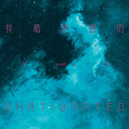

我最想要的
============================

|  |  |
| :--: | :-- |
| [ 我最想要的](https://emumo.xiami.com/album/2104967738) | **艺人**: [李尚尚](../index.md) **语种**: 国语 **唱片公司**: 万拿比 **发行时间**: 2019年07月01日 **专辑类别**: EP, 单曲 **专辑风格**:  **播放数**: 428848 **收藏数**: 2 **评论数**: 3  |

## 简介

你 有没有问过自己  
你 最想要的是什么  
  
六年「穷游」 满载而归  
2019 李尚尚「真实」的生活笔录  
  
我 最想要的...？  
  
生命 是一段动听的旋律  
从啼哭 到阴雨风晴  
一边行走 一边领悟  
那些 太多的不得已  
终究 会释怀过去  
那些 浮躁的虚渺  
随着时间 转瞬即逝  
  
每个人都很渺小  
小到有时忘记  
自己的存在  
用心去寻找  
听 时间的心跳  
你 会渐渐明白  
最想要的是  
紧握住现在  
  
金牌制作团队  
诚意之作  
这个夏天  
听李尚尚「诉说」 

## 曲目

## 评论

|  |  |  |  |
| :-- | :-- | :-- | :-- |
|  [虾米用户](https://emumo.xiami.com/u/407783381) 经历过了，就知道了自己心... 2019-09-10 07:18 赞(0) 踩(0) | 
很喜欢旋律和歌词，唱的也很有感情，很有感染了
 |
|  [虾米用户](https://emumo.xiami.com/u/21164070) 一沙一世界 一花一天堂 ... 2019-07-02 13:34 赞(0) 踩(0) | 

 |
|  [虾米用户](https://emumo.xiami.com/u/6069861) 乖乖隆地隆 2019-07-01 12:01 赞(0) 踩(0) | 
wow，好久不见！期待！新的爆发！
 |
