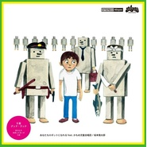

あなたもロボットになれる
============================

|  |  |
| :--: | :-- |
| [ あなたもロボットになれる](https://emumo.xiami.com/album/2103691435) | **艺人**: [坂本慎太郎](../index.md) **语种**: 日语 **唱片公司**: zelone records **发行时间**: 2014年11月07日 **专辑类别**: EP, 单曲 **专辑风格**: 都市流行 City Pop **播放数**: 30263 **收藏数**: 122 **评论数**: 32  |

## 简介

## 曲目

## 评论

|  |  |  |
| :-- | :-- | :-- |
|  [虾米用户](https://emumo.xiami.com/u/427840279)  2020-09-21 06:56 赞(0) 踩(0) | 

 |
|  [虾米用户](https://emumo.xiami.com/u/9028760) 豆瓣见 spotify ... 2018-09-24 16:59 赞(0) 踩(0) | 
（&amp;acute;-`）.｡oO
 |
|  [虾米用户](https://emumo.xiami.com/u/260426726)  2018-07-09 18:22 赞(0) 踩(0) | 
️&amp;zwj;♂️
 |
|  [虾米用户](https://emumo.xiami.com/u/15479317) 金奖冷场王 音乐懒乞丐 2018-05-16 15:04 赞(0) 踩(0) | 
( ৺ ◡৺ )这就是你的咸鱼
 |
|  [虾米用户](https://emumo.xiami.com/u/58386244) wuyichen111 2018-05-05 03:54 赞(0) 踩(0) | 
happy420
 |
|  [虾米用户](https://emumo.xiami.com/u/37499169) 我还没想好要写什么... 2018-04-21 12:48 赞(0) 踩(0) | 
爱！
 |
|  [虾米用户](https://emumo.xiami.com/u/18821817)  2018-04-21 09:45 赞(0) 踩(0) | 
哟呵！
 |
|  [虾米用户](https://emumo.xiami.com/u/32051445) 女孩儿的歌。 永爱虾米 2018-04-21 06:34 赞(0) 踩(0) | 
诶呀
 |
|  [虾米用户](https://emumo.xiami.com/u/16570408) … 2018-04-21 01:16 赞(0) 踩(0) | 
么么哒！！！！！！
 |
|  [虾米用户](https://emumo.xiami.com/u/25652676) 我还没想好要写什么... 2018-04-20 23:38 赞(0) 踩(0) | 
스케!
 |
|  [虾米用户](https://emumo.xiami.com/u/43250647) 深陷泥潭的人 2018-04-20 23:36 赞(0) 踩(0) | 
幼
 |
|  [虾米用户](https://emumo.xiami.com/u/666947) ISTP 2018-04-20 20:49 赞(0) 踩(0) | 
ى
 |
|  [虾米用户](https://emumo.xiami.com/u/293923210) 我也还没想好要写什么..... 2018-04-20 20:43 赞(0) 踩(0) | 
嗯?
 |
|  [虾米用户](https://emumo.xiami.com/u/12230374) Pinkfloydzh，... 2018-04-20 20:37 赞(0) 踩(0) | 
画风！
 |
|  [虾米用户](https://emumo.xiami.com/u/27402557) The Slaughte... 2018-04-20 19:54 赞(0) 踩(0) | 

 |
|  [虾米用户](https://emumo.xiami.com/u/9597157) ， 2018-04-20 19:43 赞(0) 踩(0) | 

 |
|  [虾米用户](https://emumo.xiami.com/u/46000485) 杂食动物  夜行动物  ... 2018-04-20 19:25 赞(0) 踩(0) | 
欸！？
 |
|  [虾米用户](https://emumo.xiami.com/u/59024182) 墜 落 2018-04-20 17:24 赞(0) 踩(0) | 
哇塞！！
 |
|  [虾米用户](https://emumo.xiami.com/u/43724295) 我还没想好要写什么... 2018-04-20 16:25 赞(0) 踩(0) | 
喜欢
 |
|  [虾米用户](https://emumo.xiami.com/u/4015583) 永遠的蝦米 2018-04-20 15:57 赞(0) 踩(0) | 
卧槽   
 |
|  [虾米用户](https://emumo.xiami.com/u/298488344) 再见了 2018-04-20 15:51 赞(0) 踩(0) | 

 |
|  [虾米用户](https://emumo.xiami.com/u/187180487)  2018-04-20 15:40 赞(0) 踩(0) | 
️
 |
|  [虾米用户](https://emumo.xiami.com/u/48898343) 生命已经过期 2018-04-20 15:33 赞(0) 踩(0) | 

 |
|  [虾米用户](https://emumo.xiami.com/u/52415194) ♬♩♫♪♡ 2018-04-20 15:29 赞(0) 踩(0) | 
ᵕ᷄≀ ̠˘᷅
 |
|  [虾米用户](https://emumo.xiami.com/u/23421787) 暂时还没想好说什么鬼话 2018-04-20 15:25 赞(0) 踩(0) | 
哈？
 |
|  [虾米用户](https://emumo.xiami.com/u/5604492) ‪‪♬✧訂閱號：Morn... 2018-04-20 15:23 赞(0) 踩(0) | 
咩？
 |
|  [虾米用户](https://emumo.xiami.com/u/25912333) -「想要像植物一樣生活」... 2018-04-20 15:23 赞(0) 踩(0) | 
Yo
 |
|  [虾米用户](https://emumo.xiami.com/u/49073959) 我还没想好要写什么... 2018-04-20 15:23 赞(0) 踩(0) | 
朗朗！
 |
|  [虾米用户](https://emumo.xiami.com/u/3036010) 听觉是用来享受的。 2018-04-20 15:22 赞(0) 踩(0) | 
 
 |
|  [虾米用户](https://emumo.xiami.com/u/457226) watermelon w... 2018-04-20 15:21 赞(0) 踩(0) | 
✍
 |
|  [虾米用户](https://emumo.xiami.com/u/256666291) 我还没想好要写什么... 2018-04-20 15:21 赞(0) 踩(0) | 
赞
 |
|  [虾米用户](https://emumo.xiami.com/u/85148548)  2018-04-20 11:43 赞(5) 踩(0) | 
补了 
 |
