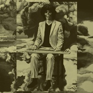

ナマで踊ろう
============================

|  |  |
| :--: | :-- |
| [ ナマで踊ろう](https://emumo.xiami.com/album/397643020) | **艺人**: [坂本慎太郎](../index.md) **语种**: 日语 **唱片公司**: zelone records **发行时间**: 2014年05月28日 **专辑类别**: 录音室专辑 **专辑风格**: 都市流行 City Pop **播放数**: 277827 **收藏数**: 811 **评论数**: 59  |

## 简介

幻とのつきあい方 (How To Live With A Phantom)」から約2年半、坂本慎太郎2ndアルバムの詳細が決定しました。 アルバムタイトルは、「ナマで踊ろう(Let's Dance Raw)」。全くトロピカルではないスチールギターが、底抜けに明るいバンジョーが、人類滅亡後の地球でむなしく鳴り響く。構想&amp;妄想約2年、坂本作品史上最もシリアスで最もポップな、入魂のコンセプトアルバムが完成しました。 今回のレコーディングは、もはや坂本作品には欠かせないドラマーとなった菅沼雄太に加え、新たにベーシストとしてOOIOO等で活躍するAYAを迎え、トリオのバンド編成で入念なリハーサルを重ねた後に行われました。M-1のみ坂本がベースを弾いています。菅沼はドラムの他にパーカッションとコーラス、AYAはエレクトリック・ピアノとコーラスも担当しました。その他のゲストプレイヤーには、サックスとフルートに西内徹、ヴィブラホンに初山博、M-1のボーカルとコーラスに中村楓子、そしてエンジニアは中村宗一郎と、いずれも坂本作品ではおなじみのメンバーが強力サポートしています。 形態は初回盤/通常盤共にBONUS CDとして、アルバム収録曲の全インストヴァージョン10曲入りCDが付いた2枚組。初回盤は紙ジャケ仕様になります。 今年のRSDエクスクルーシヴ・リリースのメイヤー・ホーソンとのSplit7inchも好評の中、全世界注目の2014年大問題作です。

## 曲目

## 评论

|  |  |  |
| :-- | :-- | :-- |
|  [虾米用户](https://emumo.xiami.com/u/427840279)  2020-09-21 06:57 赞(0) 踩(0) | 
&amp;infin;
 |
|  [虾米用户](https://emumo.xiami.com/u/8741301) still walkin... 2020-05-27 23:59 赞(0) 踩(0) | 
这张太耐听了超喜欢！
 |
|  [虾米用户](https://emumo.xiami.com/u/276944698) 不要自我设限..... 2019-08-24 02:10 赞(1) 踩(0) | 
Ⓜ️Ⓜ️Ⓜ️
 |
|  [虾米用户](https://emumo.xiami.com/u/42963872) 我还没想好要写什么... 2019-07-26 23:30 赞(0) 踩(0) | 
-
 |
|  [虾米用户](https://emumo.xiami.com/u/1232339)  2019-07-20 23:56 赞(0) 踩(0) | 
太喜欢这张了！赞赞赞！
 |
|  [虾米用户](https://emumo.xiami.com/u/271611461) 再见虾米 2019-07-02 12:15 赞(0) 踩(0) | 
mark
 |
|  [虾米用户](https://emumo.xiami.com/u/95208910) 再見 2019-01-06 00:05 赞(0) 踩(0) | 
/
 |
|  [虾米用户](https://emumo.xiami.com/u/122670826) 我还没想好要写什么... 2018-12-07 19:38 赞(1) 踩(0) | 
嗯
 |
|  [虾米用户](https://emumo.xiami.com/u/20320543)  2018-06-30 14:15 赞(0) 踩(0) | 
更喜欢这张诶。
 |
|  [虾米用户](https://emumo.xiami.com/u/13156405)   2018-03-04 18:15 赞(1) 踩(0) | 
有情感的
 |
|  [虾米用户](https://emumo.xiami.com/u/16337726)  2018-02-28 20:21 赞(0) 踩(0) | 
)
 |
|  [虾米用户](https://emumo.xiami.com/u/9513422) 虾米歌单迁徙到网易☁️:... 2018-02-24 11:29 赞(0) 踩(0) | 
销魂❤️
 |
|  [虾米用户](https://emumo.xiami.com/u/109983192) 永不醒来 可以吗 2018-02-22 11:49 赞(0) 踩(0) | 
从睡梦摇醒
 |
|  [虾米用户](https://emumo.xiami.com/u/45298985) Wechat:dqx19... 2017-12-16 10:49 赞(0) 踩(0) | 
+
 |
|  [虾米用户](https://emumo.xiami.com/u/6983749)  2017-10-28 00:39 赞(0) 踩(0) | 
维胸罩香港首次山博，M - 1的主唱和合唱的中村楓子，而工程师和中村宗，都是坂本作品中常见的成员强力支持。形态是初回盘／通常盘一起BONUS CD，专辑中的收录曲的全10曲进入安装版CD附有了的2枚组。初回盘成了纸封面式样。今年的RSDエクスクルーシヴ・リリース的梅尔·霍桑的Split 7英寸也好评中，全世界关注的大问题，2014年作。
 |
|  [虾米用户](https://emumo.xiami.com/u/4131849) 网易云：非人類兔子Agy... 2017-05-31 18:27 赞(0) 踩(0) | 
(˶&amp;oline;᷄ ⁻̫ &amp;oline;᷅˵)
 |
|  [虾米用户](https://emumo.xiami.com/u/1418202)  江山共老 2017-05-10 12:03 赞(0) 踩(0) | 
好
 |
|  [虾米用户](https://emumo.xiami.com/u/9726884)    今  食  飯 2017-05-07 01:31 赞(0) 踩(0) | 
真好
 |
|  [虾米用户](https://emumo.xiami.com/u/6983749)  2017-03-11 22:00 赞(2) 踩(0) | 
与幻影的交往方法（How To Live With A Phantom )」约2年半，坂本慎太郎的第二张专辑的详细决定了。专辑的标题是&amp;ldquo;生中跳舞吧（Let &amp;amp;#039; s Dance Raw )」。完全热带不是夏威夷吉他，非常明朗班卓琴，人类灭亡后，地球的空洞回响。构想&amp;amp;amp;妄想约2年，坂本作品史上最严肃最流行的，呕心沥血的概念专辑完成了。这次的录音，已经是坂本作品是不可或缺的鼓手。菅沼雄，加上新作为bassist OOIOO等活跃的咱们，迎来了三重奏的乐队的编排细致的彩排重叠后举行了。坂本在坂本弹的基础。菅沼鼓手的其他打击乐器和合唱，咱们是电气&amp;middot;钢琴和合唱也担当了。其他玩家的嘉宾，萨克斯和长笛上西内彻，
 |
|  [虾米用户](https://emumo.xiami.com/u/39769356) 很普通，很快乐 2017-03-07 04:30 赞(0) 踩(0) | 

 |
|  [虾米用户](https://emumo.xiami.com/u/368924) Wechat:Compo... 2017-02-16 22:42 赞(0) 踩(0) | 
minilp入手
 |
|  [虾米用户](https://emumo.xiami.com/u/29237457) Let's join t... 2016-10-23 09:45 赞(0) 踩(0) | 
谜之带感
 |
|  [虾米用户](https://emumo.xiami.com/u/204380597) Ing 2016-10-20 23:43 赞(0) 踩(0) | 
最喜欢的一张
 |
| ⇒ |  [虾米用户](https://emumo.xiami.com/u/36057872) 网易/BC: Breat... 2016-10-21 11:11 赞(0) 踩(0) | 
新砖已经有了，可试听
 |
|  [虾米用户](https://emumo.xiami.com/u/36057872) 网易/BC: Breat... 2016-10-20 18:53 赞(0) 踩(0) | 
卡哇伊
 |
|  [虾米用户](https://emumo.xiami.com/u/1681248) Everything w... 2016-09-15 10:31 赞(0) 踩(0) | 
封面有趣炸裂
 |
|  [虾米用户](https://emumo.xiami.com/u/8385848) 左手音乐，右手数学。 2016-07-15 03:09 赞(0) 踩(0) | 
这张专辑够我听整个晚上！
 |
|  [虾米用户](https://emumo.xiami.com/u/10121087) 天涼好個秋 2016-04-19 11:58 赞(0) 踩(0) | 
好.
 |
|  [虾米用户](https://emumo.xiami.com/u/32405529) 我还没想好要写什么... 2016-01-05 13:12 赞(4) 踩(0) | 
人类灭亡后  地球的空洞回响
 |
|  [虾米用户](https://emumo.xiami.com/u/6636257) coming soon 2015-10-28 20:52 赞(0) 踩(0) | 
酥酥服
 |
|  [虾米用户](https://emumo.xiami.com/u/30800139) 我在低俗与高雅间活的很尴... 2015-10-08 00:26 赞(0) 踩(0) | 
。
 |
|  [虾米用户](https://emumo.xiami.com/u/12064965) : ) 2015-09-02 09:48 赞(1) 踩(0) | 
封面杀
 |
|  [虾米用户](https://emumo.xiami.com/u/6570452) 我还没想好要写什么... 2015-08-26 19:03 赞(0) 踩(0) | 
封面真美舔舔舔
 |
|  [虾米用户](https://emumo.xiami.com/u/12880915) 头像是我自己画的 2015-07-05 21:43 赞(1) 踩(0) | 
贝斯提神
 |
|  [虾米用户](https://emumo.xiami.com/u/9710455)  2015-05-14 13:20 赞(0) 踩(0) | 
******
 |
|  [虾米用户](https://emumo.xiami.com/u/30471496) 哟 2015-05-06 12:48 赞(0) 踩(0) | 

 |
|  [虾米用户](https://emumo.xiami.com/u/760301) 慈。 2015-04-03 23:09 赞(0) 踩(0) | 
。
 |
|  [虾米用户](https://emumo.xiami.com/u/5662640) 失落 2014-12-29 11:57 赞(0) 踩(0) | 
坂本慎太郎，收录
 |
|  [虾米用户](https://emumo.xiami.com/u/7464378) 我还没想好要写什么... 2014-11-28 21:55 赞(0) 踩(0) | 
帝国乐队听起来好悲伤解散了
 |
|  [虾米用户](https://emumo.xiami.com/u/710471)  2014-10-09 21:48 赞(1) 踩(0) | 
无眉叔调皮了
 |
|  [虾米用户](https://emumo.xiami.com/u/9312421)  2014-09-10 13:27 赞(0) 踩(0) | 
好销魂，极其棒
 |
|  [虾米用户](https://emumo.xiami.com/u/10314)  2014-08-27 17:16 赞(0) 踩(0) | 
虽然不懂日语但这个光音乐部分听起来变态怪诞有趣极了~！
 |
|  [虾米用户](https://emumo.xiami.com/u/3324320)   2014-07-08 06:54 赞(0) 踩(0) | 
good！
 |
|  [虾米用户](https://emumo.xiami.com/u/4172210)  2014-06-23 21:28 赞(0) 踩(0) | 
ghost POP
 |
|  [虾米用户](https://emumo.xiami.com/u/3936559) 雌性外星动物 2014-06-15 21:05 赞(0) 踩(0) | 
恶趣味小清新。
 |
|  [虾米用户](https://emumo.xiami.com/u/631482) choi-system 2014-06-13 21:34 赞(0) 踩(0) | 
-
 |
|  [虾米用户](https://emumo.xiami.com/u/569910)   2014-06-13 11:15 赞(0) 踩(0) | 
解荒
 |
|  [虾米用户](https://emumo.xiami.com/u/5035422) 我想不好写什么 2014-06-13 10:56 赞(0) 踩(0) | 
慎太郎布袋子没白画    召唤出了新砖
 |
|  [虾米用户](https://emumo.xiami.com/u/8937656) 听... 2014-06-12 21:23 赞(0) 踩(0) | 
哟哟切克闹
 |
|  [虾米用户](https://emumo.xiami.com/u/52133) 网易：ama_ii   ... 2014-06-12 19:45 赞(0) 踩(0) | 
谢谢分享！等了很久～
 |
|  [虾米用户](https://emumo.xiami.com/u/11027094)  2014-06-12 16:10 赞(0) 踩(0) | 
安神补脑
 |
|  [虾米用户](https://emumo.xiami.com/u/9180282)  2014-06-12 13:46 赞(0) 踩(0) | 
&amp;lt;33
 |
|  [虾米用户](https://emumo.xiami.com/u/7324725)  2014-06-12 12:42 赞(0) 踩(0) | 
喜欢这种诙谐
 |
|  [虾米用户](https://emumo.xiami.com/u/1071832) 我还没想好要写什么... 2014-06-12 11:34 赞(0) 踩(0) | 
哟哟
 |
|  [虾米用户](https://emumo.xiami.com/u/11027094)  2014-06-12 10:59 赞(0) 踩(0) | 
yeah
 |
|  [虾米用户](https://emumo.xiami.com/u/11905985)  2014-06-12 10:23 赞(0) 踩(0) | 
昨天聽了一晚 茫了一晚
 |
|  [虾米用户](https://emumo.xiami.com/u/4838743)  2014-05-30 22:06 赞(0) 踩(0) | 
期待！
 |
|  [虾米用户](https://emumo.xiami.com/u/4172210)  2014-05-28 10:12 赞(0) 踩(0) | 
快來啊～
 |
|  [虾米用户](https://emumo.xiami.com/u/1156608)   2014-05-25 09:36 赞(0) 踩(0) | 
新！
 |
