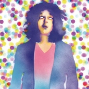
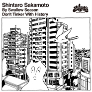
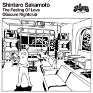
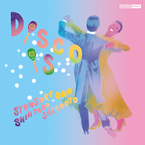
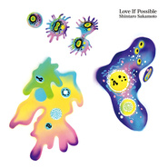
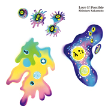
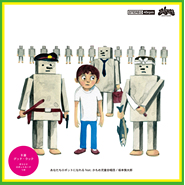
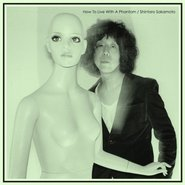

坂本慎太郎
============================

|  |  |
| :--: | :-- |
| [ 坂本慎太郎](https://i.xiami.com/shintaro) | **地区**: Japan 日本 **风格**: 日本摇滚 J-Rock, 迷幻摇滚 Psychedelic Rock **播放数**: 2529464 **粉丝数**: 9971 **评论数**: 271  |

## 档案

小档案 
坂本 慎太郎（さかもと しんたろう、1967年9月9日 - ） 
ゆらゆら帝国元ギター、ボーカル担当。 
小简介 
多摩美術大学デザイン科卒業。なるべく洗わずにキープするという天然パーマで非常にボリュームのある髪をもち、眉毛はのばすと海苔のようになってしまうためごく短く刈っているらしく、とても薄いのが特徴。また、ライブでは赤いパンタロンをよく着用する。メジャーデビュー前は点々に剃った眉毛と、前髪を極端に短くしたロングヘアーに尻が半分見えるほど下がったズボンを着用し、上半身裸でライブに登場していた。好物はうどん。 
CD等のアートワークのほとんどを担当しており、画集も発表している。水木しげるとピーター・アイヴァースを信奉している。自分のアイドルとしてジミ・ヘンドリックスを挙げている。本人曰く、喋りが得意ではないとのことで、声でのメディア露出は稀である。その際の曲紹介においても「照れ臭い」との理由からパーソナリティーに任せている。

## 专辑

| 名称 | 语种 | 唱片公司 | 发行时间 | 专辑类别 | 专辑风格 |
| :--: | :-- | :-- | :-- | :-- | :-- |
| [ ツバメの季节に / 歴史をいじらないで](./albums/5022089587.md) | 日语 | zelone records | 2020年12月02日 | EP, 单曲 | 流行摇滚 Pop Rock |
| [ 好きっていう気持ち / おぼろげナイトクラブ](./albums/5021899639.md) | 日语 | zelone records | 2020年11月11日 | EP, 单曲 | 日本摇滚 J-Rock |
| [ ディスコって](./albums/2102670906.md) | 日语 | zelone records | 2016年11月19日 | EP, 单曲 | 都市流行 City Pop |
| [ ディスコって c/w ディスコって / オノシュンスケ](./albums/5021761836.md) | 其他 | zelone records | 2016年11月19日 | 录音室专辑 | 节奏布鲁斯 R&B |
| [ できれば愛を](./albums/2100373801.md) | 日语 | Independent Label Council Japan(IND, DAS)(M) | 2016年07月27日 | 录音室专辑 | 都市流行 City Pop |
| [ できれば爱を](./albums/5021771171.md) | 其他 | zelone records | 2016年07月27日 | 录音室专辑 | 流行摇滚 Pop Rock |
| [ あなたもロボットになれる](./albums/2103691435.md) | 日语 | zelone records | 2014年11月07日 | EP, 单曲 | 都市流行 City Pop |
| [ あなたもロボットになれる feat. かもめ児童合唱団 c/w グッド・ラック](./albums/5021760400.md) | 其他 | zelone records | 2014年11月07日 | 录音室专辑 | 流行摇滚 Pop Rock |
| [ ナマで踊ろう](./albums/397643020.md) | 日语 | zelone records | 2014年05月28日 | 录音室专辑 | 都市流行 City Pop |
| [ まともがわからない](./albums/568834.md) | 日语 | zelone records | 2013年01月11日 | EP, 单曲 | 日本摇滚 J-Rock |
| [ 幻とのつきあい方How to Live With a Phantom](./albums/481006.md) | 日语 | zelone records | 2011年11月23日 | 录音室专辑 | 日本摇滚 J-Rock |

## 评论

|  |  |  |
| :-- | :-- | :-- |
|  [虾米用户](https://emumo.xiami.com/u/8565909) =の風 2021-01-29 23:26 赞(0) 踩(0) | 
虾米要关了，来大佬这留个言纪念下 
 |
|  [虾米用户](https://emumo.xiami.com/u/307571872) 及时行乐(´△｀)♪ 2020-10-23 20:24 赞(0) 踩(0) | 
/
 |
|  [虾米用户](https://emumo.xiami.com/u/215379991) 簽名不重要重要的是你聽什... 2020-03-30 01:56 赞(0) 踩(0) | 
ﻌﻌﻌ❤︎
 |
|  [虾米用户](https://emumo.xiami.com/u/110088060) 作为报答、我吔给泥放点、... 2020-03-24 02:29 赞(0) 踩(0) | 
.
 |
|  [虾米用户](https://emumo.xiami.com/u/93450244) 烤红薯 2020-03-15 08:55 赞(0) 踩(0) | 
还不算太晚
 |
|  [虾米用户](https://emumo.xiami.com/u/45925675) 我还没想好 2019-12-24 22:03 赞(0) 踩(0) | 
爱你
 |
|  [虾米用户](https://emumo.xiami.com/u/427840279) 购买诗集《落日飞奔术》电... 2019-12-16 07:31 赞(0) 踩(0) | 
☝
 |
|  [虾米用户](https://emumo.xiami.com/u/47964271)   2019-11-15 23:22 赞(0) 踩(0) | 
你们去看他相册里第十五张照片
 |
|  [虾米用户](https://emumo.xiami.com/u/288013826) 请大家一起养小虾米帮助听... 2019-09-05 21:57 赞(0) 踩(0) | 
：
 |
|  [虾米用户](https://emumo.xiami.com/u/342559410)  2019-08-27 22:35 赞(0) 踩(0) | 
好可爱阿好可爱阿好可爱
 |
|  [虾米用户](https://emumo.xiami.com/u/276944698) 不要自我设限..... 2019-08-24 02:10 赞(1) 踩(0) | 

 |
|  [虾米用户](https://emumo.xiami.com/u/45881128) 来找我玩 在虾米解散前 2019-08-11 18:59 赞(0) 踩(0) | 
总是错过他 下次他来 如果你刚好看到这条评论 请提醒我 提前谢谢你
 |
|  [虾米用户](https://emumo.xiami.com/u/42963872) 我还没想好要写什么... 2019-07-26 23:30 赞(0) 踩(0) | 
E
 |
|  [虾米用户](https://emumo.xiami.com/u/344018512) 我还没想好要写什么... 2019-05-03 09:49 赞(1) 踩(0) | 
D
 |
|  [虾米用户](https://emumo.xiami.com/u/411058641) 取之不尽 用之不竭 2019-03-25 12:18 赞(3) 踩(0) | 
个人觉得自从乐队解散后唱歌就少了原来摇摇帝国的灵魂和味道 
 |
|  [虾米用户](https://emumo.xiami.com/u/40208599) 我很聪明什么也没留下 2019-03-13 15:20 赞(1) 踩(0) | 
|
 |
|  [虾米用户](https://emumo.xiami.com/u/45686435) 一壺飛鳧 尋山夢鶴   ... 2019-03-10 13:09 赞(0) 踩(0) | 
现场很棒
 |
|  [虾米用户](https://emumo.xiami.com/u/346165752)  2019-01-26 00:49 赞(0) 踩(0) | 
嗯
 |
|  [虾米用户](https://emumo.xiami.com/u/247280649)   2019-01-22 16:25 赞(0) 踩(0) | 
灵魂歌手
 |
|  [虾米用户](https://emumo.xiami.com/u/666000) 我会永远爱你，虾米的朋友... 2018-12-28 13:33 赞(0) 踩(0) | 
小骚
 |
|  [虾米用户](https://emumo.xiami.com/u/122670826) 我还没想好要写什么... 2018-12-10 20:49 赞(2) 踩(0) | 
嗯
 |
|  [虾米用户](https://emumo.xiami.com/u/201391232) 最快的方法是先抱抱 2018-12-02 08:49 赞(0) 踩(0) | 
彡
 |
|  [虾米用户](https://emumo.xiami.com/u/255798286) 不要不开心哦♡ 2018-11-26 22:02 赞(0) 踩(0) | 
心太软
 |
|  [虾米用户](https://emumo.xiami.com/u/34182751) 再见了朋友们 我们网易云... 2018-11-17 12:23 赞(1) 踩(0) | 
。
 |
|  [虾米用户](https://emumo.xiami.com/u/30799911)  2018-10-26 23:40 赞(3) 踩(0) | 
bassist AyA.  她的ins: <a href="https://www.instagram.com/ayajamaya/" target="_blank" rel="nofollow noreferrer noopener">https://www.instagram.com/ayajamaya/</a>
 |
|  [虾米用户](https://emumo.xiami.com/u/52415194) ♬♩♫♪♡ 2018-10-08 22:44 赞(0) 踩(0) | 
  完美错过
 |
|  [虾米用户](https://emumo.xiami.com/u/37255096) Bye. 2018-09-13 00:02 赞(0) 踩(0) | 
没收到飞，错过了
 |
|  [虾米用户](https://emumo.xiami.com/u/334335989) 暫無 2018-09-09 23:17 赞(0) 踩(0) | 
贝斯手是谁啊!  太美了!
 |
|  [虾米用户](https://emumo.xiami.com/u/5012905) 我会想念你 和虾米。 2018-09-09 21:00 赞(0) 踩(0) | 

 |
|  [虾米用户](https://emumo.xiami.com/u/40002478) 机智的间歇性精神分裂症患... 2018-09-09 17:36 赞(0) 踩(0) | 
ˊ_&amp;gt;ˋ
 |
|  [虾米用户](https://emumo.xiami.com/u/15792063) No future. 2018-09-09 13:17 赞(6) 踩(0) | 
深圳场从8:39开始到十点 将近一个半小时都没有停过 最后还返场两首！真是听的太爽了！555循序渐进铺垫高潮真是内心沸腾又悲伤啊
 |
|  [虾米用户](https://emumo.xiami.com/u/124520774) 無悔的，與你的，總有的。 2018-09-09 09:54 赞(2) 踩(0) | 
zzz太棒 9.7 深圳 B10
 |
|  [虾米用户](https://emumo.xiami.com/u/3428058) 我还没想好要写什么... 2018-09-09 02:26 赞(3) 踩(0) | 
看他们在台上 好像神仙一样...
 |
|  [虾米用户](https://emumo.xiami.com/u/39821398) 乘凉 2018-09-09 01:42 赞(1) 踩(0) | 
夏末快乐
 |
|  [虾米用户](https://emumo.xiami.com/u/9513422) 虾米歌单迁徙到网易☁️:... 2018-09-08 11:40 赞(10) 踩(0) | 
今晚杭州见 慎太郎
 |
|  [虾米用户](https://emumo.xiami.com/u/12836574)  2018-09-08 09:54 赞(2) 踩(0) | 
昨晚深圳場簡直炸裂
 |
|  [虾米用户](https://emumo.xiami.com/u/4101009) 狗鸡 2018-09-08 03:37 赞(0) 踩(0) | 
20180907 深圳 live
 |
|  [虾米用户](https://emumo.xiami.com/u/1306664) 人生苦短 再来一碗 2018-09-08 01:02 赞(12) 踩(0) | 
看完深圳场，激动的睡不着
 |
|  [虾米用户](https://emumo.xiami.com/u/147361618) 再会 2018-09-07 23:34 赞(3) 踩(0) | 
欢乐的周五，欢乐的深圳场！
 |
|  [虾米用户](https://emumo.xiami.com/u/142169512) 点击编辑 2018-09-07 22:24 赞(22) 踩(0) | 
贝斯手太美了！！！
 |
| ⇒ |  [虾米用户](https://emumo.xiami.com/u/12836574)  2018-09-08 09:54 赞(0) 踩(0) | 
對啊！而且好厲害！
 |
| ⇒ |  [虾米用户](https://emumo.xiami.com/u/142169512) 点击编辑 2018-09-08 11:50 赞(0) 踩(0) | 
<q><b>上帝之狗说：</b></q>
 |
| ⇒ |  [虾米用户](https://emumo.xiami.com/u/22431648) “性子比孩子还野，酒量是... 2018-09-11 07:17 赞(0) 踩(0) | 
有翻到ins的嘛！
 |
| ⇒ |  [虾米用户](https://emumo.xiami.com/u/142169512) 点击编辑 2018-09-12 17:40 赞(0) 踩(0) | 
<q><b>油腻老阿姨说：</b></q>
 |
| ⇒ |  [虾米用户](https://emumo.xiami.com/u/198501848) ， 2018-10-27 08:19 赞(0) 踩(0) | 
简直是神仙
 |
| ⇒ |  [虾米用户](https://emumo.xiami.com/u/31213633) I DON'T UNDE... 2020-07-12 18:19 赞(0) 踩(0) | 
LOL
 |
|  [虾米用户](https://emumo.xiami.com/u/17938634)  2018-09-05 14:38 赞(0) 踩(0) | 
热切期待坂本桑的到来ww
 |
|  [虾米用户](https://emumo.xiami.com/u/14426351) 暴躁女 2018-09-03 09:16 赞(1) 踩(0) | 
球各位能去现场的大佬多拍视频发微博 让我这样赶不过去的外地社畜看一看会动的坂本。。。要哭了。。。
 |
|  [虾米用户](https://emumo.xiami.com/u/9028760) 豆瓣见 spotify ... 2018-09-01 00:45 赞(1) 踩(0) | 
八成是看不到了...
 |
| ⇒ |  [虾米用户](https://emumo.xiami.com/u/16052718)  2018-09-07 22:32 赞(0) 踩(0) | 
杭州站去？
 |
| ⇒ |  [虾米用户](https://emumo.xiami.com/u/9028760) 豆瓣见 spotify ... 2018-09-07 22:33 赞(0) 踩(0) | 
<q><b>GreenNirvana说：</b></q>
 |
| ⇒ |  [虾米用户](https://emumo.xiami.com/u/16052718)  2018-09-07 22:34 赞(0) 踩(0) | 
<q><b>加减说：</b></q>
 |
| ⇒ |  [虾米用户](https://emumo.xiami.com/u/9028760) 豆瓣见 spotify ... 2018-09-07 22:37 赞(0) 踩(0) | 
<q><b>GreenNirvana说：</b></q>
 |
| ⇒ |  [虾米用户](https://emumo.xiami.com/u/16052718)  2018-09-07 22:57 赞(0) 踩(0) | 
<q><b>加减说：</b></q>
 |
| ⇒ |  [虾米用户](https://emumo.xiami.com/u/9028760) 豆瓣见 spotify ... 2018-09-07 22:58 赞(0) 踩(0) | 
<q><b>GreenNirvana说：</b></q>
 |
|  [虾米用户](https://emumo.xiami.com/u/6925948) 我还没想好要写什么... 2018-08-27 22:18 赞(1) 踩(0) | 
9.8见哦(　&amp;acute;・◡・｀)
 |
|  [虾米用户](https://emumo.xiami.com/u/195027875) takemyhearta... 2018-08-23 22:10 赞(0) 踩(0) | 
♡
 |
|  [虾米用户](https://emumo.xiami.com/u/8388133) 探索更多歌曲⋯⋯ 2018-08-17 12:24 赞(2) 踩(0) | 
9.7深圳
 |
|  [虾米用户](https://emumo.xiami.com/u/46930824) 叨位去波普星 2018-08-09 23:54 赞(0) 踩(0) | 
我爱你
 |
|  [虾米用户](https://emumo.xiami.com/u/112454584) 多情司马 2018-08-08 11:13 赞(1) 踩(0) | 
卧槽，nb，想去，好贵
 |
|  [虾米用户](https://emumo.xiami.com/u/328627544) 我还没想好要写什么... 2018-07-31 19:04 赞(0) 踩(0) | 
和李孝利老公一个款式
 |
|  [虾米用户](https://emumo.xiami.com/u/32275483) 我还没想好要写什么... 2018-07-29 23:12 赞(0) 踩(0) | 
求两张票！
 |
| ⇒ |  [虾米用户](https://emumo.xiami.com/u/32275483) 我还没想好要写什么... 2018-07-29 23:12 赞(0) 踩(0) | 
杭州求两张票
 |
|  [虾米用户](https://emumo.xiami.com/u/22431648) “性子比孩子还野，酒量是... 2018-07-26 17:33 赞(0) 踩(0) | 
九月见
 |
|  [虾米用户](https://emumo.xiami.com/u/3392853)   2018-07-25 14:16 赞(1) 踩(0) | 
求张深圳的票儿！！！
 |
| ⇒ |  [虾米用户](https://emumo.xiami.com/u/192318312)   2018-09-03 23:29 赞(0) 踩(0) | 
有票
 |
| ⇒ |  [虾米用户](https://emumo.xiami.com/u/3392853)   2018-09-04 01:09 赞(0) 踩(0) | 
<q><b>偶尔打扰说：</b></q>
 |
|  [虾米用户](https://emumo.xiami.com/u/55094882) ｉｄ９１ｏｍｏ＞Ｉ  2018-07-22 17:47 赞(0) 踩(0) | 

 |
|  [虾米用户](https://emumo.xiami.com/u/352595482) みえない 2018-07-21 17:14 赞(1) 踩(0) | 
杭州見杭州見杭州見！
 |
|  [虾米用户](https://emumo.xiami.com/u/3677661) Enter the vo... 2018-07-13 20:37 赞(0) 踩(0) | 
北京见！
 |
|  [虾米用户](https://emumo.xiami.com/u/357674040)  2018-07-13 01:09 赞(0) 踩(0) | 
Genial
 |
|  [虾米用户](https://emumo.xiami.com/u/7693430) 劳和动 2018-07-11 11:35 赞(0) 踩(0) | 
谁能给我一张他北京的票
 |
|  [虾米用户](https://emumo.xiami.com/u/10657091) 如果说人类有什么自命不凡... 2018-07-11 00:35 赞(52) 踩(0) | 
5月19日在明天音乐节看了户川纯，8月4日要去香港看Bob Dylan，9月7日在B10看坂本慎太郎，今年真是个好年，哈哈哈
 |
| ⇒ |  [虾米用户](https://emumo.xiami.com/u/22431648) “性子比孩子还野，酒量是... 2018-07-26 17:39 赞(0) 踩(0) | 
很令人羡慕了！
 |
| ⇒ |  [虾米用户](https://emumo.xiami.com/u/40821921) "盘旋直到涅槃" 2018-08-23 02:11 赞(0) 踩(0) | 
11月枪花继续一起啊 
 |
| ⇒ |  [虾米用户](https://emumo.xiami.com/u/10657091) 如果说人类有什么自命不凡... 2018-08-23 08:23 赞(0) 踩(0) | 
<q><b>杜安段说：</b></q>
 |
| ⇒ |  [虾米用户](https://emumo.xiami.com/u/49073959) 我还没想好要写什么... 2018-09-05 19:45 赞(0) 踩(0) | 
哈哈哈哈我都在诶！！
 |
| ⇒ |  [虾米用户](https://emumo.xiami.com/u/311538642) 回到現實吧孩子 2018-09-09 10:50 赞(0) 踩(0) | 
纯在深圳 dylan在hk 坂本慎太郎杭州 上海学生党表示都凑齐了.. 穷死个人
 |
| ⇒ |  [虾米用户](https://emumo.xiami.com/u/10657091) 如果说人类有什么自命不凡... 2018-09-09 10:51 赞(0) 踩(0) | 
<q><b>劉生鐵说：</b></q>
 |
| ⇒ |  [虾米用户](https://emumo.xiami.com/u/10657091) 如果说人类有什么自命不凡... 2018-09-09 10:52 赞(0) 踩(0) | 
<q><b>说：</b></q>
 |
|  [虾米用户](https://emumo.xiami.com/u/111251724) 我还没想好要写什么... 2018-07-10 13:58 赞(0) 踩(0) | 
我我我我！9.8 杭州站 求一个票 :（
 |
|  [虾米用户](https://emumo.xiami.com/u/2768615)   2018-07-10 00:17 赞(0) 踩(0) | 
想拥有同款卷发
 |
|  [虾米用户](https://emumo.xiami.com/u/37184688)   2018-07-07 21:00 赞(0) 踩(0) | 
居然来深圳了
 |
|  [虾米用户](https://emumo.xiami.com/u/10811234) Love Mucic 2018-07-07 18:23 赞(0) 踩(0) | 
赞
 |
|  [虾米用户](https://emumo.xiami.com/u/4415503)  2018-07-07 16:55 赞(1) 踩(0) | 
来中国巡演啦
 |
|  [虾米用户](https://emumo.xiami.com/u/269430008) 好像被困在这个冬天里了 2018-07-05 18:24 赞(2) 踩(0) | 
深圳见！！！！！！！
 |
|  [虾米用户](https://emumo.xiami.com/u/45949283) 音乐不只是为了享受。 2018-07-05 04:06 赞(0) 踩(0) | 
要来了要来了
 |
|  [虾米用户](https://emumo.xiami.com/u/13139213) Kiri Kitano  2018-07-04 22:45 赞(0) 踩(0) | 
處女座的妳
 |
|  [虾米用户](https://emumo.xiami.com/u/13139213) Kiri Kitano  2018-07-04 22:44 赞(0) 踩(0) | 
求杭州票2張 感恩
 |
|  [虾米用户](https://emumo.xiami.com/u/46930824) 叨位去波普星 2018-07-04 20:04 赞(0) 踩(0) | 
哇 我爱你像爱加了星屑佐料的奶茶
 |
|  [虾米用户](https://emumo.xiami.com/u/32824512) 阴凉潮湿晦暗 回到无人洞... 2018-07-04 02:59 赞(1) 踩(0) | 
想去疆进酒九月听你
 |
|  [虾米用户](https://emumo.xiami.com/u/42457016) 小型歡愉 2018-07-01 22:46 赞(3) 踩(0) | 
2018.9.7   深圳 2018.9.8   杭州 2018.9.9   北京
 |
|  [虾米用户](https://emumo.xiami.com/u/45686435) 一壺飛鳧 尋山夢鶴   ... 2018-07-01 11:52 赞(0) 踩(0) | 
啊啊啊兴奋到不行！9.7！
 |
|  [虾米用户](https://emumo.xiami.com/u/22761593) 吃飯睡覺玩蜥蜴 2018-07-01 08:50 赞(1) 踩(0) | 
深圳見吧小可愛們(=ﾟ&amp;omega;ﾟ)ﾉ
 |
|  [虾米用户](https://emumo.xiami.com/u/24420438) 我还没想好要写什么... 2018-07-01 01:55 赞(1) 踩(0) | 
Shenzhen
 |
|  [虾米用户](https://emumo.xiami.com/u/36967057) 我还没想好要写什么... 2018-06-30 22:24 赞(2) 踩(0) | 
要来深圳噜！
 |
|  [虾米用户](https://emumo.xiami.com/u/3635179) 豆瓣儿：果冻飞艇__ 2018-06-30 20:59 赞(1) 踩(0) | 
9.9见！！！
 |
| ⇒ |  [虾米用户](https://emumo.xiami.com/u/32824512) 阴凉潮湿晦暗 回到无人洞... 2018-07-04 02:59 赞(0) 踩(0) | 
没有预售票了 
 |
| ⇒ |  [虾米用户](https://emumo.xiami.com/u/3635179) 豆瓣儿：果冻飞艇__ 2018-07-04 09:45 赞(0) 踩(0) | 
<q><b>Ｇreen说：</b></q>
 |
| ⇒ |  [虾米用户](https://emumo.xiami.com/u/32824512) 阴凉潮湿晦暗 回到无人洞... 2018-07-04 13:28 赞(0) 踩(0) | 
嗯 是
 |
|  [虾米用户](https://emumo.xiami.com/u/48127007) 双鱼 2018-06-30 16:44 赞(0) 踩(0) | 
9.7見
 |
|  [虾米用户](https://emumo.xiami.com/u/48878396) 我还没想好要写什么... 2018-06-30 15:51 赞(0) 踩(0) | 
杭州见
 |
|  [虾米用户](https://emumo.xiami.com/u/4101009) 狗鸡 2018-06-30 15:39 赞(1) 踩(0) | 
深圳见
 |
|  [虾米用户](https://emumo.xiami.com/u/4869044) 朋友们再见啦：），祝你们... 2018-06-30 15:37 赞(1) 踩(0) | 
将进酒哦
 |
|  [虾米用户](https://emumo.xiami.com/u/142169512) 点击编辑 2018-06-30 15:20 赞(1) 踩(0) | 
深圳见
 |
| ⇒ |  [虾米用户](https://emumo.xiami.com/u/3571906) May you alwa... 2018-06-30 15:36 赞(0) 踩(0) | 
B10见
 |
|  [虾米用户](https://emumo.xiami.com/u/203693037) Marco 2018-06-30 14:48 赞(2) 踩(0) | 
欢迎来中国，疆进酒见
 |
|  [虾米用户](https://emumo.xiami.com/u/49073959) 我还没想好要写什么... 2018-06-30 13:47 赞(0) 踩(0) | 
嘿嘿 ！！
 |
|  [虾米用户](https://emumo.xiami.com/u/16255463) @Revolution9... 2018-06-30 13:34 赞(0) 踩(0) | 
窒息
 |
|  [虾米用户](https://emumo.xiami.com/u/20320543)  2018-06-30 13:15 赞(0) 踩(0) | 
巡演三站 还是希望能看到一场T T
 |
|  [虾米用户](https://emumo.xiami.com/u/5039182) 散 2018-06-11 07:59 赞(3) 踩(0) | 
9月！要来了哦！
 |
|  [虾米用户](https://emumo.xiami.com/u/52056952) 人生即是到來、相遇、陪伴... 2018-05-30 22:31 赞(0) 踩(0) | 
❥
 |
|  [虾米用户](https://emumo.xiami.com/u/312820569) Pshyq 2018-05-01 12:58 赞(0) 踩(0) | 
他真是可爱哇
 |
|  [虾米用户](https://emumo.xiami.com/u/71178106) 塵世や 酒、風呂を抜け ... 2018-04-28 21:47 赞(0) 踩(0) | 
♡
 |
|  [虾米用户](https://emumo.xiami.com/u/83893196) 我还没想好要写什么... 2018-04-23 15:37 赞(0) 踩(0) | 

 |
|  [虾米用户](https://emumo.xiami.com/u/247280649)   2018-04-15 22:34 赞(0) 踩(0) | 
灵魂歌手 喜欢他 
 |
|  [虾米用户](https://emumo.xiami.com/u/53590447) 梦归隐 2018-03-18 11:19 赞(0) 踩(0) | 
果冻
 |
|  [虾米用户](https://emumo.xiami.com/u/9513422) 虾米歌单迁徙到网易☁️:... 2018-02-24 11:31 赞(1) 踩(0) | 
太郎和我一样处女座！！！！！
 |
|  [虾米用户](https://emumo.xiami.com/u/43700627) 嗯 2018-02-09 02:03 赞(0) 踩(0) | 
真的是厉害
 |
|  [虾米用户](https://emumo.xiami.com/u/343428373) I don’t know... 2018-01-14 14:14 赞(0) 踩(0) | 
てんさい
 |
|  [虾米用户](https://emumo.xiami.com/u/2418238) weibo: @尤米口 2018-01-08 21:46 赞(0) 踩(0) | 
♡⃛
 |
|  [虾米用户](https://emumo.xiami.com/u/50093825) 。 2018-01-03 04:09 赞(0) 踩(0) | 
: )
 |
|  [虾米用户](https://emumo.xiami.com/u/7750515) Cloud  Nine 2017-12-19 14:57 赞(0) 踩(0) | 
。
 |
|  [虾米用户](https://emumo.xiami.com/u/45298985) Wechat:dqx19... 2017-12-16 10:49 赞(0) 踩(0) | 
+
 |
|  [虾米用户](https://emumo.xiami.com/u/46000485) 杂食动物  夜行动物  ... 2017-12-11 21:37 赞(0) 踩(0) | 
丑出了风格就不叫丑了，叫独特！！！ (一个嘴硬的迷妹如是说_(:D)&amp;ang;)_
 |
|  [虾米用户](https://emumo.xiami.com/u/43630988) 观察世界 2017-11-17 12:25 赞(1) 踩(0) | 
低配版老狼
 |
|  [虾米用户](https://emumo.xiami.com/u/10225786) 过去再一次酷似未来～ 2017-11-12 20:52 赞(0) 踩(0) | 
如果因为金宇彬而诞生了&amp;ldquo;丑帅丑帅&amp;rdquo;，那么因为坂本先生，爆炸了&amp;ldquo;丑才丑才&amp;rdquo;这个词～比起神似的洋次郎，坂本先生真是更得本宫甚好～明显更丰富，变化多，元素多，又不乱～～～拿捏得恰到好处～只要好听就是牛叉，这是硬道理的夸赞～厉害！ 颜控的我，也是如此尊重这位坂本先生～ 
 |
|  [虾米用户](https://emumo.xiami.com/u/8589959) 天灭后摇狗！ 2017-11-09 22:27 赞(1) 踩(0) | 
这声线辨识度。。
 |
|  [虾米用户](https://emumo.xiami.com/u/42810132) Aprés l'amou... 2017-11-07 16:45 赞(0) 踩(0) | 
天
 |
|  [虾米用户](https://emumo.xiami.com/u/666947) ISTP 2017-10-13 09:49 赞(0) 踩(0) | 

 |
|  [虾米用户](https://emumo.xiami.com/u/299781991) 以后都不知道去哪好了。 2017-09-10 23:26 赞(0) 踩(0) | 
我倒是觉得一头卷毛蛮像海苔（突然馋了怎么回事
 |
|  [虾米用户](https://emumo.xiami.com/u/7399498) I remain in ... 2017-08-17 05:18 赞(0) 踩(0) | 
原來是xx帝國的主唱我好喜歡喔超棒棒
 |
|  [虾米用户](https://emumo.xiami.com/u/117323) QQ/网易/咪咕ID：O... 2017-07-21 04:40 赞(2) 踩(0) | 
摇摇晃晃帝国
 |
|  [虾米用户](https://emumo.xiami.com/u/27402557) The Slaughte... 2017-07-10 20:17 赞(0) 踩(0) | 

 |
|  [虾米用户](https://emumo.xiami.com/u/283561951) 我还没想好要写什么... 2017-06-11 00:02 赞(0) 踩(0) | 
所以简介到底是什么意思啊！哈哈哈哈哈
 |
|  [虾米用户](https://emumo.xiami.com/u/4131849) 网易云：非人類兔子Agy... 2017-05-31 18:25 赞(0) 踩(0) | 
(&amp;deg;_&amp;deg;)
 |
|  [虾米用户](https://emumo.xiami.com/u/34329432) 暂无简介 2017-05-24 16:27 赞(0) 踩(0) | 
你真帅。
 |
|  [虾米用户](https://emumo.xiami.com/u/38663581) see you 2017-05-20 00:00 赞(35) 踩(0) | 
你妈妈一定是注视着夕阳把你生出来的吧
 |
| ⇒ |  [虾米用户](https://emumo.xiami.com/u/53560762) 霧の中 2017-10-17 16:43 赞(0) 踩(0) | 
哈哈哈哈哈哈哈，真赞美
 |
| ⇒ |  [虾米用户](https://emumo.xiami.com/u/200047833) 啦啦啦啦啦啦啦 2018-10-17 11:38 赞(0) 踩(0) | 
为什么我想到了太阳照常升起
 |
|  [虾米用户](https://emumo.xiami.com/u/13911932) 暂冇签名~ 2017-05-17 12:31 赞(0) 踩(0) | 
[带墨镜笑]
 |
|  [虾米用户](https://emumo.xiami.com/u/39548287) Spotify&QQ同名... 2017-05-12 18:12 赞(32) 踩(0) | 
每次听他的歌都脑子里就会浮现出小田切让松田龙平瑛太三个人丧到极点的慵懒样
 |
| ⇒ |  [虾米用户](https://emumo.xiami.com/u/120047166) [虚空有尽] 2019-01-10 13:27 赞(0) 踩(0) | 
都是理想型
 |
|  [虾米用户](https://emumo.xiami.com/u/2665166) 烫得一逼 2017-04-27 19:31 赞(1) 踩(0) | 
好丑但歌好棒
 |
| ⇒ |  [虾米用户](https://emumo.xiami.com/u/12230374) Pinkfloydzh，... 2017-08-29 07:57 赞(0) 踩(0) | 
哈哈哈哈啊哈哈哈哈哈哈哈哈哈哈哈哈哈哈莫名觉得好好笑哈哈哈！！！！！
 |
|  [虾米用户](https://emumo.xiami.com/u/7610981) 虾米不会走 2017-04-21 12:15 赞(0) 踩(0) | 

 |
|  [虾米用户](https://emumo.xiami.com/u/156056836) 我还没想好要写什么... 2017-03-10 17:05 赞(0) 踩(0) | 
Back
 |
|  [虾米用户](https://emumo.xiami.com/u/1155429)  2017-02-26 15:11 赞(0) 踩(0) | 
喜欢
 |
|  [虾米用户](https://emumo.xiami.com/u/40046181) 黑抒情 白摇滚 2017-02-22 21:02 赞(0) 踩(0) | 

 |
|  [虾米用户](https://emumo.xiami.com/u/50677231) 听力受损 2017-02-21 13:29 赞(0) 踩(0) | 
Fish Tank观光客
 |
|  [虾米用户](https://emumo.xiami.com/u/252406760) ジャンクと言われた日々 2017-02-17 09:37 赞(0) 踩(0) | 
☆
 |
|  [虾米用户](https://emumo.xiami.com/u/47164567)   2017-02-01 15:26 赞(0) 踩(0) | 
为什么太郎那么多文艺好看的照片不选！！！偏偏选这一张当封面！！！   
 |
| ⇒ |  [虾米用户](https://emumo.xiami.com/u/7399498) I remain in ... 2017-08-17 05:17 赞(0) 踩(0) | 
這叫接地氣
 |
|  [虾米用户](https://emumo.xiami.com/u/52506830) 再见 2017-01-28 02:44 赞(0) 踩(0) | 
∀
 |
|  [虾米用户](https://emumo.xiami.com/u/49748006) Fly me to th... 2017-01-10 17:47 赞(0) 踩(0) | 
ho
 |
|  [虾米用户](https://emumo.xiami.com/u/251254815) 血有铁的味道！ 2017-01-02 16:38 赞(0) 踩(0) | 
看到大家都说大叔， 去看了眼年龄，居然比我爸还大一岁。。。
 |
|  [虾米用户](https://emumo.xiami.com/u/4831375)  2016-12-28 14:22 赞(0) 踩(0) | 
所以现在谁赶紧来吧简介翻译一下？【颓废脸】
 |
|  [虾米用户](https://emumo.xiami.com/u/85148548)  2016-12-06 18:28 赞(0) 踩(0) | 
新歌也不准备上架了吧……
 |
| ⇒ |  [虾米用户](https://emumo.xiami.com/u/36057872) 网易/BC: Breat... 2016-12-22 08:50 赞(0) 踩(0) | 
新专辑不是有了么?
 |
| ⇒ |  [虾米用户](https://emumo.xiami.com/u/85148548)  2016-12-22 12:05 赞(0) 踩(0) | 
<q><b>扎扎~说：</b></q>
 |
| ⇒ |  [虾米用户](https://emumo.xiami.com/u/36057872) 网易/BC: Breat... 2016-12-22 12:26 赞(0) 踩(0) | 
<q><b>未知生物说：</b></q>
 |
| ⇒ |  [虾米用户](https://emumo.xiami.com/u/85148548)  2016-12-22 12:31 赞(0) 踩(0) | 
<q><b>扎扎~说：</b></q>
 |
| ⇒ |  [虾米用户](https://emumo.xiami.com/u/36057872) 网易/BC: Breat... 2016-12-22 12:42 赞(0) 踩(0) | 
<q><b>未知生物说：</b></q>
 |
|  [虾米用户](https://emumo.xiami.com/u/22356399) 有脾气 2016-12-04 20:40 赞(0) 踩(0) | 
下 下架了
 |
|  [虾米用户](https://emumo.xiami.com/u/12836574)  2016-11-20 10:16 赞(0) 踩(0) | 
什么时候来中国hooo!
 |
|  [虾米用户](https://emumo.xiami.com/u/30333403) 我还没想好要写什么... 2016-11-20 08:37 赞(0) 踩(0) | 
照片怎么这么惊悚 
 |
|  [虾米用户](https://emumo.xiami.com/u/204380597) Ing 2016-10-20 23:42 赞(0) 踩(0) | 
可以的 入新专吧
 |
|  [虾米用户](https://emumo.xiami.com/u/37637093) ⁣そして華麗に私を食べて... 2016-09-19 19:15 赞(0) 踩(0) | 

 |
|  [虾米用户](https://emumo.xiami.com/u/49024854)  2016-08-15 23:34 赞(55) 踩(0) | 
长相奇怪的人一旦开始自然地展现自己  会很美的
 |
|  [虾米用户](https://emumo.xiami.com/u/742851) 笑看各路小众狗 2016-07-31 21:29 赞(6) 踩(0) | 
大家不觉得他长得特别像生命之饼的吴维老师么
 |
|  [虾米用户](https://emumo.xiami.com/u/42936863)   2016-07-26 15:42 赞(2) 踩(0) | 
我真是好喜欢他的长相哦哈哈哈哈哈哈哈哈哈
 |
|  [虾米用户](https://emumo.xiami.com/u/14845416) 鹿角轻轻一撇就斷了… 2016-07-13 16:42 赞(1) 踩(0) | 
帝国的主唱
 |
| ⇒ |  [虾米用户](https://emumo.xiami.com/u/8385848) 左手音乐，右手数学。 2016-10-15 21:36 赞(0) 踩(0) | 
不知情的还以为是什么最高荣誉2333
 |
|  [虾米用户](https://emumo.xiami.com/u/6111570) 我想请你吃雪糕 2016-07-09 15:13 赞(0) 踩(0) | 
很飞<a href="http://emumo.xiami.com/u/29230195" target="_blank" rel="nofollow" name_card="29230195">@道錕</a>
 |
|  [虾米用户](https://emumo.xiami.com/u/49748006) Fly me to th... 2016-06-23 18:50 赞(0) 踩(0) | 
ha
 |
|  [虾米用户](https://emumo.xiami.com/u/13603829) 喜欢就行 2016-06-17 16:03 赞(1) 踩(0) | 
这个自然卷和猎奇的眉毛啊……
 |
|  [虾米用户](https://emumo.xiami.com/u/33444208) :) 2016-06-14 22:50 赞(0) 踩(0) | 
每次都想多听几遍
 |
|  [虾米用户](https://emumo.xiami.com/u/27684693)  2016-06-03 16:57 赞(4) 踩(0) | 
******
 |
|  [虾米用户](https://emumo.xiami.com/u/5617607) 只剩一句感谢，和一句再见... 2016-05-24 20:19 赞(4) 踩(0) | 
坂本桑 我来晚了 抓紧时间爱一下你
 |
|  [虾米用户](https://emumo.xiami.com/u/6135020)   2016-03-28 22:18 赞(0) 踩(0) | 
great music after a cardio combat training to chill out with
 |
|  [虾米用户](https://emumo.xiami.com/u/37178660) 网易id：jolds 2016-03-10 08:16 赞(0) 踩(0) | 
好开心啊
 |
|  [虾米用户](https://emumo.xiami.com/u/68222006) Loveless 2016-03-06 08:20 赞(3) 踩(0) | 
#我想把我的时间和你平分，然后同你一起死去。这样你就不用担心变老，我也不用担心你离开后的日子#
 |
|  [虾米用户](https://emumo.xiami.com/u/68222006) Loveless 2016-03-05 21:08 赞(0) 踩(0) | 
春天
 |
|  [虾米用户](https://emumo.xiami.com/u/742851) 笑看各路小众狗 2016-03-04 11:07 赞(0) 踩(0) | 
大家觉不觉得坂本慎太郎老师特别像生命之饼的吴维老师
 |
|  [虾米用户](https://emumo.xiami.com/u/37334254) Voracity / ✝... 2016-03-01 14:51 赞(0) 踩(0) | 

 |
|  [虾米用户](https://emumo.xiami.com/u/43331756) Shoot the po... 2016-02-11 11:00 赞(0) 踩(0) | 
我要去学日文了886
 |
|  [虾米用户](https://emumo.xiami.com/u/77358166) 彳亍受爱 2016-02-03 17:35 赞(0) 踩(0) | 
好可爱的大叔
 |
|  [虾米用户](https://emumo.xiami.com/u/7994519) +++++ 2016-02-01 14:40 赞(0) 踩(0) | 
丑萌大叔
 |
|  [虾米用户](https://emumo.xiami.com/u/7994519) +++++ 2016-02-01 14:35 赞(0) 踩(0) | 
+++++
 |
|  [虾米用户](https://emumo.xiami.com/u/10944859) ‏‏‏‏‏‏‏‏ 2016-01-26 15:23 赞(0) 踩(0) | 

 |
|  [虾米用户](https://emumo.xiami.com/u/23635743) 酸 2016-01-25 09:54 赞(4) 踩(0) | 
听了这么久虾米 发现在评论区里如此热衷研究歌手发型与生活习惯 的 这是第一个!  
 |
|  [虾米用户](https://emumo.xiami.com/u/3583995) 一個人的戰爭 2016-01-20 19:20 赞(0) 踩(0) | 

 |
|  [虾米用户](https://emumo.xiami.com/u/32405529) 我还没想好要写什么... 2016-01-05 12:50 赞(0) 踩(0) | 
少洗头  保持天然烫
 |
|  [虾米用户](https://emumo.xiami.com/u/7542090) 我还没想好要写什么... 2015-12-22 17:01 赞(0) 踩(0) | 
<a href="http://www.liquidroom.net/schedule/20160209/27294/" target="_blank" rel="nofollow noreferrer noopener">http://www.liquidroom.net/schedule/20160209/27294/</a>
 |
|  [虾米用户](https://emumo.xiami.com/u/16255463) @Revolution9... 2015-12-21 02:30 赞(0) 踩(0) | 
难怪声音那么熟悉！果然是
 |
|  [虾米用户](https://emumo.xiami.com/u/10963393)  2015-12-17 15:53 赞(0) 踩(0) | 
Bass
 |
|  [虾米用户](https://emumo.xiami.com/u/45056928)   2015-11-28 16:59 赞(0) 踩(0) | 
^^
 |
|  [虾米用户](https://emumo.xiami.com/u/16570408) … 2015-11-14 22:18 赞(0) 踩(0) | 
mv棒呆了！！！！！！！！！
 |
|  [虾米用户](https://emumo.xiami.com/u/5403324)  2015-11-10 18:37 赞(0) 踩(0) | 
<a href="http://emumo.xiami.com/u/6615130" target="_blank" rel="nofollow" name_card="6615130">@大闪电</a> 你知道吗烫了头可能不是森田童子是他 哈哈哈哈哈哈
 |
|  [虾米用户](https://emumo.xiami.com/u/13513792)   2015-11-07 23:20 赞(0) 踩(0) | 
妈呀他的歌这么赞我居然发现的这么晚
 |
|  [虾米用户](https://emumo.xiami.com/u/25709868) 要聋要聋！ 2015-11-03 12:51 赞(0) 踩(0) | 
第一眼黄勃 但还是爱他
 |
|  [虾米用户](https://emumo.xiami.com/u/65075620) 独 2015-10-25 21:31 赞(0) 踩(0) | 
喜欢这货的声音
 |
|  [虾米用户](https://emumo.xiami.com/u/43893556)  2015-10-15 21:40 赞(0) 踩(0) | 
专辑像是再版一样，很是复古。
 |
|  [虾米用户](https://emumo.xiami.com/u/3119539) 大家好，请在网易云音乐搜... 2015-10-07 04:42 赞(0) 踩(0) | 
WO DI SHEN !!
 |
|  [虾米用户](https://emumo.xiami.com/u/1302128) 这家伙很可爱什么也没留下 2015-09-21 23:40 赞(2) 踩(0) | 
叔超有才华
 |
|  [虾米用户](https://emumo.xiami.com/u/35247397) U turn 2015-09-06 02:12 赞(0) 踩(0) | 
是个中二吧…
 |
|  [虾米用户](https://emumo.xiami.com/u/45833112) 懒癌晚期无药可救 2015-09-03 17:15 赞(0) 踩(0) | 
笑死我了撸2333333333333333
 |
|  [虾米用户](https://emumo.xiami.com/u/11361192) 微博@沈撸粥 2015-08-27 01:20 赞(0) 踩(0) | 
喜欢啊
 |
|  [虾米用户](https://emumo.xiami.com/u/32320260) kiss me 2015-08-25 06:29 赞(0) 踩(0) | 
-
 |
|  [虾米用户](https://emumo.xiami.com/u/32238784)   2015-08-17 15:06 赞(3) 踩(0) | 
。。。日本的大叔都好可爱
 |
|  [虾米用户](https://emumo.xiami.com/u/32238784)   2015-08-17 15:05 赞(0) 踩(0) | 
楼下的空评论
 |
|  [虾米用户](https://emumo.xiami.com/u/34162354) 我还没想好要写什么... 2015-08-13 15:00 赞(0) 踩(0) | 

 |
|  [虾米用户](https://emumo.xiami.com/u/4908873)   2015-07-31 15:18 赞(0) 踩(0) | 
好喜欢他呀呀呀呀呀（喂
 |
|  [虾米用户](https://emumo.xiami.com/u/246720) 感谢一路陪伴，2Ever... 2015-07-31 11:29 赞(2) 踩(0) | 
虽说不懂日文，但是介绍里一堆髪，眉毛，短，剃再结合右边照片不觉得很喜感么？
 |
|  [虾米用户](https://emumo.xiami.com/u/7753310)  2015-07-08 11:01 赞(0) 踩(0) | 
?
 |
|  [虾米用户](https://emumo.xiami.com/u/12880915) 头像是我自己画的 2015-07-03 22:53 赞(3) 踩(0) | 
这是……spike发型？
 |
| ⇒ |  [虾米用户](https://emumo.xiami.com/u/3254303) 這傢伙不聰明什麼也沒留下... 2016-03-11 14:45 赞(0) 踩(0) | 
偶遇
 |
| ⇒ |  [虾米用户](https://emumo.xiami.com/u/12880915) 头像是我自己画的 2016-03-12 23:03 赞(0) 踩(0) | 
<q><b>UOYYOU:M说：</b></q>
 |
|  [虾米用户](https://emumo.xiami.com/u/9997104) 一起蹦吧 2015-06-30 00:01 赞(44) 踩(0) | 
多摩美術大学设计科毕业。尽量不洗来保持天然卷并非常pong～pong～哒头毛、眉毛延伸很长［一字眉吗。。]为了不像海苔一样。。就削很短、成为了非常没有特点的特征呢。然而｛bingluan｝、在live上好好地穿着红色喇叭裤呢。［很有特点的特征］正式出道前不仅为了眉毛变成点～点～的 剃了、前面的头发也把long～hair～剪地极端的短......
 |
|  [虾米用户](https://emumo.xiami.com/u/27684693)  2015-06-12 12:14 赞(1) 踩(0) | 
******
 |
|  [虾米用户](https://emumo.xiami.com/u/503399) tool tips 2015-06-06 21:50 赞(0) 踩(0) | 
好爱他！这帮人里最爱他！
 |
|  [虾米用户](https://emumo.xiami.com/u/503399) tool tips 2015-06-06 21:30 赞(0) 踩(0) | 
棒
 |
|  [虾米用户](https://emumo.xiami.com/u/525555) 让我在这条岔道的路上欢快 2015-04-14 14:00 赞(0) 踩(0) | 
。
 |
|  [虾米用户](https://emumo.xiami.com/u/2635826)  2015-04-08 23:00 赞(1) 踩(0) | 
想穿着花衬衫阔腿裤晃啊晃
 |
| ⇒ |  [虾米用户](https://emumo.xiami.com/u/32176686) Hugs to ashe... 2015-04-24 07:51 赞(0) 踩(0) | 
hhhhhhh萌
 |
|  [虾米用户](https://emumo.xiami.com/u/44368575)   2015-02-25 20:28 赞(0) 踩(0) | 
。
 |
|  [虾米用户](https://emumo.xiami.com/u/32176686) Hugs to ashe... 2015-02-25 03:13 赞(100) 踩(0) | 
热门评论仿佛都在嘲笑不懂日文的我
 |
| ⇒ |  [虾米用户](https://emumo.xiami.com/u/22711777) 这家伙很聪明什么也没留下 2015-06-04 14:49 赞(0) 踩(0) | 
还有我
 |
|  [虾米用户](https://emumo.xiami.com/u/6570452) 我还没想好要写什么... 2015-02-21 00:47 赞(0) 踩(0) | 
迷人～
 |
|  [虾米用户](https://emumo.xiami.com/u/5560844)  2015-02-09 14:31 赞(0) 踩(0) | 
.
 |
|  [虾米用户](https://emumo.xiami.com/u/31072754) 虾米请别再瞎改版了行么 2015-01-28 18:15 赞(0) 踩(0) | 
。
 |
|  [虾米用户](https://emumo.xiami.com/u/2963586) si。 2014-12-30 03:06 赞(1) 踩(0) | 
！！！！连mv都要如此吓人吗 这大晚上的
 |
|  [虾米用户](https://emumo.xiami.com/u/5662640) 失落 2014-11-27 15:35 赞(0) 踩(0) | 
坂本慎太郎
 |
|  [虾米用户](https://emumo.xiami.com/u/32176686) Hugs to ashe... 2014-11-13 23:52 赞(0) 踩(0) | 
帅炸了。
 |
|  [虾米用户](https://emumo.xiami.com/u/33457836)   2014-11-13 18:30 赞(0) 踩(0) | 
-
 |
|  [虾米用户](https://emumo.xiami.com/u/607980) 我还没想好要写什么... 2014-10-15 22:44 赞(0) 踩(0) | 
美少年
 |
|  [虾米用户](https://emumo.xiami.com/u/607980) 我还没想好要写什么... 2014-10-15 22:23 赞(0) 踩(0) | 
好丑。。。。好喜欢
 |
| ⇒ |  [虾米用户](https://emumo.xiami.com/u/43893556)  2015-06-20 23:12 赞(0) 踩(0) | 
好丑。。。好温柔。。。
 |
|  [虾米用户](https://emumo.xiami.com/u/2943260) Y-108 2014-07-30 23:00 赞(3) 踩(0) | 
与其说喜欢ゆらゆら帝国还不如说就是喜欢坂本慎太郎那股治愈的懒散劲儿～
 |
| ⇒ |  [虾米用户](https://emumo.xiami.com/u/27684693)  2015-06-12 12:14 赞(0) 踩(0) | 
******
 |
|  [虾米用户](https://emumo.xiami.com/u/9345930)  2014-07-14 10:25 赞(1) 踩(0) | 
好歌謠
 |
|  [虾米用户](https://emumo.xiami.com/u/6538665) Die Mensch-M... 2014-06-28 11:59 赞(0) 踩(0) | 
古德~
 |
|  [虾米用户](https://emumo.xiami.com/u/1156608)   2014-06-01 11:21 赞(1) 踩(0) | 
没那么多皱纹的时候略像元帅= =。。
 |
|  [虾米用户](https://emumo.xiami.com/u/154708)  2014-04-30 21:08 赞(0) 踩(0) | 
棒！！！
 |
|  [虾米用户](https://emumo.xiami.com/u/6928562)  2014-04-25 19:17 赞(0) 踩(0) | 
又是一个从“TaMaBi” 蹦出来的
 |
| ⇒ |  [虾米用户](https://emumo.xiami.com/u/6538665) Die Mensch-M... 2014-06-28 11:59 赞(0) 踩(0) | 
哈哈哈\(^o^)/~
 |
|  [虾米用户](https://emumo.xiami.com/u/15830004) 我还没想好要写什么... 2014-04-02 20:19 赞(0) 踩(0) | 
版本肾太郎
 |
|  [虾米用户](https://emumo.xiami.com/u/2758981) Don't worry，... 2014-03-14 20:24 赞(0) 踩(0) | 
怪蜀黍
 |
|  [虾米用户](https://emumo.xiami.com/u/101960)  2013-08-17 20:06 赞(0) 踩(0) | 
まともがわからない  good！！~~
 |
|  [虾米用户](https://emumo.xiami.com/u/5411322)  2013-07-25 20:31 赞(0) 踩(0) | 
就没人讨论下ゆらゆら帝国么
 |
| ⇒ |  [虾米用户](https://emumo.xiami.com/u/128124) 祝你身体健康 2014-03-05 14:52 赞(0) 踩(0) | 
恩 不用多说的好乐队 就是从那转来的
 |
|  [虾米用户](https://emumo.xiami.com/u/202941)  2013-07-24 12:39 赞(0) 踩(0) | 
长的太喜感了
 |
|  [虾米用户](https://emumo.xiami.com/u/1113346) 你曾怀疑，别忧郁我们终将... 2013-06-30 20:55 赞(0) 踩(0) | 
无数赞
 |
|  [虾米用户](https://emumo.xiami.com/u/2278977) the owner of... 2013-06-26 12:20 赞(1) 踩(0) | 
老哥哥眉毛总是那么潇洒宽敞... 分我点好不好
 |
|  [虾米用户](https://emumo.xiami.com/u/89243) 语虚 2013-06-14 00:49 赞(1) 踩(0) | 
爱呀妈
 |
|  [虾米用户](https://emumo.xiami.com/u/13715797)  2013-05-15 13:13 赞(0) 踩(0) | 
いい
 |
|  [虾米用户](https://emumo.xiami.com/u/4794213) taobao:EChic... 2013-05-12 10:32 赞(0) 踩(0) | 
欸
 |
|  [虾米用户](https://emumo.xiami.com/u/6735429) ... 2013-04-24 00:25 赞(0) 踩(0) | 
好叔！
 |
|  [虾米用户](https://emumo.xiami.com/u/915483)  2013-04-22 11:36 赞(0) 踩(0) | 
又一怪咔啊
 |
|  [虾米用户](https://emumo.xiami.com/u/357541) この世は鏡さ。 2013-04-20 12:46 赞(45) 踩(0) | 
内容已删除
 |
| ⇒ |  [虾米用户](https://emumo.xiami.com/u/4337195) 一切の有為の法夢幻泡影の... 2015-09-23 20:23 赞(0) 踩(0) | 
应该是不致于此而剃掉了吧
 |
| ⇒ |  [虾米用户](https://emumo.xiami.com/u/357541) この世は鏡さ。 2015-10-06 23:13 赞(0) 踩(0) | 
<q><b>Eleutheria说：</b></q>
 |
| ⇒ |  [虾米用户](https://emumo.xiami.com/u/2484722) 我还没想好要写什么... 2017-02-20 00:02 赞(0) 踩(0) | 
哈哈哈哈哈哈
 |
|  [虾米用户](https://emumo.xiami.com/u/3566759) 暂无签名~ 2013-04-07 15:17 赞(0) 踩(0) | 
大叔啊  你的歌声很棒啊
 |
|  [虾米用户](https://emumo.xiami.com/u/7549511)  2013-04-01 14:48 赞(80) 踩(0) | 
为毛介绍里就两段整一段在描述这货的外形哈哈哈哈哈。。。。。
 |
| ⇒ |  [虾米用户](https://emumo.xiami.com/u/32051445) 女孩儿的歌。 永爱虾米 2017-03-29 13:39 赞(0) 踩(0) | 
哈哈哈哈
 |
| ⇒ |  [虾米用户](https://emumo.xiami.com/u/12765179)   2018-09-12 14:20 赞(0) 踩(0) | 
评论喜感
 |
|  [虾米用户](https://emumo.xiami.com/u/7698532)  2013-02-12 00:24 赞(0) 踩(0) | 
solo~态度~~！
 |
|  [虾米用户](https://emumo.xiami.com/u/419895)  2013-02-10 19:24 赞(0) 踩(0) | 
果然是ゆらゆら帝国的主唱。。。
 |
|  [虾米用户](https://emumo.xiami.com/u/2165528)   2013-02-07 15:14 赞(0) 踩(0) | 
MODAO感觉还不错
 |
|  [虾米用户](https://emumo.xiami.com/u/657825) 一条血淋淋的大腿正在敲门 2012-11-15 15:04 赞(0) 踩(0) | 
冬日暖洋洋~嗯 眉毛哪去了。。。
 |
|  [虾米用户](https://emumo.xiami.com/u/3873811)  2012-06-13 05:09 赞(1) 踩(0) | 
yeah
 |
