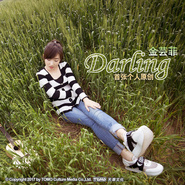

Darling金芸菲首张原创专辑
============================

|  |  |
| :--: | :-- |
| [ Darling金芸菲首张原创专辑](https://emumo.xiami.com/album/2102718590) | **艺人**: [TOMO乐团](../index.md) **语种**: 国语 **唱片公司**: 天摩文化 **发行时间**: 2017年03月22日 **专辑类别**: EP, 单曲 **专辑风格**: 流行 Pop **播放数**: 5260 **收藏数**: 2 **评论数**: 2  |

## 简介

 金芸菲首张个人创作专辑，收入《Darling》《误会》两首芸菲个人也非常心水的单曲。

## 曲目

## 评论

|  |  |  |  |
| :-- | :-- | :-- | :-- |
|  [虾米用户](https://emumo.xiami.com/u/355985229)  2018-05-25 08:08 赞(0) 踩(0) | 
一人一首成名曲
 |
|  [虾米用户](https://emumo.xiami.com/u/68365152)   2017-09-23 23:55 赞(1) 踩(0) | 
太棒了
 |
