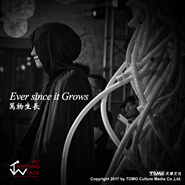

萬物生長Ever since it Grows
============================

|  |  |
| :--: | :-- |
| [ 萬物生長Ever since it Grows](https://emumo.xiami.com/album/2102813355) | **艺人**: [TOMO乐团](../index.md) **语种**: 英语 **唱片公司**: 天摩文化 **发行时间**: 2017年08月02日 **专辑类别**: 现场专辑 **专辑风格**: 氛围流行 Ambient Pop **播放数**: 6868 **收藏数**: 10 **评论数**: 2  |

## 简介

  专辑英文名：Ever since it Grows 专辑中文名：万物生长 风格：Ambient  发行时间：2017.8.2 发行公司：天摩文化   作曲及改编：雨航 人声：Rachel 打击：孔剑 &amp; 金涛         专辑收录2首歌曲，由雨航亲自操刀为2017 Wedding Talk分享会的Opening序曲。       第一首《Ever since it Grows 万物生长》描述着信仰、生命延续、万物生长的力量，编曲充满宗教电子并贯穿空气感女声，为现场“生命树”赋予了“呼吸”。       第二首《El Condor Pasa 老鹰之歌》改编自达尼埃尔·阿洛米亚·罗布莱斯谱写的秘鲁民歌《If I Could (El Condor Pasa)》，浓郁的安第斯民族特色，融合爱尔兰舞曲元素，和奔放不羁的歌词也寓意着对生命的敬畏，和对自由梦想的向往。  

## 曲目

## 评论

|  |  |  |  |
| :-- | :-- | :-- | :-- |
|  [虾米用户](https://emumo.xiami.com/u/271315485) 我还没想好要写什么... 2018-07-07 06:26 赞(0) 踩(0) | 
喜欢曲目1《万物生长》，挺神秘感的电子氛围乐，强劲的鼓点和低音夹杂着西塔琴独有的东方特色，伴随着女声空灵的吟唱，稀稀落落的雨棍声，很有那种宗教仪式那种画面感。
 |
|  [虾米用户](https://emumo.xiami.com/u/37897107) 我是小熊 2017-08-15 03:17 赞(0) 踩(0) | 
难得听见这样的舒服的声音 听着感觉走路都带着风
 |
