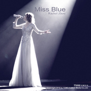

Miss BlueDeepBlue2018发布秀主题曲
============================

|  |  |
| :--: | :-- |
| [ Miss BlueDeepBlue2018发布秀主题曲](https://emumo.xiami.com/album/2104016281) | **艺人**: [TOMO乐团](../index.md) **语种**: 英语 **唱片公司**: 天摩文化 **发行时间**: 2018年09月12日 **专辑类别**: 现场专辑 **专辑风格**: 新世纪音乐 New Age **播放数**: 354 **收藏数**: 0 **评论数**: 0  |

## 简介

 深蓝DeepBlue品牌2018发布秀主题曲，歌剧式演唱融合致敬Engima经典走秀节奏，为品牌定义新的形象标签。

## 曲目

## 评论

|  |  |  |  |
| :-- | :-- | :-- | :-- |
