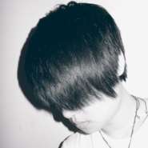

音乐猴子
============================

|  |  |
| :--: | :-- |
| [ 音乐猴子](https://i.xiami.com/musicmonkey) | **地区**: China 中国大陆 **风格**: 国语流行 Mandarin Pop, 流行说唱 Pop Rap, 放克电子 Electro (Electro-Funk), 欧美流行 Western Pop **播放数**: 4568128 **粉丝数**: 220 **评论数**: 46  |

## 档案

A Fairy Tale Creator  微博：@MusicMonKey

## 专辑

| 名称 | 语种 | 唱片公司 | 发行时间 | 专辑类别 | 专辑风格 |
| :--: | :-- | :-- | :-- | :-- | :-- |
| [ City of ...](./albums/2104637137.md) | 英语 |  | 2019年02月27日 | EP, 单曲 | 欧美流行 Western Pop |
| [ 浪费](./albums/2103543907.md) | 国语 | 独立发行 | 2018年02月21日 | EP, 单曲 | 国语流行 Mandarin Pop |
| [ Can't Feel My Face](./albums/2100283068.md) | 英语 | 独立发行 | 2016年02月29日 | EP, 单曲 | 电音流行 Electropop |
| [ 异 · Collection](./albums/2100248782.md) | 国语 | 独立发行 | 2015年12月20日 | EP, 单曲 | 文雅流行 Sophisti Pop, 国语流行 Mandarin Pop |
| [ 再见，喀秋莎（Remix）战争不再来](./albums/2100222042.md) | 俄语 | 独立发行 | 2015年10月18日 | EP, 单曲 | 独立电子乐 Indietronica, 电音流行 Electropop |
| [ 独·Collection](./albums/433653846.md) | 国语 | 独立发行 | 2015年06月08日 | EP, 单曲 | 国语流行 Mandarin Pop |
| [ Love Never Felt So Good](./albums/320471411.md) | 英语 | 独立发行 | 2015年01月05日 | EP, 单曲 | 放克电子 Electro (Electro-Funk), 电子迪斯科 Electro-Disco |
| [ 赶紧抄（锦鲤抄）](./albums/820035747.md) | 国语 | 独立发行 | 2014年12月31日 | EP, 单曲 | 中国风 China-Wave |
| [ Viva La Vida生命万岁](./albums/1216311732.md) | 英语 | 音乐猴子 | 2014年11月19日 | EP, 单曲 | 欧美流行 Western Pop |
| [ 以父之名In the name of you](./albums/1514217180.md) | 国语 | 独立发行 | 2014年10月25日 | EP, 单曲 | 国语流行 Mandarin Pop |
| [ Just the way you are](./albums/1913707904.md) | 英语 | 独立发行 | 2014年10月19日 | EP, 单曲 | 欧美流行 Western Pop |

## 评论

|  |  |  |
| :-- | :-- | :-- |
|  [虾米用户](https://emumo.xiami.com/u/403350770)  2020-05-27 20:47 赞(0) 踩(0) | 
特别好听
 |
|  [虾米用户](https://emumo.xiami.com/u/304620892)  2020-04-16 10:19 赞(2) 踩(0) | 
刚过而立之年的猴子，还能看到封面那个带着哀伤，悲悯，不羁，洒脱的脸庞么？
 |
|  [虾米用户](https://emumo.xiami.com/u/357328576)  2019-11-19 19:04 赞(0) 踩(0) | 
好听
 |
|  [虾米用户](https://emumo.xiami.com/u/339346700)   2019-10-09 11:38 赞(0) 踩(0) | 
好听
 |
|  [虾米用户](https://emumo.xiami.com/u/34756608) 无 2017-05-20 18:11 赞(0) 踩(0) | 
猴子要火了，(๑&amp;bull;㉨&amp;bull;๑)加油猴子
 |
|  [虾米用户](https://emumo.xiami.com/u/204452602) 取关前 请通知一下 这是... 2017-04-21 10:05 赞(0) 踩(0) | 
好听  好好听  声线超好
 |
|  [虾米用户](https://emumo.xiami.com/u/7241488) 和光同尘。 2017-03-14 12:49 赞(0) 踩(0) | 
有没有 呢
 |
| ⇒ |  [虾米用户](https://emumo.xiami.com/u/35565535) 嗯。 2017-04-16 15:51 赞(0) 踩(0) | 
有！很快就有
 |
| ⇒ |  [虾米用户](https://emumo.xiami.com/u/7241488) 和光同尘。 2017-04-18 23:29 赞(0) 踩(0) | 
<q><b>音乐猴子说：</b></q>
 |
|  [虾米用户](https://emumo.xiami.com/u/153959450)  2016-04-28 00:11 赞(0) 踩(0) | 
你注定要红！
 |
|  [虾米用户](https://emumo.xiami.com/u/22983079) 音乐是陪伴，是朋友。 2016-03-27 04:09 赞(0) 踩(0) | 
好听
 |
|  [虾米用户](https://emumo.xiami.com/u/100087444)  2016-01-25 00:02 赞(0) 踩(0) | 
加油 
 |
|  [虾米用户](https://emumo.xiami.com/u/50313423)  2016-01-15 23:45 赞(0) 踩(0) | 
棒！
 |
|  [虾米用户](https://emumo.xiami.com/u/49820256)  2016-01-11 19:06 赞(0) 踩(0) | 
听了小师傅唱得一次就好大冷天里被暖到了就突发奇想来搜搜看鬼使神差听了猴子的版本又鬼使神差听了其他的歌，是运气好
 |
| ⇒ |  [虾米用户](https://emumo.xiami.com/u/35565535) 嗯。 2016-01-11 23:41 赞(0) 踩(0) | 
手气不错哦 ：-P
 |
|  [虾米用户](https://emumo.xiami.com/u/53010689)  2016-01-10 14:26 赞(0) 踩(0) | 
2016年我又听到了新的歌，好开心 
 |
|  [虾米用户](https://emumo.xiami.com/u/7241488) 和光同尘。 2016-01-02 14:03 赞(0) 踩(0) | 
加油。
 |
|  [虾米用户](https://emumo.xiami.com/u/11845778) 123 2015-12-30 23:50 赞(0) 踩(0) | 
好棒啊！听了让人心情特别好！
 |
|  [虾米用户](https://emumo.xiami.com/u/48816680)  2015-12-08 21:39 赞(0) 踩(0) | 
还以为你唱摇滚呢，原来是这一派的
 |
|  [虾米用户](https://emumo.xiami.com/u/69218286)  2015-11-17 09:07 赞(0) 踩(0) | 
好听
 |
|  [虾米用户](https://emumo.xiami.com/u/8664059) 开着花 唱着歌。 2015-10-08 21:35 赞(0) 踩(0) | 
这是你唱的？
 |
| ⇒ |  [虾米用户](https://emumo.xiami.com/u/35565535) 嗯。 2015-10-09 21:11 赞(0) 踩(0) | 
嗯哼，是的！
 |
| ⇒ |  [虾米用户](https://emumo.xiami.com/u/8664059) 开着花 唱着歌。 2015-10-09 23:06 赞(0) 踩(0) | 
<q><b>音乐猴子说：</b></q>
 |
| ⇒ |  [虾米用户](https://emumo.xiami.com/u/35565535) 嗯。 2015-10-09 23:25 赞(0) 踩(0) | 
<q><b>老C说：</b></q>
 |
|  [虾米用户](https://emumo.xiami.com/u/14424587)  2015-07-12 00:19 赞(0) 踩(0) | 
我来啊我来啊
 |
| ⇒ |  [虾米用户](https://emumo.xiami.com/u/35565535) 嗯。 2015-09-09 23:37 赞(0) 踩(0) | 
来来来，喝完了这杯再说吧~
 |
|  [虾米用户](https://emumo.xiami.com/u/7205091) 胡同串子 2015-06-22 19:03 赞(0) 踩(0) | 
一首一首的听下来，才发现又找到个好嗓子-喜欢这种把唱歌当成业余爱好，又好认真的孩纸
 |
| ⇒ |  [虾米用户](https://emumo.xiami.com/u/35565535) 嗯。 2015-09-09 23:36 赞(0) 踩(0) | 
被表扬了呢！嘿嘿~
 |
|  [虾米用户](https://emumo.xiami.com/u/49610781) 那天我明白了一件事情。最... 2015-06-08 12:36 赞(0) 踩(0) | 
咋粉你来着 找半天没找到。。。
 |
| ⇒ |  [虾米用户](https://emumo.xiami.com/u/35565535) 嗯。 2015-06-08 19:42 赞(0) 踩(0) | 
粉，无需说出来，只消放在心头就好。来，罗施主，请点击为你准备好的解惑链接： <a href="http://zhidao.baidu.com/question/370648963.html?qbl=relate_question_1&amp;amp;word=%CF%BA%C3%D7%B9%D8%D7%A2" target="_blank" rel="nofollow noreferrer noopener">http://zhidao.baidu.com/question/370648963.html?qbl=relate_question_1&amp;amp;word=%CF%BA%C3%D7%B9%D8%D7%A2</a>
 |
|  [虾米用户](https://emumo.xiami.com/u/1494002)  2014-12-20 22:42 赞(0) 踩(0) | 
一般。别组乐队了。
 |
|  [虾米用户](https://emumo.xiami.com/u/3290953)  2014-12-01 20:53 赞(0) 踩(0) | 
猴子加油～～！  joey
 |
|  [虾米用户](https://emumo.xiami.com/u/81822)  2014-11-23 14:44 赞(0) 踩(0) | 
加油！！！
 |
|  [虾米用户](https://emumo.xiami.com/u/40839714)   2014-11-18 15:31 赞(0) 踩(0) | 
加油
 |
|  [虾米用户](https://emumo.xiami.com/u/9302007)  2014-08-29 13:01 赞(0) 踩(0) | 
啊，猴子窝是尼的脑残粉呀【捧读...】还没听完，不过过来支持下~
 |
|  [虾米用户](https://emumo.xiami.com/u/39284867)  2014-07-23 23:53 赞(0) 踩(0) | 
你准备组的乐队呢（抠鼻
 |
|  [虾米用户](https://emumo.xiami.com/u/38716213)  2014-07-05 08:25 赞(0) 踩(0) | 
喜欢～
 |
|  [虾米用户](https://emumo.xiami.com/u/569175)  2014-06-30 10:36 赞(0) 踩(0) | 
赞~好听~~
 |
|  [虾米用户](https://emumo.xiami.com/u/14115618)  2014-06-19 18:25 赞(0) 踩(0) | 
坐等好料～
 |
|  [虾米用户](https://emumo.xiami.com/u/11251065)  2014-06-18 20:41 赞(0) 踩(0) | 
头像…
 |
|  [虾米用户](https://emumo.xiami.com/u/35798708)  2014-06-17 18:32 赞(0) 踩(0) | 
啥子都还不得哟 姐
 |
|  [虾米用户](https://emumo.xiami.com/u/3189380)  2014-06-17 15:50 赞(0) 踩(0) | 
什么都没有啊！骗纸！
 |
|  [虾米用户](https://emumo.xiami.com/u/35565535) 嗯。 2014-06-17 06:50 赞(14) 踩(0) | 
我刚入驻了虾米音乐人，欢迎大家来我的个人主页，收听我的最新音乐
 |
| ⇒ |  [虾米用户](https://emumo.xiami.com/u/7664422)  2014-06-17 09:31 赞(0) 踩(0) | 
呵呵
 |
| ⇒ |  [虾米用户](https://emumo.xiami.com/u/7664422)  2014-06-17 09:32 赞(0) 踩(0) | 
猜我是谁
 |
| ⇒ |  [虾米用户](https://emumo.xiami.com/u/251473127) hi.您好啊。 2018-01-03 01:21 赞(0) 踩(0) | 
好听。特别是以父之名～
 |
