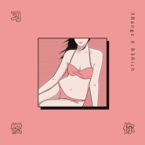

习惯你
============================

|  |  |
| :--: | :-- |
| [ 习惯你](https://emumo.xiami.com/album/2103527432) | **艺人**: [未来星B3Rich](../index.md) **语种**: 国语 **唱片公司**: 虾米音乐人 **发行时间**: 2018年02月13日 **专辑类别**: EP, 单曲 **专辑风格**: 流行说唱 Pop Rap, 电子 Electronic **播放数**: 3413510 **收藏数**: 171 **评论数**: 21  |

## 简介

寻光计划II 未曝光少年  
全新音乐作品  
首次正式发声  
每周二准时曝光  
  
“我不会爱你一辈子，但我们可以重复倒带”  
未来星B3Rich x 3Bangz 携手为你带来2018年专属你的情人节单曲 《习惯你》

## 曲目

## 评论

|  |  |  |  |
| :-- | :-- | :-- | :-- |
|  [虾米用户](https://emumo.xiami.com/u/423789081)  2019-05-13 06:26 赞(1) 踩(0) | 
哈哈这首歌让3bangz唱的太有喜感了
 |
|  [虾米用户](https://emumo.xiami.com/u/80630098) Social medla... 2018-09-02 00:15 赞(2) 踩(0) | 
棒子告訴我你為什麼刪除我好友了
 |
|  [虾米用户](https://emumo.xiami.com/u/40775508) 我还没想好要写什么... 2018-03-14 20:48 赞(4) 踩(0) | 
觉得风格和最近的歌都很像耶~
 |
|  [虾米用户](https://emumo.xiami.com/u/353414176) 蒋林心 2018-03-06 07:06 赞(3) 踩(0) | 
难听
 |
|  [虾米用户](https://emumo.xiami.com/u/9464517) 我还没想好要写什么... 2018-02-15 16:13 赞(1) 踩(0) | 
～
 |
|  [虾米用户](https://emumo.xiami.com/u/350291640)  2018-02-14 16:14 赞(1) 踩(0) | 
 
 |
|  [虾米用户](https://emumo.xiami.com/u/9976686) 我还没想好要写什么... 2018-02-14 01:00 赞(1) 踩(0) | 
10号见
 |
|  [虾米用户](https://emumo.xiami.com/u/43418234) ^_−☆ 2018-02-14 00:42 赞(1) 踩(0) | 

 |
|  [虾米用户](https://emumo.xiami.com/u/349391342)   2018-02-13 23:19 赞(1) 踩(0) | 

 |
|  [虾米用户](https://emumo.xiami.com/u/30778944) if i can be 2018-02-13 22:15 赞(1) 踩(0) | 
旋律好听
 |
|  [虾米用户](https://emumo.xiami.com/u/334010240) ppo 2018-02-13 19:33 赞(1) 踩(0) | 
：）
 |
|  [虾米用户](https://emumo.xiami.com/u/295146899)  2018-02-13 12:21 赞(1) 踩(0) | 
喜欢
 |
|  [虾米用户](https://emumo.xiami.com/u/40208599) 我很聪明什么也没留下 2018-02-13 08:48 赞(2) 踩(0) | 
|
 |
|  [虾米用户](https://emumo.xiami.com/u/345516751) 我还没想好要写什么... 2018-02-13 02:45 赞(2) 踩(0) | 
第五名
 |
|  [虾米用户](https://emumo.xiami.com/u/248450) 穿过谎言去拥抱你。 2018-02-13 00:30 赞(3) 踩(0) | 
第四个
 |
|  [虾米用户](https://emumo.xiami.com/u/57160786)   2018-02-13 00:09 赞(2) 踩(0) | 

 |
|  [虾米用户](https://emumo.xiami.com/u/42800196) - 2018-02-13 00:00 赞(2) 踩(0) | 
！
 |
|  [虾米用户](https://emumo.xiami.com/u/23862178) ฅ۶•ﻌ•♡ 2018-02-13 00:00 赞(2) 踩(0) | 

 |
