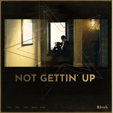

今天不起床
============================

|  |  |
| :--: | :-- |
| [ 今天不起床](https://emumo.xiami.com/album/2104761445) | **艺人**: [未来星B3Rich](../index.md) **语种**: 国语 **唱片公司**: 虾米音乐人 **发行时间**: 2019年04月11日 **专辑类别**: EP, 单曲 **专辑风格**: 国语流行 Mandarin Pop **播放数**: 502792 **收藏数**: 364 **评论数**: 104  |

## 简介

<strong>喜剧说唱回来啦！</strong>  
  
<strong>抛下干大事的念头，先别讨论梦想成真</strong><strong> </strong>  
<strong>就是要随性嘻哈，挥霍人生</strong>  
<strong>今天不起床，明天还是可以换上新装炸翻全场！</strong>  
  
<strong>虾米音乐「寻光计划」第二季前十强独立音乐人</strong>  
  
  
  
「对生活充满迷茫，谁不是呢」  
  
对于未来星来说，Party之后紧接着的下一个Afterparty，牵引着每周七天24小时不停歇的派对生活。如果清醒意味着如影随形的迷茫，那么酒精的代谢会击退自我认知的不确定感。  
和大多数年轻人一样，当他对追随主流文化的自己感到厌倦，转身之后成为亚文化的追随者，这样会酷一些吗？或许，唯一不会感到迷茫的事情就是自己会一直迷茫下去的这个事实吧。  
  
至于今天几点起床这个问题，还是留到明天再想吧。  
  
  
  
<strong><u>专辑曲目</u></strong>  
  
<strong>1. </strong><strong>泰诺</strong>  
  
作词：未来星B3Rich  
作曲：未来星B3Rich  
制作人：JC-Note  
  
  
<strong>2.</strong><strong>空气刘海</strong>  
  
作词：未来星B3Rich  
作曲：未来星B3Rich  
制作人：JC-Note  
  
  
<strong>3.</strong> <strong>龟兔赛跑</strong>  
  
作词：未来星B3Rich  
作曲：未来星B3Rich  
制作人：JC-Note  
  
  
<strong>4. </strong><strong>今天不起床</strong>  
  
作词：未来星B3Rich  
作曲：未来星B3Rich  
制作人：1229.  
  
  
<strong>5. </strong><strong>Gucci</strong>  
  
作词：未来星B3Rich  
作曲：未来星B3Rich  
制作人：Deffie  
  
  
  
<strong>工作人员名单</strong>  
  
总企划：虾米音乐寻光计划/未来星B3Rich  
发行时间：2019.3.29  
唱片编号：XA-035  
总统筹：虾米音乐人团队  
P&amp;C：虾米音乐 www.xiami.com  
  
制作人：Deffie/1229./JC-Note  
混音及母带工程：Deffie/xxxRonan/YoungCaptain  
文案 ：未来星B3Rich/萧遥  
平面设计：Annsey 赵宏韬  
实体发行：星外星音乐  
海外数位发行：风潮音乐  
总出品：北京阿里巴巴音乐科技有限公司  
  
  
  
<strong>关于寻光计划</strong>  
他们在跟风，你在亲手制造未来。「寻光计划」是虾米音乐对平台内独立音乐人的全面扶持计划，旨通过互联网用户的喜好选择、专家媒体敏锐的嗅觉，挖掘出所有尚未掘起的年轻新锐之声，以各种方式帮助他们发出耀眼光芒。  
  
第二季寻光计划主题为「寻找未曝光少年」，意想让真正代表独立音乐之未来的音乐人被更多对的人听到，让未现之光得以有释放无畏的能量。无论他们现在身在何方，在过着怎样的人生。或许他们现在并不完美，但Leonard Cohen说过：「万物皆有缝隙，那是光照进来的地方。」  
  
最终胜出的SHAWEE、邹施如、方拾贰、KWORLD、GALI、何小河、WAV乐队、SARAH、未来星B3Rich、阿图什冲浪男孩等10位音乐人，会在2018年的4月起陆续发布正式的首张原创个人专辑，并全球同步数位发行。  
 

## 曲目

## 评论

|  |  |  |
| :-- | :-- | :-- |
|  [虾米用户](https://emumo.xiami.com/u/442272766)  2021-01-09 09:48 赞(0) 踩(0) | 
发现宝藏了
 |
|  [虾米用户](https://emumo.xiami.com/u/311754581) 耳朵里是别人的歌，脑子里... 2020-08-12 00:43 赞(0) 踩(0) | 
这张真的！！！
 |
|  [虾米用户](https://emumo.xiami.com/u/346837854) 拥有今天就好啦 2020-06-17 19:05 赞(0) 踩(0) | 
整张专辑都很nice。很耐听。对比以前的泰诺听得出来进步很大，开始有自己的腔调了。加油兄弟，可以的。
 |
|  [虾米用户](https://emumo.xiami.com/u/50058210)  2019-12-30 12:12 赞(1) 踩(0) | 
豆瓣都没这张专辑
 |
|  [虾米用户](https://emumo.xiami.com/u/214244502) 虽然我跑得很快 可有时候... 2019-10-12 21:06 赞(1) 踩(0) | 
我不管我爱死阿星的歌！
 |
|  [虾米用户](https://emumo.xiami.com/u/288796243)  2019-09-26 23:23 赞(0) 踩(0) | 
我喜欢你们的歌
 |
|  [虾米用户](https://emumo.xiami.com/u/190983675) 我还没想好要写什么... 2019-07-24 00:12 赞(0) 踩(0) | 
喜欢
 |
|  [虾米用户](https://emumo.xiami.com/u/325254288) 无求 2019-07-07 21:13 赞(0) 踩(0) | 
感觉很不错
 |
|  [虾米用户](https://emumo.xiami.com/u/39674250) 7 2019-06-15 09:37 赞(0) 踩(0) | 
浪漫主义大
 |
|  [虾米用户](https://emumo.xiami.com/u/43931062) hell yeah 2019-06-09 01:25 赞(0) 踩(0) | 
星星进步不错更高产一点就好了
 |
|  [虾米用户](https://emumo.xiami.com/u/1774976)  2019-05-24 12:01 赞(0) 踩(0) | 
喜欢喜剧说唱的可以听听，未来星还是蛮有才的
 |
|  [虾米用户](https://emumo.xiami.com/u/421828262)  2019-05-14 10:59 赞(0) 踩(0) | 
嗯，独特氛围思域改装滴设计。满意就好！
 |
|  [虾米用户](https://emumo.xiami.com/u/20842281)  2019-05-05 18:47 赞(0) 踩(0) | 
有写出年轻人的心境，还不够深刻
 |
|  [虾米用户](https://emumo.xiami.com/u/377939135)  2019-05-02 09:20 赞(0) 踩(0) | 
蛮有态度，不错！
 |
|  [虾米用户](https://emumo.xiami.com/u/380249) 没煮过苍蝇的汤我不喝 2019-04-29 22:55 赞(0) 踩(0) | 
是近年来听的比较顺耳的说唱了
 |
|  [虾米用户](https://emumo.xiami.com/u/146032780) 人贵有自知之明…… 2019-04-23 21:35 赞(0) 踩(0) | 
很好听！
 |
|  [虾米用户](https://emumo.xiami.com/u/423657882) 从月球背面偷看你 2019-04-23 13:38 赞(0) 踩(0) | 
喜欢温柔的阿星!!
 |
|  [虾米用户](https://emumo.xiami.com/u/361305041) 我的快乐完全来自对于未来... 2019-04-22 20:46 赞(0) 踩(0) | 
好听。
 |
|  [虾米用户](https://emumo.xiami.com/u/166535344)   2019-04-21 12:10 赞(0) 踩(0) | 
nice
 |
|  [虾米用户](https://emumo.xiami.com/u/344318496)  2019-04-16 17:15 赞(0) 踩(0) | 
好听
 |
|  [虾米用户](https://emumo.xiami.com/u/423146584)  2019-04-15 23:44 赞(0) 踩(0) | 
台好听了星星
 |
|  [虾米用户](https://emumo.xiami.com/u/148370628)  2019-04-14 19:27 赞(0) 踩(0) | 
蛮好听的
 |
|  [虾米用户](https://emumo.xiami.com/u/403573015) 白日冬申白日月 2019-04-14 14:36 赞(0) 踩(0) | 
真厚
 |
|  [虾米用户](https://emumo.xiami.com/u/408764101)  2019-04-14 13:52 赞(0) 踩(0) | 
nice
 |
|  [虾米用户](https://emumo.xiami.com/u/411400592)  2019-04-14 13:18 赞(0) 踩(0) | 
重新编曲，赞赞赞
 |
|  [虾米用户](https://emumo.xiami.com/u/50327946) 我还没想好要写什么... 2019-04-14 10:59 赞(0) 踩(0) | 
听了这张专辑 立刻飞向三年前 Vroom Vroom!
 |
|  [虾米用户](https://emumo.xiami.com/u/203794404) 去疯去爱去相信 2019-04-14 09:23 赞(0) 踩(0) | 
大爱
 |
|  [虾米用户](https://emumo.xiami.com/u/345947053)  2019-04-14 01:41 赞(0) 踩(0) | 
还行
 |
|  [虾米用户](https://emumo.xiami.com/u/325144671)  2019-04-13 22:42 赞(0) 踩(0) | 
感觉和以前的风格有不同 总之感受到你对音乐的探索和热爱 加油加油加油
 |
|  [虾米用户](https://emumo.xiami.com/u/356354796)  2019-04-13 21:22 赞(0) 踩(0) | 
未来星可以啊！！！！
 |
|  [虾米用户](https://emumo.xiami.com/u/360900239) 我还没想好要写什么... 2019-04-13 18:48 赞(0) 踩(0) | 

 |
|  [虾米用户](https://emumo.xiami.com/u/147291266) 饱暖思淫欲 2019-04-13 13:36 赞(0) 踩(0) | 
一点开就被背景音乐吸引，人声也是越听越有感觉，有点小随性有点小炫耀，今天不上班，今天不上学反正不起早
 |
|  [虾米用户](https://emumo.xiami.com/u/17230228) u r nowhere 2019-04-13 01:17 赞(0) 踩(0) | 
还挺好听哒
 |
|  [虾米用户](https://emumo.xiami.com/u/7367872)  2019-04-13 00:59 赞(0) 踩(0) | 
鼓励性分数，实际感觉可能最多7-8分的样子。
 |
|  [虾米用户](https://emumo.xiami.com/u/264773500) 晚上一起去海边 2019-04-13 00:14 赞(0) 踩(0) | 
get it
 |
|  [虾米用户](https://emumo.xiami.com/u/269572392)  2019-04-12 20:32 赞(0) 踩(0) | 
好听
 |
|  [虾米用户](https://emumo.xiami.com/u/189945925) 勤勉 好学 上进 2019-04-12 15:54 赞(0) 踩(0) | 
在每一个漫无目的的下午都适合的专辑，在之后再努力吧
 |
|  [虾米用户](https://emumo.xiami.com/u/364775131) 我还没想好要写什么... 2019-04-12 10:25 赞(0) 踩(0) | 
我爱这张专！我爱泰诺！
 |
|  [虾米用户](https://emumo.xiami.com/u/39817526)   2019-04-12 10:11 赞(0) 踩(0) | 
点开就能获得放松的一张ep，只想躺着，懒的打字了
 |
|  [虾米用户](https://emumo.xiami.com/u/405301814)  2019-04-12 08:18 赞(0) 踩(0) | 
阿星   就是这么有态度  随性 帅气
 |
|  [虾米用户](https://emumo.xiami.com/u/260164999)  2019-04-12 07:48 赞(0) 踩(0) | 
ppppppppppppppppplpplilllooooumllkk,yhoool
 |
|  [虾米用户](https://emumo.xiami.com/u/334011216)  2019-04-12 06:46 赞(0) 踩(0) | 
  
 |
|  [虾米用户](https://emumo.xiami.com/u/139162430)   2019-04-12 03:45 赞(0) 踩(0) | 
qq
 |
|  [虾米用户](https://emumo.xiami.com/u/339375913) 3Bangz抗抑郁 2019-04-12 00:11 赞(1) 踩(0) | 
我简直太喜欢 空气刘海还有泰诺
 |
|  [虾米用户](https://emumo.xiami.com/u/423137545)  2019-04-11 23:37 赞(0) 踩(0) | 
牛逼
 |
|  [虾米用户](https://emumo.xiami.com/u/423137545)  2019-04-11 23:10 赞(2) 踩(0) | 
阿星最棒 
 |
|  [虾米用户](https://emumo.xiami.com/u/376366558) 我还没想好要写什么... 2019-04-11 23:04 赞(1) 踩(0) | 
很深情的阿星
 |
|  [虾米用户](https://emumo.xiami.com/u/400951849)  2019-04-11 22:28 赞(1) 踩(0) | 
6川
 |
|  [虾米用户](https://emumo.xiami.com/u/334011216)  2019-04-11 21:00 赞(0) 踩(0) | 
有才华的！棒棒哒
 |
|  [虾米用户](https://emumo.xiami.com/u/356962079)  2019-04-11 19:14 赞(3) 踩(0) | 
今天不起床？我都没在睡觉 
 |
|  [虾米用户](https://emumo.xiami.com/u/4771536) I like the v... 2019-04-11 18:57 赞(2) 踩(0) | 
我说虾米，你这个条新闻的悬浮窗口跳出来，我吓了一跳。还以为是uc头条，或者今日头条那种“震惊”类新闻。不是认真看了寻光计划几个字，我可能都不会点进来。
 |
| ⇒ |  [虾米用户](https://emumo.xiami.com/u/420681461) 像鱼 2019-04-11 22:16 赞(0) 踩(0) | 
米兔 米兔
 |
| ⇒ |  [虾米用户](https://emumo.xiami.com/u/4771536) I like the v... 2019-04-11 23:08 赞(0) 踩(0) | 
<q><b> 一坨说：</b></q>
 |
| ⇒ |  [虾米用户](https://emumo.xiami.com/u/420681461) 像鱼 2019-04-11 23:09 赞(0) 踩(0) | 
<q><b>summerererer说：</b></q>
 |
| ⇒ |  [虾米用户](https://emumo.xiami.com/u/11227384) 这个仙儿很懒，啥也没留下... 2019-04-11 23:37 赞(0) 踩(0) | 
改什么改 虾米音乐属于阿里音乐 阿里音乐属于阿里巴巴大文娱 大文娱的主要业务就是uc  孙子长得像爷爷不很正常吗
 |
| ⇒ |  [虾米用户](https://emumo.xiami.com/u/4771536) I like the v... 2019-04-12 12:19 赞(0) 踩(0) | 
<q><b>黄林说：</b></q>
 |
| ⇒ |  [虾米用户](https://emumo.xiami.com/u/11227384) 这个仙儿很懒，啥也没留下... 2019-04-12 13:17 赞(0) 踩(0) | 
<q><b>summerererer说：</b></q>
 |
|  [虾米用户](https://emumo.xiami.com/u/23597109) 你想要的人在远方,能遇见... 2019-04-11 18:53 赞(8) 踩(0) | 
哈哈哈，我也来支持一下吧。
 |
|  [虾米用户](https://emumo.xiami.com/u/338925324) 我还没想好要写什么... 2019-04-11 18:48 赞(3) 踩(0) | 
我来啦
 |
|  [虾米用户](https://emumo.xiami.com/u/208414221) 天团 2019-04-11 18:44 赞(0) 踩(0) | 
我将永远爱他！！
 |
|  [虾米用户](https://emumo.xiami.com/u/409697524) 我还没想好要写什么... 2019-04-11 18:39 赞(0) 踩(0) | 
阿星真的诗人
 |
|  [虾米用户](https://emumo.xiami.com/u/329132255) 事在人为 2019-04-11 18:37 赞(1) 踩(0) | 
路过
 |
|  [虾米用户](https://emumo.xiami.com/u/50643996)  2019-04-11 18:35 赞(2) 踩(0) | 
难道没有人认识这张专辑的制作人JC-Note吗？
 |
| ⇒ |  [虾米用户](https://emumo.xiami.com/u/114458052) 吞下无意义想法 2019-04-11 19:38 赞(0) 踩(0) | 
jc note是真的强！
 |
| ⇒ |  [虾米用户](https://emumo.xiami.com/u/50643996)  2019-04-13 12:54 赞(0) 踩(0) | 
<q><b>Beano说：</b></q>
 |
|  [虾米用户](https://emumo.xiami.com/u/206291885) 加哪个？ 2019-04-11 16:50 赞(1) 踩(0) | 
没有好兄弟三棒子有点遗憾。虽然感觉没有原来的抓耳，但是全部自己作曲作词，真的有才啊！really good
 |
| ⇒ |  [虾米用户](https://emumo.xiami.com/u/341169745) 我还没想好要写什么... 2019-04-11 17:38 赞(0) 踩(0) | 
这不是几年前的歌吗 哈哈哈未来星还会作曲啊 他自己知道吗
 |
| ⇒ |  [虾米用户](https://emumo.xiami.com/u/206291885) 加哪个？ 2019-04-12 12:28 赞(0) 踩(0) | 
<q><b>senssil说：</b></q>
 |
| ⇒ |  [虾米用户](https://emumo.xiami.com/u/341169745) 我还没想好要写什么... 2019-04-12 21:18 赞(0) 踩(0) | 
<q><b>XXPKK说：</b></q>
 |
|  [虾米用户](https://emumo.xiami.com/u/348263711)  2019-04-11 16:49 赞(1) 踩(0) | 
为阿星下载虾米
 |
|  [虾米用户](https://emumo.xiami.com/u/333695463)  2019-04-11 16:38 赞(1) 踩(0) | 
未来星：我就是未来星，你学不来的
 |
|  [虾米用户](https://emumo.xiami.com/u/304795581) 杨卓凡的宇宙无敌表姐 2019-04-11 16:07 赞(0) 踩(0) | 
未来星儿哥哥太棒了
 |
| ⇒ |  [虾米用户](https://emumo.xiami.com/u/355562564)  2019-04-11 18:09 赞(0) 踩(0) | 
。。，，，，一，，，踞
 |
|  [虾米用户](https://emumo.xiami.com/u/33941879) 别再说自己是单身狗了，你... 2019-04-11 14:48 赞(0) 踩(0) | 
路过
 |
|  [虾米用户](https://emumo.xiami.com/u/47047164) Niceee bae 2019-04-11 14:34 赞(2) 踩(0) | 

 |
|  [虾米用户](https://emumo.xiami.com/u/37449409) 我还没想好要写什么... 2019-04-11 13:41 赞(0) 踩(0) | 
头发像anti的rihanna
 |
|  [虾米用户](https://emumo.xiami.com/u/48658719) 风吹散，说晚安，不再见。 2019-04-11 11:41 赞(3) 踩(0) | 
很有尝试性的一张专辑，说唱的节奏很好听，编曲很灵活有创意！有时下流行的元素，也有新鲜的尝试！
 |
| ⇒ |  [虾米用户](https://emumo.xiami.com/u/341169745) 我还没想好要写什么... 2019-04-11 17:39 赞(0) 踩(0) | 
几年前的歌了加了点鼓点做了个好点的后期咋就新鲜尝试了
 |
|  [虾米用户](https://emumo.xiami.com/u/335734704)  2019-04-11 08:45 赞(2) 踩(0) | 
早上八点三刻，听的想喝一杯了，有一起的吗，哈哈哈哈！   
 |
|  [虾米用户](https://emumo.xiami.com/u/4795452) 黑色玻璃里有你想要的样子 2019-04-11 08:42 赞(17) 踩(0) | 
刚毕业的时候，总在加班完回家的地铁吹着冷风听泰诺和龟兔赛跑，几年过去了，重新编曲的歌不一样，参加过新说唱和奇葩说回来的未来星不一样，重复获得失去的我不一样，这张专辑像星期日的下午，明明可以发呆，心里又觉得紧迫。 其实是完全可以放空大脑休息的啊～
 |
|  [虾米用户](https://emumo.xiami.com/u/379617738)  2019-04-11 08:35 赞(0) 踩(0) | 
真好
 |
|  [虾米用户](https://emumo.xiami.com/u/92686490) 蝦米 我愛你 2019-04-11 08:35 赞(0) 踩(0) | 
up
 |
|  [虾米用户](https://emumo.xiami.com/u/380024255) 自己听 2019-04-11 08:24 赞(1) 踩(0) | 
我來啦！
 |
|  [虾米用户](https://emumo.xiami.com/u/11139345) 我还没想好要写什么... 2019-04-11 07:34 赞(0) 踩(0) | 
有点意思
 |
|  [虾米用户](https://emumo.xiami.com/u/32287887) keep calm an... 2019-04-11 07:30 赞(1) 踩(0) | 
未来星鸽鸽流批
 |
|  [虾米用户](https://emumo.xiami.com/u/11227384) 这个仙儿很懒，啥也没留下... 2019-04-11 07:27 赞(43) 踩(0) | 
唉，因为我的原创作品版权备案一直没下来导致失去了参赛资格，很丧差点就晋级了，下一季要等到猴年马月，希望在我没出道之前，这条评论就当作我遗憾的回忆吧！
 |
| ⇒ |  [虾米用户](https://emumo.xiami.com/u/268491984) Warm sun on ... 2019-04-11 08:51 赞(0) 踩(0) | 
加油！
 |
| ⇒ |  [虾米用户](https://emumo.xiami.com/u/412635879) 歌单达人 2019-04-11 21:43 赞(0) 踩(0) | 
加油 小哥哥
 |
| ⇒ |  [虾米用户](https://emumo.xiami.com/u/304901766) 不如意事常八九，可与言者... 2019-04-11 21:43 赞(0) 踩(0) | 
加油 支持你！
 |
| ⇒ |  [虾米用户](https://emumo.xiami.com/u/411854310) (⊙o⊙)… 2019-04-11 21:44 赞(0) 踩(0) | 
薛之谦也是一步一步才火的 加油哦
 |
| ⇒ |  [虾米用户](https://emumo.xiami.com/u/326840862) 平沙落雁 2019-04-13 08:32 赞(0) 踩(0) | 
加油
 |
| ⇒ |  [虾米用户](https://emumo.xiami.com/u/130782868)  2019-04-13 14:28 赞(0) 踩(0) | 
加油！！坚持自己喜欢的东西，加油呀！等着你出道
 |
|  [虾米用户](https://emumo.xiami.com/u/33583676)  2019-04-11 06:35 赞(0) 踩(0) | 
  
 |
|  [虾米用户](https://emumo.xiami.com/u/314919510) LOVE MUSIC a... 2019-04-11 05:50 赞(1) 踩(0) | 
Still love ya
 |
|  [虾米用户](https://emumo.xiami.com/u/351269419) 爬开 2019-04-11 05:21 赞(0) 踩(0) | 

 |
|  [虾米用户](https://emumo.xiami.com/u/269572392)  2019-04-11 02:29 赞(1) 踩(0) | 
前排
 |
|  [虾米用户](https://emumo.xiami.com/u/204148881) 走花路吧！！！ 2019-04-11 00:49 赞(4) 踩(0) | 
第一首一开口就果断收藏专辑啦！
 |
|  [虾米用户](https://emumo.xiami.com/u/221751319)  2019-04-11 00:23 赞(2) 踩(0) | 
Leonard Cohen说：万物皆有缝隙，那是光照进来的地方。
 |
|  [虾米用户](https://emumo.xiami.com/u/358323085) 我还没想好要写什么... 2019-04-11 00:22 赞(1) 踩(0) | 
哈哈哈哈老歌新发你今天不起床！
 |
|  [虾米用户](https://emumo.xiami.com/u/44743196) 珍重！再见！ 2019-04-11 00:10 赞(1) 踩(0) | 
从奇葩说认识你
 |
|  [虾米用户](https://emumo.xiami.com/u/39809018) 这是顽童你知道的 2019-04-11 00:02 赞(0) 踩(0) | 
啊哈哈哈哈哈哈前排！
 |
|  [虾米用户](https://emumo.xiami.com/u/358794809)  2019-04-11 00:01 赞(0) 踩(0) | 
变成食人鱼把你吃掉
 |
|  [虾米用户](https://emumo.xiami.com/u/306602216) 寻找同类 2019-04-11 00:00 赞(0) 踩(0) | 
前排吃瓜
 |
|  [虾米用户](https://emumo.xiami.com/u/1154943) 嬲 2019-04-10 20:28 赞(0) 踩(0) | 
沙发
 |
