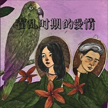

霍乱时期的爱情
============================

|  |  |
| :--: | :-- |
| [ 霍乱时期的爱情](https://emumo.xiami.com/album/2106030453) | **艺人**: [未来星B3Rich](../index.md) **语种**: 国语 **唱片公司**: 独立发行 **发行时间**: 不详 **专辑类别**: EP, 单曲 **专辑风格**: 嘻哈 Hip-Hop, 流行 Pop, 节奏布鲁斯 R&B **播放数**: 8063 **收藏数**: 6 **评论数**: 14  |

## 简介

这是霍乱时期的爱情  
被口罩束缚 不能出门 无法谋面  
但爱 依然有增无减  
即使不是通过嘴唇  
也会透过眼神 蔓延在空气中  
被微风带去11500公里左右  
直到你的身边  
情人节快乐  
  
Written by B3Rich in Shanghai/ Jiangmen/ Beijing  
2020/02/14

## 曲目

## 评论

|  |  |  |  |
| :-- | :-- | :-- | :-- |
|  [虾米用户](https://emumo.xiami.com/u/124692118) 我还没想好要写什么... 2021-01-21 07:55 赞(0) 踩(0) | 
仔仔，10分
 |
|  [虾米用户](https://emumo.xiami.com/u/64402358) keyi 2021-01-17 09:44 赞(1) 踩(0) | 
姐姐，10分
 |
|  [虾米用户](https://emumo.xiami.com/u/155349924)  2020-06-03 16:10 赞(0) 踩(0) | 
之前听过感觉不好听，今天偶尔听了一下，蛮好听的
 |
|  [虾米用户](https://emumo.xiami.com/u/425077727) LOVEYOU…… 2020-02-15 16:58 赞(0) 踩(0) | 
不错
 |
|  [虾米用户](https://emumo.xiami.com/u/31531934) 恋の道に近道はない 2020-02-14 12:55 赞(0) 踩(0) | 

 |
|  [虾米用户](https://emumo.xiami.com/u/260010277)  2020-02-14 12:31 赞(2) 踩(0) | 
未来星是不是恋爱了
 |
| ⇒ |  [虾米用户](https://emumo.xiami.com/u/64402358) keyi 2020-09-19 09:32 赞(0) 踩(0) | 
是的他的对象就是我（在开玩笑
 |
| ⇒ |  [虾米用户](https://emumo.xiami.com/u/124692118) 我还没想好要写什么... 2021-01-21 08:30 赞(0) 踩(0) | 
<q><b>看我头像啦说：</b></q>
 |
| ⇒ |  [虾米用户](https://emumo.xiami.com/u/64402358) keyi 2021-01-21 10:09 赞(0) 踩(0) | 
<q><b>Lark说：</b></q>
 |
| ⇒ |  [虾米用户](https://emumo.xiami.com/u/124692118) 我还没想好要写什么... 2021-01-21 15:15 赞(0) 踩(0) | 
<q><b>Lark说：</b></q>
 |
| ⇒ |  [虾米用户](https://emumo.xiami.com/u/64402358) keyi 2021-01-21 17:48 赞(0) 踩(0) | 
<q><b>Lark说：</b></q>
 |
|  [虾米用户](https://emumo.xiami.com/u/260010277)  2020-02-14 12:31 赞(0) 踩(0) | 
好听好听
 |
|  [虾米用户](https://emumo.xiami.com/u/309256043) 一起听歌吧… 2020-02-14 12:07 赞(0) 踩(0) | 

 |
|  [虾米用户](https://emumo.xiami.com/u/7661330) 一只爱上后摇的日摇狗 现... 2020-02-14 12:00 赞(0) 踩(0) | 
好听好听！
 |
