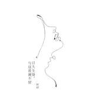
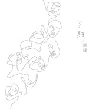
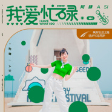
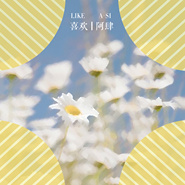
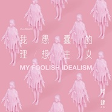
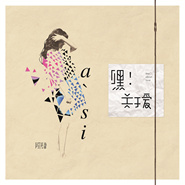

阿肆
============================

|  |  |
| :--: | :-- |
| [ 阿肆](https://i.xiami.com/asi) | **地区**: China 中国大陆 **风格**: 独立流行 Indie Pop, 独立民谣 Indie Folk **播放数**: 55322000 **粉丝数**: 60117 **评论数**: 1153  |

## 档案

小档案 
中   文   名：阿肆 
别        名：炸鸡少女、放肆的肆 
国        籍：中国 
民        族：汉族 
星        座：巨蟹座 
出   生   地：上海市 
出生日期：  1989  年  7  月  4  日 
职        业：歌手 
经纪公司：摩登天空 
艺人简介 
阿肆，原名放肆的肆，  1989  年  7  月  4  日出生于上海市，中国内地女歌手。代表作品有《我在人民广场吃炸鸡》、《有女朋友别忘了请我吃饭》等。 
演艺经历 
2010  年，阿肆以“放肆的肆”为名在豆瓣上注册音乐人并发布了多首歌曲；同年，阿肆还参与了各种校园音乐会巡演。 
2011  年，推出个人单曲《我在人民广场吃炸鸡》，并由此开始崭露头角；同年，获得“阿比鹿音乐奖”最佳民谣音乐人、创作奖提名，歌曲《我在人民广场吃炸鸡》则获得年度最佳民谣单曲提名。 
2012  年  9  月，阿肆签约摩登天空；同年，推出签约后的首支个人单曲《浮光掠影》，收录于《摩登天空  7  》合辑中。 
2013  年  7  月，推出个人单曲《我在人民广场吃炸鸡》的重新混音制作版本；同年  7  月，推出个人单曲《睡前故事》；  7  月  25  日，推出首张个人音乐专辑《预谋邂逅》，收录了包括《有女朋友别忘了请我吃饭》、《我在人民广场吃炸鸡》等在内的  10  首歌曲；  8  月  24  日，在北京愚公移山举办了专辑《预谋邂逅》的首唱会；  10  月  19  日，参加在北京后山艺术空间举办的“  2013  鸟幻音乐节”；同年，获得“第六届音乐风云榜新人盛典”最佳民谣歌手、“阿比鹿音乐奖”流行年度音乐人，专辑《预谋邂逅》获得年度专辑（流行），歌曲《  Itinerary   旅行计划》则获得年度单曲（流行）。 
2014  年，参加  CCTV-3  《中国好歌曲第二季》的比赛，盲选时以一首《别告诉妈妈我失恋啦》加入刘欢队；  3  月  22  日，助阵“东方风云榜   我也要来唱”卡拉  ok  比赛  3  月  31  日，凭借《我在人民广场吃炸鸡》获得“第  21  届东方风云榜颁奖盛典”十大金曲奖  5  月  5  日，推出个人  EP  专辑《  Remix Me  播放你的世界》，收录了《我为什么在人民广场吃炸鸡》及该歌曲的  8  个混音版本；  5  月  23  日，参加“新花怒放”全国巡演首站北京站。 
2015  年  4  月，在苏州、合肥、南京、上海举办“好肆初见”四城肆听会，这是阿肆出道以来的首次个人巡回演出；同年  7  月，推出个人单曲《嘿！关于爱》。 
2016  年  1  月，凭借歌曲《直到你降临》获得“第五届阿比鹿音乐奖”年度最受欢迎单曲奖（流行）。 
主要成就 
2016  第五届阿比鹿音乐奖年度单曲 
2014  第  21  届   东方风云榜颁奖盛典   十大金曲奖 
2013  “阿比鹿音乐奖”年度专辑（流行） 
2013  “阿比鹿音乐奖”年度单曲（流行） 
2013  音乐风云榜新人盛典最佳民谣歌手 
2013  豆瓣阿比鹿流行年度音乐人 
2011  阿比鹿音乐奖最佳民谣音乐人

## 专辑

| 名称 | 语种 | 唱片公司 | 发行时间 | 专辑类别 | 专辑风格 |
| :--: | :-- | :-- | :-- | :-- | :-- |
| [ 日久生情，与这波澜不惊](./albums/5022310926.md) | 国语 | 摩登天空 | 2021年01月05日 | EP, 单曲 | 城市民谣 Urban Folk, 国语流行 Mandarin Pop |
| [ 子期](./albums/5022231585.md) | 国语 | 摩登天空 | 2020年12月17日 | EP, 单曲 |  |
| [ 我爱忙碌](./albums/5020689776.md) | 国语 | 独立发行 | 2020年05月27日 | EP, 单曲 | 国语流行 Mandarin Pop |
| [ 偏爱](./albums/2105538797.md) | 国语 | 独立发行 | 2019年12月06日 | EP, 单曲 | 国语流行 Mandarin Pop |
| [ 关于爱](./albums/5020389074.md) | 其他 | 天娱传媒 | 2019年01月05日 | EP, 单曲 |  |
| [ 喜欢Like](./albums/2104423393.md) | 国语 | 摩登天空 | 2018年12月29日 | EP, 单曲 | 国语流行 Mandarin Pop, 华语唱作人 Chinese Singer-Songwriter |
| [ 即刻启程](./albums/2104135740.md) | 国语 | 摩登天空 | 2018年10月24日 | EP, 单曲 | 国语流行 Mandarin Pop |
| [ 仰世而来](./albums/2103922120.md) | 国语 | 独立发行 | 2018年08月14日 | EP, 单曲 | 独立流行 Indie Pop |
| [ 起床歌](./albums/2103710406.md) | 国语 | 摩登天空 | 2018年05月16日 | EP, 单曲 | 国语流行 Mandarin Pop |
| [ 洗头时哼的歌 等你来哼版Aussie洗发水广告曲](./albums/2103706718.md) | 国语 | 摩登天空 | 2018年05月12日 | EP, 单曲 |  |
| [ Call Me](./albums/2103486162.md) | 国语 | 摩登天空 | 2018年01月12日 | EP, 单曲 | 国语流行 Mandarin Pop |
| [ 喜欢](./albums/2103464202.md) | 国语 | 华宇世博, 摩登天空 | 2017年12月28日 | EP, 单曲 | 流行 Pop, 独立流行 Indie Pop |
| [ 世界上的另一个我](./albums/2102879037.md) | 国语 | 摩登天空 | 2017年10月24日 | EP, 单曲 | 独立流行 Indie Pop |
| [ 去你的撩妹即正义](./albums/2102720465.md) | 国语 | 摩登天空 | 2017年03月24日 | EP, 单曲 | 独立流行 Indie Pop |
| [ 我愚蠢的理想主义My Foolish Idealism](./albums/2102403507.md) | 国语 | 摩登天空 | 2016年10月25日 | 录音室专辑 | 国语流行 Mandarin Pop, 华语唱作人 Chinese Singer-Songwriter |
| [ 我愚蠢的理想主义](./albums/2102412898.md) | 国语 | 摩登天空 | 2016年10月25日 | 录音室专辑 |  |
| [ Kick Ur Ass](./albums/2100381990.md) | 国语 | 摩登天空 | 2016年09月01日 | EP, 单曲 |  |
| [ 嘿! 关于爱](./albums/1436350132.md) | 国语 | 摩登天空 | 2015年07月09日 | EP, 单曲 | 独立流行 Indie Pop |
| [ Remix Me 播放你的世界阿肆×豌豆荚](./albums/199262389.md) | 国语 | 豌豆荚 | 2014年05月05日 | EP, 单曲 | 独立流行 Indie Pop |
| [ 预谋邂逅Accidentally On Purpose](./albums/511418.md) | 国语 | 摩登天空 | 2013年07月25日 | 录音室专辑 | 独立流行 Indie Pop, 华语唱作人 Chinese Singer-Songwriter |

## 评论

|  |  |  |
| :-- | :-- | :-- |
|  [虾米用户](https://emumo.xiami.com/u/344484141) 带着轻点开飞机✈️ 2020-10-17 09:09 赞(0) 踩(0) | 
才女我听你好久了
 |
|  [虾米用户](https://emumo.xiami.com/u/72433598) 要做一个强者！ 2020-07-16 03:25 赞(0) 踩(0) | 
今天看乘风破浪的姐姐，被这首歌的歌词给感动到了，我想能写出这样词的人一定是个有阅历的人，太符合我的心境了
 |
|  [虾米用户](https://emumo.xiami.com/u/440060032) 听听唱唱尿尿 2020-05-30 11:32 赞(1) 踩(0) | 
这首歌挺有生活现场情境的~旋律好听~
 |
|  [虾米用户](https://emumo.xiami.com/u/5687707) it drips on ... 2020-05-04 00:03 赞(2) 踩(0) | 
睡不着了；非常想要听阿肆的歌，就像大学的时候，就好像自己还是像当初一样简单稚气。然而很多歌都听不到了，这样我才意识到，原来时间过去了就真的不会回来。
 |
|  [虾米用户](https://emumo.xiami.com/u/321627071)  2020-04-17 10:10 赞(0) 踩(0) | 
加油！
 |
|  [虾米用户](https://emumo.xiami.com/u/357137433)  2020-03-02 19:48 赞(0) 踩(0) | 
2014年就爱听这首歌 现在还是很爱听
 |
|  [虾米用户](https://emumo.xiami.com/u/338140406)  2019-12-26 04:31 赞(0) 踩(0) | 
真的很喜欢阿肆的作曲小心思，就是有点遗憾她的曲最终还是要为演唱者服务，所以有时候感觉意犹未尽
 |
|  [虾米用户](https://emumo.xiami.com/u/423619911)  2019-12-10 11:12 赞(0) 踩(0) | 
个性
 |
|  [虾米用户](https://emumo.xiami.com/u/2796166) 最爱莫文蔚..... 2019-12-07 01:29 赞(0) 踩(0) | 
加油~~~~
 |
|  [虾米用户](https://emumo.xiami.com/u/219763256)  2019-09-17 22:23 赞(0) 踩(0) | 
爱你，放肆的阿肆 
 |
|  [虾米用户](https://emumo.xiami.com/u/270141084) 我终将落俗但浪漫不死 2019-08-18 15:14 赞(0) 踩(0) | 
冲鸭!!!!
 |
|  [虾米用户](https://emumo.xiami.com/u/343818442)  2019-08-10 20:27 赞(0) 踩(0) | 
前女友你还好吗
 |
|  [虾米用户](https://emumo.xiami.com/u/359809777)  2019-08-02 18:16 赞(0) 踩(0) | 
原来豆瓣的放肆的肆就似里！！似里！！才华横溢，低调地放肆！
 |
|  [虾米用户](https://emumo.xiami.com/u/411304111) 岁月如歌，你低吟浅唱，我... 2019-05-01 16:48 赞(0) 踩(0) | 
特别喜欢阿肆唱的 《喜欢》真的好好听 
 |
|  [虾米用户](https://emumo.xiami.com/u/10023931) 假的 2019-04-19 16:15 赞(0) 踩(0) | 
建议加个jazz标签
 |
|  [虾米用户](https://emumo.xiami.com/u/325374787)  2019-03-23 19:52 赞(0) 踩(0) | 
好
 |
|  [虾米用户](https://emumo.xiami.com/u/401925588)  2019-03-22 14:08 赞(0) 踩(0) | 
当我看到专辑歌单：我在人民广场吃炸鸡，我为什么在人民广场吃炸鸡时，忍俊不禁
 |
|  [虾米用户](https://emumo.xiami.com/u/68470034) 没什么在意的，反正我们谁... 2019-02-07 14:35 赞(0) 踩(0) | 
肆
 |
|  [虾米用户](https://emumo.xiami.com/u/357921376)  2019-01-23 17:22 赞(0) 踩(0) | 
版权，我最喜欢的歌手
 |
|  [虾米用户](https://emumo.xiami.com/u/5902337) 我的微信longerpp... 2019-01-01 13:29 赞(1) 踩(0) | 
真喜欢，费这么大劲干啥呢，这歌唱得这么潇洒，憋得不潇洒
 |
|  [虾米用户](https://emumo.xiami.com/u/405652211)  2018-10-16 10:56 赞(12) 踩(0) | 
虾米爸爸阿里爸爸马云爸爸咱们家业这么大可以买些我肆哥歌的版权吗她的歌是真的好听啊
 |
|  [虾米用户](https://emumo.xiami.com/u/303344807)  2018-09-21 09:46 赞(6) 踩(0) | 
网易云和虾米都没版权了哭了要去哪里听啊 
 |
|  [虾米用户](https://emumo.xiami.com/u/7374888) 早点睡吧，明天还要出早操 2018-09-13 14:41 赞(0) 踩(0) | 
版权啊！
 |
|  [虾米用户](https://emumo.xiami.com/u/189109551) 有太多的故事不知如何开口 2018-09-02 19:37 赞(0) 踩(0) | 
你的声音总让我回想起过去的自己
 |
|  [虾米用户](https://emumo.xiami.com/u/287432589) 只想靠两手，向理想挥手。 2018-08-26 13:51 赞(0) 踩(0) | 
为什么虾米没有致姗姗来迟的你。我只能去QQ听这个
 |
|  [虾米用户](https://emumo.xiami.com/u/46952014) 累了，听听歌！ 2018-08-18 11:32 赞(2) 踩(0) | 
阿肆的单曲时而能在不经意间触碰心灵。
 |
|  [虾米用户](https://emumo.xiami.com/u/268255720) 我还没想好要写什么... 2018-08-16 16:17 赞(1) 踩(0) | 
哈哈
 |
|  [虾米用户](https://emumo.xiami.com/u/379737802)  2018-07-27 13:38 赞(1) 踩(0) | 
想听喜欢，快发布喜欢吧
 |
|  [虾米用户](https://emumo.xiami.com/u/52505057) 清心寡欲，忘却烦恼  2018-07-11 16:33 赞(1) 踩(0) | 
虾米有着炸鸡主题曲，好多歌却没版权。
 |
|  [虾米用户](https://emumo.xiami.com/u/337592878) 一 2018-07-06 09:06 赞(0) 踩(0) | 
虾米哦 版权哦
 |
|  [虾米用户](https://emumo.xiami.com/u/1048105) 多听音乐不乱想 2018-07-04 11:49 赞(0) 踩(0) | 
阿肆生日快乐！
 |
|  [虾米用户](https://emumo.xiami.com/u/164885144)  Find yourse... 2018-06-29 23:09 赞(0) 踩(0) | 
？？
 |
|  [虾米用户](https://emumo.xiami.com/u/360003134)  2018-06-25 17:20 赞(0) 踩(0) | 
我想听阿肆的歌，可惜虾米没版权
 |
|  [虾米用户](https://emumo.xiami.com/u/334841387)  2018-06-18 20:54 赞(0) 踩(0) | 
旋律很好。。。。。
 |
|  [虾米用户](https://emumo.xiami.com/u/164885144)  Find yourse... 2018-06-03 13:59 赞(1) 踩(0) | 
放肆的肆，放肆的阿肆
 |
|  [虾米用户](https://emumo.xiami.com/u/332630706)   2018-05-27 14:24 赞(0) 踩(0) | 
想听喜欢
 |
|  [虾米用户](https://emumo.xiami.com/u/346815938)  2018-05-25 17:50 赞(0) 踩(0) | 
好像只有网易云有 喜欢
 |
|  [虾米用户](https://emumo.xiami.com/u/164885144)  Find yourse... 2018-05-24 22:39 赞(0) 踩(0) | 
名字很有趣，放肆的肆，阿肆放肆~
 |
|  [虾米用户](https://emumo.xiami.com/u/331242869)  2018-05-23 12:58 赞(1) 踩(0) | 
《喜欢》怎么还没发布？？
 |
|  [虾米用户](https://emumo.xiami.com/u/304836718) 你喜欢的小猪佩奇到底是多... 2018-05-18 23:40 赞(0) 踩(0) | 
喜欢在哪里能下载
 |
|  [虾米用户](https://emumo.xiami.com/u/359398274)  2018-05-18 12:56 赞(0) 踩(0) | 
为什么没有《喜欢》
 |
|  [虾米用户](https://emumo.xiami.com/u/368017621)  2018-05-16 22:09 赞(2) 踩(0) | 
阿肆小姐姐每一首都那么好听，每次听都看到了那个以前的自己，求版权啊
 |
|  [虾米用户](https://emumo.xiami.com/u/17493967) 来一场跳舞的梵谷。 2018-05-09 17:18 赞(0) 踩(0) | 
那么多都没版权。赶紧的呀！争取版权。
 |
|  [虾米用户](https://emumo.xiami.com/u/143401552) 我没有能力我有野心 2018-05-08 23:01 赞(1) 踩(0) | 
《喜欢》?
 |
|  [虾米用户](https://emumo.xiami.com/u/11378268) l i s t e n 2018-05-04 14:27 赞(1) 踩(0) | 
版權快來
 |
|  [虾米用户](https://emumo.xiami.com/u/52518370)  2018-05-01 11:41 赞(1) 踩(0) | 
虾米君希望快快拿到浮光掠影的版权哦
 |
|  [虾米用户](https://emumo.xiami.com/u/52255414) baby girl 2018-04-10 23:38 赞(2) 踩(0) | 
有幸在2017夏天长沙草莓音乐节看到一次阿肆小姐姐，真的是超级好看又俏皮的类型了！手动送花花！ 
 |
|  [虾米用户](https://emumo.xiami.com/u/29189255) 寒假好好听听歌(≧∇≦) 2018-04-06 23:50 赞(4) 踩(0) | 
自家虾米音乐人的版权都弄不到嘛？太坑爹了吧 
 |
|  [虾米用户](https://emumo.xiami.com/u/74772762) 球球 2018-02-08 20:37 赞(56) 踩(0) | 
我们同事的女儿，她好低调，我到去年才知道 
 |
| ⇒ |  [虾米用户](https://emumo.xiami.com/u/270758245)  2018-02-09 20:02 赞(0) 踩(0) | 
这么厉害？
 |
| ⇒ |  [虾米用户](https://emumo.xiami.com/u/74772762) 球球 2018-02-11 07:17 赞(0) 踩(0) | 
<q><b>采吉薇尔说：</b></q>
 |
| ⇒ |  [虾米用户](https://emumo.xiami.com/u/342990762)  2019-03-16 19:49 赞(0) 踩(0) | 
哇，好幸福..
 |
| ⇒ |  [虾米用户](https://emumo.xiami.com/u/310067051) 这家伙很聪明什么也没留下... 2019-04-05 08:12 赞(0) 踩(0) | 
阿姨好
 |
| ⇒ |  [虾米用户](https://emumo.xiami.com/u/237060951) 音乐给予你的安静时刻，是... 2019-07-25 10:37 赞(0) 踩(0) | 
太棒了吧
 |
| ⇒ |  [虾米用户](https://emumo.xiami.com/u/353292875)  2020-12-27 21:15 赞(0) 踩(0) | 
姐姐或许可以帮我要个签名
 |
|  [虾米用户](https://emumo.xiami.com/u/114690288) 我还没想好要写什么... 2018-02-06 00:58 赞(23) 踩(0) | 
啥时候抢到阿肆版权呀 
 |
|  [虾米用户](https://emumo.xiami.com/u/327828471)  2018-01-30 10:40 赞(2) 踩(0) | 
很喜欢这姑娘，希望我女儿也能这样有才
 |
|  [虾米用户](https://emumo.xiami.com/u/23975012) 音乐拯救生活 2018-01-23 21:55 赞(4) 踩(0) | 
觉得阿肆一定是个特别可爱的人 才能写出这么可爱的歌
 |
| ⇒ |  [虾米用户](https://emumo.xiami.com/u/352037334)  2018-04-08 20:50 赞(0) 踩(0) | 
,              
 |
|  [虾米用户](https://emumo.xiami.com/u/221921456) 人生最大姜涩琪 2018-01-17 21:14 赞(1) 踩(0) | 
随便啦，喜欢就行了
 |
|  [虾米用户](https://emumo.xiami.com/u/178176102) 找一首歌… 2018-01-16 20:35 赞(1) 踩(0) | 
我听到这个声音突然想到安藤樱，都好有性格
 |
|  [虾米用户](https://emumo.xiami.com/u/5556788) 我还没想好要写什么... 2018-01-13 17:36 赞(2) 踩(0) | 
為何~~蝦米呀 快拿版權呀！
 |
|  [虾米用户](https://emumo.xiami.com/u/7365010) 超然 2018-01-06 23:05 赞(2) 踩(0) | 
热门歌曲，从1~10，居然有6份炸鸡，哈哈，挺有意思
 |
|  [虾米用户](https://emumo.xiami.com/u/259835642) 斟酌字词/痛饮旋律 2017-12-22 20:22 赞(2) 踩(0) | 
问下，哪个播放器阿肆有版权的歌比较多？？
 |
| ⇒ |  [虾米用户](https://emumo.xiami.com/u/32314395) 干嘛 看什么看 2017-12-24 03:39 赞(0) 踩(0) | 
网易云还可以
 |
| ⇒ |  [虾米用户](https://emumo.xiami.com/u/259835642) 斟酌字词/痛饮旋律 2017-12-26 12:24 赞(0) 踩(0) | 
<q><b>Monocyanlian说：</b></q>
 |
| ⇒ |  [虾米用户](https://emumo.xiami.com/u/146880410)  2018-01-13 19:51 赞(0) 踩(0) | 
酷我还可以
 |
|  [虾米用户](https://emumo.xiami.com/u/40379612) 永远的虾米音乐 2017-12-22 15:19 赞(1) 踩(0) | 
蓝山咖啡
 |
|  [虾米用户](https://emumo.xiami.com/u/671739) 登录中。。。 2017-12-06 10:51 赞(2) 踩(0) | 
啥时候版权能搞定？网易能听的虾米不能，虾米有的网易又没有，真滴纠结。。
 |
|  [虾米用户](https://emumo.xiami.com/u/42810132) Aprés l'amou... 2017-12-01 23:54 赞(1) 踩(0) | 
何厚铧
 |
|  [虾米用户](https://emumo.xiami.com/u/7573652) 一个很认真的逗比。 2017-11-23 03:35 赞(2) 踩(0) | 
等版权啊等版权~ 除了新歌，忽然好想听《浮光掠影》
 |
|  [虾米用户](https://emumo.xiami.com/u/17048273) 唯有爱与美食不可辜负…… 2017-11-21 11:57 赞(1) 踩(0) | 
阿肆不错。
 |
|  [虾米用户](https://emumo.xiami.com/u/333883264) 我还没想好要写什么... 2017-11-19 22:43 赞(2) 踩(0) | 
等版權
 |
|  [虾米用户](https://emumo.xiami.com/u/294429985) God is love 2017-11-18 16:02 赞(2) 踩(0) | 
求阿肆的版权
 |
|  [虾米用户](https://emumo.xiami.com/u/539835) 摸摸小鱼 听听音乐 2017-10-27 23:41 赞(1) 踩(0) | 
豆瓣上有 关你屁事 很赞哈哈哈，这里快快也上
 |
|  [虾米用户](https://emumo.xiami.com/u/7807248)  2017-10-27 23:28 赞(1) 踩(0) | 
无意中听到的。竟然很好听……是不是因为我对大陆原创音乐的期待这些年来都一直维持着最低水平........
 |
|  [虾米用户](https://emumo.xiami.com/u/10910134) Stay weird 2017-10-27 23:14 赞(1) 踩(0) | 
是CA2U的小肆姐么 冥冥之中擦肩而过 还是《冥冥》最好听！
 |
|  [虾米用户](https://emumo.xiami.com/u/298948030) 中國詩音樂電影创始人作曲... 2017-10-17 22:10 赞(1) 踩(0) | 
你好
 |
|  [虾米用户](https://emumo.xiami.com/u/5708413) 音乐是个好东西 2017-10-16 00:35 赞(1) 踩(0) | 
请问阿肆你到底有多高？
 |
|  [虾米用户](https://emumo.xiami.com/u/49043794) 只为遇见更动人的歌 2017-10-13 16:25 赞(2) 踩(0) | 
说好的跟qq音乐共享版权，为啥还是没有，超超超难过      
 |
|  [虾米用户](https://emumo.xiami.com/u/759916)  2017-10-11 19:00 赞(2) 踩(0) | 
89年的姑娘，2008年自学吉他，2009年开始尝试创作，2011年以一曲《我在**吃炸鸡》崭露头角……好励志
 |
|  [虾米用户](https://emumo.xiami.com/u/317596776) 六宣情 2017-09-10 08:46 赞(1) 踩(0) | 
嘿嘿一个坏笑，阿4就像邻家的丑女孩长大了&amp;hellip;&amp;hellip;
 |
|  [虾米用户](https://emumo.xiami.com/u/760301) 慈。 2017-09-08 00:40 赞(0) 踩(0) | 
年轻真好
 |
|  [虾米用户](https://emumo.xiami.com/u/311026731) 趣舍万殊 静噪不同 2017-09-05 14:43 赞(0) 踩(0) | 
阿肆 放肆的肆
 |
|  [虾米用户](https://emumo.xiami.com/u/305762576)  2017-09-03 19:58 赞(0) 踩(0) | 
建筑学院的阿肆？
 |
|  [虾米用户](https://emumo.xiami.com/u/309323950)  2017-08-29 20:47 赞(0) 踩(0) | 
666
 |
|  [虾米用户](https://emumo.xiami.com/u/1033648) 魔都摇滚电子老帮瓜 2017-07-29 19:58 赞(0) 踩(0) | 
姗姗来迟的你没了。
 |
|  [虾米用户](https://emumo.xiami.com/u/22166641) 这家伙很聪明什么也没留下... 2017-07-15 20:30 赞(0) 踩(0) | 
加油啊！
 |
|  [虾米用户](https://emumo.xiami.com/u/74639208) Music is per... 2017-06-21 15:27 赞(2) 踩(0) | 
这版权可以拿回来吗？！&amp;hellip;&amp;hellip;
 |
|  [虾米用户](https://emumo.xiami.com/u/52056952) 人生即是到來、相遇、陪伴... 2017-06-13 19:04 赞(0) 踩(0) | 
 
 |
|  [虾米用户](https://emumo.xiami.com/u/32980856)  2017-06-02 21:46 赞(0) 踩(0) | 
很自信的感觉
 |
|  [虾米用户](https://emumo.xiami.com/u/254300809)  2017-05-22 20:02 赞(0) 踩(0) | 
为毛没有版权啊
 |
|  [虾米用户](https://emumo.xiami.com/u/21622750) 就聽好歌 2017-05-18 18:52 赞(3) 踩(0) | 
以前有个人让我惊艳，他叫Jay，如今又有个人让我惊艳，开心至极，至极呀，你明白什么叫至极吗！她就叫阿肆！
 |
|  [虾米用户](https://emumo.xiami.com/u/95496270) 何处是我家 2017-05-14 08:44 赞(0) 踩(0) | 
不错 我喜欢
 |
|  [虾米用户](https://emumo.xiami.com/u/4095473) 我还没想好要写什么... 2017-05-04 10:45 赞(2) 踩(0) | 
depend on you 呢？好多歌都木有.....
 |
|  [虾米用户](https://emumo.xiami.com/u/292386965)  2017-04-30 17:30 赞(1) 踩(0) | 
我在人民廣場吃炸雞
 |
|  [虾米用户](https://emumo.xiami.com/u/3140019) 天马行空 2017-04-27 15:14 赞(0) 踩(0) | 
加油
 |
|  [虾米用户](https://emumo.xiami.com/u/288249159) all is will 2017-04-24 19:56 赞(26) 踩(0) | 
阿肆真的，声音好听到爆，好几年前就喜欢的人，你们好有眼光啊 
 |
| ⇒ |  [虾米用户](https://emumo.xiami.com/u/51232)  2017-06-25 21:24 赞(0) 踩(0) | 
谢谢夸奖
 |
|  [虾米用户](https://emumo.xiami.com/u/288682747)  2017-04-17 17:30 赞(0) 踩(0) | 
嗯
 |
|  [虾米用户](https://emumo.xiami.com/u/92871490) 麻痹自我 2017-04-15 21:40 赞(1) 踩(0) | 
好喜欢这个声音啊
 |
|  [虾米用户](https://emumo.xiami.com/u/81278470) 我一直在等你 2017-04-03 00:08 赞(0) 踩(0) | 
加油
 |
|  [虾米用户](https://emumo.xiami.com/u/274219991) 众生皆苦，你也不能认输。 2017-04-02 18:26 赞(33) 踩(0) | 
很喜欢她和林宥嘉唱的《致姗姗来迟的你》 
 |
| ⇒ |  [虾米用户](https://emumo.xiami.com/u/260241408) 总有一天/你会变成/自己... 2017-08-07 07:27 赞(0) 踩(0) | 
嗯，单曲循环了好久，可惜虾米现在听不了
 |
| ⇒ |  [虾米用户](https://emumo.xiami.com/u/205858749) 随心 2017-08-15 10:44 赞(0) 踩(0) | 
只有mv可惜了，每次听都有一样的奇怪感觉
 |
|  [虾米用户](https://emumo.xiami.com/u/284656443)  2017-04-01 12:12 赞(0) 踩(0) | 
好好好
 |
|  [虾米用户](https://emumo.xiami.com/u/163147894) 我是角落里的阳光 2017-03-06 16:25 赞(0) 踩(0) | 
爱你
 |
|  [虾米用户](https://emumo.xiami.com/u/276544509)  2017-02-27 21:20 赞(0) 踩(0) | 
很喜欢你
 |
|  [虾米用户](https://emumo.xiami.com/u/60452258) qwq 2017-02-23 22:49 赞(3) 踩(0) | 
只求阿肆不能烂大街啊 
 |
|  [虾米用户](https://emumo.xiami.com/u/7635762) 爱一个人好难 2017-02-17 23:07 赞(1) 踩(0) | 
就喜欢你！太随性了！
 |
|  [虾米用户](https://emumo.xiami.com/u/34259376)  2017-02-17 20:40 赞(3) 踩(0) | 
支持这种原创又朴实的声音，最近发现一个新出现的音乐人感觉他的歌跟你很像 <a href="http://i.xiami.com/dxdt" target="_blank" rel="nofollow noreferrer noopener">http://i.xiami.com/dxdt</a>
 |
|  [虾米用户](https://emumo.xiami.com/u/261067188)  2017-02-17 15:30 赞(0) 踩(0) | 
good
 |
|  [虾米用户](https://emumo.xiami.com/u/94269216) 失联宇航员 2017-01-24 01:30 赞(0) 踩(0) | 
  
 |
|  [虾米用户](https://emumo.xiami.com/u/46082765) 水深鱼极乐，林茂鸟知归。 2017-01-20 03:07 赞(3) 踩(0) | 
其实你不该走职业的。。。
 |
|  [虾米用户](https://emumo.xiami.com/u/25700778)  2017-01-04 04:19 赞(3) 踩(0) | 
为什么虾米听不了所幸，听个歌要下两个app
 |
| ⇒ |  [虾米用户](https://emumo.xiami.com/u/256903747)  2017-01-08 17:15 赞(0) 踩(0) | 
我都下了三个……大势所趋……
 |
| ⇒ |  [虾米用户](https://emumo.xiami.com/u/258079642)  都是小人物，活着就行了... 2017-03-11 20:29 赞(0) 踩(0) | 
<q><b>……说：</b></q>
 |
|  [虾米用户](https://emumo.xiami.com/u/19928334) 正视不完美，是对过去的一... 2016-12-14 15:05 赞(1) 踩(0) | 
支持！敬请关注！
 |
|  [虾米用户](https://emumo.xiami.com/u/74639208) Music is per... 2016-12-09 12:30 赞(3) 踩(0) | 
好气哦，听她的歌还要再下个APP
 |
|  [虾米用户](https://emumo.xiami.com/u/28572783) 一首好歌，一段故事。一个... 2016-12-02 05:24 赞(0) 踩(0) | 
哎
 |
|  [虾米用户](https://emumo.xiami.com/u/41392495) follow your ... 2016-11-28 11:48 赞(0) 踩(0) | 
怎么都下架了？
 |
|  [虾米用户](https://emumo.xiami.com/u/15495277) 不要怀念 2016-11-24 09:05 赞(1) 踩(0) | 
阿肆我愚蠢的理想主义 最新亲笔签名照亲笔签名专辑 有想要的私信我哦 只给真爱粉 
 |
|  [虾米用户](https://emumo.xiami.com/u/15495277) 不要怀念 2016-11-16 13:49 赞(0) 踩(0) | 
有人想要阿肆的最新签名专辑吗？私信我  
 |
|  [虾米用户](https://emumo.xiami.com/u/1954436) 一生所爱 2016-11-16 08:05 赞(0) 踩(0) | 
肆哥的肆
 |
|  [虾米用户](https://emumo.xiami.com/u/74639208) Music is per... 2016-11-15 23:37 赞(0) 踩(0) | 
DEMO被吸了？
 |
|  [虾米用户](https://emumo.xiami.com/u/1230762) 什么声音动听 2016-10-29 22:56 赞(0) 踩(0) | 
小众
 |
|  [虾米用户](https://emumo.xiami.com/u/10791590) *** 2016-10-28 02:23 赞(0) 踩(0) | 
fuck you
 |
|  [虾米用户](https://emumo.xiami.com/u/528381) ✂️ 2016-10-25 00:28 赞(0) 踩(0) | 
哎纯音乐版的所幸这么好听也消失了。是因为要在网易发新专了嘛
 |
|  [虾米用户](https://emumo.xiami.com/u/6390643) 不在 2016-10-16 14:02 赞(0) 踩(0) | 
☁️
 |
|  [虾米用户](https://emumo.xiami.com/u/236844284) 一个卖蟑螂的小男孩兼自由... 2016-10-15 13:39 赞(1) 踩(0) | 
肆哥的歌都在网易云音乐
 |
|  [虾米用户](https://emumo.xiami.com/u/236844284) 一个卖蟑螂的小男孩兼自由... 2016-10-15 13:37 赞(0) 踩(0) | 
好少歌！
 |
|  [虾米用户](https://emumo.xiami.com/u/74639208) Music is per... 2016-10-03 23:14 赞(0) 踩(0) | 
等待上架。。。
 |
|  [虾米用户](https://emumo.xiami.com/u/2523233) 太热 2016-09-29 09:52 赞(11) 踩(0) | 
我的天呐……虾米连摩登天空的版权都没有了……
 |
|  [虾米用户](https://emumo.xiami.com/u/225467689)   2016-09-27 01:33 赞(0) 踩(0) | 
好好听！加油哦！
 |
|  [虾米用户](https://emumo.xiami.com/u/3202613) 这家伙很懒，个人介绍也没 2016-09-24 21:59 赞(8) 踩(0) | 
就在虾米听到的阿肆  居然在虾米下架了
 |
|  [虾米用户](https://emumo.xiami.com/u/24574082)   2016-09-20 18:55 赞(0) 踩(0) | 
还要多久 新专辑出啊。等好久了
 |
|  [虾米用户](https://emumo.xiami.com/u/51625111)   2016-09-15 14:06 赞(0) 踩(0) | 
怎么就下架了！
 |
|  [虾米用户](https://emumo.xiami.com/u/46758368)   2016-09-15 11:55 赞(0) 踩(0) | 

 |
|  [虾米用户](https://emumo.xiami.com/u/4095473) 我还没想好要写什么... 2016-09-09 12:28 赞(2) 踩(0) | 
卧槽下了！！虾米你能不能给点力啊！！！
 |
|  [虾米用户](https://emumo.xiami.com/u/6853206)  2016-09-08 16:38 赞(0) 踩(0) | 
真的好听 虽然现场有点车祸以外 其他还是很好的
 |
|  [虾米用户](https://emumo.xiami.com/u/24574082)   2016-09-05 21:13 赞(0) 踩(0) | 
新专辑。等好久了
 |
|  [虾米用户](https://emumo.xiami.com/u/773755)  2016-09-01 23:59 赞(0) 踩(0) | 
好喜欢的声音
 |
|  [虾米用户](https://emumo.xiami.com/u/1043424) 输入签名… 2016-08-31 14:13 赞(0) 踩(0) | 
新头像太好看了
 |
|  [虾米用户](https://emumo.xiami.com/u/47909835) 老字號肯德鸡牌烤鸭 2016-08-31 09:33 赞(0) 踩(0) | 
喜欢肆菇凉
 |
|  [虾米用户](https://emumo.xiami.com/u/41309501) 虾米音乐 要一直努力呀 2016-08-31 04:11 赞(0) 踩(0) | 
我听阿肆的歌 我就特别好奇这个节奏吉他是谁弹的  进来的总是特别恰当 
 |
|  [虾米用户](https://emumo.xiami.com/u/27929421) FOREVER KOBE... 2016-08-30 17:55 赞(0) 踩(0) | 
加了个油~！
 |
|  [虾米用户](https://emumo.xiami.com/u/13108574)   2016-08-30 17:24 赞(0) 踩(0) | 
啊啊啊啊 新专辑！！
 |
|  [虾米用户](https://emumo.xiami.com/u/43173766) 算了我放下了   再会吧... 2016-08-30 16:49 赞(0) 踩(0) | 
更新了啊哈
 |
|  [虾米用户](https://emumo.xiami.com/u/219785883)  2016-08-28 21:10 赞(0) 踩(0) | 
在干嘛呢！
 |
|  [虾米用户](https://emumo.xiami.com/u/97747450) 我还没想好要写什么... 2016-08-24 22:35 赞(0) 踩(0) | 
2962
 |
|  [虾米用户](https://emumo.xiami.com/u/774208) 我还没想好要写什么... 2016-08-24 11:52 赞(1) 踩(0) | 
阿肆将于10月4日于上海简单生活节演出！  10月4-6日 上海世博公园 简单生活节  陈绮贞、张震岳、徐佳莹、李荣浩、许巍、李志、老狼、窦靖童、陈粒、王若琳、赵雷、苏慧伦、陶晶莹、关淑怡、梁博、韦礼安、Faye飞、邱比、陈珊妮 feat 蔡健雅、MATZKA feat A-Lin、魏如萱 feat 马頔、杨乃文 feat 高旗、HUSH feat 阿肆、草东没有派对、万能青年旅店、逃跑计划、好妹妹、旅行团、果味VC、谢震廷、Hello Nico、声音玩具……众星云集！  微博：@简单生活节上海 <a href="http://weibo.com/simplelifeshanghai" target="_blank" rel="nofollow noreferrer noopener">http://weibo.com/simplelifeshanghai</a>
 |
|  [虾米用户](https://emumo.xiami.com/u/2523233) 太热 2016-08-16 18:53 赞(0) 踩(0) | 
第二张个人全创作专辑#我愚蠢的理想主义# 康敏苏
 |
|  [虾米用户](https://emumo.xiami.com/u/30648359) 话唠B～ 2016-08-16 01:11 赞(0) 踩(0) | 
贴别喜欢阿肆歌声里的纯粹和自然还有那一份不做作的宁静！加油！支持你 
 |
|  [虾米用户](https://emumo.xiami.com/u/46758368)   2016-08-10 20:17 赞(0) 踩(0) | 
等了好久二专了
 |
|  [虾米用户](https://emumo.xiami.com/u/57595140)  2016-07-26 07:02 赞(2) 踩(0) | 
很率性的女孩子
 |
|  [虾米用户](https://emumo.xiami.com/u/32900028)  2016-07-19 17:37 赞(0) 踩(0) | 
好喜欢这首 
 |
|  [虾米用户](https://emumo.xiami.com/u/74755418) I FOUND YOU！... 2016-07-18 23:11 赞(0) 踩(0) | 
她和陈粒有区别？
 |
|  [虾米用户](https://emumo.xiami.com/u/33690858) 酷似黄家驹的歌喉 2016-07-06 10:50 赞(1) 踩(0) | 
有特色啊。希望多出好的作品，支持！
 |
|  [虾米用户](https://emumo.xiami.com/u/54957905)  2016-06-13 11:29 赞(1) 踩(0) | 
爱上阿肆！
 |
|  [虾米用户](https://emumo.xiami.com/u/145061210)  2016-06-11 22:54 赞(1) 踩(0) | 
一听就爱上了  
 |
|  [虾米用户](https://emumo.xiami.com/u/49482091) 一直一个人 2016-06-11 09:11 赞(1) 踩(0) | 
很随性很放松
 |
|  [虾米用户](https://emumo.xiami.com/u/2062485) 深夜的沿海公路配音乐 2016-06-07 18:40 赞(1) 踩(0) | 
唱腔很有特色，（独立摇滚）妹子加油！ 
 |
| ⇒ |  [虾米用户](https://emumo.xiami.com/u/40530512) 持柳条而搏猛虎 2016-07-11 12:09 赞(0) 踩(0) | 
听多了 就觉得矫揉造作==
 |
| ⇒ |  [虾米用户](https://emumo.xiami.com/u/2062485) 深夜的沿海公路配音乐 2016-07-11 19:24 赞(0) 踩(0) | 
<q><b>牛嚼牡丹说：</b></q>
 |
|  [虾米用户](https://emumo.xiami.com/u/181434172) 啦啦啦啦啦啦啦 2016-05-29 22:35 赞(0) 踩(0) | 
棒哒，加油  
 |
|  [虾米用户](https://emumo.xiami.com/u/10387487) 低调，多变，完美主义。 2016-05-29 00:41 赞(0) 踩(0) | 
大家好我是1002
 |
|  [虾米用户](https://emumo.xiami.com/u/35603113)  2016-05-23 20:58 赞(0) 踩(0) | 
我在人民广场吃着炸鸡，而此时此刻你在哪里
 |
|  [虾米用户](https://emumo.xiami.com/u/33514232) 喜欢来这里找我喜欢的 2016-05-21 23:00 赞(1) 踩(0) | 
1000楼不要和我强
 |
|  [虾米用户](https://emumo.xiami.com/u/33514232) 喜欢来这里找我喜欢的 2016-05-21 22:58 赞(0) 踩(0) | 
999
 |
|  [虾米用户](https://emumo.xiami.com/u/34054107) . 2016-05-19 22:15 赞(1) 踩(0) | 
最喜欢的人最喜欢的歌手
 |
|  [虾米用户](https://emumo.xiami.com/u/1813258)  2016-05-16 14:13 赞(1) 踩(0) | 
辨识度很高的声音，好听好听，加油加油，烂大街就烂大街，接地气
 |
|  [虾米用户](https://emumo.xiami.com/u/49235651)  2016-05-16 10:09 赞(0) 踩(0) | 
简单
 |
|  [虾米用户](https://emumo.xiami.com/u/1354447)   2016-05-14 11:30 赞(0) 踩(0) | 
别样的曲风，持久的感动
 |
|  [虾米用户](https://emumo.xiami.com/u/168388532)   2016-05-13 22:41 赞(0) 踩(0) | 
一听就爱上了  是我喜欢的风格呢  词写的也都很合我的经历
 |
|  [虾米用户](https://emumo.xiami.com/u/45590316) speak now 2016-05-08 16:47 赞(0) 踩(0) | 
支持 爱你 
 |
|  [虾米用户](https://emumo.xiami.com/u/127907800)  2016-05-03 23:08 赞(0) 踩(0) | 
我爱你
 |
|  [虾米用户](https://emumo.xiami.com/u/5704024) 你怎样信仰，你就怎样生活 2016-05-03 12:59 赞(0) 踩(0) | 
姑娘啊姑娘！郎儿想你了！
 |
|  [虾米用户](https://emumo.xiami.com/u/155720748)  2016-04-30 08:47 赞(0) 踩(0) | 
 好听！！！！
 |
|  [虾米用户](https://emumo.xiami.com/u/32545556) 建议少喝汽水 2016-04-28 16:53 赞(0) 踩(0) | 
听了很久了
 |
|  [虾米用户](https://emumo.xiami.com/u/2523233) 太热 2016-04-28 02:35 赞(1) 踩(0) | 
也是一张专辑soon几年的……
 |
|  [虾米用户](https://emumo.xiami.com/u/129743786)  2016-04-11 20:14 赞(2) 踩(0) | 
我在人民广场吃着炸鸡
 |
|  [虾米用户](https://emumo.xiami.com/u/55183329)   2016-03-31 15:18 赞(4) 踩(0) | 
我不知道  你还在不在听阿肆的歌
 |
|  [虾米用户](https://emumo.xiami.com/u/8943891) 你咋那么可爱？ 2016-03-21 15:53 赞(0) 踩(0) | 
I
 |
|  [虾米用户](https://emumo.xiami.com/u/76002456) 他在南方， 2016-03-20 22:40 赞(0) 踩(0) | 
记得。
 |
|  [虾米用户](https://emumo.xiami.com/u/124568850)  2016-03-20 14:38 赞(1) 踩(0) | 
阿肆。支持你哦   
 |
|  [虾米用户](https://emumo.xiami.com/u/43173766) 算了我放下了   再会吧... 2016-03-20 14:21 赞(0) 踩(0) | 
呵呵哒
 |
|  [虾米用户](https://emumo.xiami.com/u/4210889) 发现音乐发现爱 2016-03-20 01:54 赞(7) 踩(0) | 
你唱歌的时候 很放松 这样会让人感到很舒服 你在演唱的过程中一定也是享受的 今天听了你所有的歌 也是我第一次听你的歌 就在今天 我的情绪也随着你的歌声带走~我给你点赞哟~加油~
 |
|  [虾米用户](https://emumo.xiami.com/u/2282124) 西风吹雨长路遥，葬花落魄... 2016-03-18 19:31 赞(0) 踩(0) | 
我要吃炸鸡！！！
 |
|  [虾米用户](https://emumo.xiami.com/u/94659438)  2016-03-11 20:12 赞(0) 踩(0) | 
阿肆，我爱你！
 |
|  [虾米用户](https://emumo.xiami.com/u/3496718) idle space 2016-03-08 12:43 赞(1) 踩(0) | 
我在人民广场吃炸鸡，这妞的声音好听，几分像蔡健雅~~~
 |
|  [虾米用户](https://emumo.xiami.com/u/3496718) idle space 2016-03-08 12:43 赞(1) 踩(0) | 
我在人民广场吃炸鸡，这妞的声音好听，几分像蔡健雅~~~
 |
|  [虾米用户](https://emumo.xiami.com/u/21832728) 代表作：《暖色系》 2016-03-06 17:10 赞(1) 踩(0) | 
去听听《七月底的歌》<a href="http://i.xiami.com/chayel/demo?spm=a1z1s.7775822.350708669.3.00ocgp" target="_blank" rel="nofollow noreferrer noopener">http://i.xiami.com/chayel/demo?spm=a1z1s.7775822.350708669.3.00ocgp</a>
 |
|  [虾米用户](https://emumo.xiami.com/u/54767530)  2016-02-29 18:55 赞(1) 踩(0) | 
路人转粉
 |
|  [虾米用户](https://emumo.xiami.com/u/3496718) idle space 2016-02-28 12:33 赞(1) 踩(0) | 
声音有点像蔡健雅，挺好听的~~~
 |
|  [虾米用户](https://emumo.xiami.com/u/5161648) 没错我就是很聪明什么也没... 2016-02-26 13:44 赞(4) 踩(0) | 
阿肆教会我不要让自己的爱变成别人的负担
 |
|  [虾米用户](https://emumo.xiami.com/u/14055731) 邓紫棋要死噜 2016-02-20 14:21 赞(1) 踩(0) | 
滚开好吗？？？唱歌可以再做作一点！
 |
|  [虾米用户](https://emumo.xiami.com/u/29288730) 略。 2016-02-17 01:29 赞(1) 踩(0) | 
阿肆一直有在豆瓣音乐人里跟新 我觉得她哪里的歌才是真的赞 
 |
| ⇒ |  [虾米用户](https://emumo.xiami.com/u/30592141)   2016-02-18 09:39 赞(0) 踩(0) | 
没有找到呀
 |
|  [虾米用户](https://emumo.xiami.com/u/105684230) 来时快去时也走得安稳 2016-02-09 22:02 赞(1) 踩(0) | 
很喜欢她的声音
 |
|  [虾米用户](https://emumo.xiami.com/u/11811199) 多少唏嘘的你在人海　 2016-01-14 16:43 赞(7) 踩(0) | 
被微凉的心跳迷得七荤八素，神魂颠倒
 |
|  [虾米用户](https://emumo.xiami.com/u/91027538)   2016-01-10 17:07 赞(3) 踩(0) | 
很喜欢她的声音
 |
|  [虾米用户](https://emumo.xiami.com/u/50788099)  2015-12-22 07:47 赞(2) 踩(0) | 
阿肆被哪里包养了。。虾米不更新了
 |
|  [虾米用户](https://emumo.xiami.com/u/27546) MArCo 2015-12-18 12:20 赞(0) 踩(0) | 
 
 |
|  [虾米用户](https://emumo.xiami.com/u/20483027)  2015-12-18 07:51 赞(0) 踩(0) | 
just discover U ! Thanks for the fabulous songs ! Like everyone of them!
 |
|  [虾米用户](https://emumo.xiami.com/u/41524751) 我还没想好要写什么... 2015-12-17 16:44 赞(2) 踩(0) | 
很喜欢 其实我很少听国语民谣  但是我觉得一个好的音乐人做的不是什么特别好听 而是都不难听 她的好多我都挺喜欢的
 |
|  [虾米用户](https://emumo.xiami.com/u/43173766) 算了我放下了   再会吧... 2015-12-14 09:37 赞(0) 踩(0) | 
更新啊
 |
|  [虾米用户](https://emumo.xiami.com/u/91023774) tomorrow   i... 2015-12-13 00:28 赞(1) 踩(0) | 
嘿，喂狗 
 |
|  [虾米用户](https://emumo.xiami.com/u/15951951)  2015-12-05 11:41 赞(1) 踩(0) | 
就是喜欢
 |
|  [虾米用户](https://emumo.xiami.com/u/41162892) 听听回忆的声音 2015-12-03 00:14 赞(0) 踩(0) | 
 
 |
|  [虾米用户](https://emumo.xiami.com/u/48968358)  2015-11-28 09:37 赞(2) 踩(0) | 
昨天无意听了她浮光掠影，便一发不可收拾听遍了她为数不多的其他歌，好听！ 
 |
|  [虾米用户](https://emumo.xiami.com/u/86713402)  2015-11-27 09:23 赞(1) 踩(0) | 
人民广场
 |
|  [虾米用户](https://emumo.xiami.com/u/10934528) 我还没想好要写什么... 2015-11-24 20:15 赞(1) 踩(0) | 
阿肆就是纯素人状态
 |
|  [虾米用户](https://emumo.xiami.com/u/82593948) 不告诉你 2015-11-23 13:36 赞(0) 踩(0) | 
为什么？好听啊。。。
 |
|  [虾米用户](https://emumo.xiami.com/u/44473787) 愿你纯洁透明 2015-11-23 12:41 赞(0) 踩(0) | 
你比照片上好看
 |
|  [虾米用户](https://emumo.xiami.com/u/44949767)  2015-11-22 17:50 赞(0) 踩(0) | 
清澈的声音
 |
|  [虾米用户](https://emumo.xiami.com/u/17527) 爱被我们打了死结 2015-11-21 16:12 赞(1) 踩(0) | 
东莞草莓音乐节见！
 |
|  [虾米用户](https://emumo.xiami.com/u/55362724)  2015-11-19 11:15 赞(0) 踩(0) | 
好好听
 |
|  [虾米用户](https://emumo.xiami.com/u/77277042) 二 狗 的 狗 尾 巴 ... 2015-11-09 21:34 赞(0) 踩(0) | 
很喜欢 你
 |
|  [虾米用户](https://emumo.xiami.com/u/4701365) 戴上耳机，一个人的世界~ 2015-11-08 22:08 赞(0) 踩(0) | 
今天去听草莓音乐节，听阿肆的现场，唱得真不错！越听越喜欢·
 |
|  [虾米用户](https://emumo.xiami.com/u/62029980)  2015-11-07 13:53 赞(0) 踩(0) | 
太酷了
 |
|  [虾米用户](https://emumo.xiami.com/u/38464618)   2015-11-02 21:40 赞(0) 踩(0) | 
<a href="http://www.bilibili.com/video/av3119361" target="_blank" rel="nofollow noreferrer noopener">http://www.bilibili.com/video/av3119361</a> 在这里听到第一次这首歌，被感动到不行 
 |
|  [虾米用户](https://emumo.xiami.com/u/38464618)   2015-11-02 21:39 赞(0) 踩(0) | 
直到你降临很好听
 |
|  [虾米用户](https://emumo.xiami.com/u/10297818) 梦幻泡影  如露如电 2015-10-31 14:40 赞(0) 踩(0) | 
声线好有魔性
 |
|  [虾米用户](https://emumo.xiami.com/u/11868810)  2015-10-30 13:13 赞(0) 踩(0) | 
声音挺特别，听着不错
 |
|  [虾米用户](https://emumo.xiami.com/u/21605353) Less is more... 2015-10-27 21:15 赞(0) 踩(0) | 
声音识辨性蛮高的。歌曲也有自己的态度。
 |
|  [虾米用户](https://emumo.xiami.com/u/7376965) 这个模拟市民好像很酷。 2015-10-25 11:22 赞(0) 踩(0) | 
阿肆好可爱啊!!!!!!!!!!!!!!!!!!!!!!!!!!!!!!!!!!!!!
 |
|  [虾米用户](https://emumo.xiami.com/u/37162511) 老糊涂抵暮归來向我雲 2015-10-25 01:25 赞(1) 踩(0) | 
我现在是真的很想吃炸鸡
 |
|  [虾米用户](https://emumo.xiami.com/u/7289378)  2015-10-22 22:04 赞(0) 踩(0) | 
油菜花。
 |
|  [虾米用户](https://emumo.xiami.com/u/28556577) 波动电潮 2015-10-18 01:54 赞(0) 踩(0) | 
阿肆 加油。           
 |
|  [虾米用户](https://emumo.xiami.com/u/16819520)  2015-10-17 14:12 赞(0) 踩(0) | 
听着“阿肆”的歌怎么感觉她老像是被抛弃的主儿呀？
 |
|  [虾米用户](https://emumo.xiami.com/u/7626095) HEI HO LA YI 2015-10-16 15:41 赞(1) 踩(0) | 
路转粉
 |
|  [虾米用户](https://emumo.xiami.com/u/7626095) HEI HO LA YI 2015-10-16 15:41 赞(0) 踩(0) | 
路转粉
 |
|  [虾米用户](https://emumo.xiami.com/u/3842862)  2015-10-10 11:01 赞(0) 踩(0) | 
歌词比较有意思
 |
|  [虾米用户](https://emumo.xiami.com/u/1366376)  2015-10-09 11:25 赞(1) 踩(0) | 
阿肆的歌让人愉悦
 |
|  [虾米用户](https://emumo.xiami.com/u/1366376)  2015-10-09 11:25 赞(1) 踩(0) | 
阿肆的歌让人愉悦
 |
|  [虾米用户](https://emumo.xiami.com/u/50589178) 我还没想好要写什么... 2015-10-07 13:38 赞(0) 踩(0) | 
曾以为我这一生这一世最重要的已错过
 |
|  [虾米用户](https://emumo.xiami.com/u/2279444) 爱在左，同情在右。 2015-10-06 11:05 赞(0) 踩(0) | 
新专辑今年出吗
 |
|  [虾米用户](https://emumo.xiami.com/u/40736857) 厉害厉害厉害 2015-10-05 14:55 赞(0) 踩(0) | 
唱腔…白安、魏如萱、曾軼可都是这个风也是一种流行吗…不过歌本身确实是无敌的，才气肆溢
 |
| ⇒ |  [虾米用户](https://emumo.xiami.com/u/32174991) 我还没想好要写什么... 2015-10-06 01:27 赞(0) 踩(0) | 
白安那叫唱歌？李宗盛演唱會一到白安大家就去廁所惹
 |
| ⇒ |  [虾米用户](https://emumo.xiami.com/u/32174991) 我还没想好要写什么... 2015-10-06 01:27 赞(0) 踩(0) | 
waa和曾哥可以嘻嘻
 |
| ⇒ |  [虾米用户](https://emumo.xiami.com/u/40736857) 厉害厉害厉害 2015-10-06 10:11 赞(0) 踩(0) | 
<q><b>小林江六说：</b></q>
 |
|  [虾米用户](https://emumo.xiami.com/u/64091550)  2015-10-05 10:56 赞(0) 踩(0) | 
求主打歌！！！放肆的肆，那首歌只在豆瓣上才可以听
 |
|  [虾米用户](https://emumo.xiami.com/u/71786416)  2015-10-05 10:15 赞(0) 踩(0) | 
爱肆爷没道理
 |
|  [虾米用户](https://emumo.xiami.com/u/29591749) Monster 2015-10-04 00:37 赞(0) 踩(0) | 
最爱，歌词也特别棒啊，好久没有这么喜欢过一个歌手了～
 |
|  [虾米用户](https://emumo.xiami.com/u/47328300) 写点什么好呢 2015-10-03 19:29 赞(0) 踩(0) | 
不错
 |
|  [虾米用户](https://emumo.xiami.com/u/38581208) I feel dream... 2015-10-02 15:09 赞(0) 踩(0) | 
比爆炸不回头更潇洒的方法是爆炸了么(´･_･`)。
 |
|  [虾米用户](https://emumo.xiami.com/u/50104956) 喜欢听慢歌、唱嗨歌~ 2015-09-26 20:24 赞(0) 踩(0) | 
歌词朴素、简单，不浮夸，很自然
 |
|  [虾米用户](https://emumo.xiami.com/u/34667933) be young be ... 2015-09-26 17:40 赞(0) 踩(0) | 
蛮喜欢缺乏
 |
|  [虾米用户](https://emumo.xiami.com/u/43175473)  2015-09-21 20:12 赞(1) 踩(0) | 
因为今年偶然的机会去过上海的草莓音乐节，所以才知道你，而且其实就听了一首浮光掠影。哈哈，现在开始慢慢听你的歌
 |
|  [虾米用户](https://emumo.xiami.com/u/9096013) 謝謝遺憾 2015-09-20 20:28 赞(0) 踩(0) | 
今天很漂亮哩～
 |
|  [虾米用户](https://emumo.xiami.com/u/40074183) 呵呵哒 2015-09-16 10:12 赞(0) 踩(0) | 
喜欢
 |
|  [虾米用户](https://emumo.xiami.com/u/65122828) 笑点低，不能忍 2015-09-15 12:00 赞(0) 踩(0) | 
我在市民广场吃着炸鸡，而此刻阿肆你在哪里
 |
|  [虾米用户](https://emumo.xiami.com/u/7390483)   2015-09-14 09:40 赞(0) 踩(0) | 
听阿肆的声音很舒服。
 |
|  [虾米用户](https://emumo.xiami.com/u/26363189) 我还没想好要写什么... 2015-09-13 17:18 赞(0) 踩(0) | 
拽
 |
| ⇒ |  [虾米用户](https://emumo.xiami.com/u/49713194) 都以消逝为美 2015-09-19 19:57 赞(0) 踩(0) | 
哈喽
 |
|  [虾米用户](https://emumo.xiami.com/u/43704123)  2015-09-11 14:40 赞(0) 踩(0) | 
所有歌的旋律都好喜欢
 |
|  [虾米用户](https://emumo.xiami.com/u/52807090)  2015-09-10 11:37 赞(0) 踩(0) | 
加油加油最爱你
 |
|  [虾米用户](https://emumo.xiami.com/u/52807090)  2015-09-10 11:37 赞(0) 踩(0) | 
加油加油最爱你
 |
|  [虾米用户](https://emumo.xiami.com/u/52807090)  2015-09-10 11:37 赞(0) 踩(0) | 
加油加油最爱你
 |
|  [虾米用户](https://emumo.xiami.com/u/18314357) 肆叁贰 2015-09-10 09:52 赞(0) 踩(0) | 
good
 |
|  [虾米用户](https://emumo.xiami.com/u/57045684)   2015-09-09 12:31 赞(0) 踩(0) | 
就是喜欢  大众化也无所谓
 |
|  [虾米用户](https://emumo.xiami.com/u/9806134)  2015-09-08 14:47 赞(0) 踩(0) | 
｡･ω･
 |
|  [虾米用户](https://emumo.xiami.com/u/48121237) 弃坑虾米了，转战网易。 2015-09-04 19:31 赞(20) 踩(0) | 
阿肆的头像好像是在警察局门前扫地。 
 |
| ⇒ |  [虾米用户](https://emumo.xiami.com/u/27490798) 我还没想好要写什么... 2015-09-05 11:24 赞(0) 踩(0) | 
朋友 你得到官方认同了hhh
 |
| ⇒ |  [虾米用户](https://emumo.xiami.com/u/2718342) 我決定快樂起來 我今天就... 2017-10-28 00:39 赞(0) 踩(0) | 
蛤蛤蛤蛤蛤
 |
|  [虾米用户](https://emumo.xiami.com/u/200119)  2015-09-03 19:15 赞(1) 踩(0) | 
不错的。就是咬字真心习惯不了。
 |
|  [虾米用户](https://emumo.xiami.com/u/50333873) 有音乐就没有世界末日～ 2015-09-01 22:47 赞(0) 踩(0) | 
有味道
 |
|  [虾米用户](https://emumo.xiami.com/u/5409701) 有些事发生，就成痕。 2015-08-30 12:44 赞(1) 踩(0) | 
她声音和我的耳朵看对眼了呗。
 |
|  [虾米用户](https://emumo.xiami.com/u/50784526) 虾米最懂我 2015-08-29 13:58 赞(0) 踩(0) | 
支持创作歌手
 |
|  [虾米用户](https://emumo.xiami.com/u/50784526) 虾米最懂我 2015-08-29 13:58 赞(0) 踩(0) | 
支持创作歌手
 |
|  [虾米用户](https://emumo.xiami.com/u/50784526) 虾米最懂我 2015-08-29 13:57 赞(0) 踩(0) | 
只吃创作歌手
 |
|  [虾米用户](https://emumo.xiami.com/u/16001464) 听！ 2015-08-27 21:53 赞(0) 踩(0) | 
9
 |
|  [虾米用户](https://emumo.xiami.com/u/39846821) 好像世界不能没有音乐 2015-08-25 22:58 赞(0) 踩(0) | 
独特
 |
|  [虾米用户](https://emumo.xiami.com/u/57665740)  2015-08-25 15:05 赞(0) 踩(0) | 
声音好棒
 |
|  [虾米用户](https://emumo.xiami.com/u/2880357)  2015-08-24 14:06 赞(2) 踩(0) | 
好像是有点大舌头，所以咬字有点不清晰，但没关系，这是个人的风格问题，特别有才华的一个人，让我想起了苏打绿，为什么？苏打绿当初最牛B的那首《小情歌》我听完，觉得是一个靠嗓音哗众取众的乐队罢了，可是听了后面的歌我才知道，青峰本人非常有才华，阿肆也是这样，那种独特的个人的小情歌十分的具有情感的穿透力，我最喜欢的是那首《睡前故事》
 |
|  [虾米用户](https://emumo.xiami.com/u/13998042)   2015-08-23 09:17 赞(0) 踩(0) | 
就是特別喜歡阿肆的聲音！期待妳的新專輯
 |
|  [虾米用户](https://emumo.xiami.com/u/541563) . 2015-08-19 02:41 赞(0) 踩(0) | 
好像消失了好多歌啊
 |
|  [虾米用户](https://emumo.xiami.com/u/12492963) 不pogo你听什么摇滚 2015-08-16 10:25 赞(0) 踩(0) | 
好喜欢直到你降临啊！！
 |
|  [虾米用户](https://emumo.xiami.com/u/4406065) （闷树） 2015-08-14 21:38 赞(0) 踩(0) | 
因为赵大格来的 - -
 |
|  [虾米用户](https://emumo.xiami.com/u/1845339)  2015-08-13 14:57 赞(0) 踩(0) | 
放肆的肆
 |
|  [虾米用户](https://emumo.xiami.com/u/35649330)  2015-08-11 18:43 赞(0) 踩(0) | 
很放松
 |
|  [虾米用户](https://emumo.xiami.com/u/35649330)  2015-08-11 18:43 赞(0) 踩(0) | 
很放松
 |
|  [虾米用户](https://emumo.xiami.com/u/50129692) 中二病患者。 2015-08-10 23:03 赞(1) 踩(0) | 
好像蔡健雅呀～
 |
|  [虾米用户](https://emumo.xiami.com/u/6398558)   2015-08-10 20:24 赞(0) 踩(0) | 
很棒的，支持独立音乐人！
 |
|  [虾米用户](https://emumo.xiami.com/u/49076865)  2015-08-09 19:18 赞(0) 踩(0) | 
我肆哥
 |
|  [虾米用户](https://emumo.xiami.com/u/52064701)  2015-08-08 15:32 赞(0) 踩(0) | 
舒服
 |
|  [虾米用户](https://emumo.xiami.com/u/4763025)   2015-08-06 21:13 赞(0) 踩(0) | 
肆哥！
 |
|  [虾米用户](https://emumo.xiami.com/u/45285267) 傻蛋是好好萌聪明蛋是大花... 2015-08-06 10:45 赞(0) 踩(0) | 
66666
 |
|  [虾米用户](https://emumo.xiami.com/u/46489508) ：） 2015-08-05 15:46 赞(1) 踩(0) | 
音乐节奏很特别 很舒服的曲调
 |
|  [虾米用户](https://emumo.xiami.com/u/3214709) 既生亮何生逾？ 2015-08-05 08:27 赞(0) 踩(0) | 
挺有个性的
 |
|  [虾米用户](https://emumo.xiami.com/u/7595098)  2015-08-05 05:48 赞(1) 踩(0) | 
听声音像是中国版的lenka!
 |
|  [虾米用户](https://emumo.xiami.com/u/7603700) 我还没想好要写什么... 2015-08-04 07:59 赞(0) 踩(0) | 
喜欢就好啦 
 |
|  [虾米用户](https://emumo.xiami.com/u/10129138) 怀念校园生活 2015-08-03 21:37 赞(1) 踩(0) | 
在油麻地警署吃烤鸭？
 |
|  [虾米用户](https://emumo.xiami.com/u/50614105) 我不希望仅仅作为旁观者存... 2015-08-02 18:31 赞(3) 踩(0) | 
是不是有蔡健雅的影子
 |
|  [虾米用户](https://emumo.xiami.com/u/6470290)  2015-07-31 11:44 赞(4) 踩(0) | 
只能說，謝謝好聲音，唱紅了一個又一個獨立製作人。
 |
| ⇒ |  [虾米用户](https://emumo.xiami.com/u/33106630) 小学毕业的那个夏天第一次... 2015-08-11 11:42 赞(0) 踩(0) | 
是好歌曲亲
 |
|  [虾米用户](https://emumo.xiami.com/u/44318228)  2015-07-30 22:39 赞(0) 踩(0) | 
就是好听，那么自然，那么随性，那么让人放松，我喜欢这种style！
 |
|  [虾米用户](https://emumo.xiami.com/u/44318228)  2015-07-30 22:39 赞(0) 踩(0) | 
就是好听，那么自然，那么随性，那么让人放松，我喜欢这种style！
 |
|  [虾米用户](https://emumo.xiami.com/u/44965093) 我是个百依百顺的孩子 至... 2015-07-29 15:13 赞(0) 踩(0) | 
我想知道阿肆 喜欢女孩子吗
 |
| ⇒ |  [虾米用户](https://emumo.xiami.com/u/37289656) 暂无签名~ 2015-08-08 10:59 赞(0) 踩(0) | 

 |
| ⇒ |  [虾米用户](https://emumo.xiami.com/u/37289656) 暂无签名~ 2015-08-08 10:59 赞(0) 踩(0) | 

 |
| ⇒ |  [虾米用户](https://emumo.xiami.com/u/37289656) 暂无签名~ 2015-08-08 10:59 赞(0) 踩(0) | 

 |
|  [虾米用户](https://emumo.xiami.com/u/207079) 吃肉也吃素@@ 2015-07-29 13:59 赞(0) 踩(0) | 
这种stlye听一会才能适应，适应后再听别的又不适应了。
 |
|  [虾米用户](https://emumo.xiami.com/u/12058916) 自由的心 2015-07-29 09:24 赞(0) 踩(0) | 
有些Joanna的感觉 越听越是。
 |
| ⇒ |  [虾米用户](https://emumo.xiami.com/u/40429033) The Eurus is... 2015-08-10 08:05 赞(0) 踩(0) | 
对对对，有了女朋友别忘了请我吃饭那个高潮部分 很像王若琳 
 |
|  [虾米用户](https://emumo.xiami.com/u/12058916) 自由的心 2015-07-28 23:02 赞(0) 踩(0) | 
今天发现我爱上肆了！
 |
|  [虾米用户](https://emumo.xiami.com/u/3957691)  2015-07-28 12:04 赞(0) 踩(0) | 
唉唷不錯喔
 |
|  [虾米用户](https://emumo.xiami.com/u/42039455) 爱生活，爱音乐 2015-07-27 13:03 赞(0) 踩(0) | 
好听啊
 |
|  [虾米用户](https://emumo.xiami.com/u/53190755)  2015-07-25 18:46 赞(0) 踩(0) | 
lala
 |
|  [虾米用户](https://emumo.xiami.com/u/25832646)   2015-07-24 23:34 赞(0) 踩(0) | 
好听啊 
 |
|  [虾米用户](https://emumo.xiami.com/u/8070377) 爱雾瑞性维欧腐漏 2015-07-24 21:30 赞(10) 踩(0) | 
完了 好声音唱了 - =
 |
| ⇒ |  [虾米用户](https://emumo.xiami.com/u/16459711)   2015-07-25 07:38 赞(0) 踩(0) | 
显得刻意，中国梦之声还不是唱过？
 |
|  [虾米用户](https://emumo.xiami.com/u/40549886)  2015-07-17 23:00 赞(0) 踩(0) | 
嘿！关于爱
 |
|  [虾米用户](https://emumo.xiami.com/u/51522232) yahou 2015-07-15 16:31 赞(0) 踩(0) | 
 咬字好难受啊啊啊啊啊…不过适应之后好可爱
 |
|  [虾米用户](https://emumo.xiami.com/u/46134994) 囿于爱 2015-07-14 20:17 赞(1) 踩(0) | 
嘿！关于爱  
 |
|  [虾米用户](https://emumo.xiami.com/u/50092977) 烦恼自生 清凉不在 2015-07-13 00:33 赞(1) 踩(0) | 
自私地喜欢你
 |
|  [虾米用户](https://emumo.xiami.com/u/12178206) 你可曾听得见我心底的委婉 2015-07-12 20:11 赞(1) 踩(0) | 
嗓音真美
 |
|  [虾米用户](https://emumo.xiami.com/u/6367575) 暂无签名~ 2015-07-12 19:26 赞(1) 踩(0) | 
比很多伪民谣歌手好多了 毕竟现在什么人都能出专辑 阿肆的沉寂应该是为新一轮爆发吧 加油
 |
|  [虾米用户](https://emumo.xiami.com/u/6367575) 暂无签名~ 2015-07-12 19:24 赞(1) 踩(0) | 
挺喜欢 至少作出了自己风格 不错
 |
|  [虾米用户](https://emumo.xiami.com/u/5986862) †しじん せんぞく† 2015-07-11 12:27 赞(0) 踩(0) | 
摩登♀
 |
|  [虾米用户](https://emumo.xiami.com/u/6836446) Nothing 2015-07-10 11:30 赞(0) 踩(0) | 
期待二专！
 |
|  [虾米用户](https://emumo.xiami.com/u/15275403) you can find... 2015-07-09 16:11 赞(2) 踩(0) | 
独立音乐人要的就是自己想怎么作就怎么作，我就是不想好好唱歌
 |
|  [虾米用户](https://emumo.xiami.com/u/49265507) 资深猫奴 2015-07-08 21:48 赞(0) 踩(0) | 
怎么还不update！
 |
|  [虾米用户](https://emumo.xiami.com/u/12415307)   2015-07-08 09:39 赞(0) 踩(0) | 
迷上阿肆
 |
|  [虾米用户](https://emumo.xiami.com/u/52090689)  2015-07-04 23:46 赞(0) 踩(0) | 
美美美   
 |
|  [虾米用户](https://emumo.xiami.com/u/3947543) love life ba... 2015-07-04 23:26 赞(7) 踩(0) | 
简直以为蔡健雅。。
 |
| ⇒ |  [虾米用户](https://emumo.xiami.com/u/44230928) 成熟要用多少个领悟交换 2015-07-26 16:04 赞(0) 踩(0) | 
同感 
 |
|  [虾米用户](https://emumo.xiami.com/u/48383842)  2015-07-03 19:38 赞(0) 踩(0) | 
去了草莓音乐节居然错过了，好遗憾
 |
|  [虾米用户](https://emumo.xiami.com/u/424770)  2015-07-01 17:39 赞(1) 踩(0) | 
比太多歌手好太多
 |
|  [虾米用户](https://emumo.xiami.com/u/16459711)   2015-06-29 01:36 赞(0) 踩(0) | 
内容已删除
 |
| ⇒ |  [虾米用户](https://emumo.xiami.com/u/6836446) Nothing 2015-07-10 11:29 赞(0) 踩(0) | 
因为她上台之前摔到了……
 |
|  [虾米用户](https://emumo.xiami.com/u/6844021) 谁来温暖我，抱紧我。 2015-06-25 08:49 赞(14) 踩(0) | 
你的嘴巴里含着糖吗，我好想吃你嘴巴里那块糖。
 |
|  [虾米用户](https://emumo.xiami.com/u/43389991)  2015-06-23 05:03 赞(0) 踩(0) | 
放弃之前 离开之后
 |
|  [虾米用户](https://emumo.xiami.com/u/46134994) 囿于爱 2015-06-20 23:27 赞(1) 踩(0) | 
大哥 粤语版的也上传虾米呗
 |
|  [虾米用户](https://emumo.xiami.com/u/3781923) 别拒绝上帝。 2015-06-11 21:29 赞(3) 踩(0) | 
才女勿需看脸
 |
|  [虾米用户](https://emumo.xiami.com/u/34395874) 东经111.29  北纬... 2015-06-10 14:20 赞(0) 踩(0) | 
偏爱低音 ^_^
 |
|  [虾米用户](https://emumo.xiami.com/u/24593194)   2015-06-05 21:55 赞(0) 踩(0) | 
太好听了！！！
 |
|  [虾米用户](https://emumo.xiami.com/u/24593194)   2015-06-05 21:51 赞(1) 踩(0) | 
发现一个我喜欢的！！！！
 |
|  [虾米用户](https://emumo.xiami.com/u/48387450) 喜欢就像一阵风 2015-06-03 13:33 赞(0) 踩(0) | 

 |
|  [虾米用户](https://emumo.xiami.com/u/39472696)  2015-06-03 03:25 赞(2) 踩(0) | 
喜欢你的风格，希望之后不会被商业过度污染，希望听到更多
 |
|  [虾米用户](https://emumo.xiami.com/u/3045796)  2015-05-31 22:39 赞(0) 踩(0) | 
这咬字。。。。
 |
|  [虾米用户](https://emumo.xiami.com/u/49393169) 唯音乐不可辜负。 2015-05-31 14:00 赞(2) 踩(0) | 
为什么没有直到你降临
 |
|  [虾米用户](https://emumo.xiami.com/u/634749)  2015-05-31 12:40 赞(0) 踩(0) | 
加油。
 |
|  [虾米用户](https://emumo.xiami.com/u/1790950) 我还没想好要写什么... 2015-05-28 22:57 赞(1) 踩(0) | 
一开始听到以为是王若琳的声音 失敬失敬
 |
|  [虾米用户](https://emumo.xiami.com/u/6239992) 我还没想好要写什么... 2015-05-22 22:15 赞(0) 踩(0) | 
好想好想谈恋爱那首歌嘞
 |
|  [虾米用户](https://emumo.xiami.com/u/5020716) 想象另一种可能。 2015-05-22 19:54 赞(1) 踩(0) | 
阿肆让人好自私。自私的爱着，直到你降临。
 |
|  [虾米用户](https://emumo.xiami.com/u/47235968)   2015-05-19 19:36 赞(0) 踩(0) | 
太喜欢你～～
 |
|  [虾米用户](https://emumo.xiami.com/u/3629109)   2015-05-17 14:09 赞(0) 踩(0) | 
声音好听啊  歌词很好啊bulabula
 |
|  [虾米用户](https://emumo.xiami.com/u/982033)  2015-05-16 23:40 赞(3) 踩(0) | 
弱弱问一句：阿肆你卷舌音是吧舌头卷进喉咙里去了么
 |
|  [虾米用户](https://emumo.xiami.com/u/47035866) 了不起的人 2015-05-16 20:57 赞(0) 踩(0) | 
喜欢随意的声音  
 |
|  [虾米用户](https://emumo.xiami.com/u/11628896) 我还没想好要写什么... 2015-05-13 11:12 赞(0) 踩(0) | 
为什么有些听出tizzy bac的影子
 |
|  [虾米用户](https://emumo.xiami.com/u/13828958) 我啊，我正忙着改变世界呢 2015-05-12 00:16 赞(0) 踩(0) | 
声音放肆，我喜欢
 |
|  [虾米用户](https://emumo.xiami.com/u/32531551)  2015-05-08 12:45 赞(2) 踩(0) | 
超级喜欢，什么时候来成都开演唱会？
 |
| ⇒ |  [虾米用户](https://emumo.xiami.com/u/9759192)  2015-05-14 19:37 赞(0) 踩(0) | 
成都男生一枚路过
 |
|  [虾米用户](https://emumo.xiami.com/u/3149830)  2015-05-07 17:00 赞(2) 踩(0) | 
有点蔡健雅的嗓子呢？
 |
|  [虾米用户](https://emumo.xiami.com/u/6742729) 地球人 2015-05-04 17:08 赞(1) 踩(0) | 
草莓上人不少啊斯我第二次看见在台上求婚 上海姑娘，加油吧
 |
|  [虾米用户](https://emumo.xiami.com/u/1798435)  2015-05-04 05:43 赞(0) 踩(0) | 
高个子龙宽
 |
|  [虾米用户](https://emumo.xiami.com/u/1228536) 暂无签名~ 2015-05-03 02:36 赞(0) 踩(0) | 
阿肆今天真棒
 |
|  [虾米用户](https://emumo.xiami.com/u/7090803)  2015-05-01 20:36 赞(0) 踩(0) | 
声音真是棒
 |
|  [虾米用户](https://emumo.xiami.com/u/49735574) 仍然拼搏，仍然迷茫，仍然... 2015-05-01 16:13 赞(0) 踩(0) | 
够跳 
 |
|  [虾米用户](https://emumo.xiami.com/u/634749)  2015-05-01 13:34 赞(1) 踩(0) | 
太灵了。。腔调。。~
 |
|  [虾米用户](https://emumo.xiami.com/u/47405692) 侥幸汇成河 2015-05-01 10:44 赞(0) 踩(0) | 
加油
 |
|  [虾米用户](https://emumo.xiami.com/u/49369678) 还是没能做到洒脱。 2015-04-30 20:57 赞(2) 踩(0) | 
那谁谁，有女朋友了别忘了请我吃饭。 
 |
|  [虾米用户](https://emumo.xiami.com/u/48866640) 黑色的夜这个城市闪烁着堕... 2015-04-30 20:03 赞(0) 踩(0) | 
感谢那浮光掠影中，有你们的身影。
 |
|  [虾米用户](https://emumo.xiami.com/u/2543843)  2015-04-29 16:39 赞(0) 踩(0) | 
浮光掠影和睡前故事都很好听啊
 |
|  [虾米用户](https://emumo.xiami.com/u/2543843)  2015-04-29 16:38 赞(0) 踩(0) | 
紫卿的中国风蛮好听的
 |
|  [虾米用户](https://emumo.xiami.com/u/3089171)   2015-04-29 00:53 赞(0) 踩(0) | 
出四张5.2的草莓音乐节的学生票，180一张。要的加wechat，Jecree。最后四张。
 |
|  [虾米用户](https://emumo.xiami.com/u/45088809)   2015-04-27 11:09 赞(0) 踩(0) | 
节奏感强
 |
|  [虾米用户](https://emumo.xiami.com/u/45383622)   2015-04-21 13:51 赞(1) 踩(0) | 
阿肆不红，天理不容
 |
|  [虾米用户](https://emumo.xiami.com/u/1142678) 不培养废物了。 2015-04-17 17:00 赞(0) 踩(0) | 
内容已删除
 |
| ⇒ |  [虾米用户](https://emumo.xiami.com/u/11018940) 生人勿扰 2015-04-20 21:15 赞(0) 踩(0) | 
有没有53那天的
 |
|  [虾米用户](https://emumo.xiami.com/u/3709700)  2015-04-17 11:38 赞(0) 踩(0) | 
总是感声音好 特别····
 |
|  [虾米用户](https://emumo.xiami.com/u/35399157)   2015-04-16 11:03 赞(0) 踩(0) | 
来杭州吧
 |
|  [虾米用户](https://emumo.xiami.com/u/31895271)  2015-04-13 09:41 赞(0) 踩(0) | 
追求无望的梦才最光荣 来南京吧！
 |
|  [虾米用户](https://emumo.xiami.com/u/1562810)  2015-04-13 00:16 赞(0) 踩(0) | 
话说，直到你降临，最后唱得好用力有些费劲了啊，姑娘试试再混音一版试试。
 |
|  [虾米用户](https://emumo.xiami.com/u/1562810)  2015-04-13 00:16 赞(0) 踩(0) | 
话说，直到你降临，最后唱得好用力有些费劲了啊，姑娘试试再混音一版试试。
 |
|  [虾米用户](https://emumo.xiami.com/u/7655520)  2015-04-10 23:59 赞(1) 踩(0) | 
阿肆《有女朋友别忘了请我吃饭》有一段关于吃饭的“爱情”故事，大家可以去搜~她本人写的文章~
 |
|  [虾米用户](https://emumo.xiami.com/u/44861924) 你在我怀里下起了雨 2015-04-09 01:11 赞(0) 踩(0) | 
等着阿肆来南京!
 |
| ⇒ |  [虾米用户](https://emumo.xiami.com/u/21995477)  2015-04-27 23:53 赞(0) 踩(0) | 
昨天已经来过了
 |
|  [虾米用户](https://emumo.xiami.com/u/39836524)  2015-04-07 20:23 赞(0) 踩(0) | 
想知道 直到你降临 这首歌是什么时候创作的？！求解答！
 |
|  [虾米用户](https://emumo.xiami.com/u/48829698)  2015-04-05 18:32 赞(1) 踩(0) | 
声音太带感^^
 |
|  [虾米用户](https://emumo.xiami.com/u/3301428) 民谣|ACG重度中毒 2015-04-05 11:59 赞(0) 踩(0) | 
小清新
 |
|  [虾米用户](https://emumo.xiami.com/u/32141993)  2015-04-04 23:10 赞(0) 踩(0) | 
轻松的旋律 + 自在的声音，和你一起享受音乐
 |
|  [虾米用户](https://emumo.xiami.com/u/9554045) 这个家伙很傻 2015-04-03 14:29 赞(0) 踩(0) | 
为毛不在bj演出
 |
|  [虾米用户](https://emumo.xiami.com/u/15633151)   2015-04-02 16:16 赞(0) 踩(0) | 
想起在小洲待的日子
 |
|  [虾米用户](https://emumo.xiami.com/u/48533755)   2015-03-31 22:31 赞(0) 踩(0) | 
从one看到你。。。
 |
|  [虾米用户](https://emumo.xiami.com/u/31939216)  2015-03-29 16:59 赞(0) 踩(0) | 
歌和人一样，美美的～
 |
|  [虾米用户](https://emumo.xiami.com/u/43173766) 算了我放下了   再会吧... 2015-03-29 09:21 赞(0) 踩(0) | 
多出点多炒作多出名好上我是歌手
 |
|  [虾米用户](https://emumo.xiami.com/u/40215047) 自由 空空如也~ 2015-03-27 17:10 赞(0) 踩(0) | 
超棒的女声~~喜欢~~好怀念帝都呆着 迷笛的日子  想念798
 |
|  [虾米用户](https://emumo.xiami.com/u/18865111) 不好意思我毒舌 2015-03-23 10:44 赞(0) 踩(0) | 
混音上还可以更加靓点，不错
 |
|  [虾米用户](https://emumo.xiami.com/u/5146098) 可笑呢 2015-03-22 12:10 赞(1) 踩(0) | 
声音和蔡健雅有一丢丢的像
 |
|  [虾米用户](https://emumo.xiami.com/u/41017493)   2015-03-22 02:52 赞(0) 踩(0) | 
最喜欢的还是 浮光掠影， 这首歌当年也算倾尽全力的创作了吧，总之喜欢这种遗世孤立风格。
 |
|  [虾米用户](https://emumo.xiami.com/u/1908258)  2015-03-21 23:46 赞(0) 踩(0) | 
看到新demo，但不是新歌
 |
|  [虾米用户](https://emumo.xiami.com/u/1219018) 你好，我叫谢有君。估计大... 2015-03-20 17:10 赞(0) 踩(0) | 
头像暴漏？ 新专辑，《油麻地》收录~~~
 |
|  [虾米用户](https://emumo.xiami.com/u/46527) 钟爱小众 2015-03-17 20:18 赞(0) 踩(0) | 
肆爷加油^ω^期待新作~
 |
|  [虾米用户](https://emumo.xiami.com/u/13564216)   2015-03-16 15:15 赞(0) 踩(0) | 
新demo!好听！
 |
|  [虾米用户](https://emumo.xiami.com/u/45627975) 静静听 2015-03-14 22:54 赞(0) 踩(0) | 
理想中的声音！
 |
|  [虾米用户](https://emumo.xiami.com/u/23794844) 喜欢任何音乐梦想是成为 ... 2015-03-13 19:30 赞(0) 踩(0) | 
不是我没祈祷:D
 |
|  [虾米用户](https://emumo.xiami.com/u/7323924) 密码全是dragon 2015-03-12 23:41 赞(0) 踩(0) | 
为什么没有 直到你降临 那一首歌
 |
|  [虾米用户](https://emumo.xiami.com/u/43173766) 算了我放下了   再会吧... 2015-03-09 16:56 赞(0) 踩(0) | 
快出快出
 |
|  [虾米用户](https://emumo.xiami.com/u/25991878) 不定期出没的虾米老玩家一... 2015-03-01 16:26 赞(0) 踩(0) | 
首页图美哭！
 |
|  [虾米用户](https://emumo.xiami.com/u/32443371)  2015-03-01 02:14 赞(0) 踩(0) | 
阿肆快发新砖啊啊啊啊
 |
|  [虾米用户](https://emumo.xiami.com/u/35687332) 爱情走地太快就像龙卷风 2015-03-01 00:42 赞(0) 踩(0) | 
歌词朴实自然真实动情 喜欢的调调
 |
|  [虾米用户](https://emumo.xiami.com/u/3680176) 有时简单的往往是持久的。 2015-02-27 17:09 赞(0) 踩(0) | 
预谋邂逅里面的每一首都喜欢
 |
|  [虾米用户](https://emumo.xiami.com/u/791962)   2015-02-26 19:53 赞(0) 踩(0) | 
有点陈绮贞
 |
|  [虾米用户](https://emumo.xiami.com/u/724385) 享受音乐的时光 2015-02-16 08:08 赞(0) 踩(0) | 
咩哈哈，这样的炸鸡应该随时带在身旁，随时在你身旁。
 |
|  [虾米用户](https://emumo.xiami.com/u/45180509)  2015-02-14 20:30 赞(0) 踩(0) | 
爱浮
 |
|  [虾米用户](https://emumo.xiami.com/u/10065646)  2015-02-12 12:37 赞(0) 踩(0) | 
阿肆
 |
|  [虾米用户](https://emumo.xiami.com/u/47181523)  2015-02-11 15:15 赞(0) 踩(0) | 
炸鸡
 |
|  [虾米用户](https://emumo.xiami.com/u/2718342) 我決定快樂起來 我今天就... 2015-02-10 23:15 赞(0) 踩(0) | 
头像好美！(☄⊙ω⊙)☄
 |
|  [虾米用户](https://emumo.xiami.com/u/43477934)  2015-02-04 22:12 赞(0) 踩(0) | 
她唱的歌很市井~
 |
|  [虾米用户](https://emumo.xiami.com/u/16535777) 失信于女人，何以得天下。 2015-01-26 21:23 赞(0) 踩(0) | 
阿肆 俺爱你
 |
|  [虾米用户](https://emumo.xiami.com/u/43988512) 暂无签名~ 2015-01-24 15:37 赞(0) 踩(0) | 
阿肆小姐我爱你⊙▽⊙
 |
|  [虾米用户](https://emumo.xiami.com/u/45094974) 走在阳光路上的聆听者=￣... 2015-01-22 20:37 赞(0) 踩(0) | 
没有为什么喜欢  就是喜欢
 |
|  [虾米用户](https://emumo.xiami.com/u/23184144) 暂无签名~ 2015-01-11 17:21 赞(0) 踩(0) | 
看完她预谋邂逅那篇文来的 想说 果然是清新脱俗可爱少女风！！！
 |
|  [虾米用户](https://emumo.xiami.com/u/17874937)  2015-01-06 14:47 赞(1) 踩(0) | 
这歌婊力十足
 |
|  [虾米用户](https://emumo.xiami.com/u/12020899)  2015-01-03 10:56 赞(0) 踩(0) | 
小清新~
 |
|  [虾米用户](https://emumo.xiami.com/u/1908258)  2015-01-02 01:38 赞(0) 踩(0) | 
我真的想听豆瓣曾经发过的那些demo
 |
|  [虾米用户](https://emumo.xiami.com/u/45480412)  2014-12-31 09:18 赞(0) 踩(0) | 
好！！！！
 |
|  [虾米用户](https://emumo.xiami.com/u/23794844) 喜欢任何音乐梦想是成为 ... 2014-12-28 10:03 赞(0) 踩(0) | 
粤语歌发现了阿肆的温柔
 |
|  [虾米用户](https://emumo.xiami.com/u/8833102) 伟❤️375882267 2014-12-25 01:07 赞(0) 踩(0) | 
文青+才女+妇女+御姐+逗比+小清新+女汉子=最爱呀
 |
|  [虾米用户](https://emumo.xiami.com/u/12482701) 向着软萌之路进发（好像没... 2014-12-13 21:00 赞(0) 踩(0) | 
←_←看到楼下有人说阿肆大脸，表桑心，我觉得高妹长腿的阿肆挺迷人的 ^_^
 |
|  [虾米用户](https://emumo.xiami.com/u/8943891) 你咋那么可爱？ 2014-12-13 08:13 赞(0) 踩(0) | 
٩(๑ᵒ̴̶̷͈᷄ᗨᵒ̴̶̷͈᷅)و ... . 。o   O     〇
 |
|  [虾米用户](https://emumo.xiami.com/u/37876057) -我的未来没有未来 2014-12-11 19:51 赞(0) 踩(0) | 
一首歌就喜欢上她~
 |
|  [虾米用户](https://emumo.xiami.com/u/40855484) 暂无签名~ 2014-12-09 22:24 赞(1) 踩(0) | 
咬字真蛋疼
 |
|  [虾米用户](https://emumo.xiami.com/u/7403455)  2014-12-09 14:57 赞(0) 踩(0) | 
很随性，很喜欢
 |
|  [虾米用户](https://emumo.xiami.com/u/7854344)  2014-11-27 21:59 赞(2) 踩(0) | 
阿肆真不错，不费脑子地好听，不甜不腻不水不拿腔捏调不啰嗦，细节处常有惊喜
 |
|  [虾米用户](https://emumo.xiami.com/u/7854344)  2014-11-27 21:57 赞(0) 踩(0) | 
阿肆真不错，不费脑子地好听，不甜不腻不水细节总有惊喜。❤
 |
|  [虾米用户](https://emumo.xiami.com/u/42736952) dalinda 2014-11-24 22:55 赞(0) 踩(0) | 
新专辑什么时候出？？
 |
|  [虾米用户](https://emumo.xiami.com/u/3163253)  2014-11-21 11:24 赞(1) 踩(0) | 
文青+才女+妇女+御姐+逗比+小清新+女汉子=最爱呀
 |
| ⇒ |  [虾米用户](https://emumo.xiami.com/u/1753550) 不重复自己 2014-12-09 12:49 赞(0) 踩(0) | 

 |
|  [虾米用户](https://emumo.xiami.com/u/1411262)   2014-11-16 16:31 赞(1) 踩(0) | 
长相有些放肆。。。
 |
|  [虾米用户](https://emumo.xiami.com/u/18591651)  2014-11-16 12:51 赞(0) 踩(0) | 
看似小心机后的胆怯尝试。
 |
|  [虾米用户](https://emumo.xiami.com/u/11767231)   2014-11-06 14:14 赞(0) 踩(0) | 
炸鸡
 |
|  [虾米用户](https://emumo.xiami.com/u/5127755) 感谢这9年的陪伴，有音乐... 2014-11-06 01:01 赞(0) 踩(0) | 
咬字太刻意了。看现场真的好弱
 |
|  [虾米用户](https://emumo.xiami.com/u/90033) 樂园 2014-11-05 10:49 赞(0) 踩(0) | 
管tm的
 |
|  [虾米用户](https://emumo.xiami.com/u/13747048) VIC 2014-11-05 01:49 赞(0) 踩(0) | 
love it
 |
|  [虾米用户](https://emumo.xiami.com/u/13690923) hot what！ 2014-11-04 08:04 赞(0) 踩(0) | 
给朋友听，她说她嘴巴里含了块地瓜吗？
 |
|  [虾米用户](https://emumo.xiami.com/u/10414103) 爱音乐爱朱婷！ 2014-10-31 22:03 赞(0) 踩(0) | 
有木有人觉得阿肆长得有点像阿斯茹？
 |
|  [虾米用户](https://emumo.xiami.com/u/37892423) 我还没想好要写什么... 2014-10-31 16:46 赞(0) 踩(0) | 
你为嘛在人民广场吃炸鸡！！！
 |
| ⇒ |  [虾米用户](https://emumo.xiami.com/u/43362186)   2015-02-12 14:30 赞(0) 踩(0) | 
因为饿了...
 |
|  [虾米用户](https://emumo.xiami.com/u/9353012) 。 2014-10-28 14:48 赞(0) 踩(0) | 
翻了翻相册，这张大脸真的是哈哈哈哈哈哈想说装扮还是很文艺的，问题是我根本没办法转移注意力啊
 |
|  [虾米用户](https://emumo.xiami.com/u/39971211) Uc 2014-10-24 13:43 赞(0) 踩(0) | 
人民广场吃炸鸡 ⊙▽⊙
 |
|  [虾米用户](https://emumo.xiami.com/u/6424575)  2014-10-20 06:24 赞(0) 踩(0) | 
炸鸡少女 吐字还真是奇怪呢
 |
|  [虾米用户](https://emumo.xiami.com/u/7382610) 谁的等待 恰逢花开 2014-10-15 20:04 赞(0) 踩(0) | 
妹子哪里人 感觉萌萌嗒
 |
|  [虾米用户](https://emumo.xiami.com/u/10046836)  2014-10-14 13:48 赞(0) 踩(0) | 
独立流行  流行独立
 |
|  [虾米用户](https://emumo.xiami.com/u/2174863) 无想 2014-10-11 13:33 赞(0) 踩(0) | 
0.0好好玩  我也想吃炸鸡
 |
|  [虾米用户](https://emumo.xiami.com/u/4857969)   2014-10-09 15:26 赞(1) 踩(0) | 
曾以为这首最早在豆瓣上那版demo多好 这版简直没法听 这版发音太怪了 编曲加的东西太多了 还不如之前那版只有一把吉他的版本 这种情感的歌编配简单一点多好 加一大堆花哨的东西
 |
| ⇒ |  [虾米用户](https://emumo.xiami.com/u/5425365) 谁干得过二哥 2014-10-24 10:13 赞(0) 踩(0) | 
嗯嗯，《好想》的吉他伴奏才是最好的
 |
|  [虾米用户](https://emumo.xiami.com/u/5578728)  2014-10-08 13:00 赞(1) 踩(0) | 
我的天啊，我真情缘她把那首粤语的唱回普通话吧，鸡皮疙瘩都起来了
 |
| ⇒ |  [虾米用户](https://emumo.xiami.com/u/4818432) 我还没想好要写什么... 2014-11-03 08:27 赞(0) 踩(0) | 
严重同意 发音不标准好吗！
 |
|  [虾米用户](https://emumo.xiami.com/u/8913471) 谢谢 2014-10-08 04:44 赞(0) 踩(0) | 
哈哈哈哈！我很喜欢阿肆唱粤语歌！
 |
|  [虾米用户](https://emumo.xiami.com/u/11209724)  2014-10-07 09:46 赞(0) 踩(0) | 
怎么感觉她的粤语是在唱泰语！
 |
| ⇒ |  [虾米用户](https://emumo.xiami.com/u/1908258)  2014-10-07 20:05 赞(0) 踩(0) | 
她真的可以尝试下泰语，听起来很合适的样子，O(∩_∩)O
 |
|  [虾米用户](https://emumo.xiami.com/u/36421702) 旧的账号找不到，这个要好... 2014-10-06 19:27 赞(1) 踩(0) | 
哈哈哈哈哈 ，笑死，《曾以为这一生这一世最重要的已错过  》能不能练好一点粤语再唱，因为真的被笑到不能欣赏了。。。。
 |
|  [虾米用户](https://emumo.xiami.com/u/3195274)  2014-10-06 12:39 赞(1) 踩(0) | 
喜欢
 |
|  [虾米用户](https://emumo.xiami.com/u/2523233) 太热 2014-10-05 23:04 赞(0) 踩(0) | 
肆哥总算想起虾米了。。。多传点demo啊么么哒
 |
|  [虾米用户](https://emumo.xiami.com/u/8969791) 最怕生命的生死病痛，也最... 2014-10-05 00:41 赞(1) 踩(0) | 
声音很舒服，除了炸鸡，其他的歌都喜欢～～
 |
|  [虾米用户](https://emumo.xiami.com/u/9517738) Live for Lov... 2014-10-01 03:14 赞(0) 踩(0) | 
吐字发音有点小作不自然～歌是还不错了啦，也蛮有才
 |
|  [虾米用户](https://emumo.xiami.com/u/6844951)  2014-09-26 14:49 赞(0) 踩(0) | 
喜欢她的声音和音乐中透出的态度
 |
|  [虾米用户](https://emumo.xiami.com/u/15958033)  2014-09-24 20:50 赞(0) 踩(0) | 
随机听到get up 播放列表没关，3小时候再来一首首试听 好喜欢，才知道有这么个独特的女声
 |
|  [虾米用户](https://emumo.xiami.com/u/4086559)   2014-09-22 14:17 赞(1) 踩(0) | 
一次听到，久久难忘
 |
|  [虾米用户](https://emumo.xiami.com/u/2909195) 某时 某些歌 某些人 某... 2014-09-17 13:39 赞(0) 踩(0) | 
下午听不错。
 |
| ⇒ |  [虾米用户](https://emumo.xiami.com/u/41462633) 我还没想好要写什么... 2014-09-21 16:12 赞(0) 踩(0) | 
适合下午听！共鸣
 |
|  [虾米用户](https://emumo.xiami.com/u/12502034) 友人 岁月如歌。 2014-09-14 00:05 赞(0) 踩(0) | 
随意的嗓音。我喜欢
 |
|  [虾米用户](https://emumo.xiami.com/u/10868357)  2014-09-07 20:19 赞(1) 踩(0) | 
昨天在草莓音乐节唱的太好了！一张嘴大家都四处寻找、然后**到了草莓舞台～
 |
|  [虾米用户](https://emumo.xiami.com/u/40950427) 专心听歌 2014-09-07 12:29 赞(0) 踩(0) | 
好蔡健雅
 |
|  [虾米用户](https://emumo.xiami.com/u/11448492) 我还没想好要写什么... 2014-08-30 11:37 赞(0) 踩(0) | 
我去。。。
 |
|  [虾米用户](https://emumo.xiami.com/u/4259816) 我还没想好要写什么... 2014-08-29 01:57 赞(3) 踩(0) | 
吐字发音太恶心
 |
|  [虾米用户](https://emumo.xiami.com/u/39875126)   2014-08-27 12:25 赞(0) 踩(0) | 
:)迷迷糊糊地喜欢
 |
|  [虾米用户](https://emumo.xiami.com/u/3140829)   2014-08-26 21:33 赞(0) 踩(0) | 
请问什么时候出新歌啊？
 |
|  [虾米用户](https://emumo.xiami.com/u/7045882)  2014-08-26 20:39 赞(0) 踩(0) | 
简单，独立
 |
|  [虾米用户](https://emumo.xiami.com/u/334057) 你的主题曲是什么 2014-08-26 09:54 赞(0) 踩(0) | 
放肆的肆
 |
|  [虾米用户](https://emumo.xiami.com/u/6087919) ワイン 2014-08-23 21:37 赞(1) 踩(0) | 
声音很舒服
 |
|  [虾米用户](https://emumo.xiami.com/u/1710331)  2014-08-16 05:53 赞(0) 踩(0) | 
口吃不清像是外国人说中国话
 |
|  [虾米用户](https://emumo.xiami.com/u/894575)  2014-08-15 20:35 赞(0) 踩(0) | 
很不错~
 |
|  [虾米用户](https://emumo.xiami.com/u/377910)  2014-08-15 10:20 赞(0) 踩(0) | 
爱她声音
 |
|  [虾米用户](https://emumo.xiami.com/u/27771603)  2014-08-09 17:36 赞(0) 踩(0) | 
听了一下午你的歌！不能再爱你直爽的性格和随性的歌！
 |
| ⇒ |  [虾米用户](https://emumo.xiami.com/u/1744524) 我还没想好要写什么... 2014-08-25 14:06 赞(0) 踩(0) | 
j a q
 |
|  [虾米用户](https://emumo.xiami.com/u/149473) 我还没想好要写什么... 2014-08-08 21:37 赞(1) 踩(0) | 
被预谋邂逅秒了
 |
|  [虾米用户](https://emumo.xiami.com/u/38884714)  2014-08-03 22:24 赞(0) 踩(0) | 
俗
 |
|  [虾米用户](https://emumo.xiami.com/u/7645622)  2014-08-03 00:46 赞(0) 踩(0) | 
90后的福音
 |
|  [虾米用户](https://emumo.xiami.com/u/38774035)  2014-08-02 18:09 赞(0) 踩(0) | 
今天算是第一次听她的音乐，一下子爱上了，很赞！
 |
|  [虾米用户](https://emumo.xiami.com/u/39444379) 我会冷暖自知，更会好自为... 2014-08-01 16:14 赞(0) 踩(0) | 
音色很好听欸 适合民谣～
 |
|  [虾米用户](https://emumo.xiami.com/u/10637) 音乐唱作人 2014-07-31 22:17 赞(0) 踩(0) | 
光炸鸡不行还的有啤酒
 |
|  [虾米用户](https://emumo.xiami.com/u/7818401) 没有缺憾才不完美 2014-07-31 13:00 赞(1) 踩(0) | 
接地气小公主！
 |
|  [虾米用户](https://emumo.xiami.com/u/39469366) 暂无签名~ 2014-07-30 09:05 赞(0) 踩(0) | 
独特的调，独特的音，喜！
 |
|  [虾米用户](https://emumo.xiami.com/u/1422777) 我还没想好要写什么... 2014-07-25 14:06 赞(0) 踩(0) | 
我就是迷这样的发音
 |
|  [虾米用户](https://emumo.xiami.com/u/1422777) 我还没想好要写什么... 2014-07-25 14:05 赞(0) 踩(0) | 
喜欢她的发音
 |
|  [虾米用户](https://emumo.xiami.com/u/24574082)   2014-07-21 07:56 赞(0) 踩(0) | 
这照片 照的怎么这么像小野洋子
 |
|  [虾米用户](https://emumo.xiami.com/u/1219739) 心有猛虎细嗅蔷薇~ 2014-07-19 10:52 赞(0) 踩(0) | 
像 那谁的声线 民谣大赞
 |
|  [虾米用户](https://emumo.xiami.com/u/3616459)   2014-07-16 22:09 赞(0) 踩(0) | 
我那天**买的炸鸡好难吃
 |
|  [虾米用户](https://emumo.xiami.com/u/38884714)  2014-07-15 21:19 赞(0) 踩(0) | 
这女的根本不会唱歌   瞎叫唤就
 |
| ⇒ |  [虾米用户](https://emumo.xiami.com/u/4726880) 相爱的把握，要如何再搜索... 2014-09-30 12:21 赞(0) 踩(0) | 
不喜歡聽你他嗎就滾蛋唄 瞎比比啥？想顯得自己與眾不同 品味獨特？也沒見你離開工地的板房呀
 |
|  [虾米用户](https://emumo.xiami.com/u/13839506)  2014-07-14 21:53 赞(0) 踩(0) | 
前两天在厦门音乐节上偶然听到这个声音。就默默记下来了。
 |
|  [虾米用户](https://emumo.xiami.com/u/12145882)  2014-07-13 02:23 赞(0) 踩(0) | 
她的腔调好特别，喜欢～
 |
|  [虾米用户](https://emumo.xiami.com/u/3680176) 有时简单的往往是持久的。 2014-07-08 20:41 赞(0) 踩(0) | 
好喜欢好喜欢
 |
|  [虾米用户](https://emumo.xiami.com/u/3680176) 有时简单的往往是持久的。 2014-07-08 20:41 赞(0) 踩(0) | 
原来阿肆是巨蟹座的啊！
 |
|  [虾米用户](https://emumo.xiami.com/u/18957975)  2014-07-04 19:51 赞(0) 踩(0) | 
生日快乐，亲爱的肆哥
 |
|  [虾米用户](https://emumo.xiami.com/u/7046847)  2014-07-04 16:35 赞(0) 踩(0) | 
就是喜欢卷起舌头发音，放平点，会更好听。
 |
|  [虾米用户](https://emumo.xiami.com/u/38535834)  2014-06-29 18:27 赞(0) 踩(0) | 
好喜欢的声音
 |
|  [虾米用户](https://emumo.xiami.com/u/26380831) 无音乐不能快乐玩耍 2014-06-27 22:39 赞(0) 踩(0) | 
好喜欢这种风格
 |
|  [虾米用户](https://emumo.xiami.com/u/33570603)  2014-06-25 17:06 赞(0) 踩(0) | 
喜欢
 |
|  [虾米用户](https://emumo.xiami.com/u/1413915)  2014-06-18 21:09 赞(0) 踩(0) | 
真是很喜欢···很少听国内的歌曲··这个真心赞·
 |
|  [虾米用户](https://emumo.xiami.com/u/235075)  2014-06-17 11:30 赞(0) 踩(0) | 
声音和魏如萱很像啊
 |
|  [虾米用户](https://emumo.xiami.com/u/10850905) 音乐是为了更好的活着！ 2014-06-16 14:33 赞(0) 踩(0) | 
小清新！~
 |
|  [虾米用户](https://emumo.xiami.com/u/8754154) sunshine 2014-06-15 22:18 赞(0) 踩(0) | 
有意思~
 |
|  [虾米用户](https://emumo.xiami.com/u/37366559) 乐宝，么么哒。 2014-06-13 22:16 赞(0) 踩(0) | 
清新好听
 |
|  [虾米用户](https://emumo.xiami.com/u/3680176) 有时简单的往往是持久的。 2014-06-13 15:05 赞(0) 踩(0) | 
声音好听。也是突然觉得声音有点像蔡健雅～
 |
|  [虾米用户](https://emumo.xiami.com/u/4254532) (｡-_-｡) 2014-06-12 08:06 赞(0) 踩(0) | 
哈哈哈很有意思的歌词。。声音很好
 |
|  [虾米用户](https://emumo.xiami.com/u/2445118) 这个世界需要音乐！我的生... 2014-06-11 00:17 赞(0) 踩(0) | 
声音很好听  就是现场太弱 还是酒吧好
 |
|  [虾米用户](https://emumo.xiami.com/u/15899896) 我还没想好要写什么... 2014-06-09 21:06 赞(0) 踩(0) | 
奇怪的戳中
 |
|  [虾米用户](https://emumo.xiami.com/u/5411055)  2014-06-06 20:22 赞(0) 踩(0) | 
跟你了！
 |
|  [虾米用户](https://emumo.xiami.com/u/11910888) 给时光以生命 2014-06-06 17:17 赞(0) 踩(0) | 
炸鸡~
 |
|  [虾米用户](https://emumo.xiami.com/u/26381576) 我情愿消灭了一切执念，冰... 2014-06-06 16:47 赞(0) 踩(0) | 
我在人民广场吃着炸鸡，你在人民广场喝着啤酒，欢送怀念我们的都敏俊xi。
 |
|  [虾米用户](https://emumo.xiami.com/u/3749751) 白天是夜晚的仆从 2014-05-31 18:57 赞(0) 踩(0) | 
喜欢你的声音 加油～·
 |
|  [虾米用户](https://emumo.xiami.com/u/7818401) 没有缺憾才不完美 2014-05-31 16:39 赞(0) 踩(0) | 
曲词什么的都挺不错的，想到一个词：顺畅。
 |
|  [虾米用户](https://emumo.xiami.com/u/37043861) 希望你拥有一双纯净的眼睛... 2014-05-29 20:23 赞(0) 踩(0) | 
❤️肆儿声音真好听！！
 |
|  [虾米用户](https://emumo.xiami.com/u/415976)  2014-05-27 16:19 赞(0) 踩(0) | 
艹～！！ 憑什麼沒獲得好歌曲肯定～！！
 |
|  [虾米用户](https://emumo.xiami.com/u/4383668)  2014-05-26 02:14 赞(0) 踩(0) | 
肆哥儿真棒！
 |
|  [虾米用户](https://emumo.xiami.com/u/37005014)  2014-05-25 09:37 赞(0) 踩(0) | 
因为声音和潇洒
 |
|  [虾米用户](https://emumo.xiami.com/u/610206)  2014-05-22 23:42 赞(0) 踩(0) | 
睡前故事不错
 |
|  [虾米用户](https://emumo.xiami.com/u/3073911) 哇哈哈 2014-05-22 11:59 赞(0) 踩(0) | 
有点颠趴的姑娘。
 |
|  [虾米用户](https://emumo.xiami.com/u/673677) 今天的路也要走 2014-05-21 02:01 赞(0) 踩(0) | 
很清新啊！～不错
 |
|  [虾米用户](https://emumo.xiami.com/u/319923) 也爱做小日日啊 2014-05-20 22:05 赞(0) 踩(0) | 
喜欢阿四慵懒，喜欢阿四的痞。
 |
|  [虾米用户](https://emumo.xiami.com/u/3714491) 混吃等死中 2014-05-20 16:34 赞(0) 踩(0) | 
魏如萱。。。什么的。。。
 |
| ⇒ |  [虾米用户](https://emumo.xiami.com/u/3749751) 白天是夜晚的仆从 2014-05-31 19:01 赞(0) 踩(0) | 
自然卷时代的时候还是比较喜欢的～·但单飞了就不知道怎么不喜欢了好像有电变味了～·
 |
|  [虾米用户](https://emumo.xiami.com/u/777675) 事物发生研究员 2014-05-19 11:21 赞(0) 踩(0) | 
现场实在太差劲了亲…………每次看现场都很差。。。为什么不好好练练唱功。。。。作为你音乐的脑残粉……实在太难过了对你这种不努力……
 |
|  [虾米用户](https://emumo.xiami.com/u/86685) 有家不回，是为犯贱。 2014-05-16 01:22 赞(0) 踩(0) | 
声线
 |
|  [虾米用户](https://emumo.xiami.com/u/3126743) ONLY. 2014-05-11 01:10 赞(0) 踩(0) | 
昏昏欲睡的午夜，有心痒痒的声音在干掉瞌睡
 |
|  [虾米用户](https://emumo.xiami.com/u/30451755)   2014-05-08 21:36 赞(0) 踩(0) | 
喜欢~
 |
|  [虾米用户](https://emumo.xiami.com/u/36345941) If I lose my... 2014-05-08 00:20 赞(0) 踩(0) | 
“预谋邂逅”旋律真的很好听，在虾米无意间听到的。偶尔停下虾米还是有惊喜的。
 |
| ⇒ |  [虾米用户](https://emumo.xiami.com/u/36345941) If I lose my... 2014-05-08 00:24 赞(0) 踩(0) | 
这样都会打错字！ಥ_ಥ
 |
| ⇒ |  [虾米用户](https://emumo.xiami.com/u/12547061) a slice of 2014-05-12 22:41 赞(0) 踩(0) | 
<q><b>HoliC2O说：</b></q>
 |
|  [虾米用户](https://emumo.xiami.com/u/32618111)  2014-05-07 15:46 赞(0) 踩(0) | 
超喜欢！
 |
|  [虾米用户](https://emumo.xiami.com/u/33792591) 暂无签名~ 2014-05-06 17:07 赞(0) 踩(0) | 
asss
 |
|  [虾米用户](https://emumo.xiami.com/u/35471414)  2014-05-05 19:08 赞(0) 踩(0) | 
喜欢每一首
 |
|  [虾米用户](https://emumo.xiami.com/u/3683833) 一宅_Ez. 2014-05-04 10:10 赞(0) 踩(0) | 
声音很喜欢
 |
|  [虾米用户](https://emumo.xiami.com/u/8305765) 人体ETC 2014-05-03 17:07 赞(1) 踩(0) | 
草莓音乐节上表现很令人失望啊！
 |
| ⇒ |  [虾米用户](https://emumo.xiami.com/u/777675) 事物发生研究员 2014-05-19 11:22 赞(0) 踩(0) | 
我也在现场……她现场真的唱的很差
 |
| ⇒ |  [虾米用户](https://emumo.xiami.com/u/8305765) 人体ETC 2014-05-19 11:40 赞(0) 踩(0) | 
<q><b>LX_兔子小姐说：</b></q>
 |
| ⇒ |  [虾米用户](https://emumo.xiami.com/u/5087074) Music heals ... 2014-07-18 15:28 赞(0) 踩(0) | 
去年现场表现更不好 唉～～
 |
|  [虾米用户](https://emumo.xiami.com/u/10055373) Keep it real 2014-05-03 14:40 赞(0) 踩(0) | 
昨天在世博公园拍视频拍到手机关机我会乱说？
 |
|  [虾米用户](https://emumo.xiami.com/u/34138410)  2014-05-03 10:17 赞(0) 踩(0) | 
在草莓音乐节上 直接路转粉
 |
|  [虾米用户](https://emumo.xiami.com/u/1182212) · 2014-05-02 10:59 赞(0) 踩(0) | 
好人儿
 |
|  [虾米用户](https://emumo.xiami.com/u/34336877)  2014-04-29 19:35 赞(0) 踩(0) | 
有感觉~
 |
|  [虾米用户](https://emumo.xiami.com/u/7967081)  2014-04-28 22:17 赞(0) 踩(0) | 
每首歌都是一个故事，每一个故事都打动人心。
 |
|  [虾米用户](https://emumo.xiami.com/u/10365681)  2014-04-28 09:07 赞(0) 踩(0) | 
这就是阿肆，真正的阿肆~~~
 |
|  [虾米用户](https://emumo.xiami.com/u/12863195)  2014-04-26 23:37 赞(0) 踩(0) | 
nice~~~
 |
|  [虾米用户](https://emumo.xiami.com/u/20564513) 君问归期未有期 2014-04-23 17:22 赞(0) 踩(0) | 
烟嗓，叙事式的歌词，天然不花哨的衔接，第一张专辑首首都很喜欢！
 |
|  [虾米用户](https://emumo.xiami.com/u/17507693)   2014-04-21 17:50 赞(0) 踩(0) | 
独立音乐
 |
|  [虾米用户](https://emumo.xiami.com/u/467667) 爱音乐的孩子都是好孩子 2014-04-20 00:31 赞(0) 踩(0) | 
好听
 |
|  [虾米用户](https://emumo.xiami.com/u/1114572) 旅せよ若人 2014-04-17 22:54 赞(1) 踩(0) | 
有点像王若琳呢。。
 |
|  [虾米用户](https://emumo.xiami.com/u/10397465) 你瞅啥 2014-04-17 19:34 赞(0) 踩(0) | 
超喜欢预谋邂逅w
 |
|  [虾米用户](https://emumo.xiami.com/u/5042720)  2014-04-17 17:09 赞(0) 踩(0) | 
支持原创，阿肆加油！
 |
|  [虾米用户](https://emumo.xiami.com/u/363836) 唔？ 2014-04-17 02:46 赞(3) 踩(0) | 
吐字恶心死了好吗
 |
|  [虾米用户](https://emumo.xiami.com/u/11483802)  2014-04-10 22:39 赞(0) 踩(0) | 
很独特的嗓音
 |
|  [虾米用户](https://emumo.xiami.com/u/33605265) 随风飞 2014-04-07 23:21 赞(0) 踩(0) | 
很朴素的女孩
 |
|  [虾米用户](https://emumo.xiami.com/u/9178272) 本宫要做个有趣的人~ 2014-04-04 16:09 赞(1) 踩(0) | 
只喜欢预谋邂逅
 |
|  [虾米用户](https://emumo.xiami.com/u/6041135) 你妈的羊水是硫酸吗？ 2014-04-04 14:53 赞(0) 踩(0) | 
炸鸡和啤酒
 |
|  [虾米用户](https://emumo.xiami.com/u/9315290) 要有光,有爱。 2014-04-04 14:04 赞(0) 踩(0) | 
只喜欢 浮光掠影 这首 唉
 |
|  [虾米用户](https://emumo.xiami.com/u/9067690)  2014-04-04 13:09 赞(0) 踩(0) | 
倍儿精神的时候听摇滚，疲倦时来段小清新
 |
|  [虾米用户](https://emumo.xiami.com/u/34418518)  2014-03-29 23:29 赞(1) 踩(0) | 
怎么有狮子座的味道  谔谔
 |
|  [虾米用户](https://emumo.xiami.com/u/8416484)  2014-03-26 13:32 赞(0) 踩(0) | 
就是喜欢没有为什么
 |
|  [虾米用户](https://emumo.xiami.com/u/7598813)  2014-03-22 22:47 赞(0) 踩(0) | 
很独特的风格，头两首相当有水平
 |
|  [虾米用户](https://emumo.xiami.com/u/12541724)  2014-03-22 10:18 赞(0) 踩(0) | 
好爱听
 |
|  [虾米用户](https://emumo.xiami.com/u/101322) 不怎么听歌了 2014-03-20 18:41 赞(0) 踩(0) | 
在听炸鸡就又一下回到那个夏天光着膀子在自己房间的晚上7点钟
 |
|  [虾米用户](https://emumo.xiami.com/u/33922798) 愛音樂不分國界 2014-03-12 00:57 赞(0) 踩(0) | 
我最喜歡的風格!
 |
|  [虾米用户](https://emumo.xiami.com/u/3390897) 实在是没什么意思 2014-03-09 22:57 赞(0) 踩(0) | 
主页求张更漂亮的照片
 |
|  [虾米用户](https://emumo.xiami.com/u/11062191) Candlelight 2014-03-08 21:25 赞(96) 踩(0) | 
姑娘加油
 |
|  [虾米用户](https://emumo.xiami.com/u/831311)  2014-03-07 10:20 赞(0) 踩(0) | 
阿肆的歌听着不错呀！
 |
|  [虾米用户](https://emumo.xiami.com/u/431492) やさしいうたはせかいをか... 2014-03-02 22:15 赞(0) 踩(0) | 
浮光掠影 啊 记忆里的歌
 |
|  [虾米用户](https://emumo.xiami.com/u/8928025) 只摇不滚。 2014-03-02 21:26 赞(0) 踩(0) | 
我在**吃炸鸡。
 |
|  [虾米用户](https://emumo.xiami.com/u/2282124) 西风吹雨长路遥，葬花落魄... 2014-03-01 10:32 赞(0) 踩(0) | 
听完之后我迫不及待去买了两个炸鸡腿。
 |
|  [虾米用户](https://emumo.xiami.com/u/33098829) 我还没想好要写什么... 2014-02-22 16:41 赞(0) 踩(0) | 
预谋邂逅
 |
|  [虾米用户](https://emumo.xiami.com/u/33039156) 等你开完会我们就回家好不... 2014-02-21 09:40 赞(0) 踩(0) | 
写的都是生活
 |
|  [虾米用户](https://emumo.xiami.com/u/32941732)  2014-02-20 00:10 赞(0) 踩(0) | 
ok
 |
|  [虾米用户](https://emumo.xiami.com/u/6030867) 你的问题主要在于读书不多... 2014-02-13 17:01 赞(0) 踩(0) | 
很奇怪，虽然歌词好像很悲戚，但是听着听着心情大好。
 |
|  [虾米用户](https://emumo.xiami.com/u/2423677)  2014-02-12 14:55 赞(385) 踩(0) | 
突然看到有人说 有烂大街的趋势 以前我会觉得听别人不会听得歌很厉害 现在觉得只要能令自己开心的歌 就足够了 与别人无关 我喜欢就可以
 |
| ⇒ |  [虾米用户](https://emumo.xiami.com/u/49619610)  2015-08-09 11:24 赞(0) 踩(0) | 
只有更多人来听来喜欢，独立音乐人才会有更多收入来搞创作
 |
| ⇒ |  [虾米用户](https://emumo.xiami.com/u/3300536) 喜欢睡觉因为梦里什么都有 2015-09-26 17:24 赞(0) 踩(0) | 
说的很对 但是你喜欢小苹果和凤凰传奇吗
 |
| ⇒ |  [虾米用户](https://emumo.xiami.com/u/2423677)  2015-09-26 18:57 赞(0) 踩(0) | 
<q><b>爆米花的昨天说：</b></q>
 |
| ⇒ |  [虾米用户](https://emumo.xiami.com/u/236844284) 一个卖蟑螂的小男孩兼自由... 2016-10-15 13:38 赞(0) 踩(0) | 
烂大街不至于 真的
 |
| ⇒ |  [虾米用户](https://emumo.xiami.com/u/178176102) 找一首歌… 2018-04-26 21:52 赞(0) 踩(0) | 
烂大街？想多了。
 |
|  [虾米用户](https://emumo.xiami.com/u/11183202)  2014-02-11 16:14 赞(0) 踩(0) | 
邻家傻大姐
 |
|  [虾米用户](https://emumo.xiami.com/u/27771636) 是你爸爸 2014-01-29 18:25 赞(0) 踩(0) | 
Y爱都
 |
|  [虾米用户](https://emumo.xiami.com/u/11230428) 来自哒啦哒啦哒啦心神向往... 2014-01-28 21:29 赞(0) 踩(0) | 
还是比较喜欢排行热门的前两首歌~
 |
|  [虾米用户](https://emumo.xiami.com/u/9318507) 暂无签名~ 2014-01-26 21:51 赞(0) 踩(0) | 
阿肆
 |
|  [虾米用户](https://emumo.xiami.com/u/108363) 不捨蝦米的一切 有意wx... 2014-01-24 22:34 赞(0) 踩(0) | 
好听 好听然后感动
 |
|  [虾米用户](https://emumo.xiami.com/u/7822810) 我还没想好要写什么... 2014-01-24 22:14 赞(2) 踩(0) | 
《我在**吃炸鸡》的吐字还算正常，怎么到了《有女朋友别忘了请我吃饭》就让我全身起鸡皮疙瘩……
 |
|  [虾米用户](https://emumo.xiami.com/u/6780935) 黑夜里的一只小鬼 2014-01-24 21:39 赞(0) 踩(0) | 
去好歌曲了0.0
 |
|  [虾米用户](https://emumo.xiami.com/u/1479224) 野火燎原 2014-01-24 21:05 赞(0) 踩(0) | 
竟然去好歌曲还被略写了……o(╯□╰)o
 |
|  [虾米用户](https://emumo.xiami.com/u/31972713)  2014-01-21 13:24 赞(1) 踩(0) | 
喜欢这样的调调 喜欢阿肆独特的嗓音...
 |
|  [虾米用户](https://emumo.xiami.com/u/22398668) 一半艺术家，一半商人。 2014-01-17 15:37 赞(0) 踩(0) | 
挺不错的
 |
|  [虾米用户](https://emumo.xiami.com/u/4827015)  2014-01-16 18:55 赞(0) 踩(0) | 
清新的好聲音~~~Funny~
 |
|  [虾米用户](https://emumo.xiami.com/u/9211265)  2014-01-16 18:10 赞(1) 踩(0) | 
不一样。唱着高兴就好。
 |
|  [虾米用户](https://emumo.xiami.com/u/4400044) ～ 2014-01-15 10:35 赞(0) 踩(0) | 
从炸鸡追到现在，一如既往喜欢
 |
|  [虾米用户](https://emumo.xiami.com/u/28318530) この美しく残忍な世界だ。 2014-01-11 21:43 赞(0) 踩(0) | 
阿肆 阿是阿肆的阿 肆是阿肆的肆
 |
|  [虾米用户](https://emumo.xiami.com/u/31298716)   2014-01-11 17:54 赞(0) 踩(0) | 
喜欢她的歌 她的声音 她的心情
 |
|  [虾米用户](https://emumo.xiami.com/u/2884153)  2014-01-10 04:40 赞(0) 踩(0) | 
随性
 |
|  [虾米用户](https://emumo.xiami.com/u/9317064)  2014-01-09 13:59 赞(2) 踩(0) | 
这种咬字我也不太喜欢，唉
 |
|  [虾米用户](https://emumo.xiami.com/u/8815042) 你可知道我是谁？ 2014-01-09 13:56 赞(2) 踩(0) | 
长的也太不好看了，歌也不耐听，这种嗓音听多了就会越来越怀念王菲时代。
 |
|  [虾米用户](https://emumo.xiami.com/u/29399193)  2014-01-09 12:24 赞(0) 踩(0) | 
蓝调
 |
|  [虾米用户](https://emumo.xiami.com/u/5659880)  2014-01-09 09:39 赞(0) 踩(0) | 
怎么觉得唱腔和咬字有点像魏如萱。。。
 |
|  [虾米用户](https://emumo.xiami.com/u/5559925)  2014-01-07 13:13 赞(0) 踩(0) | 
太棒的嗓音
 |
|  [虾米用户](https://emumo.xiami.com/u/7281706) 聆听天籁  歌唱生活 2014-01-06 21:13 赞(0) 踩(0) | 
那么好听旋律与嗓音咋配了这词~
 |
|  [虾米用户](https://emumo.xiami.com/u/12216131)  2014-01-04 20:01 赞(0) 踩(0) | 
声音和歌词
 |
|  [虾米用户](https://emumo.xiami.com/u/11176566)  2014-01-03 20:44 赞(0) 踩(0) | 
随意
 |
|  [虾米用户](https://emumo.xiami.com/u/21158133)  2014-01-02 12:04 赞(0) 踩(0) | 
有女朋友別忘了請我吃飯...
 |
|  [虾米用户](https://emumo.xiami.com/u/30873353) 我还没想好要写什么... 2013-12-31 23:35 赞(0) 踩(0) | 
justdoit
 |
|  [虾米用户](https://emumo.xiami.com/u/3789013) as i am！ 2013-12-30 20:16 赞(0) 踩(0) | 
有了女朋友别忘了请我吃饭
 |
|  [虾米用户](https://emumo.xiami.com/u/15452247) 只可为裙狂~ 2013-12-29 13:24 赞(0) 踩(0) | 
喜欢的声音
 |
|  [虾米用户](https://emumo.xiami.com/u/4303603) 我还没想好要写什么... 2013-12-27 20:40 赞(0) 踩(0) | 
很主流，非常好听，但不比预期。 很早之前就开始关注这个女同志了，继续加油！
 |
|  [虾米用户](https://emumo.xiami.com/u/1352311)  2013-12-26 22:56 赞(0) 踩(0) | 
最近才开始听阿肆的歌，有种特别的感觉，大爱~~~哈哈
 |
|  [虾米用户](https://emumo.xiami.com/u/30566916)  2013-12-26 17:46 赞(0) 踩(0) | 
很有感觉的歌手和音乐。
 |
|  [虾米用户](https://emumo.xiami.com/u/2718342) 我決定快樂起來 我今天就... 2013-12-24 13:14 赞(0) 踩(0) | 
阿肆原来也稀饭男神悬哥！XD
 |
|  [虾米用户](https://emumo.xiami.com/u/13737172) 趋于黑暗的光。 2013-12-22 02:26 赞(0) 踩(0) | 
m 听听她唱的。
 |
|  [虾米用户](https://emumo.xiami.com/u/1394275)  2013-12-22 00:22 赞(0) 踩(0) | 
就是喜欢
 |
|  [虾米用户](https://emumo.xiami.com/u/154641) 然后青天在上，星日朗朗 2013-12-21 23:18 赞(1) 踩(0) | 
喔。酱紫的咬字，像那个谁来着。台湾那个阿福啊。
 |
|  [虾米用户](https://emumo.xiami.com/u/2523233) 太热 2013-12-21 10:37 赞(0) 踩(0) | 
这不经意的片段，是你预谋的偶然。聪明如我，怎么可能会不知道呢。
 |
| ⇒ |  [虾米用户](https://emumo.xiami.com/u/16029839)   2014-06-08 00:06 赞(0) 踩(0) | 
！
 |
|  [虾米用户](https://emumo.xiami.com/u/29693342) 寻寻找找为何都找不到。 2013-12-20 14:29 赞(0) 踩(0) | 
共鸣系，是想成为的那类音乐人。
 |
|  [虾米用户](https://emumo.xiami.com/u/29359961)   2013-12-19 15:39 赞(0) 踩(0) | 
炸鸡妹
 |
|  [虾米用户](https://emumo.xiami.com/u/25724180) 那些甩也甩不掉的 2013-12-18 22:08 赞(0) 踩(0) | 
曲婉婷，蔡健雅，还有最近红的刘瑞琦
 |
|  [虾米用户](https://emumo.xiami.com/u/17294182) 52hz 2013-12-18 12:56 赞(0) 踩(0) | 
很好的 歌就算烂大街也说明中国乐坛升华多拉/  想想现在烂大街的都是些什么歌..
 |
|  [虾米用户](https://emumo.xiami.com/u/232581)  2013-12-18 10:48 赞(1) 踩(0) | 
每一首都好听~~~
 |
|  [虾米用户](https://emumo.xiami.com/u/441460)  2013-12-18 10:02 赞(0) 踩(0) | 
词不错
 |
|  [虾米用户](https://emumo.xiami.com/u/594870)  2013-12-17 18:57 赞(0) 踩(0) | 
微凉改动有点大啊
 |
|  [虾米用户](https://emumo.xiami.com/u/1018351) 朝闻道夕死可矣 2013-12-17 12:27 赞(0) 踩(0) | 
每首我都听了，听了一周，觉得总体不错，歌词很平凡却也能引起共鸣，旋律随意中也带有该有态度，不错
 |
|  [虾米用户](https://emumo.xiami.com/u/4794974) 爱笑爱沉默，喜欢热闹但更... 2013-12-17 00:04 赞(0) 踩(0) | 
开始听觉得咬字很有特点，嘿嘿，后来又听了你妹电台里面的说话的声音，原来真的是这样的音色。不错的小民谣。
 |
| ⇒ |  [虾米用户](https://emumo.xiami.com/u/36915430)  2015-07-29 19:28 赞(0) 踩(0) | 
 
 |
| ⇒ |  [虾米用户](https://emumo.xiami.com/u/4794974) 爱笑爱沉默，喜欢热闹但更... 2015-07-30 18:37 赞(0) 踩(0) | 
<q><b>热带雨林13说：</b></q>
 |
|  [虾米用户](https://emumo.xiami.com/u/13117060) 从零开始 2013-12-16 23:07 赞(0) 踩(0) | 
肆哥
 |
|  [虾米用户](https://emumo.xiami.com/u/2784523) 暂无签名~ 2013-12-16 14:20 赞(0) 踩(0) | 
聲音特別
 |
|  [虾米用户](https://emumo.xiami.com/u/5734296)  2013-12-16 14:02 赞(0) 踩(0) | 
俺喜欢~！每首都喜欢~！
 |
|  [虾米用户](https://emumo.xiami.com/u/3465037) stay gold 2013-12-15 19:03 赞(2) 踩(0) | 
我实在是受不了这个发音了 平时说话也这样发声吗 受不了到宁可讨人嫌也要过来吐个槽。
 |
|  [虾米用户](https://emumo.xiami.com/u/13902825) 唇语也绽放似昙花一现 2013-12-15 13:57 赞(2) 踩(0) | 
咬字蛋疼
 |
|  [虾米用户](https://emumo.xiami.com/u/13916798)  2013-12-15 13:35 赞(0) 踩(0) | 
随意，自然
 |
|  [虾米用户](https://emumo.xiami.com/u/781722)  2013-12-14 20:58 赞(0) 踩(0) | 
很喜欢她
 |
|  [虾米用户](https://emumo.xiami.com/u/29720609)  2013-12-14 14:57 赞(1) 踩(0) | 
很接地气的女歌手
 |
|  [虾米用户](https://emumo.xiami.com/u/10513807) 无畏 2013-12-14 13:45 赞(0) 踩(0) | 
好听
 |
|  [虾米用户](https://emumo.xiami.com/u/3613956)  2013-12-13 20:45 赞(0) 踩(0) | 
炸鸡女纸
 |
|  [虾米用户](https://emumo.xiami.com/u/1459395)   2013-12-12 05:00 赞(0) 踩(0) | 
**吃炸鸡
 |
|  [虾米用户](https://emumo.xiami.com/u/15415672)  2013-12-11 23:38 赞(0) 踩(0) | 
聪明如我，怎么可能不知道呢
 |
|  [虾米用户](https://emumo.xiami.com/u/4784472) 新生活 2013-12-11 20:55 赞(1) 踩(0) | 
《预谋邂逅》背后的故事：<a href="http://hanhan.qq.com/hanhan/one/one430m.htm#page1" target="_blank" rel="nofollow noreferrer noopener">http://hanhan.qq.com/hanhan/one/one430m.htm#page1</a>
 |
|  [虾米用户](https://emumo.xiami.com/u/7548012) 我还没想好要写什么... 2013-12-11 10:14 赞(0) 踩(0) | 
炸鸡挺治愈的
 |
|  [虾米用户](https://emumo.xiami.com/u/1081724) freeclimb 2013-12-10 13:51 赞(0) 踩(0) | 
有女朋友别忘了请我吃饭确实是异性闺蜜的优良写照
 |
|  [虾米用户](https://emumo.xiami.com/u/1081724) freeclimb 2013-12-10 13:50 赞(1) 踩(0) | 
跨界在流行音乐与民谣之间，让人容易接受却常常在合适的地方刺痛神经
 |
|  [虾米用户](https://emumo.xiami.com/u/1701108) 世间只有检验自身这一件事 2013-12-10 09:55 赞(0) 踩(0) | 
喜欢浮光掠影
 |
|  [虾米用户](https://emumo.xiami.com/u/3141841)  2013-12-09 17:24 赞(0) 踩(0) | 
oooooo
 |
|  [虾米用户](https://emumo.xiami.com/u/28508839) 不同音乐不同心情不同回忆 2013-12-05 11:30 赞(0) 踩(0) | 
啦儿啦的劲头
 |
|  [虾米用户](https://emumo.xiami.com/u/26246185)  2013-12-05 11:17 赞(0) 踩(0) | 
偶尔听到失意的人··非常好听·
 |
|  [虾米用户](https://emumo.xiami.com/u/24562190) I'm Free阿菲 2013-12-04 16:57 赞(0) 踩(0) | 
除了爱情没有不可以分享的东西★
 |
|  [虾米用户](https://emumo.xiami.com/u/2770528) 不要跟我谈什么永生。 2013-12-03 00:32 赞(3) 踩(0) | 
为什么一搭上小清新和独立都这腔调和咬字，上次一不小心听到现场简直是灾难~~~压根儿不知道她在唱啥
 |
| ⇒ |  [虾米用户](https://emumo.xiami.com/u/2251993) 没有指纹的人。 2013-12-07 00:55 赞(0) 踩(0) | 
豆瓣系列【又找喷
 |
|  [虾米用户](https://emumo.xiami.com/u/5790463) 在路上，yue相随！ 2013-11-28 21:30 赞(0) 踩(0) | 
声音动听，实力派！
 |
|  [虾米用户](https://emumo.xiami.com/u/15242728) coldplay！ 2013-11-26 14:20 赞(0) 踩(0) | 
有女朋友别忘了请我吃饭。。。。
 |
|  [虾米用户](https://emumo.xiami.com/u/26243897)  2013-11-25 15:58 赞(0) 踩(0) | 
回家
 |
|  [虾米用户](https://emumo.xiami.com/u/1413343)  2013-11-25 12:11 赞(0) 踩(0) | 
在她的歌里找到一点默契
 |
|  [虾米用户](https://emumo.xiami.com/u/4328288) 你也再也不是那个你，我也... 2013-11-25 05:13 赞(0) 踩(0) | 
支持原创
 |
|  [虾米用户](https://emumo.xiami.com/u/18111303)  2013-11-23 13:16 赞(0) 踩(0) | 
好久不见的小清新 小文艺 和小放肆
 |
|  [虾米用户](https://emumo.xiami.com/u/17308010)  2013-11-20 19:36 赞(0) 踩(0) | 
野生小清新哦~~~
 |
|  [虾米用户](https://emumo.xiami.com/u/1024746) 灵魂不该屈服 2013-11-18 17:02 赞(0) 踩(0) | 
看歌名就知道是快餐式歌曲。
 |
|  [虾米用户](https://emumo.xiami.com/u/462562)  2013-11-16 23:04 赞(0) 踩(0) | 
今天听到现场演唱了！
 |
|  [虾米用户](https://emumo.xiami.com/u/2262225) Tomorrow is ... 2013-11-15 14:44 赞(0) 踩(0) | 
独立音乐
 |
|  [虾米用户](https://emumo.xiami.com/u/26826626)  2013-11-13 11:39 赞(0) 踩(0) | 
无论多苍白，都是一种态度。去肯定她，但不想听。
 |
|  [虾米用户](https://emumo.xiami.com/u/12299575)   2013-11-12 17:41 赞(0) 踩(0) | 
声线美
 |
|  [虾米用户](https://emumo.xiami.com/u/14696048)  2013-11-12 10:13 赞(1) 踩(0) | 
风格蛮讨喜，但是咬字吐词太过了。。。还是正常点的发音比较好。
 |
|  [虾米用户](https://emumo.xiami.com/u/26697402)  2013-11-12 05:39 赞(0) 踩(0) | 
@
 |
|  [虾米用户](https://emumo.xiami.com/u/3745707)  2013-11-11 15:34 赞(0) 踩(0) | 
挺有感觉的e
 |
|  [虾米用户](https://emumo.xiami.com/u/11778540)   2013-11-09 13:07 赞(1) 踩(0) | 
有女朋友别忘了请我吃饭！  炸鸡少女上次还回复我微博了~~~哈哈哈
 |
|  [虾米用户](https://emumo.xiami.com/u/26333022) 赶在霓虹遍满城市前。 2013-11-08 16:34 赞(0) 踩(0) | 
阿肆
 |
|  [虾米用户](https://emumo.xiami.com/u/5937800) 老狼老狼挤点蜡 2013-11-07 10:14 赞(1) 踩(0) | 
太难听了
 |
|  [虾米用户](https://emumo.xiami.com/u/21789072)  2013-11-07 00:46 赞(0) 踩(0) | 
喜欢她的歌！
 |
|  [虾米用户](https://emumo.xiami.com/u/25125563) 伪文艺真汉子的酒窝君 2013-11-06 20:41 赞(0) 踩(0) | 
我爱吃炸鸡
 |
|  [虾米用户](https://emumo.xiami.com/u/2526661) 我选择留在我自己的岁月里 2013-11-06 11:49 赞(0) 踩(0) | 
超喜欢的调调。
 |
|  [虾米用户](https://emumo.xiami.com/u/2703766)  2013-11-05 19:25 赞(0) 踩(0) | 
唱腔和感觉都爱得不行
 |
|  [虾米用户](https://emumo.xiami.com/u/23968288) 春有百花夏有月，秋有凉风... 2013-11-05 10:50 赞(0) 踩(0) | 
炸鸡少女啊~~
 |
|  [虾米用户](https://emumo.xiami.com/u/615600)  2013-11-05 07:45 赞(0) 踩(0) | 
炸鸡娘.OH YAER.
 |
|  [虾米用户](https://emumo.xiami.com/u/1523564) ∞ 2013-11-04 19:28 赞(1) 踩(0) | 
唯独不喜欢翘舌音
 |
|  [虾米用户](https://emumo.xiami.com/u/26065560)  2013-11-04 16:15 赞(0) 踩(0) | 
有趣的姑娘
 |
|  [虾米用户](https://emumo.xiami.com/u/12544198)  2013-11-04 01:01 赞(0) 踩(0) | 
炸鸡少女
 |
|  [虾米用户](https://emumo.xiami.com/u/6065668) 品品 2013-11-03 17:02 赞(1) 踩(0) | 
若你爱上油麻地 为什么没有！
 |
|  [虾米用户](https://emumo.xiami.com/u/12735916)  2013-11-03 01:12 赞(0) 踩(0) | 
翘舌，
 |
|  [虾米用户](https://emumo.xiami.com/u/4214422)  2013-11-02 15:58 赞(0) 踩(0) | 
阿肆，放肆的肆。很有感觉的女声。
 |
|  [虾米用户](https://emumo.xiami.com/u/191593) 我就听听 不说话！ 2013-10-30 04:55 赞(1) 踩(0) | 
唱法好特别啊 有自己的风格 喜欢浮光掠影 口头顶一个！
 |
| ⇒ |  [虾米用户](https://emumo.xiami.com/u/3140019) 天马行空 2013-11-01 21:24 赞(0) 踩(0) | 
是啊，极简朋克风
 |
|  [虾米用户](https://emumo.xiami.com/u/5873866) 总有和你心情不谋而合的旋... 2013-10-29 22:16 赞(0) 踩(0) | 
唱的挺搞怪的，声音很好听，人很有才
 |
|  [虾米用户](https://emumo.xiami.com/u/10706398) 2012-9-24 2013-10-29 19:14 赞(0) 踩(0) | 
蔡健雅。。。
 |
|  [虾米用户](https://emumo.xiami.com/u/8913471) 谢谢 2013-10-29 04:10 赞(0) 踩(0) | 
因为音乐，一见钟情
 |
|  [虾米用户](https://emumo.xiami.com/u/7550951)  2013-10-28 02:06 赞(0) 踩(0) | 
真的很放肆欸
 |
|  [虾米用户](https://emumo.xiami.com/u/1143126)  2013-10-28 01:51 赞(0) 踩(0) | 
嗓音沙哑 歌词随意 曲调轻松
 |
|  [虾米用户](https://emumo.xiami.com/u/12292143)  2013-10-27 23:43 赞(1) 踩(0) | 
在虾米听音乐千万不能看页面下面的评论
 |
|  [虾米用户](https://emumo.xiami.com/u/25482220)  2013-10-27 13:48 赞(0) 踩(0) | 
赞
 |
|  [虾米用户](https://emumo.xiami.com/u/7603836) 願與四季，亦如夏光。 2013-10-26 19:34 赞(1) 踩(0) | 
紫卿最好聽了好嗎
 |
|  [虾米用户](https://emumo.xiami.com/u/11737392) 音乐是一种生活方式 2013-10-26 17:22 赞(2) 踩(0) | 
声音好像蔡健雅和邓福如的合体。。。
 |
| ⇒ |  [虾米用户](https://emumo.xiami.com/u/16815380) 就为了听网易云没有的几个... 2013-10-26 20:46 赞(0) 踩(0) | 
转音有阿福的影子 学蔡健雅的烟嗓
 |
| ⇒ |  [虾米用户](https://emumo.xiami.com/u/11737392) 音乐是一种生活方式 2013-10-26 23:36 赞(0) 踩(0) | 
<q><b>i-d-f-c说：</b></q>
 |
|  [虾米用户](https://emumo.xiami.com/u/1306879)  2013-10-26 14:16 赞(0) 踩(0) | 
浮光掠影歌词有一句真赞
 |
|  [虾米用户](https://emumo.xiami.com/u/5383196)  2013-10-25 12:40 赞(0) 踩(0) | 
背景声盖过人声太多~
 |
|  [虾米用户](https://emumo.xiami.com/u/23283105)  2013-10-24 11:40 赞(0) 踩(0) | 
啊4
 |
|  [虾米用户](https://emumo.xiami.com/u/14428011) 小龙虾的介绍 2013-10-22 18:09 赞(0) 踩(0) | 
AAAAAAAAA
 |
|  [虾米用户](https://emumo.xiami.com/u/23186775)  2013-10-20 22:01 赞(0) 踩(0) | 
喜欢喜欢!
 |
|  [虾米用户](https://emumo.xiami.com/u/2510984)  2013-10-18 15:28 赞(0) 踩(0) | 
这种叙述式的演唱蛮特别！
 |
|  [虾米用户](https://emumo.xiami.com/u/11910526)  2013-10-18 11:03 赞(0) 踩(0) | 
好听，你说收不收？
 |
|  [虾米用户](https://emumo.xiami.com/u/24726294)  2013-10-17 20:17 赞(0) 踩(0) | 
喜欢
 |
|  [虾米用户](https://emumo.xiami.com/u/1507585) 我还没想好要写什么... 2013-10-15 13:26 赞(0) 踩(0) | 
声音和脸很违和~
 |
|  [虾米用户](https://emumo.xiami.com/u/24491549)  2013-10-14 20:21 赞(0) 踩(0) | 
放肆的肆
 |
|  [虾米用户](https://emumo.xiami.com/u/7718598) 尚好的青春都是你。 2013-10-14 19:53 赞(1) 踩(0) | 
魏如萱的粉丝。。。
 |
|  [虾米用户](https://emumo.xiami.com/u/8741902) bless family 2013-10-14 15:51 赞(0) 踩(0) | 
like
 |
|  [虾米用户](https://emumo.xiami.com/u/1394088) 世间智障合集 2013-10-14 09:57 赞(0) 踩(0) | 
有一种邵夷贝的视感，但是仔细看来又不像
 |
|  [虾米用户](https://emumo.xiami.com/u/5523541)  2013-10-14 09:25 赞(1) 踩(0) | 
美式中文？
 |
|  [虾米用户](https://emumo.xiami.com/u/4724746) 什么鬼 2013-10-13 17:32 赞(0) 踩(0) | 
哈哈，年轻人嘛。
 |
|  [虾米用户](https://emumo.xiami.com/u/3655662) Life is just... 2013-10-12 22:56 赞(0) 踩(0) | 
喜欢声音
 |
|  [虾米用户](https://emumo.xiami.com/u/1708189) 没有什么能够阻挡，你对自... 2013-10-10 20:53 赞(0) 踩(0) | 
好想去人广吃炸鸡
 |
|  [虾米用户](https://emumo.xiami.com/u/19270299) ate 2013-10-10 17:24 赞(0) 踩(0) | 
很——青春~对，青春的味道！
 |
|  [虾米用户](https://emumo.xiami.com/u/24069391) 有两个我在不断拉扯 2013-10-09 21:35 赞(0) 踩(0) | 
特别
 |
|  [虾米用户](https://emumo.xiami.com/u/11407180) 小飞象 2013-10-08 16:24 赞(0) 踩(0) | 
还不错，ModernSky收录
 |
|  [虾米用户](https://emumo.xiami.com/u/23954264)  2013-10-08 11:51 赞(0) 踩(0) | 
歌听得很舒服经典httppashashopzcom
 |
|  [虾米用户](https://emumo.xiami.com/u/4016310)  2013-10-07 11:15 赞(1) 踩(0) | 
歌听得很舒服
 |
|  [虾米用户](https://emumo.xiami.com/u/588121) 我还没想好要写什么... 2013-10-06 23:24 赞(1) 踩(0) | 
我在你内裤里吃炸鸡
 |
|  [虾米用户](https://emumo.xiami.com/u/5144558)  2013-10-06 20:52 赞(1) 踩(0) | 
蔡健雅mix魏如萱？
 |
|  [虾米用户](https://emumo.xiami.com/u/23819349)  2013-10-06 14:58 赞(0) 踩(0) | 
清新
 |
|  [虾米用户](https://emumo.xiami.com/u/4753560)  2013-10-04 11:37 赞(0) 踩(0) | 
躺在软软的床上,享受下午懒懒的阳光,安静地听歌~
 |
|  [虾米用户](https://emumo.xiami.com/u/8528128)  2013-10-03 23:53 赞(0) 踩(0) | 
一次在音乐节上听到啊肆的歌觉得很一般，现场的，阿斯说了一句“觉得不要听，可到其他舞台去，后面阿肆唱“我在**吃炸鸡 ”觉得很好听，特意照了很多阿肆相片。
 |
|  [虾米用户](https://emumo.xiami.com/u/16091716)  2013-10-01 22:07 赞(0) 踩(0) | 
great!
 |
|  [虾米用户](https://emumo.xiami.com/u/9021270)   2013-09-27 14:30 赞(0) 踩(0) | 
清淡版的蔡健雅
 |
|  [虾米用户](https://emumo.xiami.com/u/9706249) one and only 2013-09-26 21:38 赞(0) 踩(0) | 
我在**吃炸鸡 而此时此刻你在哪里
 |
|  [虾米用户](https://emumo.xiami.com/u/6335490) for love 2013-09-26 21:21 赞(0) 踩(0) | 
小女生一样自我自在的feel···
 |
|  [虾米用户](https://emumo.xiami.com/u/2837814) 铁路追踪者 2013-09-26 15:36 赞(0) 踩(0) | 
很有意思！！炸鸡最棒！！！
 |
|  [虾米用户](https://emumo.xiami.com/u/23037719)  2013-09-26 09:34 赞(0) 踩(0) | 
很不错
 |
|  [虾米用户](https://emumo.xiami.com/u/12359843) 卵卵很忙 2013-09-25 13:30 赞(0) 踩(0) | 
有蔡健雅的感觉
 |
|  [虾米用户](https://emumo.xiami.com/u/6335490) for love 2013-09-23 16:42 赞(1) 踩(0) | 
第一次感觉腔调有点王诺琳的赶脚····表喷我···
 |
|  [虾米用户](https://emumo.xiami.com/u/9306238) 一念清静，烈焰城池 2013-09-22 16:50 赞(0) 踩(0) | 
越来越火放肆的肆
 |
|  [虾米用户](https://emumo.xiami.com/u/11445068)  2013-09-22 14:50 赞(0) 踩(0) | 
独特的嗓音
 |
|  [虾米用户](https://emumo.xiami.com/u/22516334) 倾听音乐，感受美好 2013-09-20 20:47 赞(0) 踩(0) | 
放肆的肆 indie 小清新 口水歌
 |
|  [虾米用户](https://emumo.xiami.com/u/6107011)  2013-09-19 15:40 赞(0) 踩(0) | 
best
 |
|  [虾米用户](https://emumo.xiami.com/u/7768540)  2013-09-18 23:46 赞(0) 踩(0) | 
- -我是不是有分享过她，不管了，再分享一次
 |
|  [虾米用户](https://emumo.xiami.com/u/3505583) 原来我爱你 2013-09-18 15:38 赞(0) 踩(0) | 
嗓音有磁性，很随性的感觉。
 |
|  [虾米用户](https://emumo.xiami.com/u/7492419) 再也不去音乐节了 2013-09-16 22:44 赞(0) 踩(0) | 
这个是真爱www
 |
|  [虾米用户](https://emumo.xiami.com/u/16511683)  2013-09-16 22:02 赞(0) 踩(0) | 
好听撒
 |
|  [虾米用户](https://emumo.xiami.com/u/3686392)  2013-09-16 14:18 赞(0) 踩(0) | 
民谣
 |
|  [虾米用户](https://emumo.xiami.com/u/312179) 潜入深蓝，放肆幻听 2013-09-15 20:16 赞(3) 踩(0) | 
舌头烫直了再唱歌吧。再也不会听这个声音了。
 |
|  [虾米用户](https://emumo.xiami.com/u/461150)  2013-09-14 12:02 赞(0) 踩(0) | 
声音透着某种生命的活力！
 |
|  [虾米用户](https://emumo.xiami.com/u/1266116)  2013-09-14 11:46 赞(0) 踩(0) | 
清新的赶脚......
 |
|  [虾米用户](https://emumo.xiami.com/u/21715706) 活在当下 2013-09-13 14:36 赞(0) 踩(0) | 
。
 |
|  [虾米用户](https://emumo.xiami.com/u/1153116)  2013-09-12 20:27 赞(0) 踩(0) | 
******
 |
|  [虾米用户](https://emumo.xiami.com/u/10406135)  2013-09-12 17:50 赞(0) 踩(0) | 
喜欢
 |
|  [虾米用户](https://emumo.xiami.com/u/21663941)  2013-09-10 23:52 赞(0) 踩(0) | 
真诚
 |
|  [虾米用户](https://emumo.xiami.com/u/133982)  2013-09-10 21:35 赞(0) 踩(0) | 
吐字方式很特别
 |
|  [虾米用户](https://emumo.xiami.com/u/11516802) 11 2013-09-10 10:50 赞(0) 踩(0) | 
fgly
 |
|  [虾米用户](https://emumo.xiami.com/u/2554858) 喜欢蓝色的步调般悠然前行 2013-09-09 15:57 赞(1) 踩(0) | 
虽然有些大舌头，但我喜欢这样的风格。
 |
|  [虾米用户](https://emumo.xiami.com/u/6503296)  2013-09-08 09:17 赞(0) 踩(0) | 
预谋邂逅······················
 |
|  [虾米用户](https://emumo.xiami.com/u/21393245)  2013-09-07 18:12 赞(0) 踩(0) | 
干净，直白，不做作
 |
|  [虾米用户](https://emumo.xiami.com/u/19553411)  2013-09-06 22:39 赞(0) 踩(0) | 
就是喜欢她的歌词她的声音
 |
|  [虾米用户](https://emumo.xiami.com/u/21039851) 武汉美联众邦文化传媒 2013-09-06 10:54 赞(0) 踩(0) | 
不错啊  清新的放肆
 |
|  [虾米用户](https://emumo.xiami.com/u/5829969)  2013-09-06 05:49 赞(0) 踩(0) | 
吃炸鸡的萌妹子
 |
|  [虾米用户](https://emumo.xiami.com/u/6632374)  2013-09-05 00:15 赞(0) 踩(0) | 
有意思的歌，有意思的歌词，包含着很多东西
 |
|  [虾米用户](https://emumo.xiami.com/u/508309)  2013-09-04 22:30 赞(0) 踩(0) | 
好好听！！！！！
 |
|  [虾米用户](https://emumo.xiami.com/u/6781789)  2013-09-04 13:11 赞(0) 踩(0) | 
翘音有点。。说不出的感觉
 |
|  [虾米用户](https://emumo.xiami.com/u/9080508) 可知道 你的光 耀了我 2013-09-03 15:15 赞(0) 踩(0) | 
有点王若琳的感觉，但是又擅长于转音。关注
 |
|  [虾米用户](https://emumo.xiami.com/u/2827773)   2013-09-03 14:22 赞(0) 踩(0) | 
最近迷上了
 |
|  [虾米用户](https://emumo.xiami.com/u/948203)  2013-09-03 08:57 赞(0) 踩(0) | 
还不错的声音
 |
|  [虾米用户](https://emumo.xiami.com/u/7205088) 感性需求推动理性发展 2013-09-02 14:01 赞(1) 踩(0) | 
预谋邂逅这首很好听~
 |
|  [虾米用户](https://emumo.xiami.com/u/19978722) 嘻 2013-09-01 15:43 赞(1) 踩(0) | 
没啥
 |
|  [虾米用户](https://emumo.xiami.com/u/3206184)  2013-08-31 21:36 赞(0) 踩(0) | 
有女朋友别忘了请我吃饭, 心里拔凉拔凉的。。。
 |
|  [虾米用户](https://emumo.xiami.com/u/2383925) 独音唱片 2013-08-31 21:24 赞(0) 踩(0) | 
阿肆个人首张专辑《预谋邂逅》专辑购买：<a href="http://item.taobao.com/item.htm?spm=a1z10.3.w4002-730002646.13.JiPiJS&amp;amp;id=21725331765" target="_blank" rel="nofollow noreferrer noopener">http://item.taobao.com/item.htm?spm=a1z10.3.w4002-730002646.13.JiPiJS&amp;amp;id=21725331765</a>
 |
|  [虾米用户](https://emumo.xiami.com/u/15463579) 微信公众账号：的和了 2013-08-31 17:56 赞(0) 踩(0) | 
一种与孤独为舞的调调，若隐若现般跳跃在耳旁。
 |
|  [虾米用户](https://emumo.xiami.com/u/20757533)  2013-08-31 14:58 赞(0) 踩(0) | 
我想去吃炸鸡
 |
|  [虾米用户](https://emumo.xiami.com/u/12747173)  2013-08-31 12:41 赞(0) 踩(0) | 
独特
 |
|  [虾米用户](https://emumo.xiami.com/u/920196)  2013-08-31 09:29 赞(0) 踩(0) | 
喜欢这种调调
 |
|  [虾米用户](https://emumo.xiami.com/u/4083216)  2013-08-30 13:50 赞(0) 踩(0) | 
好
 |
|  [虾米用户](https://emumo.xiami.com/u/1161318) 音乐是存在于语言之外的另... 2013-08-29 08:22 赞(0) 踩(0) | 
有种王木生的赶脚...
 |
|  [虾米用户](https://emumo.xiami.com/u/15451332)  2013-08-29 04:47 赞(0) 踩(0) | 
不boring
 |
|  [虾米用户](https://emumo.xiami.com/u/9550611)  2013-08-28 21:56 赞(0) 踩(0) | 
啊啊
 |
|  [虾米用户](https://emumo.xiami.com/u/15416686) 你的笑声让我想起我的那 2013-08-28 15:03 赞(0) 踩(0) | 
我在**吃炸鸡
 |
|  [虾米用户](https://emumo.xiami.com/u/8961774)  2013-08-27 14:51 赞(0) 踩(0) | 
人民
 |
|  [虾米用户](https://emumo.xiami.com/u/12231966) 我想看一百种人生 2013-08-27 14:25 赞(2) 踩(0) | 
卷舌唱腔好像王若琳，不过王是唱英语自然会卷，这个感觉有点作了
 |
|  [虾米用户](https://emumo.xiami.com/u/8353313)  2013-08-27 02:19 赞(0) 踩(0) | 
声音太有吸引力
 |
|  [虾米用户](https://emumo.xiami.com/u/3097064) 听音乐，画画，捏泥巴 2013-08-26 13:52 赞(0) 踩(0) | 
慵懒有点磁性的嗓音
 |
|  [虾米用户](https://emumo.xiami.com/u/460322)  2013-08-25 19:31 赞(0) 踩(0) | 
有趣
 |
|  [虾米用户](https://emumo.xiami.com/u/8132807) 向阳 向风 向雨 活着 2013-08-25 14:51 赞(0) 踩(0) | 
喜欢撒！
 |
|  [虾米用户](https://emumo.xiami.com/u/3935783)  2013-08-25 09:25 赞(0) 踩(0) | 
听阿肆唱歌就感觉夏天不热了。
 |
|  [虾米用户](https://emumo.xiami.com/u/6002883)  2013-08-25 09:15 赞(0) 踩(0) | 
有前途
 |
|  [虾米用户](https://emumo.xiami.com/u/7471738) 1901 2013-08-24 21:52 赞(0) 踩(0) | 
好喜欢啊好喜欢~
 |
|  [虾米用户](https://emumo.xiami.com/u/185796)  2013-08-24 12:39 赞(0) 踩(0) | 
因为不喜欢《我在**吃炸鸡》这样的音乐标题（因为总觉得是扣脚大叔唱的失败独立音乐...），所以一直没听··倒是无意听了《缺乏》，才发现是同一个歌手···好吧~~都听听~~
 |
|  [虾米用户](https://emumo.xiami.com/u/5487953)  2013-08-23 22:57 赞(0) 踩(0) | 
........................
 |
|  [虾米用户](https://emumo.xiami.com/u/1461855) 愛是責任 2013-08-22 18:40 赞(0) 踩(0) | 
随性的音乐，轻易走近内心·~
 |
|  [虾米用户](https://emumo.xiami.com/u/4290134)  2013-08-22 17:22 赞(0) 踩(0) | 
喜欢这调调
 |
|  [虾米用户](https://emumo.xiami.com/u/7269073) 请叫我傻逼，谢谢您！ 2013-08-22 17:08 赞(1) 踩(0) | 
跪求别火掉
 |
|  [虾米用户](https://emumo.xiami.com/u/12385368)  2013-08-22 16:10 赞(0) 踩(0) | 
heiheihei
 |
|  [虾米用户](https://emumo.xiami.com/u/2649067) 要有爱! 2013-08-21 23:58 赞(1) 踩(0) | 
挺能洗脑的!
 |
|  [虾米用户](https://emumo.xiami.com/u/1819187) Guitarist Si... 2013-08-20 18:52 赞(1) 踩(0) | 
炸鸡编曲好棒，我喜欢。祝你好运。
 |
|  [虾米用户](https://emumo.xiami.com/u/3367361) 暂无签名~ 2013-08-20 17:38 赞(2) 踩(0) | 
get uo起床歌，听到她的第一首歌，听到后给我一个惊喜，嘿嘿
 |
|  [虾米用户](https://emumo.xiami.com/u/19764323)  2013-08-20 10:50 赞(0) 踩(0) | 
...
 |
|  [虾米用户](https://emumo.xiami.com/u/5576501) 一个人吃饭旅行走走停停 2013-08-20 09:38 赞(0) 踩(0) | 
小清新
 |
|  [虾米用户](https://emumo.xiami.com/u/15311508) 小龙虾 2013-08-19 18:07 赞(0) 踩(0) | 
炸鸡好吃，好听。耶耶
 |
|  [虾米用户](https://emumo.xiami.com/u/5880194)  2013-08-19 13:38 赞(0) 踩(0) | 
放肆的肆、
 |
|  [虾米用户](https://emumo.xiami.com/u/11438656)  2013-08-19 12:48 赞(0) 踩(0) | 
很棒！加油！
 |
|  [虾米用户](https://emumo.xiami.com/u/7661244)  2013-08-19 08:27 赞(2) 踩(0) | 
她那个吐字方式让人听了猫抓心，难受，不在欣赏范围之内。。。
 |
|  [虾米用户](https://emumo.xiami.com/u/7999196)  2013-08-18 16:45 赞(0) 踩(0) | 
清新，浪漫，作为88年的异性没有理由不喜欢阿肆
 |
|  [虾米用户](https://emumo.xiami.com/u/8067592) I will be... 2013-08-18 14:07 赞(0) 踩(0) | 
放肆的肆~❤~
 |
|  [虾米用户](https://emumo.xiami.com/u/6651312)  2013-08-18 01:27 赞(0) 踩(0) | 
觉得有女朋友别忘了请我吃饭是悲催的男同爱上直男的虐心故事。
 |
|  [虾米用户](https://emumo.xiami.com/u/3055734)  2013-08-17 20:34 赞(0) 踩(0) | 
加油，很喜欢！
 |
|  [虾米用户](https://emumo.xiami.com/u/5687707) it drips on ... 2013-08-17 01:07 赞(0) 踩(0) | 
想听原来的小样~~
 |
|  [虾米用户](https://emumo.xiami.com/u/7767409) 目標：和喜歡的一切在一起... 2013-08-16 14:59 赞(0) 踩(0) | 
舒服的聲音，動聽的旋律，詞也不錯
 |
|  [虾米用户](https://emumo.xiami.com/u/4410565) 凉生，俺们可不可以不忧桑 2013-08-16 13:56 赞(0) 踩(0) | 
我是为了炸鸡才收藏你的= =
 |
|  [虾米用户](https://emumo.xiami.com/u/3726944) 来一盘炸鸡 2013-08-15 17:07 赞(0) 踩(0) | 
我还是喜欢原来的炸鸡少女。浮光掠影惊艳一瞬间的
 |
|  [虾米用户](https://emumo.xiami.com/u/2691377)  2013-08-15 00:29 赞(0) 踩(0) | 
音乐风格很喜欢
 |
|  [虾米用户](https://emumo.xiami.com/u/7008104)   2013-08-14 23:39 赞(0) 踩(0) | 
以往国内这类型独立音乐的新人创作和声音都没这么独特，声音不错，创作不论内涵，但小清新的旋律写的倒是不俗。之前被**炸鸡的曲名雷到，听后，只能说该曲的旋律创作比歌名歌词优一筹 不错 以前还是很少关注独立音乐的。
 |
|  [虾米用户](https://emumo.xiami.com/u/396554)  2013-08-14 22:10 赞(2) 踩(0) | 
蔡健雅和王若琳混合体～～～
 |
|  [虾米用户](https://emumo.xiami.com/u/7701274)  2013-08-14 17:13 赞(0) 踩(0) | 
发音像蔡健雅，所以喜欢
 |
|  [虾米用户](https://emumo.xiami.com/u/18336267)  2013-08-14 16:57 赞(0) 踩(0) | 
随意，磁性
 |
|  [虾米用户](https://emumo.xiami.com/u/7450687)  2013-08-14 16:15 赞(0) 踩(0) | 
很好
 |
|  [虾米用户](https://emumo.xiami.com/u/660968) 一起去狗带 2013-08-14 07:11 赞(1) 踩(0) | 
把中文当英文唱 英文当中文唱=，=略为造作 不过创作我挺喜欢~加油少女
 |
|  [虾米用户](https://emumo.xiami.com/u/13326426)  2013-08-13 14:42 赞(0) 踩(0) | 
声音好像蔡健雅~~
 |
|  [虾米用户](https://emumo.xiami.com/u/4784173) 用❤️对待每一天 2013-08-13 14:23 赞(0) 踩(0) | 
厉害
 |
|  [虾米用户](https://emumo.xiami.com/u/8550906)  2013-08-12 23:03 赞(3) 踩(0) | 
翘舌翘的怎么可以这么恶心
 |
| ⇒ |  [虾米用户](https://emumo.xiami.com/u/143814) 用每一天来和自己，和这个... 2013-08-14 23:19 赞(0) 踩(0) | 
本来没注意，你这么一说我确实留意了一下.. 于是更喜欢曹方了 .___.
 |
|  [虾米用户](https://emumo.xiami.com/u/3506572)  2013-08-12 20:40 赞(0) 踩(0) | 
新人爵士风，够小众，不错
 |
|  [虾米用户](https://emumo.xiami.com/u/3506572)  2013-08-12 20:40 赞(0) 踩(0) | 
新人爵士风，够小众，不错
 |
|  [虾米用户](https://emumo.xiami.com/u/17043917)  2013-08-12 19:39 赞(0) 踩(0) | 
女声
 |
|  [虾米用户](https://emumo.xiami.com/u/17043917)  2013-08-12 19:39 赞(0) 踩(0) | 
女声
 |
|  [虾米用户](https://emumo.xiami.com/u/1406728)   2013-08-11 22:11 赞(0) 踩(0) | 
听听呢~
 |
|  [虾米用户](https://emumo.xiami.com/u/1406728)   2013-08-11 22:11 赞(0) 踩(0) | 
听听呢~
 |
|  [虾米用户](https://emumo.xiami.com/u/5014912)  2013-08-11 19:57 赞(71) 踩(0) | 
我怎么这么讨厌这样的吐字。再见。
 |
| ⇒ |  [虾米用户](https://emumo.xiami.com/u/11292811) 跟着心走 2013-11-21 22:36 赞(0) 踩(0) | 
那你别听啊！！！
 |
| ⇒ |  [虾米用户](https://emumo.xiami.com/u/5014912)  2013-11-22 09:46 赞(0) 踩(0) | 
<q><b>背着吉他的蝙蝠女侠说：</b></q>
 |
| ⇒ |  [虾米用户](https://emumo.xiami.com/u/30697929) 这家伙很聪明什么也没留下... 2014-01-23 11:20 赞(0) 踩(0) | 
我也是！吐字是什么原理！
 |
| ⇒ |  [虾米用户](https://emumo.xiami.com/u/5014912)  2014-08-08 23:27 赞(0) 踩(0) | 
<q><b>背着吉他的蝙蝠女侠说：</b></q>
 |
| ⇒ |  [虾米用户](https://emumo.xiami.com/u/11292811) 跟着心走 2014-08-08 23:30 赞(0) 踩(0) | 
<q><b>dogbuli说：</b></q>
 |
|  [虾米用户](https://emumo.xiami.com/u/91183)  2013-08-11 15:55 赞(0) 踩(0) | 
喜欢那首别告诉妈妈我失恋了
 |
|  [虾米用户](https://emumo.xiami.com/u/2760865)   2013-08-11 10:29 赞(0) 踩(0) | 
最喜欢浮光掠影
 |
|  [虾米用户](https://emumo.xiami.com/u/2760865)   2013-08-11 10:29 赞(0) 踩(0) | 
最喜欢浮光掠影
 |
|  [虾米用户](https://emumo.xiami.com/u/6223575) 暂无签名~ 2013-08-10 14:26 赞(0) 踩(0) | 
和魏如萱一样嘛
 |
|  [虾米用户](https://emumo.xiami.com/u/1863066)  2013-08-09 23:02 赞(0) 踩(0) | 
怎么形容对她的喜欢呢 喜欢那种黏黏的咬字 轻轻的鼻音共鸣好美好。喜欢又民谣又口水的曲风。more and more， 歌词里文字翻飞是我最喜欢的部分 对那种一句话可以嘶吼5分钟并且分8个声部表达的rock style真的无力欣赏。I like u， 四小姐。
 |
|  [虾米用户](https://emumo.xiami.com/u/9741887)  2013-08-09 22:13 赞(0) 踩(0) | 
炸鸡
 |
|  [虾米用户](https://emumo.xiami.com/u/5103978)  2013-08-09 13:09 赞(0) 踩(0) | 
就是喜欢这样的调调，女文艺女青年~~
 |
|  [虾米用户](https://emumo.xiami.com/u/11668489)  2013-08-09 07:53 赞(0) 踩(0) | 
独特
 |
|  [虾米用户](https://emumo.xiami.com/u/18782898)  2013-08-08 20:03 赞(0) 踩(0) | 
声音太美妙了，听着能GC
 |
|  [虾米用户](https://emumo.xiami.com/u/3449737) ww 2013-08-08 16:40 赞(0) 踩(0) | 
想到了白安
 |
|  [虾米用户](https://emumo.xiami.com/u/691944)  2013-08-08 16:05 赞(0) 踩(0) | 
阿肆，放肆的肆，就是那个**吃炸鸡的原唱。她的歌还蛮好听的，有点小调调。
 |
|  [虾米用户](https://emumo.xiami.com/u/12248844)  2013-08-08 15:28 赞(0) 踩(0) | 
咬字好像魏如萱= =，浮光掠影里很明显啊。
 |
|  [虾米用户](https://emumo.xiami.com/u/1467035) ROCK YR LIFE 2013-08-08 11:26 赞(0) 踩(0) | 
清新，有点小野丽莎的味道
 |
|  [虾米用户](https://emumo.xiami.com/u/16113590) いいんじゃない？ 2013-08-07 22:52 赞(0) 踩(0) | 
声音好听。
 |
|  [虾米用户](https://emumo.xiami.com/u/18281896) 是人类 2013-08-07 16:57 赞(0) 踩(0) | 
放肆的肆
 |
|  [虾米用户](https://emumo.xiami.com/u/2249418) Love and wat... 2013-08-07 14:50 赞(0) 踩(0) | 
个性的声音
 |
|  [虾米用户](https://emumo.xiami.com/u/483307)  2013-08-07 14:23 赞(0) 踩(0) | 
好听~
 |
|  [虾米用户](https://emumo.xiami.com/u/9494274) 此生无悔入东方 来世愿生... 2013-08-06 18:07 赞(0) 踩(0) | 
我要的就是你这种声音
 |
|  [虾米用户](https://emumo.xiami.com/u/2441953)  2013-08-06 11:05 赞(0) 踩(0) | 
1和3不是一个旋律吗！！！！不忍吐槽！连编曲都那么像....
 |
| ⇒ |  [虾米用户](https://emumo.xiami.com/u/18556266)  2013-08-06 21:15 赞(0) 踩(0) | 
是有点像，仅仅是像
 |
|  [虾米用户](https://emumo.xiami.com/u/13177717)  2013-08-05 18:29 赞(1) 踩(0) | 
我笑而不语额....
 |
|  [虾米用户](https://emumo.xiami.com/u/5542301)  2013-08-05 16:08 赞(0) 踩(0) | 
炸鸡少女的专辑···~(≧▽≦)/~赞
 |
|  [虾米用户](https://emumo.xiami.com/u/15961866) 每天两碗饭 2013-08-05 15:34 赞(0) 踩(0) | 
像雨天不经意的哼唱，唱腔懒懒的，很舒服
 |
|  [虾米用户](https://emumo.xiami.com/u/5060080)  2013-08-05 14:11 赞(0) 踩(0) | 
没有一般女声的甜腻，作曲优质，感情易共鸣。
 |
|  [虾米用户](https://emumo.xiami.com/u/680925)  2013-08-04 18:38 赞(0) 踩(0) | 
******
 |
|  [虾米用户](https://emumo.xiami.com/u/9318277) 我还没想好要写什么... 2013-08-03 21:18 赞(0) 踩(0) | 
某个 深夜，好听！
 |
|  [虾米用户](https://emumo.xiami.com/u/9839261)  2013-08-03 19:13 赞(0) 踩(0) | 
没有侵略性的声音 我喜欢
 |
|  [虾米用户](https://emumo.xiami.com/u/2504510)  2013-08-03 16:02 赞(0) 踩(0) | 
有了女朋友后要请我吃饭~~~~~~~~
 |
|  [虾米用户](https://emumo.xiami.com/u/5724824)  2013-08-03 14:30 赞(0) 踩(0) | 
和魏如萱（娃娃）的声音好像。
 |
|  [虾米用户](https://emumo.xiami.com/u/1143740) 我又不是啥名人~要啥签名 2013-08-03 14:00 赞(1) 踩(0) | 
咬字方式太不舒服
 |
|  [虾米用户](https://emumo.xiami.com/u/7242553)  2013-08-03 12:26 赞(0) 踩(0) | 
很有轻吧的味道
 |
|  [虾米用户](https://emumo.xiami.com/u/4747197)  2013-08-03 11:51 赞(0) 踩(0) | 
调调之美
 |
|  [虾米用户](https://emumo.xiami.com/u/10547530) 生于白昼，隐与黑夜。 2013-08-02 20:53 赞(0) 踩(0) | 
都市少女困惑代言人——我在**吃着炸鸡，而此时此刻你在哪里？
 |
|  [虾米用户](https://emumo.xiami.com/u/12335975) 孑遗 2013-08-02 11:07 赞(0) 踩(0) | 
微凉的心跳  我的❤真的跳了  肆哥
 |
|  [虾米用户](https://emumo.xiami.com/u/15489352) 我爱李志和龅牙。 2013-08-01 23:15 赞(0) 踩(0) | 
我在人们**有着微凉的心跳得吃炸鸡
 |
|  [虾米用户](https://emumo.xiami.com/u/1911134)  2013-08-01 17:32 赞(0) 踩(0) | 
原版的炸鸡好吃多了~~
 |
|  [虾米用户](https://emumo.xiami.com/u/2873990)  2013-08-01 15:18 赞(0) 踩(0) | 
大陆蔡健雅么这俨然。。。非常不错的说。
 |
| ⇒ |  [虾米用户](https://emumo.xiami.com/u/2504510)  2013-08-03 16:06 赞(0) 踩(0) | 
I THINK SO.
 |
|  [虾米用户](https://emumo.xiami.com/u/14001733) Music is my ... 2013-08-01 15:07 赞(0) 踩(0) | 
hah , 喜欢歌名
 |
|  [虾米用户](https://emumo.xiami.com/u/5402003)  2013-07-31 22:51 赞(0) 踩(0) | 
自贡人啊
 |
|  [虾米用户](https://emumo.xiami.com/u/722882)  2013-07-31 22:51 赞(0) 踩(0) | 
浮光掠影里～ 都市生活的感觉。
 |
|  [虾米用户](https://emumo.xiami.com/u/11104219) 暂无签名~ 2013-07-31 22:16 赞(0) 踩(0) | 
除了卷舌不喜欢，其余还好。
 |
|  [虾米用户](https://emumo.xiami.com/u/494100)  2013-07-31 19:39 赞(0) 踩(0) | 
没原因
 |
|  [虾米用户](https://emumo.xiami.com/u/1104306)  2013-07-31 13:24 赞(1) 踩(0) | 
这卷舌。。。。。。。。
 |
|  [虾米用户](https://emumo.xiami.com/u/5652455)  2013-07-31 13:18 赞(0) 踩(0) | 
为什么油麻地又没了
 |
|  [虾米用户](https://emumo.xiami.com/u/16616180)  2013-07-31 11:42 赞(0) 踩(0) | 
海鸥
 |
|  [虾米用户](https://emumo.xiami.com/u/18264536)  2013-07-31 08:55 赞(0) 踩(0) | 
喜欢她的这种小风格。。。这种调调。
 |
|  [虾米用户](https://emumo.xiami.com/u/6754241)  2013-07-30 21:10 赞(0) 踩(0) | 
明天**也吃顿炸鸡
 |
|  [虾米用户](https://emumo.xiami.com/u/18035249)  2013-07-30 21:03 赞(0) 踩(0) | 
喜欢风格。。
 |
|  [虾米用户](https://emumo.xiami.com/u/849080)  2013-07-30 14:33 赞(0) 踩(0) | 
去年就一直关注了
 |
|  [虾米用户](https://emumo.xiami.com/u/3086499)  2013-07-30 14:08 赞(0) 踩(0) | 
好帅
 |
|  [虾米用户](https://emumo.xiami.com/u/7603835) 我还没想好要写什么... 2013-07-30 13:59 赞(0) 踩(0) | 
有女朋友别忘了请我吃饭
 |
|  [虾米用户](https://emumo.xiami.com/u/6241251) 我还没想好要写什么... 2013-07-30 13:54 赞(0) 踩(0) | 
炸鸡
 |
|  [虾米用户](https://emumo.xiami.com/u/5871517)   2013-07-30 13:27 赞(0) 踩(0) | 
别再说炸鸡了，一听到就说许明明，感觉那女娃一点都不谦虚。
 |
|  [虾米用户](https://emumo.xiami.com/u/15531337) Erosion life 2013-07-30 12:47 赞(0) 踩(0) | 
大家来我这听听歌
 |
|  [虾米用户](https://emumo.xiami.com/u/18222056) 这家伙很可爱什么也没留下 2013-07-30 12:11 赞(0) 踩(0) | 
很有意思
 |
|  [虾米用户](https://emumo.xiami.com/u/18222056) 这家伙很可爱什么也没留下 2013-07-30 12:05 赞(0) 踩(0) | 
这是个预谋  我假装没带钱
 |
|  [虾米用户](https://emumo.xiami.com/u/10547530) 生于白昼，隐与黑夜。 2013-07-30 11:24 赞(0) 踩(0) | 
城市之中每个平凡而文艺少女一生之中必须出现一次的场景——我在**吃着炸鸡，而此时此刻你在哪里？
 |
|  [虾米用户](https://emumo.xiami.com/u/8723763) 大脸猫爱听音乐，汪～ 2013-07-30 10:56 赞(0) 踩(0) | 
很好听啊
 |
|  [虾米用户](https://emumo.xiami.com/u/12552430) 喜欢音乐和咖啡 2013-07-30 09:43 赞(0) 踩(0) | 
喜欢她的声音
 |
|  [虾米用户](https://emumo.xiami.com/u/5950954)  2013-07-29 23:26 赞(0) 踩(0) | 
为毛我觉得很好听超好听阿QAQ
 |
|  [虾米用户](https://emumo.xiami.com/u/14022176)  2013-07-29 22:15 赞(0) 踩(0) | 
不错把
 |
|  [虾米用户](https://emumo.xiami.com/u/2282124) 西风吹雨长路遥，葬花落魄... 2013-07-29 19:57 赞(0) 踩(0) | 
我想吃炸鸡。
 |
|  [虾米用户](https://emumo.xiami.com/u/7690351) Gather ye ro... 2013-07-29 19:48 赞(0) 踩(0) | 
听完好撑T T          还是好爱的~
 |
|  [虾米用户](https://emumo.xiami.com/u/2545557)  2013-07-29 19:45 赞(0) 踩(0) | 
不错 很有意思的歌  加油！
 |
|  [虾米用户](https://emumo.xiami.com/u/18189415) 想要的遗忘，原来就在你 2013-07-29 18:31 赞(0) 踩(0) | 
就是放肆的我的放肆
 |
|  [虾米用户](https://emumo.xiami.com/u/2935265)  2013-07-29 17:07 赞(0) 踩(0) | 
好喜欢
 |
|  [虾米用户](https://emumo.xiami.com/u/12723679) 一花一世界 2013-07-29 15:53 赞(0) 踩(0) | 
夏日的清凉
 |
|  [虾米用户](https://emumo.xiami.com/u/5448161)  2013-07-29 15:04 赞(0) 踩(0) | 
~~
 |
|  [虾米用户](https://emumo.xiami.com/u/10389405) 文艺2B青年一枚 2013-07-29 11:41 赞(1) 踩(0) | 
咬字的感觉有点像白安,但没有她那么蛋疼
 |
| ⇒ |  [虾米用户](https://emumo.xiami.com/u/1317191) 暂无签名~ 2013-07-29 12:49 赞(0) 踩(0) | 
同感啊~~~
 |
| ⇒ |  [虾米用户](https://emumo.xiami.com/u/6705873) 吐翔而亡 =皿 = 2013-07-29 16:53 赞(0) 踩(0) | 
+1
 |
|  [虾米用户](https://emumo.xiami.com/u/1420484)   2013-07-29 11:20 赞(0) 踩(0) | 
声音好有特点哦。。。拽拽的声音哦。。。
 |
|  [虾米用户](https://emumo.xiami.com/u/7350000)  2013-07-29 10:46 赞(0) 踩(0) | 
咬字很特别，声音很喜欢，调调......
 |
|  [虾米用户](https://emumo.xiami.com/u/1622729)  2013-07-29 10:36 赞(0) 踩(0) | 
词曲都不错，咬字太晦涩
 |
|  [虾米用户](https://emumo.xiami.com/u/1946649)  2013-07-29 07:08 赞(0) 踩(0) | 
为什么感觉有点儿邓福如
 |
| ⇒ |  [虾米用户](https://emumo.xiami.com/u/8345353)  2013-07-29 13:21 赞(0) 踩(0) | 
同感啊,声音很像魏如萱和邓福如的结合体.不过每首歌都挺好听
 |
|  [虾米用户](https://emumo.xiami.com/u/5950954)  2013-07-29 00:57 赞(0) 踩(0) | 
居然不能用红包下载.....
 |
|  [虾米用户](https://emumo.xiami.com/u/4785162)  2013-07-28 23:32 赞(0) 踩(0) | 
为什么没法把这个歌手丢垃圾桶 别的都可以的 玩特殊？
 |
|  [虾米用户](https://emumo.xiami.com/u/8888654) 最爱英伦摇滚 2013-07-28 19:03 赞(0) 踩(0) | 
like
 |
|  [虾米用户](https://emumo.xiami.com/u/831100)  2013-07-28 18:10 赞(0) 踩(0) | 
悠悠的小调调
 |
|  [虾米用户](https://emumo.xiami.com/u/11812037)  2013-07-28 10:12 赞(0) 踩(0) | 
喜欢她的声音，喜欢用心在唱。
 |
|  [虾米用户](https://emumo.xiami.com/u/4400366) 再也不见 2013-07-27 22:37 赞(0) 踩(0) | 
炸鸡一样的封面
 |
|  [虾米用户](https://emumo.xiami.com/u/1224725) 最近很忙啷里个啷，奖励自... 2013-07-27 21:57 赞(0) 踩(0) | 
今年最惊艳的原创女声
 |
|  [虾米用户](https://emumo.xiami.com/u/3629748)  2013-07-27 20:50 赞(0) 踩(0) | 
为什么一定要随便说点什么呢
 |
|  [虾米用户](https://emumo.xiami.com/u/1197688) 我还没想好要写什么... 2013-07-27 18:37 赞(0) 踩(0) | 
是ABC还是神马，为什么要这么咬字？听的时候我心里痒痒的，好难过啊
 |
|  [虾米用户](https://emumo.xiami.com/u/2320612)  2013-07-27 14:02 赞(0) 踩(0) | 
不破 别告诉妈妈我失恋了 等阿肆入门歌曲没进专辑可惜
 |
|  [虾米用户](https://emumo.xiami.com/u/14841094)  2013-07-27 10:54 赞(0) 踩(0) | 
喜欢
 |
|  [虾米用户](https://emumo.xiami.com/u/1854156) Ditto  2013-07-27 10:29 赞(0) 踩(0) | 
很爱这种独立小清新
 |
|  [虾米用户](https://emumo.xiami.com/u/7121667) 吃饱撑着~ 2013-07-27 09:51 赞(0) 踩(0) | 
喜欢这样的旋律
 |
|  [虾米用户](https://emumo.xiami.com/u/4043410) 唯夜色浪漫 2013-07-26 21:26 赞(1) 踩(0) | 
我第一次听到阿肆的歌，是在2012年12月的专辑《摩登天空7》里面的《浮光掠影》，之后才是听到“炸鸡”；接触到个性而有趣的音乐人，是一件好事。2013年7月，阿肆终于出单属于自己的唱片了！
 |
|  [虾米用户](https://emumo.xiami.com/u/3592527)  2013-07-26 19:22 赞(0) 踩(0) | 
以前听过 炸鸡 不是很喜欢，不过新专感觉很好，清新独立，第一首感觉像Lenka，再听第二首中文歌，唱腔有点不习惯，但很独特，不过曲子还是有点 炸鸡  的味道。总的来说很喜欢这样有创意有风格的唱作人。
 |
| ⇒ |  [虾米用户](https://emumo.xiami.com/u/2937029)  2013-07-26 21:03 赞(0) 踩(0) | 
我好喜欢《紫卿》~
 |
| ⇒ |  [虾米用户](https://emumo.xiami.com/u/3592527)  2013-07-27 15:29 赞(0) 踩(0) | 
<q><b>Juana说：</b></q>
 |
|  [虾米用户](https://emumo.xiami.com/u/2001520) Song for you... 2013-07-26 19:14 赞(0) 踩(0) | 
清新~~~
 |
|  [虾米用户](https://emumo.xiami.com/u/12201165)  2013-07-26 16:03 赞(0) 踩(0) | 
喜欢这个声音
 |
|  [虾米用户](https://emumo.xiami.com/u/7111610)  2013-07-26 11:34 赞(1) 踩(0) | 
鬼马与清新。为毛说一口美西口音的中文？炸鸡块吃多了？
 |
|  [虾米用户](https://emumo.xiami.com/u/10579016)  2013-07-26 09:47 赞(0) 踩(0) | 
咬字很特别的女生~~声线挺美的~~不是冲炸鸡少女哦~
 |
|  [虾米用户](https://emumo.xiami.com/u/7562991)  2013-07-26 02:01 赞(257) 踩(0) | 
很朴素，也很摩登。
 |
| ⇒ |  [虾米用户](https://emumo.xiami.com/u/6958676)  2014-04-05 02:12 赞(0) 踩(0) | 
哈哈，你说的话总是那么好玩。
 |
| ⇒ |  [虾米用户](https://emumo.xiami.com/u/113456)  2014-08-14 10:29 赞(0) 踩(0) | 
很精准的描述
 |
|  [虾米用户](https://emumo.xiami.com/u/1182761) 松任谷由实的迷弟 2013-07-25 23:57 赞(1) 踩(0) | 
同质化的歌曲太多，出EP的话，这一点会改观。以前我还觉得她是内地版邓福如，现在我觉得，不如邓福如。虽然邓福如现在也歇逼了。
 |
|  [虾米用户](https://emumo.xiami.com/u/8991415) 以为奋力的奔向远方，其实... 2013-07-25 22:30 赞(0) 踩(0) | 
非常喜欢 很有感觉
 |
|  [虾米用户](https://emumo.xiami.com/u/10247628) 安静一点 2013-07-25 21:09 赞(0) 踩(0) | 
爱死这种声音
 |
|  [虾米用户](https://emumo.xiami.com/u/8714428)  2013-07-25 20:57 赞(0) 踩(0) | 
听你的第一首还是明明推荐的我在**吃炸鸡  哈哈
 |
|  [虾米用户](https://emumo.xiami.com/u/295027)  2013-07-25 19:58 赞(0) 踩(0) | 
唉，终于有新的养料供应我了
 |
|  [虾米用户](https://emumo.xiami.com/u/340970) ◕‿◕✿ 2013-07-25 19:20 赞(0) 踩(0) | 
必需支持的！！！
 |
|  [虾米用户](https://emumo.xiami.com/u/9794860) (❁´◡`❁)*✲ﾟ* 2013-07-25 18:23 赞(0) 踩(0) | 
这人声。。混的。。。
 |
|  [虾米用户](https://emumo.xiami.com/u/5560060)  2013-07-25 18:04 赞(0) 踩(0) | 
阿肆~~
 |
|  [虾米用户](https://emumo.xiami.com/u/400392) 我的梦，在别处。。。 2013-07-25 17:52 赞(0) 踩(0) | 
我发现我也不能免俗
 |
|  [虾米用户](https://emumo.xiami.com/u/9443832)  2013-07-25 17:16 赞(0) 踩(0) | 
炸鸡少女。。。很不错啊！！！
 |
|  [虾米用户](https://emumo.xiami.com/u/5806236) 平生浪漫主義 2013-07-25 17:06 赞(1) 踩(0) | 
中国终于有赞赞的indie pop/folk歌手了~还是上海的~好评好评！
 |
|  [虾米用户](https://emumo.xiami.com/u/3892152) 我还没想好要写什么... 2013-07-25 15:23 赞(0) 踩(0) | 
有些歌只需唱给该懂的人
 |
|  [虾米用户](https://emumo.xiami.com/u/8004519) 你正百無聊賴我正美麗 2013-07-25 15:14 赞(0) 踩(0) | 
感觉真好~~~
 |
|  [虾米用户](https://emumo.xiami.com/u/3958392)  2013-07-25 15:09 赞(0) 踩(0) | 
这就是中国好声音！
 |
|  [虾米用户](https://emumo.xiami.com/u/158480) 暂无签名~ 2013-07-25 14:21 赞(0) 踩(0) | 
声音好棒！最喜欢这种因为喜欢音乐而认真唱歌的歌手了~真正的音乐！
 |
|  [虾米用户](https://emumo.xiami.com/u/17426019)  2013-07-25 13:23 赞(0) 踩(0) | 
我没想到中国有这么酷个歌手
 |
|  [虾米用户](https://emumo.xiami.com/u/9132385) 无解 2013-07-25 12:10 赞(1) 踩(0) | 
像蔡健雅？王若琳？魏如萱？？？
 |
| ⇒ |  [虾米用户](https://emumo.xiami.com/u/3049519)  2013-07-25 14:45 赞(0) 踩(0) | 
蔡健雅曲風 王若琳低音 魏如萱咬字
 |
| ⇒ |  [虾米用户](https://emumo.xiami.com/u/9132385) 无解 2013-07-26 21:09 赞(0) 踩(0) | 
<q><b>kElV!N说：</b></q>
 |
|  [虾米用户](https://emumo.xiami.com/u/644847)  2013-07-25 11:41 赞(0) 踩(0) | 
民谣
 |
|  [虾米用户](https://emumo.xiami.com/u/10723760)  2013-07-25 11:07 赞(0) 踩(0) | 
喜欢不需要理由。
 |
|  [虾米用户](https://emumo.xiami.com/u/347238) 一只真诚爱民谣的大叔！ 2013-07-25 10:34 赞(0) 踩(0) | 
更喜欢某张合辑里的炸鸡,忘了是哪张了
 |
|  [虾米用户](https://emumo.xiami.com/u/2804005) 　　　NO GODS O... 2013-07-25 10:23 赞(1) 踩(0) | 
demo 完爆整张专辑
 |
|  [虾米用户](https://emumo.xiami.com/u/11420900) erase me 2013-07-24 13:41 赞(1) 踩(0) | 
听完只想呵呵
 |
|  [虾米用户](https://emumo.xiami.com/u/17687586)  2013-07-24 13:05 赞(0) 踩(0) | 
炸鸡摊公益广告歌，能救活多少下岗百姓啊～
 |
|  [虾米用户](https://emumo.xiami.com/u/3151985)  2013-07-23 15:45 赞(1) 踩(0) | 
OH 阿肆~~~~~~艺人照片太谐星了啦~~~~
 |
|  [虾米用户](https://emumo.xiami.com/u/6140288) 如何想你想到六点。 2013-07-23 10:13 赞(0) 踩(0) | 
=0    = 你在哪里
 |
|  [虾米用户](https://emumo.xiami.com/u/17776597)  2013-07-22 20:08 赞(0) 踩(0) | 
我要怎么关注她  在哪里点击
 |
|  [虾米用户](https://emumo.xiami.com/u/750191) my will 2013-07-22 15:12 赞(1) 踩(0) | 
声音是最喜欢的类型  曲风像**Taylor Swift  文艺小青年推崇的东东频频反被最BS的选秀节目捧红  世事真是无常
 |
|  [虾米用户](https://emumo.xiami.com/u/16538777)  2013-07-22 13:11 赞(0) 踩(0) | 
很不错的音乐.....
 |
|  [虾米用户](https://emumo.xiami.com/u/502430) 我还没想好要写什么... 2013-07-22 10:02 赞(0) 踩(0) | 
阿肆~~~~~~~~~~~~~~~~~~
 |
|  [虾米用户](https://emumo.xiami.com/u/9047011) 還是蝦米好#TSSML ... 2013-07-21 20:35 赞(0) 踩(0) | 
自从她做Tamas Wells和黄玠的演唱会暖场嘉宾开始关注~很棒的姑娘！
 |
|  [虾米用户](https://emumo.xiami.com/u/911883)  2013-07-21 12:14 赞(0) 踩(0) | 
恣意
 |
|  [虾米用户](https://emumo.xiami.com/u/7066790)   2013-07-20 22:57 赞(0) 踩(0) | 
demo很不错啊
 |
|  [虾米用户](https://emumo.xiami.com/u/6975678) 生命如此短暂我比烟花灿烂 2013-07-20 22:20 赞(0) 踩(0) | 
声音不错，歌曲活泼
 |
|  [虾米用户](https://emumo.xiami.com/u/6975678) 生命如此短暂我比烟花灿烂 2013-07-20 22:18 赞(0) 踩(0) | 
喜欢这个声音，独立艺人加油哈~~
 |
|  [虾米用户](https://emumo.xiami.com/u/1496459)  2013-07-20 11:18 赞(0) 踩(0) | 
有女朋友了别忘了请我吃饭
 |
|  [虾米用户](https://emumo.xiami.com/u/8721814) 勇敢滴孩纸 2013-07-20 04:46 赞(0) 踩(0) | 
必须喜欢～
 |
|  [虾米用户](https://emumo.xiami.com/u/8721814) 勇敢滴孩纸 2013-07-20 04:45 赞(0) 踩(0) | 
必须好听～～
 |
|  [虾米用户](https://emumo.xiami.com/u/2223373)  2013-07-20 00:33 赞(0) 踩(0) | 
我在**吃着炸鸡~~
 |
|  [虾米用户](https://emumo.xiami.com/u/17576948) 一个人烦躁，一个人体会 2013-07-20 00:26 赞(0) 踩(0) | 
声音
 |
|  [虾米用户](https://emumo.xiami.com/u/405864)  2013-07-19 23:27 赞(0) 踩(0) | 
治愈系口水女青年
 |
|  [虾米用户](https://emumo.xiami.com/u/405864)  2013-07-19 23:26 赞(0) 踩(0) | 
味道
 |
|  [虾米用户](https://emumo.xiami.com/u/508481) 不要认为自己没有用 2013-07-19 17:12 赞(0) 踩(0) | 
demo不错
 |
|  [虾米用户](https://emumo.xiami.com/u/17693970) . 2013-07-19 15:00 赞(0) 踩(0) | 
炸鸡啊
 |
|  [虾米用户](https://emumo.xiami.com/u/787999)  2013-07-19 13:39 赞(0) 踩(0) | 
喜欢阿肆的声音~
 |
|  [虾米用户](https://emumo.xiami.com/u/2339003)  2013-07-19 13:35 赞(0) 踩(0) | 
d
 |
|  [虾米用户](https://emumo.xiami.com/u/11735148) hu lala 2013-07-19 10:00 赞(0) 踩(0) | 
很好听啊
 |
|  [虾米用户](https://emumo.xiami.com/u/3036508)  2013-07-19 09:26 赞(0) 踩(0) | 
有种王若琳的感觉~不错~
 |
| ⇒ |  [虾米用户](https://emumo.xiami.com/u/4810825) 我还没想好要写什么... 2013-07-19 14:05 赞(0) 踩(0) | 
蔡健雅 魏如萱
 |
| ⇒ |  [虾米用户](https://emumo.xiami.com/u/9132385) 无解 2013-07-25 12:06 赞(0) 踩(0) | 
<q><b>耶说：</b></q>
 |
|  [虾米用户](https://emumo.xiami.com/u/2941280) .. 2013-07-18 22:10 赞(0) 踩(0) | 
《我在**吃鸡翅》认识的
 |
|  [虾米用户](https://emumo.xiami.com/u/3530419)  2013-07-18 20:22 赞(0) 踩(0) | 
很好听。可惜没有正式的吖！很想无限循环。
 |
|  [虾米用户](https://emumo.xiami.com/u/890647) 你说呢。 2013-07-18 15:45 赞(0) 踩(0) | 
好好听。
 |
|  [虾米用户](https://emumo.xiami.com/u/9028325)  2013-07-18 14:38 赞(0) 踩(0) | 
喜歡
 |
|  [虾米用户](https://emumo.xiami.com/u/555906)  2013-07-18 11:01 赞(0) 踩(0) | 
有趣的姑娘
 |
|  [虾米用户](https://emumo.xiami.com/u/175885)   2013-07-18 01:46 赞(0) 踩(0) | 
咬字有点魏如萱的赶脚~
 |
| ⇒ |  [虾米用户](https://emumo.xiami.com/u/7822810) 我还没想好要写什么... 2013-07-18 09:29 赞(0) 踩(0) | 
加一，我以为是台湾人。
 |
|  [虾米用户](https://emumo.xiami.com/u/2709041) 我才不说我是签名档！！！ 2013-07-18 00:56 赞(0) 踩(0) | 
#人#民#广#场#竟然是河蟹词语
 |
|  [虾米用户](https://emumo.xiami.com/u/239711)   2013-07-17 20:44 赞(0) 踩(0) | 
牛逼啊
 |
|  [虾米用户](https://emumo.xiami.com/u/4933971) 我还没想好要写什么... 2013-07-17 18:59 赞(0) 踩(0) | 
我喜欢的声音 demo也好好听的 期待能下载~
 |
|  [虾米用户](https://emumo.xiami.com/u/16682696)  2013-07-17 17:44 赞(0) 踩(0) | 
巧克力一样的声音~比翻唱那位好听得太多
 |
|  [虾米用户](https://emumo.xiami.com/u/347582)  2013-07-17 03:03 赞(0) 踩(0) | 
demo的都会出正式的咩？期待！
 |
|  [虾米用户](https://emumo.xiami.com/u/4618898) 时如刀割不待人 2013-07-17 00:02 赞(0) 踩(0) | 
肆哥。。。新砖呢。。。。
 |
|  [虾米用户](https://emumo.xiami.com/u/771733) 请你等我回家 2013-07-16 21:47 赞(0) 踩(0) | 
听得我合不拢腿了
 |
|  [虾米用户](https://emumo.xiami.com/u/4531275) 你没说过的事不代表没发生 2013-07-16 18:45 赞(0) 踩(0) | 
《我在**吃炸鸡》
 |
|  [虾米用户](https://emumo.xiami.com/u/4531275) 你没说过的事不代表没发生 2013-07-16 18:45 赞(0) 踩(0) | 
最早听你的歌   就是——我在**吃炸鸡  好像还是高一的时候，我还把我姐叫来，可惜她没能欣赏。  今儿看到中国梦之声 学员  许明明  翻唱了这首歌，所以我来了……
 |
|  [虾米用户](https://emumo.xiami.com/u/3161061) 游园惊梦 2013-07-16 15:10 赞(0) 踩(0) | 
吃炸鸡咯
 |
|  [虾米用户](https://emumo.xiami.com/u/2023239)  2013-07-16 14:51 赞(0) 踩(0) | 
声音真棒，过耳不忘..
 |
|  [虾米用户](https://emumo.xiami.com/u/4796708) My sorrow is... 2013-07-16 14:50 赞(0) 踩(0) | 
你是在学魏如萱的普通话么？
 |
|  [虾米用户](https://emumo.xiami.com/u/1833431)  2013-07-16 11:39 赞(0) 踩(0) | 
我在**吃着草
 |
|  [虾米用户](https://emumo.xiami.com/u/4118100) 我没有风度我只有态度 2013-07-16 11:13 赞(0) 踩(0) | 
听了这歌就好想吃炸鸡
 |
|  [虾米用户](https://emumo.xiami.com/u/3711647)   丢到马桶让水流 2013-07-15 23:35 赞(0) 踩(0) | 
声音是我的菜
 |
|  [虾米用户](https://emumo.xiami.com/u/9509060)   2013-07-15 20:34 赞(1) 踩(0) | 
为什么这里没有浮光掠影！！！！
 |
| ⇒ |  [虾米用户](https://emumo.xiami.com/u/6929142)  2013-07-15 22:17 赞(0) 踩(0) | 
版权问题，只能下架了。
 |
| ⇒ |  [虾米用户](https://emumo.xiami.com/u/3579179)  2013-07-16 13:45 赞(0) 踩(0) | 
<a href="http://www.xiami.com/song/1771554258?spm=0.0.0.0.EYrVAB" target="_blank" rel="nofollow noreferrer noopener">http://www.xiami.com/song/1771554258?spm=0.0.0.0.EYrVAB</a> 在这里
 |
| ⇒ |  [虾米用户](https://emumo.xiami.com/u/9509060)   2013-07-16 15:57 赞(0) 踩(0) | 
<q><b>小哼哼说：</b></q>
 |
|  [虾米用户](https://emumo.xiami.com/u/387572)  2013-07-15 13:16 赞(0) 踩(0) | 
中国梦之声听到这首歌。。。。很棒的创作
 |
| ⇒ |  [虾米用户](https://emumo.xiami.com/u/3659929)   2013-07-15 18:48 赞(0) 踩(0) | 
滚犊子，你这是侮辱我们肆哥！
 |
|  [虾米用户](https://emumo.xiami.com/u/8304499)  2013-07-15 13:15 赞(0) 踩(0) | 
indie poop
 |
|  [虾米用户](https://emumo.xiami.com/u/1944220)  2013-07-15 08:04 赞(0) 踩(0) | 
很随便
 |
|  [虾米用户](https://emumo.xiami.com/u/9301514) 独立唱作人 2013-07-14 23:38 赞(0) 踩(0) | 
浮光掠影，我在**吃炸鸡都是好歌
 |
|  [虾米用户](https://emumo.xiami.com/u/12335975) 孑遗 2013-07-14 14:35 赞(0) 踩(0) | 
等待新砖
 |
|  [虾米用户](https://emumo.xiami.com/u/9826473) www.bike.so 2013-07-13 14:01 赞(0) 踩(0) | 
shanghai
 |
|  [虾米用户](https://emumo.xiami.com/u/12920748) 歌手(西单男孩)贾浩轩 2013-07-11 20:06 赞(0) 踩(0) | 
浩南
 |
|  [虾米用户](https://emumo.xiami.com/u/9139321)  2013-07-11 14:57 赞(0) 踩(0) | 
快出新砖！！！
 |
|  [虾米用户](https://emumo.xiami.com/u/11302954) 无所求时，无所不有。 2013-07-10 09:51 赞(0) 踩(0) | 
为虾米不可以··
 |
|  [虾米用户](https://emumo.xiami.com/u/3009124)  2013-07-10 02:57 赞(0) 踩(0) | 
啥时候才可以听到呢？！！
 |
|  [虾米用户](https://emumo.xiami.com/u/16752565) 扎巴依 2013-07-08 11:29 赞(0) 踩(0) | 
很好听。很好听。超级喜欢的调调。
 |
|  [虾米用户](https://emumo.xiami.com/u/3501969)  2013-07-05 21:21 赞(0) 踩(0) | 
阿肆要出新专辑了《我在**吃炸鸡》期待！
 |
|  [虾米用户](https://emumo.xiami.com/u/9153401)  2013-07-05 10:06 赞(0) 踩(0) | 
听着感觉很好
 |
|  [虾米用户](https://emumo.xiami.com/u/4752730)  2013-07-04 19:31 赞(0) 踩(0) | 
有些歌感觉像卢广仲 。。。。
 |
|  [虾米用户](https://emumo.xiami.com/u/308339) 暂无签名~ 2013-07-03 21:54 赞(0) 踩(0) | 
魏如萱上身吗
 |
| ⇒ |  [虾米用户](https://emumo.xiami.com/u/398965) Finally we'r... 2013-07-12 15:42 赞(0) 踩(0) | 
同感。。
 |
|  [虾米用户](https://emumo.xiami.com/u/953975) Real 2013-07-03 13:30 赞(0) 踩(0) | 
=w= 有和我名字一樣的歌誒
 |
|  [虾米用户](https://emumo.xiami.com/u/2244392)  2013-06-25 12:16 赞(0) 踩(0) | 
不错~治愈系
 |
|  [虾米用户](https://emumo.xiami.com/u/14013592) 友人集 2013-06-21 15:03 赞(0) 踩(0) | 
轻松了
 |
|  [虾米用户](https://emumo.xiami.com/u/16093814)  2013-06-18 21:39 赞(0) 踩(0) | 
relax
 |
|  [虾米用户](https://emumo.xiami.com/u/10460877)  2013-06-15 22:46 赞(0) 踩(0) | 
我想说如果这就是一张专辑的话，清君侧太违和了。
 |
|  [虾米用户](https://emumo.xiami.com/u/7784979) 我还没想好要写什么... 2013-06-14 20:03 赞(0) 踩(0) | 
特别而又很舒服的嗓音~很喜欢joy
 |
|  [虾米用户](https://emumo.xiami.com/u/7784979) 我还没想好要写什么... 2013-06-14 19:57 赞(0) 踩(0) | 
很特别 别扭的同时又感觉很舒服。。。
 |
|  [虾米用户](https://emumo.xiami.com/u/12673775)  2013-06-13 22:44 赞(0) 踩(0) | 
挺特別的聲音
 |
|  [虾米用户](https://emumo.xiami.com/u/7369530)  2013-06-12 22:02 赞(0) 踩(0) | 
爱！
 |
|  [虾米用户](https://emumo.xiami.com/u/15933936)  2013-06-09 11:09 赞(0) 踩(0) | 
爱
 |
|  [虾米用户](https://emumo.xiami.com/u/12792500) 呆萌 2013-06-08 13:51 赞(0) 踩(0) | 
真是~整个感觉都清爽的不行
 |
|  [虾米用户](https://emumo.xiami.com/u/10241602)   2013-06-07 15:16 赞(0) 踩(0) | 
我在**吃着炸鸡~
 |
|  [虾米用户](https://emumo.xiami.com/u/8435445)   2013-06-04 17:51 赞(0) 踩(0) | 
前天草莓上第一次听阿肆唱歌，蛮有FELL~喜欢~等首砖
 |
|  [虾米用户](https://emumo.xiami.com/u/13730346) 生得悲哀，死得窝囊。。。 2013-06-03 12:36 赞(0) 踩(0) | 
我还以为是王若琳呢。。。。好听的声音。。。
 |
|  [虾米用户](https://emumo.xiami.com/u/885557) 物是人非 终归寂灭 2013-06-03 12:13 赞(0) 踩(0) | 
求 驻  原豆瓣版本...
 |
|  [虾米用户](https://emumo.xiami.com/u/8247392)  2013-06-02 14:29 赞(0) 踩(0) | 
那首浮光掠影很有feel哦
 |
|  [虾米用户](https://emumo.xiami.com/u/4797650)  2013-06-02 14:11 赞(0) 踩(0) | 
留名，坐等肆哥的首砖
 |
|  [虾米用户](https://emumo.xiami.com/u/4157076)  2013-06-02 09:58 赞(0) 踩(0) | 
炸鸡妹子请继续努力下去！爱死你啦！异常期待你来深圳玩！
 |
|  [虾米用户](https://emumo.xiami.com/u/4143176) 感谢虾米让我遇到他 2013-06-01 20:08 赞(0) 踩(0) | 
听了新更新的Demo 继续延续有意思又好听 很有灵气~~阿！肆！我！很！看！好！你！
 |
|  [虾米用户](https://emumo.xiami.com/u/15719156)  2013-06-01 15:27 赞(0) 踩(0) | 
豆瓣再到新浪 再到虾米~  阿肆我来了~
 |
|  [虾米用户](https://emumo.xiami.com/u/4706184)  2013-06-01 01:15 赞(0) 踩(0) | 
肆哥我来也～～
 |
|  [虾米用户](https://emumo.xiami.com/u/15503288)  2013-05-31 10:50 赞(0) 踩(0) | 
听完音乐节，所有人只记住了她~
 |
|  [虾米用户](https://emumo.xiami.com/u/199757)  2013-05-31 10:39 赞(0) 踩(0) | 
Demo也好好听啊，，，
 |
|  [虾米用户](https://emumo.xiami.com/u/5804662)  2013-05-31 09:06 赞(0) 踩(0) | 
求《冥冥》
 |
| ⇒ |  [虾米用户](https://emumo.xiami.com/u/885557) 物是人非 终归寂灭 2013-06-04 18:38 赞(0) 踩(0) | 
拿驻豆瓣版换给你mp3冥冥.......
 |
|  [虾米用户](https://emumo.xiami.com/u/7524706) 我还没想好要写什么... 2013-05-31 00:59 赞(0) 踩(0) | 
肆哥，来报道了，哈哈
 |
|  [虾米用户](https://emumo.xiami.com/u/15511918)  2013-05-31 00:19 赞(0) 踩(0) | 
那声音感觉到逼真的真切
 |
|  [虾米用户](https://emumo.xiami.com/u/11721997) 虾米是虾米？ 2013-05-30 23:08 赞(0) 踩(0) | 
从炸鸡开始~
 |
|  [虾米用户](https://emumo.xiami.com/u/4287312)  2013-05-30 22:43 赞(0) 踩(0) | 
昨天粉了她 今天就爆发了啊 hiahia
 |
|  [虾米用户](https://emumo.xiami.com/u/10680186)  2013-05-30 22:21 赞(0) 踩(0) | 
迅速粉起
 |
|  [虾米用户](https://emumo.xiami.com/u/9031857) 生如夏花~不是如花~ 2013-05-30 22:15 赞(0) 踩(0) | 
终于有歌听啦~~·
 |
|  [虾米用户](https://emumo.xiami.com/u/76752)  2013-05-30 21:45 赞(0) 踩(0) | 
阿肆~~~来报道啦！
 |
|  [虾米用户](https://emumo.xiami.com/u/11209995)  2013-05-30 21:41 赞(0) 踩(0) | 
向肆哥问好。哈哈哈。
 |
|  [虾米用户](https://emumo.xiami.com/u/11209995)  2013-05-30 21:40 赞(0) 踩(0) | 
就是喜欢呗。
 |
|  [虾米用户](https://emumo.xiami.com/u/4366039) 我还没想好要写什么... 2013-05-30 21:32 赞(0) 踩(0) | 
大循环
 |
|  [虾米用户](https://emumo.xiami.com/u/318132) 抠啦 2013-05-30 20:46 赞(0) 踩(0) | 
阿肆今天大爆发了
 |
|  [虾米用户](https://emumo.xiami.com/u/199757)  2013-05-30 14:40 赞(0) 踩(0) | 
被炸鸡洗脑~~
 |
|  [虾米用户](https://emumo.xiami.com/u/10910134) Stay weird 2013-05-30 12:40 赞(0) 踩(0) | 
冥冥之中~
 |
|  [虾米用户](https://emumo.xiami.com/u/1832669) 感谢发布者们，感谢！ 2013-05-30 12:10 赞(0) 踩(0) | 
我去谁能告诉我宋冬野什么时候才能过来！
 |
|  [虾米用户](https://emumo.xiami.com/u/4981607) 这人很聪明，什么也没留下 2013-05-11 12:51 赞(0) 踩(0) | 
声音
 |
|  [虾米用户](https://emumo.xiami.com/u/1746372) 我懷疑你懷疑我不懷好意 2013-05-06 12:02 赞(0) 踩(0) | 
还是喜欢原来版本的编曲，这个有点太满了。。。
 |
|  [虾米用户](https://emumo.xiami.com/u/1250150) 个 2013-05-05 17:29 赞(0) 踩(0) | 
我就是喜欢阿肆
 |
|  [虾米用户](https://emumo.xiami.com/u/3209970)  2013-05-04 15:47 赞(0) 踩(0) | 
炸鸡梅
 |
|  [虾米用户](https://emumo.xiami.com/u/3719413) 你咋就能睡得这么香呢 2013-04-25 15:33 赞(0) 踩(0) | 
你这样的脸配这个声音……真心一点不般配，你明明就是女大生的脸嘛
 |
|  [虾米用户](https://emumo.xiami.com/u/12766556) 5sing.kugou.... 2013-03-30 07:04 赞(0) 踩(0) | 
而此时此刻，你在哪里？
 |
|  [虾米用户](https://emumo.xiami.com/u/7936313) 暂无签名~ 2013-03-27 15:11 赞(0) 踩(0) | 
小白签到！你居然都上虾米了，什么时候有演出记得叫我啊
 |
|  [虾米用户](https://emumo.xiami.com/u/8573800) 签名如昵称 2013-03-20 17:34 赞(0) 踩(0) | 
期待新作
 |
|  [虾米用户](https://emumo.xiami.com/u/69158)  2013-03-14 19:13 赞(0) 踩(0) | 
内什么 吊S可以喜欢嗣哥么,,,
 |
|  [虾米用户](https://emumo.xiami.com/u/4821540)  2013-02-20 20:02 赞(0) 踩(0) | 
此时此刻你在哪里？
 |
|  [虾米用户](https://emumo.xiami.com/u/12777713) Dream doer_ 2013-02-09 10:36 赞(0) 踩(0) | 
吃炸鸡呀吃炸鸡~
 |
|  [虾米用户](https://emumo.xiami.com/u/7524706) 我还没想好要写什么... 2013-01-31 17:15 赞(0) 踩(0) | 
要下载的q我哦。。。。316499557
 |
|  [虾米用户](https://emumo.xiami.com/u/12707711)  2013-01-26 13:54 赞(0) 踩(0) | 
一听钟情
 |
|  [虾米用户](https://emumo.xiami.com/u/12608157) 。。。。 2013-01-23 13:39 赞(0) 踩(0) | 
。
 |
|  [虾米用户](https://emumo.xiami.com/u/9059911)  2013-01-19 21:57 赞(0) 踩(0) | 
~肆~
 |
|  [虾米用户](https://emumo.xiami.com/u/12481577)  2013-01-17 20:27 赞(0) 踩(0) | 
怎么才能下载？
 |
|  [虾米用户](https://emumo.xiami.com/u/4953890)  2013-01-14 09:35 赞(0) 踩(0) | 
漂亮的嗓音
 |
|  [虾米用户](https://emumo.xiami.com/u/9861344) 我什么都听 2013-01-12 23:12 赞(0) 踩(0) | 
喜欢她 觉得是豆瓣上最好的声音了 这类的我说
 |
|  [虾米用户](https://emumo.xiami.com/u/7562991)  2013-01-02 08:57 赞(0) 踩(0) | 
很朴素，也很摩登。
 |
|  [虾米用户](https://emumo.xiami.com/u/6434055)  2013-01-01 13:06 赞(0) 踩(0) | 
求下载其他的。
 |
|  [虾米用户](https://emumo.xiami.com/u/6434055)  2013-01-01 13:05 赞(0) 踩(0) | 
求下载。好听啊啊啊
 |
|  [虾米用户](https://emumo.xiami.com/u/6434055)  2013-01-01 13:05 赞(0) 踩(0) | 
肆意的肆。哈哈。好听的有：曾以为我这一生这一世最重要的已错过，depend on you，失意的人，道别歌，炸鸡歌。
 |
| ⇒ |  [虾米用户](https://emumo.xiami.com/u/4899913) 我还没想好要写什么... 2013-01-14 13:39 赞(0) 踩(0) | 
她唱粤语感觉有点怪。。
 |
|  [虾米用户](https://emumo.xiami.com/u/2632690)  2012-12-31 16:26 赞(0) 踩(0) | 
好听，豆瓣上就经常听
 |
|  [虾米用户](https://emumo.xiami.com/u/384954)  2012-12-28 13:44 赞(0) 踩(0) | 
声音和阿福很像啊！好听（我先听过阿福）
 |
|  [虾米用户](https://emumo.xiami.com/u/9079353) 氓之嗤嗤 2012-12-27 20:58 赞(0) 踩(0) | 
浮光掠影也挺好听
 |
|  [虾米用户](https://emumo.xiami.com/u/4263925)  2012-12-14 22:46 赞(0) 踩(0) | 
可惜只有一首歌
 |
|  [虾米用户](https://emumo.xiami.com/u/2957862) 我还没想好要写什么... 2012-12-14 12:06 赞(0) 踩(0) | 
暴好吃vhi
 |
|  [虾米用户](https://emumo.xiami.com/u/11901726) →_→ 2012-12-12 20:29 赞(0) 踩(0) | 
喜欢 喜欢 还是喜欢
 |
|  [虾米用户](https://emumo.xiami.com/u/11782)  2012-12-08 21:31 赞(0) 踩(0) | 
好听！ 吃着炸鸡啊~~~~~~~~~~~~而此时此刻~···
 |
|  [虾米用户](https://emumo.xiami.com/u/7118978) 我们都生活在阴沟里，但仍... 2012-12-06 23:18 赞(0) 踩(0) | 
多么自由在飞的炸鸡
 |
|  [虾米用户](https://emumo.xiami.com/u/11632657) 随口唱 随心听 随意看 2012-12-06 12:57 赞(0) 踩(0) | 
很好
 |
|  [虾米用户](https://emumo.xiami.com/u/11790625)   2012-12-04 22:44 赞(0) 踩(0) | 
爱啊肆
 |
|  [虾米用户](https://emumo.xiami.com/u/10982525)  2012-12-01 20:04 赞(0) 踩(0) | 
声音不错，听着很舒服
 |
|  [虾米用户](https://emumo.xiami.com/u/10982525)  2012-12-01 20:03 赞(0) 踩(0) | 
挺喜欢的
 |
|  [虾米用户](https://emumo.xiami.com/u/2591408)  2012-11-28 23:00 赞(0) 踩(0) | 
喜欢啊
 |
|  [虾米用户](https://emumo.xiami.com/u/3849882)  2012-11-26 10:58 赞(0) 踩(0) | 
我在**吃着炸鸡。
 |
|  [虾米用户](https://emumo.xiami.com/u/11599782)  2012-11-25 22:04 赞(0) 踩(0) | 
哎呦这个味味，刚吃过蜜汁鸡的胃受不了了
 |
|  [虾米用户](https://emumo.xiami.com/u/6691103)  2012-11-25 21:24 赞(0) 踩(0) | 
炸鸡
 |
|  [虾米用户](https://emumo.xiami.com/u/6766780)  2012-11-20 22:32 赞(0) 踩(0) | 
话说，摇沙锤的妹纸在哪里？
 |
|  [虾米用户](https://emumo.xiami.com/u/764623) from Alfa to... 2012-11-18 16:23 赞(0) 踩(0) | 
没期待太多
 |
|  [虾米用户](https://emumo.xiami.com/u/11078154)  2012-11-18 12:06 赞(0) 踩(0) | 
胡帅推荐！
 |
|  [虾米用户](https://emumo.xiami.com/u/1150599)  2012-11-15 07:47 赞(0) 踩(0) | 
当当当当！
 |
|  [虾米用户](https://emumo.xiami.com/u/1150599)  2012-11-15 07:47 赞(0) 踩(0) | 
你的声音真好听。
 |
|  [虾米用户](https://emumo.xiami.com/u/2742052)   2012-11-12 10:13 赞(0) 踩(0) | 
出奇的好听 无限循环无限循环
 |
|  [虾米用户](https://emumo.xiami.com/u/9984648) 从哪里开始，在哪里结束 2012-11-09 00:01 赞(0) 踩(0) | 
。。。。。。
 |
|  [虾米用户](https://emumo.xiami.com/u/9911415)  2012-11-08 15:56 赞(0) 踩(0) | 
炸鸡
 |
|  [虾米用户](https://emumo.xiami.com/u/9020860)  2012-11-05 22:25 赞(0) 踩(0) | 
换成酷酷的那个  。。
 |
|  [虾米用户](https://emumo.xiami.com/u/9020860)  2012-11-05 22:24 赞(0) 踩(0) | 
头像该换咯。。。。。。。。。。。。。。
 |
|  [虾米用户](https://emumo.xiami.com/u/11343484) 喜欢干净的声音 2012-11-05 15:29 赞(0) 踩(0) | 
开心的歌曲～
 |
|  [虾米用户](https://emumo.xiami.com/u/11343484) 喜欢干净的声音 2012-11-05 15:29 赞(0) 踩(0) | 
很有趣～
 |
|  [虾米用户](https://emumo.xiami.com/u/2416231) 不是尊前爱惜身，佯狂难免 2012-11-04 21:40 赞(0) 踩(0) | 
李恺要草你嗓子
 |
| ⇒ |  [虾米用户](https://emumo.xiami.com/u/2257017)  2012-11-04 22:41 赞(0) 踩(0) | 
你大爷！
 |
|  [虾米用户](https://emumo.xiami.com/u/9020860)  2012-10-30 12:16 赞(0) 踩(0) | 
、、、
 |
|  [虾米用户](https://emumo.xiami.com/u/10418769) 我嘞个去！ 2012-10-28 20:30 赞(0) 踩(0) | 
oy
 |
|  [虾米用户](https://emumo.xiami.com/u/3892152) 我还没想好要写什么... 2012-10-23 15:53 赞(0) 踩(0) | 
虾米终于有了！！！开心死了，有人说你的声音像王若琳，可是我觉得你和她不一样，更多了一些洒脱，随性的意味，爱死你了，阿肆，会一直继续支持下去
 |
|  [虾米用户](https://emumo.xiami.com/u/102182) 最近我常常陷入回忆，每个... 2012-10-09 19:07 赞(0) 踩(0) | 
我在**吃炸鸡~~
 |
|  [虾米用户](https://emumo.xiami.com/u/7724526)  2012-09-24 21:01 赞(0) 踩(0) | 
a
 |
|  [虾米用户](https://emumo.xiami.com/u/7284047)  2012-09-23 10:41 赞(0) 踩(0) | 
太喜欢了
 |
|  [虾米用户](https://emumo.xiami.com/u/7594329)  2012-09-17 04:23 赞(0) 踩(0) | 
随性而为
 |
|  [虾米用户](https://emumo.xiami.com/u/8558782)  2012-09-16 21:18 赞(0) 踩(0) | 
好听的歌好多啊，怎就这一个呢
 |
|  [虾米用户](https://emumo.xiami.com/u/6948574)  2012-08-30 11:42 赞(0) 踩(0) | 
~
 |
|  [虾米用户](https://emumo.xiami.com/u/4934645)  2012-08-27 21:08 赞(0) 踩(0) | 
就一首 搞笑啊！
 |
|  [虾米用户](https://emumo.xiami.com/u/5146761)  2012-08-10 18:09 赞(0) 踩(0) | 
越听越饿.......
 |
|  [虾米用户](https://emumo.xiami.com/u/9922481) The green cl... 2012-07-23 22:39 赞(0) 踩(0) | 
曾勇敢去爱，也曾热爱失败
 |
|  [虾米用户](https://emumo.xiami.com/u/9902279)  2012-07-21 18:25 赞(0) 踩(0) | 
爱！
 |
|  [虾米用户](https://emumo.xiami.com/u/324985)  2012-07-16 12:19 赞(0) 踩(0) | 
好喜欢呢.哈哈.加油.为什么虾米只有一首,可惜呢.
 |
|  [虾米用户](https://emumo.xiami.com/u/9615121)  2012-07-13 22:26 赞(0) 踩(0) | 
就是喜欢 有一种heart hit 的感觉
 |
|  [虾米用户](https://emumo.xiami.com/u/5230166)  2012-06-19 11:55 赞(0) 踩(0) | 
喜欢这种声线，第一次听像王若琳
 |
|  [虾米用户](https://emumo.xiami.com/u/9513712)  2012-06-19 09:48 赞(0) 踩(0) | 
喜欢肆的声线。。。。
 |
|  [虾米用户](https://emumo.xiami.com/u/870951)  2012-06-19 08:42 赞(0) 踩(0) | 
喜欢声音啊 有点蔡健雅的feel
 |
|  [虾米用户](https://emumo.xiami.com/u/9509949)  2012-06-18 21:14 赞(0) 踩(0) | 
喜欢那感觉
 |
|  [虾米用户](https://emumo.xiami.com/u/1198886) 我还没想好要写什么... 2012-06-18 20:31 赞(0) 踩(0) | 
声音好听
 |
|  [虾米用户](https://emumo.xiami.com/u/4762009)  2012-06-18 19:20 赞(0) 踩(0) | 
从豆瓣听到虾米，貌似这一版的编曲不太一样
 |
|  [虾米用户](https://emumo.xiami.com/u/4762009)  2012-06-18 19:19 赞(0) 踩(0) | 
阿肆入住从豆瓣到了虾米
 |
|  [虾米用户](https://emumo.xiami.com/u/1237955) Right now 2012-06-17 11:51 赞(0) 踩(0) | 
爱死了！！！！
 |
|  [虾米用户](https://emumo.xiami.com/u/2418786) 做个牛逼音乐人 2012-06-16 23:55 赞(0) 踩(0) | 
我在想着**吃炸鸡是什么情况~
 |
|  [虾米用户](https://emumo.xiami.com/u/826735)  2012-06-16 22:28 赞(0) 踩(0) | 
校友+1
 |
|  [虾米用户](https://emumo.xiami.com/u/89243) 语虚 2012-06-16 21:15 赞(0) 踩(0) | 
校友！
 |
|  [虾米用户](https://emumo.xiami.com/u/9205388)  2012-06-12 22:14 赞(0) 踩(0) | 
好萌啊啊啊啊啊啊她的歌
 |
|  [虾米用户](https://emumo.xiami.com/u/7787210)  2012-05-01 13:21 赞(0) 踩(0) | 
舒服
 |
|  [虾米用户](https://emumo.xiami.com/u/1088660) 我还没想好要写什么... 2012-04-16 08:49 赞(0) 踩(0) | 
嘻嘻
 |
|  [虾米用户](https://emumo.xiami.com/u/8813487)  2012-04-10 13:40 赞(0) 踩(0) | 
就是喜欢她
 |
|  [虾米用户](https://emumo.xiami.com/u/8813487)  2012-04-10 13:33 赞(0) 踩(0) | 
怎样下载你的歌曲
 |
|  [虾米用户](https://emumo.xiami.com/u/1356751) 我还没想好要写什么... 2012-03-11 21:13 赞(0) 踩(0) | 
8错8错  我在人*民*广*场吃炸鸡  阿肆 蜜汁叉烧
 |
|  [虾米用户](https://emumo.xiami.com/u/8154378)  2012-02-23 20:14 赞(0) 踩(0) | 
她的歌不错,
 |
|  [虾米用户](https://emumo.xiami.com/u/4208477)   2012-01-16 01:38 赞(0) 踩(0) | 
爱肆爷。
 |
|  [虾米用户](https://emumo.xiami.com/u/4208477)   2012-01-16 01:37 赞(0) 踩(0) | 
喜欢阿肆 不解释。
 |
|  [虾米用户](https://emumo.xiami.com/u/6895409)  2012-01-08 18:20 赞(0) 踩(0) | 
嗓音
 |
|  [虾米用户](https://emumo.xiami.com/u/4728941)  2012-01-04 12:58 赞(0) 踩(0) | 
嗓子真好
 |
