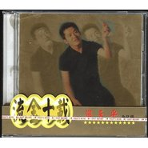

流金十载全记录
============================

|  |  |
| :--: | :-- |
| [ 流金十载全记录](https://emumo.xiami.com/album/403935) | **艺人**: [熊天平](../index.md) **语种**: 国语 **唱片公司**: 上华国际 **发行时间**: 2000年03月01日 **专辑类别**: 精选集 **专辑风格**: 国语流行 Mandarin Pop, 华语唱作人 Chinese Singer-Songwriter **播放数**: 507021 **收藏数**: 351 **评论数**: 28  |

## 简介

WCD2228，上华国际唱片发行的系列精选集，熊天平篇

## 曲目

- [一个人流浪](./403935/mQCdEH82516.md)
- [雪候鸟MV](./403935/bf0yXJC34a10.md)
- [最后还是会](./403935/mQCdEJ8c520.md)
- [每一分每一秒都给你](./403935/mQCdEK4cef0.md)
- [火柴天堂](./403935/xLxc3v9c18b.md)
- [心碎的冰咖啡MV](./403935/b1pUVwQ3e74f.md)
- [魔镜](./403935/8GibrXf49c9.md)
- [傻哥歌](./403935/U5DYVi2aafa.md)
- [五月的雪花](./403935/xLxc3za068d.md)
- [与世隔绝](./403935/mQCdEQ5a653.md)
- [你的眼睛](./403935/bf0yXJL2f052.md)
- [Mr. Moon](./403935/xLxc32b37e2.md)
- [爱情多恼河MV](./403935/bCkFUl749c46.md)
- [甘心](./403935/8Gibse173d1.md)
- [愚人码头](./403935/mQCdEV5e5d0.md)
- [I Wish](./403935/mQCdEW945c8.md)

## 评论

|  |  |  |
| :-- | :-- | :-- |
|  [虾米用户](https://emumo.xiami.com/u/120980348) 不知道怎么写…。。 2019-05-14 22:30 赞(0) 踩(0) | 
记忆里的一首歌  已经埋没多年了  今天虾米推荐了过来
 |
|  [虾米用户](https://emumo.xiami.com/u/75468866)  2019-04-06 12:08 赞(0) 踩(0) | 
有些人一辈子也写不出像他写的歌一样的歌，唱可以学可以练，创作真的靠缘分
 |
|  [虾米用户](https://emumo.xiami.com/u/4855992) 我还没想好要写什么... 2018-02-27 12:21 赞(0) 踩(0) | 
满分
 |
|  [虾米用户](https://emumo.xiami.com/u/22012232)  2017-06-17 16:12 赞(1) 踩(0) | 
英文名居然叫Panda
 |
|  [虾米用户](https://emumo.xiami.com/u/33009066) 豬小小 2016-05-04 20:25 赞(0) 踩(0) | 
love
 |
|  [虾米用户](https://emumo.xiami.com/u/435605) 洛丽脸大叔心 2015-12-28 23:19 赞(0) 踩(0) | 
第一次看到10分的专辑！！好怀念啊
 |
|  [虾米用户](https://emumo.xiami.com/u/1459209) 我还没想好要写什么... 2015-07-06 23:54 赞(0) 踩(0) | 
棒棒的
 |
|  [虾米用户](https://emumo.xiami.com/u/23377590) 行走中 2014-01-21 22:27 赞(0) 踩(0) | 
首首经典、好听
 |
|  [虾米用户](https://emumo.xiami.com/u/11699681)  2013-07-12 15:26 赞(0) 踩(0) | 
收了
 |
|  [虾米用户](https://emumo.xiami.com/u/11699681)  2013-07-12 15:25 赞(0) 踩(0) | 
原来“愚人码头 ”是熊天平唱得，哦，哈哈
 |
|  [虾米用户](https://emumo.xiami.com/u/7713100)  2012-06-16 02:09 赞(0) 踩(0) | 
珍重！
 |
|  [虾米用户](https://emumo.xiami.com/u/126452)  2012-06-14 22:14 赞(0) 踩(0) | 
买过这个的卡带。
 |
|  [虾米用户](https://emumo.xiami.com/u/3389673) 音乐爱好的人 2012-06-12 15:47 赞(0) 踩(0) | 
ok
 |
|  [虾米用户](https://emumo.xiami.com/u/962146)  2012-06-11 13:28 赞(0) 踩(0) | 
肯定 要收的
 |
|  [虾米用户](https://emumo.xiami.com/u/3929298)  2011-06-22 20:59 赞(3) 踩(0) | 
长胖没错，但别每次出来都带着你老婆，就不能爷们点么？
 |
|  [虾米用户](https://emumo.xiami.com/u/870856)  2011-06-09 22:52 赞(0) 踩(0) | 
不要发布了，还是不要发布了
 |
| ⇒ |  [虾米用户](https://emumo.xiami.com/u/2789400)  2011-12-07 09:46 赞(0) 踩(0) | 
对　发布了也不听
 |
|  [虾米用户](https://emumo.xiami.com/u/870856)  2011-06-09 22:50 赞(0) 踩(0) | 
长叹一声啊，唉~~~~~~~~~~~~~~~~~~~~~~~~~~~~~~~~~~~~~~~~~~~~ 当年水晶般的声音开始唱这种两只蝴蝶似的歌了 有谁还记得当年清澈的，你的眼睛
 |
|  [虾米用户](https://emumo.xiami.com/u/3629828)  2011-04-27 14:55 赞(0) 踩(0) | 
只能说～～～～哎～～～～
 |
|  [虾米用户](https://emumo.xiami.com/u/2372792)  2011-01-07 17:25 赞(0) 踩(0) | 
毁在这个女人上了。。。
 |
|  [虾米用户](https://emumo.xiami.com/u/601044)  2010-10-02 12:05 赞(0) 踩(0) | 
这种歌曲严重损害到了熊天平歌曲的品味
 |
| ⇒ |  [虾米用户](https://emumo.xiami.com/u/2789400)  2011-12-07 09:46 赞(0) 踩(0) | 
……感觉他们正走向拍摄妇炎洁的道路
 |
| ⇒ |  [虾米用户](https://emumo.xiami.com/u/60395) 春种一粒粟 2012-06-11 20:37 赞(0) 踩(0) | 
<q><b>雪候鹰说：</b></q>
 |
| ⇒ |  [虾米用户](https://emumo.xiami.com/u/121511)  2012-06-13 10:06 赞(0) 踩(0) | 
这张是十年前的精选集了。不是新歌。
 |
| ⇒ |  [虾米用户](https://emumo.xiami.com/u/2789400)  2012-07-18 09:35 赞(0) 踩(0) | 
<q><b>laraine珑说：</b></q>
 |
| ⇒ |  [虾米用户](https://emumo.xiami.com/u/1871123)  2012-09-24 10:20 赞(0) 踩(0) | 
<q><b>雪候鹰说：</b></q>
 |
| ⇒ |  [虾米用户](https://emumo.xiami.com/u/2789400)  2012-10-10 21:42 赞(0) 踩(0) | 
<q><b>coco1102说：</b></q>
 |
| ⇒ |  [虾米用户](https://emumo.xiami.com/u/5806141)  2014-03-15 11:24 赞(0) 踩(0) | 
<q><b>coco1102说：</b></q>
 |
