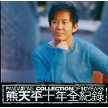

十年全纪录Panda Xiong Collection of 10 Years
============================

|  |  |
| :--: | :-- |
| [ 十年全纪录Panda Xiong Collection of 10 Years](https://emumo.xiami.com/album/5094) | **艺人**: [熊天平](../index.md) **语种**: 国语 **唱片公司**: 正合世纪 **发行时间**: 2006年11月28日 **专辑类别**: 精选集 **专辑风格**: 华语唱作人 Chinese Singer-Songwriter, 国语流行 Mandarin Pop **播放数**: 430470 **收藏数**: 502 **评论数**: 71  |

## 简介

1997年，一张名为《爱情多瑙河》的唱片上市第一天就接到十二万张订单，远远超过当日工厂的五万张印制量，结果第二天全台湾断货，以至于工厂连夜加班赶货。

 创造这一奇迹的就是一个弹着吉他、浅吟低唱的歌者，他就是拥有光芒四射才华、拥有无数知音的才华派偶像——熊天平。

 熊天平拥有一副美声派的独特音色，唱片界评论人常以张雨生、张信哲 与其相题并论，用“天籁”来形容。除了得到亚洲各大中文歌排行榜多次冠军之外，更获台湾1997年度金曲奖“最佳作词人奖”，更被封为1997年冠军演唱创作王。

 熊天平的歌，清亮地歌唱爱情的希望和迷茫，坦白地展开情感的坚持，即使制造梦境，也远离浸淫于虚幻的放肆，远离麻醉的短暂快乐和沉沦的病态自由。

 熊天平的歌，为爱而真真切切地苦着或乐着，为一切现实中的情感做着缠绵却直接而真实的抒情，依然还在继续现实中的寻找，继续单纯的健康的追寻。

 到2000年，熊天平在短短4年的时间里连续发片11张、演唱70余首作品，其中《爱情多瑙河》、《火柴天堂》、《雪候鸟》、《你的眼睛》、《愚人码头》、《夜夜夜夜》等大量作品被广泛流传，感动着一大批莘莘学子和有为青年。

 由于各种因素的困扰，这位处于巅峰状态的音乐才子，在随后的5年中渐渐远离了大众的视野。

 然而在这五年当中，关于熊天平的事业、健康、婚恋等等，依然是各大媒体追逐的焦点，什么“崩溃”、“堕落”、“绯闻”等等字眼不断成为人们茶余饭后的谈资。一方面，人们为华语歌坛缺少这样一位歌者感到惋惜，一方面人们对熊天平充满了更多的期待。

 2006年，熊天平携带着定位于新古典、新气质的《十年全纪录》重出江湖。新专辑囊括了他全新演绎的6首经典作品，以及反映他五年心路历程的7首全新作品。

 这张《十年全纪录》专辑，全班启用了大陆地区的制作班底。在大师级音乐人张宏光先生领衔下，秦四风、崔弦亮、彭博等新锐音乐人在变与不变当中找到了契合点。

 因为对音乐的执着，于是有了《Jasmine》和《秋恋》；因为身心挫折的经历，于是有了《人算不如天算》和《我不想把你拖累》；因为媒体各种负面报道，于是有了《旁观者》；因为有了终成眷属的结果，于是有了《身边》和《天涯共此时》。

 熊天平回来了，依然是那个才华横溢的熊天平；

 熊天平回来了，依然是那个天籁声线的熊天平；

 熊天平回来了，依然是那个魅力迷人的熊天平。

 ⊙熊天平新专辑再遇挫折 推迟到11月28日上市

 熊天平接连遭遇麻烦，原定11月20日上市的新专辑，被唱片公司和发行公司紧急叫停，起因是新专辑里的一首《愚人码头》。

 已经5年没有新作品问世的熊天平，曾经被各大媒体称之为“堕落”。面对媒体的责问，更是为给歌迷一个圆满地交待，今年初开始，熊天平就为新专辑进行全方位的准备。一方面找出5年来创作的大量作品，进行重新修改。一方面克服身体上的伤病，坚持长达数月的减肥。在唱片公司、制作公司和发行公司的共同努力下，今年10月份完成了新专辑的录制工作。

 然而，就在发行公司后期制作专辑时，发现专辑中收录的《愚人码头》，与去年“超女教母”柯以敏、今年超女韩真真的翻唱相比，缺少了一点点味道。为了区别于熊天平自己的原版，以及柯以敏、韩真真的版本，保证新专辑的品质，唱片公司和发行公司于11月13日紧急叫停了准备上市的新专辑。

## 曲目

- [Jasmine](./5094/Ge25df00.md)
- [爱情多恼河 (2006版)](./5094/Ge387955.md)
- [火柴天堂 (2006版)](./5094/Ge457205.md)
- [秋恋](./5094/Ge54d155.md)
- [身边](./5094/bgf0a367e.md)
- [人算不如天算](./5094/cwij2c57f.md)
- [夜夜夜夜 (2006版)](./5094/cMje347d8.md)
- [愚人码头 (2006版)](./5094/Ge95a3b5.md)
- [雪候鸟 (2006版)](./5094/dmka371d9.md)
- [旁观者](./5094/GeB527e8.md)
- [你的眼睛 (2006版)](./5094/bgf6a5879.md)
- [我不想把你拖累](./5094/GeD7d97f.md)
- [天涯共此时](./5094/GeEbddf4.md)

## 评论

|  |  |  |
| :-- | :-- | :-- |
|  [虾米用户](https://emumo.xiami.com/u/276896469)  2019-05-17 23:46 赞(1) 踩(0) | 
编曲太弱，老歌新版真的毁经典。新歌歌名走草根路线了。唉，看着曾经的偶像成这样了，有些无奈。
 |
|  [虾米用户](https://emumo.xiami.com/u/5693589)  2018-06-09 02:41 赞(0) 踩(0) | 
全碟已无损。
 |
|  [虾米用户](https://emumo.xiami.com/u/664916) 我还没想好要写什么... 2018-04-08 23:24 赞(4) 踩(0) | 
大陆的创作班底真是差劲，完全没有原版好听 
 |
| ⇒ |  [虾米用户](https://emumo.xiami.com/u/276896469)  2019-05-17 23:46 赞(0) 踩(0) | 
恐怕和经费有关吧
 |
|  [虾米用户](https://emumo.xiami.com/u/334632832)   2017-12-12 12:38 赞(0) 踩(0) | 
用心的歌手干净的声音
 |
|  [虾米用户](https://emumo.xiami.com/u/10606834) 生如蚁而美如神 2017-10-30 10:17 赞(2) 踩(0) | 
听熊天平的声音真的有种想哭的冲动，太好听了，真的是天籁，声音干净的要死啊。
 |
|  [虾米用户](https://emumo.xiami.com/u/15366868)  2017-10-28 00:33 赞(1) 踩(0) | 
熊天平经典
 |
|  [虾米用户](https://emumo.xiami.com/u/5135953)  2017-10-28 00:12 赞(1) 踩(0) | 
从喜欢《火柴天堂》开始喜欢熊天平
 |
|  [虾米用户](https://emumo.xiami.com/u/7114008)  2017-10-27 23:55 赞(2) 踩(0) | 
独特的嗓音，清晰地吐字，圆润的歌喉，构成我心中永远的经典——熊天平
 |
|  [虾米用户](https://emumo.xiami.com/u/3859431)  2017-10-27 23:04 赞(1) 踩(0) | 
记得当时初听《雪候鸟》的时候，感觉眼泪都不禁留下来了。第一次认识他的时候是看凤凰台，当时好像是讲他的人生经历，依稀记得因为唱歌，他失去了一个亲人。后来听《夜夜夜夜》、《愚人码头》、《爱情多瑙河》、《你的眼睛》等深情的情歌，的确太打动我小小的心，让我长长的怀念。但不知何故，近些年他的作品很少，遗憾！
 |
|  [虾米用户](https://emumo.xiami.com/u/43814018)  2017-06-20 00:03 赞(1) 踩(0) | 
感谢金曲捞
 |
|  [虾米用户](https://emumo.xiami.com/u/2560652) 原虾小词@虾米歌词组 2016-09-25 19:26 赞(0) 踩(0) | 
这张《十年全纪录》专辑，全班启用了大陆地区的制作班底。在大师级音乐人张宏光先生领衔下，秦四风、崔弦亮、彭博等新锐音乐人在变与不变当中找到了契合点。
 |
|  [虾米用户](https://emumo.xiami.com/u/10930466) 再见了虾米，还有虾米上上... 2016-08-04 12:17 赞(0) 踩(0) | 
依然很好听！最喜欢的中文男歌手之一，现在根本不可能在有这样的男歌手了
 |
|  [虾米用户](https://emumo.xiami.com/u/29384202)  2016-07-01 19:28 赞(0) 踩(0) | 
很喜欢他的声音啊
 |
|  [虾米用户](https://emumo.xiami.com/u/8070377) 爱雾瑞性维欧腐漏 2015-10-26 19:40 赞(0) 踩(0) | 
我对这张封面很有印象呢
 |
|  [虾米用户](https://emumo.xiami.com/u/52069974) 没办法，滚石华研的歌都得... 2015-07-15 05:03 赞(0) 踩(0) | 
他就像流星 人们总是拿他和张信哲对比
 |
|  [虾米用户](https://emumo.xiami.com/u/1411564) 耳朵想旅行 2015-02-04 17:12 赞(1) 踩(0) | 
新版没老版好听…… 那激情没了……
 |
|  [虾米用户](https://emumo.xiami.com/u/122688)  2014-05-07 23:31 赞(1) 踩(0) | 
这是我的青春回忆…属于我的那个年代！
 |
|  [虾米用户](https://emumo.xiami.com/u/6716274) 123 2014-02-28 22:01 赞(0) 踩(0) | 
喜欢的声音
 |
|  [虾米用户](https://emumo.xiami.com/u/23667760) everyday 2013-10-09 10:34 赞(0) 踩(0) | 
当年很喜欢他的声音啊，可惜现在看不到了，还有创作么？
 |
|  [虾米用户](https://emumo.xiami.com/u/19507983) 我有尚方宝剑！ 2013-08-17 09:23 赞(0) 踩(0) | 
音乐才子。声音细腻
 |
|  [虾米用户](https://emumo.xiami.com/u/2097046) 向死而生 2013-07-19 19:26 赞(0) 踩(0) | 
怀旧是一种伤，想要逃脱，又无法自拔。
 |
|  [虾米用户](https://emumo.xiami.com/u/11699681)  2013-07-12 15:24 赞(0) 踩(0) | 
收了
 |
|  [虾米用户](https://emumo.xiami.com/u/11699681)  2013-07-12 15:23 赞(0) 踩(0) | 
听熊天平的声音真的有种想哭的冲动，太好听了，真的是天籁，声音干净的要死啊。 ---------------------- 听“东游记”里的歌就知道了，还行，哈哈
 |
|  [虾米用户](https://emumo.xiami.com/u/14044710)  2013-04-29 20:02 赞(0) 踩(0) | 
ganjing
 |
|  [虾米用户](https://emumo.xiami.com/u/7205091) 胡同串子 2013-03-30 18:14 赞(0) 踩(0) | 
很早买的CD 现在还在收藏，可惜现在的熊天平不出来了
 |
|  [虾米用户](https://emumo.xiami.com/u/7598076)  2013-03-28 13:31 赞(0) 踩(0) | 
好
 |
|  [虾米用户](https://emumo.xiami.com/u/1848672)  2013-03-11 20:52 赞(0) 踩(0) | 
ok
 |
|  [虾米用户](https://emumo.xiami.com/u/6436790) ＂情绪＂这东西，你不在乎 2013-01-20 11:59 赞(0) 踩(0) | 
熊天平
 |
|  [虾米用户](https://emumo.xiami.com/u/4275776) 虾米音质检测督查账号 2012-11-23 09:37 赞(1) 踩(0) | 
#每天一张320K专辑# 贵州毕节的五个孩子的遭遇让我们对儿时读过的童话《卖火柴的小女孩》有了更深刻的理解，来听听熊天平的音乐诠释吧，现实、童话和音乐三者结合在一起，更令人断肠。合格320K音质。<a href="http://www.xiami.com/song/61726" target="_blank" rel="nofollow noreferrer noopener">http://www.xiami.com/song/61726</a>
 |
|  [虾米用户](https://emumo.xiami.com/u/4785101)  2012-11-08 22:33 赞(0) 踩(0) | 
为什么在2000年后就突然消失了，多可惜自己的事业，现在想回也回不来了，乐坛发展得太快了
 |
| ⇒ |  [虾米用户](https://emumo.xiami.com/u/10075936) 暂无签名~ 2013-01-23 16:22 赞(0) 踩(0) | 
百度查看了一下，好像钱被他的干妈骗走了，然后一直胖，胖到上镜唱歌也被导演剪掉一半~说上镜不好看！哎~这行很现实！希望他做不了幕前也转去做幕后吧，别浪费了这才华，就是可惜了这好声音！。。。。。但[夜夜夜夜]这首比较喜欢齐秦的版本！
 |
|  [虾米用户](https://emumo.xiami.com/u/1134502) 暂无签名~ 2012-08-27 15:08 赞(0) 踩(0) | 
很喜欢
 |
|  [虾米用户](https://emumo.xiami.com/u/1134502) 暂无签名~ 2012-08-27 15:06 赞(0) 踩(0) | 
好听，很纯粹的声音
 |
|  [虾米用户](https://emumo.xiami.com/u/1557309)  2012-08-26 17:27 赞(0) 踩(0) | 
情歌王子
 |
|  [虾米用户](https://emumo.xiami.com/u/6158429)  2012-08-21 15:14 赞(0) 踩(0) | 
听他的歌，像听到了自己的声音。
 |
|  [虾米用户](https://emumo.xiami.com/u/121511)  2012-08-16 10:19 赞(0) 踩(0) | 
2012年8月24日，熊天平在北京小柯剧场，即将举行他人生中第一场个人演唱会。300人不到的小剧场，每个人都能更近距离滴聆听他的音乐。
 |
|  [虾米用户](https://emumo.xiami.com/u/3907) 执着于不执着 2012-07-01 19:47 赞(0) 踩(0) | 
07 夜夜夜夜 (2006版)
 |
|  [虾米用户](https://emumo.xiami.com/u/7713100)  2012-06-16 02:09 赞(0) 踩(0) | 
珍重！
 |
|  [虾米用户](https://emumo.xiami.com/u/8128667)   2012-06-09 03:22 赞(0) 踩(0) | 
熊天平
 |
|  [虾米用户](https://emumo.xiami.com/u/5056852)  2012-05-21 10:59 赞(0) 踩(0) | 
一直记得火柴天堂
 |
|  [虾米用户](https://emumo.xiami.com/u/3257835)  2012-03-01 11:15 赞(0) 踩(0) | 
喜欢这种似乎发自灵魂的忧郁
 |
|  [虾米用户](https://emumo.xiami.com/u/6764190)  2012-01-18 16:40 赞(0) 踩(0) | 
声音还是这么纯净，新的钢琴编曲也很棒，但最主要是想起以前读书时买熊天平专辑反复听的时候。。。
 |
|  [虾米用户](https://emumo.xiami.com/u/7352335)  2011-12-24 10:58 赞(0) 踩(0) | 
干净的声音，细腻的情感，优美的旋律，经典！
 |
|  [虾米用户](https://emumo.xiami.com/u/7114008)  2011-12-07 14:49 赞(0) 踩(0) | 
经典男声
 |
|  [虾米用户](https://emumo.xiami.com/u/6652578)  2011-11-06 20:42 赞(0) 踩(0) | 
声音清亮，够深情 歌词优美
 |
|  [虾米用户](https://emumo.xiami.com/u/3382543)  2011-09-02 21:45 赞(0) 踩(0) | 
好听
 |
|  [虾米用户](https://emumo.xiami.com/u/5473751)  2011-08-20 02:31 赞(0) 踩(0) | 
情歌王子，我只认一位熊天平！
 |
| ⇒ |  [虾米用户](https://emumo.xiami.com/u/121511)  2012-08-16 10:18 赞(0) 踩(0) | 
8月24日，他即将在北京小柯剧场举行他的第一场个人演唱会。有机会就去吧。
 |
| ⇒ |  [虾米用户](https://emumo.xiami.com/u/5473751)  2012-08-20 20:58 赞(0) 踩(0) | 
<q><b>麦田青青说：</b></q>
 |
|  [虾米用户](https://emumo.xiami.com/u/5165559)  2011-08-07 10:23 赞(0) 踩(0) | 
muito linda
 |
|  [虾米用户](https://emumo.xiami.com/u/355865) Let it go, l... 2011-07-22 11:28 赞(0) 踩(0) | 
版权提供：正合世纪
 |
|  [虾米用户](https://emumo.xiami.com/u/4260223)  2011-06-30 00:04 赞(0) 踩(0) | 
意外收获的一张好听唱片
 |
|  [虾米用户](https://emumo.xiami.com/u/528045)  2011-05-21 11:02 赞(0) 踩(0) | 
小熊。
 |
|  [虾米用户](https://emumo.xiami.com/u/3256501)  2011-04-24 10:50 赞(0) 踩(0) | 
很好听！
 |
|  [虾米用户](https://emumo.xiami.com/u/3074750)  2011-04-05 09:42 赞(0) 踩(0) | 
爱虾米，收录了这么多好听的音乐专辑。特别是收集了panda的专辑，除了爱还是爱！
 |
|  [虾米用户](https://emumo.xiami.com/u/1871123)  2011-04-01 13:19 赞(0) 踩(0) | 
熊天平十年全纪录
 |
|  [虾米用户](https://emumo.xiami.com/u/3429609)  2011-03-31 21:47 赞(0) 踩(0) | 
怀念
 |
|  [虾米用户](https://emumo.xiami.com/u/1342581)  2011-01-17 19:03 赞(0) 踩(0) | 
收藏记忆!
 |
|  [虾米用户](https://emumo.xiami.com/u/2272581)  2011-01-13 22:24 赞(0) 踩(0) | 
一听就是他的声音，一个时代的声音。
 |
|  [虾米用户](https://emumo.xiami.com/u/363965)  2010-09-07 21:41 赞(0) 踩(0) | 
偶然机缘下听到他的歌，只想说为何我不生在那个年代。
 |
|  [虾米用户](https://emumo.xiami.com/u/565659)  2010-06-30 17:19 赞(0) 踩(0) | 
不知道他干什么去了，若干年不见踪影，早前06年莫明其妙发了张专辑，又莫明其妙的消失无踪。 恨铁不成钢，我想，也许他的时代已经过去了。  只能怀念......
 |
| ⇒ |  [虾米用户](https://emumo.xiami.com/u/121511)  2012-08-16 10:17 赞(0) 踩(0) | 
今年8月24日，他要在北京小柯剧场开他人生中的第一次个人演唱会。有机会去吧！！不知道有没有下次
 |
|  [虾米用户](https://emumo.xiami.com/u/503585)  2009-11-12 18:23 赞(0) 踩(0) | 
不是320K，是224K的！
 |
| ⇒ |  [虾米用户](https://emumo.xiami.com/u/73) 等风景都看透 谁陪我看细... 2010-08-31 14:55 赞(0) 踩(0) | 
重新压过了 是320K的了
 |
| ⇒ |  [虾米用户](https://emumo.xiami.com/u/355865) Let it go, l... 2010-09-01 04:00 赞(0) 踩(0) | 
<q><b>一衣说：</b></q>
 |
|  [虾米用户](https://emumo.xiami.com/u/189585)  2009-07-01 05:25 赞(0) 踩(0) | 
12年以来 已经没有华人男歌手 能代替他了。
 |
|  [虾米用户](https://emumo.xiami.com/u/104940)  2009-04-27 19:06 赞(0) 踩(0) | 
真正的好声音,我们应该永远铭记...
 |
