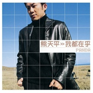

我都在乎
============================

|  |  |
| :--: | :-- |
| [ 我都在乎](https://emumo.xiami.com/album/5096) | **艺人**: [熊天平](../index.md) **语种**: 国语 **唱片公司**: 上华国际 **发行时间**: 2000年02月23日 **专辑类别**: 录音室专辑 **专辑风格**: 国语流行 Mandarin Pop, 华语唱作人 Chinese Singer-Songwriter **播放数**: 367383 **收藏数**: 323 **评论数**: 38  |

## 简介

    　　2000年新世纪，熊天平以全新专辑《我都在乎》，诉说一个男人对生命、情感、以及自我的负责态度，喜怒哀乐起起伏伏原本是人生的常态，但重要是在每一段过程中，每一个情绪里，在乎...    　　01. 我都在乎 --爱一个人，所以在乎，在乎所有的快乐、痛苦。诚挚深情演唱我都在乎倾诉对爱情得的执迷不悔。    　　02. 如果可以 --如果可以深情写下男人面对爱情最深沉的痛苦。熊天平又一超级感人创作。    　　03. 不换 --给我世界也不换，是熊天平+李宗盛年度力作，万芳的成名曲之一，由熊天平原作重新诠释，温馨动容。    　　04. 就爱到这里 --一句就爱到这里，爱情就被判出局，熊天平以深情的嗓音来表现令人落泪的故事。

## 曲目

- [我都在乎](./5096/Dwvz443f9.md)
- [如果可以](./5096/sxCq25873.md)
- [就此算了吗](./5096/9kmz439f4.md)
- [不换原唱: 万芳](./5096/jZuoa62b7.md)
- [单身移民](./5096/Dwv34730b.md)
- [就爱到这里](./5096/jZuqaed88.md)
- [你在下个路口等我](./5096/jZurce332.md)
- [碎心沙漠](./5096/fNlq93f88.md)
- [不想爱MV](./5096/fNlr6bed6.md)
- [私人回忆海滩](./5096/ol3web6b2.md)

## 评论

|  |  |  |
| :-- | :-- | :-- |
|  [虾米用户](https://emumo.xiami.com/u/402072147)  2020-01-22 08:31 赞(1) 踩(0) | 
这么好听的专辑，居然连一首歌都听不了
 |
|  [虾米用户](https://emumo.xiami.com/u/327460672)   2019-03-22 04:57 赞(0) 踩(0) | 
经典
 |
|  [虾米用户](https://emumo.xiami.com/u/3583995) 一個人的戰爭 2018-02-03 12:04 赞(0) 踩(0) | 
.
 |
|  [虾米用户](https://emumo.xiami.com/u/12062654) 爱听歌的花艺设计私定小玩... 2017-10-27 23:51 赞(3) 踩(0) | 
卡带的时光，一晃十几年过去了，怀念那个时代的熊天平、许美静等上华歌手。
 |
| ⇒ |  [虾米用户](https://emumo.xiami.com/u/402072147)  2020-01-22 08:31 赞(0) 踩(0) | 
对啊
 |
|  [虾米用户](https://emumo.xiami.com/u/25784956)  2017-10-27 23:26 赞(0) 踩(0) | 
熊天平　喜欢
 |
|  [虾米用户](https://emumo.xiami.com/u/16011973)  2017-09-13 06:35 赞(2) 踩(0) | 
这张感觉咬字变了。（普通话谜之&amp;ldquo;变好&amp;rdquo;）为什么呢
 |
|  [虾米用户](https://emumo.xiami.com/u/8070377) 爱雾瑞性维欧腐漏 2017-08-31 21:16 赞(0) 踩(0) | 
。
 |
|  [虾米用户](https://emumo.xiami.com/u/558802)  2017-02-02 10:54 赞(1) 踩(0) | 
熊天平,
 |
|  [虾米用户](https://emumo.xiami.com/u/253880436)  2017-01-21 15:49 赞(4) 踩(0) | 
第一次听的时候，是离开一个人的时候。时隔多年后再听，却异常怀念那段岁月中是自己。那个人爱我爱的死心塌地，我对他，却总是貌似缺少了些什么东东。或许正因为如此，最终我才能走得那样决绝
 |
|  [虾米用户](https://emumo.xiami.com/u/16868299) 我还没想好要写什么... 2016-10-18 21:41 赞(1) 踩(0) | 
什么跟什么！这也叫巅峰？嘿嘿！个人觉得97年的专辑是他这些年里最好的！不管97年的哪一张！
 |
|  [虾米用户](https://emumo.xiami.com/u/11251094) 梅竹 2016-08-12 23:17 赞(0) 踩(0) | 
欣赏收藏
 |
|  [虾米用户](https://emumo.xiami.com/u/1746857)  2016-03-13 21:11 赞(0) 踩(0) | 
曾买过卡带…美好的回忆……
 |
|  [虾米用户](https://emumo.xiami.com/u/118859574)  2016-03-03 14:52 赞(0) 踩(0) | 
岁月如歌
 |
|  [虾米用户](https://emumo.xiami.com/u/118859574)  2016-03-03 14:47 赞(0) 踩(0) | 
好听　熊天平的巅峰作品
 |
|  [虾米用户](https://emumo.xiami.com/u/46154901) 我签名你要啊 2015-02-25 13:10 赞(0) 踩(0) | 
致青春，那时15
 |
|  [虾米用户](https://emumo.xiami.com/u/46154901) 我签名你要啊 2015-02-25 13:06 赞(0) 踩(0) | 
突然想起的循环收听无数遍的专辑
 |
|  [虾米用户](https://emumo.xiami.com/u/8070377) 爱雾瑞性维欧腐漏 2014-12-13 21:22 赞(0) 踩(0) | 
不想爱
 |
|  [虾米用户](https://emumo.xiami.com/u/4892909)  2014-10-09 21:28 赞(1) 踩(0) | 
私人回忆海滩的曲也是王祖贤专辑里面的一首
 |
| ⇒ |  [虾米用户](https://emumo.xiami.com/u/13782013) 因为最初，所以永远。 2015-04-15 09:01 赞(0) 踩(0) | 
应该是《与世隔绝》。
 |
| ⇒ |  [虾米用户](https://emumo.xiami.com/u/4958958)  2015-07-09 11:48 赞(0) 踩(0) | 
<q><b>掠过影说：</b></q>
 |
|  [虾米用户](https://emumo.xiami.com/u/7720749)   2013-09-15 00:39 赞(1) 踩(0) | 
致青春
 |
|  [虾米用户](https://emumo.xiami.com/u/11699681)  2013-07-12 15:24 赞(0) 踩(0) | 
收了
 |
|  [虾米用户](https://emumo.xiami.com/u/14102457) 習慣是種很可怕的事情 2013-04-26 00:08 赞(0) 踩(0) | 
好聽的歌曲永不退流行^^
 |
|  [虾米用户](https://emumo.xiami.com/u/12263749)  2013-01-15 00:45 赞(0) 踩(0) | 
小学时超爱的一张专辑
 |
|  [虾米用户](https://emumo.xiami.com/u/6045648)  2012-11-11 20:23 赞(0) 踩(0) | 
越听越好听，百听不厌
 |
|  [虾米用户](https://emumo.xiami.com/u/7713100)  2012-06-16 02:09 赞(0) 踩(0) | 
珍重！
 |
|  [虾米用户](https://emumo.xiami.com/u/6266989)  2012-05-07 03:00 赞(1) 踩(0) | 
我都在乎，听来有种很痛彻的感觉
 |
|  [虾米用户](https://emumo.xiami.com/u/7793981)  2012-01-29 11:31 赞(0) 踩(0) | 
小熊的声音真是好听！
 |
|  [虾米用户](https://emumo.xiami.com/u/3907) 执着于不执着 2011-12-17 16:03 赞(0) 踩(0) | 
01 我都在乎
 |
|  [虾米用户](https://emumo.xiami.com/u/6927975)  2011-11-25 10:27 赞(0) 踩(0) | 
曾经一段心情  好怀念
 |
|  [虾米用户](https://emumo.xiami.com/u/6927975)  2011-11-25 10:21 赞(1) 踩(0) | 
原来在家就一直听他这专辑的磁带，后来一直一直找。。。看到那熟悉的专辑封皮，我激动啦！
 |
|  [虾米用户](https://emumo.xiami.com/u/997204) 人心惟危，道心惟微；待人... 2011-08-29 21:43 赞(0) 踩(0) | 
一直都很喜欢的优质男声。
 |
|  [虾米用户](https://emumo.xiami.com/u/3878462)  2011-05-09 09:48 赞(0) 踩(0) | 
这是听他的第一张专辑，当时上初中时买的磁带
 |
|  [虾米用户](https://emumo.xiami.com/u/1045642)  2011-04-24 19:58 赞(0) 踩(0) | 
听着这些歌 我很怀念我的那个当初不爱说话的同桌 扫瑞我吧你的这盘磁带给弄丢了
 |
|  [虾米用户](https://emumo.xiami.com/u/570291)  2010-09-30 06:34 赞(0) 踩(0) | 
原来《就此算了吗》跟陈冠宇《爱是我们的》曲子是同一首~
 |
|  [虾米用户](https://emumo.xiami.com/u/76195)  2009-12-10 17:58 赞(0) 踩(0) | 
想当年我还买了这张专辑，回头看看还是非常喜欢。
 |
