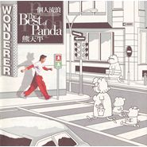

一个人流浪The Best of Panda
============================

|  |  |
| :--: | :-- |
| [ 一个人流浪The Best of Panda](https://emumo.xiami.com/album/5097) | **艺人**: [熊天平](../index.md) **语种**: 国语 **唱片公司**: 上华国际 **发行时间**: 1999年04月01日 **专辑类别**: 精选集 **专辑风格**: 国语流行 Mandarin Pop, 华语唱作人 Chinese Singer-Songwriter **播放数**: 7651082 **收藏数**: 1357 **评论数**: 122  |

## 简介

这是熊天平的第一张精选集，从97年的『爱情多瑙河』至今，出版了数张国语、粤语专辑，而这张创作精选集是他在这世纪的一次青春回顾。 

14首主打＋2首新歌＋6首主打MTV·VCD 

国内首张经过HDCD处理之发烧级流行精选辑，值得珍藏。 

内附加赠熊天平新款珍藏海报 

01 野心／熊天平 黄慧文 

继《你的眼睛》后，熊天平最新对唱创作曲 

02 一个人流浪 

告别20世纪熊氏情歌创作 

03 雪候鸟 

远赴法国录制MTV，熊天平’97最卖主打歌 

04 爱情电影／熊天平 许茹芸 

熊天平’97跨刀为许茹芸《茹此精彩13首》冠军大碟对唱曲 

05 火柴天堂 

傲视’97金曲奖最佳作词奖代表作 

06 Mr Moon 

国际AIWA产品亚洲区广告代言人暨广告曲 

07 夜夜夜夜 

齐秦《丝路》专辑卖座金曲，熊天平出片前真情代表作 

08 我只能相信你／熊天平 阮丹青 

’97年度新人阮丹青主打歌，陈晓娟量身订作年度对唱曲 

09 爱情多恼河 

熊天平处女专辑首支主打歌，IFPI销售第2名卖座金曲 

10 愚人码头 

齐秦跨刀对唱，MTV快红新声带最佳单曲 

11 I Wish 

’98亚运台湾区指定主题曲，熊天平远赴泰国拍摄MTV 

12 难说 

袁惟仁《征服》后最得意代表作，熊天平深情诠释 

13 你的眼睛／熊天平 许茹芸 

金曲龙虎榜、知音时间排行冠军对唱曲 

14 摆脱 

熊天平最得意私房歌，是他未入唱片圈最深刻心情写照 

15 大雨带我逃亡 

远赴巴黎取景，熊天平激昂尽情风格转变之作 

16 每一分每一秒都给你 

熊天平为小熊家庭创作私藏曲，感谢小熊家族风雨无阻陪伴

## 曲目

- [野心](./5097/cMjB2de5d.md)
- [一个人流浪](./5097/Gfg625d6.md)
- [雪候鸟MV](./5097/bggbcc2f3.md)
- [爱情电影](./5097/dCl240a97.md)
- [火柴天堂MV原唱: 齐秦](./5097/bggdc4366.md)
- [Mr. MoonMV](./5097/bggebeec2.md)
- [夜夜夜夜MV原唱: 齐秦](./5097/Gfl71cdd.md)
- [我只能相信你MV](./5097/bgggc9652.md)
- [爱情多恼河MV](./5097/Gfn6423d.md)
- [愚人码头MV](./5097/bggid5b87.md)
- [I Wish](./5097/Gfp927de.md)
- [难说MV](./5097/Gfq63d1c.md)
- [你的眼睛MV](./5097/Gfr666eb.md)
- [摆脱MV](./5097/dClC3f646.md)
- [大雨带我逃亡MV](./5097/Gft744d6.md)
- [每一分每一秒都给你](./5097/bWic23f64.md)

## 评论

|  |  |  |
| :-- | :-- | :-- |
|  [虾米用户](https://emumo.xiami.com/u/314061321) 只一缕微风动仲夏 2020-12-24 23:49 赞(0) 踩(0) | 
上学时听的专辑   
 |
|  [虾米用户](https://emumo.xiami.com/u/293337208) 偶因一回顾，便为眼中人。 2020-02-16 11:59 赞(4) 踩(0) | 
如果现在还能写出.编出.唱出这么好的歌曲，我给。
 |
|  [虾米用户](https://emumo.xiami.com/u/42122715)  2019-07-12 23:13 赞(3) 踩(0) | 
98年，我上初二，那时候用录音机，我听了火柴天堂，我听哭了，有妈妈多么幸福！
 |
|  [虾米用户](https://emumo.xiami.com/u/411855338)  2019-06-15 18:25 赞(3) 踩(0) | 
十二年前买的专辑，还是那么的耐听。
 |
|  [虾米用户](https://emumo.xiami.com/u/282294540)  2019-03-24 11:22 赞(3) 踩(0) | 
超级喜欢熊天平
 |
|  [虾米用户](https://emumo.xiami.com/u/2784618) 若你喜歡怪人，其實我很美... 2019-02-28 16:03 赞(4) 踩(0) | 
认真重复的听过这张销量最好的专辑和其他歌曲，翻了翻他的资料，确实觉得他的才华真不亚于大部分创作人。在声线上有一些特点甚至比张信哲还能打动人的享受，可惜世上确实有怀才不遇的事，还有天时地利人才能成就一个明星的漫长路。
 |
|  [虾米用户](https://emumo.xiami.com/u/406463209) 我还没想好要写什么... 2019-01-22 18:43 赞(2) 踩(0) | 
重温这些歌曲，回忆起了听磁带的岁月，当时这盘磁带还是找发小借的，发小也好久没见了，时间跑太快了！
 |
|  [虾米用户](https://emumo.xiami.com/u/10669090)  2018-09-28 09:48 赞(4) 踩(0) | 
昨天在武汉听了小熊的演唱会， 虽然没有了年轻时的那种声线，但熟悉的音乐响起，还是满满的回忆杀。只是后来和杨洋的合唱，唉，两个人的曲风台风都相差太大了。遗憾。。。
 |
|  [虾米用户](https://emumo.xiami.com/u/334560113) 我还没想好要写什么... 2018-09-25 22:54 赞(1) 踩(0) | 
今天去现场听了熊天平 爱情多瑙河 渔人码头 夜夜夜夜 也许他胖了 高音也有些力不从心 但像溪水般清澈的嗓音没有变 一首首熟悉的旋律 又把我拉回到了那个听卡带 看天籁村MV的年代
 |
|  [虾米用户](https://emumo.xiami.com/u/223824273) 举头三尺有监控 2018-07-22 21:25 赞(0) 踩(0) | 
原来的精选才是首首经典
 |
|  [虾米用户](https://emumo.xiami.com/u/257028980)   2018-05-14 18:31 赞(4) 踩(0) | 
我就想知道，他娶的老婆是个什么鬼？？？
 |
| ⇒ |  [虾米用户](https://emumo.xiami.com/u/8287565)  2018-07-30 07:07 赞(0) 踩(0) | 
哈哈哈
 |
|  [虾米用户](https://emumo.xiami.com/u/8621266)  2018-04-09 17:44 赞(0) 踩(0) | 
超经典的。
 |
|  [虾米用户](https://emumo.xiami.com/u/951829) 孤鴻寄語·血色琉璃 2018-04-07 16:39 赞(3) 踩(0) | 
这张专辑大概是我听的他最后一张专辑了！ 再之后就没太关注，但是他的老歌百听不厌！
 |
|  [虾米用户](https://emumo.xiami.com/u/169775670) 打不死的小强 2018-03-16 19:21 赞(4) 踩(0) | 
这些都是他巅峰时期的作品。当时媒体上是把他跟张雨生、张信哲等人并列一起论及的，声线上的相似性既是优点也成为了制约他后期发展的弱点。不要去看现在的熊天平了，沉重的现实貌似已经令他彻底改变了曲风，当然这是他的个人选择，要尊重他本人对音乐理念的转变。只不过作为歌迷来说心情还是沉重，青春一去不复返了，留下的是声音，但人已变。
 |
|  [虾米用户](https://emumo.xiami.com/u/12919768)  2018-01-21 14:57 赞(2) 踩(0) | 
以前有过引进版正版卡带，是四川金恒音像出版社出版的。。。。
 |
|  [虾米用户](https://emumo.xiami.com/u/17399514) Taste my sad... 2017-12-25 00:27 赞(0) 踩(0) | 
回忆，卡带买了，很好听，真的
 |
|  [虾米用户](https://emumo.xiami.com/u/185176478)   2017-11-26 23:14 赞(3) 踩(0) | 
是可以听到心融化的声音
 |
|  [虾米用户](https://emumo.xiami.com/u/284443891) 如果有一天你累了，那就回... 2017-11-07 01:05 赞(0) 踩(0) | 
值得
 |
|  [虾米用户](https://emumo.xiami.com/u/101830818)   2017-10-22 14:12 赞(1) 踩(0) | 
仿佛时间穿越，一下回到学生时候每天循环听他的歌曲，首首都是经典
 |
|  [虾米用户](https://emumo.xiami.com/u/403067)   2017-10-03 20:54 赞(1) 踩(0) | 
每一首都好听
 |
|  [虾米用户](https://emumo.xiami.com/u/290886366)  2017-09-30 15:59 赞(0) 踩(0) | 
首首经典
 |
|  [虾米用户](https://emumo.xiami.com/u/43254187)   2017-09-27 09:30 赞(0) 踩(0) | 
封面影子是小熊，童趣！以前的专辑封面都那么用心。
 |
|  [虾米用户](https://emumo.xiami.com/u/187568628) G 2017-09-05 19:30 赞(0) 踩(0) | 
以前听哭的歌
 |
|  [虾米用户](https://emumo.xiami.com/u/48637363) 你问我幸福还有多远，我说... 2017-04-26 18:47 赞(1) 踩(0) | 
稀饭，就是稀饭。
 |
|  [虾米用户](https://emumo.xiami.com/u/78483508) 平平淡淡才是真 2017-03-30 16:30 赞(4) 踩(0) | 
太牛逼的一张
 |
|  [虾米用户](https://emumo.xiami.com/u/7365010) 超然 2017-03-10 10:31 赞(1) 踩(0) | 
最经典的一张
 |
|  [虾米用户](https://emumo.xiami.com/u/120762774)  2017-03-07 11:43 赞(2) 踩(0) | 
这张专辑真的每首都经典 
 |
|  [虾米用户](https://emumo.xiami.com/u/74150580)  2017-01-10 14:12 赞(1) 踩(0) | 
音色太美了！大学时代的美好回忆！
 |
|  [虾米用户](https://emumo.xiami.com/u/84849248)  2016-11-18 23:10 赞(0) 踩(0) | 
最喜欢的男声 没有之一
 |
|  [虾米用户](https://emumo.xiami.com/u/24657559) 听我所爱 2016-08-05 10:55 赞(1) 踩(0) | 
超喜欢
 |
|  [虾米用户](https://emumo.xiami.com/u/171030486) 还是回归自然比较好。 2016-06-23 09:44 赞(0) 踩(0) | 
清澈
 |
|  [虾米用户](https://emumo.xiami.com/u/2629139)  2016-03-19 10:46 赞(0) 踩(0) | 
你猜
 |
|  [虾米用户](https://emumo.xiami.com/u/31652398) 无论怎样，我都仰望。 2015-12-31 23:10 赞(0) 踩(0) | 
这首歌收入了很多专辑。这是其中一个
 |
|  [虾米用户](https://emumo.xiami.com/u/7964219) 这家伙很聪明什么也没留下... 2015-10-10 20:44 赞(0) 踩(0) | 
喜欢啊 
 |
|  [虾米用户](https://emumo.xiami.com/u/9892265) L. 2015-09-06 18:48 赞(0) 踩(0) | 
整张都是这么的经典
 |
|  [虾米用户](https://emumo.xiami.com/u/2696179) 嗑着快乐药，做一场自由梦 2015-08-21 09:31 赞(0) 踩(0) | 
初中时代的回忆
 |
|  [虾米用户](https://emumo.xiami.com/u/13789008)  2015-07-09 22:13 赞(31) 踩(0) | 
不能信，小熊的歌只有这么点评论，这么良心的歌曲制造家，你们耳朵都瞎了？
 |
| ⇒ |  [虾米用户](https://emumo.xiami.com/u/2042280)  2017-01-07 20:07 赞(0) 踩(0) | 
严重同意……一进来被这可怜的评论数吓到了……他的歌值得999+啊……
 |
| ⇒ |  [虾米用户](https://emumo.xiami.com/u/78518580)  2019-02-04 10:50 赞(0) 踩(0) | 
不要把自己的东东强加给别人，别人听或不听，小熊就在那里。
 |
| ⇒ |  [虾米用户](https://emumo.xiami.com/u/10270055)  2019-04-08 19:05 赞(0) 踩(0) | 

 |
|  [虾米用户](https://emumo.xiami.com/u/19962730) 暂无签名~ 2015-05-05 21:43 赞(1) 踩(0) | 
小时候最爱的一张专辑，百听不厌
 |
|  [虾米用户](https://emumo.xiami.com/u/8070377) 爱雾瑞性维欧腐漏 2014-12-13 21:16 赞(9) 踩(0) | 
艾玛艾玛一种声音的巅峰
 |
|  [虾米用户](https://emumo.xiami.com/u/14844254)  2014-11-06 15:31 赞(0) 踩(0) | 
一个人流浪
 |
|  [虾米用户](https://emumo.xiami.com/u/676912)  2014-09-17 02:52 赞(1) 踩(0) | 
太有意思了突然碰到这张专辑，好像回到小时候
 |
| ⇒ |  [虾米用户](https://emumo.xiami.com/u/22265017)  2014-11-09 18:57 赞(0) 踩(0) | 
是吧
 |
|  [虾米用户](https://emumo.xiami.com/u/8384826) 再见，虾米，谢谢！ 2014-09-17 00:17 赞(1) 踩(0) | 
热爱生活的音乐人，脚踏实地
 |
|  [虾米用户](https://emumo.xiami.com/u/8384826) 再见，虾米，谢谢！ 2014-09-17 00:16 赞(1) 踩(0) | 
经典
 |
|  [虾米用户](https://emumo.xiami.com/u/2357714) 小猪哼哼来。。。 2014-05-12 01:10 赞(0) 踩(0) | 
封面上那哥们我怎么看着像庾澄庆啊？
 |
|  [虾米用户](https://emumo.xiami.com/u/7397144) 清歌一片,可惜付与黄昏 2014-02-18 13:36 赞(1) 踩(0) | 
真的 真的是我期望的台湾流行乐坛的声音，很赞很美丽 然后听野心的时候我分不出男女也开始的时候
 |
|  [虾米用户](https://emumo.xiami.com/u/11647977) 别逼我 2014-01-13 22:16 赞(2) 踩(0) | 
音乐家
 |
|  [虾米用户](https://emumo.xiami.com/u/8768508) 从来都是真情流露 2013-12-17 10:48 赞(0) 踩(0) | 
PANDA的精选专辑
 |
|  [虾米用户](https://emumo.xiami.com/u/8768508) 从来都是真情流露 2013-12-17 10:47 赞(0) 踩(0) | 
一个人流浪
 |
|  [虾米用户](https://emumo.xiami.com/u/4934645)  2013-12-11 21:54 赞(0) 踩(0) | 
赞
 |
|  [虾米用户](https://emumo.xiami.com/u/4339534)  2013-09-01 22:12 赞(0) 踩(0) | 
不错···谢谢分享
 |
|  [虾米用户](https://emumo.xiami.com/u/11699681)  2013-07-12 15:27 赞(0) 踩(0) | 
收了
 |
|  [虾米用户](https://emumo.xiami.com/u/279455)  2013-06-22 17:10 赞(0) 踩(0) | 
美！
 |
|  [虾米用户](https://emumo.xiami.com/u/3982234)  2013-05-23 09:58 赞(0) 踩(0) | 
好潇潇洒洒
 |
|  [虾米用户](https://emumo.xiami.com/u/8938169)  2013-03-10 21:08 赞(1) 踩(0) | 
一个人听歌是件容易上瘾的事情！
 |
|  [虾米用户](https://emumo.xiami.com/u/13372235) 懒 2013-03-04 18:16 赞(1) 踩(0) | 
太喜欢这张专辑，所有的心痛心酸都在里面
 |
|  [虾米用户](https://emumo.xiami.com/u/86763)  2013-02-18 22:19 赞(0) 踩(0) | 
物是人非啊
 |
|  [虾米用户](https://emumo.xiami.com/u/2812940) 珍珠星上的太阳虫 2013-01-27 16:51 赞(0) 踩(0) | 
多恼河 TvT
 |
|  [虾米用户](https://emumo.xiami.com/u/8297047)  2012-12-24 23:15 赞(1) 踩(0) | 
时间太快了 这首歌时大概初二, 至今记得反复跟我说张专辑的同桌 现在一转眼都26了 身也在异乡
 |
|  [虾米用户](https://emumo.xiami.com/u/6897830)  2012-11-26 23:40 赞(0) 踩(0) | 
1
 |
|  [虾米用户](https://emumo.xiami.com/u/2735027)  2012-11-06 21:16 赞(0) 踩(0) | 
愚人，痴恋。
 |
|  [虾米用户](https://emumo.xiami.com/u/10577047) 有时爱情徒有虚名 2012-10-02 10:59 赞(0) 踩(0) | 
永远的经典！
 |
|  [虾米用户](https://emumo.xiami.com/u/729524)  2012-09-11 23:09 赞(0) 踩(0) | 
怎么办，赶脚跟别人出现了代沟。。可我真的挺喜欢听这张专辑的几首歌啊！！！
 |
|  [虾米用户](https://emumo.xiami.com/u/1134502) 暂无签名~ 2012-08-27 15:10 赞(0) 踩(0) | 
好听的音乐，收藏不需要理由
 |
|  [虾米用户](https://emumo.xiami.com/u/5066533) 爱音乐。爱虾米。 2012-08-17 08:34 赞(0) 踩(0) | 
好声音永久飘荡。。
 |
|  [虾米用户](https://emumo.xiami.com/u/7713100)  2012-06-16 02:09 赞(0) 踩(0) | 
珍重！
 |
|  [虾米用户](https://emumo.xiami.com/u/7580393) 欢迎来查询非320K专辑 2012-06-15 13:24 赞(0) 踩(0) | 
已更新320K
 |
| ⇒ |  [虾米用户](https://emumo.xiami.com/u/355865) Let it go, l... 2012-06-23 00:07 赞(0) 踩(0) | 
正在替换
 |
| ⇒ |  [虾米用户](https://emumo.xiami.com/u/7580393) 欢迎来查询非320K专辑 2012-06-23 12:53 赞(0) 踩(0) | 
<q><b>Desperado说：</b></q>
 |
|  [虾米用户](https://emumo.xiami.com/u/534537)  2012-05-31 05:41 赞(0) 踩(0) | 
好声音，陪伴了我的初高中岁月～卡带记忆啊
 |
|  [虾米用户](https://emumo.xiami.com/u/3399657)  2012-04-05 13:54 赞(0) 踩(0) | 
三两好友聚会，夜里聊天，很久不见，共同的话题只有过去，那些年我们一起唱过的歌
 |
|  [虾米用户](https://emumo.xiami.com/u/3388815)  2012-02-01 16:56 赞(0) 踩(0) | 
每一首都那么经典
 |
|  [虾米用户](https://emumo.xiami.com/u/3907) 执着于不执着 2011-12-14 21:59 赞(0) 踩(0) | 
04 爱情电影 『爱若让人患上记忆 只因此生此景 有你』
 |
|  [虾米用户](https://emumo.xiami.com/u/6276424)  2011-10-16 09:30 赞(0) 踩(0) | 
火柴天堂
 |
|  [虾米用户](https://emumo.xiami.com/u/6137949)  2011-10-12 03:09 赞(1) 踩(0) | 
听他的歌真享受
 |
|  [虾米用户](https://emumo.xiami.com/u/2325804)  2011-10-01 20:02 赞(0) 踩(0) | 
中学的时候还蛮喜欢他的说
 |
|  [虾米用户](https://emumo.xiami.com/u/4974822)  2011-09-01 20:52 赞(0) 踩(0) | 
******
 |
|  [虾米用户](https://emumo.xiami.com/u/5382620)  2011-08-11 15:17 赞(0) 踩(0) | 
以前MD里全是他的歌...CD借出去就没有了...
 |
|  [虾米用户](https://emumo.xiami.com/u/5382620)  2011-08-11 15:11 赞(0) 踩(0) | 
爱情多恼河是我KTV保留曲目~哇咔咔~
 |
|  [虾米用户](https://emumo.xiami.com/u/50043) 都是有原因的 2011-07-17 18:06 赞(0) 踩(0) | 
很老的专辑 可是多少年过去了 拿出来听还是一样值得回味。
 |
|  [虾米用户](https://emumo.xiami.com/u/888808)  2011-06-02 02:54 赞(0) 踩(0) | 
火柴天堂很多年前听过，很动听
 |
|  [虾米用户](https://emumo.xiami.com/u/3095445)  2011-05-18 18:38 赞(0) 踩(0) | 
好听
 |
|  [虾米用户](https://emumo.xiami.com/u/3489736) 生活因奋斗而精彩 2011-05-14 23:23 赞(0) 踩(0) | 
听着好像回到了过去的时光
 |
|  [虾米用户](https://emumo.xiami.com/u/3489736) 生活因奋斗而精彩 2011-05-14 23:21 赞(0) 踩(0) | 
叫着好像又回到了过去的我
 |
|  [虾米用户](https://emumo.xiami.com/u/3489736) 生活因奋斗而精彩 2011-05-14 23:19 赞(0) 踩(0) | 
叫着好像又回到了过去的我
 |
|  [虾米用户](https://emumo.xiami.com/u/3342232) 做自己的事管它天塌不塌下... 2011-05-11 23:16 赞(0) 踩(0) | 
喜欢这种声音，赛过张信哲。
 |
|  [虾米用户](https://emumo.xiami.com/u/3774147)  2011-04-29 13:44 赞(0) 踩(0) | 
好纯美的声音，每一首歌都唱进心里的感觉
 |
|  [虾米用户](https://emumo.xiami.com/u/3619420)  2011-04-16 11:46 赞(0) 踩(0) | 
干干净净的嗓音，纯净的让人心疼
 |
|  [虾米用户](https://emumo.xiami.com/u/2195030)  2011-03-30 23:11 赞(0) 踩(0) | 
他的歌，怎么样的心情听出怎么样的心情
 |
|  [虾米用户](https://emumo.xiami.com/u/2333386) 好歌共欣赏 2011-03-27 19:30 赞(0) 踩(0) | 
喜欢没理由
 |
|  [虾米用户](https://emumo.xiami.com/u/1412786)  2011-03-27 18:08 赞(0) 踩(0) | 
美声，好歌~
 |
|  [虾米用户](https://emumo.xiami.com/u/38464) 你是啃住我的带鱼带鱼带鱼 2011-03-26 18:31 赞(0) 踩(0) | 
他的歌听得不多，但很喜欢，这次整张下载下来好好品尝一下，呵呵。
 |
|  [虾米用户](https://emumo.xiami.com/u/839895) 自然 自行 自立 不恋 ... 2011-03-25 23:13 赞(0) 踩(0) | 
干净的声音，适合晚上一个人听。
 |
|  [虾米用户](https://emumo.xiami.com/u/2291475) 爱拼才会赢 2011-03-23 20:37 赞(0) 踩(0) | 
喜欢
 |
|  [虾米用户](https://emumo.xiami.com/u/2291475) 爱拼才会赢 2011-03-23 20:36 赞(0) 踩(0) | 
\'一个人流浪\'
 |
|  [虾米用户](https://emumo.xiami.com/u/3194347)  2011-03-23 11:33 赞(0) 踩(0) | 
首首是经典！！
 |
|  [虾米用户](https://emumo.xiami.com/u/92484) 我是一个无名小卒！ 2011-03-22 15:51 赞(0) 踩(0) | 
这张我有熊天平的签名单曲CD,音色真的很不错,只可惜现在他的样子已经很胖很胖,不敢认了
 |
|  [虾米用户](https://emumo.xiami.com/u/3296460)   2011-03-21 18:47 赞(0) 踩(0) | 
\'亲爱的小熊\'
 |
|  [虾米用户](https://emumo.xiami.com/u/3069064)  2011-03-21 12:34 赞(0) 踩(0) | 
瞒好听的、
 |
|  [虾米用户](https://emumo.xiami.com/u/3272542)  2011-03-20 17:17 赞(1) 踩(0) | 
十年前的专辑，大言不惭的说我才第一次听，有些歌时常听起，也有第一次听的歌，但每首歌都是那样熟悉的感觉，熊天平的声音带我回忆起那种在秋天的下午临近傍晚的时候在林间和码头上流浪和看着船只回港又离港的感觉，适合在阴天，也适合在雨天的傍晚听。
 |
|  [虾米用户](https://emumo.xiami.com/u/3274938)  2011-03-20 13:14 赞(0) 踩(0) | 
经典，干净
 |
|  [虾米用户](https://emumo.xiami.com/u/2970768)  2011-03-19 23:00 赞(0) 踩(0) | 
as
 |
|  [虾米用户](https://emumo.xiami.com/u/1363198)  2011-03-19 22:32 赞(0) 踩(0) | 
很喜欢他的嗓音
 |
|  [虾米用户](https://emumo.xiami.com/u/3273919)  2011-03-19 22:21 赞(0) 踩(0) | 
qqq
 |
|  [虾米用户](https://emumo.xiami.com/u/1769744)  2011-03-19 12:35 赞(0) 踩(0) | 
10年前的专辑，还是那么好听，真的很喜欢！
 |
|  [虾米用户](https://emumo.xiami.com/u/3259326)  2011-03-18 23:04 赞(0) 踩(0) | 
这个夜 .这声音..没的说.
 |
|  [虾米用户](https://emumo.xiami.com/u/3244383)  2011-03-18 21:03 赞(0) 踩(0) | 
就是喜欢！没有理由de！
 |
|  [虾米用户](https://emumo.xiami.com/u/3248542)  2011-03-18 09:51 赞(0) 踩(0) | 
不知道如何形容，反正小熊的每首歌都是好歌，历久弥新
 |
|  [虾米用户](https://emumo.xiami.com/u/3248542)  2011-03-18 09:47 赞(0) 踩(0) | 
这辈子最爱的歌手
 |
|  [虾米用户](https://emumo.xiami.com/u/11177)  2011-03-01 12:40 赞(0) 踩(0) | 
买过磁带啊。
 |
|  [虾米用户](https://emumo.xiami.com/u/1762422)  2011-02-23 11:23 赞(0) 踩(0) | 
喜欢他的磁性嗓
 |
|  [虾米用户](https://emumo.xiami.com/u/2551107)  2011-02-11 14:13 赞(0) 踩(0) | 
当时是夏天，那是我最后的年少疯狂的时光，偏偏喜欢诗歌一般清新的MUSIC,就像一个硬币的两面，背后是执著的摇滚。
 |
|  [虾米用户](https://emumo.xiami.com/u/712319)  2010-05-20 21:58 赞(1) 踩(0) | 
我好像买过这张精选...真佩服自己10年前的品味就这么高
 |
|  [虾米用户](https://emumo.xiami.com/u/12429)  2009-08-26 17:33 赞(0) 踩(0) | 
被我听花了的三张CD之一
 |
| ⇒ |  [虾米用户](https://emumo.xiami.com/u/615705)  2010-02-03 11:55 赞(0) 踩(0) | 
还有2张是？
 |
| ⇒ |  [虾米用户](https://emumo.xiami.com/u/12429)  2010-02-03 15:07 赞(0) 踩(0) | 
<q><b>阿K说：</b></q>
 |
| ⇒ |  [虾米用户](https://emumo.xiami.com/u/615705)  2010-02-05 15:56 赞(0) 踩(0) | 
<q><b>hans说：</b></q>
 |
