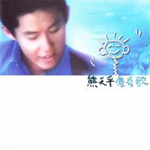

傻哥歌
============================

|  |  |
| :--: | :-- |
| [ 傻哥歌](https://emumo.xiami.com/album/5098) | **艺人**: [熊天平](../index.md) **语种**: 粤语 **唱片公司**: 上华国际 **发行时间**: 1999年01月01日 **专辑类别**: 录音室专辑 **专辑风格**: 华语唱作人 Chinese Singer-Songwriter, 粤语流行 Cantopop **播放数**: 155799 **收藏数**: 138 **评论数**: 17  |

## 简介

这是1999年乐坛的一张重要专辑，1997年超级新人熊天平两年后在香港市场推出了自己的首张粤语专辑。

 在这一集，有几首歌十分引人注目。

 有柘哉写的《傻哥歌》充满了酣厚味道，也垫定了专辑的风格；林润明在这张粤语专辑中，担任了大部分的音乐制作，最受歌迷注目的应是《快乐时光》，还差点成了台湾小熊家族的会歌；林夕的粤语词一直写的不错，这次也为小熊写了不少哦，除《快乐时光》外，还给《火柴天堂》配了粤语词，取名为《卖情人》；另一些粤语词好手如李敏也倾情创作，《失恋第五天》《不再想太多》就出自他的手笔；小熊最高兴的是能翻唱偶像罗大佑的歌曲《是否》，名为《假如》；曾写过《千千阕歌》的简宁也再度出击，《感动》让歌迷感动不已；爵士风味浓重的《Yes I Do》让歌迷惊喜不断。

 在这张CD中，还可以从另一个角度欣赏小熊的创作，想一想，《大雨带我逃亡》《夜夜夜夜》《火柴天堂》《顺其自然》小熊用粤语该是怎样一个感觉？

 《落杉矶的心事》也是一曲好听的歌，记录了旅途中的心情，可以听到流浪途中的沧桑与对生命的思考。

## 曲目

- [傻哥歌](./5098/bWij23555.md)
- [五月的雪花](./5098/Gf25c2ca.md)
- [卖情人](./5098/bggxa4047.md)
- [假如](./5098/bggya1748.md)
- [失恋第五天](./5098/bggzd028f.md)
- [我心不痛](./5098/bgg0cc7d1.md)
- [快乐时光](./5098/bgg19e8ee.md)
- [不再想太多](./5098/b6hwea800.md)
- [洛杉矶的心事](./5098/b6hxfd95a.md)
- [感动](./5098/bgg4117c9.md)
- [Yes I Do](./5098/b6hzeea99.md)

## 评论

|  |  |  |
| :-- | :-- | :-- |
|  [虾米用户](https://emumo.xiami.com/u/229269879)  2018-12-08 20:49 赞(1) 踩(0) | 
庆幸小熊有语言天分，庆幸有这张粤语专辑…粤语迷表示很开心了。
 |
|  [虾米用户](https://emumo.xiami.com/u/12919768)  2018-05-29 14:47 赞(0) 踩(0) | 
太好听了，熊熊的粤语这喜欢这首
 |
|  [虾米用户](https://emumo.xiami.com/u/11384268)  2016-12-23 05:49 赞(1) 踩(0) | 
      
 |
|  [虾米用户](https://emumo.xiami.com/u/242653974) 玩摇滚乐的、牙科医生！ 2016-11-24 19:55 赞(1) 踩(0) | 
牛逼
 |
|  [虾米用户](https://emumo.xiami.com/u/12848916)  2016-02-25 07:00 赞(1) 踩(0) | 
好仲意
 |
|  [虾米用户](https://emumo.xiami.com/u/36081194) 酷狗音乐，一个有老歌的地... 2016-02-21 23:07 赞(1) 踩(0) | 
喜欢
 |
|  [虾米用户](https://emumo.xiami.com/u/20670307)  2013-08-30 13:19 赞(2) 踩(0) | 
学生时代就喜欢他的歌曲
 |
|  [虾米用户](https://emumo.xiami.com/u/11699681)  2013-07-12 15:28 赞(1) 踩(0) | 
收了
 |
|  [虾米用户](https://emumo.xiami.com/u/3618274)   2013-05-03 22:15 赞(2) 踩(0) | 
高中的时候喜欢的，现在听还是好听。
 |
|  [虾米用户](https://emumo.xiami.com/u/102094) 我也假装自己是一个机器 2013-01-29 12:47 赞(1) 踩(0) | 
怀念
 |
|  [虾米用户](https://emumo.xiami.com/u/7713100)  2012-06-16 02:10 赞(1) 踩(0) | 
珍重！
 |
|  [虾米用户](https://emumo.xiami.com/u/7874025)  2012-04-21 19:21 赞(6) 踩(0) | 
你知道吗？有些歌无论过了多少年，听了多少次，都一样会让人双眸泛红。
 |
|  [虾米用户](https://emumo.xiami.com/u/319923) 也爱做小日日啊 2011-11-06 23:40 赞(2) 踩(0) | 
我还留有这张cd。。。闪粉签名。。。哈。
 |
| ⇒ |  [虾米用户](https://emumo.xiami.com/u/12919768)  2018-05-29 14:49 赞(0) 踩(0) | 
你历害！！！
 |
|  [虾米用户](https://emumo.xiami.com/u/3629828)  2011-04-27 15:11 赞(2) 踩(0) | 
十年前，假如这首歌，感动不只一次.......................................
 |
