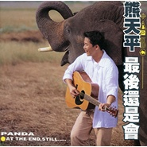

最后还是会All The End, Still
============================

|  |  |
| :--: | :-- |
| [ 最后还是会All The End, Still](https://emumo.xiami.com/album/5099) | **艺人**: [熊天平](../index.md) **语种**: 国语 **唱片公司**: 上华国际 **发行时间**: 1998年07月01日 **专辑类别**: 录音室专辑 **专辑风格**: 国语流行 Mandarin Pop, 华语唱作人 Chinese Singer-Songwriter **播放数**: 816386 **收藏数**: 435 **评论数**: 59  |

## 简介

从首张个人专辑『爱情多恼河』、DEMO创作集『火柴天堂』、到去年10月推出『雪候鸟』， 每一回发片，熊天平都交出了令人惊叹， 掷地有声的佳作， 缔造击掌叫好的的精彩销售成绩，以一个新人而言，熊天平的表现实在可圈可点，能写擅唱，清新自然的乐风走向及丰富的创作力，无疑是近年来新生代创作歌手中的佼佼者，教人不得不刮目相看。在历经9个月的筹备精心策画之下，熊天平'98最新年度大碟，终于在歌迷望眼欲穿，忠心等待和催促下于7月中旬隆重推出。

## 曲目

- [难说MV](./5099/4Yd55dff7.md)
- [最后还是会](./5099/jZuwb1287.md)
- [心碎的冰咖啡MV](./5099/fNlv8c61b.md)
- [左手的情诗](./5099/jZuy117ac.md)
- [天的上面 海的外面](./5099/ol31f7f33.md)
- [地平线](./5099/jZu0dfdfb.md)
- [I Wish](./5099/jZu1cb468.md)
- [素描 PaPa](./5099/fNl079201.md)
- [束缚](./5099/fNl1c0c33.md)
- [我是忙碌的](./5099/fNl262190.md)
- [我爱你](./5099/jZu5ae6ed.md)
- [每一分每一秒都给你](./5099/ol381b4d5.md)

## 评论

|  |  |  |  |
| :-- | :-- | :-- | :-- |
|  [虾米用户](https://emumo.xiami.com/u/377049882)  2020-03-22 00:53 赞(0) 踩(0) | 
高中时第一次买的磁带！
 |
|  [虾米用户](https://emumo.xiami.com/u/231325137)  2019-08-18 17:42 赞(1) 踩(0) | 
这张专辑也是经典制作，喜欢
 |
|  [虾米用户](https://emumo.xiami.com/u/857080) 讲不出再见，虾米有缘江湖... 2019-05-24 15:11 赞(1) 踩(0) | 
曾经上学时期非常喜欢的一位创作歌手，当年没有现在资讯那么多元丰富，渠道也就是每天的电台音乐节目和每月的音乐杂志，但当年的创作质量和歌手水准很高，怀念那个时期音乐带给我们的感动和铭记于心！
 |
|  [虾米用户](https://emumo.xiami.com/u/326152620)  2019-05-15 08:26 赞(0) 踩(0) | 
时间飞逝，感觉依旧！
 |
|  [虾米用户](https://emumo.xiami.com/u/43421355) 暂无签名~ 2019-04-18 01:59 赞(2) 踩(0) | 
江建民大湿的吉他，精彩！
 |
|  [虾米用户](https://emumo.xiami.com/u/6732260)  2019-03-21 16:14 赞(0) 踩(0) | 
最喜欢这张专辑的封面了
 |
|  [虾米用户](https://emumo.xiami.com/u/19804968)  2018-11-07 08:32 赞(0) 踩(0) | 
天平的歌都下架太早了哦
 |
|  [虾米用户](https://emumo.xiami.com/u/39869793)  2018-03-13 09:45 赞(0) 踩(0) | 
《我爱你》这首歌曲我最喜欢的，韩语的表达很纯真无邪
 |
|  [虾米用户](https://emumo.xiami.com/u/1999709) 我还没想好要写什么... 2018-02-25 07:47 赞(0) 踩(0) | 
希望再红啊
 |
|  [虾米用户](https://emumo.xiami.com/u/6480697)  2017-10-28 00:18 赞(2) 踩(0) | 
我太喜欢他的歌了，天平我永远支持你。
 |
|  [虾米用户](https://emumo.xiami.com/u/12564276)   2017-08-08 23:31 赞(0) 踩(0) | 
流水般的吉他和清澈的声线相得益彰
 |
|  [虾米用户](https://emumo.xiami.com/u/199610521)  2017-07-15 22:57 赞(2) 踩(0) | 
那一年我上初二 
 |
|  [虾米用户](https://emumo.xiami.com/u/11552826) 我还没想好要写什么... 2017-06-16 23:03 赞(0) 踩(0) | 
金曲捞   小熊也要复出了吗 
 |
| ⇒ |  [虾米用户](https://emumo.xiami.com/u/5806141)  2017-07-21 14:53 赞(0) 踩(0) | 
不会复出的~
 |
|  [虾米用户](https://emumo.xiami.com/u/287669484) 为了耳朵在各路美人间奔走 2017-04-15 20:22 赞(2) 踩(0) | 
他的专辑里我最爱的一张，束缚在我心里最佳。而且真的好喜欢封面的感觉 
 |
|  [虾米用户](https://emumo.xiami.com/u/9359574)   2016-07-13 22:51 赞(1) 踩(0) | 
除了主打最后还是会之外，束缚这首歌也相当耐听。
 |
|  [虾米用户](https://emumo.xiami.com/u/940555)  2016-07-11 23:27 赞(1) 踩(0) | 
每次听《素描PaPa》这首歌都好感动，超好听的一首熊式暖情歌！赞赞赞！！！
 |
|  [虾米用户](https://emumo.xiami.com/u/374907)  2016-01-08 21:37 赞(5) 踩(0) | 
熊天平迄今为止最后辉煌的一张专辑。这张专辑当时我却听的很少，可能还是因为熊天平的嗓音驾驭的歌曲，不少的风格都太相像。再加上他前几张实在太好听的缘故。但是今天回过头来听这张专辑，一个创作歌手的良心杰作啊。拿出来的作品几乎没有糊弄大伙耳朵的，成就似乎还在他前几张之上。熊天平，成于他的民谣创作，盛于他的清亮声线，却也败于他这单一抒情的声线，至于由偶像转变失败发胖，不在虾米讨论。
 |
| ⇒ |  [虾米用户](https://emumo.xiami.com/u/255714133)   2017-04-13 17:01 赞(0) 踩(0) | 
是啊，这张专辑的歌都质量很高
 |
|  [虾米用户](https://emumo.xiami.com/u/726752) 已下架 2015-05-25 15:31 赞(0) 踩(0) | 
太过悲伤
 |
|  [虾米用户](https://emumo.xiami.com/u/33495337) 暂无签名~ 2014-12-19 23:09 赞(0) 踩(0) | 
曾经听卡带，最喜欢这张专辑。现在听起来有很多回忆
 |
|  [虾米用户](https://emumo.xiami.com/u/1033542)  2014-03-26 22:59 赞(0) 踩(0) | 
初中时珍藏的专辑
 |
| ⇒ |  [虾米用户](https://emumo.xiami.com/u/7285332)   2014-04-17 22:50 赞(0) 踩(0) | 
珍藏在心底的歌
 |
|  [虾米用户](https://emumo.xiami.com/u/3246148)  2014-02-20 00:28 赞(3) 踩(0) | 
应该是熊天平最出色的一张专辑
 |
|  [虾米用户](https://emumo.xiami.com/u/19046126)  2013-12-21 20:13 赞(0) 踩(0) | 
好歌聲。
 |
|  [虾米用户](https://emumo.xiami.com/u/900512) 我还没想好要写什么... 2013-09-14 11:47 赞(0) 踩(0) | 
存在记忆里的歌声
 |
|  [虾米用户](https://emumo.xiami.com/u/9124265)  2013-08-28 14:40 赞(0) 踩(0) | 
the best ever :-)
 |
|  [虾米用户](https://emumo.xiami.com/u/11699681)  2013-07-12 15:29 赞(0) 踩(0) | 
收了
 |
|  [虾米用户](https://emumo.xiami.com/u/13554481)  2013-06-27 12:16 赞(1) 踩(0) | 
初中寝室睡前卡带之一
 |
|  [虾米用户](https://emumo.xiami.com/u/7065862)  2013-06-16 17:17 赞(0) 踩(0) | 
听起来都是回忆……
 |
|  [虾米用户](https://emumo.xiami.com/u/5667841) 暂无签名~ 2013-06-03 08:22 赞(1) 踩(0) | 
清澈纯净~ 听着他的歌像是望着清澈见底的小溪，慢慢流淌着
 |
|  [虾米用户](https://emumo.xiami.com/u/685609)  2013-04-24 19:37 赞(0) 踩(0) | 
永远的清澈，那么欣赏你的才华
 |
|  [虾米用户](https://emumo.xiami.com/u/1046100) 音乐是我回家最美的风景。 2012-12-10 13:55 赞(0) 踩(0) | 
回味2000年前的熊天平~~
 |
|  [虾米用户](https://emumo.xiami.com/u/1046100) 音乐是我回家最美的风景。 2012-12-10 13:55 赞(0) 踩(0) | 
回味2000年前的熊天平~~
 |
|  [虾米用户](https://emumo.xiami.com/u/5390110) 暂无签名~ 2012-12-07 16:02 赞(0) 踩(0) | 
最喜欢这张
 |
|  [虾米用户](https://emumo.xiami.com/u/6045648)  2012-11-07 23:08 赞(0) 踩(0) | 
每一分每一秒都给你，远远的上华时代
 |
|  [虾米用户](https://emumo.xiami.com/u/10274708) 暂无签名~ 2012-10-30 20:22 赞(0) 踩(0) | 
喜欢
 |
|  [虾米用户](https://emumo.xiami.com/u/9591368) 我还没想好要写什么... 2012-10-26 19:14 赞(1) 踩(0) | 
脑海里一直浮现小熊背着吉他和小象走在一起的背影，白色的上衣，卡其色的裤子……最纯真的岁月，因为小熊，变得越发干净明媚~
 |
|  [虾米用户](https://emumo.xiami.com/u/11010344) 净地净土 2012-10-11 09:24 赞(0) 踩(0) | 
干净的声音
 |
|  [虾米用户](https://emumo.xiami.com/u/125247) 文艺青年 2012-10-04 18:25 赞(0) 踩(0) | 
清新
 |
|  [虾米用户](https://emumo.xiami.com/u/8128667)   2012-06-09 03:14 赞(0) 踩(0) | 
熊天平
 |
|  [虾米用户](https://emumo.xiami.com/u/553765) 时光总是不等我们回过神就... 2012-03-09 10:49 赞(0) 踩(0) | 
曾经的卡带
 |
|  [虾米用户](https://emumo.xiami.com/u/601044)  2012-03-02 01:19 赞(0) 踩(0) | 
当年我是多么多么喜欢这张专辑
 |
|  [虾米用户](https://emumo.xiami.com/u/5539631)  2011-12-17 09:17 赞(0) 踩(0) | 
喜欢小熊的纯净声音，怀念那一份心灵的净化
 |
|  [虾米用户](https://emumo.xiami.com/u/3907) 执着于不执着 2011-12-16 19:15 赞(1) 踩(0) | 
12 每一分每一秒都给你
 |
| ⇒ |  [虾米用户](https://emumo.xiami.com/u/125247) 文艺青年 2012-10-04 18:34 赞(0) 踩(0) | 
这首歌 当年我听着就哭了
 |
|  [虾米用户](https://emumo.xiami.com/u/3977858)  2011-08-06 20:51 赞(0) 踩(0) | 
好听  最好成为 经典
 |
|  [虾米用户](https://emumo.xiami.com/u/3929298)  2011-05-14 21:29 赞(0) 踩(0) | 
纯净
 |
|  [虾米用户](https://emumo.xiami.com/u/3683410)  2011-05-13 23:06 赞(0) 踩(0) | 
经典
 |
|  [虾米用户](https://emumo.xiami.com/u/1343931)  2011-04-30 01:18 赞(0) 踩(0) | 
耐听
 |
|  [虾米用户](https://emumo.xiami.com/u/1343931)  2011-04-30 01:16 赞(1) 踩(0) | 
整张专辑都很好听，心碎的冰咖啡，天的上面海的外面，还有素描papa。经典的一张专辑，而且越听越好听，过了多年之后。
 |
| ⇒ |  [虾米用户](https://emumo.xiami.com/u/5806141)  2012-02-24 04:57 赞(0) 踩(0) | 
还有  左手的情诗  地平线
 |
| ⇒ |  [虾米用户](https://emumo.xiami.com/u/125247) 文艺青年 2012-10-04 18:36 赞(0) 踩(0) | 
<q><b>超越说：</b></q>
 |
|  [虾米用户](https://emumo.xiami.com/u/726752) 已下架 2011-03-08 19:09 赞(0) 踩(0) | 
很喜欢的专辑 学生时代的见证
 |
|  [虾米用户](https://emumo.xiami.com/u/2475461)  2011-01-20 17:59 赞(0) 踩(0) | 
上高中的时候买磁带，感觉每首歌都好听。现在听来，又回想起十多年前的事情，感概。。
 |
|  [虾米用户](https://emumo.xiami.com/u/36029) ½ 2010-07-29 09:47 赞(0) 踩(0) | 
看到这张全部歌曲的评价 真的有点怀疑我的喜好我大爱的歌基本上在后半张 但全部是差评......还是系统错了?
 |
| ⇒ |  [虾米用户](https://emumo.xiami.com/u/498661)  2010-08-18 10:13 赞(0) 踩(0) | 
因为后半张比较慢热 情感内敛
 |
| ⇒ |  [虾米用户](https://emumo.xiami.com/u/36029) ½ 2010-08-18 17:06 赞(0) 踩(0) | 
<q><b>joychou说：</b></q>
 |
| ⇒ |  [虾米用户](https://emumo.xiami.com/u/121511)  2011-08-16 15:58 赞(0) 踩(0) | 
<q><b>Smoky说：</b></q>
 |
