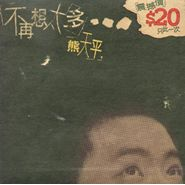

不再想太多
============================

|  |  |
| :--: | :-- |
| [ 不再想太多](https://emumo.xiami.com/album/5100) | **艺人**: [熊天平](../index.md) **语种**: 粤语 **唱片公司**: 上华国际 **发行时间**: 1998年10月01日 **专辑类别**: EP, 单曲 **专辑风格**: 华语唱作人 Chinese Singer-Songwriter, 粤语流行 Cantopop **播放数**: 21623 **收藏数**: 60 **评论数**: 14  |

## 简介

&nbsp;

## 曲目

- [不再想太多](./5100/GfO7c94a.md)
- [五月的雪花](./5100/bggJ16786.md)
- [假如](./5100/b6hEe58c4.md)
- [我心不痛](./5100/bggL9e65a.md)
- [五月的雪花(Karaoke)](./5100/bggMd61ab.md)

## 评论

|  |  |  |
| :-- | :-- | :-- |
|  [虾米用户](https://emumo.xiami.com/u/435356327)  2021-01-06 19:42 赞(1) 踩(0) | 
五月份雪花，最最最好听的歌！！！
 |
|  [虾米用户](https://emumo.xiami.com/u/10930466) 再见了虾米，还有虾米上上... 2018-12-02 00:49 赞(1) 踩(0) | 
今天第一次听熊的粤语歌
 |
|  [虾米用户](https://emumo.xiami.com/u/10930466) 再见了虾米，还有虾米上上... 2018-12-02 00:49 赞(0) 踩(0) | 
唱起粤语好优雅
 |
|  [虾米用户](https://emumo.xiami.com/u/289756053) 输入签名… 2017-06-19 23:10 赞(0) 踩(0) | 
现在还有这个盒带
 |
|  [虾米用户](https://emumo.xiami.com/u/8070377) 爱雾瑞性维欧腐漏 2015-10-26 19:38 赞(0) 踩(0) | 
是否 假如
 |
|  [虾米用户](https://emumo.xiami.com/u/1531214) 傲娇还要腹黑搭 2015-08-06 11:11 赞(2) 踩(0) | 
为何他会唱粤语 Σ( ° △ °|||)︴
 |
| ⇒ |  [虾米用户](https://emumo.xiami.com/u/19487973) 恋旧 2018-05-15 11:11 赞(0) 踩(0) | 
当年上华要给熊天平打开香港、广东市场，为了这张EP和后来的全粤语专辑，熊天平在香港呆了比较长的一段时间做宣传，还上电台做了几周的深夜节目客串主持，和吴君如一起主持的。
 |
|  [虾米用户](https://emumo.xiami.com/u/5641733) 暂无签名~ 2014-10-10 22:53 赞(0) 踩(0) | 

 |
|  [虾米用户](https://emumo.xiami.com/u/33843799) 音乐随心听 2014-09-20 09:05 赞(0) 踩(0) | 
赞。
 |
|  [虾米用户](https://emumo.xiami.com/u/14043928) 呸 2014-02-02 22:27 赞(0) 踩(0) | 
就是好听啊 其他什么话都不用说了
 |
|  [虾米用户](https://emumo.xiami.com/u/11699681)  2013-07-12 15:30 赞(0) 踩(0) | 
收了
 |
|  [虾米用户](https://emumo.xiami.com/u/11002941) 半城墨月 2012-10-10 17:09 赞(0) 踩(0) | 
1233323
 |
|  [虾米用户](https://emumo.xiami.com/u/125247) 文艺青年 2011-12-17 14:42 赞(0) 踩(0) | 
外面的网站没有这张
 |
|  [虾米用户](https://emumo.xiami.com/u/355865) Let it go, l... 2010-08-28 13:08 赞(0) 踩(0) | 
封底写着：1998年10月发行
 |
