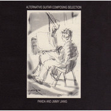

另一类吉他创作集熊天平·江建民吉他演奏专辑
============================

|  |  |
| :--: | :-- |
| [ 另一类吉他创作集熊天平·江建民吉他演奏专辑](https://emumo.xiami.com/album/5101) | **艺人**: [熊天平](../index.md) **语种**: 国语 **唱片公司**: 上华国际 **发行时间**: 1998年08月01日 **专辑类别**: 录音室专辑 **专辑风格**: 国语流行 Mandarin Pop, 华语唱作人 Chinese Singer-Songwriter, 民谣 Folk **播放数**: 185330 **收藏数**: 716 **评论数**: 62  |

## 简介

## 曲目

- [魔镜](./5101/bggNb7949.md)
- [爱情多恼河](./5101/GfU7ed8c.md)
- [与世隔绝](./5101/bggPb8af9.md)
- [Goodbye Windflower](./5101/bggQ9a50c.md)
- [旧地址](./5101/b6hLef06e.md)
- [素描 Pa Pa](./5101/cMk448e3a.md)
- [火柴天堂](./5101/bggTc9c59.md)
- [你的眼睛](./5101/Gga919be.md)
- [伤心证明书](./5101/bggVd0f41.md)
- [Mr.Moon](./5101/bggWac37c.md)
- [心有灵犀](./5101/bggXbf282.md)
- [夜夜夜夜](./5101/Gge5176b.md)

## 评论

|  |  |  |
| :-- | :-- | :-- |
|  [虾米用户](https://emumo.xiami.com/u/355780044)  2020-09-10 10:22 赞(0) 踩(0) | 
当时买了这张专辑的盒带。这么多年了，依然喜欢如初。
 |
|  [虾米用户](https://emumo.xiami.com/u/833591) 我还没想好要写什么... 2020-04-09 13:19 赞(0) 踩(0) | 
江建民2019年11月出了新的纯演奏专辑《4月16》，感兴趣的步移江建民主页吧 
 |
|  [虾米用户](https://emumo.xiami.com/u/10470769) 暂无签名~ 2018-12-12 18:07 赞(0) 踩(0) | 
好听，好多年的回忆了。
 |
|  [虾米用户](https://emumo.xiami.com/u/41945181)  2017-12-24 10:31 赞(1) 踩(0) | 
这张专真是绝了，吉他能演绎到这水平，绝了
 |
|  [虾米用户](https://emumo.xiami.com/u/39692120)  2017-11-17 22:07 赞(1) 踩(0) | 
火柴天堂是熊江两人合弹的经典
 |
|  [虾米用户](https://emumo.xiami.com/u/39692120)  2017-11-17 22:03 赞(1) 踩(0) | 
这是创作才子与吉他天才的合作
 |
|  [虾米用户](https://emumo.xiami.com/u/10472039)   2017-09-06 13:33 赞(0) 踩(0) | 
必须五星
 |
|  [虾米用户](https://emumo.xiami.com/u/287415575) 终有一个夜，燃烬在暗门 2017-07-24 15:15 赞(2) 踩(0) | 
江建民没有独自出版更多个人吉他作品是比较遗憾的。
 |
|  [虾米用户](https://emumo.xiami.com/u/19192258)  2017-01-07 00:31 赞(0) 踩(0) | 
好听
 |
|  [虾米用户](https://emumo.xiami.com/u/11384268)  2016-11-12 21:24 赞(1) 踩(0) | 
小熊的歌是我学生时代最棒的记忆(๑• . •๑)
 |
|  [虾米用户](https://emumo.xiami.com/u/52731020) 乐.悦.越 2016-02-28 14:01 赞(0) 踩(0) | 
喜欢
 |
|  [虾米用户](https://emumo.xiami.com/u/3017766) 半醉的我披上破烂的毛衣，... 2015-09-12 09:53 赞(1) 踩(0) | 
清脆的弦
 |
|  [虾米用户](https://emumo.xiami.com/u/40408200)  2015-04-27 16:30 赞(0) 踩(0) | 
很喜欢的
 |
|  [虾米用户](https://emumo.xiami.com/u/8070377) 爱雾瑞性维欧腐漏 2014-12-13 22:33 赞(0) 踩(0) | 
多瑙河这吉他钢琴我的天 轮番轰炸要死了
 |
|  [虾米用户](https://emumo.xiami.com/u/17551482)  2014-08-15 21:09 赞(0) 踩(0) | 
最爱的乐器.
 |
|  [虾米用户](https://emumo.xiami.com/u/29884539)  2014-07-15 15:38 赞(0) 踩(0) | 
吉他
 |
|  [虾米用户](https://emumo.xiami.com/u/11389164)  2014-02-26 18:21 赞(6) 踩(0) | 
******
 |
| ⇒ |  [虾米用户](https://emumo.xiami.com/u/8681250) 暂无签名~ 2014-10-19 16:54 赞(0) 踩(0) | 
同感，为那些不懂音乐却贩卖cd的老板子们捏把汗！
 |
| ⇒ |  [虾米用户](https://emumo.xiami.com/u/2762869) Messic 2014-12-14 10:37 赞(0) 踩(0) | 
这种感觉爽翻天
 |
| ⇒ |  [虾米用户](https://emumo.xiami.com/u/11389164)  2014-12-14 22:50 赞(0) 踩(0) | 
<q><b>Allen说：</b></q>
 |
|  [虾米用户](https://emumo.xiami.com/u/8496989)  2013-12-18 15:13 赞(0) 踩(0) | 
Good！
 |
|  [虾米用户](https://emumo.xiami.com/u/7269831) (´・ω・`) 2013-11-27 21:05 赞(0) 踩(0) | 
简单~~
 |
|  [虾米用户](https://emumo.xiami.com/u/26043687)  2013-11-11 21:49 赞(2) 踩(0) | 
超级经典，习琴岁月难忘的回忆
 |
|  [虾米用户](https://emumo.xiami.com/u/11699681)  2013-07-12 15:31 赞(0) 踩(0) | 
觉得经典！！！！
 |
|  [虾米用户](https://emumo.xiami.com/u/16868548)  2013-07-06 03:25 赞(0) 踩(0) | 
喜欢这吉他
 |
|  [虾米用户](https://emumo.xiami.com/u/11699681)  2013-04-21 15:53 赞(0) 踩(0) | 
收了
 |
|  [虾米用户](https://emumo.xiami.com/u/13829440)  2013-04-05 18:53 赞(0) 踩(0) | 
喜欢这吉他
 |
|  [虾米用户](https://emumo.xiami.com/u/714633)  2013-03-19 20:51 赞(3) 踩(0) | 
随身听时代，经常放在身边的卡带，背包旅行耳朵里是江建民和熊天平温柔动情的吉他声，想起来都觉得温暖。ps 他有滑雪教练的资质证，出道时经常被经纪人逼着节食健身，早年的访谈里谈自己是易胖体质，我还以为他开玩笑，他和陶子分手后就真的走上了熊大叔的不归路，真希望他能减减肥去参加@我是歌手
 |
| ⇒ |  [虾米用户](https://emumo.xiami.com/u/132576)  2015-11-04 19:25 赞(0) 踩(0) | 
千万别～～～
 |
|  [虾米用户](https://emumo.xiami.com/u/13512863)  2013-03-14 10:43 赞(1) 踩(0) | 
好听
 |
|  [虾米用户](https://emumo.xiami.com/u/2443865) 流过记忆的河 2013-02-03 10:35 赞(1) 踩(0) | 
江建民啊！温暖琴声！
 |
|  [虾米用户](https://emumo.xiami.com/u/11321009)  2012-11-30 18:31 赞(1) 踩(0) | 
熊天平专辑里面唯一一张全吉他的作品，很好听。
 |
|  [虾米用户](https://emumo.xiami.com/u/5748560)  2012-11-27 13:30 赞(1) 踩(0) | 
江建民，台湾最欣赏的吉他手，熊天平，台湾最欣赏的民谣创作者。
 |
|  [虾米用户](https://emumo.xiami.com/u/6045648)  2012-11-11 20:26 赞(0) 踩(0) | 
这么多年过去，已经没有这么纯粹好听的音乐了，
 |
|  [虾米用户](https://emumo.xiami.com/u/10534467) 继续无聊，继续听歌 2012-10-05 08:44 赞(0) 踩(0) | 
喜欢
 |
|  [虾米用户](https://emumo.xiami.com/u/10534467) 继续无聊，继续听歌 2012-10-05 08:38 赞(0) 踩(0) | 
喜欢
 |
|  [虾米用户](https://emumo.xiami.com/u/375760)  2012-09-08 20:43 赞(0) 踩(0) | 
初中记忆
 |
|  [虾米用户](https://emumo.xiami.com/u/10040974) 你说的话总那么好听～ 2012-08-14 08:07 赞(0) 踩(0) | 
安静、唯美
 |
|  [虾米用户](https://emumo.xiami.com/u/6011225) 幸せになりたいけど頑張り 2012-06-02 14:28 赞(14) 踩(0) | 
这张专辑曾经陪我度过高中的三年，记得那时候还是卡带。 在画室里一整天画画的时候，在外采风写生的时候，独自一人到异地坐几个小时的火车的时候，一盒卡带反复听，直到带子报废。 之后，找了很多音像店却没有再找到。 十多年后的今天，一个普通的不能再普通的下午。这种邂逅让心里暖暖的，酸酸的。
 |
| ⇒ |  [虾米用户](https://emumo.xiami.com/u/8070377) 爱雾瑞性维欧腐漏 2015-01-14 20:24 赞(0) 踩(0) | 
看你的评论我也觉得鼻子酸酸的
 |
| ⇒ |  [虾米用户](https://emumo.xiami.com/u/8664275)  2016-08-01 23:15 赞(0) 踩(0) | 
同感！不过我是大学时期听到的！每晚听着入睡
 |
|  [虾米用户](https://emumo.xiami.com/u/602629)  2012-02-21 15:54 赞(0) 踩(0) | 
江建民  资深啊
 |
|  [虾米用户](https://emumo.xiami.com/u/408387)  2012-01-17 21:31 赞(0) 踩(0) | 
被心有灵犀那首曲子吸引了~~
 |
|  [虾米用户](https://emumo.xiami.com/u/3611743) 我还没想好要写什么... 2011-08-02 12:58 赞(0) 踩(0) | 
吉他
 |
|  [虾米用户](https://emumo.xiami.com/u/252018) 恋上高海拔 2011-07-24 16:33 赞(0) 踩(0) | 
quiet inside
 |
|  [虾米用户](https://emumo.xiami.com/u/252018) 恋上高海拔 2011-07-24 16:23 赞(0) 踩(0) | 
一个人的周末下午。
 |
|  [虾米用户](https://emumo.xiami.com/u/4089262)  2011-07-20 18:25 赞(0) 踩(0) | 
江建民和熊天平
 |
|  [虾米用户](https://emumo.xiami.com/u/4311564)  2011-06-24 15:41 赞(0) 踩(0) | 
找了好久了！
 |
|  [虾米用户](https://emumo.xiami.com/u/4069707)  2011-06-16 19:39 赞(0) 踩(0) | 
吉他
 |
|  [虾米用户](https://emumo.xiami.com/u/613961)  2011-05-06 09:48 赞(0) 踩(0) | 
好听的吉他曲。
 |
|  [虾米用户](https://emumo.xiami.com/u/613961)  2011-05-06 09:47 赞(0) 踩(0) | 
吉他曲很好听。。
 |
|  [虾米用户](https://emumo.xiami.com/u/3248542)  2011-03-18 09:52 赞(0) 踩(0) | 
另一类吉他
 |
|  [虾米用户](https://emumo.xiami.com/u/2551107)  2011-02-11 14:18 赞(0) 踩(0) | 
SOFT SADLY GOOD SENT,WHO SHARE WITH ME?
 |
|  [虾米用户](https://emumo.xiami.com/u/2551107)  2011-02-11 14:17 赞(0) 踩(0) | 
非常好听的吉他，中国式的，
 |
|  [虾米用户](https://emumo.xiami.com/u/2212796)  2011-01-06 22:04 赞(0) 踩(0) | 
额.....谁有这个cd我想买...
 |
| ⇒ |  [虾米用户](https://emumo.xiami.com/u/121511)  2017-10-28 00:24 赞(0) 踩(0) | 
淘宝网上偶尔会出现一张。我和另一个朋友就在淘宝上淘到的。 没事儿就去淘宝搜一下，也许还能碰到台版CD。
 |
|  [虾米用户](https://emumo.xiami.com/u/1700788)  2010-11-30 08:57 赞(0) 踩(0) | 
就是喜欢这样的吉他乐。。。
 |
|  [虾米用户](https://emumo.xiami.com/u/1372328) 我还没想好要写什么... 2010-09-30 16:02 赞(0) 踩(0) | 
当年还买的时候还是卡带。。。珍藏之。
 |
|  [虾米用户](https://emumo.xiami.com/u/12632)  2009-04-24 10:13 赞(1) 踩(0) | 
同时也推荐大家看一下《吉它三部曲》的MV,也是拍的相当精彩~
 |
| ⇒ |  [虾米用户](https://emumo.xiami.com/u/5025) mockee.com 2010-01-31 14:13 赞(0) 踩(0) | 
对，十分喜欢:)
 |
| ⇒ |  [虾米用户](https://emumo.xiami.com/u/498661)  2010-08-18 10:27 赞(0) 踩(0) | 
《旧地址》和《伤心证明书》他有唱过么？好像没听过啊
 |
| ⇒ |  [虾米用户](https://emumo.xiami.com/u/121511)  2011-02-11 12:58 赞(0) 踩(0) | 
<q><b>joychou说：</b></q>
 |
