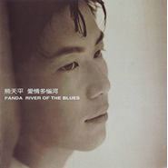

爱情多恼河River Of The Blues
============================

|  |  |
| :--: | :-- |
| [ 爱情多恼河River Of The Blues](https://emumo.xiami.com/album/5105) | **艺人**: [熊天平](../index.md) **语种**: 国语 **唱片公司**: 上华国际 **发行时间**: 1997年01月01日 **专辑类别**: 录音室专辑 **专辑风格**: 国语流行 Mandarin Pop, 华语唱作人 Chinese Singer-Songwriter **播放数**: 2119766 **收藏数**: 1027 **评论数**: 123  |

## 简介

清晨 雾 河畔 白纱窗&nbsp; 

 琴弦 往事 热茶的蒸气&nbsp; 

 船升起帆告知风的去向&nbsp; 

 轻描淡写的港口映在眼眶&nbsp; 

 没有人告诉我生命何以开始&nbsp; 

 我只是自然而然就握起了笔 拨起了弦&nbsp; 

 记下一些符号和字迹&nbsp; 

 从来也没想到创作的作品唱出的声音&nbsp; 

 会有什么命运？&nbsp; 

 在学校，在民歌餐厅，在等待又等待出版作品的日子里&nbsp; 

 生活多了一些和创作比较无关的事情&nbsp; 

 臂如签约，解约，投稿，等待......&nbsp; 

 这很象爱情走到婚姻后，会容入很多现实&nbsp; 

 写《爱情多恼河》这些作品后&nbsp; 

 我看到了一个可能实现的未来&nbsp; 

 那就是[我依然是原来的我]&nbsp; 

 但我知道，生命是一条起伏不平，转变的河流&nbsp; 

 不可能笔直通向大海&nbsp; 

 一个住在谷关22年的我&nbsp; 

 一个在都市熟悉了多年的我&nbsp; 

 每次我的心情跌到谷底的时侯&nbsp; 

 就会有个声音对我说：“回谷关吧”&nbsp; 

 一切的发展总会有个源头&nbsp; 

 只是未到尽头谁也难预测&nbsp; 

 它会怎么湍流&nbsp; 

 我是漂流的&nbsp; 

 在爱情多恼河上&nbsp; 

 经过夜的寂寞&nbsp; 

 投宿梦的码头&nbsp; 

 并不时回头&nbsp; 

 熊天平/《爱情多恼河》序&nbsp; 

 --------------------------------------------------------&nbsp; 

 是一种旋律，如同清澈见底的河水，回荡在耳畔；&nbsp; 

 是一种声音，纯净得没有一丝杂质，飘浮在心间。&nbsp; 

 这就是熊天平，和他带来的幽幽多恼河，不必修饰的真实。&nbsp; 

 在他的这张处女作里，我们听到的，不只是纯净的音乐自始至终的温柔，更有小熊对音乐的《坚贞》，和他对八年孤寂岁月的艰辛回顾。&nbsp; 

 这寂寞无数的八年，音乐并没有遗忘天平，命运对坎坷的回报是丰富的。&nbsp; 

 他的追随者们有着与天平一样对音乐的执着追求与感受。&nbsp; 

 他们在天平无瑕的歌声里寻找着，在现实与梦想的冲突里完善着。&nbsp; 

 “教我/怎样失去信仰/天堂/原来只是梦一场”&nbsp; 

 刚出道的天平就象一个出涉人世的孩子，需要人细心的呵护，而他，更有自己独特的见解，用坚定的态度面对未知。 

 当你学会了正面挫折，也就听懂了《爱情多恼河》。 

## 曲目

- [愚人码头](./5105/bWjv1f274.md)
- [爱情多恼河MV](./5105/GgE4f7aa.md)
- [你的眼睛MV](./5105/b6i3e3600.md)
- [不让步](./5105/dmmg3b0b6.md)
- [Goodbye Windflower](./5105/b6i5f19fd.md)
- [太去在意](./5105/bWj01ee99.md)
- [摆脱MV](./5105/GgJ7265d.md)
- [玻璃娃娃](./5105/bWj23a28b.md)
- [相思无解](./5105/dmml352eb.md)
- [周末下雨](./5105/GgMa4b0d.md)
- [忠贞](./5105/bghHa5ecd.md)
- [夜夜夜夜 (Demo)MV原唱: 齐秦](./5105/bghIa70df.md)

## 评论

|  |  |  |  |
| :-- | :-- | :-- | :-- |
|  [虾米用户](https://emumo.xiami.com/u/275867110) 我还没想好要写什么... 2019-11-06 11:31 赞(0) 踩(0) | 
爆发的一张专辑！
 |
|  [虾米用户](https://emumo.xiami.com/u/1865141)  2019-05-12 18:04 赞(0) 踩(0) | 
男人的纯情与感性
 |
|  [虾米用户](https://emumo.xiami.com/u/406810151)  2019-03-28 15:41 赞(0) 踩(0) | 
幾厂建↖
 |
|  [虾米用户](https://emumo.xiami.com/u/5806141)  2019-02-28 16:42 赞(1) 踩(0) | 
第一张就封神 压力可想而知
 |
|  [虾米用户](https://emumo.xiami.com/u/406463209) 我还没想好要写什么... 2019-01-23 20:42 赞(1) 踩(0) | 
青春的回忆
 |
|  [虾米用户](https://emumo.xiami.com/u/10930466) 再见了虾米，还有虾米上上... 2018-12-02 00:33 赞(2) 踩(0) | 
封面好帅啊！
 |
|  [虾米用户](https://emumo.xiami.com/u/50039235) 缘来缘去缘似水··· 2018-08-12 12:04 赞(1) 踩(0) | 
好听
 |
|  [虾米用户](https://emumo.xiami.com/u/5693589)  2018-06-13 16:08 赞(0) 踩(0) | 
全碟已无损。
 |
|  [虾米用户](https://emumo.xiami.com/u/96797478) 简阳历史见证者 2018-05-31 07:01 赞(0) 踩(0) | 
经典之作
 |
|  [虾米用户](https://emumo.xiami.com/u/19487973) 恋旧 2018-05-14 11:13 赞(2) 踩(0) | 
这盘卡带我还留着，我的高中时代呀，真想回到过去+_+
 |
|  [虾米用户](https://emumo.xiami.com/u/113281060)  2018-05-06 20:18 赞(1) 踩(0) | 
愚人码头好听
 |
|  [虾米用户](https://emumo.xiami.com/u/267443726)  2018-02-27 22:22 赞(0) 踩(0) | 
经典之作！
 |
|  [虾米用户](https://emumo.xiami.com/u/8287565)  2018-02-27 10:09 赞(0) 踩(0) | 
好棒虽然不喜欢男生这么唱歌，但词曲编曲都是一流的，真有才华。然后看了评论去听了他和老婆的新歌，呵呵呵呵呵呵呵呵呵呵呵呵呵呵呵
 |
|  [虾米用户](https://emumo.xiami.com/u/173575168)  2018-01-22 17:46 赞(0) 踩(0) | 
想起了我的大学时代
 |
|  [虾米用户](https://emumo.xiami.com/u/11552826) 我还没想好要写什么... 2017-12-19 21:40 赞(13) 踩(0) | 
听了他和他老婆的新歌赶紧回来压压惊
 |
| ⇒ |  [虾米用户](https://emumo.xiami.com/u/5806141)  2018-02-06 22:17 赞(0) 踩(0) | 
哈哈哈哈哈哈 海上生明月
 |
|  [虾米用户](https://emumo.xiami.com/u/10930466) 再见了虾米，还有虾米上上... 2017-11-30 19:22 赞(2) 踩(0) | 
词曲俱佳，唱的更是自然优雅又深情，上世纪上华唱片的天王
 |
|  [虾米用户](https://emumo.xiami.com/u/2724623) NULL 2017-11-06 21:38 赞(0) 踩(0) | 
1997～2017
 |
|  [虾米用户](https://emumo.xiami.com/u/9359574)   2017-10-28 00:44 赞(5) 踩(0) | 
熊天平横空出世的一张至今听来仍无懈可击的专辑！
 |
|  [虾米用户](https://emumo.xiami.com/u/3989578) 音乐无国界 2017-10-17 19:16 赞(0) 踩(0) | 
多么清纯的专辑，从声音到歌曲，再也不能够了。
 |
|  [虾米用户](https://emumo.xiami.com/u/8070377) 爱雾瑞性维欧腐漏 2017-08-30 23:24 赞(0) 踩(0) | 
神音色
 |
|  [虾米用户](https://emumo.xiami.com/u/84849248)  2017-06-04 20:56 赞(1) 踩(0) | 
小熊的声音特别是高音总是让人感动
 |
|  [虾米用户](https://emumo.xiami.com/u/4411532)  2017-05-27 00:40 赞(0) 踩(0) | 
这盘磁带对我来讲是有故事的，那个2001年的圣诞节上的邂逅，刘骏&amp;hellip;&amp;hellip;曾经的爱，你好吗？有些人不再交集不再相见不再在一起&amp;hellip;&amp;hellip;&amp;hellip;
 |
|  [虾米用户](https://emumo.xiami.com/u/6404288)  2016-11-09 00:38 赞(0) 踩(0) | 
想起了周深……要是走红在这个年代，不知又会是怎样一个故事，一段星途了
 |
|  [虾米用户](https://emumo.xiami.com/u/94034298)  2016-10-20 06:39 赞(4) 踩(0) | 
学生时代被熊天平这么清澈质朴的声线+创作才能深深着迷！
 |
|  [虾米用户](https://emumo.xiami.com/u/10492280)  2016-06-24 02:42 赞(0) 踩(0) | 
纯净无染的经典男生 周深童鞋的声音有点像熊熊
 |
|  [虾米用户](https://emumo.xiami.com/u/116177524)  2016-05-08 15:15 赞(0) 踩(0) | 
90年代绝对的代表专辑！
 |
|  [虾米用户](https://emumo.xiami.com/u/47310048) 搓圆又打bia, 打bi... 2016-05-01 22:50 赞(0) 踩(0) | 
年轻时好帅哦
 |
|  [虾米用户](https://emumo.xiami.com/u/8477501)  2016-04-03 00:31 赞(2) 踩(0) | 
小熊当年是满怀诗情的吉他才子，我心中的小熊王子，虽然才刚刚听你的歌，却很容易被迷住了。如果校园里有这样背着吉他自弹自唱的大男孩，那肯定是校草级别的人物了，自己就是一幅美丽的风景。
 |
|  [虾米用户](https://emumo.xiami.com/u/454506) 我还没想好要写什么... 2016-03-28 11:56 赞(0) 踩(0) | 
英文名字是Panda? 也太可愛了
 |
|  [虾米用户](https://emumo.xiami.com/u/23702789) 这些年有多远走多远不停歇... 2015-12-03 20:07 赞(0) 踩(0) | 
那年听得如痴如醉！从此喜欢上他的音乐！
 |
|  [虾米用户](https://emumo.xiami.com/u/10930466) 再见了虾米，还有虾米上上... 2015-11-28 13:59 赞(2) 踩(0) | 
这张封面好帅，音色唱腔咬字歌词和旋律浪漫的像个深情的王子，那种细腻优雅深情的线条，整个中文流行音乐男歌手里有这种气质的，个人觉得张信哲、童安格、熊天平、林隆璇
 |
|  [虾米用户](https://emumo.xiami.com/u/16050797)   2015-09-01 02:23 赞(2) 踩(0) | 
最爱的男声最爱的男生气质
 |
|  [虾米用户](https://emumo.xiami.com/u/40124694)  2015-08-18 14:00 赞(0) 踩(0) | 
APE无损资源已更新：<a href="http://www.162wp.com/yinle/2015-08-18/24755.html" target="_blank" rel="nofollow noreferrer noopener">http://www.162wp.com/yinle/2015-08-18/24755.html</a>
 |
|  [虾米用户](https://emumo.xiami.com/u/3187095)  2015-05-11 23:19 赞(1) 踩(0) | 
还记得当年看吕洞宾听到相思无解时掉下的一身鸡皮疙瘩
 |
|  [虾米用户](https://emumo.xiami.com/u/10573893) 虾米音乐最爱最爱 2015-04-29 08:51 赞(1) 踩(0) | 
首张专辑就红了
 |
|  [虾米用户](https://emumo.xiami.com/u/40408200)  2015-04-19 17:29 赞(0) 踩(0) | 
很久以前就喜欢的歌
 |
|  [虾米用户](https://emumo.xiami.com/u/6625130)  2015-04-07 16:33 赞(1) 踩(0) | 
haoting
 |
|  [虾米用户](https://emumo.xiami.com/u/8070377) 爱雾瑞性维欧腐漏 2014-12-13 22:38 赞(0) 踩(0) | 
声音无解
 |
| ⇒ |  [虾米用户](https://emumo.xiami.com/u/3246148)  2014-12-31 03:21 赞(0) 踩(0) | 
卧槽又在这里遇见了！他在我心中的位置几乎不次于H.O.T.啊！！
 |
| ⇒ |  [虾米用户](https://emumo.xiami.com/u/8070377) 爱雾瑞性维欧腐漏 2015-01-01 10:07 赞(0) 踩(0) | 
<q><b>Celena Ahn说：</b></q>
 |
| ⇒ |  [虾米用户](https://emumo.xiami.com/u/3246148)  2015-01-02 11:07 赞(0) 踩(0) | 
<q><b>　　　夜宵与战争 ☾　说：</b></q>
 |
| ⇒ |  [虾米用户](https://emumo.xiami.com/u/8070377) 爱雾瑞性维欧腐漏 2015-01-02 20:50 赞(0) 踩(0) | 
<q><b>Celena Ahn说：</b></q>
 |
| ⇒ |  [虾米用户](https://emumo.xiami.com/u/3246148)  2015-01-02 22:56 赞(0) 踩(0) | 
<q><b>　　　夜宵与战争 ☾　说：</b></q>
 |
| ⇒ |  [虾米用户](https://emumo.xiami.com/u/8477501)  2016-04-03 00:27 赞(0) 踩(0) | 
<q><b>Celena Ahn说：</b></q>
 |
|  [虾米用户](https://emumo.xiami.com/u/41391100)  2014-09-28 16:29 赞(0) 踩(0) | 
最爱熊天平
 |
|  [虾米用户](https://emumo.xiami.com/u/8384826) 再见，虾米，谢谢！ 2014-09-17 00:10 赞(0) 踩(0) | 
经典
 |
|  [虾米用户](https://emumo.xiami.com/u/36286080)   2014-09-04 16:42 赞(1) 踩(0) | 
精品 和杰伦的范特西一样 本人也无法超越
 |
|  [虾米用户](https://emumo.xiami.com/u/40341992)  2014-08-24 22:09 赞(0) 踩(0) | 
当年的正太已俨然成了大叔
 |
|  [虾米用户](https://emumo.xiami.com/u/8825007)  2014-08-24 17:53 赞(1) 踩(0) | 
当年在电台听到爱情多恼河，就攒了钱，到音像店淘回来，后来发现，盗版的，泪奔，又攒了好久，才买了一盘正版。97年那时刚刚开始有点点零花钱的，买一盘磁带多么不容易啊。那时小熊多可爱的，你的眼睛MV里那白衣飘飘的少年，婚后那个样子。。。那个震撼感，跟贾宝玉出现时简直是一样一样的。。。管他呢，也许过得好就行吧
 |
| ⇒ |  [虾米用户](https://emumo.xiami.com/u/40138251)  2014-09-04 00:48 赞(0) 踩(0) | 
t了他。 m的？t
 |
|  [虾米用户](https://emumo.xiami.com/u/2492453)  2014-08-23 15:47 赞(0) 踩(0) | 
就在这下雨天的周末，陪自己唱情歌。
 |
|  [虾米用户](https://emumo.xiami.com/u/4187272) 多洗心灵少洗脑 2014-08-21 22:08 赞(36) 踩(0) | 
太过强势的处女作 给自己封死了退路
 |
| ⇒ |  [虾米用户](https://emumo.xiami.com/u/7307011) 难得遇知音 2014-08-31 22:29 赞(0) 踩(0) | 
正解，一步即巅峰……
 |
| ⇒ |  [虾米用户](https://emumo.xiami.com/u/6045648)  2015-02-16 15:50 赞(0) 踩(0) | 
后面几张也很好啊，不过第一张确实过分强了。
 |
| ⇒ |  [虾米用户](https://emumo.xiami.com/u/39296898)  2017-06-18 15:53 赞(0) 踩(0) | 
<q><b>dsynonym说：</b></q>
 |
|  [虾米用户](https://emumo.xiami.com/u/806959)  2014-08-21 16:45 赞(0) 踩(0) | 
安静
 |
|  [虾米用户](https://emumo.xiami.com/u/1882463) 我还没想好要写什么... 2014-08-20 23:15 赞(0) 踩(0) | 
再也听不到熊天平的歌了，那时候最爱的一张。
 |
|  [虾米用户](https://emumo.xiami.com/u/15980953) 暗恋桃花源1900 2014-08-10 22:02 赞(0) 踩(0) | 
你的眼睛，极好的作品，完美的演绎！
 |
|  [虾米用户](https://emumo.xiami.com/u/1676910)  2014-08-04 00:54 赞(0) 踩(0) | 
这张专辑太好听了，现在还有这种经典专辑吗？
 |
|  [虾米用户](https://emumo.xiami.com/u/12491564)  2014-07-30 23:11 赞(0) 踩(0) | 
#暴露年龄的歌曲#
 |
|  [虾米用户](https://emumo.xiami.com/u/8205829)  2014-07-01 13:29 赞(0) 踩(0) | 
突然听到的旧声音
 |
|  [虾米用户](https://emumo.xiami.com/u/10406311)  2014-06-25 18:56 赞(0) 踩(0) | 
为了一个女人   可惜了他
 |
|  [虾米用户](https://emumo.xiami.com/u/9192596)  2014-06-06 22:54 赞(0) 踩(0) | 
为何没人提东游记，相思无解
 |
|  [虾米用户](https://emumo.xiami.com/u/8073845)  2014-05-24 15:33 赞(0) 踩(0) | 
很美的声音，sss级
 |
|  [虾米用户](https://emumo.xiami.com/u/34916918) 河流 2014-05-23 13:36 赞(0) 踩(0) | 
指尖游滑过心灵的歌喉……
 |
|  [虾米用户](https://emumo.xiami.com/u/5874686) 「音乐是种情怀」是你的声... 2014-05-19 02:15 赞(0) 踩(0) | 
听着这张专辑 看着这张专辑封面 激起了我的怜爱之心和保护欲 我是女的。。。。。。
 |
| ⇒ |  [虾米用户](https://emumo.xiami.com/u/8477501)  2017-10-27 22:59 赞(0) 踩(0) | 
MV里的熊天平更令人怜爱，完全的校园王子
 |
|  [虾米用户](https://emumo.xiami.com/u/2940320) 华语乐迷唱片控 2014-05-13 21:20 赞(0) 踩(0) | 
多么耐听舒服的一张
 |
|  [虾米用户](https://emumo.xiami.com/u/1886211)  2014-05-05 21:47 赞(0) 踩(0) | 
爱情多瑙河+你的眼睛+相思无解=我听哭的一万次眼泪！
 |
|  [虾米用户](https://emumo.xiami.com/u/14932142) zoro(⊙o⊙) 2014-04-08 12:31 赞(0) 踩(0) | 
熊熊
 |
|  [虾米用户](https://emumo.xiami.com/u/1700948)   2014-02-17 01:09 赞(2) 踩(0) | 
瞬间的美好已很不容易，何必强求永远
 |
|  [虾米用户](https://emumo.xiami.com/u/9896850) 我还没想好要写什么... 2014-01-09 20:06 赞(1) 踩(0) | 
上华的经典专辑
 |
|  [虾米用户](https://emumo.xiami.com/u/17326367) 爱就是极快速的能量振动 2013-11-07 18:03 赞(0) 踩(0) | 
8/12 3.3分   熊天平 一个如此让人心动的歌手 如此纯净
 |
|  [虾米用户](https://emumo.xiami.com/u/355865) Let it go, l... 2013-10-27 21:50 赞(2) 踩(0) | 
虾米这张专辑的试听率排序，基本上也就是我个人觉得这张专辑曲目的好听程度的排序～用虾米用久了，就会发现很多细节都出乎意料地深得我心，自己习惯了虾米，虾米也渐渐满足了自己的品味。
 |
| ⇒ |  [虾米用户](https://emumo.xiami.com/u/230554) ■□■□■□■□■□■□ 2013-10-28 10:48 赞(0) 踩(0) | 
其实我觉得“你的眼睛”我首试听率低了。
 |
|  [虾米用户](https://emumo.xiami.com/u/6524524)  2013-10-18 20:10 赞(0) 踩(0) | 
这张真的很赞
 |
|  [虾米用户](https://emumo.xiami.com/u/9124265)  2013-08-28 14:45 赞(0) 踩(0) | 
the best ever :-)
 |
|  [虾米用户](https://emumo.xiami.com/u/11699681)  2013-07-12 15:37 赞(0) 踩(0) | 
收了
 |
|  [虾米用户](https://emumo.xiami.com/u/11699681)  2013-07-12 15:37 赞(1) 踩(0) | 
尼玛“相思无解”太好听了，呵
 |
|  [虾米用户](https://emumo.xiami.com/u/16912) 暖~ 2013-06-04 13:48 赞(0) 踩(0) | 
当时是别人推荐买的这本专辑，那时还是卡带。晚上回到家里一下就被迷住了。
 |
|  [虾米用户](https://emumo.xiami.com/u/3890196) 以夢為馬 2013-05-05 20:55 赞(0) 踩(0) | 
值得一听
 |
|  [虾米用户](https://emumo.xiami.com/u/6363387)  2013-04-12 00:46 赞(0) 踩(0) | 
愚人码头，爱情多瑙河，你的眼睛都是经典之作
 |
|  [虾米用户](https://emumo.xiami.com/u/8218821)  2013-03-21 22:58 赞(0) 踩(0) | 
everlasting classic, to my youth that fading away...
 |
|  [虾米用户](https://emumo.xiami.com/u/13422901) 虾米还是被收购前的虾米么 2013-03-17 21:46 赞(0) 踩(0) | 
时光的记忆。
 |
|  [虾米用户](https://emumo.xiami.com/u/2617510) secret stand 2013-03-17 11:06 赞(0) 踩(0) | 
初中这盘磁带伴随我读过了多少个周末
 |
|  [虾米用户](https://emumo.xiami.com/u/13416311)  2013-03-13 09:21 赞(0) 踩(0) | 
like
 |
|  [虾米用户](https://emumo.xiami.com/u/1460647) 我还没想好要写什么... 2013-02-17 01:57 赞(0) 踩(0) | 
嗓音独特，可惜昙花一现，听这一张就够了
 |
|  [虾米用户](https://emumo.xiami.com/u/12798417)  2013-02-07 13:35 赞(0) 踩(0) | 
怀念......
 |
|  [虾米用户](https://emumo.xiami.com/u/7604962)  2013-01-24 22:21 赞(0) 踩(0) | 
写的好听，唱的也好听
 |
|  [虾米用户](https://emumo.xiami.com/u/8693446)  2013-01-04 07:03 赞(0) 踩(0) | 
经典珍藏
 |
|  [虾米用户](https://emumo.xiami.com/u/5748560)  2012-11-27 13:27 赞(0) 踩(0) | 
清晨 雾 河畔 白纱窗琴弦 往事 热茶的蒸气船升起帆告知风的去向
 |
|  [虾米用户](https://emumo.xiami.com/u/8022494) b 2012-11-12 23:14 赞(0) 踩(0) | 
Good so
 |
|  [虾米用户](https://emumo.xiami.com/u/10274708) 暂无签名~ 2012-10-30 19:47 赞(0) 踩(0) | 
首首经典
 |
|  [虾米用户](https://emumo.xiami.com/u/10274708) 暂无签名~ 2012-10-30 19:45 赞(2) 踩(0) | 
美好的1997年
 |
|  [虾米用户](https://emumo.xiami.com/u/10274708) 暂无签名~ 2012-10-30 19:40 赞(2) 踩(0) | 
致我们终将逝去的青春
 |
|  [虾米用户](https://emumo.xiami.com/u/2339084)  2012-09-01 22:06 赞(0) 踩(0) | 
最爱的男声！！！没有“之一”~
 |
|  [虾米用户](https://emumo.xiami.com/u/4275776) 虾米音质检测督查账号 2012-08-24 16:08 赞(1) 踩(0) | 
熊天平童鞋生日快乐哦! 希望晚上演出顺利~
 |
| ⇒ |  [虾米用户](https://emumo.xiami.com/u/121511)  2012-09-16 21:01 赞(0) 踩(0) | 
那天你也去了？
 |
| ⇒ |  [虾米用户](https://emumo.xiami.com/u/4275776) 虾米音质检测督查账号 2012-09-17 10:04 赞(0) 踩(0) | 
<q><b>麦田青青说：</b></q>
 |
| ⇒ |  [虾米用户](https://emumo.xiami.com/u/121511)  2012-09-17 11:49 赞(0) 踩(0) | 
<q><b>320K专门店说：</b></q>
 |
|  [虾米用户](https://emumo.xiami.com/u/7580393) 欢迎来查询非320K专辑 2012-06-15 13:25 赞(2) 踩(0) | 
已更新320K
 |
| ⇒ |  [虾米用户](https://emumo.xiami.com/u/355865) Let it go, l... 2012-06-18 22:48 赞(0) 踩(0) | 
已更新320K
 |
|  [虾米用户](https://emumo.xiami.com/u/8128667)   2012-06-09 02:47 赞(0) 踩(0) | 
熊天平
 |
|  [虾米用户](https://emumo.xiami.com/u/355865) Let it go, l... 2012-05-28 13:27 赞(1) 踩(0) | 
ECD0011
 |
|  [虾米用户](https://emumo.xiami.com/u/3382835)  2012-05-11 09:15 赞(0) 踩(0) | 
爱情多瑙河
 |
|  [虾米用户](https://emumo.xiami.com/u/784923) 镜头晃得我有些晕 2012-04-07 11:02 赞(0) 踩(0) | 
喜欢无理由
 |
|  [虾米用户](https://emumo.xiami.com/u/7989299) 一剪浮云一片愁，往事如风... 2012-03-09 09:36 赞(1) 踩(0) | 
单纯的小熊，如天籁般的声音。
 |
|  [虾米用户](https://emumo.xiami.com/u/1659947)  2012-03-08 14:20 赞(0) 踩(0) | 
用一张专辑证明自己的青春。非此莫属。
 |
|  [虾米用户](https://emumo.xiami.com/u/3146976)  2012-01-24 05:06 赞(0) 踩(0) | 
还记得高中校刊上某人评论熊从这种处子砖后歌就开始越来越难听
 |
|  [虾米用户](https://emumo.xiami.com/u/662654)  2012-01-24 00:35 赞(0) 踩(0) | 
“下次去KTV将他进行到底”
 |
|  [虾米用户](https://emumo.xiami.com/u/3907) 执着于不执着 2011-12-06 22:11 赞(0) 踩(0) | 
01 愚人码头  02 爱情多恼河   03 你的眼睛
 |
|  [虾米用户](https://emumo.xiami.com/u/355865) Let it go, l... 2011-11-14 20:52 赞(1) 踩(0) | 
很文艺的一张专辑。
 |
|  [虾米用户](https://emumo.xiami.com/u/3744427)  2011-10-09 10:28 赞(0) 踩(0) | 
陪伴一整个高中时代的声音，周末的午后，安静的夜晚，沉淀，感悟
 |
|  [虾米用户](https://emumo.xiami.com/u/1795010)  2011-09-11 02:19 赞(0) 踩(0) | 
1
 |
|  [虾米用户](https://emumo.xiami.com/u/3915041)  2011-09-08 16:34 赞(0) 踩(0) | 
天平的首张专辑～无比清澈的好声音！～～～～
 |
|  [虾米用户](https://emumo.xiami.com/u/5147476)  2011-08-17 17:23 赞(0) 踩(0) | 
我已不能回头
 |
|  [虾米用户](https://emumo.xiami.com/u/18302)  2011-08-13 22:21 赞(1) 踩(0) | 
夜夜夜夜
 |
|  [虾米用户](https://emumo.xiami.com/u/1184384) 得意时淡然，失意时坦然 2011-01-26 17:50 赞(0) 踩(0) | 
声音真的很美,有点象阿哲的,以前知道有这歌手,但没有认真听过,现在听起来还真清澈亮丽.
 |
|  [虾米用户](https://emumo.xiami.com/u/54518)  2010-08-24 15:37 赞(0) 踩(0) | 
今天是熊天平41岁生日生日快乐啊
 |
|  [虾米用户](https://emumo.xiami.com/u/96931)  2010-06-19 19:31 赞(0) 踩(0) | 
声线好像女生啊
 |
| ⇒ |  [虾米用户](https://emumo.xiami.com/u/16935)  2011-01-13 13:00 赞(0) 踩(0) | 
。。。。。。。
 |
