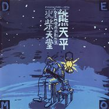

火柴天堂 [demo原始创作集之1]Panda 1988-1996
============================

|  |  |
| :--: | :-- |
| [ 火柴天堂 [demo原始创作集之1]Panda 1988-1996](https://emumo.xiami.com/album/5106) | **艺人**: [熊天平](../index.md) **语种**: 国语 **唱片公司**: 上华国际 **发行时间**: 1997年05月01日 **专辑类别**: 录音室专辑 **专辑风格**: 国语流行 Mandarin Pop, 华语唱作人 Chinese Singer-Songwriter **播放数**: 559504 **收藏数**: 566 **评论数**: 46  |

## 简介

“火柴天堂”熊天平原音重现，入围金曲奖，最佳作词，最佳作曲。同时收录12首真人真事真情DEMO原始创作集。

## 曲目

- [每一分每一秒都给你 (Demo)](./5106/GgP70bef.md)
- [火柴天堂 (Demo)原唱: 齐秦](./5106/GgQaee23.md)
- [最好忘记我 (Demo)](./5106/bghLa02d2.md)
- [我的爱 (Demo)](./5106/dCnm40d38.md)
- [Goodbye Windflower (Demo)](./5106/GgT5997f.md)
- [太去在意 (Demo)](./5106/GgU9130f.md)
- [卖一杯娇柔 (Demo)](./5106/bghPc58da.md)
- [依偎 (Demo)](./5106/GgW4b6ed.md)
- [你的眼睛 (Demo)](./5106/bghRcf0e2.md)
- [摆脱 (Demo)](./5106/bghSbcc18.md)
- [周末下雨 (Demo)](./5106/b6iN1dc3a.md)
- [爱情多恼河 (Demo)](./5106/b6iO1813b.md)

## 评论

|  |  |  |  |
| :-- | :-- | :-- | :-- |
|  [虾米用户](https://emumo.xiami.com/u/23702789) 这些年有多远走多远不停歇... 2021-01-07 13:01 赞(0) 踩(0) | 
又来听小熊的歌，今天成都下雪了20210107！想起了雪候鸟，还有那些青春时代无处安放的伤感，都包含在他的歌里了！非常棒的专辑！1997年买的磁带《火柴天堂》还放在记忆深处～现在很少听歌了，听老歌是因为我想你了，Ling~
 |
|  [虾米用户](https://emumo.xiami.com/u/336133911)  2019-03-16 23:04 赞(2) 踩(0) | 
97年，上华唱片公司的黄金年代，这首歌印象中是熊天平致敬齐秦齐豫的 windflower。之后齐秦在丝路里收录了火柴天堂，那时候熊天平应该还叫熊天益。然后就有了他的第一张个人创作专辑，齐秦助阵了愚人码头，当时磁带的文案上还写着拥有张信哲一般的纯净嗓音。再之后齐秦和王祖贤短暂复合，于是有了王祖贤版本的与世隔绝。那时候等这些歌手的专辑，就像在等一个未完的故事。
 |
|  [虾米用户](https://emumo.xiami.com/u/10470769) 暂无签名~ 2018-12-12 17:43 赞(0) 踩(0) | 
这张专辑里的爱情多瑙河最好听！
 |
|  [虾米用户](https://emumo.xiami.com/u/3269318)  2018-07-19 23:32 赞(0) 踩(0) | 
不火 过分
 |
|  [虾米用户](https://emumo.xiami.com/u/5007699) 我所有的美好回忆 2018-03-02 14:36 赞(0) 踩(0) | 
关键这张封面超赞
 |
|  [虾米用户](https://emumo.xiami.com/u/23703381)  2017-10-28 00:22 赞(1) 踩(0) | 
熊天平原音重现，入围金曲奖，最佳作词，最佳作曲。
 |
|  [虾米用户](https://emumo.xiami.com/u/16011973)  2017-09-13 06:27 赞(1) 踩(0) | 
最喜欢几张Demo创作集
 |
|  [虾米用户](https://emumo.xiami.com/u/15876768)  2017-03-17 17:37 赞(0) 踩(0) | 
最近喜欢找demo来听
 |
|  [虾米用户](https://emumo.xiami.com/u/13601734) 分享你 2016-11-28 14:48 赞(0) 踩(0) | 
纯
 |
|  [虾米用户](https://emumo.xiami.com/u/505753) 我还没想好要写什么... 2016-11-21 10:27 赞(0) 踩(0) | 
伴随我初中
 |
|  [虾米用户](https://emumo.xiami.com/u/84849248)  2016-11-18 23:16 赞(1) 踩(0) | 
声音最爱 还这么有才
 |
|  [虾米用户](https://emumo.xiami.com/u/11384268)  2016-11-12 21:25 赞(3) 踩(0) | 
再也找不到这么纯的demo了 
 |
|  [虾米用户](https://emumo.xiami.com/u/10577497) 青青子衿，悠悠我心。 2015-07-13 16:17 赞(2) 踩(0) | 
非常棒的一张专辑，嗓音和状态最好的时期。
 |
|  [虾米用户](https://emumo.xiami.com/u/41865903)  2015-06-12 12:13 赞(0) 踩(0) | 
我喜欢听听，喜欢齐秦唱的。没有听过这首
 |
|  [虾米用户](https://emumo.xiami.com/u/6625130)  2015-04-07 16:32 赞(1) 踩(0) | 
haoting
 |
|  [虾米用户](https://emumo.xiami.com/u/1665984)   2014-11-18 23:18 赞(2) 踩(0) | 
Demo第一弹，经典！高中的回忆。
 |
|  [虾米用户](https://emumo.xiami.com/u/11699681)  2013-07-12 15:36 赞(0) 踩(0) | 
收了
 |
|  [虾米用户](https://emumo.xiami.com/u/10435106) 听靓歌 2013-05-17 02:31 赞(0) 踩(0) | 
喜欢,靓音.
 |
|  [虾米用户](https://emumo.xiami.com/u/10435106) 听靓歌 2013-05-17 02:31 赞(0) 踩(0) | 
好听.
 |
|  [虾米用户](https://emumo.xiami.com/u/1487853)  2012-10-06 18:05 赞(1) 踩(0) | 
如诗如风，如幻如醉....
 |
|  [虾米用户](https://emumo.xiami.com/u/6532719)  2012-10-02 11:24 赞(1) 踩(0) | 
久违了
 |
|  [虾米用户](https://emumo.xiami.com/u/7636210)  2012-06-27 01:32 赞(1) 踩(0) | 
真正的高富帅，滑雪运动员，原创才子，如诗如风，如幻如醉，可歌可泣，可吼可啸。膜拜吧！！
 |
|  [虾米用户](https://emumo.xiami.com/u/4797585)  2012-06-07 12:03 赞(0) 踩(0) | 
touching
 |
|  [虾米用户](https://emumo.xiami.com/u/4218187)  2011-12-03 22:32 赞(0) 踩(0) | 
你的眼睛.
 |
|  [虾米用户](https://emumo.xiami.com/u/3131544)  2011-11-24 19:27 赞(0) 踩(0) | 
熊天平的demo里有不少有爱的旋律啊
 |
|  [虾米用户](https://emumo.xiami.com/u/4883300) 我还没想好要写什么... 2011-11-21 00:32 赞(0) 踩(0) | 
每次远行 都有你的歌声在陪伴！
 |
|  [虾米用户](https://emumo.xiami.com/u/5418116)  2011-08-15 17:29 赞(1) 踩(0) | 
不会过时的心事。
 |
|  [虾米用户](https://emumo.xiami.com/u/5418116)  2011-08-15 17:16 赞(1) 踩(0) | 
当年听的是卡带，听没多少年就坏了。一直很怀念这个专辑，但领会到CD的价值时，已经是好久好久以后的事，这个专辑怎么找也找不回来。别说是专辑找不回来，这种不经修饰的音质，也很难找了。
 |
|  [虾米用户](https://emumo.xiami.com/u/1936202)  2011-06-15 15:49 赞(0) 踩(0) | 
你的眼睛
 |
|  [虾米用户](https://emumo.xiami.com/u/3184708)   2011-04-30 20:53 赞(0) 踩(0) | 
亲说，你怎么突然怀旧了。我说，怀旧不代表不开心啊，是吧。干净的声音在唱：有谁来买我的火柴。。
 |
|  [虾米用户](https://emumo.xiami.com/u/1762629)   2011-03-16 00:40 赞(0) 踩(0) | 
Demo专辑，没有任何多余的东西，绝对纯净。
 |
|  [虾米用户](https://emumo.xiami.com/u/121511)  2011-02-11 12:57 赞(0) 踩(0) | 
最爱的专辑
 |
|  [虾米用户](https://emumo.xiami.com/u/355865) Let it go, l... 2010-08-28 13:10 赞(0) 踩(0) | 
ok
 |
|  [虾米用户](https://emumo.xiami.com/u/519140) 去你该去的地方： 2010-07-24 09:23 赞(0) 踩(0) | 
这盘跟吉他创作集那盘都只收到磁带版T_T
 |
| ⇒ |  [虾米用户](https://emumo.xiami.com/u/3478802)  2011-04-04 19:07 赞(0) 踩(0) | 
这张CD淘宝上还是有几张的
 |
|  [虾米用户](https://emumo.xiami.com/u/331318)  2009-08-17 01:09 赞(0) 踩(0) | 
我猜大多数都是听了快女才来的
 |
| ⇒ |  [虾米用户](https://emumo.xiami.com/u/91561)  2009-09-23 12:08 赞(0) 踩(0) | 
呵 你太自以为是
 |
| ⇒ |  [虾米用户](https://emumo.xiami.com/u/331318)  2009-09-23 18:48 赞(0) 踩(0) | 
<q><b>sin说：</b></q>
 |
| ⇒ |  [虾米用户](https://emumo.xiami.com/u/322686)  2009-10-01 16:56 赞(0) 踩(0) | 
<q><b>sin说：</b></q>
 |
| ⇒ |  [虾米用户](https://emumo.xiami.com/u/439607)  2009-11-29 14:46 赞(0) 踩(0) | 
我是因为喜欢江建民才来的……你知道江建民么？……
 |
| ⇒ |  [虾米用户](https://emumo.xiami.com/u/439607)  2009-11-29 14:46 赞(0) 踩(0) | 
<q><b>Ano.Z@ 补网的秋季说：</b></q>
 |
| ⇒ |  [虾米用户](https://emumo.xiami.com/u/519140) 去你该去的地方： 2010-07-24 09:24 赞(0) 踩(0) | 
快女是什么可以吃吗
 |
| ⇒ |  [虾米用户](https://emumo.xiami.com/u/674007)  2010-09-14 15:08 赞(0) 踩(0) | 
<q><b>进化说：</b></q>
 |
| ⇒ |  [虾米用户](https://emumo.xiami.com/u/355865) Let it go, l... 2010-11-24 19:17 赞(0) 踩(0) | 
的确自以为是了朋友
 |
| ⇒ |  [虾米用户](https://emumo.xiami.com/u/2234371)  2011-02-01 18:23 赞(0) 踩(0) | 
<q><b>进化说：</b></q>
 |
| ⇒ |  [虾米用户](https://emumo.xiami.com/u/121511)  2011-08-15 23:08 赞(0) 踩(0) | 
<q><b>进化说：</b></q>
 |
