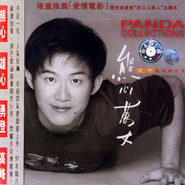

熊天平
============================

|  |  |
| :--: | :-- |
| [ 熊天平](https://i.xiami.com/tjwhxtp) | **地区**: Taiwan, PRC 中国台湾 **风格**: 国语流行 Mandarin Pop, 华语唱作人 Chinese Singer-Songwriter **播放数**: 28403251 **粉丝数**: 14495 **评论数**: 467  |

## 档案

本名：熊威 
小名：PANDA 
生日：8月24日 
星座：处女座 
血型：A型 
籍贯：湖北 
学历：文化大学韩文系 
经历：民歌手、滑雪教练、国家滑雪队储训队员 
嗜好：喝茶 
最爱的颜色：蓝色 
最爱的饰品：帽子 
最爱的季节：秋天 
最爱穿的衣服：休闲服＋短裤 
最满意自己：有创作的能力 
最想做的事情：旅行 
最喜欢听的话：早点回家 
幸运数字：66 
儿时愿望：当飞行员 
最大愿望：做电影配乐 
影响最大的人：妈妈

## 专辑

| 名称 | 语种 | 唱片公司 | 发行时间 | 专辑类别 | 专辑风格 |
| :--: | :-- | :-- | :-- | :-- | :-- |
| [ 爱在冬季](./albums/5022244110.md) | 国语 | Yangyang | 2020年12月20日 | EP, 单曲 | 流行 Pop |
| [ 相爱在秋天](./albums/5021885276.md) | 国语 | Yangyang | 2020年11月10日 | EP, 单曲 | 流行 Pop |
| [ 爱在夏天](./albums/5021213394.md) | 国语 | Yangyang | 2020年08月03日 | EP, 单曲 | 流行 Pop |
| [ 畅游北京](./albums/5020840236.md) | 国语 | Yangyang | 2020年05月29日 | EP, 单曲 | 流行 Pop |
| [ 我们心相连](./albums/2420319548.md) | 英语 |  | 2020年02月28日 | EP, 单曲 | 欧美流行 Western Pop |
| [ 现在的我](./albums/2105394803.md) | 国语 | 百纳娱乐 | 2019年10月28日 | EP, 单曲 |  |
| [ 情进千万家](./albums/2104760694.md) | 国语 | 东家文化 | 2019年04月10日 | EP, 单曲 | 国语流行 Mandarin Pop |
| [ 我很想家](./albums/2102963343.md) | 国语 | 唐嘉文化 | 2017年11月27日 | EP, 单曲 | 华语唱作人 Chinese Singer-Songwriter, 国语流行 Mandarin Pop |
| [ 幸福像阳光一样](./albums/2102917091.md) | 国语 | 唐嘉文化 | 2017年11月09日 | EP, 单曲 | 流行 Pop |
| [ 十年全纪录Panda Xiong Collection of 10 Years](./albums/5094.md) | 国语 | 正合世纪 | 2006年11月28日 | 精选集 | 华语唱作人 Chinese Singer-Songwriter, 国语流行 Mandarin Pop |
| [ 流金十载全记录](./albums/403935.md) | 国语 | 上华国际 | 2000年03月01日 | 精选集 | 国语流行 Mandarin Pop, 华语唱作人 Chinese Singer-Songwriter |
| [ 我都在乎](./albums/5096.md) | 国语 | 上华国际 | 2000年02月23日 | 录音室专辑 | 国语流行 Mandarin Pop, 华语唱作人 Chinese Singer-Songwriter |
| [ 一个人流浪The Best of Panda](./albums/5097.md) | 国语 | 上华国际 | 1999年04月01日 | 精选集 | 国语流行 Mandarin Pop, 华语唱作人 Chinese Singer-Songwriter |
| [ 傻哥歌](./albums/5098.md) | 粤语 | 上华国际 | 1999年01月01日 | 录音室专辑 | 华语唱作人 Chinese Singer-Songwriter, 粤语流行 Cantopop |
| [ 不再想太多](./albums/5100.md) | 粤语 | 上华国际 | 1998年10月01日 | EP, 单曲 | 华语唱作人 Chinese Singer-Songwriter, 粤语流行 Cantopop |
| [ 另一类吉他创作集熊天平·江建民吉他演奏专辑](./albums/5101.md) | 国语 | 上华国际 | 1998年08月01日 | 录音室专辑 | 国语流行 Mandarin Pop, 华语唱作人 Chinese Singer-Songwriter, 民谣 Folk |
| [ 最后还是会All The End, Still](./albums/5099.md) | 国语 | 上华国际 | 1998年07月01日 | 录音室专辑 | 国语流行 Mandarin Pop, 华语唱作人 Chinese Singer-Songwriter |
| [ 甘心 [demo原始创作集之2]Panda Demo 2](./albums/32320.md) | 国语 | 上华国际 | 1998年07月01日 | 录音室专辑 | 华语唱作人 Chinese Singer-Songwriter, 国语流行 Mandarin Pop |
| [ 熊心万丈 经典创作集Panda Collections](./albums/5102.md) | 国语 | 上华国际 | 1998年02月01日 | 精选集 | 国语流行 Mandarin Pop, 华语唱作人 Chinese Singer-Songwriter |
| [ 雪候鸟Snow Bird](./albums/5104.md) | 国语 | 上华国际 | 1997年10月01日 | 录音室专辑 | 国语流行 Mandarin Pop, 华语唱作人 Chinese Singer-Songwriter |
| [ 火柴天堂 [demo原始创作集之1]Panda 1988-1996](./albums/5106.md) | 国语 | 上华国际 | 1997年05月01日 | 录音室专辑 | 国语流行 Mandarin Pop, 华语唱作人 Chinese Singer-Songwriter |
| [ 爱情多恼河River Of The Blues](./albums/5105.md) | 国语 | 上华国际 | 1997年01月01日 | 录音室专辑 | 国语流行 Mandarin Pop, 华语唱作人 Chinese Singer-Songwriter |

## 评论

|  |  |  |
| :-- | :-- | :-- |
|  [虾米用户](https://emumo.xiami.com/u/358104299) 悲观的唯心存在现实解构虚... 2020-12-27 11:48 赞(0) 踩(0) | 
19182
 |
|  [虾米用户](https://emumo.xiami.com/u/334661429)   2020-11-10 00:35 赞(1) 踩(0) | 
我讨厌你老婆。她好俗气
 |
|  [虾米用户](https://emumo.xiami.com/u/230803304) 三观正又爱国的成都宝藏男... 2020-08-24 12:41 赞(0) 踩(0) | 
生日快乐
 |
|  [虾米用户](https://emumo.xiami.com/u/86055558)  2020-08-24 10:17 赞(0) 踩(0) | 
20年前大学那阵，还是磁带的年代，最多的就是小熊的带子，20年后，封闭在家，听小熊还是那么喜欢
 |
|  [虾米用户](https://emumo.xiami.com/u/283157776)  2020-08-24 10:04 赞(0) 踩(0) | 
生日快乐
 |
|  [虾米用户](https://emumo.xiami.com/u/196774791) 如风岁月  似水流年  ... 2020-04-03 10:14 赞(4) 踩(0) | 
1969年生人的熊天平已经到了知天命的年纪，现阶段的他，家庭和睦，有儿有女，对于这个年纪的人来说，或许充满人间烟火味的幸福比事业成功来得更为实在。毕竟，红不红是对歌手的定义，快不快乐才是对人生的定义
 |
|  [虾米用户](https://emumo.xiami.com/u/10930466) 再见了虾米，还有虾米上上... 2019-12-15 04:42 赞(3) 踩(0) | 
上世纪末能与滚石抗衡的上华，二王二后，其中的二王就是齐秦和熊天平，在上世纪华语区男歌手里声线有王子气质的没几个，其中肯定有熊天平
 |
|  [虾米用户](https://emumo.xiami.com/u/369829973)  2019-11-20 20:41 赞(0) 踩(0) | 
声音和张信哲如出一辙
 |
| ⇒ |  [虾米用户](https://emumo.xiami.com/u/355766661)  2020-10-01 21:46 赞(0) 踩(0) | 
只是声线都比较高而已，区别还是很大的
 |
|  [虾米用户](https://emumo.xiami.com/u/375187735)  2019-09-01 16:42 赞(0) 踩(0) | 
播放不了，什么意思？！
 |
|  [虾米用户](https://emumo.xiami.com/u/425028770)  2019-08-27 13:59 赞(0) 踩(0) | 
多愁善感，忧郁的气质吸引我，您的才华更是让我无话可说，能享受您的音乐 ，太幸福！
 |
|  [虾米用户](https://emumo.xiami.com/u/126214652)  2019-08-24 10:41 赞(0) 踩(0) | 
竟然是还信用卡的日子。。 我注定忘不了熊天平你了 
 |
|  [虾米用户](https://emumo.xiami.com/u/219473159)  2019-08-24 10:18 赞(1) 踩(0) | 
熊老师，生日快乐！
 |
|  [虾米用户](https://emumo.xiami.com/u/35509231) 提灯天后  策马小僧 2019-08-15 11:47 赞(0) 踩(0) | 
滑雪储备队员！！！
 |
|  [虾米用户](https://emumo.xiami.com/u/314760642) 谁说宇宙有深处？男孩丢失... 2019-07-19 19:47 赞(0) 踩(0) | 
他本人以见过
 |
|  [虾米用户](https://emumo.xiami.com/u/348957204)  2019-07-01 17:17 赞(0) 踩(0) | 
当年声音真好，如果华语乐坛copy小田和正的东爱，除了熊天平不做第二人想
 |
|  [虾米用户](https://emumo.xiami.com/u/15577171) 不同的心境，不同的音乐～... 2019-05-29 18:19 赞(1) 踩(0) | 
发福前的熊天平还是很帅的
 |
|  [虾米用户](https://emumo.xiami.com/u/84241904)  2019-05-15 17:57 赞(0) 踩(0) | 
大爱，好喜欢你的歌，就是好久好久没感觉到你活跃在歌坛了，有点小伤感
 |
|  [虾米用户](https://emumo.xiami.com/u/45654311) 在世界尽头流浪 2019-04-27 22:55 赞(0) 踩(0) | 
就算曾经的你再也回不来 也不愿意看到你现在这样被当做当牵线木偶
 |
|  [虾米用户](https://emumo.xiami.com/u/341875754)  2019-03-22 22:54 赞(1) 踩(0) | 
晚上好天平哥哥，我是你的歌迷粉丝很喜欢你的所有音乐作品，我从小就喜欢听音乐唱歌很高兴认识你，想和你交个朋友行吗？
 |
|  [虾米用户](https://emumo.xiami.com/u/5968552) 虾小米，我爱你所以讲不出... 2019-03-01 22:21 赞(3) 踩(0) | 
作为听他歌长大的当时的小朋友，不知道该怎么给现在的小朋友讲述熊天平有多牛...
 |
|  [虾米用户](https://emumo.xiami.com/u/42542853) no music，no ... 2019-02-04 23:14 赞(6) 踩(0) | 
如果当年小熊娶了桃子，也不至于像今天这么落魄了……
 |
|  [虾米用户](https://emumo.xiami.com/u/5927816)  2019-01-19 18:10 赞(8) 踩(0) | 
不想再听你媳妇唱你的歌，都给毁完了
 |
| ⇒ |  [虾米用户](https://emumo.xiami.com/u/255710349)  2019-11-16 23:47 赞(0) 踩(0) | 
同感！以前的熊天平多好啊，现在真的是曲风和形象都被他老婆给毁了，还是听听以前的老歌舒服！
 |
| ⇒ |  [虾米用户](https://emumo.xiami.com/u/122622036)  2020-07-05 19:47 赞(0) 踩(0) | 
他媳妇是谁啊
 |
|  [虾米用户](https://emumo.xiami.com/u/1224989)  2019-01-18 06:57 赞(1) 踩(0) | 
马鞍山大剧院看到天平的演出，很好。有机会再来马鞍山。
 |
|  [虾米用户](https://emumo.xiami.com/u/306311235) 好男孩 2018-12-25 21:04 赞(2) 踩(0) | 
你好，我们可以做朋友吗，我在四川达州
 |
| ⇒ |  [虾米用户](https://emumo.xiami.com/u/306311235) 好男孩 2019-03-20 06:23 赞(0) 踩(0) | 
好
 |
|  [虾米用户](https://emumo.xiami.com/u/56266292) 因为滚石，所以虾米！ 2018-12-24 21:51 赞(2) 踩(0) | 
我这几天一直在听雪候鸟，藏书人……简直是我的最爱!
 |
|  [虾米用户](https://emumo.xiami.com/u/303278306) 你看，花开了. 2018-12-06 08:24 赞(1) 踩(0) | 
你也是处女座的，怪不的喜欢你.
 |
|  [虾米用户](https://emumo.xiami.com/u/101764310) 我还没想好要写什么... 2018-11-21 01:39 赞(1) 踩(0) | 
站在齐秦和张信哲中间的男人
 |
|  [虾米用户](https://emumo.xiami.com/u/343458305)  2018-10-05 23:12 赞(9) 踩(0) | 
熊天平到底经历了什么？？？？？？？倒不是说他现在过得不幸福，胖的走形，曲风巨变，无法理解！
 |
| ⇒ |  [虾米用户](https://emumo.xiami.com/u/197438808) 我见青山多妩媚，料青山，... 2018-12-08 18:31 赞(0) 踩(0) | 
生病了~~没有好的创作了
 |
|  [虾米用户](https://emumo.xiami.com/u/284443891) 如果有一天你累了，那就回... 2018-09-27 23:34 赞(0) 踩(0) | 
好听，听了十多年了  
 |
|  [虾米用户](https://emumo.xiami.com/u/299727941) 80后的我 2018-09-16 09:42 赞(0) 踩(0) | 
昨晚在太原开演唱会，很遗憾没能赶上 
 |
|  [虾米用户](https://emumo.xiami.com/u/305792692) 有没有人告诉你，你是春风... 2018-09-14 10:01 赞(0) 踩(0) | 
你写的歌好美呀，太有意境了。
 |
|  [虾米用户](https://emumo.xiami.com/u/331880198) 我 2018-09-02 11:34 赞(0) 踩(0) | 
从学生时代就喜欢你的歌，那时候只是磁带，后来到了北京，也带着我那些磁带再后来就是CD，北漂的生活有你
 |
|  [虾米用户](https://emumo.xiami.com/u/43893972)   2018-08-29 09:53 赞(2) 踩(0) | 
十几年了，我依然在听你的歌。
 |
|  [虾米用户](https://emumo.xiami.com/u/342181822) 不愿说再见。那么，我走了... 2018-08-24 13:58 赞(0) 踩(0) | 
生日快乐
 |
|  [虾米用户](https://emumo.xiami.com/u/337505918) 我还没想好要写什么... 2018-08-15 19:30 赞(0) 踩(0) | 
小学的时候比较欣赏这种细细的男声......&amp;gt; &amp;lt;
 |
|  [虾米用户](https://emumo.xiami.com/u/269197127)  2018-08-07 19:47 赞(0) 踩(0) | 
很喜欢火柴天堂和愚人码头   
 |
|  [虾米用户](https://emumo.xiami.com/u/334952747)  2018-07-23 05:13 赞(0) 踩(0) | 
是本人还是助理在给你打理呢
 |
|  [虾米用户](https://emumo.xiami.com/u/3269318)  2018-07-19 23:32 赞(0) 踩(0) | 
不火，过分了同学！
 |
|  [虾米用户](https://emumo.xiami.com/u/339801727) 与虾米分离在即，纵有千般... 2018-07-07 22:56 赞(0) 踩(0) | 
熊天平创作的歌曲都很优美，个人演唱的也很深情很好听，喜欢。
 |
|  [虾米用户](https://emumo.xiami.com/u/50519364)  2018-06-30 21:52 赞(2) 踩(0) | 
今天熊天平来如皋了
 |
|  [虾米用户](https://emumo.xiami.com/u/35008925)  2018-06-22 07:32 赞(1) 踩(0) | 
受宠若惊，你这首歌百听不厌！期待你有更好的作品！
 |
|  [虾米用户](https://emumo.xiami.com/u/374679507)  2018-06-07 05:38 赞(1) 踩(0) | 
《你的眼睛》仿佛是我的初恋爱人，我爱粦。
 |
|  [虾米用户](https://emumo.xiami.com/u/318796748)  2018-06-06 10:01 赞(2) 踩(0) | 
感觉您和您妻子合作的歌特别好听，特别具有正能量，这是这个社会现在所需要的，谢谢您。希望您能不畏流言，继续坚持
 |
|  [虾米用户](https://emumo.xiami.com/u/351134096)  2018-05-13 16:45 赞(0) 踩(0) | 
特别喜欢那首《I  Wish 》，用余生，好好聆听
 |
|  [虾米用户](https://emumo.xiami.com/u/351134096)  2018-05-13 16:43 赞(0) 踩(0) | 
喜欢你的音乐，让人有共鸣感。一首歌都是一个美丽的故事，而那些故事，仿佛都是在唱着，关于我的传奇~
 |
|  [虾米用户](https://emumo.xiami.com/u/353948738)  2018-04-21 23:08 赞(1) 踩(0) | 
怎么就突然不行了？才华和嗓音会消失？很奇怪。
 |
|  [虾米用户](https://emumo.xiami.com/u/355200400)  2018-04-16 20:57 赞(3) 踩(0) | 
喜欢你的《火柴天堂》和《雪候鸟》，这两首歌没有人比你演绎的更好，大爱！ 
 |
|  [虾米用户](https://emumo.xiami.com/u/355200400)  2018-04-16 20:45 赞(4) 踩(0) | 
你的音色和唱功真的很好！ 
 |
|  [虾米用户](https://emumo.xiami.com/u/89007556)  2018-04-06 21:46 赞(0) 踩(0) | 
声音很好，喜欢你的雪候鸟
 |
|  [虾米用户](https://emumo.xiami.com/u/260167529) 爱音乐的疯子 2018-04-05 22:24 赞(1) 踩(0) | 
辉煌在过去 过去就过去了 大哥现在很看的开 也参加了不少音乐节目 只要继续唱 我就继续关注您
 |
|  [虾米用户](https://emumo.xiami.com/u/324511262) 感谢这世界有音乐。。。 2018-01-23 22:37 赞(0) 踩(0) | 
好喜欢熊天平的歌~~说不出的感觉！大爱！
 |
|  [虾米用户](https://emumo.xiami.com/u/109119988) 我还没想好要写什么... 2018-01-09 23:00 赞(0) 踩(0) | 
 
 |
|  [虾米用户](https://emumo.xiami.com/u/339312314)  2017-12-23 01:33 赞(0) 踩(0) | 
声线清晰很有特色，唱歌很有心有感情的歌手，大爱
 |
|  [虾米用户](https://emumo.xiami.com/u/253069357) 90后 2017-12-15 10:18 赞(0) 踩(0) | 
嗓音简直太棒了。
 |
|  [虾米用户](https://emumo.xiami.com/u/10930466) 再见了虾米，还有虾米上上... 2017-11-30 19:20 赞(3) 踩(0) | 
长这么大，情歌听了无数，线条、音色、咬字、唱腔，自然优雅深情的能称得上情歌王子的也就只有 童安格、张信哲还有就是熊天平
 |
|  [虾米用户](https://emumo.xiami.com/u/332506899) 台湾歌手 2017-11-08 09:39 赞(136) 踩(0) | 
我刚入驻了虾米音乐人，欢迎大家来我的个人主页，收听我的最新音乐
 |
| ⇒ |  [虾米用户](https://emumo.xiami.com/u/46073836) 我还没想好要写什么... 2017-11-08 23:27 赞(0) 踩(0) | 
亲亲 你看巧不巧 人海茫茫 我看见了你
 |
| ⇒ |  [虾米用户](https://emumo.xiami.com/u/342181822) 不愿说再见。那么，我走了... 2018-02-08 11:27 赞(0) 踩(0) | 
看了《隐藏的歌手》才认识了熊天平老师，不过熊天平老师歌曲是真心的好听。
 |
| ⇒ |  [虾米用户](https://emumo.xiami.com/u/4855992) 我还没想好要写什么... 2018-02-22 11:54 赞(0) 踩(0) | 
您的歌声真好听！仍然回味
 |
| ⇒ |  [虾米用户](https://emumo.xiami.com/u/352370680) 行不更名 做不改姓 2018-03-04 04:15 赞(0) 踩(0) | 
我老公熊侃很喜欢您的歌，他叫熊侃，老家湖北应城
 |
| ⇒ |  [虾米用户](https://emumo.xiami.com/u/4855992) 我还没想好要写什么... 2018-03-21 11:16 赞(0) 踩(0) | 
1999年看电视剧《东游记》时被您作的插曲《心有灵犀》和《相思无解》惊艳了！从此关注您的歌曲！听到今年2018，我想我会一直欣赏下去！
 |
| ⇒ |  [虾米用户](https://emumo.xiami.com/u/307299755)  2018-09-25 03:45 赞(0) 踩(0) | 
是你么    
 |
| ⇒ |  [虾米用户](https://emumo.xiami.com/u/284443891) 如果有一天你累了，那就回... 2019-01-26 01:30 赞(0) 踩(0) | 
感谢遇见  
 |
| ⇒ |  [虾米用户](https://emumo.xiami.com/u/335059496)  2019-02-20 22:23 赞(0) 踩(0) | 
老熊 我爱你 出新歌呗
 |
| ⇒ |  [虾米用户](https://emumo.xiami.com/u/97104710)  2020-04-27 11:23 赞(0) 踩(0) | 
熊哥哥，喜欢你的歌    
 |
|  [虾米用户](https://emumo.xiami.com/u/253803702) 熊天平歌迷 小熊家族成员... 2017-11-06 21:25 赞(4) 踩(0) | 
1231上海跨年演唱会 大麦已开票 一起跨年
 |
|  [虾米用户](https://emumo.xiami.com/u/96433442)  2017-11-06 14:02 赞(4) 踩(0) | 
熊天平年底要来上海开演唱会啦。大麦网有售票了。我是20年熊迷一枚   
 |
|  [虾米用户](https://emumo.xiami.com/u/7302774)  2017-10-27 23:57 赞(0) 踩(0) | 
熊天平的歌声能唱进我心里。
 |
|  [虾米用户](https://emumo.xiami.com/u/9481053)  2017-09-20 20:44 赞(0) 踩(0) | 
雪候鸟太棒了
 |
|  [虾米用户](https://emumo.xiami.com/u/88901738) 我还没想好要写什么... 2017-09-14 21:18 赞(0) 踩(0) | 
好纯粹的感觉&amp;hellip;&amp;hellip;
 |
|  [虾米用户](https://emumo.xiami.com/u/296109884) 等待戈多 2017-09-14 06:20 赞(0) 踩(0) | 
你也胖了
 |
|  [虾米用户](https://emumo.xiami.com/u/8070377) 爱雾瑞性维欧腐漏 2017-08-31 21:15 赞(0) 踩(0) | 
。
 |
|  [虾米用户](https://emumo.xiami.com/u/189821)  2017-08-23 17:03 赞(0) 踩(0) | 
实力派偶像
 |
|  [虾米用户](https://emumo.xiami.com/u/8905665) 我还没想好要写什么... 2017-08-19 21:06 赞(0) 踩(0) | 
封面和谭维维有点像，哈哈
 |
|  [虾米用户](https://emumo.xiami.com/u/1585178) 一直努力到自己没有逃避的... 2017-08-08 20:11 赞(0) 踩(0) | 
第一次听熊天平的歌是在上学，看的是恬妞演的新乱世佳人的片尾曲，里面有现在很多现在的一线花旦，第一首学会熊天理的歌是《你的眼睛》，上大学时和同学合唱得了校园十佳歌手第三名，时间总是好快流走，忙忙碌碌也走入了中年的年纪，再来听心境确实不一样了
 |
|  [虾米用户](https://emumo.xiami.com/u/309957020) 如今的紅塵，不過是將來的... 2017-08-07 20:06 赞(0) 踩(0) | 
声线很清澈，很多歌都好好听，特别喜欢《雪候鸟》
 |
|  [虾米用户](https://emumo.xiami.com/u/317762818)  2017-08-06 23:58 赞(0) 踩(0) | 
满满都是青春的回忆，他的声音无可替代
 |
|  [虾米用户](https://emumo.xiami.com/u/1777796) 静かに見える波　まぶしす... 2017-08-02 16:05 赞(2) 踩(0) | 
熊天平这些歌手的歌才有我这种80后的人长大过程中沉淀又澄清的，说得清又道不明的情愫
 |
|  [虾米用户](https://emumo.xiami.com/u/8561396) 我还没想好要写什么... 2017-07-29 21:17 赞(0) 踩(0) | 
去了成都演唱会，他老婆上台后，他看上去就不那么开心了。。。
 |
|  [虾米用户](https://emumo.xiami.com/u/6491031) - 2017-07-11 20:14 赞(0) 踩(0) | 
岁月是把杀猪刀，熊哥年轻时那么帅
 |
|  [虾米用户](https://emumo.xiami.com/u/274131250)  2017-07-01 09:26 赞(0) 踩(0) | 
金曲捞吧！
 |
|  [虾米用户](https://emumo.xiami.com/u/277551638) 不忘初心 2017-06-24 15:31 赞(0) 踩(0) | 
金曲捞
 |
|  [虾米用户](https://emumo.xiami.com/u/9069939)  2017-06-23 00:18 赞(0) 踩(0) | 
超好听～！
 |
|  [虾米用户](https://emumo.xiami.com/u/303373961)  2017-06-22 15:28 赞(0) 踩(0) | 
有必要那么伤感吗。回忆只是个&amp;hellip;&amp;hellip;哎有感觉就好。
 |
|  [虾米用户](https://emumo.xiami.com/u/306233723)  2017-06-21 13:14 赞(0) 踩(0) | 
小熊
 |
|  [虾米用户](https://emumo.xiami.com/u/43814018)  2017-06-19 23:55 赞(0) 踩(0) | 
今天在金雪猫看见了久违的熊天平，虽然长胖了不少，可是声音依然还是那么透明
 |
|  [虾米用户](https://emumo.xiami.com/u/1969954) 自我是一个深渊。 2017-06-18 00:06 赞(2) 踩(0) | 
看到他现在的样子好想哭&amp;hellip;&amp;hellip;
 |
|  [虾米用户](https://emumo.xiami.com/u/2616268)  2017-06-17 17:32 赞(0) 踩(0) | 
终于在这几年内地热门歌唱类综艺节目看到熊天平了
 |
|  [虾米用户](https://emumo.xiami.com/u/253069357) 90后 2017-06-17 11:49 赞(3) 踩(0) | 
金曲捞！！终于请到了熊天平！！
 |
|  [虾米用户](https://emumo.xiami.com/u/291751475)  2017-06-02 16:52 赞(1) 踩(0) | 
回忆是最奢侈的礼物
 |
|  [虾米用户](https://emumo.xiami.com/u/291751475)  2017-05-27 18:45 赞(1) 踩(0) | 
我也好想他来重庆开演唱会
 |
|  [虾米用户](https://emumo.xiami.com/u/84849248)  2017-05-26 17:28 赞(1) 踩(0) | 
从初中就喜欢 一直听到现在  只喜欢他的声音
 |
|  [虾米用户](https://emumo.xiami.com/u/84849248)  2017-05-26 15:33 赞(0) 踩(0) | 
什么时候来重庆开演唱会？
 |
|  [虾米用户](https://emumo.xiami.com/u/2616268)  2017-04-19 18:33 赞(2) 踩(0) | 
这么多年了，歌手还是没能请到熊天平
 |
|  [虾米用户](https://emumo.xiami.com/u/16135450)  2017-04-05 00:13 赞(0) 踩(0) | 
9425
 |
|  [虾米用户](https://emumo.xiami.com/u/3992621)  2017-03-29 12:40 赞(2) 踩(0) | 
请问为什么头像选这张！
 |
|  [虾米用户](https://emumo.xiami.com/u/260167529) 爱音乐的疯子 2017-01-18 20:44 赞(0) 踩(0) | 
加油 期待你的新作品
 |
|  [虾米用户](https://emumo.xiami.com/u/12795901) 独行的蜉蝣 2016-12-04 09:02 赞(1) 踩(0) | 
瘦的时候好像小栗旬 
 |
| ⇒ |  [虾米用户](https://emumo.xiami.com/u/272409423)  2017-05-14 21:21 赞(0) 踩(0) | 
同感
 |
|  [虾米用户](https://emumo.xiami.com/u/84849248)  2016-11-18 23:27 赞(1) 踩(0) | 
唯一能打动我的男声 百听不厌
 |
|  [虾米用户](https://emumo.xiami.com/u/7863820)  2016-10-16 23:32 赞(4) 踩(0) | 
隐藏的歌手又瘦回来了，不错不错~
 |
|  [虾米用户](https://emumo.xiami.com/u/286463) 音乐不是歌 2016-09-30 23:53 赞(0) 踩(0) | 
老歌，真好
 |
|  [虾米用户](https://emumo.xiami.com/u/88635192)  2016-09-22 15:55 赞(0) 踩(0) | 
歌词好
 |
|  [虾米用户](https://emumo.xiami.com/u/10930466) 再见了虾米，还有虾米上上... 2016-08-04 12:12 赞(1) 踩(0) | 
曾经的情歌王子现在变成了蒙奇奇，天啊噜！看到听到就心痛
 |
|  [虾米用户](https://emumo.xiami.com/u/72666568)  2016-08-01 20:46 赞(1) 踩(0) | 
还好三个月瘦了十多斤 
 |
|  [虾米用户](https://emumo.xiami.com/u/72666568)  2016-08-01 20:46 赞(0) 踩(0) | 
岁月杀猪刀。。。我两年胖二十公斤 
 |
|  [虾米用户](https://emumo.xiami.com/u/116177524)  2016-05-08 23:08 赞(4) 踩(0) | 
听着熊天平的歌，看着每首歌里的评论，泪流满面。真的真的好怀念小熊，如此干净清澈如水晶一般的声音，何时才能再回来呢？
 |
| ⇒ |  [虾米用户](https://emumo.xiami.com/u/7940007)  2016-07-26 15:32 赞(0) 踩(0) | 
同感
 |
|  [虾米用户](https://emumo.xiami.com/u/116177524)  2016-05-07 22:24 赞(36) 踩(0) | 
19年了，再次看MTV心情依然激动。当时的你真的很清新，有点小帅，声音更是清亮迷人，以至于一直一直喜欢你，甚至想嫁给你。这段时间迷上了金秀贤，在他的身上找到了些许曾经的你的影子。于是又开始疯狂的滚动播放你歌曲，眼泪不禁地往下掉。谢谢你陪我走过青春岁月！胖就胖了，请你收拾心情，继续创作，现在的歌坛真的很需要你这样的创作歌手！真正的歌迷一定会义无返顾的等你回归！
 |
|  [虾米用户](https://emumo.xiami.com/u/2817889) 我还没想好要写什么... 2016-05-04 21:40 赞(1) 踩(0) | 
仿若少年时
 |
|  [虾米用户](https://emumo.xiami.com/u/73655) 我还没想好要写什么... 2016-04-16 09:28 赞(1) 踩(0) | 
这样子太幻灭了
 |
|  [虾米用户](https://emumo.xiami.com/u/116177524)  2016-04-08 01:34 赞(1) 踩(0) | 
物是人非，好声音依旧。曾经的脑残粉，再也找不到第二个打动人心的声音了。
 |
|  [虾米用户](https://emumo.xiami.com/u/126214652)  2016-03-30 22:36 赞(3) 踩(0) | 
这小编 作死啊  什么照片都上
 |
|  [虾米用户](https://emumo.xiami.com/u/49652305) 试管婴儿 2016-03-23 19:06 赞(2) 踩(0) | 
我总觉得他会出现在我是歌手的舞台上。。。
 |
|  [虾米用户](https://emumo.xiami.com/u/7886165)  2016-03-23 11:34 赞(0) 踩(0) | 
有一些宝贵是因为现在才会懂
 |
|  [虾米用户](https://emumo.xiami.com/u/7940007)  2016-03-13 22:47 赞(0) 踩(0) | 
学生时代一直陪伴的音乐人
 |
|  [虾米用户](https://emumo.xiami.com/u/21193819)  2016-02-15 06:48 赞(0) 踩(0) | 
   
 |
|  [虾米用户](https://emumo.xiami.com/u/6054516)  2016-01-13 18:22 赞(0) 踩(0) | 
今天虾米推送了一首歌，《难说》。十多年前的回忆缓缓播放。莫名的心酸。这些年都发生了什么？
 |
|  [虾米用户](https://emumo.xiami.com/u/23702789) 这些年有多远走多远不停歇... 2015-12-03 21:21 赞(4) 踩(0) | 
清新脱俗的气质，清新脱俗的歌！十几年过去了，还是大爱！
 |
|  [虾米用户](https://emumo.xiami.com/u/15878009) 若你是怪人，而我爱你。 2015-11-22 16:07 赞(0) 踩(0) | 
还在写歌么？还记得年轻时候的梦么？
 |
|  [虾米用户](https://emumo.xiami.com/u/8070377) 爱雾瑞性维欧腐漏 2015-10-26 19:39 赞(1) 踩(0) | 
男神的粤语歌也是好听的一逼啊
 |
|  [虾米用户](https://emumo.xiami.com/u/43534357) 我还没想好要写什么... 2015-10-19 12:34 赞(0) 踩(0) | 
 
 |
|  [虾米用户](https://emumo.xiami.com/u/9026935) 路，还是那条路，只是每天... 2015-10-12 12:55 赞(0) 踩(0) | 
听惯了张信哲，就不能再接受你的声音，但不得不承认，有些歌你唱的其实还真不错！
 |
|  [虾米用户](https://emumo.xiami.com/u/3661362)  2015-10-07 20:11 赞(1) 踩(0) | 
呵呵 高音依旧漂亮
 |
|  [虾米用户](https://emumo.xiami.com/u/30242241)  2015-10-03 01:09 赞(0) 踩(0) | 
biangbiangbiang
 |
|  [虾米用户](https://emumo.xiami.com/u/5584813)  2015-09-25 12:22 赞(3) 踩(0) | 
他和秀秀是最佳合唱搭档 无人能敌!!!!
 |
| ⇒ |  [虾米用户](https://emumo.xiami.com/u/84849248)  2017-05-26 15:38 赞(0) 踩(0) | 
我也是这么觉得的
 |
|  [虾米用户](https://emumo.xiami.com/u/4898947)  2015-08-30 03:13 赞(3) 踩(0) | 
翻他的照片直想掉眼泪…诶～
 |
|  [虾米用户](https://emumo.xiami.com/u/10930466) 再见了虾米，还有虾米上上... 2015-08-29 20:00 赞(2) 踩(0) | 
天！不忍直视，曾经的上华天王，其实那个时候单眼皮蛮帅的，可惜啊！可惜！歌唱的好又自然深情
 |
|  [虾米用户](https://emumo.xiami.com/u/1531214) 傲娇还要腹黑搭 2015-08-06 11:10 赞(0) 踩(0) | 
写的歌好，声音也美，尤其高音&amp;gt;&amp;lt;略可惜的是颜值下降太严重
 |
|  [虾米用户](https://emumo.xiami.com/u/23647751) Joan Joan Jo... 2015-08-01 00:13 赞(19) 踩(0) | 
他没发福之前真的还蛮帅的
 |
| ⇒ |  [虾米用户](https://emumo.xiami.com/u/4855992) 我还没想好要写什么... 2018-02-22 11:54 赞(0) 踩(0) | 
人生有不同阶段的。老师年轻时很帅，现在很可爱！
 |
| ⇒ |  [虾米用户](https://emumo.xiami.com/u/171109250) 我还没想好要写什么... 2020-04-13 20:15 赞(0) 踩(0) | 
男人都一样，没发福之前发际线也没那么高 
 |
|  [虾米用户](https://emumo.xiami.com/u/33605264) 流连忘返 2015-06-23 20:28 赞(3) 踩(0) | 
我还守在愚人码头，不知今夕是何年
 |
|  [虾米用户](https://emumo.xiami.com/u/8070377) 爱雾瑞性维欧腐漏 2015-06-23 11:39 赞(0) 踩(0) | 
Mr. Moon
 |
|  [虾米用户](https://emumo.xiami.com/u/10471420)  2015-05-20 12:33 赞(0) 踩(0) | 
发现太晚
 |
|  [虾米用户](https://emumo.xiami.com/u/812459) 海拉尔 2015-04-27 12:40 赞(0) 踩(0) | 
他是处女座？为什么叫熊天平不叫熊处女呢？
 |
| ⇒ |  [虾米用户](https://emumo.xiami.com/u/7611162) 忙事骑木马 闲事听虾米 2015-04-27 20:52 赞(0) 踩(0) | 
一定要辣么直白么？那女子处子之身时可叫“某处女”，非处之后就叫“某非处女”，四字很洋气喔！
 |
| ⇒ |  [虾米用户](https://emumo.xiami.com/u/10573893) 虾米音乐最爱最爱 2015-04-29 08:50 赞(0) 踩(0) | 
为什么你不叫海SB米
 |
| ⇒ |  [虾米用户](https://emumo.xiami.com/u/50188023) 心浮气躁 2015-05-30 18:52 赞(0) 踩(0) | 
醉了……
 |
| ⇒ |  [虾米用户](https://emumo.xiami.com/u/3490392)  2015-09-12 11:45 赞(0) 踩(0) | 
那个其实是“天秤座”，念“cheng”,也不念“ping”的音啊……再说取名先得好听啊
 |
| ⇒ |  [虾米用户](https://emumo.xiami.com/u/43534357) 我还没想好要写什么... 2015-10-19 12:37 赞(0) 踩(0) | 
<q><b>Mr. Viola说：</b></q>
 |
|  [虾米用户](https://emumo.xiami.com/u/48826004)   2015-04-24 16:50 赞(0) 踩(0) | 
8
 |
|  [虾米用户](https://emumo.xiami.com/u/8635478) 换个地方思考 2015-04-20 12:59 赞(0) 踩(0) | 
咋....,这么胖！
 |
|  [虾米用户](https://emumo.xiami.com/u/42210400)  2015-04-15 11:05 赞(0) 踩(0) | 
一首雪候鸟唱出我心底最深处的声音。永远支持你。
 |
|  [虾米用户](https://emumo.xiami.com/u/17719900) 请把我的歌带回你的家 2015-03-30 21:32 赞(1) 踩(0) | 
也会上我是歌手吧
 |
| ⇒ |  [虾米用户](https://emumo.xiami.com/u/1531214) 傲娇还要腹黑搭 2015-08-06 11:08 赞(0) 踩(0) | 
本来我也很期待我歌第三季请他，然后搜了他的几个现场视频，据我观察，他的现场似乎不是特别稳…尤其音准，当然我是个业余业余业余啦
 |
| ⇒ |  [虾米用户](https://emumo.xiami.com/u/17719900) 请把我的歌带回你的家 2015-08-06 11:13 赞(0) 踩(0) | 
<q><b>银说：</b></q>
 |
|  [虾米用户](https://emumo.xiami.com/u/47577064) 杂食耳 2015-03-19 11:05 赞(0) 踩(0) | 
那个年代，齐秦，张信哲，熊天平，林志炫还是优客李林。。。
 |
| ⇒ |  [虾米用户](https://emumo.xiami.com/u/7863820)  2016-10-16 23:43 赞(0) 踩(0) | 
优客李林解散了也是可惜，看林志炫和李骥在节目上仿佛陌路人般。。。还是小熊好，隐藏的歌手上唱爱如潮水，虽然我是张信哲的粉还是觉得他人真的好好
 |
| ⇒ |  [虾米用户](https://emumo.xiami.com/u/7863820)  2016-10-20 23:43 赞(0) 踩(0) | 
<q><b>水样火样说：</b></q>
 |
| ⇒ |  [虾米用户](https://emumo.xiami.com/u/47577064) 杂食耳 2017-10-28 00:28 赞(0) 踩(0) | 
<q><b>jc说：</b></q>
 |
|  [虾米用户](https://emumo.xiami.com/u/43312132) 。。。 2015-03-11 22:11 赞(0) 踩(0) | 
唱的太难听了
 |
|  [虾米用户](https://emumo.xiami.com/u/8070377) 爱雾瑞性维欧腐漏 2015-02-28 18:58 赞(0) 踩(0) | 
2000年 我都在乎  不 想 爱 !!!
 |
|  [虾米用户](https://emumo.xiami.com/u/45243704)  2015-02-25 01:23 赞(0) 踩(0) | 
听到他的歌声就想哭、悲伤之至让自己痛心
 |
|  [虾米用户](https://emumo.xiami.com/u/1032029) 我还没想好要写什么... 2015-01-14 02:51 赞(3) 踩(0) | 
很多人唱歌比赛都用他的歌因为既好听又难唱。
 |
|  [虾米用户](https://emumo.xiami.com/u/10983386) 瘦子 朝夕奔梦 2015-01-11 15:34 赞(0) 踩(0) | 
很有才的人
 |
|  [虾米用户](https://emumo.xiami.com/u/44707639)  2014-12-11 21:30 赞(0) 踩(0) | 
杨门女将寻人TELL：13277925881
 |
|  [虾米用户](https://emumo.xiami.com/u/2689980)  2014-11-26 12:53 赞(3) 踩(0) | 
我听过最纯粹的声音了吧，再也找不到这样的音色。没觉得和张信哲像。
 |
|  [虾米用户](https://emumo.xiami.com/u/44087089) 虾米炯 2014-11-25 14:57 赞(0) 踩(0) | 
因为声音像阿哲
 |
|  [虾米用户](https://emumo.xiami.com/u/1665984)   2014-11-18 23:11 赞(1) 踩(0) | 
一曲音乐，一抹回忆，一段青春。
 |
|  [虾米用户](https://emumo.xiami.com/u/35695348)  2014-11-15 22:12 赞(1) 踩(0) | 
最喜欢 雪候鸟
 |
|  [虾米用户](https://emumo.xiami.com/u/7818401) 没有缺憾才不完美 2014-11-13 20:12 赞(0) 踩(0) | 
音色和嗓音都好像张信哲啊。
 |
|  [虾米用户](https://emumo.xiami.com/u/22411464)   2014-11-02 18:40 赞(1) 踩(0) | 
以前听到好听的曲子会迫不及待的分享给亲密的人，甚至还会喋喋不休的写上一大段的感触，现在qq成天挂着，却不知道怎么跟你们聊，哎！
 |
|  [虾米用户](https://emumo.xiami.com/u/40697342) MR.ZKAY 2014-11-01 21:13 赞(0) 踩(0) | 
声音好美
 |
|  [虾米用户](https://emumo.xiami.com/u/3106890) 人总是费心爱着消失的一切 2014-10-19 15:50 赞(1) 踩(0) | 
昨天去他演唱会了 铁杆歌迷给我感动坏了。。
 |
|  [虾米用户](https://emumo.xiami.com/u/15966015) fed 2014-09-26 06:30 赞(3) 踩(0) | 
很怀念的情歌王子 真好听
 |
|  [虾米用户](https://emumo.xiami.com/u/2462649) 只为自己的一点喜好 2014-09-22 21:36 赞(1) 踩(0) | 
爱情多瑙河 也不错
 |
|  [虾米用户](https://emumo.xiami.com/u/38755255) 听见自己,也听见你... 2014-09-21 15:03 赞(2) 踩(0) | 
天空飘来的声音...陪了我好久, 谢谢...
 |
|  [虾米用户](https://emumo.xiami.com/u/1882463) 我还没想好要写什么... 2014-08-20 23:37 赞(1) 踩(0) | 
熊天平去哪里了呢？
 |
|  [虾米用户](https://emumo.xiami.com/u/6748209)  2014-08-15 13:04 赞(2) 踩(0) | 
一个柔中带钢的声音，唱出的每一个字都好像带着利刃直接插入你的心扉
 |
|  [虾米用户](https://emumo.xiami.com/u/9708809)  2014-08-04 12:25 赞(1) 踩(0) | 
好聽
 |
|  [虾米用户](https://emumo.xiami.com/u/6967811) 我还没想好要写什么... 2014-06-24 14:19 赞(1) 踩(0) | 
东游记
 |
|  [虾米用户](https://emumo.xiami.com/u/6369411) 君生我未生，我生君已老。 2014-06-02 20:01 赞(1) 踩(0) | 
雪候鸟没听一次都一种想哭的冲动 声音难以形容的美
 |
|  [虾米用户](https://emumo.xiami.com/u/5995044)  2014-05-29 03:35 赞(3) 踩(0) | 
“火柴天堂”当年可是各种广播排行榜的冠军歌曲哈~怀念啊，当时唱片行业一片红火！
 |
|  [虾米用户](https://emumo.xiami.com/u/7886199)  2014-05-22 20:52 赞(40) 踩(0) | 
我觉得熊天平和许茹芸两个人在巅峰时期真应该出一张合唱专辑，像张智霖和许秋怡那张那样~~
 |
| ⇒ |  [虾米用户](https://emumo.xiami.com/u/687613) 静静地生活，简单，自由。 2014-06-18 12:55 赞(0) 踩(0) | 
赞同！
 |
| ⇒ |  [虾米用户](https://emumo.xiami.com/u/1215816)  2014-09-30 00:45 赞(0) 踩(0) | 
同意！
 |
| ⇒ |  [虾米用户](https://emumo.xiami.com/u/395614)  2015-01-15 13:13 赞(0) 踩(0) | 
听他俩合唱以为他俩一对。
 |
|  [虾米用户](https://emumo.xiami.com/u/35513437)  2014-04-25 19:14 赞(0) 踩(0) | 
还是这俩人有味道
 |
|  [虾米用户](https://emumo.xiami.com/u/9728574) 明目张胆 2014-03-22 15:55 赞(0) 踩(0) | 
好聽!!好好聽!!!
 |
|  [虾米用户](https://emumo.xiami.com/u/34112409)  2014-03-18 06:51 赞(0) 踩(0) | 
喜欢
 |
|  [虾米用户](https://emumo.xiami.com/u/830100) haibara 2014-01-18 16:06 赞(22) 踩(0) | 
清亮
 |
|  [虾米用户](https://emumo.xiami.com/u/4869243) 唯美食与港乐不可辜负。 2014-01-06 10:27 赞(3) 踩(0) | 
即使你变了，我们不在乎，因为我们爱的更多的是你的歌声。
 |
|  [虾米用户](https://emumo.xiami.com/u/9806268) Awaker 2013-12-31 16:18 赞(0) 踩(0) | 
有才,声线也很清澈！
 |
|  [虾米用户](https://emumo.xiami.com/u/28928440)  2013-12-28 10:43 赞(2) 踩(0) | 
来我是歌手第二季吧
 |
| ⇒ |  [虾米用户](https://emumo.xiami.com/u/4056495)   2013-12-31 09:18 赞(0) 踩(0) | 
不能同意更多！
 |
| ⇒ |  [虾米用户](https://emumo.xiami.com/u/28928440)  2013-12-31 09:32 赞(0) 踩(0) | 
<q><b>森本说：</b></q>
 |
| ⇒ |  [虾米用户](https://emumo.xiami.com/u/4056495)   2013-12-31 23:20 赞(0) 踩(0) | 
<q><b>远方的你说：</b></q>
 |
|  [虾米用户](https://emumo.xiami.com/u/718257) 喵～ 2013-12-25 10:27 赞(1) 踩(0) | 
这把声线。。。当年为什么没有一听钟情，如今才发现，完全无抵抗。。。
 |
|  [虾米用户](https://emumo.xiami.com/u/2616268)  2013-12-24 23:00 赞(86) 踩(0) | 
好希望我是歌手第二季能请他参加
 |
|  [虾米用户](https://emumo.xiami.com/u/8198427)  2013-12-08 22:24 赞(3) 踩(0) | 
顶峰时落下，一声叹息
 |
|  [虾米用户](https://emumo.xiami.com/u/8198427)  2013-12-08 22:23 赞(0) 踩(0) | 
唉，可惜了
 |
|  [虾米用户](https://emumo.xiami.com/u/2607701)  2013-11-30 18:07 赞(0) 踩(0) | 
可惜了 可惜了~~
 |
|  [虾米用户](https://emumo.xiami.com/u/11590705)  2013-11-22 08:31 赞(1) 踩(0) | 
歌聲好嘹亮.很難得聽到的好歌喉.
 |
|  [虾米用户](https://emumo.xiami.com/u/25953460) 思考 2013-11-12 21:34 赞(0) 踩(0) | 
纯
 |
|  [虾米用户](https://emumo.xiami.com/u/2307526) 连接比特与像素的造梦师！ 2013-11-12 10:21 赞(0) 踩(0) | 
爱情电影！
 |
|  [虾米用户](https://emumo.xiami.com/u/5480161)  2013-10-25 23:52 赞(0) 踩(0) | 
我们都不能老去
 |
|  [虾米用户](https://emumo.xiami.com/u/5604569)  2013-10-16 21:25 赞(0) 踩(0) | 
ooo
 |
|  [虾米用户](https://emumo.xiami.com/u/1866198)   2013-10-15 23:42 赞(11) 踩(0) | 
<a href="http://www.letv.com/ptv/vplay/1780410.html" target="_blank" rel="nofollow noreferrer noopener">http://www.letv.com/ptv/vplay/1780410.html</a> 天平的北京个唱会 欢迎大家去聆听
 |
|  [虾米用户](https://emumo.xiami.com/u/24156318)  2013-10-10 21:32 赞(0) 踩(0) | 
好听
 |
|  [虾米用户](https://emumo.xiami.com/u/900512) 我还没想好要写什么... 2013-09-14 11:39 赞(1) 踩(0) | 
干净  单纯
 |
|  [虾米用户](https://emumo.xiami.com/u/9301514) 独立唱作人 2013-08-06 09:07 赞(0) 踩(0) | 
火柴天堂、愚人码头、夜夜夜夜、雪候鸟、每一分每一秒都给你（吴启华有翻唱）
 |
|  [虾米用户](https://emumo.xiami.com/u/9301514) 独立唱作人 2013-08-06 09:06 赞(0) 踩(0) | 
火柴天堂、愚人码头、雪候鸟、夜夜夜夜
 |
|  [虾米用户](https://emumo.xiami.com/u/13713661)  2013-08-03 01:12 赞(2) 踩(0) | 
天天幻想出现一个男人跟我对唱你的眼睛
 |
| ⇒ |  [虾米用户](https://emumo.xiami.com/u/1215816)  2014-09-30 00:49 赞(0) 踩(0) | 
寻找一个女的跟我对唱爱情电影
 |
| ⇒ |  [虾米用户](https://emumo.xiami.com/u/12740232)  2014-11-12 23:58 赞(0) 踩(0) | 
可以一起唱，哈哈
 |
|  [虾米用户](https://emumo.xiami.com/u/6869662)  2013-07-29 00:04 赞(0) 踩(0) | 
enen
 |
|  [虾米用户](https://emumo.xiami.com/u/10891098) 爱你的每个瞬间 2013-07-24 09:28 赞(0) 踩(0) | 
清澈
 |
|  [虾米用户](https://emumo.xiami.com/u/11699681)  2013-07-12 15:20 赞(0) 踩(0) | 
收了
 |
|  [虾米用户](https://emumo.xiami.com/u/11699681)  2013-07-12 15:20 赞(0) 踩(0) | 
就是觉得声音不错，咳！虽然是很早的，咳！就当我怀旧，哈哈
 |
|  [虾米用户](https://emumo.xiami.com/u/6673685) 在黑夜寻找星光 2013-06-21 22:36 赞(1) 踩(0) | 
无论你身处何处，这是一个属于自己的宁静的敏感的音乐世界。
 |
|  [虾米用户](https://emumo.xiami.com/u/1831466)  2013-06-02 22:15 赞(0) 踩(0) | 
初中最爱之一
 |
|  [虾米用户](https://emumo.xiami.com/u/15413780) 旋律多情，似故人。 2013-05-24 21:46 赞(0) 踩(0) | 
声音好
 |
|  [虾米用户](https://emumo.xiami.com/u/15265065)  2013-05-14 16:37 赞(1) 踩(0) | 
喜欢这样的清亮悠远
 |
|  [虾米用户](https://emumo.xiami.com/u/14676507)  2013-05-07 21:01 赞(0) 踩(0) | 
岁月才是经典
 |
|  [虾米用户](https://emumo.xiami.com/u/5998313) 杏花春雨江南。 2013-04-26 17:01 赞(0) 踩(0) | 
才子！NO doubt!
 |
|  [虾米用户](https://emumo.xiami.com/u/685609)  2013-04-24 19:31 赞(0) 踩(0) | 
挚爱
 |
|  [虾米用户](https://emumo.xiami.com/u/59279) 菩提 2013-04-17 20:48 赞(0) 踩(0) | 
干净
 |
|  [虾米用户](https://emumo.xiami.com/u/7032839)  2013-04-16 17:28 赞(0) 踩(0) | 
触动人心、、 震撼、
 |
|  [虾米用户](https://emumo.xiami.com/u/192837) 签名能做广告不。。。 2013-04-16 15:55 赞(0) 踩(0) | 
唉...
 |
|  [虾米用户](https://emumo.xiami.com/u/3638066)  2013-04-12 10:38 赞(2) 踩(0) | 
一个女人毁了一个才子。。。心痛
 |
|  [虾米用户](https://emumo.xiami.com/u/582418)  2013-04-09 23:42 赞(1) 踩(0) | 
听说娶了个好女人，变成了宅在家里的幸福胖子。
 |
|  [虾米用户](https://emumo.xiami.com/u/2648920) 喜欢静静地听略带忧伤的歌 2013-04-03 21:08 赞(0) 踩(0) | 
安静
 |
|  [虾米用户](https://emumo.xiami.com/u/4335954)   2013-03-31 15:39 赞(0) 踩(0) | 
为什么相似歌手里没有许茹芸？
 |
|  [虾米用户](https://emumo.xiami.com/u/7499033) 倾听心跳的声音 2013-03-24 08:47 赞(0) 踩(0) | 
喜欢
 |
|  [虾米用户](https://emumo.xiami.com/u/13414935) Angel 2013-03-13 18:20 赞(0) 踩(0) | 
good
 |
|  [虾米用户](https://emumo.xiami.com/u/8796422) 我还没想好要写什么... 2013-03-07 18:38 赞(0) 踩(0) | 
他竟然是个男人！听渔人码头一直以为他是个女的......
 |
| ⇒ |  [虾米用户](https://emumo.xiami.com/u/4335954)   2013-03-31 15:38 赞(0) 踩(0) | 
哈哈哈
 |
| ⇒ |  [虾米用户](https://emumo.xiami.com/u/11170542) 我的... 2013-04-01 18:26 赞(0) 踩(0) | 
看来你的听力还有待加强
 |
|  [虾米用户](https://emumo.xiami.com/u/6649721)  2013-03-03 11:32 赞(0) 踩(0) | 
渔人码头~好听~
 |
|  [虾米用户](https://emumo.xiami.com/u/12194629) 虾虾米 2013-02-21 16:38 赞(0) 踩(0) | 
1
 |
|  [虾米用户](https://emumo.xiami.com/u/265917)  2013-02-15 15:43 赞(0) 踩(0) | 
97年开始喜欢，如今虽成了回味但仍是挚爱。
 |
|  [虾米用户](https://emumo.xiami.com/u/6414730)  2013-02-01 14:41 赞(0) 踩(0) | 
雪候鸟~
 |
|  [虾米用户](https://emumo.xiami.com/u/10968439) 心有些乱 2013-01-25 13:43 赞(0) 踩(0) | 
天平哥，您平时也收着点啊～还想听你的歌呢
 |
|  [虾米用户](https://emumo.xiami.com/u/1730156)  2013-01-08 01:38 赞(2) 踩(0) | 
小时候唱的毫无压力啊！！！长大了高音飚不上去  摔！！！
 |
| ⇒ |  [虾米用户](https://emumo.xiami.com/u/8070377) 爱雾瑞性维欧腐漏 2014-12-13 22:25 赞(0) 踩(0) | 
我刚才试了下 不想爱 暂时还能上的去 但是唱完好累
 |
|  [虾米用户](https://emumo.xiami.com/u/27374)  2013-01-03 00:27 赞(0) 踩(0) | 
对我来说你就是张信哲
 |
|  [虾米用户](https://emumo.xiami.com/u/12059316) 上帝就在雨中！ 2012-12-23 11:00 赞(0) 踩(0) | 
第一盘CD就是熊天平的《最后还是会》，这么多年了，听了无数的歌，依然会不时的带上耳机，聆听这段天籁！
 |
|  [虾米用户](https://emumo.xiami.com/u/11177935) 我还没想好要写什么... 2012-12-04 17:16 赞(0) 踩(0) | 
纯净的灵魂，纯净的声线，至纯至美。
 |
|  [虾米用户](https://emumo.xiami.com/u/7633)  2012-12-03 16:04 赞(0) 踩(0) | 
中间突然加速的那段，每次听都虎躯一震
 |
|  [虾米用户](https://emumo.xiami.com/u/1913951) 不舍呀 2012-10-30 09:34 赞(1) 踩(0) | 
美好回忆~~~~
 |
|  [虾米用户](https://emumo.xiami.com/u/2689980)  2012-10-06 00:38 赞(0) 踩(0) | 
《卖情人》也很好听 《火柴天堂》的粤语版
 |
|  [虾米用户](https://emumo.xiami.com/u/2807436)  2012-10-04 19:31 赞(1) 踩(0) | 
中学时代回忆的一部分。
 |
|  [虾米用户](https://emumo.xiami.com/u/10765842)  2012-09-24 08:58 赞(1) 踩(0) | 
初中的时候 我的同桌超级喜欢你  我就跟着听了  真心喜欢
 |
|  [虾米用户](https://emumo.xiami.com/u/191006) -_-# 2012-09-22 23:09 赞(0) 踩(0) | 
MISS U
 |
|  [虾米用户](https://emumo.xiami.com/u/4257394) 永远年轻 永远热泪盈眶 2012-09-22 00:35 赞(0) 踩(0) | 
情歌王子
 |
|  [虾米用户](https://emumo.xiami.com/u/4389940) 人潮像繁星，火星只可是火... 2012-09-13 14:30 赞(0) 踩(0) | 
真的是唱进灵魂里的声音
 |
|  [虾米用户](https://emumo.xiami.com/u/5051035)  2012-09-02 00:33 赞(0) 踩(0) | 
暴露年龄也要赞！
 |
|  [虾米用户](https://emumo.xiami.com/u/573591)  2012-09-01 11:54 赞(0) 踩(0) | 
肥肥熊
 |
|  [虾米用户](https://emumo.xiami.com/u/5243701)  2012-08-31 14:40 赞(0) 踩(0) | 
好听哦！
 |
|  [虾米用户](https://emumo.xiami.com/u/4392042)   2012-08-31 12:33 赞(1) 踩(0) | 
代表了我们青涩的青春，大家都知道。
 |
|  [虾米用户](https://emumo.xiami.com/u/3530854)  2012-08-29 17:09 赞(1) 踩(0) | 
雪候鸟
 |
|  [虾米用户](https://emumo.xiami.com/u/9003931) 千淘万漉虽辛苦 2012-08-29 10:45 赞(0) 踩(0) | 
不知道啊。
 |
|  [虾米用户](https://emumo.xiami.com/u/9134414)  2012-08-24 15:51 赞(2) 踩(0) | 
看他就是个单纯的人，搜了新闻，果然连许常德都说他单纯老实。。胖了就胖了，希望他继续唱给我们听。
 |
|  [虾米用户](https://emumo.xiami.com/u/54505) 最多12个字符太少了 2012-08-24 10:29 赞(0) 踩(0) | 
可惜啊，当年很喜欢他的...
 |
|  [虾米用户](https://emumo.xiami.com/u/10295480) 小京 2012-08-20 18:03 赞(0) 踩(0) | 
超棒！真正的中国好声音！
 |
|  [虾米用户](https://emumo.xiami.com/u/354825)  2012-08-17 23:31 赞(0) 踩(0) | 
soul voice
 |
|  [虾米用户](https://emumo.xiami.com/u/1980716)  2012-08-12 15:19 赞(0) 踩(0) | 
经典，纯净的声音
 |
|  [虾米用户](https://emumo.xiami.com/u/2499478) 烟 2012-08-04 14:53 赞(0) 踩(0) | 
浮生未歇
 |
|  [虾米用户](https://emumo.xiami.com/u/9945692)  2012-07-24 22:44 赞(0) 踩(0) | 
他可以称得上是真正的音乐人！加油！好声音永远不会被忘记！
 |
|  [虾米用户](https://emumo.xiami.com/u/1746372) 我懷疑你懷疑我不懷好意 2012-07-23 13:47 赞(0) 踩(0) | 
来回忆回忆~
 |
|  [虾米用户](https://emumo.xiami.com/u/5066533) 爱音乐。爱虾米。 2012-07-16 09:27 赞(0) 踩(0) | 
卖火柴的大男孩
 |
|  [虾米用户](https://emumo.xiami.com/u/1718394) 是我浪费在你身上的时间，... 2012-07-12 10:39 赞(1) 踩(0) | 
好声音~~~~
 |
|  [虾米用户](https://emumo.xiami.com/u/9462776)  2012-07-10 10:24 赞(0) 踩(0) | 
火柴天堂
 |
|  [虾米用户](https://emumo.xiami.com/u/9561891)  2012-06-27 17:08 赞(0) 踩(0) | 
当年不太看好他，只记得火柴天堂
 |
|  [虾米用户](https://emumo.xiami.com/u/9108216)  2012-06-17 12:33 赞(1) 踩(0) | 
干净
 |
|  [虾米用户](https://emumo.xiami.com/u/7713100)  2012-06-16 01:53 赞(0) 踩(0) | 
珍重
 |
|  [虾米用户](https://emumo.xiami.com/u/4715278)  2012-06-13 01:19 赞(0) 踩(0) | 
话说当年一直分不清他和张信哲……
 |
|  [虾米用户](https://emumo.xiami.com/u/9430362)  2012-06-10 07:06 赞(0) 踩(0) | 
很好听
 |
|  [虾米用户](https://emumo.xiami.com/u/3875650)  2012-05-31 12:00 赞(0) 踩(0) | 
经典
 |
|  [虾米用户](https://emumo.xiami.com/u/4800543)  2012-05-28 06:44 赞(0) 踩(0) | 
喜欢
 |
|  [虾米用户](https://emumo.xiami.com/u/9243301)  2012-05-27 17:38 赞(0) 踩(0) | 
无理由就是喜欢
 |
|  [虾米用户](https://emumo.xiami.com/u/234059)  2012-05-16 21:54 赞(0) 踩(0) | 
竟然没有收藏?!!很干净清亮的声音~
 |
|  [虾米用户](https://emumo.xiami.com/u/9046268) 坚持，做个行动派。 2012-05-11 01:05 赞(0) 踩(0) | 
台湾,
 |
|  [虾米用户](https://emumo.xiami.com/u/3382835)  2012-05-06 07:35 赞(0) 踩(0) | 
always love！
 |
|  [虾米用户](https://emumo.xiami.com/u/9052514)  2012-05-04 00:11 赞(1) 踩(0) | 
愚人码头
 |
|  [虾米用户](https://emumo.xiami.com/u/9007440)  2012-05-02 11:27 赞(1) 踩(0) | 
愚人码头
 |
|  [虾米用户](https://emumo.xiami.com/u/125247) 文艺青年 2012-05-01 20:12 赞(0) 踩(0) | 
他和张信哲都是我的最爱
 |
|  [虾米用户](https://emumo.xiami.com/u/125247) 文艺青年 2012-05-01 20:11 赞(0) 踩(0) | 
我喜欢他的清亮
 |
|  [虾米用户](https://emumo.xiami.com/u/125247) 文艺青年 2012-05-01 20:11 赞(1) 踩(0) | 
我认为华语最好的声音
 |
|  [虾米用户](https://emumo.xiami.com/u/8027208)  2012-04-19 13:48 赞(0) 踩(0) | 
1
 |
|  [虾米用户](https://emumo.xiami.com/u/8322236)  2012-04-07 22:52 赞(0) 踩(0) | 
就是喜欢
 |
|  [虾米用户](https://emumo.xiami.com/u/6093316)   2012-04-07 16:39 赞(0) 踩(0) | 
净水的声音
 |
|  [虾米用户](https://emumo.xiami.com/u/3399657)  2012-04-05 13:55 赞(0) 踩(0) | 
那些年我们唱过的歌
 |
|  [虾米用户](https://emumo.xiami.com/u/7302774)  2012-03-23 23:36 赞(0) 踩(0) | 
有你！有回忆！
 |
|  [虾米用户](https://emumo.xiami.com/u/8536796)  2012-03-22 18:59 赞(1) 踩(0) | 
火柴天堂，雪候鸟
 |
|  [虾米用户](https://emumo.xiami.com/u/1248568)  2012-03-21 10:29 赞(0) 踩(0) | 
怀念他的声音~
 |
|  [虾米用户](https://emumo.xiami.com/u/8292209)  2012-03-20 23:21 赞(0) 踩(0) | 
我迷恋这样的深情。
 |
|  [虾米用户](https://emumo.xiami.com/u/8510331)  2012-03-20 11:33 赞(0) 踩(0) | 
清澈
 |
|  [虾米用户](https://emumo.xiami.com/u/7052869)  2012-03-12 10:05 赞(0) 踩(0) | 
好久没听到他那清澈的声音了，每次听到都被感动
 |
|  [虾米用户](https://emumo.xiami.com/u/3096558)  2012-03-11 21:46 赞(0) 踩(0) | 
声音我喜欢
 |
|  [虾米用户](https://emumo.xiami.com/u/1548361)  2012-02-17 21:46 赞(0) 踩(0) | 
一听就会被打动的声音
 |
| ⇒ |  [虾米用户](https://emumo.xiami.com/u/73451)  2012-02-22 09:10 赞(0) 踩(0) | 
是很好听，清澈舒服
 |
|  [虾米用户](https://emumo.xiami.com/u/7898965)  2012-02-06 17:15 赞(0) 踩(0) | 
经典
 |
|  [虾米用户](https://emumo.xiami.com/u/7817606)  2012-01-28 02:56 赞(0) 踩(0) | 
qq
 |
|  [虾米用户](https://emumo.xiami.com/u/7698042)  2012-01-16 23:13 赞(0) 踩(0) | 
童话里的《《   卖火柴的小女孩
 |
|  [虾米用户](https://emumo.xiami.com/u/3292859)  2012-01-03 07:54 赞(0) 踩(0) | 
火柴天堂
 |
|  [虾米用户](https://emumo.xiami.com/u/3943175)  2012-01-02 13:12 赞(0) 踩(0) | 
他遇人不淑啊，干妈把钱都卷走了，这个打击太大了。
 |
|  [虾米用户](https://emumo.xiami.com/u/1725996) move on 2011-12-31 22:31 赞(0) 踩(0) | 
会唱歌
 |
|  [虾米用户](https://emumo.xiami.com/u/7330040)  2011-12-30 21:01 赞(0) 踩(0) | 
超好聽囉~~
 |
|  [虾米用户](https://emumo.xiami.com/u/1756305)  2011-12-26 17:54 赞(0) 踩(0) | 
熊天平
 |
|  [虾米用户](https://emumo.xiami.com/u/5539631)  2011-12-17 09:15 赞(0) 踩(0) | 
纯净的声音，怀念小熊的歌曲！
 |
|  [虾米用户](https://emumo.xiami.com/u/7226761)  2011-12-14 20:30 赞(0) 踩(0) | 
发
 |
|  [虾米用户](https://emumo.xiami.com/u/7114008)  2011-12-05 20:43 赞(0) 踩(0) | 
男声前三，记住一个同学——王舟
 |
|  [虾米用户](https://emumo.xiami.com/u/4700335)  2011-11-29 14:53 赞(0) 踩(0) | 
纯净的声音
 |
|  [虾米用户](https://emumo.xiami.com/u/4700335)  2011-11-29 14:53 赞(0) 踩(0) | 
纯净
 |
|  [虾米用户](https://emumo.xiami.com/u/6742098)  2011-11-27 08:20 赞(0) 踩(0) | 
记忆u！
 |
|  [虾米用户](https://emumo.xiami.com/u/6847674)  2011-11-18 21:51 赞(0) 踩(0) | 
火柴天堂
 |
|  [虾米用户](https://emumo.xiami.com/u/3389673) 音乐爱好的人 2011-11-03 11:01 赞(0) 踩(0) | 
ok
 |
|  [虾米用户](https://emumo.xiami.com/u/5890830)  2011-10-28 12:19 赞(0) 踩(0) | 
《夜夜夜夜》《雪候鸟》...
 |
|  [虾米用户](https://emumo.xiami.com/u/6227862)  2011-10-25 15:50 赞(0) 踩(0) | 
歌聲很棒地
 |
|  [虾米用户](https://emumo.xiami.com/u/2747797)  2011-10-20 17:37 赞(1) 踩(0) | 
即使你当年的风华已经不在，但是依旧感谢你的歌声，陪我度过青葱岁月
 |
|  [虾米用户](https://emumo.xiami.com/u/3023003) 路遥知马力，日久见人心 2011-10-20 02:29 赞(0) 踩(0) | 
回忆
 |
|  [虾米用户](https://emumo.xiami.com/u/5964807) 此生最爱是你。 2011-10-17 19:22 赞(0) 踩(0) | 
怎么长得这么胖了
 |
|  [虾米用户](https://emumo.xiami.com/u/5956637) 懒,是人类进化的源动力! 2011-10-15 15:48 赞(0) 踩(0) | 
干净的声音
 |
|  [虾米用户](https://emumo.xiami.com/u/5843445)  2011-10-12 20:05 赞(0) 踩(0) | 
为了 愚人码头
 |
|  [虾米用户](https://emumo.xiami.com/u/6156773)  2011-10-08 10:34 赞(0) 踩(0) | 
一直都很喜欢的一个声音！但是发胖之后明显感觉声音没有以前好听了，要加油啊！panda...
 |
|  [虾米用户](https://emumo.xiami.com/u/3058799)  2011-10-04 08:09 赞(0) 踩(0) | 
高中时期就爱上他的歌了，到现在很久很久没有听了，但是一直在内心。那种细腻忧伤的沉醉的嗓音……还有唯美的歌词都是让我追随的
 |
|  [虾米用户](https://emumo.xiami.com/u/3422661)  2011-09-21 13:55 赞(0) 踩(0) | 
纯净的声音。
 |
|  [虾米用户](https://emumo.xiami.com/u/2051452)  2011-09-17 16:46 赞(0) 踩(0) | 
用情的好声音
 |
|  [虾米用户](https://emumo.xiami.com/u/3618274)   2011-09-08 22:42 赞(0) 踩(0) | 
高中很迷
 |
|  [虾米用户](https://emumo.xiami.com/u/5169948)  2011-09-07 17:51 赞(0) 踩(0) | 
好声音 好音乐
 |
|  [虾米用户](https://emumo.xiami.com/u/5604091)  2011-09-06 07:00 赞(0) 踩(0) | 
hao
 |
|  [虾米用户](https://emumo.xiami.com/u/1957241)  2011-09-04 21:02 赞(0) 踩(0) | 
纯净地能穿透心灵的声音，
 |
|  [虾米用户](https://emumo.xiami.com/u/3983843)  2011-09-04 14:24 赞(0) 踩(0) | 
深情的
 |
|  [虾米用户](https://emumo.xiami.com/u/189602)  2011-09-03 23:24 赞(0) 踩(0) | 
panda
 |
|  [虾米用户](https://emumo.xiami.com/u/35461)  2011-09-03 10:28 赞(0) 踩(0) | 
声音
 |
|  [虾米用户](https://emumo.xiami.com/u/5516695)  2011-08-21 18:26 赞(0) 踩(0) | 
大学，初恋的味道。
 |
|  [虾米用户](https://emumo.xiami.com/u/4971782)  2011-08-11 22:51 赞(0) 踩(0) | 
声音清澈的一塌糊涂哦。但，天他怎么变的那么胖了TT
 |
|  [虾米用户](https://emumo.xiami.com/u/208810)  2011-08-05 17:28 赞(0) 踩(0) | 
单纯
 |
|  [虾米用户](https://emumo.xiami.com/u/5106794)  2011-08-02 15:10 赞(0) 踩(0) | 
虽然没看见什么后续作品了，但高中时候还是在他的歌声陪伴中度过的
 |
|  [虾米用户](https://emumo.xiami.com/u/4971155)  2011-07-22 09:50 赞(0) 踩(0) | 
就是好听
 |
|  [虾米用户](https://emumo.xiami.com/u/4912002) 知黑守白 2011-07-19 20:00 赞(0) 踩(0) | 
愚人码头！！
 |
|  [虾米用户](https://emumo.xiami.com/u/1272247) 我的目光 蒸发成云 再下... 2011-07-18 13:33 赞(0) 踩(0) | 
有点点像张信哲的声线
 |
|  [虾米用户](https://emumo.xiami.com/u/4867585)  2011-07-16 17:15 赞(0) 踩(0) | 
深情
 |
|  [虾米用户](https://emumo.xiami.com/u/4741206)  2011-07-14 16:31 赞(0) 踩(0) | 
大学4年
 |
|  [虾米用户](https://emumo.xiami.com/u/2906159)  2011-07-12 23:28 赞(0) 踩(0) | 
为何将我埋藏许久的心碎给挖出来，害我哭了....
 |
|  [虾米用户](https://emumo.xiami.com/u/2257528)  2011-07-09 23:08 赞(0) 踩(0) | 
嗓音很动听啊。喜欢
 |
|  [虾米用户](https://emumo.xiami.com/u/4051535)  2011-07-09 22:15 赞(0) 踩(0) | 
高音很有引力
 |
|  [虾米用户](https://emumo.xiami.com/u/2432471)  2011-07-09 17:49 赞(0) 踩(0) | 
大爱的一把好嗓子。天平叔~
 |
|  [虾米用户](https://emumo.xiami.com/u/696514)  2011-07-05 02:41 赞(0) 踩(0) | 
熊。一个干净的声音。
 |
|  [虾米用户](https://emumo.xiami.com/u/4486476)  2011-06-29 23:45 赞(0) 踩(0) | 
就是喜欢，没什么道理。
 |
|  [虾米用户](https://emumo.xiami.com/u/4286505)  2011-06-29 08:29 赞(0) 踩(0) | 
听他的声音有种清新的感觉，很喜欢
 |
|  [虾米用户](https://emumo.xiami.com/u/4461083)  2011-06-27 16:17 赞(0) 踩(0) | 
声音真好
 |
|  [虾米用户](https://emumo.xiami.com/u/4412395)  2011-06-25 15:13 赞(0) 踩(0) | 
喜欢他的声音
 |
|  [虾米用户](https://emumo.xiami.com/u/4210940)  2011-06-24 20:56 赞(0) 踩(0) | 
清幽
 |
|  [虾米用户](https://emumo.xiami.com/u/4344364)  2011-06-24 05:02 赞(0) 踩(0) | 
让人平静
 |
|  [虾米用户](https://emumo.xiami.com/u/2378641)  2011-06-21 09:55 赞(0) 踩(0) | 
声音很空灵
 |
|  [虾米用户](https://emumo.xiami.com/u/4336023)  2011-06-18 19:20 赞(0) 踩(0) | 
声音清澈干净
 |
|  [虾米用户](https://emumo.xiami.com/u/4305890)  2011-06-17 23:04 赞(0) 踩(0) | 
好听
 |
|  [虾米用户](https://emumo.xiami.com/u/2579405)  2011-06-14 23:15 赞(0) 踩(0) | 
不解释
 |
|  [虾米用户](https://emumo.xiami.com/u/1000925) 其实我是那谁谁谁。 2011-06-12 14:18 赞(0) 踩(0) | 
暗杠，火柴天堂，熊天平，齐秦，齐豫。。。。。
 |
|  [虾米用户](https://emumo.xiami.com/u/462104)  2011-06-11 09:24 赞(0) 踩(0) | 
\'耳朵里的海\'
 |
|  [虾米用户](https://emumo.xiami.com/u/33062)  2011-06-07 12:50 赞(0) 踩(0) | 
大学时代~
 |
|  [虾米用户](https://emumo.xiami.com/u/4055583)  2011-06-01 10:29 赞(0) 踩(0) | 
知性的嗓音。
 |
|  [虾米用户](https://emumo.xiami.com/u/4132859)  2011-05-31 17:22 赞(0) 踩(0) | 
3131
 |
|  [虾米用户](https://emumo.xiami.com/u/3270671)  2011-05-30 15:43 赞(0) 踩(0) | 
这样的声音很久没有听了，在这个浮躁的时间，让人安静！让人感动！
 |
|  [虾米用户](https://emumo.xiami.com/u/396953)  2011-05-24 12:40 赞(0) 踩(0) | 
有才
 |
|  [虾米用户](https://emumo.xiami.com/u/3379877)  2011-05-22 11:55 赞(0) 踩(0) | 
bear
 |
|  [虾米用户](https://emumo.xiami.com/u/2521095) T 2011-05-21 15:35 赞(0) 踩(0) | 
很喜欢这把声音♫❤∮
 |
|  [虾米用户](https://emumo.xiami.com/u/875752)  2011-05-16 17:49 赞(0) 踩(0) | 
干净的声音~丝丝入扣~
 |
|  [虾米用户](https://emumo.xiami.com/u/2254116)  2011-05-15 19:25 赞(0) 踩(0) | 
很干净的声音,直入心间
 |
|  [虾米用户](https://emumo.xiami.com/u/3703147)  2011-05-15 18:14 赞(0) 踩(0) | 
年轻时候喜欢的小熊
 |
|  [虾米用户](https://emumo.xiami.com/u/979110) 三人行 必有吾师 2011-05-15 12:31 赞(0) 踩(0) | 
富有磁性的中性的嗓音，很清新自然。
 |
|  [虾米用户](https://emumo.xiami.com/u/3932656)  2011-05-14 04:13 赞(0) 踩(0) | 
要是你还在歌坛，还没有变胖该多好。。。。
 |
|  [虾米用户](https://emumo.xiami.com/u/112196)  2011-05-12 15:48 赞(0) 踩(0) | 
很纯净的声音，还是咱蕲春人！
 |
|  [虾米用户](https://emumo.xiami.com/u/3489273)  2011-05-10 09:06 赞(0) 踩(0) | 
喜欢有什么办法呢
 |
|  [虾米用户](https://emumo.xiami.com/u/3885453)  2011-05-09 15:06 赞(0) 踩(0) | 
特色音乐
 |
|  [虾米用户](https://emumo.xiami.com/u/1621327)  2011-05-08 17:05 赞(0) 踩(0) | 
火柴天堂
 |
|  [虾米用户](https://emumo.xiami.com/u/289386)  2011-05-08 15:20 赞(0) 踩(0) | 
火柴天堂
 |
|  [虾米用户](https://emumo.xiami.com/u/3846557)  2011-05-08 10:31 赞(0) 踩(0) | 
最纯净的男声
 |
|  [虾米用户](https://emumo.xiami.com/u/3857956)  2011-05-07 00:40 赞(0) 踩(0) | 
旋律优美，歌声感人
 |
|  [虾米用户](https://emumo.xiami.com/u/3848490)  2011-05-06 19:51 赞(0) 踩(0) | 
比较喜欢这种温柔的声音，而且和我声线很像，可以K歌。
 |
|  [虾米用户](https://emumo.xiami.com/u/3577751)  2011-04-27 15:12 赞(0) 踩(0) | 
干净的声音. 只是总是那么伤感.
 |
|  [虾米用户](https://emumo.xiami.com/u/3750043)  2011-04-26 22:55 赞(0) 踩(0) | 
您老还是减减吧～～
 |
|  [虾米用户](https://emumo.xiami.com/u/2340860)  2011-04-26 16:49 赞(0) 踩(0) | 
老人家了
 |
|  [虾米用户](https://emumo.xiami.com/u/3721694)  2011-04-24 16:07 赞(0) 踩(0) | 
火柴天堂
 |
|  [虾米用户](https://emumo.xiami.com/u/3395113)   2011-04-24 14:58 赞(0) 踩(0) | 
好音色
 |
|  [虾米用户](https://emumo.xiami.com/u/3719494)  2011-04-24 12:36 赞(0) 踩(0) | 
熊天平就是熊天平, 磁性嗓音...
 |
|  [虾米用户](https://emumo.xiami.com/u/3715796)  2011-04-23 22:49 赞(0) 踩(0) | 
音色好
 |
|  [虾米用户](https://emumo.xiami.com/u/3631248)  2011-04-21 16:45 赞(0) 踩(0) | 
通透的声音
 |
|  [虾米用户](https://emumo.xiami.com/u/942103)  2011-04-20 15:24 赞(0) 踩(0) | 
声音很纯很静
 |
|  [虾米用户](https://emumo.xiami.com/u/1243702)  2011-04-20 12:54 赞(0) 踩(0) | 
good
 |
|  [虾米用户](https://emumo.xiami.com/u/3644275)  2011-04-17 20:00 赞(0) 踩(0) | 
清新
 |
|  [虾米用户](https://emumo.xiami.com/u/147382)  2011-04-17 17:59 赞(0) 踩(0) | 
记忆中小熊纯净的声音
 |
|  [虾米用户](https://emumo.xiami.com/u/3599611)  2011-04-15 12:44 赞(0) 踩(0) | 
干净清澈的声音
 |
|  [虾米用户](https://emumo.xiami.com/u/3586864)  2011-04-12 23:40 赞(0) 踩(0) | 
声音纯真
 |
|  [虾米用户](https://emumo.xiami.com/u/3335595)  2011-04-12 17:51 赞(0) 踩(0) | 
很好听
 |
|  [虾米用户](https://emumo.xiami.com/u/965564)  2011-04-11 15:16 赞(0) 踩(0) | 
才华横溢 嗓音清亮
 |
|  [虾米用户](https://emumo.xiami.com/u/2956794)  2011-04-10 21:53 赞(0) 踩(0) | 
好听
 |
|  [虾米用户](https://emumo.xiami.com/u/3454702)  2011-04-10 20:27 赞(0) 踩(0) | 
听他的歌，很舒服
 |
|  [虾米用户](https://emumo.xiami.com/u/426340)  2011-04-08 17:38 赞(0) 踩(0) | 
喜欢这个轻轻的唱。
 |
|  [虾米用户](https://emumo.xiami.com/u/3504894)  2011-04-06 21:13 赞(0) 踩(0) | 
\'耳朵里的海\'
 |
|  [虾米用户](https://emumo.xiami.com/u/3077970)  2011-04-05 03:12 赞(0) 踩(0) | 
清凉凉的小声音。好歹当年还没人小清新的时候人家就清新得不得了了...
 |
|  [虾米用户](https://emumo.xiami.com/u/3452958)  2011-04-02 20:32 赞(0) 踩(0) | 
\'很好听\'
 |
|  [虾米用户](https://emumo.xiami.com/u/2592145)  2011-04-01 08:59 赞(0) 踩(0) | 
清澈 动人
 |
|  [虾米用户](https://emumo.xiami.com/u/3422100) 思思就是大懒虫 2011-03-31 11:12 赞(0) 踩(0) | 
不让你的眼睛再看见人世的伤心
 |
|  [虾米用户](https://emumo.xiami.com/u/3422100) 思思就是大懒虫 2011-03-31 11:10 赞(0) 踩(0) | 
你是我第一个梦中情人。
 |
|  [虾米用户](https://emumo.xiami.com/u/3403505)  2011-03-29 20:26 赞(0) 踩(0) | 
以为你是张信哲，不，你的声音更清纯，小熊！
 |
|  [虾米用户](https://emumo.xiami.com/u/1750083)  2011-03-29 13:16 赞(0) 踩(0) | 
很棒的声音
 |
|  [虾米用户](https://emumo.xiami.com/u/769567)  2011-03-28 16:50 赞(0) 踩(0) | 
声音很有磁性，声音细节处理和张信哲不一样
 |
|  [虾米用户](https://emumo.xiami.com/u/769567)  2011-03-28 16:46 赞(0) 踩(0) | 
很好听的声音
 |
|  [虾米用户](https://emumo.xiami.com/u/3307126)  2011-03-22 10:10 赞(0) 踩(0) | 
我来这只是找点击率高的
 |
|  [虾米用户](https://emumo.xiami.com/u/2939222)  2011-03-21 22:12 赞(0) 踩(0) | 
其实他的声音真的很不错~
 |
|  [虾米用户](https://emumo.xiami.com/u/2940664)  2011-03-20 08:17 赞(0) 踩(0) | 
很厉害的家伙
 |
|  [虾米用户](https://emumo.xiami.com/u/2722236)  2011-03-19 17:06 赞(0) 踩(0) | 
接近生活
 |
|  [虾米用户](https://emumo.xiami.com/u/3255788)  2011-03-18 19:56 赞(0) 踩(0) | 
nothing
 |
|  [虾米用户](https://emumo.xiami.com/u/1123042)  2011-03-17 11:26 赞(0) 踩(0) | 
火柴天堂
 |
|  [虾米用户](https://emumo.xiami.com/u/1762629)   2011-03-16 00:37 赞(0) 踩(0) | 
声音一流。才华横溢。
 |
|  [虾米用户](https://emumo.xiami.com/u/3158321)  2011-03-15 23:58 赞(0) 踩(0) | 
小学开始听他的歌，超喜欢他的嗓音
 |
|  [虾米用户](https://emumo.xiami.com/u/2282280)  2011-03-14 18:59 赞(0) 踩(0) | 
他的风格
 |
|  [虾米用户](https://emumo.xiami.com/u/2444639)  2011-03-13 21:16 赞(0) 踩(0) | 
怀旧，舒服
 |
|  [虾米用户](https://emumo.xiami.com/u/3137272)  2011-03-09 19:38 赞(0) 踩(0) | 
声音很美 人很帅
 |
|  [虾米用户](https://emumo.xiami.com/u/1600430)  2011-03-09 18:23 赞(0) 踩(0) | 
终于找到了小时候记忆中的声音，和那首歌《雪候鸟》
 |
|  [虾米用户](https://emumo.xiami.com/u/2490486)  2011-03-09 11:11 赞(0) 踩(0) | 
声音很赞
 |
|  [虾米用户](https://emumo.xiami.com/u/3089715)  2011-03-07 11:52 赞(0) 踩(0) | 
喜欢他透彻的声音
 |
|  [虾米用户](https://emumo.xiami.com/u/3027160)  2011-03-06 22:56 赞(0) 踩(0) | 
清澈高亢的嗓音征服了我。
 |
|  [虾米用户](https://emumo.xiami.com/u/3045776)  2011-03-02 18:48 赞(0) 踩(0) | 
喜欢
 |
|  [虾米用户](https://emumo.xiami.com/u/2895386)  2011-02-27 23:40 赞(0) 踩(0) | 
一直喜欢
 |
|  [虾米用户](https://emumo.xiami.com/u/3005286)  2011-02-27 18:05 赞(0) 踩(0) | 
2
 |
|  [虾米用户](https://emumo.xiami.com/u/2291475) 爱拼才会赢 2011-02-23 22:00 赞(0) 踩(0) | 
\'很好听 很轻\\
 |
|  [虾米用户](https://emumo.xiami.com/u/2881662)  2011-02-23 16:07 赞(0) 踩(0) | 
我只收藏经典
 |
|  [虾米用户](https://emumo.xiami.com/u/2789844)  2011-02-23 10:39 赞(0) 踩(0) | 
火材天堂
 |
|  [虾米用户](https://emumo.xiami.com/u/2812959)  2011-02-21 10:05 赞(0) 踩(0) | 
熟悉的声音
 |
|  [虾米用户](https://emumo.xiami.com/u/2841534)  2011-02-15 00:37 赞(0) 踩(0) | 
多年前喜欢那个弹着吉他的男孩，那是个美好的回忆。
 |
|  [虾米用户](https://emumo.xiami.com/u/2522530)  2011-02-14 19:59 赞(0) 踩(0) | 
喜欢怀旧
 |
|  [虾米用户](https://emumo.xiami.com/u/2588821)  2011-02-13 10:52 赞(0) 踩(0) | 
记忆
 |
|  [虾米用户](https://emumo.xiami.com/u/2194199)  2011-02-12 15:48 赞(0) 踩(0) | 
远在听磁带的时代...他的磁带我基本都买...
 |
|  [虾米用户](https://emumo.xiami.com/u/2812252)  2011-02-12 11:14 赞(0) 踩(0) | 
好听的老人
 |
|  [虾米用户](https://emumo.xiami.com/u/2804101)  2011-02-11 16:23 赞(0) 踩(0) | 
天籁
 |
|  [虾米用户](https://emumo.xiami.com/u/121511)  2011-02-11 13:10 赞(0) 踩(0) | 
最爱他朴实美好的创作与歌声
 |
|  [虾米用户](https://emumo.xiami.com/u/211175)  2011-02-09 19:58 赞(0) 踩(0) | 
每次听他的歌觉得心里总有淡淡的哀愁，想起很多以前的事和人。。。
 |
|  [虾米用户](https://emumo.xiami.com/u/2279206)  2011-02-06 12:45 赞(0) 踩(0) | 
聲音非常有特色的創作才子
 |
|  [虾米用户](https://emumo.xiami.com/u/2743568)  2011-02-05 21:15 赞(0) 踩(0) | 
清澈 纯净
 |
|  [虾米用户](https://emumo.xiami.com/u/2407062) 「爱乐之城」，11.17... 2011-02-05 14:58 赞(0) 踩(0) | 
和阿哲的声线很像，歌曲的类型似乎更广一些，不仅仅是情歌~~
 |
|  [虾米用户](https://emumo.xiami.com/u/1454658)  2011-02-03 14:23 赞(0) 踩(0) | 
因为喜欢阿哲，觉得他的声线和阿哲的好像。
 |
|  [虾米用户](https://emumo.xiami.com/u/2704664)  2011-02-01 16:28 赞(0) 踩(0) | 
挚爱……
 |
|  [虾米用户](https://emumo.xiami.com/u/2692841)  2011-01-31 15:45 赞(0) 踩(0) | 
喜欢他的声音，虽然有人说很娘，但是很实实在在，很好听～
 |
|  [虾米用户](https://emumo.xiami.com/u/428017) 谢谢你，虾米。谢谢你，朋... 2011-01-30 14:55 赞(0) 踩(0) | 
太好了 哎 青春的回忆
 |
|  [虾米用户](https://emumo.xiami.com/u/948382)  2011-01-29 21:23 赞(0) 踩(0) | 
很好听的声音，回忆很深
 |
|  [虾米用户](https://emumo.xiami.com/u/2647079)  2011-01-27 22:25 赞(0) 踩(0) | 
70后
 |
|  [虾米用户](https://emumo.xiami.com/u/2552390)  2011-01-25 23:38 赞(0) 踩(0) | 
天籁
 |
|  [虾米用户](https://emumo.xiami.com/u/1831363)  2011-01-19 20:46 赞(0) 踩(0) | 
曾经是心中的神
 |
|  [虾米用户](https://emumo.xiami.com/u/220719) 自知不自見，自愛不自貴 2011-01-18 20:00 赞(0) 踩(0) | 
身體已經胖得不成樣子，歌曲早已瘦的不成樣子，，可惜啊，，，
 |
|  [虾米用户](https://emumo.xiami.com/u/1342581)  2011-01-17 19:02 赞(0) 踩(0) | 
从火柴天堂开始...
 |
|  [虾米用户](https://emumo.xiami.com/u/1481578)  2011-01-17 16:13 赞(0) 踩(0) | 
喜欢
 |
|  [虾米用户](https://emumo.xiami.com/u/1586510)  2011-01-11 19:27 赞(0) 踩(0) | 
很不错的音乐哦
 |
|  [虾米用户](https://emumo.xiami.com/u/2393935)   2011-01-06 23:57 赞(0) 踩(0) | 
渔人码头、火柴天堂 喜欢~~
 |
|  [虾米用户](https://emumo.xiami.com/u/227715) Hi  2011-01-04 16:53 赞(0) 踩(0) | 
爱这个声音 痴情,清澈,执着,无怨.
 |
|  [虾米用户](https://emumo.xiami.com/u/1132153)  2010-10-28 23:26 赞(0) 踩(0) | 
熊天平的声音实在是太好了！
 |
|  [虾米用户](https://emumo.xiami.com/u/579986)  2010-07-02 19:05 赞(0) 踩(0) | 
声线有点像张信哲...
 |
|  [虾米用户](https://emumo.xiami.com/u/525067)   2010-04-09 13:25 赞(0) 踩(0) | 
好久以前听的歌手，我97 98年的时候听到就觉得很好听，今天无意中逛到这里，怀旧一下火柴天堂
 |
| ⇒ |  [虾米用户](https://emumo.xiami.com/u/9003931) 千淘万漉虽辛苦 2013-04-20 17:33 赞(0) 踩(0) | 
报告老师，他没按规矩排队，我也要插队。
 |
| ⇒ |  [虾米用户](https://emumo.xiami.com/u/525067)   2015-03-25 09:40 赞(0) 踩(0) | 
<q><b>彧玥说：</b></q>
 |
| ⇒ |  [虾米用户](https://emumo.xiami.com/u/525067)   2015-03-25 09:40 赞(0) 踩(0) | 
<q><b>彧玥说：</b></q>
 |
| ⇒ |  [虾米用户](https://emumo.xiami.com/u/9003931) 千淘万漉虽辛苦 2017-02-02 22:48 赞(0) 踩(0) | 
<q><b>橙子说：</b></q>
 |
|  [虾米用户](https://emumo.xiami.com/u/11231) 百里香 2010-03-29 17:47 赞(0) 踩(0) | 
熊哥的地下室的沙发
 |
|  [虾米用户](https://emumo.xiami.com/u/214154) 时光漫步 2010-01-12 23:17 赞(0) 踩(0) | 
熊哥的地下室
 |
|  [虾米用户](https://emumo.xiami.com/u/487816)  2010-01-10 15:20 赞(0) 踩(0) | 
熊哥的地板
 |
|  [虾米用户](https://emumo.xiami.com/u/462616)   2009-12-25 11:48 赞(0) 踩(0) | 
熊哥的板凳
 |
|  [虾米用户](https://emumo.xiami.com/u/311032)  2009-09-08 21:22 赞(0) 踩(0) | 
熊哥的沙发
 |
