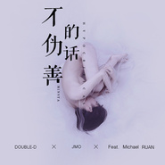

不伪善的话
============================

|  |  |
| :--: | :-- |
| [ 不伪善的话](https://emumo.xiami.com/album/2102402932) | **艺人**: [永无巷1303号](../index.md) **语种**: 国语 **唱片公司**: 永无巷1303号 **发行时间**: 2016年09月25日 **专辑类别**: EP, 单曲 **专辑风格**: 嘻哈 Hip-Hop, 流行说唱 Pop Rap, 抽象说唱 Abstract Hip Hop **播放数**: 1696879 **收藏数**: 28 **评论数**: 4  |

## 简介

“有多少感情会随着事物荒废，有多少人爱到白发才四目相对。”继《Just Smile》之后，来自Minsta的Double D,J-Mo与Michael RUAN再次合作，一起说一些不伪善的情话，请你认真听这首有温度的歌，Mix by Mai Cover by Double D ...

## 曲目

## 评论

|  |  |  |
| :-- | :-- | :-- |
|  [虾米用户](https://emumo.xiami.com/u/352342601)  2019-11-30 23:44 赞(0) 踩(0) | 
我想给一个7.5分的，好听，这是实话，但我不是特别喜欢。而且这歌有些东西还是欠缺的。
 |
|  [虾米用户](https://emumo.xiami.com/u/341091) 偶爱我们呢~ 2017-08-22 14:39 赞(0) 踩(0) | 
给两星的是跟他们有什么仇吗
 |
|  [虾米用户](https://emumo.xiami.com/u/16132066)  2017-05-20 07:18 赞(0) 踩(0) | 
没人
 |
|  [虾米用户](https://emumo.xiami.com/u/9726899)  2017-02-22 15:46 赞(0) 踩(0) | 
封面是谁啊，想看正脸~
 |
