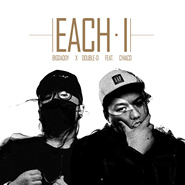

Each·I
============================

|  |  |
| :--: | :-- |
| [ Each·I](https://emumo.xiami.com/album/2102804729) | **艺人**: [永无巷1303号](../index.md) **语种**: 国语 **唱片公司**: MINSTA **发行时间**: 2017年07月28日 **专辑类别**: EP, 单曲 **专辑风格**: 嘻哈 Hip-Hop, 中国地下说唱 Chinese Underground Hip Hop, 意识说唱 Conscious Hip Hop **播放数**: 4003 **收藏数**: 2 **评论数**: 1  |

## 简介

每个人生存在这个世界上都有不同的一面，或许时而沉默不语，也或许时而巧舌如簧。此次新歌《Each·I》来自Double D和Big Daddy 以及活人俱乐部的Chiaco的助阵。“We were born to die,and I will be on fire.”来听听他们不一样的哪一面，是你。后期：Aope  

## 曲目

## 评论

|  |  |  |
| :-- | :-- | :-- |
|  [虾米用户](https://emumo.xiami.com/u/200057203)  2017-08-17 16:43 赞(0) 踩(0) | 
从Min Flag就开始关注你们，觉得你们Flow很棒，歌词很犀利，支持！希望你们也去&amp;ldquo;中国有嘻哈&amp;rdquo;去绽放自己，让更多的人认识你们！
 |
