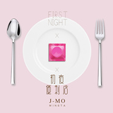

初夜便利店
============================

|  |  |
| :--: | :-- |
| [ 初夜便利店](https://emumo.xiami.com/album/2102850362) | **艺人**: [永无巷1303号](../index.md) **语种**: 国语 **唱片公司**: MINSTA **发行时间**: 2017年09月02日 **专辑类别**: EP, 单曲 **专辑风格**: 嘻哈 Hip-Hop, 流行说唱 Pop Rap, 中国地下说唱 Chinese Underground Hip Hop **播放数**: 2571 **收藏数**: 1 **评论数**: 1  |

## 简介

“有的人见一面只要坐飞机，有的人见一面要坐时光机。”这次新歌是来自J-Mo的单曲《初夜便利店》.在日暮低垂的时分，把所有的心事写成信件寄回到过去。“I Crush On Everything...”如果你也像他一样，那就来听歌吧！ 

## 曲目

## 评论

|  |  |  |
| :-- | :-- | :-- |
|  [虾米用户](https://emumo.xiami.com/u/40208599) 我很聪明什么也没留下 2017-09-04 17:11 赞(0) 踩(0) | 
|
 |
