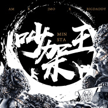

吵架王
============================

|  |  |
| :--: | :-- |
| [ 吵架王](https://emumo.xiami.com/album/2103463811) | **艺人**: [永无巷1303号](../index.md) **语种**: 国语 **唱片公司**: MINSTA **发行时间**: 2017年12月27日 **专辑类别**: EP, 单曲 **专辑风格**: 嘻哈 Hip-Hop, 地下说唱 Underground Hip Hop, 中国地下说唱 Chinese Underground Hip Hop **播放数**: 3635 **收藏数**: 4 **评论数**: 4  |

## 简介

Minsta音乐厂牌旗下说唱赛事主题曲《吵架王》正式上线！经历了几年的沉淀和突破，吵架王说唱赛事现已成为福建地区首屈一指的说唱赛事，2017年12月31日，来联发华美空间1981时尚馆第八届“吵架王·地下闽字旗”现场听Am、J-Mo、Big Daddy他们眼里的吵架王是怎么样的吧！ 

## 曲目

## 评论

|  |  |  |
| :-- | :-- | :-- |
|  [虾米用户](https://emumo.xiami.com/u/9833372) 我还没想好要写什么... 2018-01-12 23:50 赞(0) 踩(0) | 
佬爹牛逼。
 |
|  [虾米用户](https://emumo.xiami.com/u/40208599) 我很聪明什么也没留下 2017-12-28 21:47 赞(0) 踩(0) | 
|
 |
|  [虾米用户](https://emumo.xiami.com/u/73775600)   2017-12-28 02:38 赞(0) 踩(0) | 
不错
 |
|  [虾米用户](https://emumo.xiami.com/u/88595678)  2017-12-27 15:55 赞(0) 踩(0) | 
minsta！
 |
