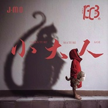

小大人
============================

|  |  |
| :--: | :-- |
| [ 小大人](https://emumo.xiami.com/album/2108282938) | **艺人**: [永无巷1303号](../index.md) **语种**: 国语 **唱片公司**: 独立发行 **发行时间**: 2020年04月03日 **专辑类别**: EP, 单曲 **专辑风格**: 嘻哈 Hip-Hop, 流行说唱 Pop Rap, 中国地下说唱 Chinese Underground Hip Hop **播放数**: 15730 **收藏数**: 1 **评论数**: 0  |

## 简介

小时候阿嬷总说，很多事你不用懂，  
我们就急着带着那些不懂，  
奔向了阿嫲说的世界。  
  
而很多年以后，  
我们弄懂了这个世界，  
阿嬷却不在了。  
  
突然就明白，  
原来阿嬷说的那些不用懂，  
是那么的幸运，  
  
能像孩子一样在成年人的世界生活，  
不就是一种幸运吗？

## 曲目

## 评论

|  |  |  |  |
| :-- | :-- | :-- | :-- |
