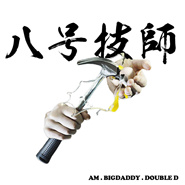
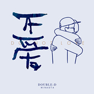
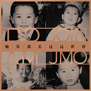

永无巷1303号
============================

|  |  |
| :--: | :-- |
| [ 永无巷1303号](https://i.xiami.com/minsta) | **播放数**: 4778552 **粉丝数**: 1677 **评论数**: 65 **地区**: China 中国大陆 **风格**: 硬核说唱 Hardcore Hip Hop, 爵士说唱 Jazz Rap, 嘻哈 Hip-Hop  |

## 档案

【旗下成员】   @DoubleD-DD @Am @J-Mo     【厂牌履历】   2014年，举办说唱赛事“吵架王RapBattleGame”正式进入大众视野。   2015年，Am获得IronMic福建赛区冠军。 同年，推出单曲《光来之前》、《Just Smile》，皆评论999+。   2016年，推出首张团队合辑《M.I.N》。期中多首作品获得中国嘻哈榜榜首及前三等各种奖项。  2017年，推出单曲《不伪善的话》，评论数10000+，播放量破千万。    2020年，总播放量破亿次。      【代表作】   《不伪善的话》《紫禁城》《第二履历》《光来之前》《Just Smile》等。

## 专辑

| 名称 | 语种 | 唱片公司 | 发行时间 | 专辑类别 | 专辑风格 |
| :--: | :-- | :-- | :-- | :-- | :-- |
| [ 下班局](./albums/5021382836.md) | 国语 | 永无巷1303号 | 2020年08月31日 | EP, 单曲 | 嘻哈 Hip-Hop, 爵士嘻哈 Jazz Hip Hop, 中国地下说唱 Chinese Underground Hip Hop |
| [ 无冕王](./albums/5021162223.md) | 国语 | 永无巷1303号 | 2020年07月26日 | EP, 单曲 | 嘻哈 Hip-Hop, 硬核说唱 Hardcore Hip Hop, 中国地下说唱 Chinese Underground Hip Hop |
| [ 像花虽未红](./albums/5020781375.md) | 国语 | 永无巷1303号 | 2020年05月30日 | EP, 单曲 | 嘻哈 Hip-Hop, 流行说唱 Pop Rap, 中国地下说唱 Chinese Underground Hip Hop |
| [ 1303号](./albums/5020609015.md) | 国语 | Minsta音乐工作室, MINSTA | 2020年05月13日 | EP, 单曲 | 嘻哈 Hip-Hop, 流行说唱 Pop Rap, 中国地下说唱 Chinese Underground Hip Hop |
| [ 小大人](./albums/2108282938.md) | 国语 | 独立发行 | 2020年04月03日 | EP, 单曲 | 嘻哈 Hip-Hop, 流行说唱 Pop Rap, 中国地下说唱 Chinese Underground Hip Hop |
| [ 你说要去哪呢](./albums/2108199449.md) | 国语 | 独立发行 | 2020年03月18日 | EP, 单曲 | 嘻哈 Hip-Hop, 流行说唱 Pop Rap, 中国地下说唱 Chinese Underground Hip Hop |
| [ 制造态度](./albums/2104967314.md) | 国语 | MINSTA | 2019年06月29日 | EP, 单曲 | 南方说唱 Southern Hip Hop, 嘻哈 Hip-Hop, 中国地下说唱 Chinese Underground Hip Hop |
| [ 假装是你](./albums/2104454498.md) | 国语 | MINSTA | 2019年01月07日 | EP, 单曲 | 爵士说唱 Jazz Rap, 嘻哈 Hip-Hop, 中国地下说唱 Chinese Underground Hip Hop |
| [ 第二履历](./albums/2104257976.md) | 国语 | MINSTA | 2018年11月21日 | EP, 单曲 | 流行说唱 Pop Rap, 嘻哈 Hip-Hop, 中国地下说唱 Chinese Underground Hip Hop |
| [ 逆向生长](./albums/2103993598.md) | 国语 | MINSTA | 2018年09月07日 | EP, 单曲 | 硬核说唱 Hardcore Hip Hop, 嘻哈 Hip-Hop, 中国地下说唱 Chinese Underground Hip Hop |
| [ 八号技师（Diss Back）](./albums/2103947085.md) | 国语 | 永无巷1303号 | 2018年08月24日 | EP, 单曲 | 嘻哈 Hip-Hop, 老派说唱 Old-school Hip Hop, 硬核说唱 Hardcore Hip Hop |
| [ Get Away From Me](./albums/2103869110.md) | 国语 | 永无巷1303号 | 2018年07月29日 | EP, 单曲 | 中国地下说唱 Chinese Underground Hip Hop, 南方说唱 Southern Hip Hop, 嘻哈 Hip-Hop |
| [ 没你没差](./albums/2103771988.md) | 国语 | 永无巷1303号 | 2018年07月01日 | EP, 单曲 | 嘻哈 Hip-Hop, 流行说唱 Pop Rap, 爵士嘻哈 Jazz Hip Hop |
| [ 都别睡](./albums/2103754499.md) | 国语 | 永无巷1303号 | 2018年06月23日 | EP, 单曲 | 嘻哈 Hip-Hop, 硬核说唱 Hardcore Hip Hop, 中国地下说唱 Chinese Underground Hip Hop |
| [ 捧烂趴](./albums/2103722001.md) | 国语 | MINSTA | 2018年05月28日 | EP, 单曲 | 嘻哈 Hip-Hop, 流行说唱 Pop Rap, 南方说唱 Southern Hip Hop |
| [ 威廉叶芝最后的署名来自你不爱的威廉叶芝](./albums/2103528741.md) | 国语 | 独立发行 | 2018年02月14日 | EP, 单曲 | 嘻哈 Hip-Hop |
| [ 教父](./albums/2103495352.md) | 国语 | MINSTA | 2018年01月19日 | EP, 单曲 | 流行说唱 Pop Rap, 中国地下说唱 Chinese Underground Hip Hop, 嘻哈 Hip-Hop |
| [ 匿名信](./albums/2103495293.md) | 国语 | MINSTA | 2018年01月19日 | EP, 单曲 | 嘻哈 Hip-Hop, 流行说唱 Pop Rap, 中国地下说唱 Chinese Underground Hip Hop |
| [ 吵架王](./albums/2103463811.md) | 国语 | MINSTA | 2017年12月27日 | EP, 单曲 | 嘻哈 Hip-Hop, 地下说唱 Underground Hip Hop, 中国地下说唱 Chinese Underground Hip Hop |
| [ 黑白讲](./albums/2102853576.md) | 国语 | MINSTA | 2017年09月08日 | EP, 单曲 | 嘻哈 Hip-Hop, 中国地下说唱 Chinese Underground Hip Hop |
| [ 初夜便利店](./albums/2102850362.md) | 国语 | MINSTA | 2017年09月02日 | EP, 单曲 | 嘻哈 Hip-Hop, 流行说唱 Pop Rap, 中国地下说唱 Chinese Underground Hip Hop |
| [ Each·I](./albums/2102804729.md) | 国语 | MINSTA | 2017年07月28日 | EP, 单曲 | 嘻哈 Hip-Hop, 中国地下说唱 Chinese Underground Hip Hop, 意识说唱 Conscious Hip Hop |
| [ 不爱](./albums/2102801728.md) | 国语 | MINSTA | 2017年07月23日 | EP, 单曲 | 流行说唱 Pop Rap, 嘻哈 Hip-Hop, 中国地下说唱 Chinese Underground Hip Hop |
| [ 屠羊Too Young（Diss Back）](./albums/2102777368.md) | 国语 | MINSTA | 2017年07月04日 | EP, 单曲 | 嘻哈 Hip-Hop, 中国地下说唱 Chinese Underground Hip Hop |
| [ 屠羊Too Young](./albums/2103707139.md) | 国语 | MINSTA | 2017年07月04日 | EP, 单曲 | 嘻哈 Hip-Hop, 东岸说唱 East Coast Hip Hop, 中国地下说唱 Chinese Underground Hip Hop |
| [ 她带我看过这世界](./albums/2102747808.md) | 国语 | 永无巷1303号 | 2017年05月14日 | EP, 单曲 | 流行说唱 Pop Rap, 中国地下说唱 Chinese Underground Hip Hop, 嘻哈 Hip-Hop |
| [ 圈外人](./albums/2102713008.md) | 国语 | 永无巷1303号 | 2017年03月15日 | EP, 单曲 | 嘻哈 Hip-Hop, 流行说唱 Pop Rap, 硬核说唱 Hardcore Hip Hop |
| [ 不伪善的话](./albums/2102402932.md) | 国语 | 永无巷1303号 | 2016年09月25日 | EP, 单曲 | 嘻哈 Hip-Hop, 流行说唱 Pop Rap, 抽象说唱 Abstract Hip Hop |
| [ Min Flag](./albums/2100370829.md) | 国语 | 永无巷1303号 | 2016年07月21日 | EP, 单曲 | 嘻哈 Hip-Hop, 老派说唱 Old-school Hip Hop, 中国地下说唱 Chinese Underground Hip Hop |
| [ 沿海线](./albums/2100301818.md) | 国语 | MINSTA | 2016年03月28日 | EP, 单曲 | 流行说唱 Pop Rap |
| [ B52](./albums/2100296060.md) | 国语 | 永无巷1303号 | 2016年03月18日 | EP, 单曲 | 嘻哈 Hip-Hop, 流行说唱 Pop Rap, 硬核说唱 Hardcore Hip Hop |
| [ 雨天](./albums/2100292608.md) | 国语 | 永无巷1303号 | 2016年03月14日 | EP, 单曲 | 流行说唱 Pop Rap |
| [ 光来之前](./albums/2100201566.md) | 国语 | 永无巷1303号 | 2015年09月15日 | EP, 单曲 | 流行说唱 Pop Rap |
| [ Light Paper](./albums/2100251952.md) | 国语 | 永无巷1303号 | 2015年09月09日 | EP, 单曲 | 意识说唱 Conscious Hip Hop |
| [ Just Smile](./albums/2100180656.md) | 国语 | 永无巷1303号 | 2015年08月19日 | EP, 单曲 | 地下说唱 Underground Hip Hop, 意识说唱 Conscious Hip Hop |
| [ 紫禁城](./albums/2100173548.md) | 国语 | MINSTA | 2015年08月01日 | EP, 单曲 | 南方说唱 Southern Hip Hop |
| [ 我要当学霸](./albums/1228412697.md) | 国语 | 永无巷1303号 | 2015年04月07日 | EP, 单曲 | 地下说唱 Underground Hip Hop |
| [ 陪你过冬天（客兄版 Remix）](./albums/1528411209.md) | 国语 | MINSTA | 2015年04月07日 | EP, 单曲 | 地下说唱 Underground Hip Hop |
| [ 靠边站](./albums/28413003.md) | 国语 | 永无巷1303号 | 2015年04月07日 | EP, 单曲 | 地下说唱 Underground Hip Hop |

## 评论

|  |  |  |  |
| :-- | :-- | :-- | :-- |
|  [虾米用户](https://emumo.xiami.com/u/358104299) 悲观的唯心存在现实解构虚... 2020-12-28 11:44 赞(0) 踩(0) | 
44543
 |
|  [虾米用户](https://emumo.xiami.com/u/12076161) 兼容古典和嘻哈 2020-04-29 11:04 赞(0) 踩(0) | 
宝藏厂牌
 |
|  [虾米用户](https://emumo.xiami.com/u/301609082) goodbye 虾米 2019-05-05 21:46 赞(0) 踩(0) | 
大老爹也在里面
 |
|  [虾米用户](https://emumo.xiami.com/u/24902954)  2019-02-21 13:36 赞(0) 踩(0) | 
如果没有地区特色，就别叫这个名字了。。
 |
|  [虾米用户](https://emumo.xiami.com/u/91372642) 不開心就不好看了 2018-09-07 16:56 赞(0) 踩(0) | 
x
 |
|  [虾米用户](https://emumo.xiami.com/u/289036014)  2018-05-20 22:12 赞(0) 踩(0) | 
中国新说唱，MINSTA有人上不上？
 |
| ⇒ |  [虾米用户](https://emumo.xiami.com/u/61956152)  2018-10-28 22:49 赞(0) 踩(0) | 
因为Real所以不去，不知道会不会开个真香？
 |
|  [虾米用户](https://emumo.xiami.com/u/308345558)  2018-02-20 20:56 赞(0) 踩(0) | 
感觉曲风还可以有点old school
 |
|  [虾米用户](https://emumo.xiami.com/u/308345558)  2018-02-20 20:55 赞(1) 踩(0) | 
这个厂牌可以支持一下的
 |
|  [虾米用户](https://emumo.xiami.com/u/322347710)  2018-02-17 22:52 赞(0) 踩(0) | 
有几首歌很走心，词不错
 |
|  [虾米用户](https://emumo.xiami.com/u/179519644) 我以乐为知己 不与愚人攀... 2018-01-26 09:01 赞(0) 踩(0) | 
屠羊被下架了？还好我有下载习惯
 |
|  [虾米用户](https://emumo.xiami.com/u/8243946)   2017-12-23 14:24 赞(0) 踩(0) | 
以为昨晚会唱紫禁城，震榕门5.0要唱啊！
 |
|  [虾米用户](https://emumo.xiami.com/u/328565812) 。。。。。 2017-11-01 22:15 赞(0) 踩(0) | 
100
 |
|  [虾米用户](https://emumo.xiami.com/u/329458321)  2017-10-29 11:55 赞(0) 踩(0) | 
  
 |
|  [虾米用户](https://emumo.xiami.com/u/266253967)  2017-10-04 21:53 赞(0) 踩(0) | 
这个厂牌有几个挺厉害的
 |
|  [虾米用户](https://emumo.xiami.com/u/245162984)  2017-09-12 17:26 赞(1) 踩(0) | 
光来之前不错
 |
|  [虾米用户](https://emumo.xiami.com/u/3469857) 站在枝头看你妹 2017-07-05 20:22 赞(0) 踩(0) | 
-v-
 |
|  [虾米用户](https://emumo.xiami.com/u/2418238) weibo: @尤米口 2017-06-08 12:42 赞(0) 踩(0) | 
ღ
 |
|  [虾米用户](https://emumo.xiami.com/u/156056836) 我还没想好要写什么... 2017-02-20 12:58 赞(0) 踩(0) | 
A
 |
|  [虾米用户](https://emumo.xiami.com/u/16135450)  2016-12-16 18:16 赞(0) 踩(0) | 
6541
 |
|  [虾米用户](https://emumo.xiami.com/u/50543979)   2016-12-09 18:56 赞(0) 踩(0) | 
特别舒服
 |
|  [虾米用户](https://emumo.xiami.com/u/43418234) ^_−☆ 2016-10-09 14:01 赞(0) 踩(0) | 

 |
|  [虾米用户](https://emumo.xiami.com/u/975767)  2016-08-22 13:50 赞(2) 踩(0) | 
是不会闽南语还是不出闽南语歌曲？乐团名叫这名字不就白叫了
 |
|  [虾米用户](https://emumo.xiami.com/u/40108297)  2016-07-10 18:42 赞(0) 踩(0) | 
nice
 |
|  [虾米用户](https://emumo.xiami.com/u/115575332) 我的存在或许只是用耳朵和... 2016-06-10 12:29 赞(0) 踩(0) | 
。
 |
|  [虾米用户](https://emumo.xiami.com/u/99819236) 我还没想好要写什么... 2016-05-28 11:46 赞(0) 踩(0) | 
能出些方言歌？
 |
|  [虾米用户](https://emumo.xiami.com/u/99819236) 我还没想好要写什么... 2016-05-28 09:37 赞(0) 踩(0) | 
闽南 upupup
 |
|  [虾米用户](https://emumo.xiami.com/u/10114692) livin withou... 2016-05-13 20:08 赞(1) 踩(0) | 
闽南go up
 |
|  [虾米用户](https://emumo.xiami.com/u/123018118)  2016-05-08 05:23 赞(0) 踩(0) | 
那就是光~
 |
|  [虾米用户](https://emumo.xiami.com/u/44604863) 每天都睡不着 2016-05-02 12:46 赞(0) 踩(0) | 
制霸闽南地区  ୧(๑•̀⌄•́๑)૭
 |
|  [虾米用户](https://emumo.xiami.com/u/43443614) 微信M7-Bonnie，... 2016-04-30 22:14 赞(0) 踩(0) | 
MINSTA  Big Daddy 
 |
|  [虾米用户](https://emumo.xiami.com/u/37840483) 再說吧 2016-04-21 14:28 赞(0) 踩(0) | 
耶耶耶
 |
|  [虾米用户](https://emumo.xiami.com/u/49417393) 一缕阳光 游走在黑暗间 2016-04-04 21:00 赞(0) 踩(0) | 
挺好的 怎么没人
 |
|  [虾米用户](https://emumo.xiami.com/u/118991220)  2016-03-15 13:00 赞(1) 踩(0) | 
别乱说好吗！什么刷上去的，看看多少人在听
 |
|  [虾米用户](https://emumo.xiami.com/u/8858880)  公開処刑 ／ リリー・... 2016-03-09 08:26 赞(0) 踩(0) | 
⚪️
 |
|  [虾米用户](https://emumo.xiami.com/u/118991220)  2016-03-01 13:00 赞(0) 踩(0) | 
好喜欢OC
 |
|  [虾米用户](https://emumo.xiami.com/u/50812779) 静修 2016-02-18 14:39 赞(0) 踩(0) | 
可以
 |
|  [虾米用户](https://emumo.xiami.com/u/2890630) 我还没想好要写什么... 2016-02-16 10:32 赞(0) 踩(0) | 
amoy
 |
|  [虾米用户](https://emumo.xiami.com/u/50869110) IG：77richiee... 2016-02-12 13:56 赞(0) 踩(0) | 
—
 |
|  [虾米用户](https://emumo.xiami.com/u/16960825)  2016-02-03 22:28 赞(0) 踩(0) | 

 |
|  [虾米用户](https://emumo.xiami.com/u/36107486) 南通本土说唱团队 2016-01-20 14:48 赞(0) 踩(0) | 
光来之前能做个remix吗
 |
|  [虾米用户](https://emumo.xiami.com/u/49934446) SINA WEIBO:@... 2016-01-14 12:49 赞(0) 踩(0) | 
真的好
 |
|  [虾米用户](https://emumo.xiami.com/u/48564556) 努力吧 2015-12-14 15:37 赞(0) 踩(0) | 
好
 |
|  [虾米用户](https://emumo.xiami.com/u/35247536) 暂无签名~ 2015-12-01 17:02 赞(1) 踩(0) | 
哪里找得到光来之前得伴奏啊，求伴奏啊
 |
|  [虾米用户](https://emumo.xiami.com/u/86238698)  2015-11-26 11:02 赞(19) 踩(0) | 
专辑分数挺低的 应该是刷播放量了吧
 |
| ⇒ |  [虾米用户](https://emumo.xiami.com/u/248332531)  2017-02-27 00:03 赞(0) 踩(0) | 
刷你妈
 |
|  [虾米用户](https://emumo.xiami.com/u/83069340)   2015-11-21 19:18 赞(0) 踩(0) | 
好喜欢好喜欢！继续加油！   
 |
|  [虾米用户](https://emumo.xiami.com/u/54728729) 虾米再见 2015-11-17 01:49 赞(0) 踩(0) | 
来了
 |
|  [虾米用户](https://emumo.xiami.com/u/6188935) 惊鸿一现瞥红颜 烙印心间... 2015-11-03 06:33 赞(0) 踩(0) | 
求新料
 |
|  [虾米用户](https://emumo.xiami.com/u/957327) 我还没想好要写什么... 2015-11-01 20:07 赞(0) 踩(0) | 
  
 |
|  [虾米用户](https://emumo.xiami.com/u/10860529)   2015-10-27 07:27 赞(0) 踩(0) | 
喜欢！
 |
|  [虾米用户](https://emumo.xiami.com/u/37753072) 我还没想好要写什么... 2015-09-29 21:02 赞(0) 踩(0) | 
？
 |
|  [虾米用户](https://emumo.xiami.com/u/70264686) 性取向这里可以双选噢~哈... 2015-09-29 17:34 赞(0) 踩(0) | 
来人啊，为什么没人，都很棒好不好。
 |
|  [虾米用户](https://emumo.xiami.com/u/6188935) 惊鸿一现瞥红颜 烙印心间... 2015-09-09 07:54 赞(0) 踩(0) | 
我要看着你成长
 |
|  [虾米用户](https://emumo.xiami.com/u/6188935) 惊鸿一现瞥红颜 烙印心间... 2015-09-09 07:43 赞(1) 踩(0) | 
我喜欢
 |
|  [虾米用户](https://emumo.xiami.com/u/37840483) 再說吧 2015-08-25 22:36 赞(0) 踩(0) | 
蛮赞的～
 |
|  [虾米用户](https://emumo.xiami.com/u/37840483) 再說吧 2015-08-25 22:36 赞(0) 踩(0) | 
为啥没人～
 |
|  [虾米用户](https://emumo.xiami.com/u/37861420) 听好听的歌，做想做的事 2015-08-20 17:17 赞(1) 踩(0) | 
light paper很赞
 |
|  [虾米用户](https://emumo.xiami.com/u/55969746)  2015-08-20 13:44 赞(1) 踩(0) | 
来支持下！怀挺！
 |
|  [虾米用户](https://emumo.xiami.com/u/50046431) baby 2015-08-16 17:03 赞(1) 踩(0) | 

 |
|  [虾米用户](https://emumo.xiami.com/u/52997765)  2015-07-24 14:01 赞(2) 踩(0) | 
你是山东这边的吗我也是我在找团体
 |
|  [虾米用户](https://emumo.xiami.com/u/35008745) 永无巷1303号/新的开... 2015-06-28 18:30 赞(1) 踩(0) | 
加油 
 |
|  [虾米用户](https://emumo.xiami.com/u/13446765)   2015-05-26 19:25 赞(7) 踩(0) | 
支持～～[带墨镜笑]
 |
|  [虾米用户](https://emumo.xiami.com/u/47160319)  2015-05-08 09:27 赞(1) 踩(0) | 
minsta
 |
|  [虾米用户](https://emumo.xiami.com/u/48656608) 官方微博@永无巷1303... 2015-04-03 12:38 赞(16) 踩(0) | 
我刚入驻了虾米音乐人，欢迎大家来我的个人主页，收听我的最新音乐
 |
