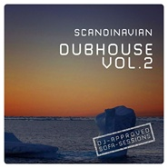

Scandinavian Dubhouse Vol. 2
============================

|  |  |
| :--: | :-- |
| [ Scandinavian Dubhouse Vol. 2](https://emumo.xiami.com/album/2103470409) | **艺人**: [Jeff Bernat](../index.md) **语种**: 英语 **唱片公司**: Laka-Tosh **发行时间**: 2007年07月09日 **专辑类别**: EP, 单曲 **专辑风格**: 电子 Electronic **播放数**: 5837 **收藏数**: 8 **评论数**: 3  |

## 简介

## 曲目

## 评论

|  |  |  |
| :-- | :-- | :-- |
|  [虾米用户](https://emumo.xiami.com/u/1418202)  江山共老 2019-01-02 14:37 赞(0) 踩(0) | 
艺人编辑错了吧，。？
 |
|  [虾米用户](https://emumo.xiami.com/u/1821649)  2018-04-16 16:14 赞(0) 踩(0) | 
这张是几个意思虾米
 |
|  [虾米用户](https://emumo.xiami.com/u/227508326)  2018-04-11 19:55 赞(2) 踩(0) | 
菲律宾方大同了解一下
 |
