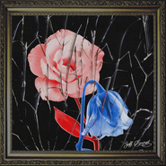

Changes
============================

|  |  |
| :--: | :-- |
| [ Changes](https://emumo.xiami.com/album/2103675097) | **艺人**: [Jeff Bernat](../index.md) **语种**: 英语 **唱片公司**: LOEN Entertainment **发行时间**: 2018年04月09日 **专辑类别**: EP, 单曲 **专辑风格**: 都市音乐 Urban **播放数**: 282844 **收藏数**: 60 **评论数**: 8  |

## 简介

Jeff Bernat – Changes  
  
R&amp;B 뮤지션 '제프 버넷 (Jeff Bernat)' 이 1년여 만에 새로운 음악으로 돌아왔다. 정규 4집 앨범 [AFTERWORDS]로 “Once Upon a Time’을 포함해 총 12곡이 수록 되어 있는 앨범을 지난해 5월 발매하고 오랜만에 본연의 ‘제프 버넷’ 스타일의 곡으로 돌아왔다. '제프 버넷(Jeff Bernat)'은 이번 싱글에도 오랜 프로듀싱 파트너 'JBird'와 함께 음악적 면모를 발휘했다.  
  
 

## 曲目

## 评论

|  |  |  |  |
| :-- | :-- | :-- | :-- |
|  [虾米用户](https://emumo.xiami.com/u/45686435) 一壺飛鳧 尋山夢鶴   ... 2019-02-24 06:02 赞(0) 踩(0) | 
⛈
 |
|  [虾米用户](https://emumo.xiami.com/u/10970617) 补补艺人资料 听听小众独... 2018-12-30 12:05 赞(0) 踩(0) | 
.
 |
|  [虾米用户](https://emumo.xiami.com/u/304449742)  2018-05-10 18:51 赞(0) 踩(0) | 
33889999966
 |
|  [虾米用户](https://emumo.xiami.com/u/354636026)  2018-05-07 18:35 赞(0) 踩(0) | 
舒服
 |
|  [虾米用户](https://emumo.xiami.com/u/47473511)  2018-05-04 13:59 赞(1) 踩(0) | 
还有人和我一起听吗
 |
|  [虾米用户](https://emumo.xiami.com/u/8590918) 喜欢简单粗暴 哈哈哈哈哈... 2018-04-13 17:25 赞(0) 踩(0) | 
期待 
 |
|  [虾米用户](https://emumo.xiami.com/u/33736051) 真 心 错 付 2018-04-13 02:09 赞(0) 踩(0) | 
♡
 |
|  [虾米用户](https://emumo.xiami.com/u/43044429) 无中生有的恶趣味 2018-04-10 16:11 赞(1) 踩(0) | 
#
 |
