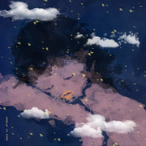
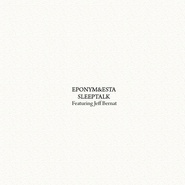
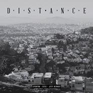

Jeff Bernat
============================

|  |  |
| :--: | :-- |
| [ Jeff Bernat](https://i.xiami.com/jeffbernat) | **播放数**: 16904738 **粉丝数**: 18186 **评论数**: 365 **地区**: United States of America 美国 **风格**: 当代节奏布鲁斯 Contemporary R&B, 新灵魂乐 Neo-Soul, 流行灵魂乐 Pop Soul, 都市音乐 Urban, 当代唱作人 Contemporary Singer-Songwriter  |

## 档案

WHAT IS A LOFI ？ 
KERO ONE CHINA TOUR 2019 
8/6 深圳 / OIL 
8/7  广州 / TU凸空间 
8/8  郑州 / 八仙 
8/9 昆明 / MODERNSKY LAB 
8/10 北京 / 乐空间 
8/11 南京 / 61NANKING 
8/14 杭州 / MAO LIVEHOUSE 
8/15 上海 / ARKHAM 
8/16 长沙 / 46 LIVEHOUSE 
8/17 成都 / NOX 
8/18 重庆 / VOX LIVEHOUSE 
TICKETS: 
https://www.showstart.com/event/list?type=1&tag=23181

## 专辑

| 名称 | 语种 | 唱片公司 | 发行时间 | 专辑类别 | 专辑风格 |
| :--: | :-- | :-- | :-- | :-- | :-- |
| [ Casual](./albums/5020679188.md) | 韩语 | ㈜ 카카오 M | 2020年05月21日 | EP, 单曲 | 节奏布鲁斯 R&B |
| [ She Loves Me Not](./albums/2104595886.md) | 韩语 | ㈜ 카카오 M | 2019年02月14日 | EP, 单曲 | 节奏布鲁斯 Rhythm & Blues |
| [ 사생결단로맨스 (MBC 월화드라마) OST - Part.7生死决断罗曼史(MBC 月火电视剧) OST - Part.7](./albums/2103948244.md) | 韩语 |  | 2018年08月27日 | 原声带, 影视音乐 | 节奏布鲁斯 Rhythm & Blues, 独立流行 Indie Pop |
| [ Changes](./albums/2103675097.md) | 英语 | LOEN Entertainment | 2018年04月09日 | EP, 单曲 | 都市音乐 Urban |
| [ 다라다DA RA DA](./albums/2102759164.md) | 韩语 | CJ E&M | 2017年06月04日 | EP, 单曲 | 流行灵魂乐 Pop Soul, 韩国流行 K-Pop |
| [ Afterwords](./albums/2102753028.md) | 英语 | Self-Released | 2017年05月24日 | 录音室专辑 | 流行灵魂乐 Pop Soul |
| [ Pray](./albums/2102683205.md) | 韩语 | LOEN Entertainment | 2017年01月22日 | EP, 单曲 | 韩国流行 K-Pop, 节奏布鲁斯 R&B |
| [ In the Meantime](./albums/2100265728.md) | 英语 | CJ E&M | 2016年01月20日 | 录音室专辑 |  |
| [ Make It Official](./albums/215171022.md) | 英语 | 네오위즈인터넷 | 2014年11月05日 | EP, 单曲 |  |
| [ Sleeptalk](./albums/1508957784.md) | 英语 | EPonym & Esta | 2014年08月22日 | EP, 单曲 | 流行说唱 Pop Rap |
| [ 운명처럼 널 사랑해 O.S.T Part.2命运一样爱着你 O.S.T Part.2](./albums/805574526.md) | 英语 | 포레스트미디어 | 2014年07月17日 | 原声带, 影视音乐 | 电视原声 Television Music |
| [ Distance](./albums/808957731.md) | 英语 | EPonym & Esta | 2014年01月24日 | EP, 单曲 | 流行说唱 Pop Rap |
| [ Modern Renaissance ](./albums/1886467068.md) | 英语 | Jeff Bernat | 2013年12月05日 | 录音室专辑 | 当代节奏布鲁斯 Contemporary R&B, 新灵魂乐 Neo-Soul |
| [ The Gentleman Approach](./albums/486437.md) | 英语 | Jeff Bernat | 2011年12月01日 | 录音室专辑 | 当代节奏布鲁斯 Contemporary R&B |
| [ Covers](./albums/564006.md) | 英语 | Self-Released | 2010年10月26日 | EP, 单曲 | 当代节奏布鲁斯 Contemporary R&B, 新灵魂乐 Neo-Soul |
| [ Scandinavian Dubhouse Vol. 2](./albums/2103470409.md) | 英语 | Laka-Tosh | 2007年07月09日 | EP, 单曲 | 电子 Electronic |

## 评论

|  |  |  |  |
| :-- | :-- | :-- | :-- |
|  [虾米用户](https://emumo.xiami.com/u/350887118) 只想过自己的生活。 2020-12-15 21:06 赞(0) 踩(0) | 
真的好爱他的声音啊。
 |
|  [虾米用户](https://emumo.xiami.com/u/374397660) 神只出现在末世 2020-12-10 00:38 赞(0) 踩(0) | 
奇才
 |
|  [虾米用户](https://emumo.xiami.com/u/110088060) 作为报答、我吔给泥放点、... 2020-10-13 20:01 赞(0) 踩(0) | 
.
 |
|  [虾米用户](https://emumo.xiami.com/u/419619630) I'm Fire. 2020-09-28 19:38 赞(0) 踩(0) | 
这演出信息是哪年的了
 |
|  [虾米用户](https://emumo.xiami.com/u/332498160)  You'll Love... 2020-09-11 09:09 赞(0) 踩(0) | 
太喜欢了
 |
|  [虾米用户](https://emumo.xiami.com/u/432129884) 感谢遇见，无憾再见 2020-05-29 14:10 赞(0) 踩(0) | 
他就是浪漫的人形化身吧
 |
|  [虾米用户](https://emumo.xiami.com/u/327400941) Let we do so... 2020-04-26 01:35 赞(1) 踩(0) | 
好喜欢啊
 |
|  [虾米用户](https://emumo.xiami.com/u/43492923) 行到水穷我才开始害怕，夕... 2020-04-17 14:28 赞(0) 踩(0) | 
。
 |
|  [虾米用户](https://emumo.xiami.com/u/48276337) 22世纪不道德 2020-03-09 11:27 赞(0) 踩(0) | 

 |
|  [虾米用户](https://emumo.xiami.com/u/255032220) Loving and l... 2020-02-06 12:07 赞(1) 踩(0) | 
city pop好神仙
 |
|  [虾米用户](https://emumo.xiami.com/u/432129884) 感谢遇见，无憾再见 2020-01-02 08:07 赞(1) 踩(0) | 
超级清新的嗓音！
 |
|  [虾米用户](https://emumo.xiami.com/u/9602872) 我还没想好要写什么... 2019-12-22 19:45 赞(0) 踩(0) | 
jeff居然听学猫叫？ 
 |
|  [虾米用户](https://emumo.xiami.com/u/1284245) Oublie-moi.  2019-11-27 09:28 赞(0) 踩(0) | 
现在在国内看演出，好像都是迟一个小时以上！
 |
|  [虾米用户](https://emumo.xiami.com/u/96031026) 我还没想好要写什么... 2019-11-26 01:39 赞(0) 踩(0) | 
很Sam ock
 |
|  [虾米用户](https://emumo.xiami.com/u/201391232) 最快的方法是先抱抱 2019-11-16 17:12 赞(1) 踩(0) | 
彡
 |
|  [虾米用户](https://emumo.xiami.com/u/309256043) 一起听歌吧… 2019-10-25 10:56 赞(0) 踩(0) | 

 |
|  [虾米用户](https://emumo.xiami.com/u/356763773) 我还没想好要写什么... 2019-10-08 01:24 赞(0) 踩(0) | 
。
 |
|  [虾米用户](https://emumo.xiami.com/u/7248680) 音乐 2019-09-20 09:08 赞(0) 踩(0) | 
看到你们都那么评价，我也放心了
 |
|  [虾米用户](https://emumo.xiami.com/u/416571321)  2019-09-13 19:53 赞(0) 踩(0) | 
希望能和你成为朋友
 |
|  [虾米用户](https://emumo.xiami.com/u/318104586)  再见再见了再见 2019-08-04 12:05 赞(0) 踩(0) | 
这小哥喜欢学猫叫     
 |
|  [虾米用户](https://emumo.xiami.com/u/50043422) Eminem -love... 2019-07-29 22:39 赞(0) 踩(0) | 
来了
 |
|  [虾米用户](https://emumo.xiami.com/u/49655313) 除了再见还可以说些什么呢 2019-07-29 12:45 赞(0) 踩(0) | 
西安西安西安
 |
|  [虾米用户](https://emumo.xiami.com/u/403111563)  2019-07-29 12:25 赞(0) 踩(0) | 
Yep!
 |
|  [虾米用户](https://emumo.xiami.com/u/411058641) 取之不尽 用之不竭 2019-05-13 21:49 赞(0) 踩(0) | 

 |
|  [虾米用户](https://emumo.xiami.com/u/46870502) \\\ 2019-04-28 07:43 赞(1) 踩(0) | 
真的是唯一一个一整个playlist听下来 全部都好听到炸歌手一年过去了还是不腻取向阻击了
 |
|  [虾米用户](https://emumo.xiami.com/u/318104586)  再见再见了再见 2019-04-05 21:28 赞(1) 踩(0) | 
小哥，你减个肥呗说不定下一个九亿少女的梦就你啊 
 |
|  [虾米用户](https://emumo.xiami.com/u/95947080) 生活愉快 2019-03-11 21:55 赞(0) 踩(0) | 
还是八零后给人的感觉好，自然人才能受保护。生活感觉是自己的，只有没感情的人才永不迟到。
 |
|  [虾米用户](https://emumo.xiami.com/u/99586286) 歌单停滞在2017 2019-03-11 08:57 赞(0) 踩(0) | 
哭泣  我怎么错过你的演出了
 |
|  [虾米用户](https://emumo.xiami.com/u/45686435) 一壺飛鳧 尋山夢鶴   ... 2019-02-22 17:42 赞(0) 踩(0) | 
〰️
 |
|  [虾米用户](https://emumo.xiami.com/u/63649852)  2019-01-31 00:44 赞(1) 踩(0) | 
所有歌都好听。。沉醉
 |
|  [虾米用户](https://emumo.xiami.com/u/357674040)  2019-01-06 03:14 赞(0) 踩(0) | 
❤
 |
|  [虾米用户](https://emumo.xiami.com/u/31377901) ♪ ∞  ☾   ོ  2018-12-28 23:49 赞(1) 踩(0) | 
？？？
 |
|  [虾米用户](https://emumo.xiami.com/u/14849) 我的心像海水 2018-12-21 22:04 赞(18) 踩(0) | 
成都也继续迟到一个小时，因为自己牌很大吗？只有你的时间才是时间嗦。很看不惯德艺不双馨的艺人。像极了之前那个前任男友，矮小的霍比特人。
 |
| ⇒ |  [虾米用户](https://emumo.xiami.com/u/47808059)   2019-01-11 10:30 赞(0) 踩(0) | 
这是故意的还是……
 |
| ⇒ |  [虾米用户](https://emumo.xiami.com/u/47808059)   2019-01-11 10:31 赞(0) 踩(0) | 
还挺喜欢他的歌来着
 |
| ⇒ |  [虾米用户](https://emumo.xiami.com/u/14849) 我的心像海水 2019-01-11 10:32 赞(0) 踩(0) | 
<q><b>&amp;:3说：</b></q>
 |
|  [虾米用户](https://emumo.xiami.com/u/8633036)  2018-12-20 23:15 赞(25) 踩(0) | 
在上海开开音乐会迟到一个多小时了还没出现，为什么会有人喜欢这种人。中国的钱很好赚吗？还不能退钱！！！！！rubbish
 |
| ⇒ |  [虾米用户](https://emumo.xiami.com/u/968770)  2019-02-14 15:51 赞(0) 踩(0) | 
之前在INS看到他解释 9点钟到了现场 但是LIVEHOUSE不给他们进去 说一定要11点半才能开始 其他细节就不知道了
 |
| ⇒ |  [虾米用户](https://emumo.xiami.com/u/97301298) 我还没想好要写什么... 2019-02-16 17:14 赞(0) 踩(0) | 
外国人演唱会都是这样
 |
| ⇒ |  [虾米用户](https://emumo.xiami.com/u/46389323)  2019-04-13 15:54 赞(0) 踩(0) | 
我靠居然是以为自己是大牌耍大牌的
 |
|  [虾米用户](https://emumo.xiami.com/u/1476760) 我渴望的辽阔，哪怕是居无... 2018-12-20 22:52 赞(15) 踩(0) | 
大哥！你出不出来啊！！等得极度不耐烦了！！！
 |
|  [虾米用户](https://emumo.xiami.com/u/49934446) SINA WEIBO:@... 2018-12-20 17:09 赞(0) 踩(0) | 
29 See Yaaaaa
 |
|  [虾米用户](https://emumo.xiami.com/u/9567348) 我还没想好要写什么... 2018-12-19 18:50 赞(0) 踩(0) | 
上海有官方群嗎
 |
|  [虾米用户](https://emumo.xiami.com/u/8109182) 我还没想好要写什么... 2018-12-19 13:06 赞(0) 踩(0) | 
昨晚的演出太棒啦！see u next year
 |
|  [虾米用户](https://emumo.xiami.com/u/85896040) ／ its A wrap... 2018-12-17 13:24 赞(0) 踩(0) | 
广州见呜呜呜呜
 |
|  [虾米用户](https://emumo.xiami.com/u/376606545) 我还没想好要写什么... 2018-12-17 12:30 赞(0) 踩(0) | 
宁波出发去上海站看的小伙伴有木有
 |
|  [虾米用户](https://emumo.xiami.com/u/9028760) 豆瓣见 spotify ... 2018-12-10 00:34 赞(0) 踩(0) | 
aaaa考虑去看（飞奔
 |
|  [虾米用户](https://emumo.xiami.com/u/6632083) DON'T PANIC  2018-12-07 18:21 赞(0) 踩(0) | 

 |
|  [虾米用户](https://emumo.xiami.com/u/305781857) crying all t... 2018-12-05 06:44 赞(0) 踩(0) | 
长沙不能拥有姓名吗
 |
|  [虾米用户](https://emumo.xiami.com/u/23635743) 酸 2018-12-04 13:50 赞(1) 踩(0) | 
为啥选在考研前来....
 |
|  [虾米用户](https://emumo.xiami.com/u/8109182) 我还没想好要写什么... 2018-12-03 15:22 赞(2) 踩(0) | 
终于等到你来中国了      
 |
|  [虾米用户](https://emumo.xiami.com/u/194859091)  2018-12-03 12:37 赞(0) 踩(0) | 
还有 图片集 17 的小哥 好看  
 |
|  [虾米用户](https://emumo.xiami.com/u/194859091)  2018-12-03 12:36 赞(0) 踩(0) | 
超级棒啊~心情愉悦剂 
 |
|  [虾米用户](https://emumo.xiami.com/u/346492287) 虾米不要离开我！ 2018-12-02 13:34 赞(0) 踩(0) | 
终于要来了
 |
|  [虾米用户](https://emumo.xiami.com/u/1801026) 我的時代已經過去了 2018-12-02 13:07 赞(0) 踩(0) | 
为什么不来北京！
 |
|  [虾米用户](https://emumo.xiami.com/u/49655313) 除了再见还可以说些什么呢 2018-12-02 05:14 赞(2) 踩(0) | 
請您下一次考慮一下西安吧！
 |
|  [虾米用户](https://emumo.xiami.com/u/1418202)  江山共老 2018-12-01 18:41 赞(0) 踩(0) | 
在国内哪里巡演呀，。？！！
 |
|  [虾米用户](https://emumo.xiami.com/u/50161840) A positive p... 2018-12-01 18:35 赞(3) 踩(0) | 
12.20上海场求组队结伴 
 |
|  [虾米用户](https://emumo.xiami.com/u/33512641) call me now,... 2018-11-26 11:04 赞(1) 踩(0) | 
ok 下个月
 |
|  [虾米用户](https://emumo.xiami.com/u/85848010) 不知何时又会再忆起 2018-11-04 14:17 赞(1) 踩(0) | 
！！我爱了
 |
|  [虾米用户](https://emumo.xiami.com/u/114335738) 网易云搜索C_1arin... 2018-11-03 15:12 赞(3) 踩(0) | 
啊 我喜欢的！！声音！！
 |
|  [虾米用户](https://emumo.xiami.com/u/49655313) 除了再见还可以说些什么呢 2018-10-27 12:00 赞(2) 踩(0) | 
迷人
 |
|  [虾米用户](https://emumo.xiami.com/u/8070377) 爱雾瑞性维欧腐漏 2018-10-14 23:31 赞(3) 踩(0) | 
泥豪 同龄人  
 |
|  [虾米用户](https://emumo.xiami.com/u/9647588) 相似度这么高要珍惜喔 2018-09-19 13:10 赞(0) 踩(0) | 
情歌专辑
 |
|  [虾米用户](https://emumo.xiami.com/u/171098898) love the wor... 2018-09-11 00:32 赞(1) 踩(0) | 
棒棒
 |
|  [虾米用户](https://emumo.xiami.com/u/33512641) call me now,... 2018-09-10 18:02 赞(4) 踩(0) | 
期待能有中国巡演
 |
|  [虾米用户](https://emumo.xiami.com/u/121910914) 我想好好睡个觉 2018-08-18 08:53 赞(1) 踩(0) | 
❤️
 |
|  [虾米用户](https://emumo.xiami.com/u/23534686) o 2018-07-11 17:44 赞(1) 踩(0) | 
o
 |
|  [虾米用户](https://emumo.xiami.com/u/285275587)  2018-06-21 21:10 赞(1) 踩(0) | 
真的超级好听，感谢王子异，让我听到这个歌手的歌，每一首都下载了，太舒服的声线了 
 |
|  [虾米用户](https://emumo.xiami.com/u/37107731)  2018-05-19 13:29 赞(2) 踩(0) | 
欧阳震华
 |
|  [虾米用户](https://emumo.xiami.com/u/12043932) 风雅 2018-05-15 11:02 赞(1) 踩(0) | 
洋气
 |
|  [虾米用户](https://emumo.xiami.com/u/357674040)  2018-05-13 07:05 赞(1) 踩(0) | 

 |
|  [虾米用户](https://emumo.xiami.com/u/181048152) study&music 2018-04-17 21:39 赞(1) 踩(0) | 
红心！！
 |
|  [虾米用户](https://emumo.xiami.com/u/288013826) 请大家一起养小虾米帮助听... 2018-03-28 22:50 赞(1) 踩(0) | 
）））
 |
|  [虾米用户](https://emumo.xiami.com/u/42725114) ThistheshitI... 2018-03-27 21:03 赞(1) 踩(0) | 

 |
|  [虾米用户](https://emumo.xiami.com/u/34255118) 围脖：ArtistDIA... 2018-02-28 07:54 赞(1) 踩(0) | 
太骚了喜欢
 |
|  [虾米用户](https://emumo.xiami.com/u/262861568) 我还没想好要写什么... 2018-02-24 21:00 赞(1) 踩(0) | 

 |
|  [虾米用户](https://emumo.xiami.com/u/278170417)  2018-02-09 21:08 赞(1) 踩(0) | 
不知道怎么表达了，每首歌都好浪漫
 |
|  [虾米用户](https://emumo.xiami.com/u/17146554) weibo：@L1RRO... 2018-02-01 13:43 赞(1) 踩(0) | 
❤️❤️❤️
 |
|  [虾米用户](https://emumo.xiami.com/u/50093825) 。 2018-01-10 08:47 赞(1) 踩(0) | 
: )
 |
|  [虾米用户](https://emumo.xiami.com/u/254658988)  2018-01-07 04:08 赞(4) 踩(0) | 
菲律宾的欧阳震华有方大同的嗓音
 |
| ⇒ |  [虾米用户](https://emumo.xiami.com/u/304415) She never wo... 2018-02-05 15:28 赞(0) 踩(0) | 
哈哈哈这个评价很准确了:&amp;gt;
 |
|  [虾米用户](https://emumo.xiami.com/u/13419968) 每个早晨叫醒我的，不是闹... 2018-01-04 16:10 赞(1) 踩(0) | 
不错，听着真舒服！
 |
|  [虾米用户](https://emumo.xiami.com/u/160210500) Music is Lif... 2018-01-02 15:40 赞(2) 踩(0) | 
欧阳震华哥哥唱歌真好听
 |
| ⇒ |  [虾米用户](https://emumo.xiami.com/u/108820726) ♩ - ♪ - ♫ - ... 2018-02-05 04:16 赞(0) 踩(0) | 
妹仔儿
 |
|  [虾米用户](https://emumo.xiami.com/u/1406361) 我还没想好要写什么... 2017-11-26 22:20 赞(2) 踩(0) | 
声音好好听！
 |
|  [虾米用户](https://emumo.xiami.com/u/33310780) ！ 2017-11-25 11:51 赞(2) 踩(0) | 
!!
 |
|  [虾米用户](https://emumo.xiami.com/u/325592869) 平凡@低调音乐男 2017-11-13 11:21 赞(2) 踩(0) | 
喜欢喜欢[带墨镜笑]
 |
|  [虾米用户](https://emumo.xiami.com/u/13111079) 有缘再见 2017-10-28 02:19 赞(2) 踩(0) | 

 |
|  [虾米用户](https://emumo.xiami.com/u/32324791) vx：GUOYD116 2017-10-13 23:36 赞(10) 踩(0) | 
菲律宾DEAN！然后我后知后觉你真的和DEAN合唱过啊！
 |
|  [虾米用户](https://emumo.xiami.com/u/2418238) weibo: @尤米口 2017-10-09 23:55 赞(2) 踩(0) | 
♡⃛
 |
|  [虾米用户](https://emumo.xiami.com/u/50728608) 我还没想好要写什么... 2017-10-06 21:00 赞(2) 踩(0) | 
聲音暖
 |
|  [虾米用户](https://emumo.xiami.com/u/44925253) Four_0522 2017-09-20 00:30 赞(1) 踩(0) | 

 |
|  [虾米用户](https://emumo.xiami.com/u/9028760) 豆瓣见 spotify ... 2017-09-17 08:55 赞(2) 踩(0) | 
这个声音绝了惹
 |
|  [虾米用户](https://emumo.xiami.com/u/52034644) 身体会跳舞 2017-07-25 11:09 赞(1) 踩(0) | 
嘻嘻
 |
|  [虾米用户](https://emumo.xiami.com/u/304994886)  2017-06-24 12:29 赞(4) 踩(0) | 
不信你们，听了前十首，真的都 好 听 听 听啊~~
 |
|  [虾米用户](https://emumo.xiami.com/u/13702274) 我还没想好要写什么... 2017-06-12 15:24 赞(2) 踩(0) | 
声音好像方大同啊！！
 |
|  [虾米用户](https://emumo.xiami.com/u/7874754)   觉悟者恒幸福 2017-06-01 16:08 赞(1) 踩(0) | 
马儒，是你吗233333
 |
|  [虾米用户](https://emumo.xiami.com/u/2424381) 我还没想好要写什么... 2017-05-25 08:58 赞(2) 踩(0) | 
欧阳震华
 |
|  [虾米用户](https://emumo.xiami.com/u/240828439) _(:з」∠)_ 2017-05-22 22:15 赞(0) 踩(0) | 
 
 |
|  [虾米用户](https://emumo.xiami.com/u/243268100)   2017-05-16 18:00 赞(1) 踩(0) | 
好好听
 |
|  [虾米用户](https://emumo.xiami.com/u/189002) 贫困科幻 2017-05-11 18:57 赞(0) 踩(0) | 
niiice
 |
|  [虾米用户](https://emumo.xiami.com/u/44345651)   2017-03-31 16:53 赞(0) 踩(0) | 
我第一次听这首歌是好像是太阳和他合唱的
 |
|  [虾米用户](https://emumo.xiami.com/u/266333293)  2017-03-31 16:10 赞(0) 踩(0) | 
声音好苏  
 |
|  [虾米用户](https://emumo.xiami.com/u/37891950) 我在熬夜 熟了叫你 2017-03-22 20:52 赞(0) 踩(0) | 
⭕
 |
|  [虾米用户](https://emumo.xiami.com/u/48987592) 音乐是空气 2017-03-14 08:47 赞(0) 踩(0) | 
虽然人不帅，但是超爱他的歌 
 |
|  [虾米用户](https://emumo.xiami.com/u/122464322) 溢出 2017-03-07 06:41 赞(0) 踩(0) | 
声音真心好听啊 酥...
 |
|  [虾米用户](https://emumo.xiami.com/u/42874063) 只听好听的歌 2017-03-03 11:37 赞(1) 踩(0) | 
第一眼看成欧阳震华
 |
|  [虾米用户](https://emumo.xiami.com/u/34572381)  2017-01-31 22:06 赞(0) 踩(0) | 
超爱
 |
|  [虾米用户](https://emumo.xiami.com/u/41715737) 喜欢简直就是把人变蠢的魔... 2017-01-26 20:43 赞(1) 踩(0) | 
唐马儒+1 噗哈哈
 |
|  [虾米用户](https://emumo.xiami.com/u/156056836) 我还没想好要写什么... 2017-01-26 02:46 赞(0) 踩(0) | 
¿
 |
|  [虾米用户](https://emumo.xiami.com/u/8943891) 你咋那么可爱？ 2017-01-22 11:23 赞(0) 踩(0) | 
I
 |
| ⇒ |  [虾米用户](https://emumo.xiami.com/u/2493237) Star never l... 2018-05-20 23:34 赞(0) 踩(0) | 

 |
|  [虾米用户](https://emumo.xiami.com/u/47567761)   2017-01-20 22:17 赞(0) 踩(0) | 
什么时候出新歌...
 |
|  [虾米用户](https://emumo.xiami.com/u/227844644) 别的世界一定比这个好 2017-01-10 19:47 赞(1) 踩(0) | 
四年前 第一次听到groovin
 |
|  [虾米用户](https://emumo.xiami.com/u/17872499)  2016-12-17 11:23 赞(0) 踩(0) | 
人不可貌相...
 |
|  [虾米用户](https://emumo.xiami.com/u/149095296) …当孤单已经变成一种习惯 2016-11-21 00:13 赞(1) 踩(0) | 
怎么可以每首歌都那么好听！
 |
|  [虾米用户](https://emumo.xiami.com/u/187502143) ☾ 2016-11-13 22:00 赞(1) 踩(0) | 
callyoumine真的超级喜欢
 |
|  [虾米用户](https://emumo.xiami.com/u/16129147) keep real be... 2016-11-12 20:31 赞(3) 踩(0) | 
越来越多人喜欢他 不开心 
 |
|  [虾米用户](https://emumo.xiami.com/u/9028760) 豆瓣见 spotify ... 2016-10-30 22:00 赞(0) 踩(0) | 
☹️
 |
|  [虾米用户](https://emumo.xiami.com/u/3702608) hello! vodka 2016-10-22 16:51 赞(0) 踩(0) | 
。。。
 |
|  [虾米用户](https://emumo.xiami.com/u/3702608) hello! vodka 2016-10-22 16:51 赞(1) 踩(0) | 
每一首都忍不住点收藏，，淡淡的清新与温暖简直不能再舒服。。这小伙子还跟我一个岁数，一个月份。。
 |
|  [虾米用户](https://emumo.xiami.com/u/3702608) hello! vodka 2016-10-22 16:48 赞(2) 踩(0) | 
太舒服~~~~太喜欢~~~~~~淡淡的清爽和温暖
 |
|  [虾米用户](https://emumo.xiami.com/u/3607930) 一条红色的鱼，一只黑色的... 2016-09-26 09:27 赞(1) 踩(0) | 
声音太好听了
 |
|  [虾米用户](https://emumo.xiami.com/u/196988455) 不爱说话就爱玩 2016-09-15 22:53 赞(0) 踩(0) | 
:)
 |
|  [虾米用户](https://emumo.xiami.com/u/2763753) The best is ... 2016-09-05 12:14 赞(0) 踩(0) | 
～
 |
|  [虾米用户](https://emumo.xiami.com/u/42695089) vb：吴浣甜甜 2016-09-01 22:20 赞(0) 踩(0) | 
。
 |
|  [虾米用户](https://emumo.xiami.com/u/45298985) Wechat:dqx19... 2016-08-20 21:47 赞(0) 踩(0) | 
+
 |
|  [虾米用户](https://emumo.xiami.com/u/54537050) 我还没想好要写什么... 2016-08-10 17:39 赞(0) 踩(0) | 
❣
 |
|  [虾米用户](https://emumo.xiami.com/u/3496847) 夢醒了，所以心碎了。 2016-08-04 16:12 赞(1) 踩(0) | 
世界上的另一个他——方大同
 |
|  [虾米用户](https://emumo.xiami.com/u/54121389)   2016-08-03 10:46 赞(0) 踩(0) | 
喜欢
 |
|  [虾米用户](https://emumo.xiami.com/u/280791) @愚細胞 2016-07-15 00:36 赞(1) 踩(0) | 
他的声音太舒服了
 |
|  [虾米用户](https://emumo.xiami.com/u/44023971) nothing 2016-07-14 13:58 赞(1) 踩(0) | 
Call you mine和闺蜜伴着通过了初中 调如此中胃口  一段记忆的歌手
 |
|  [虾米用户](https://emumo.xiami.com/u/85148548)  2016-07-14 10:21 赞(2) 踩(0) | 
不是han吧 
 |
|  [虾米用户](https://emumo.xiami.com/u/35026171)   2016-07-12 18:00 赞(1) 踩(0) | 
参演han？你逗我？？
 |
|  [虾米用户](https://emumo.xiami.com/u/48435084) 虾米，我爱你啊 2016-06-29 14:26 赞(1) 踩(0) | 
爱死这个小胖子了   
 |
|  [虾米用户](https://emumo.xiami.com/u/7874512) 暂无签名~ 2016-06-10 21:59 赞(1) 踩(0) | 
声音和脸完全不同感觉hhhhh
 |
|  [虾米用户](https://emumo.xiami.com/u/6474367) hey 2016-06-04 00:33 赞(16) 踩(0) | 
菲律宾欧阳震华。。
 |
|  [虾米用户](https://emumo.xiami.com/u/13526500) Comment ça v... 2016-06-02 08:11 赞(0) 踩(0) | 
唐马儒真相
 |
|  [虾米用户](https://emumo.xiami.com/u/48933291) 你好！镜子里的你！ 2016-05-25 20:57 赞(1) 踩(0) | 
和方大同确实有点像   又多了些特别
 |
|  [虾米用户](https://emumo.xiami.com/u/1229178) Fuck fashion 2016-05-12 20:34 赞(0) 踩(0) | 
好舒服
 |
|  [虾米用户](https://emumo.xiami.com/u/43173766) 算了我放下了   再会吧... 2016-05-10 14:15 赞(0) 踩(0) | 
好听
 |
|  [虾米用户](https://emumo.xiami.com/u/35026171)   2016-04-30 10:57 赞(0) 踩(0) | 
喜欢男声之一 暖
 |
|  [虾米用户](https://emumo.xiami.com/u/29980527) 暂无签名~ 2016-04-29 22:36 赞(1) 踩(0) | 
这个歌手的声音与长像 真的是继朴灿烈之后 又一个让我觉得这个世界上为什么会有声音和外表如此不符的人 吃我一剂安利
 |
|  [虾米用户](https://emumo.xiami.com/u/34624271) 烦恼执障 2016-04-29 15:14 赞(2) 踩(0) | 
菲律宾方大同声线 欧阳震华的脸 蝴蝶结的化身
 |
|  [虾米用户](https://emumo.xiami.com/u/44790890) 我还没想好要写什么... 2016-04-12 22:09 赞(0) 踩(0) | 
好听的旋律好听的声音！
 |
|  [虾米用户](https://emumo.xiami.com/u/48821186)  2016-04-12 10:40 赞(0) 踩(0) | 

 |
|  [虾米用户](https://emumo.xiami.com/u/51669413) 自由之行 2016-04-10 10:17 赞(0) 踩(0) | 
舒服
 |
|  [虾米用户](https://emumo.xiami.com/u/51876362) 1h's album. 2016-04-10 08:16 赞(0) 踩(0) | 
欧阳震华
 |
| ⇒ |  [虾米用户](https://emumo.xiami.com/u/9434236)  2016-04-21 02:31 赞(0) 踩(0) | 
哈哈，精辟
 |
|  [虾米用户](https://emumo.xiami.com/u/560540) 勇敢的好姑娘永垂不朽 2016-04-06 12:51 赞(0) 踩(0) | 
咦，封面什么时候换哒，原来那个好看点噻，这个呆
 |
|  [虾米用户](https://emumo.xiami.com/u/54743688) 我还没想好要写什么... 2016-03-23 20:10 赞(0) 踩(0) | 
声音很好听呐
 |
|  [虾米用户](https://emumo.xiami.com/u/78171926)  2016-03-21 18:22 赞(0) 踩(0) | 
好听 
 |
|  [虾米用户](https://emumo.xiami.com/u/69812398)   2016-03-21 04:42 赞(0) 踩(0) | 
这家伙歌真好听啊
 |
|  [虾米用户](https://emumo.xiami.com/u/7298382)   2016-03-12 17:30 赞(0) 踩(0) | 
声音好舒服
 |
|  [虾米用户](https://emumo.xiami.com/u/45466478) BadYori 2016-03-12 16:09 赞(0) 踩(0) | 
虽然知道没人吃 但是这个安利我卖定了！
 |
|  [虾米用户](https://emumo.xiami.com/u/45466478) BadYori 2016-03-12 16:08 赞(0) 踩(0) | 
虽然知道不会有人吃 但是这个安利我卖定了！
 |
|  [虾米用户](https://emumo.xiami.com/u/45466478) BadYori 2016-03-06 15:52 赞(1) 踩(0) | 
失眠必听他。。。。
 |
|  [虾米用户](https://emumo.xiami.com/u/10537724) 暂无签名~ 2016-03-02 13:58 赞(0) 踩(0) | 
赞嗓
 |
|  [虾米用户](https://emumo.xiami.com/u/96960270) 天，将降大任于斯人。 2016-02-25 13:29 赞(0) 踩(0) | 
哈！
 |
|  [虾米用户](https://emumo.xiami.com/u/64402358) keyi 2016-02-19 12:10 赞(3) 踩(0) | 
欧阳震华
 |
| ⇒ |  [虾米用户](https://emumo.xiami.com/u/1198225) Mi amore 2016-03-24 13:37 赞(0) 踩(0) | 
哈哈哈哈哈
 |
|  [虾米用户](https://emumo.xiami.com/u/8224939) Swag… 2016-02-17 11:08 赞(1) 踩(0) | 
菲律宾版本的方大同+baby face ?so cool`
 |
|  [虾米用户](https://emumo.xiami.com/u/17013788) 微博同名 2016-02-14 17:00 赞(1) 踩(0) | 
哈哈哈
 |
|  [虾米用户](https://emumo.xiami.com/u/99238790) 这辈子离不开音乐 2016-02-12 23:55 赞(0) 踩(0) | 
这么好听!! 声控被惊艳到了
 |
|  [虾米用户](https://emumo.xiami.com/u/52350680)  2016-02-12 23:33 赞(0) 踩(0) | 
帅！
 |
|  [虾米用户](https://emumo.xiami.com/u/55916106) 这里是我自己的世界 2016-02-12 21:27 赞(0) 踩(0) | 
这么好听，居然关注的人这么少。
 |
|  [虾米用户](https://emumo.xiami.com/u/48713155) 想。 2016-02-12 09:38 赞(0) 踩(0) | 
这不是han吧…
 |
|  [虾米用户](https://emumo.xiami.com/u/35641833) (=ﾟωﾟ)ﾉ不不不布布... 2016-02-11 21:20 赞(0) 踩(0) | 
香港还有个？我迷茫了，不是一个人？我脸盲………
 |
|  [虾米用户](https://emumo.xiami.com/u/5058803) EnterTheVoid 2016-02-01 15:28 赞(0) 踩(0) | 
喜欢的时候当时还只能从国外搬运下载 如今国内也可以听真好
 |
|  [虾米用户](https://emumo.xiami.com/u/22881143) ㅤㅤㅤㅤ 2016-02-01 13:02 赞(0) 踩(0) | 
。
 |
|  [虾米用户](https://emumo.xiami.com/u/50033816) 谢谢各位虾米的朋友，我的... 2016-01-30 13:32 赞(0) 踩(0) | 
hi
 |
|  [虾米用户](https://emumo.xiami.com/u/24992870) 美兔 2016-01-29 17:50 赞(0) 踩(0) | 
光听这声音绝壁想不到HAN的脸
 |
|  [虾米用户](https://emumo.xiami.com/u/9513422) 虾米歌单迁徙到网易☁️:... 2016-01-28 13:08 赞(0) 踩(0) | 
陪我在澳洲度过了一段美好的时光. 
 |
|  [虾米用户](https://emumo.xiami.com/u/8943891) 你咋那么可爱？ 2016-01-26 17:43 赞(0) 踩(0) | 
l
 |
|  [虾米用户](https://emumo.xiami.com/u/102657052) 跟有情人做快乐事，别问是... 2016-01-24 09:41 赞(0) 踩(0) | 
Jeff Bernat的歌都好好听 
 |
|  [虾米用户](https://emumo.xiami.com/u/3510853)  2016-01-21 17:08 赞(0) 踩(0) | 
- -
 |
|  [虾米用户](https://emumo.xiami.com/u/50150591) =) 2016-01-19 16:46 赞(0) 踩(0) | 
舒服死了
 |
|  [虾米用户](https://emumo.xiami.com/u/41852394) Hallelujah。 2016-01-17 20:56 赞(0) 踩(0) | 
warmmi
 |
|  [虾米用户](https://emumo.xiami.com/u/99809342)  2016-01-13 22:07 赞(0) 踩(0) | 
和Mckay  Kim合作的Angel  2  me是最爱
 |
|  [虾米用户](https://emumo.xiami.com/u/49066036) 只要有音樂就不會有世界末... 2016-01-11 05:04 赞(69) 踩(0) | 
歌手名：欧阳震华产地：菲律宾曲风：Fumk  方R大&amp;amp;同B参演经历：《破产姐妹》的han长处：所有歌他一出声就收藏~
 |
| ⇒ |  [虾米用户](https://emumo.xiami.com/u/14031187) Deja Vu 2016-02-01 22:05 赞(0) 踩(0) | 
哈哈哈哈哈哈哈哈哈哈
 |
| ⇒ |  [虾米用户](https://emumo.xiami.com/u/211084854) 全 世 界 都 只 有 ... 2016-08-10 03:46 赞(0) 踩(0) | 
你太逗 
 |
| ⇒ |  [虾米用户](https://emumo.xiami.com/u/259589364) 我还没想好要写什么... 2017-07-19 07:59 赞(0) 踩(0) | 
不是Funk吗？
 |
| ⇒ |  [虾米用户](https://emumo.xiami.com/u/173161412)  2017-11-16 14:41 赞(0) 踩(0) | 
哈哈哈哈
 |
| ⇒ |  [虾米用户](https://emumo.xiami.com/u/241359049) + 2017-11-19 12:16 赞(0) 踩(0) | 
哈哈哈哈哈哈哈哈
 |
| ⇒ |  [虾米用户](https://emumo.xiami.com/u/241359049) + 2017-11-19 12:16 赞(0) 踩(0) | 

 |
| ⇒ |  [虾米用户](https://emumo.xiami.com/u/42646953) 大嫣嫣叫杨伟妍 2017-12-06 13:40 赞(0) 踩(0) | 
哈哈哈哈哈就服你
 |
| ⇒ |  [虾米用户](https://emumo.xiami.com/u/271546) 额哪有人看这个 2018-07-07 15:34 赞(0) 踩(0) | 
可以可以 没毛病
 |
| ⇒ |  [虾米用户](https://emumo.xiami.com/u/93912566)  2020-03-21 18:14 赞(0) 踩(0) | 
老子差点就信了，特地去百度了一下
 |
|  [虾米用户](https://emumo.xiami.com/u/3483407)  2015-12-27 06:52 赞(0) 踩(0) | 
听过crush的Call You Mine而来
 |
|  [虾米用户](https://emumo.xiami.com/u/57130010) 坚定内心，脚踏实地，没心... 2015-12-15 15:20 赞(0) 踩(0) | 
！
 |
|  [虾米用户](https://emumo.xiami.com/u/9029057)   2015-12-13 22:53 赞(1) 踩(0) | 
唐马儒！
 |
|  [虾米用户](https://emumo.xiami.com/u/453837) 没调侃，你想想看是不是 2015-12-11 01:57 赞(0) 踩(0) | 
R&amp;amp;B
 |
|  [虾米用户](https://emumo.xiami.com/u/45436261) 我还没想好要写什么... 2015-12-05 00:38 赞(0) 踩(0) | 
真的光听着都觉得浪漫的声音 
 |
|  [虾米用户](https://emumo.xiami.com/u/2896313) 一蓑烟雨任平生 2015-12-03 17:21 赞(0) 踩(0) | 
已单曲循环，出不去了······
 |
|  [虾米用户](https://emumo.xiami.com/u/2896313) 一蓑烟雨任平生 2015-12-03 17:21 赞(0) 踩(0) | 
春日暖风
 |
|  [虾米用户](https://emumo.xiami.com/u/2896313) 一蓑烟雨任平生 2015-12-03 17:19 赞(0) 踩(0) | 
温柔，像就趴在耳朵边上哼唱，喜欢喜欢。
 |
|  [虾米用户](https://emumo.xiami.com/u/19619564) Bossy sassy ... 2015-12-01 18:18 赞(0) 踩(0) | 
好声音
 |
|  [虾米用户](https://emumo.xiami.com/u/721701)  2015-12-01 09:05 赞(0) 踩(0) | 
这比方大同的歌好听多了~~~
 |
|  [虾米用户](https://emumo.xiami.com/u/16396509)  2015-11-24 17:19 赞(0) 踩(0) | 
即使长得不帅 我也好爱你
 |
|  [虾米用户](https://emumo.xiami.com/u/3948551) 爷还没想好要写什么.. 2015-11-15 11:54 赞(0) 踩(0) | 
东南雅钮搜RNB
 |
|  [虾米用户](https://emumo.xiami.com/u/39065058)   2015-11-14 12:43 赞(0) 踩(0) | 
他的歌都好好听惹～！( ˃◡˂ /// )
 |
|  [虾米用户](https://emumo.xiami.com/u/16071065) “比兰州拉面还要普通” 2015-10-24 15:47 赞(0) 踩(0) | 

 |
|  [虾米用户](https://emumo.xiami.com/u/8777227)   2015-10-23 23:09 赞(84) 踩(0) | 
声音超好听⋯⋯但是为毛觉得神似唐马儒
 |
| ⇒ |  [虾米用户](https://emumo.xiami.com/u/52455148)   2016-12-10 15:29 赞(0) 踩(0) | 
哈哈哈哈哈哈哈哈哈哈哈哈哈哈哈哈哈哈
 |
| ⇒ |  [虾米用户](https://emumo.xiami.com/u/12555877) 我还没想好要写什么... 2017-12-30 23:01 赞(0) 踩(0) | 
还有欧阳震华
 |
| ⇒ |  [虾米用户](https://emumo.xiami.com/u/25128230) 東  京  急  行  ... 2018-06-21 20:29 赞(0) 踩(0) | 
早高峰笑出豬吼，周圍瞬間讓開一大片，我得以一路坐到公司，感恩 
 |
|  [虾米用户](https://emumo.xiami.com/u/36514939) 她留着超酷的短发 网易云... 2015-10-21 16:23 赞(0) 踩(0) | 
⚫️
 |
|  [虾米用户](https://emumo.xiami.com/u/57967958)   有个毛线━┳━　━┳... 2015-10-16 02:23 赞(0) 踩(0) | 
爱上他的声音了， 听他的歌，感觉自己会弯 
 |
|  [虾米用户](https://emumo.xiami.com/u/36057170)  2015-10-16 00:28 赞(1) 踩(0) | 
人不可貌相 棒棒哒 
 |
|  [虾米用户](https://emumo.xiami.com/u/28851910) UCL 2015-10-05 17:25 赞(2) 踩(0) | 
比起方大同，更像清水翔太
 |
| ⇒ |  [虾米用户](https://emumo.xiami.com/u/36514939) 她留着超酷的短发 网易云... 2015-10-21 16:23 赞(0) 踩(0) | 
没错！！！
 |
|  [虾米用户](https://emumo.xiami.com/u/261633)  2015-10-04 15:35 赞(0) 踩(0) | 
声音好听
 |
|  [虾米用户](https://emumo.xiami.com/u/47681908)   2015-09-26 13:29 赞(0) 踩(0) | 
为什么每首都好听？
 |
|  [虾米用户](https://emumo.xiami.com/u/36313823) 给你宇宙  2015-09-22 00:18 赞(0) 踩(0) | 
jooyoung版本的call me mine也是超好听~♥♥
 |
|  [虾米用户](https://emumo.xiami.com/u/58582078) KinjaBang！ 2015-09-20 09:38 赞(0) 踩(0) | 
Be the one
 |
|  [虾米用户](https://emumo.xiami.com/u/40516135) 如果不是我，就不要去爱。 2015-09-18 13:13 赞(1) 踩(0) | 
反差萌这哥们
 |
|  [虾米用户](https://emumo.xiami.com/u/1064136)  2015-09-06 13:46 赞(0) 踩(0) | 
在韩国发展的菲律宾裔美国歌手吗？
 |
|  [虾米用户](https://emumo.xiami.com/u/5577839) ☯☯☯ 2015-09-01 17:58 赞(0) 踩(0) | 
声线不能够
 |
|  [虾米用户](https://emumo.xiami.com/u/13805138) nw 2015-08-30 21:14 赞(0) 踩(0) | 
良心音乐啊～
 |
|  [虾米用户](https://emumo.xiami.com/u/52128341) 我还没想好要写什么... 2015-08-27 17:44 赞(0) 踩(0) | 
声音好听，开口耳朵就怀孕咯。太棒
 |
|  [虾米用户](https://emumo.xiami.com/u/87398) 藏不住的是你最珍贵的倔强 2015-08-27 16:23 赞(3) 踩(0) | 
又是一个听歌怀孕，看脸吓尿的歌手。
 |
|  [虾米用户](https://emumo.xiami.com/u/8854264) Hypocrite. 2015-08-07 13:24 赞(0) 踩(0) | 
歌很棒 就是长得有点像。。凤哥
 |
|  [虾米用户](https://emumo.xiami.com/u/11646383) time fly 2015-07-14 13:45 赞(0) 踩(0) | 
nice
 |
|  [虾米用户](https://emumo.xiami.com/u/6734888) Nothing to l... 2015-07-06 17:27 赞(0) 踩(0) | 
耳朵怀孕惹
 |
|  [虾米用户](https://emumo.xiami.com/u/1601859) 想啊想啊，想起你了。 2015-06-26 11:57 赞(4) 踩(0) | 
第一眼觉得哥们长得挺像欧阳震华  
 |
| ⇒ |  [虾米用户](https://emumo.xiami.com/u/42630902)  2015-08-13 07:58 赞(0) 踩(0) | 
我也是一样。哈哈哈
 |
|  [虾米用户](https://emumo.xiami.com/u/35103783)  2015-06-17 11:56 赞(0) 踩(0) | 
******
 |
|  [虾米用户](https://emumo.xiami.com/u/9443793)   2015-06-14 14:27 赞(4) 踩(0) | 
欧阳震华？
 |
| ⇒ |  [虾米用户](https://emumo.xiami.com/u/35577075) 再见 2015-06-19 14:18 赞(0) 踩(0) | 
搞笑呢
 |
| ⇒ |  [虾米用户](https://emumo.xiami.com/u/9443793)   2015-06-19 21:11 赞(0) 踩(0) | 
<q><b>你不知道说：</b></q>
 |
| ⇒ |  [虾米用户](https://emumo.xiami.com/u/35577075) 再见 2015-07-07 15:51 赞(0) 踩(0) | 
<q><b>Patrick K说：</b></q>
 |
| ⇒ |  [虾米用户](https://emumo.xiami.com/u/9443793)   2015-07-07 20:18 赞(0) 踩(0) | 
<q><b>你不知道说：</b></q>
 |
| ⇒ |  [虾米用户](https://emumo.xiami.com/u/35577075) 再见 2015-07-11 11:50 赞(0) 踩(0) | 
<q><b>Patrick K说：</b></q>
 |
|  [虾米用户](https://emumo.xiami.com/u/35316186) 我还没想好要写什么... 2015-06-12 22:00 赞(0) 踩(0) | 
方大同跟他不可能一个level
 |
|  [虾米用户](https://emumo.xiami.com/u/38640339) 我想好写什么了…… 2015-05-31 20:39 赞(0) 踩(0) | 

 |
|  [虾米用户](https://emumo.xiami.com/u/8943891) 你咋那么可爱？ 2015-05-27 13:41 赞(0) 踩(0) | 
(o´･_･)っ
 |
|  [虾米用户](https://emumo.xiami.com/u/13652770) 万物皆应允 2015-05-22 10:38 赞(2) 踩(0) | 
声线比方大同好太多 
 |
|  [虾米用户](https://emumo.xiami.com/u/88281) よし！ 2015-05-19 10:06 赞(2) 踩(0) | 
很好的声音 尽管是我见过跟外形最不相配的……
 |
|  [虾米用户](https://emumo.xiami.com/u/13797679)   2015-04-28 04:08 赞(54) 踩(0) | 
他的声线和音乐都是我听到现在最爱最舒服的
 |
| ⇒ |  [虾米用户](https://emumo.xiami.com/u/2559890) 我还没想好要写什么... 2015-05-30 14:37 赞(0) 踩(0) | 
没错儿。
 |
|  [虾米用户](https://emumo.xiami.com/u/28529835) wechat：13306... 2015-04-23 15:56 赞(0) 踩(0) | 
❤️
 |
|  [虾米用户](https://emumo.xiami.com/u/8970340) 小石头 2015-04-21 17:12 赞(0) 踩(0) | 
天哪 好好听
 |
|  [虾米用户](https://emumo.xiami.com/u/11944307)  2015-04-05 14:53 赞(4) 踩(0) | 
菲律宾的方大同
 |
|  [虾米用户](https://emumo.xiami.com/u/9412733) 雪人☃ 2015-03-26 22:15 赞(0) 踩(0) | 
lllllllllllll
 |
|  [虾米用户](https://emumo.xiami.com/u/2644401) constantly a... 2015-03-23 02:16 赞(0) 踩(0) | 
喜欢
 |
|  [虾米用户](https://emumo.xiami.com/u/6219319) 暂无签名~ 2015-03-07 13:16 赞(143) 踩(0) | 
菲律宾的方大同啊
 |
|  [虾米用户](https://emumo.xiami.com/u/38213781) 不太用虾米听歌 2015-02-11 09:13 赞(0) 踩(0) | 
嗯
 |
|  [虾米用户](https://emumo.xiami.com/u/1880367)   2015-02-10 23:17 赞(0) 踩(0) | 
R&amp;amp;B
 |
|  [虾米用户](https://emumo.xiami.com/u/5932436) 我还没想好要写什么... 2015-01-22 17:32 赞(0) 踩(0) | 
太喜欢了  就是他
 |
|  [虾米用户](https://emumo.xiami.com/u/45816875)  2015-01-09 18:56 赞(0) 踩(0) | 
男神啊
 |
|  [虾米用户](https://emumo.xiami.com/u/9022095) Freestyle 2015-01-08 21:42 赞(0) 踩(0) | 
一直是最爱的调调
 |
|  [虾米用户](https://emumo.xiami.com/u/3408183) 暂无签名~ 2015-01-06 10:12 赞(0) 踩(0) | 
blue节奏很带感，旋律好听。
 |
|  [虾米用户](https://emumo.xiami.com/u/6927670) 僵尸只吃脑子,所以亲爱的... 2015-01-03 08:55 赞(0) 踩(0) | 
66
 |
|  [虾米用户](https://emumo.xiami.com/u/8582967)   2014-12-30 20:59 赞(0) 踩(0) | 
矮油新男神
 |
|  [虾米用户](https://emumo.xiami.com/u/45231582)   2014-12-28 17:14 赞(0) 踩(0) | 
好棒！
 |
|  [虾米用户](https://emumo.xiami.com/u/2445118) 这个世界需要音乐！我的生... 2014-12-25 18:53 赞(0) 踩(0) | 
j-jazz风格啊，好赞
 |
|  [虾米用户](https://emumo.xiami.com/u/1074431) 谁能渗透我音乐的意义 2014-11-29 10:15 赞(0) 踩(0) | 
韩语专辑都有，韩国裔吧？
 |
| ⇒ |  [虾米用户](https://emumo.xiami.com/u/13065176) 我还没想好要写什么... 2014-12-09 14:37 赞(0) 踩(0) | 
那是给韩剧唱的OST，英文的...
 |
| ⇒ |  [虾米用户](https://emumo.xiami.com/u/1074431) 谁能渗透我音乐的意义 2014-12-09 15:30 赞(0) 踩(0) | 
<q><b>Luuucy说：</b></q>
 |
|  [虾米用户](https://emumo.xiami.com/u/1074431) 谁能渗透我音乐的意义 2014-11-29 10:13 赞(0) 踩(0) | 
菲律宾裔，不对( ⊙ o ⊙ )啊！
 |
|  [虾米用户](https://emumo.xiami.com/u/126284) 独立导演 2014-11-24 03:43 赞(0) 踩(0) | 
每首都好听  救命啊！！！！！
 |
| ⇒ |  [虾米用户](https://emumo.xiami.com/u/6890829)  2014-11-24 13:39 赞(0) 踩(0) | 
是你吗！sugar
 |
|  [虾米用户](https://emumo.xiami.com/u/8206166) 暂无签名~ 2014-11-18 21:19 赞(0) 踩(0) | 
舒服干净的声音
 |
|  [虾米用户](https://emumo.xiami.com/u/557297) Stay Real 2014-11-11 02:18 赞(0) 踩(0) | 
如果现场能。。。。
 |
|  [虾米用户](https://emumo.xiami.com/u/34299463) “在泰山一样重的世界里 ... 2014-11-02 10:46 赞(0) 踩(0) | 
声音赞
 |
|  [虾米用户](https://emumo.xiami.com/u/6650017)   2014-10-29 18:52 赞(1) 踩(0) | 
现场吓人啊。。。
 |
|  [虾米用户](https://emumo.xiami.com/u/38674805) BAT 2014-10-15 23:51 赞(0) 踩(0) | 
.*
 |
|  [虾米用户](https://emumo.xiami.com/u/17097385) starry night 2014-09-19 13:37 赞(0) 踩(0) | 
风格和方大同很像~ 声音很干净
 |
|  [虾米用户](https://emumo.xiami.com/u/25605883) In god we tr... 2014-09-04 21:40 赞(0) 踩(0) | 
太棒，kris那边找来的，也听了好久了
 |
|  [虾米用户](https://emumo.xiami.com/u/3577389)   2014-08-16 09:42 赞(0) 踩(0) | 
很赞的第一感觉，好干净很舒服
 |
|  [虾米用户](https://emumo.xiami.com/u/36937332) DM 2014-07-27 23:04 赞(0) 踩(0) | 
我是看2pm的 jun.k和尼坤介绍过来听哒！好听。
 |
|  [虾米用户](https://emumo.xiami.com/u/38831748) 旺仔牛奶不给你喝 2014-07-23 11:07 赞(0) 踩(0) | 
声音干净舒服被call you mine圈的咯
 |
|  [虾米用户](https://emumo.xiami.com/u/12805557) 杂食动物。 2014-07-02 08:36 赞(0) 踩(0) | 
听惹吴亦凡版的call u mine 找到这儿哒！原唱也是棒棒的♥╮(╯▽╰)╭
 |
|  [虾米用户](https://emumo.xiami.com/u/13797679)   2014-06-18 17:39 赞(0) 踩(0) | 
他就是我一直想要的歌手啊
 |
|  [虾米用户](https://emumo.xiami.com/u/33794594) 呼啦啦呼啦啦呼啦呼啦嘿 2014-06-07 00:04 赞(3) 踩(0) | 
音色干净柔软，这种曲风演绎得很到位，节拍抓得真好……挺喜欢这节奏，很棒，轻轻柔柔就唱到心里去了。
 |
|  [虾米用户](https://emumo.xiami.com/u/11099657)  2014-05-27 18:00 赞(0) 踩(0) | 
差距好大啊 声音太性感太腹肌了~~这照片臣妾真的有点做不到了~~
 |
|  [虾米用户](https://emumo.xiami.com/u/8461922) 我还没想好要写什么... 2014-05-15 14:45 赞(0) 踩(0) | 
ang
 |
|  [虾米用户](https://emumo.xiami.com/u/1501985) 我还没想好要写什么... 2014-05-14 17:17 赞(0) 踩(0) | 
cool~！
 |
|  [虾米用户](https://emumo.xiami.com/u/5690483)  2014-05-10 04:53 赞(0) 踩(0) | 
他跟sam ock一样~越听越有感觉~又变脑残粉了~
 |
|  [虾米用户](https://emumo.xiami.com/u/5947069)  2014-05-08 23:16 赞(0) 踩(0) | 
可以伴着咖啡的歌~全身放松
 |
|  [虾米用户](https://emumo.xiami.com/u/5690483)  2014-04-29 23:00 赞(0) 踩(0) | 
哇( ⊙o⊙ )哇~超级好听~~~~~~~~~~~~
 |
|  [虾米用户](https://emumo.xiami.com/u/34393166) 喜重鼓点节奏，trap，... 2014-04-27 23:24 赞(0) 踩(0) | 
温柔磁性的嗓音是Jeff Bernat最吸引我的地方，用R&amp;amp;B歌手特有的婉转的节奏，轻声地唱出温柔的曲调，马上就沉醉在他的歌声中，连没谈过恋爱的我，都感觉自己正在恋爱了
 |
| ⇒ |  [虾米用户](https://emumo.xiami.com/u/320897) 音乐无国界，分享无境界 2014-04-30 13:16 赞(0) 踩(0) | 
呵呵，你已经恋爱了！
 |
| ⇒ |  [虾米用户](https://emumo.xiami.com/u/34393166) 喜重鼓点节奏，trap，... 2014-05-03 22:40 赞(0) 踩(0) | 
<q><b>WingYang说：</b></q>
 |
|  [虾米用户](https://emumo.xiami.com/u/5127755) 感谢这9年的陪伴，有音乐... 2014-04-15 15:46 赞(0) 踩(0) | 
竟然有这么好听的歌
 |
|  [虾米用户](https://emumo.xiami.com/u/1019822) Weibo:传琦SAMA... 2014-04-06 23:33 赞(0) 踩(0) | 
这货是菲律宾裔?我一直觉得是韩裔啊...谁来正解一下?!
 |
| ⇒ |  [虾米用户](https://emumo.xiami.com/u/5690483)  2014-04-30 21:09 赞(0) 踩(0) | 
应该是韩裔~看到他在韩国参与live~应该是了~
 |
| ⇒ |  [虾米用户](https://emumo.xiami.com/u/1019822) Weibo:传琦SAMA... 2014-04-30 21:39 赞(0) 踩(0) | 
<q><b>?说：</b></q>
 |
| ⇒ |  [虾米用户](https://emumo.xiami.com/u/1205493) 单曲循环患者 2014-08-02 06:09 赞(0) 踩(0) | 
我一直以为是日裔。。。
 |
| ⇒ |  [虾米用户](https://emumo.xiami.com/u/23880183) 용 뿅뿅 2014-08-19 16:09 赞(0) 踩(0) | 
<q><b>传琦SAMA说：</b></q>
 |
| ⇒ |  [虾米用户](https://emumo.xiami.com/u/13072168)  2014-11-28 13:07 赞(0) 踩(0) | 
他的却是菲律宾裔美国人，只是在韩国比较受欢迎而已
 |
| ⇒ |  [虾米用户](https://emumo.xiami.com/u/1019822) Weibo:传琦SAMA... 2017-10-27 23:04 赞(0) 踩(0) | 
<q><b>菀one说：</b></q>
 |
|  [虾米用户](https://emumo.xiami.com/u/11654399)   2014-04-02 17:53 赞(0) 踩(0) | 
声音好听！歌好听！
 |
|  [虾米用户](https://emumo.xiami.com/u/16248450) 他妈的关闭 2014-03-22 20:51 赞(0) 踩(0) | 
+++
 |
|  [虾米用户](https://emumo.xiami.com/u/5722092)  2014-03-20 23:02 赞(0) 踩(0) | 
&amp;lt;3
 |
|  [虾米用户](https://emumo.xiami.com/u/2392286) 暂无签名~ 2014-03-20 21:30 赞(0) 踩(0) | 
被call you mine 洗脑了
 |
|  [虾米用户](https://emumo.xiami.com/u/4947099)  2014-03-12 15:15 赞(0) 踩(0) | 
Jeff Bernat
 |
|  [虾米用户](https://emumo.xiami.com/u/15887324)   2014-03-10 16:08 赞(0) 踩(0) | 
沒原因
 |
|  [虾米用户](https://emumo.xiami.com/u/12425344)  2014-03-08 11:06 赞(0) 踩(0) | 
Jeff Bernat
 |
|  [虾米用户](https://emumo.xiami.com/u/282577)  2014-03-03 09:35 赞(0) 踩(0) | 
i cant believed it !! Philippines could singsing and play music soooooo goood！！！
 |
|  [虾米用户](https://emumo.xiami.com/u/32908051) 给我一个节奏给我七个音符 2014-02-18 03:12 赞(0) 踩(0) | 
很舒服
 |
|  [虾米用户](https://emumo.xiami.com/u/572626) 不能让好的被埋没，也不能... 2014-02-11 18:30 赞(0) 踩(0) | 
菲佣啊
 |
|  [虾米用户](https://emumo.xiami.com/u/320897) 音乐无国界，分享无境界 2014-02-07 14:27 赞(0) 踩(0) | 
迄今为止，是我听过最free的爵士hiphop！
 |
|  [虾米用户](https://emumo.xiami.com/u/4302754) groovy 2014-01-24 16:13 赞(0) 踩(0) | 
新灵魂乐
 |
|  [虾米用户](https://emumo.xiami.com/u/31811694)  2014-01-18 02:22 赞(0) 踩(0) | 
喜欢的其中一种R&amp;amp;B的代表歌手
 |
|  [虾米用户](https://emumo.xiami.com/u/2721787) Find me: Cee... 2014-01-15 09:32 赞(1) 踩(0) | 
声线听起来很像Sam Ock，但我更喜欢Jeff的旋律 ^_^
 |
|  [虾米用户](https://emumo.xiami.com/u/7471738) 1901 2014-01-14 13:37 赞(0) 踩(0) | 
很沦陷的声音可是我为什么我想起了babyface
 |
| ⇒ |  [虾米用户](https://emumo.xiami.com/u/34927891) 我还没想好要写什么... 2014-04-20 10:50 赞(0) 踩(0) | 
+1 mad sexy cool
 |
|  [虾米用户](https://emumo.xiami.com/u/1107905) 兴趣论！ 2014-01-08 22:17 赞(0) 踩(0) | 
卖飞佛！
 |
|  [虾米用户](https://emumo.xiami.com/u/5054775)  2014-01-04 23:07 赞(0) 踩(0) | 
声音一级棒
 |
|  [虾米用户](https://emumo.xiami.com/u/24967081)  2013-12-30 20:33 赞(0) 踩(0) | 
迷倒我的风格！
 |
|  [虾米用户](https://emumo.xiami.com/u/9714385) 很喜欢音乐和唱歌，希望能... 2013-12-27 13:07 赞(0) 踩(0) | 
好舒服
 |
|  [虾米用户](https://emumo.xiami.com/u/631034)  2013-12-15 14:37 赞(0) 踩(0) | 
很不錯的風格,很好的聲音,聽了舒服
 |
|  [虾米用户](https://emumo.xiami.com/u/655531) 我还没想好要写什么... 2013-12-13 21:16 赞(0) 踩(0) | 
莫名觉得很贵族~
 |
|  [虾米用户](https://emumo.xiami.com/u/598006) 飞越黑夜和考验 2013-12-12 23:44 赞(0) 踩(0) | 
oh my god,迷倒了。
 |
|  [虾米用户](https://emumo.xiami.com/u/320897) 音乐无国界，分享无境界 2013-12-12 13:59 赞(0) 踩(0) | 
现在很多的歌手都是为了赚钱而出单曲，甚至专辑还多于自己的那些歌，例如XXX歌手，不点名啦，越来越少有出整张专辑的了。每张专辑都很棒~ 爵士hiphop大爱啊
 |
|  [虾米用户](https://emumo.xiami.com/u/320897) 音乐无国界，分享无境界 2013-12-12 13:56 赞(0) 踩(0) | 
9.2 9.5 9.7,一张比一张低分？
 |
|  [虾米用户](https://emumo.xiami.com/u/7251091) 〖園長最凶、夜露死苦。～ 2013-12-10 01:45 赞(0) 踩(0) | 
赞赞赞！！！！！！！！！！！！！！！！！！
 |
|  [虾米用户](https://emumo.xiami.com/u/7066790)   2013-12-09 23:32 赞(0) 踩(0) | 
棒呆！！终于出新专辑了。
 |
|  [虾米用户](https://emumo.xiami.com/u/13758606)  2013-12-04 15:10 赞(0) 踩(0) | 
怎么一点资料都没有。。。
 |
|  [虾米用户](https://emumo.xiami.com/u/8146462) 我是淑女，淑女是我 2013-12-04 14:02 赞(0) 踩(0) | 
喜歡~
 |
|  [虾米用户](https://emumo.xiami.com/u/728392) SHCJ。而立。 2013-11-06 02:36 赞(0) 踩(0) | 
不能更正宗的Urban Style！！！
 |
|  [虾米用户](https://emumo.xiami.com/u/189429) dear seolhye 2013-10-05 18:35 赞(0) 踩(0) | 
是听了Kris的电台翻唱~很好听哦
 |
|  [虾米用户](https://emumo.xiami.com/u/7682839)  2013-10-04 22:11 赞(0) 踩(0) | 
嗷嗷嗷嗷奴哦哦哦哦哦哦找到鳥!!
 |
|  [虾米用户](https://emumo.xiami.com/u/877089) 그냥 즐겨라. 2013-10-01 15:18 赞(0) 踩(0) | 
哎呦哎呦蛮好听呀
 |
|  [虾米用户](https://emumo.xiami.com/u/11390893)  2013-09-27 10:23 赞(0) 踩(0) | 
很輕鬆的藍調
 |
|  [虾米用户](https://emumo.xiami.com/u/239711)   2013-09-12 16:21 赞(0) 踩(0) | 
something about kai
 |
|  [虾米用户](https://emumo.xiami.com/u/3163786)  2013-08-22 13:58 赞(0) 踩(0) | 
sexy voice.
 |
|  [虾米用户](https://emumo.xiami.com/u/1947983) 다이나믹하게 담대하게 2013-08-15 09:48 赞(0) 踩(0) | 
그냥 다 좋다~
 |
|  [虾米用户](https://emumo.xiami.com/u/3170502)  2013-08-11 23:18 赞(0) 踩(0) | 
Call you mine 好好听~
 |
|  [虾米用户](https://emumo.xiami.com/u/15999724)  2013-07-29 22:23 赞(0) 踩(0) | 
声音好听
 |
|  [虾米用户](https://emumo.xiami.com/u/9749675)  2013-07-15 02:24 赞(0) 踩(0) | 
SHARE A KIND OF SOFT MOOD
 |
|  [虾米用户](https://emumo.xiami.com/u/3554143)  2013-07-14 16:06 赞(0) 踩(0) | 
感觉不错，很有feel
 |
|  [虾米用户](https://emumo.xiami.com/u/9991957)  2013-06-20 11:37 赞(0) 踩(0) | 
so soul, like it
 |
|  [虾米用户](https://emumo.xiami.com/u/7130106)  2013-06-17 03:01 赞(0) 踩(0) | 
睡不着的小插曲。 Call U mine  - Jeff bernat
 |
|  [虾米用户](https://emumo.xiami.com/u/13079511)  2013-06-15 00:11 赞(0) 踩(0) | 
温柔到我整个人现在都在冒粉红色泡泡♡♡～～♡♡(●´∀｀●)♡♡♡～～♡♡（人´∀`*）♡♡～♡♡～～♥
 |
|  [虾米用户](https://emumo.xiami.com/u/10044224) 杂食 2013-06-10 16:30 赞(0) 踩(0) | 
温柔如你
 |
|  [虾米用户](https://emumo.xiami.com/u/5060903) 暂无签名~ 2013-06-07 22:13 赞(2) 踩(0) | 
kris跟lay合作唱的歌
 |
|  [虾米用户](https://emumo.xiami.com/u/15309681)  2013-05-17 18:46 赞(0) 踩(0) | 
超级喜欢
 |
|  [虾米用户](https://emumo.xiami.com/u/9842439) 生活中不能没有音乐 2013-05-13 23:14 赞(0) 踩(0) | 
声音太好听了
 |
|  [虾米用户](https://emumo.xiami.com/u/3711647)   丢到马桶让水流 2013-05-08 10:47 赞(0) 踩(0) | 
一听整个人都温柔了
 |
|  [虾米用户](https://emumo.xiami.com/u/597569) 何必故作姿态 2013-04-15 17:48 赞(0) 踩(0) | 
ザ・ジェントルマン・アプローチ
 |
|  [虾米用户](https://emumo.xiami.com/u/3335330)  2013-04-07 11:42 赞(0) 踩(0) | 
素服~~~
 |
|  [虾米用户](https://emumo.xiami.com/u/13122367)  2013-03-14 12:45 赞(0) 踩(0) | 
有点Robin Thick的感觉
 |
|  [虾米用户](https://emumo.xiami.com/u/12845773)  2013-02-15 08:40 赞(0) 踩(0) | 
//
 |
|  [虾米用户](https://emumo.xiami.com/u/7468518) 暂无签名~ 2013-01-12 17:12 赞(0) 踩(0) | 
尼坤推荐的所以来听~
 |
| ⇒ |  [虾米用户](https://emumo.xiami.com/u/5507287)  2013-01-13 15:05 赞(0) 踩(0) | 
JUN.K也很喜欢他的歌~~~2pm滴孩子喜好都好像哦~
 |
|  [虾米用户](https://emumo.xiami.com/u/12218492)  2013-01-02 01:00 赞(0) 踩(0) | 
大爱呀大爱!!!
 |
|  [虾米用户](https://emumo.xiami.com/u/3301609) bye 2012-12-29 07:04 赞(0) 踩(0) | 
没资源啊。。。TAT
 |
|  [虾米用户](https://emumo.xiami.com/u/924761)   2012-12-27 10:15 赞(0) 踩(0) | 
哪个好心人发布一下呀&amp;gt;0&amp;lt;~~~
 |
|  [虾米用户](https://emumo.xiami.com/u/11464521) 聆听生活 享受音乐 2012-12-24 10:08 赞(0) 踩(0) | 
磁性的R&amp;amp;B英文歌
 |
|  [虾米用户](https://emumo.xiami.com/u/1573971) 我还没想好要写什么... 2012-12-12 22:12 赞(0) 踩(0) | 
百度 有资源 好好听
 |
|  [虾米用户](https://emumo.xiami.com/u/3711647)   丢到马桶让水流 2012-12-03 20:53 赞(0) 踩(0) | 
没资源好拙计TTTT
 |
|  [虾米用户](https://emumo.xiami.com/u/4087655)  2012-11-28 16:23 赞(0) 踩(0) | 
A little like Khalid Fong, very good singer!
 |
|  [虾米用户](https://emumo.xiami.com/u/597569) 何必故作姿态 2012-09-16 23:10 赞(0) 踩(0) | 
Groovin’很好听
 |
|  [虾米用户](https://emumo.xiami.com/u/3795623)  2012-08-21 00:19 赞(0) 踩(0) | 
爵士小清新。感谢鹏鹏POP的推荐。真心好听！
 |
|  [虾米用户](https://emumo.xiami.com/u/4428010)  2012-07-29 00:26 赞(0) 踩(0) | 
再兴推荐他翻唱的lullaby⋯⋯
 |
|  [虾米用户](https://emumo.xiami.com/u/1748282) Können Sie m... 2012-05-22 10:23 赞(0) 踩(0) | 
很好听~
 |
|  [虾米用户](https://emumo.xiami.com/u/8963303)  2012-04-23 02:16 赞(0) 踩(0) | 
真的太飘了我再飞1会
 |
|  [虾米用户](https://emumo.xiami.com/u/2022007)  2012-03-15 09:20 赞(0) 踩(0) | 
爵士小清新
 |
|  [虾米用户](https://emumo.xiami.com/u/2022007)  2012-03-15 09:19 赞(0) 踩(0) | 
爵士小清新啊···
 |
|  [虾米用户](https://emumo.xiami.com/u/1738117)  2012-01-15 00:27 赞(0) 踩(0) | 
求发布啊 很好听的说
 |
|  [虾米用户](https://emumo.xiami.com/u/1052461) @blinK4sy- 2012-01-09 13:37 赞(0) 踩(0) | 
亚裔.?
 |
