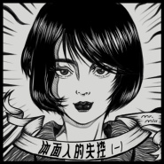
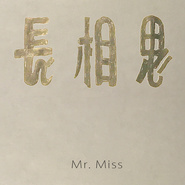

Mr. Miss
============================

|  |  |
| :--: | :-- |
| [ Mr. Miss](https://i.xiami.com/mrmiss) | **地区**: China 中国大陆 **风格**: 摇摆乐 Swing, 爵士流行 Jazz Pop, 巴萨诺瓦 Bossa Nova **播放数**: 4008217 **粉丝数**: 7798 **评论数**: 171  |

## 档案

Mr. Miss，人声爵士乐男女组合。刘恋和杜凯在一次北大歌手比赛中结识，共同的音乐追求和相互欣赏促使他们开始了合作，组成Mr. Miss组合，开始长期酒吧驻场演唱和各种演出，在不断地创作探索和表演历练中发展出独特的人声爵士演绎方式。爵士乐在大众眼中往往有不知所云的小资情调的成见，而Mr. Miss用一种最简约的方式，将经典音乐的根源核心吸引力剥离出来，不管你爱不爱爵士，Mr. Miss都会让你无法拒绝 
杜凯：男主唱   吉他演奏80后爵士吉他大师 
北京大学艺术学院音乐学硕士，自高中学习声乐、吉他、词曲编曲，写过百余首歌，多部影视配乐、晚会音乐、广告音乐。曾与木马乐队，子曰秋野合作，多年音乐经验在表演中厚积薄发。刘欢也对其吉他功力连连称赞。 
刘恋：女主唱   卡祖笛演奏90后爵士名伶，以独特的声音形象，征服舞台，征服观众。借对音乐的执着钻研，她发展出了自己独特的声音形象 
北大考古系毕业，却摇身一变爵士界新女神

## 专辑

| 名称 | 语种 | 唱片公司 | 发行时间 | 专辑类别 | 专辑风格 |
| :--: | :-- | :-- | :-- | :-- | :-- |
| [ 秋别 (Sinaloah-Remix)](./albums/5020872592.md) | 国语 | 草台回声 | 2020年06月12日 | EP, 单曲 | 电子乐 Electronica |
| [ 那点情话](./albums/2106090149.md) | 国语 |  | 2020年02月20日 |  | 流行 Pop |
| [ 在你的婚礼我多喝了两杯](./albums/2105155318.md) | 国语 | 草台回声 | 2019年08月14日 | EP, 单曲 |  |
| [ 简单点](./albums/2102757803.md) | 国语 | 独立发行 | 2017年06月06日 | EP, 单曲 | 独立流行 Indie Pop |
| [ 长相思](./albums/2102732014.md) | 国语 | 独立发行 | 2017年04月14日 | EP, 单曲 | 国语流行 Mandarin Pop, 成人时代 Adult Contemporary |
| [ 草台回声 圣诞合集](./albums/2102671658.md) | 国语 | 草台回声 | 2016年12月23日 | 合集, 杂锦 | 民谣流行 Folk Pop |
| [ 先生小姐](./albums/2102652747.md) | 国语 | 草台回声 | 2016年11月15日 | 录音室专辑 | 国语流行 Mandarin Pop |
| [ 你怎么不上天呢](./albums/2102409556.md) | 国语 |  | 2016年10月20日 | EP, 单曲 | 爵士 Jazz |
| [ 充电5分钟，好想找人通话2小时](./albums/2102403766.md) | 国语 | 草台回声 | 2016年09月27日 | EP, 单曲 |  |
| [ 晚期拖延症患者](./albums/2100353100.md) | 国语 | 草台回声 | 2016年06月12日 | EP, 单曲 |  |
| [ 心之所向奔驰品牌广告主题曲](./albums/2100357134.md) | 国语 |  | 2016年02月01日 | EP, 单曲 |  |

## 评论

|  |  |  |
| :-- | :-- | :-- |
|  [虾米用户](https://emumo.xiami.com/u/5708413) 音乐是个好东西 2020-07-15 07:42 赞(1) 踩(0) | 
神仙组合！太厉害！
 |
|  [虾米用户](https://emumo.xiami.com/u/426098943)  2020-07-12 19:09 赞(1) 踩(0) | 
加油
 |
|  [虾米用户](https://emumo.xiami.com/u/232100392)  2020-07-04 15:00 赞(1) 踩(0) | 
真好听！
 |
|  [虾米用户](https://emumo.xiami.com/u/4830369) 有音乐很快乐 2020-06-14 18:59 赞(1) 踩(0) | 
我喜欢有趣的音乐和有趣的灵魂，我想Mr. Miss这两点都应该具备了。
 |
|  [虾米用户](https://emumo.xiami.com/u/88266612)  晚风吹过.. 2020-02-01 22:10 赞(1) 踩(0) | 
北大考古系  金曲奖最佳演唱组合  打卡～
 |
|  [虾米用户](https://emumo.xiami.com/u/336171099) 我还没想好要写什么... 2020-01-03 08:21 赞(0) 踩(0) | 
爱了。
 |
|  [虾米用户](https://emumo.xiami.com/u/1281535) 妈妈一起飞吧 2019-12-02 00:27 赞(0) 踩(0) | 
美女真的太有才了！而且太聪明惹
 |
|  [虾米用户](https://emumo.xiami.com/u/2575719) 听会儿歌 2019-11-01 03:56 赞(1) 踩(0) | 
刘恋老美了
 |
|  [虾米用户](https://emumo.xiami.com/u/347776396) 勿施于人 2019-10-08 09:52 赞(0) 踩(0) | 
宇宙人那小子是不是喜欢你。。。
 |
|  [虾米用户](https://emumo.xiami.com/u/2094196) 未来不迎 2019-09-17 06:29 赞(1) 踩(0) | 
日谈声控粉！（总比颜粉强点吧
 |
|  [虾米用户](https://emumo.xiami.com/u/21216985) 缓缓归 2019-08-15 09:37 赞(1) 踩(0) | 
喜欢你们~ 每首歌都是秒收藏 加油~谢谢你们给我们做出很好的音乐
 |
|  [虾米用户](https://emumo.xiami.com/u/30980397) 爱憎分明 2019-08-12 11:49 赞(1) 踩(0) | 
期待新专辑！加油(ง •̀_•́)ง
 |
|  [虾米用户](https://emumo.xiami.com/u/34522244)  2019-08-11 19:13 赞(0) 踩(0) | 
喜欢这种风格
 |
|  [虾米用户](https://emumo.xiami.com/u/2792739) 唯沉默是最高的蔑视 2019-08-08 19:47 赞(1) 踩(0) | 
刘恋真的太阔爱了
 |
|  [虾米用户](https://emumo.xiami.com/u/3140019) 天马行空 2019-08-07 21:34 赞(0) 踩(0) | 
Mr很骚
 |
|  [虾米用户](https://emumo.xiami.com/u/339451504)  2019-07-28 20:47 赞(1) 踩(0) | 
我也是看乐队的夏天路转粉的，感觉你们的歌很有故事性，我很喜欢
 |
|  [虾米用户](https://emumo.xiami.com/u/3821056)  2019-07-23 21:12 赞(1) 踩(0) | 
刘恋是女神
 |
|  [虾米用户](https://emumo.xiami.com/u/17470831)  2019-07-22 20:13 赞(0) 踩(0) | 
好喜欢你们
 |
|  [虾米用户](https://emumo.xiami.com/u/245280261) 要能做到:不以物喜不以己... 2019-07-22 20:09 赞(0) 踩(0) | 
哎呀，本来是他们的cp粉，没想到杜凯谈恋爱了，居然不是刘恋 两个人的互动超级有爱，喜欢喜欢
 |
| ⇒ |  [虾米用户](https://emumo.xiami.com/u/40637994) 这家伙很聪明什么也没留下... 2019-07-26 09:43 赞(0) 踩(0) | 
取向不一样当然不能在一起啦
 |
| ⇒ |  [虾米用户](https://emumo.xiami.com/u/245280261) 要能做到:不以物喜不以己... 2019-07-26 10:29 赞(0) 踩(0) | 
<q><b>野生白雪王子说：</b></q>
 |
| ⇒ |  [虾米用户](https://emumo.xiami.com/u/40637994) 这家伙很聪明什么也没留下... 2019-07-26 10:56 赞(0) 踩(0) | 
<q><b>长大后的大雄说：</b></q>
 |
| ⇒ |  [虾米用户](https://emumo.xiami.com/u/245280261) 要能做到:不以物喜不以己... 2019-07-27 09:17 赞(0) 踩(0) | 
<q><b>野生白雪王子说：</b></q>
 |
| ⇒ |  [虾米用户](https://emumo.xiami.com/u/40637994) 这家伙很聪明什么也没留下... 2019-07-28 08:19 赞(0) 踩(0) | 
<q><b>长大后的大雄说：</b></q>
 |
|  [虾米用户](https://emumo.xiami.com/u/42384926)  2019-07-22 10:37 赞(0) 踩(0) | 
加油！你们的风格在燥的现场是有些吃亏的，但你们也确实很棒 
 |
|  [虾米用户](https://emumo.xiami.com/u/245280261) 要能做到:不以物喜不以己... 2019-07-06 11:58 赞(0) 踩(0) | 
感觉两个人好配哈哈哈
 |
|  [虾米用户](https://emumo.xiami.com/u/5541880) ⌇ 2019-06-28 10:19 赞(0) 踩(0) | 
：）
 |
|  [虾米用户](https://emumo.xiami.com/u/252827677) 只听好听的 2019-06-24 23:23 赞(1) 踩(0) | 
好听，很好听，特别好听。
 |
|  [虾米用户](https://emumo.xiami.com/u/282746758) 我还没想好要写什么... 2019-06-23 22:29 赞(2) 踩(0) | 
非常好的音乐 编曲精美 女声无懈可击~只能说我们的音乐市场还没有准备好~加油!
 |
|  [虾米用户](https://emumo.xiami.com/u/6743850) 我还没想好要写什么... 2019-06-16 18:12 赞(1) 踩(0) | 
乐队的夏天中少有的爵士风格，加油
 |
|  [虾米用户](https://emumo.xiami.com/u/795989)   2019-06-16 09:06 赞(0) 踩(0) | 
喜欢爵士，喜欢你们
 |
|  [虾米用户](https://emumo.xiami.com/u/1721605)  2019-06-11 21:28 赞(0) 踩(0) | 
牛逼
 |
|  [虾米用户](https://emumo.xiami.com/u/2373624) 我还没想好要写什么... 2019-06-10 01:13 赞(29) 踩(0) | 
看乐队的夏天即兴表演对决的那段，瞬间路转粉了...
 |
|  [虾米用户](https://emumo.xiami.com/u/42963872) 我还没想好要写什么... 2019-06-04 22:43 赞(0) 踩(0) | 
.
 |
|  [虾米用户](https://emumo.xiami.com/u/5947167) waiting.... 2019-06-04 21:17 赞(2) 踩(0) | 
看乐队的夏天看到的 真的觉得超级棒
 |
|  [虾米用户](https://emumo.xiami.com/u/30980397) 爱憎分明 2019-01-25 15:04 赞(0) 踩(0) | 
下午，下雨，日落。
 |
|  [虾米用户](https://emumo.xiami.com/u/83893196) 我还没想好要写什么... 2018-11-19 11:33 赞(0) 踩(0) | 
）
 |
|  [虾米用户](https://emumo.xiami.com/u/7614416) 异乡人 2018-10-15 15:29 赞(0) 踩(0) | 
是不是上过央视节目？小清新靠广告歌养活自己了吗？
 |
|  [虾米用户](https://emumo.xiami.com/u/11428127) 可爱迷人的反派角色 2018-07-09 16:08 赞(0) 踩(0) | 
啊啊啊什么时候开演唱会或者livehouse我都会去的啊啊啊！
 |
|  [虾米用户](https://emumo.xiami.com/u/148813342) 一生所爱 2018-05-08 15:25 赞(3) 踩(0) | 
我就想知道。他俩在一起没
 |
|  [虾米用户](https://emumo.xiami.com/u/120637892) 瑞铭老师Q2710065... 2018-04-27 15:47 赞(0) 踩(0) | 
开始以为是王若琳的声音，很像，可以哦，点赞 
 |
|  [虾米用户](https://emumo.xiami.com/u/330907917) 每日每时，滴答滴答 2018-03-24 16:44 赞(0) 踩(0) | 
好棒
 |
|  [虾米用户](https://emumo.xiami.com/u/310032156) 人在的时候，以为总会有机... 2018-03-06 23:28 赞(0) 踩(0) | 
支持
 |
|  [虾米用户](https://emumo.xiami.com/u/290033622) 自由自私 自私高尚 2018-02-07 15:00 赞(0) 踩(0) | 
#
 |
|  [虾米用户](https://emumo.xiami.com/u/241268128) 从不说爱你... 2018-01-13 14:01 赞(1) 踩(0) | 
有点刻意蓝调，没有什么风格。估计沉淀个几年，听听外国蓝调就知道差距了。
 |
|  [虾米用户](https://emumo.xiami.com/u/25932289) 你够不够我这样洒脱 2017-12-18 12:27 赞(0) 踩(0) | 
好喜欢哇哇
 |
|  [虾米用户](https://emumo.xiami.com/u/31710570) 酒精投手 2017-11-14 17:30 赞(0) 踩(0) | 
怎么打开虾米音乐人？
 |
|  [虾米用户](https://emumo.xiami.com/u/281407100)   2017-11-05 23:28 赞(0) 踩(0) | 
今晚来我们学院，安徽涉外经济学院了
 |
|  [虾米用户](https://emumo.xiami.com/u/39633698) 暂无签名~ 2017-10-19 21:48 赞(0) 踩(0) | 
太棒的专辑！期待更多佳作！
 |
|  [虾米用户](https://emumo.xiami.com/u/215061048) 鬼舞 2017-09-26 20:08 赞(0) 踩(0) | 
我，严重怀疑这个介绍是Mr.Miss本人写的&amp;hellip;&amp;hellip; 
 |
|  [虾米用户](https://emumo.xiami.com/u/101322) 不怎么听歌了 2017-09-23 14:30 赞(0) 踩(0) | 
音乐素质相当高
 |
|  [虾米用户](https://emumo.xiami.com/u/299161363)  2017-09-22 22:57 赞(0) 踩(0) | 
最近電台一直播放著好喜歡這樣的曲風
 |
|  [虾米用户](https://emumo.xiami.com/u/901190)  SCC 2017-08-23 16:32 赞(0) 踩(0) | 
真不错啊
 |
|  [虾米用户](https://emumo.xiami.com/u/3380891)  2017-08-04 11:44 赞(0) 踩(0) | 
花式虐狗二人组
 |
|  [虾米用户](https://emumo.xiami.com/u/258244700) 我还没想好要写什么... 2017-07-21 17:17 赞(0) 踩(0) | 
天啊好喜欢   
 |
|  [虾米用户](https://emumo.xiami.com/u/76406928) 老枪 2017-07-14 16:17 赞(0) 踩(0) | 
喜欢女生的声音也喜欢男生的声音，喜欢歌词，喜欢曲调，都TM喜欢。
 |
|  [虾米用户](https://emumo.xiami.com/u/100660422) 你好呀。(¦3[▓▓]虾... 2017-07-04 19:20 赞(1) 踩(0) | 
妙啊，妙啊哈哈哈哈
 |
|  [虾米用户](https://emumo.xiami.com/u/45836950)  2017-06-25 00:16 赞(12) 踩(0) | 
恭喜~金曲奖最佳演唱组合~
 |
|  [虾米用户](https://emumo.xiami.com/u/2591791) To be a bett... 2017-06-24 21:54 赞(0) 踩(0) | 
恭喜
 |
|  [虾米用户](https://emumo.xiami.com/u/306908545)  2017-06-23 22:58 赞(0) 踩(0) | 
好听
 |
|  [虾米用户](https://emumo.xiami.com/u/2718531) simmering, s... 2017-06-18 04:14 赞(0) 踩(0) | 
被大内安利来的，从曲到词，一切都太棒了！在大内听了两首临场唱的曲子就立马被打动，刘恋和杜凯做音乐的认真是我所钦佩的，希望马上到来的金曲奖中Mr. Miss能有所收获！~加油！
 |
|  [虾米用户](https://emumo.xiami.com/u/72466252) 浪过只剩寂寞躯壳 2017-06-16 10:45 赞(2) 踩(0) | 
大内粉观光 加油！好音乐！
 |
|  [虾米用户](https://emumo.xiami.com/u/250169112) www.mantispa... 2017-06-06 11:47 赞(1) 踩(0) | 
好听。我跟我11月大的宝贝女儿都很喜欢。刚刚抱着她跳了一会儿舞。哈哈哈
 |
|  [虾米用户](https://emumo.xiami.com/u/48305154) 喵 2017-06-06 09:37 赞(0) 踩(0) | 
很偶尔的听到了他们的歌，很有个性很有意思，也很好听。开始关注！希望能一直坚持音乐越做越好！
 |
|  [虾米用户](https://emumo.xiami.com/u/36660251)   2017-06-05 14:38 赞(0) 踩(0) | 
很像双人版的彩虹合唱团
 |
|  [虾米用户](https://emumo.xiami.com/u/78131692)  2017-05-19 00:25 赞(0) 踩(0) | 
被微博推荐来的，Miss声音好棒
 |
|  [虾米用户](https://emumo.xiami.com/u/7850960) summertime s... 2017-05-18 21:52 赞(0) 踩(0) | 
恭喜！
 |
|  [虾米用户](https://emumo.xiami.com/u/5421244) 爱音乐的人不会老 2017-05-18 20:00 赞(2) 踩(0) | 
金曲奖~，腻害了！声音好听歌好听
 |
|  [虾米用户](https://emumo.xiami.com/u/72666568)  2017-05-17 12:11 赞(0) 踩(0) | 
Mm
 |
|  [虾米用户](https://emumo.xiami.com/u/2793798) 天天向上 2017-05-05 10:52 赞(0) 踩(0) | 
顺着电影爬过来听歌。在电影院听到长相思这曲子时候真的被感动了。真的十分好听啊，给电影增色不少，和电影挺搭的，歌词也十分的美。歌声宛转优美...被Miss唱的&amp;ldquo;落红有，流水回&amp;rdquo;这个段词洗脑了......
 |
|  [虾米用户](https://emumo.xiami.com/u/2165357) 暂无签名~ 2017-04-12 23:46 赞(3) 踩(0) | 
今天在渔的微电影《秘密》里听到你们的片尾曲，犹如涓涓流水的歌声，柔柔地十分动人～在网上一番搜索才找来这里^-^希望能快点听到你们的《长相思》～很喜欢你们
 |
|  [虾米用户](https://emumo.xiami.com/u/8221701) 来微博找我吧@蕾雷枪 2017-03-22 23:43 赞(0) 踩(0) | 
❤
 |
|  [虾米用户](https://emumo.xiami.com/u/4400366) 再也不见 2017-01-06 17:47 赞(0) 踩(0) | 
囍
 |
|  [虾米用户](https://emumo.xiami.com/u/11824157) 始终爱陈绮贞，走不出我的... 2017-01-05 10:34 赞(0) 踩(0) | 
哇！我好爱你们。迷恋。小计划已经在产生
 |
|  [虾米用户](https://emumo.xiami.com/u/18862956) 用舍由时，行藏在我 2016-12-25 19:34 赞(0) 踩(0) | 
打卡
 |
|  [虾米用户](https://emumo.xiami.com/u/23794844) 喜欢任何音乐梦想是成为 ... 2016-12-24 15:16 赞(0) 踩(0) | 
期待新的～
 |
|  [虾米用户](https://emumo.xiami.com/u/18471962)  2016-11-28 02:37 赞(0) 踩(0) | 
超棒，加油！
 |
|  [虾米用户](https://emumo.xiami.com/u/4795240) 世界尽头与冷酷仙境 2016-11-15 21:58 赞(1) 踩(0) | 
楼下惊现中国好歌曲工作人员前来勾搭的痕迹 
 |
|  [虾米用户](https://emumo.xiami.com/u/35681166) 暂无签名~ 2016-10-05 01:01 赞(2) 踩(0) | 
今天在简单看了现场！路转粉！！！！！！
 |
|  [虾米用户](https://emumo.xiami.com/u/549381)   2016-10-04 22:51 赞(2) 踩(0) | 
今天刚在SL追了现场 好听 开心！！
 |
|  [虾米用户](https://emumo.xiami.com/u/55916106) 这里是我自己的世界 2016-09-03 13:38 赞(1) 踩(0) | 
很棒的传统爵士+歌剧风格，很好听
 |
|  [虾米用户](https://emumo.xiami.com/u/98914) 耳朵具有自动过滤歌词功能 2016-09-02 06:18 赞(2) 踩(0) | 
当一男一女整天在一块儿又没在谈恋爱的时候， 他们真的能干很多正经事儿！  可是主页里很多图片都是眉目传情，彼此放电诶
 |
|  [虾米用户](https://emumo.xiami.com/u/8444695)  2016-08-08 14:47 赞(2) 踩(0) | 
《明天的烦恼交给明天》和《晚期拖延症患者》的生活哲学完全矛盾啊！！！！
 |
|  [虾米用户](https://emumo.xiami.com/u/116785638) 深井小岛 2016-07-08 01:27 赞(0) 踩(0) | 
@妈啊简直夏夜深夜治愈 适合单身
 |
|  [虾米用户](https://emumo.xiami.com/u/4878604) 我还没想好要写什么... 2016-06-16 11:34 赞(1) 踩(0) | 
超喜欢你们的优雅与风趣～加油！
 |
|  [虾米用户](https://emumo.xiami.com/u/6202841) 改变生活，从运动开始～ 2016-06-15 13:07 赞(1) 踩(0) | 
晚期拖延症患者太棒！简直中箭成筛子了 
 |
|  [虾米用户](https://emumo.xiami.com/u/120740496)  2016-06-13 12:58 赞(0) 踩(0) | 
超有趣～
 |
|  [虾米用户](https://emumo.xiami.com/u/3326320) 我要幸福。 2016-06-06 17:03 赞(2) 踩(0) | 
挺地道的jazz，你们很棒，可惜懂欣赏jazz的人不多
 |
|  [虾米用户](https://emumo.xiami.com/u/4491228)  2016-05-25 00:46 赞(0) 踩(0) | 
每首都nice，加油！
 |
|  [虾米用户](https://emumo.xiami.com/u/8462425)  2016-03-03 09:58 赞(0) 踩(0) | 
好诚恳的声音！
 |
|  [虾米用户](https://emumo.xiami.com/u/81399228)   2016-02-23 15:24 赞(0) 踩(0) | 
秒圈粉
 |
|  [虾米用户](https://emumo.xiami.com/u/7800081) 我还没想好要写什么... 2016-02-02 03:44 赞(0) 踩(0) | 
杜凯胖了……
 |
|  [虾米用户](https://emumo.xiami.com/u/1419135)  2016-01-28 00:00 赞(1) 踩(0) | 
demo 赞哇
 |
|  [虾米用户](https://emumo.xiami.com/u/89835236)  2016-01-25 20:37 赞(0) 踩(0) | 
好声音听了好开心 
 |
|  [虾米用户](https://emumo.xiami.com/u/7603700) 我还没想好要写什么... 2016-01-22 19:07 赞(1) 踩(0) | 
說喜歡二字足以可以。
 |
|  [虾米用户](https://emumo.xiami.com/u/2782010) xuanzicrazy 2016-01-21 17:18 赞(2) 踩(0) | 
中国好歌曲的时候就很喜欢你们了，支持哦~
 |
|  [虾米用户](https://emumo.xiami.com/u/80771834) 你爱再浓烈，也是条抛物线... 2016-01-19 01:52 赞(1) 踩(0) | 
还是最喜欢心中的旅行箱。  
 |
|  [虾米用户](https://emumo.xiami.com/u/34922591) amazing.  2015-10-28 19:09 赞(0) 踩(0) | 
mrmiss 现在陌陌现场有演出，大家可以去看！！！
 |
|  [虾米用户](https://emumo.xiami.com/u/66830804) 我们都一样，年轻又彷徨。 2015-09-21 19:18 赞(0) 踩(0) | 
一起来吧
 |
|  [虾米用户](https://emumo.xiami.com/u/58972858) 我是一个.. 脾气不好、... 2015-08-29 13:15 赞(0) 踩(0) | 
很喜欢
 |
|  [虾米用户](https://emumo.xiami.com/u/47767100)  2015-08-23 15:14 赞(0) 踩(0) | 
鼹鼠也来了
 |
|  [虾米用户](https://emumo.xiami.com/u/42535021) 暂无签名~ 2015-07-21 00:11 赞(1) 踩(0) | 
您好，我是中国好歌曲工作人员，请您看见与我联系
 |
|  [虾米用户](https://emumo.xiami.com/u/51874801)  2015-06-30 09:39 赞(0) 踩(0) | 
希望他们能火起来，出更多新歌，好听的歌   
 |
|  [虾米用户](https://emumo.xiami.com/u/49965743)  2015-06-07 18:03 赞(0) 踩(0) | 
越听越放不下的声音
 |
|  [虾米用户](https://emumo.xiami.com/u/11049264) 爱爵士 2015-04-28 18:46 赞(1) 踩(0) | 
感觉《如果你不曾出现》这首歌非常适合在婚礼上播放啊！
 |
|  [虾米用户](https://emumo.xiami.com/u/3817773)  2015-04-28 00:00 赞(0) 踩(0) | 
赶紧出专辑啊 好听
 |
|  [虾米用户](https://emumo.xiami.com/u/7616503) 暂无签名~ 2015-04-26 01:55 赞(0) 踩(0) | 
总是不更新，真可爱死了，可爱死了
 |
|  [虾米用户](https://emumo.xiami.com/u/49279822)  2015-04-16 22:07 赞(0) 踩(0) | 
like this style
 |
|  [虾米用户](https://emumo.xiami.com/u/43759349)  2015-04-08 17:18 赞(0) 踩(0) | 
喜欢这种味道的音乐
 |
|  [虾米用户](https://emumo.xiami.com/u/43759349)  2015-04-08 17:14 赞(0) 踩(0) | 
好听，等着出专辑啊
 |
|  [虾米用户](https://emumo.xiami.com/u/805845) Petal 2014-12-29 16:40 赞(0) 踩(0) | 
你们好棒！
 |
|  [虾米用户](https://emumo.xiami.com/u/25026746) 暂无签名~ 2014-12-16 00:52 赞(4) 踩(0) | 
大迷的媳妇儿～
 |
|  [虾米用户](https://emumo.xiami.com/u/894050) 暂无签名~ 2014-11-20 20:01 赞(1) 踩(0) | 
miss嗓音好棒！！！！&amp;gt;&amp;lt;
 |
|  [虾米用户](https://emumo.xiami.com/u/43365776) 暂无签名~ 2014-11-06 12:37 赞(0) 踩(0) | 
求之前恋姐在微博上分享那个歌，后来删掉的那个
 |
| ⇒ |  [虾米用户](https://emumo.xiami.com/u/1503404) 我还没想好要写什么... 2015-01-20 21:18 赞(0) 踩(0) | 
sunny day is tragical？
 |
|  [虾米用户](https://emumo.xiami.com/u/40045358) 暂无签名~ 2014-09-29 10:20 赞(0) 踩(0) | 
我怎么听出了老上海的味道，
 |
|  [虾米用户](https://emumo.xiami.com/u/37085747)  2014-09-19 19:10 赞(0) 踩(0) | 
大爱mr miss
 |
|  [虾米用户](https://emumo.xiami.com/u/20147189) 嘘 2014-09-14 00:27 赞(0) 踩(0) | 
女孩声音真的很棒
 |
|  [虾米用户](https://emumo.xiami.com/u/20147189) 嘘 2014-09-14 00:25 赞(0) 踩(0) | 
出歌吧出歌吧出歌吧
 |
|  [虾米用户](https://emumo.xiami.com/u/39751181)  2014-08-06 13:10 赞(0) 踩(0) | 
加油
 |
|  [虾米用户](https://emumo.xiami.com/u/5638560)   2014-07-08 03:38 赞(1) 踩(0) | 
一开始对爵士没什么感觉，因为恋姐，现在完全“迷恋”！
 |
|  [虾米用户](https://emumo.xiami.com/u/36421095) 暂无签名~ 2014-06-16 18:39 赞(0) 踩(0) | 

 |
| ⇒ |  [虾米用户](https://emumo.xiami.com/u/2552299)  2014-07-29 04:41 赞(0) 踩(0) | 
+1
 |
|  [虾米用户](https://emumo.xiami.com/u/36421095) 暂无签名~ 2014-06-16 18:39 赞(0) 踩(0) | 

 |
|  [虾米用户](https://emumo.xiami.com/u/7616503) 暂无签名~ 2014-04-29 23:16 赞(0) 踩(0) | 
我来了，酷的跟个什么似的，耳朵红的跟个什么似的，这么冷酷的我，冷静的来到这里，带着春天的暖意，带着淡淡的醉意。。
 |
|  [虾米用户](https://emumo.xiami.com/u/34711023)  2014-04-01 13:57 赞(0) 踩(0) | 
喜欢背景音乐，喜欢刘恋的声音，不错
 |
|  [虾米用户](https://emumo.xiami.com/u/10911032)  2014-03-29 12:37 赞(1) 踩(0) | 
爵士味儿浓，好歌曲听第一遍就会喜欢，请继续Keep walking
 |
|  [虾米用户](https://emumo.xiami.com/u/6787522) my d 2014-03-24 04:42 赞(0) 踩(0) | 
耳根一震，大爱
 |
|  [虾米用户](https://emumo.xiami.com/u/6452596) 有理想在路上！不卑不亢，... 2014-03-17 14:47 赞(0) 踩(0) | 
喜欢轻爵士
 |
|  [虾米用户](https://emumo.xiami.com/u/11039913) 知音難求~ 2014-03-14 10:06 赞(0) 踩(0) | 
惊喜，好唔错嘅华语爵士，非常正嘅一把女声！
 |
|  [虾米用户](https://emumo.xiami.com/u/98914) 耳朵具有自动过滤歌词功能 2014-03-13 22:16 赞(2) 踩(0) | 
Miss的法式唱腔，好柔和，好给力
 |
|  [虾米用户](https://emumo.xiami.com/u/690537)  2014-03-06 20:16 赞(0) 踩(0) | 
其实上蓝翔技校才牛逼的说
 |
|  [虾米用户](https://emumo.xiami.com/u/1878046)  2014-03-05 19:04 赞(0) 踩(0) | 
太棒了！支持你们
 |
|  [虾米用户](https://emumo.xiami.com/u/33434465) 音乐是生活，也是理想！ 2014-03-04 20:22 赞(0) 踩(0) | 
不错啊，很有感觉的音乐啊，向你们学习。
 |
|  [虾米用户](https://emumo.xiami.com/u/31168380)  2014-03-03 22:10 赞(0) 踩(0) | 
非常喜欢这种风格！能够听到那么有个性好听的中国Jazz组合，真是太好了！
 |
|  [虾米用户](https://emumo.xiami.com/u/7372518)  2014-03-03 17:54 赞(0) 踩(0) | 
赞个~
 |
|  [虾米用户](https://emumo.xiami.com/u/4907480)  2014-03-01 13:15 赞(0) 踩(0) | 
surprise…
 |
|  [虾米用户](https://emumo.xiami.com/u/983096) 凝眸处，碧海青天。 2014-03-01 12:13 赞(0) 踩(0) | 
好爱这种风格！
 |
|  [虾米用户](https://emumo.xiami.com/u/812392) 【封面控】毛驴牌❤小众好... 2014-02-28 22:26 赞(0) 踩(0) | 
呐 ！M了！好听！
 |
|  [虾米用户](https://emumo.xiami.com/u/12795854)  2014-02-28 17:48 赞(0) 踩(0) | 
三首都很对胃口
 |
|  [虾米用户](https://emumo.xiami.com/u/72262) 长风万里 2014-02-26 23:16 赞(0) 踩(0) | 
MISS的嗓音实在太棒了
 |
|  [虾米用户](https://emumo.xiami.com/u/18171299)  2014-02-25 19:12 赞(0) 踩(0) | 
实在太好听 太惊艳了，好歌曲我最喜欢这对组合了
 |
|  [虾米用户](https://emumo.xiami.com/u/3443737) keep walkin 2014-02-25 12:34 赞(0) 踩(0) | 
超爱超爱！
 |
|  [虾米用户](https://emumo.xiami.com/u/10080917) crazy about ... 2014-02-20 19:47 赞(0) 踩(0) | 
风趣优雅，幽默活泼！
 |
|  [虾米用户](https://emumo.xiami.com/u/10080917) crazy about ... 2014-02-20 19:38 赞(1) 踩(0) | 
风趣优雅，尤其体现在《先生小姐那些事》里面活泼又带点调侃的歌词，以及让人着迷的音乐。
 |
|  [虾米用户](https://emumo.xiami.com/u/32903589)  2014-02-17 23:00 赞(0) 踩(0) | 
太棒了！
 |
|  [虾米用户](https://emumo.xiami.com/u/9712852)  2014-02-12 15:58 赞(0) 踩(0) | 
A Wet Love Song 循环一下午了，这歌太适合循环着播放了，开头结尾可以衔接的零间隙啊！
 |
|  [虾米用户](https://emumo.xiami.com/u/7125566) 向上吧，少年。 2014-02-12 15:32 赞(27) 踩(0) | 
我觉得Miss的声音很有磁性，很好听。Mr很绅士，很好的将Miss的声音烘托了出来。默契十足啊！希望能听到更多的好作品。谢谢。
 |
|  [虾米用户](https://emumo.xiami.com/u/11651350)  2014-02-11 16:45 赞(1) 踩(0) | 
超级棒！！！
 |
|  [虾米用户](https://emumo.xiami.com/u/260853) 少听音乐多上火 2014-02-11 11:25 赞(0) 踩(0) | 
所有长得像桂纶镁的女生我都喜欢
 |
|  [虾米用户](https://emumo.xiami.com/u/768574) 暂无签名~ 2014-02-10 09:51 赞(12) 踩(0) | 
很喜欢！~Miss的声音和唱法很好听很好听
 |
|  [虾米用户](https://emumo.xiami.com/u/489870)  2014-02-08 09:34 赞(0) 踩(0) | 
原来爵士那么好玩~谢谢你们那~
 |
|  [虾米用户](https://emumo.xiami.com/u/9712852)  2014-02-04 16:56 赞(1) 踩(0) | 
先生小姐那些事很好听很好听~~特别喜欢！
 |
|  [虾米用户](https://emumo.xiami.com/u/2233329) 下一个假期前要发奋！ 2014-02-04 09:48 赞(0) 踩(0) | 
赞一个昂！
 |
|  [虾米用户](https://emumo.xiami.com/u/2826480) MR MISS 2014-02-03 23:56 赞(153) 踩(0) | 
我刚入驻了虾米音乐人~
 |
| ⇒ |  [虾米用户](https://emumo.xiami.com/u/7172511)  2014-02-11 22:52 赞(0) 踩(0) | 
不是你们么？= =
 |
| ⇒ |  [虾米用户](https://emumo.xiami.com/u/4457716)  2014-02-14 22:02 赞(0) 踩(0) | 
期待你们出专辑 赞
 |
| ⇒ |  [虾米用户](https://emumo.xiami.com/u/1084213)  2014-03-02 23:04 赞(0) 踩(0) | 
音乐下载不了哎···
 |
| ⇒ |  [虾米用户](https://emumo.xiami.com/u/7616503) 暂无签名~ 2014-04-29 23:34 赞(0) 踩(0) | 
刘畅饿耐腻！！！！！！！！！！！！！！！！！！！！ ！！！！！
 |
| ⇒ |  [虾米用户](https://emumo.xiami.com/u/8462425)  2016-03-03 11:59 赞(0) 踩(0) | 
好诚恳的声音！
 |
| ⇒ |  [虾米用户](https://emumo.xiami.com/u/14318391)  2016-12-16 12:33 赞(0) 踩(0) | 
好听
 |
| ⇒ |  [虾米用户](https://emumo.xiami.com/u/775394) 聆听耳边风景 2017-09-24 19:56 赞(0) 踩(0) | 
好歌曲关注的。棒！ 
 |
|  [虾米用户](https://emumo.xiami.com/u/8075581) 夜深静谧之处，律动在心 2014-02-03 11:37 赞(0) 踩(0) | 
不一样的味道
 |
|  [虾米用户](https://emumo.xiami.com/u/1255711) 狂野 奔放 自由 烈性 2014-01-28 20:51 赞(1) 踩(0) | 
就喜欢这风格 就一首歌爱上了他们
 |
|  [虾米用户](https://emumo.xiami.com/u/31168380)  2014-01-26 22:24 赞(0) 踩(0) | 
真的很不错呀！加油哦！
 |
|  [虾米用户](https://emumo.xiami.com/u/2407025)  2014-01-26 16:58 赞(0) 踩(0) | 
期待他们的更多的创作，更好听的老爵士~~Mr.Miss~~
 |
|  [虾米用户](https://emumo.xiami.com/u/2438860) Being Nellie... 2014-01-25 15:13 赞(0) 踩(0) | 
期待更多的新作品....
 |
|  [虾米用户](https://emumo.xiami.com/u/2483207)  2012-06-01 13:17 赞(0) 踩(0) | 
很清新的风格~
 |
|  [虾米用户](https://emumo.xiami.com/u/660968) 一起去狗带 2012-02-03 19:56 赞(1) 踩(0) | 
蛮好的华语爵士
 |
|  [虾米用户](https://emumo.xiami.com/u/5172490)  2012-02-01 19:30 赞(0) 踩(0) | 
非常不错！！！
 |
|  [虾米用户](https://emumo.xiami.com/u/7356834) 我爱音乐 我爱5.0 2012-01-01 09:35 赞(0) 踩(0) | 
鼎力支持 原创
 |
