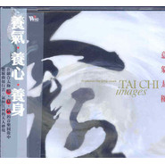

意象太极
============================

|  |  |
| :--: | :-- |
| [ 意象太极](https://emumo.xiami.com/album/433010) | **艺人**: [徐清原](../index.md) **语种**: 国语 **唱片公司**: 风潮音乐 **发行时间**: 2004年02月25日 **专辑类别**: 录音室专辑 **专辑风格**: 轻音乐 Easy Listening **播放数**: 600467 **收藏数**: 1417 **评论数**: 48  |

## 简介

生命是一场变化，从无到有，从静到动，从浑沌未明到天地开辟，从无极到太极，于是，生命的一切变化就在太极的阴阳转动中，循环不息。   
以太极精神为创作导引的《意象太极》，邀请作曲家们在亲自体验太极导引的动静与气机流转之后，分别以最能表现气息流动的乐器──笛、萧、古筝......结合充满宇宙飘渺旷远的独特音色，创作出融合太极形、意、气的新世纪旋律。  
动静自如的音乐气息，挥洒出太极动如行云、气如江河、静如山岳的意象。音符流动间，隐隐飘送著一股来自宇宙般的自然灵气，滋养全身。深远的意境，无论是冥想、练气或养身，都能为你带来意想不到的深刻体验。

## 曲目

- [天地无极](./433010/xLtmbza8c98.md)
- [云行水流](./433010/mQ8nmQb7954.md)
- [日月光](./433010/8GekQbf4238.md)
- [海的呼吸](./433010/bqvgggw38c5a.md)
- [如风似岳](./433010/8GekQd179a5.md)
- [宇宙一气](./433010/mQ8nmU63345.md)
- [灵气飞天](./433010/xLtmb5990da.md)
- [太极行](./433010/8GekQge8be5.md)

## 评论

|  |  |  |  |
| :-- | :-- | :-- | :-- |
|  [虾米用户](https://emumo.xiami.com/u/276944698) 不要自我设限..... 2020-08-25 23:04 赞(1) 踩(0) | 

 |
|  [虾米用户](https://emumo.xiami.com/u/316516033)  2019-04-24 07:18 赞(0) 踩(0) | 
很喜欢这样的作品
 |
|  [虾米用户](https://emumo.xiami.com/u/37572520) 坐在马桶上听歌真是最幸福... 2019-04-20 19:49 赞(0) 踩(0) | 

 |
|  [虾米用户](https://emumo.xiami.com/u/69950230)  2019-04-09 21:46 赞(0) 踩(0) | 
想打9分，少打一分免得骄傲。整张碟很清晰的有表达的内容在，牛的是能把无极行这种很自我很个人的体会再用音乐写出来，至少我有感受到，非常棒
 |
|  [虾米用户](https://emumo.xiami.com/u/8851553)  2018-12-20 21:33 赞(2) 踩(0) | 
多得的人才！听的我神清气爽，藿香正气。
 |
|  [虾米用户](https://emumo.xiami.com/u/347436607)  2018-05-13 17:03 赞(0) 踩(0) | 
采用了现代一些乐器演绎中国韵味，确实耳目一新。
 |
|  [虾米用户](https://emumo.xiami.com/u/16337726)  2017-11-06 20:32 赞(1) 踩(0) | 
)
 |
|  [虾米用户](https://emumo.xiami.com/u/56193100) ♡ 2017-10-21 12:50 赞(0) 踩(0) | 
★
 |
|  [虾米用户](https://emumo.xiami.com/u/7440772) 祝您吉祥 2017-05-31 19:55 赞(1) 踩(0) | 
阿弥陀佛身金色，相好光明无等伦，白毫宛转五须弥，绀目澄清四大海。光中化佛无数亿，化菩萨众亦无边，四十八愿度众生，九品咸令登彼岸。南无西方极乐世界大慈大悲阿弥陀佛，南无阿弥陀佛...【南无观世音菩萨...嗡玛尼呗美吽】
 |
|  [虾米用户](https://emumo.xiami.com/u/4262014)  2015-12-26 07:23 赞(0) 踩(0) | 
妙哉
 |
|  [虾米用户](https://emumo.xiami.com/u/32031632)  2015-11-16 10:17 赞(0) 踩(0) | 
有空間感的音樂
 |
|  [虾米用户](https://emumo.xiami.com/u/32031632)  2015-11-10 14:41 赞(1) 踩(0) | 
行到水窮處坐看雲起時
 |
|  [虾米用户](https://emumo.xiami.com/u/32031632)  2015-09-27 16:37 赞(0) 踩(0) | 
生命的一切变化就在太极的阴阳转动中，循环不息。
 |
|  [虾米用户](https://emumo.xiami.com/u/32031632)  2015-08-07 10:45 赞(1) 踩(0) | 
动静自如的音乐气息，挥洒出太极动如行云、气如江河、让聆听者进入到静如山岳的境界。
 |
|  [虾米用户](https://emumo.xiami.com/u/32031632)  2015-06-23 10:20 赞(0) 踩(0) | 
好曲目，赞！
 |
|  [虾米用户](https://emumo.xiami.com/u/46614721)  2015-03-05 13:47 赞(0) 踩(0) | 
喜欢就是喜欢
 |
|  [虾米用户](https://emumo.xiami.com/u/18222216)  2014-07-25 17:31 赞(0) 踩(0) | 
飘渺旷远的音色
 |
|  [虾米用户](https://emumo.xiami.com/u/11157355) 榕树长青 2014-06-03 12:11 赞(1) 踩(0) | 
心比刀快
 |
|  [虾米用户](https://emumo.xiami.com/u/23377590) 行走中 2014-05-16 06:25 赞(0) 踩(0) | 
恢弘浩大
 |
|  [虾米用户](https://emumo.xiami.com/u/747159) 幽居 2013-12-24 18:09 赞(0) 踩(0) | 
气韵流动 飘渺旷远 灵性音乐
 |
|  [虾米用户](https://emumo.xiami.com/u/10162464)  2013-12-15 01:09 赞(0) 踩(0) | 
@怎样de凡 半夜赶作业良品 ヾ(｡･ω･｡)
 |
|  [虾米用户](https://emumo.xiami.com/u/9288077)  2013-10-31 13:09 赞(0) 踩(0) | 
非常喜欢徐清原的音乐，空灵、纯净，世间少有。
 |
|  [虾米用户](https://emumo.xiami.com/u/3598877)  2013-09-05 19:50 赞(0) 踩(0) | 
SPA音乐，养生音乐
 |
|  [虾米用户](https://emumo.xiami.com/u/18282067) 李建儒 2013-07-31 17:01 赞(0) 踩(0) | 
太好听。能下载就好！
 |
|  [虾米用户](https://emumo.xiami.com/u/9531494)  2013-04-12 03:58 赞(0) 踩(0) | 
随意自在，大象无极。挺适合放松或者冥想的时候听的。
 |
|  [虾米用户](https://emumo.xiami.com/u/6565760)  2013-02-17 15:07 赞(0) 踩(0) | 
听。
 |
|  [虾米用户](https://emumo.xiami.com/u/11594997)  2012-11-21 21:10 赞(0) 踩(0) | 
很中国
 |
|  [虾米用户](https://emumo.xiami.com/u/11594997)  2012-11-21 21:07 赞(0) 踩(0) | 
很中国
 |
|  [虾米用户](https://emumo.xiami.com/u/7576008) 從無始來，種種顛倒 2012-11-07 23:53 赞(0) 踩(0) | 
【太极精神】生命是一场变化
 |
|  [虾米用户](https://emumo.xiami.com/u/3600523)  2012-06-13 14:30 赞(0) 踩(0) | 
哈哈，我喜欢。
 |
|  [虾米用户](https://emumo.xiami.com/u/9176263) ztd811 2012-05-15 04:15 赞(0) 踩(0) | 
生命是1场变化从无到有从静到动从浑沌未明到天地开辟从无极到太极于是生命的1切变化就在太极的阴阳转动中循环不息
 |
|  [虾米用户](https://emumo.xiami.com/u/8135330) 浓尽必枯  淡者屡深 2012-05-13 10:37 赞(0) 踩(0) | 
临水之影
 |
|  [虾米用户](https://emumo.xiami.com/u/8744340)   2012-04-05 08:05 赞(0) 踩(0) | 
行到水窮處坐看雲起時
 |
|  [虾米用户](https://emumo.xiami.com/u/3326224) 永遠愛你 2012-03-01 04:05 赞(0) 踩(0) | 
此張專輯的作曲編曲技巧實在是神妙, 太棒了, 非常好聽!
 |
|  [虾米用户](https://emumo.xiami.com/u/3326224) 永遠愛你 2012-03-01 04:05 赞(0) 踩(0) | 
此張專輯的作曲編曲技巧實在是神妙, 太棒了, 非常好聽!
 |
|  [虾米用户](https://emumo.xiami.com/u/3878995)  2012-02-18 16:37 赞(0) 踩(0) | 
<a href="http://www.taijiquan8.com/forum-75-1.html" target="_blank" rel="nofollow noreferrer noopener">http://www.taijiquan8.com/forum-75-1.html</a>太极拳音乐
 |
|  [虾米用户](https://emumo.xiami.com/u/1091908) 一切随缘 2012-01-05 12:39 赞(0) 踩(0) | 
生命是一场变化，从无到有，从静到动从浑沌未明到天地开辟，从无极到太极
 |
|  [虾米用户](https://emumo.xiami.com/u/5933399)   2011-12-28 21:28 赞(0) 踩(0) | 
有空間感的音樂
 |
|  [虾米用户](https://emumo.xiami.com/u/3638356)  2011-11-03 10:27 赞(0) 踩(0) | 
编排用  还不错
 |
|  [虾米用户](https://emumo.xiami.com/u/6300781)  2011-10-27 15:38 赞(0) 踩(0) | 
养气 养心  养身
 |
|  [虾米用户](https://emumo.xiami.com/u/6217026)  2011-10-13 12:28 赞(0) 踩(0) | 
大气
 |
|  [虾米用户](https://emumo.xiami.com/u/5962332)  2011-10-03 17:45 赞(0) 踩(0) | 
深沉的音乐
 |
|  [虾米用户](https://emumo.xiami.com/u/5906442)  2011-09-20 23:13 赞(0) 踩(0) | 
好
 |
|  [虾米用户](https://emumo.xiami.com/u/1435226)  2011-08-31 12:43 赞(0) 踩(0) | 
太极
 |
|  [虾米用户](https://emumo.xiami.com/u/1739035) 道哥音乐谷 2011-08-10 21:10 赞(1) 踩(0) | 
动静自如的音乐气息，挥洒太极动如行云、气如江河、静如山岳的意象。
 |
|  [虾米用户](https://emumo.xiami.com/u/2232628)  2011-05-05 21:39 赞(0) 踩(0) | 
大气 静心
 |
|  [虾米用户](https://emumo.xiami.com/u/2232628)  2011-05-05 21:38 赞(0) 踩(0) | 
静心 大气
 |
|  [虾米用户](https://emumo.xiami.com/u/420412)  2011-04-10 10:44 赞(0) 踩(0) | 
Gee
 |
