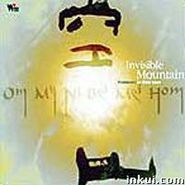

空山
============================

|  |  |
| :--: | :-- |
| [ 空山](https://emumo.xiami.com/album/5114) | **艺人**: [徐清原](../index.md) **语种**: 纯音乐 **唱片公司**: 风潮音乐 **发行时间**: 2003年05月01日 **专辑类别**: 录音室专辑 **专辑风格**: 轻音乐 Easy Listening **播放数**: 777990 **收藏数**: 1037 **评论数**: 39  |

## 简介

　　融合New Age的灵性与冥想音乐的神性，「空山」专辑呈现了心灵音乐难得一见的丰富层次。全辑以六字真言「嗡嘛呢贝美吽」为音乐主题色彩，编曲精致，格局大气，既有喜多郎式的空灵、著名电影配乐「喜玛拉雅」的叙事风格，更突出东方女声吟唱真言的特独音色，以及4位作曲者与古老真言的内在律动。时间与空间，在音乐流转间已不重要，「空山」带来的，是让心灵一震的生命能量。 　　从南美洲的玻利维亚，到亚洲的青康藏高原，「嗡嘛呢贝美吽」一向被视为是来自宇宙的一股不可思议的灵性力量，制作人徐清原在「空山」专辑中，便以这六字真言做为音乐基调，透过十首创作曲，传递真言与人身的巧妙连结，带来让心灵一震的生命能量。 

## 曲目

- [空山](./5114/bgjtafa03.md)
- [水](./5114/cwmc27339.md)
- [东方纪](./5114/b6kpf2200.md)
- [地](./5114/bgjwb0d1f.md)
- [初心](./5114/bgjxbbc31.md)
- [火](./5114/b6kseabc9.md)
- [幻境](./5114/cwmh27ee7.md)
- [风](./5114/Gi682c84.md)
- [千年呼唤](./5114/Gi78954d.md)
- [灵雨](./5114/Gi85aac0.md)

## 评论

|  |  |  |  |
| :-- | :-- | :-- | :-- |
|  [虾米用户](https://emumo.xiami.com/u/3653732)  2019-02-10 20:04 赞(0) 踩(0) | 
om mani padme hum
 |
|  [虾米用户](https://emumo.xiami.com/u/16337726)  2019-01-04 19:52 赞(0) 踩(0) | 
)
 |
|  [虾米用户](https://emumo.xiami.com/u/318667853) 这家伙很聪明什么也没留下... 2018-03-25 06:03 赞(1) 踩(0) | 
融合New Age的灵性与冥想音乐的神性，「空山」专辑呈现了心灵音乐难得一见的丰富层次。全辑以六字真言「嗡嘛呢贝美吽」为音乐主题色彩，编曲精致，格局大气，既有喜多郎式的空灵、著名电影配乐「喜玛拉雅」的叙事风格，更突出东方女声吟唱真言的特独音色，以及4位作曲者与古老真言的内在律动。时间与空间，在音乐流转间已不重要，「空山」带来的，是让心灵一震的生命能量。
 |
|  [虾米用户](https://emumo.xiami.com/u/7440772) 祝您吉祥 2017-05-31 19:55 赞(1) 踩(0) | 
阿弥陀佛身金色，相好光明无等伦，白毫宛转五须弥，绀目澄清四大海。光中化佛无数亿，化菩萨众亦无边，四十八愿度众生，九品咸令登彼岸。南无西方极乐世界大慈大悲阿弥陀佛，南无阿弥陀佛...【南无观世音菩萨...嗡玛尼呗美吽】
 |
|  [虾米用户](https://emumo.xiami.com/u/272030316)  2017-02-23 16:25 赞(0) 踩(0) | 
东方的空灵。。。。
 |
|  [虾米用户](https://emumo.xiami.com/u/17031187)  2016-11-26 19:57 赞(0) 踩(0) | 
攒
 |
|  [虾米用户](https://emumo.xiami.com/u/32031632)  2016-09-30 07:38 赞(0) 踩(0) | 
好曲目，赞！
 |
|  [虾米用户](https://emumo.xiami.com/u/54122453)  2016-08-12 17:40 赞(0) 踩(0) | 
     
 |
|  [虾米用户](https://emumo.xiami.com/u/32031632)  2016-07-02 15:01 赞(0) 踩(0) | 
南无阿弥佗佛
 |
|  [虾米用户](https://emumo.xiami.com/u/5997606)  2015-12-28 00:32 赞(0) 踩(0) | 
  
 |
|  [虾米用户](https://emumo.xiami.com/u/32031632)  2015-08-29 17:20 赞(1) 踩(0) | 
徐清原大师为我们带 来的是让心灵一震的生命能量。
 |
|  [虾米用户](https://emumo.xiami.com/u/9154037) 到水星散心去了。 2015-07-15 21:29 赞(0) 踩(0) | 
万物有灵且美。
 |
|  [虾米用户](https://emumo.xiami.com/u/32031632)  2015-05-19 14:16 赞(0) 踩(0) | 
南无阿弥陀佛
 |
|  [虾米用户](https://emumo.xiami.com/u/32031632)  2015-04-25 15:57 赞(0) 踩(0) | 
南无阿弥陀佛
 |
|  [虾米用户](https://emumo.xiami.com/u/32031632)  2015-03-24 21:09 赞(0) 踩(0) | 
南无阿弥陀佛
 |
|  [虾米用户](https://emumo.xiami.com/u/32031632)  2015-02-12 10:19 赞(0) 踩(0) | 
南无阿弥陀佛
 |
|  [虾米用户](https://emumo.xiami.com/u/3987161)  2015-01-25 23:33 赞(0) 踩(0) | 
空山   徐清原,佛乐,风潮,
 |
|  [虾米用户](https://emumo.xiami.com/u/32031632)  2014-11-08 10:22 赞(0) 踩(0) | 
南无阿弥陀佛
 |
|  [虾米用户](https://emumo.xiami.com/u/20371931) 石羽 2014-11-06 11:38 赞(0) 踩(0) | 
非常有靈性！
 |
|  [虾米用户](https://emumo.xiami.com/u/20371931) 石羽 2014-11-06 11:38 赞(1) 踩(0) | 
非常有靈性的音樂！
 |
|  [虾米用户](https://emumo.xiami.com/u/9351285)  2014-11-04 00:31 赞(0) 踩(0) | 
O吗妮背每哄！
 |
|  [虾米用户](https://emumo.xiami.com/u/23377590) 行走中 2014-01-22 22:32 赞(0) 踩(0) | 
空灵，悠扬
 |
|  [虾米用户](https://emumo.xiami.com/u/9633662) ज्ञापारिमता 2013-09-20 13:45 赞(0) 踩(0) | 
唉，比不上电影配乐「喜玛拉雅」
 |
|  [虾米用户](https://emumo.xiami.com/u/19333437)  2013-09-12 17:45 赞(0) 踩(0) | 
「空山」带来的，是让心灵一震的生命能量。
 |
|  [虾米用户](https://emumo.xiami.com/u/4029255)  2013-04-13 17:04 赞(0) 踩(0) | 
六字真言
 |
|  [虾米用户](https://emumo.xiami.com/u/9609909)  2013-04-11 14:41 赞(1) 踩(0) | 
在不同的季节，在不同风景，在内心，唱诵&amp;quot;嗡嘛呢贝美吽&amp;quot;
 |
|  [虾米用户](https://emumo.xiami.com/u/6565760)  2013-03-08 15:16 赞(0) 踩(0) | 
听。
 |
|  [虾米用户](https://emumo.xiami.com/u/7100199)  2012-10-31 16:13 赞(0) 踩(0) | 
观音心咒
 |
|  [虾米用户](https://emumo.xiami.com/u/7964219) 这家伙很聪明什么也没留下... 2012-08-30 12:13 赞(0) 踩(0) | 
❤ 好好好温柔的嗡嘛呢贝美吽
 |
|  [虾米用户](https://emumo.xiami.com/u/5003217)  2012-07-20 14:20 赞(0) 踩(0) | 
这个很不错哦
 |
|  [虾米用户](https://emumo.xiami.com/u/575732) 落花无言 人淡如菊 2012-05-29 16:39 赞(0) 踩(0) | 
佛樂
 |
|  [虾米用户](https://emumo.xiami.com/u/8497826)  2012-03-21 10:16 赞(0) 踩(0) | 
音乐柔美，清雅，聆听时令人充分得到宁静，空灵、飘逸，完全表达佛乐的高远意境，展现佛曲的庄严清净。悠扬动听的古曲，赋予佛缘梵音的新创意，带给你一个与众不同的音乐意境。
 |
|  [虾米用户](https://emumo.xiami.com/u/5632680) 分享不一样的妙音… 2011-12-08 19:24 赞(0) 踩(0) | 
嘉察仁波切法音
 |
|  [虾米用户](https://emumo.xiami.com/u/6217026)  2011-10-13 12:54 赞(0) 踩(0) | 
沉淀
 |
|  [虾米用户](https://emumo.xiami.com/u/2410061)  2011-09-02 01:21 赞(0) 踩(0) | 
五行的全新感悟。
 |
|  [虾米用户](https://emumo.xiami.com/u/3404987)  2011-07-02 16:13 赞(0) 踩(0) | 
悠远
 |
|  [虾米用户](https://emumo.xiami.com/u/3614981)  2011-05-31 12:57 赞(0) 踩(0) | 
让心灵冥想，让身体放松
 |
|  [虾米用户](https://emumo.xiami.com/u/2770413)  2011-03-18 21:44 赞(0) 踩(0) | 
喜欢自由的声音
 |
|  [虾米用户](https://emumo.xiami.com/u/2636820)  2011-03-11 00:02 赞(0) 踩(0) | 
空山
 |
