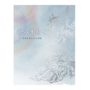

悲切遥唤
============================

|  |  |
| :--: | :-- |
| [ 悲切遥唤](https://emumo.xiami.com/album/515396) | **艺人**: [徐清原](../index.md) **语种**: 其他 **唱片公司**: 风潮音乐 **发行时间**: 2012年04月26日 **专辑类别**: 录音室专辑 **专辑风格**:  **播放数**: 209603 **收藏数**: 748 **评论数**: 32  |

## 简介

莲师心咒之不可思议功德利益----平时念诵心咒最少百遍的话，能令人见之欢喜、食物、财物、牛羊等，不劳辛苦，自然而得；念诵千遍或万遍等的话，可以调伏他人，加持和力量迅速到来；念诵十万遍或百万遍等数的话，能够勾召三界并调伏三界、天魔，使之如仆人一般自动前来协助，四种事业迅速成就，对于利益所有众生的心愿具足无边的力量；念诵三千万或七千万遍等数的话，能与三世诸佛不会分开，与我莲花生无二无别，可以调伏天龙八部为我护法，可以教导他们，指使他们作诸事业；最上等者，可以成就虹光身；次等者，临终能见到母子光明会；再次等者，中阴时面见我莲花生显现‘现相自解脱’到达拂尘洲（铜色山淨土），利益无边的众生。

## 曲目

- [悲切遥唤上师](./515396/mQCczN79c8d.md)
- [莲师极速加持祈成就心咒](./515396/JASYR81e417.md)
- [大悲周遍上师心咒](./515396/mQCczP564d6.md)
- [祷文四句](./515396/mQCczQ57673.md)
- [莲师如来总集修法仪轨](./515396/mQCczR5f52c.md)
- [十方四时祈愿文](./515396/8Giadcfe52e.md)

## 评论

|  |  |  |
| :-- | :-- | :-- |
|  [虾米用户](https://emumo.xiami.com/u/378936243)  2020-06-06 08:15 赞(0) 踩(0) | 
བླ་མ་མཁྱེན་ནོ
 |
|  [虾米用户](https://emumo.xiami.com/u/11152078) 音乐 音乐 音乐！ 2019-11-08 13:35 赞(0) 踩(0) | 
这盘是哪位唱的？
 |
|  [虾米用户](https://emumo.xiami.com/u/291955566)  2019-03-29 10:01 赞(0) 踩(0) | 
喜欢就是最好
 |
|  [虾米用户](https://emumo.xiami.com/u/6281575)  2019-03-01 11:34 赞(1) 踩(0) | 
阿弥陀佛
 |
|  [虾米用户](https://emumo.xiami.com/u/27344203)   2017-10-27 23:08 赞(1) 踩(0) | 
莲师心咒之不可思议功德利益：平时念诵千、万遍，可以调伏他人，加持和力量迅速到来；念诵十万遍或百万遍，能够勾召三界并调伏三界、天魔，使之如仆人一般自动前来协助，四种事业迅速成就，对于利益所有众生的心愿具足无边的力量；念诵三千万或七千万遍等数，与三世诸佛不分，与我莲花生无二无别。
 |
|  [虾米用户](https://emumo.xiami.com/u/7440772) 祝您吉祥 2017-05-31 19:54 赞(1) 踩(0) | 
阿弥陀佛身金色，相好光明无等伦，白毫宛转五须弥，绀目澄清四大海。 光中化佛无数亿，化菩萨众亦无边，四十八愿度众生，九品咸令登彼岸。 南无西方极乐世界大慈大悲阿弥陀佛，南无阿弥陀佛...  【南无观世音菩萨...嗡玛尼呗美吽】
 |
|  [虾米用户](https://emumo.xiami.com/u/32031632)  2017-05-19 20:47 赞(2) 踩(0) | 
南无阿弥佗佛
 |
|  [虾米用户](https://emumo.xiami.com/u/9757446) 沐雨听风 2017-03-09 21:59 赞(0) 踩(0) | 
佛音,梵音,藏传佛教,佛教音乐,佛教,
 |
|  [虾米用户](https://emumo.xiami.com/u/14034038) 當 下 觀 音 2017-01-09 22:08 赞(0) 踩(0) | 
顶礼供养皈依莲师
 |
|  [虾米用户](https://emumo.xiami.com/u/7769823) allt og ekke... 2016-12-31 19:25 赞(0) 踩(0) | 
简介醉了
 |
|  [虾米用户](https://emumo.xiami.com/u/32031632)  2016-07-12 15:45 赞(0) 踩(0) | 
南无阿弥陀佛
 |
|  [虾米用户](https://emumo.xiami.com/u/38801880)   2016-07-06 01:38 赞(0) 踩(0) | 
O(∩_∩)O
 |
|  [虾米用户](https://emumo.xiami.com/u/49958788)  2015-10-23 22:55 赞(1) 踩(0) | 
南无阿弥陀佛
 |
|  [虾米用户](https://emumo.xiami.com/u/7322777) ∮ 2015-10-03 16:51 赞(0) 踩(0) | 
...A...
 |
|  [虾米用户](https://emumo.xiami.com/u/32031632)  2015-07-16 09:03 赞(1) 踩(0) | 
南无阿弥陀佛
 |
|  [虾米用户](https://emumo.xiami.com/u/36029) ½ 2015-06-11 23:23 赞(0) 踩(0) | 
南无阿弥陀佛
 |
|  [虾米用户](https://emumo.xiami.com/u/7128326)  2015-04-09 17:26 赞(0) 踩(0) | 
喜欢
 |
|  [虾米用户](https://emumo.xiami.com/u/32031632)  2015-04-05 19:59 赞(1) 踩(0) | 
南无阿弥陀佛
 |
|  [虾米用户](https://emumo.xiami.com/u/32031632)  2015-03-25 17:16 赞(1) 踩(0) | 
南无阿弥陀佛
 |
|  [虾米用户](https://emumo.xiami.com/u/32031632)  2015-02-27 18:06 赞(1) 踩(0) | 
南无阿弥陀佛
 |
|  [虾米用户](https://emumo.xiami.com/u/1074431) 谁能渗透我音乐的意义 2015-01-24 20:31 赞(1) 踩(0) | 
阿弥陀佛阿弥陀佛阿弥陀佛
 |
|  [虾米用户](https://emumo.xiami.com/u/2141939)  2014-12-08 16:56 赞(1) 踩(0) | 
嗡阿吽 班扎咕噜贝玛悉地吽
 |
|  [虾米用户](https://emumo.xiami.com/u/32031632)  2014-11-19 14:45 赞(1) 踩(0) | 
南无阿弥陀佛
 |
|  [虾米用户](https://emumo.xiami.com/u/1415152) 此去经年，初心不变。 2014-11-04 23:24 赞(0) 踩(0) | 
静一静。静一静。静一静。
 |
|  [虾米用户](https://emumo.xiami.com/u/13940407)  2014-05-24 21:22 赞(0) 踩(0) | 
能量
 |
|  [虾米用户](https://emumo.xiami.com/u/7999830)  2014-01-06 19:06 赞(1) 踩(0) | 
嗡啊吽 班扎咕噜呗玛斯地吽
 |
|  [虾米用户](https://emumo.xiami.com/u/9293375) 音魂不断，逆天的欲罢不能... 2014-01-02 01:30 赞(0) 踩(0) | 
阿弥陀佛！
 |
|  [虾米用户](https://emumo.xiami.com/u/23377590) 行走中 2013-12-20 15:25 赞(0) 踩(0) | 
洗涤心灵
 |
|  [虾米用户](https://emumo.xiami.com/u/23377590) 行走中 2013-12-20 15:25 赞(0) 踩(0) | 
洗涤心灵
 |
|  [虾米用户](https://emumo.xiami.com/u/4381168)  2013-10-11 18:49 赞(0) 踩(0) | 
利益无边的众生
 |
|  [虾米用户](https://emumo.xiami.com/u/6565760)  2013-10-11 16:48 赞(0) 踩(0) | 
好。
 |
|  [虾米用户](https://emumo.xiami.com/u/11272185)  2013-09-05 10:51 赞(0) 踩(0) | 
喜欢
 |
