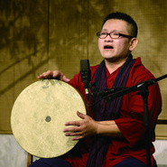
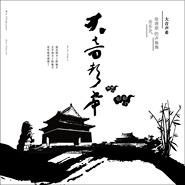
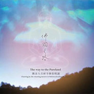
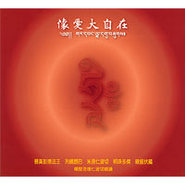
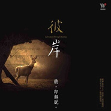
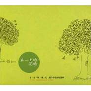
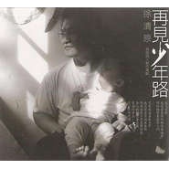
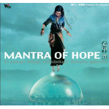
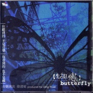
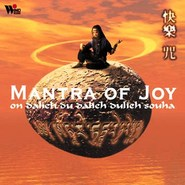

徐清原
============================

|  |  |
| :--: | :-- |
| [ 徐清原](https://i.xiami.com/ngotsu) | **地区**: Taiwan, PRC 中国台湾 **风格**: 民族融合新世纪 Ethnic Fusion New Age, 自然新世纪 Nature New Age, 轻音乐 Easy Listening, 新世纪音乐 New Age, 宗教新世纪 Religionary New Age **播放数**: 11443873 **粉丝数**: 10044 **评论数**: 254  |

## 档案

徐清原，台湾著名宗教音乐制作人与唱诵家，2014年亚洲宗教音乐金曲奖获得者。 
全才型音乐家，早期创作许多脍炙人口的华语流行音乐词曲，包括迪克牛仔「妳是妳我是我」、任贤齐「永远存在」、李丽芬「活着快乐就好」、李恕权「变色龙」和「放纵你的心」等，后来更发展出大自然音乐、当代演奏、民谣等多元的创作类型，2000年后专注于心灵音乐，成为亚洲最富盛名的宗教音乐唱作人之一，创作《快乐咒》、《希望咒》、《空山》、《彼岸》、《觉性彩虹》等专辑，以及编曲制作著名的《愿望之歌》专辑。 
将灵性修持透过音乐融入心光，经过长时间的内化与体验，使乐音成为祝福与疗愈的灵性吟唱。并以自己长期身心修炼的验证，创造出许多张华人世界广为流传的密语音声专辑。

## 专辑

| 名称 | 语种 | 唱片公司 | 发行时间 | 专辑类别 | 专辑风格 |
| :--: | :-- | :-- | :-- | :-- | :-- |
| [ 大音声希─徐清原的声瑜珈音乐会The Infinite Sound of Silence, Xu Qing-yuan’s Tibetan Sonic Yoga](./albums/2100291350.md) | 国语 | 风潮音乐 | 2016年03月11日 | 录音室专辑 | 佛教音乐 Buddhist Music |
| [ 无云晴空 徐清原的声瑜珈音乐会Pristine Blue Sky, Xu Qing-yuan’s Tibetan Sonic Yoga](./albums/2100291366.md) | 国语 | 风潮音乐 | 2016年03月11日 | 现场专辑 | 佛教音乐 Buddhist Music |
| [ 和平。祈愿](./albums/2100250158.md) | 其他 | 风潮音乐 | 2015年12月23日 | 录音室专辑 | 佛教音乐 Buddhist Music |
| [ 觉性彩虹徐清原的菩提道歌](./albums/1786490597.md) | 国语 | 风潮音乐 | 2013年11月26日 | 录音室专辑 | 佛教音乐 Buddhist Music |
| [ 佛国之路](./albums/529044.md) | 其他 | 风潮音乐 | 2012年06月27日 | 录音室专辑 |  |
| [ 悲切遥唤](./albums/515396.md) | 其他 | 风潮音乐 | 2012年04月26日 | 录音室专辑 |  |
| [ 同体大悲The Great Compassion](./albums/529046.md) | 其他 | 风潮音乐 | 2012年03月25日 | 录音室专辑 | 佛教音乐 Buddhist Music |
| [ 怀爱大自在](./albums/529047.md) | 其他 | 风潮音乐 | 2009年04月28日 | 录音室专辑 | 佛教音乐 Buddhist Music |
| [ 彼岸](./albums/172498.md) | 国语 | 风潮音乐 | 2008年06月17日 | 录音室专辑 | 轻音乐 Easy Listening |
| [ 在一天的开始](./albums/167269.md) | 国语 | 风潮音乐 | 2007年04月25日 | 录音室专辑 | 轻音乐 Easy Listening |
| [ 再见少年路](./albums/5113.md) | 国语 | 喜玛拉雅 | 2006年08月01日 | 录音室专辑 | 轻音乐 Easy Listening |
| [ 海洋嬉游记](./albums/339551.md) | 其他 | 风潮音乐 | 2005年07月27日 | 录音室专辑 | 自然新世纪 Nature New Age |
| [ 意象太极](./albums/433010.md) | 国语 | 风潮音乐 | 2004年02月25日 | 录音室专辑 | 轻音乐 Easy Listening |
| [ 空山](./albums/5114.md) | 纯音乐 | 风潮音乐 | 2003年05月01日 | 录音室专辑 | 轻音乐 Easy Listening |
| [ 当代音乐馆新世纪密语系列 希望咒Mantra of Hope: On Beikajei Beikajei Mohobeikajei Lazasamu Gadesoha](./albums/344686.md) | 国语 | 风潮音乐 | 2001年02月28日 | 合集, 杂锦 | 轻音乐 Easy Listening |
| [ 蝴蝶](./albums/467635.md) | 国语 | 风潮音乐 | 2000年08月25日 | 录音室专辑 | 轻音乐 Easy Listening |
| [ 快乐咒Mantra Of Joy: On Dalieh Du Dalieh Dulieh Souha](./albums/353394.md) | 国语 | 风潮音乐 | 2000年03月01日 | 合集, 杂锦 | 轻音乐 Easy Listening |

## 评论

|  |  |  |
| :-- | :-- | :-- |
|  [虾米用户](https://emumo.xiami.com/u/358104299) 悲观的唯心存在现实解构虚... 2020-12-28 02:22 赞(0) 踩(0) | 
19210
 |
|  [虾米用户](https://emumo.xiami.com/u/378378884)  2020-06-29 08:13 赞(1) 踩(0) | 
赞叹 感恩您的声音 很欢喜
 |
|  [虾米用户](https://emumo.xiami.com/u/37701703) 我还没想好要写什么... 2020-02-08 00:52 赞(0) 踩(0) | 

 |
|  [虾米用户](https://emumo.xiami.com/u/412672930)  2020-01-13 23:46 赞(0) 踩(0) | 
无意间听到的，这是我听到佛教歌曲最好听也最有影响力的一首歌，用❤️了谢谢！ 到达彼岸
 |
|  [虾米用户](https://emumo.xiami.com/u/435465121)  2020-01-12 11:22 赞(1) 踩(0) | 
刚刚下载虾米音乐，就遇到了你的这首听闻解脱咒吟唱。非常入心，感恩您   随喜赞叹传播法音功德   阿弥陀佛   
 |
|  [虾米用户](https://emumo.xiami.com/u/344018512) 我还没想好要写什么... 2019-10-26 01:54 赞(0) 踩(0) | 
D
 |
|  [虾米用户](https://emumo.xiami.com/u/17126331) 人生如歌 2019-10-23 18:36 赞(0) 踩(0) | 
有谁知道【寂静的风】曲子开头的乐器声是否是 印度的&amp;ldquo;班苏笛&amp;rdquo;吗？
 |
|  [虾米用户](https://emumo.xiami.com/u/430816717)  安忍  放下  精进 ... 2019-10-20 23:11 赞(0) 踩(0) | 
天籁之音
 |
|  [虾米用户](https://emumo.xiami.com/u/276944698) 不要自我设限..... 2019-09-08 23:48 赞(1) 踩(0) | 

 |
|  [虾米用户](https://emumo.xiami.com/u/428255708)  2019-08-08 13:48 赞(0) 踩(0) | 
声音听着很舒适性感，好听
 |
|  [虾米用户](https://emumo.xiami.com/u/355588420) 世事哪有都如意 万事只求... 2019-07-04 16:24 赞(0) 踩(0) | 
感恩 
 |
|  [虾米用户](https://emumo.xiami.com/u/358104299) 悲观的唯心存在现实解构虚... 2019-06-28 12:33 赞(0) 踩(0) | 
12298
 |
|  [虾米用户](https://emumo.xiami.com/u/282022014) 音樂………………：人類自... 2019-05-13 19:22 赞(0) 踩(0) | 
神農架之傳承！！！
 |
|  [虾米用户](https://emumo.xiami.com/u/424339869) 宇游自在，慧光普照。 2019-05-10 00:43 赞(1) 踩(0) | 
如无菩萨
 |
|  [虾米用户](https://emumo.xiami.com/u/325374787)  2019-04-13 14:02 赞(0) 踩(0) | 
好
 |
|  [虾米用户](https://emumo.xiami.com/u/43492923) 行到水穷我才开始害怕，夕... 2019-04-08 15:36 赞(0) 踩(0) | 
△
 |
|  [虾米用户](https://emumo.xiami.com/u/317068987)  2019-02-02 08:56 赞(2) 踩(0) | 
喜欢你的音乐，与清风共飞，与流水共舞
 |
|  [虾米用户](https://emumo.xiami.com/u/378936243)  2019-01-05 11:58 赞(1) 踩(0) | 
超级好听 
 |
|  [虾米用户](https://emumo.xiami.com/u/408491333)  2018-11-13 09:47 赞(0) 踩(0) | 
十年前在网上无意中听到《彼岸，听即解脱咒》瞬间就喜欢上了，时常循环着听，感恩一直有它陪伴 
 |
|  [虾米用户](https://emumo.xiami.com/u/26489198)   2018-11-06 18:47 赞(1) 踩(0) | 
真诚
 |
|  [虾米用户](https://emumo.xiami.com/u/360000257)  2018-10-23 17:45 赞(3) 踩(0) | 
园艺诗风 ◎蔚蓝  爱上赏诗 可我不懂诗的韵脚如何是好 能亲眼睹目诗的眉梢 月如弯 香萧情愿 感觉陶醉与魂牵梦绕 园艺诗风  不可待 一枚枚立体雕琢 活生生 异域风情  数今朝 潮头矗立 自由的山峰 苍翠墨绿 斜插进素朴险耀的半山腰 你的吐露 欲言 是山涧的溪流 涓涓如涛 只尽情 一气独领风骚 无二的姓氏与喧嚣  深情是鹅黄 打磨成会嵇山脚下的妖娆 欣怡的幸会 玉之俏 风韵立意独道 平仄的默允 吹艳了七言牡丹的富贵萦绕  唐诗宋词 活过来的艺术 清新中蕴涵哀怨 于婉丽中透出伤情 李清照 风韵犹存多少 潸然求索 一声声呜咽 凄楚惊心 载不动许多愁 止不住的千行泪  啊 园艺诗歌
 |
|  [虾米用户](https://emumo.xiami.com/u/26923319)  2018-10-13 10:28 赞(3) 踩(0) | 
内观自身，获得无穷的力量，感谢老师，给我启迪开悟   
 |
|  [虾米用户](https://emumo.xiami.com/u/526266) 我不能强迫自己天天签到，... 2018-08-29 13:39 赞(2) 踩(0) | 
一个飘在空中的声音~
 |
|  [虾米用户](https://emumo.xiami.com/u/316484812) 我还没想好要写什么... 2018-07-20 08:35 赞(0) 踩(0) | 
感恩您至心录制我的上师尊圣第十二世嘉察仁波切亲自唱诵的这首《听即解脱咒》噶玛巴千诺
 |
| ⇒ |  [虾米用户](https://emumo.xiami.com/u/316484812) 我还没想好要写什么... 2018-07-20 08:37 赞(0) 踩(0) | 
感恩您至心录制我的上师尊圣第十二世嘉察仁波切亲自唱诵的这首《听即解脱咒》能利益无量众生！噶玛巴千诺
 |
|  [虾米用户](https://emumo.xiami.com/u/274486866)  2018-07-09 16:51 赞(1) 踩(0) | 
天籁之音。感恩赞叹
 |
|  [虾米用户](https://emumo.xiami.com/u/27193280)  2018-06-25 14:52 赞(0) 踩(0) | 
感恩与于您的&amp;ldquo;召唤，来自远方&amp;rdquo;&amp;hellip;我严重头疼时一听这首就不疼了，神奇！&amp;hellip;从对佛的迷茫到对佛的笃信，是从这首佛咒开始的&amp;hellip;膜拜 
 |
|  [虾米用户](https://emumo.xiami.com/u/374701204)  2018-06-19 06:48 赞(3) 踩(0) | 
浙江大学音乐教授推荐您。遇见您是我的福分，祝您扎西德勒   
 |
| ⇒ |  [虾米用户](https://emumo.xiami.com/u/403492253)  2018-09-05 22:37 赞(0) 踩(0) | 
张铭老师推荐的，真的特别好
 |
|  [虾米用户](https://emumo.xiami.com/u/10452199)  2018-06-04 07:43 赞(1) 踩(0) | 
感恩有你
 |
|  [虾米用户](https://emumo.xiami.com/u/373993686)  2018-05-29 16:48 赞(1) 踩(0) | 
如果你编的音乐能让众生在中阴得到解脱，那么功德无量
 |
|  [虾米用户](https://emumo.xiami.com/u/280737678)  2018-05-16 09:15 赞(2) 踩(0) | 
欢迎您有时间安排的时候来西安看看，我一定好好接待你。西安欢迎你
 |
|  [虾米用户](https://emumo.xiami.com/u/52415194) ♬♩♫♪♡ 2018-05-10 00:40 赞(2) 踩(0) | 
徐老师 
 |
|  [虾米用户](https://emumo.xiami.com/u/333998618) 执子之手与子偕老。琴瑟在... 2018-04-28 00:36 赞(0) 踩(0) | 
睡前感悟大师最负盛名的宗教音乐的无穷魅力，感恩您为佛教文化创造如此之多的天籁之音，听到您嘹亮的歌声，仿佛身临其境，期待您更多优秀作品，愿您健康长寿！福寿延年南无大愿地藏王菩萨摩诃萨
 |
|  [虾米用户](https://emumo.xiami.com/u/333200027)  2018-02-12 10:54 赞(2) 踩(0) | 
《听即解脱咒》的内容是何意？！可否解说？！
 |
|  [虾米用户](https://emumo.xiami.com/u/144620702)  2018-01-22 15:31 赞(2) 踩(0) | 
很喜欢   
 |
|  [虾米用户](https://emumo.xiami.com/u/337894471)  2018-01-18 02:15 赞(0) 踩(0) | 
徐老师，请问有没有那首快乐咒（绿度母咒）的原版，我记得是女声，背景音乐很您的基本一样。可以也上传出来吗
 |
|  [虾米用户](https://emumo.xiami.com/u/337297038)   2017-11-26 10:38 赞(0) 踩(0) | 
很惊喜很意外，您会回复我，非常感恩您，很好听的佛曲，很喜欢您的嗓音，会一直关注    
 |
|  [虾米用户](https://emumo.xiami.com/u/308674043)  2017-11-08 10:50 赞(0) 踩(0) | 
为什么我购买的这首歌莫名其妙不见了？
 |
|  [虾米用户](https://emumo.xiami.com/u/4335368)  2017-10-28 00:34 赞(2) 踩(0) | 
无意中搜到并听到，一下子就被打动了，听完后心灵像被洗过一样，想去西藏。明年一定要去。
 |
|  [虾米用户](https://emumo.xiami.com/u/44409980) 慈悲喜舍 2017-10-28 00:15 赞(2) 踩(0) | 
非常优美，听起来有西方宗教音乐里，温暖人心的感受，突破了传统梵音的特色。感恩。阿弥陀佛。
 |
|  [虾米用户](https://emumo.xiami.com/u/9635961)  2017-09-21 22:37 赞(2) 踩(0) | 
莫名心痛，何时能到彼岸？
 |
|  [虾米用户](https://emumo.xiami.com/u/315860885)  2017-09-11 20:11 赞(4) 踩(0) | 
寻找灵魂的去向，让自己开悟生命的意义。
 |
|  [虾米用户](https://emumo.xiami.com/u/7717746)  2017-09-06 09:51 赞(2) 踩(0) | 
随喜赞叹
 |
|  [虾米用户](https://emumo.xiami.com/u/44573425) 面朝大海  春暖花开 2017-08-30 09:58 赞(2) 踩(0) | 
支持
 |
|  [虾米用户](https://emumo.xiami.com/u/321771537)  2017-08-27 00:19 赞(2) 踩(0) | 
天籁之音
 |
|  [虾米用户](https://emumo.xiami.com/u/243653976) 我还没想好要写什么... 2017-08-25 13:53 赞(1) 踩(0) | 
感恩如此纯净歌曲与大家分享 
 |
|  [虾米用户](https://emumo.xiami.com/u/318259539)  2017-08-14 18:14 赞(1) 踩(0) | 
引导我 大音无形
 |
|  [虾米用户](https://emumo.xiami.com/u/123984982)  2017-08-08 23:55 赞(1) 踩(0) | 
晚上听到这首鲸豚嬉游记音乐时放佛身临奇境
 |
|  [虾米用户](https://emumo.xiami.com/u/43711944) 欣赏、感恩、享受美乐！ 2017-07-18 09:42 赞(1) 踩(0) | 
纯净的声音，空旷辽远，仿佛来自天国的呼唤，涤荡心灵，让心回归
 |
|  [虾米用户](https://emumo.xiami.com/u/312851524)  2017-07-17 14:33 赞(2) 踩(0) | 
随喜功德！
 |
|  [虾米用户](https://emumo.xiami.com/u/277536345)  2017-07-13 20:40 赞(1) 踩(0) | 
佛歌
 |
|  [虾米用户](https://emumo.xiami.com/u/10707847)  2017-04-20 09:43 赞(2) 踩(0) | 
支持！
 |
|  [虾米用户](https://emumo.xiami.com/u/153013324) 粤语经典，古风禅乐new... 2017-04-14 21:09 赞(3) 踩(0) | 
听即解脱，阿弥陀佛
 |
|  [虾米用户](https://emumo.xiami.com/u/12124693) 简简单单 清清淡淡 2017-04-14 14:33 赞(3) 踩(0) | 
好听，悠远，宁静
 |
|  [虾米用户](https://emumo.xiami.com/u/287513333)  2017-04-09 19:55 赞(2) 踩(0) | 
心静下来啦
 |
|  [虾米用户](https://emumo.xiami.com/u/283989619)  2017-04-01 16:13 赞(2) 踩(0) | 
脱俗
 |
|  [虾米用户](https://emumo.xiami.com/u/282949058)  2017-03-25 07:47 赞(2) 踩(0) | 
彼岸的声音，空灵清澈。
 |
|  [虾米用户](https://emumo.xiami.com/u/278627702)  2017-03-15 00:46 赞(2) 踩(0) | 
清净的佛音！
 |
|  [虾米用户](https://emumo.xiami.com/u/256980717)   2017-02-23 19:17 赞(2) 踩(0) | 
好歌，听了让人心灵宁静
 |
|  [虾米用户](https://emumo.xiami.com/u/40064766)  2017-01-26 21:36 赞(2) 踩(0) | 
好棒的音乐 让心灵安静
 |
|  [虾米用户](https://emumo.xiami.com/u/260273995)   2017-01-12 15:06 赞(2) 踩(0) | 
朗朗上口的梵音演绎带入轻松愉悦的欢喜心境
 |
|  [虾米用户](https://emumo.xiami.com/u/255668567)  2017-01-05 21:55 赞(2) 踩(0) | 
太美了
 |
|  [虾米用户](https://emumo.xiami.com/u/249798514)  2016-12-09 16:41 赞(1) 踩(0) | 
佛音
 |
|  [虾米用户](https://emumo.xiami.com/u/249798514)  2016-12-09 16:11 赞(1) 踩(0) | 
灵性吟唱
 |
|  [虾米用户](https://emumo.xiami.com/u/3851475)  2016-12-03 15:24 赞(1) 踩(0) | 
佛教
 |
|  [虾米用户](https://emumo.xiami.com/u/43156519)  2016-11-17 21:48 赞(1) 踩(0) | 
佛教音乐
 |
|  [虾米用户](https://emumo.xiami.com/u/238996643)  2016-11-06 23:32 赞(1) 踩(0) | 
震撼灵魂的声音   
 |
|  [虾米用户](https://emumo.xiami.com/u/50559334)  2016-11-03 12:08 赞(2) 踩(0) | 
空灵
 |
|  [虾米用户](https://emumo.xiami.com/u/242275891)  2016-11-03 09:50 赞(1) 踩(0) | 
喜欢
 |
|  [虾米用户](https://emumo.xiami.com/u/242275891)  2016-11-03 09:49 赞(1) 踩(0) | 
喜欢这样的音乐
 |
|  [虾米用户](https://emumo.xiami.com/u/75194232)  2016-10-26 10:45 赞(1) 踩(0) | 
好听
 |
|  [虾米用户](https://emumo.xiami.com/u/35735395)   2016-10-22 13:01 赞(2) 踩(0) | 
安宁美好～
 |
|  [虾米用户](https://emumo.xiami.com/u/5690474)  2016-10-17 21:47 赞(1) 踩(0) | 
色空了
 |
|  [虾米用户](https://emumo.xiami.com/u/103315058) 相对于每个人，我们都是过... 2016-09-30 10:24 赞(1) 踩(0) | 
徐老师的作品有一种清灵的味道，不同于传统佛音的刻板和新世纪音乐的缥缈，有人性温暖的关怀，编曲上也大胆借鉴了瑜伽音乐的编排，很过瘾……
 |
|  [虾米用户](https://emumo.xiami.com/u/4128266)   2016-09-04 22:30 赞(1) 踩(0) | 
倾听即听到，听到即解脱；观看即看到，看到即解脱；【般若波罗蜜多】
 |
|  [虾米用户](https://emumo.xiami.com/u/9956706) 百无聊赖 2016-09-02 12:52 赞(1) 踩(0) | 
净 静
 |
|  [虾米用户](https://emumo.xiami.com/u/38801880)   2016-07-06 01:44 赞(1) 踩(0) | 
O(∩_∩)O牛牪犇O(∩_∩)O
 |
|  [虾米用户](https://emumo.xiami.com/u/166302128) 冷冷清清的风风火火. 2016-06-07 11:47 赞(1) 踩(0) | 
梵文禅心
 |
|  [虾米用户](https://emumo.xiami.com/u/74732816)  2016-05-17 20:45 赞(2) 踩(0) | 
有缘
 |
|  [虾米用户](https://emumo.xiami.com/u/9117580)  2016-05-04 10:52 赞(1) 踩(0) | 
前来支持！
 |
|  [虾米用户](https://emumo.xiami.com/u/4087570)  2016-04-04 14:58 赞(0) 踩(0) | 
听着比较舒服。
 |
|  [虾米用户](https://emumo.xiami.com/u/88434202) 大音声希 声瑜珈 2015-12-22 18:11 赞(175) 踩(0) | 
我刚入驻了虾米音乐人，欢迎大家来我的个人主页，收听我的最新音乐
 |
| ⇒ |  [虾米用户](https://emumo.xiami.com/u/88117702)  2016-05-24 11:29 赞(0) 踩(0) | 
喜欢喜欢
 |
| ⇒ |  [虾米用户](https://emumo.xiami.com/u/17666461) 独自品味七十年代 2016-10-30 19:10 赞(0) 踩(0) | 
久仰大名，听过你很多曲目！ 
 |
| ⇒ |  [虾米用户](https://emumo.xiami.com/u/245543492)  2017-01-19 17:32 赞(0) 踩(0) | 
您的声音可以拯救人，谢谢！
 |
| ⇒ |  [虾米用户](https://emumo.xiami.com/u/175695394)  2017-02-15 08:19 赞(0) 踩(0) | 
带入寂静，感受到只有“我”的存在。
 |
| ⇒ |  [虾米用户](https://emumo.xiami.com/u/233010554) 內心狂野的野馬 2017-02-15 10:20 赞(0) 踩(0) | 
我喜欢您的吟唱，好听，走心 
 |
| ⇒ |  [虾米用户](https://emumo.xiami.com/u/13124524) 你的名字？ 2017-03-31 09:51 赞(0) 踩(0) | 
<q><b>小妹说：</b></q>
 |
| ⇒ |  [虾米用户](https://emumo.xiami.com/u/287513333)  2017-04-09 19:53 赞(0) 踩(0) | 
好听
 |
| ⇒ |  [虾米用户](https://emumo.xiami.com/u/125657598) 佛子 2017-11-13 08:34 赞(0) 踩(0) | 
徐老师好，您的快乐咒，听得我想哭，好感动&amp;hellip;&amp;hellip;&amp;hellip;&amp;hellip;&amp;hellip;好喜欢你的音乐！
 |
| ⇒ |  [虾米用户](https://emumo.xiami.com/u/115522112) 音乐，适合就好！ 2017-11-25 09:49 赞(0) 踩(0) | 
非常喜欢！听之则心喜，心静，心安！
 |
| ⇒ |  [虾米用户](https://emumo.xiami.com/u/44720676) 人生处处听雨声，心境感悟... 2017-12-22 22:49 赞(0) 踩(0) | 
功德无量
 |
| ⇒ |  [虾米用户](https://emumo.xiami.com/u/350627727)  2018-03-05 17:17 赞(0) 踩(0) | 
偶像! namo Sanga
 |
| ⇒ |  [虾米用户](https://emumo.xiami.com/u/323924311)  2018-05-30 08:31 赞(0) 踩(0) | 
我几年前去西藏路上偶然听到这曲子，然后就一路反复的听，后面换手机就找不到这曲子了，今天朋友相聚提起往事，就又找回了，已融入血液的曲子，谢谢！ 
 |
| ⇒ |  [虾米用户](https://emumo.xiami.com/u/17126331) 人生如歌 2019-10-23 18:38 赞(0) 踩(0) | 
感谢您带给大家如此棒的音乐！请问【寂静的风】曲子开头的乐器声是否是 印度的&amp;quot;班苏笛&amp;quot;，谢谢！
 |
|  [虾米用户](https://emumo.xiami.com/u/681476) 衣不如新，人不如故 2015-12-13 14:00 赞(2) 踩(0) | 
听说徐清源老师入驻了！
 |
|  [虾米用户](https://emumo.xiami.com/u/11133303) 我还没想好要写什么... 2015-12-09 13:43 赞(0) 踩(0) | 
徐清原！徐清原！
 |
|  [虾米用户](https://emumo.xiami.com/u/9782860)  2015-11-29 08:56 赞(0) 踩(0) | 
空旷 幽美
 |
|  [虾米用户](https://emumo.xiami.com/u/45510396)  2015-11-25 23:02 赞(0) 踩(0) | 
能在现场听到徐清原老师的歌了，一直以来的夙愿
 |
|  [虾米用户](https://emumo.xiami.com/u/24519142)  2015-10-04 07:52 赞(20) 踩(0) | 
原谅自己，认识自己，改变自己。
 |
|  [虾米用户](https://emumo.xiami.com/u/28029044)  2015-09-18 09:41 赞(31) 踩(0) | 
这是来自遥远的极乐世界的呼唤，像慈悲的母亲声声呼唤迷失多的孩子，直到我们记起自己，升起出离心，寻着声音，冲破无明，到达彼岸。
 |
|  [虾米用户](https://emumo.xiami.com/u/28029044)  2015-09-18 09:41 赞(0) 踩(0) | 
这是来自遥远的极乐世界的呼唤，像慈悲的母亲声声呼唤迷失多的孩子，直到我们记起自己，升起出离心，寻着声音，冲破无明，到达彼岸。
 |
|  [虾米用户](https://emumo.xiami.com/u/2568334) 这家伙很聪明什么也没留下... 2015-06-07 22:50 赞(0) 踩(0) | 
安神定魄
 |
|  [虾米用户](https://emumo.xiami.com/u/12876004) ` 2015-06-07 08:57 赞(0) 踩(0) | 
~~
 |
|  [虾米用户](https://emumo.xiami.com/u/37798928)  2015-05-25 23:20 赞(0) 踩(0) | 
梵音
 |
|  [虾米用户](https://emumo.xiami.com/u/7128326)  2015-05-12 11:55 赞(0) 踩(0) | 
喜欢
 |
|  [虾米用户](https://emumo.xiami.com/u/3149830)  2015-05-08 19:17 赞(1) 踩(0) | 
大爱，收了
 |
|  [虾米用户](https://emumo.xiami.com/u/32031632)  2015-05-07 09:16 赞(0) 踩(0) | 
南无阿弥陀佛
 |
|  [虾米用户](https://emumo.xiami.com/u/4380909)  2015-05-06 18:47 赞(0) 踩(0) | 
shishi
 |
|  [虾米用户](https://emumo.xiami.com/u/49040671)  2015-04-25 09:18 赞(0) 踩(0) | 
净心。
 |
|  [虾米用户](https://emumo.xiami.com/u/10517016)  2015-04-09 17:51 赞(1) 踩(0) | 
徐清源,梵音,佛音,空灵,
 |
|  [虾米用户](https://emumo.xiami.com/u/9350939) 江月何时初照人 2015-03-06 22:47 赞(0) 踩(0) | 
解脱
 |
|  [虾米用户](https://emumo.xiami.com/u/38660842) 做我自己音乐之路 2015-01-05 12:56 赞(0) 踩(0) | 
随心感觉
 |
|  [虾米用户](https://emumo.xiami.com/u/74089)  2014-12-27 11:31 赞(0) 踩(0) | 
为什么空山和灵雨是一样的？
 |
|  [虾米用户](https://emumo.xiami.com/u/74089)  2014-12-27 11:06 赞(0) 踩(0) | 
洗涤心灵
 |
|  [虾米用户](https://emumo.xiami.com/u/8064107) 我还没想好要写什么... 2014-12-06 13:59 赞(0) 踩(0) | 
徐清原，知名的音乐才子与音乐制作人，早期创作许多脍炙人口的词曲，2000年以后专心在心灵音乐的创作与幕后制作上。
 |
|  [虾米用户](https://emumo.xiami.com/u/8064107) 我还没想好要写什么... 2014-12-06 13:55 赞(0) 踩(0) | 
不得不頂
 |
|  [虾米用户](https://emumo.xiami.com/u/8064107) 我还没想好要写什么... 2014-12-06 13:55 赞(0) 踩(0) | 
不得不頂
 |
|  [虾米用户](https://emumo.xiami.com/u/32031632)  2014-10-02 08:40 赞(0) 踩(0) | 
徐清原，知名的音乐才子与音乐制作人，早期创作许多脍炙人口的词曲，2000年以后专心在心灵音乐的创作与幕后制作上。
 |
|  [虾米用户](https://emumo.xiami.com/u/9117580)  2014-09-27 16:36 赞(0) 踩(0) | 
好想去那烂坨大学学习
 |
|  [虾米用户](https://emumo.xiami.com/u/3427781)  2014-09-16 20:44 赞(0) 踩(0) | 
为什么听着听着，想哭呢？泪水在眼窝打转转…
 |
|  [虾米用户](https://emumo.xiami.com/u/3566813) 菩萨，祝您身体健康！34... 2014-09-12 16:57 赞(1) 踩(0) | 
有时候听听，心会稍安。
 |
|  [虾米用户](https://emumo.xiami.com/u/39577119)  2014-08-01 11:47 赞(0) 踩(0) | 
fo
 |
|  [虾米用户](https://emumo.xiami.com/u/35367095) 喜欢瑜伽喜欢你 2014-06-18 16:04 赞(0) 踩(0) | 
感恩！
 |
|  [虾米用户](https://emumo.xiami.com/u/10270975) 好好学习天天向上 2014-06-12 20:38 赞(0) 踩(0) | 
感谢！喜欢！阿弥陀佛
 |
|  [虾米用户](https://emumo.xiami.com/u/37111950)   2014-05-31 15:14 赞(0) 踩(0) | 
kongling
 |
|  [虾米用户](https://emumo.xiami.com/u/346894)   2014-05-25 20:12 赞(0) 踩(0) | 
供养世尊 供养莲师
 |
|  [虾米用户](https://emumo.xiami.com/u/13893290) 般若. 2014-05-15 21:13 赞(0) 踩(0) | 
听即解脱
 |
|  [虾米用户](https://emumo.xiami.com/u/11392115)  2014-03-17 14:11 赞(0) 踩(0) | 
宁静安心
 |
|  [虾米用户](https://emumo.xiami.com/u/33800487)  2014-03-09 14:18 赞(0) 踩(0) | 
心灵的徜徉
 |
|  [虾米用户](https://emumo.xiami.com/u/28970413)  2013-12-14 10:58 赞(0) 踩(0) | 
静
 |
|  [虾米用户](https://emumo.xiami.com/u/9138832)  2013-12-13 16:02 赞(0) 踩(0) | 
ok
 |
|  [虾米用户](https://emumo.xiami.com/u/9911661)  2013-11-27 13:23 赞(0) 踩(0) | 
a ou mi
 |
|  [虾米用户](https://emumo.xiami.com/u/16565346) QQ音乐：rainbri... 2013-11-14 09:13 赞(1) 踩(0) | 
傍晚于图书馆，在播放了几曲动漫歌曲以后，旋律风格突然改变，原来是徐清原“寂静的风”。 整颗心随着笛声进入了忘我的禅境，任思绪从指尖散发于键盘之上。
 |
|  [虾米用户](https://emumo.xiami.com/u/24756553)  2013-11-13 19:23 赞(0) 踩(0) | 
难得，清静。
 |
|  [虾米用户](https://emumo.xiami.com/u/25384786)  2013-10-26 09:54 赞(0) 踩(0) | 
美好
 |
|  [虾米用户](https://emumo.xiami.com/u/25021934)  2013-10-22 11:10 赞(0) 踩(0) | 
文化范儿
 |
|  [虾米用户](https://emumo.xiami.com/u/14845416) 鹿角轻轻一撇就斷了… 2013-09-21 12:17 赞(0) 踩(0) | 
希望咒
 |
|  [虾米用户](https://emumo.xiami.com/u/6023750) 暂无签名~ 2013-09-17 07:48 赞(0) 踩(0) | 
一早听一听，开始一天忙碌的体力工作
 |
|  [虾米用户](https://emumo.xiami.com/u/18377083) 阿弥陀佛 2013-09-11 11:57 赞(0) 踩(0) | 
受益
 |
|  [虾米用户](https://emumo.xiami.com/u/11272185)  2013-09-05 10:52 赞(0) 踩(0) | 
心灵
 |
|  [虾米用户](https://emumo.xiami.com/u/19254393)  2013-08-15 23:57 赞(0) 踩(0) | 
很喜欢
 |
|  [虾米用户](https://emumo.xiami.com/u/12342337) 听茶 2013-06-19 21:59 赞(0) 踩(0) | 
心在唱，好听
 |
|  [虾米用户](https://emumo.xiami.com/u/4335368)  2013-06-12 16:58 赞(0) 踩(0) | 
第一次听了就喜欢，听即解脱
 |
|  [虾米用户](https://emumo.xiami.com/u/2407628)  2013-06-06 16:54 赞(0) 踩(0) | 
为什么我会想到柳树
 |
|  [虾米用户](https://emumo.xiami.com/u/13441493) 勇者无敌 2013-06-06 02:05 赞(0) 踩(0) | 
ok
 |
|  [虾米用户](https://emumo.xiami.com/u/8018643)  2013-06-05 10:20 赞(0) 踩(0) | 
べ_べ
 |
|  [虾米用户](https://emumo.xiami.com/u/7800626) 空 2013-06-04 10:55 赞(0) 踩(0) | 
宁静
 |
|  [虾米用户](https://emumo.xiami.com/u/10793774) 阿弥陀佛 2013-05-28 16:19 赞(0) 踩(0) | 
清静，安详
 |
|  [虾米用户](https://emumo.xiami.com/u/13287738) 菡萏 2013-05-23 09:21 赞(0) 踩(0) | 
知名的音乐才子与音乐制作人，早期创作许多脍炙人口的词曲，2000年以后专心在心灵音乐的创作与幕后制作上。
 |
|  [虾米用户](https://emumo.xiami.com/u/14431027) 维摩禅者 2013-05-03 14:31 赞(0) 踩(0) | 
梵音醒梦，佛乐净心。
 |
|  [虾米用户](https://emumo.xiami.com/u/3746691)  2013-04-28 03:04 赞(0) 踩(0) | 
清脑洗心
 |
|  [虾米用户](https://emumo.xiami.com/u/12321533)  2013-04-13 14:14 赞(0) 踩(0) | 
好听
 |
|  [虾米用户](https://emumo.xiami.com/u/11605129)  2013-03-27 12:05 赞(0) 踩(0) | 
很轻
 |
|  [虾米用户](https://emumo.xiami.com/u/13218552) R 2013-03-14 15:28 赞(0) 踩(0) | 
沒有不會開的花，沒有最好的安排， 唯有靜心體會種種。
 |
|  [虾米用户](https://emumo.xiami.com/u/1002413) 陌上花开 2013-03-12 09:45 赞(0) 踩(0) | 
佛国之路
 |
|  [虾米用户](https://emumo.xiami.com/u/13414935) Angel 2013-03-11 16:45 赞(0) 踩(0) | 
good
 |
|  [虾米用户](https://emumo.xiami.com/u/13336816)  2013-03-07 22:44 赞(0) 踩(0) | 
很空灵
 |
|  [虾米用户](https://emumo.xiami.com/u/4063695)  2013-03-01 21:58 赞(0) 踩(0) | 
········
 |
|  [虾米用户](https://emumo.xiami.com/u/12187043) ··· 2013-02-10 03:55 赞(0) 踩(0) | 
心灵音乐
 |
|  [虾米用户](https://emumo.xiami.com/u/8784885)  2013-02-02 07:06 赞(0) 踩(0) | 
心喜欢
 |
|  [虾米用户](https://emumo.xiami.com/u/8056106)  2013-01-25 18:02 赞(0) 踩(0) | 
不应该长这样
 |
|  [虾米用户](https://emumo.xiami.com/u/12115933) 捆驴 2013-01-14 18:20 赞(0) 踩(0) | 
清之源
 |
|  [虾米用户](https://emumo.xiami.com/u/12412862) ciclecicle 2013-01-13 22:44 赞(0) 踩(0) | 
嗯
 |
|  [虾米用户](https://emumo.xiami.com/u/7263164) 诸法空相，如如不动 2013-01-12 20:00 赞(0) 踩(0) | 
灵修
 |
|  [虾米用户](https://emumo.xiami.com/u/2583716)  2012-12-24 15:00 赞(0) 踩(0) | 
空灵
 |
|  [虾米用户](https://emumo.xiami.com/u/12044166)  2012-12-22 13:33 赞(0) 踩(0) | 
喜欢喜欢
 |
|  [虾米用户](https://emumo.xiami.com/u/9525778)  2012-12-03 17:55 赞(0) 踩(0) | 
聽了讓人心靈真舒服
 |
|  [虾米用户](https://emumo.xiami.com/u/11308250) 土田村 2012-11-22 22:58 赞(0) 踩(0) | 
大爱，心灵的音乐
 |
|  [虾米用户](https://emumo.xiami.com/u/9856339) kyr 2012-11-11 10:22 赞(0) 踩(0) | 
这极品的音乐 ,使受伤的灵魂有了依靠.
 |
|  [虾米用户](https://emumo.xiami.com/u/5205768) 当生活里没有了音乐会是怎 2012-11-07 13:30 赞(0) 踩(0) | 
遥远的山峦间，一股轻柔的风合着薄雾缓缓地飘移。
 |
|  [虾米用户](https://emumo.xiami.com/u/11386673) 南无阿弥陀佛 2012-11-07 11:17 赞(0) 踩(0) | 
最爱听他的听解脱咒
 |
|  [虾米用户](https://emumo.xiami.com/u/10456201)  2012-11-02 12:57 赞(0) 踩(0) | 
天籁之音！！！
 |
|  [虾米用户](https://emumo.xiami.com/u/10778463)  2012-10-30 21:02 赞(0) 踩(0) | 
把我带回到布达拉宫，看到诵经的喇嘛；带回到大昭寺，看到朝拜的信徒。浮躁的环境让心灵嘈杂终日不得安宁，即使深夜入眠也是梦境连连；徐清源的音乐，让心找到可以安静的宿处。
 |
|  [虾米用户](https://emumo.xiami.com/u/6942224)  2012-10-20 17:33 赞(0) 踩(0) | 
闭上眼睛静静欣赏，歌声太好听了，那种纯净、空灵的感觉把我带进了佛国仙山！
 |
|  [虾米用户](https://emumo.xiami.com/u/10879609) 就是爱音乐 2012-10-03 10:02 赞(0) 踩(0) | 
好声音
 |
|  [虾米用户](https://emumo.xiami.com/u/8946950) 灌不饱的耳朵 2012-09-27 08:19 赞(0) 踩(0) | 
听他的音乐有一种看台湾老一辈电影人的旧电影之感。
 |
|  [虾米用户](https://emumo.xiami.com/u/4152091) 酴釄 2012-09-22 16:17 赞(0) 踩(0) | 
静。
 |
|  [虾米用户](https://emumo.xiami.com/u/10609985)  2012-09-14 14:44 赞(0) 踩(0) | 
悠扬而沁人心脾
 |
|  [虾米用户](https://emumo.xiami.com/u/10559122) 我还没想好要写什么... 2012-09-13 23:34 赞(0) 踩(0) | 
爱极虾米。
 |
|  [虾米用户](https://emumo.xiami.com/u/9139075) 听音乐喝啤酒 2012-08-02 18:06 赞(0) 踩(0) | 
莫名被吸引
 |
|  [虾米用户](https://emumo.xiami.com/u/9998054)  2012-07-28 18:22 赞(0) 踩(0) | 
声音很纯净
 |
|  [虾米用户](https://emumo.xiami.com/u/9972513)  2012-07-27 09:02 赞(0) 踩(0) | 
极度干净的声音！
 |
|  [虾米用户](https://emumo.xiami.com/u/8661239) 淘醉在音乐里 2012-06-30 15:18 赞(0) 踩(0) | 
风一样的声音
 |
|  [虾米用户](https://emumo.xiami.com/u/8626266) 却没能爬出一口井 2012-06-24 22:47 赞(2) 踩(0) | 
寂静的风， 空灵的魂， 佛国的梵音， 智者的禅！ 几人能懂徐清源？
 |
| ⇒ |  [虾米用户](https://emumo.xiami.com/u/6291602) 敬天爱人 2012-07-07 00:16 赞(0) 踩(0) | 
曲高者和寡。 我懂 你也懂
 |
|  [虾米用户](https://emumo.xiami.com/u/32045)  2012-06-21 14:45 赞(0) 踩(0) | 
徐清源,梵音,佛音,灵魂 心灵 飘渺, 我是来消除心灵杂质的！
 |
|  [虾米用户](https://emumo.xiami.com/u/7794775)  2012-06-14 22:24 赞(0) 踩(0) | 
fff
 |
|  [虾米用户](https://emumo.xiami.com/u/9183343)  2012-06-10 22:03 赞(0) 踩(0) | 
好听
 |
|  [虾米用户](https://emumo.xiami.com/u/8661239) 淘醉在音乐里 2012-06-09 16:32 赞(0) 踩(0) | 
特别空灵。
 |
|  [虾米用户](https://emumo.xiami.com/u/8277064)  2012-06-05 22:17 赞(0) 踩(0) | 
清心
 |
|  [虾米用户](https://emumo.xiami.com/u/8393928) 与人为善说好话，从善如做 2012-05-23 21:56 赞(0) 踩(0) | 
乐界的菩萨。
 |
|  [虾米用户](https://emumo.xiami.com/u/9236402) 佛一 2012-05-21 09:18 赞(0) 踩(0) | 
美妙
 |
|  [虾米用户](https://emumo.xiami.com/u/7984717)  2012-05-18 10:26 赞(0) 踩(0) | 
自然 纯净
 |
|  [虾米用户](https://emumo.xiami.com/u/9200961)  2012-05-17 16:14 赞(0) 踩(0) | 
中国也有极美的曲子因为中国有徐清原
 |
|  [虾米用户](https://emumo.xiami.com/u/6291602) 敬天爱人 2012-05-13 00:36 赞(0) 踩(0) | 
美
 |
|  [虾米用户](https://emumo.xiami.com/u/9130154)  2012-05-10 12:38 赞(0) 踩(0) | 
禅
 |
|  [虾米用户](https://emumo.xiami.com/u/9054589)  2012-05-02 12:22 赞(1) 踩(0) | 
来自灵性的音乐会深入灵性
 |
|  [虾米用户](https://emumo.xiami.com/u/9016957)  2012-04-28 19:06 赞(0) 踩(0) | 
越来越合我的口味忍不住
 |
|  [虾米用户](https://emumo.xiami.com/u/299469)  2012-04-27 13:05 赞(0) 踩(0) | 
咒
 |
|  [虾米用户](https://emumo.xiami.com/u/766767)  2012-04-25 11:32 赞(0) 踩(0) | 
太美
 |
|  [虾米用户](https://emumo.xiami.com/u/8934087)  2012-04-20 21:26 赞(0) 踩(0) | 
11
 |
|  [虾米用户](https://emumo.xiami.com/u/1833807)  2012-04-19 14:52 赞(0) 踩(0) | 
清雅
 |
|  [虾米用户](https://emumo.xiami.com/u/5547195)  2012-04-04 17:30 赞(0) 踩(0) | 
佛教音乐
 |
|  [虾米用户](https://emumo.xiami.com/u/2959963) . 2012-04-03 10:14 赞(0) 踩(0) | 
道音
 |
|  [虾米用户](https://emumo.xiami.com/u/356)  2012-03-19 09:11 赞(0) 踩(0) | 
...
 |
|  [虾米用户](https://emumo.xiami.com/u/4485060)  2012-03-15 10:05 赞(0) 踩(0) | 
雪山脚下，一个人的世界。世间所有，都已拥有。
 |
|  [虾米用户](https://emumo.xiami.com/u/8314931)  2012-03-06 10:28 赞(0) 踩(0) | 
超喜欢彼岸
 |
|  [虾米用户](https://emumo.xiami.com/u/5981197)  2012-02-25 09:38 赞(0) 踩(0) | 
清风入林
 |
|  [虾米用户](https://emumo.xiami.com/u/7365743)  2012-02-22 15:24 赞(0) 踩(0) | 
好
 |
|  [虾米用户](https://emumo.xiami.com/u/7895634)  2012-02-20 14:47 赞(0) 踩(0) | 
听即解脱咒，带我们到了西方极乐世界。
 |
|  [虾米用户](https://emumo.xiami.com/u/3771112)  2012-02-09 19:51 赞(0) 踩(0) | 
听即解脱，让自己的心灵平静、安详。
 |
|  [虾米用户](https://emumo.xiami.com/u/3229485) 一壶新茗泡松萝 2012-02-07 11:09 赞(0) 踩(0) | 
寂静的风
 |
|  [虾米用户](https://emumo.xiami.com/u/1893932)  2012-02-03 13:22 赞(0) 踩(0) | 
清静、悠远
 |
|  [虾米用户](https://emumo.xiami.com/u/7831157)  2012-02-03 12:56 赞(0) 踩(0) | 
徐清原，知名的音乐才子与音乐制作人，早期创作许多脍炙人口的词曲，2000年以后专心在心灵音乐的创作与幕后制作上
 |
|  [虾米用户](https://emumo.xiami.com/u/7661813)  2012-01-18 23:44 赞(0) 踩(0) | 
心灵的回响
 |
|  [虾米用户](https://emumo.xiami.com/u/7424378)  2012-01-04 12:17 赞(0) 踩(0) | 
他很棒，真很棒
 |
|  [虾米用户](https://emumo.xiami.com/u/3358763)  2012-01-03 21:50 赞(0) 踩(0) | 
GOOD
 |
|  [虾米用户](https://emumo.xiami.com/u/2732281) 有些人活着他不如死了 2011-12-30 15:13 赞(0) 踩(0) | 
梵唱
 |
|  [虾米用户](https://emumo.xiami.com/u/7202711)  2011-12-14 13:20 赞(0) 踩(0) | 
清净！
 |
|  [虾米用户](https://emumo.xiami.com/u/7202711)  2011-12-14 13:16 赞(0) 踩(0) | 
虾米真好！都是高品质的音乐!相见恨晚！
 |
|  [虾米用户](https://emumo.xiami.com/u/7199003)  2011-12-12 16:32 赞(0) 踩(0) | 
到位 简静
 |
|  [虾米用户](https://emumo.xiami.com/u/1906959)  2011-12-09 22:54 赞(0) 踩(0) | 
愿解脱
 |
|  [虾米用户](https://emumo.xiami.com/u/6086691) 阿弥陀佛 2011-12-09 21:34 赞(0) 踩(0) | 
阿弥陀佛
 |
|  [虾米用户](https://emumo.xiami.com/u/6086691) 阿弥陀佛 2011-12-09 21:33 赞(0) 踩(0) | 
阿弥陀佛
 |
|  [虾米用户](https://emumo.xiami.com/u/7055997)  2011-12-01 23:27 赞(0) 踩(0) | 
清净
 |
|  [虾米用户](https://emumo.xiami.com/u/2114206)   2011-11-25 19:37 赞(0) 踩(0) | 
直抵内心
 |
|  [虾米用户](https://emumo.xiami.com/u/2839370) 闲散妇女 2011-11-23 14:01 赞(0) 踩(0) | 
辽阔深远的嗓音
 |
|  [虾米用户](https://emumo.xiami.com/u/6245264) 水仙小筑 2011-11-21 13:36 赞(0) 踩(0) | 
空灵  宁静
 |
|  [虾米用户](https://emumo.xiami.com/u/6613955)  2011-11-19 16:40 赞(0) 踩(0) | 
终于找到你了
 |
|  [虾米用户](https://emumo.xiami.com/u/3839511)  2011-11-18 22:05 赞(0) 踩(0) | 
能够净化灵魂的音乐
 |
|  [虾米用户](https://emumo.xiami.com/u/3229485) 一壶新茗泡松萝 2011-11-17 13:44 赞(0) 踩(0) | 
流布...
 |
|  [虾米用户](https://emumo.xiami.com/u/6698884)  2011-11-09 18:08 赞(0) 踩(0) | 
10年前听到徐清源创作的《快乐咒》，十年后，还觉得那么美
 |
|  [虾米用户](https://emumo.xiami.com/u/6597024)  2011-11-04 00:30 赞(0) 踩(0) | 
清净悠远
 |
|  [虾米用户](https://emumo.xiami.com/u/6434537) 平常 2011-11-03 13:22 赞(0) 踩(0) | 
原来男声也可以这么纯净
 |
|  [虾米用户](https://emumo.xiami.com/u/4250147)  2011-10-29 13:18 赞(0) 踩(0) | 
小徐阿德佛
 |
|  [虾米用户](https://emumo.xiami.com/u/4391606)  2011-10-25 23:24 赞(0) 踩(0) | 
清心
 |
|  [虾米用户](https://emumo.xiami.com/u/3802345)  2011-10-21 19:32 赞(0) 踩(0) | 
好
 |
|  [虾米用户](https://emumo.xiami.com/u/530490) 音乐不说谎。 2011-10-21 09:14 赞(0) 踩(0) | 
禅乐，来自天国的呢喃，静心，喜欢。
 |
|  [虾米用户](https://emumo.xiami.com/u/6253403)  2011-10-14 20:43 赞(0) 踩(0) | 
好听
 |
|  [虾米用户](https://emumo.xiami.com/u/6217026)  2011-10-13 12:27 赞(0) 踩(0) | 
味相投
 |
|  [虾米用户](https://emumo.xiami.com/u/6169025)  2011-10-09 06:07 赞(0) 踩(0) | 
好
 |
|  [虾米用户](https://emumo.xiami.com/u/111488)  2011-10-05 23:40 赞(0) 踩(0) | 
静谧
 |
|  [虾米用户](https://emumo.xiami.com/u/6077434)  2011-10-02 16:54 赞(0) 踩(0) | 
灵感
 |
|  [虾米用户](https://emumo.xiami.com/u/5777499)  2011-09-25 17:36 赞(0) 踩(0) | 
喜欢
 |
|  [虾米用户](https://emumo.xiami.com/u/5922956)  2011-09-22 15:37 赞(0) 踩(0) | 
心灵的彼岸
 |
|  [虾米用户](https://emumo.xiami.com/u/5673216)  2011-09-02 14:58 赞(0) 踩(0) | 
空灵
 |
|  [虾米用户](https://emumo.xiami.com/u/5612522)  2011-08-28 20:49 赞(0) 踩(0) | 
心灵音乐
 |
|  [虾米用户](https://emumo.xiami.com/u/1695025) True Love 2011-08-15 14:38 赞(0) 踩(0) | 
赞叹赞叹！！！
 |
|  [虾米用户](https://emumo.xiami.com/u/2333114)  2011-08-06 21:07 赞(0) 踩(0) | 
i don\'t understand the lyrics, but i cried when i listen to this music, feel this up coming love and compassion, from the button of my being, the warmth and the pain of the world, the vibe of the world.
 |
|  [虾米用户](https://emumo.xiami.com/u/2333114)  2011-08-06 21:01 赞(0) 踩(0) | 
Pure, Peace, Touch, Tranquility, Love, Emptiness...
 |
|  [虾米用户](https://emumo.xiami.com/u/3765153)  2011-04-28 14:42 赞(1) 踩(0) | 
他的音乐直指人心
 |
|  [虾米用户](https://emumo.xiami.com/u/439563)  2011-03-28 14:43 赞(0) 踩(0) | 
听心
 |
